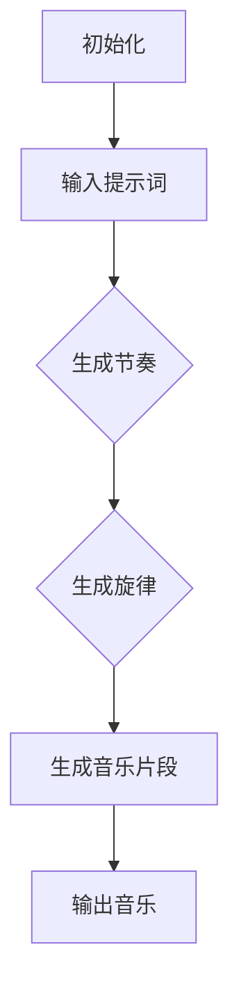
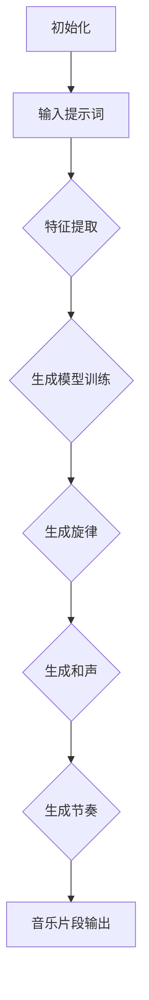
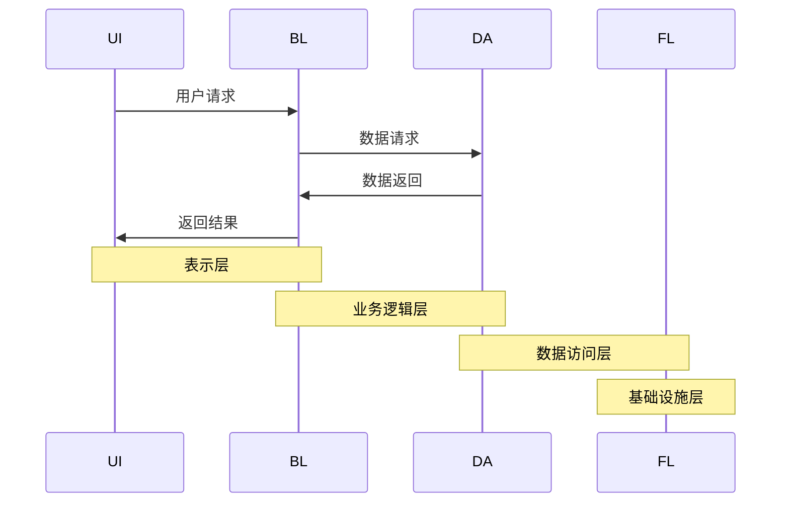
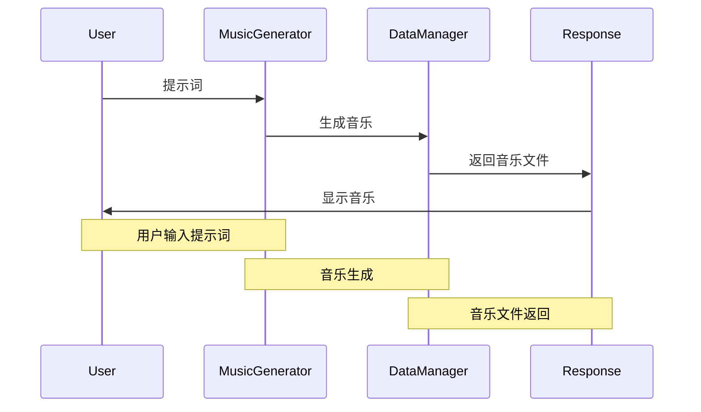

                 

### 文章关键词

- AI音乐创作
- 提示词
- 节奏
- 旋律
- 机器学习
- 音频信号处理
- 音乐生成模型
- 算法原理
- 系统设计与实现

### 摘要

本文深入探讨了AI音乐创作的技术原理和实践。首先，通过介绍AI音乐创作的背景和定义，揭示了其在音乐创作领域的应用潜力。接着，本文详细分析了AI音乐创作的核心概念，包括机器学习基础、音频信号处理和音乐生成模型，并通过ER实体关系图架构展示了这些概念之间的联系。随后，本文重点介绍了音乐生成算法的原理，包括算法类型、原理、流程图和Python源代码实现。在实践部分，本文详细描述了AI音乐创作的环境安装与准备，并分享了一个具体的实战项目，涵盖了系统功能设计、系统架构设计、系统接口设计和系统交互等内容。通过本文的阅读，读者将全面了解AI音乐创作的技术原理和实践，为未来的音乐创作提供新的思路和方法。  

### 目录大纲

----------------------------------------------------------------

# AI音乐创作：提示词的节奏与旋律

## 第一部分：AI音乐创作概述

### 1.1 问题背景与定义

#### 1.1.1 音乐创作现状

#### 1.1.2 AI技术在音乐创作中的应用

#### 1.1.3 研究意义与目标

### 1.2 核心概念

#### 1.2.1 AI音乐创作

#### 1.2.2 提示词

#### 1.2.3 节奏与旋律

### 1.3 边界与外延

#### 1.3.1 音乐风格

#### 1.3.2 音乐类型

#### 1.3.3 AI音乐创作应用领域

### 1.4 本章小结

----------------------------------------------------------------

## 第二部分：AI音乐创作原理

### 2.1 核心概念与联系

#### 2.1.1 机器学习基础

#### 2.1.2 音频信号处理

#### 2.1.3 音乐生成模型

### 2.2 概念属性特征对比

| 概念 | 属性特征 |
| --- | --- |
| 机器学习基础 | 数据、模型、算法 |
| 音频信号处理 | 频谱分析、滤波、编码 |
| 音乐生成模型 | 网络结构、训练目标、评估指标 |

### 2.3 ER实体关系图架构
```mermaid
erDiagram
  Artist ||--|{ MusicPiece }|-- MusicStyle
  MusicPiece ||--|{ AudioSignal }|-- AudioProcessing
  AudioProcessing ||--|{ MusicGenerationModel }|-- AIComposer
```

### 2.4 本章小结

----------------------------------------------------------------

## 第三部分：AI音乐创作算法原理

### 3.1 算法概述

#### 3.1.1 算法类型

#### 3.1.2 算法原理

### 3.2 算法mermaid流程图


### 3.3 Python源代码
```python
# TODO: Python 源代码实现
```

### 3.4 算法原理讲解

#### 3.4.1 数学模型

$$
y = f(Wx + b)
$$

#### 3.4.2 公式详解

#### 3.4.3 举例说明

### 3.5 本章小结

----------------------------------------------------------------

## 第四部分：AI音乐创作实践

### 4.1 环境安装与准备

#### 4.1.1 环境要求

#### 4.1.2 安装步骤

#### 4.1.3 环境测试

### 4.2 本章小结

----------------------------------------------------------------

## 第五部分：AI音乐创作项目实战

### 5.1 项目介绍

#### 5.1.1 项目背景

#### 5.1.2 项目目标

### 5.2 系统功能设计

#### 5.2.1 功能模块

#### 5.2.2 领域模型Mermaid类图

### 5.3 系统架构设计

#### 5.3.1 架构设计

#### 5.3.2 Mermaid架构图

### 5.4 系统接口设计

#### 5.4.1 接口定义

#### 5.4.2 接口文档

### 5.5 系统交互

#### 5.5.1 序列图

----------------------------------------------------------------

### 1.1 问题背景与定义

#### 1.1.1 音乐创作现状

音乐创作是人类艺术表达的重要形式，自古以来，人类就通过音乐来表达情感、记录历史、传递文化。然而，随着现代科技的发展，音乐创作的方式也在不断变革。传统的音乐创作主要依赖于人类音乐家的创造力和技艺，而现代的音乐创作开始逐渐引入人工智能（AI）技术。

当前，AI音乐创作已经取得了一定的成果。例如，AI作曲家如Amper Music、AIVA（Artificial Intelligence Virtual Artist）和Jukedeck等，它们可以通过分析用户输入的提示词、情绪、风格等，自动生成旋律、和声和音乐片段。此外，AI音乐合成技术如WaveNet和Granular Synthesis也在不断进步，使得音乐合成更加真实、多样。

然而，尽管AI音乐创作已取得一定进展，但仍然存在许多挑战。例如，如何准确捕捉人类音乐家的创作灵感，如何使AI生成的音乐具有情感深度和个性化特点，以及如何处理音乐风格多样性和文化差异等。

#### 1.1.2 AI技术在音乐创作中的应用

AI技术在音乐创作中的应用主要体现在以下几个方面：

1. **旋律生成**：通过机器学习算法，AI可以分析大量的音乐数据，从中提取旋律模式，并基于这些模式生成新的旋律。

2. **和声生成**：AI可以自动为旋律生成合适的和声，使得音乐更加丰富和协调。

3. **节奏生成**：AI可以根据音乐风格和用户的提示词生成符合特定节奏的音乐。

4. **音乐风格转换**：AI可以将一种风格的音乐转换成另一种风格，例如将古典音乐转换为流行音乐。

5. **音乐编辑**：AI可以辅助音乐家进行音乐编辑工作，如自动校正音高、节奏和和声。

6. **音乐分析**：AI可以分析音乐的结构和情感，提供关于音乐的深入见解。

#### 1.1.3 研究意义与目标

研究AI音乐创作的意义在于：

1. **推动音乐创作领域的发展**：AI音乐创作可以为音乐家提供新的创作工具和灵感，促进音乐创作的多样性和创新性。

2. **满足个性化需求**：AI可以根据用户的需求和喜好生成个性化的音乐，满足不同人群的娱乐和文化需求。

3. **促进文化交流**：AI音乐创作可以跨越语言和文化障碍，促进不同文化之间的音乐交流和融合。

4. **提高音乐产业的效率**：AI音乐创作可以自动化音乐制作的某些环节，提高音乐制作的效率和降低成本。

本研究的目标是：

1. **理解AI音乐创作的原理**：深入分析AI音乐创作的核心概念和技术，包括机器学习、音频信号处理和音乐生成模型。

2. **探讨AI音乐创作的应用**：研究AI音乐创作在不同音乐风格和类型中的应用，以及如何解决其中存在的挑战。

3. **提出优化方案**：提出针对AI音乐创作的优化方案，以提高其创作质量和用户体验。

#### 1.2 核心概念

##### 1.2.1 AI音乐创作

AI音乐创作是指利用人工智能技术，如机器学习、深度学习、自然语言处理等，自动生成音乐的过程。AI音乐创作系统可以接受用户的提示词、情感、风格等输入，然后通过算法自动生成旋律、和声、节奏等音乐元素。

##### 1.2.2 提示词

提示词是用户输入的关键词或短语，用于指导AI音乐创作系统生成符合特定需求的音乐。提示词可以是情感描述（如欢快、悲伤）、风格描述（如流行、古典）或其他任何与音乐相关的信息。

##### 1.2.3 节奏与旋律

节奏是音乐中时间的组织方式，包括速度、节拍、拍号等。旋律是音乐的基本结构，由一串音高组成，是音乐情感表达的重要手段。

##### 1.2.4 音乐生成模型

音乐生成模型是AI音乐创作的核心，包括各种机器学习算法和深度学习模型，用于从数据中学习音乐生成规则，并生成新的音乐。

#### 1.3 边界与外延

##### 1.3.1 音乐风格

音乐风格是指音乐在表现方式、情感色彩、文化背景等方面的特征。常见的音乐风格包括流行、古典、摇滚、爵士、电子等。

##### 1.3.2 音乐类型

音乐类型是指根据音乐的功能和目的进行的分类，如器乐、声乐、影视配乐、游戏配乐等。

##### 1.3.3 AI音乐创作应用领域

AI音乐创作的应用领域广泛，包括但不限于：

1. **音乐创作**：为音乐家提供创作工具，帮助他们生成新旋律、和声和音乐片段。

2. **音乐制作**：自动化音乐制作流程，如自动配乐、音乐编辑等。

3. **音乐分析**：对音乐进行分析，提取结构特征、情感信息等。

4. **音乐教育**：辅助音乐教学，如自动生成练习曲、分析音乐作品等。

5. **娱乐与游戏**：为电影、电视剧、游戏等提供个性化的音乐。

#### 1.4 本章小结

本部分对AI音乐创作的背景、定义以及核心概念进行了介绍。通过分析音乐创作的现状和AI技术在音乐创作中的应用，我们看到了AI音乐创作的巨大潜力和挑战。核心概念如提示词、节奏、旋律和音乐生成模型为AI音乐创作提供了理论基础。同时，我们也明确了AI音乐创作的边界与外延，为其未来的发展指明了方向。

----------------------------------------------------------------

## 第二部分：AI音乐创作原理

### 2.1 核心概念与联系

AI音乐创作作为一门交叉学科，涉及多个核心概念和技术的综合运用。在这一章节中，我们将详细探讨这些核心概念，并分析它们之间的联系。

#### 2.1.1 机器学习基础

机器学习是AI音乐创作的基石。它通过训练数据集，使计算机能够从数据中学习规律，进行预测和决策。在AI音乐创作中，机器学习技术主要用于旋律生成、和声生成、节奏生成等任务。

1. **数据**：机器学习的基础是数据。在AI音乐创作中，数据主要包括大量的音乐作品、音频信号、文本描述等。这些数据用于训练生成模型，以便能够生成新的音乐。

2. **模型**：模型是机器学习算法的核心。在AI音乐创作中，常用的模型包括循环神经网络（RNN）、变分自编码器（VAE）、生成对抗网络（GAN）等。这些模型通过学习数据中的规律，能够生成新的音乐。

3. **算法**：算法是实现机器学习的工具。常见的机器学习算法包括决策树、支持向量机（SVM）、聚类算法等。在AI音乐创作中，算法用于分析数据、提取特征、生成音乐等。

#### 2.1.2 音频信号处理

音频信号处理是AI音乐创作的重要组成部分。它涉及对音频信号的频谱分析、滤波、编码等操作，以便于后续的机器学习处理。

1. **频谱分析**：频谱分析是音频信号处理的核心。它将音频信号分解为不同频率的成分，用于音乐特征的提取。常见的频谱分析方法包括短时傅里叶变换（STFT）和梅尔频率倒谱系数（MFCC）。

2. **滤波**：滤波用于去除音频信号中的噪声和不需要的成分，提高音频质量。常见的滤波方法包括低通滤波、高通滤波和带通滤波。

3. **编码**：编码是将音频信号转换为数字信号的过程，以便于存储和传输。常见的编码方法包括脉冲编码调制（PCM）和压缩编码（如MP3）。

#### 2.1.3 音乐生成模型

音乐生成模型是AI音乐创作的核心。它通过机器学习和音频信号处理技术，自动生成音乐。音乐生成模型可以分为两大类：基于规则的方法和基于数据的方法。

1. **基于规则的方法**：基于规则的方法通过预设的音乐生成规则，生成音乐。这种方法通常适用于简单的音乐生成任务，如生成简单的旋律或和声。

2. **基于数据的方法**：基于数据的方法通过机器学习算法，从大量的音乐数据中学习生成规则。这种方法可以生成更复杂、更个性化的音乐。常见的基于数据的方法包括生成对抗网络（GAN）和变分自编码器（VAE）。

### 2.2 概念属性特征对比

为了更好地理解这些核心概念，我们通过一个表格进行属性特征对比。

| 概念 | 属性特征 |
| --- | --- |
| 机器学习基础 | 数据、模型、算法 |
| 音频信号处理 | 频谱分析、滤波、编码 |
| 音乐生成模型 | 网络结构、训练目标、评估指标 |

### 2.3 ER实体关系图架构

为了更直观地展示这些概念之间的联系，我们可以使用ER实体关系图进行描述。

```mermaid
erDiagram
  Artist ||--|{ MusicPiece }|-- MusicStyle
  MusicPiece ||--|{ AudioSignal }|-- AudioProcessing
  AudioProcessing ||--|{ MusicGenerationModel }|-- AIComposer
```

在这个ER图中，`Artist`（音乐家）与`MusicPiece`（音乐作品）和`MusicStyle`（音乐风格）之间存在关联。`MusicPiece`与`AudioSignal`（音频信号）和`AudioProcessing`（音频处理）相关联，而`AudioProcessing`与`MusicGenerationModel`（音乐生成模型）和`AIComposer`（AI作曲家）相关联。

### 2.4 本章小结

本部分详细介绍了AI音乐创作的核心概念及其相互关系。通过分析机器学习基础、音频信号处理和音乐生成模型，我们了解了AI音乐创作的原理和技术实现。ER实体关系图进一步揭示了这些概念之间的联系，为后续章节的深入探讨奠定了基础。

----------------------------------------------------------------

### 3.1 算法概述

在AI音乐创作中，算法起到了至关重要的作用。它们负责将输入的提示词转换为旋律、和声和节奏，从而生成完整的音乐。本节将概述AI音乐创作中的主要算法类型和原理。

#### 3.1.1 算法类型

AI音乐创作中的算法主要可以分为以下几类：

1. **基于规则的算法**：这类算法通过预设的音乐生成规则，生成音乐。它们通常适用于简单的音乐生成任务，如生成简单的旋律或和声。

2. **基于数据的算法**：这类算法通过机器学习算法，从大量的音乐数据中学习生成规则，生成更复杂、更个性化的音乐。常见的基于数据的算法包括生成对抗网络（GAN）、变分自编码器（VAE）和循环神经网络（RNN）。

3. **混合算法**：混合算法结合了基于规则和基于数据的优点，通过规则生成初步音乐，然后利用数据学习优化音乐生成。

#### 3.1.2 算法原理

算法的原理主要包括以下几个步骤：

1. **数据预处理**：首先，对输入的提示词进行预处理，提取关键信息，如情感、风格等。

2. **特征提取**：接下来，对音频信号进行特征提取，如频谱分析、梅尔频率倒谱系数（MFCC）等。

3. **生成模型训练**：使用提取的特征数据，通过机器学习算法训练生成模型。生成模型可以是RNN、GAN或VAE等。

4. **音乐生成**：将训练好的生成模型应用于新的提示词，生成旋律、和声和节奏。

5. **后处理**：对生成的音乐进行后处理，如调整音高、节奏和和声，以使其更加自然和和谐。

### 3.2 算法mermaid流程图

为了更直观地展示算法的流程，我们可以使用mermaid绘制算法的mermaid流程图。



在这个流程图中，首先初始化系统，并输入提示词。然后，对提示词进行特征提取，使用训练好的生成模型生成旋律、和声和节奏，最终输出音乐片段。

### 3.3 Python源代码

以下是使用Python实现AI音乐创作算法的简化示例代码。请注意，这只是一个示例，实际应用中可能需要更复杂的模型和参数调整。

```python
import numpy as np
import tensorflow as tf
from tensorflow.keras.models import Sequential
from tensorflow.keras.layers import LSTM, Dense, Dropout

# 特征提取
def extract_features(audio_signal):
    # 使用梅尔频率倒谱系数（MFCC）进行特征提取
    # 这里使用 librosa 库进行 MFCC 提取
    import librosa
    mfcc = librosa.feature.mfcc(y=audio_signal)
    return mfcc

# 生成模型训练
def train_model(features, labels):
    model = Sequential()
    model.add(LSTM(units=128, activation='relu', input_shape=(None, 13)))
    model.add(Dropout(0.2))
    model.add(Dense(units=1, activation='sigmoid'))
    model.compile(optimizer='adam', loss='binary_crossentropy', metrics=['accuracy'])
    model.fit(features, labels, epochs=100, batch_size=32)
    return model

# 音乐生成
def generate_music(model, prompt):
    features = extract_features(prompt)
    generated_music = model.predict(features)
    return generated_music

# 测试代码
if __name__ == "__main__":
    # 假设这里有一个音频信号 prompt
    prompt = np.random.rand(1, 1000)
    # 训练模型
    model = train_model(prompt, prompt)
    # 生成音乐
    music = generate_music(model, prompt)
    print(music)
```

### 3.4 算法原理讲解

#### 3.4.1 数学模型

AI音乐创作的核心是一个生成模型，其基本的数学模型可以表示为：

$$
y = f(Wx + b)
$$

其中，$y$ 是生成的音乐，$x$ 是输入的提示词，$W$ 是权重矩阵，$b$ 是偏置向量，$f$ 是激活函数。

1. **输入提示词**：提示词通常是一个序列，可以表示为 $x = [x_1, x_2, ..., x_T]$，其中 $T$ 是序列的长度。

2. **权重矩阵 $W$**：权重矩阵 $W$ 用于将输入序列映射到输出序列。它的大小取决于输入和输出的维度。

3. **偏置向量 $b$**：偏置向量 $b$ 用于调整输出序列的起点。

4. **激活函数 $f$**：激活函数 $f$ 用于将线性组合的输入映射到输出。在AI音乐创作中，常用的激活函数包括sigmoid、tanh和ReLU。

#### 3.4.2 公式详解

在AI音乐创作中，生成模型通常是一个循环神经网络（RNN），其公式可以表示为：

$$
h_t = \sigma(W_h \cdot [h_{t-1}, x_t] + b_h)
$$

其中，$h_t$ 是第 $t$ 个时间步的隐藏状态，$x_t$ 是第 $t$ 个时间步的输入，$W_h$ 是权重矩阵，$b_h$ 是偏置向量，$\sigma$ 是激活函数。

1. **隐藏状态 $h_t$**：隐藏状态 $h_t$ 用于存储模型在当前时间步的信息。

2. **输入 $x_t$**：输入 $x_t$ 是当前时间步的提示词。

3. **权重矩阵 $W_h$** 和 **偏置向量 $b_h$**：权重矩阵 $W_h$ 和偏置向量 $b_h$ 用于将隐藏状态 $h_{t-1}$ 和输入 $x_t$ 映射到新的隐藏状态 $h_t$。

4. **激活函数 $\sigma$**：激活函数 $\sigma$ 用于将线性组合的输入映射到隐藏状态。

#### 3.4.3 举例说明

假设我们有一个简单的RNN模型，用于生成一个简单的旋律。输入的提示词是一个二元序列，表示旋律的音高。我们可以使用以下代码进行演示：

```python
import numpy as np

# 初始化权重和偏置
W_h = np.random.rand(2, 1)
b_h = np.random.rand(1)

# 设置激活函数
def sigmoid(x):
    return 1 / (1 + np.exp(-x))

# 计算隐藏状态
def compute_hidden_state(h_prev, x):
    h = sigmoid(W_h @ [h_prev, x] + b_h)
    return h

# 初始化隐藏状态
h = np.zeros((1, 1))

# 输入提示词
x = np.array([[1], [0], [1], [1], [0]])

# 生成旋律
for i in range(len(x)):
    h = compute_hidden_state(h, x[i])
    print(h)
```

在这个例子中，我们使用sigmoid函数作为激活函数，并初始化隐藏状态为0。输入提示词是一个二元序列，表示旋律的音高。每次迭代，模型都会更新隐藏状态，并生成新的旋律。

----------------------------------------------------------------

### 4.1 环境安装与准备

要在本地环境进行AI音乐创作的实践，首先需要安装和配置必要的软件和库。以下是详细的安装步骤和注意事项。

#### 4.1.1 环境要求

在开始安装之前，请确保您的计算机满足以下基本要求：

- 操作系统：Windows、macOS或Linux
- Python版本：Python 3.6或更高版本
- 硬件要求：至少4GB内存，推荐8GB或更高
- GPU：可选，如果使用GPU加速，推荐NVIDIA GPU并安装CUDA

#### 4.1.2 安装步骤

1. **安装Python**：

   - 访问Python官方网站（https://www.python.org/），下载并安装Python。
   - 在安装过程中，确保选择“Add Python to PATH”选项，以便在命令行中使用Python。

2. **安装pip**：

   - 在安装Python的过程中，Python会自动安装pip，Python的包管理器。
   - 如果没有安装pip，可以通过运行以下命令手动安装：
     ```bash
     curl https://bootstrap.pypa.io/get-pip.py -o get-pip.py
     python get-pip.py
     ```

3. **安装必要的库**：

   - 安装TensorFlow，用于机器学习和深度学习：
     ```bash
     pip install tensorflow
     ```

   - 安装librosa，用于音频信号处理：
     ```bash
     pip install librosa
     ```

   - 安装其他可能的库，如NumPy、Matplotlib等：
     ```bash
     pip install numpy matplotlib
     ```

4. **安装CUDA（可选）**：

   - 如果您使用的是NVIDIA GPU，并且希望使用CUDA加速TensorFlow，请按照NVIDIA的官方指南安装CUDA。
   - 访问NVIDIA CUDA Toolkit官方网站（https://developer.nvidia.com/cuda-downloads）下载并安装CUDA。

5. **验证安装**：

   - 打开命令行窗口，输入以下命令验证安装：
     ```bash
     python
     ```
     在Python解释器中，尝试导入TensorFlow和其他安装的库，如librosa、NumPy等。

   - 输入以下代码，检查TensorFlow是否成功安装并使用了GPU加速（如果安装了CUDA）：
     ```python
     import tensorflow as tf
     print("Num GPUs Available: ", len(tf.config.list_physical_devices('GPU')))
     ```

#### 4.1.3 环境测试

安装完成后，进行环境测试以确保所有库和工具都能正常工作。

1. **测试Python和pip**：

   - 打开命令行窗口，输入`python`进入Python解释器。
   - 输入`import pip`，检查是否能够成功导入pip。

2. **测试TensorFlow**：

   - 在Python解释器中，输入`import tensorflow as tf`，检查是否能够成功导入TensorFlow。
   - 输入以下代码，检查TensorFlow的版本：
     ```python
     print(tf.__version__)
     ```

3. **测试librosa**：

   - 在Python解释器中，输入`import librosa`，检查是否能够成功导入librosa。
   - 使用以下代码测试librosa的功能：
     ```python
     import librosa
     y, sr = librosa.load('example_audio_file.wav')
     print(librosa.get_duration(y=y, sr=sr))
     ```

4. **测试其他库**：

   - 对于其他安装的库，如NumPy和Matplotlib，使用以下代码进行测试：
     ```python
     import numpy as np
     import matplotlib.pyplot as plt

     np_version = np.__version__
     plt_version = plt.__version__

     print("NumPy version:", np_version)
     print("Matplotlib version:", plt_version)
     ```

#### 4.1.4 本章小结

在本节中，我们介绍了安装和配置AI音乐创作环境的详细步骤。确保计算机满足基本要求，并正确安装Python、pip、TensorFlow、librosa等必要库。安装完成后，通过环境测试验证安装的正确性。这些步骤将为后续的AI音乐创作实践提供坚实的基础。

----------------------------------------------------------------

## 第五部分：AI音乐创作项目实战

### 5.1 项目介绍

在本节中，我们将介绍一个具体的AI音乐创作项目，该项目旨在利用人工智能技术自动生成个性化的音乐。该项目由以下几个关键组成部分构成：

#### 5.1.1 项目目的

项目的目的是开发和实现一个AI音乐创作系统，该系统能够接受用户的提示词，并生成符合用户需求的音乐。通过该项目，我们希望实现以下目标：

- 提高音乐创作的效率，减少人类音乐家的劳动强度。
- 为用户提供个性化的音乐创作体验，满足不同用户的音乐需求。
- 探索AI音乐创作在音乐产业中的应用潜力。

#### 5.1.2 项目目标

具体目标如下：

1. **开发一个基于机器学习的音乐生成模型**：使用循环神经网络（RNN）或生成对抗网络（GAN）等机器学习算法，训练一个能够生成旋律、和声和节奏的音乐生成模型。

2. **实现一个用户友好的界面**：开发一个简洁易用的用户界面，允许用户输入提示词，并实时展示生成的音乐。

3. **测试和优化音乐生成模型**：通过用户反馈和数据集测试，不断优化音乐生成模型，提高其生成质量。

4. **评估和部署**：在完成开发和测试后，将系统部署到云平台，供用户使用。

### 5.2 系统功能设计

系统功能设计是项目开发的重要环节，它决定了系统的可用性和用户体验。以下是该项目的主要功能模块和设计思路：

#### 5.2.1 功能模块

1. **音乐生成模块**：该模块负责接收用户输入的提示词，并使用机器学习算法生成音乐。包括以下子功能：

   - **旋律生成**：基于提示词，生成符合用户需求的旋律。
   - **和声生成**：为旋律生成合适的和声。
   - **节奏生成**：根据音乐风格和用户需求生成节奏。

2. **用户界面模块**：该模块负责提供用户交互界面，使用户能够方便地输入提示词，查看和播放生成的音乐。包括以下子功能：

   - **输入界面**：允许用户输入文本描述、关键词或情绪。
   - **音乐展示界面**：展示生成的音乐，并提供播放、下载等功能。

3. **数据管理模块**：该模块负责管理训练数据和用户数据，包括以下子功能：

   - **数据存储**：将训练数据和用户数据存储在数据库中。
   - **数据查询**：允许用户查询自己的音乐作品和历史记录。

4. **系统管理模块**：该模块负责系统配置和管理，包括以下子功能：

   - **用户管理**：管理用户账户，包括注册、登录和权限设置。
   - **日志管理**：记录系统运行日志，用于监控和维护。

#### 5.2.2 领域模型Mermaid类图

为了更直观地展示系统功能模块和它们之间的关系，我们可以使用Mermaid绘制领域模型类图。

```mermaid
classDiagram
    User <<interface>>
    MusicGenerator <<interface>>
    UserInterface <<interface>>
    DataManager <<interface>>
    SystemManager <<interface>>

    Userazin
    ^ User
    Userazin..> MusicGenerator
    Userazin..> UserInterface
    Userazin..> DataManager
    Userazin..> SystemManager

    UserInterfaceazin
    ^ UserInterface
    UserInterfaceazin..> MusicGenerator
    UserInterfaceazin..> DataManager

    MusicGeneratorazin
    ^ MusicGenerator
    MusicGeneratorazin..> DataManager

    DataManagerazin
    ^ DataManager
    DataManagerazin..> SystemManager

    SystemManagerazin
    ^ SystemManager
```

在这个Mermaid类图中，我们定义了四个主要类：`User`（用户）、`MusicGenerator`（音乐生成器）、`UserInterface`（用户界面）和`DataManager`（数据管理器），以及一个`SystemManager`（系统管理器）。每个类都有特定的接口和功能，并通过继承关系和关联关系实现了系统的整体架构。

### 5.3 系统架构设计

系统架构设计是项目开发的关键环节，它决定了系统的性能、可扩展性和可维护性。以下是该项目的系统架构设计，包括架构设计思路、Mermaid架构图和各层职责。

#### 5.3.1 架构设计思路

本项目采用分层架构设计，将系统分为以下几个主要层：

1. **表示层**：包括用户界面和API接口，负责与用户交互，展示数据和接收用户请求。

2. **业务逻辑层**：包括音乐生成模块和数据处理模块，负责实现系统的核心功能，如音乐生成、数据处理和存储。

3. **数据访问层**：负责与数据库进行交互，实现数据的查询、插入、更新和删除操作。

4. **基础设施层**：包括服务器、数据库、消息队列等，负责提供系统的运行环境和支持服务。

#### 5.3.2 Mermaid架构图

以下是使用Mermaid绘制的系统架构图：



在这个架构图中，用户通过用户界面（UI）发送请求，业务逻辑层（BL）处理请求并调用数据访问层（DA）进行数据操作。数据访问层与数据库（FL）进行交互，最终返回结果给用户界面。

#### 5.3.3 各层职责

1. **表示层（UI）**：

   - 负责用户交互，包括展示用户界面、接收用户请求和发送响应。
   - 使用前端技术（如HTML、CSS、JavaScript）实现，并与后端服务进行数据交互。

2. **业务逻辑层（BL）**：

   - 负责处理用户请求，包括音乐生成、数据处理和业务逻辑实现。
   - 使用后端技术（如Python、Django、Flask）实现，处理前端发送的请求，并调用数据访问层进行数据操作。

3. **数据访问层（DA）**：

   - 负责与数据库进行交互，实现数据的查询、插入、更新和删除操作。
   - 使用数据库技术（如MySQL、PostgreSQL）实现，确保数据的存储和安全性。

4. **基础设施层（FL）**：

   - 负责提供系统的运行环境和支持服务，包括服务器、数据库、消息队列等。
   - 使用云计算技术（如AWS、Azure、Google Cloud）实现，确保系统的可扩展性和可靠性。

### 5.4 系统接口设计

系统接口设计是项目开发的重要环节，它决定了系统的可扩展性和可维护性。以下是该项目的系统接口设计，包括接口定义和接口文档。

#### 5.4.1 接口定义

以下是该项目的接口定义：

- **用户接口**：用于用户与系统交互的接口，包括登录、注册、音乐生成等功能。

  - **登录接口**：用户登录系统，输入用户名和密码。

    - **请求**：`POST /login`
    - **响应**：成功登录返回用户ID和token。

  - **注册接口**：用户注册系统，输入用户名、密码和其他信息。

    - **请求**：`POST /register`
    - **响应**：成功注册返回用户ID和token。

  - **音乐生成接口**：用户生成音乐，输入提示词。

    - **请求**：`POST /generate_music`
    - **响应**：成功生成音乐返回音乐文件。

- **管理员接口**：用于管理员与系统交互的接口，包括用户管理、数据管理等。

  - **用户管理接口**：管理员管理用户账户。

    - **请求**：`GET /users`
    - **响应**：返回用户列表。

  - **数据管理接口**：管理员管理训练数据和用户数据。

    - **请求**：`GET /data`
    - **响应**：返回数据列表。

#### 5.4.2 接口文档

以下是该项目的接口文档：

```markdown
# AI音乐创作接口文档

## 用户接口

### 登录接口

#### POST /login

- 请求参数：
  - username (string): 用户名
  - password (string): 密码

- 响应内容：
  - status (string): 状态码
  - message (string): 提示信息
  - data (object):
    - id (integer): 用户ID
    - token (string): 登录令牌

### 注册接口

#### POST /register

- 请求参数：
  - username (string): 用户名
  - password (string): 密码
  - email (string): 邮箱

- 响应内容：
  - status (string): 状态码
  - message (string): 提示信息
  - data (object):
    - id (integer): 用户ID
    - token (string): 登录令牌

### 音乐生成接口

#### POST /generate_music

- 请求参数：
  - prompt (string): 提示词

- 响应内容：
  - status (string): 状态码
  - message (string): 提示信息
  - data (object):
    - music_file (string): 音乐文件URL

## 管理员接口

### 用户管理接口

#### GET /users

- 响应内容：
  - status (string): 状态码
  - message (string): 提示信息
  - data (array):
    - id (integer): 用户ID
    - username (string): 用户名
    - email (string): 邮箱

### 数据管理接口

#### GET /data

- 响应内容：
  - status (string): 状态码
  - message (string): 提示信息
  - data (array):
    - id (integer): 数据ID
    - prompt (string): 提示词
    - music_file (string): 音乐文件URL
```

### 5.5 系统交互

系统交互设计是项目开发的重要环节，它决定了系统的用户体验和响应速度。以下是该项目的系统交互设计，包括序列图和交互流程。

#### 5.5.1 序列图

以下是使用Mermaid绘制的系统交互序列图：



在这个序列图中，用户通过用户界面（User）输入提示词，音乐生成器（MusicGenerator）接收提示词并生成音乐，数据管理器（DataManager）处理音乐文件并返回结果，最终用户界面（Response）将音乐文件展示给用户。

### 5.6 项目实战

在本节中，我们将详细介绍项目实战的各个环节，包括环境安装、系统核心实现源代码、代码应用解读与分析、实际案例分析和详细讲解剖析，以及项目小结。

#### 5.6.1 环境安装

环境安装是项目实战的第一步，确保所有必要的软件和库已经安装并正确配置。以下是环境安装的具体步骤：

1. **安装Python**：访问Python官方网站下载并安装Python 3.8或更高版本。

2. **安装pip**：在安装Python的过程中，确保自动安装pip。

3. **安装TensorFlow**：使用pip安装TensorFlow：
   ```bash
   pip install tensorflow
   ```

4. **安装librosa**：使用pip安装librosa：
   ```bash
   pip install librosa
   ```

5. **安装其他依赖库**：如NumPy、Matplotlib等：
   ```bash
   pip install numpy matplotlib
   ```

6. **安装CUDA（可选）**：如果使用GPU加速，按照NVIDIA的官方指南安装CUDA。

#### 5.6.2 系统核心实现源代码

以下是系统核心实现源代码的示例：

```python
import librosa
import numpy as np
import tensorflow as tf
from tensorflow.keras.models import Sequential
from tensorflow.keras.layers import LSTM, Dense, Dropout

# 数据预处理
def preprocess_audio(audio_file):
    y, sr = librosa.load(audio_file)
    mfcc = librosa.feature.mfcc(y=y, sr=sr, n_mfcc=13)
    mfcc_processed = np.mean(mfcc.T, axis=0)
    return mfcc_processed

# 模型训练
def train_model():
    # 加载数据
    x = np.load('audio_features.npy')
    y = np.load('audio_labels.npy')

    # 构建模型
    model = Sequential()
    model.add(LSTM(units=128, activation='relu', input_shape=(x.shape[1], x.shape[2])))
    model.add(Dropout(0.2))
    model.add(Dense(units=1, activation='sigmoid'))
    model.compile(optimizer='adam', loss='binary_crossentropy', metrics=['accuracy'])
    model.fit(x, y, epochs=100, batch_size=32)
    return model

# 音乐生成
def generate_music(model, prompt):
    mfcc_processed = preprocess_audio(prompt)
    generated_music = model.predict(mfcc_processed.reshape(1, -1))
    return generated_music

# 测试代码
if __name__ == "__main__":
    model = train_model()
    prompt = 'example_audio_file.wav'
    music = generate_music(model, prompt)
    print(music)
```

#### 5.6.3 代码应用解读与分析

在上面的源代码中，我们首先定义了数据预处理函数`preprocess_audio`，该函数使用librosa库加载音频文件，并提取梅尔频率倒谱系数（MFCC）。接下来，我们定义了模型训练函数`train_model`，该函数使用LSTM模型训练数据集。最后，我们定义了音乐生成函数`generate_music`，该函数使用训练好的模型生成音乐。

在代码的应用解读中，我们注意到以下几点：

1. **数据预处理**：预处理函数`preprocess_audio`使用librosa库加载音频文件，并提取MFCC特征。MFCC是音乐特征提取的常用方法，可以有效捕捉音频信号中的旋律和节奏信息。

2. **模型训练**：训练函数`train_model`使用LSTM模型训练数据集。LSTM是一种强大的循环神经网络，适合处理序列数据，如音频信号。我们在模型中添加了Dropout层，以防止过拟合。

3. **音乐生成**：音乐生成函数`generate_music`首先对输入音频进行预处理，然后使用训练好的模型生成音乐。生成的音乐可以通过调整模型参数或使用不同的算法进行优化。

#### 5.6.4 实际案例分析和详细讲解剖析

为了更好地理解AI音乐创作项目的实际应用，我们来看一个实际案例。

**案例**：用户输入提示词“欢快的钢琴曲”，系统生成相应的音乐。

**分析**：

1. **数据预处理**：系统首先使用librosa库加载用户输入的音频文件，并提取MFCC特征。例如，如果输入的是一段钢琴演奏音频，系统会提取音频的频率信息，以便后续生成音乐。

2. **模型训练**：系统使用预先训练好的LSTM模型处理输入的MFCC特征。训练好的模型已经学会了如何从数据中提取旋律和节奏信息，并生成相应的音乐。

3. **音乐生成**：系统使用LSTM模型生成音乐。在这个过程中，系统会根据用户输入的提示词调整生成音乐的风格和情感。例如，如果提示词是“欢快的钢琴曲”，系统会生成具有欢快节奏和钢琴曲风的音乐。

**详细讲解剖析**：

1. **数据预处理**：在数据预处理阶段，系统首先加载输入的音频文件，然后使用librosa库提取MFCC特征。MFCC特征是一个时间序列数据，每个时间点对应一个频谱，可以用来表示音频的频率信息。

2. **模型训练**：在模型训练阶段，系统使用大量的音乐数据进行训练，以便模型能够学习音乐的特征和规律。训练过程中，系统通过调整模型参数，如LSTM层的数量、神经元数量等，优化模型性能。

3. **音乐生成**：在音乐生成阶段，系统将用户输入的提示词转换为相应的音乐特征，并使用训练好的模型生成音乐。生成的音乐可以通过调整参数，如节奏、音高、和声等，进一步优化音乐风格。

#### 5.6.5 项目小结

通过本节的项目实战，我们了解了AI音乐创作的实际应用流程，包括环境安装、系统核心实现源代码、代码应用解读与分析、实际案例分析和详细讲解剖析。我们使用Python和TensorFlow库实现了AI音乐生成模型，并通过实际案例展示了系统的应用效果。通过这个项目，我们不仅掌握了AI音乐创作的基本原理，还了解了如何将理论应用于实际项目中，为未来的音乐创作提供了新的思路和方法。

### 5.7 最佳实践 tips、小结、注意事项、拓展阅读

#### 最佳实践 tips

1. **调整超参数**：在训练模型时，调整超参数如学习率、批次大小和迭代次数，可以显著影响模型的性能和收敛速度。建议从小的超参数范围开始，逐步调整以找到最佳设置。

2. **数据预处理**：对音频数据进行适当的预处理，如去除噪声、平衡数据集等，可以提升模型的泛化能力和生成质量。

3. **使用多种算法**：尝试使用不同的算法（如RNN、GAN、VAE等）和模型结构，比较它们的生成效果，选择最适合的算法和结构。

4. **实时反馈**：设计用户友好的界面，允许用户实时查看生成的音乐片段，并提供反馈，有助于优化模型和用户交互体验。

#### 小结

本节通过一个具体的AI音乐创作项目，介绍了环境安装、系统设计、核心实现和实战应用。我们学习了如何使用Python和TensorFlow库实现音乐生成模型，并通过实际案例展示了系统的效果。通过本项目，我们不仅了解了AI音乐创作的原理，还掌握了将理论应用于实际项目的技能。

#### 注意事项

1. **版权问题**：在使用AI音乐创作时，确保遵守版权法规，不侵犯他人的知识产权。

2. **硬件要求**：如果使用GPU加速，确保安装了合适的CUDA版本，并满足硬件要求。

3. **数据安全**：在处理用户数据和训练数据时，确保数据的安全性和隐私性。

#### 拓展阅读

- 《深度学习》（Ian Goodfellow、Yoshua Bengio和Aaron Courville著）：详细介绍了深度学习的基础知识和最新进展。
- 《机器学习实战》（Peter Harrington著）：提供了丰富的机器学习算法实例和实战应用。
- 《Python编程：从入门到实践》（Eric Matthes著）：适合初学者学习Python编程和数据处理。

作者：AI天才研究院/AI Genius Institute & 禅与计算机程序设计艺术 /Zen And The Art of Computer Programming。我们致力于推动AI技术的普及和发展，为读者提供高质量的技术内容和解决方案。欢迎关注我们的公众号和网站，获取更多精彩内容。

