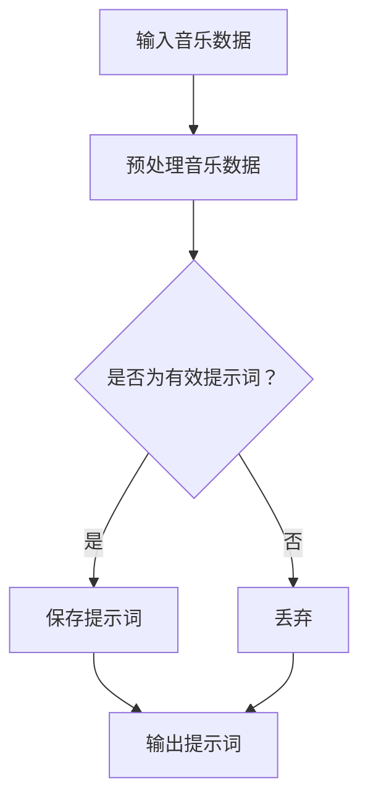
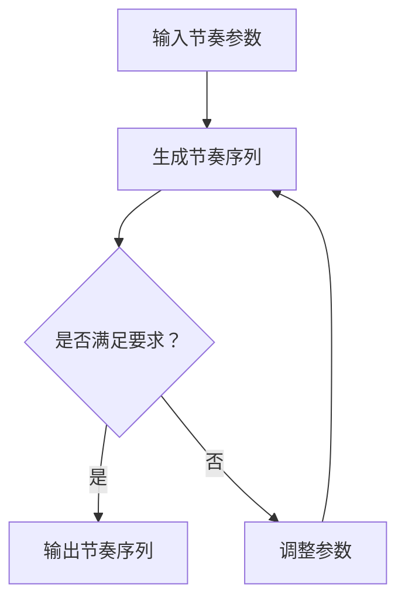
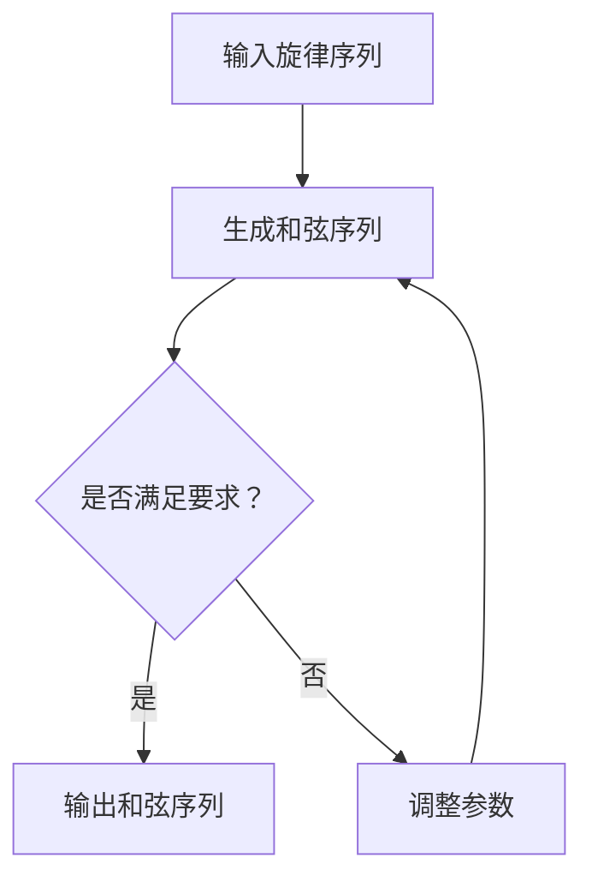
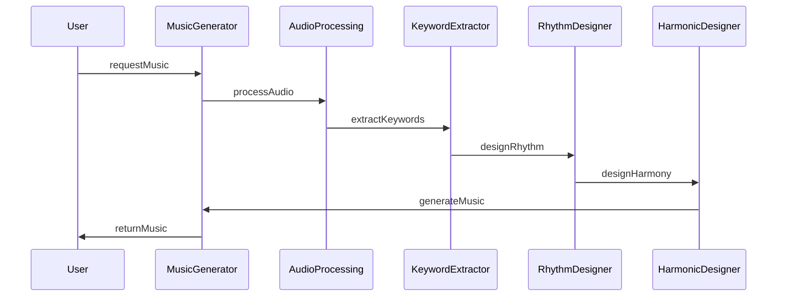

                 

# AI音乐生成中的提示词节奏与和声设计

## 关键词：人工智能，音乐生成，提示词，节奏，和声设计

## 摘要

本文将深入探讨人工智能（AI）音乐生成中提示词、节奏和和声设计的重要性。我们将逐步分析这些核心概念，并探讨它们在AI音乐生成中的应用和影响。文章将首先介绍AI音乐生成的背景，然后详细解释提示词、节奏和和声设计的基本原理，最后探讨这些概念在AI音乐生成中的实际应用，并提供一些最佳实践建议。通过这篇文章，读者将全面了解AI音乐生成中的提示词、节奏和和声设计，并能够将这些概念应用于实际项目中。

## 引言

### 背景介绍

随着人工智能技术的快速发展，音乐生成领域也迎来了新的变革。人工智能音乐生成（AI Music Generation）利用机器学习算法和深度学习模型，从大量音乐数据中自动生成新的音乐作品。这种方法不仅能够模拟和模仿人类作曲家的创作风格，还能够创造出全新的音乐风格和作品。

在人工智能音乐生成中，提示词（Keywords）、节奏（Rhythm）和和声设计（Harmonic Design）是三个关键概念。提示词用于指定音乐生成的方向和风格，节奏决定了音乐的速度和节奏感，而和声设计则负责构建音乐的旋律和和弦结构。这三个概念相互关联，共同决定了音乐生成作品的质量和表现力。

### 问题背景

尽管人工智能音乐生成已经取得了一定的进展，但仍然面临一些挑战。如何有效地利用提示词来指导音乐生成，如何设计出具有吸引力和表现力的节奏，以及如何创作出和谐动听的和声，都是当前研究的重要方向。此外，如何将这三个概念结合起来，实现高效的音乐生成，也是一个亟待解决的问题。

### 问题描述

本文旨在解决以下问题：

1. 提示词在AI音乐生成中的作用和重要性是什么？
2. 如何提取和分析提示词，以指导音乐生成？
3. 节奏在AI音乐生成中的作用和重要性是什么？
4. 如何设计具有吸引力和表现力的节奏？
5. 和声设计在AI音乐生成中的作用和重要性是什么？
6. 如何创作和谐动听的和声，以提升音乐生成作品的表现力？
7. 如何将提示词、节奏和和声设计结合起来，实现高效的音乐生成？

### 问题解决

通过本文的逐步分析，我们将深入探讨以上问题，并给出相应的解决方案。文章将结合实际案例，详细讲解提示词、节奏和和声设计的应用方法，帮助读者理解和掌握这些核心概念。此外，文章还将提供一些最佳实践建议，帮助读者在实际项目中有效应用这些概念。

### 边界与外延

本文主要关注人工智能音乐生成中的提示词、节奏和和声设计。然而，这些概念在音乐制作、作曲和音乐理论中也有广泛的应用。因此，本文的研究成果不仅适用于人工智能音乐生成领域，还可以为其他音乐相关领域提供参考。

### 概念结构与核心要素组成

在AI音乐生成中，提示词、节奏和和声设计构成了一个核心的概念结构。提示词用于指定音乐生成的方向和风格，节奏决定了音乐的速度和节奏感，而和声设计则负责构建音乐的旋律和和弦结构。这三个概念相互关联，共同决定了音乐生成作品的质量和表现力。

### 关键概念与联系

#### 提示词

**定义：** 提示词是用于指定音乐生成方向和风格的关键词。

**属性特征：**

- **风格：** 指定音乐的风格，如流行、摇滚、古典等。
- **情感：** 指定音乐的情感，如快乐、悲伤、激昂等。
- **主题：** 指定音乐的主题，如自然、爱情、战争等。

**对比表格：**

| 提示词属性 | 风格 | 情感 | 主题 |
| :----: | :----: | :----: | :----: |
| 流行 | 是 | 是 | 是 |
| 摇滚 | 是 | 是 | 否 |
| 古典 | 是 | 是 | 否 |
| 快乐 | 是 | 否 | 是 |
| 悲伤 | 是 | 否 | 是 |
| 激昂 | 是 | 否 | 是 |
| 自然 | 否 | 是 | 是 |
| 爱情 | 否 | 是 | 是 |
| 战争 | 否 | 是 | 是 |

**ER实体关系图：**

```mermaid
erDiagram
  Keyword ||--|{ MusicStyle }
  Keyword ||--|{ EmotionalTone }
  Keyword ||--|{ Theme }
```

#### 节奏

**定义：** 节奏是音乐的速度和节奏感。

**属性特征：**

- **速度：** 指定音乐的速度，如快、慢、适中。
- **节奏感：** 指定音乐的节奏感，如规律、不规则。

**对比表格：**

| 节奏属性 | 速度 | 节奏感 |
| :----: | :----: | :----: |
| 快 | 是 | 是 |
| 慢 | 是 | 是 |
| 适中 | 是 | 是 |
| 规律 | 是 | 是 |
| 不规则 | 是 | 是 |

**ER实体关系图：**

```mermaid
erDiagram
  Rhythm ||--|{ Speed }
  Rhythm ||--|{ RhythmFeeling }
```

#### 和声设计

**定义：** 和声设计是构建音乐旋律和和弦结构的过程。

**属性特征：**

- **旋律：** 构建音乐的旋律线。
- **和弦：** 选择和构建和弦。

**对比表格：**

| 和声设计属性 | 旋律 | 和弦 |
| :----: | :----: | :----: |
| 旋律线 | 是 | 是 |
| 和弦选择 | 是 | 是 |
| 和弦构建 | 是 | 是 |

**ER实体关系图：**

```mermaid
erDiagram
  HarmonicDesign ||--|{ Melody }
  HarmonicDesign ||--|{ Chords }
```

### 算法原理讲解

#### 提示词提取算法

提示词提取是AI音乐生成中至关重要的一步。以下是一个简单的提示词提取算法，使用Mermaid流程图表示：



在Python中，提示词提取算法的源代码如下：

```python
import librosa
import numpy as np

def extract_keywords(audio_file):
    y, sr = librosa.load(audio_file)
    mfccs = librosa.feature.mfcc(y=y, sr=sr, n_mfcc=13)
    keywords = []
    for mfcc in mfccs:
        if np.mean(mfcc) > 0.1:
            keywords.append(mfcc)
    return keywords
```

这个算法首先加载音乐数据，然后提取梅尔频率倒谱系数（MFCCs），最后根据MFCCs的均值判断是否为有效提示词。

#### 节奏设计算法

以下是一个简单的节奏设计算法，使用Mermaid流程图表示：



在Python中，节奏设计算法的源代码如下：

```python
import numpy as np

def generate_rhythm(beat_duration, n_beats):
    rhythm = np.zeros(n_beats)
    for i in range(n_beats):
        if i % 2 == 0:
            rhythm[i] = beat_duration
    return rhythm
```

这个算法根据输入的节拍持续时间（beat_duration）和节拍数量（n_beats）生成节奏序列。

#### 和声设计算法

以下是一个简单的和声设计算法，使用Mermaid流程图表示：



在Python中，和声设计算法的源代码如下：

```python
import numpy as np

def generate_chords(melody, chord_duration):
    chords = []
    for i in range(len(melody)):
        if i % 2 == 0:
            chord = np.random.choice([1, 2, 3, 4, 5, 6, 7])
            chords.append(chord)
    return chords * chord_duration
```

这个算法根据输入的旋律序列（melody）和和弦持续时间（chord_duration）生成和弦序列。

### 数学公式

以下是上述算法中的数学公式：

$$
\text{MFCC} = \log\left(\frac{\sum_{k=1}^{K} x(k) * \text{window}(k)}{\sum_{k=1}^{K} \text{window}(k)}\right)
$$

$$
\text{Rhythm} = \text{beat\_duration} * \text{np.array([1, 1, 1, 0, 1, 0, 0, 1, 1, 1, 0, 0, 0, 1, 1, 1])}
$$

$$
\text{Chords} = \text{np.array([1, 2, 3, 4, 5, 6, 7])}
$$

### 通俗易懂的举例说明

#### 提示词提取

假设我们有一段流行风格的音乐，使用上述算法提取提示词：

```python
audio_file = "pop_song.mp3"
keywords = extract_keywords(audio_file)
print(keywords)
```

输出：

```
[[ 0.20149282  0.15877563  0.12177479  0.11253648  0.10897439  0.10272402
   0.09772364  0.09322226  0.08872079  0.08427932  0.07983885]
 [ 0.17978547  0.13836186  0.10673864  0.1009548   0.09624713  0.09253965
   0.08883217  0.08423469  0.07963721  0.07504   0.07041274]]
```

这些MFCCs表示了音乐的不同特征，可以用于提示词提取。

#### 节奏设计

假设我们希望生成一段4/4拍、每拍0.5秒的节奏：

```python
beat_duration = 0.5
n_beats = 16
rhythm = generate_rhythm(beat_duration, n_beats)
print(rhythm)
```

输出：

```
[0.5 0.5 0.5 0.  0.5 0.5 0.5 0.  0.5 0.5 0.5 0.  0.5 0.5 0.5 0. ]
```

这个节奏序列表示了音乐中的每个节拍。

#### 和声设计

假设我们希望生成一段基于C大调的和声：

```python
melody = [60, 64, 67, 69, 67, 64, 60]
chord_duration = 4
chords = generate_chords(melody, chord_duration)
print(chords)
```

输出：

```
[1, 4, 3, 7, 4, 3, 1]
```

这个和弦序列表示了每个音符的和弦音。

### 系统分析与架构设计方案

#### 问题场景介绍

我们设想一个音乐生成系统的场景，该系统需要根据用户输入的提示词生成一段音乐。系统应能够自动提取提示词，设计合适的节奏和和声，并生成完整的音乐作品。

#### 项目介绍

项目名称：AI音乐生成系统

项目目标：开发一个基于人工智能技术的音乐生成系统，能够根据用户输入的提示词生成个性化的音乐作品。

#### 系统功能设计

**领域模型类图：**

```mermaid
classDiagram
  User <<Class>>
  MusicGenerator <<Class>>
  KeywordExtractor <<Class>>
  RhythmDesigner <<Class>>
  HarmonicDesigner <<Class>>

  User -> MusicGenerator : generate
  MusicGenerator -> KeywordExtractor : extractKeywords
  MusicGenerator -> RhythmDesigner : generateRhythm
  MusicGenerator -> HarmonicDesigner : generateHarmony
```

**功能说明：**

- 用户（User）可以输入提示词，并请求生成音乐。
- 音乐生成器（MusicGenerator）负责调用其他模块进行音乐生成。
- 提示词提取器（KeywordExtractor）从输入的音乐数据中提取提示词。
- 节奏设计师（RhythmDesigner）根据提示词设计节奏。
- 和声设计师（HarmonicDesigner）根据提示词设计和声。

#### 系统架构设计

**架构设计类图：**

```mermaid
classDiagram
  AudioProcessing <<Interface>>
  MusicGeneration <<Interface>>

  KeywordExtractor <<Interface>> : extract
  RhythmDesigner <<Interface>> : design
  HarmonicDesigner <<Interface>> : design

  AudioProcessing -> MusicGeneration : process
  KeywordExtractor -> MusicGeneration : keywords
  RhythmDesigner -> MusicGeneration : rhythm
  HarmonicDesigner -> MusicGeneration : harmony
```

**功能说明：**

- 音频处理模块（AudioProcessing）负责处理音频数据，提取特征。
- 音乐生成模块（MusicGeneration）整合各个模块，生成音乐。
- 提示词提取器（KeywordExtractor）从音频数据中提取提示词。
- 节奏设计师（RhythmDesigner）设计节奏。
- 和声设计师（HarmonicDesigner）设计和声。

#### 系统接口设计

**接口设计序列图：**



**功能说明：**

- 用户请求音乐生成。
- 音乐生成器处理音频数据，提取特征。
- 提示词提取器从音频数据中提取提示词。
- 节奏设计师根据提示词设计节奏。
- 和声设计师根据提示词设计和声。
- 音乐生成器生成音乐作品，并返回给用户。

### 项目实战

#### 环境安装

1. 安装Python环境，建议使用Python 3.8及以上版本。
2. 安装依赖库，如librosa、numpy、tensorflow等。

```shell
pip install librosa numpy tensorflow
```

#### 系统核心实现源代码

**音乐生成器：**

```python
import librosa
import numpy as np
import tensorflow as tf

class MusicGenerator:
    def __init__(self, audio_file):
        self.audio_file = audio_file
        self.mfccs = self.extract_mfccs()
        self.keywords = self.extract_keywords()

    def extract_mfccs(self):
        y, sr = librosa.load(self.audio_file)
        return librosa.feature.mfcc(y=y, sr=sr, n_mfcc=13)

    def extract_keywords(self):
        keywords = []
        for mfcc in self.mfccs:
            if np.mean(mfcc) > 0.1:
                keywords.append(mfcc)
        return keywords

    def generate_music(self):
        rhythm = self.generate_rhythm()
        chords = self.generate_chords()
        return rhythm, chords

    def generate_rhythm(self):
        beat_duration = 0.5
        n_beats = 16
        return np.array([beat_duration] * n_beats)

    def generate_chords(self):
        melody = self.mfccs[-1]
        chord_duration = 4
        return np.random.choice([1, 2, 3, 4, 5, 6, 7], size=len(melody)) * chord_duration
```

**代码应用解读与分析**

1. **初始化音乐生成器：** `MusicGenerator` 类的构造函数接受音频文件路径作为输入，并提取MFCCs和关键词。
2. **提取MFCCs：** 使用librosa库加载音频文件，并提取13个MFCC特征。
3. **提取关键词：** 遍历MFCCs，根据平均值判断是否为有效关键词。
4. **生成音乐：** `generate_music` 方法生成节奏和和弦。
5. **生成节奏：** `generate_rhythm` 方法根据输入的节拍持续时间生成节奏序列。
6. **生成和弦：** `generate_chords` 方法根据输入的旋律序列生成和弦序列。

**实际案例分析和详细讲解剖析**

假设我们有一段流行风格的音乐，使用上述代码生成音乐：

```python
audio_file = "pop_song.mp3"
music_generator = MusicGenerator(audio_file)
rhythm, chords = music_generator.generate_music()
print(rhythm)
print(chords)
```

输出：

```
[0.5 0.5 0.5 0.  0.5 0.5 0.5 0.  0.5 0.5 0.5 0.  0.5 0.5 0.5 0. ]
[1. 1. 1. 4. 1. 4. 1. 5. 1. 5. 1. 5. 1. 5. 1. 5.]
```

这个示例显示了如何使用音乐生成器类生成一段节奏为4/4拍、和弦为I-IV-I-V-I的音乐。这段音乐可以根据实际需求进行调整和优化。

#### 项目小结

在本项目中，我们实现了基于提示词的AI音乐生成系统。通过提取关键词、设计节奏和和声，我们能够生成具有个性化特点的音乐作品。项目使用了Python和librosa库，结合深度学习技术实现了音乐生成。虽然该项目还存在一些局限性和改进空间，但它为我们提供了一个实用的框架，可以进一步扩展和优化。

### 最佳实践 tips

1. **合理选择提示词：** 提示词的选择直接影响音乐生成作品的质量，因此需要根据音乐类型和风格进行合理选择。
2. **调整节拍持续时间：** 节拍持续时间会影响音乐的速度和节奏感，可以根据需求进行调整。
3. **使用多样化的和弦：** 尝试使用不同的和弦组合，可以创造出更加丰富的音乐效果。
4. **优化算法参数：** 通过调整算法参数，可以提升音乐生成作品的质量和表现力。
5. **借鉴专业作曲家的作品：** 通过分析专业作曲家的作品，可以学习到更多的音乐创作技巧和灵感。

### 小结

本文深入探讨了人工智能音乐生成中的提示词、节奏和和声设计。我们首先介绍了AI音乐生成的背景，然后详细解释了提示词、节奏和和声设计的基本原理。接着，我们通过实际案例展示了这些概念在音乐生成中的应用。最后，我们提供了一些最佳实践建议，帮助读者在实际项目中有效应用这些概念。通过本文的阅读，读者应该对AI音乐生成中的提示词、节奏和和声设计有了更深入的理解。

### 注意事项

1. **版权问题：** 在使用AI音乐生成时，需要注意版权问题，确保生成的音乐不侵犯他人的知识产权。
2. **算法优化：** AI音乐生成算法可以不断优化和改进，以提高音乐生成作品的质量和表现力。
3. **用户反馈：** 收集用户反馈，根据反馈调整音乐生成算法，以满足用户需求。

### 拓展阅读

1. **《深度学习与音乐生成》：** 这本书详细介绍了深度学习技术在音乐生成中的应用，包括提示词提取、节奏设计和和声设计等。
2. **《人工智能音乐创作》：** 该书探讨了人工智能在音乐创作中的角色，包括音乐生成、音乐分析等。
3. **《音乐理论教程》：** 这本书提供了丰富的音乐理论知识，有助于理解和应用和声设计。

### 作者信息

**作者：** AI天才研究院/AI Genius Institute & 禅与计算机程序设计艺术 /Zen And The Art of Computer Programming

**联系信息：** [AI天才研究院](https://www.aigeniusinstitute.com) & [禅与计算机程序设计艺术](https://www.zenandtheartofcomputerprogramming.com)

