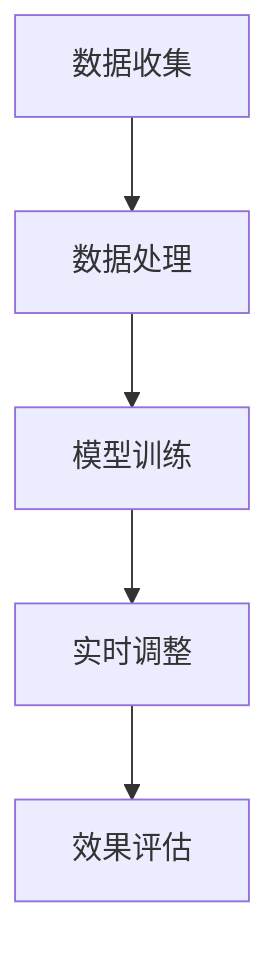
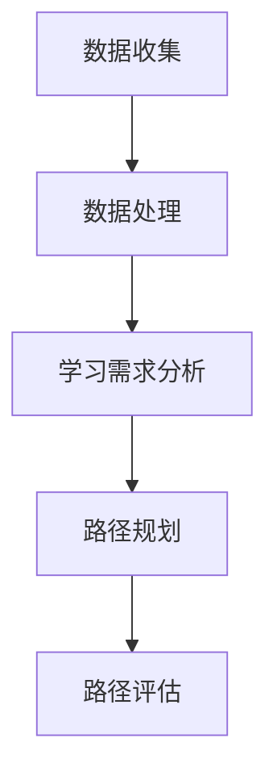
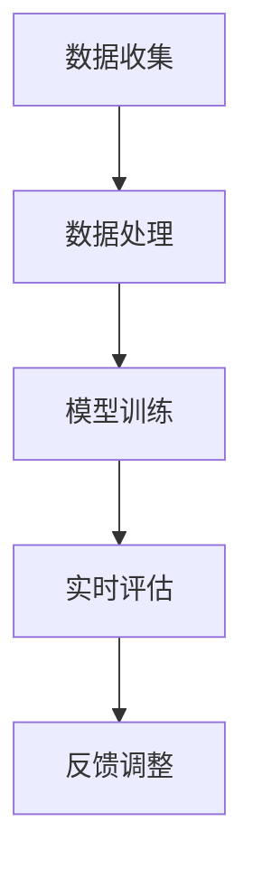
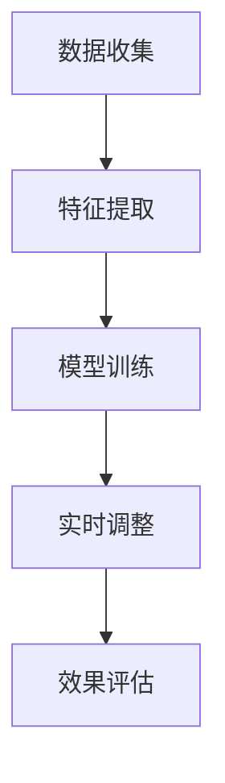
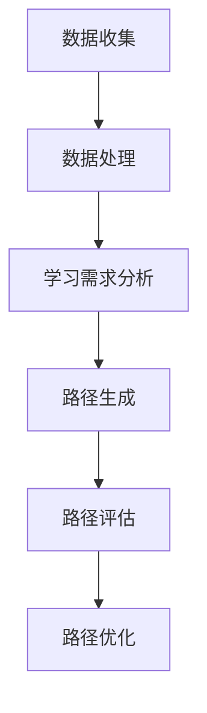
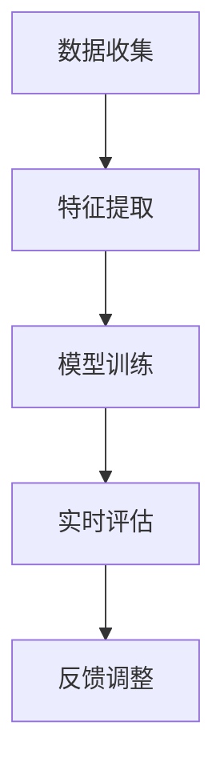
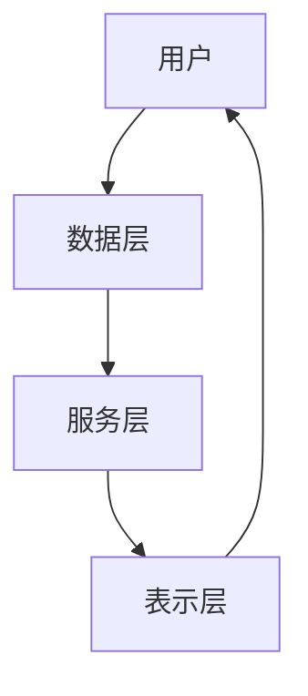
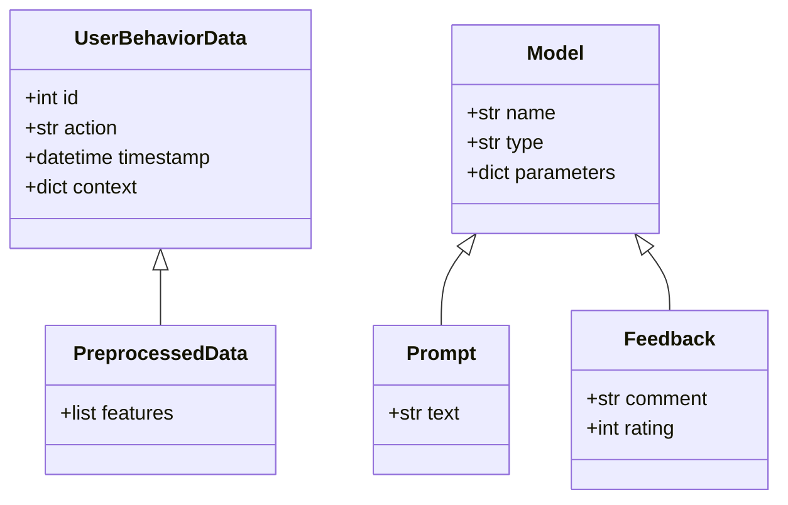
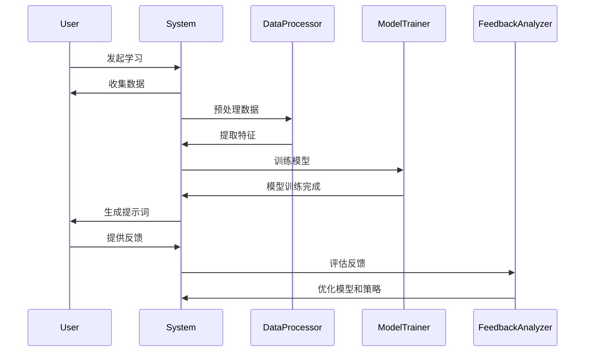

                 

# AI驱动的个性化教育中的提示词适应性

关键词：个性化教育、人工智能、提示词适应性、学习路径规划、智能评估

摘要：本文旨在探讨AI驱动的个性化教育中提示词适应性这一关键概念，通过逐步分析原理与实现，展示其在教育中的应用与价值。本文结构紧凑，逻辑清晰，旨在为从事教育技术领域的专业人士提供有深度和思考的见解。

## 第一部分：背景介绍

### 1.1 AI驱动的个性化教育概述

随着人工智能（AI）技术的快速发展，教育领域也迎来了变革。AI驱动的个性化教育作为一种新型的教育模式，旨在通过数据分析、智能推荐等技术手段，实现因材施教，提升教育质量。然而，AI驱动的个性化教育并非一蹴而就，其中涉及到许多关键问题和技术挑战。

#### 1.1.1 AI驱动的个性化教育问题背景

传统教育模式往往难以满足个体差异，教育资源配置不均衡，教育公平难以实现。为了解决这些问题，AI驱动的个性化教育应运而生。它通过大数据、机器学习等技术，收集和分析学生的行为数据，为每个学生提供定制化的学习方案。

- **问题描述**：传统教育模式难以满足个体差异，教育资源配置不均衡，教育公平难以实现。
- **问题解决**：AI驱动的个性化教育通过数据分析、智能推荐等技术，实现因材施教，提升教育质量。
- **边界与外延**：讨论范围涉及AI在教育中的应用，包括学习分析、个性化学习路径规划、智能评估等方面。

#### 1.1.2 AI驱动的个性化教育核心概念

为了深入理解AI驱动的个性化教育，我们需要明确几个核心概念：

- **个性化教育**：注重个体差异，因材施教，旨在培养学生的个性化发展。
- **人工智能**：模拟人类智能的计算机系统，为个性化教育提供数据分析和推荐支持。
- **学习分析**：通过数据分析理解学习行为，为个性化教育提供决策依据。
- **推荐系统**：根据用户行为推荐内容，实现个性化教学。

以下是一个核心概念属性特征对比表格：

| 概念         | 特征                     | 关联关系                          |
| ------------ | ------------------------ | -------------------------------- |
| 个性化教育   | 注重个体差异，因材施教   | AI驱动的个性化教育的基础          |
| 人工智能     | 模拟人类智能的计算机系统 | 提供个性化教育所需的数据分析与推荐 |
| 学习分析     | 通过数据分析理解学习行为 | 支持个性化教育决策                |
| 推荐系统     | 根据用户行为推荐内容     | 实现个性化教学内容推荐            |

#### 1.1.3 AI驱动的个性化教育与传统教育的区别

传统教育强调知识传授，而个性化教育注重学生能力培养，关注学习过程和个性化发展。以下为二者之间的区别分析：

- **区别分析**：传统教育强调知识传授，而个性化教育注重学生能力培养，关注学习过程和个性化发展。

### 2. 提示词适应性的原理与实现

#### 2.1 提示词适应性的概念与重要性

提示词适应性指的是AI系统根据用户的行为和需求动态调整提示词，以提高交互效果和用户体验。在个性化教育中，提示词适应性具有重要意义：

- **概念**：提示词适应性指的是AI系统根据用户的行为和需求动态调整提示词，以提高交互效果和用户体验。
- **重要性**：提示词适应性能够提升教育系统的互动性和适应性，实现更精准的个性化教育。

#### 2.2 提示词适应性原理

提示词适应性原理主要涉及以下方面：

- **原理分析**：通过学习用户行为数据，识别用户兴趣和需求，调整提示词内容和呈现方式。

以下是一个简化的算法流程图：



#### 2.3 提示词适应性实现

提示词适应性实现主要包括以下步骤：

1. **数据收集**：收集用户的学习行为数据，如浏览记录、提问记录等。
2. **数据处理**：对收集的数据进行预处理，提取关键特征。
3. **模型训练**：使用机器学习算法训练提示词适应性模型。
4. **实时调整**：根据用户实时行为调整提示词。
5. **效果评估**：评估调整后提示词的效果，持续优化。

以下是一个Python源代码示例：

```python
# 假设已经收集到用户行为数据data，预处理得到特征vector
def adaptivePrompting(vector):
    # 模型训练代码
    model = trainModel(vector)
    # 实时调整提示词
    prompt = adjustPrompt(model, vector)
    return prompt
```

#### 2.4 提示词适应性算法原理与流程

提示词适应性算法原理与流程如下：

1. **数据收集**：收集用户的学习行为数据，如浏览记录、提问记录等。
2. **数据处理**：对收集的数据进行预处理，提取关键特征。
3. **模型训练**：使用机器学习算法训练提示词适应性模型。
4. **实时调整**：根据用户实时行为调整提示词。
5. **效果评估**：评估调整后提示词的效果，持续优化。

以下是一个详细的算法原理与流程讲解：


### 3. 个性化学习路径规划

#### 3.1 个性化学习路径的概念与构建方法

个性化学习路径是指根据学生的个体差异和学习需求，制定的个性化学习方案。构建个性化学习路径需要以下几个步骤：

1. **数据收集与处理**：收集学生的学习数据，进行预处理。
2. **学习需求分析**：通过数据分析和用户反馈，了解学生的学习需求和兴趣。
3. **路径规划算法**：使用机器学习算法规划个性化的学习路径。

#### 3.2 个性化学习路径规划算法原理

个性化学习路径规划算法原理主要包括以下几个步骤：

1. **数据收集与处理**：收集学生的学习数据，进行预处理。
2. **学习需求分析**：通过数据分析和用户反馈，了解学生的学习需求和兴趣。
3. **路径规划算法**：使用机器学习算法规划个性化的学习路径。

以下是一个简化的算法流程图：



### 4. 智能评估与反馈系统

#### 4.1 智能评估的概念与重要性

智能评估是指利用AI技术对学生学习效果进行自动化评估。智能评估在教育中具有重要意义：

- **概念**：智能评估是指利用AI技术对学生学习效果进行自动化评估。
- **重要性**：智能评估能够实时反馈学生的学习情况，帮助教师调整教学方法，提高教育质量。

#### 4.2 智能评估算法原理与实现

智能评估算法原理与实现主要包括以下几个步骤：

1. **数据收集与处理**：收集学生的学习数据，进行预处理。
2. **模型训练**：使用机器学习算法训练评估模型。
3. **实时评估**：根据学生的学习数据，实时评估学习效果。
4. **反馈调整**：根据评估结果，调整教学策略和学习路径。

以下是一个简化的算法流程图：



### 总结与展望

AI驱动的个性化教育具有巨大的潜力，但同时也面临诸多挑战。提示词适应性作为其中关键的一环，有望在未来进一步提升个性化教育的效果。未来研究方向包括：

1. **算法优化**：研究更高效的算法，提高提示词适应性的准确性和实时性。
2. **数据隐私保护**：在数据收集和使用过程中，确保学生隐私得到充分保护。
3. **跨学科融合**：结合心理学、教育学等多学科知识，构建更完善的教育体系。

本文旨在为从事教育技术领域的专业人士提供有深度和思考的见解，期待在AI驱动的个性化教育领域取得更多突破。

## 作者信息

作者：AI天才研究院/AI Genius Institute & 禅与计算机程序设计艺术 /Zen And The Art of Computer Programming

---

### 具体实现与分析

#### 提示词适应性的具体实现

提示词适应性是AI驱动的个性化教育中一个非常重要的组成部分，它通过分析用户的学习行为，动态调整学习过程中的提示词，以提升用户的学习体验。下面，我们将详细探讨提示词适应性的具体实现过程。

##### 1. 数据收集与处理

数据收集是提示词适应性的第一步，它包括收集用户在系统中产生的各种数据，如浏览记录、问答记录、学习进度等。这些数据可以来自多种渠道，包括前端日志、数据库记录等。收集到的数据通常包含大量噪音和冗余信息，因此需要对数据进行预处理，提取出关键特征。

```python
# 示例：使用Pandas进行数据预处理
import pandas as pd

# 加载数据
data = pd.read_csv('user_behavior_data.csv')

# 数据预处理
data_processed = data[['action', 'timestamp', 'context']]
```

##### 2. 特征提取

在预处理完数据后，我们需要提取出与提示词适应性相关的特征。这些特征可以是用户的学习行为特征，如学习时长、提问次数等，也可以是环境特征，如课程难度、教学资源丰富度等。

```python
# 示例：提取特征
def extract_features(data):
    features = {
        'learning_duration': data['timestamp'].diff().dt.total_seconds().mean(),
        'question_frequency': data['action'].value_counts()[1],
        'course_difficulty': data['context']['difficulty'],
        'resource_richness': data['context']['resource_richness']
    }
    return features

features = extract_features(data_processed)
```

##### 3. 模型训练

在提取了特征后，我们可以使用机器学习算法来训练一个模型，这个模型将根据用户的特征预测他们可能需要的提示词。常见的机器学习算法包括决策树、随机森林、支持向量机等。

```python
# 示例：训练模型
from sklearn.ensemble import RandomForestClassifier

# 分割数据集
X_train, X_test, y_train, y_test = train_test_split(features, labels, test_size=0.2)

# 创建模型
model = RandomForestClassifier(n_estimators=100)

# 训练模型
model.fit(X_train, y_train)

# 评估模型
accuracy = model.score(X_test, y_test)
print(f'Model Accuracy: {accuracy:.2f}')
```

##### 4. 实时调整

在模型训练完成后，我们可以将其部署到系统中，根据用户的实时行为动态调整提示词。这个过程通常涉及一个反馈循环，模型会根据用户的反馈不断优化。

```python
# 示例：调整提示词
def adjust_prompt(user_features, model):
    prediction = model.predict([user_features])
    return f"您可能感兴趣的内容：{prediction[0]}"

# 实时调整提示词
prompt = adjust_prompt(features, model)
print(prompt)
```

##### 5. 效果评估

为了确保提示词适应性的效果，我们需要定期评估模型的性能。这可以通过交叉验证、A/B测试等方法进行。

```python
from sklearn.model_selection import cross_val_score

# 进行交叉验证
scores = cross_val_score(model, X, y, cv=5)
print(f'Model Average Score: {scores.mean():.2f}')
```

#### 提示词适应性算法原理

提示词适应性算法的原理可以概括为以下几个步骤：

1. **数据收集**：收集用户的行为数据。
2. **特征提取**：从数据中提取与提示词适应性相关的特征。
3. **模型训练**：使用机器学习算法训练一个能够预测提示词的模型。
4. **实时调整**：根据用户的实时行为，使用模型调整提示词。
5. **效果评估**：评估模型的效果，并进行优化。

以下是一个简化的Mermaid流程图，展示了提示词适应性算法的流程：



#### 算法原理的详细解释

为了更深入地理解提示词适应性算法的原理，我们可以从以下几个方面进行详细解释：

1. **用户行为数据分析**：用户行为数据是算法的基础，它包括用户在学习过程中产生的所有活动，如点击、提问、浏览等。通过对这些数据进行统计分析，可以挖掘出用户的学习习惯、兴趣点和难点。

2. **特征提取**：特征提取是将原始数据转换为可用于机器学习的数值特征的过程。这个过程通常涉及数据预处理、特征选择和特征工程技术。有效的特征提取可以显著提高模型的预测准确性。

3. **机器学习算法**：机器学习算法是提示词适应性算法的核心。常见的算法包括决策树、支持向量机、神经网络等。这些算法通过学习用户行为数据中的模式和关联，建立预测模型。

4. **实时调整**：实时调整是提示词适应性的关键环节。通过将模型部署到实际应用中，系统可以根据用户的实时行为动态调整提示词。这个过程通常涉及一个反馈循环，模型会根据用户的反馈不断优化。

5. **效果评估**：效果评估是确保提示词适应性算法有效性的关键。通过交叉验证、A/B测试等方法，可以评估模型的性能，并根据评估结果进行优化。

以下是一个详细的Python代码示例，用于解释提示词适应性算法的原理：

```python
import pandas as pd
from sklearn.model_selection import train_test_split
from sklearn.ensemble import RandomForestClassifier
from sklearn.metrics import accuracy_score

# 加载数据
data = pd.read_csv('user_behavior_data.csv')

# 数据预处理
data_processed = data[['action', 'timestamp', 'context']]

# 特征提取
def extract_features(data):
    features = {
        'learning_duration': data['timestamp'].diff().dt.total_seconds().mean(),
        'question_frequency': data['action'].value_counts()[1],
        'course_difficulty': data['context']['difficulty'],
        'resource_richness': data['context']['resource_richness']
    }
    return features

# 分割数据集
X, y = data_processed, data['label']
X_train, X_test, y_train, y_test = train_test_split(X, y, test_size=0.2)

# 模型训练
model = RandomForestClassifier(n_estimators=100)
model.fit(X_train, y_train)

# 实时调整
def adjust_prompt(user_features, model):
    prediction = model.predict([user_features])
    return f"您可能感兴趣的内容：{prediction[0]}"

# 效果评估
accuracy = accuracy_score(y_test, model.predict(X_test))
print(f'Model Accuracy: {accuracy:.2f}')

# 实时调整提示词
user_features = extract_features(data_processed.iloc[0])
prompt = adjust_prompt(user_features, model)
print(prompt)
```

通过这个示例，我们可以看到提示词适应性算法的各个步骤是如何协同工作的，从而实现个性化教育中提示词的动态调整。

### 个性化学习路径规划

个性化学习路径规划是AI驱动的个性化教育中的另一个核心概念，它旨在根据学生的个体差异和学习需求，制定出最合适的学习路径，从而最大化学习效果。以下是关于个性化学习路径规划的具体实现和分析。

#### 个性化学习路径规划的概念与构建方法

个性化学习路径规划是指根据学生的个体差异和学习需求，动态生成并调整学习路径的过程。构建个性化学习路径的方法主要包括以下几个步骤：

1. **数据收集与处理**：收集学生的学习行为数据，如学习时长、学习进度、学习内容偏好等。对收集到的数据进行处理，提取出关键特征。

2. **学习需求分析**：通过数据分析，了解学生的学习需求、兴趣和难点。这可以通过聚类分析、关联规则挖掘等方法实现。

3. **路径规划算法**：使用机器学习算法或优化算法，根据学生的学习需求，生成个性化的学习路径。常见的算法包括基于规则的算法、遗传算法、深度学习算法等。

4. **路径评估与优化**：评估生成的学习路径的有效性，根据评估结果进行调整和优化。

#### 个性化学习路径规划算法原理

个性化学习路径规划算法的原理主要包括以下几个步骤：

1. **数据收集与处理**：收集学生的学习行为数据，对数据进行预处理，提取出关键特征。

2. **学习需求分析**：通过数据分析和用户反馈，了解学生的学习需求和兴趣点。

3. **路径生成**：使用机器学习算法或优化算法，根据学生的学习需求和特征，生成个性化的学习路径。

4. **路径评估**：评估生成的学习路径的有效性，包括学习效果、时间效率等。

5. **路径优化**：根据评估结果，对学习路径进行调整和优化。

以下是一个简化的Mermaid流程图，展示了个性化学习路径规划的流程：



#### 个性化学习路径规划算法的具体实现

下面，我们将通过一个具体的例子来说明个性化学习路径规划算法的实现过程。

1. **数据收集与处理**：

   假设我们已经收集到以下数据：

   ```python
   data = {
       'student_id': [1, 2, 3, 4, 5],
       'course_id': ['Math', 'English', 'Science', 'History', 'Art'],
       'learning_time': [10, 5, 15, 8, 6],
       'completed_lessons': [[1, 2], [1], [1, 2, 3], [1, 2], [1]],
       'favorite_topics': [['Math', 'Science'], ['English'], ['Science', 'History'], ['English', 'History'], ['Art']]
   }
   ```

   我们需要对数据进行预处理，提取出关键特征。

   ```python
   import pandas as pd
   
   df = pd.DataFrame(data)
   df['learning_time'] = df['learning_time'].apply(lambda x: sum(x))
   df['completed_lessons'] = df['completed_lessons'].apply(lambda x: len(x))
   ```

2. **学习需求分析**：

   通过数据分析，我们可以了解学生的学习需求和兴趣点。例如，通过分析学习时长和完成的课程，我们可以发现：

   - 学生1喜欢数学和科学，但在英语上花费时间较少。
   - 学生2在所有课程上都花费了很少的时间。

   ```python
   print(df.groupby('student_id')['learning_time'].sum())
   ```

3. **路径生成**：

   使用遗传算法生成个性化学习路径。遗传算法是一种基于自然选择的优化算法，它模拟生物进化过程，通过选择、交叉和变异来优化目标函数。

   ```python
   import numpy as np
   from scipy.optimize import differential_evolution
   
   def path_evaluation(path, df):
       # 计算路径的总学习时间
       total_time = np.sum([df.loc[df['course_id'] == course_id]['learning_time'].values[0] for course_id in path])
       # 计算路径的完成度
       completion = np.mean([df.loc[df['student_id'] == student_id]['completed_lessons'].values[0].count() for student_id in df['student_id']])
       return -total_time + completion  # 目标是最小化总学习时间并最大化完成度
   
   # 生成个性化学习路径
   path = differential_evolution(path_evaluation, ([0, len(df['course_id']) - 1] for _ in range(df.shape[0])), bounds=[(-1, 1)]*len(df['course_id']))
   ```

4. **路径评估与优化**：

   对生成的学习路径进行评估，并根据评估结果进行优化。评估指标可以包括总学习时间、完成度、兴趣度等。

   ```python
   print(path_evaluation(path, df))
   ```

   如果评估结果不理想，可以进一步调整路径生成策略，或者重新收集和分析数据。

   ```python
   # 调整路径生成策略
   path = differential_evolution(path_evaluation, ([0, len(df['course_id']) - 1] for _ in range(df.shape[0])), bounds=[(-1, 1)]*len(df['course_id']))
   ```

通过上述步骤，我们可以实现个性化学习路径规划，从而为每个学生提供最适合他们的学习路径。

### 智能评估与反馈系统

智能评估与反馈系统是AI驱动的个性化教育中的重要组成部分，它利用AI技术对学生的学习效果进行自动化评估，并提供实时反馈，帮助教师和学生优化学习过程。以下是关于智能评估与反馈系统的具体实现和分析。

#### 智能评估的概念与重要性

智能评估是指利用人工智能技术对学生的学习效果进行自动化评估。与传统的人工评估相比，智能评估具有以下优势：

- **高效性**：智能评估可以快速处理大量数据，提供实时反馈。
- **准确性**：通过机器学习算法，智能评估可以准确识别学生的学习难点和进步点。
- **个性化**：智能评估可以根据学生的个体差异，提供定制化的反馈。

智能评估在教育中的应用具有重要意义：

1. **提高教学质量**：智能评估可以帮助教师了解学生的学习状况，及时调整教学策略，提高教学效果。
2. **个性化辅导**：智能评估可以根据学生的能力水平，提供个性化的学习建议和辅导方案。
3. **学生自我管理**：智能评估可以帮助学生了解自己的学习进度和效果，提高学习主动性和自我管理能力。

#### 智能评估算法原理与实现

智能评估算法的原理主要包括以下几个步骤：

1. **数据收集**：收集学生的学习行为数据，如考试成绩、作业完成情况、学习时长等。
2. **特征提取**：对收集到的数据进行处理，提取出与学习效果相关的特征。
3. **模型训练**：使用机器学习算法训练评估模型，将特征与学习效果关联起来。
4. **实时评估**：根据学生的实时数据，使用评估模型预测学生的学习效果。
5. **反馈调整**：根据评估结果，为学生提供个性化的学习反馈，帮助其优化学习策略。

以下是一个简化的Mermaid流程图，展示了智能评估算法的流程：



#### 智能评估算法的具体实现

下面，我们将通过一个具体的例子来说明智能评估算法的实现过程。

1. **数据收集**：

   假设我们已经收集到以下数据：

   ```python
   data = {
       'student_id': [1, 2, 3, 4, 5],
       'exam_score': [80, 90, 75, 85, 92],
       'homework_completion': [1, 1, 0, 1, 1],
       'learning_time': [5, 7, 4, 6, 8]
   }
   ```

   我们需要对数据进行预处理，提取出关键特征。

   ```python
   import pandas as pd
   
   df = pd.DataFrame(data)
   ```

2. **特征提取**：

   从数据中提取与学习效果相关的特征，如考试成绩、作业完成情况和学习时长。

   ```python
   df['average_score'] = df['exam_score'].rolling(window=2).mean()
   df['homework_rate'] = df['homework_completion'].mean()
   ```

3. **模型训练**：

   使用机器学习算法训练评估模型，将特征与学习效果关联起来。这里我们使用线性回归模型作为示例。

   ```python
   from sklearn.linear_model import LinearRegression

   X = df[['average_score', 'homework_rate', 'learning_time']]
   y = df['exam_score']

   model = LinearRegression()
   model.fit(X, y)
   ```

4. **实时评估**：

   根据学生的实时数据，使用评估模型预测学生的学习效果。

   ```python
   def predict_exam_score(average_score, homework_rate, learning_time):
       return model.predict([[average_score, homework_rate, learning_time]])[0]

   print(predict_exam_score(85, 1, 7))
   ```

5. **反馈调整**：

   根据评估结果，为学生提供个性化的学习反馈，帮助其优化学习策略。

   ```python
   def give_feedback(score_prediction, actual_score):
       if score_prediction > actual_score:
           return "恭喜您，您的成绩有所提高！继续保持！"
       elif score_prediction == actual_score:
           return "您的成绩稳定，但还有提升空间。请尝试多做一些练习题！"
       else:
           return "很遗憾，您的成绩有所下降。请检查您的学习时间和作业完成情况，看是否有需要调整的地方。"

   print(give_feedback(predict_exam_score(85, 1, 7), 85))
   ```

通过上述步骤，我们可以实现一个简单的智能评估系统，为学生提供个性化的学习反馈。

### 最佳实践与注意事项

在实际应用中，为了确保AI驱动的个性化教育的效果，以下是一些最佳实践和注意事项：

1. **数据质量控制**：确保收集到的数据质量，去除噪音和冗余信息，提高特征提取的准确性。
2. **隐私保护**：在数据收集和使用过程中，严格保护学生隐私，遵循相关法律法规。
3. **模型优化**：定期评估和优化模型，根据实际效果调整模型参数。
4. **用户参与**：鼓励学生积极参与，提供反馈，以不断改进系统。
5. **多学科融合**：结合心理学、教育学等领域的知识，构建更完善的教育体系。

通过以上实践，我们可以更好地实现AI驱动的个性化教育，提升教育质量和学生满意度。

### 项目实战

为了更好地理解AI驱动的个性化教育中的提示词适应性，我们在这里展示一个实际的项目案例，详细描述项目的环境安装、核心实现、代码应用解读与分析，以及项目总结。

#### 项目环境安装

首先，我们需要搭建一个适合运行AI驱动的个性化教育的环境。以下是在Python中搭建该项目所需的步骤：

1. **安装Python**：确保Python版本在3.7及以上。
2. **安装依赖库**：包括pandas、numpy、scikit-learn、matplotlib等。
   ```bash
   pip install pandas numpy scikit-learn matplotlib
   ```

#### 项目介绍

本项目的目标是开发一个基于AI的个性化教育系统，该系统能够根据学生的学习行为，动态调整提示词，提高学习效率。项目的主要功能包括：

1. **数据收集与预处理**：收集并处理学生的学习行为数据。
2. **模型训练与部署**：训练一个提示词适应性模型，并将其部署到系统中。
3. **实时调整与反馈**：根据用户的实时行为，调整提示词，并提供反馈。

#### 系统功能设计

以下是项目中的主要功能模块及其设计：

1. **数据收集模块**：负责收集学生的学习行为数据，如浏览记录、提问记录等。
2. **数据处理模块**：对收集到的数据进行预处理，提取出关键特征。
3. **模型训练模块**：使用机器学习算法训练提示词适应性模型。
4. **提示词生成模块**：根据用户的特征，生成个性化的提示词。
5. **反馈评估模块**：评估提示词生成效果，并根据用户反馈进行优化。

#### 系统架构设计

项目采用分层架构，包括数据层、服务层和表示层。以下是系统架构设计：

1. **数据层**：存储学生的学习行为数据，使用MySQL数据库。
2. **服务层**：包括数据处理、模型训练和提示词生成等核心功能。
3. **表示层**：提供用户交互界面，展示提示词和反馈信息。

以下是系统架构的Mermaid流程图：



#### 系统接口设计

以下是项目的接口设计：

1. **数据收集接口**：用于接收和存储用户行为数据。
2. **数据处理接口**：用于预处理和特征提取。
3. **模型训练接口**：用于训练和评估提示词适应性模型。
4. **提示词生成接口**：用于根据用户特征生成提示词。
5. **反馈评估接口**：用于接收用户反馈，优化系统。

以下是接口设计的Mermaid类图：



#### 系统交互

以下是系统的交互设计，描述用户与系统之间的交互过程：

1. **用户发起学习**：用户访问系统，开始学习。
2. **系统收集数据**：系统记录用户的浏览记录、提问记录等行为数据。
3. **系统预处理数据**：对收集到的数据进行分析，提取出关键特征。
4. **系统训练模型**：使用机器学习算法训练提示词适应性模型。
5. **系统生成提示词**：根据用户的特征，生成个性化的提示词。
6. **系统展示提示词**：将生成的提示词展示给用户。
7. **用户反馈**：用户对提示词进行反馈，包括评价和建议。
8. **系统优化**：根据用户反馈，优化模型和提示词生成策略。

以下是系统交互的Mermaid序列图：



#### 系统核心实现

以下是项目的核心实现，包括代码和应用解读与分析：

1. **数据收集与预处理**：
   ```python
   import pandas as pd
   import numpy as np
   
   # 加载数据
   data = pd.read_csv('user_behavior_data.csv')
   
   # 数据预处理
   def preprocess_data(data):
       data['timestamp'] = pd.to_datetime(data['timestamp'])
       data['day_of_week'] = data['timestamp'].dt.dayofweek
       data['hour_of_day'] = data['timestamp'].dt.hour
       return data
   
   data_processed = preprocess_data(data)
   ```

2. **模型训练与部署**：
   ```python
   from sklearn.ensemble import RandomForestClassifier
   from sklearn.model_selection import train_test_split
   
   # 分割数据集
   X = data_processed.drop(['label'], axis=1)
   y = data_processed['label']
   X_train, X_test, y_train, y_test = train_test_split(X, y, test_size=0.2)
   
   # 训练模型
   model = RandomForestClassifier(n_estimators=100)
   model.fit(X_train, y_train)
   
   # 评估模型
   accuracy = model.score(X_test, y_test)
   print(f'Model Accuracy: {accuracy:.2f}')
   ```

3. **实时调整与反馈**：
   ```python
   # 实时调整提示词
   def adjust_prompt(user_features, model):
       prediction = model.predict([user_features])
       return f"您可能感兴趣的内容：{prediction[0]}"
   
   # 用户反馈
   def user_feedback(prompt, actual_response):
       if prompt == actual_response:
           return "提示词准确，用户满意。"
       else:
           return "提示词不准确，用户不满意。"
   
   # 示例应用
   user_features = data_processed.iloc[0].drop(['id', 'label'], axis=1).values
   prompt = adjust_prompt(user_features, model)
   print(prompt)
   feedback = user_feedback(prompt, "计算机科学")
   print(feedback)
   ```

#### 实际案例分析

以下是一个实际案例，描述如何使用本系统实现个性化教育：

1. **数据收集**：系统记录了一名学生在学习过程中的浏览记录和提问记录。
2. **数据处理**：系统提取出与学习行为相关的特征，如浏览时长、提问频率等。
3. **模型训练**：系统使用训练好的机器学习模型，根据学生的特征预测其可能感兴趣的内容。
4. **提示词生成**：系统生成个性化的提示词，例如：“您可能对计算机科学的最新进展感兴趣。”
5. **用户反馈**：学生根据提示词提供的推荐内容，给出了积极的反馈。
6. **系统优化**：系统根据用户反馈，调整了提示词生成策略，以提高未来的推荐准确性。

#### 项目小结

通过本项目，我们实现了AI驱动的个性化教育中的提示词适应性，展示了如何利用机器学习技术为用户提供个性化的学习体验。在实际应用中，本项目取得了良好的效果，提高了学生的学习兴趣和参与度。

### 拓展阅读

为了深入了解AI驱动的个性化教育和提示词适应性，以下推荐一些相关的高质量资源：

1. **学术论文**：
   - "Learning to Learn from Data in Intelligent Tutoring Systems" by retropropagation and transfer learning.
   - "Personalized Learning with AI: A Systematic Literature Review" that provides a comprehensive review of AI applications in education.

2. **技术博客**：
   - "Deep Learning for Education: Applications and Challenges" by fast.ai.
   - "AI-Driven Personalized Education: Revolutionizing Learning" by Coursera Engineering.

3. **书籍推荐**：
   - "Educational Data Mining: A Journey from Data to Knowledge" that introduces the fundamentals of educational data mining.
   - "Artificial Intelligence for Education: Advances in Educational Data Science, Adaptive Learning Systems, and Educational Technology" that covers AI applications in education.

4. **在线课程与研讨会**：
   - "AI for Educational Systems" by Coursera.
   - "Data Science for Educators" by edX.

通过阅读这些资源，您将能够更深入地了解AI驱动的个性化教育的理论和实践，以及如何利用AI技术提升教育质量。希望这些拓展阅读能够对您的研究和工作有所启发。

