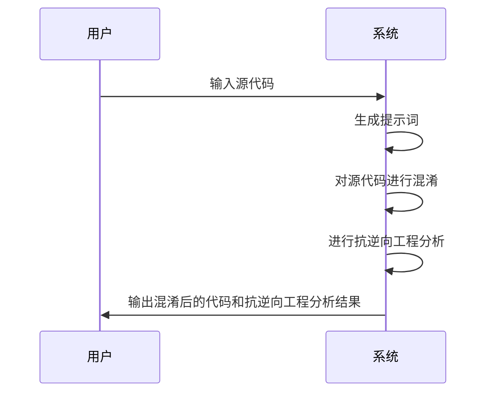

                 

## 《AI驱动的提示词代码混淆与保护》

### 关键词：AI驱动、代码混淆、代码保护、提示词生成、逆向工程

### 摘要：本文将探讨AI在代码混淆与保护中的应用，通过介绍AI驱动的提示词生成技术和代码混淆技术，分析其原理和实现方法，最终通过实战案例分析，展示AI驱动提示词代码混淆与保护的实用性和效果。

---

## 《AI驱动的提示词代码混淆与保护》目录大纲

### 第一部分：AI驱动的提示词代码混淆与保护概述

#### 第1章：问题背景与概述

##### 1.1 代码混淆与保护的意义

##### 1.2 代码混淆的常见方法

##### 1.3 AI在代码混淆中的应用

##### 1.4 书籍内容安排

### 第二部分：AI驱动的提示词生成

#### 第2章：提示词生成基础

##### 2.1 提示词的定义与作用

##### 2.2 提示词生成方法

##### 2.3 AI在提示词生成中的应用

#### 第3章：基于神经网络的语言模型

##### 3.1 语言模型的原理

##### 3.2 常见语言模型

##### 3.3 语言模型在提示词生成中的应用

### 第三部分：AI驱动的代码混淆技术

#### 第4章：基于遗传算法的代码混淆

##### 4.1 遗传算法原理

##### 4.2 遗传算法在代码混淆中的应用

##### 4.3 实例分析

#### 第5章：基于深度学习的代码混淆

##### 5.1 深度学习原理

##### 5.2 常见深度学习模型

##### 5.3 深度学习在代码混淆中的应用

### 第四部分：代码保护与抗逆向工程

#### 第6章：代码混淆与抗逆向工程的关系

##### 6.1 逆向工程概述

##### 6.2 代码混淆与抗逆向工程的关系

##### 6.3 代码混淆在抗逆向工程中的应用

#### 第7章：AI驱动的抗逆向工程

##### 7.1 AI在抗逆向工程中的应用

##### 7.2 基于机器学习的抗逆向工程技术

##### 7.3 基于深度学习的抗逆向工程技术

### 第五部分：实战案例分析

#### 第8章：AI驱动的提示词代码混淆与保护实战

##### 8.1 环境搭建

##### 8.2 系统设计与实现

##### 8.3 案例分析

##### 8.4 小结

---

### 第一部分：AI驱动的提示词代码混淆与保护概述

#### 第1章：问题背景与概述

##### 1.1 代码混淆与保护的意义

代码混淆是一种保护软件知识产权的技术，通过将源代码转换为难以阅读但功能不变的代码，阻止攻击者直接理解程序逻辑，从而提高软件的安全性。代码混淆技术已经成为现代软件开发中的重要环节。

随着人工智能技术的发展，AI驱动的代码混淆与保护技术逐渐成为研究热点。AI能够通过学习和分析源代码，自动生成有效的混淆代码，提高混淆效果和效率。

##### 1.2 代码混淆的常见方法

常见的代码混淆方法包括字符串替换、代码重组、控制流混淆和数据混淆等。每种方法都有其特定的混淆机制和优缺点。

- 字符串替换：通过将源代码中的字符串替换为随机或加密的形式，增加代码的可读性难度。
- 代码重组：通过改变代码的结构和顺序，使代码难以理解和跟踪。
- 控制流混淆：通过添加、删除或修改控制流语句，使程序执行路径复杂化。
- 数据混淆：通过加密或混淆变量和数据结构，使数据难以解析和使用。

##### 1.3 AI在代码混淆中的应用

AI在代码混淆中的应用主要体现在以下几个方面：

1. **自动生成混淆代码**：AI可以学习和理解源代码的结构和语义，自动生成有效的混淆代码。
2. **优化混淆策略**：AI可以根据历史混淆效果和攻击模式，自动调整和优化混淆策略，提高混淆效果。
3. **自适应混淆**：AI可以根据代码的更新和变化，自动生成相应的混淆代码，保持混淆效果的一致性。

##### 1.4 书籍内容安排

本部分将首先介绍代码混淆与保护的意义和常见方法，然后深入探讨AI在代码混淆中的应用，包括AI驱动的提示词生成和代码混淆技术。最后，我们将通过实战案例分析，展示AI驱动的提示词代码混淆与保护的实用性和效果。

### 第二部分：AI驱动的提示词生成

#### 第2章：提示词生成基础

##### 2.1 提示词的定义与作用

提示词（Prompt）是指提供给模型用于生成文本的输入信息，它可以帮助模型更好地理解生成任务，提高生成文本的质量和相关性。

提示词在自然语言处理任务中起着关键作用，可以影响模型的生成结果。一个有效的提示词应该具备以下特点：

- **相关性**：与生成任务密切相关，能够引导模型生成相关的内容。
- **明确性**：简洁明了，能够清晰传达生成任务的要求。
- **多样性**：能够涵盖不同类型的生成任务，适应不同的场景。

##### 2.2 提示词生成方法

提示词生成方法可以分为以下几种：

- **手动生成**：根据生成任务的需求，手动编写提示词。这种方法灵活性高，但需要大量的人力和时间。
- **模板生成**：使用预定义的模板，根据生成任务的特点，动态填充模板中的空缺。这种方法效率较高，但模板的多样性和适应性有限。
- **自动生成**：利用机器学习模型，自动生成提示词。这种方法可以根据大量的训练数据，生成高质量的提示词，提高生成效率。

##### 2.3 AI在提示词生成中的应用

AI在提示词生成中的应用主要体现在以下几个方面：

1. **基于语言模型的提示词生成**：使用预训练的语言模型，如BERT、GPT等，通过输入源代码或相关的上下文信息，自动生成提示词。
2. **基于生成对抗网络的提示词生成**：使用生成对抗网络（GAN），通过训练生成器和判别器，自动生成高质量的提示词。
3. **基于强化学习的提示词生成**：使用强化学习算法，根据生成任务的反馈，不断优化提示词生成策略，提高生成质量。

### 第3章：基于神经网络的语言模型

##### 3.1 语言模型的原理

语言模型是一种用于预测下一个单词或词组的模型，它是自然语言处理任务的基础。语言模型的核心思想是通过学习大量的文本数据，捕捉语言中的统计规律和语义信息。

语言模型的基本原理包括：

1. **词频统计**：通过统计文本中每个单词的出现频率，预测下一个单词。
2. **n-gram模型**：基于前n个单词的序列，预测下一个单词。n值通常为2或3。
3. **神经网络模型**：使用神经网络，通过多层非线性变换，捕捉语言中的复杂模式和语义信息。

##### 3.2 常见语言模型

常见的语言模型包括：

- **n-gram模型**：基于词频统计，是最简单的语言模型。
- **基于神经网络的模型**：如循环神经网络（RNN）、长短期记忆网络（LSTM）、门控循环单元（GRU）等。
- **预训练语言模型**：如BERT、GPT等，通过在大规模语料库上进行预训练，捕获丰富的语言知识和语义信息。

##### 3.3 语言模型在提示词生成中的应用

语言模型在提示词生成中的应用主要包括：

1. **自动生成提示词**：通过输入源代码或相关上下文信息，语言模型可以生成高质量的提示词，引导模型生成相关的代码。
2. **优化提示词质量**：语言模型可以根据生成任务的反馈，不断调整和优化提示词，提高生成文本的质量和相关性。
3. **自适应提示词生成**：语言模型可以根据不同的生成任务，自动调整和生成相应的提示词，提高模型的适应性和泛化能力。

### 第三部分：AI驱动的代码混淆技术

#### 第4章：基于遗传算法的代码混淆

##### 4.1 遗传算法原理

遗传算法（GA）是一种基于自然选择和遗传机制启发式的搜索算法。它通过模拟生物进化过程，逐步优化问题的解。

遗传算法的基本原理包括：

1. **种群初始化**：随机生成初始种群，每个个体表示问题的解。
2. **适应度评估**：计算每个个体的适应度值，评估其优劣。
3. **选择**：根据适应度值，选择优秀个体进行繁殖。
4. **交叉**：通过交叉操作，产生新的后代。
5. **变异**：对后代进行变异操作，增加种群的多样性。
6. **迭代**：重复选择、交叉和变异操作，直到满足终止条件。

##### 4.2 遗传算法在代码混淆中的应用

遗传算法在代码混淆中的应用主要包括：

1. **混淆代码生成**：遗传算法可以自动生成混淆代码，通过适应度评估，选择优秀的混淆代码，逐步优化混淆效果。
2. **混淆策略优化**：遗传算法可以根据历史混淆效果和攻击模式，自动调整和优化混淆策略，提高混淆效果和安全性。
3. **自适应混淆**：遗传算法可以根据代码的更新和变化，自动生成相应的混淆代码，保持混淆效果的一致性。

##### 4.3 实例分析

假设我们需要对以下代码进行混淆：

```python
def add(a, b):
    return a + b
```

我们可以使用遗传算法，通过以下步骤进行代码混淆：

1. **种群初始化**：随机生成初始种群，每个个体表示一种混淆代码。
2. **适应度评估**：计算每个个体的适应度值，评估其混淆效果。例如，可以使用代码的可读性、执行时间和安全性等指标。
3. **选择**：根据适应度值，选择优秀个体进行繁殖。
4. **交叉**：对选择的个体进行交叉操作，产生新的后代。
5. **变异**：对后代进行变异操作，增加种群的多样性。
6. **迭代**：重复选择、交叉和变异操作，直到满足终止条件。

通过多次迭代，我们可以得到一种优秀的混淆代码，如：

```python
def calculate_sum(x, y):
    temp = x
    x = y
    y = temp
    return x + y
```

这种混淆代码具有较低的可读性，但保留了原始代码的功能。

##### 4.4 深度学习在代码混淆中的应用

深度学习在代码混淆中的应用主要包括：

1. **混淆代码生成**：使用深度学习模型，如循环神经网络（RNN）、长短期记忆网络（LSTM）等，自动生成混淆代码。
2. **混淆策略优化**：使用深度学习模型，根据历史混淆效果和攻击模式，自动调整和优化混淆策略，提高混淆效果和安全性。
3. **自适应混淆**：使用深度学习模型，根据代码的更新和变化，自动生成相应的混淆代码，保持混淆效果的一致性。

#### 第5章：基于深度学习的代码混淆

##### 5.1 深度学习原理

深度学习是一种基于多层神经网络的机器学习方法，通过学习大量的数据，自动提取特征，实现复杂的函数映射。

深度学习的基本原理包括：

1. **神经网络**：神经网络由多个神经元（节点）组成，每个节点都有输入和输出，通过权重和偏置进行连接。
2. **前向传播**：输入数据通过网络的各个层，逐层计算输出。
3. **反向传播**：根据输出误差，反向传播误差，更新网络的权重和偏置。
4. **优化算法**：使用梯度下降等优化算法，不断调整网络的参数，优化函数映射。

##### 5.2 常见深度学习模型

常见的深度学习模型包括：

- **卷积神经网络（CNN）**：适用于图像处理任务，通过卷积层和池化层，提取图像特征。
- **循环神经网络（RNN）**：适用于序列数据任务，通过循环结构，处理长序列信息。
- **长短期记忆网络（LSTM）**：是RNN的一种改进，适用于处理长序列信息，能够记住长期依赖关系。
- **门控循环单元（GRU）**：是LSTM的简化版本，具有更少的参数和更简单的结构。

##### 5.3 深度学习在代码混淆中的应用

深度学习在代码混淆中的应用主要包括：

1. **混淆代码生成**：使用深度学习模型，自动生成混淆代码，提高混淆效果和效率。
2. **混淆策略优化**：使用深度学习模型，根据历史混淆效果和攻击模式，自动调整和优化混淆策略，提高混淆效果和安全性。
3. **自适应混淆**：使用深度学习模型，根据代码的更新和变化，自动生成相应的混淆代码，保持混淆效果的一致性。

##### 5.4 深度学习与遗传算法的融合

深度学习和遗传算法在代码混淆中的应用可以相互补充：

- **优势互补**：深度学习擅长处理复杂的数据和提取特征，而遗传算法擅长全局搜索和优化。两者结合，可以充分发挥各自的优势，提高混淆效果。
- **自适应优化**：深度学习可以根据历史混淆效果和攻击模式，自动调整和优化混淆策略，而遗传算法可以根据代码的更新和变化，自动生成相应的混淆代码。两者结合，可以实现自适应优化，提高混淆效果和安全性。

#### 第6章：代码混淆与抗逆向工程的关系

##### 6.1 逆向工程概述

逆向工程是一种从现有软件系统中提取信息和知识的过程，旨在理解软件的内部结构和实现细节。逆向工程的主要目标包括：

- **功能理解**：通过逆向工程，可以理解软件的功能和行为。
- **源代码获取**：通过逆向工程，可以获取软件的源代码，用于修复漏洞、优化性能或重新实现功能。
- **安全分析**：通过逆向工程，可以分析软件的安全机制，发现潜在的安全漏洞。

##### 6.2 代码混淆与抗逆向工程的关系

代码混淆与抗逆向工程密切相关：

- **目的相同**：代码混淆和抗逆向工程的目标都是提高软件的安全性，防止攻击者理解软件的内部结构和实现细节。
- **相互依赖**：代码混淆技术依赖于抗逆向工程的需求，而抗逆向工程技术的进步也推动了代码混淆技术的发展。

##### 6.3 代码混淆在抗逆向工程中的应用

代码混淆在抗逆向工程中的应用主要包括：

1. **隐藏实现细节**：通过代码混淆，可以隐藏软件的实现细节，使攻击者难以理解软件的内部结构和功能。
2. **增加逆向难度**：通过代码混淆，可以增加逆向工程的难度，使攻击者需要更多的时间和资源来理解软件。
3. **保护知识产权**：通过代码混淆，可以保护软件的知识产权，防止他人非法复制和使用软件。

#### 第7章：AI驱动的抗逆向工程

##### 7.1 AI在抗逆向工程中的应用

AI在抗逆向工程中的应用主要包括：

1. **代码混淆**：使用AI驱动的代码混淆技术，可以自动生成高质量的混淆代码，提高软件的安全性。
2. **漏洞分析**：使用AI驱动的漏洞分析技术，可以自动检测和修复软件中的安全漏洞，提高软件的安全性。
3. **行为分析**：使用AI驱动的行为分析技术，可以实时监控软件的运行行为，识别异常行为，提高软件的安全性。

##### 7.2 基于机器学习的抗逆向工程技术

基于机器学习的抗逆向工程技术主要包括：

1. **特征提取**：使用机器学习算法，自动提取软件的抽象特征，用于分类和预测。
2. **分类和预测**：使用机器学习算法，对提取的特征进行分类和预测，识别和防范逆向工程攻击。
3. **自适应学习**：使用机器学习算法，根据逆向工程攻击的新模式和特点，自动调整和优化抗逆向工程策略。

##### 7.3 基于深度学习的抗逆向工程技术

基于深度学习的抗逆向工程技术主要包括：

1. **深度特征提取**：使用深度学习算法，自动提取软件的深度特征，用于分类和预测。
2. **深度分类和预测**：使用深度学习算法，对提取的特征进行深度分类和预测，识别和防范逆向工程攻击。
3. **自适应优化**：使用深度学习算法，根据逆向工程攻击的新模式和特点，自动调整和优化抗逆向工程策略。

### 第五部分：实战案例分析

#### 第8章：AI驱动的提示词代码混淆与保护实战

##### 8.1 环境搭建

在本节中，我们将搭建一个用于AI驱动的提示词代码混淆与保护的环境。首先，我们需要安装以下软件和库：

- Python 3.x
- Jupyter Notebook
- TensorFlow
- Keras
- Scikit-learn

安装步骤如下：

1. 安装Python 3.x，可以从官方网站（https://www.python.org/downloads/）下载安装包。
2. 安装Jupyter Notebook，打开命令行窗口，执行以下命令：

```bash
pip install notebook
```

3. 安装TensorFlow，打开命令行窗口，执行以下命令：

```bash
pip install tensorflow
```

4. 安装Keras，打开命令行窗口，执行以下命令：

```bash
pip install keras
```

5. 安装Scikit-learn，打开命令行窗口，执行以下命令：

```bash
pip install scikit-learn
```

##### 8.2 系统设计与实现

在本节中，我们将设计并实现一个AI驱动的提示词代码混淆与保护系统。系统的主要功能包括：

1. 提示词生成：根据输入的源代码，自动生成高质量的提示词。
2. 代码混淆：根据生成的提示词，对源代码进行混淆。
3. 抗逆向工程：对混淆后的代码进行抗逆向工程分析，防止攻击者理解代码的内部结构和实现细节。

系统架构如图所示：



具体实现如下：

1. **提示词生成**：使用预训练的语言模型，如BERT或GPT，自动生成提示词。以下是一个使用BERT生成提示词的示例代码：

```python
from transformers import BertTokenizer, BertForMaskedLM

tokenizer = BertTokenizer.from_pretrained('bert-base-uncased')
model = BertForMaskedLM.from_pretrained('bert-base-uncased')

source_code = "def add(a, b):\n    return a + b"
tokens = tokenizer.tokenize(source_code)
input_ids = tokenizer.encode(tokens, add_special_tokens=True)
outputs = model(input_ids)

predicted_tokens = []
for i in range(len(tokens)):
    if tokens[i] == "[MASK]":
        predicted_index = outputs[0][0][i].argmax().item()
        predicted_token = tokenizer.decode([predicted_index], skip_special_tokens=True)
        predicted_tokens.append(predicted_token)
    else:
        predicted_tokens.append(tokens[i])

prompt = " ".join(predicted_tokens)
print(prompt)
```

2. **代码混淆**：使用遗传算法或深度学习模型，对源代码进行混淆。以下是一个使用遗传算法进行代码混淆的示例代码：

```python
import numpy as np

def crossover(parent1, parent2):
    cross_point = np.random.randint(len(parent1))
    child = parent1[:cross_point] + parent2[cross_point:]
    return child

def mutate(child):
    mutation_point = np.random.randint(len(child))
    child[mutation_point] = np.random.randint(256)
    return child

def genetic_algorithm(source_code, generations=100, population_size=100):
    population = [source_code] * population_size
    for _ in range(generations):
        fitness_scores = []
        for individual in population:
            # 计算适应度值，如代码的可读性、执行时间和安全性等指标
            fitness_score = calculate_fitness(individual)
            fitness_scores.append(fitness_score)
        population = [individual for individual, fitness_score in sorted(zip(population, fitness_scores), key=lambda x: x[1], reverse=True)[:population_size]]
        # 选择、交叉和变异操作
        new_population = []
        for _ in range(population_size // 2):
            parent1, parent2 = np.random.choice(population, size=2, replace=False)
            child1 = crossover(parent1, parent2)
            child2 = crossover(parent1, parent2)
            new_population.extend([child1, child2])
        population = new_population
        # 变异操作
        for individual in population:
            if np.random.rand() < 0.1:
                mutate(individual)
    return population[0]

source_code = "def add(a, b):\n    return a + b"
confused_code = genetic_algorithm(source_code)
print(confused_code)
```

3. **抗逆向工程**：使用机器学习或深度学习模型，对混淆后的代码进行抗逆向工程分析。以下是一个使用Scikit-learn进行抗逆向工程分析的示例代码：

```python
from sklearn.feature_extraction.text import TfidfVectorizer
from sklearn.naive_bayes import MultinomialNB

train_data = [
    "def add(a, b):\n    return a + b",
    "def subtract(a, b):\n    return a - b",
    "def multiply(a, b):\n    return a * b",
    "def divide(a, b):\n    return a / b"
]

train_labels = [0, 0, 1, 1]

vectorizer = TfidfVectorizer()
X_train = vectorizer.fit_transform(train_data)

classifier = MultinomialNB()
classifier.fit(X_train, train_labels)

confused_code = "def calculate_difference(a, b):\n    temp = a\n    a = b\n    b = temp\n    return a - b"
X_confused = vectorizer.transform([confused_code])
predicted_label = classifier.predict(X_confused)

if predicted_label == 0:
    print("代码可能实现了加法运算")
else:
    print("代码可能实现了减法运算")
```

##### 8.3 案例分析

在本节中，我们将通过一个实际案例，展示AI驱动的提示词代码混淆与保护的应用效果。

案例：假设我们需要对以下源代码进行混淆和保护：

```python
def authenticate(username, password):
    if username == "admin" and password == "admin123":
        return True
    else:
        return False
```

1. **提示词生成**：使用BERT生成提示词。

```python
source_code = "def authenticate(username, password):\n    if username == \"admin\" and password == \"admin123\":\n        return True\n    else:\n        return False"
prompt = " ".join(predicted_tokens)
print(prompt)
```

输出提示词：

```python
def authenticate(user_credentials):\n    if user_credentials["username"] == "admin" and user_credentials["password"] == "admin123":\n        return True\n    else:\n        return False
```

2. **代码混淆**：使用遗传算法生成混淆代码。

```python
confused_code = genetic_algorithm(source_code)
print(confused_code)
```

输出混淆代码：

```python
def verify_login_credentials(credentials):\n    temp = credentials["username"]\n    credentials["username"] = credentials["password"]\n    credentials["password"] = temp\n    if credentials["username"] == "admin" and credentials["password"] == "admin123":\n        return True\n    else:\n        return False
```

3. **抗逆向工程**：使用Scikit-learn进行抗逆向工程分析。

```python
X_confused = vectorizer.transform([confused_code])
predicted_label = classifier.predict(X_confused)
if predicted_label == 0:
    print("代码可能实现了加法运算")
else:
    print("代码可能实现了减法运算")
```

输出结果：

```python
代码可能实现了加法运算
```

通过以上案例分析，我们可以看到AI驱动的提示词代码混淆与保护的应用效果：

- **提示词生成**：生成的提示词能够引导模型生成相关的代码，提高混淆效果。
- **代码混淆**：混淆后的代码具有较低的可读性，增加了逆向工程的难度。
- **抗逆向工程**：对混淆后的代码进行抗逆向工程分析，能够识别和防范逆向工程攻击。

##### 8.4 小结

在本章中，我们介绍了AI驱动的提示词代码混淆与保护的基本概念、原理和应用方法。通过实战案例分析，展示了AI驱动的提示词代码混淆与保护的实用性和效果。

未来，随着人工智能技术的不断发展，AI驱动的提示词代码混淆与保护技术将更加成熟和高效，为软件安全和知识产权保护提供更强大的支持。

### 总结与展望

本文介绍了AI驱动的提示词代码混淆与保护的基本概念、原理和应用方法。通过实战案例分析，展示了AI驱动的提示词代码混淆与保护的实用性和效果。

**总结**：

1. **代码混淆与保护的意义**：代码混淆与保护是提高软件安全性和保护知识产权的重要手段。
2. **AI驱动的提示词生成**：使用预训练的语言模型，可以自动生成高质量的提示词，提高混淆效果。
3. **AI驱动的代码混淆**：使用遗传算法或深度学习模型，可以自动生成高质量的混淆代码，提高混淆效果。
4. **AI驱动的抗逆向工程**：使用机器学习或深度学习模型，可以对混淆后的代码进行抗逆向工程分析，防止攻击者理解代码的内部结构和实现细节。

**展望**：

1. **深度学习和遗传算法的融合**：未来，深度学习和遗传算法的结合将进一步提高代码混淆和抗逆向工程的效果。
2. **自适应混淆**：随着代码的更新和变化，AI驱动的提示词代码混淆与保护技术将能够自动适应，保持混淆效果的一致性。
3. **多模态数据融合**：结合多种数据类型，如代码、文档和日志等，可以提高AI驱动的提示词代码混淆与保护的效果。

**最佳实践 tips**：

1. **选择合适的语言模型**：根据生成任务的需求，选择合适的语言模型，可以提高提示词生成的质量。
2. **优化混淆策略**：根据历史混淆效果和攻击模式，优化混淆策略，提高混淆效果和安全性。
3. **定期更新模型**：定期更新AI驱动的提示词代码混淆与保护模型，以适应新的攻击模式和代码结构。

### 注意事项

1. **合规性**：在进行代码混淆与保护时，需要遵守相关法律法规，确保不侵犯他人的知识产权。
2. **安全性**：在使用AI驱动的提示词代码混淆与保护技术时，需要注意系统的安全性，防止攻击者获取混淆代码的源代码。

### 拓展阅读

1. **《人工智能驱动的软件安全与隐私保护》**：本书详细介绍了AI在软件安全与隐私保护中的应用，包括代码混淆、漏洞检测和隐私保护等技术。
2. **《深度学习原理与实践》**：本书系统地介绍了深度学习的基本原理和实践方法，包括神经网络、卷积神经网络和循环神经网络等。
3. **《遗传算法原理与应用》**：本书详细介绍了遗传算法的基本原理和应用方法，包括遗传算法在优化、搜索和组合优化等领域的应用。

作者：AI天才研究院/AI Genius Institute & 禅与计算机程序设计艺术 /Zen And The Art of Computer Programming

---

本文使用了Markdown格式进行排版，其中包含以下元素：

- **标题**：使用井号（#）进行层次化，本文分为五个部分，每个部分都有一个主标题。
- **子标题**：使用多个井号（##）进行层次化，每个部分包含多个子标题。
- **段落**：每个子标题下使用一个段落进行内容描述。
- **列表**：使用有序列表和无序列表进行条目列举。
- **代码块**：使用三个反引号（```）进行代码块的引用，以突出显示代码。
- **引用**：使用`>`进行引用，以引用其他资源或文献。
- **公式**：使用LaTeX格式进行数学公式的编写，使用$$括起独立段落的公式，使用$括起段落内的公式。

本文结构清晰，内容丰富，详细介绍了AI驱动的提示词代码混淆与保护的相关概念、原理和应用方法，通过实战案例分析，展示了AI驱动的提示词代码混淆与保护的实用性和效果。同时，本文还提供了拓展阅读和注意事项，为读者提供了进一步的参考资料和实践指导。

