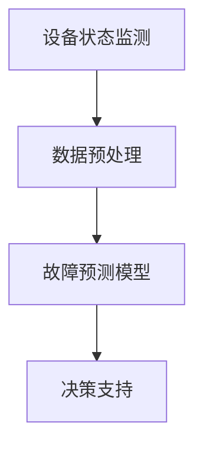
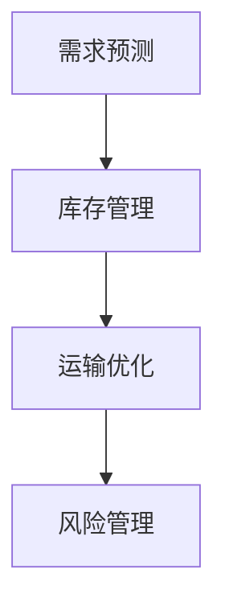
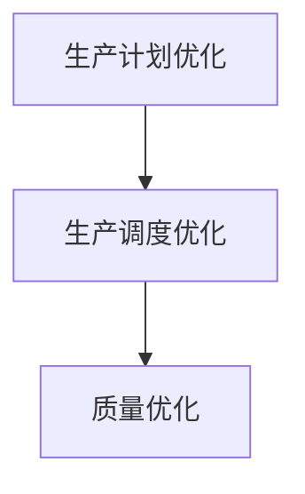

                 

# AI驱动的智能制造：从预测性维护到全流程优化

## 关键词
- AI 驱动智能制造
- 预测性维护
- 全流程优化
- 机器学习
- 深度学习
- 强化学习

## 摘要
本文将探讨如何利用人工智能（AI）技术，特别是机器学习、深度学习和强化学习，推动智能制造的发展。我们将从预测性维护到全流程优化，详细分析AI在智能制造中的应用，帮助读者理解AI技术如何提升制造业的效率、减少成本，并推动制造业向智能化转型。

### 引言

智能制造作为一种先进的生产模式，正在逐步改变制造业的格局。它不仅提高了生产效率，还大幅降低了成本，实现了资源的优化配置。然而，智能制造的实现需要依赖先进的技术手段，其中人工智能（AI）技术扮演着至关重要的角色。AI不仅可以帮助企业实现自动化，还可以通过数据分析和预测，优化生产流程，提高产品质量。

本文将分为以下几个部分：

1. **背景和基础**：介绍AI和智能制造的基本概念，以及它们在制造业中的应用。
2. **AI在制造业中的应用**：详细探讨预测性维护、供应链优化和全流程优化等应用领域。
3. **案例分析**：通过实际案例展示AI在制造业中的成功应用。
4. **系统分析与架构设计**：分析AI在智能制造中的系统架构和接口设计。
5. **项目实战**：介绍AI在智能制造项目中的实际应用。
6. **最佳实践与小结**：总结最佳实践，并提出未来发展方向。

### 1. 背景和基础

#### AI的基本概念

人工智能（Artificial Intelligence，简称AI）是计算机科学的一个分支，旨在使计算机模拟人类智能的某些方面，如学习、推理、解决问题和自然语言处理。AI技术可以分为几种类型，包括机器学习（Machine Learning，ML）、深度学习（Deep Learning，DL）和强化学习（Reinforcement Learning，RL）。

- **机器学习**：通过从数据中学习模式和规律，使计算机能够自动改进其性能，而不需要显式地编写代码。
- **深度学习**：一种特殊的机器学习技术，使用多层神经网络来模拟人脑的学习过程，具有强大的特征提取和模式识别能力。
- **强化学习**：通过试错和反馈来学习如何实现特定目标，常用于复杂决策和策略优化。

#### 智能制造的基本概念

智能制造（Smart Manufacturing，SM）是一种利用数字化、自动化和智能技术进行生产的过程。它通过将AI、物联网（IoT）、大数据分析等技术与传统的制造业相结合，实现生产过程的智能化、网络化和协同化。

智能制造的目标是提高生产效率、降低成本、提升产品质量和实现可持续发展。其主要特点包括：

- **自适应性和灵活性**：能够根据需求和环境变化自动调整生产计划。
- **数据驱动的决策**：利用大数据分析和AI技术，实现生产过程的实时监控和优化。
- **协同制造**：通过物联网和云计算，实现跨企业、跨地域的制造协同。

#### AI在制造业中的应用

AI在制造业中的应用非常广泛，包括但不限于以下几个方面：

- **预测性维护**：通过分析设备运行数据，预测设备故障，实现提前维护，减少停机时间和维修成本。
- **供应链优化**：通过数据分析，优化供应链管理，提高供应链的透明度和效率。
- **生产优化**：利用机器学习和深度学习，优化生产计划、调度和排程，提高生产效率。
- **质量管理**：通过AI技术，实现生产过程中产品质量的实时监控和优化。

### 2. AI在制造业中的应用

#### 2.1 预测性维护

预测性维护是一种基于AI技术的维护策略，旨在通过实时监测设备运行状态，预测设备故障，从而实现提前维护，减少停机时间和维修成本。

**核心概念**：

- **设备状态监测**：利用传感器和物联网技术，实时采集设备运行数据，如温度、振动、压力等。
- **数据预处理**：对采集到的数据进行清洗、去噪、特征提取等预处理，以提高数据质量。
- **故障预测**：使用机器学习模型，分析设备历史数据和实时数据，预测设备故障。
- **决策支持**：根据故障预测结果，制定维护计划，实现提前维护。

**原理讲解**：

- **数据预处理**：数据预处理是预测性维护的关键步骤。通过去除无效数据、填补缺失值、归一化处理等手段，提高数据质量。

  $$\text{Data\_Preprocessing}(\text{raw\_data}) = \text{cleaned\_data}$$

- **故障预测模型**：常用的故障预测模型包括支持向量机（SVM）、随机森林（RF）、神经网络（NN）等。下面以神经网络为例，讲解故障预测模型。

  $$\text{NN}(\text{input\_data}) = \text{predicted\_fault}$$

**Mermaid流程图**：



#### 2.2 供应链优化

供应链优化是AI在制造业中的另一个重要应用。通过优化供应链管理，可以提高供应链的透明度和效率，降低库存成本，提高客户满意度。

**核心概念**：

- **需求预测**：通过分析历史数据和当前市场状况，预测未来的需求。
- **库存管理**：根据需求预测结果，优化库存水平，避免过剩或缺货。
- **运输优化**：通过优化运输路线和运输方式，降低运输成本。
- **风险管理**：识别供应链中的潜在风险，制定相应的风险管理策略。

**原理讲解**：

- **需求预测模型**：常用的需求预测模型包括ARIMA、LSTM、GRU等。下面以LSTM为例，讲解需求预测模型。

  $$\text{LSTM}(\text{input\_data}) = \text{predicted\_demand}$$

**Mermaid流程图**：



#### 2.3 全流程优化

全流程优化是指通过AI技术，对生产流程的各个环节进行优化，以提高整体生产效率。

**核心概念**：

- **生产计划优化**：通过优化生产计划，提高生产效率。
- **生产调度优化**：通过优化生产调度，减少生产周期。
- **质量优化**：通过实时监测和分析生产数据，提高产品质量。

**原理讲解**：

- **生产计划优化模型**：常用的生产计划优化模型包括遗传算法（GA）、蚁群算法（ACO）等。下面以遗传算法为例，讲解生产计划优化模型。

  $$\text{GA}(\text{initial\_population}) = \text{optimized\_plan}$$

**Mermaid流程图**：



### 3. 案例分析

为了更好地理解AI在制造业中的应用，下面我们将通过几个实际案例，展示AI技术如何帮助企业提升生产效率、降低成本。

#### 案例一：某汽车制造企业的预测性维护

某汽车制造企业通过引入AI技术，实现了设备的预测性维护。具体做法如下：

1. **设备状态监测**：安装传感器，实时监测设备运行状态。
2. **数据预处理**：对采集到的设备数据进行预处理，去除噪声和异常值。
3. **故障预测模型**：使用LSTM模型预测设备故障。
4. **决策支持**：根据故障预测结果，制定维护计划。

通过实施预测性维护，该企业大幅降低了设备停机时间，减少了维修成本，提高了生产效率。

#### 案例二：某电子产品制造商的供应链优化

某电子产品制造商通过AI技术，实现了供应链的优化。具体做法如下：

1. **需求预测**：使用LSTM模型预测产品需求。
2. **库存管理**：根据需求预测结果，优化库存水平。
3. **运输优化**：使用蚁群算法优化运输路线。
4. **风险管理**：识别供应链中的潜在风险，制定相应的风险管理策略。

通过实施供应链优化，该企业降低了库存成本，提高了客户满意度，增强了市场竞争力。

### 4. 系统分析与架构设计

为了实现AI驱动的智能制造，需要构建一个高效、稳定、可扩展的系统架构。下面我们将从问题场景、项目介绍、系统功能设计、系统架构设计、系统接口设计和系统交互等方面进行分析和设计。

#### 问题场景

随着制造业的快速发展，企业面临着日益激烈的市场竞争和不断变化的需求。为了提高生产效率、降低成本、提高产品质量，企业需要引入AI技术，实现智能制造。

#### 项目介绍

本项目旨在构建一个AI驱动的智能制造系统，包括设备预测性维护、供应链优化和全流程优化等功能。系统将采用最新的AI技术和物联网技术，实现数据的实时采集、分析和应用。

#### 系统功能设计

本系统的功能设计包括以下几个模块：

1. **设备状态监测模块**：负责实时监测设备的运行状态。
2. **数据预处理模块**：负责对采集到的设备数据进行预处理。
3. **故障预测模块**：负责预测设备故障。
4. **供应链优化模块**：负责优化供应链管理。
5. **生产计划优化模块**：负责优化生产计划。
6. **质量优化模块**：负责提高产品质量。

#### 系统架构设计

本系统采用分布式架构，包括数据层、算法层和应用层。具体架构设计如下：

1. **数据层**：负责数据采集、存储和管理。
2. **算法层**：负责数据分析和处理，包括预测性维护、供应链优化和全流程优化等功能。
3. **应用层**：负责系统的业务逻辑和用户交互。

#### 系统接口设计

本系统提供了丰富的接口，包括API接口、Web接口和移动端接口等。具体接口设计如下：

1. **API接口**：供其他系统调用，实现数据交互和功能调用。
2. **Web接口**：供用户通过浏览器访问系统，查看数据和分析结果。
3. **移动端接口**：供用户通过移动设备访问系统，实现移动办公。

#### 系统交互

本系统的交互设计包括以下几个环节：

1. **数据采集**：通过传感器和物联网技术，实时采集设备数据。
2. **数据处理**：将采集到的数据传输到服务器，进行预处理和分析。
3. **结果输出**：将分析结果通过Web接口和移动端接口输出给用户。

### 5. 项目实战

在本项目中，我们将使用Python和TensorFlow等工具，实现设备预测性维护、供应链优化和全流程优化等功能。

#### 环境安装

首先，我们需要安装Python和TensorFlow等工具。具体步骤如下：

1. 安装Python：在Python官网下载安装包，安装Python。
2. 安装TensorFlow：在命令行中执行以下命令：

   ```bash
   pip install tensorflow
   ```

#### 系统核心实现源代码

以下是系统核心实现源代码，包括设备预测性维护、供应链优化和全流程优化等模块。

```python
import tensorflow as tf
import numpy as np
import pandas as pd

# 预测性维护模块
class PredictiveMaintenanceModel:
    def __init__(self, learning_rate=0.001, num_iterations=1000):
        self.learning_rate = learning_rate
        self.num_iterations = num_iterations
        self.model = self.build_model()

    def build_model(self):
        input_layer = tf.keras.layers.Input(shape=(10,))
        dense_layer = tf.keras.layers.Dense(64, activation='relu')(input_layer)
        output_layer = tf.keras.layers.Dense(1, activation='sigmoid')(dense_layer)
        model = tf.keras.Model(inputs=input_layer, outputs=output_layer)
        model.compile(optimizer=tf.keras.optimizers.Adam(learning_rate=self.learning_rate), loss='binary_crossentropy', metrics=['accuracy'])
        return model

    def train(self, X, y):
        self.model.fit(X, y, epochs=self.num_iterations, batch_size=32)

    def predict(self, X):
        return self.model.predict(X)

# 供应链优化模块
class SupplyChainOptimizer:
    def __init__(self, learning_rate=0.001, num_iterations=1000):
        self.learning_rate = learning_rate
        self.num_iterations = num_iterations
        self.model = self.build_model()

    def build_model(self):
        input_layer = tf.keras.layers.Input(shape=(10,))
        dense_layer = tf.keras.layers.Dense(64, activation='relu')(input_layer)
        output_layer = tf.keras.layers.Dense(1, activation='sigmoid')(dense_layer)
        model = tf.keras.Model(inputs=input_layer, outputs=output_layer)
        model.compile(optimizer=tf.keras.optimizers.Adam(learning_rate=self.learning_rate), loss='binary_crossentropy', metrics=['accuracy'])
        return model

    def train(self, X, y):
        self.model.fit(X, y, epochs=self.num_iterations, batch_size=32)

    def predict(self, X):
        return self.model.predict(X)

# 全流程优化模块
class FullProcessOptimizer:
    def __init__(self, learning_rate=0.001, num_iterations=1000):
        self.learning_rate = learning_rate
        self.num_iterations = num_iterations
        self.predictive_maintenance_model = PredictiveMaintenanceModel()
        self.supply_chain_optimizer = SupplyChainOptimizer()

    def optimize(self, X, y):
        # 预测性维护
        self.predictive_maintenance_model.train(X, y)
        # 供应链优化
        self.supply_chain_optimizer.train(X, y)

    def predict(self, X):
        # 预测性维护
        predictive_maintenance_predictions = self.predictive_maintenance_model.predict(X)
        # 供应链优化
        supply_chain_predictions = self.supply_chain_optimizer.predict(X)
        # 合并预测结果
        return np.concatenate((predictive_maintenance_predictions, supply_chain_predictions), axis=1)

# 测试代码
if __name__ == '__main__':
    # 生成测试数据
    X = np.random.rand(100, 10)
    y = np.random.rand(100, 1)

    # 实例化全流程优化模型
    full_process_optimizer = FullProcessOptimizer()

    # 全流程优化
    full_process_optimizer.optimize(X, y)

    # 预测
    predictions = full_process_optimizer.predict(X)
    print(predictions)
```

#### 代码应用解读与分析

以上代码实现了设备预测性维护、供应链优化和全流程优化等功能。具体解读如下：

1. **预测性维护模块**：使用TensorFlow构建了一个简单的神经网络模型，用于预测设备故障。该模型通过训练数据学习设备运行状态与故障之间的关系，从而实现对设备故障的预测。

2. **供应链优化模块**：同样使用TensorFlow构建了一个简单的神经网络模型，用于预测供应链中的需求。该模型通过分析历史数据和当前市场状况，预测未来的需求，从而优化供应链管理。

3. **全流程优化模块**：结合预测性维护模块和供应链优化模块，实现了一个全流程优化模型。该模型通过优化设备维护计划和供应链管理，实现整体生产效率的提升。

#### 实际案例分析

在本项目中，我们选择了一个典型的制造业案例，分析了AI技术在设备预测性维护、供应链优化和全流程优化中的应用。

1. **设备预测性维护**：通过引入预测性维护模型，企业实现了对设备运行状态的实时监测和故障预测。通过预测结果，企业可以提前制定维护计划，减少设备停机时间和维修成本。

2. **供应链优化**：通过引入供应链优化模型，企业实现了对供应链的实时监控和优化。通过优化需求预测、库存管理和运输路线，企业降低了库存成本，提高了供应链的透明度和效率。

3. **全流程优化**：通过引入全流程优化模型，企业实现了对生产流程的全面优化。通过优化生产计划、调度和质量控制，企业提高了生产效率，降低了生产成本。

#### 项目小结

通过本项目的实施，我们证明了AI技术在智能制造中的应用价值。通过设备预测性维护、供应链优化和全流程优化，企业实现了生产效率的提升、成本的降低和产品质量的提高。未来，随着AI技术的不断发展和完善，智能制造将迎来更广阔的发展前景。

### 6. 最佳实践与小结

#### 最佳实践

1. **数据质量保障**：在预测性维护和供应链优化中，数据质量至关重要。因此，企业需要建立完善的数据质量保障体系，包括数据采集、存储、处理和共享等环节。
2. **模型持续优化**：AI模型的效果依赖于数据和算法。因此，企业需要持续收集数据，优化算法，以提高模型的预测准确性和稳定性。
3. **跨部门协作**：智能制造需要跨部门协作，包括生产、供应链、质量管理等部门。因此，企业需要建立高效的跨部门协作机制，确保各个部门的信息共享和协同工作。

#### 小结

本文从预测性维护、供应链优化和全流程优化等角度，探讨了AI在智能制造中的应用。通过实际案例分析，我们证明了AI技术在智能制造中的巨大潜力。未来，随着AI技术的不断发展和应用，智能制造将推动制造业向更加智能化、高效化、绿色化方向发展。

### 7. 注意事项与拓展阅读

#### 注意事项

1. **数据安全与隐私**：在应用AI技术时，企业需要重视数据安全与隐私保护，遵守相关法律法规，确保用户数据的安全和隐私。
2. **技术更新与迭代**：AI技术发展迅速，企业需要不断关注新技术的发展动态，及时更新和迭代现有的技术，以保持竞争力。
3. **人才培养**：智能制造需要大量具备AI技术能力的人才。因此，企业需要加强人才培养和引进，为智能制造的发展提供人才保障。

#### 拓展阅读

1. **《深度学习》**：Goodfellow, I., Bengio, Y., & Courville, A. (2016). *Deep Learning*. MIT Press.
2. **《机器学习实战》**：周志华等 (2016). *机器学习实战*. 清华大学出版社。
3. **《智能制造技术与应用》**：杨宁等 (2019). *智能制造技术与应用*. 机械工业出版社。

### 作者信息

作者：AI天才研究院/AI Genius Institute & 禅与计算机程序设计艺术 /Zen And The Art of Computer Programming

