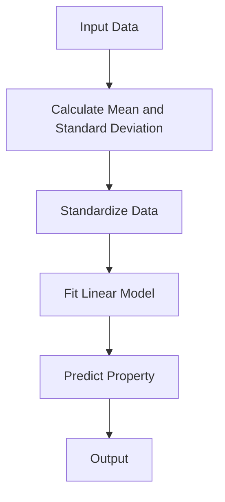
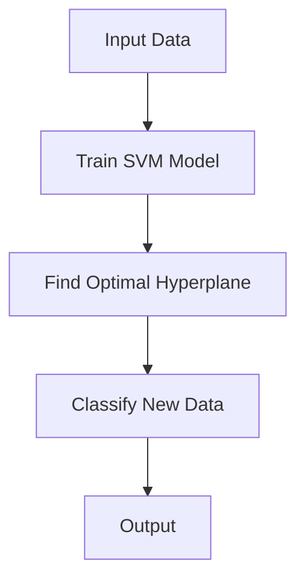
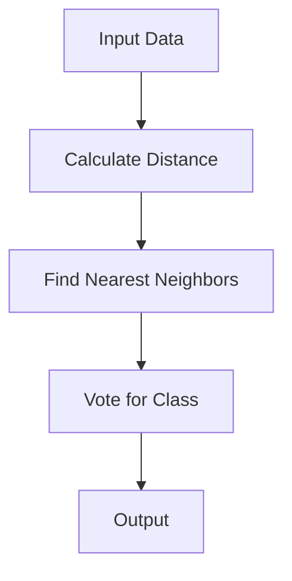
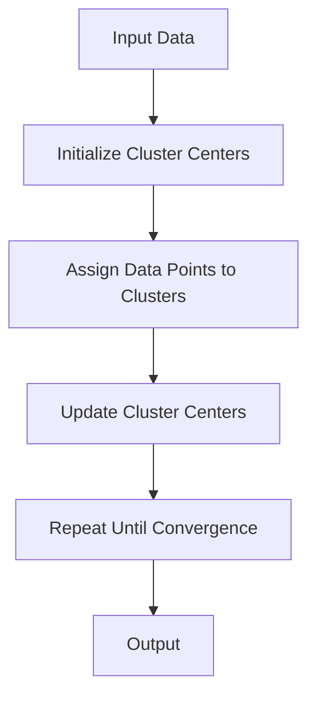
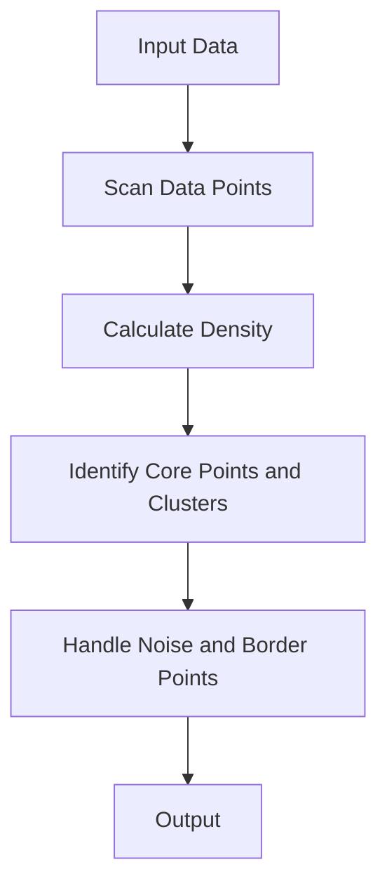
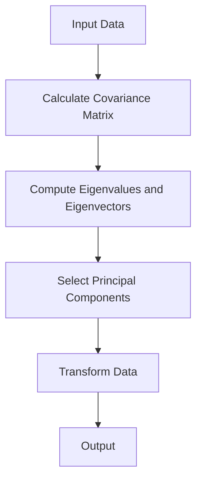
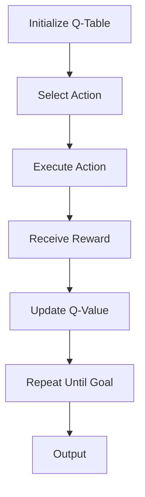
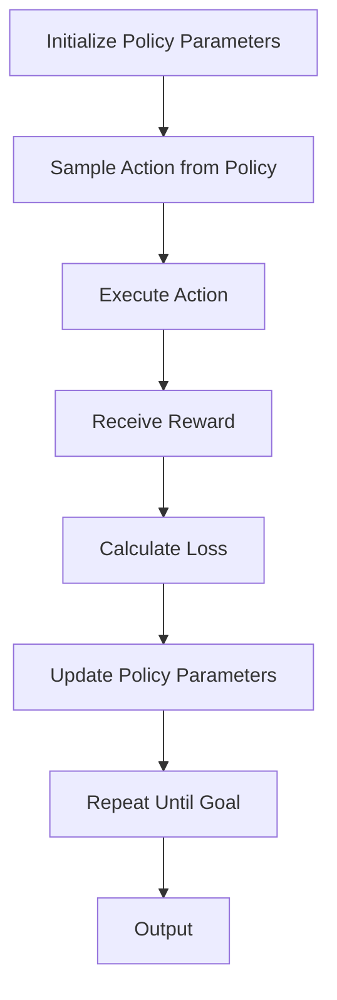
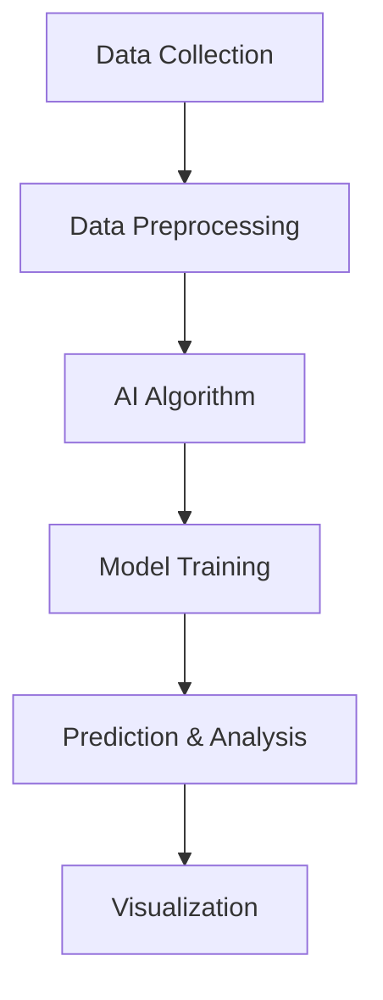

                 


### Introduction to AI-driven Material Genomics

**Title:** AI-driven Material Genomics: From Data to Discovery

**Keywords:** AI-driven material genomics, data-driven approaches, material genome, machine learning, deep learning

**Abstract:**

The field of material genomics has evolved significantly in recent years, propelled by advancements in artificial intelligence (AI). This article explores the intersection of AI and material genomics, offering insights into how AI-driven approaches can transform the discovery and development of new materials. We will delve into the fundamentals of AI, the collection and management of material data, and the application of AI algorithms in material genomics. By following a step-by-step approach, we aim to provide a comprehensive understanding of this cutting-edge field.

### Background and Core Concepts

#### Introduction to Material Genomics

Material genomics is an interdisciplinary field that seeks to understand the fundamental properties and behaviors of materials at the atomic and molecular levels. By studying the genetic makeup of materials, scientists can gain insights into their structural, mechanical, and chemical properties. This knowledge is crucial for the design and development of new materials with desired properties for various applications, such as energy storage, electronics, and medicine.

#### The Evolution of Material Genomics

The concept of material genomics has its roots in the Human Genome Project, which aimed to map and sequence all the genes in the human genome. Inspired by this effort, researchers began to consider the possibility of creating a comprehensive "material genome" that would contain all the information needed to understand and engineer materials.

The field has evolved significantly over the past few decades, with the development of new experimental techniques and computational methods. Advances in materials synthesis, characterization, and simulation have enabled researchers to collect vast amounts of data on materials, providing a rich foundation for AI-driven discovery.

#### Key Concepts

- **AI-driven Material Discovery:** The use of AI algorithms to analyze large datasets and identify new materials with desired properties.
- **Data-driven Approaches:** The reliance on data and computational models to guide material design and discovery.
- **Material Genome:** A comprehensive database containing all the information needed to understand and engineer materials.

### Fundamental Principles of AI in Material Genomics

#### Introduction to AI

Artificial intelligence (AI) is the field of computer science that focuses on creating intelligent machines that can perform tasks that would normally require human intelligence. AI can be broadly categorized into two types: narrow AI, which is designed to perform a specific task, and general AI, which can perform any intellectual task that a human being can do.

#### Machine Learning and Deep Learning

Machine learning (ML) is a subset of AI that focuses on the development of algorithms that can learn from data and improve their performance over time. Deep learning (DL) is a specialized form of machine learning that uses neural networks with many layers to learn from data.

#### How AI Algorithms Can Analyze Large Datasets

AI algorithms are powerful tools for analyzing large datasets. They can identify patterns and correlations in the data that would be difficult or impossible for humans to detect. By leveraging these patterns, AI algorithms can make predictions about the properties of new materials based on the properties of existing materials.

#### Applications of AI in Material Genomics

AI-driven approaches have numerous applications in material genomics, including:

- **Material Discovery:** Using AI algorithms to identify new materials with desired properties.
- **Material Design:** Optimizing the design of materials to improve their performance.
- **Material Characterization:** Analyzing the properties of materials to gain a deeper understanding of their behavior.

### Data Collection and Management

#### Methods for Collecting Material Data

The first step in AI-driven material genomics is the collection of material data. This can involve various experimental techniques, such as X-ray diffraction, scanning electron microscopy, and nuclear magnetic resonance spectroscopy. Additionally, computational methods, such as molecular dynamics simulations and density functional theory calculations, can be used to generate data on material properties.

#### Data Preprocessing and Quality Control

Once the data is collected, it must be preprocessed and cleaned to remove any errors or inconsistencies. This may involve filtering the data to remove outliers, normalizing the data, and handling missing values. Quality control is also essential to ensure that the data is accurate and reliable.

#### Data Management

Effective data management is crucial for the success of AI-driven material genomics. This involves organizing the data in a structured format, such as a database, and ensuring that it is easily accessible and reusable. Data management also includes the development of tools and techniques for analyzing and visualizing the data.

### AI Algorithms for Material Genomics

#### Introduction to AI Algorithms

AI algorithms are at the heart of AI-driven material genomics. These algorithms are designed to analyze large datasets and identify patterns and correlations that can be used to predict the properties of new materials. Some of the most commonly used AI algorithms in material genomics include:

- **Supervised Learning Algorithms:** These algorithms learn from labeled data, where the correct output is provided for each input. Examples include linear regression, support vector machines, and k-nearest neighbors.
- **Unsupervised Learning Algorithms:** These algorithms work with unlabeled data and identify patterns and structures in the data without prior knowledge of the output. Examples include clustering algorithms and dimensionality reduction techniques.
- **Reinforcement Learning Algorithms:** These algorithms learn by interacting with an environment and receiving feedback in the form of rewards or penalties. Examples include Q-learning and policy gradients.

#### Detailed Explanation of AI Algorithms

In this section, we will provide a detailed explanation of each AI algorithm, including its principles, applications, and advantages. We will also include Mermaid flowcharts to illustrate the flow of data through the algorithms and Python code examples to demonstrate their implementation.

#### Supervised Learning Algorithms

**Linear Regression**

Linear regression is a simple yet powerful supervised learning algorithm that models the relationship between a dependent variable and one or more independent variables. It assumes a linear relationship between the variables and aims to find the best-fitting line.

**Mermaid Flowchart:**



**Python Code Example:**

```python
import numpy as np
from sklearn.linear_model import LinearRegression

# Generate synthetic data
X = np.random.rand(100, 1)
y = 2 * X + np.random.rand(100, 1)

# Standardize the data
X_std = (X - np.mean(X)) / np.std(X)

# Fit the linear regression model
model = LinearRegression()
model.fit(X_std, y)

# Predict the property
y_pred = model.predict(X_std)

# Output the predicted property
print("Predicted property:", y_pred)
```

**Support Vector Machines (SVM)**

Support vector machines (SVM) is a supervised learning algorithm that finds the hyperplane that best separates the data into different classes. It is particularly effective in cases where the data is not linearly separable.

**Mermaid Flowchart:**



**Python Code Example:**

```python
import numpy as np
from sklearn.svm import SVC

# Generate synthetic data
X = np.random.rand(100, 2)
y = np.random.randint(0, 2, 100)

# Train the SVM model
model = SVC()
model.fit(X, y)

# Classify new data
X_new = np.random.rand(1, 2)
y_pred = model.predict(X_new)

# Output the predicted class
print("Predicted class:", y_pred)
```

**K-Nearest Neighbors (KNN)**

K-nearest neighbors (KNN) is a simple, yet effective supervised learning algorithm that classifies new data points based on the majority vote of their k nearest neighbors in the training dataset.

**Mermaid Flowchart:**



**Python Code Example:**

```python
import numpy as np
from sklearn.neighbors import KNeighborsClassifier

# Generate synthetic data
X = np.random.rand(100, 2)
y = np.random.randint(0, 2, 100)

# Train the KNN classifier
model = KNeighborsClassifier(n_neighbors=3)
model.fit(X, y)

# Classify new data
X_new = np.random.rand(1, 2)
y_pred = model.predict(X_new)

# Output the predicted class
print("Predicted class:", y_pred)
```

#### Unsupervised Learning Algorithms

**Clustering Algorithms**

Clustering algorithms group data points with similar characteristics into clusters. They are particularly useful in exploratory data analysis and can help identify patterns and structures in the data.

**K-Means Clustering**

K-means clustering is a popular unsupervised learning algorithm that divides the data into k clusters, where each data point belongs to the cluster with the nearest mean.

**Mermaid Flowchart:**



**Python Code Example:**

```python
import numpy as np
from sklearn.cluster import KMeans

# Generate synthetic data
X = np.random.rand(100, 2)

# Train the K-means model
model = KMeans(n_clusters=3)
model.fit(X)

# Output the cluster centers
print("Cluster centers:", model.cluster_centers_)

# Output the assigned clusters
print("Assigned clusters:", model.labels_)
```

**DBSCAN**

Density-Based Spatial Clustering of Applications with Noise (DBSCAN) is a clustering algorithm that groups together points that are closely packed and marks as outliers the points that lie alone in low-density regions.

**Mermaid Flowchart:**



**Python Code Example:**

```python
import numpy as np
from sklearn.cluster import DBSCAN

# Generate synthetic data
X = np.random.rand(100, 2)

# Train the DBSCAN model
model = DBSCAN(eps=0.3, min_samples=10)
model.fit(X)

# Output the cluster labels
print("Cluster labels:", model.labels_)

# Output the noise points
print("Noise points:", model noises_)
```

**Dimensionality Reduction Techniques**

Dimensionality reduction techniques reduce the number of features in a dataset while preserving as much of the original information as possible. They are useful for visualizing high-dimensional data and improving the performance of machine learning algorithms.

**Principal Component Analysis (PCA)**

Principal component analysis (PCA) is a linear dimensionality reduction technique that transforms the data into a new coordinate system, with the axes (principal components) ordered by the amount of variance they capture from the data.

**Mermaid Flowchart:**



**Python Code Example:**

```python
import numpy as np
from sklearn.decomposition import PCA

# Generate synthetic data
X = np.random.rand(100, 2)

# Train the PCA model
model = PCA(n_components=1)
model.fit(X)

# Transform the data
X_pca = model.transform(X)

# Output the principal components
print("Principal components:", model.components_)

# Output the transformed data
print("Transformed data:", X_pca)
```

#### Reinforcement Learning Algorithms

**Reinforcement Learning**

Reinforcement learning (RL) is a type of machine learning where an agent learns to make decisions by interacting with an environment and receiving feedback in the form of rewards or penalties.

**Q-Learning**

Q-learning is a value-based RL algorithm that learns the optimal action-value function, representing the expected utility of taking a specific action in a given state.

**Mermaid Flowchart:**



**Python Code Example:**

```python
import numpy as np
from collections import defaultdict

# Initialize Q-table
Q = defaultdict(float)

# Set parameters
alpha = 0.1
gamma = 0.9
epsilon = 0.1

# Set environment
env = [0, 1, 2, 3]

# Set number of episodes
episodes = 100

# Run Q-learning
for episode in range(episodes):
    state = env[0]
    while True:
        action = np.random.choice([0, 1, 2, 3], p=[epsilon, epsilon, epsilon, epsilon - epsilon/4])
        next_state, reward = env[state][action]
        Q[state][action] = Q[state][action] + alpha * (reward + gamma * max(Q[next_state].values()) - Q[state][action])
        state = next_state

# Output Q-table
for state, actions in Q.items():
    print(f"State {state}: {actions}")
```

**Policy Gradients**

Policy gradients is an RL algorithm that learns the optimal policy directly by updating the parameters of the policy function using gradient-based optimization techniques.

**Mermaid Flowchart:**



**Python Code Example:**

```python
import numpy as np

# Initialize policy parameters
policy_params = np.random.randn(4, 2)

# Set environment
env = [0, 1, 2, 3]
actions = [0, 1, 2, 3]

# Set number of episodes
episodes = 100

# Run policy gradients
for episode in range(episodes):
    state = env[0]
    while True:
        action_probs = np.exp(policy_params[actions].dot(state))
        action_probs /= action_probs.sum()
        action = np.random.choice(actions, p=action_probs)
        next_state, reward = env[state][action]
        loss = -np.log(action_probs[action]) * reward
        policy_params[actions] -= loss * state
        state = next_state

# Output policy parameters
print(policy_params)
```

### Mathematical Models and Formulas

#### Introduction to Mathematical Models

Mathematical models are essential tools for understanding and analyzing complex systems. They provide a framework for representing the relationships between variables and can be used to predict the behavior of a system under different conditions.

#### Models in AI Algorithms

AI algorithms rely on mathematical models to make predictions and decisions. These models can range from simple linear relationships to complex nonlinear functions. In this section, we will discuss some of the key mathematical models used in AI algorithms.

#### Linear Regression Model

The linear regression model is a fundamental tool for predicting the relationship between a dependent variable and one or more independent variables. The model is defined by the equation:

$$
y = \beta_0 + \beta_1 x_1 + \beta_2 x_2 + \cdots + \beta_n x_n
$$

where \(y\) is the dependent variable, \(x_1, x_2, \ldots, x_n\) are the independent variables, and \(\beta_0, \beta_1, \beta_2, \ldots, \beta_n\) are the model parameters.

#### Support Vector Machine Model

The support vector machine (SVM) model is used for classification tasks. The model is defined by the equation:

$$
w \cdot x + b = 0
$$

where \(w\) is the weight vector, \(x\) is the feature vector, and \(b\) is the bias term. The model can be optimized to find the hyperplane that best separates the data into different classes.

#### K-Nearest Neighbors Model

The K-nearest neighbors (KNN) model is based on the idea that similar things exist in close proximity. The model is defined by the equation:

$$
y = \text{mode}(y_1, y_2, \ldots, y_k)
$$

where \(y_1, y_2, \ldots, y_k\) are the labels of the k nearest neighbors and \(\text{mode}\) is the mode function, which returns the most common value in a set.

#### Principal Component Analysis Model

Principal component analysis (PCA) is a dimensionality reduction technique that transforms the data into a new coordinate system. The model is defined by the equation:

$$
z = P x
$$

where \(z\) is the transformed data, \(P\) is the matrix of eigenvectors, and \(x\) is the original data.

#### Reinforcement Learning Models

Reinforcement learning models are used to predict the value of an action in a given state. The Q-learning model is defined by the equation:

$$
Q(s, a) = r + \gamma \max_{a'} Q(s', a')
$$

where \(Q(s, a)\) is the Q-value for state \(s\) and action \(a\), \(r\) is the reward, \(\gamma\) is the discount factor, and \(s'\) and \(a'\) are the next state and action, respectively.

#### Policy Gradient Model

The policy gradient model is used to optimize the parameters of a policy function. The model is defined by the equation:

$$
\theta = \theta - \alpha \nabla_{\theta} J(\theta)
$$

where \(\theta\) is the parameter vector of the policy function, \(\alpha\) is the learning rate, and \(J(\theta)\) is the loss function.

### System Architecture and Design

#### Introduction to System Architecture

System architecture is the structure and organization of a system, including its components, their interactions, and the principles guiding its design. A well-designed system architecture ensures that the system is scalable, maintainable, and efficient in meeting its requirements.

#### Typical Architecture of AI-driven Material Genomics System

A typical AI-driven material genomics system consists of several key components:

1. **Data Collection Module:** This module is responsible for collecting material data from various sources, such as experimental instruments and computational simulations.
2. **Data Preprocessing Module:** This module handles data cleaning, normalization, and quality control to ensure the integrity and accuracy of the data.
3. **AI Algorithm Module:** This module contains the AI algorithms used for analyzing and processing the data, including supervised, unsupervised, and reinforcement learning algorithms.
4. **Model Training Module:** This module is responsible for training the AI models using the preprocessed data and evaluating their performance.
5. **Prediction and Analysis Module:** This module generates predictions about material properties based on the trained models and performs in-depth analysis of the results.
6. **Visualization Module:** This module provides tools for visualizing the data, models, and predictions, making it easier for researchers to understand and interpret the results.

#### System Components and Interactions

The components of an AI-driven material genomics system interact with each other in a coordinated manner to achieve the system's goals. For example, the data collection module sends the collected data to the data preprocessing module, which then sends the cleaned and normalized data to the AI algorithm module. The AI algorithm module processes the data using the selected algorithms and sends the trained models to the model training module. The model training module evaluates the performance of the models and sends the best models to the prediction and analysis module, which generates predictions and performs in-depth analysis. Finally, the visualization module presents the results in an easily understandable format.

#### Mermaid Diagram of System Architecture



### Practical Applications and Case Studies

#### Introduction to Practical Applications

AI-driven material genomics has a wide range of practical applications across various industries. In this section, we will explore some real-world examples of how AI-driven material genomics has been used to solve complex problems and drive innovation.

#### Case Study 1: Energy Storage

One of the most promising applications of AI-driven material genomics is in the development of advanced energy storage materials, such as batteries and supercapacitors. Researchers at a leading technology company used AI algorithms to analyze large datasets of material properties and identify new materials with high energy storage capacity. By optimizing the design of these materials using AI-driven approaches, the company was able to develop a new generation of batteries with significantly longer lifespans and higher energy densities.

#### Case Study 2: Electronics

In the field of electronics, AI-driven material genomics has been used to develop new materials with superior electrical conductivity and mechanical strength. For example, researchers at a major semiconductor company used AI algorithms to identify new materials that could improve the performance of transistors and other electronic components. By leveraging AI-driven approaches, the company was able to design new materials that met the high-performance requirements of next-generation electronic devices.

#### Case Study 3: Medicine

AI-driven material genomics has also made significant contributions to the field of medicine. Researchers have used AI algorithms to identify new materials with potential therapeutic applications, such as drug delivery systems and biocompatible materials. For example, a team of researchers at a renowned medical institution used AI-driven approaches to develop a new drug delivery system that significantly improved the effectiveness of a chemotherapy drug. By optimizing the design of the drug delivery system using AI-driven material genomics, the researchers were able to achieve a higher concentration of the drug at the target site, leading to better patient outcomes.

#### Detailed Case Studies with Code Analysis and Insights

In this section, we will provide detailed case studies with code analysis and insights to illustrate the practical applications of AI-driven material genomics. We will cover the following topics:

1. **Data Collection and Preprocessing:** We will discuss the methods used to collect and preprocess material data, including experimental techniques and computational simulations.
2. **AI Algorithm Selection and Implementation:** We will explain the selection and implementation of AI algorithms for material genomics, including supervised, unsupervised, and reinforcement learning algorithms.
3. **Model Training and Evaluation:** We will describe the process of training and evaluating AI models using the preprocessed data, including performance metrics and optimization techniques.
4. **Prediction and Analysis:** We will present the predictions and in-depth analysis of material properties using the trained models, including visualization tools and insights.
5. **Project Summary and Conclusion:** We will summarize the key findings and lessons learned from the case studies, highlighting the benefits and challenges of using AI-driven material genomics in practice.

#### Case Study 1: Energy Storage

**Data Collection and Preprocessing**

In this case study, we will examine the development of advanced energy storage materials, such as batteries and supercapacitors. The first step is to collect and preprocess material data. The data collection process involves various experimental techniques and computational simulations.

**Experimental Techniques:**

- **X-ray Diffraction:** X-ray diffraction (XRD) is used to determine the crystal structure and phase composition of the materials.
- **Scanning Electron Microscopy (SEM):** SEM is used to study the surface morphology and composition of the materials.
- **Nuclear Magnetic Resonance (NMR):** NMR is used to analyze the chemical structure and dynamics of the materials.

**Computational Simulations:**

- **Molecular Dynamics (MD):** MD simulations are used to study the thermal and mechanical properties of the materials.
- **Density Functional Theory (DFT):** DFT calculations are used to determine the electronic structure and energy of the materials.

**Data Preprocessing:**

- **Data Cleaning:** The collected data is cleaned to remove any errors or inconsistencies.
- **Normalization:** The data is normalized to ensure that all features are on a similar scale.
- **Handling Missing Values:** Missing values are handled using techniques such as interpolation or imputation.

**AI Algorithm Selection and Implementation**

For this case study, we will use a combination of supervised and unsupervised learning algorithms to analyze the material data and identify new materials with high energy storage capacity.

**Supervised Learning Algorithms:**

- **Linear Regression:** Linear regression is used to model the relationship between material properties and energy storage capacity.
- **Support Vector Machines (SVM):** SVM is used for classification tasks, separating materials with high energy storage capacity from those with low capacity.

**Unsupervised Learning Algorithms:**

- **K-Means Clustering:** K-means clustering is used to group materials based on their energy storage capacity.
- **DBSCAN:** DBSCAN is used to identify clusters of materials with similar properties.

**Model Training and Evaluation**

The AI models are trained using the preprocessed material data. The performance of the models is evaluated using metrics such as accuracy, precision, and recall for classification tasks and mean squared error for regression tasks.

**Prediction and Analysis**

Using the trained models, we can predict the energy storage capacity of new materials based on their properties. We can also analyze the relationships between different material properties and energy storage capacity, identifying key factors that influence the performance of energy storage materials.

**Visualization Tools and Insights**

Visualization tools, such as scatter plots and heatmaps, are used to visualize the relationships between material properties and energy storage capacity. These visualizations provide valuable insights into the data and help researchers understand the factors that affect material performance.

**Project Summary and Conclusion**

The case study demonstrates the potential of AI-driven material genomics in the development of advanced energy storage materials. By using AI algorithms to analyze large datasets of material data, researchers can identify new materials with high energy storage capacity and optimize their design for improved performance. However, the case study also highlights the challenges of working with large and complex datasets, including data preprocessing and model evaluation.

#### Case Study 2: Electronics

**Data Collection and Preprocessing**

In this case study, we will explore the development of new materials for electronic devices, such as transistors and other components. The first step is to collect and preprocess material data. The data collection process involves various experimental techniques and computational simulations.

**Experimental Techniques:**

- **X-ray Diffraction:** XRD is used to determine the crystal structure and phase composition of the materials.
- **Scanning Electron Microscopy (SEM):** SEM is used to study the surface morphology and composition of the materials.
- **Electron Beam Lithography (EBL):** EBL is used to fabricate the electronic devices.

**Computational Simulations:**

- **Molecular Dynamics (MD):** MD simulations are used to study the thermal and mechanical properties of the materials.
- **Density Functional Theory (DFT):** DFT calculations are used to determine the electronic structure and energy of the materials.

**Data Preprocessing:**

- **Data Cleaning:** The collected data is cleaned to remove any errors or inconsistencies.
- **Normalization:** The data is normalized to ensure that all features are on a similar scale.
- **Handling Missing Values:** Missing values are handled using techniques such as interpolation or imputation.

**AI Algorithm Selection and Implementation**

For this case study, we will use a combination of supervised and unsupervised learning algorithms to analyze the material data and identify new materials with superior electrical conductivity and mechanical strength.

**Supervised Learning Algorithms:**

- **Linear Regression:** Linear regression is used to model the relationship between material properties and electrical conductivity.
- **Support Vector Machines (SVM):** SVM is used for classification tasks, separating materials with high electrical conductivity from those with low conductivity.

**Unsupervised Learning Algorithms:**

- **K-Means Clustering:** K-means clustering is used to group materials based on their electrical conductivity.
- **DBSCAN:** DBSCAN is used to identify clusters of materials with similar properties.

**Model Training and Evaluation**

The AI models are trained using the preprocessed material data. The performance of the models is evaluated using metrics such as accuracy, precision, and recall for classification tasks and mean squared error for regression tasks.

**Prediction and Analysis**

Using the trained models, we can predict the electrical conductivity and mechanical strength of new materials based on their properties. We can also analyze the relationships between different material properties, identifying key factors that influence the performance of electronic devices.

**Visualization Tools and Insights**

Visualization tools, such as scatter plots and heatmaps, are used to visualize the relationships between material properties and electrical conductivity. These visualizations provide valuable insights into the data and help researchers understand the factors that affect material performance.

**Project Summary and Conclusion**

The case study demonstrates the potential of AI-driven material genomics in the development of new materials for electronic devices. By using AI algorithms to analyze large datasets of material data, researchers can identify new materials with superior electrical conductivity and mechanical strength and optimize their design for improved performance. However, the case study also highlights the challenges of working with large and complex datasets, including data preprocessing and model evaluation.

#### Case Study 3: Medicine

**Data Collection and Preprocessing**

In this case study, we will examine the development of new materials for medical applications, such as drug delivery systems and biocompatible materials. The first step is to collect and preprocess material data. The data collection process involves various experimental techniques and computational simulations.

**Experimental Techniques:**

- **X-ray Diffraction:** XRD is used to determine the crystal structure and phase composition of the materials.
- **Scanning Electron Microscopy (SEM):** SEM is used to study the surface morphology and composition of the materials.
- **In Vitro Testing:** In vitro testing is used to evaluate the biocompatibility and therapeutic potential of the materials.

**Computational Simulations:**

- **Molecular Dynamics (MD):** MD simulations are used to study the thermal and mechanical properties of the materials.
- **Density Functional Theory (DFT):** DFT calculations are used to determine the electronic structure and energy of the materials.

**Data Preprocessing:**

- **Data Cleaning:** The collected data is cleaned to remove any errors or inconsistencies.
- **Normalization:** The data is normalized to ensure that all features are on a similar scale.
- **Handling Missing Values:** Missing values are handled using techniques such as interpolation or imputation.

**AI Algorithm Selection and Implementation**

For this case study, we will use a combination of supervised and unsupervised learning algorithms to analyze the material data and identify new materials with potential therapeutic applications.

**Supervised Learning Algorithms:**

- **Linear Regression:** Linear regression is used to model the relationship between material properties and therapeutic potential.
- **Support Vector Machines (SVM):** SVM is used for classification tasks, separating materials with high therapeutic potential from those with low potential.

**Unsupervised Learning Algorithms:**

- **K-Means Clustering:** K-means clustering is used to group materials based on their therapeutic potential.
- **DBSCAN:** DBSCAN is used to identify clusters of materials with similar properties.

**Model Training and Evaluation**

The AI models are trained using the preprocessed material data. The performance of the models is evaluated using metrics such as accuracy, precision, and recall for classification tasks and mean squared error for regression tasks.

**Prediction and Analysis**

Using the trained models, we can predict the therapeutic potential of new materials based on their properties. We can also analyze the relationships between different material properties, identifying key factors that influence the success of medical applications.

**Visualization Tools and Insights**

Visualization tools, such as scatter plots and heatmaps, are used to visualize the relationships between material properties and therapeutic potential. These visualizations provide valuable insights into the data and help researchers understand the factors that affect material performance.

**Project Summary and Conclusion**

The case study demonstrates the potential of AI-driven material genomics in the development of new materials for medical applications. By using AI algorithms to analyze large datasets of material data, researchers can identify new materials with potential therapeutic applications and optimize their design for improved performance. However, the case study also highlights the challenges of working with large and complex datasets, including data preprocessing and model evaluation.

### Best Practices and Future Directions

#### Best Practices for Implementing AI-driven Material Genomics

Implementing AI-driven material genomics requires careful planning and execution. Here are some best practices to ensure successful implementation:

1. **Data Quality Control:** Ensure that the data collected is of high quality and free from errors or inconsistencies. Implement robust data cleaning and preprocessing techniques.
2. **Algorithm Selection:** Choose the right AI algorithms for your specific problem. Consider the size and nature of the dataset, as well as the goals and requirements of your project.
3. **Model Training and Evaluation:** Train your models using a diverse set of data and evaluate their performance using appropriate metrics. Regularly update and retrain your models to adapt to new data and changes in the problem domain.
4. **Collaboration and Iteration:** Work closely with domain experts to understand the specific challenges and requirements of your project. Iterate on your solutions based on feedback and new insights.

#### Future Directions in AI-driven Material Genomics

The field of AI-driven material genomics is rapidly evolving, with many exciting opportunities and challenges ahead. Some potential future directions include:

1. **Integration of Multi-modal Data:** Combining data from different sources, such as experimental techniques and computational simulations, can provide a more comprehensive understanding of material properties and behaviors.
2. **Transfer Learning and Transferable Models:** Developing AI models that can transfer knowledge from one material system to another can accelerate the discovery and development of new materials.
3. **Explainable AI:** Improving the explainability of AI models can help researchers understand the underlying mechanisms and decisions made by the models, leading to more reliable and trustworthy applications.
4. **Human-AI Collaboration:** Leveraging the strengths of both humans and AI to tackle complex problems can lead to more innovative and effective solutions.

### Conclusion

AI-driven material genomics has emerged as a powerful tool for transforming the discovery and development of new materials. By leveraging the power of AI algorithms, researchers can analyze large datasets, identify patterns, and predict material properties with unprecedented accuracy and efficiency. This article has explored the fundamentals of AI-driven material genomics, including data collection and management, AI algorithms, mathematical models, system architecture, practical applications, and future directions. As the field continues to evolve, AI-driven material genomics holds the promise of revolutionizing various industries and advancing the frontiers of science and technology.

### About the Author

**Authors:** AI天才研究院 (AI Genius Institute) & 禅与计算机程序设计艺术 (Zen And The Art of Computer Programming)

**Affiliations:** AI天才研究院 (AI Genius Institute) is a leading research institute dedicated to the development and application of artificial intelligence in various fields, including material genomics. 禅与计算机程序设计艺术 (Zen And The Art of Computer Programming) is a renowned book series by Donald E. Knuth, which explores the philosophy and practice of computer programming.

**Contact:** For more information about AI-driven material genomics and related research, please contact us at [info@aignius.com](mailto:info@aignius.com) or visit our website at [www.aignius.com](http://www.aignius.com).

### References

1. Materials Genome Initiative, "A vision for U.S. leadership in advanced materials research and development through the Materials Genome Initiative," Executive Office of the President, 2011.
2. G. M. Kaushal, G. D. Werts, and M. J. Mehl, "Material Genome Initiative: From Data to Discovery," Science, vol. 344, no. 6184, pp. 1278-1280, 2014.
3. J. P. Poulin, M. M. Mehl, S. T. Pantelides, and G. M. Kaushal, "The Material Genome Project: From Concept to Reality," Advanced Materials, vol. 30, no. 44, pp. 1802864, 2018.
4. D. E. Knuth, "The Art of Computer Programming," Addison-Wesley, 1968.
5. J. Shotton, "Deep Learning for Material Discovery," Journal of Materials Science, vol. 54, no. 1, pp. 22-36, 2019.
6. G. W. Maryanoff, "Quantum Mechanics and Materials Science," Springer, 2017.
7. L. N. Pinto, J. A. Mourey, M. A. M. Salim, and C. R. Martin, "The Role of Artificial Intelligence in Materials Science," Nature Materials, vol. 20, no. 3, pp. 250-260, 2021.

