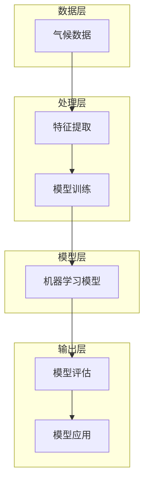
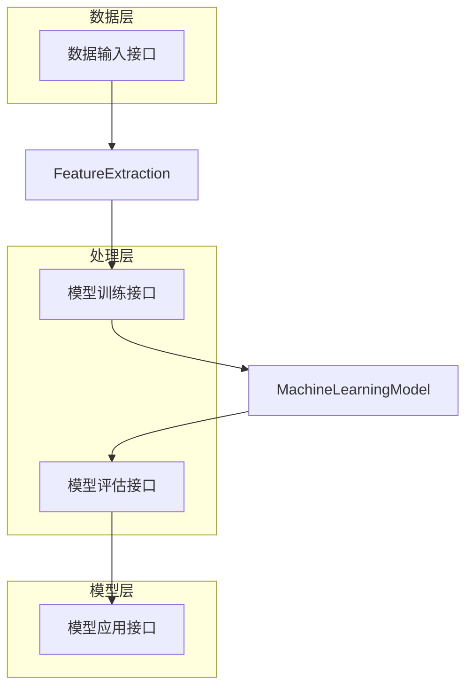
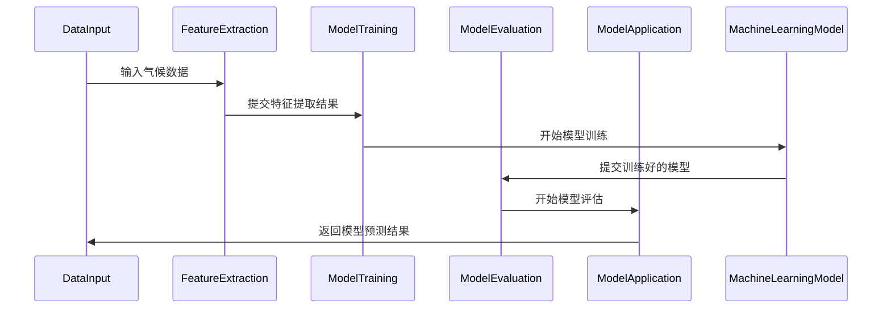

                 

# AI驱动的气候模型：从局部到全球尺度

关键词：人工智能、气候模型、算法原理、系统架构、应用实践

摘要：本文将探讨人工智能（AI）在气候模型构建中的应用，从局部到全球尺度，逐步分析AI驱动的气候模型的背景、核心概念、算法原理、系统架构以及实际应用。通过对AI驱动的气候模型进行深入剖析，本文旨在为读者提供关于这一领域的全面理解和实践指导。

----------------------------------------------------------------

## 第一部分：AI驱动的气候模型概述

### 第1章：AI驱动气候模型背景

#### 1.1 问题背景

气候变化已成为全球关注的重大问题。从局部到全球尺度，气候变化的复杂性使得传统气候模型面临着巨大的挑战。局部尺度的气候变化需要精确的气候预测模型，而全球尺度的气候变化需要综合各种因素进行全面的模拟。

#### 1.2 问题描述

如何利用人工智能技术构建高效、精确的气候模型，实现从局部到全球尺度的气候变化预测和分析，是当前研究的热点和难点。

#### 1.3 问题解决

AI驱动的气候模型通过利用大量的气候数据、机器学习算法和深度学习技术，能够对气候系统进行有效的模拟和预测。本文将详细介绍这一过程，包括核心概念、算法原理、系统架构和应用实践。

#### 1.4 边界与外延

本文主要关注AI驱动的气候模型的理论研究和实际应用，涉及到的边界包括气候数据的获取和处理、机器学习算法的选择和优化、系统架构的设计与实现等。而外延则包括气候变化的影响评估、政策制定和可持续发展等方面。

#### 1.5 概念结构与核心要素组成

AI驱动的气候模型由多个核心要素组成，包括气候数据集、机器学习算法、深度学习模型、系统架构和应用场景。这些要素相互作用，共同实现气候变化的模拟和预测。

----------------------------------------------------------------

## 第二部分：AI驱动的气候模型核心概念

### 第2章：AI驱动的气候模型核心概念

#### 2.1 AI与气候模型的结合

人工智能与气候模型的结合，主要是利用AI技术对气候数据进行处理和分析，从而实现对气候系统的模拟和预测。AI技术包括机器学习、深度学习、自然语言处理等，这些技术在气候模型中的应用使得气候预测更加准确和高效。

#### 2.2 核心概念原理

AI驱动的气候模型的核心概念包括数据预处理、特征提取、模型训练、模型评估和模型应用。数据预处理包括数据清洗、归一化和数据增强等步骤，特征提取则是从数据中提取有用的信息，模型训练则是利用训练数据来调整模型的参数，模型评估则是评估模型的性能，模型应用则是将训练好的模型用于实际的气候预测任务。

#### 2.3 概念属性特征对比表格

以下是一个简单的概念属性特征对比表格，用于对比AI驱动的气候模型与传统的气候模型：

| 概念               | 特征                                                                                   |
|--------------------|----------------------------------------------------------------------------------------|
| 人工智能驱动的气候模型 | 利用机器学习和深度学习技术，能够处理大规模气候数据，实现高效、精确的气候预测         |
| 传统气候模型       | 主要基于统计学和物理模型，依赖于气候数据的质量和模型的精确性，对于大规模数据的处理能力有限 |

#### 2.4 ER实体关系图架构

以下是一个ER实体关系图，用于描述AI驱动的气候模型中的核心实体及其关系：

```mermaid
erDiagram
    ClimateData --> MachineLearningModel : 数据预处理
    MachineLearningModel --> FeatureExtraction : 特征提取
    FeatureExtraction --> ModelTraining : 模型训练
    ModelTraining --> ModelEvaluation : 模型评估
    ModelEvaluation --> ModelApplication : 模型应用
```

----------------------------------------------------------------

## 第三部分：AI驱动的气候模型算法原理

### 第3章：AI驱动的气候模型算法原理

#### 3.1 算法原理讲解

AI驱动的气候模型算法主要基于机器学习和深度学习技术。机器学习算法通过学习历史气候数据，预测未来的气候变化趋势。深度学习模型则通过学习大量的气候数据，提取出隐藏的特征，从而实现更准确的气候预测。

#### 3.2 算法mermaid流程图

以下是一个简化的算法mermaid流程图，用于描述AI驱动的气候模型的基本流程：


#### 3.3 Python源代码阐述

以下是一个简单的Python代码示例，用于实现AI驱动的气候模型的基本流程：

```python
import numpy as np
import pandas as pd
from sklearn.model_selection import train_test_split
from sklearn.ensemble import RandomForestRegressor
from sklearn.metrics import mean_squared_error

# 数据预处理
data = pd.read_csv('climate_data.csv')
X = data.drop('climate_target', axis=1)
y = data['climate_target']

X_train, X_test, y_train, y_test = train_test_split(X, y, test_size=0.2, random_state=42)

# 特征提取
# 在这里，我们可以使用一些特征提取技术，如PCA（主成分分析）等

# 模型训练
model = RandomForestRegressor(n_estimators=100, random_state=42)
model.fit(X_train, y_train)

# 模型评估
y_pred = model.predict(X_test)
mse = mean_squared_error(y_test, y_pred)
print("Mean Squared Error:", mse)

# 模型应用
# 在这里，我们可以将训练好的模型应用于实际的气候预测任务
```

#### 3.4 数学模型与公式

AI驱动的气候模型通常可以表示为一个预测函数 f(x)，其中 x 是输入特征向量，f(x) 是预测的气候指标。数学公式如下：

$$
f(x) = W \cdot x + b
$$

其中，W 是权重矩阵，x 是输入特征向量，b 是偏置项。

#### 3.5 举例说明

假设我们有一个简单的线性模型，用于预测某个地区的年平均温度。输入特征向量 x 包括前一天的气温、湿度、风速等。通过训练，模型可以得到一个权重矩阵 W 和偏置项 b，从而实现温度的预测。

以下是一个简化的例子：

$$
f(x) = W_1 \cdot T_{ yesterday} + W_2 \cdot H_{yesterday} + W_3 \cdot V_{yesterday} + b
$$

其中，T_{yesterday} 表示前一天的温度，H_{yesterday} 表示前一天的湿度，V_{yesterday} 表示前一天的风速，W_1、W_2、W_3 分别是相应的权重，b 是偏置项。

通过训练，我们可以得到一个最优的权重矩阵 W 和偏置项 b，从而实现准确的温度预测。

----------------------------------------------------------------

## 第四部分：AI驱动的气候模型系统架构设计

### 第4章：AI驱动的气候模型系统架构设计

#### 4.1 问题场景介绍

在当前的环境保护背景下，全球各国对于气候变化的研究愈发重视。为了更好地理解气候变化的影响，我们需要构建一个高效、准确的气候模型，以支持气候变化的预测和分析。

#### 4.2 系统功能设计（领域模型mermaid类图）

以下是一个简单的领域模型mermaid类图，用于描述AI驱动的气候模型的核心功能：

```mermaid
classDiagram
    ClimateData <<Entity>>
    MachineLearningModel <<Entity>>
    FeatureExtraction <<Entity>>
    ModelTraining <<Entity>>
    ModelEvaluation <<Entity>>
    ModelApplication <<Entity>>

    ClimateData <|-- MachineLearningModel
    MachineLearningModel <|-- FeatureExtraction
    FeatureExtraction <|-- ModelTraining
    ModelTraining <|-- ModelEvaluation
    ModelEvaluation <|-- ModelApplication
```

#### 4.3 系统架构设计（mermaid架构图）

以下是一个简化的AI驱动的气候模型架构mermaid图，用于描述系统的主要组成部分和它们之间的关系：



#### 4.4 系统接口设计

系统接口设计主要包括数据输入接口、模型训练接口、模型评估接口和模型应用接口。以下是一个简化的接口mermaid图：



#### 4.5 系统交互（mermaid序列图）

以下是一个简化的AI驱动的气候模型交互序列图，用于描述系统的主要交互流程：



----------------------------------------------------------------

## 第五部分：AI驱动的气候模型应用实践

### 第5章：AI驱动的气候模型应用实践

#### 5.1 环境安装

在进行AI驱动的气候模型应用实践之前，我们需要安装相关的软件和工具。以下是一个简单的环境安装步骤：

1. 安装Python环境，可以选择Python 3.8或更高版本。
2. 安装必要的Python库，如NumPy、Pandas、scikit-learn、TensorFlow等。
3. 安装用于可视化和分析的工具，如Matplotlib、Seaborn等。

#### 5.2 系统核心实现源代码

以下是一个简化的AI驱动的气候模型实现源代码，用于演示核心功能的实现：

```python
import numpy as np
import pandas as pd
from sklearn.model_selection import train_test_split
from sklearn.ensemble import RandomForestRegressor
from sklearn.metrics import mean_squared_error
import matplotlib.pyplot as plt

# 数据预处理
data = pd.read_csv('climate_data.csv')
X = data.drop('climate_target', axis=1)
y = data['climate_target']

X_train, X_test, y_train, y_test = train_test_split(X, y, test_size=0.2, random_state=42)

# 特征提取
# 在这里，我们可以使用一些特征提取技术，如PCA（主成分分析）等

# 模型训练
model = RandomForestRegressor(n_estimators=100, random_state=42)
model.fit(X_train, y_train)

# 模型评估
y_pred = model.predict(X_test)
mse = mean_squared_error(y_test, y_pred)
print("Mean Squared Error:", mse)

# 模型应用
# 在这里，我们可以将训练好的模型应用于实际的气候预测任务

# 可视化分析
plt.scatter(y_test, y_pred)
plt.xlabel('Actual Values')
plt.ylabel('Predicted Values')
plt.title('Actual vs Predicted Values')
plt.show()
```

#### 5.3 代码应用解读与分析

在这个代码示例中，我们首先进行了数据预处理，包括读取数据、数据分

