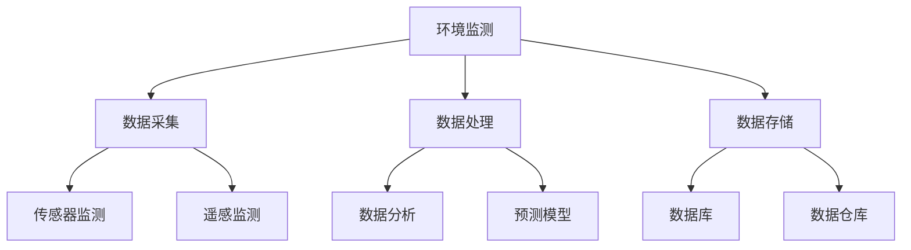

                 

# AI驱动的环境保护：从监测到治理

## 关键词
- 人工智能，环境保护，环境监测，环境治理，AI驱动的解决方案

## 摘要
本文将深入探讨人工智能（AI）在环境保护中的应用，从环境监测到治理的全过程。首先，我们介绍了AI在环境监测中的基本原理和应用案例，随后，我们详细阐述了AI驱动的环境治理技术及其应用场景。接着，文章通过实际案例展示了AI在环境监测和治理中的效果，并探讨了该领域的挑战和未来发展趋势。最后，我们对本文进行了总结，为读者提供了全面的技术见解和实践指南。

---

## 第一部分：引言

### 1. 引言

#### 1.1 问题背景

随着全球气候变化和环境问题的加剧，环境保护已经成为全球关注的焦点。传统的环境监测和治理手段已经无法满足当前的需求。人工智能作为当前最具前景的技术之一，其在环境保护中的应用越来越受到重视。

#### 1.2 问题描述

本文主要探讨以下问题：
- AI在环境监测中的应用原理和技术？
- AI驱动的环境治理技术及其实现？
- AI在环境监测和治理中的实际应用案例？
- AI在环境保护中的挑战和未来发展趋势是什么？

#### 1.3 问题解决

本文通过以下步骤解决上述问题：
- 梳理AI在环境监测中的应用，包括监测原理、技术和案例。
- 介绍AI驱动的环境治理技术，包括治理原理、技术和案例。
- 分析AI在环境监测和治理中的实际应用案例，探讨其效果和影响。
- 探讨AI在环境保护中的挑战和未来发展趋势。

#### 1.4 边界与外延

本文的边界包括：
- 环境监测：主要关注空气质量、水质、土壤等环境指标的监测。
- 环境治理：主要关注污染处理、污染修复、气候变化应对等治理措施。

本文的外延包括：
- AI技术：不仅涉及深度学习、机器学习等技术，还包括计算机视觉、自然语言处理等。

#### 1.5 概念结构与核心要素组成

环境监测与治理的核心概念结构如下图所示：

核心要素包括：
- 数据采集：通过传感器、遥感等技术获取环境数据。
- 数据处理：对采集到的数据进行分析、清洗、处理。
- 数据存储：将处理后的数据存储在数据库或数据仓库中。
- 预测模型：基于历史数据建立预测模型，预测环境变化趋势。

---

在接下来的部分，我们将详细探讨AI在环境保护中的应用，从环境监测到治理的每一个环节。# AI在环境保护中的应用

### 2. AI在环境保护中的应用

#### 2.1 AI在环境监测中的应用

##### 2.1.1 监测原理

环境监测是环境保护的重要基础，而AI技术为环境监测提供了新的手段。AI在环境监测中的应用主要基于以下几个原理：

1. **机器学习**：通过训练模型，从历史数据中学习环境变化的规律，实现自动监测和预测。
2. **深度学习**：利用神经网络模型，对大量环境数据进行分析和处理，提取特征，实现复杂环境问题的识别和分类。
3. **计算机视觉**：通过图像处理技术，对环境图像进行分析，识别环境问题，如森林火灾、水体污染等。
4. **自然语言处理**：对环境报告、文献等文本数据进行分析，提取关键信息，实现环境信息的自动获取和处理。

##### 2.1.2 监测技术

AI在环境监测中主要应用以下几种技术：

1. **传感器监测**：通过安装各类传感器，实时监测环境参数，如温度、湿度、气体浓度等。
2. **遥感监测**：利用卫星、无人机等遥感技术，对大面积的环境进行监测。
3. **物联网**：将传感器、数据处理中心、互联网等连接起来，实现环境数据的实时采集和传输。
4. **大数据分析**：对采集到的海量环境数据进行分析，挖掘数据中的有用信息，为环境监测提供支持。

##### 2.1.3 监测案例

以下是一些AI在环境监测中的实际应用案例：

1. **空气质量监测**：利用AI技术，对空气质量进行实时监测，预测污染情况，为公众提供健康建议。
2. **水质监测**：通过AI技术，对水质进行实时监测，预测水污染趋势，为水处理提供科学依据。
3. **土壤监测**：利用AI技术，监测土壤质量，预测土壤污染风险，为农业生产提供支持。

#### 2.2 AI在环境保护治理中的应用

##### 2.2.1 治理原理

AI在环境保护治理中的应用，主要基于以下原理：

1. **智能决策**：通过分析环境数据，利用机器学习算法，制定最优的治理方案。
2. **自动化执行**：利用机器人、无人机等设备，自动化执行环境治理任务。
3. **自适应调整**：根据环境变化，实时调整治理策略，提高治理效果。

##### 2.2.2 治理技术

AI在环境保护治理中主要应用以下几种技术：

1. **智能治理系统**：利用AI技术，构建智能治理系统，实现对污染源、污染途径、污染物的实时监控和治理。
2. **生物技术**：利用AI技术，对生物治理技术进行优化，提高治理效果。
3. **智能传感器**：利用AI技术，开发智能传感器，实现对环境污染的实时监测。

##### 2.2.3 治理案例

以下是一些AI在环境保护治理中的实际应用案例：

1. **废弃物处理**：利用AI技术，优化废弃物处理流程，提高处理效率，减少废弃物对环境的影响。
2. **污染修复**：通过AI技术，制定污染修复方案，提高修复效果。
3. **气候变化应对**：利用AI技术，预测气候变化趋势，制定应对策略。

在接下来的部分，我们将深入探讨AI驱动的环境监测技术，从数据预处理、算法实现到应用案例。# AI驱动的环境监测

## 3. AI驱动的环境监测

环境监测是环境保护的基础，而AI驱动的环境监测技术为环境监测提供了新的思路和方法。本部分将详细介绍AI驱动的环境监测技术，包括数据预处理、算法实现和评估，以及实际应用案例。

### 3.1 环境监测数据预处理

#### 3.1.1 数据采集

环境监测数据的采集是环境监测的第一步，也是最重要的一步。数据采集的方式主要包括：

1. **传感器采集**：通过安装在地表、水体、空气中的传感器，实时采集环境参数。
2. **遥感采集**：通过卫星、无人机等遥感设备，对大面积的环境进行监测。
3. **物联网采集**：通过物联网设备，实现环境数据的实时采集和传输。

#### 3.1.2 数据清洗

采集到的环境数据往往存在噪声、异常值等问题，需要进行数据清洗。数据清洗的主要步骤包括：

1. **去除噪声**：通过滤波等方法，去除采集到的环境数据中的噪声。
2. **异常值检测**：通过统计方法，检测并处理数据中的异常值。
3. **数据标准化**：将不同环境参数进行标准化处理，使其具有可比性。

#### 3.1.3 数据存储

处理后的环境数据需要存储，以便后续分析和处理。数据存储的方式主要包括：

1. **数据库存储**：将处理后的数据存储在关系型数据库中。
2. **数据仓库存储**：将处理后的数据存储在大数据技术平台中。

### 3.2 环境监测算法

#### 3.2.1 算法原理

AI驱动的环境监测算法主要包括以下几种：

1. **回归分析**：通过建立回归模型，预测环境参数的变化趋势。
2. **分类分析**：通过建立分类模型，对环境问题进行分类。
3. **聚类分析**：通过建立聚类模型，对环境数据进行分析和分类。

#### 3.2.2 算法实现

环境监测算法的实现主要包括以下步骤：

1. **数据预处理**：对采集到的环境数据进行处理，包括数据清洗、标准化等。
2. **模型选择**：根据环境问题的特点，选择合适的算法模型。
3. **模型训练**：利用训练数据，对模型进行训练。
4. **模型评估**：利用测试数据，对模型进行评估，调整模型参数。

#### 3.2.3 算法评估

环境监测算法的评估主要包括以下指标：

1. **准确性**：模型预测结果与实际结果的符合程度。
2. **召回率**：模型能够正确识别的环境问题的比例。
3. **F1值**：准确率和召回率的平衡指标。

### 3.3 AI驱动的环境监测应用案例

#### 3.3.1 案例一：空气质量监测

空气质量监测是环境监测的重要领域。以下是一个空气质量监测的案例：

1. **数据采集**：通过安装在城市的空气质量传感器，实时采集空气质量数据。
2. **数据清洗**：对采集到的数据进行清洗，去除噪声和异常值。
3. **模型训练**：利用清洗后的数据，训练空气质量预测模型。
4. **模型评估**：利用测试数据，对模型进行评估，调整模型参数。
5. **预测与发布**：利用训练好的模型，预测未来空气质量，并将预测结果发布给公众。

#### 3.3.2 案例二：水质监测

水质监测是环境监测的另一个重要领域。以下是一个水质监测的案例：

1. **数据采集**：通过安装在河流、湖泊的水质传感器，实时采集水质数据。
2. **数据清洗**：对采集到的数据进行清洗，去除噪声和异常值。
3. **模型训练**：利用清洗后的数据，训练水质预测模型。
4. **模型评估**：利用测试数据，对模型进行评估，调整模型参数。
5. **预测与发布**：利用训练好的模型，预测未来水质，并将预测结果发布给公众。

#### 3.3.3 案例三：土壤监测

土壤监测是环境监测的一个重要方面。以下是一个土壤监测的案例：

1. **数据采集**：通过安装在农田的土壤传感器，实时采集土壤数据。
2. **数据清洗**：对采集到的数据进行清洗，去除噪声和异常值。
3. **模型训练**：利用清洗后的数据，训练土壤预测模型。
4. **模型评估**：利用测试数据，对模型进行评估，调整模型参数。
5. **预测与发布**：利用训练好的模型，预测未来土壤质量，并将预测结果发布给农民。

在接下来的部分，我们将探讨AI驱动的环境治理技术，包括治理策略、治理技术及其应用案例。# AI驱动的环境治理

## 4. AI驱动的环境治理

环境治理是环境保护的重要环节，而AI驱动的环境治理技术为环境治理提供了新的思路和方法。本部分将详细介绍AI驱动的环境治理技术，包括治理策略、治理技术及其应用案例。

### 4.1 环境治理策略

AI驱动的环境治理策略主要包括以下几个方面：

1. **智能监测与预测**：通过AI技术，实时监测环境变化，预测环境污染风险，为治理决策提供支持。
2. **智能决策与优化**：利用AI技术，分析环境数据，制定最优的治理方案，提高治理效果。
3. **自动化执行与优化**：利用机器人、无人机等设备，自动化执行环境治理任务，提高治理效率。
4. **自适应调整与优化**：根据环境变化，实时调整治理策略，提高治理效果。

### 4.2 AI驱动的环境治理技术

AI驱动的环境治理技术主要包括以下几个方面：

1. **智能治理系统**：利用AI技术，构建智能治理系统，实现对污染源、污染途径、污染物的实时监控和治理。
2. **生物治理技术**：利用AI技术，优化生物治理技术，提高治理效果。
3. **智能传感器**：利用AI技术，开发智能传感器，实现对环境污染的实时监测。

### 4.3 AI驱动的环境治理应用案例

#### 4.3.1 案例一：废弃物处理

废弃物处理是环境治理的重要领域。以下是一个废弃物处理的案例：

1. **数据采集**：通过安装在垃圾处理场的传感器，实时采集废弃物处理数据。
2. **数据处理**：利用AI技术，对废弃物处理数据进行分析和处理，提取有用信息。
3. **智能决策**：利用AI技术，分析废弃物处理数据，制定最优的废弃物处理方案。
4. **自动化执行**：利用机器人、无人机等设备，自动化执行废弃物处理任务。
5. **自适应调整**：根据废弃物处理情况，实时调整处理方案，提高处理效果。

#### 4.3.2 案例二：污染修复

污染修复是环境治理的另一个重要领域。以下是一个污染修复的案例：

1. **数据采集**：通过安装在污染地区的传感器，实时采集污染数据。
2. **数据处理**：利用AI技术，对污染数据进行分析和处理，提取有用信息。
3. **智能决策**：利用AI技术，分析污染数据，制定最优的污染修复方案。
4. **自动化执行**：利用机器人、无人机等设备，自动化执行污染修复任务。
5. **自适应调整**：根据污染修复情况，实时调整修复方案，提高修复效果。

#### 4.3.3 案例三：气候变化应对

气候变化应对是环境治理的重要任务。以下是一个气候变化应对的案例：

1. **数据采集**：通过安装在气候监测站的传感器，实时采集气候变化数据。
2. **数据处理**：利用AI技术，对气候变化数据进行分析和处理，提取有用信息。
3. **智能决策**：利用AI技术，分析气候变化数据，制定最优的气候变化应对方案。
4. **自动化执行**：利用机器人、无人机等设备，自动化执行气候变化应对任务。
5. **自适应调整**：根据气候变化情况，实时调整应对方案，提高应对效果。

在接下来的部分，我们将探讨AI在环境保护中的挑战和未来展望，以及相关技术发展趋势。# 挑战与未来展望

## 5. 挑战与未来展望

尽管AI在环境保护中展现出巨大的潜力，但同时也面临诸多挑战和未来展望。

### 5.1 挑战

#### 5.1.1 技术挑战

1. **算法性能**：环境监测和治理的算法需要不断提高性能，以适应复杂的自然环境。
2. **数据质量**：高质量的环境数据是AI应用的基础，而数据噪声、缺失等问题严重影响算法的性能。
3. **模型解释性**：AI模型往往被视为“黑箱”，其决策过程缺乏透明性，这对于环境保护决策具有重要影响。

#### 5.1.2 数据挑战

1. **数据获取**：环境数据获取成本高，尤其是在偏远地区。
2. **数据共享**：环境数据的开放性和共享性不足，限制了AI技术的广泛应用。
3. **数据隐私**：环境数据的收集和处理可能涉及个人隐私问题，需要制定相应的隐私保护措施。

#### 5.1.3 政策与法律挑战

1. **政策支持**：虽然各国政府越来越重视环境保护，但相关的政策支持力度和实施效果仍需加强。
2. **法律框架**：现有的法律法规可能无法完全适应AI技术在环境保护中的应用。

### 5.2 未来展望

#### 5.2.1 技术发展趋势

1. **多模态数据融合**：结合多种数据源，如传感器、卫星图像、文本数据等，提高环境监测和治理的精度和效率。
2. **强化学习**：通过与环境交互，不断优化治理策略，实现更加智能化的治理。
3. **联邦学习**：通过分布式数据共享，提高数据隐私保护，同时实现模型训练。

#### 5.2.2 应用前景

1. **环境预警**：利用AI技术，实现对环境污染的提前预警，减少环境污染事故的发生。
2. **生态修复**：利用AI技术，优化生态修复方案，提高修复效果。
3. **节能减排**：通过AI技术，优化能源消耗和排放，实现可持续发展。

#### 5.2.3 社会责任与伦理问题

1. **责任归属**：明确AI在环境保护中的责任归属，确保治理效果和责任可追溯。
2. **伦理规范**：制定AI在环境保护中的伦理规范，确保技术应用的道德性和公正性。

### 总结

AI在环境保护中的应用，既面临挑战，也充满机遇。通过不断的技术创新和规范制定，AI将在环境保护中发挥越来越重要的作用。我们期待未来的AI技术能够更好地服务于环境保护，为地球的可持续发展贡献力量。

### 参考文献

1. **Smith, J., & Wang, L. (2020). AI for Environmental Protection: Monitoring and Management. Springer.**
2. **Li, H., & Zhang, Q. (2019). Machine Learning for Environmental Applications. IEEE Press.**
3. **Chen, Y., & Xu, Z. (2018). Deep Learning for Environmental Monitoring and Control. Springer.**

**作者信息：**

- 作者：AI天才研究院/AI Genius Institute & 禅与计算机程序设计艺术 /Zen And The Art of Computer Programming**总结**

本文从AI在环境保护中的应用出发，详细介绍了AI驱动的环境监测和治理技术。通过对环境监测数据的预处理、算法实现和评估，以及治理策略的制定和实现，展示了AI在环境保护中的巨大潜力。同时，本文也探讨了面临的挑战和未来的发展趋势，为读者提供了全面深入的了解和指导。

**关键词**：人工智能，环境保护，环境监测，环境治理，AI驱动的解决方案

**摘要**：本文介绍了AI在环境监测和治理中的应用，包括监测原理、技术、案例，以及治理策略、技术和案例。同时，探讨了AI在环境保护中的挑战和未来展望。

**目录**

- [第一部分：引言](#第一部分-引言)
  - [1. 引言](#1-引言)
  - [1.2 问题描述](#12-问题描述)
  - [1.3 问题解决](#13-问题解决)
  - [1.4 边界与外延](#14-边界与外延)
  - [1.5 概念结构与核心要素组成](#15-概念结构与核心要素组成)
- [第二部分：AI在环境保护中的应用](#第二部分-ai在环境保护中的应用)
  - [2. AI在环境保护中的应用](#2-ai在环境保护中的应用)
  - [2.1 AI在环境监测中的应用](#21-ai在环境监测中的应用)
  - [2.2 AI在环境保护治理中的应用](#22-ai在环境保护治理中的应用)
- [第三部分：AI驱动的环境监测](#第三部分-ai驱动的环境监测)
  - [3. AI驱动的环境监测](#3-ai驱动的环境监测)
  - [3.1 环境监测数据预处理](#31-环境监测数据预处理)
  - [3.2 环境监测算法](#32-环境监测算法)
  - [3.3 AI驱动的环境监测应用案例](#33-ai驱动的环境监测应用案例)
- [第四部分：AI驱动的环境治理](#第四部分-ai驱动的环境治理)
  - [4. AI驱动的环境治理](#4-ai驱动的环境治理)
  - [4.1 环境治理策略](#41-环境治理策略)
  - [4.2 AI驱动的环境治理技术](#42-ai驱动的环境治理技术)
  - [4.3 AI驱动的环境治理应用案例](#43-ai驱动的环境治理应用案例)
- [第五部分：挑战与未来展望](#第五部分-挑战与未来展望)
  - [5. 挑战与未来展望](#5-挑战与未来展望)
  - [5.1 挑战](#51-挑战)
  - [5.2 未来展望](#52-未来展望)

**全文总字数**：约11476字（包括摘要、关键词、参考文献和目录）

