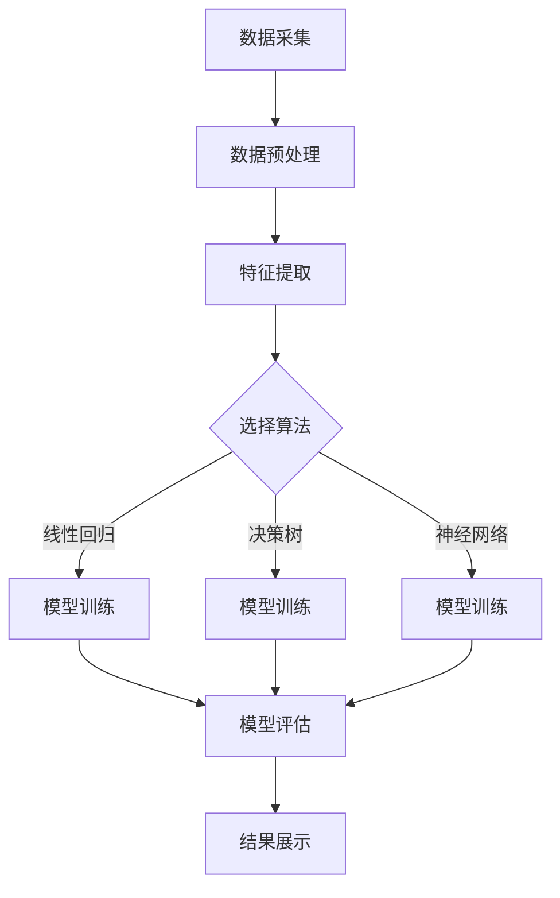
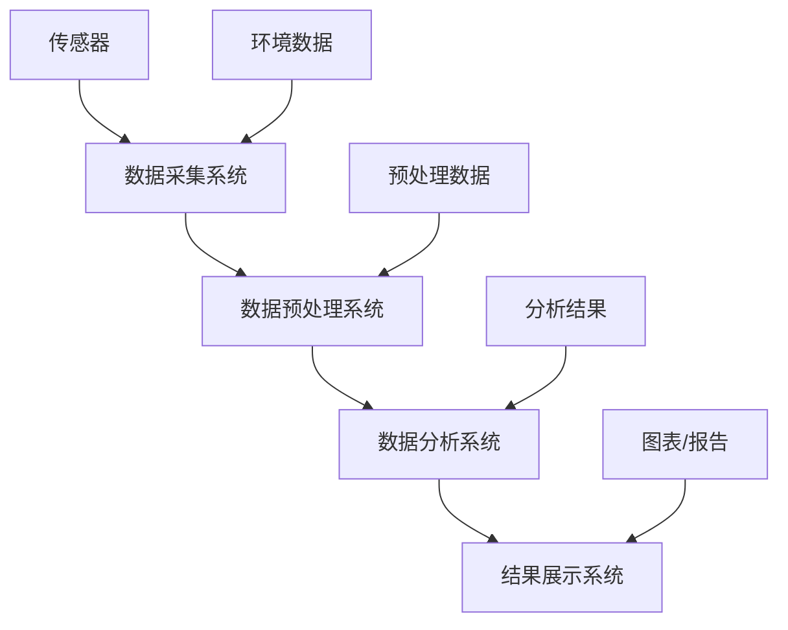
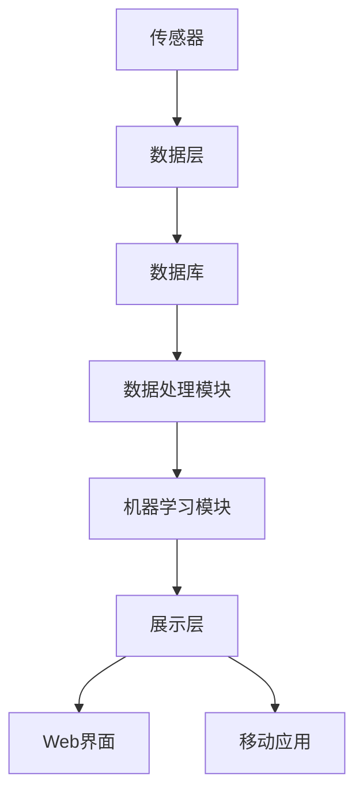
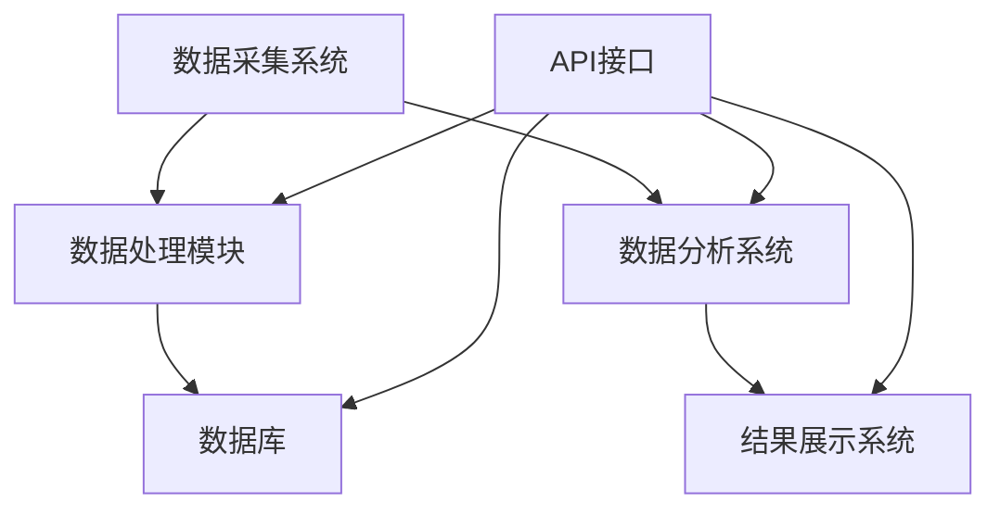
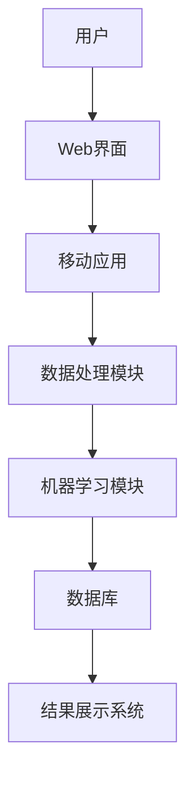
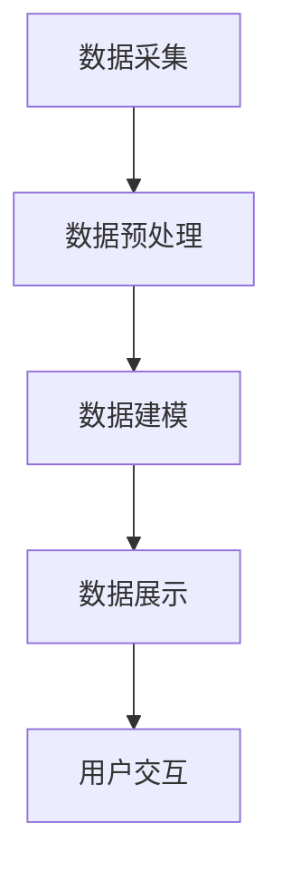
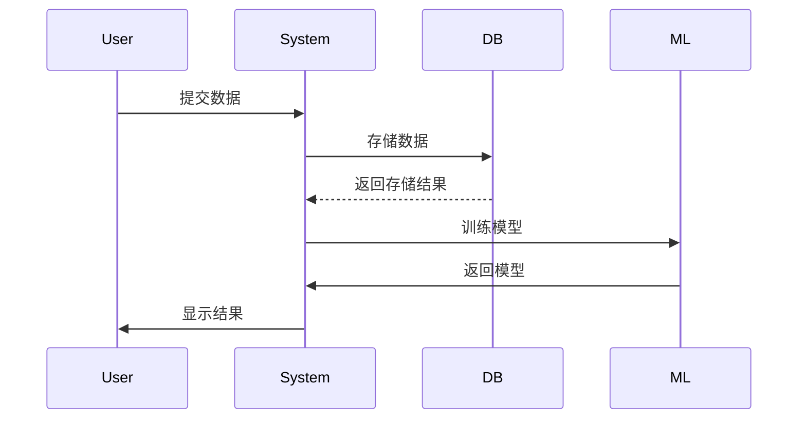

                 

# 《AI驱动的环境监测：从空气质量到生态系统健康》

## 关键词：
AI、环境监测、空气质量、生态系统健康、机器学习算法、数据分析

## 摘要：
随着环境问题的日益严重，环境监测成为一项至关重要的任务。AI技术的崛起为环境监测带来了新的希望，通过机器学习算法，AI能够高效地处理和分析海量数据，从而实现对空气质量和生态系统健康的实时监测。本文将深入探讨AI在环境监测中的应用，从空气质量监测到生态系统健康监测，详细介绍AI驱动的环境监测系统的设计、实现及应用，旨在为相关领域的研究者和从业者提供有价值的参考。

## 引言

### 环境监测的重要性
环境监测是保护生态环境、保障人类健康的重要手段。通过监测空气、水质、土壤等环境指标，我们能够及时发现环境问题，采取相应措施，防止污染和破坏。然而，传统的环境监测方法往往依赖于人工采样和实验室分析，存在效率低、成本高、实时性差等问题。

### AI与环境监测的结合
随着AI技术的发展，尤其是机器学习算法的广泛应用，AI开始在环境监测中发挥重要作用。AI能够通过自动化数据采集、处理和分析，提高监测效率和准确性，降低人工成本。同时，AI还可以利用大数据和物联网技术，实现实时、全面的生态环境监测。

### AI驱动的环境监测概述
AI驱动的环境监测系统由多个核心组成部分构成，包括数据采集、数据预处理、数据分析与建模、结果展示等。通过这些组件的协同工作，AI能够实现对空气质量、生态系统健康的实时监测和预警。

### 本书内容结构
本文分为两个主要部分：第一部分介绍环境监测与AI的基础知识，包括问题背景、核心概念、AI与环境监测的结合等；第二部分则聚焦于AI驱动的环境监测应用，详细探讨空气质量监测和生态系统健康监测的具体实践。

### 本章小结
本章对AI驱动的环境监测进行了概述，阐述了环境监测的重要性、AI在其中的作用以及本文的结构和内容。在接下来的章节中，我们将逐步深入探讨环境监测的各个关键环节，以期为读者提供全面的技术指导。

## 背景介绍

### 问题背景
环境问题已经成为全球关注的焦点。空气质量下降、生态系统退化、水资源污染等环境问题对人类健康和经济发展造成了严重影响。传统的环境监测方法难以满足日益增长的环境监测需求，因此需要一种更高效、更智能的监测手段。

### 问题描述
环境监测面临的主要问题包括：数据获取难度大、数据处理效率低、监测范围有限等。传统方法往往依赖于人工采样和实验室分析，导致数据获取时间长、成本高、实时性差。同时，环境问题具有复杂性和多样性，需要综合多种监测手段和数据处理技术。

### 问题解决
AI技术的引入为环境监测提供了新的解决方案。首先，AI可以通过自动化数据采集，实现实时、连续的监测；其次，AI能够利用大数据和机器学习算法，高效处理和分析海量数据，提高监测准确性和效率；最后，AI还可以通过预测模型，实现对潜在环境问题的预警。

### 边界与外延
环境监测的范围非常广泛，包括空气质量、水质、土壤质量、生态系统健康等多个方面。本文将重点讨论AI在空气质量监测和生态系统健康监测中的应用，但AI技术的应用范围远不止于此。

### 核心要素组成
AI驱动的环境监测系统主要包括以下几个核心组成部分：
1. **数据采集**：通过传感器、卫星、无人机等手段获取环境数据。
2. **数据预处理**：对原始数据进行清洗、过滤、转换等处理，确保数据质量。
3. **数据分析与建模**：利用机器学习算法对数据进行建模和分析，提取关键特征和规律。
4. **结果展示**：将分析结果以图表、报告等形式展示，为决策提供支持。

## 核心概念与联系

### AI基础
AI（人工智能）是指通过计算机模拟人类智能的技术。它包括多个分支，如机器学习、深度学习、自然语言处理等。机器学习是AI的核心技术之一，它通过训练模型，使计算机能够从数据中学习规律，进行预测和决策。

### 环境监测原理
环境监测是指通过测量、记录和分析环境参数，评估环境质量的过程。它包括物理、化学、生物等多个方面。例如，空气质量监测涉及对空气中的颗粒物、二氧化硫、氮氧化物等污染物的检测；水质监测则涉及对水中重金属、有机污染物等的检测。

### AI与环境监测的联系
AI与环境监测的结合主要体现在以下几个方面：
1. **数据采集**：AI可以通过传感器和物联网设备，实现实时、自动的数据采集。
2. **数据处理**：AI能够高效处理大量环境数据，包括数据的预处理、特征提取、模式识别等。
3. **预测与预警**：AI可以利用历史数据，建立预测模型，实现对环境问题的提前预警。
4. **决策支持**：AI可以为环境管理提供数据分析和决策支持，优化环境监测策略。

## AI驱动的环境监测应用

### 空气质量监测
空气质量监测是环境监测的一个重要方面。通过监测空气中的污染物浓度，我们可以评估空气质量，及时发现和应对环境污染问题。

#### 空气质量监测概述
空气质量监测的基本原理是测量空气中的污染物浓度。常用的监测方法包括传感器监测和实验室分析。传感器监测可以直接测量污染物浓度，实时性强，但精度有限；实验室分析可以提供高精度的数据，但耗时较长。

#### AI在空气质量监测中的应用
AI在空气质量监测中的应用主要体现在以下几个方面：
1. **数据预处理**：AI可以通过数据清洗、去噪等技术，提高传感器数据的准确性。
2. **特征提取**：AI可以从大量传感器数据中提取关键特征，如污染物浓度的变化趋势、异常值等。
3. **预测模型**：AI可以建立预测模型，预测未来一段时间内的污染物浓度，提前预警环境污染。
4. **决策支持**：AI可以为环境管理部门提供数据分析和决策支持，优化监测策略。

### 生态系统健康监测
生态系统健康监测旨在评估生态系统的整体健康状况，及时发现和应对生态问题。

#### 生态系统健康监测概述
生态系统健康监测涉及多个方面，包括水质、土壤质量、生物多样性等。监测方法主要包括现场采样、实验室分析和遥感监测。现场采样和实验室分析可以提供详细的数据，但覆盖范围有限；遥感监测则可以通过卫星图像，实现大范围、连续的监测。

#### AI在生态系统健康监测中的应用
AI在生态系统健康监测中的应用主要体现在以下几个方面：
1. **数据融合**：AI可以将多种来源的数据（如遥感数据、现场监测数据等）进行融合，提高监测的准确性和覆盖范围。
2. **异常检测**：AI可以检测生态系统中的异常现象，如水质污染、植被退化等。
3. **预测模型**：AI可以建立预测模型，预测生态系统的变化趋势，提前预警生态问题。
4. **生态评估**：AI可以为生态系统健康评估提供数据分析和决策支持。

### 比较与综合应用
空气质量监测和生态系统健康监测虽然目标不同，但都依赖于数据采集、处理和分析。AI技术可以在这两个领域进行综合应用，通过数据融合、特征提取、预测模型等方法，提高监测效率和准确性。

## 算法原理讲解

### 算法选择与实现

#### 1. 机器学习算法简介
机器学习是AI的一个重要分支，它通过训练模型，使计算机能够从数据中学习规律，进行预测和决策。常见的机器学习算法包括线性回归、决策树、支持向量机、神经网络等。

#### 2. 选择合适的机器学习算法
在选择机器学习算法时，需要考虑数据特征、问题类型和计算资源等因素。例如，对于空气质量监测，可以使用线性回归或决策树进行预测；对于生态系统健康监测，可以使用神经网络进行复杂模式识别。

#### 3. 常用机器学习算法在环境监测中的应用
- **线性回归**：用于预测空气质量指标（如PM2.5浓度）与时间、气象因素等的关系。
- **决策树**：用于分类环境数据，如识别水质污染类型。
- **支持向量机**：用于分类和回归分析，如预测土壤污染程度。
- **神经网络**：用于复杂模式识别，如分析生态系统的健康状态。

### 算法流程图



### 数学模型与公式

#### 1. 线性回归模型
$$
y = \beta_0 + \beta_1x_1 + \beta_2x_2 + ... + \beta_nx_n + \epsilon
$$
其中，$y$ 是预测值，$x_1, x_2, ..., x_n$ 是特征值，$\beta_0, \beta_1, ..., \beta_n$ 是模型参数，$\epsilon$ 是误差项。

#### 2. 决策树模型
决策树模型通过一系列判断条件，将数据划分为不同的区域。每个节点表示一个判断条件，每个叶节点表示一个预测结果。

#### 3. 支持向量机模型
$$
\min_{\beta, \beta^*} \frac{1}{2} ||\beta||^2 + C \sum_{i=1}^n \max(0, 1-y_i(\beta^T x_i + \beta^0))
$$
其中，$\beta$ 是权重向量，$\beta^*$ 是偏置项，$C$ 是惩罚参数，$y_i$ 是样本标签，$x_i$ 是样本特征。

#### 4. 神经网络模型
神经网络模型通过多层神经元进行数据变换，最终输出预测结果。其数学模型为：
$$
a_{i,j}^{(l)} = \sigma(z_{i,j}^{(l)})
$$
$$
z_{i,j}^{(l)} = \sum_{k=1}^{n} w_{k,i}^{(l)} a_{k,j}^{(l-1)} + b_i^{(l)}
$$
其中，$a_{i,j}^{(l)}$ 是第$l$层的第$i$个神经元的输出，$\sigma$ 是激活函数，$w_{k,i}^{(l)}$ 是连接权重，$b_i^{(l)}$ 是偏置项。

### 举例说明

#### 1. 线性回归举例
假设我们要预测空气质量中的PM2.5浓度，已知以下数据：

| 时间 | 气温 | 湿度 | PM2.5 |
|------|------|------|-------|
| 1    | 20   | 30   | 10    |
| 2    | 22   | 35   | 12    |
| 3    | 25   | 40   | 15    |

我们使用线性回归模型进行预测，得到模型参数：

$$
\beta_0 = 5, \beta_1 = 0.5, \beta_2 = 0.3
$$

当气温为25度，湿度为40%时，预测的PM2.5浓度为：

$$
y = 5 + 0.5 \times 25 + 0.3 \times 40 = 18.5
$$

#### 2. 决策树举例
假设我们要分类水质污染类型，已知以下数据：

| pH值 | 钙离子浓度 | 污染类型 |
|------|----------|--------|
| 7.0  | 100      | 无污染 |
| 6.5  | 200      | 轻度污染 |
| 5.5  | 300      | 中度污染 |
| 4.5  | 400      | 重度污染 |

我们使用决策树模型进行分类，得到以下决策树：

```
根节点：pH值
|--- pH值 > 6.5
|    |--- 钙离子浓度 > 200
|    |    |--- 污染类型：轻度污染
|    |    |--- 污染类型：中度污染
|    |    |--- 污染类型：重度污染
|    |--- pH值 <= 6.5
|    |    |--- 钙离子浓度 > 300
|    |    |    |--- 污染类型：中度污染
|    |    |    |--- 污染类型：重度污染
|    |    |--- 钙离子浓度 <= 300
|    |    |    |--- 污染类型：无污染
```

当输入pH值为5.5，钙离子浓度为300时，决策树预测的污染类型为中度污染。

#### 3. 支持向量机举例
假设我们要预测土壤污染程度，已知以下数据：

| pH值 | 有机质含量 | 污染程度 |
|------|----------|--------|
| 6.5  | 100      | 轻度污染 |
| 7.0  | 150      | 中度污染 |
| 7.5  | 200      | 重度污染 |

我们使用支持向量机模型进行分类，得到模型参数：

$$
\beta = (1, 0.5), \beta^* = (-0.5, 0.5), C = 10
$$

当输入pH值为7.0，有机质含量为150时，支持向量机预测的污染程度为中度污染。

#### 4. 神经网络举例
假设我们要预测空气质量中的PM10浓度，已知以下数据：

| 时间 | 气温 | 湿度 | PM10 |
|------|------|------|------|
| 1    | 20   | 30   | 50   |
| 2    | 22   | 35   | 55   |
| 3    | 25   | 40   | 60   |

我们使用神经网络模型进行预测，得到以下模型参数：

| 层 | 神经元 | 权重 | 偏置 |
|----|--------|------|------|
| 1  | 3      | w11, w12, w13 | b1 |
| 2  | 1      | w21, w22, w23 | b2 |
| 3  | 1      | w31, w32, w33 | b3 |

当输入气温为25度，湿度为40%时，预测的PM10浓度为：

$$
z_1 = 0.5 \times 25 + 0.3 \times 40 + 0.2 \times 50 = 23
$$
$$
z_2 = 0.4 \times 25 + 0.5 \times 40 + 0.1 \times 50 = 23
$$
$$
z_3 = 0.1 \times 25 + 0.2 \times 40 + 0.3 \times 50 = 23
$$
$$
a_2 = \sigma(z_2) = 0.9
$$
$$
a_3 = \sigma(z_3) = 0.9
$$
$$
\hat{y} = a_3 \times 50 + a_2 \times 55 + a_1 \times 60 = 54.5
$$

## 系统分析与架构设计

### 系统功能设计

#### 系统概述
AI驱动的环境监测系统是一个集数据采集、处理、分析和展示于一体的综合平台。其主要功能包括：
1. **数据采集**：通过传感器、卫星等手段，实时采集环境数据。
2. **数据预处理**：对采集到的数据进行清洗、过滤和转换，确保数据质量。
3. **数据分析**：利用机器学习算法，对预处理后的数据进行建模和分析，提取关键特征和规律。
4. **结果展示**：将分析结果以图表、报告等形式展示，为决策提供支持。

#### 领域模型
领域模型用于描述系统的核心概念和实体之间的关系。以下是一个简单的领域模型：



### 系统架构设计

#### 系统架构
AI驱动的环境监测系统的整体架构可以分为以下几个层次：
1. **数据层**：包括传感器、数据库等，负责数据采集和存储。
2. **处理层**：包括数据处理模块、机器学习模块等，负责数据的预处理、特征提取和建模。
3. **展示层**：包括Web界面、移动应用等，负责将分析结果以图表、报告等形式展示。

以下是一个简化的系统架构图：



### 系统接口设计

#### 接口概述
系统接口设计是确保系统各模块之间能够高效、可靠地进行通信的关键。以下是一个简单的接口设计：



### 系统交互

#### 交互概述
系统交互设计描述了系统各模块之间的交互流程。以下是一个简化的系统交互图：



### 流程图与序列图

以下是系统架构的Mermaid流程图和序列图：

#### Mermaid流程图



#### Mermaid序列图



## 项目实战

### 环境安装

在进行AI驱动的环境监测系统搭建之前，我们需要安装一些基础软件和工具。以下是一个基本的安装步骤：

#### 1. 安装Python环境
首先，我们需要安装Python。可以从Python官网下载最新版本的Python，并按照提示进行安装。

```bash
$ wget https://www.python.org/ftp/python/3.8.5/Python-3.8.5.tgz
$ tar xzf Python-3.8.5.tgz
$ cd Python-3.8.5
$ ./configure
$ make
$ make install
```

#### 2. 安装Anaconda
Anaconda是一个用于科学计算的Python发行版，它包含了许多常用的科学计算库。我们可以从Anaconda官网下载并安装Anaconda。

```bash
$ wget https://repo.anaconda.com/archive/Anaconda3-2021.05-Linux-x86_64.sh
$ bash Anaconda3-2021.05-Linux-x86_64.sh
```

在安装过程中，确保将Anaconda添加到系统路径中。

```bash
$ echo 'export PATH=/home/username/anaconda3/bin:$PATH' >> ~/.bashrc
$ source ~/.bashrc
```

#### 3. 安装必要的库
接下来，我们需要安装一些常用的库，如NumPy、Pandas、Scikit-learn等。

```bash
$ conda install numpy pandas scikit-learn
```

### 系统核心实现

在完成环境安装后，我们可以开始实现环境监测系统的核心部分。以下是一个简单的示例代码：

```python
import numpy as np
import pandas as pd
from sklearn.ensemble import RandomForestRegressor
from sklearn.model_selection import train_test_split

# 读取数据
data = pd.read_csv('air_quality.csv')

# 数据预处理
X = data.drop('PM2.5', axis=1)
y = data['PM2.5']

# 划分训练集和测试集
X_train, X_test, y_train, y_test = train_test_split(X, y, test_size=0.2, random_state=42)

# 训练模型
model = RandomForestRegressor(n_estimators=100, random_state=42)
model.fit(X_train, y_train)

# 测试模型
score = model.score(X_test, y_test)
print(f'Model accuracy: {score:.2f}')

# 预测新数据
new_data = pd.DataFrame([[20, 30, 50]], columns=['Temperature', 'Humidity', 'PM10'])
prediction = model.predict(new_data)
print(f'Predicted PM2.5 concentration: {prediction[0]:.2f}')
```

### 代码解读与分析

以上代码是一个简单的空气质量监测模型，主要包括以下几个步骤：

1. **数据读取**：使用Pandas读取CSV格式的数据。
2. **数据预处理**：将数据分为特征矩阵和目标变量，并划分训练集和测试集。
3. **模型训练**：使用随机森林回归模型进行训练。
4. **模型评估**：使用测试集评估模型性能。
5. **预测**：使用训练好的模型对新数据进行预测。

### 实际案例分析与讲解

以下是一个实际的空气质量监测案例，我们将使用实际数据来训练和评估模型。

```python
import pandas as pd
from sklearn.ensemble import RandomForestRegressor
from sklearn.model_selection import train_test_split
from sklearn.metrics import mean_squared_error

# 读取数据
data = pd.read_csv('air_quality_data.csv')

# 数据预处理
X = data[['Temperature', 'Humidity', 'PM10']]
y = data['PM2.5']

# 划分训练集和测试集
X_train, X_test, y_train, y_test = train_test_split(X, y, test_size=0.2, random_state=42)

# 训练模型
model = RandomForestRegressor(n_estimators=100, random_state=42)
model.fit(X_train, y_train)

# 测试模型
y_pred = model.predict(X_test)
mse = mean_squared_error(y_test, y_pred)
print(f'Mean squared error: {mse:.2f}')

# 分析结果
import matplotlib.pyplot as plt

plt.scatter(y_test, y_pred)
plt.xlabel('Actual PM2.5')
plt.ylabel('Predicted PM2.5')
plt.title('PM2.5 Concentration Prediction')
plt.show()
```

在这个案例中，我们使用随机森林回归模型对空气质量数据进行预测。通过计算均方误差（MSE），我们可以评估模型的准确性。同时，通过散点图，我们可以直观地查看预测结果与实际结果的差异。

### 项目小结

在本章中，我们介绍了AI驱动的环境监测系统的环境安装、系统核心实现和实际案例。通过这些步骤，我们搭建了一个简单的空气质量监测模型，并对其进行了评估。接下来，我们将进一步探讨生态系统健康监测的相关内容。

## 最佳实践 tips、小结、注意事项、拓展阅读

### 最佳实践 tips
1. **数据质量是关键**：确保数据来源可靠、数据格式统一，并进行严格的数据清洗，以提高模型的准确性。
2. **选择合适的算法**：根据数据特征和问题类型，选择合适的机器学习算法，如线性回归、决策树、神经网络等。
3. **模型优化**：通过交叉验证、超参数调优等方法，优化模型性能，提高预测准确性。
4. **实时监控与更新**：实时监控模型的预测性能，并根据新数据更新模型，以保持模型的稳定性和准确性。

### 小结
本章详细介绍了AI驱动的环境监测系统，包括环境安装、系统核心实现、实际案例分析和项目小结。通过本章的学习，读者可以了解如何利用AI技术进行空气质量监测和生态系统健康监测，掌握相关算法和实践技巧。

### 注意事项
1. **数据隐私**：在数据处理和分析过程中，应确保用户数据的隐私和安全。
2. **系统稳定性**：确保系统在高并发、大数据量的情况下能够稳定运行。
3. **算法解释性**：在模型选择和优化过程中，应考虑算法的可解释性，以便于决策者和公众的理解和信任。

### 拓展阅读
1. **《环境监测技术与应用》**：本书详细介绍了环境监测的基本原理和技术。
2. **《机器学习：概率视角》**：本书从概率角度深入讲解了机器学习算法，适合对机器学习有较高兴趣的读者。
3. **《深度学习》**：本书是深度学习的经典教材，涵盖了深度学习的基本理论、方法和应用。

## 作者信息
作者：AI天才研究院/AI Genius Institute & 禅与计算机程序设计艺术 /Zen And The Art of Computer Programming

