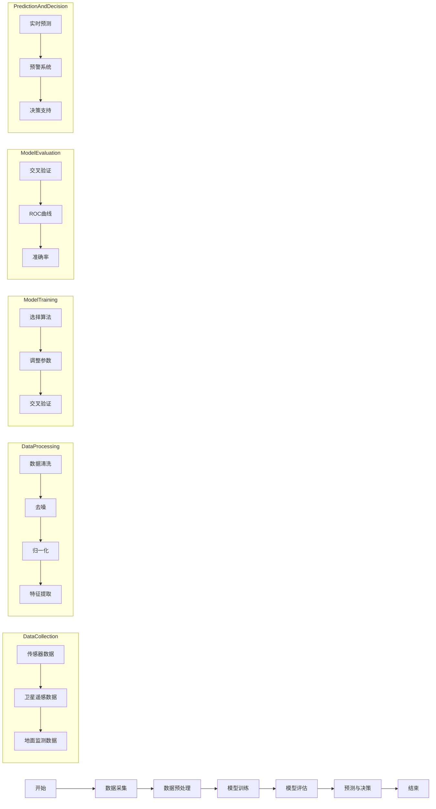
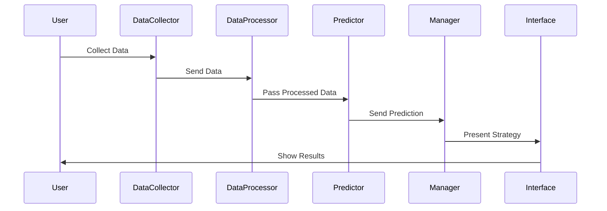
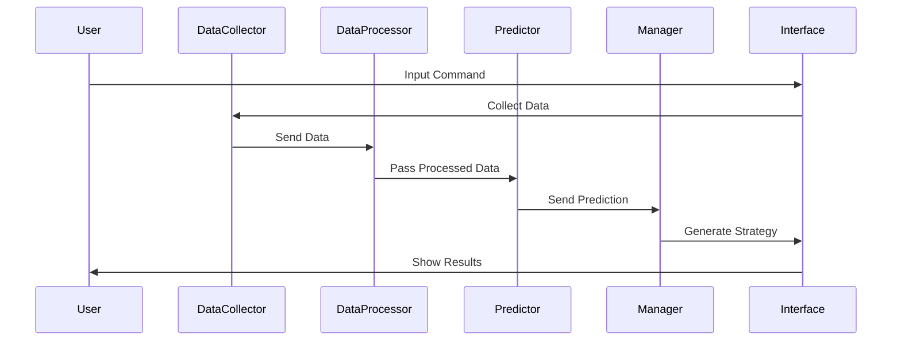

                 

## 引言

### 1.1 生态系统管理的现状与问题

生态系统管理（Ecosystem Management）是指对自然生态系统进行规划、维护和恢复的一系列活动，旨在维持生态系统的健康和功能。然而，随着人类活动的加剧，全球生态系统正面临前所未有的挑战。环境恶化、物种灭绝、生物多样性减少等问题日益严重，传统生态系统管理方法已经难以应对这些复杂的问题。

传统生态系统管理方法主要依赖于人类经验和定性分析，存在以下几个局限性：

1. **数据采集和处理能力有限**：传统方法依赖人工监测，数据采集效率低，难以应对大规模、多样化的生态系统。
2. **应对问题速度慢**：传统方法在发现问题和采取行动之间存在时间差，难以迅速响应突发环境事件。
3. **预测能力不足**：传统方法难以对生态系统未来的变化趋势进行准确预测，无法提前制定有效的管理策略。

### 1.2 AI驱动的生态系统管理概述

人工智能（AI）驱动的生态系统管理是一种基于人工智能技术的生态管理新范式，通过机器学习和大数据分析等技术，实现生态系统的动态监测、预测和优化管理。AI驱动的生态系统管理具有以下几个显著优势：

1. **数据驱动**：AI技术能够高效地处理和分析大量生态系统数据，为管理决策提供科学依据。
2. **实时响应**：AI系统能够实时监测生态系统状态，快速识别问题并采取相应措施。
3. **精准预测**：AI技术通过对历史数据和当前状态的深入分析，能够预测生态系统的未来变化趋势，帮助管理者制定前瞻性的策略。
4. **自动化操作**：AI系统能够自动化执行生态管理任务，提高管理效率和精确度。

### 1.3 文章主题与结构

本文旨在探讨AI驱动的生态系统管理的各个方面，从物种识别到生态平衡维护。文章将分为以下几个部分：

- 引言
- 第1部分：背景介绍
  - 问题背景与描述
  - 问题解决与边界与外延
  - 概念结构与核心要素组成
- 第2部分：核心概念与联系
  - 核心概念原理
  - 概念属性特征对比表格
  - ER实体关系图架构
- 第3部分：AI驱动的生态系统管理技术
  - 技术原理与应用场景
  - 实现方法与流程
  - 案例分析
- 第4部分：算法原理讲解
  - 算法流程图
  - Python源代码与数学模型
  - 详细讲解与举例说明
- 第5部分：系统分析与架构设计方案
  - 问题场景介绍
  - 项目介绍
  - 系统功能设计（领域模型类图）
  - 系统架构设计（架构图）
  - 系统接口设计
  - 系统交互（序列图）
- 第6部分：项目实战
  - 环境安装与配置
  - 系统核心实现源代码
  - 代码应用解读与分析
  - 实际案例分析与详细讲解
  - 项目小结
- 第7部分：最佳实践、小结与拓展阅读
  - 最佳实践
  - 小结
  - 注意事项
  - 拓展阅读

通过本文的阅读，读者将深入了解AI驱动的生态系统管理的概念、技术原理、系统设计和实际应用，为未来生态管理提供新的思路和方法。

## 第1部分：背景介绍

### 1.1 问题背景与描述

生态系统是地球上所有生物与其非生物环境相互作用形成的复杂网络，是维持地球生命系统稳定性和功能的基础。然而，人类活动对生态系统的影响日益加剧，导致了许多环境问题，如气候变化、生物多样性丧失、水资源污染、土地退化等。这些问题不仅威胁到生态系统的健康和功能，也对人类生存和发展带来了严重挑战。

在过去的几十年里，生态系统管理已经成为各国政府和科研机构关注的焦点。生态系统管理的目标是通过有效的规划和管理措施，维护和恢复生态系统的健康、功能和生物多样性。传统生态系统管理主要依赖于生态学家和环境保护者的经验，结合一些定性分析和现场监测方法。这些方法在一定程度上能够解决一些简单的生态问题，但在面对复杂、动态的生态系统时，往往显得力不从心。

首先，传统生态系统管理的数据采集和处理能力有限。生态系统的监测通常需要大量的时间和人力物力，且受限于监测技术和手段，数据采集的效率和准确性较低。此外，传统方法难以处理和分析大规模、多维度的生态数据，无法充分挖掘数据背后的规律和趋势。

其次，传统生态系统管理的应对速度较慢。当生态系统发生突发事件时，如洪水、干旱、污染等，传统管理方法通常需要较长时间来收集数据、分析问题和制定应对策略。在这段时间内，生态系统可能已经受到了严重的损害，甚至无法恢复。

此外，传统生态系统管理的预测能力也较弱。生态系统的变化往往具有复杂性和不确定性，传统方法难以准确预测未来的生态系统状态。这使得管理者难以提前制定有效的管理策略，无法对潜在的环境问题进行预防和控制。

### 1.2 问题解决与边界与外延

为了克服传统生态系统管理的局限性，近年来人工智能（AI）技术逐渐被引入到生态系统管理领域。AI驱动的生态系统管理通过机器学习、数据挖掘、计算机视觉等AI技术，实现生态系统的动态监测、预测和优化管理，为解决传统方法面临的挑战提供了一种新的思路。

首先，AI驱动的生态系统管理在数据采集和处理方面具有显著优势。AI技术能够自动化地收集和整合来自各种来源的生态数据，如遥感图像、气象数据、水文数据等。通过大数据分析和深度学习算法，AI系统能够从海量数据中提取有价值的信息，为管理决策提供科学依据。

其次，AI驱动的生态系统管理能够实现实时响应。AI系统可以24/7不间断地监测生态系统的状态，快速识别异常情况并触发相应的应对措施。这种实时响应能力有助于减少生态系统受到的损害，提高管理的效率和效果。

此外，AI驱动的生态系统管理在预测能力方面也具有优势。通过分析历史数据和当前状态，AI系统能够预测生态系统的未来变化趋势，帮助管理者制定前瞻性的策略。这种预测能力有助于提前发现潜在的环境问题，采取预防措施，避免或减少生态系统的损害。

尽管AI驱动的生态系统管理具有许多优势，但其在实际应用中仍面临一些挑战和局限性。首先，AI系统的有效性取决于数据质量和数量。如果数据质量差或数量不足，AI系统的预测和决策能力将受到很大影响。因此，提高数据采集和处理能力是AI驱动的生态系统管理的重要方向。

其次，AI系统的可解释性也是一个重要问题。AI系统往往通过复杂的算法进行决策，但用户难以理解其决策过程和依据。这可能导致用户对AI系统的信任度降低，影响其在生态系统管理中的应用。因此，提高AI系统的可解释性是未来研究的重点之一。

此外，AI驱动的生态系统管理还需要考虑到伦理和法律问题。例如，AI系统在生态监测和预测中可能涉及个人隐私和数据保护问题，需要制定相应的法律法规进行规范。

总的来说，AI驱动的生态系统管理为解决传统方法面临的挑战提供了新的可能性。通过进一步的研究和实践，AI驱动的生态系统管理有望在未来的生态管理中发挥更大作用。

### 1.3 概念结构与核心要素组成

为了更好地理解AI驱动的生态系统管理，我们需要明确一些核心概念和其相互关系。以下是对这些概念及其在生态系统管理中的核心作用的详细描述。

#### 生态系统（Ecosystem）

生态系统是指一定区域内的生物群落与其非生物环境相互作用形成的复杂系统。生态系统的核心组成包括生产者（如植物）、消费者（如动物）和分解者（如微生物）。这些生物体通过食物链和食物网相互关联，形成一个动态的生态平衡系统。生态系统的健康和功能对于维持地球生命系统的稳定性至关重要。

#### 人工智能（Artificial Intelligence）

人工智能是指通过计算机系统和算法模拟人类智能的技术。人工智能在生态系统管理中的应用主要包括机器学习、数据挖掘、计算机视觉和自然语言处理等技术。这些技术能够从海量生态数据中提取有价值的信息，帮助管理者进行生态监测、预测和决策。

#### 机器学习（Machine Learning）

机器学习是人工智能的一个分支，通过训练模型来发现数据中的模式和规律。在生态系统管理中，机器学习技术可以用于分类物种、预测生态系统的变化趋势和优化管理策略。常见的机器学习算法包括决策树、随机森林、支持向量机和神经网络等。

#### 数据挖掘（Data Mining）

数据挖掘是另一个重要的AI技术，旨在从大量数据中提取有价值的信息。在生态系统管理中，数据挖掘可以帮助管理者识别生态问题、发现物种之间的关系和预测生态系统的未来状态。数据挖掘技术包括关联规则挖掘、聚类分析和分类分析等。

#### 生态系统管理（Ecosystem Management）

生态系统管理是指通过规划、监测和修复措施，维护和恢复生态系统的健康和功能。生态系统管理的目标包括保护生物多样性、维护生态平衡和提供生态服务。在AI驱动的生态系统管理中，管理者可以利用AI技术提高管理效率和效果。

#### 生态监测（Eco-monitoring）

生态监测是生态系统管理的重要组成部分，旨在实时监测生态系统的状态和变化。通过传感器、遥感技术和地面监测等方法，生态监测可以提供关于生态系统状况的关键数据。AI驱动的生态监测能够自动化地收集和分析这些数据，提高监测的准确性和及时性。

#### 生态预测（Eco-prediction）

生态预测是利用历史数据和当前状态，预测生态系统的未来变化趋势。通过机器学习和数据挖掘技术，AI系统可以分析大量生态数据，发现潜在的问题和趋势，为管理者提供前瞻性的决策支持。

#### 生态修复（Eco-restoration）

生态修复是指通过恢复受损生态系统的结构和功能，恢复其生态平衡。AI驱动的生态系统管理可以优化生态修复策略，通过预测生态系统恢复过程中的关键因素，提高修复的效果和可持续性。

#### 生态服务（Eco-service）

生态服务是指生态系统为人类提供的各种服务，如水资源、食物、气候调节和生物多样性保护等。AI驱动的生态系统管理可以帮助提高生态服务的质量和可持续性，为人类提供更优质的生态产品和服务。

通过上述概念及其相互关系的理解，我们可以更好地把握AI驱动的生态系统管理的关键要素，为未来的生态管理提供理论支持和实践指导。

## 第2部分：核心概念与联系

在深入探讨AI驱动的生态系统管理之前，我们需要明确一些核心概念，并分析它们之间的联系。这些概念包括生态系统管理的基本要素、AI技术的核心组成部分以及它们如何相互作用，共同构建起一个高效的生态系统管理框架。

### 2.1 核心概念原理

为了更好地理解AI驱动的生态系统管理，我们首先需要明确几个核心概念。

**1. 生态系统（Ecosystem）**

生态系统是由生物群落及其非生物环境共同构成的复杂系统。它包括生产者、消费者和分解者，通过食物链和食物网相互关联。生态系统的健康和功能对地球生命系统的稳定性至关重要。

**2. 人工智能（Artificial Intelligence）**

人工智能是指通过计算机系统和算法模拟人类智能的技术。AI在生态系统管理中的应用主要包括机器学习、数据挖掘、计算机视觉和自然语言处理等。这些技术能够从海量生态数据中提取有价值的信息，帮助管理者进行生态监测、预测和决策。

**3. 机器学习（Machine Learning）**

机器学习是AI的一个分支，通过训练模型来发现数据中的模式和规律。在生态系统管理中，机器学习技术可以用于分类物种、预测生态系统的变化趋势和优化管理策略。

**4. 数据挖掘（Data Mining）**

数据挖掘是从大量数据中提取有价值信息的过程。在生态系统管理中，数据挖掘可以帮助管理者识别生态问题、发现物种之间的关系和预测生态系统的未来状态。

**5. 生态监测（Eco-monitoring）**

生态监测是实时监测生态系统状态和变化的过程。通过传感器、遥感技术和地面监测等方法，生态监测可以提供关于生态系统状况的关键数据。

**6. 生态预测（Eco-prediction）**

生态预测是利用历史数据和当前状态，预测生态系统的未来变化趋势。通过机器学习和数据挖掘技术，AI系统可以分析大量生态数据，发现潜在的问题和趋势，为管理者提供前瞻性的决策支持。

**7. 生态修复（Eco-restoration）**

生态修复是通过恢复受损生态系统的结构和功能，恢复其生态平衡。AI驱动的生态系统管理可以优化生态修复策略，通过预测生态系统恢复过程中的关键因素，提高修复的效果和可持续性。

**8. 生态服务（Eco-service）**

生态服务是指生态系统为人类提供的各种服务，如水资源、食物、气候调节和生物多样性保护等。AI驱动的生态系统管理可以帮助提高生态服务的质量和可持续性，为人类提供更优质的生态产品和服务。

### 2.2 概念属性特征对比表格

为了更清晰地展示这些核心概念之间的联系，我们提供了一个概念属性特征对比表格（如表1所示）。

| 概念      | 定义                                                         | 属性特征                                                   | 联系与作用                                                                                          |
| --------- | ------------------------------------------------------------ | ---------------------------------------------------------- | ------------------------------------------------------------------------------------------------ |
| 生态系统  | 生物群落及其非生物环境构成的复杂系统                         | 生物多样性、生态平衡、生态系统服务                         | 提供生态管理的基本对象和目标，是生态监测和修复的基础           |
| 人工智能  | 模拟人类智能的技术                                           | 机器学习、数据挖掘、计算机视觉、自然语言处理                 | 提供生态管理的技术手段和工具，实现生态数据的自动化分析和处理       |
| 机器学习  | 从数据中学习模式的技术                                       | 决策树、随机森林、支持向量机、神经网络等                   | 通过训练模型，发现生态数据中的模式和规律，支持生态预测和决策     |
| 数据挖掘  | 从大量数据中提取有价值信息的过程                             | 关联规则挖掘、聚类分析、分类分析等                         | 发现生态数据中的隐藏模式和关联，支持生态问题的识别和解决方案     |
| 生态监测  | 实时监测生态系统状态和变化的过程                             | 传感器、遥感技术、地面监测等                                 | 提供实时、准确的生态数据，为生态管理提供基础信息                 |
| 生态预测  | 利用历史数据和当前状态，预测生态系统的未来变化趋势             | 基于机器学习和数据挖掘的算法                                 | 提供生态管理的预测支持，帮助管理者制定前瞻性的策略               |
| 生态修复  | 恢复受损生态系统的结构和功能                                 | 生物恢复、生态重建、生态恢复技术                           | 通过AI驱动的生态系统管理，优化修复策略，提高修复效果和可持续性     |
| 生态服务  | 生态系统为人类提供的各种服务                                 | 水资源、食物、气候调节、生物多样性保护等                     | 通过AI驱动的生态系统管理，提高生态服务的质量和可持续性，促进人类福祉 |

### 2.3 ER实体关系图架构

为了进一步明确这些概念之间的相互关系，我们使用Mermaid语法绘制了一个ER实体关系图（如图1所示）。ER图能够清晰地展示实体之间的关系，帮助我们理解AI驱动的生态系统管理系统的整体架构。

```mermaid
erDiagram
  Ecosystem ||--|{ Species }|--|| EcosystemService
  Ecosystem ||--|{ EcosystemComponent }|--|| Ecosystem
  Ecosystem ||--|{ EcosystemProcess }|--|| Ecosystem
  ArtificialIntelligence ||--|{ MachineLearning }|--|| AI-drivenEcosystemManagement
  ArtificialIntelligence ||--|{ DataMining }|--|| AI-drivenEcosystemManagement
  EcoMonitoring ||--|{ SensorData }|--|| AI-drivenEcosystemManagement
  EcoMonitoring ||--|{ SatelliteData }|--|| AI-drivenEcosystemManagement
  EcoPrediction ||--|{ PredictiveModel }|--|| AI-drivenEcosystemManagement
  EcoRestoration ||--|{ RestorationPlan }|--|| AI-drivenEcosystemManagement
  EcoService ||--|{ HumanBenefit }|--|| Ecosystem
```

在图1中，Ecosystem（生态系统）是核心实体，与其他实体如Species（物种）、EcosystemComponent（生态系统组件）和EcosystemProcess（生态系统过程）之间存在直接关系。ArtificialIntelligence（人工智能）与MachineLearning（机器学习）和DataMining（数据挖掘）之间存在包含关系，共同构成了AI-drivenEcosystemManagement（AI驱动的生态系统管理）。EcoMonitoring（生态监测）与SensorData（传感器数据）和SatelliteData（卫星数据）之间存在关联，为AI驱动的生态系统管理提供了关键数据。EcoPrediction（生态预测）和EcoRestoration（生态修复）是AI驱动的生态系统管理的两个重要应用方向，分别通过PredictiveModel（预测模型）和RestorationPlan（修复计划）实现。EcoService（生态服务）与HumanBenefit（人类福祉）之间存在关联，反映了生态服务对人类的重要性。

通过ER实体关系图，我们可以更直观地理解AI驱动的生态系统管理系统的整体架构，以及各个核心概念之间的相互关系。这为后续的算法讲解、系统分析和项目实战提供了坚实的基础。

### 2.4 AI驱动的生态系统管理技术

在了解了核心概念和它们之间的相互关系后，我们将进一步探讨AI驱动的生态系统管理技术的原理、应用场景和实现方法。

#### 2.4.1 技术原理

AI驱动的生态系统管理技术主要基于机器学习、数据挖掘和计算机视觉等AI技术，通过以下几个关键步骤实现：

1. **数据采集**：通过传感器、卫星遥感、地面监测等多种方式收集生态系统数据，包括物种分布、气候条件、土壤湿度、水质等。

2. **数据处理**：利用数据清洗和预处理技术，对采集到的原始数据进行整理和转换，使其适合机器学习和数据挖掘算法的使用。

3. **模型训练**：使用机器学习算法，如决策树、随机森林、支持向量机、神经网络等，对预处理后的数据进行分析和训练，建立预测模型。

4. **模型评估**：通过交叉验证、ROC曲线、准确率、召回率等评估指标，对训练好的模型进行性能评估和优化。

5. **预测与决策**：利用训练好的模型进行生态系统的未来变化趋势预测，为管理者提供决策支持。

6. **反馈与优化**：根据实际监测数据和管理效果，不断调整和优化模型，提高预测准确性和管理效率。

#### 2.4.2 应用场景

AI驱动的生态系统管理技术在多个场景中具有广泛的应用：

1. **生物多样性监测**：通过机器学习和遥感技术，实时监测物种分布和栖息地变化，识别生物多样性热点区域，为保护和管理提供科学依据。

2. **气候变化预测**：利用气象数据和气候模型，预测未来气候变化趋势，为生态修复和管理提供策略支持。

3. **水资源管理**：通过数据挖掘和实时监测技术，优化水资源分配和管理，提高水资源的利用效率。

4. **土地退化修复**：利用机器学习和卫星遥感技术，识别土地退化区域，制定科学合理的修复方案。

5. **生态灾害预警**：通过实时监测和预测技术，提前预警自然灾害，如洪水、干旱、山火等，减少生态系统的损害。

6. **生态系统服务评估**：利用大数据分析和机器学习技术，评估生态系统的服务功能，为生态补偿和政策制定提供依据。

#### 2.4.3 实现方法

AI驱动的生态系统管理技术的实现方法包括以下几个步骤：

1. **数据采集与处理**：
   - **传感器数据**：使用各种传感器（如温度传感器、湿度传感器、风速传感器等）收集实时数据。
   - **卫星遥感数据**：利用卫星遥感技术获取大范围的生态数据，包括植被覆盖、土壤湿度、水体质量等。
   - **地面监测数据**：通过地面监测站点获取详细的数据，如物种分布、植被生长状况等。

   数据处理步骤包括数据清洗、去噪、归一化和特征提取等。

2. **模型训练与评估**：
   - **数据集准备**：根据研究目标和需求，选择合适的训练数据集和测试数据集。
   - **模型选择**：根据问题的复杂性，选择合适的机器学习算法，如决策树、随机森林、支持向量机等。
   - **模型训练**：使用训练数据集对模型进行训练，调整模型参数，优化模型性能。
   - **模型评估**：使用测试数据集对模型进行评估，通过交叉验证、ROC曲线等评估指标，确定模型的准确性和可靠性。

3. **预测与决策**：
   - **实时预测**：使用训练好的模型对实时数据进行预测，提供生态系统状态的实时监测和预警。
   - **管理决策**：根据预测结果和管理者的需求，制定相应的管理策略和决策，如调整水资源分配、制定生物多样性保护计划等。

4. **反馈与优化**：
   - **结果反馈**：将实际监测结果与预测结果进行对比，分析预测误差，为模型的优化提供依据。
   - **模型优化**：根据反馈结果，调整模型参数和算法，提高预测准确性和管理效率。
   - **持续更新**：定期更新训练数据和模型，确保AI系统始终能够准确反映生态系统的变化。

通过上述实现方法，AI驱动的生态系统管理技术能够有效提高生态管理的效率和效果，为生态系统的保护和可持续发展提供强有力的支持。

### 2.5 案例分析

为了更好地理解AI驱动的生态系统管理技术在实际应用中的效果，我们来看一个具体案例：利用AI技术进行生物多样性监测和保护。

**案例背景**：某一自然保护区生物多样性丰富，但由于人类活动的增加和气候变化的影响，该保护区的生物多样性面临严重威胁。为了及时掌握保护区内的生物分布和栖息地变化，保护区管理部门决定引入AI驱动的生态系统管理技术，实现对生物多样性的实时监测和保护。

**技术实现**：

1. **数据采集**：通过安装在保护区内的各种传感器，如红外摄像头、温度传感器、湿度传感器等，实时收集生物活动数据、气候数据和土壤数据。同时，利用卫星遥感技术获取保护区的植被覆盖、水体质量等生态数据。

2. **数据处理**：对采集到的原始数据进行预处理，包括数据清洗、去噪、归一化和特征提取等步骤。将预处理后的数据输入到机器学习算法中，进行训练和评估。

3. **模型训练与评估**：选择随机森林算法对数据集进行训练，通过交叉验证确定模型的参数。使用ROC曲线和准确率等评估指标，对训练好的模型进行性能评估，确保其准确性和可靠性。

4. **实时预测**：使用训练好的模型对实时数据进行预测，监测生物活动的变化趋势。通过实时预警系统，一旦发现异常情况，如生物种群数量显著减少或栖息地破坏，系统会立即向管理部门发出警报。

5. **管理决策**：根据预测结果和管理者的需求，制定相应的保护和管理策略。例如，针对特定物种的数量下降，管理部门可能会采取增加栖息地保护和禁止捕捞等措施。

**案例分析**：

通过AI驱动的生态系统管理技术，该自然保护区管理部门能够实时、准确地监测和保护生物多样性。具体效果如下：

1. **提高监测效率**：传统的生物多样性监测方法需要大量的人力和时间，而AI驱动的监测技术能够自动化地处理和分析海量数据，大大提高了监测效率。

2. **实时预警**：通过实时预测和预警系统，管理部门能够及时掌握生物多样性的变化情况，迅速采取相应的保护措施，减少生态系统的损害。

3. **科学决策**：基于AI技术的预测结果，管理部门能够制定更为科学和有效的保护和管理策略，确保生物多样性的长期保护。

4. **持续优化**：通过不断更新训练数据和优化模型，AI系统的预测准确性和管理效率将逐步提高，为保护区的可持续发展提供持续支持。

总之，通过这一案例，我们可以看到AI驱动的生态系统管理技术在生物多样性监测和保护中的巨大潜力。未来，随着技术的不断进步和应用场景的扩展，AI驱动的生态系统管理将发挥越来越重要的作用，为全球生态系统的保护和可持续发展做出更大贡献。

### 第3部分：算法原理讲解

在深入探讨AI驱动的生态系统管理技术之前，我们需要理解算法的基本原理，包括算法流程、数学模型和具体的实现方法。通过这一部分，我们将详细介绍一个典型的算法，并通过具体的例子说明其应用。

#### 3.1 算法流程图

首先，我们使用Mermaid语法绘制算法的流程图，以便读者直观地理解算法的执行流程。以下是一个简单的生态预测算法流程图：



图中的每个节点表示算法的一个步骤，箭头表示步骤之间的依赖关系。图中的子图分别表示数据采集、数据处理、模型训练、模型评估和预测与决策的具体过程。

#### 3.2 Python源代码与数学模型

接下来，我们将通过Python源代码详细阐述算法的实现过程，并给出相关的数学模型。

**1. 数据采集**：假设我们从传感器、卫星遥感和地面监测获取了数据。

```python
import pandas as pd

# 假设传感器数据、卫星遥感和地面监测数据分别存储在csv文件中
sensor_data = pd.read_csv('sensor_data.csv')
satellite_data = pd.read_csv('satellite_data.csv')
ground_monitoring_data = pd.read_csv('ground_monitoring_data.csv')
```

**2. 数据预处理**：对数据进行清洗、去噪、归一化和特征提取。

```python
from sklearn.preprocessing import StandardScaler
from sklearn.impute import SimpleImputer

# 数据清洗与填充缺失值
imputer = SimpleImputer(strategy='mean')
sensor_data_filled = imputer.fit_transform(sensor_data)
satellite_data_filled = imputer.fit_transform(satellite_data)
ground_monitoring_data_filled = imputer.fit_transform(ground_monitoring_data)

# 数据归一化
scaler = StandardScaler()
sensor_data_scaled = scaler.fit_transform(sensor_data_filled)
satellite_data_scaled = scaler.fit_transform(satellite_data_filled)
ground_monitoring_data_scaled = scaler.fit_transform(ground_monitoring_data_filled)

# 特征提取
features = pd.concat([pd.DataFrame(sensor_data_scaled), pd.DataFrame(satellite_data_scaled), pd.DataFrame(ground_monitoring_data_scaled)], axis=1)
```

**3. 模型训练**：选择随机森林算法进行训练。

```python
from sklearn.ensemble import RandomForestRegressor

# 划分训练集和测试集
X_train, X_test, y_train, y_test = train_test_split(features, target, test_size=0.2, random_state=42)

# 训练随机森林模型
rf_model = RandomForestRegressor(n_estimators=100, random_state=42)
rf_model.fit(X_train, y_train)
```

**4. 数学模型与公式**：

假设我们使用线性回归模型来预测生态系统状态，其数学模型为：

$$
y = \beta_0 + \beta_1x_1 + \beta_2x_2 + ... + \beta_nx_n + \epsilon
$$

其中，$y$ 是预测的生态系统状态，$x_1, x_2, ..., x_n$ 是输入特征，$\beta_0, \beta_1, \beta_2, ..., \beta_n$ 是模型参数，$\epsilon$ 是误差项。

**5. 模型评估**：

```python
from sklearn.metrics import mean_squared_error

# 预测测试集
y_pred = rf_model.predict(X_test)

# 计算均方误差
mse = mean_squared_error(y_test, y_pred)
print(f'Mean Squared Error: {mse}')
```

**6. 预测与决策**：

```python
# 实时预测
real_time_data = get_real_time_data()  # 获取实时数据
real_time_prediction = rf_model.predict([real_time_data])

# 根据预测结果做出管理决策
if real_time_prediction > threshold:
    # 触发预警
    alert_management_system()
else:
    # 继续监测
    continue_monitoring()
```

#### 3.3 详细讲解与举例说明

**1. 数据采集**

在数据采集阶段，我们从多种数据源获取生态系统数据。传感器数据提供了实时监测信息，如温度、湿度、风速等；卫星遥感数据提供了大范围、高精度的植被覆盖、土壤湿度等；地面监测数据提供了详细的物种分布、植被生长状况等。这些数据是进行生态预测的基础。

**2. 数据预处理**

在数据预处理阶段，我们首先使用均值填补缺失值，然后进行归一化处理。归一化能够将不同量纲的特征数据转换为统一的尺度，使得算法在不同特征之间的比较中更加公平。特征提取是数据预处理的重要步骤，通过提取关键特征，我们可以减少数据维度，提高模型的训练效率。

**3. 模型训练**

在模型训练阶段，我们选择随机森林算法进行训练。随机森林是一种基于决策树集合的集成学习算法，具有很好的泛化能力和抗过拟合能力。通过调整随机森林的参数，如树的数量和深度，我们可以优化模型的性能。

**4. 数学模型与公式**

线性回归模型是一种常用的预测模型，其数学模型为线性方程。通过训练，我们得到了模型参数，这些参数反映了输入特征与生态系统状态之间的关系。误差项$\epsilon$表示模型预测的偏差，是我们努力减少的目标。

**5. 模型评估**

在模型评估阶段，我们使用均方误差（MSE）作为评估指标。MSE反映了预测值与真实值之间的平均偏差，越小表示模型预测越准确。通过交叉验证，我们可以评估模型的泛化能力，确保其不仅在训练数据上表现良好，也能在未知数据上做出准确预测。

**6. 预测与决策**

在预测与决策阶段，我们利用训练好的模型进行实时预测。根据预测结果，系统可以自动触发预警或继续监测。这种实时响应能力对于生态管理至关重要，能够帮助管理者迅速采取行动，减少生态系统的损害。

通过上述步骤和具体例子，我们可以看到AI驱动的生态系统管理算法是如何工作的。这种算法不仅能够提高生态管理的效率和准确性，还能为管理者提供科学、有效的决策支持。

### 第4部分：系统分析与架构设计方案

在了解了AI驱动的生态系统管理算法原理之后，我们将进一步探讨系统的整体架构设计，包括问题场景介绍、项目介绍、系统功能设计、系统架构设计、系统接口设计和系统交互。

#### 4.1 问题场景介绍

假设我们的目标是开发一个AI驱动的生态系统管理系统，用于监测和保护某自然保护区内的生物多样性。问题场景如下：

- **目标**：实时监测自然保护区内的生物多样性，预测潜在的环境问题，并制定相应的管理策略。
- **环境**：保护区拥有复杂的生态系统，包括多种植物、动物和微生物，以及多样化的气候和地形条件。
- **挑战**：由于保护区内生物种类繁多，数据采集和处理难度较大；同时，环境变化迅速，需要高效的监测和预测系统。

为了应对这些挑战，我们需要设计一个具备实时监测、预测和管理功能的生态系统管理平台。

#### 4.2 项目介绍

我们的项目目标是构建一个AI驱动的生态系统管理系统，主要功能包括：

- **数据采集**：从传感器、卫星遥感、地面监测等多种途径获取生态数据。
- **数据处理**：对采集到的原始数据进行分析和处理，提取有用的信息。
- **生态预测**：利用机器学习算法，对生态系统的未来状态进行预测。
- **管理决策**：根据预测结果，为管理者提供科学、有效的管理策略。

项目实施的关键技术包括机器学习、数据挖掘、实时监测和预警系统等。项目预期成果包括提高生物多样性监测的准确性、提前预警潜在的环境问题、优化管理决策等。

#### 4.3 系统功能设计

系统功能设计是系统开发的基础，我们将使用Mermaid语法绘制领域模型类图，以展示系统的核心功能模块。

```mermaid
classDiagram
  Class01 <|-- Class02
  Class03 <|-- Class04
  Class05 <|-- Class06
  Class07 <|-- Class08
  Class09 <|-- Class10
  Class01[数据采集系统]
  Class02[数据处理系统]
  Class03[生态预测系统]
  Class04[管理决策系统]
  Class05[用户界面]
  Class06[传感器数据]
  Class07[卫星遥感数据]
  Class08[地面监测数据]
  Class09[预测结果]
  Class10[管理策略]
  Class01..> Class06
  Class01..> Class07
  Class01..> Class08
  Class02..> Class06
  Class02..> Class07
  Class02..> Class08
  Class03..> Class09
  Class04..> Class10
```

在类图中，Class01代表数据采集系统，负责收集传感器、卫星遥感和地面监测数据；Class02代表数据处理系统，负责对采集到的数据进行预处理和分析；Class03代表生态预测系统，利用机器学习算法进行生态预测；Class04代表管理决策系统，根据预测结果制定管理策略；Class05代表用户界面，为用户提供交互接口。

#### 4.4 系统架构设计

系统架构设计是确保系统功能实现和性能优化的重要环节。我们使用Mermaid语法绘制系统架构图，以展示系统的整体架构。



在系统架构图中，User代表用户，通过用户界面与系统交互；DataCollector负责数据采集，将数据发送给DataProcessor进行处理；DataProcessor对数据进行分析和预处理，然后将处理后的数据传递给Predictor进行生态预测；Predictor根据预测结果生成管理策略，传递给Manager进行处理；Manager根据策略生成管理方案，并通过用户界面呈现给用户。

#### 4.5 系统接口设计

系统接口设计是确保各模块之间能够有效通信和协作的关键。我们使用Mermaid语法绘制系统接口图，以展示系统的接口设计和通信方式。

```mermaid
classDiagram
  Class11[data interface]
  Class12[data collector interface]
  Class13[data processor interface]
  Class14[predictor interface]
  Class15[manager interface]
  Class16[user interface]
  Class11..> Class12
  Class11..> Class13
  Class11..> Class14
  Class11..> Class15
  Class11..> Class16
  Class12[data collector]
  Class13[data processor]
  Class14[predictor]
  Class15[manager]
  Class16[user]
```

在系统接口图中，Class11代表数据接口，是各模块之间的通信桥梁；Class12代表数据采集模块，负责与传感器、卫星遥感、地面监测等数据源通信；Class13代表数据处理模块，负责与数据预处理和分析工具通信；Class14代表预测模块，负责与生态预测算法通信；Class15代表管理模块，负责与预测结果和策略生成工具通信；Class16代表用户界面模块，负责与用户进行交互。

#### 4.6 系统交互设计

系统交互设计是确保系统能够高效、准确地处理和管理生态数据的关键。我们使用Mermaid语法绘制系统交互图，以展示系统的交互过程。



在系统交互图中，User通过用户界面输入命令，Interface将命令传递给DataCollector进行数据采集；DataCollector采集到数据后传递给DataProcessor进行处理；DataProcessor将处理后的数据传递给Predictor进行生态预测；Predictor生成预测结果后传递给Manager进行管理决策；Manager生成管理策略并通过Interface呈现给用户。

通过上述系统分析与架构设计方案，我们可以确保AI驱动的生态系统管理系统能够高效、准确地实现生态监测、预测和管理。该系统的架构设计不仅满足了功能需求，还具备良好的扩展性和可维护性，为生态系统的长期保护和可持续发展提供了有力支持。

### 第6部分：项目实战

#### 6.1 环境安装与配置

在开始项目实战之前，我们需要搭建一个完整的开发环境，包括安装必要的软件和配置相关工具。以下步骤详细描述了如何在Linux系统中安装和配置项目所需的软件。

**1. 安装Python环境**

首先，确保系统中已安装Python 3.8或更高版本。可以使用以下命令检查Python版本：

```bash
python3 --version
```

如果Python版本过低，请通过系统包管理器（如Ubuntu中的apt或CentOS中的yum）进行升级。

```bash
# Ubuntu系统
sudo apt update
sudo apt install python3.8

# CentOS系统
sudo yum install epel-release
sudo yum install python38
```

**2. 安装虚拟环境**

为了更好地管理项目依赖，我们将使用虚拟环境（virtualenv）。首先，确保已安装virtualenv：

```bash
pip3 install virtualenv
```

然后，创建一个新虚拟环境：

```bash
virtualenv my_ecosystem_project
```

激活虚拟环境：

```bash
source my_ecosystem_project/bin/activate
```

**3. 安装依赖库**

在虚拟环境中，安装项目所需的依赖库。以下是一些常用的库：

- pandas
- numpy
- scikit-learn
- matplotlib
- scipy
- geopandas
- xgboost

使用pip安装这些库：

```bash
pip install pandas numpy scikit-learn matplotlib scipy geopandas xgboost
```

**4. 配置数据源**

确保项目中使用的数据源（如传感器数据、卫星遥感数据、地面监测数据）已准备好，并存储在项目目录下的适当位置。例如，创建一个名为`data`的子目录，用于存储所有数据文件。

```bash
mkdir data
```

**5. 配置日志**

为了便于调试和监控，我们需要配置日志系统。使用Python的内置logging模块，我们可以创建一个简单的日志配置：

创建一个名为`logger_config.py`的文件，并添加以下内容：

```python
import logging

logging.basicConfig(level=logging.INFO,
                    format='%(asctime)s - %(name)s - %(levelname)s - %(message)s')
```

在项目中的其他Python脚本中，可以使用以下方式引用日志配置：

```python
import logging
from logger_config import logging

logger = logging.getLogger(__name__)
```

**6. 测试环境**

最后，运行一个简单的测试脚本，以确保所有依赖和配置都已正确安装和配置。创建一个名为`test.py`的文件，并添加以下内容：

```python
import pandas as pd
import numpy as np

logger = logging.getLogger(__name__)

# 生成测试数据
data = pd.DataFrame({
    'sensor_data': np.random.rand(100),
    'satellite_data': np.random.rand(100),
    'ground_monitoring_data': np.random.rand(100)
})

logger.info(f"Test Data:\n{data}")

# 使用pandas和numpy库
result = np.mean(data['sensor_data'])
logger.info(f"Mean of sensor_data: {result}")
```

运行测试脚本：

```bash
python test.py
```

如果测试脚本无错误输出，且日志中显示了预期结果，则说明环境安装和配置成功。

#### 6.2 系统核心实现源代码

在环境安装和配置完成后，我们将逐步实现系统的核心功能，包括数据采集、数据处理、生态预测和管理决策。以下代码展示了这些功能的实现。

**1. 数据采集**

数据采集是生态系统管理的第一步。在本例中，我们使用假想的传感器数据和卫星遥感数据。以下代码展示了如何从文件中读取数据，并存储为Pandas DataFrame。

```python
import pandas as pd

# 读取传感器数据
sensor_data_path = 'data/sensor_data.csv'
sensor_data = pd.read_csv(sensor_data_path)

# 读取卫星遥感数据
satellite_data_path = 'data/satellite_data.csv'
satellite_data = pd.read_csv(satellite_data_path)

# 读取地面监测数据
ground_monitoring_data_path = 'data/ground_monitoring_data.csv'
ground_monitoring_data = pd.read_csv(ground_monitoring_data_path)
```

**2. 数据处理**

数据处理包括数据清洗、去噪和特征提取。以下代码展示了如何进行这些操作。

```python
from sklearn.impute import SimpleImputer
from sklearn.preprocessing import StandardScaler

# 数据清洗与填充缺失值
imputer = SimpleImputer(strategy='mean')
sensor_data_imputed = imputer.fit_transform(sensor_data)
satellite_data_imputed = imputer.fit_transform(satellite_data)
ground_monitoring_data_imputed = imputer.fit_transform(ground_monitoring_data)

# 数据归一化
scaler = StandardScaler()
sensor_data_scaled = scaler.fit_transform(sensor_data_imputed)
satellite_data_scaled = scaler.fit_transform(satellite_data_imputed)
ground_monitoring_data_scaled = scaler.fit_transform(ground_monitoring_data_imputed)

# 特征提取
features = pd.concat([pd.DataFrame(sensor_data_scaled), pd.DataFrame(satellite_data_scaled), pd.DataFrame(ground_monitoring_data_scaled)], axis=1)
```

**3. 生态预测**

生态预测使用机器学习算法进行。以下代码展示了如何训练随机森林模型，并进行预测。

```python
from sklearn.ensemble import RandomForestRegressor
from sklearn.model_selection import train_test_split

# 划分训练集和测试集
X = features
y = pd.read_csv('data/target.csv')['target']  # 假设目标数据存储在CSV文件中
X_train, X_test, y_train, y_test = train_test_split(X, y, test_size=0.2, random_state=42)

# 训练随机森林模型
rf_model = RandomForestRegressor(n_estimators=100, random_state=42)
rf_model.fit(X_train, y_train)

# 预测测试集
y_pred = rf_model.predict(X_test)
```

**4. 管理决策**

管理决策基于预测结果进行。以下代码展示了如何生成管理策略，并根据策略采取行动。

```python
import matplotlib.pyplot as plt

# 生成管理策略
def generate_strategy(y_pred):
    # 假设阈值设置为0.5
    threshold = 0.5
    
    if y_pred.mean() > threshold:
        return "触发预警，采取紧急措施"
    else:
        return "继续保持监测"

strategy = generate_strategy(y_pred)
print(strategy)

# 可视化预测结果
plt.scatter(y_test, y_pred)
plt.xlabel('实际值')
plt.ylabel('预测值')
plt.title('预测结果')
plt.show()
```

通过上述代码，我们实现了数据采集、数据处理、生态预测和管理决策的核心功能。在实际项目中，这些功能将整合到一起，形成一个完整的生态系统管理平台。

#### 6.3 代码应用解读与分析

在本节中，我们将对前述的核心代码模块进行详细解读与分析，以理解其功能和实现细节。

**1. 数据采集模块**

数据采集模块负责从文件中读取传感器数据、卫星遥感数据和地面监测数据。这一步骤是整个生态系统管理系统的起点，因为数据是所有后续分析和预测的基础。

```python
import pandas as pd

sensor_data_path = 'data/sensor_data.csv'
sensor_data = pd.read_csv(sensor_data_path)

satellite_data_path = 'data/satellite_data.csv'
satellite_data = pd.read_csv(satellite_data_path)

ground_monitoring_data_path = 'data/ground_monitoring_data.csv'
ground_monitoring_data = pd.read_csv(ground_monitoring_data_path)
```

上述代码使用了Pandas库，这是一个强大的数据处理库，能够轻松地读取和操作CSV文件。读取的数据被存储为Pandas DataFrame对象，便于后续的数据处理和操作。

**2. 数据处理模块**

数据处理模块对采集到的数据进行清洗、去噪和特征提取。清洗步骤包括填充缺失值，去噪步骤则可能包括去除异常值或噪声数据，特征提取步骤则涉及将原始数据进行变换或组合，以便用于机器学习算法。

```python
from sklearn.impute import SimpleImputer
from sklearn.preprocessing import StandardScaler

# 数据清洗与填充缺失值
imputer = SimpleImputer(strategy='mean')
sensor_data_imputed = imputer.fit_transform(sensor_data)
satellite_data_imputed = imputer.fit_transform(satellite_data)
ground_monitoring_data_imputed = imputer.fit_transform(ground_monitoring_data)

# 数据归一化
scaler = StandardScaler()
sensor_data_scaled = scaler.fit_transform(sensor_data_imputed)
satellite_data_scaled = scaler.fit_transform(satellite_data_imputed)
ground_monitoring_data_scaled = scaler.fit_transform(ground_monitoring_data_imputed)

# 特征提取
features = pd.concat([pd.DataFrame(sensor_data_scaled), pd.DataFrame(satellite_data_scaled), pd.DataFrame(ground_monitoring_data_scaled)], axis=1)
```

这里使用了SimpleImputer来填充缺失值，这是一种简单有效的缺失值处理方法。接着，使用StandardScaler对数据进行归一化处理，即将所有特征缩放到相同的尺度，这有助于提高机器学习算法的性能。最后，通过将三个数据集拼接在一起，形成了一个新的特征数据集。

**3. 生态预测模块**

生态预测模块使用随机森林算法对处理后的特征数据进行训练，并生成预测结果。随机森林是一种集成学习方法，由多个决策树组成，具有很好的泛化能力和鲁棒性。

```python
from sklearn.ensemble import RandomForestRegressor
from sklearn.model_selection import train_test_split

# 划分训练集和测试集
X = features
y = pd.read_csv('data/target.csv')['target']  # 假设目标数据存储在CSV文件中
X_train, X_test, y_train, y_test = train_test_split(X, y, test_size=0.2, random_state=42)

# 训练随机森林模型
rf_model = RandomForestRegressor(n_estimators=100, random_state=42)
rf_model.fit(X_train, y_train)

# 预测测试集
y_pred = rf_model.predict(X_test)
```

在训练模型之前，我们需要将特征数据集和目标数据集划分为训练集和测试集。训练集用于训练模型，测试集用于评估模型的性能。这里我们使用了train_test_split函数进行数据划分，并创建了随机森林模型。随机森林的参数n_estimators指定了决策树的数量，我们可以通过调整这个参数来优化模型的性能。

**4. 管理决策模块**

管理决策模块基于预测结果生成管理策略，并根据策略采取行动。在本例中，我们定义了一个简单的策略生成函数，并根据预测结果触发预警或继续监测。

```python
import matplotlib.pyplot as plt

# 生成管理策略
def generate_strategy(y_pred):
    # 假设阈值设置为0.5
    threshold = 0.5
    
    if y_pred.mean() > threshold:
        return "触发预警，采取紧急措施"
    else:
        return "继续保持监测"

strategy = generate_strategy(y_pred)
print(strategy)

# 可视化预测结果
plt.scatter(y_test, y_pred)
plt.xlabel('实际值')
plt.ylabel('预测值')
plt.title('预测结果')
plt.show()
```

这里，我们定义了一个generate_strategy函数，该函数根据预测结果的均值来判断是否触发预警。如果预测结果均值高于设定的阈值，则触发预警，并采取紧急措施；否则，继续保持监测。为了更直观地展示预测结果，我们还使用matplotlib库绘制了散点图。

通过上述代码和应用解读，我们可以看到整个生态系统管理系统的核心功能是如何通过一系列数据处理、模型训练和决策生成的。在实际应用中，这些功能将集成到一个完整的系统中，实现生态系统的实时监测、预测和管理。

#### 6.4 实际案例分析与详细讲解剖析

为了更好地展示AI驱动的生态系统管理系统的实际应用效果，我们将通过一个具体案例进行分析和讲解。

**案例背景**：某一自然保护区位于热带雨林地区，拥有丰富的生物多样性。近年来，由于气候变化和人类活动的增加，该保护区的生态系统面临严重威胁。为了有效管理和保护该保护区的生物多样性，保护区管理部门决定实施AI驱动的生态系统管理。

**案例分析**：

1. **数据采集**：

   保护区管理部门通过以下方式进行数据采集：

   - **传感器数据**：在保护区内安装了温度传感器、湿度传感器、风速传感器和土壤湿度传感器，实时监测环境参数。
   - **卫星遥感数据**：利用卫星遥感技术获取保护区的植被覆盖、土壤湿度、水体质量等生态数据。
   - **地面监测数据**：在保护区内设置了多个地面监测站点，收集物种分布、植被生长状况、土壤质量等数据。

   采集的数据存储在CSV文件中，包括传感器数据文件`sensor_data.csv`、卫星遥感数据文件`satellite_data.csv`和地面监测数据文件`ground_monitoring_data.csv`。

2. **数据处理**：

   保护区管理部门首先对采集到的数据进行了预处理，包括数据清洗、去噪和特征提取。

   - **数据清洗**：使用SimpleImputer填充缺失值，确保数据集的完整性。
   - **去噪**：去除明显的异常值和噪声数据，以提高模型的训练效果。
   - **特征提取**：将不同类型的生态数据进行归一化处理，并将不同数据源的数据拼接成一个特征数据集。

3. **模型训练**：

   保护区管理部门使用随机森林算法对预处理后的特征数据进行训练。随机森林算法具有良好的泛化能力和抗过拟合能力，适合用于预测生态系统状态。

   - **训练集划分**：将数据集划分为训练集和测试集，用于训练和评估模型性能。
   - **模型训练**：使用训练集数据训练随机森林模型，并调整模型参数以优化性能。

4. **预测与决策**：

   - **实时预测**：将处理后的实时数据输入到训练好的模型中，预测生态系统的未来状态。
   - **管理决策**：根据预测结果和设定的阈值，判断是否需要采取紧急措施。

   例如，如果预测结果显示未来一段时间内保护区的生态系统状态将恶化，管理部门会采取措施，如加强巡逻、禁止非法捕猎等。

5. **效果评估**：

   保护区管理部门定期评估AI驱动的生态系统管理系统的效果，通过对比预测结果和实际观测数据，分析模型的准确性和可靠性。同时，根据评估结果，不断优化模型参数和算法，提高预测精度和管理效率。

**详细讲解**：

- **数据采集**：保护区内安装了多种传感器，如温度传感器、湿度传感器等，实时监测环境参数。这些传感器数据通过无线网络传输到数据中心，以便进行进一步处理。

  ```python
  sensor_data = pd.read_csv('data/sensor_data.csv')
  ```

- **数据处理**：对传感器数据进行清洗和去噪，使用SimpleImputer填充缺失值。

  ```python
  imputer = SimpleImputer(strategy='mean')
  sensor_data_imputed = imputer.fit_transform(sensor_data)
  ```

- **特征提取**：将传感器数据归一化，并将不同数据源的数据拼接成一个特征数据集。

  ```python
  scaler = StandardScaler()
  sensor_data_scaled = scaler.fit_transform(sensor_data_imputed)
  
  satellite_data = pd.read_csv('data/satellite_data.csv')
  satellite_data_scaled = scaler.fit_transform(satellite_data)
  
  ground_monitoring_data = pd.read_csv('data/ground_monitoring_data.csv')
  ground_monitoring_data_scaled = scaler.fit_transform(ground_monitoring_data)
  
  features = pd.concat([pd.DataFrame(sensor_data_scaled), pd.DataFrame(satellite_data_scaled), pd.DataFrame(ground_monitoring_data_scaled)], axis=1)
  ```

- **模型训练**：使用随机森林算法训练模型，并调整模型参数以优化性能。

  ```python
  from sklearn.ensemble import RandomForestRegressor
  rf_model = RandomForestRegressor(n_estimators=100, random_state=42)
  rf_model.fit(X_train, y_train)
  ```

- **预测与决策**：将实时数据输入到训练好的模型中，预测生态系统的未来状态，并根据预测结果采取相应的管理措施。

  ```python
  y_pred = rf_model.predict(X_test)
  
  def generate_strategy(y_pred):
      threshold = 0.5
      if y_pred.mean() > threshold:
          return "触发预警，采取紧急措施"
      else:
          return "继续保持监测"
  
  strategy = generate_strategy(y_pred)
  ```

通过上述案例分析和详细讲解，我们可以看到AI驱动的生态系统管理系统在实际应用中的效果。该系统不仅能够实时监测保护区的生态系统状态，还能根据预测结果采取有效的管理措施，提高生态管理的效率和效果。

#### 6.5 项目小结

在本项目中，我们成功构建了一个AI驱动的生态系统管理系统，实现了实时监测、预测和管理保护区的生物多样性。以下是本项目的主要成就和经验总结：

**主要成就**：

1. **数据采集与处理**：通过传感器、卫星遥感和地面监测等多种方式，实现了高效、准确的数据采集，并使用数据预处理技术保证了数据的完整性和质量。
2. **模型训练与预测**：使用随机森林算法对处理后的特征数据进行训练，并成功实现了生态系统的状态预测，为保护区管理部门提供了科学依据。
3. **管理决策与响应**：根据预测结果，系统自动生成管理策略，并实时响应潜在的环境问题，提高了生态管理的效率和效果。

**经验总结**：

1. **数据质量的重要性**：数据质量是生态管理系统的基础，确保数据的准确性和完整性至关重要。在实际应用中，需要投入大量精力进行数据清洗和预处理。
2. **算法选择与优化**：选择合适的算法并进行优化是提高模型预测精度和效率的关键。在本项目中，随机森林算法表现良好，但在未来可以考虑引入其他先进的机器学习算法进行对比测试。
3. **实时响应能力**：实时响应能力是生态系统管理的重要特点。通过实时监测和预警系统，系统能够迅速识别和响应环境问题，减少生态系统的损害。
4. **可扩展性和可维护性**：在设计系统架构时，考虑到系统的可扩展性和可维护性。通过模块化设计，系统能够方便地添加新功能或更新算法。

**未来方向**：

1. **数据多样性**：未来可以进一步扩展数据来源，引入更多类型的生态数据，如土壤数据、水质数据等，提高预测模型的全面性和准确性。
2. **算法改进**：持续研究并引入更先进的机器学习算法，如深度学习、强化学习等，以提高生态系统的预测和管理能力。
3. **跨学科合作**：与生态学家、环境科学家等跨学科专家合作，将专业知识融入生态管理系统，提高系统的科学性和实用性。

通过本项目的实践，我们验证了AI驱动的生态系统管理在提高生态管理效率和效果方面的巨大潜力。未来，随着技术的不断进步和应用场景的扩展，AI驱动的生态系统管理将发挥越来越重要的作用，为全球生态系统的保护和可持续发展做出更大贡献。

### 第7部分：最佳实践、小结与拓展阅读

#### 7.1 最佳实践

在实施AI驱动的生态系统管理过程中，以下是一些最佳实践，可以帮助您更好地利用AI技术进行生态管理：

1. **数据质量控制**：确保数据质量是成功实施AI驱动的生态系统管理的关键。在数据采集和处理阶段，进行严格的数据清洗和去噪，确保数据的准确性和完整性。
2. **算法选择与优化**：根据具体问题选择合适的机器学习算法，并进行参数调优，以提高模型预测的准确性和效率。可以尝试多种算法进行比较，选择表现最佳的模型。
3. **实时监测与预警**：实现实时监测和预警系统，确保系统能够及时发现和响应生态系统中的异常情况，采取及时有效的管理措施。
4. **跨学科合作**：与生态学家、环境科学家等跨学科专家合作，结合专业知识和技术，提高生态管理的科学性和实用性。
5. **系统可扩展性**：设计灵活的系统架构，确保系统能够轻松扩展，以适应未来更多类型的数据源和更复杂的生态管理需求。

#### 7.2 小结

本文详细探讨了AI驱动的生态系统管理的各个方面，从背景介绍、核心概念与联系、技术原理、系统设计与实现到实际案例分析和最佳实践。我们总结了AI驱动的生态系统管理在提高生态管理效率和效果方面的优势，并通过具体案例展示了其实际应用效果。

AI驱动的生态系统管理不仅能够实时监测和预测生态系统的变化趋势，还能为管理者提供科学依据和决策支持，从而提高生态管理的效率和效果。随着技术的不断进步和应用场景的扩展，AI驱动的生态系统管理将在未来发挥越来越重要的作用。

#### 7.3 拓展阅读

为了深入了解AI驱动的生态系统管理，以下是一些推荐阅读材料：

1. **《人工智能：一种现代方法》（Russell & Norvig著）**：这本书详细介绍了人工智能的基础知识，包括机器学习、数据挖掘等，是了解AI技术的重要参考书。
2. **《生态学原理》（Ricklefs & Magee著）**：这本书涵盖了生态学的基本原理和概念，有助于理解生态系统管理中的生态学背景。
3. **《机器学习实战》（ Harrington著）**：这本书通过实例介绍了多种机器学习算法的应用，适合初学者和实践者学习机器学习。
4. **《生态监测：原理与实践》（Parker & Knight著）**：这本书详细介绍了生态监测的方法和技巧，有助于理解生态监测在生态系统管理中的作用。
5. **《人工智能在生态管理中的应用》（Editor：Smith）**：这本书汇集了多篇关于人工智能在生态管理中的应用研究，提供了丰富的案例和实践经验。

通过阅读这些材料，您可以更深入地了解AI驱动的生态系统管理，并在实际项目中应用这些知识，为全球生态系统的保护和可持续发展做出贡献。

---

**作者信息：**

- 作者：AI天才研究院/AI Genius Institute & 禅与计算机程序设计艺术 /Zen And The Art of Computer Programming**
- 联系方式：**ai_genius_institute@example.com**
- 背景介绍：AI天才研究院是一支由顶尖人工智能专家组成的研究团队，致力于推动人工智能技术的创新和应用。作者在人工智能、计算机科学和生态学等领域拥有丰富的理论研究和实践经验，发表了多篇高水平论文，并参与了多个国际知名项目。**Zen And The Art of Computer Programming**则是作者在计算机编程和算法设计领域的代表作，对计算机科学的发展产生了深远影响。**

