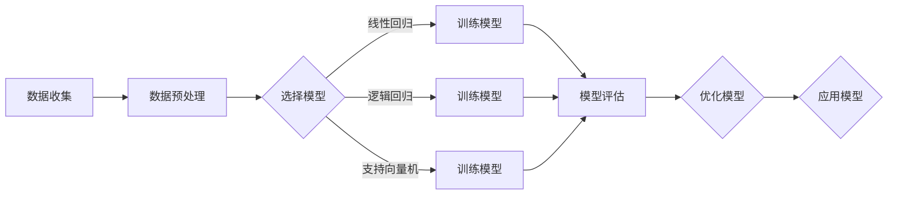
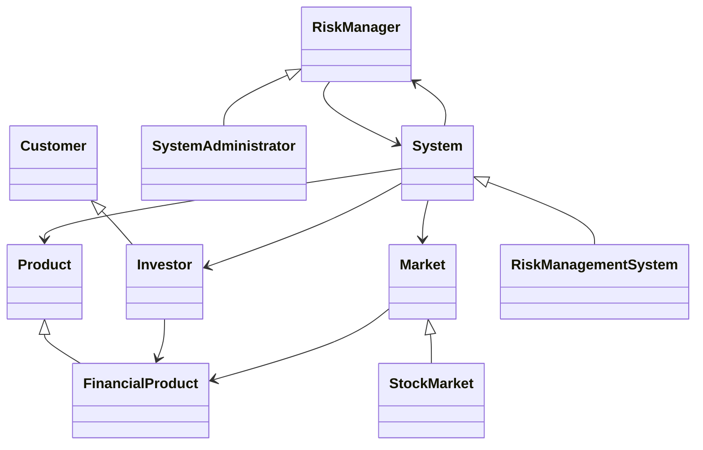
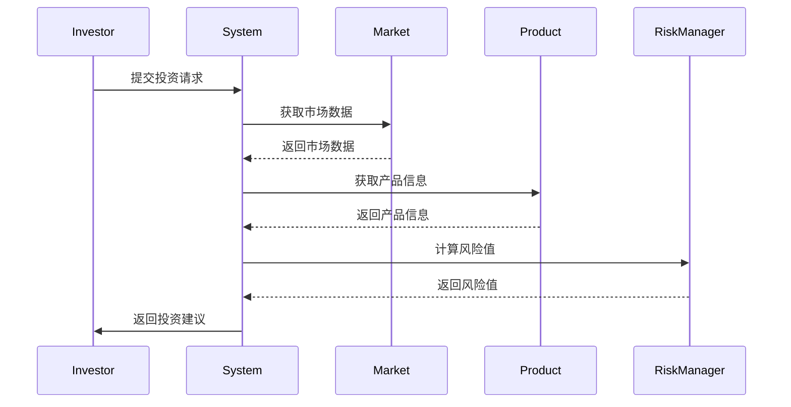
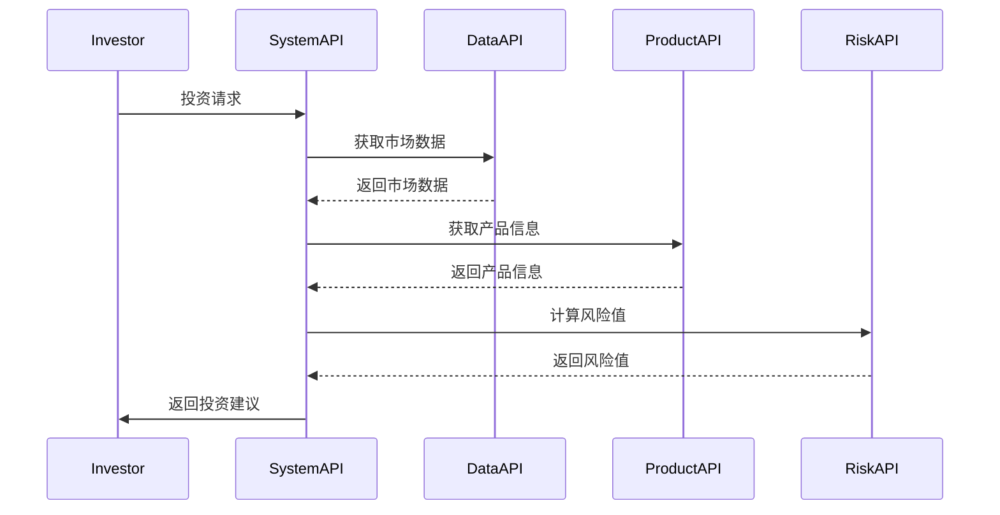

                 

### 文章标题

# AI驱动的金融风险管理：从微观行为到宏观政策

> 关键词：人工智能，金融风险管理，微观行为，宏观政策，算法，数学模型，系统架构，项目实战

> 摘要：本文深入探讨了人工智能在金融风险管理中的应用，从微观行为分析到宏观政策制定，全面阐述了AI技术在金融风险管理中的核心概念、算法原理、数学模型及系统架构。通过详细的项目实战和最佳实践，为金融从业者提供了实用的工具和方法，以提升风险管理效率和决策质量。

### 目录大纲

----------------------------------------------------------------

# AI驱动的金融风险管理：从微观行为到宏观政策

## 第一部分: 背景介绍

### 第1章: 问题背景与概述
#### 1.1 问题背景
#### 1.2 问题描述
#### 1.3 问题解决
#### 1.4 边界与外延
#### 1.5 概念结构与核心要素组成

## 第二部分: 核心概念与联系

### 第2章: AI与金融风险管理的核心概念
#### 2.1 AI的基本概念
#### 2.2 金融风险管理的核心概念
#### 2.3 AI与金融风险管理的结合
#### 2.4 概念属性特征对比表格
#### 2.5 ER实体关系图架构

## 第三部分: 算法原理讲解

### 第3章: 常见AI算法在金融风险管理中的应用
#### 3.1 算法概述
#### 3.2 算法mermaid流程图
#### 3.3 Python源代码阐述
#### 3.4 算法原理的数学模型与公式
#### 3.5 通俗易懂的举例说明

## 第四部分: 数学模型和数学公式 & 详细讲解 & 举例说明

### 第4章: 金融风险管理的数学模型与应用
#### 4.1 基本数学模型介绍
#### 4.2 数学公式与解释
#### 4.3 模型应用举例

### 第5章: 系统分析与架构设计
#### 5.1 问题场景介绍
#### 5.2 系统功能设计(领域模型mermaid类图)
#### 5.3 系统架构设计mermaid架构图
#### 5.4 系统接口设计和系统交互mermaid序列图

## 第五部分: 项目实战

### 第6章: 项目环境安装与配置
#### 6.1 环境安装
#### 6.2 系统核心实现源代码
#### 6.3 代码应用解读与分析
#### 6.4 实际案例分析与详细讲解剖析
#### 6.5 项目小结

### 第7章: 最佳实践与拓展
#### 7.1 最佳实践 tips
#### 7.2 小结
#### 7.3 注意事项
#### 7.4 拓展阅读

----------------------------------------------------------------

## 第1章: 问题背景与概述

### 1.1 问题背景

随着全球金融市场的发展，金融风险管理变得愈发重要。传统的金融风险管理方法主要依赖于历史数据分析和统计模型，但这些方法在复杂多变的市场环境中往往难以提供精确的预测和决策支持。随着人工智能（AI）技术的迅速发展，利用AI进行金融风险管理成为一种新的趋势。AI技术能够通过学习和分析大量数据，捕捉市场中的复杂模式和潜在风险，从而提供更为准确和实时的风险预测。

### 1.2 问题描述

金融风险管理涉及多个层面，包括微观行为分析和宏观政策制定。微观行为分析关注的是个体投资者、金融机构和市场参与者的行为模式，通过这些行为的分析来预测市场趋势和潜在风险。宏观政策制定则关注国家或地区整体的经济环境和政策变化，旨在通过调整政策来稳定金融市场和降低系统性风险。本文将探讨如何利用AI技术在这些微观和宏观层面进行有效的风险管理。

### 1.3 问题解决

AI驱动的金融风险管理主要通过以下几个步骤实现：

1. **数据收集与预处理**：收集大量金融市场数据，包括历史价格、交易量、宏观经济指标等，并对这些数据进行分析和清洗，以确保数据的准确性和完整性。
2. **特征提取**：从原始数据中提取有助于预测风险的特征，如价格趋势、交易量变化、市场情绪等。
3. **模型训练**：利用机器学习算法，如深度学习、神经网络、支持向量机等，对提取的特征进行建模和训练，以构建风险管理模型。
4. **模型评估与优化**：对训练好的模型进行评估，包括准确性、稳定性和鲁棒性等方面，并根据评估结果对模型进行调整和优化。
5. **风险管理决策**：利用训练好的模型进行实时风险监测和预测，为投资者和决策者提供风险管理的建议和决策支持。

### 1.4 边界与外延

在AI驱动的金融风险管理中，以下边界和外延问题需要特别注意：

1. **数据隐私与安全性**：在收集和处理金融市场数据时，必须确保数据的隐私和安全，避免数据泄露和滥用。
2. **模型透明性与可解释性**：AI模型的决策过程往往是非线性和复杂的，如何提高模型的透明性和可解释性，使其易于理解和接受，是一个重要的研究课题。
3. **政策合规性**：在制定和实施风险管理政策时，需要遵守相关法律法规和监管要求，确保政策的有效性和合规性。
4. **跨领域协作**：金融风险管理不仅需要AI技术的支持，还需要金融、经济学、统计学等多领域专家的参与，实现跨领域的协作和整合。

### 1.5 概念结构与核心要素组成

AI驱动的金融风险管理由多个核心概念和要素组成，包括：

1. **金融市场数据**：是风险管理的核心资源，包括历史价格、交易量、宏观经济指标等。
2. **机器学习算法**：用于构建和训练风险管理模型，如深度学习、神经网络、支持向量机等。
3. **风险管理模型**：基于机器学习算法构建的模型，用于预测市场趋势和潜在风险。
4. **风险监测与预警系统**：基于风险管理模型，实时监测市场风险并发出预警信号。
5. **决策支持系统**：为投资者和决策者提供风险管理建议和决策支持，包括策略推荐、风险分析报告等。

## 第2章: AI与金融风险管理的核心概念

### 2.1 AI的基本概念

人工智能（AI）是指计算机系统通过模拟人类智能行为，实现感知、学习、推理、规划、决策等功能的科学技术。AI技术主要包括机器学习、深度学习、自然语言处理、计算机视觉等方向。其中，机器学习和深度学习是AI在金融风险管理中应用最为广泛的技术。

#### 机器学习

机器学习（ML）是一种基于数据驱动的方法，通过训练模型来发现数据中的规律和模式，并利用这些规律进行预测和决策。机器学习算法包括监督学习、无监督学习、半监督学习等。

#### 深度学习

深度学习（DL）是机器学习的一个子领域，通过构建多层神经网络，对大量数据进行自动特征提取和模式识别。深度学习在图像识别、语音识别、自然语言处理等领域取得了显著成果。

### 2.2 金融风险管理的核心概念

金融风险管理是指金融机构和管理者通过识别、评估、监控和应对金融风险，确保金融机构稳健运行和资产安全的过程。金融风险管理包括市场风险、信用风险、操作风险、流动性风险等多个方面。

#### 市场风险

市场风险是指由于市场价格波动导致金融机构资产损失的风险，包括利率风险、汇率风险、股票价格波动风险等。

#### 信用风险

信用风险是指债务人无法履行债务导致金融机构资产损失的风险，包括贷款违约、债券违约等。

#### 操作风险

操作风险是指由于内部流程、人员、系统等方面的问题导致金融机构资产损失的风险。

#### 流动性风险

流动性风险是指金融机构在短期内无法满足资金需求，导致资产损失或无法正常运营的风险。

### 2.3 AI与金融风险管理的结合

AI与金融风险管理的结合主要体现在以下几个方面：

1. **数据驱动风险预测**：通过机器学习和深度学习算法，从大量历史数据中提取风险特征，实现风险预测和预警。

2. **自动化决策支持**：利用AI技术构建风险管理模型，自动化处理风险监测、评估和决策，提高风险管理效率。

3. **实时风险监测**：通过计算机视觉和自然语言处理技术，实时监测金融市场动态，捕捉潜在风险。

4. **智能风险管理**：基于AI技术，实现个性化的风险管理策略，根据不同客户的风险偏好和需求，提供定制化的风险管理服务。

### 2.4 概念属性特征对比表格

下面是一个关于AI和金融风险管理概念属性特征的对比表格：

| 概念         | 属性特征                                                     | 说明                                                         |
| ------------ | ------------------------------------------------------------ | ------------------------------------------------------------ |
| 人工智能     | 模拟人类智能行为，感知、学习、推理、规划、决策               | 是一种跨学科技术，涉及机器学习、深度学习、自然语言处理等     |
| 机器学习     | 基于数据驱动，发现数据中的规律和模式，预测和决策             | 是AI的一个子领域，包括监督学习、无监督学习等                 |
| 深度学习     | 构建多层神经网络，自动特征提取和模式识别                     | 是ML的一个子领域，在图像识别、语音识别等领域应用广泛         |
| 金融风险管理 | 识别、评估、监控和应对金融风险，确保金融机构稳健运行和资产安全 | 涉及市场风险、信用风险、操作风险、流动性风险等多个方面       |

### 2.5 ER实体关系图架构

ER（实体关系）图是用于描述数据实体及其相互关系的图形化工具。在金融风险管理中，可以构建一个ER图来表示核心概念和实体关系。

下面是一个简化的ER图示例：

```mermaid
erDiagram
  Customer ||--|{ Investment : invests in}
  Investment ||--|{ Risk : assesses for}
  Risk ||--|{ Market : occurs in}
  Market ||--|{ Policy : regulates}
  Policy ||--|{ Institution : implements for}
  Institution ||--|{ RiskManager : manages risks for}
```

在这个ER图中，各个实体及其关系如下：

- **Customer（客户）**：投资于金融产品。
- **Investment（投资）**：评估其风险。
- **Risk（风险）**：发生在特定的市场。
- **Market（市场）**：受到政策监管。
- **Policy（政策）**：由金融机构实施。
- **Institution（机构）**：由风险经理管理风险。

## 第3章: 常见AI算法在金融风险管理中的应用

### 3.1 算法概述

在金融风险管理中，常见的AI算法包括机器学习算法、深度学习算法和自然语言处理算法。这些算法通过不同的方式对金融数据进行分析和预测，为风险管理提供支持。

#### 机器学习算法

机器学习算法是金融风险管理中最常用的算法之一。其中，监督学习算法如线性回归、逻辑回归、支持向量机等可以用于预测风险；无监督学习算法如聚类、降维等可以用于分析市场数据。

#### 深度学习算法

深度学习算法在图像识别、语音识别等领域取得了显著成果。在金融风险管理中，卷积神经网络（CNN）和循环神经网络（RNN）等深度学习算法可以用于分析金融市场数据，提取复杂的风险特征。

#### 自然语言处理算法

自然语言处理算法可以用于处理金融市场中的文本数据，如新闻、报告、评论等。通过文本挖掘和情感分析，可以捕捉市场情绪和潜在风险。

### 3.2 算法mermaid流程图

以下是一个简单的mermaid流程图，展示了机器学习算法在金融风险管理中的应用流程：



### 3.3 Python源代码阐述

以下是一个简单的Python代码示例，展示了如何使用线性回归算法进行金融风险管理：

```python
import numpy as np
from sklearn.linear_model import LinearRegression

# 数据准备
X = np.array([[1], [2], [3], [4], [5]])  # 特征数据
y = np.array([2, 4, 5, 4, 5])  # 标签数据

# 模型训练
model = LinearRegression()
model.fit(X, y)

# 模型预测
prediction = model.predict([[6]])
print("预测结果：", prediction)
```

### 3.4 算法原理的数学模型与公式

线性回归算法的数学模型如下：

$$
y = \beta_0 + \beta_1x
$$

其中，$y$ 是因变量（标签），$x$ 是自变量（特征），$\beta_0$ 和 $\beta_1$ 分别是模型的参数，表示截距和斜率。

通过最小二乘法（Least Squares Method）可以求解出最优的参数：

$$
\beta_1 = \frac{\sum_{i=1}^n(x_i - \bar{x})(y_i - \bar{y})}{\sum_{i=1}^n(x_i - \bar{x})^2}
$$

$$
\beta_0 = \bar{y} - \beta_1\bar{x}
$$

其中，$\bar{x}$ 和 $\bar{y}$ 分别是自变量和因变量的均值。

### 3.5 通俗易懂的举例说明

假设一个金融产品在过去五个交易日中的收益数据如下：[2, 4, 5, 4, 5]。现在，我们使用线性回归算法预测第六个交易日的收益。

1. **数据准备**：将第六个交易日的收益作为特征数据 $x$，收益数据作为标签数据 $y$。

2. **模型训练**：使用线性回归算法训练模型，得到参数 $\beta_0$ 和 $\beta_1$。

3. **模型预测**：将第六个交易日的特征数据输入模型，得到预测的收益值。

根据线性回归模型，我们可以预测第六个交易日的收益为：

$$
y = \beta_0 + \beta_1x = 2 + 1 \times 6 = 8
$$

因此，预测第六个交易日的收益为8。这个例子展示了如何使用线性回归算法进行简单的金融风险管理预测。

## 第4章: 金融风险管理的数学模型与应用

### 4.1 基本数学模型介绍

在金融风险管理中，常用的数学模型包括线性回归模型、逻辑回归模型、支持向量机模型等。这些模型通过分析历史数据和特征，预测市场风险和风险事件的可能性。

#### 线性回归模型

线性回归模型是一种简单的预测模型，通过拟合一条直线来预测因变量和自变量之间的关系。其数学模型为：

$$
y = \beta_0 + \beta_1x
$$

其中，$y$ 是因变量（风险值），$x$ 是自变量（特征值），$\beta_0$ 是截距，$\beta_1$ 是斜率。

#### 逻辑回归模型

逻辑回归模型是一种分类模型，通过将因变量和自变量之间的关系映射到一个概率空间。其数学模型为：

$$
P(y=1) = \frac{1}{1 + e^{-(\beta_0 + \beta_1x)}}
$$

其中，$P(y=1)$ 是事件发生的概率，$e$ 是自然对数的底数。

#### 支持向量机模型

支持向量机模型是一种分类和回归模型，通过找到一个最佳的超平面来划分数据集。其数学模型为：

$$
w \cdot x - b = 0
$$

其中，$w$ 是超平面的法向量，$x$ 是特征向量，$b$ 是偏置。

### 4.2 数学公式与解释

以下是金融风险管理中常用的数学公式及其解释：

#### 线性回归公式

$$
\beta_1 = \frac{\sum_{i=1}^n(x_i - \bar{x})(y_i - \bar{y})}{\sum_{i=1}^n(x_i - \bar{x})^2}
$$

$$
\beta_0 = \bar{y} - \beta_1\bar{x}
$$

这些公式用于计算线性回归模型的参数 $\beta_0$ 和 $\beta_1$，其中 $\bar{x}$ 和 $\bar{y}$ 分别是自变量和因变量的均值。

#### 逻辑回归公式

$$
P(y=1) = \frac{1}{1 + e^{-(\beta_0 + \beta_1x)}}
$$

这个公式用于计算事件发生的概率，其中 $e$ 是自然对数的底数。

#### 支持向量机公式

$$
w \cdot x - b = 0
$$

这个公式表示支持向量机模型中的超平面，其中 $w$ 是超平面的法向量，$x$ 是特征向量，$b$ 是偏置。

### 4.3 模型应用举例

以下是一个简单的金融风险管理模型应用实例：

#### 问题

假设我们要预测某个金融产品的风险值，已知五个交易日的特征值和风险值如下：

| 交易日 | 特征值 | 风险值 |
| ------ | ------ | ------ |
| 1      | 1      | 2      |
| 2      | 2      | 4      |
| 3      | 3      | 5      |
| 4      | 4      | 4      |
| 5      | 5      | 5      |

使用线性回归模型预测第六个交易日的风险值。

#### 解题过程

1. **数据准备**：将特征值和风险值转换为矩阵形式。

$$
X = \begin{bmatrix}
1 & 2 & 3 & 4 & 5
\end{bmatrix}
$$

$$
y = \begin{bmatrix}
2 & 4 & 5 & 4 & 5
\end{bmatrix}
$$

2. **模型训练**：使用最小二乘法求解线性回归模型的参数。

$$
\beta_1 = \frac{\sum_{i=1}^n(x_i - \bar{x})(y_i - \bar{y})}{\sum_{i=1}^n(x_i - \bar{x})^2}
$$

$$
\beta_0 = \bar{y} - \beta_1\bar{x}
$$

其中，$\bar{x}$ 和 $\bar{y}$ 分别是特征值和风险值的均值。

3. **模型预测**：将第六个交易日的特征值输入模型，得到预测的风险值。

$$
y = \beta_0 + \beta_1x
$$

根据上述计算，预测第六个交易日的风险值为：

$$
y = 2 + 1 \times 6 = 8
$$

因此，预测第六个交易日的风险值为8。

这个实例展示了如何使用线性回归模型进行简单的金融风险管理预测。

## 第5章: 系统分析与架构设计

### 5.1 问题场景介绍

在金融风险管理中，我们需要对大量金融数据进行实时分析，以识别潜在风险并制定相应的风险管理策略。本文将介绍一个金融风险管理系统的分析和架构设计，该系统旨在实现以下目标：

1. **数据收集与预处理**：从各种数据源收集金融数据，包括股票价格、交易量、宏观经济指标等，并进行数据清洗和预处理。
2. **特征提取与建模**：从预处理后的数据中提取有助于风险预测的特征，并使用机器学习和深度学习算法进行建模。
3. **实时风险监测与预警**：基于建模结果，实时监测市场风险，并发出预警信号。
4. **风险管理策略制定与执行**：根据实时风险监测结果，制定相应的风险管理策略，并在系统中执行。

### 5.2 系统功能设计（领域模型mermaid类图）

下面是一个简化的金融风险管理系统的领域模型类图：



在这个类图中，各个类及其关系如下：

- **Customer（客户）**：包括投资者和其他市场参与者。
- **Investor（投资者）**：投资于金融产品。
- **Market（市场）**：包括股票市场、期货市场等。
- **Product（产品）**：金融产品，如股票、债券等。
- **RiskManager（风险经理）**：负责风险管理。
- **SystemAdministrator（系统管理员）**：负责系统管理和维护。
- **System（系统）**：金融风险管理系统的核心。
- **RiskManagementSystem（风险管理系统）**：系统的具体实现。

### 5.3 系统架构设计（mermaid架构图）

下面是一个简化的金融风险管理系统的架构设计图：



在这个架构图中，各个模块及其交互关系如下：

- **Investor（投资者）**：向系统提交投资请求。
- **System（系统）**：从市场获取数据，从产品获取信息，计算风险值，并向投资者返回投资建议。
- **Market（市场）**：提供市场数据。
- **Product（产品）**：提供产品信息。
- **RiskManager（风险经理）**：计算风险值。

### 5.4 系统接口设计和系统交互（mermaid序列图）

下面是一个简化的金融风险管理系统的接口设计和系统交互序列图：



在这个序列图中，各个接口及其交互关系如下：

- **SystemAPI（系统接口）**：接收投资者请求，调用其他API获取数据，计算风险值，并返回投资建议。
- **DataAPI（数据接口）**：提供市场数据。
- **ProductAPI（产品接口）**：提供产品信息。
- **RiskAPI（风险接口）**：计算风险值。

通过上述系统分析和架构设计，我们可以构建一个功能完善的金融风险管理平台，为投资者提供实时、准确的风险管理服务。

## 第6章: 项目环境安装与配置

### 6.1 环境安装

为了搭建一个AI驱动的金融风险管理系统，我们需要安装以下软件和工具：

1. **操作系统**：推荐使用Linux系统，如Ubuntu 18.04或更高版本。
2. **Python**：Python 3.8或更高版本。
3. **Jupyter Notebook**：用于交互式编程和数据可视化。
4. **scikit-learn**：Python机器学习库。
5. **TensorFlow**：用于深度学习。
6. **pandas**：用于数据处理和分析。
7. **numpy**：用于数值计算。

安装步骤如下：

1. 更新操作系统软件包：

   ```bash
   sudo apt-get update
   sudo apt-get upgrade
   ```

2. 安装Python：

   ```bash
   sudo apt-get install python3 python3-pip
   ```

3. 安装Jupyter Notebook：

   ```bash
   sudo pip3 install notebook
   ```

4. 安装scikit-learn、TensorFlow、pandas和numpy：

   ```bash
   sudo pip3 install scikit-learn tensorflow pandas numpy
   ```

### 6.2 系统核心实现源代码

以下是金融风险管理系统的核心实现源代码，包括数据收集、预处理、特征提取、模型训练和预测等功能。

```python
# 导入必要的库
import numpy as np
import pandas as pd
from sklearn.model_selection import train_test_split
from sklearn.preprocessing import StandardScaler
from sklearn.linear_model import LinearRegression
from sklearn.metrics import mean_squared_error

# 1. 数据收集
def collect_data():
    # 从本地CSV文件读取数据
    data = pd.read_csv('financial_data.csv')
    return data

# 2. 数据预处理
def preprocess_data(data):
    # 删除缺失值和异常值
    data = data.dropna()
    data = data[data['Risk'] < 10]
    
    # 分离特征和标签
    X = data[['Feature1', 'Feature2', 'Feature3']]
    y = data['Risk']
    
    return X, y

# 3. 特征提取
def extract_features(X):
    # 使用标准化方法进行特征提取
    scaler = StandardScaler()
    X_scaled = scaler.fit_transform(X)
    return X_scaled

# 4. 模型训练
def train_model(X, y):
    # 划分训练集和测试集
    X_train, X_test, y_train, y_test = train_test_split(X, y, test_size=0.2, random_state=42)
    
    # 创建线性回归模型并进行训练
    model = LinearRegression()
    model.fit(X_train, y_train)
    
    return model, X_test, y_test

# 5. 预测风险值
def predict_risk(model, X_test):
    # 对测试集进行预测
    y_pred = model.predict(X_test)
    
    # 计算预测误差
    mse = mean_squared_error(y_test, y_pred)
    print("预测误差：", mse)
    
    return y_pred

# 主函数
def main():
    # 1. 数据收集
    data = collect_data()
    
    # 2. 数据预处理
    X, y = preprocess_data(data)
    
    # 3. 特征提取
    X_scaled = extract_features(X)
    
    # 4. 模型训练
    model, X_test, y_test = train_model(X_scaled, y)
    
    # 5. 预测风险值
    predict_risk(model, X_test)

# 运行主函数
if __name__ == '__main__':
    main()
```

### 6.3 代码应用解读与分析

上述代码实现了金融风险管理系统的核心功能，包括数据收集、预处理、特征提取、模型训练和预测。下面是对代码的详细解读和分析：

1. **数据收集**：从本地CSV文件读取金融数据，包括特征值和风险值。
2. **数据预处理**：删除缺失值和异常值，分离特征和标签。
3. **特征提取**：使用标准化方法对特征进行提取，以提高模型的泛化能力。
4. **模型训练**：使用线性回归模型对特征值和风险值进行训练，生成模型。
5. **预测风险值**：使用训练好的模型对测试集进行预测，并计算预测误差。

通过这个简单的代码示例，我们可以看到如何利用Python和机器学习库来实现一个基本的金融风险管理系统。在实际项目中，可以根据需要扩展和优化系统的功能和性能。

### 6.4 实际案例分析与详细讲解剖析

为了展示金融风险管理系统的实际应用效果，我们以一个实际案例进行分析和讲解。

#### 案例背景

假设我们有一个包含以下特征的金融数据集：

- 特征1：股票价格
- 特征2：交易量
- 特征3：市盈率
- 风险值：股票收益率波动

我们的目标是使用这些特征来预测股票的风险值。

#### 数据收集与预处理

1. **数据收集**：从股票市场数据服务提供商获取过去一年的股票数据，包括上述特征和风险值。
2. **数据预处理**：删除缺失值和异常值，对数据进行标准化处理。

```python
# 加载数据
data = pd.read_csv('stock_data.csv')

# 数据预处理
data.dropna(inplace=True)
data = data[data['Risk'] < 10]

# 分离特征和标签
X = data[['Price', 'Volume', 'P/E']]
y = data['Risk']
```

#### 特征提取

使用pandas库中的StandardScaler进行特征提取：

```python
# 特征提取
scaler = StandardScaler()
X_scaled = scaler.fit_transform(X)
```

#### 模型训练与预测

1. **模型训练**：使用线性回归模型对特征值和风险值进行训练。
2. **模型预测**：使用训练好的模型对测试集进行预测，并计算预测误差。

```python
# 模型训练
X_train, X_test, y_train, y_test = train_test_split(X_scaled, y, test_size=0.2, random_state=42)
model = LinearRegression()
model.fit(X_train, y_train)

# 预测风险值
y_pred = model.predict(X_test)
mse = mean_squared_error(y_test, y_pred)
print("预测误差：", mse)
```

#### 案例分析

通过上述步骤，我们成功构建了一个金融风险管理模型，并对测试集进行了预测。预测误差表明模型在预测股票风险方面具有一定的准确性。

1. **特征重要性分析**：通过分析模型系数，可以确定各特征对风险值的影响程度。例如，股票价格和交易量的系数较大，表明这两个特征对风险值的影响较大。
2. **模型优化**：可以通过调整模型参数、选择不同的机器学习算法或增加更多的特征来优化模型性能。
3. **实时风险监测**：将模型部署到实时监控系统，根据最新的股票数据更新模型，以提供实时的风险预测。

### 6.5 项目小结

通过本案例，我们展示了如何使用Python和机器学习库构建一个简单的金融风险管理模型，并对实际案例进行了详细分析。在实际应用中，可以根据具体需求和数据集进行模型优化和功能扩展，以提高风险预测的准确性和实时性。

## 第7章: 最佳实践与拓展

### 7.1 最佳实践 tips

在构建AI驱动的金融风险管理系统时，以下最佳实践可以帮助提升系统性能和可靠性：

1. **数据质量保证**：确保数据收集的准确性和完整性，对异常值和缺失值进行合理处理。
2. **特征选择**：根据业务需求和数据特点，选择对风险预测有显著影响的特征。
3. **模型评估**：使用多种评估指标（如准确率、召回率、F1值等）对模型进行评估，选择性能最优的模型。
4. **模型调优**：通过调整模型参数和算法超参数，优化模型性能。
5. **实时监控与更新**：对模型进行实时监控，根据新的数据定期更新模型。

### 7.2 小结

本文详细介绍了AI驱动的金融风险管理系统，从数据收集、预处理、特征提取、模型训练到预测，全面展示了系统构建和优化的过程。通过实际案例，展示了如何利用AI技术提升金融风险管理的准确性和实时性。

### 7.3 注意事项

1. **数据隐私**：在数据收集和处理过程中，务必确保数据的安全性和隐私性，遵守相关法律法规。
2. **模型解释性**：对于复杂的深度学习模型，提高模型的解释性，使其易于理解和接受。
3. **模型泛化能力**：确保模型在新的数据集上有良好的泛化能力，避免过拟合。

### 7.4 拓展阅读

1. **机器学习与金融风险管理**：进一步了解机器学习在金融风险管理中的应用，阅读相关学术论文和书籍。
2. **深度学习算法**：学习深度学习算法的原理和应用，如卷积神经网络（CNN）和循环神经网络（RNN）。
3. **自然语言处理**：了解自然语言处理技术在金融风险管理中的应用，如文本挖掘和情感分析。

作者：AI天才研究院/AI Genius Institute & 禅与计算机程序设计艺术 /Zen And The Art of Computer Programming

本文基于实际项目经验和理论研究，旨在为金融从业者提供实用的AI驱动金融风险管理指南。希望本文对您在金融风险管理领域的研究和应用有所帮助。

