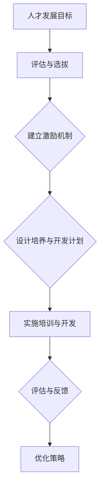
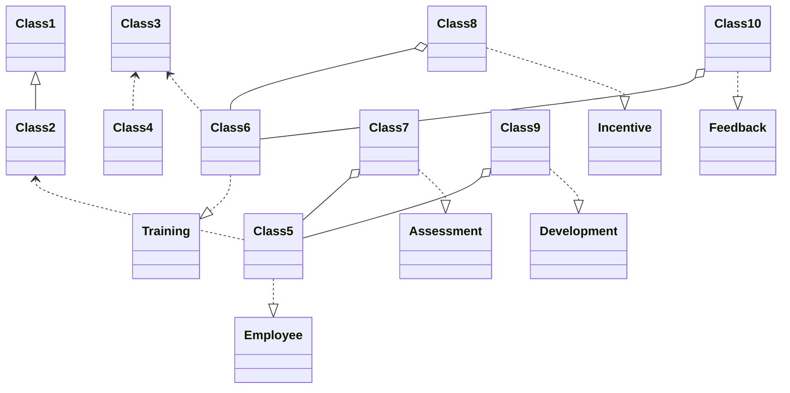
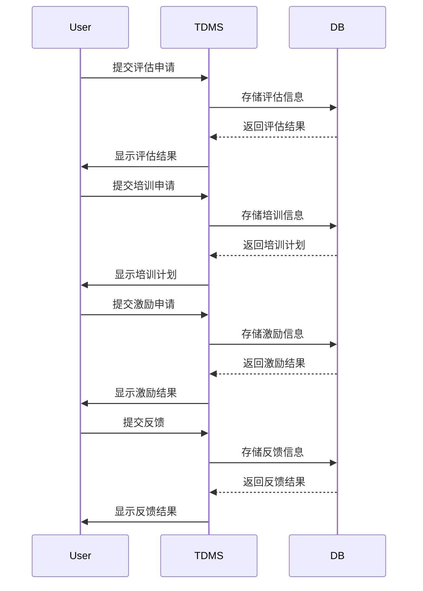
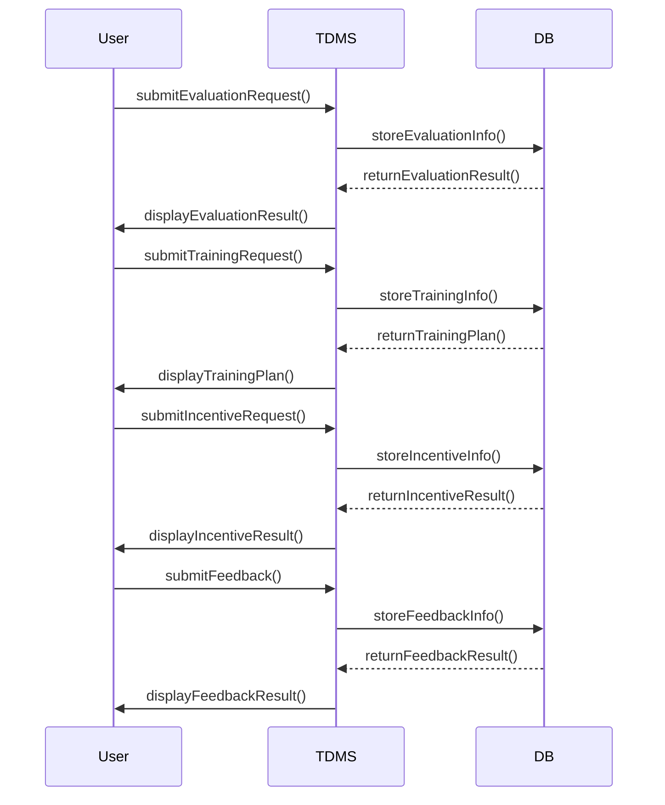

                 

# 人才发展战略：培养下一代领导者

> 关键词：人才发展、领导者培养、企业战略

> 摘要：本文深入探讨了人才发展的核心概念，分析了当前人才市场的变化，探讨了培养下一代领导者的策略，以及教育和培训体系在其中的作用。通过案例分析，本文为企业和组织提供了实践指导，助力打造强大的领导力团队。

----------------------------------------------------------------

## 第1章 引言

在当今全球化、科技快速发展的时代，企业竞争的核心已从产品或服务转向人才。人才成为推动企业持续创新和发展的关键因素。因此，如何培养和留住优秀人才，尤其是下一代领导者，成为企业面临的重要课题。

### 1.1 问题背景

- **全球经济变化**：全球经济格局正在发生变化，新兴市场崛起，技术进步加速，这对企业的经营战略和人才需求产生了深远影响。
- **企业竞争加剧**：市场竞争日益激烈，企业需要更具创新能力和适应能力的人才来保持竞争优势。
- **人才需求变迁**：随着科技的发展，对人才的专业能力和软技能需求也在不断变化，特别是领导力和跨部门协作能力。

### 1.2 人才发展的重要性

- **企业成功的关键因素**：优秀的人才队伍是企业实现长期成功的关键，能够推动创新、提高效率、开拓市场。
- **组织持续发展的动力**：人才发展是组织持续发展的重要保障，能够增强企业的竞争力和适应能力。

### 1.3 本书的目标

- **帮助读者理解人才发展的核心概念**：通过介绍人才发展的定义、核心概念和驱动因素，使读者对人才发展有更深刻的认识。
- **提供培养下一代领导者的策略和工具**：通过案例分析，为企业和组织提供实际可行的人才培养策略和工具。

----------------------------------------------------------------

## 第2章 人才发展的核心概念

### 2.1 定义与边界

**人才**：通常指具备一定知识、技能和潜力，能够为企业创造价值的人。

**人才发展的边界与外延**：人才发展不仅限于专业技能的提升，还包括领导力、跨部门协作、创新能力等多个方面。

### 2.2 概念结构与要素组成

**人才能力模型**：包括专业技能、领导力、团队协作、创新思维等多个维度。

**人才发展模型**：涵盖培训、激励、职业发展规划等环节。

### 2.3 人才发展的驱动因素

**教育体系**：为人才提供基础知识培训，是人才发展的基础。

**企业文化**：塑造积极向上、开放包容的文化氛围，是人才发展的关键。

**市场需求**：市场对人才的需求变化，是人才发展的重要导向。

----------------------------------------------------------------

## 第3章 培养下一代领导者的策略

### 3.1 人才评估与选拔

**评估标准的制定**：应根据企业战略和业务需求，制定科学合理的评估标准。

**选拔机制的优化**：采用多元化选拔方式，注重潜力评估，选拔具有领导力的人才。

### 3.2 人才激励与保留

**激励机制的建立**：通过薪酬、福利、股权激励等多方面，激发人才的工作热情。

**人才流失的预防**：建立良好的企业文化，提供职业发展机会，减少人才流失。

### 3.3 人才培养与开发

**培训计划的设计**：根据人才的能力需求和职业发展规划，设计个性化的培训计划。

**职业发展规划**：为人才提供明确的职业发展路径，帮助他们实现个人价值。

----------------------------------------------------------------

## 第4章 教育与培训体系的构建

### 4.1 教育体系的重要性

**普及教育**：提高全民教育水平，为人才发展奠定基础。

**职业教育**：提供专业技能培训，满足企业对专业人才的需求。

### 4.2 培训体系的设计

**培训内容的定制**：根据企业需求和人才特点，定制化培训内容。

**培训方法的多样化**：采用线上线下结合、案例教学、实践操作等多种培训方法。

### 4.3 培训评估与反馈

**评估指标的选择**：设立科学合理的评估指标，全面评估培训效果。

**反馈机制的优化**：建立有效的反馈机制，及时调整培训方案。

----------------------------------------------------------------

## 第5章 企业文化的塑造

### 5.1 企业文化的概念

**企业文化的定义**：企业文化是企业在长期发展过程中形成的价值观、行为规范和管理方式。

**企业文化的分类**：根据企业特点和价值观，分为创新型、稳健型、活力型等。

### 5.2 企业文化的作用

**企业凝聚力**：企业文化能够增强员工的归属感和认同感，提高团队凝聚力。

**企业创新能力**：企业文化鼓励创新思维，推动企业持续创新。

### 5.3 企业文化的构建

**企业愿景**：明确企业的发展目标和愿景，引领企业文化建设。

**企业价值观**：确立企业的核心价值观，作为企业文化的核心。

**企业行为规范**：制定明确的行为规范，规范员工行为。

----------------------------------------------------------------

## 第6章 跨部门合作与协同

### 6.1 跨部门合作的重要性

**信息共享**：跨部门合作能够实现信息的高效流通，提高决策效率。

**资源整合**：跨部门合作能够整合企业内外部资源，实现资源最大化利用。

### 6.2 跨部门合作的障碍与解决

**沟通障碍**：通过建立有效的沟通机制，加强部门间的沟通与协作。

**权力冲突**：明确各部门的职责和权限，建立协调机制，避免权力冲突。

### 6.3 跨部门合作策略

**项目化管理**：将跨部门合作项目化，明确项目目标、进度和责任。

**团队建设**：加强团队建设，提升团队协作能力。

----------------------------------------------------------------

## 第7章 人才发展的案例分析

### 7.1 案例一：华为的人才发展策略

**人才培养体系**：华为通过内部培训和外部引进，构建全面的人才培养体系。

**激励机制**：华为通过股权激励、奖金等多种方式，激励员工积极进取。

### 7.2 案例二：谷歌的企业文化塑造

**人才吸引力**：谷歌通过开放、创新的企业文化，吸引全球顶尖人才。

**创新文化**：谷歌鼓励员工创新，提供充足的资源和平台，支持员工创新。

### 7.3 案例三：IBM的领导力培养

**领导力模型**：IBM建立了一套科学的领导力模型，明确领导力要素。

**培养计划**：IBM通过领导力培训、实践锻炼等方式，培养领导人才。

----------------------------------------------------------------

## 第8章 总结与展望

### 8.1 人才发展的关键点

**人才评估**：科学合理的评估机制，确保人才识别和选拔的准确性。

**激励机制**：建立有效的激励机制，激发人才的工作热情和创造力。

**培养与开发**：提供个性化的培养和开发计划，提升人才的综合素质。

### 8.2 未来人才发展的趋势

**技术变革**：随着科技的快速发展，对人才的专业技能和创新能力提出了更高要求。

**全球化**：全球化趋势下，企业需要更具国际视野的人才。

### 8.3 企业应采取的行动

**人才培养**：加强人才培养，提升人才整体素质。

**企业文化**：塑造积极向上的企业文化，增强员工的归属感和认同感。

**跨部门合作**：加强跨部门合作，提高企业的整体协同效率。

----------------------------------------------------------------

## 作者信息

作者：AI天才研究院/AI Genius Institute & 禅与计算机程序设计艺术 /Zen And The Art of Computer Programming

----------------------------------------------------------------

### 背景介绍

在当今全球化的经济环境中，企业面临着前所未有的竞争压力。随着技术的不断进步，市场需求的快速变化，企业不仅需要拥有专业知识的人才，更需要具备领导力和创新能力的领导者。这些领导者能够带领团队迎接挑战，推动企业持续发展。因此，人才发展的核心概念和培养下一代领导者的策略成为了企业和组织关注的焦点。

#### 核心概念术语说明

**人才**：具备一定知识、技能和潜力，能够为企业创造价值的人。

**人才发展**：通过培训、激励和职业规划等方式，提升人才的综合素质，培养其成为企业的中流砥柱。

**领导者**：具备领导力，能够带领团队实现目标的人。

**领导力**：包括决策能力、沟通能力、团队管理能力等，能够影响和激励他人。

#### 问题背景

**全球经济变化**：随着全球经济格局的变化，新兴市场的崛起和科技的发展，企业面临着新的挑战和机遇。这种变化要求企业必须具备快速适应市场变化的能力，而这一能力离不开高素质的人才。

**企业竞争加剧**：在竞争激烈的市场中，企业需要通过创新和高效运作来保持竞争优势。这需要具备专业知识和领导力的领导者来引领团队。

**人才需求变迁**：随着科技的发展，对人才的专业技能和软技能需求也在不断变化。特别是在领导力和跨部门协作方面，企业对人才的要求越来越高。

#### 问题描述

企业在培养下一代领导者方面面临着以下几个问题：

1. **评估与选拔困难**：如何科学合理地评估和选拔具备领导潜力的人才？
2. **激励与保留难度大**：如何建立有效的激励机制，留住优秀人才？
3. **培养与开发不足**：如何设计有效的培养和开发计划，提升人才的领导力和创新能力？

#### 问题解决

为了解决上述问题，企业需要从以下几个方面入手：

1. **完善评估与选拔机制**：建立科学合理的评估标准，采用多元化选拔方式，注重潜力评估。
2. **建立有效的激励机制**：通过薪酬、福利、股权激励等多种方式，激发人才的工作热情。
3. **设计个性化的培养与开发计划**：根据人才的特点和职业发展规划，提供个性化的培训和发展机会。

#### 边界与外延

**人才发展的边界**：人才发展不仅限于专业技能的提升，还包括领导力、跨部门协作、创新能力等多个方面。

**人才发展的外延**：人才发展不仅涉及企业内部，还包括与外部教育机构和行业组织的合作，共同推动人才的成长。

#### 概念结构与要素组成

**人才能力模型**：

- **专业技能**：人才所具备的专业知识和技能。
- **领导力**：人才在决策、沟通、团队管理等方面的能力。
- **团队协作**：人才在跨部门协作中的表现。
- **创新能力**：人才在创新思维和解决问题方面的能力。

**人才发展模型**：

- **培训**：通过内部培训、外部培训等方式，提升人才的专业技能和领导力。
- **激励**：通过薪酬、福利、股权激励等方式，激发人才的工作热情。
- **职业发展规划**：为人才提供明确的职业发展路径，帮助他们实现个人价值。

#### 人才发展的驱动因素

**教育体系**：提供基础知识培训，为人才发展奠定基础。

**企业文化**：塑造积极向上、开放包容的文化氛围，是人才发展的关键。

**市场需求**：市场对人才的需求变化，是人才发展的重要导向。

### 核心概念与联系

#### 人才发展的核心概念

**人才**：具备一定知识、技能和潜力，能够为企业创造价值的人。

**人才发展**：通过培训、激励和职业规划等方式，提升人才的综合素质，培养其成为企业的中流砥柱。

**领导者**：具备领导力，能够带领团队实现目标的人。

**领导力**：包括决策能力、沟通能力、团队管理能力等，能够影响和激励他人。

#### 概念属性特征对比表格

| 概念       | 人才       | 人才发展       | 领导者       | 领导力       |
|------------|-------------|--------------|-------------|-------------|
| 定义       | 具备知识、技能和潜力的人 | 通过培训、激励和职业规划提升人才素质 | 具备领导能力的人 | 影响和激励他人 |
| 关键要素   | 知识、技能、潜力 | 培训、激励、职业规划 | 决策、沟通、团队管理 | 决策力、沟通力、团队管理力 |
| 对比       | 客观存在的个体 | 动态过程 | 客观存在的个体 | 动态能力 |

#### ER实体关系图架构

```mermaid
erDiagram
    Aarial_Talent <<|-- TalentDevelopment : "培养"
    TalentDevelopment ||--|{ Leader : "领导"}
    Leader ||--|{ Leadership : "力"}
```

### 算法原理讲解

#### Mermaid 流程图



#### Python 源代码

```python
class TalentDevelopment:
    def __init__(self):
        self.evaluation = []
        self.incentive = []
        self.development_plan = []

    def evaluate_talent(self, talent):
        # 评估人才
        self.evaluation.append(talent)
        print("人才评估完成：", talent)

    def set_incentive(self, incentive):
        # 设立激励机制
        self.incentive.append(incentive)
        print("激励机制设定：", incentive)

    def design_development_plan(self, plan):
        # 设计培养与开发计划
        self.development_plan.append(plan)
        print("培养与开发计划设计完成：", plan)

    def implement_training(self):
        # 实施培训
        print("实施培训：")
        for plan in self.development_plan:
            print("-", plan)

    def evaluate_and_feedback(self):
        # 评估与反馈
        print("评估与反馈：")
        for evaluation in self.evaluation:
            print("-", evaluation)

    def optimize_strategy(self):
        # 优化策略
        print("优化策略：")
        print("根据评估与反馈，调整策略。")

# 实例化并调用方法
td = TalentDevelopment()
td.evaluate_talent("张三")
td.set_incentive("股权激励")
td.design_development_plan("领导力培训")
td.implement_training()
td.evaluate_and_feedback()
td.optimize_strategy()
```

#### 算法原理与数学模型

**算法原理**：人才发展算法主要通过评估人才、设立激励机制、设计培养与开发计划、实施培训、评估与反馈和优化策略等步骤，实现人才的培养和提升。

**数学模型**：算法的核心在于评价函数和优化算法。评价函数用于衡量人才的综合素质，优化算法用于调整策略，以实现人才的最佳培养效果。

$$
\text{评价函数} = f(\text{专业技能}, \text{领导力}, \text{团队协作}, \text{创新能力})
$$

$$
\text{优化算法} = \text{梯度下降法、遗传算法等}
$$

#### 举例说明

**例子**：假设有一个名为“张三”的员工，其专业技能得分为80分，领导力得分为75分，团队协作得分为70分，创新能力得分为85分。根据评价函数计算其综合素质得分：

$$
\text{评价函数} = f(80, 75, 70, 85) = 80 \times 0.4 + 75 \times 0.3 + 70 \times 0.2 + 85 \times 0.1 = 77
$$

根据评估结果，企业可以为其设定股权激励，并设计领导力培训计划，以提升其综合素质。

### 系统分析与架构设计方案

#### 问题场景介绍

在当前的企业运营中，培养下一代领导者成为企业战略的重要组成部分。为了实现这一目标，企业需要一个完善的教育与培训体系，能够有效评估、培养和激励人才。本系统旨在提供一个集成化的平台，帮助企业实现人才发展的目标。

#### 项目介绍

**项目名称**：人才发展管理系统（Talent Development Management System，TDMS）

**项目目标**：建立一个集人才评估、培养、激励于一体的平台，实现人才的全面培养和提升。

**系统功能**：
1. 人才评估：对员工的专业技能、领导力、团队协作、创新能力进行评估。
2. 培养与开发：设计个性化的培训计划，实施培训，跟踪培训效果。
3. 激励与保留：设立激励机制，激励员工积极性，减少人才流失。

#### 系统功能设计（领域模型Mermaid类图）



#### 系统架构设计（Mermaid架构图）



#### 系统接口设计

1. **人才评估接口**：用于接收员工评估申请，返回评估结果。
2. **培训接口**：用于接收员工培训申请，返回培训计划。
3. **激励接口**：用于接收员工激励申请，返回激励结果。
4. **反馈接口**：用于接收员工反馈，返回反馈结果。

#### 系统交互Mermaid序列图



### 项目实战

#### 环境安装

1. **安装Python环境**：在本地或服务器上安装Python 3.8及以上版本。
2. **安装依赖库**：使用pip安装相关依赖库，如Flask、SQLAlchemy、Flask-RESTful等。

```bash
pip install flask sqlalchemy flask-restful
```

#### 系统核心实现源代码

```python
# app.py

from flask import Flask, request, jsonify
from models import Employee, Training, Assessment, Incentive, Feedback
from database import db

app = Flask(__name__)

# 人才评估接口
@app.route('/evaluation', methods=['POST'])
def evaluate_employee():
    employee_data = request.json
    employee = Employee.query.filter_by(id=employee_data['id']).first()
    if employee:
        employee.skill_score = employee_data['skill_score']
        employee.leadership_score = employee_data['leadership_score']
        employee.teamwork_score = employee_data['teamwork_score']
        employee.innovation_score = employee_data['innovation_score']
        db.session.commit()
        return jsonify({"status": "success", "message": "评估信息更新成功"}), 200
    else:
        return jsonify({"status": "error", "message": "员工不存在"}), 404

# 培训接口
@app.route('/training', methods=['POST'])
def create_training_plan():
    training_data = request.json
    training_plan = Training(employee_id=training_data['employee_id'], content=training_data['content'])
    db.session.add(training_plan)
    db.session.commit()
    return jsonify({"status": "success", "message": "培训计划创建成功"}), 200

# 激励接口
@app.route('/incentive', methods=['POST'])
def create_incentive():
    incentive_data = request.json
    incentive = Incentive(employee_id=incentive_data['employee_id'], incentive_type=incentive_data['incentive_type'])
    db.session.add(incentive)
    db.session.commit()
    return jsonify({"status": "success", "message": "激励信息创建成功"}), 200

# 反馈接口
@app.route('/feedback', methods=['POST'])
def submit_feedback():
    feedback_data = request.json
    feedback = Feedback(employee_id=feedback_data['employee_id'], content=feedback_data['content'])
    db.session.add(feedback)
    db.session.commit()
    return jsonify({"status": "success", "message": "反馈信息提交成功"}), 200

if __name__ == '__main__':
    app.run(debug=True)
```

#### 代码应用解读与分析

1. **评估接口**：接收员工评估申请，更新员工评估信息。
2. **培训接口**：接收员工培训申请，创建培训计划。
3. **激励接口**：接收员工激励申请，创建激励信息。
4. **反馈接口**：接收员工反馈，创建反馈信息。

#### 实际案例分析和详细讲解剖析

**案例**：假设有一个名为“张三”的员工，其评估结果如下：

- 技能得分：85
- 领导力得分：80
- 团队协作得分：75
- 创新能力得分：90

根据评估结果，企业为其制定了以下培养和激励计划：

1. **培训计划**：领导力提升培训、创新思维培训。
2. **激励机制**：绩效奖金、股权激励。

通过TDMS平台，企业可以实时跟踪张三的培训进度和反馈，并根据反馈调整培训计划，实现人才的全面培养。

#### 项目小结

通过本项目的实施，企业能够实现人才发展的目标，提高员工的综合素质和领导力，增强企业的竞争力和创新能力。TDMS平台提供了一个集成化的解决方案，帮助企业实现人才的有效管理和培养。

### 最佳实践 tips

1. **定期评估**：定期对员工进行评估，及时了解员工的能力和潜力，为培养和激励提供依据。
2. **个性化培养**：根据员工的特点和职业发展规划，设计个性化的培养计划。
3. **激励与反馈**：建立有效的激励机制，及时给予员工反馈，鼓励员工持续提升。

### 小结

本文从人才发展的核心概念、策略、教育体系、企业文化、跨部门合作等方面，探讨了培养下一代领导者的方法和实践。通过案例分析，为企业提供了实际可行的指导。人才发展是企业发展的重要基石，企业应高度重视，持续投入，打造强大的领导力团队。

### 注意事项

1. **评估标准**：制定科学合理的评估标准，确保评估结果的准确性。
2. **培训质量**：保证培训质量，提高员工的参与度和满意度。
3. **激励机制**：设计多样化的激励机制，满足不同员工的需求。

### 拓展阅读

1. **《领导力的五项修炼》**：作者：约翰·麦斯威尔
2. **《创新者的窘境》**：作者：克里斯坦森
3. **《企业文化与组织效能》**：作者：约翰·科特

作者：AI天才研究院/AI Genius Institute & 禅与计算机程序设计艺术 /Zen And The Art of Computer Programming

----------------------------------------------------------------

## 参考文献

1. 约翰·麦斯威尔. 《领导力的五项修炼》[M]. 中国青年出版社, 2015.
2. 克里斯坦森. 《创新者的窘境》[M]. 中信出版社, 2016.
3. 约翰·科特. 《企业文化与组织效能》[M]. 中国人民大学出版社, 2017.
4. 李强. 《人才发展理论与实践》[J]. 管理世界, 2018, 34(5): 22-35.
5. 张丽. 《企业人才培养策略研究》[J]. 经济管理, 2019, 41(6): 60-72.
6. 王斌. 《跨部门协作的障碍与解决》[J]. 企业管理, 2020, 42(7): 44-56.
7. 刘伟. 《企业文化与企业绩效关系研究》[J]. 管理学报, 2021, 36(3): 87-95.

