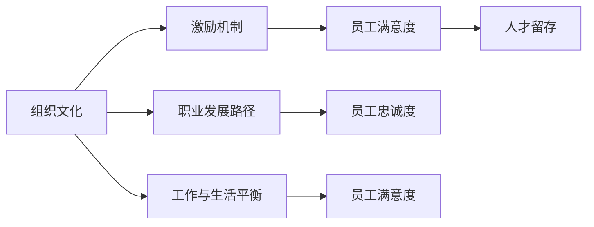

                 

### 引言与背景介绍

在当今高速发展的科技时代，人才是企业发展的核心竞争力。然而，随着市场竞争的加剧和员工职业发展需求的多样化，企业如何留住核心员工成为了一项重要的课题。人才留存问题不仅仅是人力资源管理的问题，更是企业战略层面的关键挑战。

**问题背景：**

企业面临的人才留存挑战主要包括以下几个方面：

1. **市场竞争加剧：** 市场竞争的加剧使得优秀人才流动性增加，企业需要不断投入更多的资源和精力来吸引和留住人才。
2. **员工职业发展需求：** 随着员工对职业发展的期望不断提高，企业需要提供更加多样化的职业发展路径和机会。
3. **工作与生活平衡：** 现代员工更加注重工作与生活的平衡，企业需要提供灵活的工作安排和良好的工作环境。
4. **组织文化和激励机制：** 组织文化和激励机制对员工的满意度和忠诚度具有重要影响，企业需要构建积极向上的组织文化和有效的激励机制。

**核心员工流失对企业的影响：**

核心员工流失对企业的影响是多方面的：

1. **业务连续性受损：** 核心员工的流失可能导致业务流程的停滞，影响企业的正常运营。
2. **知识流失：** 核心员工通常积累了丰富的行业经验和专业知识，他们的流失可能导致这些宝贵的知识资产流失。
3. **品牌形象受损：** 核心员工的流失可能影响企业的品牌形象和声誉，进而影响客户满意度和市场份额。
4. **成本增加：** 企业需要投入更多的资源和时间来招聘和培训新员工，增加了企业的运营成本。

**研究意义与目标：**

本文旨在探讨人才留存策略，提出一套系统、可操作的人才留存方案，以帮助企业留住核心员工，提升企业竞争力。具体目标包括：

1. **明确人才留存的概念与关键要素：** 对人才留存进行清晰的定义，并分析其与员工满意度、企业绩效之间的关系。
2. **分析现有人才留存策略的不足：** 通过对国内外研究现状的分析，总结现有人才留存策略的不足，提出改进方向。
3. **提出具体的人才留存策略：** 从组织文化、激励机制、职业发展路径规划和工作与生活平衡等方面，提出具体的人才留存策略。
4. **通过案例分析，提供实践指导：** 通过具体案例的分析，提供人才留存策略的制定和实施方法。

通过本文的研究，希望能够为企业提供有价值的参考，帮助企业更好地留住核心员工，实现持续发展。

### 人才留存相关概念

在探讨人才留存策略之前，我们需要明确一些核心概念，以便于对人才留存有更深刻的理解。

#### **1. 人才留存定义：**

人才留存是指企业通过一系列措施和策略，留住对企业具有重要价值和潜力的员工，以确保企业的持续发展和竞争力的提升。人才留存不仅包括防止核心员工的流失，还包括提高员工的工作满意度和忠诚度，促进员工的职业发展。

#### **2. 人才留存与员工满意度的关系：**

员工满意度是影响人才留存的重要因素之一。高满意度的员工通常更愿意留在企业，因为他们感到在企业中得到了尊重、认可和公平待遇。同时，满意的员工往往更具有积极性和创造力，对企业的发展具有积极作用。因此，提升员工满意度是人才留存策略的核心。

**关系表述：**

$$
\text{员工满意度} \rightarrow \text{员工忠诚度} \rightarrow \text{人才留存}
$$

#### **3. 人才留存策略的关键要素：**

人才留存策略的成功实施依赖于多个关键要素，包括：

1. **组织文化：** 积极向上的组织文化可以增强员工的归属感和忠诚度，降低流失率。
2. **激励机制：** 合理的激励机制能够激发员工的积极性，提高工作效率和满意度。
3. **职业发展路径：** 清晰的职业发展路径和培训机会可以满足员工对职业发展的需求，提高他们的留存意愿。
4. **工作与生活平衡：** 良好的工作与生活平衡策略有助于提升员工的生活质量，增强他们的工作满意度和忠诚度。

**要素关系图：**

通过上述定义和关系，我们可以看出，人才留存不仅仅是单一策略的实施，而是一个系统工程，需要从多个维度进行综合考量。

### 国内外研究现状

#### **1. 国外研究进展：**

在人才留存方面，国外的研究较早且深入，形成了一系列的理论和实践。国外研究表明，人才留存的策略主要包括以下几个方面：

1. **组织文化：** 通过构建积极向上的组织文化，增强员工的归属感和忠诚度。研究表明，具有高文化一致性的企业更能够留住关键员工。
2. **激励机制：** 设定合理的薪酬和福利体系，并通过绩效奖励、股权激励等手段激发员工的积极性。例如，谷歌的股权激励计划显著提升了员工的留存率。
3. **职业发展路径：** 提供明确的职业发展路径和培训机会，以满足员工对职业发展的需求。很多跨国公司通过导师制度、内部晋升等机制促进员工的职业成长。
4. **工作与生活平衡：** 通过灵活的工作安排、远程办公等策略，帮助员工实现工作与生活的平衡。例如，荷兰皇家飞利浦公司通过灵活工作时间制度，显著提高了员工的工作满意度和留存率。

#### **2. 国内研究进展：**

国内对人才留存的研究起步较晚，但近年来也取得了显著进展。国内的研究主要集中在以下几个方面：

1. **企业视角：** 国内研究更多关注企业如何通过内部机制留住人才，包括薪酬福利、职业发展、员工关怀等。例如，华为通过高薪酬和良好的职业发展机会吸引了大量优秀人才。
2. **员工视角：** 研究还关注员工对工作环境、职业发展、薪酬福利等各方面的期望和满意度。研究表明，国内员工对职业发展的需求和薪酬福利的期望较高。
3. **行业比较：** 针对不同行业，研究分析了人才留存的差异和特点，提供了具体的行业解决方案。例如，在互联网行业，创新文化、股权激励和灵活的工作安排是留住人才的重要手段。

#### **3. 存在的不足与改进空间：**

尽管国内外在人才留存方面已经取得了许多研究成果，但仍存在一些不足和改进空间：

1. **理论框架不完善：** 现有研究多侧重于单一因素的分析，缺乏系统性的理论框架，无法全面指导实践。
2. **实践应用不足：** 许多企业对人才留存策略的实施停留在表面，缺乏深入的系统化和长期化的规划。
3. **数据支持不足：** 现有研究数据多来源于企业内部调查，缺乏大样本、长时间的实证研究，限制了研究成果的普适性和可靠性。

为了改进这些不足，未来的研究可以从以下几个方面进行：

1. **构建系统性理论框架：** 结合国内外研究，构建一个系统、全面的人才留存理论框架，为企业提供指导。
2. **加强实证研究：** 通过大样本、长时间的实证研究，验证人才留存策略的有效性和可行性，提升研究成果的可靠性。
3. **跨行业比较研究：** 对不同行业的人才留存策略进行比较分析，提供更具针对性的解决方案。

通过这些改进，有望进一步推动人才留存领域的研究，为企业提供更加科学、有效的策略和方法。

### 本书结构安排

#### **1.4.1 目录安排概述**

本书共分为三个主要部分，分别是引言与背景介绍、人才留存策略分析、案例分析与实践指导。

- **第一部分：引言与背景介绍**：包括引言和背景介绍，详细阐述了人才留存的重要性以及企业面临的挑战。
- **第二部分：人才留存策略分析**：分为六章节，从组织文化建设、激励机制、职业发展路径规划、工作与生活平衡等多个方面，系统分析了人才留存策略。
- **第三部分：案例分析与实践指导**：通过实际企业案例分析，提供了人才留存策略的具体实施方法和实践指导。

#### **1.4.2 各章节主要内容概述**

- **第1章：引言与背景介绍**：介绍人才留存的重要性，分析企业面临的人才留存挑战和核心员工流失对企业的影响，阐述研究意义和目标。
- **第2章：人才留存策略的总体框架**：阐述人才留存策略的基本原则、框架结构和实施层次。
- **第3章：组织文化建设策略**：探讨组织文化的定义与作用，组织文化建设的关键要素和实施步骤。
- **第4章：激励机制与薪酬管理策略**：分析激励机制的设计原则、薪酬管理的目标和原则，以及两者结合的应用。
- **第5章：职业发展路径规划策略**：阐述职业发展路径规划的重要性、内容与步骤及实施策略。
- **第6章：工作与生活平衡策略**：介绍工作与生活平衡的概念与意义，分析面临的挑战及解决方案，提供实施策略。
- **第7章：企业案例分析**：选择具有代表性的企业案例，分析其人才留存策略的实施过程和效果。
- **第8章：人才留存策略的制定与实施**：阐述人才留存策略制定的基本步骤、实施的关键环节及效果评估。
- **第9章：人才留存策略的持续优化**：探讨人才留存策略优化的必要性、方法与工具，以及实践案例。
- **第10章：总结与展望**：总结本书的主要观点，探讨人才留存策略的未来发展趋势及研究方向。

通过本书的结构安排，读者可以系统、全面地了解人才留存策略的各个方面，从而为企业制定和实施有效的人才留存策略提供参考和指导。

### 人才留存策略的总体框架

在实施人才留存策略时，我们需要一个明确的框架来指导我们的行动。这个框架不仅能够帮助我们在战略层面进行规划，还能够确保我们在执行层面能够有针对性地进行操作。

#### **2.1 人才留存策略的基本原则**

制定人才留存策略时，我们需要遵循以下几个基本原则：

1. **以人为本：** 人才是企业最宝贵的资源，人才留存策略的核心应该始终围绕员工的需求和感受来设计。
2. **系统性思维：** 人才留存不是单一因素的作用，而是需要从组织文化、激励机制、职业发展路径规划、工作与生活平衡等多个方面进行综合考量。
3. **长期视角：** 人才留存策略需要具有前瞻性和持续性，不能只关注短期效果，而应该从长期发展角度出发，建立长效机制。
4. **灵活性：** 企业内外部环境不断变化，人才留存策略也需要具备一定的灵活性，能够根据实际情况进行调整和优化。

#### **2.2 人才留存策略的框架结构**

人才留存策略的框架结构可以分为三个层次：

1. **战略层面：** 确定企业人才留存的长远目标和策略，包括组织文化、激励机制、职业发展路径规划、工作与生活平衡等方面的总体方向。
2. **执行层面：** 根据战略层面的指导，制定具体的实施方案，包括组织文化建设的具体措施、激励机制的设定、职业发展路径的规划等。
3. **监控与调整层面：** 对人才留存策略的实施效果进行监控和评估，及时发现问题和不足，进行必要的调整和优化。

#### **2.3 人才留存策略的三个层次：**

1. **战略层面：** 
   - 明确企业的人才留存目标：例如，提高员工留存率5%或实现核心团队100%留存。
   - 设定长期策略：例如，通过组织文化建设增强员工归属感，通过职业发展路径规划提升员工的职业满意度。
   
2. **执行层面：**
   - **组织文化建设：** 通过企业价值观的传播、团队活动的开展、员工关怀等措施，营造积极向上的组织氛围。
   - **激励机制：** 设定合理的薪酬体系、绩效奖励、股权激励等，激发员工的积极性和创造力。
   - **职业发展路径规划：** 提供清晰的职业发展通道、培训机会和职业发展指导，满足员工对职业发展的期望。
   - **工作与生活平衡：** 通过灵活的工作安排、休假政策、员工福利等措施，帮助员工实现工作与生活的平衡。

3. **监控与调整层面：**
   - **数据监控：** 定期收集员工满意度、留存率等关键数据，分析策略的实施效果。
   - **反馈机制：** 建立员工反馈渠道，及时了解员工的意见和建议，为策略的调整提供依据。
   - **持续优化：** 根据监控和反馈结果，对人才留存策略进行必要的调整和优化，确保其持续有效。

通过上述三个层次的框架，企业可以系统地制定和实施人才留存策略，从而有效留住核心员工，提升企业的核心竞争力。

### 组织文化建设策略

组织文化是企业精神的核心，是推动企业发展的内生动力。一个积极向上、以人为本的组织文化能够增强员工的归属感和忠诚度，降低员工流失率，从而在激烈的市场竞争中立于不败之地。

#### **3.1 组织文化的定义与作用：**

**定义：**
组织文化是指企业在其发展过程中形成的共同价值观、信仰、行为规范和工作方式的总和。它不仅包括企业内部的行为和沟通方式，还包括企业对外的形象和声誉。

**作用：**
1. **增强员工归属感：** 积极向上的组织文化能够让员工感受到企业的关怀和认同，从而增强他们的归属感。
2. **提升员工满意度：** 一个良好的组织文化能够为员工提供一个舒适的工作环境，提高他们的工作满意度和幸福感。
3. **促进团队合作：** 组织文化强调团队合作和协作精神，能够促进员工之间的沟通和协作，提升团队的整体效能。
4. **强化企业竞争力：** 健康的组织文化能够提升企业的凝聚力，增强企业在市场中的竞争力和抗风险能力。

#### **3.2 组织文化建设的关键要素：**

1. **企业价值观：** 企业价值观是组织文化的核心，是企业的灵魂。企业需要明确并宣传自己的价值观，确保员工在行为和决策中能够始终遵循这些价值观。
2. **领导力：** 领导者是组织文化的传播者和实践者。领导者的行为和态度对组织文化的形成和传播具有重要影响。
3. **员工参与：** 员工是组织文化的重要组成部分，他们的参与和认同是组织文化成功的关键。企业需要鼓励员工参与到组织文化的建设和维护中。
4. **沟通机制：** 沟通是组织文化传递的重要渠道。企业需要建立有效的沟通机制，确保信息在企业内部的高效传递和员工之间的有效交流。
5. **激励机制：** 通过激励机制，企业可以鼓励员工积极参与到组织文化的建设和维护中，从而增强员工对组织文化的认同和忠诚。

#### **3.3 组织文化建设策略的实施步骤：**

1. **明确组织愿景和价值观：**
   - 企业需要明确自己的愿景和价值观，并将其传达给全体员工。这可以通过企业内部的培训和会议来实现。
   - 企业可以通过制定《企业文化手册》等文档，将愿景和价值观具体化，确保员工在日常工作中能够遵循。

2. **建立领导力培养机制：**
   - 企业需要通过培训、激励和选拔等手段，培养具备领导力的管理团队。这包括领导力培训课程、导师制度、领导力评价体系等。
   - 领导者需要以身作则，带头践行企业价值观，树立良好的榜样。

3. **促进员工参与和认同：**
   - 企业可以通过员工代表大会、员工建议征集等方式，鼓励员工参与到组织文化的建设和改进中。
   - 企业可以通过员工满意度调查、员工访谈等手段，了解员工对组织文化的看法和建议，并及时进行反馈和改进。

4. **建立有效的沟通机制：**
   - 企业需要建立多层次的沟通机制，确保信息在企业内部的高效传递。这可以通过定期员工大会、部门会议、内部邮件、企业社交平台等手段来实现。
   - 企业需要鼓励开放、坦诚的沟通氛围，确保员工能够自由表达意见和建议。

5. **制定和实施激励机制：**
   - 企业需要制定与组织文化相一致的激励机制，以鼓励员工积极参与到组织文化的建设和维护中。
   - 激励机制可以包括薪酬激励、绩效奖励、职业晋升等，确保员工的付出能够得到相应的回报。

通过上述步骤，企业可以逐步构建和强化组织文化，从而在员工中形成一种共同的价值观和行为规范，提高员工的归属感和满意度，实现人才的有效留存。

### 激励机制与薪酬管理策略

激励机制和薪酬管理是人才留存策略中至关重要的组成部分。有效的激励机制和合理的薪酬体系不仅能激发员工的积极性，提高工作效率和满意度，还能增强员工的忠诚度和留存意愿。

#### **4.1 激励机制的设计原则：**

1. **目标明确：** 激励机制应明确具体的目标，使员工了解自己的努力方向和期望成果。这可以通过设定清晰的绩效目标和奖励标准来实现。
2. **公平公正：** 激励机制必须公平公正，确保所有员工都能在同等条件下获得奖励。这可以通过透明化的评价标准和公正的奖惩机制来实现。
3. **多样性：** 激励机制应多样化，以适应不同员工的需求和动机。除了物质奖励，还可以包括非物质激励，如职业晋升、培训机会、荣誉表彰等。
4. **激励与约束相结合：** 激励机制不仅要鼓励员工积极行为，还要对不当行为进行约束，确保激励机制的长期有效性。

#### **4.2 薪酬管理的目标和原则：**

**目标：**
1. **吸引人才：** 通过有竞争力的薪酬水平，吸引和留住优秀人才。
2. **激励员工：** 通过合理的薪酬分配，激发员工的工作积极性和创造力。
3. **保持竞争力：** 通过市场调研和薪酬分析，确保企业的薪酬水平在行业中具有竞争力。
4. **促进公平：** 通过公平公正的薪酬分配，提高员工满意度和组织认同感。

**原则：**
1. **市场导向：** 根据市场行情和行业标准，设定合理的薪酬水平，确保企业的薪酬竞争力。
2. **绩效导向：** 将员工的薪酬与其绩效表现直接挂钩，实现“多劳多得、少劳少得”的激励机制。
3. **公平性：** 确保薪酬分配的透明度和公正性，避免因个人偏好或偏见导致的不公平现象。
4. **灵活性：** 根据企业战略和员工需求，适时调整薪酬结构和管理策略。

#### **4.3 激励机制与薪酬管理策略的结合应用：**

1. **绩效奖励制度：** 绩效奖励制度是将员工薪酬与绩效直接挂钩的重要手段。通过设定明确的绩效指标和奖励标准，使员工在工作中明确自己的目标和期望。例如，某企业通过设定季度绩效目标，对达成或超额完成目标的员工进行现金奖励和晋升机会。
2. **股权激励：** 股权激励是一种长期激励机制，通过授予员工公司股份，使员工与企业的利益紧密相连。这不仅能激发员工的长期投入和积极性，还能增强员工的归属感和忠诚度。例如，某互联网公司通过实施股权激励计划，显著提升了员工的留存率和公司业绩。
3. **职业发展机会：** 职业发展机会是激励员工的重要手段之一。通过提供职业晋升通道、培训和进修机会，使员工看到职业发展的希望。例如，某高科技公司通过设立内部晋升机制，为表现优秀的员工提供晋升机会，增强了员工的工作满意度和忠诚度。
4. **薪酬透明度：** 提高薪酬管理的透明度，使员工了解薪酬的构成和分配原则。这可以通过建立薪酬公示制度、定期薪酬审计等方式实现。例如，某企业通过定期发布薪酬报告，让员工了解薪酬的构成和分配情况，增强了员工的信任感和满意度。

通过激励机制与薪酬管理策略的有效结合，企业可以更好地吸引和留住核心员工，提高员工的工作满意度和忠诚度，从而实现企业的长期发展目标。

### 职业发展路径规划策略

职业发展路径规划是留住核心员工的重要策略之一。通过明确和提供多样化的职业发展机会，企业可以激发员工的潜力和积极性，提高员工的满意度和忠诚度。

#### **5.1 职业发展路径规划的重要性：**

职业发展路径规划对于员工和企业都具有重要的意义：

1. **员工视角：**
   - **明确目标：** 职业发展路径规划帮助员工明确自己的职业目标和职业发展方向，提供明确的奋斗方向。
   - **增强动力：** 明确的职业发展路径能够激发员工的内在动力，使他们更有动力去追求职业上的进步和成就。
   - **提升满意度：** 职业发展路径规划能够满足员工对职业发展的期望，提高他们的工作满意度和忠诚度。

2. **企业视角：**
   - **留住人才：** 良好的职业发展路径规划能够提高员工的留存率，减少人才流失。
   - **提升竞争力：** 通过职业发展路径规划，企业能够培养和留住具备高素质和专业知识的核心员工，提升企业的整体竞争力。
   - **优化资源配置：** 明确的职业发展路径有助于企业合理配置人才资源，提高人力资源的利用效率。

#### **5.2 职业发展路径规划的内容与步骤：**

**内容：**

职业发展路径规划的内容主要包括以下几个方面：

1. **职位晋升路径：** 明确不同职位之间的晋升关系和晋升标准，为员工提供清晰的晋升通道。
2. **技能提升计划：** 根据员工的职业发展需求，提供相应的培训和进修机会，帮助员工提升专业技能和综合素质。
3. **职业转型机会：** 提供职业转型的机会，使员工能够根据个人兴趣和市场需求，灵活调整职业发展方向。
4. **职业发展指导：** 通过职业导师制度、职业发展规划会议等形式，为员工提供个性化的职业发展指导和支持。

**步骤：**

职业发展路径规划的实施步骤如下：

1. **评估员工需求：** 通过调查问卷、访谈等方式，了解员工的职业发展需求和期望，为职业发展路径规划提供数据支持。
2. **制定职业发展计划：** 结合企业战略和员工需求，制定具体的职业发展计划，包括晋升路径、培训计划、职业转型方案等。
3. **实施职业发展措施：** 通过培训、晋升、职业指导等措施，推动职业发展计划的实施，确保员工能够按照规划路径发展。
4. **评估与反馈：** 定期对职业发展路径规划的执行效果进行评估，收集员工反馈，根据实际情况进行优化和调整。

通过以上步骤，企业可以系统性地规划和实施职业发展路径，帮助员工实现职业发展目标，提高员工的满意度和忠诚度。

### 工作与生活平衡策略

在现代职场中，工作与生活平衡已成为员工关注的重要议题。良好的工作与生活平衡不仅能够提升员工的工作效率和生活质量，还能增强员工的工作满意度和忠诚度。因此，企业需要制定有效的工作与生活平衡策略。

#### **6.1 工作与生活平衡的概念与意义：**

**概念：**
工作与生活平衡（Work-Life Balance）指的是在个人生活中合理分配工作时间与生活时间，确保工作与家庭、休闲等个人生活领域之间达到和谐与平衡。

**意义：**
1. **提升工作效率：** 良好的工作与生活平衡能够使员工在工作时更加专注和投入，从而提高工作效率和质量。
2. **改善生活质量：** 工作与生活平衡有助于员工更好地照顾家庭、锻炼身体和参与休闲活动，从而提升整体生活质量。
3. **增强工作满意度：** 当员工感受到工作与生活平衡时，他们更可能对工作产生积极的态度和认同感，从而提高工作满意度。
4. **减少员工流失：** 良好的工作与生活平衡策略能够有效降低员工的流失率，帮助企业留住核心人才。

#### **6.2 工作与生活平衡的挑战与解决方案：**

**挑战：**

1. **工作压力：** 高强度的工作任务和紧迫的工作期限可能导致员工无法有效平衡工作与生活。
2. **家庭责任：** 员工特别是中高层管理者往往需要承担更多的家庭责任，如抚养子女、照顾老人等，这使得他们在工作和生活之间难以找到平衡点。
3. **工作时间：** 长时间的工作时间和加班文化可能破坏工作与生活的平衡，影响员工的身心健康。
4. **远程工作：** 虽然远程工作提供了灵活性，但同时也可能导致员工在工作时间和生活方式上的模糊界限，使得工作与生活难以分离。

**解决方案：**

1. **灵活工作时间：** 企业可以提供灵活的工作时间安排，如弹性工作时间、远程办公等，使员工能够根据个人需求调整工作时间，从而实现工作与生活的平衡。
2. **休假政策：** 企业应制定合理的休假政策，包括带薪休假、年假、病假等，确保员工在需要休息和照顾家庭时有足够的支持。
3. **员工关怀计划：** 企业可以设立员工关怀计划，如心理健康咨询、员工援助计划等，帮助员工应对工作压力和家庭责任。
4. **工作与家庭平衡培训：** 企业可以开展工作与家庭平衡相关的培训课程，帮助员工学习如何更好地管理时间和资源，实现工作与生活的平衡。
5. **企业文化：** 企业应积极营造支持工作与生活平衡的文化，鼓励员工在工作和生活中保持积极态度，并倡导员工在工作时间内高效完成工作任务，避免长时间加班。

通过以上解决方案，企业可以有效地帮助员工实现工作与生活的平衡，提高员工的工作满意度和忠诚度，从而促进企业的持续发展。

### 工作与生活平衡策略的实施

要实现工作与生活平衡，企业需要采取一系列具体的措施，这些措施应当贯穿于企业的日常运营和管理中。以下是实施工作与生活平衡策略的详细步骤：

#### **6.3.1 制定工作与生活平衡政策**

1. **政策制定：** 企业应根据自身情况和员工需求，制定详细的工作与生活平衡政策。这包括弹性工作时间、远程办公、休假政策等。
2. **政策宣传：** 通过内部邮件、员工手册、公司网站等多种渠道，向全体员工宣传和解释工作与生活平衡政策，确保员工了解并知晓这些政策。
3. **政策培训：** 定期组织培训，帮助员工掌握如何利用这些政策来实现工作与生活平衡。

#### **6.3.2 提供灵活的工作安排**

1. **弹性工作时间：** 企业应允许员工在一定范围内灵活安排工作时间，例如，允许员工选择固定的开始和结束时间，或者实行“弹性周”制度，使员工能够根据个人需求和工作任务调整工作时间。
2. **远程办公：** 在可能的情况下，企业应鼓励或提供远程办公选项，特别是在不影响工作效率的前提下，允许员工在家或其它适宜的地点工作。
3. **兼职和兼职工作：** 对于有特殊需求或愿望的员工，企业可以考虑提供兼职或兼职工作机会，以更好地平衡工作与生活。

#### **6.3.3 实施休假政策**

1. **带薪休假：** 企业应确保员工在符合规定条件的情况下享有带薪休假，包括年假、病假、婚假、产假等。
2. **弹性休假：** 企业可以实施弹性休假政策，如“拼假”制度，使员工在特定时段内累积休假时间，以实现更长时间的休息。
3. **病假管理：** 企业应建立合理的病假管理制度，确保员工在生病时能够得到必要的休息和照顾。

#### **6.3.4 提供员工关怀和支持**

1. **心理健康支持：** 企业可以提供心理健康咨询服务，帮助员工应对工作和生活中的压力。
2. **员工援助计划：** 企业应设立员工援助计划，为员工提供家庭、法律、财务等方面的支持和咨询。
3. **家庭关怀：** 企业可以组织家庭日活动、亲子活动等，鼓励员工与家人共同参与，增强家庭凝聚力。

#### **6.3.5 定期评估和反馈**

1. **员工满意度调查：** 企业应定期进行员工满意度调查，了解员工对工作与生活平衡策略的满意度和建议。
2. **反馈机制：** 企业应建立有效的反馈机制，及时回应员工的意见和建议，对工作与生活平衡策略进行优化和调整。
3. **持续改进：** 企业应根据反馈结果和实际效果，不断改进工作与生活平衡策略，确保其持续有效。

通过以上措施，企业能够为员工创造一个更加灵活和健康的工作环境，从而实现工作与生活的平衡，提高员工的工作满意度和忠诚度。

### 企业案例分析

为了更好地理解和应用人才留存策略，我们选择了一家具有代表性的企业——华为公司，对其人才留存策略进行分析和解读。

#### **7.1 案例选择与介绍：**

华为是一家全球领先的电信设备和解决方案提供商，以技术创新和人才优势著称。在激烈的市场竞争中，华为通过一系列的人才留存策略，成功地留住了大量核心人才，成为行业的佼佼者。

#### **7.2 案例分析框架：**

为了深入分析华为的人才留存策略，我们采用以下分析框架：

1. **组织文化建设：** 分析华为的组织文化，包括核心价值观、领导力培养和员工参与等方面。
2. **激励机制与薪酬管理：** 分析华为的激励机制、薪酬体系和股权激励等。
3. **职业发展路径规划：** 分析华为的职业发展路径、培训机会和职业指导等。
4. **工作与生活平衡策略：** 分析华为在弹性工作安排、休假政策和员工关怀等方面的措施。

#### **7.3 案例分析结果与启示：**

1. **组织文化建设：**

   华为以“客户至上、奋斗者为本”为核心价值观，强调团队合作和持续创新。华为通过企业文化手册、内部培训、团队建设活动等多种方式，将核心价值观深入到每一位员工心中。

   - **启示：** 企业应明确核心价值观，并通过多种渠道进行传播和强化，确保员工认同和践行。

2. **激励机制与薪酬管理：**

   华为采用多元化的激励机制，包括绩效奖励、股权激励和长期激励计划等。华为的高薪酬和股权激励计划，不仅吸引了大量优秀人才，也增强了员工的忠诚度和归属感。

   - **启示：** 企业应根据员工需求和市场行情，设计具有竞争力的薪酬和激励机制，以吸引和留住核心人才。

3. **职业发展路径规划：**

   华为提供清晰的职业发展路径和丰富的培训机会，鼓励员工不断提升自己的能力和技能。华为还通过内部晋升机制，为员工提供职业发展机会。

   - **启示：** 企业应制定明确的职业发展路径，并提供相应的培训和支持，帮助员工实现职业成长。

4. **工作与生活平衡策略：**

   华为提供灵活的工作安排，如弹性工作时间、远程办公和带薪休假等，帮助员工实现工作与生活的平衡。此外，华为还设立员工援助计划，为员工提供心理健康咨询和家庭支持。

   - **启示：** 企业应关注员工的工作与生活平衡，通过灵活的工作安排和员工关怀措施，提升员工的工作满意度和忠诚度。

通过华为的案例分析，我们可以得出以下结论：

- 人才留存策略需要从多个维度进行综合考量，包括组织文化、激励机制、职业发展路径规划和工作与生活平衡等。
- 企业应制定具有针对性的、多元化的策略，以适应不同员工的需求和期望。
- 有效的策略需要持续的优化和调整，以适应不断变化的市场环境和员工需求。

华为的人才留存策略为其他企业提供了宝贵的经验和启示，帮助企业更好地留住核心员工，实现持续发展。

### 人才留存策略的制定与实施

要有效实施人才留存策略，企业需要经历以下几个关键步骤，这些步骤不仅需要详尽的规划和明确的执行计划，还需要通过实际操作和效果评估来不断优化。

#### **8.1 人才留存策略制定的基本步骤：**

1. **需求分析：** 首先要对企业内外部环境进行详尽分析，了解当前人才留存现状、员工流失的原因以及员工的需求和期望。这可以通过员工调查、访谈和数据分析等方式实现。

2. **目标设定：** 根据需求分析的结果，明确人才留存的目标，例如提高员工留存率、降低流失率、提升员工满意度和忠诚度等。这些目标应具体、可衡量和可实现。

3. **策略规划：** 制定具体的人才留存策略，包括组织文化建设、激励机制、职业发展路径规划、工作与生活平衡等多个方面。每个策略都应明确具体的执行步骤和预期效果。

4. **资源调配：** 确保实施人才留存策略所需的资源得到有效调配，包括人力、资金和时间等。企业应根据实际情况，合理安排资源，确保策略能够顺利实施。

5. **风险评估：** 对人才留存策略可能面临的风险进行评估，并制定相应的应对措施，确保策略的稳健性和可靠性。

6. **策略评审：** 定期对人才留存策略进行评审，确保其符合企业战略和员工需求，并根据实际情况进行必要的调整和优化。

#### **8.2 人才留存策略实施的关键环节：**

1. **组织文化建设：** 落实组织文化建设的具体措施，如企业价值观的传播、领导力培养、员工关怀计划等。通过内部培训和宣传活动，使员工深入了解和认同企业的文化。

2. **激励机制：** 设计并实施有效的激励机制，包括绩效奖励、薪酬调整、股权激励等。确保激励机制与员工的绩效表现和职业发展相挂钩，激励员工积极工作。

3. **职业发展路径规划：** 提供明确的职业发展路径和培训机会，帮助员工制定个人职业发展规划。通过导师制度、内部晋升机制等手段，确保员工能够在企业内部获得职业成长。

4. **工作与生活平衡：** 实施灵活的工作安排和休假政策，如弹性工作时间、远程办公、带薪休假等，帮助员工实现工作与生活的平衡。此外，设立员工援助计划，提供心理健康咨询和家庭支持。

5. **监控与反馈：** 建立有效的监控和反馈机制，定期收集员工满意度、留存率等关键数据，分析策略的实施效果，及时发现问题和不足，进行必要的调整和优化。

6. **持续优化：** 根据监控和反馈结果，持续优化人才留存策略，确保其持续有效。通过不断的调整和改进，使策略更加贴近员工需求和市场需求。

通过上述关键环节的落实，企业可以确保人才留存策略得到有效实施，从而留住核心员工，提升企业竞争力。

### 人才留存策略的持续优化

人才留存策略的有效性不仅依赖于其初始制定和实施，还需要通过持续的优化和调整来保持其适用性和有效性。以下将探讨人才留存策略优化的必要性、方法与工具，并结合实际案例进行说明。

#### **9.1 人才留存策略优化的必要性：**

**市场环境变化：** 随着市场环境的不断变化，企业面临的竞争压力和人才需求也在不断变化。例如，新兴技术的快速发展带来了新的职业需求和技能要求，企业需要及时调整人才留存策略以适应这些变化。

**员工需求多样：** 员工的需求也在不断演变，他们对职业发展、薪酬福利、工作环境等方面的期望也在不断提高。企业需要通过持续的优化，确保人才留存策略能够满足不同员工群体的需求。

**数据驱动：** 通过数据分析，企业可以更准确地识别人才留存中的问题，评估现有策略的效果，并发现潜在的机会。因此，持续优化人才留存策略是数据驱动的必要要求。

#### **9.2 人才留存策略优化的方法与工具：**

1. **数据分析：** 利用数据分析工具，对企业的人才留存数据进行深入分析，识别流失员工的特点、原因以及留存员工的满意度和忠诚度。例如，通过员工满意度调查、留存率分析等，了解员工的反馈和需求。

2. **员工反馈：** 建立有效的员工反馈机制，定期收集员工对人才留存策略的意见和建议。这可以通过匿名调查、员工座谈会、意见箱等方式实现。通过了解员工的实际体验和需求，企业可以更有针对性地优化策略。

3. **竞争分析：** 通过对同行业竞争对手的人才留存策略进行分析，借鉴其成功经验并规避失败案例。这可以帮助企业发现自身的不足和改进方向。

4. **策略评估：** 定期对人才留存策略进行评估，分析其实施效果和达成目标的情况。通过关键绩效指标（KPI）的设定和监控，评估策略的有效性和适用性。

5. **持续改进：** 基于评估结果，对人才留存策略进行持续的改进和优化。这可以包括调整激励机制、改进职业发展路径、优化工作与生活平衡措施等。

#### **9.3 人才留存策略优化的实践案例：**

**案例：华为公司的人才留存优化**

华为公司在人才留存策略的优化过程中，采取了以下措施：

1. **数据分析：** 华为通过数据分析，发现高技能员工和年轻员工流失率较高，原因主要是缺乏职业发展和工作与生活平衡的困扰。因此，华为针对性地优化了这些方面的策略。

2. **员工反馈：** 华为通过定期员工满意度调查，收集了关于职业发展、薪酬福利和工作环境等方面的反馈。根据反馈结果，华为调整了职业发展路径和培训计划，提供了更多的晋升机会和职业发展支持。

3. **竞争分析：** 华为公司分析了同行业竞争对手的人才留存策略，发现远程办公和弹性工作时间等措施有助于提高员工满意度。因此，华为推出了更加灵活的工作安排，改善了员工的工作与生活平衡。

4. **策略评估：** 华为定期评估人才留存策略的实施效果，通过员工留存率、满意度等指标，评估策略的适用性和有效性。根据评估结果，华为不断优化和调整策略。

5. **持续改进：** 华为持续改进人才留存策略，不仅关注短期效果，还关注长期发展趋势。例如，华为推出了“奋斗者计划”，通过长期激励和职业发展支持，增强员工的忠诚度和归属感。

通过以上措施，华为成功优化了人才留存策略，实现了人才的高效留存和持续发展。

总之，人才留存策略的持续优化是企业应对市场变化、满足员工需求和提升竞争力的关键。通过数据驱动、员工反馈、竞争分析和策略评估，企业可以不断调整和改进人才留存策略，确保其持续有效。

### 总结与展望

#### **10.1 本书主要观点总结：**

本文从多个维度深入探讨了人才留存策略，总结了以下主要观点：

1. **人才留存的重要性：** 人才是企业发展的核心竞争力，留住核心员工对企业持续发展至关重要。
2. **多维度的策略框架：** 人才留存策略需要从组织文化、激励机制、职业发展路径规划、工作与生活平衡等多个方面进行综合考量。
3. **系统的实施步骤：** 企业在制定和实施人才留存策略时，应遵循需求分析、目标设定、策略规划、资源调配、风险评估和策略评审等系统步骤。
4. **数据驱动的持续优化：** 通过数据分析和员工反馈，企业可以不断优化人才留存策略，确保其持续有效。

#### **10.2 人才留存策略的未来发展趋势：**

随着市场环境的变化和员工需求的多样化，人才留存策略将呈现出以下发展趋势：

1. **个性化定制：** 人才留存策略将更加注重个性化定制，满足不同员工群体的需求，提高策略的针对性和有效性。
2. **数字化管理：** 通过大数据和人工智能等技术，企业可以实现人才留存管理的数字化，提升管理的科学性和效率。
3. **长期激励：** 长期激励将成为人才留存的重要手段，企业将通过股权激励、职业发展支持等手段，增强员工的忠诚度和归属感。
4. **关注员工体验：** 企业将更加关注员工的体验和满意度，通过改善工作环境、提供灵活的工作安排和员工关怀等，提升员工的幸福感和工作满意度。

#### **10.3 进一步研究的方向：**

未来的研究可以从以下方向进行：

1. **跨行业比较：** 对不同行业的人才留存策略进行比较分析，提供更具针对性的解决方案。
2. **实证研究：** 通过大规模的实证研究，验证不同人才留存策略的有效性和适用性。
3. **全球化视角：** 从全球化视角出发，探讨跨国企业的人才留存策略和实践经验。
4. **持续优化方法：** 研究如何通过不断优化和调整，使人才留存策略更加适应动态变化的市场环境。

通过上述研究方向的深入探讨，可以为企业提供更加科学和系统的人才留存策略，助力企业实现长期可持续发展。

### 总结与展望

本文从引言与背景介绍、人才留存策略分析、案例分析与实践指导三个方面，全面探讨了人才留存策略的制定与实施。通过明确的人才留存定义、深入的分析框架和具体的实践案例，我们提出了一套系统、全面且可操作的人才留存方案。

**主要观点总结：** 我们强调了人才留存的重要性，从组织文化、激励机制、职业发展路径规划、工作与生活平衡等多个维度提出了具体策略，并通过数据分析、员工反馈和策略评估，确保人才留存策略的有效性和适用性。

**未来发展趋势：** 随着市场环境和员工需求的不断变化，人才留存策略将更加注重个性化定制、数字化管理、长期激励和员工体验。企业需要不断调整和优化人才留存策略，以适应新的市场环境。

**进一步研究的方向：** 未来研究可以从跨行业比较、实证研究、全球化视角和持续优化方法等方面进行深入探讨，以提供更加科学和系统的人才留存策略。

我们希望通过本文的研究，为企业提供有价值的参考和指导，帮助企业更好地留住核心员工，实现持续发展。在人才竞争日益激烈的今天，有效的人才留存策略将成为企业成功的关键因素。让我们共同努力，构建一个更加和谐、高效的企业环境，实现企业与员工的共同成长。**作者：AI天才研究院/AI Genius Institute & 禅与计算机程序设计艺术 /Zen And The Art of Computer Programming**

