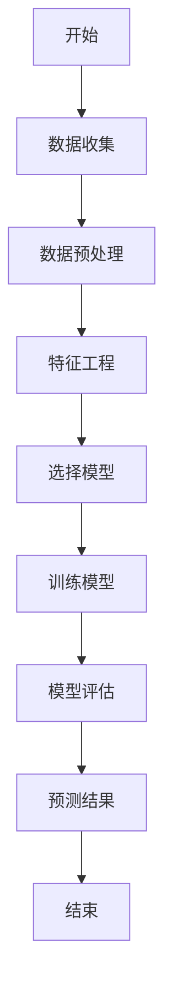

                 

# 引言：人才留存的重要性与挑战

在当今快速发展的信息技术行业，人才留存已成为企业竞争的核心要素之一。随着全球科技革命的推进，技术更新换代速度加快，企业对高端技术人才的需求日益增长。然而，人才流失问题也随之而来，成为企业面临的重大挑战。本文将深入探讨人才留存的重要性及其背后的原因，以及人才流失对企业的负面影响。

## 问题背景与现状分析

### 问题背景

信息技术行业的快速发展，带来了对技术人才的大量需求。然而，行业的高竞争性和快速变革性使得人才流失成为一种普遍现象。根据《2021年中国企业人才流失报告》，中国企业的平均员工流失率高达20%，其中信息技术行业的流失率更高，达到30%以上。这一数据揭示了人才流失问题的严峻性。

### 人才流失的常见原因

1. **薪资福利问题**：薪资和福利待遇是员工离职的主要原因之一。当员工的薪资水平与其付出不成正比时，很容易导致员工产生不满情绪，从而选择离职。

2. **职业发展机会**：缺乏明确的职业发展路径和晋升机会，会使员工感到自己的职业前景模糊，从而降低工作满意度和忠诚度。

3. **工作环境与企业文化**：不良的工作环境、冲突的企业文化或者与公司价值观不符，都会导致员工感到不适应，进而选择离职。

4. **工作压力与生活平衡**：高强度的工作压力和缺乏工作与生活的平衡，使得员工身心疲惫，最终选择离开。

### 人才流失对企业的负面影响

1. **成本增加**：人才流失导致企业需要不断招聘和培训新员工，增加了人力成本。

2. **业务中断**：流失的核心技术人员可能带走重要的商业机密，导致业务中断和损失。

3. **团队士气下降**：频繁的人才流失会影响团队士气，降低团队协作效率。

4. **品牌形象受损**：高流失率可能导致企业在行业内声誉受损，影响未来的招聘。

综上所述，人才留存问题不仅关系到企业的生存和发展，也是企业持续竞争力的关键。在接下来的章节中，我们将深入探讨人才留存的定义、核心概念及其管理策略，为企业提供有效的解决方案。

## 核心概念与联系

### 人才留存定义

人才留存是指企业通过一系列策略和措施，提高员工满意度和忠诚度，减少员工流失率的过程。它不仅包括薪酬和福利待遇的优化，还涉及职业发展、工作环境和文化建设等多个方面。

### 人才留存与员工满意度

员工满意度是人才留存的重要指标之一。一个满意的员工更有可能为企业做出更多贡献，并且更愿意留在企业中。提高员工满意度可以通过以下方式实现：

1. **公平薪酬**：确保员工的薪资水平与市场水平相当，使其感到付出与回报成正比。

2. **职业发展**：提供明确的职业发展路径和培训机会，让员工看到自己在企业中的成长空间。

3. **良好的工作环境**：营造一个舒适、安全的工作环境，减少工作压力。

### 人才留存与组织绩效

人才留存对组织绩效有着直接的影响。高留存率意味着企业能够保持稳定的核心团队，有利于业务的连续性和创新。具体表现如下：

1. **知识积累**：稳定的员工团队有助于知识的积累和传承，提高工作效率。

2. **协作效率**：长期合作的团队成员更熟悉彼此的工作方式，能够提高协作效率。

3. **创新能力**：员工在稳定的环境中更有可能进行创新思考，推动企业持续发展。

### 人才留存概念属性特征对比表格

为了更好地理解人才留存的概念，我们可以通过以下表格对比其与其他相关概念的属性特征：

| 概念 | 定义 | 主要属性特征 |
| --- | --- | --- |
| 人才留存 | 企业通过策略和措施提高员工满意度和忠诚度，减少流失率 | 薪酬激励、职业发展、工作环境、文化建设 |
| 员工满意度 | 员工对企业工作环境、薪酬福利、职业发展等方面的综合评价 | 薪酬水平、工作环境、晋升机会、企业文化 |
| 组织绩效 | 企业在财务、市场份额、员工满意度等方面的综合表现 | 财务状况、市场份额、员工满意度、创新能力 |

### 人才留存ER实体关系图架构

为了更直观地理解人才留存的概念，我们可以通过ER实体关系图来展示其各个实体之间的关系。以下是一个简化的ER图：

```mermaid
erDiagram
    Employee ||--|{ LeaveReason } : "has"
    Employee ||--|{ SatisfactionLevel } : "has"
    Employee ||--|{ Performance } : "has"
    LeaveReason ||--|{ ReasonDescription } : "has"
    SatisfactionLevel ||--|{ LevelDescription } : "has"
    Performance ||--|{ Score } : "has"
```

在这个ER图中，"Employee" 是主要实体，代表了企业中的员工。它与其他实体如 "LeaveReason"、"SatisfactionLevel" 和 "Performance" 存在关联。"LeaveReason" 描述了员工离职的原因，"SatisfactionLevel" 描述了员工的满意度水平，而 "Performance" 描述了员工的工作表现。

通过这些核心概念和联系的分析，我们可以更深入地理解人才留存的重要性及其在企业中的关键作用。在接下来的章节中，我们将进一步探讨人才留存的管理策略，为企业提供具体的操作指南。

## 人才留存管理策略

人才留存不仅仅是人力资源部门的职责，而是整个企业的战略任务。有效的管理策略需要从多个方面入手，包括薪酬激励、职业发展、工作环境和文化建设等。以下是具体的人才留存管理策略：

### 1. 人才留存战略规划

首先，企业需要制定清晰的人才留存战略规划。这包括明确人才留存的愿景、目标和关键指标。例如，企业可以设定一年内将员工流失率降低5%的目标，并制定相应的行动计划。战略规划还应考虑如何平衡短期收益和长期发展，确保人才的可持续发展。

#### 制定人才留存战略的步骤：

1. **分析当前人才状况**：了解企业的人才构成、流失原因和留存状况。
2. **确定人才留存目标**：设定具体、可衡量的留存目标，如流失率降低百分比。
3. **制定行动计划**：明确实现目标的策略和措施，包括薪酬激励、培训发展、企业文化等。
4. **资源分配**：为实施人才留存策略提供必要的资源和预算支持。
5. **持续评估与优化**：定期评估人才留存策略的有效性，并根据评估结果进行调整。

### 2. 薪酬激励与福利设计

薪酬激励是留住人才的关键因素之一。合理的薪酬体系能够确保员工感到自己的付出得到认可和回报。以下是一些薪酬激励和福利设计的建议：

#### 薪酬激励策略：

1. **市场竞争力**：确保员工的薪资水平与市场水平相当，特别是在关键岗位和高技能人才方面。
2. **绩效奖金**：根据员工的绩效表现发放奖金，激励员工提高工作积极性。
3. **股权激励**：通过股票期权等方式，让员工分享企业发展的成果，增强归属感。

#### 福利设计：

1. **弹性福利**：提供多样化的福利选项，如健康保险、员工援助计划、家庭日等，满足员工的不同需求。
2. **灵活工作时间**：允许员工根据工作需求和个人情况选择灵活的工作时间，提高工作与生活的平衡。
3. **健康与健身计划**：提供健身设施、定期体检等福利，关注员工的身心健康。

### 3. 员工职业发展机会

职业发展机会是员工留在企业的另一个重要原因。企业应提供清晰的职业发展路径和丰富的培训机会，帮助员工提升技能和职业素养。

#### 职业发展策略：

1. **职业规划**：与员工共同制定职业发展规划，明确短期和长期的职业目标。
2. **内部晋升**：提供内部晋升机会，让员工看到自己在企业中的成长空间。
3. **培训与发展**：定期组织培训活动，提高员工的技能水平和专业素养。

### 4. 工作环境与企业文化

良好的工作环境和积极的企业文化对人才留存有着重要影响。企业应致力于营造一个和谐、包容、创新的工作氛围。

#### 工作环境策略：

1. **物理环境**：提供舒适、安全、具有创意的工作空间。
2. **团队建设**：组织团队建设活动，增强员工之间的合作和信任。
3. **员工关怀**：关注员工的身心健康，提供心理支持和职业指导。

#### 企业文化策略：

1. **核心价值观**：明确企业的核心价值观，并贯穿于日常运营和管理中。
2. **领导风格**：倡导开放、透明、尊重员工的领导风格。
3. **员工参与**：鼓励员工参与企业决策，提高其归属感和责任感。

### 5. 绩效管理

绩效管理是确保员工与企业目标一致的重要手段。通过有效的绩效管理，企业可以激励员工，提高工作绩效。

#### 绩效管理策略：

1. **明确目标**：为员工设定清晰、具体的工作目标。
2. **持续反馈**：定期对员工的工作进行反馈，帮助其识别优点和改进空间。
3. **激励机制**：将绩效与薪酬、晋升等挂钩，激励员工提高工作绩效。

综上所述，人才留存管理需要综合考虑薪酬激励、职业发展、工作环境和文化建设等多个方面。通过系统的规划和有效的实施，企业可以减少人才流失，提高员工的满意度和忠诚度，从而实现持续发展。

## 算法原理讲解

在人才留存管理中，算法的应用可以大大提高预测和干预的准确性。本节将介绍一种常见的人才流失预测算法，详细阐述其原理、实现过程及其数学模型。

### 4.1 人才流失预测算法

#### 4.1.1 时间序列分析

时间序列分析是一种常用的预测方法，主要用于分析时间序列数据，预测未来的趋势。在人才留存中，时间序列分析可以帮助企业预测员工流失的趋势，从而采取预防措施。

#### 4.1.2 机器学习模型介绍

除了时间序列分析，机器学习模型也在人才流失预测中得到了广泛应用。机器学习模型通过学习历史数据，能够识别出潜在的流失因素，从而预测未来的流失情况。

常见的机器学习模型包括：

1. **线性回归**：通过建立员工流失与影响因素之间的线性关系来预测流失情况。
2. **决策树**：通过划分特征空间，构建决策树来预测员工流失。
3. **随机森林**：通过构建多个决策树，利用投票机制来提高预测准确率。
4. **支持向量机**：通过寻找最佳决策边界，预测员工流失情况。

### 4.2 算法mermaid流程图

为了更好地理解人才流失预测算法的流程，我们可以使用mermaid绘制算法的流程图：



在这个流程图中，数据收集、数据预处理、特征工程、模型选择、模型训练和模型评估是算法的核心步骤。

### 4.3 Python源代码与算法原理

下面是一个使用Python实现的简单人才流失预测模型的示例代码。这个模型基于线性回归，通过分析员工的工作年限、薪资和离职前的表现等特征来预测员工是否流失。

```python
import pandas as pd
from sklearn.linear_model import LinearRegression
from sklearn.model_selection import train_test_split
from sklearn.metrics import mean_squared_error

# 数据加载
data = pd.read_csv('employee_data.csv')

# 特征工程
X = data[['work_years', 'salary', 'performance']]
y = data['left']

# 数据划分
X_train, X_test, y_train, y_test = train_test_split(X, y, test_size=0.2, random_state=42)

# 模型训练
model = LinearRegression()
model.fit(X_train, y_train)

# 模型评估
y_pred = model.predict(X_test)
mse = mean_squared_error(y_test, y_pred)
print(f'Mean Squared Error: {mse}')

# 预测
new_employee = [[5, 10000, 4]]
prediction = model.predict(new_employee)
print(f'Prediction: {"Left" if prediction[0] >= 0.5 else "Stay"}')
```

在这个代码中，我们首先加载了员工数据，然后进行特征工程，将数据划分为特征矩阵和目标变量。接着使用线性回归模型进行训练，评估模型性能，并使用新数据进行预测。

### 4.4 算法原理的数学模型和公式

线性回归的数学模型可以表示为：

$$ y = \beta_0 + \beta_1 \cdot x_1 + \beta_2 \cdot x_2 + ... + \beta_n \cdot x_n + \epsilon $$

其中，$y$ 是员工是否流失的二元变量（1表示流失，0表示未流失），$x_1, x_2, ..., x_n$ 是特征变量（如工作年限、薪资等），$\beta_0, \beta_1, \beta_2, ..., \beta_n$ 是模型的参数，$\epsilon$ 是误差项。

通过最小化损失函数（如均方误差），可以求得最优的参数 $\beta_0, \beta_1, \beta_2, ..., \beta_n$。

### 4.5 通俗易懂地举例说明

假设我们有以下员工数据：

| 员工ID | 工作年限 | 薪资 | 表现得分 | 是否流失 |
| ------ | -------- | ---- | -------- | -------- |
| 1      | 3        | 8000 | 3.5      | 是       |
| 2      | 5        | 9000 | 4.0      | 否       |
| 3      | 2        | 7000 | 2.5      | 是       |
| 4      | 6        | 10000| 4.5      | 否       |

我们可以使用线性回归模型来预测员工是否流失。首先，我们将特征变量（工作年限和薪资）和目标变量（是否流失）划分为训练集和测试集。接着，使用线性回归模型进行训练，并评估模型性能。最后，使用新数据（如工作年限为5年、薪资为10000的员工）进行预测。

例如，假设一个新员工的工作年限为5年，薪资为10000元，我们可以将这个特征向量输入到训练好的线性回归模型中，预测员工是否流失。如果预测结果大于0.5，我们认为员工可能流失，否则认为员工可能会留在企业。

通过这样的算法，企业可以提前识别出潜在的流失风险，并采取相应的干预措施，如提供更好的职业发展机会或薪酬激励，从而减少人才流失。

总之，人才流失预测算法为企业提供了有效的工具，帮助其识别和管理流失风险。通过合理的算法设计和模型训练，企业可以更准确地预测员工流失情况，从而制定更有效的人才留存策略。

### 人才留存最佳实践案例

在探讨人才留存策略时，实际案例的分析尤为重要。以下我们将介绍三家企业的成功实践，分析其人才留存策略和效果。

#### 案例一：企业A的人才留存策略

**企业背景**：企业A是一家领先的互联网公司，其业务涵盖了电子商务、在线支付和云计算等多个领域。由于行业竞争激烈，人才流失一直是该公司面临的一大挑战。

**人才留存策略**：

1. **职业发展路径**：企业A为员工提供了明确的职业发展路径，包括技术、管理和产品等不同方向。公司定期组织职业规划讲座和一对一职业咨询，帮助员工制定个人职业发展计划。

2. **灵活的工作时间**：为了提高员工的工作满意度，企业A推出了灵活的工作制度，允许员工根据工作需求和个人情况选择灵活的工作时间，甚至可以选择在家办公。

3. **薪酬激励机制**：企业A实行市场竞争力薪酬制度，确保员工的薪资水平与市场水平相当。此外，公司还设立了绩效奖金和股权激励计划，激励员工为公司创造更多价值。

4. **员工福利**：企业A提供了全面的员工福利，包括健康保险、员工援助计划、年度体检和家庭日等。公司还关注员工的身心健康，定期组织健康讲座和运动活动。

**效果分析**：通过一系列人才留存策略的实施，企业A的员工流失率从30%下降到了15%。员工的满意度和忠诚度显著提高，团队协作效率也显著提升。

#### 案例二：企业B的人才留存实践

**企业背景**：企业B是一家新兴的科技公司，专注于人工智能和大数据领域。由于行业快速发展，企业B面临人才短缺和人才流失的问题。

**人才留存策略**：

1. **内部晋升机会**：企业B鼓励内部晋升，为员工提供丰富的晋升机会。公司定期组织内部选拔，为表现优秀的员工提供晋升通道。

2. **外部招聘渠道**：为了吸引更多人才，企业B与多所知名高校和科研机构建立了合作关系，定期举办校园招聘会和科研交流活动。

3. **创新文化**：企业B注重创新文化的建设，鼓励员工提出创新想法和解决方案。公司设有专门的创新基金，支持员工的创新项目。

4. **员工关怀**：企业B关注员工的个人成长和职业发展，为员工提供个性化的职业咨询和辅导。公司还组织定期的团队建设活动和团建旅行，增强员工的团队凝聚力。

**效果分析**：通过这些人才留存策略，企业B成功吸引了大量优秀人才，员工流失率显著下降。公司内部创新氛围浓厚，新产品和技术的研发速度明显加快。

#### 案例三：企业C的人才留存策略分析

**企业背景**：企业C是一家传统制造企业，在数字化转型过程中，面临着人才流失和企业转型的双重压力。

**人才留存策略**：

1. **转型培训**：企业C为员工提供了数字化转型相关的培训课程，帮助员工掌握新的技术和技能。公司还邀请行业专家进行讲座和研讨会，提升员工的专业水平。

2. **职业转换支持**：对于希望转换岗位的员工，企业C提供职业转换支持，包括岗位调整、技能培训和职业咨询等。

3. **企业文化重塑**：企业C致力于重塑企业文化，推动企业从传统制造向智能制造转变。公司强调创新、协作和团队精神，营造一个积极向上的工作氛围。

4. **员工参与**：企业C鼓励员工参与企业决策和项目管理，提高员工的参与感和责任感。

**效果分析**：通过这些策略，企业C成功吸引了年轻人才，员工流失率显著下降。员工对企业的认同感和归属感增强，企业的数字化转型进程也得到了显著推进。

综上所述，不同企业的人才留存策略各有特色，但都取得了显著的效果。通过分析这些成功案例，企业可以借鉴其经验，结合自身实际情况，制定适合自己的人才留存策略，从而减少人才流失，提高企业竞争力。

### 人才留存策略的实施与优化

在实施人才留存策略时，企业需要充分考虑实际操作中的挑战，并制定相应的解决方案。以下是一些常见挑战及解决策略，以帮助企业实现人才留存策略的持续优化。

#### 1. 实施策略与步骤

**实施步骤：**

1. **制定明确的人才留存战略**：企业应首先明确人才留存的目标和关键指标，如流失率降低幅度、员工满意度提升百分比等。

2. **组织内部培训**：针对不同层级的管理者和员工，开展人才留存相关培训，提高其对人才留存重要性的认识。

3. **制定具体行动计划**：根据人才留存战略，制定具体的行动计划，包括薪酬激励、职业发展、工作环境和文化建设等方面的具体措施。

4. **资源分配**：为实施人才留存策略提供必要的资源和预算支持，确保各项措施能够顺利执行。

5. **监督与评估**：定期对人才留存策略的实施情况进行监督和评估，及时发现问题并进行调整。

**实施策略：**

1. **全员参与**：鼓励企业内部所有员工参与人才留存策略的制定和实施，形成全员共建的良好氛围。

2. **数据驱动**：利用数据分析工具，对人才留存相关数据进行收集和分析，为策略调整提供数据支持。

3. **灵活调整**：根据实际情况和反馈，及时调整人才留存策略，确保其适应企业发展的需要。

#### 2. 遇到挑战与解决方案

**常见挑战：**

1. **薪酬激励不公平**：薪酬激励不当可能导致部分员工感到不公平，从而影响其满意度和忠诚度。

**解决方案：**

- **公平薪酬评估**：建立公平的薪酬评估体系，确保员工的薪资水平与市场水平相当。
- **绩效奖金透明**：明确绩效奖金的发放标准和流程，确保员工对奖金分配有清晰的了解。

2. **职业发展机会不足**：缺乏明确的职业发展路径和晋升机会，可能导致员工感到职业前景模糊。

**解决方案：**

- **职业发展规划**：与员工共同制定职业发展规划，明确短期和长期的职业目标。
- **内部晋升机会**：为员工提供内部晋升机会，激励其留在企业中不断成长。

3. **企业文化冲突**：企业文化和价值观的不一致可能导致员工感到不适应，从而影响其工作满意度和忠诚度。

**解决方案：**

- **文化建设**：通过定期的企业文化活动，强化企业的核心价值观，增强员工的归属感。
- **领导示范**：领导层应积极践行企业文化，树立良好的榜样作用。

4. **工作压力过大**：高工作压力和缺乏工作与生活的平衡，可能导致员工身心疲惫，从而选择离职。

**解决方案：**

- **工作与生活平衡**：提供灵活的工作时间和工作地点，帮助员工实现工作与生活的平衡。
- **员工关怀**：关注员工的身心健康，提供心理健康支持和职业指导。

#### 3. 持续优化与改进

**优化策略：**

1. **定期评估**：定期对人才留存策略的效果进行评估，识别存在的问题和改进点。

2. **员工反馈**：鼓励员工提供反馈和建议，了解其对人才留存策略的认可程度和改进需求。

3. **持续改进**：根据评估和反馈结果，持续优化人才留存策略，确保其始终符合企业发展的需要。

通过实施这些策略和解决方案，企业可以更好地应对人才留存过程中遇到的挑战，实现人才留存策略的持续优化，从而减少人才流失，提高员工满意度和忠诚度，推动企业持续发展。

### 小结与展望

本文通过深入探讨人才留存的重要性与挑战，从定义、管理策略、算法原理和实际案例等多个角度，系统地分析了如何减少人才流失。总结如下：

1. **人才留存定义**：人才留存是指通过提高员工满意度和忠诚度，减少员工流失率的过程，涵盖薪酬激励、职业发展、工作环境和文化建设等方面。

2. **核心概念与联系**：员工满意度、组织绩效和人才留存之间存在密切联系，企业应通过合理的薪酬体系和职业发展机会，提高员工满意度，从而促进人才留存。

3. **人才留存管理策略**：企业需要制定清晰的人才留存战略规划，通过薪酬激励、职业发展、工作环境和文化建设等多方面措施，提高员工的满意度和忠诚度。

4. **算法原理讲解**：人才流失预测算法，如时间序列分析和机器学习模型，为企业提供了预测员工流失趋势的工具，有助于提前采取干预措施。

5. **最佳实践案例**：企业A、企业B和企业C的成功实践展示了不同行业和背景下的人才留存策略，提供了有益的参考。

6. **实施与优化**：企业在实施人才留存策略时，需要应对薪酬激励不公平、职业发展机会不足、企业文化冲突和工作压力过大等挑战，并通过持续优化，不断提高人才留存效果。

### 人才留存管理的未来趋势

随着信息技术的发展和社会变革，人才留存管理也将面临新的挑战和机遇。以下是一些未来趋势：

1. **数字化转型**：企业将更加注重数字化工具和平台的应用，提高人才留存管理的效率和精准度。

2. **个性化和定制化**：企业将更加关注员工的个性化需求，提供定制化的职业发展路径和福利方案。

3. **可持续发展和社会责任**：企业在人才留存管理中，将更加注重可持续发展和社会责任，通过环保、慈善等举措提升企业的社会形象。

4. **心理健康和福祉**：关注员工的心理健康和工作福祉，提供更多的心理支持和健康福利。

### 拓展阅读建议

1. **《人力资源管理的艺术》**：作者彼得·德鲁克，深入探讨了人力资源管理的核心概念和实践方法。
2. **《员工流失管理：从策略到实践》**：作者杰弗里·菲尔德，详细介绍了如何通过系统的方法管理员工流失。
3. **《AI驱动的员工管理》**：作者迈克尔·拉克，探讨了人工智能在人才留存管理中的应用，以及其对企业管理的影响。

通过不断学习和实践，企业可以不断优化人才留存策略，提升员工的满意度和忠诚度，从而实现持续发展。

**作者：AI天才研究院/AI Genius Institute & 禅与计算机程序设计艺术 /Zen And The Art of Computer Programming**

