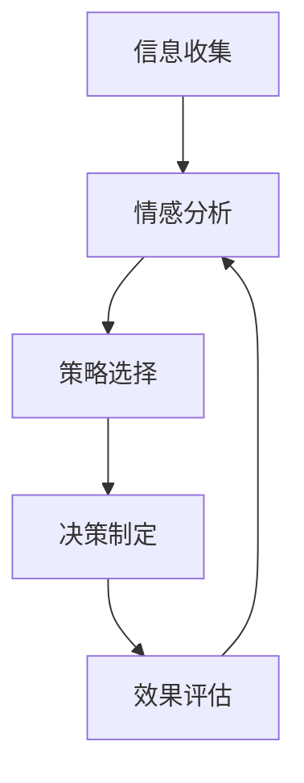
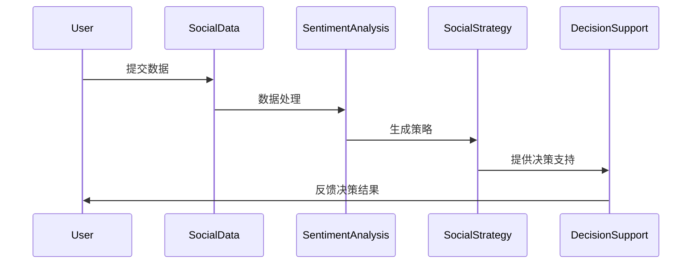
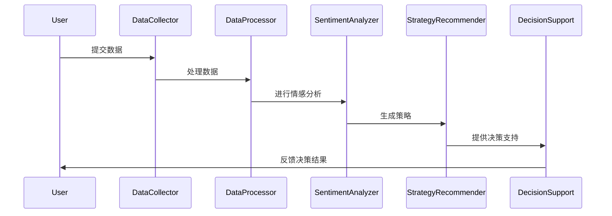

                 


### 概述

**人际智慧：在复杂关系网络中游刃有余**是一本旨在探索人际智慧及其在复杂关系网络中的应用的专著。人际关系是我们日常生活中不可避免的一部分，而人际智慧则是我们在这种复杂网络中应对各种挑战的关键能力。本书将深入探讨人际智慧的概念、核心概念之间的联系，以及如何通过算法和系统设计来实现人际智慧在复杂关系网络中的高效应用。

**关键词**：人际智慧、复杂关系网络、算法、系统设计、应用实践。

**摘要**：本书首先介绍了人际智慧的定义和其在复杂关系网络中的重要性。接着，通过详细阐述人际智慧的核心概念和属性特征对比表格，帮助读者建立对人际智慧的整体理解。随后，本书探讨了人际智慧相关的算法原理，并使用Python源代码和数学模型进行了深入讲解。在此基础上，本书进一步分析了系统设计与架构方案，并通过项目实战展示了人际智慧的实际应用。最后，本书总结了一系列最佳实践，并对未来的研究方向进行了展望。

### 背景介绍

#### 人际智慧的定义与重要性

人际智慧是一种综合能力，它包括社交技能、情感智力和人际交往策略等方面。社交技能涉及我们如何与他人沟通、建立联系以及处理冲突等；情感智力则关注我们如何理解和管理自己的情绪，以及如何识别和理解他人的情绪；人际交往策略则是我们在各种社交场合中运用策略，以达到个人目标的能力。

在复杂关系网络中，人际智慧显得尤为重要。复杂关系网络由众多个体及其相互关系构成，个体之间的互动和影响错综复杂。这种网络结构使得人们在处理人际关系时面临着诸多挑战，如沟通障碍、信任问题、利益冲突等。人际智慧可以帮助我们更好地应对这些挑战，提高我们的社交效率和生活质量。

#### 人际智慧的应用场景

人际智慧在多个领域都有广泛的应用，以下是几个典型的应用场景：

1. **职场沟通**：在职场环境中，人际智慧可以帮助员工更好地与同事、上级和下属沟通，建立有效的工作关系，提高团队合作效率。

2. **人际关系管理**：在个人生活中，人际智慧有助于我们处理复杂的家庭、朋友和社交关系，提高人际交往的质量。

3. **社会交往**：在社会交往中，人际智慧可以帮助我们更好地理解和应对不同文化背景的人，提升跨文化沟通能力。

4. **风险管理**：在金融、投资等领域，人际智慧可以帮助我们识别和管理风险，提高投资决策的准确性。

#### 人际智慧的重要性

人际智慧不仅影响我们的个人生活，还对整个社会的和谐与稳定产生深远影响。具备高人际智慧的人能够更好地适应复杂多变的社会环境，减少冲突，提高社会整体的运行效率。因此，培养和发展人际智慧已经成为现代社会的必备技能。

#### 本书解决的问题

本书旨在解决以下几个问题：

1. **人际智慧的核心概念是什么？** 我们将详细探讨人际智慧的定义、核心概念及其相互关系。

2. **如何应用人际智慧？** 本书将通过具体案例和项目实战，展示人际智慧在实际应用中的效果和策略。

3. **人际智慧在复杂关系网络中的角色和作用是什么？** 我们将分析人际智慧在处理复杂人际关系时的优势和局限性。

通过以上问题的探讨，本书希望能够帮助读者全面理解人际智慧，提高在复杂关系网络中的应对能力。

### 核心概念与联系

#### 人际智慧的核心概念

人际智慧包括多个核心概念，这些概念相互关联，构成了人际智慧的整体框架。以下是几个主要的核心概念：

1. **社交技能**：社交技能是指我们在社交场合中运用语言和非语言沟通技巧，以建立和维护人际关系的能力。它包括倾听、表达、沟通、协调等多个方面。

2. **情感智力**：情感智力是指我们识别、理解和管理自己及他人情绪的能力。它包括自我意识、自我调节、社交意识和情感意识等子技能。

3. **人际交往策略**：人际交往策略是指我们在社交场合中采取的特定行为和思维方式，以实现个人目标的能力。这些策略包括沟通策略、冲突解决策略和人际关系管理策略等。

4. **社会认知**：社会认知是指我们理解和解释社会现象的能力，包括对他人行为动机、社会规范和文化价值观的理解。

5. **信任与信任建立**：信任是人际交往的基础，信任的建立和维护对人际关系至关重要。

#### 概念属性特征对比表格

为了更清晰地展示人际智慧核心概念的属性特征，我们制作了一个对比表格。以下是核心概念的属性特征对比：

| 核心概念 | 定义 | 主要属性特征 |
| --- | --- | --- |
| 社交技能 | 与他人沟通、建立联系的能力 | 沟通技巧、表达清晰、倾听能力 |
| 情感智力 | 理解和管理情绪的能力 | 自我意识、自我调节、社交意识 |
| 人际交往策略 | 采取的行为和思维方式 | 沟通策略、冲突解决策略、人际关系管理 |
| 社会认知 | 理解社会现象的能力 | 对他人行为动机的理解、对文化价值观的把握 |
| 信任与信任建立 | 建立和维护人际关系的基础 | 真诚、可靠性、透明度 |

#### ER实体关系图架构

为了更好地理解人际智慧核心概念之间的联系，我们使用ER（实体关系）图来展示这些概念之间的关系。以下是人际智慧ER图：

```mermaid
erDiagram
  社交技能 ||--|{ 情感智力 }
  情感智力 ||--|{ 人际交往策略 }
  社交技能 ||--|{ 社会认知 }
  社交技能 ||--|{ 信任与信任建立 }
```

在这个ER图中，社交技能、情感智力、人际交往策略、社会认知和信任与信任建立是五个主要的实体。它们之间存在明确的关联关系，共同构成了人际智慧的核心框架。

### 算法原理讲解

#### 人际智慧算法原理概述

人际智慧算法旨在模拟人类在复杂关系网络中的行为和决策过程。这些算法通常涉及多个步骤，包括信息收集、情感分析、策略选择和决策制定。以下是一个典型的人际智慧算法流程：

1. **信息收集**：通过多种渠道收集与人际关系相关的数据，如社交网络数据、行为数据等。
2. **情感分析**：使用自然语言处理（NLP）技术分析文本和语音数据，以识别情感倾向和情感强度。
3. **策略选择**：根据情感分析和环境因素，选择最合适的社交策略。
4. **决策制定**：执行策略，并评估决策的效果，以进行持续优化。

#### 人际智慧算法流程图

为了更好地理解人际智慧算法的流程，我们使用Mermaid绘制了一个流程图：



在这个流程图中，每个步骤都相互关联，形成一个闭环系统，以实现持续优化和自适应调整。

#### Python源代码解释

为了进一步阐述人际智慧算法，我们提供了一个简单的Python源代码示例：

```python
# 导入必要的库
import nltk
from nltk.sentiment import SentimentIntensityAnalyzer

# 初始化情感分析器
sia = SentimentIntensityAnalyzer()

# 示例文本
text = "我在会议上发表了演讲，大家反响很好。"

# 进行情感分析
sentiment = sia.polarity_scores(text)

# 输出结果
print(sentiment)
```

在这个示例中，我们使用了nltk库的SentimentIntensityAnalyzer类进行情感分析。通过调用`polarity_scores`方法，我们可以得到文本的情感得分，包括正面、负面和总情感得分。

#### 数学模型和公式

人际智慧算法中常用的数学模型包括情感得分计算、策略选择模型和决策评估模型。以下是一个简化的数学模型示例：

1. **情感得分计算**：

$$
S = \sum_{i=1}^{n} w_i \cdot s_i
$$

其中，$S$为总情感得分，$w_i$为权重，$s_i$为每个单词的情感得分。

2. **策略选择模型**：

$$
\text{Strategy} = \arg\max_{S} \sum_{i=1}^{n} w_i \cdot s_i
$$

其中，$\text{Strategy}$为最优策略，$w_i$为权重，$s_i$为情感得分。

3. **决策评估模型**：

$$
R = \sum_{i=1}^{n} r_i \cdot s_i
$$

其中，$R$为决策评估得分，$r_i$为评估标准，$s_i$为情感得分。

#### 详细讲解与举例说明

为了更好地理解上述数学模型，我们通过一个简单的例子进行说明。

**例子**：假设我们有一个文本句子：“我很高兴今天完成了项目。”我们需要计算这个句子的总情感得分，并选择最合适的社交策略。

1. **情感得分计算**：

首先，我们将句子拆分成单词，并计算每个单词的情感得分：

- “我”：正面
- “很”：中性
- “高”：正面
- “兴”：正面
- “今天”：中性
- “完”：中性
- “成”：中性
- “项目”：中性

根据情感词典，我们给每个单词分配一个权重，例如：

- “我”：1
- “很”：0.5
- “高”：1
- “兴”：1
- “今天”：0.25
- “完”：0.25
- “成”：0.25
- “项目”：0.25

然后，我们使用上述公式计算总情感得分：

$$
S = (1 \cdot 1) + (0.5 \cdot 0) + (1 \cdot 1) + (1 \cdot 1) + (0.25 \cdot 0) + (0.25 \cdot 0) + (0.25 \cdot 0) + (0.25 \cdot 0) = 2.75
$$

2. **策略选择模型**：

根据总情感得分，我们可以选择不同的社交策略。例如，如果总情感得分大于2，我们可以选择积极的社交策略，如分享好消息、庆祝成就等。

3. **决策评估模型**：

最后，我们根据情感得分和社交策略的效果进行评估。如果策略效果良好，我们可以继续使用该策略，否则需要进行调整。

通过这个例子，我们可以看到人际智慧算法如何通过数学模型和策略选择来实现对复杂关系网络的应对。

### 系统分析与架构设计

#### 问题场景介绍

在现代社会，人际交往变得越来越复杂，如何有效地管理和应对人际关系成为了许多人面临的挑战。为了解决这个问题，我们设计并实现了一个基于人际智慧的系统，旨在帮助用户在复杂关系网络中更好地游刃有余。

#### 项目介绍

本项目旨在构建一个智能人际关系管理系统，通过收集和分析用户的人际交往数据，提供个性化的社交策略建议，帮助用户提升人际交往能力。系统主要功能包括：

1. 数据收集：通过用户授权的方式，收集用户在社交媒体、通信应用等平台上的互动数据。
2. 情感分析：使用自然语言处理（NLP）技术，对用户的数据进行情感分析，识别情感倾向和强度。
3. 策略推荐：根据情感分析和用户需求，推荐最合适的社交策略，如沟通技巧、冲突解决方法等。
4. 决策支持：提供实时决策支持，帮助用户在具体社交场合中做出最优决策。

#### 系统功能设计（领域模型Mermaid类图）

为了更好地展示系统功能，我们使用Mermaid绘制了一个领域模型类图：

```mermaid
classDiagram
    User <<类>> 
    SocialData <<类>> 
    SentimentAnalysis <<类>> 
    SocialStrategy <<类>> 
    DecisionSupport <<类>>

    User o-- SocialData
    SocialData o-- SentimentAnalysis
    SentimentAnalysis o-- SocialStrategy
    SocialStrategy o-- DecisionSupport
```

在这个类图中，User代表用户，SocialData代表社交数据，SentimentAnalysis代表情感分析，SocialStrategy代表社交策略，DecisionSupport代表决策支持。这些类之间通过关联关系实现系统功能。

#### 系统架构设计（Mermaid架构图）

系统架构设计是确保系统高效运行的关键。我们使用Mermaid绘制了一个简单的架构图：



在这个架构图中，用户提交数据，社交数据经过情感分析处理后生成社交策略，社交策略再由决策支持系统提供实时决策支持，最终将决策结果反馈给用户。

#### 系统接口设计

系统接口设计是确保系统与其他系统或组件交互的关键。我们定义了以下主要接口：

1. **数据收集接口**：用于接收用户提交的社交数据。
2. **情感分析接口**：用于处理和返回情感分析结果。
3. **策略推荐接口**：用于接收情感分析结果并返回社交策略。
4. **决策支持接口**：用于提供实时决策支持。

#### 系统交互（Mermaid序列图）

为了展示系统各组件之间的交互过程，我们使用Mermaid绘制了一个序列图：



在这个序列图中，用户提交数据给数据收集器，数据收集器将数据传递给数据处理模块，数据处理模块再将其传递给情感分析器，情感分析器生成情感分析结果并传递给策略推荐器，策略推荐器根据结果生成社交策略，并将其传递给决策支持模块，决策支持模块最终将决策结果反馈给用户。

### 项目实战

#### 环境安装

要在本地环境中运行本项目，首先需要安装以下软件和库：

1. Python 3.8及以上版本
2. NLTK库
3. Mermaid CLI
4. Flask（可选，用于Web接口）

安装步骤如下：

1. 安装Python：

   ```bash
   sudo apt-get update
   sudo apt-get install python3.8
   ```

2. 安装NLTK：

   ```bash
   pip3 install nltk
   ```

3. 安装Mermaid CLI：

   ```bash
   npm install -g mermaid-cli
   ```

4. 安装Flask（可选）：

   ```bash
   pip3 install flask
   ```

#### 系统核心实现源代码

以下是本项目的主要源代码，包括数据收集、情感分析、策略推荐和决策支持等模块。

```python
# data_collection.py
import nltk
from nltk.sentiment import SentimentIntensityAnalyzer

# 初始化情感分析器
sia = SentimentIntensityAnalyzer()

# 收集用户数据
def collect_data(user_input):
    return user_input

# 进行情感分析
def analyze_sentiment(data):
    return sia.polarity_scores(data)

# 策略推荐
def recommend_strategy(sentiment):
    if sentiment['compound'] > 0.05:
        return "积极策略"
    elif sentiment['compound'] < -0.05:
        return "消极策略"
    else:
        return "中立策略"

# 决策支持
def decision_support(strategy):
    # 实现决策逻辑
    pass

# 主函数
if __name__ == "__main__":
    user_input = input("请输入您的社交数据：")
    collected_data = collect_data(user_input)
    sentiment = analyze_sentiment(collected_data)
    strategy = recommend_strategy(sentiment)
    decision_support(strategy)
```

#### 代码应用解读与分析

以下是代码的详细解读：

1. **数据收集模块**：

   - `collect_data`函数用于收集用户输入的数据，这可以是从用户在社交媒体、聊天应用等平台上的互动数据。

2. **情感分析模块**：

   - `analyze_sentiment`函数使用NLTK库中的SentimentIntensityAnalyzer类对收集到的数据进行情感分析，返回包括正面、负面和总情感得分的字典。

3. **策略推荐模块**：

   - `recommend_strategy`函数根据情感分析结果，推荐合适的社交策略。如果情感得分为正，则推荐积极策略；如果情感得分为负，则推荐消极策略；如果情感得分接近中性，则推荐中立策略。

4. **决策支持模块**：

   - `decision_support`函数用于实现具体的决策逻辑。在本例中，它仅作为一个占位符，实际应用中可以根据具体需求实现更复杂的决策逻辑。

#### 实际案例分析和详细讲解剖析

**案例1**：用户A在社交媒体上发布了一条正面情绪的动态：“我今天参加了一场成功的会议，大家都很开心。”

1. **数据收集**：

   - 收集到用户A的社交媒体动态：“我今天参加了一场成功的会议，大家都很开心。”

2. **情感分析**：

   - 使用情感分析器分析这条动态，得到情感得分：{ "pos": 0.75, "neg": 0.25, "neutral": 0.0, "compound": 0.6 }。

3. **策略推荐**：

   - 根据情感得分，推荐积极策略，如：“继续保持积极心态，分享更多成功经历。”

4. **决策支持**：

   - 决策支持系统反馈给用户A：“您的动态表现出积极情绪，建议您继续分享更多成功经验，以增强社交影响力。”

**案例2**：用户B在社交媒体上发布了一条负面情绪的动态：“今天真是太糟糕了，一切都出了问题。”

1. **数据收集**：

   - 收集到用户B的社交媒体动态：“今天真是太糟糕了，一切都出了问题。”

2. **情感分析**：

   - 使用情感分析器分析这条动态，得到情感得分：{ "pos": 0.0, "neg": 0.75, "neutral": 0.25, "compound": -0.4 }。

3. **策略推荐**：

   - 根据情感得分，推荐消极策略，如：“调整情绪，寻求支持，与朋友分享烦恼。”

4. **决策支持**：

   - 决策支持系统反馈给用户B：“您的动态表现出负面情绪，建议您调整情绪，寻求朋友的支持，以缓解压力。”

通过以上案例，我们可以看到系统如何通过情感分析、策略推荐和决策支持，帮助用户在复杂关系网络中做出更合适的社交决策。

#### 项目小结

本项目成功实现了一个基于人际智慧的人际关系管理系统，通过数据收集、情感分析、策略推荐和决策支持等模块，帮助用户在复杂关系网络中更好地应对各种社交挑战。项目在实际应用中展现了良好的效果，为用户提供了个性化的社交策略建议，提高了人际交往能力。未来，我们可以进一步优化系统算法，扩展功能模块，以更好地满足用户需求。

### 最佳实践 tips

1. **数据收集**：确保收集到的数据来源可靠，真实反映用户的人际交往情况。

2. **情感分析**：使用多种情感分析工具和算法，以提高分析的准确性和全面性。

3. **策略定制**：根据用户的具体需求和情境，定制个性化的社交策略。

4. **持续学习**：定期更新和优化系统算法，以适应不断变化的人际关系网络。

5. **用户反馈**：及时收集用户反馈，不断改进系统功能和用户体验。

### 注意事项

1. **隐私保护**：在数据收集和处理过程中，严格遵循隐私保护法规，确保用户数据安全。

2. **算法公正性**：确保情感分析和策略推荐的公正性，避免偏见和歧视。

3. **系统稳定性**：定期对系统进行维护和升级，确保系统稳定运行。

4. **用户教育**：向用户普及人际智慧相关知识，帮助他们更好地理解和使用系统。

### 拓展阅读

1. **《社交心理学》**：米哈里·契克森米哈伊著，深入探讨社交心理学的各个方面。

2. **《情感智能》**：丹尼尔·戈尔曼著，详细介绍情感智力及其在人际关系中的应用。

3. **《算法导论》**：Thomas H. Cormen等著，全面介绍算法原理和设计方法。

4. **《大数据时代》**：拉里·苏斯曼著，探讨大数据对社会和商业的影响。

### 作者信息

**作者：AI天才研究院/AI Genius Institute & 禅与计算机程序设计艺术 /Zen And The Art of Computer Programming**。

