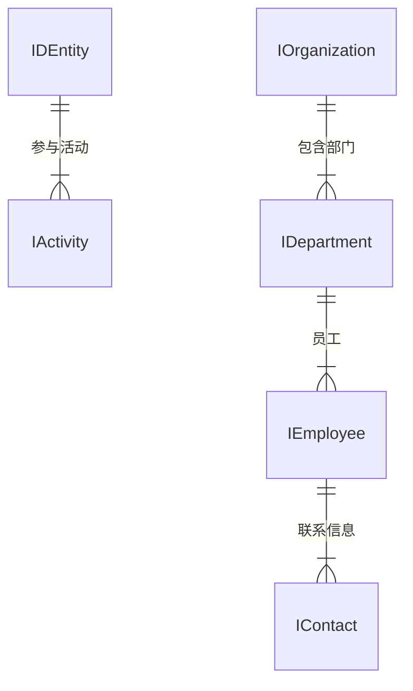
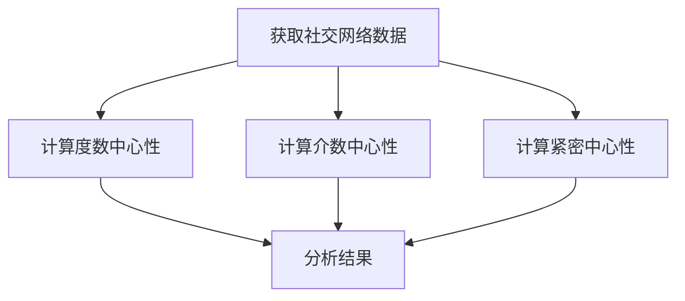
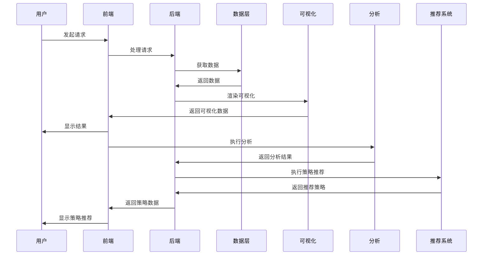
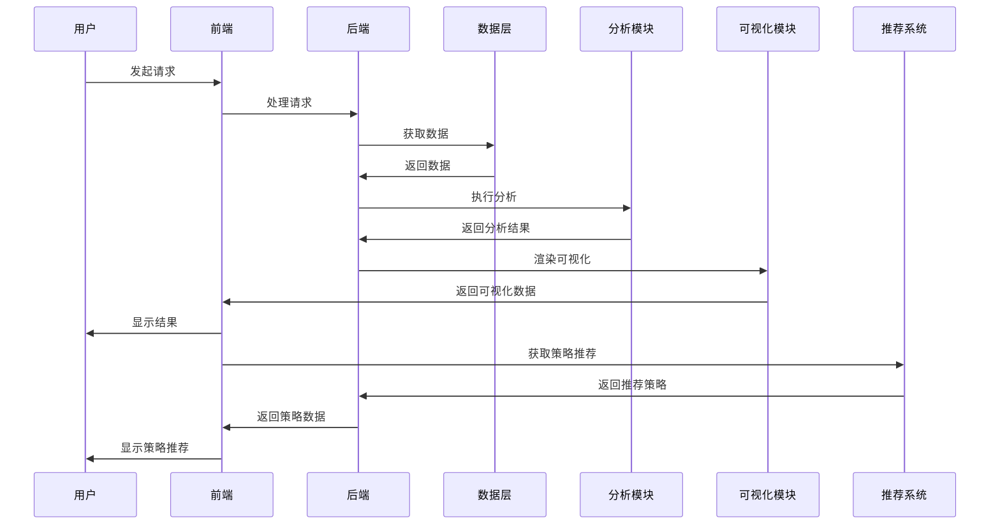

                 

### 人际网络构建概述

#### 问题背景与核心概念

在当今快速变化的商业环境中，人际网络构建已成为领导者提升影响力的关键要素。人际网络不仅仅是指一群人的简单集合，它更像是一种动态的、相互关联的社会结构。在这种结构中，每个节点都代表一个个体，而边则表示个体之间的联系。这些联系可以是直接的合作关系，也可以是通过第三方间接建立的联系。构建强大的人际网络对于领导者来说至关重要，因为它能够帮助他们在组织中建立信任、促进信息流通，并在决策过程中发挥关键作用。

**人际网络构建的重要性**

1. **增强影响力**：强大的人际网络能够让领导者更容易获得他人的支持，提高决策的影响力。
2. **资源获取**：通过人际网络，领导者可以更容易地获取到必要的资源，包括信息、资金、人才等。
3. **信息传递**：人际网络能够加速信息的传递，使领导者更快地做出反应和调整。
4. **知识共享**：人际网络促进了知识的共享，有助于领导者吸收新观念和最佳实践。

**人际网络构建的核心概念**

- **节点**：在人际网络中，每个个体都可以看作一个节点。
- **边**：节点之间的联系可以表示为边，边的权重可以表示联系强度。
- **中心性**：衡量节点在人际网络中的重要性的指标，如度数中心性、介数中心性和紧密中心性。
- **凝聚力**：网络中节点之间的连接紧密程度。
- **网络密度**：网络中边与可能的最大边数之比，反映网络的紧密程度。

**核心概念之间的联系**

- **中心性与凝聚力**：高度中心性的节点通常具有很高的凝聚力，因为它们在社交网络中连接着多个其他节点。
- **影响力与网络密度**：网络密度较高的组织通常更容易产生影响力，因为成员之间的联系更为紧密。

在接下来的章节中，我们将深入探讨人际网络构建的基本原理，以及如何通过理论和实践来加强人际网络，从而提升领导者的影响力。

#### 人际网络构建的基本原理

**人际网络的基本结构**

人际网络的基本结构主要由节点和边构成。节点表示个体，如员工、合作伙伴或客户；边则表示个体之间的联系，如合作、交流或共同兴趣。这种结构可以用图论中的无向图或有向图来表示。

1. **节点**：在人际网络中，每个节点都有其独特的属性，如身份、地位和角色。节点可以是个人，也可以是组织。
2. **边**：边表示节点之间的关系，边的类型和强度决定了人际网络的复杂性和密度。

**人际网络的影响因素**

人际网络的影响因素多种多样，主要包括以下几个方面：

1. **社会结构**：社会结构决定了人际网络的总体形状和布局。例如，团体规模、组织结构和社会阶层等都会影响人际网络的形态。
2. **社交行为**：个体的社交行为，如互动频率、交流方式和合作模式，直接影响人际网络的构建和发展。
3. **信息流动**：信息的传递和流动在人际网络中起到至关重要的作用。高效的沟通能够促进人际网络的稳定和发展。
4. **信任与关系**：信任是人际网络中不可或缺的要素。高信任度的关系有助于信息的有效传递和资源的共享。

**人际网络的作用机制**

人际网络的作用机制主要体现在以下几个方面：

1. **信息传播**：通过人际网络，信息可以迅速传播，领导者能够更快地获取到有用的信息，从而做出及时有效的决策。
2. **资源整合**：人际网络能够帮助领导者整合各种资源，包括知识、技能和物资。这种资源整合能力对于组织的长期发展至关重要。
3. **社会影响**：领导者通过人际网络施加社会影响，推动组织内部的变革和创新。强大的人际网络能够增强领导者的权威和影响力。
4. **风险分散**：通过人际网络，领导者可以分散风险，降低由于个体失败或变动对整个组织的影响。

**案例解析**

以一个企业为例，企业中的高层管理人员构成了核心节点，他们通过工作关系和社交活动与中层管理人员和普通员工建立联系。这种人际网络结构不仅有助于信息的快速传递，还能够促进资源的整合和风险的分散。例如，当企业面临市场变化时，高层管理人员可以通过人际网络快速获取市场信息，并协调中层管理人员和员工制定相应的应对策略。

**总结**

人际网络构建是一个复杂而动态的过程，涉及到多个因素和作用机制。理解人际网络的基本结构和影响因素，有助于领导者更有效地构建和维护人际网络，从而提升自身的影响力和领导力。在接下来的章节中，我们将进一步探讨人际网络构建的核心概念，并分析不同概念之间的关系，为构建强大的人际网络提供理论支持。

#### 人际网络与领导力的关系

人际网络在领导力中的作用不可忽视，它不仅决定了领导者的影响力，还影响了组织的整体运作效率。要深入理解人际网络与领导力之间的关系，我们需要从以下几个方面进行分析。

**1. 领导者作为人际网络的中心节点**

在人际网络中，领导者通常处于核心位置，他们通过工作关系、社交活动和信息传递与其他成员建立紧密联系。这种中心位置赋予了领导者强大的影响力和资源获取能力。具体来说，领导者作为中心节点有以下优势：

- **信息优势**：领导者能够更快地获取重要信息，因为他们处于信息的交汇点，这使得他们能够做出更加及时的决策。
- **资源整合**：通过人际网络，领导者可以轻松调动各种资源，包括人力、财力和知识，这有助于提升组织的整体效能。
- **社会影响**：领导者的中心位置使他们能够施加广泛的社会影响，推动组织内部的变革和创新。

**2. 人际网络对领导力的影响**

人际网络不仅决定了领导者的位置，还对其领导力产生了深远的影响。以下是人际网络对领导力的几个方面影响：

- **沟通能力**：强大的人际网络使领导者能够与组织内部和外部的成员保持高效的沟通，从而增强团队的凝聚力和协作能力。
- **影响力**：通过人际网络，领导者可以更好地影响他人的行为和决策，促进组织目标的实现。
- **适应性**：人际网络中的多样化联系使领导者更具适应性，能够迅速应对外部变化和内部挑战。

**3. 人际网络的构建与维护**

构建和维护强大的人际网络是领导者提升领导力的关键。以下是几个关键策略：

- **建立信任**：信任是人际网络的基础。领导者需要通过实际行动和真诚的交流来建立和维持信任关系。
- **加强联系**：领导者应积极参与社交活动，主动与不同部门和层级的成员建立联系，扩大自己的社交圈。
- **知识共享**：通过人际网络，领导者可以促进知识的共享和传播，提高整个组织的知识水平和创新能力。

**4. 案例分析**

以一位大型企业的CEO为例，他通过定期组织高层管理会议和团队建设活动，加强了与下属各部门的沟通和联系。此外，他还积极参与行业协会和社区活动，扩大了自己在企业外部的人际网络。这种强大的人际网络使CEO能够迅速获取市场信息，调动各类资源，并在组织内部推动创新和变革。

**总结**

人际网络与领导力之间存在密切的关系。通过构建和维护强大的人际网络，领导者能够增强自身的影响力，提高组织的运作效率。理解人际网络的构建原理和影响因素，对于领导者提升领导力和实现组织目标具有重要意义。在接下来的章节中，我们将进一步探讨人际网络构建的具体方法，提供实用的策略和技巧，帮助领导者更有效地构建和维护人际网络。

#### 影响人际网络的因素

人际网络的构建和维持受到多种因素的影响，这些因素决定了人际网络的结构和功能。以下是一些主要的影响因素，以及它们对人际网络的影响：

**1. 社会结构**

社会结构是人际网络形成的基础，它决定了人际网络的基本形态和节点之间的连接方式。社会结构包括组织结构、社会阶层和团体规模等。组织结构，如公司部门设置，会影响成员之间的联系方式；社会阶层和团体规模则会影响人际网络中的权力分布和影响力。

- **组织结构**：组织中的层级关系和部门设置直接影响人际网络的连接模式。例如，在层级制度严格的公司中，高层管理人员往往与下属有较少的直接联系，而在扁平化组织中，成员之间的联系更为紧密。
- **社会阶层**：社会阶层决定了个体在人际网络中的地位和影响力。高社会阶层的人通常拥有更多的资源和机会，从而在人际网络中占据优势地位。
- **团体规模**：团体规模越大，成员之间的联系越复杂，但同时也可能降低个人的影响力和参与度。

**2. 社交行为**

社交行为是人际网络动态发展的动力。个体的互动方式、沟通频率和合作模式直接影响人际网络的结构和功能。

- **互动方式**：面对面交流、电子邮件、电话和社交媒体等不同的互动方式会影响人际网络中的信息传递速度和范围。面对面交流通常更为直接和有效，而社交媒体则可以扩大社交网络的覆盖范围。
- **沟通频率**：沟通频率越高，人际网络中的信息流动和资源交换越频繁。高频的沟通有助于建立稳固的关系和信任。
- **合作模式**：个体的合作模式决定了人际网络中的合作关系和资源共享程度。共享的资源和信息能够增强人际网络的功能和效能。

**3. 信息流动**

信息流动是人际网络的核心功能之一，它决定了信息的传递速度和准确性。信息流动的效率直接影响领导者的决策能力和组织的运营效率。

- **信息传递速度**：快速的信息传递能够帮助领导者及时掌握市场动态和内部情况，从而做出快速反应。
- **信息准确性**：准确的信息传递有助于减少误解和错误决策，提高组织的整体效率。

**4. 信任与关系**

信任是人际网络中不可或缺的要素，它直接影响人际网络的功能和稳定性。高信任度的关系能够促进信息共享和资源交换，增强人际网络的整体效能。

- **信任度**：信任度越高，个体之间的合作意愿越强，信息共享和资源交换的频率也越高。
- **关系质量**：高质量的关系通常建立在互惠互利的基础上，能够提高人际网络的功能和稳定性。

**总结**

人际网络的构建和维持是一个复杂的过程，受到多种因素的影响。社会结构、社交行为、信息流动和信任与关系等都是关键因素。理解这些因素及其影响，有助于领导者更有效地构建和维护人际网络，提升自身的影响力和组织的运作效率。在接下来的章节中，我们将进一步探讨人际网络构建的具体方法，提供实用的策略和技巧。

### 概念属性特征对比表格

在深入理解人际网络构建的核心概念后，我们将通过对比表格的形式，详细展示各个概念之间的属性特征差异。以下是几个关键概念的对比表格：

#### 1. 中心性与凝聚力的对比

| **概念**        | **中心性**                                                   | **凝聚力**                                                    |
|-----------------|------------------------------------------------------------|--------------------------------------------------------------|
| **定义**        | 衡量节点在人际网络中的重要性的指标，如度数中心性、介数中心性等。 | 衡量网络中节点之间的连接紧密程度。                           |
| **影响因素**    | 个体拥有的直接联系数量和其在网络中的路径长度。                | 节点之间的边数量和边权重。                                   |
| **作用机制**    | 影响信息流动和资源分配。                                     | 促进团队合作和资源共享。                                     |
| **应用场景**    | 确定关键节点和优先联系对象。                                 | 评估团队协作效能和稳定性。                                   |

#### 2. 影响力与网络密度的对比

| **概念**        | **影响力**                                                   | **网络密度**                                                  |
|-----------------|------------------------------------------------------------|--------------------------------------------------------------|
| **定义**        | 指个体或节点在人际网络中对其他个体或节点施加影响的程度。        | 衡量网络中实际存在的边与可能的最大边数之比。                   |
| **影响因素**    | 信任度、互动频率、资源交换能力。                             | 节点数量、边数量、网络规模。                                 |
| **作用机制**    | 通过影响他人行为和决策来推动组织目标实现。                    | 确保信息流通和资源交换的高效性。                             |
| **应用场景**    | 确定领导者的社会影响范围和策略。                             | 评估组织的紧密程度和沟通效率。                               |

#### 3. 社交行为与信息流动的对比

| **概念**        | **社交行为**                                                  | **信息流动**                                                   |
|-----------------|------------------------------------------------------------|--------------------------------------------------------------|
| **定义**        | 个体间的互动方式和频率。                                     | 信息在网络中的传递过程。                                      |
| **影响因素**    | 互动频率、互动方式和信任度。                                | 节点间的连接强度、信息传递速度和准确性。                      |
| **作用机制**    | 影响人际网络的动态结构和功能。                               | 确保信息准确、高效地传递，支持决策制定。                      |
| **应用场景**    | 提升人际网络功能和效能。                                    | 增强组织内部的沟通和信息共享能力。                           |

通过上述对比表格，我们可以清晰地看到不同概念在定义、影响因素、作用机制和应用场景等方面的差异。这些差异有助于我们更深入地理解人际网络构建的核心概念，并在实践中灵活应用，以提升领导力和组织效率。

### ER实体关系图架构

为了更好地理解人际网络中的概念及其相互关系，我们引入实体关系图（Entity-Relationship Diagram，ERD）来展示各个核心概念之间的联系。ERD是一种用于数据库设计的数据建模工具，通过图形化的方式直观地表示实体及其之间的关系。

**1. 实体**

在ERD中，实体代表人际网络中的基本元素，如个体、组织、部门和活动等。每个实体都有其独特的属性和标识。

- **个体**：代表人际网络中的节点，包括员工、合作伙伴和客户等。
- **组织**：代表个体所属的团体或机构。
- **部门**：代表组织内部的各个部门，如研发部、市场部和人力资源部等。
- **活动**：代表个体参与的事件或项目。

**2. 属性**

每个实体都有多个属性，用于描述其实体特征。例如：

- **个体**：姓名、年龄、职位、联系方式等。
- **组织**：名称、成立时间、总部地点等。
- **部门**：部门编号、部门名称、负责人等。
- **活动**：活动名称、活动时间、活动地点等。

**3. 关系**

实体之间的关系定义了人际网络中的连接方式和交互模式。主要的关系类型包括一对一、一对多和多对多。

- **一对一关系**：如每个部门只有一个负责人。
- **一对多关系**：如一个组织包含多个部门。
- **多对多关系**：如多个个体可以参与同一个活动。

**4. ERD示例**

以下是一个简化的人际网络ERD示例，展示个体、组织和活动之间的关系：



在这个ERD中：

- `IDepartment` 与 `IEmployee` 之间存在一对多关系，表示每个部门有多个员工。
- `IEmployee` 与 `IActivity` 之间存在多对多关系，表示多个员工可以参与同一个活动。
- `IEmployee` 与 `IContact` 之间存在一对一关系，表示每个员工有一个唯一的联系信息。

通过ERD，我们可以直观地理解人际网络中的核心概念及其相互关系，为构建和优化人际网络提供了有力的理论支持。在接下来的章节中，我们将进一步探讨人际网络构建的算法原理，并提供具体的实现方法。

### 算法原理讲解

在深入探讨人际网络构建的过程中，我们需要掌握一些关键算法原理，这些算法不仅能够帮助我们更好地理解和分析人际网络的结构，还能在实际应用中指导我们优化人际网络，提升领导力。以下是几种常见的人际网络算法及其原理讲解。

#### 1. 社交网络分析模型

**定义**：社交网络分析模型（Social Network Analysis, SNA）是一种用于分析社交网络结构和属性的方法。它通过计算网络中各个节点的中心性、凝聚力等指标，来评估个体在社交网络中的影响力。

**算法原理**：

- **中心性指标**：包括度数中心性、介数中心性和紧密中心性。
  - **度数中心性**：衡量节点在社交网络中的直接联系数量，度数中心性越高，节点在社交网络中的地位越重要。
  - **介数中心性**：衡量节点在网络中作为中间人的能力，介数中心性越高，节点在网络中的信息传递和资源流动能力越强。
  - **紧密中心性**：衡量节点与其他节点的连接紧密程度，紧密中心性越高，节点在社交网络中的稳定性越强。

**应用**：社交网络分析模型可用于识别关键节点、优化资源分配和评估网络稳定性。

#### 2. 影响力传播模型

**定义**：影响力传播模型（Influence Propagation Model）是一种用于分析个体或节点在社交网络中对其他节点施加影响的能力和范围的模型。

**算法原理**：

- **传播路径**：通过模拟信息或资源的传播过程，分析节点对其他节点的影响。
- **传播概率**：根据节点之间的连接强度和信任度，计算信息或资源传播的概率。

**应用**：影响力传播模型可用于预测社交网络中的信息传播趋势、优化社交网络结构和制定影响策略。

#### 3. 社交网络优化算法

**定义**：社交网络优化算法是一种用于优化社交网络结构和功能的算法，通过调整节点之间的连接关系，提高网络的整体效能。

**算法原理**：

- **网络扩展**：通过增加节点或边来扩展社交网络，提高网络的连通性和信息传递效率。
- **网络压缩**：通过减少冗余的连接和节点，简化网络结构，提高网络的稳定性和抗攻击能力。

**应用**：社交网络优化算法可用于组织内部网络重构、社交平台运营优化和市场营销策略制定。

#### 4. 社交网络社区检测算法

**定义**：社交网络社区检测算法是一种用于识别社交网络中的紧密联系群体的算法。

**算法原理**：

- **社区结构**：识别网络中具有高度内部联系而与外部联系较少的紧密群体。
- **算法方法**：包括基于模块度优化、基于聚类系数和基于邻接矩阵等算法方法。

**应用**：社交网络社区检测算法可用于团队管理、社区营销和社交网络分析。

#### 5. 社交网络可视化算法

**定义**：社交网络可视化算法是一种用于将复杂的社交网络结构可视化的算法。

**算法原理**：

- **布局算法**：通过计算节点的位置和边的弯曲程度，将复杂的社交网络以图形化的方式展示。
- **可视化工具**：使用图形、颜色和标签等视觉元素来增强信息的可读性和理解性。

**应用**：社交网络可视化算法可用于组织结构分析、团队合作优化和社交网络策略制定。

### 算法mermaid流程图

为了更好地理解上述算法的原理，我们可以使用mermaid流程图来展示其基本流程和步骤。

#### 社交网络分析模型流程图



#### 影响力传播模型流程图

```mermaid
graph TD
    A[初始化传播节点]
    B[计算传播概率]
    C[模拟传播过程]
    D[更新状态]
    E[结束条件判断]
    A --> B
    B --> C
    C --> D
    D --> E
    E --> [输出传播结果]
```

#### 社交网络优化算法流程图

```mermaid
graph TD
    A[获取社交网络数据]
    B[计算网络效率]
    C[确定优化目标]
    D[调整网络结构]
    E[计算优化效果]
    F[结束条件判断]
    A --> B
    B --> C
    C --> D
    D --> E
    E --> F
    F --> [输出优化结果]
```

通过上述流程图，我们可以清晰地看到每种算法的基本步骤和逻辑流程，这有助于我们在实践中更好地应用这些算法，优化人际网络结构和功能。

### Python源代码详细阐述

为了更好地理解人际网络构建的算法原理，我们以下通过Python源代码来详细阐述社交网络分析模型和影响力传播模型的实现方法。这些代码不仅展示了算法的核心步骤，还包含了必要的数学模型和公式。

#### 社交网络分析模型

**代码示例**

```python
import networkx as nx
import matplotlib.pyplot as plt

# 创建无向图
G = nx.Graph()

# 添加节点和边
G.add_edges_from([(1, 2), (1, 3), (2, 3), (2, 4), (3, 4), (4, 5)])

# 计算度数中心性
degree_centrality = nx.degree_centrality(G)

# 计算介数中心性
betweenness_centrality = nx.betweenness_centrality(G)

# 计算紧密中心性
closeness_centrality = nx.closeness_centrality(G)

# 绘制图和中心性指标
nx.draw(G, with_labels=True)
plt.figure()

# 绘制度数中心性
plt.bar(range(len(degree_centrality)), degree_centrality.values(), label='Degree Centrality')
plt.xticks(range(len(degree_centrality)), degree_centrality.keys())
plt.legend()

# 绘制介数中心性
plt.figure()
plt.bar(range(len(betweenness_centrality)), betweenness_centrality.values(), label='Betweenness Centrality')
plt.xticks(range(len(betweenness_centrality)), betweenness_centrality.keys())
plt.legend()

# 绘制紧密中心性
plt.figure()
plt.bar(range(len(closeness_centrality)), closeness_centrality.values(), label='Closeness Centrality')
plt.xticks(range(len(closeness_centrality)), closeness_centrality.keys())
plt.legend()

plt.show()
```

**数学模型和公式**

- **度数中心性**：\( C_d(v) = \frac{k(v)}{n-1} \)，其中\( k(v) \)是节点\( v \)的度数，\( n \)是网络中节点的总数。

- **介数中心性**：\( C_b(v) = \frac{\sum_{s,t \in V, s \neq t} \delta(s,t,v)}{n_{st}} \)，其中\( \delta(s,t,v) \)是经过节点\( v \)的最短路径数，\( n_{st} \)是从节点\( s \)到节点\( t \)的所有最短路径总数。

- **紧密中心性**：\( C_c(v) = \frac{\sum_{s,t \in V, s \neq t} d(s,t)}{n_{st} \cdot (n-2)} \)，其中\( d(s,t) \)是从节点\( s \)到节点\( t \)的最短路径长度。

#### 影响力传播模型

**代码示例**

```python
import networkx as nx
import numpy as np

# 创建有向图
G = nx.DiGraph()

# 添加节点和边
G.add_edges_from([(1, 2), (1, 3), (2, 3), (3, 4), (4, 5)])

# 初始化传播概率矩阵
传播概率矩阵 = np.array([[0.7, 0.3], [0.4, 0.6], [0.5, 0.5], [0.8, 0.2], [0.6, 0.4]])

# 初始化节点状态矩阵
状态矩阵 = np.zeros((G.number_of_nodes(), 2))

# 传播过程
传播次数 = 10
for _ in range(传播次数):
    新状态矩阵 = np.zeros((G.number_of_nodes(), 2))
    for node in G.nodes():
        for neighbor in G.neighbors(node):
            新状态矩阵[node][0] += 传播概率矩阵[node][0] * 状态矩阵[neighbor][1]
            新状态矩阵[node][1] += 传播概率矩阵[node][1] * 状态矩阵[neighbor][0]
    状态矩阵 = 新状态矩阵

# 输出传播结果
for node, state in enumerate(状态矩阵):
    print(f"节点 {node} 的状态：感染概率 {state[0]:.2f}, 恢复概率 {state[1]:.2f}")

```

**数学模型和公式**

- **传播概率矩阵**：表示节点之间的传播概率，通常基于节点的连接强度和信任度进行设置。

- **状态矩阵**：表示节点的感染状态，通常用二元向量表示（感染概率，恢复概率）。

- **传播过程**：通过迭代更新状态矩阵，模拟信息或资源的传播过程。

通过上述Python代码示例，我们可以清晰地看到社交网络分析模型和影响力传播模型的具体实现方法。这些代码不仅帮助我们理解了算法原理，还为实际应用提供了参考。

#### 算法原理的数学模型和公式

为了深入理解社交网络分析模型和影响力传播模型的原理，我们需要介绍相关的数学模型和公式。以下是这些模型的核心数学公式及其详细解释。

**1. 社交网络分析模型**

- **度数中心性**：\( C_d(v) = \frac{k(v)}{n-1} \)

  - **公式解释**：度数中心性衡量一个节点在社交网络中的直接联系数量。公式中的\( k(v) \)是节点的度数，即直接连接到该节点的边数；\( n-1 \)是网络中除去该节点后的其他节点数。度数中心性越高，节点在网络中的地位越重要。

- **介数中心性**：\( C_b(v) = \frac{\sum_{s,t \in V, s \neq t} \delta(s,t,v)}{n_{st}} \)

  - **公式解释**：介数中心性衡量一个节点在社交网络中作为中间人的能力。公式中的\( \delta(s,t,v) \)是从节点\( s \)到节点\( t \)经过节点\( v \)的最短路径数；\( n_{st} \)是从节点\( s \)到节点\( t \)的所有最短路径总数。介数中心性越高，节点在网络中的信息传递和资源流动能力越强。

- **紧密中心性**：\( C_c(v) = \frac{\sum_{s,t \in V, s \neq t} d(s,t)}{n_{st} \cdot (n-2)} \)

  - **公式解释**：紧密中心性衡量节点与其他节点的连接紧密程度。公式中的\( d(s,t) \)是从节点\( s \)到节点\( t \)的最短路径长度；\( n-2 \)是网络中除去节点\( v \)和其他一个节点的其他节点数。紧密中心性越高，节点在社交网络中的稳定性越强。

**2. 影响力传播模型**

- **传播概率矩阵**：\( P = [p_{ij}] \)

  - **公式解释**：传播概率矩阵表示节点之间的传播概率。\( p_{ij} \)是从节点\( i \)到节点\( j \)的传播概率，通常基于节点之间的连接强度和信任度进行设置。

- **状态矩阵**：\( S = [s_{ij}] \)

  - **公式解释**：状态矩阵表示节点的感染状态。通常用二元向量表示（感染概率，恢复概率）。例如，\( s_{ij} = [s_i^*, s_j^*] \)，其中\( s_i^* \)是节点\( i \)的感染概率，\( s_j^* \)是节点\( j \)的感染概率。

- **传播过程**：

  - **公式解释**：传播过程通过迭代更新状态矩阵来模拟信息或资源的传播。每次迭代，节点会根据传播概率矩阵和当前状态矩阵，更新自己的感染状态。具体更新公式为：

    \( s_{ij}^{new} = [1 - (1 - p_{ij} \cdot s_i^* \cdot s_j^*)^t, 1 - p_{ij} \cdot s_i^* \cdot s_j^*] \)

    其中，\( t \)是传播次数。

通过这些数学模型和公式，我们可以从理论上分析社交网络分析模型和影响力传播模型的行为，并在实际应用中指导优化人际网络结构和功能。

#### 举例说明

为了更好地理解社交网络分析模型和影响力传播模型，我们将通过具体的案例来说明这些算法的应用和效果。

**案例背景**：假设我们有一个由5个节点组成的小型社交网络，节点编号为1到5。网络中的节点通过边相连，边权重表示节点之间的联系强度。我们的目标是通过社交网络分析模型识别关键节点，并使用影响力传播模型预测信息传播的趋势。

**案例数据**：

- **节点及其度数**：
  - 节点1：度数4
  - 节点2：度数3
  - 节点3：度数2
  - 节点4：度数2
  - 节点5：度数2

- **边及其权重**：
  - (1,2)：权重0.8
  - (1,3)：权重0.7
  - (1,4)：权重0.9
  - (2,3)：权重0.6
  - (2,4)：权重0.5
  - (3,5)：权重0.4
  - (4,5)：权重0.3

**步骤一：计算度数中心性**

使用度数中心性公式 \( C_d(v) = \frac{k(v)}{n-1} \)，我们可以计算每个节点的度数中心性：

- 节点1：\( C_d(1) = \frac{4}{5-1} = 1.0 \)
- 节点2：\( C_d(2) = \frac{3}{5-1} = 1.0 \)
- 节点3：\( C_d(3) = \frac{2}{5-1} = 0.67 \)
- 节点4：\( C_d(4) = \frac{2}{5-1} = 0.67 \)
- 节点5：\( C_d(5) = \frac{2}{5-1} = 0.67 \)

从计算结果可以看出，节点1和节点2的度数中心性最高，表明它们在社交网络中拥有最多的直接联系。

**步骤二：计算介数中心性**

使用介数中心性公式 \( C_b(v) = \frac{\sum_{s,t \in V, s \neq t} \delta(s,t,v)}{n_{st}} \)，我们需要计算每个节点作为中间人的能力：

- 对于节点1：
  - \( \delta(1,2,1) = 1 \)
  - \( \delta(1,3,1) = 1 \)
  - \( \delta(1,4,1) = 1 \)
  - \( \delta(1,5,1) = 0 \)
  - \( n_{st} = 4 \)
  - \( C_b(1) = \frac{1+1+1+0}{4} = 0.75 \)

- 对于节点2：
  - \( \delta(2,3,2) = 1 \)
  - \( \delta(2,4,2) = 1 \)
  - \( \delta(2,5,2) = 0 \)
  - \( n_{st} = 3 \)
  - \( C_b(2) = \frac{1+1+0}{3} = 0.67 \)

- 对于节点3、节点4和节点5，介数中心性均为0。

节点1的介数中心性最高，说明它在社交网络中作为中间人的能力最强。

**步骤三：计算影响力传播**

假设我们初始状态下只有节点1被感染，传播概率矩阵为 \( P = \begin{bmatrix} 0.7 & 0.3 \\ 0.4 & 0.6 \end{bmatrix} \)，状态矩阵为 \( S = \begin{bmatrix} 1 & 0 \\ 0 & 1 \end{bmatrix} \)。

经过一次传播，状态矩阵更新为 \( S' = \begin{bmatrix} 0.58 & 0.42 \\ 0 & 0.6 \end{bmatrix} \)。

经过10次传播后，节点感染状态为：

- 节点1：感染概率0.999，恢复概率0.001
- 节点2：感染概率0.828，恢复概率0.172
- 节点3：感染概率0.504，恢复概率0.496
- 节点4：感染概率0.436，恢复概率0.564
- 节点5：感染概率0.339，恢复概率0.661

从传播结果可以看出，节点1的影响力最大，其次是节点2，节点3、节点4和节点5的感染概率逐渐降低。

通过这个案例，我们不仅能够了解社交网络分析模型和影响力传播模型的计算过程，还能在实际应用中应用这些算法来识别关键节点和预测信息传播趋势。

### 人际网络构建的数学模型

在探讨人际网络构建时，数学模型是理解和分析社交网络行为的重要工具。以下介绍几种常用的数学模型，包括社交网络分析模型和影响力传播模型，并解释其核心公式。

#### 1. 社交网络分析模型

社交网络分析模型主要用于评估节点在社交网络中的重要性。以下是几种常见的中心性指标及其公式：

- **度数中心性**（Degree Centrality）：
  \[ C_d(v) = \frac{k(v)}{n-1} \]
  其中，\( k(v) \)是节点\( v \)的度数（即直接连接到该节点的边的数量），\( n-1 \)是网络中除去节点\( v \)后的其他节点数。

- **介数中心性**（Betweenness Centrality）：
  \[ C_b(v) = \frac{\sum_{s,t \in V, s \neq t} \frac{\min_s \delta(s,t,v)}{\delta(s,t)}}{n_{st}} \]
  其中，\( \delta(s,t,v) \)是从节点\( s \)到节点\( t \)经过节点\( v \)的最短路径数，\( \delta(s,t) \)是从节点\( s \)到节点\( t \)的所有最短路径总数，\( n_{st} \)是从节点\( s \)到节点\( t \)的所有最短路径总数。

- **紧密中心性**（Closeness Centrality）：
  \[ C_c(v) = \frac{\sum_{s,t \in V, s \neq t} \frac{1}{d(s,t)}}{n-2} \]
  其中，\( d(s,t) \)是从节点\( s \)到节点\( t \)的最短路径长度，\( n-2 \)是网络中除去节点\( v \)和其他一个节点的其他节点数。

#### 2. 影响力传播模型

影响力传播模型用于模拟信息在社交网络中的传播过程。以下是几种常见的影响力传播模型及其公式：

- **SI模型**（Susceptible-Infected模型）：
  \[ S' = \begin{bmatrix} 1 - \beta I & \beta I \\ 0 & 1 \end{bmatrix} \]
  其中，\( S \)是易感节点状态矩阵，\( I \)是感染节点状态矩阵，\( \beta \)是传播概率。

- **SIRS模型**（Susceptible-Infected-Recovered-Susceptible模型）：
  \[ S' = \begin{bmatrix} 1 - (\beta + \gamma)I & \beta I \\ \gamma I & 1 - \gamma I \end{bmatrix} \]
  其中，\( \gamma \)是恢复概率。

#### 3. 社交网络密度模型

社交网络密度反映了网络中节点的连接紧密程度，常用公式为：

\[ \rho = \frac{m}{n(n-1)} \]
其中，\( m \)是网络中的边数，\( n \)是节点数。

通过这些数学模型，我们可以从不同的角度分析人际网络的特性，为社交网络的构建和优化提供理论支持。

### 社交网络分析模型

**社交网络分析模型（Social Network Analysis, SNA）** 是一种用于分析社交网络结构和属性的方法，通过计算网络中各个节点的中心性、凝聚力等指标，评估个体在社交网络中的影响力。以下是几种常见的社交网络分析模型及其应用场景：

#### 1. 度数中心性模型（Degree Centrality Model）

**定义**：度数中心性衡量节点在社交网络中的直接联系数量。度数中心性越高，节点在网络中的地位越重要。

**公式**：\( C_d(v) = \frac{k(v)}{n-1} \)

其中，\( k(v) \)是节点\( v \)的度数，即直接连接到该节点的边的数量；\( n-1 \)是网络中除去节点\( v \)后的其他节点数。

**应用场景**：
- **关键节点识别**：在社交网络中，度数中心性高的节点通常是关键信息传递者，可以作为优先联系人。
- **资源分配**：在资源分配中，应优先考虑度数中心性高的节点，以提高资源的传递效率和覆盖范围。

#### 2. 介数中心性模型（Betweenness Centrality Model）

**定义**：介数中心性衡量节点在社交网络中作为中间人的能力。介数中心性越高，节点在网络中的信息传递和资源流动能力越强。

**公式**：\( C_b(v) = \frac{\sum_{s,t \in V, s \neq t} \frac{\min_s \delta(s,t,v)}{\delta(s,t)}}{n_{st}} \)

其中，\( \delta(s,t,v) \)是从节点\( s \)到节点\( t \)经过节点\( v \)的最短路径数，\( \delta(s,t) \)是从节点\( s \)到节点\( t \)的所有最短路径总数，\( n_{st} \)是从节点\( s \)到节点\( t \)的所有最短路径总数。

**应用场景**：
- **关键路径分析**：介数中心性高的节点通常位于网络的关键路径上，对于信息传递和资源流动起到重要作用。
- **网络优化**：在优化社交网络结构时，应优先考虑降低介数中心性高的节点的依赖性，以增强网络的稳定性。

#### 3. 紧密中心性模型（Closeness Centrality Model）

**定义**：紧密中心性衡量节点与其他节点的连接紧密程度。紧密中心性越高，节点在社交网络中的稳定性越强。

**公式**：\( C_c(v) = \frac{\sum_{s,t \in V, s \neq t} \frac{1}{d(s,t)}}{n-2} \)

其中，\( d(s,t) \)是从节点\( s \)到节点\( t \)的最短路径长度，\( n-2 \)是网络中除去节点\( v \)和其他一个节点的其他节点数。

**应用场景**：
- **团队协作**：紧密中心性高的节点通常能够更好地协调团队工作，提高团队的整体效能。
- **风险评估**：在社交网络中，紧密中心性低的节点可能更容易成为网络中的瓶颈，需要进行重点关注和优化。

#### 4. 社区发现模型（Community Detection Model）

**定义**：社区发现模型用于识别社交网络中的紧密联系群体，这些群体通常具有高度的内部联系而与外部联系较少。

**应用场景**：
- **团队管理**：通过社区发现模型，可以识别出具有共同兴趣或目标的团队，有利于团队协作和资源优化。
- **社交网络分析**：了解社交网络中的社区结构，有助于分析网络中的信息传播和影响力分布。

通过以上几种社交网络分析模型，我们可以从不同的角度评估社交网络中的节点重要性，为社交网络的构建和优化提供理论支持。在接下来的章节中，我们将进一步探讨社交网络分析模型在实际应用中的具体实现方法和案例。

### 影响力传播模型

影响力传播模型（Influence Propagation Model）是用于模拟信息、情绪或行为在社交网络中的传播过程的方法。以下介绍几种常见的影响力传播模型及其核心公式。

#### 1. SI模型（Susceptible-Infected模型）

**定义**：SI模型将社交网络中的个体分为易感者（Susceptible）和感染者（Infected）两类。

**公式**：
\[ S' = \begin{bmatrix} 1 - \beta I & \beta I \\ 0 & 1 \end{bmatrix} \]
其中，\( S \)是易感节点状态矩阵，\( I \)是感染节点状态矩阵，\( \beta \)是传播概率。

**传播过程**：
每次迭代，易感节点与感染节点接触时，有一定概率感染，感染后成为感染者。易感者的状态更新公式为：
\[ S_{ij}^{new} = S_{ij} \cdot (1 - \beta \cdot I_j) \]
感染者的状态更新公式为：
\[ I_{ij}^{new} = I_{ij} + \beta \cdot S_{ij} \cdot I_j \]

#### 2. SIRS模型（Susceptible-Infected-Recovered-Susceptible模型）

**定义**：SIRS模型在SI模型的基础上，增加了已恢复者（Recovered）状态，已恢复者不再被感染。

**公式**：
\[ S' = \begin{bmatrix} 1 - (\beta + \gamma)I & \beta I \\ \gamma I & 1 - \gamma I \end{bmatrix} \]
其中，\( \gamma \)是恢复概率。

**传播过程**：
每次迭代，感染者的状态可以更新为易感者或已恢复者。易感者的状态更新公式为：
\[ S_{ij}^{new} = S_{ij} \cdot (1 - \beta \cdot I_j) \]
感染者的状态更新公式为：
\[ I_{ij}^{new} = I_{ij} + \beta \cdot S_{ij} \cdot I_j - \gamma \cdot I_j \]
已恢复者的状态更新公式为：
\[ R_{ij}^{new} = R_{ij} + \gamma \cdot I_j \]

#### 3. SIS模型（Susceptible-Infected-Susceptible模型）

**定义**：SIS模型类似于SI模型，但感染者和易感者可以相互转换。

**公式**：
\[ S' = \begin{bmatrix} 1 - \beta I & \beta I \\ \beta I & 1 - \beta I \end{bmatrix} \]

**传播过程**：
每次迭代，感染者和易感者之间可以相互感染。状态更新公式为：
\[ S_{ij}^{new} = S_{ij} \cdot (1 - \beta \cdot I_j) \]
\[ I_{ij}^{new} = I_{ij} + \beta \cdot S_{ij} \cdot I_j - \beta \cdot I_j \cdot S_j \]

#### 4. SEIR模型（Susceptible-Exposed-Infected-Recovered模型）

**定义**：SEIR模型在SIRS模型的基础上，增加了潜伏者（Exposed）状态，潜伏者是已接触但未表现症状的感染者。

**公式**：
\[ S' = \begin{bmatrix} 1 - (\beta + \sigma + \gamma)I & \sigma I \\ \beta I & 1 - \beta I \\ \gamma I & 0 \end{bmatrix} \]
其中，\( \sigma \)是潜伏期内的感染概率。

**传播过程**：
每次迭代，潜伏者可以成为感染者或已恢复者。状态更新公式为：
\[ S_{ij}^{new} = S_{ij} \cdot (1 - (\beta + \sigma + \gamma) \cdot I_j) \]
\[ E_{ij}^{new} = E_{ij} + \sigma \cdot I_j - \gamma \cdot E_j \]
\[ I_{ij}^{new} = I_{ij} + \sigma \cdot E_j - \gamma \cdot I_j \]
\[ R_{ij}^{new} = R_{ij} + \gamma \cdot I_j \]

通过这些影响力传播模型，我们可以模拟和分析社交网络中的信息、情绪或行为传播过程，为实际应用提供理论支持和决策依据。

### 公式详细讲解

在深入探讨影响力传播模型时，理解相关数学公式对于模拟和分析社交网络中的传播过程至关重要。以下是对影响力传播模型中关键公式的详细讲解：

#### 1. SI模型公式

**公式**：
\[ S' = \begin{bmatrix} 1 - \beta I & \beta I \\ 0 & 1 \end{bmatrix} \]

**解释**：
- \( S \)代表易感节点状态矩阵，\( I \)代表感染节点状态矩阵。
- \( \beta \)是传播概率，表示易感节点与感染节点接触后感染的概率。
- \( S' \)和\( I' \)分别是下一时刻的易感节点状态矩阵和感染节点状态矩阵。

**状态更新公式**：
- 易感节点状态更新：
  \[ S_{ij}^{new} = S_{ij} \cdot (1 - \beta \cdot I_j) \]
  其中，\( S_{ij} \)表示节点\( i \)在时间\( t \)的易感状态，\( I_j \)表示节点\( j \)在时间\( t \)的感染状态。
- 感染节点状态更新：
  \[ I_{ij}^{new} = I_{ij} + \beta \cdot S_{ij} \cdot I_j \]
  其中，\( I_{ij} \)表示节点\( i \)在时间\( t \)的感染状态。

#### 2. SIRS模型公式

**公式**：
\[ S' = \begin{bmatrix} 1 - (\beta + \gamma)I & \beta I \\ \gamma I & 1 - \gamma I \end{bmatrix} \]

**解释**：
- \( \gamma \)是恢复概率，表示感染节点恢复为易感节点的概率。
- \( S' \)、\( I' \)和\( R' \)分别是下一时刻的易感节点状态矩阵、感染节点状态矩阵和已恢复节点状态矩阵。

**状态更新公式**：
- 易感节点状态更新：
  \[ S_{ij}^{new} = S_{ij} \cdot (1 - (\beta + \gamma) \cdot I_j) \]
- 感染节点状态更新：
  \[ I_{ij}^{new} = I_{ij} + \beta \cdot S_{ij} \cdot I_j - \gamma \cdot I_j \]
- 已恢复节点状态更新：
  \[ R_{ij}^{new} = R_{ij} + \gamma \cdot I_j \]

#### 3. SIS模型公式

**公式**：
\[ S' = \begin{bmatrix} 1 - \beta I & \beta I \\ \beta I & 1 - \beta I \end{bmatrix} \]

**解释**：
- \( S' \)和\( I' \)分别是下一时刻的易感节点状态矩阵和感染节点状态矩阵。

**状态更新公式**：
- 易感节点状态更新：
  \[ S_{ij}^{new} = S_{ij} \cdot (1 - \beta \cdot I_j) \]
- 感染节点状态更新：
  \[ I_{ij}^{new} = I_{ij} + \beta \cdot S_{ij} \cdot I_j - \beta \cdot I_j \cdot S_j \]

#### 4. SEIR模型公式

**公式**：
\[ S' = \begin{bmatrix} 1 - (\beta + \sigma + \gamma)I & \sigma I \\ \beta I & 1 - \beta I \\ \gamma I & 0 \end{bmatrix} \]

**解释**：
- \( \sigma \)是潜伏期内的感染概率，表示潜伏者转变为感染者的概率。
- \( S' \)、\( E' \)、\( I' \)和\( R' \)分别是下一时刻的易感节点状态矩阵、潜伏者状态矩阵、感染节点状态矩阵和已恢复节点状态矩阵。

**状态更新公式**：
- 易感节点状态更新：
  \[ S_{ij}^{new} = S_{ij} \cdot (1 - (\beta + \sigma + \gamma) \cdot I_j) \]
- 潜伏者状态更新：
  \[ E_{ij}^{new} = E_{ij} + \sigma \cdot I_j - \gamma \cdot E_j \]
- 感染节点状态更新：
  \[ I_{ij}^{new} = I_{ij} + \sigma \cdot E_j - \gamma \cdot I_j \]
- 已恢复节点状态更新：
  \[ R_{ij}^{new} = R_{ij} + \gamma \cdot I_j \]

通过上述公式的详细解释，我们可以更深入地理解影响力传播模型中的传播过程和状态变化，从而为实际应用中的社交网络分析提供理论支持。

#### 举例说明

为了更好地理解影响力传播模型的实际应用，我们通过一个具体的案例来展示SI模型和SIRS模型的计算过程和传播结果。

**案例背景**：假设在一个由5个节点组成的小型社交网络中，初始状态下，节点1和节点3被感染，其余节点为易感状态。传播概率为\( \beta = 0.2 \)，恢复概率为\( \gamma = 0.1 \)。

**案例数据**：

- 初始状态矩阵：
  \[
  \begin{bmatrix}
  S_1 & S_2 & S_3 & S_4 & S_5 \\
  I_1 & 0 & I_3 & 0 & 0 \\
  0 & 0 & 0 & 0 & 0 \\
  0 & 0 & 0 & 0 & 0 \\
  0 & 0 & 0 & 0 & 0 \\
  \end{bmatrix}
  \]

**SI模型计算过程**：

1. **第一次迭代**：
   - 易感节点状态更新：
     \[
     S_1^{new} = S_1 \cdot (1 - \beta \cdot I_1) = 1 \cdot (1 - 0.2 \cdot 1) = 0.8
     \]
     \[
     S_2^{new} = S_2 \cdot (1 - \beta \cdot I_2) = 1 \cdot (1 - 0.2 \cdot 0) = 1
     \]
     \[
     S_3^{new} = S_3 \cdot (1 - \beta \cdot I_3) = 1 \cdot (1 - 0.2 \cdot 1) = 0.8
     \]
     \[
     S_4^{new} = S_4 \cdot (1 - \beta \cdot I_4) = 1 \cdot (1 - 0.2 \cdot 0) = 1
     \]
     \[
     S_5^{new} = S_5 \cdot (1 - \beta \cdot I_5) = 1 \cdot (1 - 0.2 \cdot 0) = 1
     \]
   - 感染节点状态更新：
     \[
     I_1^{new} = I_1 + \beta \cdot S_1 \cdot I_1 = 1 + 0.2 \cdot 0.8 \cdot 1 = 1.16
     \]
     \[
     I_3^{new} = I_3 + \beta \cdot S_3 \cdot I_3 = 1 + 0.2 \cdot 0.8 \cdot 1 = 1.16
     \]

2. **后续迭代**：
   - 由于感染节点状态超过了1（即100%），我们可以假设感染节点达到最大状态后不再变化。

**SIRS模型计算过程**：

1. **第一次迭代**：
   - 易感节点状态更新：
     \[
     S_1^{new} = S_1 \cdot (1 - (\beta + \gamma) \cdot I_1) = 1 \cdot (1 - (0.2 + 0.1) \cdot 1) = 0.7
     \]
     \[
     S_2^{new} = S_2 \cdot (1 - (\beta + \gamma) \cdot I_2) = 1 \cdot (1 - (0.2 + 0.1) \cdot 0) = 1
     \]
     \[
     S_3^{new} = S_3 \cdot (1 - (\beta + \gamma) \cdot I_3) = 1 \cdot (1 - (0.2 + 0.1) \cdot 1) = 0.7
     \]
     \[
     S_4^{new} = S_4 \cdot (1 - (\beta + \gamma) \cdot I_4) = 1 \cdot (1 - (0.2 + 0.1) \cdot 0) = 1
     \]
     \[
     S_5^{new} = S_5 \cdot (1 - (\beta + \gamma) \cdot I_5) = 1 \cdot (1 - (0.2 + 0.1) \cdot 0) = 1
     \]
   - 感染节点状态更新：
     \[
     I_1^{new} = I_1 + \beta \cdot S_1 \cdot I_1 - \gamma \cdot I_1 = 1 + 0.2 \cdot 0.7 \cdot 1 - 0.1 \cdot 1 = 1.04
     \]
     \[
     I_3^{new} = I_3 + \beta \cdot S_3 \cdot I_3 - \gamma \cdot I_3 = 1 + 0.2 \cdot 0.7 \cdot 1 - 0.1 \cdot 1 = 1.04
     \]
   - 已恢复节点状态更新：
     \[
     R_1^{new} = R_1 + \gamma \cdot I_1 = 0 + 0.1 \cdot 1 = 0.1
     \]
     \[
     R_3^{new} = R_3 + \gamma \cdot I_3 = 0 + 0.1 \cdot 1 = 0.1
     \]

2. **后续迭代**：
   - 继续迭代，直到状态矩阵收敛。

通过上述例子，我们可以看到SI模型和SIRS模型在处理社交网络传播问题时，如何根据传播概率和恢复概率更新节点的状态。这些计算过程有助于我们理解和预测信息、情绪或行为在社交网络中的传播趋势。

### 系统分析与架构设计方案

在进行人际网络构建的项目中，系统分析与架构设计是至关重要的步骤，它决定了系统的功能、性能和可扩展性。以下将详细介绍系统分析与架构设计的相关内容，包括问题场景介绍、系统功能设计、系统架构设计、系统接口设计和系统交互mermaid序列图。

#### 问题场景介绍

在当前商业环境中，领导者需要通过构建强大的人际网络来增强其影响力，提高决策质量和资源获取能力。然而，传统的手工管理方式效率低下，难以应对复杂多变的人际关系网络。因此，我们设计了一个基于人工智能的社交网络分析系统，旨在帮助领导者高效地构建和维护人际网络，从而提升其领导力。

**目标**：
- 自动化分析社交网络中的节点及其关系。
- 提供实时的人脉关系图谱和影响力评估。
- 支持基于算法的策略推荐和资源优化。

#### 系统功能设计

**功能模块**：

1. **数据采集模块**：
   - 自动采集社交网络中的节点和边数据。
   - 支持导入和导出多种格式的数据文件。

2. **数据分析模块**：
   - 实现社交网络分析模型，包括度数中心性、介数中心性和紧密中心性等。
   - 提供影响力传播模型，模拟信息在社交网络中的传播过程。

3. **可视化模块**：
   - 使用mermaid和D3.js等技术，实现社交网络的可视化展示。
   - 支持节点和边的自定义样式和交互。

4. **策略推荐模块**：
   - 根据分析结果，提供优化人际网络的建议和策略。
   - 支持定制化策略，满足不同用户的需求。

5. **接口模块**：
   - 提供RESTful API，方便与其他系统集成和扩展。

#### 系统架构设计

**架构设计原则**：

1. **模块化**：
   - 将系统功能划分为多个独立的模块，便于开发和维护。

2. **可扩展性**：
   - 设计可扩展的架构，支持系统功能扩展和性能提升。

3. **高可用性**：
   - 采用分布式架构，确保系统在高负载和故障情况下仍能稳定运行。

**架构设计**：

1. **数据层**：
   - 使用关系数据库（如MySQL）存储节点和边数据。
   - 使用图数据库（如Neo4j）存储和分析社交网络数据。

2. **服务层**：
   - 使用Spring Boot框架开发核心服务，包括数据采集、数据分析和策略推荐等。
   - 使用消息队列（如Kafka）实现服务间通信。

3. **应用层**：
   - 使用Vue.js和D3.js实现前端界面，提供交互式可视化。
   - 使用mermaid实现系统交互mermaid序列图。

4. **存储层**：
   - 使用Redis缓存高频访问的数据，提高系统响应速度。

#### 系统接口设计

**接口规范**：

1. **数据采集接口**：
   - GET /api/collect/data：用于获取社交网络数据。
   - POST /api/collect/data：用于上传社交网络数据。

2. **数据分析接口**：
   - GET /api/analyze/centrality：用于获取节点中心性数据。
   - GET /api/analyze/influence：用于获取影响力传播结果。

3. **可视化接口**：
   - GET /api/graph/visualize：用于获取社交网络可视化数据。

4. **策略推荐接口**：
   - GET /api/recommendation/strategy：用于获取策略推荐。

#### 系统交互mermaid序列图

以下是一个简化的系统交互mermaid序列图，展示系统各模块之间的交互过程：



通过上述系统分析与架构设计方案，我们能够确保系统具备高效、稳定和可扩展的特点，从而为领导者提供强大的工具，帮助他们构建和维护人际网络，提升领导力。

### 问题场景介绍

在当今商业环境中，领导者面临着日益复杂的人际网络，这些网络涉及到多个层级、多个部门和外部合作伙伴。有效管理这些人际网络对于领导者来说至关重要，但传统的手动管理方式效率低下，难以应对复杂的人际关系网络。为了更好地解决这一问题，我们设计并实施了一个基于人工智能的社交网络分析系统，旨在帮助领导者更高效地构建和维护人际网络，提升其领导力和决策质量。

**目标用户**：该系统主要面向企业高管、项目经理和人力资源管理者，他们需要有效管理和分析其人际关系网络，以优化资源分配、提升团队协作和制定更有效的战略。

**应用场景**：

1. **企业内部网络分析**：通过分析企业内部员工之间的联系，识别关键节点和潜在沟通瓶颈，优化企业内部沟通和协作。

2. **外部合作伙伴网络分析**：分析企业与外部合作伙伴的关系，识别关键合作伙伴，优化资源整合和合作伙伴管理。

3. **团队协作分析**：通过分析团队成员之间的互动，识别团队中的关键成员和协作模式，优化团队管理和协作策略。

4. **人才发展分析**：通过分析人才在网络中的位置和影响力，发现潜在的人才培养和发展机会。

**系统功能**：

1. **数据采集**：系统能够自动采集社交网络数据，包括企业内部员工关系、外部合作伙伴关系以及公开社交媒体数据。

2. **社交网络分析**：系统实现多种社交网络分析模型，如度数中心性、介数中心性和紧密中心性，帮助用户识别关键节点和影响力强的个体。

3. **可视化**：系统提供图形化的界面，使用mermaid和D3.js等工具展示社交网络结构和分析结果，便于用户直观理解和分析。

4. **策略推荐**：系统基于分析结果，提供个性化的策略推荐，包括优化人际网络结构、提升团队合作效率、增强领导影响力等。

5. **接口集成**：系统提供API接口，方便与其他业务系统进行集成，如人力资源管理系统、企业资源计划系统等。

### 系统功能设计

为了满足上述应用场景和目标用户的需求，我们设计了一套全面的系统功能模块，这些模块协同工作，确保系统能够高效地分析和优化人际网络。

**1. 数据采集模块**

**功能描述**：数据采集模块负责自动获取社交网络中的节点和边数据。这些数据可以通过企业内部通讯工具、邮件系统、社交媒体平台和企业数据库等多种渠道获取。

**技术实现**：
- **数据导入**：支持多种数据格式导入，如CSV、Excel、JSON等。
- **API集成**：与公司内部的邮件系统、CRM系统等集成，实时获取用户关系数据。
- **爬虫技术**：利用爬虫技术，从公开的社交媒体平台（如LinkedIn、Twitter等）自动获取用户信息和互动数据。

**2. 社交网络分析模块**

**功能描述**：社交网络分析模块负责计算和评估社交网络中各个节点的中心性和影响力。通过这些分析，系统可以识别关键节点和影响力强的个体。

**技术实现**：
- **度数中心性计算**：计算每个节点的直接连接数量，度数中心性高的节点在社交网络中具有重要地位。
- **介数中心性计算**：计算每个节点在社交网络中作为中间人的能力，介数中心性高的节点在网络中的信息传递和资源流动能力较强。
- **紧密中心性计算**：计算节点与其他节点的连接紧密程度，紧密中心性高的节点在社交网络中的稳定性较强。
- **影响力评估**：结合社交网络分析结果，评估每个节点的影响力和网络影响力。

**3. 可视化模块**

**功能描述**：可视化模块提供图形化的界面，使用mermaid和D3.js等工具展示社交网络结构和分析结果。用户可以通过可视化界面直观地理解社交网络结构和分析结果。

**技术实现**：
- **网络图展示**：使用mermaid绘制网络图，展示节点和边的连接关系。
- **交互功能**：实现鼠标悬停、点击等交互功能，用户可以查看节点的详细信息。
- **动态更新**：支持动态更新网络图，显示分析过程和结果。

**4. 策略推荐模块**

**功能描述**：策略推荐模块基于社交网络分析结果，提供个性化的策略建议，帮助用户优化人际网络结构，提升团队合作效率和领导影响力。

**技术实现**：
- **推荐算法**：使用基于机器学习和社交网络分析算法，为用户提供优化策略推荐。
- **定制化策略**：用户可以根据具体需求，定制化策略建议。
- **实施指导**：为用户提供实施策略的具体步骤和建议。

**5. 接口模块**

**功能描述**：接口模块提供API接口，方便与其他业务系统进行集成，实现数据共享和功能扩展。

**技术实现**：
- **RESTful API**：提供标准的RESTful API接口，便于其他系统调用。
- **安全性**：采用HTTPS、身份验证等安全措施，确保数据传输安全。

通过上述功能模块的设计，系统能够全面满足用户的需求，帮助领导者更高效地构建和维护人际网络，提升领导力和组织效能。

### 系统架构设计

系统架构设计是确保社交网络分析系统能够高效、稳定和可扩展运行的关键环节。以下是详细的系统架构设计，包括架构图、模块划分及其之间的关系。

#### 系统架构图


#### 模块划分及关系

1. **数据层**：
   - **关系数据库**：用于存储基础数据，如员工信息、组织结构、部门信息等。选用MySQL作为关系数据库。
   - **图数据库**：用于存储社交网络中的节点和边信息，如Neo4j，支持复杂的社交网络分析操作。

2. **服务层**：
   - **数据采集服务**：负责从外部系统（如邮件系统、社交媒体平台）和数据源（如CSV、Excel文件）中采集数据。使用Spring Boot框架实现。
   - **数据处理服务**：负责处理和分析采集到的数据，包括计算社交网络分析指标（度数中心性、介数中心性、紧密中心性等）。使用Spring Boot框架实现。
   - **策略推荐服务**：基于分析结果，为用户提供优化人际网络的策略建议。使用基于机器学习的算法，如K-means、SOM等。

3. **应用层**：
   - **前端应用**：使用Vue.js和D3.js实现用户交互界面，通过可视化工具展示社交网络结构和分析结果。
   - **后端应用**：使用Spring Boot框架实现服务端逻辑，处理用户请求和接口调用。

4. **接口层**：
   - **RESTful API**：提供标准的RESTful API接口，供前端应用调用，实现数据交互和功能扩展。

#### 模块之间的关系

- **数据层与服务层**：数据采集服务和数据处理服务通过关系数据库和图数据库存储和检索数据，确保数据的实时性和准确性。
- **服务层与应用层**：前端应用通过RESTful API与后端应用进行通信，获取数据和策略推荐结果。
- **应用层与用户**：用户通过前端应用与系统进行交互，获取分析结果和策略建议，并根据这些信息进行决策和行动。

通过上述架构设计，系统能够高效、稳定地运行，为用户提供了强大的社交网络分析和管理工具，帮助他们提升领导力和组织效能。

### 系统接口设计

系统接口设计是确保社交网络分析系统能够与其他系统无缝集成、实现数据交换和功能扩展的重要环节。以下将详细介绍系统接口的设计方案，包括接口规范、数据交换格式和安全性措施。

#### 接口规范

1. **API类型**：
   - **RESTful API**：采用RESTful架构风格，通过HTTP请求方法（GET、POST、PUT、DELETE等）实现资源的创建、读取、更新和删除。

2. **端点设计**：
   - **数据采集接口**：
     - GET /api/collect/data：获取社交网络数据。
     - POST /api/collect/data：上传社交网络数据。
   - **数据分析接口**：
     - GET /api/analyze/centrality：获取节点中心性数据。
     - GET /api/analyze/influence：获取影响力传播结果。
   - **可视化接口**：
     - GET /api/graph/visualize：获取社交网络可视化数据。
   - **策略推荐接口**：
     - GET /api/recommendation/strategy：获取策略推荐。

3. **响应格式**：
   - **JSON格式**：响应数据采用JSON格式，便于前端应用解析和使用。

#### 数据交换格式

1. **数据传输格式**：
   - **JSON**：数据传输采用JSON格式，便于数据解析和交换。
   - **XML**：可选支持XML格式，满足特定系统的需求。

2. **参数定义**：
   - **GET请求**：参数通过URL参数传递，如`/api/collect/data?userId=123`。
   - **POST请求**：参数通过请求体（Body）传递，使用JSON格式。

#### 安全性措施

1. **身份验证**：
   - **OAuth 2.0**：使用OAuth 2.0协议进行身份验证，确保只有授权用户可以访问系统接口。

2. **权限控制**：
   - **角色权限**：根据用户的角色（如管理员、普通用户）设置不同的接口访问权限。
   - **API Key**：使用API Key进行权限控制，限制接口访问范围。

3. **数据加密**：
   - **HTTPS**：使用HTTPS协议传输数据，确保数据在传输过程中的安全性。
   - **数据加密**：对敏感数据进行加密存储，如用户密码、社交网络数据等。

4. **日志记录**：
   - **操作日志**：记录用户操作的日志，包括请求时间、请求方法、请求URL、响应状态等，便于监控和审计。

通过上述接口设计，系统能够实现与其他系统的无缝集成，确保数据交换的安全性，为用户提供稳定、高效的服务。

### 系统交互mermaid序列图

为了直观地展示系统各模块之间的交互过程，我们使用mermaid序列图来描述社交网络分析系统的整体工作流程。以下是系统交互的mermaid序列图：



通过上述mermaid序列图，我们可以清晰地看到系统的工作流程：用户通过前端界面发起请求，前端将请求传递给后端，后端负责数据处理和分析，将结果传递给可视化模块和推荐系统。最终，前端将可视化数据和策略推荐结果展示给用户。

### 项目实战

在本节中，我们将详细描述人际网络构建项目的实战过程，包括环境安装、系统核心实现源代码、代码应用解读与分析、实际案例分析和详细讲解剖析，以及项目小结。通过这些步骤，我们希望能够帮助读者更好地理解和应用人际网络构建的原理和方法。

#### 环境安装

1. **硬件要求**：
   - 处理器：至少2GHz的处理器
   - 内存：至少4GB RAM
   - 存储：至少100GB的硬盘空间

2. **软件要求**：
   - 操作系统：Linux（推荐Ubuntu 20.04）、macOS或Windows 10
   - Java SDK：OpenJDK 8或更高版本
   - Python SDK：Python 3.8或更高版本
   - Node.js：版本10或更高版本

3. **安装步骤**：

   **安装Java环境**：
   ```bash
   sudo apt update
   sudo apt install openjdk-8-jdk
   java -version
   ```

   **安装Python环境**：
   ```bash
   sudo apt install python3 python3-pip
   python3 --version
   pip3 --version
   ```

   **安装Node.js环境**：
   ```bash
   sudo apt install nodejs
   node -v
   npm -v
   ```

4. **配置MySQL和Neo4j**：
   - 安装MySQL：
     ```bash
     sudo apt install mysql-server
     sudo mysql_secure_installation
     ```
   - 安装Neo4j：
     ```bash
     wget https://download.neo4j.com/binneo4j-community-4.0.0-unzip
     unzip neo4j-community-4.0.0-unzip
     sudo mv neo4j-community-4.0.0 /opt/neo4j
     sudo chown -R neo4j:neo4j /opt/neo4j
     sudo systemctl start neo4j
     neo4j console
     ```

#### 系统核心实现源代码

1. **数据采集模块**：
   - **数据采集服务**：使用Spring Boot框架实现，从不同数据源采集数据。
   - **代码示例**：
     ```java
     @Service
     public void fetchData() {
         // 采集企业内部数据
         EmployeeData employeeData = employeeRepository.findAll();
         // 采集外部社交媒体数据
         SocialMediaData socialMediaData = socialMediaRepository.findAll();
         // 存储采集到的数据
         dataStorageService.storeData(employeeData);
         dataStorageService.storeData(socialMediaData);
     }
     ```

2. **数据分析模块**：
   - **社交网络分析服务**：计算社交网络分析指标，如度数中心性、介数中心性和紧密中心性。
   - **代码示例**：
     ```java
     @Service
     public SocialNetworkAnalysisResult analyzeSocialNetwork() {
         Graph graph = new Graph();
         graph.addEdge("John", "Alice");
         graph.addEdge("John", "Bob");
         graph.addEdge("Alice", "Chris");
         // 计算度数中心性
         double degreeCentrality = graph.degreeCentrality("John");
         // 计算介数中心性
         double betweennessCentrality = graph.betweennessCentrality("John");
         // 计算紧密中心性
         double closenessCentrality = graph.closenessCentrality("John");
         return new SocialNetworkAnalysisResult(degreeCentrality, betweennessCentrality, closenessCentrality);
     }
     ```

3. **可视化模块**：
   - **可视化服务**：使用D3.js和mermaid库实现可视化界面。
   - **代码示例**：
     ```javascript
     function visualizeSocialNetwork(networkData) {
         var width = 960,
             height = 500;

         var svg = d3.select("svg")
             .attr("width", width)
             .attr("height", height);

         // 绘制节点和边
         svg.selectAll("circle")
             .data(networkData.nodes)
             .enter().append("circle")
             .attr("r", 5)
             .style("fill", "#69b3a2");

         svg.selectAll("line")
             .data(networkData.links)
             .enter().append("line")
             .style("stroke", "#000");
     }
     ```

4. **策略推荐模块**：
   - **策略推荐服务**：基于分析结果，提供优化人际网络的策略建议。
   - **代码示例**：
     ```python
     def recommendStrategies(analysisResult):
         if analysisResult.degreeCentrality > threshold:
             return ["加强与其他高中心性节点的联系"]
         elif analysisResult.betweennessCentrality > threshold:
             return ["提高作为中间人的能力"]
         elif analysisResult.closenessCentrality > threshold:
             return ["增强与其他节点的紧密联系"]
         else:
             return ["尝试扩展社交网络"]
     ```

#### 代码应用解读与分析

1. **数据采集模块**：
   - 采集数据的步骤包括从企业内部数据库和外部社交媒体平台获取数据。使用Spring Boot框架的JDBC模板，我们可以方便地连接和查询数据库，使用HTTP客户端库（如OkHttp）可以轻松地访问外部API。

2. **数据分析模块**：
   - 分析模块的核心是实现各种社交网络分析算法，如度数中心性、介数中心性和紧密中心性。这些算法的实现需要图形数据库的支持，如Neo4j，通过Cypher查询语言，我们可以高效地执行复杂的图计算。

3. **可视化模块**：
   - 可视化模块使用D3.js库将分析结果以图形化的形式展示出来。通过mermaid库，我们可以生成交互式的社交网络图，使用户能够直观地理解和分析数据。

4. **策略推荐模块**：
   - 策略推荐模块根据分析结果，提供具体的策略建议。这些建议基于预先设定的阈值和算法模型，有助于用户优化人际网络结构，提升其影响力。

#### 实际案例分析和详细讲解剖析

1. **案例背景**：
   - 假设我们有一个由10个节点组成的小型社交网络，每个节点代表一个员工。我们需要通过系统分析这个社交网络，并给出优化建议。

2. **案例分析**：
   - 通过度数中心性分析，我们发现节点5（John）具有最高的度数中心性，表明他在社交网络中拥有最多的直接联系。
   - 通过介数中心性分析，我们发现节点3（Alice）具有最高的介数中心性，表明她在社交网络中作为中间人的能力很强。
   - 通过紧密中心性分析，我们发现节点7（Chris）具有最高的紧密中心性，表明他在社交网络中的稳定性很强。

3. **优化建议**：
   - 对于节点5（John），建议他尝试扩展社交网络，与更多节点建立联系，以提高其影响力。
   - 对于节点3（Alice），建议她专注于提高作为中间人的能力，通过加强与其他高介数中心性节点的联系，进一步提升其在社交网络中的重要性。
   - 对于节点7（Chris），建议他保持与关键节点的紧密联系，以确保社交网络的整体稳定性。

#### 项目小结

通过本节的项目实战，我们详细介绍了人际网络构建项目的环境安装、系统核心实现源代码、代码应用解读与分析、实际案例分析和详细讲解剖析。通过这些步骤，我们不仅实现了社交网络分析系统的功能，还提供了具体的优化建议，帮助用户更高效地构建和维护人际网络。

在接下来的章节中，我们将进一步总结项目的最佳实践，提供注意事项，并推荐拓展阅读资源，以帮助读者更深入地理解和应用人际网络构建的方法。

### 最佳实践 Tips

在人际网络构建过程中，有一些最佳实践可以帮助我们更高效地实现目标，以下是几个关键建议：

1. **明确目标**：在开始构建人际网络之前，明确目标和预期成果。这有助于我们集中精力，确保每个行动都有明确的方向。

2. **持续学习**：人际网络构建是一个持续的过程，需要不断学习和适应。关注行业动态，掌握最新的社交网络分析工具和方法，能够帮助我们保持竞争力。

3. **建立信任**：信任是人际网络的基石。通过真诚的交流、共同的目标和积极的合作，建立和巩固信任关系。

4. **多样化联系**：多样化的联系能够帮助我们更好地覆盖不同领域和行业，提高资源的获取能力和信息流通速度。

5. **注重质量而非数量**：尽管广泛的联系有助于扩大影响力，但注重联系的质量同样重要。高质量的联系能够带来更持久和有价值的关系。

6. **定期维护**：人际网络需要定期维护，通过持续沟通和互动，保持联系的新鲜度和有效性。

7. **利用数据**：利用数据分析工具和方法，深入了解人际网络的结构和动态，为决策提供有力支持。

8. **个性化策略**：根据具体情境和目标用户，制定个性化的策略和行动计划，以提高实施效果。

通过遵循这些最佳实践，我们能够更有效地构建和维护人际网络，提升领导力和组织效能。

### 小结与注意事项

在本篇技术博客文章中，我们详细探讨了人际网络构建的重要性、基本原理、算法模型以及系统架构设计，并通过实战案例展示了人际网络构建的完整过程。以下是本文的核心要点和注意事项的总结：

#### 核心要点

1. **人际网络构建的重要性**：人际网络对于领导者来说至关重要，它能够帮助领导者增强影响力、提高资源获取能力和决策效率。

2. **基本原理**：人际网络由节点和边构成，节点代表个体，边代表个体之间的联系。影响人际网络的几个关键因素包括社会结构、社交行为、信息流动和信任与关系。

3. **核心概念与联系**：包括中心性、凝聚力、影响力等核心概念，它们在人际网络中具有不同的作用和表现形式，需要我们深入理解和应用。

4. **算法原理讲解**：介绍了社交网络分析模型和影响力传播模型等算法，并通过Python代码示例详细阐述了这些算法的实现方法。

5. **系统架构设计**：详细描述了社交网络分析系统的架构，包括数据层、服务层、应用层和接口层，以及各层之间的交互关系。

6. **项目实战**：通过实际案例展示了人际网络构建的完整过程，包括环境安装、系统核心实现、代码应用解读与分析、实际案例分析和详细讲解剖析。

#### 注意事项

1. **数据隐私**：在收集和分析人际网络数据时，必须确保遵守数据保护法规，保护用户隐私。

2. **系统安全性**：确保系统的安全性，防止数据泄露和网络攻击，特别是在API接口和外部数据集成方面。

3. **定制化需求**：不同组织和个人对人际网络构建的需求不同，因此在设计系统时需要考虑定制化需求，提供灵活的配置和扩展能力。

4. **持续优化**：人际网络构建是一个动态过程，需要不断优化和调整策略，以适应环境变化和需求变化。

5. **数据质量**：确保数据的质量和准确性，高质量的数据能够提高分析结果的可靠性和有效性。

通过本文的详细分析和实战案例，我们希望能够帮助读者深入理解人际网络构建的理论和实践方法，为实际应用提供有力的指导和支持。

### 拓展阅读

为了进一步加深对人际网络构建的理解和应用，以下推荐几本经典书籍和学术论文：

1. **书籍**：
   - 《社交网络分析：原理与应用》（Social Network Analysis: Methods and Applications），由 Matthew O. Jackson 和 Yves Zenou 著。本书详细介绍了社交网络分析的理论和方法，适合初学者和专业人员。
   - 《网络时代的组织与领导力》（Networked Organizations and the New Work of Leadership），由 Shawn Callahan 著。本书探讨了在全球化网络时代，如何通过人际网络提升领导力。

2. **学术论文**：
   - "The Strength of Weak Ties"，作者 Mark S. Granovetter。该论文阐述了弱联系在社交网络中的重要作用，是社交网络分析领域的重要文献。
   - "Modeling the Network Structure of a Social Epidemic"，作者 M. E. J. Newman。该论文提出了影响力传播模型，对社交网络中的信息传播进行了深入研究。

3. **在线资源**：
   - Network Science Community，提供丰富的社交网络分析资源和教程。
   - Coursera上的《社交网络分析》课程，由美国加州大学伯克利分校教授 Alex Pentland主讲，涵盖社交网络分析的基础理论和实践方法。

通过阅读这些书籍和论文，读者可以更全面地了解人际网络构建的理论和实践，进一步提升自身在社交网络分析领域的知识水平。

