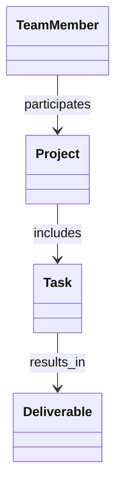
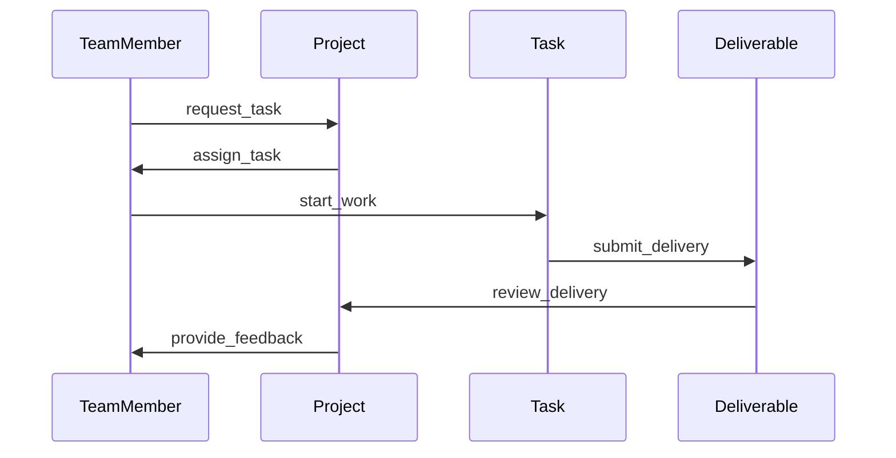
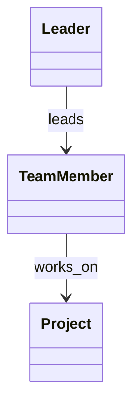
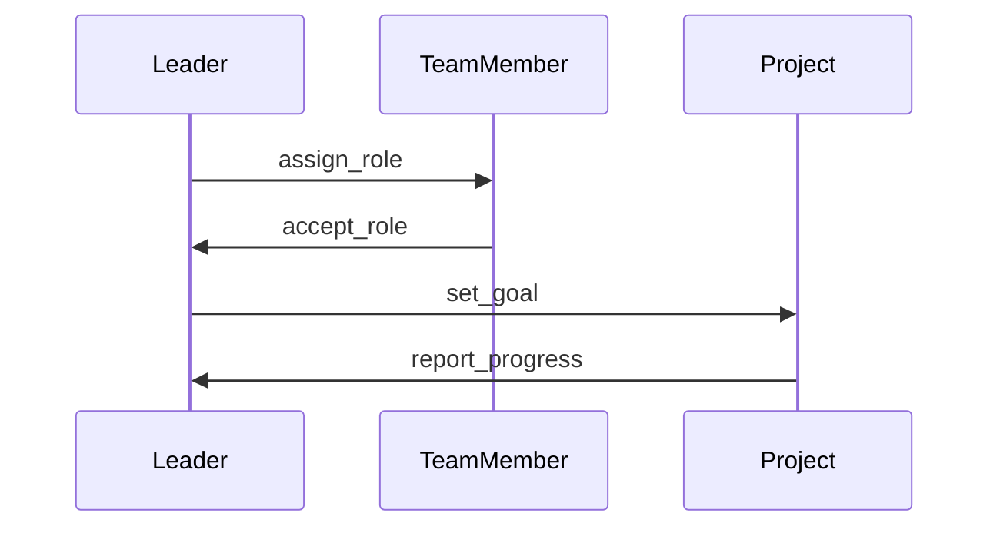
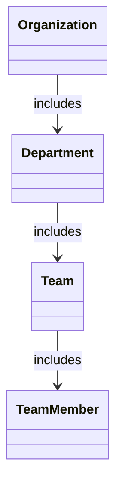
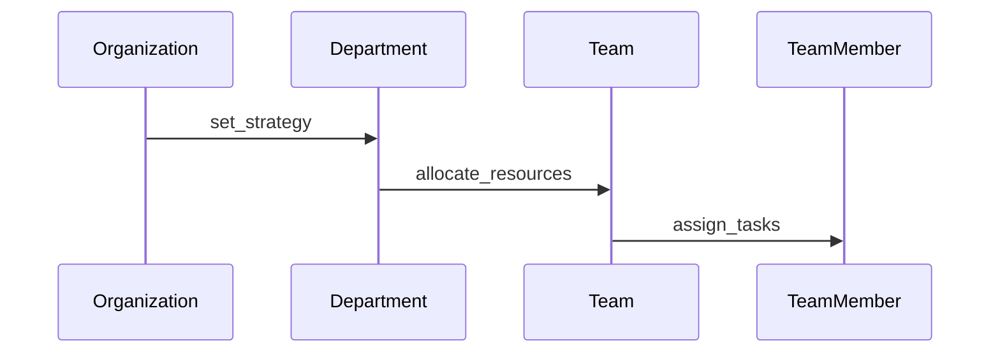
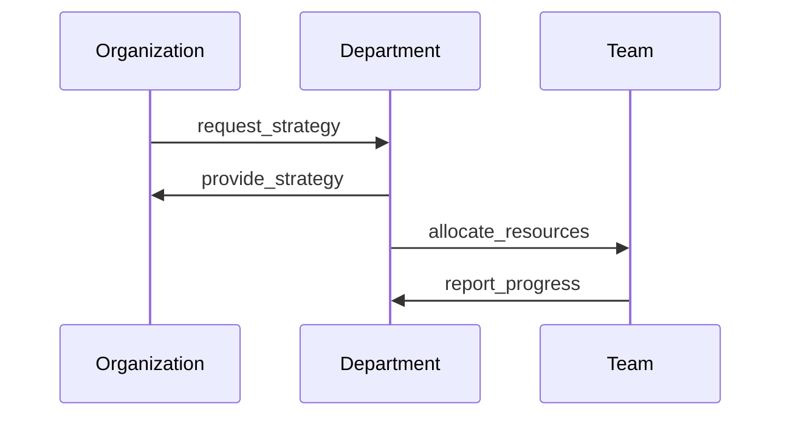

                 

# 信任建设：团队凝聚力的核心要素

## 关键词：信任建设、团队凝聚力、团队协作、领导力、组织文化

## 摘要：

在全球化经济环境中，团队协作的重要性日益凸显，而信任建设则是团队凝聚力的核心要素。本文旨在深入探讨信任建设的核心概念、策略与方法，以及其在团队协作、领导力和组织文化中的具体应用，为团队管理者提供实用的指导，以增强团队效能和稳定性。

## 第一部分：背景介绍与核心概念

### 1. 问题背景

在当今的全球化经济环境中，团队协作已成为企业和组织成功的关键因素。随着团队成员的多样性和分散化，如何建立和维护信任成为了一个挑战。信任不仅是团队合作的基础，也是组织效能和稳定性的保障。因此，信任建设成为团队管理者和领导者关注的重点。

#### 1.1 问题描述

信任建设涉及多个方面，包括个人品质、团队沟通、共同目标等。虽然有许多研究文献和实践指南，但往往缺乏系统性和全面性。本文旨在填补这一空白，通过深入探讨信任建设的核心要素，为团队管理者提供实用的指导。

#### 1.2 问题解决

本文将综合心理学、管理学和组织行为学的理论，结合实际案例，详细分析信任建设的各个环节，帮助读者理解信任的本质，掌握构建和维护信任的技巧。

#### 1.3 边界与外延

信任建设不仅适用于企业内部团队，也适用于跨部门、跨组织甚至国际化的合作。本文的核心概念和要素将具有广泛的适用性和参考价值。

#### 1.4 概念结构与核心要素组成

本文将探讨以下核心概念与要素：

- **信任的本质**：定义、特征和类型。
- **信任的基础**：建立信任的前提条件，如透明度、诚信和一致性。
- **信任的维系**：通过有效的沟通和积极的反馈来维持信任。
- **信任的修复**：在信任受到破坏时如何进行恢复和重建。
- **信任在不同场景中的应用**：团队协作、领导力和组织文化。

## 1.5 核心概念与联系

### 1.5.1 核心概念

在本章中，我们将详细探讨信任建设的核心概念，包括透明度、诚信、一致性、信任网、信任圈等。

#### 1.5.1.1 透明度

透明度是指在信息交流中保持公开和透明，减少信息不对称。团队成员在信息共享时，应尽可能提供准确和全面的信息，以便其他成员做出明智的决策。

#### 1.5.1.2 诚信

诚信是指团队成员在行为和决策中保持诚实和可靠，树立信任的基础。团队成员应遵守承诺，遵循道德规范，以赢得其他成员的信任。

#### 1.5.1.3 一致性

一致性是指团队成员在行为和沟通中保持一贯性和可预测性，增强信任感。团队成员的行为和决策应具有稳定性和可预测性，以避免误导和误解。

#### 1.5.1.4 信任网

信任网是指团队成员之间建立的相互信任的关系网络。信任网的存在有助于团队内部的信息共享和资源整合，提高团队协作效率。

#### 1.5.1.5 信任圈

信任圈是指在团队中形成的小范围高度信任的群体。信任圈有助于团队成员之间的深度交流和合作，提高团队凝聚力。

### 1.5.2 概念属性特征对比表格

| 概念       | 特征                            |
|------------|--------------------------------|
| 透明度     | 信息公开、减少信息不对称        |
| 诚信       | 诚实、可靠、行为一致            |
| 一致性     | 一贯性、可预测性、行为稳定      |
| 信任网     | 相互信任的关系网络              |
| 信任圈     | 高度信任的小范围群体            |

### 1.5.3 ER实体关系图架构

```mermaid
erDiagram
  TeamMember ||--|{ Trust} : has_trust
  TeamMember ||--|{ TrustNetwork} : part_of
  TeamMember ||--|{ TrustCircle} : part_of
  Trust --> TeamMember : builds
  TrustNetwork --> TeamMember : builds
  TrustCircle --> TeamMember : builds
```

## 1.6 信任建设的策略与方法

### 1.6.1 建立透明度和诚信

#### 1.6.1.1 建立透明的沟通机制

在团队内部，建立透明的沟通机制是建立信任的关键。定期召开团队会议，分享项目进展和决策过程，确保团队成员之间的信息对称。通过这种方式，可以减少信息不对称，提高团队成员之间的信任水平。

#### 1.6.1.2 培养诚信文化

诚信文化的培养是信任建设的重要环节。通过奖励诚实和惩罚欺骗行为，塑造团队价值观，使团队成员认识到诚信的重要性。管理者可以通过表彰诚实的行为，树立榜样，同时也要对不诚实的行为进行惩罚，以防止信任的破坏。

### 1.6.2 维护一致性和信任网

#### 1.6.2.1 保持一致的行动

在项目中，保持一致的行动是维护信任的关键。团队成员在行为和决策上应保持一致，以确保项目的顺利进行。通过建立明确的角色和职责分工，确保每个成员都知道自己的任务和期望，从而减少误解和冲突。

#### 1.6.2.2 建立信任网络

建立信任网络是团队协作的基础。通过团队合作和相互支持，团队成员可以建立相互信任的关系。管理者可以通过组织团队建设活动，促进团队成员之间的交流与合作，从而增强团队凝聚力。

### 1.6.3 恢复和重建信任

#### 1.6.3.1 承认错误和承担责任

在信任受到破坏时，承认错误和承担责任是恢复信任的关键。团队成员应勇于面对自己的错误，并采取措施进行修复。管理者应提供支持和指导，帮助团队成员走出困境，重建信任。

#### 1.6.3.2 提供反馈和支持

提供反馈和支持是重建信任的重要手段。团队成员之间应保持开放和积极的沟通，通过反馈和支持来解决问题，从而增强信任。管理者可以通过建立反馈机制，鼓励团队成员提出意见和建议，促进团队的持续改进。

## 1.7 信任建设在不同场景中的应用

### 1.7.1 团队协作

#### 1.7.1.1 建立信任

在团队协作中，建立信任是关键。通过共同目标和合作任务，团队成员可以增强相互信任。管理者可以通过组织项目启动会议，明确项目目标和期望，促进团队成员之间的沟通与合作。

#### 1.7.1.2 解决团队协作中的信任问题

在团队协作中，信任问题可能会出现。管理者可以通过有效的沟通和合作来解决这些问题。例如，在发生误解时，管理者可以组织团队成员进行面对面的沟通，以澄清事实，恢复信任。

### 1.7.2 领导力

#### 1.7.2.1 信任作为领导力核心要素

领导者通过建立信任来增强团队效率和凝聚力。管理者可以通过建立透明的沟通机制，培养诚信文化，以及提供反馈和支持，来建立和维护信任。

#### 1.7.2.2 信任型领导力

信任型领导力是一种以信任为核心的管理理念。领导者通过信任和支持来激励团队成员，提高团队绩效。管理者可以通过授权和鼓励创新，来实践信任型领导力。

### 1.7.3 组织文化

#### 1.7.3.1 构建信任型组织文化

组织文化对信任建设具有重要影响。管理者可以通过建立透明的沟通机制，培养诚信文化，以及提供反馈和支持，来构建信任型组织文化。这样，可以促进团队成员之间的信任，提高团队绩效。

## 第二部分：深度分析与实战案例

### 2.1 团队协作中的信任建设

#### 2.1.1 场景介绍

在一个大型软件开发项目中，团队成员分布在不同的城市，如何建立和维护信任成为项目成功的关键。

#### 2.1.2 项目介绍

该项目是一个跨部门、跨团队的大型软件开发项目，涉及多个技术模块和功能。为了确保项目的顺利进行，团队成员需要紧密协作，建立和维护信任。

#### 2.1.3 系统功能设计（领域模型类图）



#### 2.1.4 系统架构设计（架构图）


#### 2.1.5 系统接口设计和系统交互（序列图）



#### 2.1.6 实际案例分析和详细讲解

1. **透明度和诚信**：项目启动时，项目经理组织了一次全员会议，详细介绍了项目的目标、进度和预期成果，确保所有团队成员都了解项目的全貌。同时，项目经理鼓励团队成员在遇到问题时，及时报告并寻求帮助，以保持项目进展的透明度。

2. **一致性和信任网**：团队成员在项目中保持一致的行动，遵循统一的开发规范和流程。通过定期的代码评审和项目进度会议，团队成员之间建立了相互信任的关系网络。

3. **恢复和重建信任**：在项目进行过程中，有一次团队成员未能按时完成自己的任务。项目经理及时与该成员沟通，了解情况并给予支持。通过积极的反馈和支持，团队成员之间重新建立了信任。

#### 2.1.7 项目小结

通过信任建设，该项目成功克服了跨团队协作中的挑战，项目按时交付，质量得到保证。信任建设不仅提高了团队的协作效率，也为项目成功奠定了基础。

### 2.2 领导力中的信任建设

#### 2.2.1 场景介绍

在一个创业公司中，如何建立信任成为领导者面临的重要挑战。

#### 2.2.2 项目介绍

该公司是一家新兴的科技公司，团队成员来自不同的背景和专业领域。为了确保公司的快速发展，领导者需要建立和维护信任，以提高团队凝聚力和工作效率。

#### 2.2.3 系统功能设计（领域模型类图）



#### 2.2.4 系统架构设计（架构图）



#### 2.2.5 系统接口设计和系统交互（序列图）


#### 2.2.6 实际案例分析和详细讲解

1. **信任型领导力**：公司领导者通过信任和支持来激励团队成员。领导者鼓励团队成员提出创新想法，并为他们提供必要的资源和指导。通过这种方式，团队成员感受到信任和尊重，工作积极性得到提高。

2. **恢复和重建信任**：有一次，团队成员在项目中出现了严重的失误。领导者没有立即责备，而是与团队成员一起分析问题，找出原因，并制定改进措施。通过这种方式，领导者重建了团队成员之间的信任。

#### 2.2.7 项目小结

通过信任建设，公司团队凝聚力得到显著提高，工作效率和创新能力也得到增强。信任建设为公司的快速发展提供了有力支持。

### 2.3 组织文化中的信任建设

#### 2.3.1 场景介绍

在一个大型企业中，如何构建信任型组织文化成为管理层的重要任务。

#### 2.3.2 项目介绍

该企业是一家多元化的跨国公司，拥有多个业务部门和全球分布的团队。为了提升整体组织效能，管理层决定构建信任型组织文化。

#### 2.3.3 系统功能设计（领域模型类图）



#### 2.3.4 系统架构设计（架构图）



#### 2.3.5 系统接口设计和系统交互（序列图）



#### 2.3.6 实际案例分析和详细讲解

1. **透明度和诚信**：企业建立了透明度和诚信的沟通机制，定期召开高层会议，向所有团队成员传达公司的战略和目标。同时，鼓励团队成员在遇到问题时，勇于表达自己的观点和建议。

2. **一致性和信任网**：企业通过统一的战略和目标，确保各部门和团队之间的行动一致。通过定期的交流和协作，各部门和团队之间建立了信任网络。

#### 2.3.7 项目小结

通过信任建设，企业的组织文化得到显著改善，团队协作效率提高，组织效能得到显著提升。

## 第三部分：最佳实践、小结与拓展阅读

### 3.1 最佳实践

1. **建立透明的沟通机制**：确保团队成员之间的信息对称，减少误解和冲突。
2. **培养诚信文化**：通过奖励诚实和惩罚欺骗行为，塑造团队价值观。
3. **保持一致性和信任网**：确保团队成员的行为和决策一致，建立相互信任的关系网络。
4. **恢复和重建信任**：在信任受到破坏时，及时承认错误并采取措施修复。

### 3.2 小结

信任建设是团队协作、领导力和组织文化的重要基石。通过建立透明度和诚信、保持一致性和信任网、以及恢复和重建信任，可以提升团队的协作效率、凝聚力和组织效能。

### 3.3 拓展阅读

1. **《信任：社会结构的分析》** - 社会学家费孝通
2. **《信任危机：全球化时代的组织生活》** - 管理学家查尔斯·汉迪
3. **《信任五环》** - 组织行为学专家史蒂芬·柯维

## 作者

作者：AI天才研究院/AI Genius Institute & 禅与计算机程序设计艺术 /Zen And The Art of Computer Programming

