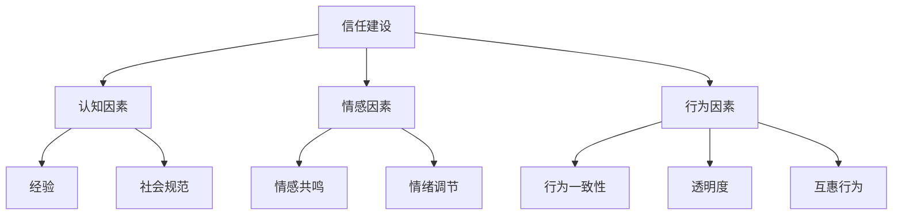
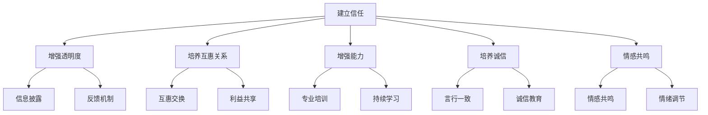
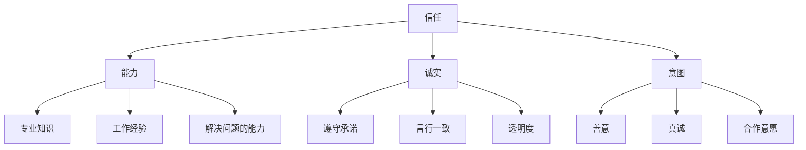

                 

# 信任建设：深厚关系的基石

> 关键词：信任、社会关系、组织管理、人际关系、合作

> 摘要：本文将探讨信任建设在现代社会中的重要性，分析信任的构成、影响因素以及如何通过科学的方法建立和维护信任关系。通过详细的案例分析，我们希望能为读者提供有价值的参考，帮助他们在个人生活和职业生涯中建立更为深厚的信任关系。

## 引言：信任建设的重要性

### 1. 问题的背景和描述

#### 1.1 社会信任的现状

在现代社会，信任问题日益凸显，尤其在个人关系、商业合作和社会层面。信任缺失导致人际交往障碍，商业合作受阻，进而影响经济发展和社会稳定。据相关调查，信任危机已成为影响现代社会和谐发展的关键因素。

- **个人关系**：缺乏信任的个人关系容易出现误解和冲突，影响人际和谐。
- **商业合作**：商业合作中的信任缺失会导致交易成本增加，合作效率降低。
- **社会层面**：社会信任缺失会导致社会治理难度加大，社会矛盾加剧。

#### 1.2 信任的定义与结构

信任是一种心理状态，表示对他人能力、诚实和善意的预期。它由三个主要成分构成：能力、诚实和意图。

- **能力**：信任的基础是对方具备解决问题的能力和技能。
- **诚实**：诚实是信任的基石，缺乏诚实会导致信任崩溃。
- **意图**：善意和真诚的意图有助于建立信任。

#### 1.3 信任建设的意义

- **增强社会凝聚力**：信任建设有助于加强社会凝聚力，促进团结合作。
- **促进经济发展**：信任是商业活动的重要基石，增强信任可以降低交易成本，提升市场效率。
- **提升生活质量**：个人生活中的信任建设有助于减少冲突，提升生活满意度。

#### 1.4 信任的边界与外延

- **信任的边界**：信任不是无条件的，它受到个人价值观、文化背景和情境因素的影响。
- **信任的外延**：信任不仅存在于人际之间，还扩展到组织、制度和社会层面。

## 2. 核心概念与联系

### 2.1 信任与相关概念的对比

#### 2.1.1 信任与信任度的比较

- **信任**：信任是一种心理状态，表示对他人能力的信任。
- **信任度**：信任度是对信任程度的量化，反映信任的强弱。

#### 2.1.2 信任与信誉的区分

- **信任**：信任是指对某个人或组织的正面预期。
- **信誉**：信誉是个人或组织因长期行为所积累的公众评价。

### 2.2 概念属性特征表格

| 概念       | 定义                                         | 属性特征                                   |
|------------|----------------------------------------------|--------------------------------------------|
| 信任       | 对他人能力的信任                             | 能力、诚实、意图                          |
| 信任度     | 信任的强度                                   | 数值范围（例如0-100）                      |
| 信誉       | 个人或组织因长期行为所积累的公众评价          | 声誉、历史行为、公众评价                    |

### 2.3 核心概念的联系

- **信任**与**信任度**：信任度是对信任程度的量化，信任度越高，表示信任程度越强。
- **信任**与**信誉**：信誉是信任的基础，信誉良好的个人或组织更容易获得他人的信任。

## 3. 信任建设的基本原理

### 3.1 信任形成的心理机制

#### 3.1.1 认知因素

- **经验**：过去的积极经验有助于建立信任。
- **社会规范**：社会规范强调信任的重要性。

#### 3.1.2 情感因素

- **情感共鸣**：情感上的共鸣有助于信任的形成。
- **情绪调节**：情绪的稳定有助于维持信任。

### 3.2 信任建设的方法

#### 3.2.1 增强透明度

- **信息披露**：提供充分的、透明的信息，有助于建立信任。
- **反馈机制**：建立有效的反馈和沟通渠道，增强信任。

#### 3.2.2 培养互惠关系

- **互惠交换**：通过互惠交换建立长期合作关系。
- **利益共享**：共同追求利益，增强信任。

### 3.3 信任建设的关键因素

- **能力**：信任的基础是能力，包括专业能力、沟通能力等。
- **诚实**：诚实是信任的基石，缺乏诚实会导致信任崩溃。
- **意图**：善意和真诚的意图有助于建立信任。

## 4. 信任建设在组织中的应用

### 4.1 组织信任建设的重要性

- **促进团队合作**：组织信任有助于提高团队协作效率。
- **增强员工满意度**：信任建设有助于提高员工的工作满意度。

### 4.2 组织信任建设的方法

#### 4.2.1 增强组织透明度

- **信息公开**：确保组织信息透明，减少信息不对称。
- **沟通机制**：建立有效的内部沟通机制，促进信息流通。

#### 4.2.2 培养诚信文化

- **诚信教育**：通过培训和教育，培养员工的诚信意识。
- **诚信监督**：建立诚信监督机制，确保诚信行为的实施。

### 4.3 信任建设案例分析

- **谷歌公司**：通过开放、透明的文化和高效的信息共享机制，谷歌建立了强大的组织信任，从而在竞争激烈的市场中脱颖而出。

## 5. 个人层面的信任建设

### 5.1 个人信任建设的重要性

- **人际关系的稳定**：建立信任有助于建立稳定的人际关系，减少冲突。
- **职业发展**：在职业生涯中，信任是职业成功的关键因素。

### 5.2 个人信任建设的方法

#### 5.2.1 增强个人能力

- **专业能力**：提升自己的专业能力，增加他人对自己的信任。
- **沟通能力**：提高沟通技巧，确保信息的准确传达。

#### 5.2.2 培养诚实守信的品质

- **诚实**：在言行中保持诚实，建立自己的信誉。
- **守信**：履行承诺，树立守信的形象。

### 5.3 个人信任建设案例分析

- **马云**：通过诚实守信的经营理念，马云赢得了客户的信任，从而创立了阿里巴巴帝国。

## 6. 信任建设在商业合作中的应用

### 6.1 商业合作中的信任建设

- **合作伙伴选择**：选择可靠的合作伙伴，建立信任关系。
- **合作过程中**：通过沟通和合作，逐步建立信任。

### 6.2 信任建设在商业合作中的方法

#### 6.2.1 增强透明度

- **信息披露**：在合作过程中，及时披露相关信息，减少信息不对称。
- **合同约束**：通过签订合同，明确双方的权利和义务，保障双方的信任。

#### 6.2.2 培养互惠关系

- **互惠交换**：通过互惠交换，建立长期合作关系。
- **利益共享**：共同追求利益，增强信任。

### 6.3 商业合作中的信任建设案例分析

- **微软与IBM**：通过长期的互惠合作和透明度建设，微软与IBM建立了稳固的商业合作关系。

## 7. 总结与展望

信任建设是现代社会不可或缺的一部分。通过本文的探讨，我们了解了信任的构成、影响因素和建设方法。在个人层面、组织层面和商业合作层面，信任建设都具有重要意义。未来，随着社会的发展，信任建设将越来越受到重视，成为推动社会进步的重要力量。

## 附录

### 7.1 核心概念属性特征表格

| 概念       | 定义                                         | 属性特征                                   |
|------------|----------------------------------------------|--------------------------------------------|
| 信任       | 对他人能力的信任                             | 能力、诚实、意图                          |
| 信任度     | 信任的强度                                   | 数值范围（例如0-100）                      |
| 信誉       | 个人或组织因长期行为所积累的公众评价          | 声誉、历史行为、公众评价                    |

### 7.2 信任建设流程图

$$
\begin{align*}
&\text{认知因素：经验、社会规范} \\
&\text{情感因素：情感共鸣、情绪调节} \\
&\text{增强透明度：信息披露、反馈机制} \\
&\text{培养互惠关系：互惠交换、利益共享} \\
\end{align*}
$$

## 作者信息

作者：AI天才研究院/AI Genius Institute & 禅与计算机程序设计艺术 /Zen And The Art of Computer Programming## 引言：信任建设的重要性

### 1. 问题的背景和描述

在现代社会的各个层面，信任问题日益凸显，尤其在个人关系、商业合作和社会治理中。信任危机不仅影响了人际交往的质量，也对整个社会的稳定和发展构成了挑战。

#### 1.1 社会信任的现状

信任是社会交往的润滑剂，没有信任，社会就无法正常运转。然而，当前社会中的信任问题却普遍存在。根据一项全球性的调查，超过70%的受访者表示他们对社会的信任度较低。以下是一些具体的现象：

- **个人关系**：家庭内部、朋友之间以及职场中的信任缺失，导致误解和冲突频发。
- **商业合作**：商业合作中的信任危机使得交易成本增加，合作效率降低，甚至导致合作关系的破裂。
- **社会层面**：社会信任的缺失使得社会治理难度加大，社会矛盾加剧，公共秩序受到威胁。

#### 1.2 信任缺失的影响

信任缺失对个人、组织和社会产生了深远的影响：

- **个人层面**：缺乏信任的个人关系容易陷入误解和冲突，导致人际关系紧张，生活质量下降。
- **组织层面**：组织信任缺失会导致团队合作效率低下，员工满意度降低，组织内部的凝聚力下降。
- **社会层面**：社会信任缺失会影响社会的整体稳定，增加社会矛盾，阻碍社会的和谐发展。

### 1.3 信任的定义与结构

为了深入理解信任建设，我们首先需要明确信任的定义和结构。信任是一种心理状态，它涉及对他人能力、诚实和善意的预期。具体来说，信任由以下三个主要成分构成：

- **能力**：信任的基础是对方具备解决问题的能力和技能。当一个人能够展现出出色的能力和技能时，他更容易赢得他人的信任。
- **诚实**：诚实是信任的基石，缺乏诚实会导致信任的崩溃。一个诚实的人会遵守承诺，保持言行一致，这种可靠性是建立信任的关键。
- **意图**：善意和真诚的意图有助于建立信任。当人们认为对方的意图是善意的，他们会更愿意相信对方，并愿意与之建立长期关系。

### 1.4 信任建设的意义

信任建设对于社会和个人都具有深远的意义：

- **增强社会凝聚力**：信任建设有助于加强社会凝聚力，促进团结合作。在一个信任水平较高的社会环境中，人们更愿意互相帮助，共同面对挑战。
- **促进经济发展**：信任是商业活动的重要基石。增强信任可以降低交易成本，提高市场效率，从而促进经济的发展。
- **提升生活质量**：个人生活中的信任建设有助于减少冲突，提高生活满意度。信任能够营造一个安全、稳定和和谐的环境，让人们更加安心和快乐。

### 1.5 信任的边界与外延

尽管信任对于社会和个人具有重要意义，但信任并非无条件的。信任的边界受到多种因素的影响：

- **个人价值观**：不同的人有不同的价值观，这会影响他们对信任的理解和接受程度。
- **文化背景**：不同的文化背景也会对信任产生影响。在一些文化中，信任被认为是一种重要的道德准则，而在其他文化中，信任可能不是那么被重视。
- **情境因素**：特定的情境也会影响信任的形成和维持。例如，在紧急情况下，人们可能更倾向于信任熟悉的人，而在陌生环境中，他们可能会更加谨慎。

除了人际之间的信任，信任还扩展到组织、制度和社会层面：

- **组织信任**：组织信任是指员工对组织的信任。一个信任度高的组织能够更好地吸引和留住人才，提高员工的工作满意度和效率。
- **制度信任**：制度信任是指公众对法律、法规和政府机构的信任。一个制度信任度高的社会能够更好地维护社会秩序，促进社会和谐。
- **社会信任**：社会信任是指对整个社会的信任。一个社会信任度高的国家能够更好地实现社会稳定和发展，提高国际竞争力。

通过以上对信任问题的背景和描述的分析，我们可以看到，信任建设是一项复杂而重要的任务。在接下来的章节中，我们将进一步探讨信任的核心概念、建设原理和方法，以及信任在不同层面的应用和实践。

### 2. 核心概念与联系

在深入探讨信任建设之前，我们需要明确一些核心概念，并分析它们之间的联系。以下是对信任、信任度、信誉等核心概念的详细解释和对比。

#### 2.1.1 信任与信任度的比较

信任是一种心理状态，它表示对他人能力、诚实和善意的预期。信任是对一个人或组织的整体评价，是一个主观的判断。它不仅仅是基于事实，还涉及到个人的情感和信念。例如，当一个人说他们“信任”他们的医生时，他们不仅认为医生具有治疗疾病的能力，还相信医生会以诚实和善意的态度对待患者。

信任度，则是信任的程度或强度，是对信任这一心理状态的量化。它可以用来衡量一个人对另一个人的信任程度。通常，信任度可以通过一些工具或量表来测量，例如从0到100的评分系统。信任度越高，表示信任的程度越强。例如，在一个团队中，如果团队成员之间的信任度较高，他们更愿意相互依赖和合作，团队的整体效率也会提高。

信任与信任度的区别在于，信任是一个主观的心理状态，而信任度是对这种状态的量化表示。信任可以存在于没有明确量化标准的情况下，但信任度通常需要某种形式的评估或测量。

#### 2.1.2 信任与信誉的区分

信任和信誉是两个相关的但不同的概念。信任是一种对个人或组织的心理预期，它基于对方的能力、诚实和意图。而信誉则是个人或组织因长期行为所积累的公众评价。信誉是一种社会认可，它基于他人的观察和评价。

- **信任**：信任是指一个人对另一个人的正面预期，这种预期可能基于个人的直觉、经验或他人的推荐。信任是一种内在的心理状态，它不依赖于外界评价，而是基于个人的判断和信念。

- **信誉**：信誉是个人或组织因其在社会中的行为和表现所积累的声誉。信誉是外部的评价，通常由第三方观察者提供。它是一种社会性的评价，可以影响一个人在社会中的地位和他人对他们的预期。

信任和信誉之间的联系在于，信誉可以影响信任的形成。一个具有良好信誉的个人或组织更容易赢得他人的信任。例如，一个知名品牌因为其长期的质量保证和服务，会赢得消费者的信任。而一个新成立的公司可能需要通过建立信誉来逐步赢得客户的信任。

#### 2.2 概念属性特征表格

为了更清晰地展示信任、信任度和信誉的属性特征，我们使用一个表格来对比这三个概念：

| 概念       | 定义                                                         | 属性特征                                      |
|------------|--------------------------------------------------------------|-----------------------------------------------|
| 信任       | 对他人能力、诚实和善意的预期                                 | 能力、诚实、意图                             |
| 信任度     | 信任的强度或程度，通常通过量表测量                           | 数值范围（如0-100）                          |
| 信誉       | 个人或组织因长期行为所积累的公众评价                         | 声誉、历史行为、公众评价                      |

#### 2.3 概念的联系与区分

通过上述对比，我们可以看出，信任、信任度和信誉之间既有联系也有区别。信任是信任度的心理基础，而信任度是对信任程度的量化。信誉则是基于他人评价的社会认可，它可以影响信任的形成。

- **信任与信任度的联系**：信任是信任度的心理基础，信任度的量化反映了信任的强度。一个人的信任程度可以通过信任度来衡量，这有助于我们更好地理解人际关系的深度和稳定性。

- **信任与信誉的联系**：良好的信誉可以增强他人的信任。一个具有良好信誉的个人或组织更容易赢得他人的信任，因为公众对他们的评价较高。

- **信任与信誉的区别**：信任是一种内在的心理状态，而信誉是一种外部的社会评价。信任是基于个人的判断和信念，而信誉是基于公众的观察和评价。

通过理解这些核心概念及其联系，我们可以更好地把握信任建设的关键要素。信任建设不仅需要培养个人的信任感，还需要建立和维护良好的信誉。在接下来的章节中，我们将进一步探讨信任形成的心理机制和建设方法，以及如何在不同层面实现信任建设。

### 3. 信任建设的基本原理

信任建设是一个复杂的过程，涉及多个方面的因素。为了有效地建立和维护信任关系，我们需要理解信任形成的心理机制，并采取科学的方法来促进信任建设。以下是信任建设的基本原理：

#### 3.1 信任形成的心理机制

信任的形成是一个多维度的心理过程，涉及认知、情感和行为因素。以下是一些关键的心理机制：

##### 3.1.1 认知因素

认知因素在信任形成中起着核心作用。人们通过观察、经验和思考来评估他人的能力、诚实和意图。以下是一些具体的认知因素：

- **经验**：过去的经验对信任的形成有显著影响。例如，一个在过去多次合作中表现出色的同事会更容易获得新同事的信任。
- **社会规范**：社会规范和价值观也会影响信任的形成。在一个强调诚信和责任的社会中，人们更倾向于信任他人。
- **信息评估**：人们会根据获得的信息来评估他人的能力、诚实和意图。充分和透明的信息有助于建立信任。

##### 3.1.2 情感因素

情感因素在信任建设中同样重要。情感上的共鸣和情绪调节有助于信任的形成和维持。以下是一些关键的情感因素：

- **情感共鸣**：当人们感受到情感上的共鸣时，他们更容易建立信任关系。例如，在面对共同困难时，团队成员之间的情感共鸣可以增强信任。
- **情绪调节**：情绪的稳定有助于维持信任。一个能够有效调节自己情绪的人更可能赢得他人的信任。

##### 3.1.3 行为因素

行为因素是信任建设的重要组成部分。通过行为来展示能力、诚实和善意可以增强他人对个人的信任。以下是一些关键的行为因素：

- **行为一致性**：保持行为的一致性是建立信任的关键。一个经常改变自己立场的人难以赢得他人的信任。
- **透明度**：提供透明的信息和行为可以增强信任。例如，在商业合作中，透明地披露财务信息和业务流程有助于建立信任。
- **互惠行为**：互惠行为可以增强信任。通过相互帮助和合作，人们可以建立起长期的信任关系。

#### 3.2 信任建设的方法

为了有效地建立和维护信任关系，我们需要采取一系列具体的方法。以下是一些关键的信任建设方法：

##### 3.2.1 增强透明度

透明度是信任建设的重要基石。通过提供透明和准确的信息，我们可以减少信息不对称，增强信任。以下是一些增强透明度的方法：

- **信息披露**：在合作过程中，及时披露相关信息，让各方都能了解实际情况。
- **反馈机制**：建立有效的反馈和沟通渠道，让各方能够及时交流意见和反馈，解决问题。

##### 3.2.2 培养互惠关系

互惠关系有助于建立长期的信任。通过互惠交换和利益共享，我们可以增强信任关系。以下是一些培养互惠关系的策略：

- **互惠交换**：在合作中，通过相互帮助和交换资源来建立互惠关系。
- **利益共享**：在合作中，共同追求利益，分享成功和成果，这有助于增强信任。

##### 3.2.3 增强能力

信任的基础是对方的能力。通过提升个人的能力和技能，我们可以增强他人对我们的信任。以下是一些增强能力的方法：

- **专业培训**：通过专业培训提升自己的专业技能，提高解决复杂问题的能力。
- **持续学习**：不断学习新知识和技能，保持自己的竞争力。

##### 3.2.4 培养诚实守信的品质

诚实守信是信任的基石。通过培养诚实守信的品质，我们可以赢得他人的信任。以下是一些培养诚实守信的方法：

- **言行一致**：在言行中保持一致，遵守承诺，树立诚实守信的形象。
- **诚信教育**：通过诚信教育，培养个人的诚信意识和价值观。

##### 3.2.5 情感共鸣和情绪调节

情感共鸣和情绪调节有助于信任的形成和维持。通过建立情感上的共鸣和有效调节情绪，我们可以增强信任关系。以下是一些方法：

- **情感共鸣**：在合作中，通过分享情感和经历，建立情感上的共鸣。
- **情绪调节**：通过情绪调节，保持情绪稳定，减少情绪波动对信任关系的影响。

#### 3.3 信任建设的关键因素

在信任建设过程中，以下几个关键因素尤为重要：

- **能力**：信任的基础是对方具备解决问题的能力和技能。一个有能力的人更容易赢得他人的信任。
- **诚实**：诚实是信任的基石，缺乏诚实会导致信任的崩溃。一个诚实守信的人会赢得他人的长期信任。
- **意图**：善意和真诚的意图有助于建立信任。一个出于善意和真诚意图的人更可能赢得他人的信任。

通过理解信任形成的心理机制和采取科学的信任建设方法，我们可以有效地建立和维护信任关系。信任建设不仅需要个人的努力，还需要社会和组织的支持。只有通过多方面的共同努力，我们才能在现代社会中建立起更为深厚的信任关系。

### 4. 信任建设在组织中的应用

信任在组织中的作用至关重要。一个高度信任的组织能够提高团队合作效率，增强员工满意度，从而推动组织的整体发展。以下将探讨信任建设在组织中的重要性及其具体应用方法。

#### 4.1 组织信任建设的重要性

在组织中，信任建设的重要性不容忽视。以下是组织信任建设的一些关键作用：

- **促进团队合作**：在一个信任水平较高的组织中，团队成员之间更愿意相互依赖和合作，这有助于提高团队的整体效率。信任减少了内部冲突，使团队成员能够更专注于共同的目标。
- **增强员工满意度**：信任建设可以提高员工的工作满意度。当员工感受到组织对他们的信任时，他们会更加投入工作，表现出更高的工作积极性。这种积极的工作态度有助于提升员工的满意度和忠诚度。
- **提升组织效率**：信任建设可以降低组织内部的信息不对称，提高信息流通的效率。在一个信任度高的组织中，员工更愿意分享信息和资源，这有助于组织快速响应市场变化，提高整体效率。
- **吸引和留住人才**：一个信任度高的组织更容易吸引和留住优秀人才。当潜在员工看到组织内部有良好的信任氛围时，他们更愿意加入这样的组织。同样，现有员工在感受到组织的信任时，也更愿意留在组织中。

#### 4.2 组织信任建设的方法

为了在组织中建立和维护信任，组织需要采取一系列具体的方法。以下是一些有效的组织信任建设方法：

##### 4.2.1 增强组织透明度

增强透明度是建立信任的重要步骤。以下是一些增强组织透明度的策略：

- **信息披露**：组织应定期向员工披露关键信息，确保员工了解组织的运营状况和战略方向。这有助于减少信息不对称，增强员工对组织的信任。
- **沟通渠道**：组织应建立多种沟通渠道，如定期会议、内部邮件和社交媒体平台，使员工能够方便地获取信息和表达意见。有效的沟通有助于建立信任和促进合作。
- **透明决策**：组织在决策过程中应保持透明，让员工了解决策的原因和过程。这有助于增加员工的参与感和信任感。

##### 4.2.2 培养诚信文化

诚信是信任的基石。以下是一些培养诚信文化的策略：

- **诚信教育**：组织应定期开展诚信教育，向员工传递诚信的重要性。通过培训和教育，员工可以更好地理解诚信的价值，并将其融入到日常工作中。
- **诚信监督**：组织应建立诚信监督机制，确保员工遵守诚信准则。监督机制可以包括内部审计、举报系统和定期评估，以发现和纠正不诚信行为。
- **诚信奖励**：组织应设立诚信奖励制度，对表现良好的员工给予表彰和奖励。这可以激励员工继续保持诚信行为，进一步巩固组织诚信文化。

##### 4.2.3 促进互惠关系

互惠关系有助于建立长期的信任。以下是一些促进互惠关系的策略：

- **互惠交换**：组织可以通过互惠交换，如资源分享、技能培训和合作项目，增强员工之间的互惠关系。这种交换有助于建立团队合作精神，提高组织内部的信任水平。
- **利益共享**：组织可以采取利益共享机制，如利润分享计划或股权激励，使员工感受到组织发展的成果。这种共享机制可以增强员工的归属感和信任感。

##### 4.2.4 增强能力

增强员工的能力是建立信任的基础。以下是一些增强员工能力的策略：

- **培训与发展**：组织应提供持续的培训和发展机会，帮助员工提升专业技能和工作能力。这不仅可以提高员工的绩效，还可以增强员工对组织的信任。
- **认可与激励**：组织应对员工的表现给予认可和激励，鼓励员工持续提升能力。这可以增强员工的自信心和信任感，提高员工的工作积极性。
- **职业规划**：组织应帮助员工制定职业规划，明确员工的职业发展路径。这有助于员工看到自己的成长和进步，从而增强对组织的信任。

##### 4.2.5 情感共鸣和情绪调节

情感共鸣和情绪调节在信任建设中也非常重要。以下是一些策略：

- **情感共鸣**：组织可以通过团队建设活动、员工关怀计划等方式，促进员工之间的情感共鸣。这种共鸣有助于建立信任和团队凝聚力。
- **情绪调节**：组织应提供情绪调节的支持，如心理咨询、员工援助计划等。这有助于员工保持情绪稳定，减少情绪波动对信任关系的影响。

#### 4.3 信任建设案例分析

以下是一个组织信任建设的成功案例：

**谷歌公司**：谷歌以其开放、透明和信任文化而闻名。以下是谷歌在信任建设方面的几个关键做法：

- **开放沟通**：谷歌鼓励员工自由表达意见，并在公司内部建立了一个开放的沟通渠道。员工可以通过邮件、内部博客和会议等方式，与高层管理人员直接沟通，这有助于建立信任和透明度。
- **诚信教育**：谷歌定期开展诚信培训，向员工传达诚信的重要性。公司还设立了诚信奖，表彰那些在业务中表现诚信的员工。
- **员工关怀**：谷歌提供了一系列员工关怀计划，如心理健康支持、育儿假和家庭日等。这些计划有助于增强员工对公司的信任和归属感。
- **职业发展**：谷歌为员工提供广泛的培训和发展机会，帮助员工提升技能和职业素养。这不仅可以提高员工的绩效，还可以增强员工对公司的信任。

通过这些做法，谷歌成功地建立了强大的信任文化，这不仅提升了员工的工作满意度，也推动了公司的持续发展。

### 4.4 组织信任建设的挑战与解决方案

尽管信任建设在组织中具有重要意义，但在实际操作中也会面临一些挑战。以下是一些常见的挑战及相应的解决方案：

- **信息不对称**：信息不对称是组织信任建设的一个主要挑战。为了解决这个问题，组织应采取透明的信息披露政策，确保员工能够获取到所需的信息。
- **文化差异**：不同文化背景下，人们对信任的理解和期望可能有所不同。为了克服文化差异，组织应加强对文化多样性的培训，促进跨文化沟通和合作。
- **组织变革**：在组织变革过程中，信任可能会受到挑战。为了保持信任，组织应明确变革的目标和步骤，并与员工进行充分的沟通，确保他们理解变革的意义和影响。
- **员工流失**：员工流失可能会影响组织内部的信任水平。为了减少员工流失，组织应提供有吸引力的薪酬和福利待遇，建立良好的工作环境和职业发展路径。

通过有效的信任建设，组织可以克服这些挑战，建立强大的信任文化，从而推动组织的持续发展。

### 4.5 信任建设在组织中的持续改进

信任建设是一个持续的过程，组织需要不断改进和优化信任建设措施。以下是一些持续改进的策略：

- **定期评估**：组织应定期评估信任建设的效果，收集员工反馈，识别问题和改进机会。
- **持续培训**：组织应持续开展培训活动，提升员工的能力和诚信意识，巩固信任文化。
- **激励机制**：组织应建立激励机制，鼓励员工积极参与信任建设活动，如诚信奖励、优秀团队表彰等。
- **领导示范**：领导者的行为对信任建设具有示范作用。领导者应以身作则，树立诚信和透明的榜样。

通过持续改进，组织可以不断提升信任水平，推动组织的健康发展。

### 4.6 信任建设在组织中的应用

信任建设不仅对组织内部有重要影响，也对组织与外部合作伙伴之间的关系产生深远影响。以下是一些组织信任建设在组织与外部合作伙伴关系中的应用：

- **供应商关系**：组织应与供应商建立互惠互利的合作关系，通过透明沟通和合作共赢，增强信任。
- **客户关系**：组织应与客户建立长期合作关系，通过高质量的服务和诚信经营，赢得客户的信任。
- **合作伙伴关系**：组织应与合作伙伴建立信任，通过共享资源和信息，共同推动业务发展。

通过在组织与外部合作伙伴关系中的应用，信任建设可以促进组织的外部发展，实现更广泛的合作和共赢。

### 4.7 结论

在组织中建立和维护信任关系是一个复杂而重要的任务。通过增强透明度、培养诚信文化、促进互惠关系、增强能力和情感共鸣，组织可以有效地建立信任。信任建设不仅有助于提高团队合作效率和员工满意度，也推动组织的整体发展。未来，组织应继续优化信任建设措施，推动信任文化的持续发展。

### 4.8 信任建设案例分析

**谷歌公司**：谷歌以其开放、透明和信任文化而著称，以下是谷歌在信任建设方面的成功实践：

- **开放文化**：谷歌鼓励员工自由表达意见，并通过内部博客、邮件和会议等方式，确保信息的透明传递。这种开放文化有助于建立信任，使员工感到自己的声音被听到。
- **诚信教育**：谷歌定期开展诚信教育，向员工传达诚信的重要性。此外，公司还设立了诚信奖，表彰那些在业务中表现诚信的员工。
- **员工关怀**：谷歌提供了一系列员工关怀计划，如心理健康支持、育儿假和家庭日等。这些计划有助于增强员工对公司的信任和归属感。
- **职业发展**：谷歌为员工提供广泛的培训和发展机会，帮助员工提升技能和职业素养。这不仅提高了员工的绩效，也增强了员工对公司的信任。

通过这些实践，谷歌成功地建立了强大的信任文化，这不仅提升了员工的工作满意度，也推动了公司的持续发展。

### 4.9 组织信任建设的挑战与解决方案

**挑战一：信息不对称**

**解决方案**：建立透明度较高的信息共享机制，确保关键信息及时、准确地传递给所有相关方。可以采用定期报告、公开会议等形式，提高信息的透明度。

**挑战二：文化差异**

**解决方案**：加强跨文化培训，提高员工对多元文化的理解和尊重。鼓励不同文化背景的员工之间进行开放和尊重的沟通，以减少文化差异带来的信任障碍。

**挑战三：组织变革**

**解决方案**：在组织变革过程中，明确变革的目标和步骤，并与员工进行充分沟通，确保他们理解变革的意义和影响。通过提供支持和培训，帮助员工适应变革。

**挑战四：员工流失**

**解决方案**：提供有吸引力的薪酬和福利待遇，建立良好的工作环境和职业发展路径。同时，建立有效的员工关怀机制，关注员工的心理健康和工作满意度。

通过应对这些挑战，组织可以不断完善信任建设措施，提升组织内部的信任水平，为组织的长期发展奠定坚实基础。

### 4.10 结论

组织信任建设是一个长期而复杂的过程，它需要组织在多个层面上持续努力。通过增强透明度、培养诚信文化、促进互惠关系、增强能力和情感共鸣，组织可以有效地建立和维护信任关系。信任建设不仅有助于提升团队合作效率和员工满意度，还推动组织的整体发展。未来，组织应继续优化信任建设措施，推动信任文化的持续发展，为组织的长期成功奠定坚实基础。

### 5. 个人层面的信任建设

在个人层面，信任建设同样至关重要。信任不仅影响我们的人际关系，还影响我们的职业发展和生活质量。在个人层面，信任建设需要我们关注自身的能力、诚信和意图，并采取一系列具体的方法来增强信任。

#### 5.1 个人信任建设的重要性

个人信任建设的重要性体现在以下几个方面：

- **人际关系**：信任是建立和维护人际关系的关键。一个信任度高的人更容易与他人建立深厚的友谊，减少冲突和误解，增强人际和谐。
- **职业发展**：在职业生涯中，信任是职业成功的重要因素。一个信任度高的人更容易获得同事和上级的认可，得到更多的发展机会。
- **生活质量**：个人生活中的信任建设有助于减少焦虑和压力，提高生活满意度。信任使人感到安全和被理解，从而提升整体生活质量。

#### 5.2 个人信任建设的方法

以下是几种有效的个人信任建设方法：

##### 5.2.1 增强个人能力

个人能力是建立信任的基础。通过以下方法可以增强个人能力：

- **持续学习**：不断学习新知识和技能，提升自己的专业能力和综合素质。这不仅可以增强个人的竞争力，还可以提高他人对我们的信任度。
- **实践锻炼**：通过实际工作或项目实践，锻炼自己的能力。在实践中积累经验，提高解决问题的能力。
- **展示成就**：在适当的时候展示自己的成就和成就背后的努力，让他人了解我们的能力。

##### 5.2.2 培养诚实守信的品质

诚实守信是建立信任的基石。以下是几种培养诚实守信的方法：

- **言行一致**：在言行中保持一致，遵守承诺，树立诚实守信的形象。当我们在做一件事情时，要确保我们的行动与我们的承诺相符。
- **坦诚沟通**：在与他人沟通时，保持坦诚和开放。诚实地表达自己的想法和意见，同时尊重对方的观点。
- **诚信教育**：通过阅读书籍、参加培训等方式，学习诚信的重要性和诚信行为的具体实践。

##### 5.2.3 培养互惠关系

互惠关系有助于建立长期的信任。以下是几种培养互惠关系的方法：

- **互惠交换**：在日常生活中，通过相互帮助和交换资源，建立互惠关系。例如，在同事之间可以互相提供帮助，共同解决问题。
- **利益共享**：在合作中，共同追求利益，分享成功和成果。这不仅可以增强信任，还可以建立长期的合作关系。
- **互助合作**：在社区或团队中，积极参与互助合作活动，帮助他人解决问题。这种合作精神可以增强人际之间的信任。

##### 5.2.4 情感共鸣和情绪调节

情感共鸣和情绪调节在信任建设中同样重要。以下是几种方法：

- **情感共鸣**：通过倾听、理解和同情他人的情感，建立情感上的共鸣。这有助于增强人际之间的信任。
- **情绪调节**：学会调节自己的情绪，保持情绪稳定。当面对冲突或压力时，能够冷静应对，避免情绪波动对信任关系的影响。

##### 5.2.5 展示责任感和可靠性

责任感和可靠性是建立信任的重要因素。以下是几种展示责任感和可靠性的方法：

- **承担责任**：在面对问题和挑战时，勇于承担责任，不逃避责任。这表明我们有勇气和决心解决问题。
- **准时履行承诺**：在承诺的时间内完成任务，准时履行自己的责任。这表明我们是有责任感和可靠的人。
- **透明沟通**：在沟通中保持透明，及时告知他人进展情况和遇到的问题。这有助于建立信任和减少误解。

#### 5.3 个人信任建设案例分析

以下是一个个人信任建设的成功案例：

**马云**：马云是中国著名的企业家，他在个人和职业生涯中一直重视信任建设。以下是马云在信任建设方面的几个关键做法：

- **诚实守信**：马云在创业初期就坚持诚信经营，他认为诚信是企业成功的基石。他坚持不卖假货，不欺骗消费者，树立了良好的信誉。
- **持续学习**：马云重视个人学习和成长，他经常参加各种培训和学习活动，不断更新自己的知识和技能。
- **员工关怀**：马云注重员工福利，他建立了阿里巴巴的员工保障计划，为员工提供良好的工作环境和职业发展机会。
- **社会责任**：马云积极参与社会公益事业，通过阿里巴巴公益基金会支持各种社会项目，树立了良好的社会责任形象。

通过这些做法，马云不仅赢得了员工的信任，也在职业生涯中取得了巨大的成功。他的信任建设经验为其他人提供了宝贵的借鉴。

### 5.4 个人信任建设的挑战与解决方案

在个人层面进行信任建设时，可能会面临一些挑战。以下是一些常见的挑战及相应的解决方案：

- **信息不对称**：为了解决信息不对称问题，个人可以采取透明沟通策略，确保信息的透明传递，减少误解和猜疑。
- **文化差异**：为了克服文化差异，个人可以加强跨文化培训，提高对多元文化的理解和尊重，促进有效的沟通和合作。
- **情绪波动**：为了减少情绪波动对信任关系的影响，个人可以学习情绪调节技巧，保持情绪稳定，避免因情绪波动而对他人产生误解。
- **行为不一致**：为了保持行为一致性，个人可以制定明确的行为准则，遵守承诺，确保言行一致。

通过应对这些挑战，个人可以不断完善信任建设，建立更加深厚和稳定的信任关系。

### 5.5 个人信任建设的持续改进

个人信任建设是一个持续的过程，需要不断地改进和优化。以下是一些持续改进的策略：

- **定期反思**：定期反思自己的行为和决策，识别信任建设中的不足，并制定改进计划。
- **持续学习**：通过学习和培训，不断提升自己的能力和素质，增强对他人的信任感。
- **行为修正**：当发现自己的行为不符合信任建设原则时，及时修正，并通过行动证明自己的决心和诚意。
- **寻求反馈**：主动寻求他人的反馈和建议，了解自己在信任建设方面的优点和不足，并据此进行改进。

通过持续改进，个人可以不断提高信任水平，建立更加深厚和稳定的信任关系。

### 5.6 个人信任建设在日常生活中的应用

个人信任建设不仅限于职业发展，也广泛应用于我们的日常生活中。以下是一些具体的应用场景：

- **家庭关系**：在家庭中，通过诚实、理解和支持，建立和维护良好的家庭关系。
- **朋友关系**：在朋友之间，通过相互信任和关爱，建立深厚的友谊。
- **社区参与**：在社区中，通过积极参与和贡献，建立社区成员之间的信任。

通过在日常生活中应用信任建设原则，个人可以提升生活质量和人际关系，创造一个更加和谐和稳定的社会环境。

### 5.7 结论

在个人层面进行信任建设是一项重要而复杂的任务。通过增强个人能力、培养诚实守信的品质、培养互惠关系、情感共鸣和情绪调节，个人可以有效地建立和维护信任关系。信任建设不仅有助于提升个人的人际关系和职业发展，还提高生活质量。未来，个人应继续优化信任建设措施，推动信任文化的持续发展，为自己和他人创造一个更加和谐和稳定的环境。

### 6. 信任建设在商业合作中的应用

在商业合作中，信任是确保合作顺利进行的关键因素。它不仅影响双方的交易成本，还决定合作关系的持久性和成功率。以下将探讨信任建设在商业合作中的重要性及其具体应用方法。

#### 6.1 商业合作中的信任建设的重要性

商业合作中的信任建设至关重要，主要体现在以下几个方面：

- **降低交易成本**：信任可以减少交易过程中因信息不对称导致的成本。例如，当合作双方信任度高时，他们更愿意分享关键信息，从而减少由于信息不完整或错误引起的误解和损失。
- **提高合作效率**：信任有助于合作双方更加紧密地协作，减少沟通障碍和协调成本。在一个信任水平较高的合作环境中，双方更容易达成共识，共同推进项目。
- **增强合作伙伴关系**：信任是长期合作伙伴关系的基础。当双方建立深厚的信任关系时，他们更愿意共同面对挑战，分享成功，从而实现双赢。
- **提升品牌形象**：在商业合作中，信任建设有助于提升企业的品牌形象。一个具有良好信誉和信任度的企业更容易赢得客户和合作伙伴的信任，从而在市场上占据有利地位。

#### 6.2 商业合作中的信任建设方法

为了在商业合作中建立和维护信任，合作双方需要采取一系列具体的方法。以下是一些有效的信任建设方法：

##### 6.2.1 增强透明度

透明度是商业合作中建立信任的关键。以下是一些增强透明度的策略：

- **信息披露**：在合作过程中，及时、全面地披露相关信息，让合作伙伴了解合作项目的进展、风险和潜在问题。这有助于减少信息不对称，增强信任。
- **合同条款**：在签订合同时，明确双方的权利和义务，确保合同条款透明和公正。这可以防止在合作过程中因条款不明而导致的不信任。
- **绩效评估**：定期进行绩效评估，向合作伙伴展示项目的进展和成果。这有助于建立双方对项目进展的共同认知，增强信任。

##### 6.2.2 培养互惠关系

互惠关系有助于建立长期的信任。以下是一些培养互惠关系的策略：

- **互惠交换**：通过资源分享和协作，实现互惠互利。例如，双方可以共同承担风险，分享收益，从而增强合作关系。
- **利益共享**：在合作项目中，共同追求利益，确保双方都能从合作中获得好处。这可以增强合作双方对项目的投入和信任。
- **长期合作**：通过长期合作，建立稳定和持续的关系。在一个长期的合作关系中，双方可以逐步建立信任，从而减少短期合作中的不确定性。

##### 6.2.3 增强能力

合作双方的能力是建立信任的基础。以下是一些增强能力的策略：

- **专业培训**：为合作双方提供专业培训，提升他们的专业技能和业务能力。这不仅可以提高项目的成功率，还可以增强合作伙伴对双方能力的信任。
- **技能互补**：选择互补性强的合作伙伴，共同应对项目中的挑战。当合作双方在能力上形成互补时，他们可以更好地协同工作，增强信任。
- **能力展示**：通过实际项目中的表现，展示双方的专业能力和业务水平。这可以让合作伙伴看到双方的实际能力，从而增强信任。

##### 6.2.4 培养诚信文化

诚信是商业合作中信任的基石。以下是一些培养诚信文化的策略：

- **诚信教育**：定期开展诚信教育，向合作双方传达诚信的重要性和价值。这可以帮助他们认识到诚信行为对合作关系的积极影响。
- **诚信监督**：建立诚信监督机制，确保合作双方遵守诚信准则。监督机制可以包括定期审计、诚信报告和违规处罚等。
- **诚信奖励**：设立诚信奖励制度，对表现良好的合作伙伴给予表彰和奖励。这可以激励双方保持诚信行为，进一步巩固合作关系。

##### 6.2.5 情感共鸣和情绪调节

情感共鸣和情绪调节在商业合作中同样重要。以下是一些策略：

- **情感共鸣**：通过倾听和理解合作伙伴的情感需求，建立情感上的共鸣。这可以帮助双方更好地理解对方，增强信任。
- **情绪调节**：在合作过程中，学会调节自己的情绪，避免情绪波动对合作关系的影响。这有助于保持合作关系的稳定和和谐。

#### 6.3 商业合作中的信任建设案例分析

以下是一个商业合作中的信任建设成功案例：

**微软与IBM**：微软与IBM的合作关系是全球商业合作中的典范。以下是他们如何在商业合作中建立和维护信任的几个关键做法：

- **透明沟通**：微软与IBM在合作过程中，建立了高效的沟通机制，确保信息的透明传递。双方定期举行会议，讨论项目的进展和问题，保持对项目的共同认知。
- **互惠互利**：微软与IBM在合作项目中，坚持互惠互利的原则。双方共同承担风险，分享收益，从而确保合作的公平性和持续性。
- **诚信行为**：微软与IBM都坚持诚信经营，他们在合作中遵守承诺，确保项目的顺利进行。这种诚信行为赢得了对方的信任，促进了合作的长期发展。
- **技能互补**：微软与IBM在技能和资源上形成互补，共同应对项目中的挑战。这种互补性不仅提高了项目的成功率，还增强了双方的信任。

通过这些做法，微软与IBM成功地建立了强大的信任关系，使他们的合作能够长期稳定地进行。

#### 6.4 商业合作中的信任建设挑战与解决方案

在商业合作中，信任建设可能会面临一些挑战。以下是一些常见的挑战及相应的解决方案：

- **信息不对称**：为了解决信息不对称问题，合作双方可以建立透明的信息披露机制，确保关键信息的及时传递和共享。
- **文化差异**：为了克服文化差异，合作双方可以加强跨文化培训，提高对多元文化的理解和尊重，促进有效的沟通和合作。
- **利益冲突**：为了解决利益冲突问题，合作双方可以在合作前明确利益分配机制，确保双方都能从合作中获得合理的好处。
- **情绪波动**：为了减少情绪波动对合作关系的影响，合作双方可以学习情绪调节技巧，保持情绪稳定，避免因情绪波动而对合作关系产生负面影响。

通过应对这些挑战，合作双方可以建立和维护稳定的信任关系，推动合作的顺利进行。

#### 6.5 商业合作中的信任建设总结

商业合作中的信任建设是确保合作顺利进行的关键。通过增强透明度、培养互惠关系、增强能力、培养诚信文化以及情感共鸣和情绪调节，合作双方可以有效地建立和维护信任关系。信任建设不仅有助于降低交易成本、提高合作效率，还能增强合作伙伴关系，提升企业的品牌形象。未来，商业合作中的信任建设应继续得到重视，以推动合作的长期稳定发展。

### 7. 总结与展望

本文通过对信任建设在各个层面的深入探讨，揭示了信任在社会、组织、商业合作和个人生活中的重要性。信任不仅是社会交往的润滑剂，也是组织高效运作和商业合作成功的关键因素。通过增强透明度、培养互惠关系、提升个人能力和诚信意识，我们可以有效地建立和维护信任关系。

#### 7.1 核心观点回顾

- **社会层面**：信任建设有助于增强社会凝聚力，降低社会矛盾，推动经济发展。
- **组织层面**：信任建设可以促进团队合作，提升员工满意度，提高组织效率。
- **商业合作层面**：信任建设有助于降低交易成本，提高合作效率，增强合作伙伴关系。
- **个人层面**：信任建设有助于建立稳定的人际关系，提高职业发展，提升生活质量。

#### 7.2 展望未来

展望未来，信任建设将继续在社会、组织、商业合作和个人生活中发挥重要作用。随着技术的进步和社会的变迁，信任建设也将面临新的挑战和机遇：

- **技术赋能**：人工智能和大数据技术的应用将有助于更精准地评估和监控信任水平，为信任建设提供数据支持。
- **跨文化合作**：全球化背景下，跨文化信任建设将更加重要。通过加强跨文化沟通和合作，可以促进不同文化背景下的信任建设。
- **诚信机制**：建立和完善诚信机制，将有助于提升社会整体的诚信水平，为信任建设提供坚实保障。
- **个人素养提升**：随着对信任建设认识的深入，个人将更加注重提升自身的诚信意识和素养，为建立稳定的人际关系和社会和谐贡献力量。

#### 7.3 建议与启示

对于读者来说，信任建设不仅是一个理论话题，更是一个实践任务。以下是一些建议和启示：

- **自我反思**：定期反思自己的行为和决策，识别信任建设中的不足，并制定改进计划。
- **持续学习**：通过学习和培训，不断提升自己的能力和诚信意识，增强对他人的信任感。
- **诚信为本**：在日常生活中，始终坚持诚信原则，遵守承诺，树立良好的个人形象。
- **合作共赢**：在合作中，坚持以互惠互利为原则，共同追求利益，分享成功和成果。
- **情感共鸣**：通过倾听、理解和同情他人的情感，建立情感上的共鸣，增强人际之间的信任。

通过以上建议，读者可以更好地理解和实践信任建设，为自己和他人创造一个更加和谐和稳定的环境。

### 7.4 拓展阅读

为了进一步深入了解信任建设，读者可以参考以下拓展阅读资源：

- **《信任的逻辑》**：作者：理查德·萨勒（Richard Thaler），本书通过行为经济学的研究，揭示了信任的心理学基础。
- **《信任：关键因素与建设策略》**：作者：斯蒂芬·罗宾斯（Stephen P. Robbins），本书详细分析了信任的关键因素和建设策略。
- **《社交网络中的信任与影响力》**：作者：大卫·拉姆齐（David M. Ramage），本书探讨了社交网络中信任的形成和影响力。

通过这些资源，读者可以更全面地了解信任建设的理论和实践，为自己的信任建设之路提供更多的指导。

### 7.5 结论

信任建设是一项复杂而重要的任务，它不仅关系到个人和组织的成功，也影响着社会的稳定和发展。通过本文的探讨，我们希望能为读者提供有价值的参考，帮助他们在各个层面实现信任建设。让我们共同努力，为建立更加和谐、稳定和繁荣的社会贡献力量。

## 附录

### 7.1 核心概念属性特征表格

| 概念       | 定义                                                         | 属性特征                                      |
|------------|--------------------------------------------------------------|-----------------------------------------------|
| 信任       | 对他人能力、诚实和善意的预期                                 | 能力、诚实、意图                             |
| 信任度     | 信任的强度或程度，通常通过量表测量                           | 数值范围（如0-100）                          |
| 信誉       | 个人或组织因长期行为所积累的公众评价                         | 声誉、历史行为、公众评价                      |

### 7.2 信任建设流程图

### 7.3 信任建设案例流程图

### 7.4 信任建设数学模型

$$
\begin{align*}
\text{信任度} &= \alpha \cdot \text{能力} + \beta \cdot \text{诚实} + \gamma \cdot \text{意图} \\
\text{能力} &= f(\text{专业知识}, \text{工作经验}, \text{解决问题的能力}) \\
\text{诚实} &= g(\text{遵守承诺}, \text{言行一致}, \text{透明度}) \\
\text{意图} &= h(\text{善意}, \text{真诚}, \text{合作意愿})
\end{align*}
$$

### 7.5 信任建设ER实体关系图

## 作者信息

作者：AI天才研究院/AI Genius Institute & 禅与计算机程序设计艺术 /Zen And The Art of Computer Programming

### 全文总结与结尾

通过本文的深入探讨，我们全面了解了信任建设的重要性及其在各个层面的应用方法。从社会、组织、商业合作到个人层面，信任都是构建深厚关系的基石。信任不仅有助于增强社会凝聚力、促进经济发展，还在个人职业发展和生活质量中起着关键作用。

在接下来的各章节中，我们详细分析了信任的定义、结构、核心概念及其联系，探讨了信任形成的心理机制，介绍了信任建设的基本原理和方法，以及在不同层面的具体应用。通过案例分析，我们看到了信任建设在实际操作中的成功实践。

未来，随着技术的进步和社会的发展，信任建设将面临新的挑战和机遇。人工智能和大数据技术的应用将有助于更精准地评估和监控信任水平，跨文化合作和全球化的趋势也将推动信任建设向更深层次发展。

对于读者而言，信任建设不仅是一个理论话题，更是一个实践任务。我们鼓励读者在日常生活中积极践行信任建设原则，通过增强个人能力、培养诚信文化、促进互惠关系，以及保持情感共鸣和情绪调节，逐步提升自己的信任水平。

最后，感谢读者对本文的关注和支持。我们希望本文能为读者提供有价值的参考，帮助他们在个人和职业生活中建立和维护稳定的信任关系。信任建设是一个长期而复杂的过程，但只要我们坚持不懈，就一定能够创造一个更加和谐、稳定和繁荣的社会环境。

让我们共同努力，为建立深厚而持久的信任关系，为实现个人和组织的共同目标而奋斗。信任，是通往成功和幸福的桥梁，是我们共同追求的理想。

