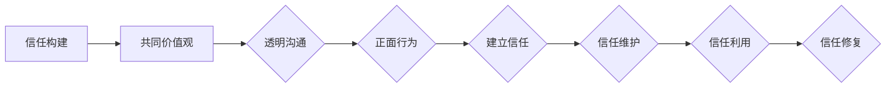

                 


### 《信任经济：建立高效协作的组织基础》

#### 关键词：信任经济、协作、组织基础、高效、信任构建、信任维护、信任破坏

#### 摘要：
随着全球化和信息化的发展，组织间的协作变得越来越复杂。信任经济作为一种新型的组织理论基础，旨在通过建立高效协作的组织基础，提升组织的整体效能。本文将从背景介绍、核心概念与联系、信任经济理论、案例分析、实践应用、组织变革与挑战及未来展望等多个方面，系统性地探讨信任经济的内涵、原理及其在组织中的应用。

#### 目录大纲

##### 第1章 引言
###### 1.1 信任经济的背景与概念
###### 1.2 信任在经济中的重要性
###### 1.3 本书的结构与目标

##### 第2章 核心概念与联系
###### 2.1 信任的定义与属性
###### 2.2 信任与协作
###### 2.3 信任与领导力
###### 2.4 信任与组织文化
###### 2.5 信任的ER实体关系图与概念属性特征对比表格

##### 第3章 信任经济理论
###### 3.1 信任的构建
###### 3.2 信任的维护
###### 3.3 信任的破坏与修复
###### 3.4 信任的经济模型
###### 3.5 信任构建算法mermaid流程图与Python源代码实现

##### 第4章 案例分析
###### 4.1 成功案例分析
###### 4.2 失败案例分析
###### 4.3 信任在组织中的动态变化

##### 第5章 实践应用
###### 5.1 建立信任的策略
###### 5.2 维护信任的方法
###### 5.3 挑战与解决方案
###### 5.4 信任工具与技巧

##### 第6章 组织变革与挑战
###### 6.1 信任经济对组织的变革影响
###### 6.2 领导者在变革中的角色
###### 6.3 持续改进与适应性

##### 第7章 未来展望
###### 7.1 信任经济的发展趋势
###### 7.2 信任经济的未来方向
###### 7.3 组织面临的机遇与挑战

##### 结束语
###### 7.4 最佳实践 tips
###### 7.5 小结
###### 7.6 注意事项
###### 7.7 拓展阅读

### 第1章 引言

#### 1.1 信任经济的背景与概念

随着信息技术的飞速发展，全球化进程的不断加快，组织间的协作越来越频繁。在这种背景下，信任经济作为一种新型的组织理论基础，逐渐受到关注。信任经济强调通过建立和维持信任，来实现组织内部以及组织之间的高效协作。

信任经济并不是一个全新的概念，其根源可以追溯到古典经济学中的信任理论。传统的经济学理论认为，市场是由理性个体组成的，个体之间通过交易实现资源的最优配置。然而，随着信息技术的发展，市场的复杂性增加，个体之间的信息不对称问题愈发严重。在这种环境下，传统的市场机制已无法满足组织间的协作需求，信任经济应运而生。

#### 1.2 信任在经济中的重要性

信任在经济中的作用不可忽视。首先，信任可以降低交易成本。在信任经济中，组织之间通过信任来减少信息收集和验证的成本，从而提高交易效率。其次，信任可以增强合作意愿。在信任经济中，组织之间更愿意进行合作，因为他们相信对方会履行承诺。最后，信任可以提高创新活力。在信任经济中，组织之间可以更自由地分享知识和资源，从而推动创新和发展。

#### 1.3 本书的结构与目标

本书旨在系统地探讨信任经济的内涵、原理及其在组织中的应用。全书共分为七个章节，涵盖了信任经济的背景介绍、核心概念与联系、信任经济理论、案例分析、实践应用、组织变革与挑战及未来展望等内容。通过本书的阅读，读者可以深入了解信任经济的本质，掌握其在组织中的应用方法，从而提升组织的协作效率。

### 第2章 核心概念与联系

#### 2.1 信任的定义与属性

信任是一个复杂的概念，它涉及到多个维度和层面。从广义上讲，信任是指个体或组织对他方行为和意图的信任和依赖。信任具有以下属性：

1. **可靠性**：信任的对方具有履行承诺的能力。
2. **善意**：信任的对方具有善意，愿意为对方着想。
3. **信息透明度**：信任的对方愿意分享信息和资源。
4. **一致性**：信任的对方的行为具有一致性，不会出现反复无常的情况。

#### 2.2 信任与协作

信任是协作的基石。在组织内部，信任可以促进团队成员之间的协作，提高工作效率。在组织之间，信任可以降低合作风险，促进资源的共享和互补。信任与协作的关系可以用以下公式表示：

$$
协作效率 = 信任程度 \times （1 - 信息不对称度）
$$

其中，信息不对称度是影响协作效率的重要因素。在信息不对称度较低的情况下，信任程度越高，协作效率越高。

#### 2.3 信任与领导力

领导力是建立信任的关键。有效的领导者可以通过以下方式建立信任：

1. **树立榜样**：领导者要以身作则，表现出可靠、善意和一致性的行为。
2. **透明沟通**：领导者要主动分享信息，保持沟通的透明度。
3. **授权赋能**：领导者要信任团队成员，给予他们自主决策的权力。

#### 2.4 信任与组织文化

组织文化是信任的土壤。一个重视信任的组织文化可以促进成员之间的信任感，从而提高协作效率。组织文化的建设需要从以下几个方面入手：

1. **价值观共识**：组织要明确价值观，并确保成员对此有共识。
2. **激励机制**：组织要建立激励机制，鼓励成员表现出信任行为。
3. **教育培训**：组织要提供培训和教育，帮助成员理解和实践信任。

#### 2.5 信任的ER实体关系图与概念属性特征对比表格

为了更清晰地理解信任的构成，我们可以使用ER（Entity-Relationship）实体关系图来表示信任的概念。ER图中的实体包括“信任主体”、“信任对象”和“信任关系”。以下是信任的ER实体关系图：

```mermaid
erDiagram
  Trust_Agent ||--|{ Trust_Relationship }|| Trust_Entity
  Trust_Entity ||--|{ Trust_Relationship }|| Trust_Agent
  Trust_Relationship ||--|{ Trust_Attribute }|| Trust_Attribute_Type
  Trust_Attribute ||--|{ Trust_Attribute_Value }|| Trust_Attribute_Type
```

此外，为了更好地理解信任的属性，我们可以使用概念属性特征对比表格。以下是信任属性特征对比表格：

| 属性       | 特征                                       |
| ---------- | ------------------------------------------ |
| 可靠性     | 信任主体能够履行承诺的能力                   |
| 善意       | 信任主体具有的善意，愿意为对方着想             |
| 信息透明度 | 信任主体愿意分享信息和资源的程度               |
| 一致性     | 信任主体行为的稳定性，不会出现反复无常的情况     |

通过ER实体关系图和概念属性特征对比表格，我们可以更清晰地理解信任的构成和属性。

### 第3章 信任经济理论

#### 3.1 信任的构建

信任的构建是信任经济的核心。构建信任需要从以下几个方面入手：

1. **共同价值观**：组织要建立共同的价值观，确保成员对此有共识。
2. **透明沟通**：组织要建立透明沟通机制，确保信息传递的准确性和及时性。
3. **正面行为**：组织成员要表现出正面行为，树立良好的信任形象。
4. **共同目标**：组织要设定共同的目标，确保成员为此共同努力。

#### 3.2 信任的维护

信任的维护是确保信任持续的关键。维护信任需要从以下几个方面入手：

1. **持续沟通**：组织要持续沟通，确保成员之间的信任感保持稳定。
2. **公正对待**：组织要对成员公正对待，避免因不公平行为而损害信任。
3. **适应性调整**：组织要适应外部环境的变化，确保信任关系适应新的情境。
4. **及时反馈**：组织要及时反馈成员的表现，确保成员的信任行为得到认可。

#### 3.3 信任的破坏与修复

信任的破坏是信任经济中常见的问题。信任的破坏可能源于以下几个方面：

1. **信息泄露**：组织成员间的信息泄露可能导致信任的破裂。
2. **不公正对待**：组织对成员的不公正对待可能导致信任的丧失。
3. **负面行为**：组织成员的负面行为可能导致信任的破坏。

信任的修复是恢复信任的重要手段。修复信任需要从以下几个方面入手：

1. **诚实沟通**：组织要诚实沟通，承认错误并承诺改正。
2. **及时纠正**：组织要及时纠正错误，防止信任进一步破裂。
3. **重建信任**：组织要采取措施重建信任，例如提供额外的承诺和保障。
4. **持续改进**：组织要持续改进，确保类似问题不再发生。

#### 3.4 信任的经济模型

信任经济可以用一个简单的模型来表示。该模型包括以下要素：

1. **信任主体**：参与信任经济活动的个体或组织。
2. **信任对象**：信任主体信任的对方。
3. **信任关系**：信任主体与信任对象之间的信任纽带。
4. **信任成本**：建立、维护和修复信任所需的资源。
5. **信任收益**：信任带来的经济效益。

信任经济的运行过程可以简化为以下步骤：

1. **信任构建**：信任主体与信任对象通过共同价值观、透明沟通和正面行为建立信任。
2. **信任维护**：信任主体与信任对象通过持续沟通、公正对待和适应性调整维护信任。
3. **信任利用**：信任主体与信任对象利用信任关系进行合作，实现经济收益。
4. **信任修复**：在信任受到破坏时，信任主体与信任对象采取措施修复信任。

#### 3.5 信任构建算法mermaid流程图与Python源代码实现

为了更好地理解信任构建的过程，我们可以使用mermaid绘制信任构建算法的流程图。以下是信任构建算法的mermaid流程图：



接下来，我们可以使用Python源代码来实现信任构建算法。以下是信任构建算法的Python实现：

```python
# 信任构建算法
def build_trust(values_common, transparent_communication, positive_action):
    # 检查共同价值观
    if values_common:
        print("共同价值观已建立")
    else:
        print("共同价值观未建立，请重新调整")

    # 检查透明沟通
    if transparent_communication:
        print("透明沟通机制已建立")
    else:
        print("透明沟通机制未建立，请重新调整")

    # 检查正面行为
    if positive_action:
        print("正面行为已表现")
    else:
        print("正面行为未表现，请重新调整")

    # 建立信任
    trust = True
    print("信任已建立")

    return trust
```

通过mermaid流程图和Python源代码，我们可以更直观地理解信任构建的过程和实现方法。

### 第4章 案例分析

#### 4.1 成功案例分析

在信任经济理论的应用中，有许多成功的案例。以下是两个典型的成功案例：

**案例一：阿里巴巴集团的信任体系**

阿里巴巴集团通过建立完善的信任体系，实现了对内外部合作伙伴的信任管理。首先，阿里巴巴建立了信用评级体系，对商家和用户的信用进行评级，从而降低交易风险。其次，阿里巴巴通过透明的交易记录和评价机制，提高了交易双方的信任度。最后，阿里巴巴还建立了投诉处理机制，及时解决交易中的纠纷，维护了整体的信任环境。

**案例二：谷歌的开放式创新文化**

谷歌通过开放式创新文化，建立了内部员工和外部合作伙伴之间的信任关系。谷歌鼓励员工自由分享创意和知识，促进了团队之间的协作和创新。同时，谷歌建立了透明的项目管理和评价机制，确保项目的顺利进行和成果的共享。这种信任文化不仅提高了员工的工作满意度，也增强了组织整体的创新能力。

#### 4.2 失败案例分析

尽管信任经济在许多组织中取得了成功，但也有一些组织因为信任问题而失败。以下是两个典型的失败案例：

**案例一：安然公司的信任危机**

安然公司曾经是全球最大的能源企业之一，但其最终因信任危机而破产。安然公司在财务报告中存在大量虚假陈述，导致投资者对其信任度下降。此外，安然公司内部存在严重的利益冲突和道德问题，导致员工对公司的信任度丧失。这些信任问题最终导致了公司的破产。

**案例二：丰田汽车的召回事件**

丰田汽车因多次召回事件而面临信任危机。这些召回事件源于丰田汽车在生产过程中存在质量问题，导致消费者对其产品质量的信任度下降。此外，丰田汽车在处理召回事件时，存在信息不透明和沟通不畅的问题，进一步损害了消费者对丰田汽车的信任。这些信任问题严重影响了丰田汽车的市场声誉。

#### 4.3 信任在组织中的动态变化

信任在组织中是一个动态变化的过程。组织的不同发展阶段，信任的特点和表现也会有所不同。以下是信任在组织中的动态变化：

1. **初创阶段**：在组织的初创阶段，信任主要建立在共同目标和愿景的基础上。组织成员之间的信任程度较高，因为他们共同追求一个共同的目标。
2. **发展阶段**：在组织的发展阶段，信任主要建立在绩效和成果的基础上。组织成员通过绩效和成果来评估彼此的信任程度，信任关系变得更加紧密。
3. **成熟阶段**：在组织的成熟阶段，信任主要建立在长期合作关系的基础上。组织成员之间的信任关系已经形成，他们更关注长期合作和共同发展。
4. **衰退阶段**：在组织的衰退阶段，信任主要建立在危机处理和应对能力的基础上。组织成员在面临危机时，通过危机处理和应对能力来评估彼此的信任程度。

通过分析成功和失败的案例，我们可以看到信任在组织中的重要性。建立和维护信任是组织成功的关键，而信任的破坏可能导致组织的失败。因此，组织需要重视信任的管理，采取有效的措施来建立和维护信任。

### 第5章 实践应用

#### 5.1 建立信任的策略

建立信任是信任经济的核心任务。以下是一些有效的建立信任的策略：

1. **共同价值观**：组织要建立共同的价值观，确保成员对此有共识。这可以通过组织文化建设和价值观宣传来实现。
2. **透明沟通**：组织要建立透明沟通机制，确保信息传递的准确性和及时性。这可以通过定期会议、报告和沟通工具来实现。
3. **正面行为**：组织成员要表现出正面行为，树立良好的信任形象。这可以通过良好的工作表现、诚信行为和团队合作来实现。
4. **共同目标**：组织要设定共同的目标，确保成员为此共同努力。这可以通过目标设定、绩效管理和团队协作来实现。

#### 5.2 维护信任的方法

维护信任是确保信任持续的关键。以下是一些有效的维护信任的方法：

1. **持续沟通**：组织要持续沟通，确保成员之间的信任感保持稳定。这可以通过定期交流、沟通培训和团队建设来实现。
2. **公正对待**：组织要对成员公正对待，避免因不公平行为而损害信任。这可以通过公正的绩效评估、奖励和惩罚机制来实现。
3. **适应性调整**：组织要适应外部环境的变化，确保信任关系适应新的情境。这可以通过灵活的管理策略、持续改进和变革管理来实现。
4. **及时反馈**：组织要及时反馈成员的表现，确保成员的信任行为得到认可。这可以通过实时反馈、评价和奖励来实现。

#### 5.3 挑战与解决方案

在建立和维护信任的过程中，组织可能会面临一系列挑战。以下是一些常见的挑战及相应的解决方案：

1. **信息不对称**：信息不对称可能导致信任破裂。解决方案是建立透明沟通机制，确保信息的准确传递。
2. **利益冲突**：利益冲突可能导致信任丧失。解决方案是建立公正的绩效评估和奖励机制，确保利益分配的公平性。
3. **文化差异**：文化差异可能导致信任问题。解决方案是加强文化融合，建立共同价值观，促进团队合作。
4. **领导力不足**：领导力不足可能导致信任管理失效。解决方案是加强领导力培训，提升领导者的信任管理能力。

#### 5.4 信任工具与技巧

为了更好地建立和维护信任，组织可以采用一些信任工具和技巧。以下是一些常用的工具和技巧：

1. **信任评估工具**：组织可以采用信任评估工具来评估成员之间的信任程度。这些工具包括问卷调查、访谈和反馈机制。
2. **信任培训课程**：组织可以提供信任培训课程，帮助成员了解信任的重要性，学习建立和维护信任的方法。
3. **透明沟通工具**：组织可以采用透明沟通工具，如即时通讯软件、会议视频和在线协作平台，确保信息的及时传递和共享。
4. **信任奖励机制**：组织可以建立信任奖励机制，对表现出信任行为的成员进行奖励，以激励更多成员建立和维护信任。

通过这些策略、方法和工具，组织可以有效地建立和维护信任，从而实现高效协作。

### 第6章 组织变革与挑战

#### 6.1 信任经济对组织的变革影响

信任经济对组织的变革影响深远。首先，信任经济改变了组织的运营模式。传统的组织运营模式依赖于严格的控制和监督，而信任经济强调自主和合作，减少了控制和监督的成本。其次，信任经济改变了组织的组织结构。在信任经济中，组织更加扁平化，决策过程更加民主化，成员之间的协作更加紧密。最后，信任经济改变了组织的管理方式。传统的管理方式依赖于权威和命令，而信任经济强调领导者的示范作用和团队协作，管理方式更加人性化。

#### 6.2 领导者在变革中的角色

领导者在信任经济中的角色至关重要。首先，领导者是信任的示范者。领导者要通过自己的行为树立信任的榜样，表现出可靠性、善意和一致性。其次，领导者是信任的推动者。领导者要推动组织内部的信任文化建设，建立透明沟通机制，鼓励成员之间的信任行为。最后，领导者是信任的调解者。当组织内部出现信任危机时，领导者要能够及时调解，维护组织的信任环境。

#### 6.3 持续改进与适应性

在信任经济中，持续改进和适应性是组织成功的关键。首先，组织要建立持续改进机制，通过定期评估和反馈，不断优化运营流程和协作方式。其次，组织要具备适应性，能够快速响应外部环境的变化，调整战略和策略。最后，组织要培养成员的创新能力，鼓励他们提出新的想法和建议，推动组织的持续发展。

### 第7章 未来展望

#### 7.1 信任经济的发展趋势

随着全球化和信息化的不断深入，信任经济将在未来得到更广泛的应用。首先，信任经济将推动组织运营模式的变革，减少控制和监督成本，提高协作效率。其次，信任经济将促进组织结构的优化，实现扁平化和民主化。最后，信任经济将推动管理方式的变革，强调领导者的示范作用和团队协作。

#### 7.2 信任经济的未来方向

信任经济的未来方向包括以下几个方面：

1. **智能化**：随着人工智能技术的发展，信任经济将更加智能化。组织可以通过智能算法和数据分析，更准确地评估和建立信任。
2. **网络化**：信任经济将更加网络化，组织之间的协作将更加紧密。通过互联网和云计算，组织可以实时共享信息和资源，实现更高效的协作。
3. **全球化**：信任经济将推动全球化的进程，组织将能够在全球范围内建立信任关系，实现跨国合作和资源整合。
4. **个性化**：信任经济将更加个性化，组织将能够根据成员的特点和需求，提供个性化的信任管理服务。

#### 7.3 组织面临的机遇与挑战

随着信任经济的发展，组织将面临一系列机遇和挑战：

1. **机遇**：
   - 提高协作效率，降低运营成本。
   - 促进创新和持续改进。
   - 拓展全球市场，实现国际化发展。

2. **挑战**：
   - 建立和维护信任的难度增加。
   - 面临外部环境的不确定性和风险。
   - 需要适应新的管理方式和组织结构。

组织需要积极应对这些机遇和挑战，通过有效的信任管理，实现组织的持续发展和成功。

### 结束语

信任经济作为一种新型的组织理论基础，具有广阔的应用前景。通过建立和维持信任，组织可以实现高效协作，提高整体效能。本文系统地探讨了信任经济的核心概念、理论基础、实践应用、组织变革和未来展望，为组织管理者提供了有益的参考。

### 最佳实践 tips

1. **建立共同价值观**：组织要明确共同的价值观，确保成员对此有共识。
2. **透明沟通**：建立透明沟通机制，确保信息的准确传递。
3. **正面行为**：成员要表现出正面行为，树立良好的信任形象。
4. **持续改进**：建立持续改进机制，不断优化运营流程和协作方式。

### 小结

信任经济作为一种新型的组织理论基础，对组织的协作效率和效能提升具有重要意义。通过建立和维持信任，组织可以实现高效协作，降低运营成本，提高创新能力。

### 注意事项

1. **重视信任的建立**：信任的建立需要时间和努力，组织要持之以恒。
2. **透明沟通**：建立透明沟通机制，确保信息的准确传递。
3. **公正对待**：对成员要公正对待，避免因不公平行为而损害信任。

### 拓展阅读

1. **《信任机制：组织协作的基础》**：深入了解信任在组织协作中的重要性。
2. **《信任经济学》**：探讨信任在经济活动中的角色和作用。
3. **《信任管理》**：提供关于如何建立和维护信任的具体方法和策略。

### 作者

作者：AI天才研究院/AI Genius Institute & 禅与计算机程序设计艺术 /Zen And The Art of Computer Programming

