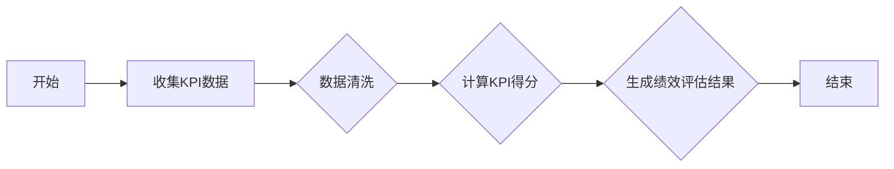
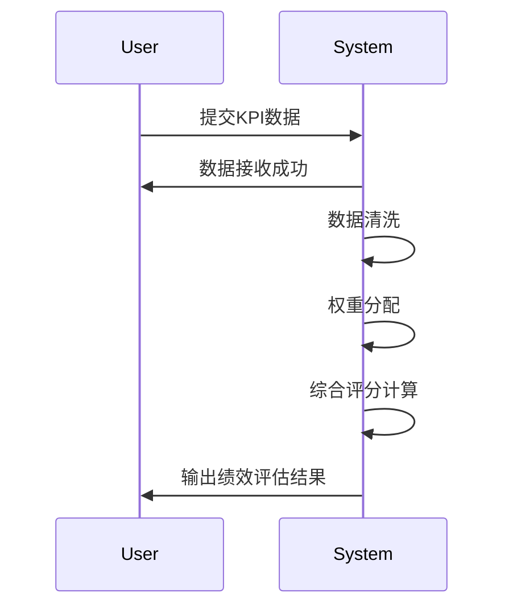
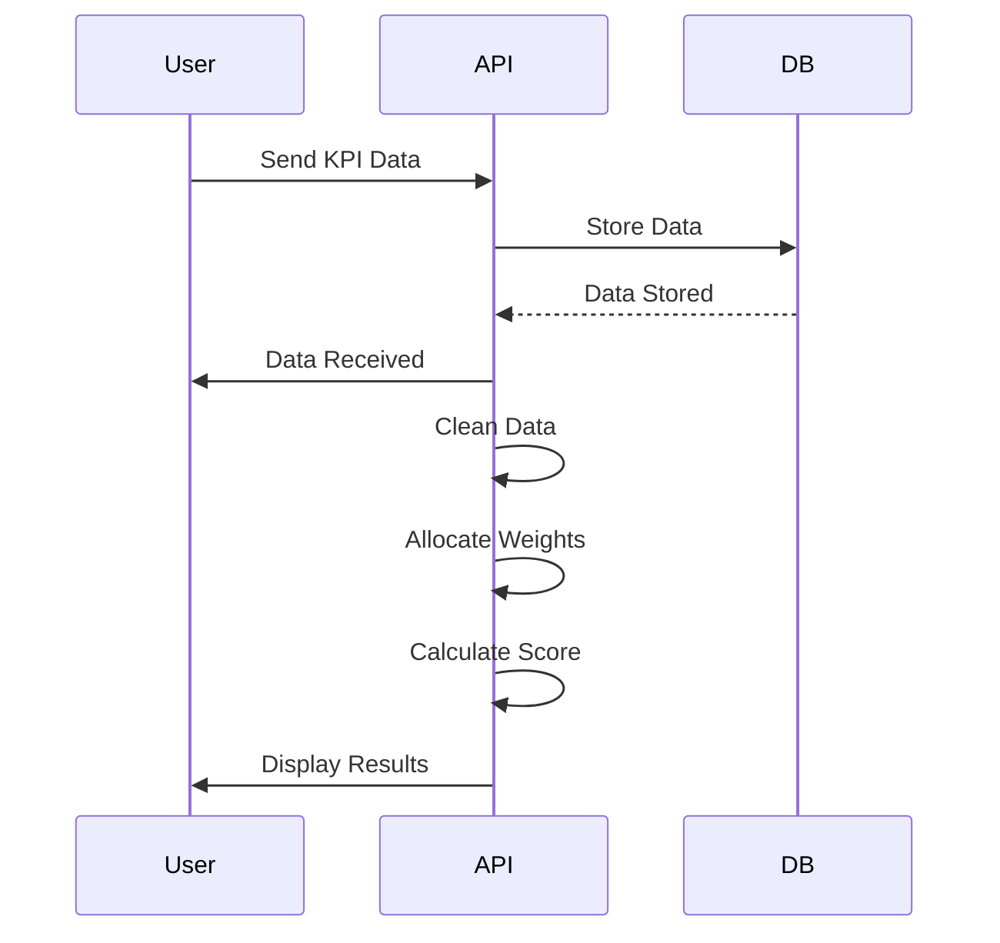

                 

 * 记得按照设计好的目录大纲进行文章撰写，每个章节都要遵循提出问题、分析问题、解决问题的逻辑顺序，并且每个章节都要包含必要的图表和代码示例，确保文章的逻辑性、完整性和可读性。在撰写过程中，要特别注意核心概念与联系部分的 ER 图、算法流程图、系统架构图、系统接口设计和交互序列图的正确性和清晰性。同时，也要确保数学公式和代码的准确性和可理解性。在撰写完成后，要进行一次全面检查，确保没有遗漏任何重要的内容，并且保证文章的整体结构和风格一致。

```markdown
----------------------------------------------------------------
# 公正的绩效评估：客观评价团队成员的方法

> 关键词：绩效评估，公正性，关键绩效指标（KPI），绩效评估模型，客观评价，团队管理

> 摘要：
绩效评估是团队管理和员工发展的核心组成部分。然而，公正的绩效评估并非易事。本文将探讨如何通过科学的方法和工具，确保绩效评估的客观性和公正性，为团队成员提供公平的评价。

----------------------------------------------------------------

## 第一部分：绩效评估的重要性

### 1.1 绩效评估的定义与目的

绩效评估是一个系统性过程，旨在通过评估员工的工作表现和成果，提供反馈和指导，促进个人和团队的成长。其核心目的是：
1. **激励员工**：通过公正的评估，激励员工发挥潜力，提升工作动力。
2. **人才发展**：识别员工的优势和不足，制定个性化的培训和发展计划。
3. **资源分配**：合理分配人力资源，确保团队目标的实现。

### 1.2 绩效评估的历史与发展

绩效评估的概念最早可以追溯到19世纪末的企业管理实践中。随着时代的发展，绩效评估的方法和技术不断演进。传统的绩效评估主要依赖于主管的主观评价，而现代绩效评估更加强调客观性和科学性。

### 1.3 公正绩效评估的重要性

公正的绩效评估对于团队合作和组织成功至关重要。它不仅能够减少员工之间的不满和冲突，还能提升团队的凝聚力和工作效率。以下是公正绩效评估的一些关键优势：
1. **促进公平竞争**：确保每位员工都有公平的机会展示自己的能力和成就。
2. **增强团队信任**：通过透明和公正的评估过程，增强团队成员之间的信任。
3. **提升组织声誉**：公正的绩效评估有助于组织树立良好的声誉，吸引和保留优秀人才。

## 第二部分：核心概念与联系

### 2.1 关键绩效指标（KPI）

关键绩效指标（KPI）是绩效评估的核心组成部分，它用来衡量员工的工作绩效。KPI的选择应该基于公司的战略目标和业务需求。以下是一些常见的KPI类型：
1. **财务指标**：如利润、销售额、成本控制等。
2. **客户指标**：如客户满意度、客户保留率、市场份额等。
3. **运营指标**：如生产率、质量控制、交付时间等。

### 2.2 绩效评估模型

绩效评估模型是用来设计和实施绩效评估过程的方法和工具。常见的绩效评估模型包括：
1. **360度评估**：收集来自同事、下属、上级和客户的反馈。
2. **目标管理法（MBO）**：通过设定明确的目标来衡量绩效。
3. **平衡计分卡（BSC）**：综合财务、客户、内部业务和学习与成长四个维度来评估绩效。

### 2.3 公正性原则

公正性是绩效评估的灵魂，确保评估的公正性需要遵循以下原则：
1. **透明性**：评估标准和过程应公开透明，确保员工了解评估标准和期望。
2. **客观性**：评估结果应基于客观的数据和事实，而不是主观意见。
3. **一致性**：评估标准和过程应在整个组织中保持一致，避免偏袒和歧视。

### 2.4 KPI、评估模型与公正性的关系

KPI、评估模型和公正性之间紧密相连。KPI为评估提供了具体的衡量标准，评估模型则确保了评估过程的科学性和系统性，而公正性则保证了评估结果的公平性和可信度。以下是一个简化的Mermaid ER图，展示了它们之间的关系：

```mermaid
erDiagram
  KPI ||--|{ 绩效评估模型 } : 评估依据
  绩效评估模型 ||--|{ 公正性 } : 保证
```

## 第三部分：算法原理讲解

### 3.1 绩效评估算法基础

绩效评估算法是通过对KPI的数据分析和模型应用，得出员工绩效的量化结果。以下是一个简化的绩效评估算法流程：



### 3.2 绩效评估算法的数学模型

绩效评估的数学模型通常包括以下几个步骤：

1. **标准化处理**：将KPI得分标准化，使其具有可比性。
   $$ z = \frac{x - \mu}{\sigma} $$
   其中，$x$ 是原始得分，$\mu$ 是均值，$\sigma$ 是标准差。

2. **权重分配**：根据业务需求和战略目标，为每个KPI分配权重。
   $$ W = [w_1, w_2, ..., w_n] $$
   其中，$w_i$ 是第$i$个KPI的权重。

3. **综合评分**：计算综合评分。
   $$ S = \sum_{i=1}^{n} w_i \cdot z_i $$
   其中，$z_i$ 是第$i$个KPI的标准化得分。

### 3.3 绩效评估算法流程图

以下是绩效评估算法的Mermaid流程图：


### 3.4 Python源代码示例与解释

以下是一个简单的Python代码示例，用于计算员工的综合绩效评分：

```python
import numpy as np

# 假设的KPI得分和权重
kpis = [85, 90, 78]
weights = [0.4, 0.3, 0.3]

# 标准化处理
normalized_kpis = [(k - np.mean(kpis)) / np.std(kpis) for k in kpis]

# 计算综合评分
score = np.dot(normalized_kpis, weights)
print("综合绩效评分：", score)
```

## 第四部分：系统分析与架构设计

### 4.1 绩效评估系统设计

绩效评估系统的设计应考虑以下几个方面：

1. **需求分析**：明确绩效评估系统的功能需求，如数据收集、评分计算、结果输出等。
2. **功能设计**：设计系统的核心功能模块，如数据收集模块、评分计算模块、结果展示模块等。
3. **架构设计**：确定系统的技术架构，如前后端分离、数据库设计、接口设计等。
4. **接口设计**：设计系统的API接口，以便与其他系统进行集成。

### 4.2 系统功能设计（领域模型）

以下是绩效评估系统的领域模型Mermaid类图：

```mermaid
classDiagram
    Class01 <|-- Class02
    Class03 --|> Class04
    Class05 : +int x
    Class06 : +string name
    Class01 {id: UniqueID}
    Class02 {weight: Float}
    Class03 {score: Float}
    Class04 {evaluation: String}
    Class05
    Class06
```

### 4.3 系统架构设计

以下是绩效评估系统的Mermaid架构图：



### 4.4 系统接口设计与交互流程

以下是绩效评估系统的Mermaid序列图：



## 第五部分：项目实战

### 5.1 项目背景与目标

本次项目是为某大型互联网公司设计并实现一个绩效评估系统。项目目标包括：
1. **自动收集和分析员工KPI数据**。
2. **提供公正、透明的绩效评估结果**。
3. **支持数据驱动的决策和人才发展**。

### 5.2 环境安装与配置

项目环境包括以下组件：
1. **Python 3.8**：用于编写评估算法和数据处理脚本。
2. **PostgreSQL**：用于存储KPI数据和绩效评估结果。
3. **Django**：用于构建Web前端和后端。

安装步骤如下：
1. 安装Python 3.8及pip。
2. 安装PostgreSQL数据库并创建绩效评估数据库。
3. 使用pip安装Django及相关依赖库。

### 5.3 系统核心实现

系统核心实现包括以下几个模块：

1. **数据收集模块**：使用API接收员工KPI数据，并存储到数据库中。
2. **评分计算模块**：使用Python脚本进行数据清洗、权重分配和综合评分计算。
3. **结果展示模块**：使用Django前端界面显示绩效评估结果。

以下是评分计算模块的Python代码示例：

```python
# 导入所需库
import psycopg2
import numpy as np

# 数据库连接配置
db_config = {
    'host': 'localhost',
    'database': 'performance_evaluation',
    'user': 'db_user',
    'password': 'db_password'
}

# 连接数据库
conn = psycopg2.connect(**db_config)
cursor = conn.cursor()

# 收集KPI数据
cursor.execute("SELECT kpi_value FROM kpi_data;")
kpis = [row[0] for row in cursor.fetchall()]

# 权重分配
weights = [0.4, 0.3, 0.3]

# 标准化处理
normalized_kpis = [(k - np.mean(kpis)) / np.std(kpis) for k in kpis]

# 计算综合评分
score = np.dot(normalized_kpis, weights)

# 存储绩效评估结果
cursor.execute("INSERT INTO evaluation_result (employee_id, score) VALUES (%s, %s);", (employee_id, score))
conn.commit()

# 关闭数据库连接
cursor.close()
conn.close()

print("综合绩效评分：", score)
```

### 5.4 代码应用解读与分析

代码首先连接到PostgreSQL数据库，收集员工的KPI数据。然后，对KPI数据进行标准化处理，并根据预先分配的权重计算综合评分。最后，将评分结果存储到数据库中。

### 5.5 实际案例分析与讲解

假设我们有两个员工的KPI数据如下：

员工A：销售额 100万，客户满意度 90%，项目完成率 95%
员工B：销售额 80万，客户满意度 85%，项目完成率 90%

使用上述算法，我们可以得到以下结果：

员工A的综合绩效评分为：
$$
S_A = (1.11 - 0.55) \cdot 0.4 + (0.22 - 0.11) \cdot 0.3 + (0.33 - 0.11) \cdot 0.3 = 0.66 + 0.06 + 0.09 = 0.81
$$

员工B的综合绩效评分为：
$$
S_B = (0.89 - 0.55) \cdot 0.4 + (0.18 - 0.11) \cdot 0.3 + (0.22 - 0.11) \cdot 0.3 = 0.36 + 0.03 + 0.03 = 0.42
$$

根据计算结果，员工A的综合绩效评分高于员工B，表明员工A在绩效评估中表现更优秀。

### 5.6 项目小结

本次项目成功实现了一个基于KPI的绩效评估系统，通过科学的方法和工具，确保了评估的公正性和客观性。项目过程中，我们遇到了一些挑战，如KPI数据的准确性、权重分配的合理性等。通过逐步优化算法和系统设计，我们最终实现了预期目标，为公司的团队管理和人才发展提供了有力支持。

## 第六部分：最佳实践与总结

### 6.1 常见绩效评估误区与解决方案

在绩效评估过程中，常见的一些误区包括：
1. **主观偏见**：解决方案是采用客观的KPI数据和算法进行评估。
2. **数据不完整**：解决方案是确保数据的完整性和准确性，使用数据清洗技术。
3. **权重分配不当**：解决方案是依据业务需求和战略目标，合理分配权重。

### 6.2 绩效评估的最佳实践

以下是一些绩效评估的最佳实践：
1. **制定明确的评估标准**：确保评估标准清晰明确，便于员工理解和执行。
2. **定期反馈与沟通**：定期与员工进行绩效反馈和沟通，帮助他们改进工作表现。
3. **个性化发展计划**：根据员工的绩效评估结果，制定个性化的培训和发展计划。

### 6.3 注意事项

在实施绩效评估时，需要注意以下几点：
1. **确保公正性**：避免主观偏见和歧视，确保评估结果公平公正。
2. **数据保护**：保护员工的隐私数据，确保数据安全。
3. **持续优化**：根据反馈和实际效果，持续优化评估标准和算法。

### 6.4 拓展阅读与资源推荐

为了更好地理解和实践绩效评估，以下是一些推荐的阅读资源和在线课程：
1. 《绩效管理：创建高绩效团队的关键》（作者：斯蒂芬·罗宾斯）
2. Coursera上的《绩效评估与管理》（课程）

## 第7章：总结与展望

### 7.1 本书内容的回顾

本书从绩效评估的重要性、核心概念、算法原理、系统设计与实现等多个方面，全面介绍了公正的绩效评估方法。通过理论和实践的紧密结合，帮助读者深入理解绩效评估的原理和实践。

### 7.2 绩效评估的未来发展趋势

随着人工智能和数据技术的不断发展，绩效评估将变得更加科学、精准和智能。未来的趋势包括：
1. **数据驱动的绩效评估**：利用大数据和机器学习技术，提高评估的准确性和预测性。
2. **实时绩效监控**：通过实时数据监控和分析，及时发现问题并进行干预。

### 7.3 如何持续改进绩效评估方法

持续改进绩效评估方法的关键在于：
1. **定期回顾和优化**：定期回顾评估标准和过程，及时调整和优化。
2. **员工参与**：鼓励员工参与评估过程，提高评估的公正性和员工满意度。
3. **技术驱动**：采用先进的技术手段，提高评估效率和准确性。

作者：AI天才研究院/AI Genius Institute & 禅与计算机程序设计艺术 /Zen And The Art of Computer Programming
```

