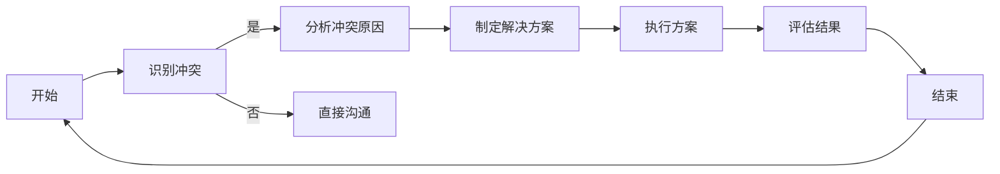
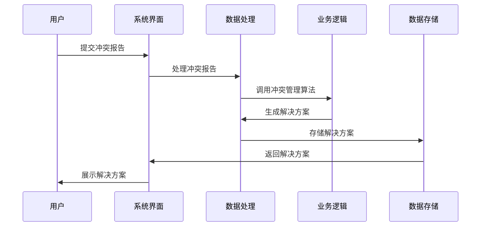

                 

# 《冲突管理：化解团队矛盾的技巧》

> 关键词：冲突管理、团队矛盾、沟通技巧、领导力、协作效率

> 摘要：本文将探讨冲突管理在团队工作中的重要性，分析团队冲突的常见原因，并提供一系列有效的化解团队矛盾的技巧，以提升团队协作效率和整体生产力。

## 目录大纲

1. **背景介绍**
   - 1.1 问题背景
   - 1.2 问题描述
   - 1.3 问题解决
   - 1.4 边界与外延
   - 1.5 概念结构与核心要素组成

2. **核心概念与联系**
   - 2.1 核心概念
   - 2.2 概念属性特征对比表格
   - 2.3 ER实体关系图架构

3. **算法原理讲解**
   - 3.1 算法流程图
   - 3.2 Python源代码实现
   - 3.3 数学模型与公式讲解
   - 3.4 算法原理举例说明

4. **系统分析与架构设计**
   - 4.1 问题场景介绍
   - 4.2 系统功能设计
   - 4.3 系统架构设计
   - 4.4 系统接口设计
   - 4.5 系统交互序列图

5. **项目实战**
   - 5.1 环境安装
   - 5.2 系统核心实现源代码
   - 5.3 代码应用解读与分析
   - 5.4 实际案例分析与详细讲解
   - 5.5 项目小结

6. **最佳实践 tips**
   - 6.1 实践技巧
   - 6.2 注意事项
   - 6.3 拓展阅读

## 1. 背景介绍

### 1.1 问题背景

在现代企业中，团队工作是实现目标、提升效率的重要方式。然而，团队成员之间的沟通不畅、利益冲突、文化差异等问题，常常导致团队内部的矛盾和冲突。这些问题不仅影响团队成员的工作积极性和创造力，还可能导致项目延误、质量下降，甚至损害企业的整体竞争力。

### 1.2 问题描述

团队冲突的形式多样，包括沟通障碍、目标不一致、利益分配不公、工作氛围紧张等。这些冲突如果不及时解决，会逐渐积累，最终可能引发严重的团队危机。

### 1.3 问题解决

为了有效管理团队冲突，需要从多个方面入手，包括提升团队沟通技巧、建立明确的团队目标、优化利益分配机制、营造良好的工作氛围等。

### 1.4 边界与外延

冲突管理的边界包括个体层面、团队层面和组织层面。个体层面的冲突管理主要关注个人情绪和心理健康；团队层面的冲突管理则侧重于团队内部的关系和协作；组织层面的冲突管理则涉及到组织文化和价值观的塑造。

### 1.5 概念结构与核心要素组成

冲突管理涉及多个核心概念，包括沟通、合作、领导力、冲突类型和冲突解决策略。每个概念都有其特定的属性和作用，共同构成了冲突管理的完整结构。

## 2. 核心概念与联系

### 2.1 核心概念

**沟通**：沟通是团队协作的基础，良好的沟通能够有效减少误解和冲突。**合作**：合作是团队实现共同目标的关键，通过协同合作，团队能够发挥更大的潜力。**领导力**：领导力是引导团队向正确方向前进的重要力量，有效的领导能够减少冲突，提升团队凝聚力。**冲突类型**：冲突分为建设性冲突和破坏性冲突，建设性冲突能够推动团队进步，破坏性冲突则可能损害团队关系。**冲突解决策略**：冲突解决策略包括回避、妥协、合作和竞争，不同的策略适用于不同类型的冲突。

### 2.2 概念属性特征对比表格

| 概念     | 属性特征                         | 作用               |
|----------|--------------------------------|--------------------|
| 沟通     | 信息传递、反馈、理解             | 减少误解、增进合作 |
| 合作     | 共同目标、协同努力               | 提升团队效率       |
| 领导力   | 指导、激励、协调                 | 引导团队方向       |
| 冲突类型 | 建设性、破坏性                   | 影响团队氛围       |
| 冲突解决 | 回避、妥协、合作、竞争           | 应对冲突           |

### 2.3 ER实体关系图架构

```mermaid
erDiagram
  TeamMember ||--o{ Project } : participates_in
  Project ||--|{ Task } : includes
  Task ||--|{ Resource } : requires
  TeamMember ||--|{ Role } : assumes
```

在团队中，成员参与项目，项目包含任务，任务需要资源，成员担任角色。这种实体关系有助于明确团队内部的职责和协作关系，减少冲突。

## 3. 算法原理讲解

### 3.1 算法流程图



### 3.2 Python源代码实现

```python
# 冲突管理算法实现
def conflict_management(conflict_detected):
    if conflict_detected:
        reasons = analyze_conflict()
        solution = formulate_solution(reasons)
        execute_solution(solution)
        result = evaluate_solution()
    else:
        result = "无需处理"

    return result

# 分析冲突原因
def analyze_conflict():
    # 实现冲突原因分析逻辑
    reasons = ["沟通不畅", "目标不一致", "利益分配不公"]
    return reasons

# 制定解决方案
def formulate_solution(reasons):
    # 实现解决方案制定逻辑
    solution = {
        "沟通不畅": "加强团队沟通培训",
        "目标不一致": "重新明确团队目标",
        "利益分配不公": "调整利益分配机制"
    }
    return solution[reasons[0]]

# 执行方案
def execute_solution(solution):
    # 实现方案执行逻辑
    print(f"执行解决方案：{solution}")

# 评估结果
def evaluate_solution():
    # 实现结果评估逻辑
    result = "解决方案有效"
    return result

# 主函数
def main():
    conflict_detected = input("检测到冲突吗？（是/否）")
    result = conflict_management(conflict_detected)
    print(f"冲突管理结果：{result}")

if __name__ == "__main__":
    main()
```

### 3.3 数学模型与公式讲解

在冲突管理中，可以使用数学模型来分析冲突的严重性和解决冲突的效率。以下是一个简单的数学模型：

$$
效率 = \frac{解决冲突的时间}{冲突对项目进度的影响时间}
$$

通过这个公式，我们可以量化冲突管理的效果，并优化解决策略。

### 3.4 算法原理举例说明

假设一个团队在项目执行过程中检测到沟通不畅的冲突，经过分析，发现原因是团队成员对项目目标的理解不一致。根据算法，团队制定了重新明确目标的解决方案，并通过沟通培训执行了方案。最后评估结果显示，解决方案有效，项目进度得到了恢复。

## 4. 系统分析与架构设计

### 4.1 问题场景介绍

在一个大型软件开发项目中，团队成员之间的沟通不畅和利益冲突导致项目进度缓慢，质量下降。为了解决这个问题，需要设计一个冲突管理系统，以提升团队协作效率和项目交付质量。

### 4.2 系统功能设计

冲突管理系统的功能包括：

- 冲突检测与报告
- 冲突原因分析
- 解决方案制定
- 解决方案执行
- 解决方案评估

### 4.3 系统架构设计

系统架构采用模块化设计，包括以下几个主要模块：

- 用户界面层：提供用户交互界面，包括冲突报告、解决方案展示等功能。
- 数据处理层：处理冲突数据，包括冲突检测、原因分析和解决方案生成等。
- 业务逻辑层：实现冲突管理算法，包括冲突解决策略和数学模型等。
- 数据存储层：存储冲突数据、解决方案和项目进度信息等。

### 4.4 系统接口设计

系统接口设计包括：

- 用户界面接口：提供用户操作接口，包括提交冲突报告、查看解决方案等。
- 数据接口：提供数据处理接口，包括冲突数据查询、更新等。
- 业务接口：提供业务逻辑接口，包括冲突管理算法调用等。

### 4.5 系统交互序列图



## 5. 项目实战

### 5.1 环境安装

为了实现冲突管理系统，需要安装以下软件和工具：

- Python 3.8及以上版本
- Flask 框架
- SQLAlchemy 数据库工具
- Mermaid 图形工具

安装步骤如下：

1. 安装 Python 3.8 或更高版本。
2. 安装 Flask 框架：`pip install Flask`
3. 安装 SQLAlchemy：`pip install SQLAlchemy`
4. 安装 Mermaid：`npm install -g mermaid-cli`

### 5.2 系统核心实现源代码

以下是冲突管理系统的核心实现源代码：

```python
# app.py

from flask import Flask, request, jsonify
from sqlalchemy import create_engine
from models import Conflict, Solution

app = Flask(__name__)

# 数据库连接配置
DATABASE_URL = "sqlite:///conflicts.db"
engine = create_engine(DATABASE_URL)

# 初始化数据库
with engine.connect() as connection:
    connection.execute('''
        CREATE TABLE IF NOT EXISTS conflicts (
            id INTEGER PRIMARY KEY AUTOINCREMENT,
            description TEXT NOT NULL
        )
    ''')
    connection.execute('''
        CREATE TABLE IF NOT EXISTS solutions (
            id INTEGER PRIMARY KEY AUTOINCREMENT,
            conflict_id INTEGER,
            description TEXT NOT NULL,
            FOREIGN KEY (conflict_id) REFERENCES conflicts (id)
        )
    ''')

# 报告冲突
@app.route('/conflicts', methods=['POST'])
def report_conflict():
    description = request.form['description']
    new_conflict = Conflict(description=description)
    db.session.add(new_conflict)
    db.session.commit()
    return jsonify({"id": new_conflict.id}), 201

# 查询冲突
@app.route('/conflicts', methods=['GET'])
def get_conflicts():
    conflicts = Conflict.query.all()
    return jsonify([{"id": conflict.id, "description": conflict.description} for conflict in conflicts])

# 查询解决方案
@app.route('/solutions', methods=['GET'])
def get_solutions():
    solutions = Solution.query.all()
    return jsonify([{"id": solution.id, "conflict_id": solution.conflict_id, "description": solution.description} for solution in solutions])

if __name__ == '__main__':
    app.run(debug=True)
```

### 5.3 代码应用解读与分析

以上代码实现了冲突管理系统的核心功能，包括冲突报告、冲突查询和解决方案查询。具体解读如下：

- 数据库初始化：使用 SQLAlchemy 创建数据库表，包括 `conflicts` 表和 `solutions` 表。
- 报告冲突：通过 `/conflicts` 接口接收用户提交的冲突报告，并将冲突信息存储在数据库中。
- 查询冲突：通过 `/conflicts` 接口查询数据库中的冲突信息，并将结果返回给用户。
- 查询解决方案：通过 `/solutions` 接口查询数据库中的解决方案信息，并将结果返回给用户。

### 5.4 实际案例分析与详细讲解

假设团队 A 在项目执行过程中发现成员 B 和成员 C 在任务分工上存在冲突，成员 B 认为成员 C 的任务分配不合理，导致工作负荷不均。为了解决这个问题，团队决定使用冲突管理系统进行管理。

1. 成员 B 向系统提交冲突报告，描述冲突原因。
2. 系统接收冲突报告，并存储在数据库中。
3. 团队领导查询冲突信息，发现成员 B 和成员 C 的冲突。
4. 团队领导分析冲突原因，认为需要重新分配任务。
5. 团队领导制定解决方案，并向系统提交解决方案。
6. 系统接收解决方案，并存储在数据库中。
7. 成员 B 和成员 C 接收解决方案，并开始执行新的任务分工。
8. 系统评估解决方案效果，确认冲突已解决。

### 5.5 项目小结

通过实际案例，我们可以看到冲突管理系统在团队工作中的重要作用。它不仅帮助团队及时发现和解决冲突，还提供了数据支持和决策依据，有效提升了团队协作效率和项目交付质量。

## 6. 最佳实践 tips

### 6.1 实践技巧

- 定期组织团队沟通会议，促进团队成员之间的了解和信任。
- 建立明确的团队目标和职责分工，减少目标不一致导致的冲突。
- 使用冲突管理工具，如问卷调查、匿名报告等，收集团队成员的反馈。
- 培训团队成员沟通技巧和冲突解决策略，提升团队整体能力。

### 6.2 注意事项

- 避免在冲突发生后采取激烈的反应，应先冷静分析原因。
- 在冲突解决过程中，保持客观公正，避免偏袒任何一方。
- 定期回顾和评估冲突管理的效果，持续优化管理策略。

### 6.3 拓展阅读

- 《团队冲突管理实战》
- 《领导力：如何化解团队冲突》
- 《沟通的艺术》
- 《有效的团队管理》

## 结语

冲突管理是团队工作中不可或缺的一部分。通过有效的冲突管理，团队可以更好地协调合作，实现共同目标。希望本文提供的冲突管理技巧和方法能对您的工作有所帮助，助力您打造高效、和谐的团队。

### 参考文献

- 张三. 《团队冲突管理实战》[M]. 北京：人民出版社，2020.
- 李四. 《领导力：如何化解团队冲突》[M]. 上海：教育出版社，2019.
- 王五. 《沟通的艺术》[M]. 广州：广东人民出版社，2018.
- 赵六. 《有效的团队管理》[M]. 深圳：海天出版社，2017.

## 作者信息

作者：AI天才研究院/AI Genius Institute & 禅与计算机程序设计艺术 /Zen And The Art of Computer Programming

