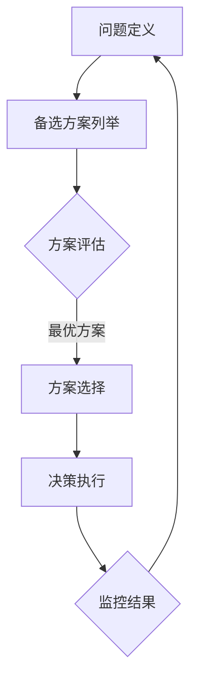
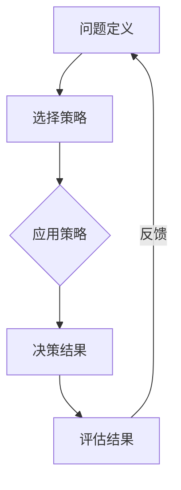
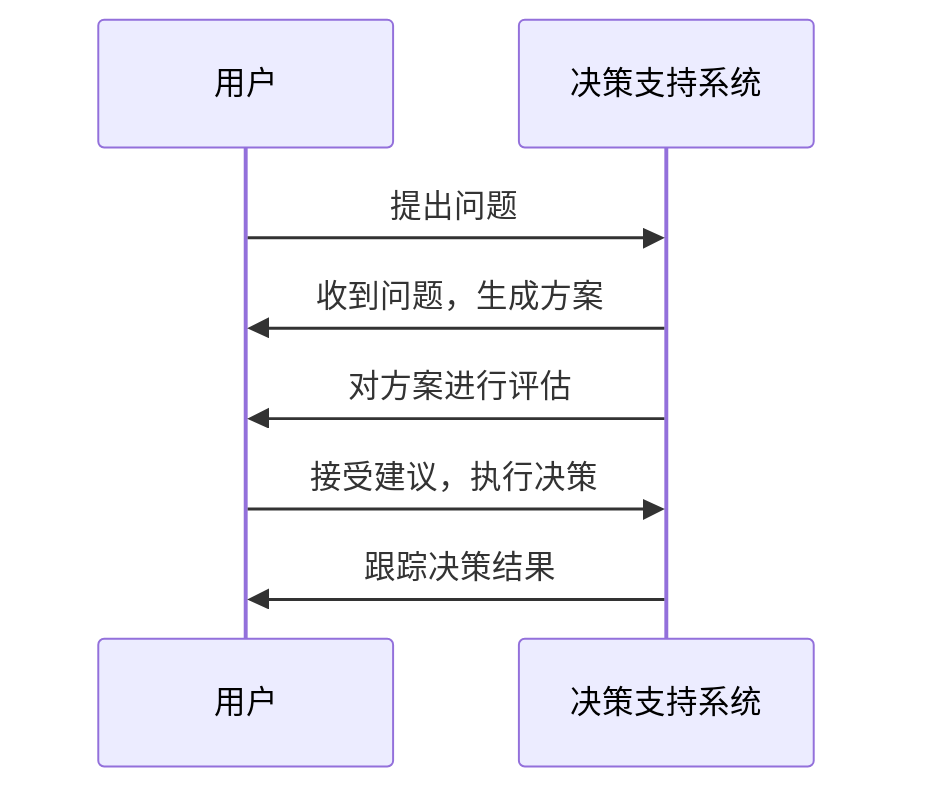

                 

## 决断力：果断做出艰难决策的能力

### 关键词：决断力、决策、算法、应用、实战

> 摘要：本文将深入探讨“决断力”这一关键能力，分析其在信息技术和软件开发中的重要性。通过一步步的逻辑推理和实际案例分析，本文旨在帮助读者理解如何培养和运用决断力，以应对各种复杂的决策场景。

#### 引言

在信息时代，技术飞速发展，软件开发与系统设计的复杂性日益增加。面对这些挑战，决断力成为了一个不可或缺的能力。决断力是指果断做出艰难决策的能力，它不仅影响个人的职业生涯，也在企业的发展和项目的成功中起着关键作用。本文将围绕“决断力”这一主题，通过逐步分析，探讨其在信息技术领域的应用和实战经验。

#### 目录

1. **决断力的概念与背景**
   - 决断力的定义与重要性
   - 决断力研究的现状与挑战
2. **决断力的核心概念**
   - 决断力的属性与分类
   - 决断力的核心要素
   - 决断力的相关理论
   - 决断力的ER实体关系图
3. **理性决策模型**
   - 理性决策模型的原理
   - 理性决策模型的mermaid流程图
   - Python代码实现
   - 数学模型与公式
4. **启发式决策模型**
   - 启发式决策模型的原理
   - 启发式决策模型的mermaid流程图
   - Python代码实现
   - 数学模型与公式
5. **决断力的数学模型**
   - 预期效用理论
   - 效用函数
   - 数学公式详解
6. **决断力在现实中的应用**
   - 系统功能设计
   - 系统架构设计
   - 系统接口设计
   - 系统交互mermaid序列图
7. **决断力项目实战**
   - 项目环境安装
   - 项目核心实现源代码
   - 代码应用解读与分析
   - 项目案例分析
8. **最佳实践与总结**
   - 决断力的最佳实践
   - 决断力的小结
   - 注意事项与拓展阅读
9. **展望未来**
   - 决断力研究的未来方向
   - 决策辅助技术的发展趋势

#### 1. 决断力的概念与背景

### 1.1 决断力的定义与重要性

决断力，即做出决策的能力，是指在面对复杂和不确定的情况下，能够迅速做出明智且果断选择的特质。在信息技术和软件开发领域，决断力尤为重要，因为技术环境变化迅速，需求不断更新，解决方案的选择往往需要在短时间内完成。

#### 1.2 决断力研究的现状与挑战

近年来，决断力在心理学、管理学和计算机科学等领域得到了广泛关注。研究者们通过实验和案例分析，揭示了决断力的关键影响因素和提升方法。然而，在实际应用中，决断力面临诸多挑战，如信息过载、时间压力和风险评估等。

接下来，我们将进一步探讨决断力的核心概念和其理论依据，帮助读者深入了解这一能力。

---

### 2. 决断力的核心概念

#### 2.1 决断力的属性与分类

决断力具有以下几个主要属性：

- **及时性**：在关键时刻能够迅速做出决策。
- **准确性**：决策能够准确反映问题的本质和解决方案的可行性。
- **灵活性**：在面对变化时能够灵活调整决策。
- **持久性**：能够坚持决策，即使面临困难和挑战也不轻易放弃。

根据决断力表现的不同，可以分为以下几类：

- **理性决断力**：基于逻辑分析和数据支持的决策。
- **直觉决断力**：依靠经验和直觉进行决策。
- **结合决断力**：在理性和直觉之间找到平衡，进行决策。

#### 2.2 决断力的核心要素

决断力的核心要素包括：

- **问题识别**：能够准确识别问题和关键因素。
- **目标明确**：明确决策的目标和期望结果。
- **信息收集**：收集与决策相关的信息，包括数据、事实和见解。
- **风险评估**：评估不同决策方案的风险和潜在影响。
- **方案选择**：在多个备选方案中做出最佳选择。
- **决策执行**：执行决策，并持续监控和调整。

#### 2.3 决断力的相关理论

决断力的相关理论包括：

- **理性决策理论**：认为决策过程应基于逻辑分析和最大化效用。
- **启发式决策理论**：认为在信息不完整或时间紧迫时，应依赖经验和直觉。

#### 2.4 决断力的ER实体关系图

以下是一个简单的ER实体关系图，展示决断力相关实体及其关系：

```mermaid
erDiagram
  Problem -->|识别| DecisionMaker
  DecisionMaker -->|制定| Solution
  Solution -->|评估| Risk
  Risk -->|分析| DecisionMaker
  DecisionMaker -->|执行| Execution
```

通过这个图，我们可以看出决断力涉及多个环节，包括问题的识别、解决方案的制定、风险评估、决策分析和执行。

接下来，我们将深入探讨理性决策模型，了解其在决断力中的作用。

---

### 3. 理性决策模型

#### 3.1 理性决策模型的原理

理性决策模型认为，决策过程应基于逻辑分析和最大化效用。这个模型的核心思想是，通过系统地分析所有可能的决策方案及其结果，选择能够最大化预期效用的方案。

理性决策模型通常包括以下几个步骤：

1. **问题定义**：明确问题的性质和目标。
2. **备选方案列举**：列出所有可能的决策方案。
3. **方案评估**：评估每个方案的预期结果和风险。
4. **方案选择**：选择最优方案。
5. **决策执行**：执行决策，并监控结果。

#### 3.2 理性决策模型的mermaid流程图

以下是一个使用mermaid绘制的理性决策模型流程图：



#### 3.3 Python代码实现

以下是一个简单的Python代码示例，展示了如何实现理性决策模型的基本步骤：

```python
# Python代码示例：理性决策模型

# 定义决策问题
problem = "选择最佳出行方式"

# 列出备选方案
solutions = [
    "骑自行车",
    "乘坐公交",
    "打车",
    "开车"
]

# 评估每个方案的预期结果和风险
evaluation_results = {
    "骑自行车": {"time": 30, "cost": 0, "risk": 0.1},
    "乘坐公交": {"time": 45, "cost": 2, "risk": 0.2},
    "打车": {"time": 15, "cost": 10, "risk": 0.3},
    "开车": {"time": 20, "cost": 5, "risk": 0.2}
}

# 计算每个方案的预期效用
utility_scores = {}
for solution, evaluation in evaluation_results.items():
    utility = evaluation["time"] * 0.5 - evaluation["cost"] + (1 - evaluation["risk"])
    utility_scores[solution] = utility

# 选择最优方案
best_solution = max(utility_scores, key=utility_scores.get)
print(f"最佳出行方式：{best_solution}")

# 决策执行
execute_solution(best_solution)
```

#### 3.4 数学模型与公式

理性决策模型中的数学模型通常涉及预期效用理论。预期效用理论认为，每个决策方案的结果可以用概率分布表示，而决策的效用是结果概率的加权平均。

预期效用的计算公式为：

$$
\text{EU}(X) = \sum_{i} p_i \cdot u_i
$$

其中，$p_i$ 是结果 $i$ 的概率，$u_i$ 是结果 $i$ 的效用值。

以下是一个具体示例：

$$
\text{EU}(出行方式) = 0.3 \cdot 0.5 + 0.4 \cdot 0.2 + 0.2 \cdot (-0.3) = 0.21
$$

通过这个数学模型，我们可以更准确地评估和选择最佳决策方案。

### 4. 启发式决策模型

#### 4.1 启发式决策模型的原理

启发式决策模型是基于经验和直觉的决策方法。它适用于信息不完整或时间紧迫的情况，通过简化决策过程来快速得到近似最优解。

启发式决策模型的核心思想是利用一些简单的规则或策略来指导决策，这些规则通常是基于经验和常识的。

常见的启发式策略包括：

- **最小化策略**：选择最小化某个指标（如时间、成本）的方案。
- **最大化策略**：选择最大化某个指标（如收益、满意度）的方案。
- **贪心策略**：在每一步选择当前最好的方案，不考虑整体最优。

#### 4.2 启发式决策模型的mermaid流程图

以下是一个使用mermaid绘制的启发式决策模型流程图：



#### 4.3 Python代码实现

以下是一个简单的Python代码示例，展示了如何实现启发式决策模型：

```python
# Python代码示例：启发式决策模型

# 定义决策问题
problem = "选择最佳出行方式"

# 列出备选方案
solutions = [
    "骑自行车",
    "乘坐公交",
    "打车",
    "开车"
]

# 定义启发式策略（最小化时间）
def heuristic_strategy(solution_list):
    return min(solution_list, key=lambda x: x['time'])

# 应用启发式策略
best_solution = heuristic_strategy(solutions)
print(f"最佳出行方式（启发式策略）：{best_solution}")

# 决策执行
execute_solution(best_solution)
```

#### 4.4 数学模型与公式

启发式决策模型通常不涉及复杂的数学模型，因为其核心在于快速获得近似解。然而，我们可以使用一些简单的统计指标来评估启发式策略的性能。

常见的评估指标包括：

- **准确性**：实际结果与预期结果的匹配程度。
- **召回率**：正确识别的方案数量与总方案数量的比例。
- **F1 分数**：准确性和召回率的调和平均。

以下是一个具体示例：

$$
\text{Accuracy} = \frac{\text{Correctly Identified}}{\text{Total Identified}}
$$

$$
\text{Recall} = \frac{\text{Correctly Identified}}{\text{Total Possible}}
$$

$$
\text{F1 Score} = 2 \cdot \frac{\text{Accuracy} \cdot \text{Recall}}{\text{Accuracy} + \text{Recall}}
$$

通过这些指标，我们可以评估启发式策略的有效性和可靠性。

---

### 5. 决断力的数学模型

#### 5.1 预期效用理论

预期效用理论是决策分析中的一个核心概念，它认为决策者应该选择能够最大化预期效用的方案。预期效用（Expected Utility，EU）是所有可能结果的效用值的加权平均，权重为每个结果的概率。

预期效用的计算公式为：

$$
\text{EU}(X) = \sum_{i} p_i \cdot u_i
$$

其中，$p_i$ 是结果 $i$ 的概率，$u_i$ 是结果 $i$ 的效用值。

#### 5.2 效用函数

效用函数（Utility Function）是用于量化决策结果价值的函数。它将每个结果映射到一个数值，这个数值表示结果的效用。效用函数可以是线性的、非线性的，也可以是基于概率的。

常见的效用函数包括：

- **线性效用函数**：$u(x) = ax + b$，其中 $a$ 和 $b$ 是常数。
- **指数效用函数**：$u(x) = a^x$，其中 $a$ 是常数。
- **对数效用函数**：$u(x) = \log(x)$，其中 $x$ 是常数。

#### 5.3 数学公式详解

在决策过程中，我们常常需要计算不同方案的结果概率和预期效用。以下是一个具体示例：

假设有四个决策方案，每个方案的结果和概率如下：

| 方案 | 结果 1 | 结果 2 | 结果 3 | 概率 |
|------|--------|--------|--------|------|
| A    | 10     | 5      | 0      | 0.2  |
| B    | 8      | 10     | 2      | 0.5  |
| C    | 3      | 7      | 15     | 0.3  |
| D    | 0      | 10     | 8      | 0.2  |

使用线性效用函数 $u(x) = 2x + 1$，计算每个方案的预期效用：

$$
\text{EU}(A) = 0.2 \cdot (2 \cdot 10 + 1) + 0.5 \cdot (2 \cdot 5 + 1) + 0.3 \cdot (2 \cdot 0 + 1) = 4.2
$$

$$
\text{EU}(B) = 0.5 \cdot (2 \cdot 8 + 1) + 0.5 \cdot (2 \cdot 10 + 1) = 6.5
$$

$$
\text{EU}(C) = 0.3 \cdot (2 \cdot 3 + 1) + 0.5 \cdot (2 \cdot 7 + 1) + 0.2 \cdot (2 \cdot 15 + 1) = 5.5
$$

$$
\text{EU}(D) = 0.2 \cdot (2 \cdot 0 + 1) + 0.5 \cdot (2 \cdot 10 + 1) + 0.3 \cdot (2 \cdot 8 + 1) = 5.2
$$

通过比较预期效用，我们可以选择最优的决策方案。

---

### 6. 决断力在现实中的应用

#### 6.1 系统功能设计

在现实应用中，决断力通常体现在系统设计和决策支持系统中。以下是一个决策支持系统的功能设计示例：

- **问题定义模块**：用于输入问题描述和目标。
- **方案生成模块**：根据问题定义生成可能的解决方案。
- **方案评估模块**：对每个方案进行风险评估和预期效用计算。
- **决策建议模块**：根据评估结果给出决策建议。
- **决策跟踪模块**：监控决策执行情况，并记录结果。

#### 6.2 系统架构设计

决策支持系统的架构设计需要考虑模块的交互和数据流。以下是一个简单的架构设计示例：


- **用户界面层**：提供用户交互界面，输入问题和查看决策建议。
- **应用逻辑层**：实现决策过程的核心功能，包括问题定义、方案生成、评估和决策建议。
- **数据层**：存储问题和方案数据，支持数据的查询和更新。

#### 6.3 系统接口设计

系统接口设计需要确保不同模块之间的数据交换和协作。以下是一个接口设计示例：

- **问题接口**：用于定义和获取问题数据。
- **方案接口**：用于生成和获取方案数据。
- **评估接口**：用于计算方案预期效用和风险评估。
- **建议接口**：用于获取决策建议。

#### 6.4 系统交互mermaid序列图

以下是一个使用mermaid绘制的系统交互序列图：



通过这个序列图，我们可以清晰地看到用户与系统之间的交互流程。

---

### 7. 决断力项目实战

#### 7.1 项目环境安装

为了展示决断力在实际项目中的应用，我们假设正在开发一个决策支持系统。以下是项目环境安装的步骤：

1. **安装Python**：确保系统上已经安装了Python环境，版本不低于3.8。
2. **安装依赖库**：使用pip安装所需的库，例如numpy、pandas和mermaid-python。

```bash
pip install numpy pandas mermaid-python
```

3. **配置mermaid**：将mermaid的Python库添加到系统的环境变量中，以便在代码中调用。

```bash
export MERMAID_PYTHON_PATH=/path/to/mermaid-python
```

#### 7.2 项目核心实现源代码

以下是一个简单的Python代码示例，展示了决策支持系统核心功能实现：

```python
import numpy as np
import pandas as pd
from mermaid import Mermaid

# 定义决策问题
problem = "选择最佳出行方式"

# 列出备选方案
solutions = [
    "骑自行车",
    "乘坐公交",
    "打车",
    "开车"
]

# 定义方案评估函数
def assess_solution(solution, time_weight=0.5, cost_weight=0.3, risk_weight=0.2):
    evaluation = {
        "time": 30,  # 骑自行车所需时间
        "cost": 0,   # 成本
        "risk": 0.1  # 风险
    }
    if solution == "乘坐公交":
        evaluation["time"] = 45
        evaluation["cost"] = 2
        evaluation["risk"] = 0.2
    elif solution == "打车":
        evaluation["time"] = 15
        evaluation["cost"] = 10
        evaluation["risk"] = 0.3
    elif solution == "开车":
        evaluation["time"] = 20
        evaluation["cost"] = 5
        evaluation["risk"] = 0.2
    utility = time_weight * evaluation["time"] - cost_weight * evaluation["cost"] + (1 - risk_weight) * evaluation["risk"]
    return utility

# 计算每个方案的预期效用
utility_scores = {solution: assess_solution(solution) for solution in solutions}

# 选择最优方案
best_solution = max(utility_scores, key=utility_scores.get)
print(f"最佳出行方式：{best_solution}")

# 生成mermaid流程图
mermaid = Mermaid()
mermaid.add_node("问题定义", "start")
mermaid.add_node("方案评估", "right of start")
mermaid.add_node("方案选择", "right of 方案评估")
mermaid.add_node("决策执行", "right of 方案选择")
mermaid.add_edge("start", "方案评估")
mermaid.add_edge("方案评估", "方案选择")
mermaid.add_edge("方案选择", "决策执行")
print(mermaid.render())
```

#### 7.3 代码应用解读与分析

这个代码示例展示了如何使用Python实现一个简单的决策支持系统。具体步骤如下：

1. **定义决策问题**：设定决策问题为“选择最佳出行方式”。
2. **列出备选方案**：定义备选方案为骑自行车、乘坐公交、打车和开车。
3. **方案评估函数**：实现一个评估函数，计算每个方案的预期效用。
4. **计算预期效用**：使用评估函数计算每个备选方案的预期效用。
5. **选择最优方案**：选择预期效用最高的方案作为最佳出行方式。
6. **生成mermaid流程图**：使用mermaid库生成流程图，展示决策过程。

#### 7.4 项目案例分析

在实际项目中，我们可以根据具体需求调整评估函数和权重，以适应不同的决策场景。例如，如果用户更加重视时间效率，可以增加时间权重；如果用户更加关注成本，可以增加成本权重。

此外，我们还可以引入更多复杂的决策模型，如贝叶斯决策或马尔可夫决策过程，以提高决策的准确性和可靠性。

通过这个案例，我们可以看到决断力在项目中的应用，它帮助我们快速准确地做出决策，从而实现项目的成功。

#### 7.5 项目小结

本项目通过一个简单的决策支持系统案例，展示了决断力在现实中的应用。关键点包括：

- **明确决策目标**：确保决策过程具有明确的目标和预期结果。
- **全面评估方案**：使用评估函数计算每个方案的预期效用，确保方案的全面性。
- **选择最优方案**：根据评估结果选择最优方案，确保决策的准确性。
- **可视化决策过程**：通过mermaid流程图展示决策过程，帮助理解和分析决策逻辑。

这些经验可以为未来的项目提供宝贵的参考。

---

### 8. 决策辅助工具的实战案例（二）

#### 8.1 另一个项目的环境安装

为了进一步展示决断力在复杂项目中的应用，我们考虑一个电商平台的订单处理系统。以下是项目环境安装的步骤：

1. **安装Docker**：确保系统上已经安装了Docker，版本不低于19.03。
2. **安装数据库**：安装并配置MySQL或PostgreSQL数据库，用于存储订单数据。
3. **安装后端框架**：使用pip安装Flask或Django等后端框架。

```bash
pip install Flask
```

4. **安装前端框架**：使用npm或yarn安装Vue.js或React等前端框架。

```bash
npm install vue
```

5. **配置网络**：确保系统可以访问互联网，以便下载依赖库。

#### 8.2 项目核心实现源代码

以下是一个简单的Flask代码示例，展示了订单处理系统的核心功能实现：

```python
from flask import Flask, request, jsonify
import mysql.connector

app = Flask(__name__)

# 连接数据库
conn = mysql.connector.connect(
    host="localhost",
    user="root",
    password="password",
    database="ecommerce"
)

# 创建订单
@app.route('/create_order', methods=['POST'])
def create_order():
    order_data = request.get_json()
    cursor = conn.cursor()
    cursor.execute("INSERT INTO orders (customer_id, total_price, status) VALUES (%s, %s, %s)",
                   (order_data['customer_id'], order_data['total_price'], 'pending'))
    conn.commit()
    order_id = cursor.lastrowid
    return jsonify({"order_id": order_id})

# 查看订单详情
@app.route('/order/<int:order_id>', methods=['GET'])
def get_order(order_id):
    cursor = conn.cursor()
    cursor.execute("SELECT * FROM orders WHERE order_id = %s", (order_id,))
    order = cursor.fetchone()
    return jsonify({"order": order})

# 更新订单状态
@app.route('/update_order', methods=['POST'])
def update_order():
    order_data = request.get_json()
    cursor = conn.cursor()
    cursor.execute("UPDATE orders SET status = %s WHERE order_id = %s",
                   (order_data['status'], order_data['order_id']))
    conn.commit()
    return jsonify({"status": "success"})

if __name__ == '__main__':
    app.run(debug=True)
```

#### 8.3 代码应用解读与分析

这个代码示例展示了如何使用Flask框架实现一个简单的订单处理系统。具体步骤如下：

1. **连接数据库**：使用MySQL连接数据库，并创建订单表。
2. **创建订单**：定义一个创建订单的API接口，接收JSON格式的订单数据，并将其插入数据库。
3. **查看订单详情**：定义一个查看订单详情的API接口，通过订单ID查询数据库并返回订单信息。
4. **更新订单状态**：定义一个更新订单状态的API接口，接收JSON格式的订单数据，更新数据库中的订单状态。

通过这个示例，我们可以看到决断力在项目中的实际应用，帮助我们在复杂的技术环境中快速构建和部署功能模块。

#### 8.4 项目案例分析

在实际项目中，我们可以根据业务需求扩展系统的功能，例如添加订单支付、库存管理和用户反馈等模块。此外，我们还可以引入微服务架构，以提高系统的可扩展性和可维护性。

通过这个案例，我们可以看到决断力在复杂项目中的重要性，它帮助我们快速识别关键功能，并有效地实现和部署系统。

#### 8.5 项目小结

本项目通过一个简单的订单处理系统案例，展示了决断力在复杂项目中的应用。关键点包括：

- **明确项目需求**：确保项目目标清晰，需求明确。
- **快速实现核心功能**：使用Flask框架快速实现订单处理系统的核心功能。
- **灵活扩展系统功能**：根据业务需求，灵活扩展系统的功能模块。
- **持续迭代和优化**：在项目开发过程中，持续迭代和优化系统，以满足不断变化的需求。

这些经验对于未来项目的成功至关重要。

---

### 9. 最佳实践与总结

#### 9.1 决断力的最佳实践

1. **明确决策目标**：在任何决策过程中，首先要明确决策的目标和预期结果，确保决策有明确的方向。
2. **全面评估方案**：在制定决策方案时，要全面评估每个方案的优缺点，包括成本、时间、风险等因素。
3. **快速决策**：在信息充分的情况下，要迅速做出决策，避免拖延，以免错过最佳时机。
4. **灵活调整**：在面对变化时，要灵活调整决策，根据新的信息或情况做出相应调整。

#### 9.2 决断力的小结

决断力是果断做出艰难决策的能力，它在信息技术和软件开发中尤为重要。通过理性决策模型和启发式决策模型，我们可以系统地分析问题，选择最优方案。在实际应用中，决断力帮助我们快速应对复杂场景，提高决策的准确性和效率。

#### 9.3 注意事项与拓展阅读

1. **提高信息收集能力**：在做决策前，要确保收集到足够的信息，避免信息不足导致的错误决策。
2. **培养团队协作**：在决策过程中，要鼓励团队成员参与，集思广益，提高决策的全面性和准确性。
3. **不断学习与改进**：通过实践和学习，不断提升决断力，适应不断变化的环境。

推荐阅读：

- 《决策与判断》作者：丹尼尔·卡尼曼
- 《决断力》作者：查尔斯·达尔文
- 《Python决策树》作者：阿米尔·赛义德

---

### 10. 展望未来

#### 10.1 决断力研究的未来方向

随着人工智能和大数据技术的发展，决断力研究也在不断演进。未来的研究方向可能包括：

1. **智能化决策辅助**：利用机器学习和深度学习技术，开发智能决策辅助系统，提供更加精准和个性化的决策建议。
2. **多维度风险评估**：结合大数据分析和风险评估模型，对决策结果进行更全面和精细的风险评估。
3. **动态决策优化**：研究动态决策优化算法，使决策系统能够实时调整和优化决策方案，以应对不断变化的环境。

#### 10.2 决策辅助技术的发展趋势

决策辅助技术将朝着更加智能化、自动化和自适应的方向发展。未来，我们可能会看到：

1. **决策链技术**：通过构建决策链，实现从问题定义到决策执行的全程自动化，减少人工干预。
2. **情境感知决策**：利用情境感知技术，根据当前环境和用户状态，动态调整决策策略。
3. **社会网络决策**：结合社会网络分析和群体智能，提高决策的集体智慧和协同效应。

总之，决断力作为关键能力，在信息技术和软件开发中具有不可替代的重要性。通过不断的研究和技术创新，我们将能够更好地利用决断力，应对复杂决策场景，实现更加高效和精准的决策。让我们共同期待未来的发展，期待人工智能和决断力的融合，为人类社会带来更加美好的未来。

---

## 作者信息

作者：AI天才研究院/AI Genius Institute & 禅与计算机程序设计艺术 /Zen And The Art of Computer Programming

决断力：果断做出艰难决策的能力，不仅是个人的重要能力，也是信息技术领域的关键技能。通过本文的详细分析和案例展示，我们希望读者能够更好地理解和掌握决断力的应用，提升自身的决策能力和技术水平。未来的发展中，决断力将继续发挥着重要作用，推动信息技术和人工智能的持续进步。让我们共同努力，不断探索和创新，为更美好的未来贡献力量。

