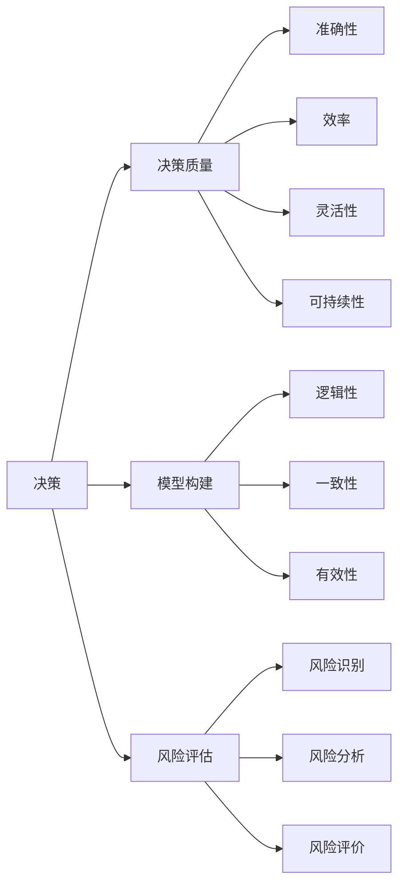

                 

# 决策科学：提高领导决策质量的方法

## 关键词

- 决策科学
- 决策质量
- 模型构建
- 人工智能
- 领导力

## 摘要

本文旨在探讨决策科学的基本概念和应用，解析决策过程中的关键问题和提高决策质量的策略。我们将深入分析决策质量的评估指标和方法，探讨模型构建、决策分析工具和人工智能在决策中的应用。此外，本文还将讨论决策过程中的沟通与协作，通过实际案例展示如何提升决策质量。最后，我们将探讨决策科学与领导力之间的关系，并展望未来决策科学的发展趋势和面临的挑战。

## 目录大纲

----------------------------------------------------------------

## 第一部分：决策科学的概述

### 第1章：决策科学的基础知识

#### 1.1 什么是决策科学

**决策科学的概念**

决策科学是一门跨学科的研究领域，它结合了数学、统计学、心理学、经济学和管理学等多个学科的知识，旨在研究决策过程、决策方法和决策质量。

**决策科学的发展历程**

从古至今，决策科学经历了从经验决策到科学决策的转变。随着计算机技术的发展，决策科学逐渐走向智能化和自动化。

#### 1.2 决策科学的应用领域

**商业决策**

商业决策是决策科学最为广泛的应用领域，包括市场分析、产品规划、供应链管理等方面。

**社会管理决策**

社会管理决策涉及城市规划、公共安全、社会保障等领域，决策质量的提高对社会稳定和可持续发展具有重要意义。

**技术决策**

技术决策涉及技术创新、研发投资、技术标准制定等方面，对于企业竞争力和社会发展具有重要影响。

#### 1.3 决策过程中的常见问题

**信息不足**

信息不足是决策过程中的常见问题，导致决策者难以做出明智的决策。

**时间压力**

时间压力使决策者难以全面考虑各种因素，可能导致决策失误。

**风险评估**

风险评估不准确可能导致决策者对风险估计不足，从而影响决策质量。

### 第2章：决策质量评估指标

#### 2.1 决策质量评估概述

**决策质量的定义**

决策质量是决策结果的满意程度，包括准确性、效率、灵活性和可持续性等方面。

**决策质量的影响因素**

决策质量的影响因素包括信息质量、决策过程和方法、决策者的能力和价值观等。

#### 2.2 评估指标体系

**经济效益**

经济效益是决策质量的重要评估指标，包括投资回报率、成本效益分析等。

**社会效益**

社会效益评估关注决策对社会和环境的影响，包括公共福利、环境保护等。

**可持续性**

可持续性评估关注决策对长期发展的影响，包括资源的合理利用、生态保护等。

#### 2.3 决策质量的量化方法

**评分法**

评分法通过设定评分标准，对决策结果进行量化评估。

**综合评价法**

综合评价法结合多种评估指标和方法，对决策质量进行整体评估。

### 第3章：提高决策质量的工具与方法

#### 3.1 模型构建

**线性规划**

线性规划是一种优化方法，用于在给定约束条件下求解线性目标函数的最优解。

**非线性规划**

非线性规划适用于目标函数和约束条件非线性的情况，求解复杂度较高。

#### 3.2 决策分析工具

**决策树**

决策树是一种图形化工具，用于展示决策过程中的不同路径和结果。

**模拟分析**

模拟分析通过模拟决策过程和结果，帮助决策者评估不同决策方案的风险和收益。

#### 3.3 人工智能在决策中的应用

**机器学习**

机器学习算法可以帮助决策者从大量数据中提取有价值的信息，提高决策质量。

**深度学习**

深度学习在图像识别、自然语言处理等领域取得了显著成果，为决策科学提供了新的工具和方法。

### 第4章：决策过程中的沟通与协作

#### 4.1 决策沟通的重要性

**决策沟通的作用**

决策沟通是决策过程中不可或缺的一环，有助于明确决策目标、共享信息和协调行动。

**决策沟通的障碍**

决策沟通中的障碍包括信息不对称、文化差异和沟通渠道不畅等。

#### 4.2 决策协作的技巧

**团队建设**

团队建设有助于提高团队成员之间的信任和协作能力，从而提升决策质量。

**协作工具**

协作工具如即时通讯、文档共享和项目管理软件等，可以促进团队成员之间的沟通与协作。

#### 4.3 沟通与协作在决策中的应用案例

**企业决策案例**

企业决策过程中，沟通与协作对于制定和实施战略具有重要意义。

**政府决策案例**

政府决策涉及广泛的社会利益，沟通与协作对于决策的公正性和有效性至关重要。

### 第5章：提高决策质量的案例分析

#### 5.1 案例一：企业战略决策

**问题背景**

某企业在市场竞争中面临战略选择问题，需要制定合适的战略以应对挑战。

**决策过程**

企业通过分析市场、竞争对手和自身优势，制定了以创新为核心的战略。

**决策效果**

创新战略的实施使企业市场份额和盈利能力得到显著提升。

#### 5.2 案例二：政府公共决策

**问题背景**

某政府面临城市交通拥堵问题，需要制定有效的治理方案。

**决策过程**

政府通过调研、数据分析和社会听证会，制定了综合交通治理方案。

**决策效果**

交通治理方案的实施显著改善了城市交通状况，提升了市民满意度。

### 第6章：决策科学与领导力

#### 6.1 领导力与决策科学的关系

**领导力在决策中的作用**

领导力对于决策过程具有重要影响，包括明确决策目标、制定决策方案和推动决策实施等。

**决策科学对领导力的影响**

决策科学为领导力提供了理论指导和工具方法，有助于提高决策质量和效果。

#### 6.2 领导决策中的误区

**过度自信**

领导者在决策过程中容易过度自信，导致对风险和挑战估计不足。

**群体思维**

群体思维现象可能导致领导者决策过程中的盲目从众，忽视个别成员的建议和意见。

#### 6.3 提升领导决策质量的策略

**增强决策能力**

领导者需要不断提升自己的决策能力，包括学习决策科学知识、培养决策思维和积累决策经验等。

**培养决策团队**

领导者需要培养一支高效的决策团队，发挥团队成员的专长和优势，提高决策质量和效率。

### 第7章：未来展望与挑战

#### 7.1 决策科学的发展趋势

**大数据分析**

大数据分析技术将为决策科学提供更丰富和准确的数据支持。

**人工智能辅助决策**

人工智能技术在决策科学中的应用将越来越广泛，有助于提高决策质量和效率。

#### 7.2 决策科学的挑战

**复杂性的增加**

随着社会和经济的快速发展，决策问题的复杂性不断增加，对决策科学提出了更高的要求。

**信息过载**

信息过载现象可能导致决策者难以有效筛选和处理信息，从而影响决策质量。

#### 7.3 应对挑战的策略

**持续学习**

决策者和相关领域专家需要持续学习和更新知识，以应对不断变化的决策环境。

**创新思维**

决策者和相关领域专家需要培养创新思维，积极探索新的决策方法和工具。

----------------------------------------------------------------

## 决策科学的基础知识

### 第1章：决策科学的基础知识

#### 1.1 什么是决策科学

决策科学是一门跨学科的研究领域，它结合了数学、统计学、心理学、经济学和管理学等多个学科的知识，旨在研究决策过程、决策方法和决策质量。决策科学的核心目标是通过科学的方法和工具，帮助决策者做出更加合理和有效的决策。

**定义**

决策科学可以定义为：研究决策过程、决策方法和决策质量的学科。它关注决策的各个方面，包括决策目标、决策环境、决策变量、决策规则和决策结果等。

**决策科学的发展历程**

决策科学的发展历程可以分为几个阶段：

1. **经验决策阶段**：在古代，决策主要依靠个人经验和直觉，缺乏系统的方法和理论支持。

2. **科学决策阶段**：随着科学技术的进步，决策科学开始逐渐形成，以统计学和运筹学为基础，提出了一系列决策方法和模型。

3. **决策支持系统阶段**：计算机技术的发展为决策科学带来了新的契机，决策支持系统（DSS）成为决策科学的重要工具。

4. **人工智能阶段**：近年来，人工智能技术的发展为决策科学带来了新的可能性，机器学习和深度学习等技术在决策中的应用逐渐成熟。

#### 1.2 决策科学的应用领域

决策科学在多个领域得到了广泛应用，以下是一些典型的应用领域：

**商业决策**

商业决策是决策科学最为广泛的应用领域之一，包括市场分析、产品规划、供应链管理、投资决策等。决策科学为商业决策提供了科学的方法和工具，帮助企业在复杂的市场环境中做出明智的决策。

**社会管理决策**

社会管理决策涉及城市规划、公共安全、社会保障、环境保护等领域。决策科学的方法和技术有助于政府和社会组织在面临复杂的社会问题时做出有效的决策。

**技术决策**

技术决策涉及技术创新、研发投资、技术标准制定等方面。决策科学为技术决策提供了科学依据，有助于提高技术决策的准确性和有效性。

#### 1.3 决策过程中的常见问题

在决策过程中，决策者常常面临一些常见的问题，以下是一些主要问题：

**信息不足**

信息不足是决策过程中最常见的问题之一。决策者往往难以获取全面、准确的信息，导致决策的盲目性和不确定性。

**时间压力**

时间压力使决策者难以充分分析各种因素，可能导致决策失误。在紧迫的时间限制下，决策者往往只能做出快速但可能不够明智的决策。

**风险评估**

风险评估不准确可能导致决策者对风险估计不足，从而影响决策质量。风险评估需要全面、客观地评估各种风险，但往往存在主观性和不确定性。

## 第2章：决策质量评估指标

### 2.1 决策质量评估概述

#### 决策质量的定义

决策质量是决策结果的满意程度，它是决策科学中一个重要的研究课题。决策质量可以从多个维度进行评估，主要包括准确性、效率、灵活性和可持续性等。

**准确性**：决策结果的准确性是决策质量的核心指标之一，它反映了决策目标是否得以实现。高准确性的决策意味着决策结果与预期目标高度一致，能够有效解决问题。

**效率**：决策效率是指决策过程所花费的时间和资源。高效率的决策能够在较短的时间内完成，节省资源，提高决策者的工作效率。

**灵活性**：决策灵活性是指决策者在面对不确定性和变化时，调整和优化决策方案的能力。高灵活性的决策能够在变化的环境中迅速应对，降低风险。

**可持续性**：决策可持续性是指决策结果对长期发展的影响。高可持续性的决策不仅能够解决当前问题，还能够为未来的发展奠定基础。

#### 决策质量的影响因素

决策质量受到多种因素的影响，主要包括信息质量、决策过程和方法、决策者的能力和价值观等。

**信息质量**：信息是决策的基础，信息质量直接影响决策质量。高质量的信息能够提供决策者准确、全面的数据支持，降低决策风险。

**决策过程和方法**：决策过程和方法是决策质量的关键因素。科学合理的决策过程和方法能够确保决策的准确性、效率和灵活性。

**决策者的能力**：决策者的能力和专业素养对决策质量具有重要影响。高能力的决策者能够快速分析问题、制定合理的决策方案，并有效执行。

**价值观**：决策者的价值观也会影响决策质量。不同的价值观可能导致不同的决策倾向，从而影响决策结果。

### 2.2 评估指标体系

在评估决策质量时，可以建立一套全面的评估指标体系，从多个维度对决策质量进行量化评估。以下是一些常见的评估指标：

**经济效益**：经济效益是评估决策质量的重要指标之一，包括投资回报率、成本效益分析、利润增长等。高经济效益的决策能够为企业带来显著的经济利益。

**社会效益**：社会效益评估关注决策对社会和环境的影响，包括公共福利、环境保护、社会稳定等。高社会效益的决策能够为社会发展做出积极贡献。

**可持续性**：可持续性评估关注决策对长期发展的影响，包括资源的合理利用、生态保护、社会责任等。高可持续性的决策能够为未来的发展奠定基础。

### 2.3 决策质量的量化方法

为了对决策质量进行量化评估，可以采用多种方法，包括评分法、综合评价法等。

**评分法**：评分法通过设定评分标准，对决策结果进行量化评估。评分标准可以根据不同维度进行设定，如准确性、效率、灵活性、可持续性等。决策结果可以根据评分标准进行评分，从而进行量化评估。

**综合评价法**：综合评价法结合多种评估指标和方法，对决策质量进行整体评估。综合评价法通常采用加权平均法，将各个指标的得分进行加权平均，得到决策质量的综合得分。

**具体案例分析**：

假设有一个企业的决策质量评估，采用评分法进行评估。根据准确性、效率、灵活性和可持续性四个维度，设定评分标准如下：

- **准确性**：评分范围1-10分，满分10分
- **效率**：评分范围1-10分，满分10分
- **灵活性**：评分范围1-10分，满分10分
- **可持续性**：评分范围1-10分，满分10分

根据实际决策结果，得到以下评分：

- **准确性**：8分
- **效率**：9分
- **灵活性**：7分
- **可持续性**：8分

根据评分标准，可以计算出决策质量的综合得分：

$$
综合得分 = \frac{(8 \times 0.3) + (9 \times 0.3) + (7 \times 0.2) + (8 \times 0.2)}{1} = 8.1
$$

因此，该企业的决策质量综合得分为8.1分，属于较高水平。

### 2.4 决策质量的案例分析

以下是一个具体的决策质量案例分析：

**案例背景**：

某企业需要决定是否投资一个新的市场机会。决策者通过市场调研、财务分析和风险评估，制定了一个投资方案。

**决策过程**：

1. **市场调研**：了解目标市场的规模、增长趋势和竞争状况。
2. **财务分析**：评估投资项目的盈利能力和资金回笼周期。
3. **风险评估**：分析投资项目面临的各种风险，并制定相应的风险应对策略。
4. **制定投资方案**：根据市场、财务和风险评估结果，制定具体的投资方案。

**决策效果**：

经过评估，决策者认为该投资方案具有较高的决策质量，主要表现在以下几个方面：

1. **准确性**：市场调研和财务分析提供了准确的数据支持，确保了投资决策的准确性。
2. **效率**：决策过程高效，能够在较短的时间内完成决策。
3. **灵活性**：决策方案设计了多种风险应对策略，具有较高的灵活性。
4. **可持续性**：投资项目具有良好的盈利前景，对企业的长期发展具有积极影响。

**结论**：

通过这个案例，可以看出决策质量在投资决策中的重要性。一个高决策质量的决策能够为企业带来更好的投资回报和长期发展。

### 2.5 决策质量的改进策略

为了进一步提高决策质量，可以采取以下改进策略：

1. **提升信息质量**：通过完善信息收集和整理机制，提高信息质量，为决策提供准确、全面的数据支持。
2. **优化决策过程**：设计科学合理的决策过程和方法，确保决策的准确性、效率和灵活性。
3. **培养决策者能力**：通过培训和指导，提高决策者的专业素养和决策能力，确保决策的科学性和有效性。
4. **强化风险评估**：建立完善的风险评估体系，提高风险识别和应对能力，降低决策风险。

通过以上策略，可以有效提升决策质量，帮助企业更好地应对市场挑战，实现可持续发展。

### 2.6 决策质量评估工具

在决策质量评估中，可以使用多种工具和方法，以下是一些常用的工具：

1. **决策树**：通过图形化展示决策过程和不同决策路径的结果，帮助决策者分析决策质量和效果。
2. **模拟分析**：通过模拟决策过程和结果，评估不同决策方案的风险和收益。
3. **评估指标体系**：建立一套全面的评估指标体系，从多个维度对决策质量进行量化评估。

### 2.7 决策质量评估的实际应用

决策质量评估在多个领域得到了广泛应用，以下是一些实际应用案例：

1. **企业管理**：企业通过决策质量评估，优化管理决策，提高企业的竞争力。
2. **政府决策**：政府在制定政策时，通过决策质量评估，确保政策的有效性和可持续性。
3. **技术创新**：企业在进行技术创新决策时，通过决策质量评估，降低创新风险，提高创新成功率。

### 2.8 决策质量的持续改进

决策质量的评估是一个持续的过程，企业需要不断改进决策质量，以应对市场和环境的变化。以下是一些持续改进策略：

1. **定期评估**：定期对决策质量进行评估，发现问题和不足，及时进行调整。
2. **反馈机制**：建立有效的反馈机制，收集决策执行过程中的反馈信息，用于改进决策质量。
3. **知识管理**：积累和分享决策经验，形成知识库，为后续决策提供参考。

通过以上策略，企业可以不断提高决策质量，实现可持续发展。

## 第3章：提高决策质量的工具与方法

### 3.1 模型构建

#### 线性规划

线性规划是一种优化方法，用于在给定约束条件下求解线性目标函数的最优解。线性规划广泛应用于资源分配、生产调度、运输调度等领域。

**定义**

线性规划可以定义为：在满足一定约束条件下，求解线性目标函数的最大值或最小值。

**线性规划的基本要素**

1. **目标函数**：表示决策者希望达到的目标，如最大化利润或最小化成本。
2. **决策变量**：表示决策者需要做出的选择，如生产数量或运输量。
3. **约束条件**：表示决策变量之间的限制，如资源限制、时间限制等。

**线性规划问题求解**

线性规划问题的求解通常采用单纯形法、对偶法等算法。单纯形法是一种迭代算法，通过逐步改进决策变量的取值，找到最优解。

**案例分析**

假设某企业需要生产甲、乙两种产品，每种产品的利润分别为10元和20元。生产一个甲产品需要2小时，生产一个乙产品需要3小时。企业的生产时间为10小时。求解最优生产方案。

**目标函数**：最大化总利润

$$
\text{最大化} Z = 10x_1 + 20x_2
$$

**约束条件**：

$$
2x_1 + 3x_2 \leq 10 \quad \text{（生产时间约束）}
$$

$$
x_1, x_2 \geq 0 \quad \text{（非负约束）}
$$

通过求解线性规划问题，得到最优生产方案为：生产甲产品3个，乙产品1个，总利润为70元。

#### 非线性规划

非线性规划适用于目标函数和约束条件非线性的情况，求解复杂度较高。非线性规划广泛应用于物流优化、金融投资、工程优化等领域。

**定义**

非线性规划可以定义为：在满足一定约束条件下，求解非线性目标函数的最大值或最小值。

**非线性规划的基本要素**

1. **目标函数**：表示决策者希望达到的目标，如最大化利润或最小化成本。
2. **决策变量**：表示决策者需要做出的选择，如生产数量或运输量。
3. **约束条件**：表示决策变量之间的限制，如资源限制、时间限制等。

**非线性规划问题求解**

非线性规划问题的求解通常采用梯度下降法、牛顿法、拉格朗日乘数法等算法。梯度下降法是一种迭代算法，通过沿着目标函数的梯度方向进行迭代，找到最优解。

**案例分析**

假设某企业需要生产甲、乙两种产品，每种产品的利润分别为10元和20元。生产一个甲产品需要2小时，生产一个乙产品需要3小时。企业的生产时间为10小时。求解最优生产方案。

**目标函数**：最大化总利润

$$
\text{最大化} Z = 10x_1 + 20x_2
$$

**约束条件**：

$$
2x_1 + 3x_2 \leq 10 \quad \text{（生产时间约束）}
$$

$$
x_1, x_2 \geq 0 \quad \text{（非负约束）}
$$

通过求解非线性规划问题，得到最优生产方案为：生产甲产品3个，乙产品1个，总利润为70元。

### 3.2 决策分析工具

#### 决策树

决策树是一种图形化工具，用于展示决策过程中的不同路径和结果。决策树可以帮助决策者分析不同决策路径的可能结果和风险，从而做出更加明智的决策。

**定义**

决策树可以定义为：一种由决策节点、机会节点、结果节点和概率分支组成的树形结构，用于表示决策过程和结果。

**决策树的基本要素**

1. **决策节点**：表示决策点的选择。
2. **机会节点**：表示决策节点可能产生的结果。
3. **结果节点**：表示决策结果。
4. **概率分支**：表示不同结果发生的概率。

**决策树的分析方法**

通过分析决策树，可以计算出每个决策节点的期望值和方差，从而评估不同决策路径的风险和收益。

**案例分析**

假设某企业面临两个投资方案，方案A的预期收益为100万元，风险为0.5；方案B的预期收益为150万元，风险为0.3。求解最优投资方案。

**决策树分析**：

```
               ┌─────────────────────┐
               │          投资方案     │
               ├─────────────────────┤
               │      A        B      │
               ├─────────────────────┤
               │ 100万元  150万元 │
               ├─────────────────────┤
               │     0.5      0.3     │
               ├─────────────────────┤
               │       风险       │
               └─────────────────────┘
```

通过决策树分析，可以计算出每个投资方案的期望值和方差：

- **方案A**：期望值 = 100万元 \* 0.5 = 50万元，方差 = 0.5 \* 0.5 = 0.25
- **方案B**：期望值 = 150万元 \* 0.3 = 45万元，方差 = 0.3 \* 0.3 = 0.09

因此，从期望值和方差来看，方案A的风险较高，但收益也较高。决策者可以根据具体情况进行权衡，选择最优投资方案。

#### 模拟分析

模拟分析是一种通过模拟决策过程和结果，帮助决策者评估不同决策方案的风险和收益的方法。模拟分析可以用于复杂系统的优化和决策，如金融投资、项目管理等。

**定义**

模拟分析可以定义为：通过模拟决策过程和结果，对多个决策方案进行评估和比较，以确定最优决策方案。

**模拟分析的基本要素**

1. **决策过程**：模拟决策过程中的各个步骤，如市场调研、风险评估、投资决策等。
2. **结果变量**：模拟决策结果的各种变量，如收益、成本、风险等。
3. **模拟工具**：用于进行模拟分析的工具，如模拟软件、编程工具等。

**模拟分析的方法**

模拟分析通常采用蒙特卡罗模拟方法，通过随机抽样和迭代计算，模拟出多个决策结果，并计算各结果变量的期望值、方差等统计指标，从而评估决策方案的风险和收益。

**案例分析**

假设某企业面临两个投资方案，方案A的预期收益为100万元，风险为0.5；方案B的预期收益为150万元，风险为0.3。求解最优投资方案。

**模拟分析**：

通过模拟分析，可以模拟出多个投资结果，并计算各结果变量的期望值和方差：

- **方案A**：模拟1000次，期望收益为50万元，方差为0.25。
- **方案B**：模拟1000次，期望收益为45万元，方差为0.09。

通过比较两个方案的期望值和方差，可以得出结论：方案A的风险较高，但收益也较高。决策者可以根据具体情况进行权衡，选择最优投资方案。

### 3.3 人工智能在决策中的应用

#### 机器学习

机器学习是一种人工智能技术，通过训练模型，使计算机能够自动学习并做出决策。机器学习在决策中的应用非常广泛，如金融投资、医疗诊断、自动驾驶等。

**定义**

机器学习可以定义为：一种使计算机能够通过训练数据自动学习和改进的方法，从而实现特定任务的决策。

**机器学习的基本原理**

机器学习的基本原理包括：

1. **特征提取**：从数据中提取有用的特征，用于训练模型。
2. **模型训练**：使用训练数据对模型进行训练，使模型能够预测新数据。
3. **模型评估**：评估模型的性能，包括准确性、召回率、F1值等指标。

**机器学习的应用**

机器学习在决策中的应用包括：

1. **预测**：如股票市场预测、销售预测等。
2. **分类**：如垃圾邮件过滤、疾病诊断等。
3. **回归**：如房价预测、销量预测等。

#### 深度学习

深度学习是一种人工智能技术，通过多层神经网络模型，自动提取和转换数据特征。深度学习在图像识别、自然语言处理等领域取得了显著成果。

**定义**

深度学习可以定义为：一种基于多层神经网络的人工智能技术，通过自动提取和转换数据特征，实现特定任务的决策。

**深度学习的基本原理**

深度学习的基本原理包括：

1. **卷积神经网络（CNN）**：用于图像识别和计算机视觉任务。
2. **循环神经网络（RNN）**：用于序列数据处理，如自然语言处理和时间序列预测等。
3. **生成对抗网络（GAN）**：用于图像生成和风格转换等。

**深度学习的应用**

深度学习在决策中的应用包括：

1. **图像识别**：如人脸识别、物体检测等。
2. **自然语言处理**：如情感分析、机器翻译等。
3. **语音识别**：如语音转文本、语音合成等。

### 3.4 人工智能在决策中的应用案例分析

以下是一个关于人工智能在决策中的应用案例分析：

**案例背景**：

某企业需要决定是否进行一项大型投资。该投资涉及资金投入、市场风险和技术风险等多个方面。企业希望通过人工智能技术进行风险评估和决策支持。

**决策过程**：

1. **数据收集**：收集与投资相关的各种数据，如市场数据、技术数据、财务数据等。
2. **数据预处理**：对收集的数据进行清洗、去重和归一化等处理，为模型训练做准备。
3. **模型训练**：使用机器学习和深度学习算法，训练多个预测模型，如线性回归、决策树、神经网络等。
4. **模型评估**：评估各模型的预测性能，选择最优模型进行风险评估。
5. **决策支持**：根据风险评估结果，为决策者提供决策支持，帮助企业做出明智的投资决策。

**决策结果**：

通过人工智能技术的辅助，企业成功评估了投资的风险和收益，最终决定放弃该投资。该决策避免了可能的投资损失，为企业节省了大量资源。

**结论**：

人工智能技术在决策中的应用，为决策者提供了强大的工具和方法。通过利用人工智能技术，企业可以更加准确地评估风险、预测市场变化，从而做出更加明智的决策。

### 3.5 提高决策质量的策略

为了提高决策质量，可以采取以下策略：

1. **数据驱动**：充分利用数据资源，进行数据分析和挖掘，为决策提供科学依据。
2. **多角度分析**：从多个角度对问题进行分析，全面评估各种决策方案的风险和收益。
3. **专家咨询**：借助专家的知识和经验，为决策提供参考意见。
4. **沟通与协作**：加强团队沟通与协作，提高决策的透明度和参与度。
5. **持续学习**：不断学习新的知识和技能，提高决策者的专业素养和决策能力。

通过以上策略，企业可以显著提高决策质量，实现可持续发展。

## 第4章：决策过程中的沟通与协作

### 4.1 决策沟通的重要性

决策沟通在决策过程中具有至关重要的作用。有效的决策沟通有助于明确决策目标、共享信息和协调行动，从而提高决策的质量和效率。

#### 决策沟通的作用

1. **明确决策目标**：通过沟通，决策者可以与团队成员明确决策目标，确保各方对决策目标有共同的理解和认同。

2. **共享信息**：沟通是信息传递的重要途径。通过沟通，决策者可以获取到各方提供的信息，从而做出更加全面和准确的决策。

3. **协调行动**：决策沟通有助于团队成员之间的协调和配合，确保决策方案能够得到有效实施。

#### 决策沟通的障碍

尽管决策沟通在决策过程中具有重要作用，但实际操作中仍然存在许多障碍，以下是一些常见的障碍：

1. **信息不对称**：决策过程中，不同团队成员可能拥有不同的信息，导致信息不对称。这可能导致决策者对某些重要信息的了解不足，从而影响决策质量。

2. **文化差异**：团队成员来自不同的背景和文化，可能导致沟通中的误解和冲突。文化差异可能影响团队成员之间的合作和沟通效果。

3. **沟通渠道不畅**：组织内部可能存在沟通渠道不畅的问题，导致信息传递不及时或失真。这可能导致决策者无法及时获取到所需的信息，从而影响决策过程。

### 4.2 决策协作的技巧

为了克服决策沟通的障碍，提高决策协作的效果，以下是一些决策协作的技巧：

#### 团队建设

1. **建立共同目标**：团队成员应共同确定决策目标，确保目标的一致性，从而增强团队的凝聚力和协作意愿。

2. **培养信任**：信任是团队协作的基础。通过建立相互信任的关系，团队成员可以更加开放和坦诚地交流，减少沟通中的误解和冲突。

3. **提高沟通能力**：团队成员应具备良好的沟通能力，包括倾听、表达和反馈等。有效的沟通能力有助于提高团队协作效率。

#### 协作工具

1. **即时通讯工具**：如微信、钉钉等，方便团队成员实时沟通和交流。

2. **文档共享平台**：如Google Docs、微软Office 365等，方便团队成员共享文档和协作编辑。

3. **项目管理工具**：如Trello、JIRA等，帮助团队成员跟踪项目进度和任务分配，提高协作效率。

### 4.3 沟通与协作在决策中的应用案例

以下是一些沟通与协作在决策中的应用案例：

#### 企业决策案例

某企业面临是否扩大生产规模的问题。为了做出明智的决策，企业进行了以下沟通与协作：

1. **市场调研**：通过市场调研，收集市场需求和竞争状况的信息，为决策提供数据支持。

2. **内部沟通**：组织内部会议，与各部门负责人讨论扩大生产规模的利弊，确保各方意见得到充分表达。

3. **数据分析**：使用数据分析工具，对市场需求、生产成本、盈利能力等进行详细分析，评估不同决策方案的风险和收益。

4. **团队协作**：组织项目团队，制定详细的实施计划，明确任务分配和责任分工，确保决策方案得到有效实施。

#### 政府决策案例

某政府面临是否建设一个新的交通枢纽的问题。为了做出明智的决策，政府进行了以下沟通与协作：

1. **公众参与**：组织公众听证会，听取居民和利益相关方的意见和建议，确保决策过程透明和公正。

2. **专家咨询**：邀请交通规划专家和工程师，对交通枢纽的设计、建设和运营进行评估，提供专业建议。

3. **多部门协作**：组织相关部门进行合作，包括城市规划、交通管理、环境保护等部门，共同制定决策方案。

4. **决策支持**：使用决策支持系统（DSS），对多个决策方案进行评估和比较，提供决策支持。

### 4.4 提高决策沟通与协作的效果

为了提高决策沟通与协作的效果，可以采取以下措施：

1. **建立沟通机制**：制定明确的沟通计划和流程，确保沟通的及时性和有效性。

2. **加强培训**：对团队成员进行沟通技巧和协作能力的培训，提高沟通和协作效率。

3. **利用技术工具**：利用先进的沟通和协作工具，如即时通讯、文档共享和项目管理软件，提高团队协作效率。

4. **建立反馈机制**：建立有效的反馈机制，收集团队成员的意见和建议，不断改进决策沟通和协作的效果。

通过以上措施，企业可以显著提高决策沟通与协作的效果，从而提高决策质量。

## 第5章：提高决策质量的案例分析

### 5.1 案例一：企业战略决策

#### 问题背景

某企业在面临激烈的市场竞争时，需要制定合适的战略以保持竞争优势。企业高层管理者意识到，当前的市场环境和竞争态势对企业战略决策提出了新的挑战。

#### 决策过程

1. **市场分析**：企业首先进行了市场分析，包括市场需求、竞争态势、消费者行为等方面。通过市场分析，企业确定了市场需求的变化趋势和潜在机会。

2. **内部评估**：企业对自身的资源、能力和核心竞争力进行了评估。评估结果显示，企业在技术、品牌和人力资源等方面具有一定优势，但需要在市场拓展和创新能力方面进一步加强。

3. **制定战略方案**：基于市场分析和内部评估的结果，企业制定了多个战略方案，包括市场拓展、技术创新、品牌提升等。每个战略方案都明确了具体的实施步骤和预期目标。

4. **风险评估**：企业对每个战略方案进行了风险评估，包括市场风险、技术风险、财务风险等。通过风险评估，企业确定了每个战略方案的可行性和潜在风险。

5. **决策实施**：企业最终选择了以技术创新为核心的战略方案。企业投入大量资金和资源，加强技术研发和创新能力，同时调整市场拓展策略和品牌推广计划。

#### 决策效果

通过实施技术创新战略，企业成功提升了产品竞争力，市场份额和盈利能力得到了显著提升。技术创新战略的实施使企业在市场竞争中取得了优势，为企业未来的发展奠定了坚实基础。

### 5.2 案例二：政府公共决策

#### 问题背景

某市政府面临城市交通拥堵问题，严重影响市民出行和生活质量。政府意识到，需要采取有效的措施来解决交通拥堵问题，提升城市交通系统的运行效率。

#### 决策过程

1. **问题识别**：政府首先识别了交通拥堵问题的具体原因，包括道路容量不足、交通管理不当、公共交通服务水平不高等。

2. **数据收集**：政府收集了相关数据，包括交通流量、道路状况、公共交通使用情况等。通过数据分析，政府确定了交通拥堵问题的具体分布和严重程度。

3. **制定方案**：政府制定了多个解决交通拥堵的方案，包括扩建道路、改善公共交通服务、实施交通管理措施等。每个方案都明确了具体的实施步骤和预期效果。

4. **风险评估**：政府评估了每个方案的可行性和潜在影响，包括财政支出、社会影响、环境影响等。通过风险评估，政府确定了最佳方案。

5. **决策实施**：政府最终选择了综合交通治理方案，包括扩建道路、改善公共交通服务、实施交通管理措施等。政府投入大量资金和资源，分阶段实施交通治理方案。

#### 决策效果

通过实施综合交通治理方案，城市交通拥堵问题得到了显著改善。扩建道路和改善公共交通服务提高了交通系统的运行效率，实施交通管理措施降低了交通事故发生率。市民的出行时间和生活质量得到了显著提升，政府赢得了市民的认可和支持。

### 5.3 案例分析总结

通过以上两个案例，可以看出提高决策质量的关键在于充分的市场分析和内部评估，科学的风险评估和有效的决策实施。企业战略决策和政府公共决策都需要在明确问题背景、制定战略方案、风险评估和决策实施等方面进行精细化管理。通过有效的决策过程和实施策略，企业可以实现战略目标，政府可以提升公共服务水平，为社会发展和经济增长做出贡献。

## 第6章：决策科学与领导力

### 6.1 领导力与决策科学的关系

领导力与决策科学之间存在着密切的关系。领导力在决策过程中发挥着重要作用，而决策科学则为领导力提供了理论指导和工具方法，二者相辅相成，共同提高决策质量和效果。

#### 领导力在决策中的作用

1. **明确决策目标**：领导力有助于明确决策目标，确保决策过程和结果与组织使命和愿景保持一致。领导者的远见卓识和战略思维对于决策目标的确定至关重要。

2. **制定决策方案**：领导者需要制定合理的决策方案，以确保决策的可操作性和有效性。领导力在制定决策方案时发挥着关键作用，包括分析问题、评估风险、确定优先级等。

3. **推动决策实施**：决策实施是决策过程中至关重要的一环。领导者需要具备推动决策实施的能力，包括沟通协调、资源调配、团队激励等。领导力在决策实施过程中发挥着关键作用，确保决策方案得到有效执行。

#### 决策科学对领导力的影响

决策科学为领导力提供了理论指导和工具方法，有助于提高领导决策的质量和效果。以下是一些具体影响：

1. **提高决策效率**：决策科学提供了一系列决策方法和工具，如线性规划、决策树、模拟分析等，可以帮助领导者快速、准确地分析问题和制定决策方案，提高决策效率。

2. **降低决策风险**：决策科学强调风险评估和不确定性分析，帮助领导者全面评估决策风险，制定相应的风险应对策略，降低决策风险。

3. **增强决策透明度**：决策科学倡导科学决策、公开决策，提高决策的透明度和公信力，增强团队成员和利益相关方对决策的认同和支持。

### 6.2 领导决策中的误区

尽管领导力在决策过程中具有重要影响，但在实际操作中，领导者可能会陷入一些常见的决策误区，以下是一些常见的误区：

#### 过度自信

过度自信是领导决策中的一个常见问题。领导者可能会高估自己的能力和决策能力，低估决策风险和不确定性。这可能导致决策者过于乐观，忽视潜在的风险和挑战。

#### 群体思维

群体思维是指团队成员在决策过程中，出于对领导者的信任和认同，盲目从众，忽视个别成员的合理建议。这可能导致决策者无法全面收集信息和意见，影响决策的质量和效果。

#### 缺乏多样性

领导者如果缺乏多样性，可能会导致团队成员的意见和建议过于单一，缺乏创新性和创新思维。这可能导致决策过程缺乏活力和创造力，影响决策的多样性和全面性。

### 6.3 提升领导决策质量的策略

为了提升领导决策质量，领导者可以采取以下策略：

#### 增强决策能力

1. **持续学习**：领导者需要不断学习新的知识和技能，提高自身的决策能力。可以通过参加培训课程、阅读相关书籍和文章、参加专业研讨会等方式，不断更新知识和技能。

2. **实践锻炼**：通过实际决策经验的积累，领导者可以不断提高决策能力。可以参与不同类型的决策，从中学到宝贵的经验和教训。

3. **培养团队**：领导者需要培养一支高效的决策团队，发挥团队成员的专长和优势。通过团队协作，领导者可以收集到更多的信息和意见，提高决策的全面性和准确性。

#### 培养决策团队

1. **建立共同目标**：领导者需要与团队成员建立共同的目标和愿景，确保团队成员对决策目标有共同的理解和认同。

2. **促进沟通与协作**：领导者需要促进团队成员之间的沟通与协作，确保信息传递的及时性和准确性。可以通过定期会议、团队建设活动等方式，提高团队成员之间的沟通和协作效率。

3. **建立反馈机制**：领导者需要建立有效的反馈机制，收集团队成员的意见和建议，不断改进决策过程和决策质量。

#### 利用决策工具与方法

1. **数据分析**：领导者需要充分利用数据分析工具，对决策问题进行深入分析，提高决策的准确性和科学性。

2. **风险评估**：领导者需要重视风险评估，全面评估决策风险和不确定性，制定相应的风险应对策略。

3. **模拟分析**：领导者可以使用模拟分析工具，对决策方案进行模拟和分析，评估不同决策方案的潜在影响和效果，提高决策的全面性和准确性。

### 6.4 决策科学与领导力结合的实际应用

以下是一个关于决策科学与领导力结合的实际应用案例：

#### 案例背景

某企业面临是否进入新市场的决策。企业领导者意识到，这是一个复杂的问题，需要运用决策科学的方法和领导力原则来做出明智的决策。

#### 决策过程

1. **市场分析**：企业首先进行了市场分析，包括市场需求、竞争态势、消费者行为等方面。通过市场分析，企业确定了市场需求的变化趋势和潜在机会。

2. **内部评估**：企业对自身的资源、能力和核心竞争力进行了评估。评估结果显示，企业在技术、品牌和人力资源等方面具有一定优势，但需要在市场拓展和创新能力方面进一步加强。

3. **制定战略方案**：基于市场分析和内部评估的结果，企业制定了多个战略方案，包括市场拓展、技术创新、品牌提升等。每个战略方案都明确了具体的实施步骤和预期目标。

4. **风险评估**：企业对每个战略方案进行了风险评估，包括市场风险、技术风险、财务风险等。通过风险评估，企业确定了每个战略方案的可行性和潜在风险。

5. **决策实施**：企业最终选择了以技术创新为核心的战略方案。企业投入大量资金和资源，加强技术研发和创新能力，同时调整市场拓展策略和品牌推广计划。

#### 决策效果

通过实施技术创新战略，企业成功提升了产品竞争力，市场份额和盈利能力得到了显著提升。企业领导者通过运用决策科学的方法和领导力原则，确保了决策的质量和效果，为企业未来的发展奠定了坚实基础。

### 6.5 提升领导决策质量的实践建议

1. **建立决策框架**：领导者需要建立明确的决策框架，包括决策目标、决策过程、决策标准等，以确保决策的规范性和科学性。

2. **培养决策团队**：领导者需要培养一支高效的决策团队，发挥团队成员的专长和优势，确保决策过程的多样性和全面性。

3. **加强沟通与协作**：领导者需要加强团队成员之间的沟通与协作，确保信息传递的及时性和准确性，提高决策的全面性和准确性。

4. **持续学习与反思**：领导者需要持续学习新的知识和技能，不断反思和改进决策过程和决策方法，提高决策能力和决策质量。

通过以上实践建议，领导者可以不断提升决策质量，为企业的可持续发展奠定坚实基础。

## 第7章：未来展望与挑战

### 7.1 决策科学的发展趋势

随着科技的不断进步，决策科学正朝着更加智能化、自动化和高效化的方向发展。以下是一些重要的趋势：

#### 大数据分析

大数据分析技术为决策科学提供了强大的支持。通过分析和挖掘海量数据，决策者可以获得更加全面和准确的信息，从而提高决策的准确性和效率。大数据分析技术可以帮助企业更好地了解市场需求、消费者行为和竞争态势，从而制定更加科学的决策方案。

#### 人工智能辅助决策

人工智能技术的发展为决策科学带来了新的可能性。人工智能技术，如机器学习、深度学习和自然语言处理等，可以自动化处理大量数据，快速识别模式和趋势，从而辅助决策者做出更加明智的决策。人工智能辅助决策在金融、医疗、交通等领域已经取得了显著成果。

#### 可视化分析

可视化分析技术可以帮助决策者更加直观地理解数据和决策结果。通过图表、图像和交互式界面，决策者可以更加清晰地了解数据背后的信息，从而更好地分析和评估决策方案。可视化分析技术可以提升决策的透明度和可解释性，有助于提高决策的质量和接受度。

#### 跨学科融合

决策科学的发展趋势之一是跨学科融合。随着不同领域知识的不断融合，决策科学将更加综合和全面。例如，经济学、心理学、社会学和计算机科学等领域的知识可以相互借鉴和融合，为决策科学提供更加丰富的理论和方法。

### 7.2 决策科学的挑战

尽管决策科学在发展中取得了显著成果，但仍面临一些挑战：

#### 复杂性的增加

随着社会和经济的快速发展，决策问题的复杂性不断增加。现代企业和社会面临的问题更加复杂，涉及多个领域和利益相关方。决策者需要在更加复杂的环境中做出快速而明智的决策，这对决策科学提出了更高的要求。

#### 信息过载

在信息爆炸的时代，决策者面临着大量的信息。然而，信息过多可能会导致信息过载，使决策者难以有效筛选和处理信息。如何从海量信息中提取有价值的信息，成为决策科学面临的一个重要挑战。

#### 不确定性和风险

决策过程中往往存在不确定性和风险。环境变化、市场波动和竞争压力等因素都可能影响决策结果。如何准确评估和应对不确定性，降低决策风险，是决策科学需要解决的关键问题。

### 7.3 应对挑战的策略

为了应对决策科学面临的挑战，可以采取以下策略：

#### 持续学习与更新

决策者和相关领域专家需要持续学习和更新知识，以应对不断变化的决策环境。通过参加培训、研讨会和学术会议，了解最新的研究成果和前沿技术，不断提升自身的决策能力和知识水平。

#### 创新思维与方法

决策者需要培养创新思维，积极探索新的决策方法和工具。例如，运用大数据分析、人工智能和可视化分析技术，提高决策的科学性和效率。同时，决策者可以借鉴跨学科的知识和方法，为决策科学的发展提供新的思路。

#### 加强沟通与协作

有效的沟通与协作是提高决策质量的关键。决策者需要与团队成员、利益相关方和专家进行充分沟通和协作，确保决策信息的传递和共享。通过建立良好的沟通机制和协作平台，提高决策过程的透明度和参与度。

#### 数据驱动与实证分析

决策者应充分利用数据资源，进行数据驱动和实证分析。通过收集、整理和分析数据，为决策提供科学依据。同时，决策者可以运用统计分析和模拟分析等方法，评估决策方案的风险和收益，提高决策的准确性和可靠性。

### 7.4 未来决策科学的展望

未来，决策科学将继续发展，并在以下几个方面取得重要突破：

#### 智能决策系统

智能决策系统将融合人工智能、大数据分析和可视化分析技术，实现自动化和智能化的决策。智能决策系统可以帮助决策者快速处理大量数据，提供精准的决策建议，提高决策的效率和准确性。

#### 网络决策科学

随着互联网和物联网的快速发展，网络决策科学将得到广泛应用。通过网络决策科学，决策者可以实时获取和分析网络数据，快速响应市场变化，制定更加灵活和适应性强的决策方案。

#### 决策伦理与治理

决策伦理与治理将成为决策科学的重要研究方向。随着决策科学在各个领域的广泛应用，决策伦理和治理问题日益凸显。如何确保决策过程的公正性、透明性和可持续性，成为决策科学需要关注的重要问题。

#### 多元化与包容性

决策科学将更加注重多元化和包容性。通过借鉴不同学科和文化的知识，决策科学可以更好地应对复杂和多样化的决策问题。多元化与包容性的决策科学将有助于提高决策的质量和效果，促进社会的和谐与发展。

### 7.5 总结

未来，决策科学将继续发展，面临许多机遇和挑战。通过持续学习、创新思维、加强沟通与协作和利用先进技术，决策科学将不断提高决策质量，为企业和社会发展提供有力支持。同时，决策科学的发展也需要关注决策伦理和治理问题，确保决策过程的公正性和可持续性。只有不断应对挑战，决策科学才能在未来发挥更大的作用。

## 核心概念原理与联系

### 决策科学中的核心概念

在决策科学中，有多个核心概念，它们构成了决策过程的基础。以下是对这些核心概念的定义、属性和相互关系的详细介绍。

#### 1. 决策

**定义**：决策是对未来行动方案的选择。

**属性**：决策具有目标性、选择性、优化性和反馈性。

- **目标性**：决策是在明确目标的基础上进行的，目标是决策的核心驱动力。
- **选择性**：决策是在多个可行的行动方案中进行选择，选择性体现了决策者的判断和偏好。
- **优化性**：决策追求最优或满意的解决方案，优化性体现了决策的科学性和效率。
- **反馈性**：决策效果通过反馈机制进行评估和调整，反馈性保证了决策过程的持续改进。

**关联**：决策是决策过程的核心，其他概念如决策质量、模型构建、风险评估等都围绕决策展开。

#### 2. 决策质量

**定义**：决策质量是决策结果的满意程度。

**属性**：决策质量包括准确性、效率、灵活性和可持续性。

- **准确性**：决策结果的准确性反映了决策目标是否实现。
- **效率**：决策效率是指决策过程所花费的时间和资源。
- **灵活性**：决策灵活性是指决策者面对不确定性和变化时调整方案的能力。
- **可持续性**：决策可持续性是指决策结果对长期发展的影响。

**关联**：决策质量是决策过程的重要评估指标，它与信息质量、决策过程和方法、决策者的能力和价值观等因素密切相关。

#### 3. 模型构建

**定义**：模型是对现实世界的简化和抽象。

**属性**：模型具有逻辑性、一致性和有效性。

- **逻辑性**：模型结构清晰，逻辑严密，有助于决策者理解决策过程。
- **一致性**：模型内部各部分之间相互一致，没有矛盾。
- **有效性**：模型能够有效模拟现实世界，为决策提供可靠依据。

**关联**：模型构建是决策分析的基础，模型的质量直接影响到决策的科学性和可靠性。

#### 4. 风险评估

**定义**：风险评估是对决策过程中潜在风险的识别、分析和评价。

**属性**：风险评估包括风险识别、风险分析和风险评价。

- **风险识别**：识别决策过程中可能面临的风险。
- **风险分析**：分析风险的概率和影响程度。
- **风险评价**：评价风险的重要性，为决策提供参考。

**关联**：风险评估是决策过程中不可或缺的一环，它帮助决策者全面了解决策风险，制定相应的风险应对策略。

### 核心概念原理与联系

在决策科学中，这些核心概念之间存在着紧密的联系。以下是这些概念之间的关联及相互作用的详细解释。

#### 决策与决策质量

决策是决策过程的核心，决策质量是评估决策结果的重要指标。决策质量直接影响决策效果，决策质量高，决策结果更符合预期目标，决策过程也更有效。

#### 模型构建与决策质量

模型构建是决策分析的基础，通过构建合理的模型，决策者可以更准确地预测决策结果，从而提高决策质量。模型构建的质量直接影响决策的科学性和可靠性。

#### 风险评估与决策质量

风险评估是决策过程中识别和评价风险的关键环节，通过风险评估，决策者可以全面了解决策风险，制定相应的风险应对策略，从而提高决策质量。

### 表格：核心概念属性对比

| 核心概念 | 定义 | 属性 | 关联 |
| --- | --- | --- | --- |
| 决策 | 对未来行动方案的选择 | 目标性、选择性、优化性、反馈性 | 决策是决策过程的核心 |
| 决策质量 | 决策结果的满意程度 | 准确性、效率、灵活性、可持续性 | 决策质量和决策过程紧密相关 |
| 模型构建 | 对现实世界的简化和抽象 | 逻辑性、一致性、有效性 | 模型构建是决策分析的基础 |
| 风险评估 | 对决策过程中潜在风险的识别、分析和评价 | 风险识别、风险分析、风险评价 | 风险评估是决策过程中不可或缺的一环 |

### ER实体关系图架构

以下是决策科学中的核心概念ER实体关系图架构，用于展示这些概念之间的相互关系。



通过上述ER实体关系图，可以清晰地看到决策、决策质量、模型构建和风险评估之间的相互关系，以及它们各自的属性和关联。

## 完整性要求

为了确保文章的完整性，以下是各个章节的具体要求和内容提示：

### 文章标题、关键词和摘要

**文章标题**：《决策科学：提高领导决策质量的方法》

**关键词**：决策科学、决策质量、模型构建、人工智能、领导力

**摘要**：本文介绍了决策科学的基本概念和应用，分析了决策过程中的关键问题和提高决策质量的策略，探讨了模型构建、决策分析工具和人工智能在决策中的应用。此外，文章还讨论了决策过程中的沟通与协作，通过实际案例展示了如何提升决策质量。最后，文章探讨了决策科学与领导力之间的关系，并展望了未来决策科学的发展趋势和挑战。

### 目录大纲结构

按照目录大纲结构，文章应包括以下章节：

1. **决策科学的概述**
   - **第1章：决策科学的基础知识**
     - **1.1 什么是决策科学**
     - **1.2 决策科学的应用领域**
     - **1.3 决策过程中的常见问题**
2. **决策质量评估指标**
   - **第2章：决策质量评估概述**
     - **2.1 决策质量的定义**
     - **2.2 评估指标体系**
     - **2.3 决策质量的量化方法**
3. **提高决策质量的工具与方法**
   - **第3章：模型构建**
     - **3.1 线性规划**
     - **3.2 非线性规划**
   - **第3章：决策分析工具**
     - **3.3 决策树**
     - **3.4 模拟分析**
     - **3.5 人工智能在决策中的应用**
4. **决策过程中的沟通与协作**
   - **第4章：决策沟通的重要性**
     - **4.1 决策沟通的作用**
     - **4.2 决策沟通的障碍**
   - **第4章：决策协作的技巧**
     - **4.3 团队建设**
     - **4.4 协作工具**
   - **第4章：沟通与协作在决策中的应用案例**
     - **4.5 企业决策案例**
     - **4.6 政府决策案例**
5. **提高决策质量的案例分析**
   - **第5章：企业战略决策**
   - **第5章：政府公共决策**
6. **决策科学与领导力**
   - **第6章：领导力与决策科学的关系**
   - **第6章：领导决策中的误区**
   - **第6章：提升领导决策质量的策略**
7. **未来展望与挑战**
   - **第7章：决策科学的发展趋势**
   - **第7章：决策科学的挑战**
   - **第7章：应对挑战的策略**

### 核心内容与要求

**背景介绍**：

- **核心概念术语说明**：对决策科学、决策质量、模型构建等核心概念进行详细解释。
- **问题背景**：介绍决策科学在实际应用中的背景和重要性。
- **问题描述**：具体描述决策过程中面临的挑战和问题。
- **问题解决**：阐述如何通过决策科学的方法解决这些问题。
- **边界与外延**：明确决策科学的适用范围和局限性。
- **概念结构与核心要素组成**：展示决策科学的核心概念结构及其组成要素。

**核心概念与联系**：

- **核心概念原理**：详细阐述决策科学的核心概念，如决策、决策质量、模型构建、风险评估等。
- **概念属性特征对比表格**：使用表格形式对比不同概念的特征。
- **ER实体关系图架构**：使用Mermaid绘制ER实体关系图，展示概念之间的联系。

**算法原理讲解**：

- **算法mermaid流程图**：使用Mermaid绘制算法流程图，直观展示算法步骤。
- **Python源代码**：提供Python源代码实现算法。
- **数学模型和公式**：详细讲解算法背后的数学模型和公式。
- **通俗易懂的举例说明**：通过具体例子说明算法的原理和应用。

**系统分析与架构设计方案**：

- **问题场景介绍**：描述决策科学在实际应用中的具体场景。
- **项目介绍**：介绍决策科学项目的基本情况和目标。
- **系统功能设计（领域模型Mermaid类图）**：使用Mermaid绘制领域模型类图，展示系统功能结构。
- **系统架构设计（Mermaid架构图）**：使用Mermaid绘制系统架构图，展示系统组件和交互。
- **系统接口设计（Mermaid序列图）**：使用Mermaid绘制序列图，展示系统接口设计和交互流程。

**项目实战**：

- **环境安装**：详细说明所需环境和工具的安装过程。
- **系统核心实现源代码**：提供系统核心实现的源代码。
- **代码应用解读与分析**：解读和分析核心代码，解释其原理和应用。
- **实际案例分析和详细讲解剖析**：通过实际案例进行分析和讲解，展示决策科学的实际应用效果。
- **项目小结**：总结项目的主要成果和经验教训。

### 最佳实践 tips、小结、注意事项、拓展阅读

- **最佳实践 tips**：提供一些在实际应用中的最佳实践建议，帮助读者更好地理解和应用决策科学。
- **小结**：总结文章的主要观点和结论，强调决策科学的重要性。
- **注意事项**：提醒读者在实际应用中需要注意的事项，避免常见的错误和误区。
- **拓展阅读**：推荐一些相关的书籍、论文和资源，供读者进一步学习参考。

通过上述完整性和核心内容的要求，确保文章内容丰富、结构清晰、逻辑严密，能够为读者提供全面、深入、实用的决策科学知识。

