                 

### 《创意激发：领导者引导创新思维的技巧》

**关键词：创新思维、领导者、创意激发、技巧**

**摘要：** 本文旨在探讨领导者如何引导和激发创新思维，以推动组织在竞争激烈的环境中持续发展。通过分析创新思维的重要性、领导者的角色、心理学原理、创新技巧与方法，以及创新实践与案例分析，本文为领导者提供了一系列实用的策略和技巧。

----------------------------------------------------------------

## 第一部分：创新思维概述

### 第1章：创新思维的重要性

**背景介绍：**
创新思维是现代企业竞争中不可或缺的要素。它不仅能够推动组织不断发展，还能提升企业的竞争力。然而，创新思维并非一蹴而就，而是需要领导者进行引导和激发。

**核心概念与联系：**
创新思维（Innovation Thinking）是指通过创造性思维和逻辑推理，解决复杂问题、发现新机会或改进现有产品和服务的能力。创新思维与创造力和批判性思维密切相关，它们共同构成了领导者引导创新的基础。

| 核心概念       | 描述                                                         |
|----------------|--------------------------------------------------------------|
| 创新思维       | 解决问题或创造新机会的思维过程。                               |
| 创造力         | 产生新颖、有用的想法和解决方案的能力。                         |
| 批判性思维     | 对信息进行分析、评估和推理的能力，以发现问题的本质和解决方法。 |

**ER实体关系图架构：**

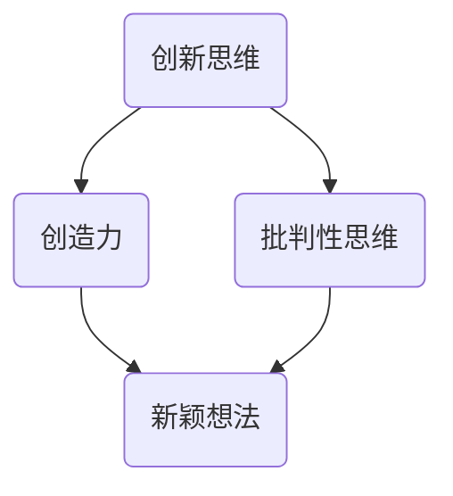

**算法原理讲解：**
创新思维的算法原理可以简化为以下步骤：
1. 识别问题或机会。
2. 收集相关信息。
3. 进行创造性思维。
4. 分析和评估创意。
5. 实施和验证创意。

**数学模型和公式：**
创新思维的数学模型可以表示为：
\[ 创新思维 = f(问题, 信息, 创造力, 批判性思维) \]

**示例：**
假设一个公司面临市场份额下降的问题，领导者需要通过创新思维来解决这个问题。首先，领导者需要识别问题（市场份额下降），然后收集相关信息（市场数据、竞争对手分析等）。接下来，领导者需要进行创造性思维，产生可能的解决方案（如产品创新、市场拓展等）。最后，领导者需要分析和评估这些创意，并选择最佳方案进行实施和验证。

**系统分析与架构设计方案：**

**问题场景介绍：**
公司市场份额下降，需要通过创新思维来提升竞争力。

**项目介绍：**
创新思维项目旨在通过一系列方法和技巧，提升公司创新能力和竞争力。

**系统功能设计（领域模型类图）：**

```mermaid
classDiagram
Class1 <|-- Class2
Class1 <|-- Class3
Class2 +-- Product
Class2 +-- Market
Class3 +-- Data
Class3 +-- Analysis
Class3 +-- Creativity
```

**系统架构设计（架构图）：**

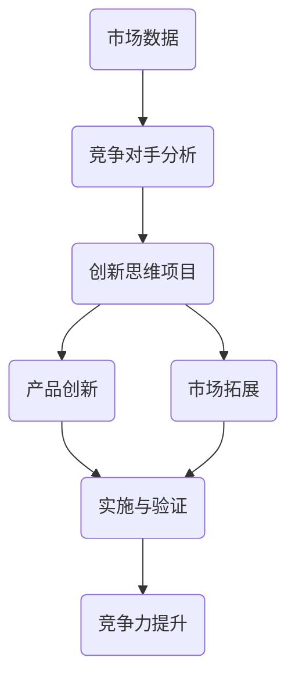

**系统接口设计和系统交互（序列图）：**

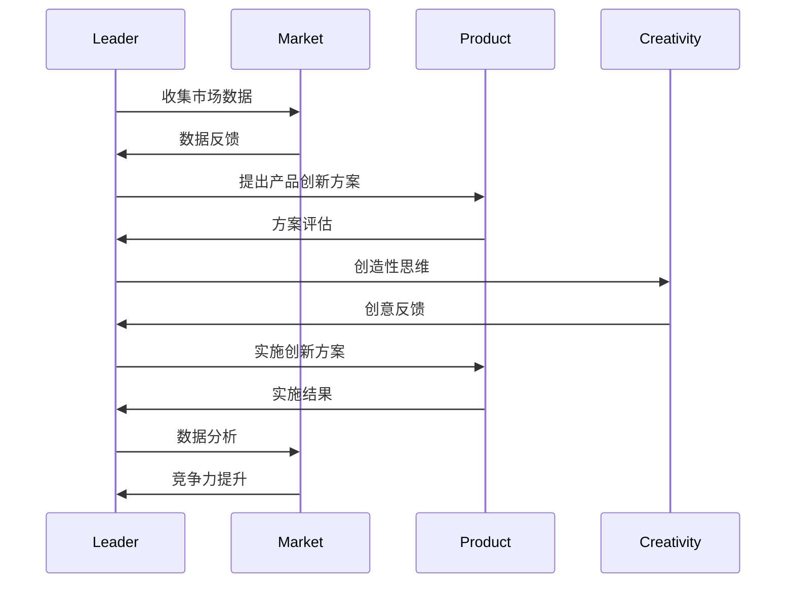

**项目实战：**
1. **环境安装：** 安装相关工具和软件，如思维导图工具、项目管理软件等。
2. **系统核心实现源代码：**
   ```python
   # 创新思维项目核心代码示例
   def innovate(problem, information, creativity, critical_thinking):
       # 识别问题
       identified_problem = identify_problem(problem)
       
       # 收集相关信息
       collected_info = collect_info(information)
       
       # 进行创造性思维
       creative_thoughts = generate_creativity(creativity)
       
       # 分析和评估创意
       evaluated_creativity = evaluate_creativity(creative_thoughts, collected_info)
       
       # 实施和验证创意
       implemented_creativity = implement_and_verify(evaluated_creativity)
       
       return implemented_creativity
   ```
3. **代码应用解读与分析：** 对代码进行逐行解读，解释每个步骤的功能和逻辑。
4. **实际案例分析和详细讲解剖析：** 分析实际案例，展示创新思维如何在实际环境中得到应用。
5. **项目小结：** 总结项目实施过程中的经验教训，提出改进建议。

**最佳实践 Tips：**
- 保持开放心态，鼓励团队成员提出不同意见和创意。
- 创造一个安全的环境，让团队成员能够自由表达想法。
- 定期举行创新会议，讨论和评估新的创意。

**小结：**
创新思维是领导者推动组织发展的重要工具。通过了解创新思维的重要性、核心概念、算法原理，以及系统分析与架构设计方案，领导者可以更好地引导和激发团队的创新能力。

----------------------------------------------------------------

### 第2章：领导者与创新思维

**背景介绍：**
领导者在创新过程中起着至关重要的作用。他们不仅需要具备创新思维，还需要掌握如何引导和激发团队成员的创新潜能。

**核心概念与联系：**
领导者（Leader）是指在组织中具有影响力和权威，能够引导和激励团队成员的人。创新思维（Innovation Thinking）是指通过创造性思维和逻辑推理，解决复杂问题、发现新机会或改进现有产品和服务的能力。

**算法原理讲解：**
领导者在创新过程中的算法原理可以简化为以下步骤：
1. 识别问题和机会。
2. 建立创新团队。
3. 激发团队成员的创意。
4. 推动创意转化为实际成果。

**数学模型和公式：**
创新领导者（Innovation Leader）的数学模型可以表示为：
\[ 创新领导者 = f(领导能力, 创新思维, 团队协作, 创新文化) \]

**示例：**
假设一个公司需要开发一款新产品，领导者需要通过创新思维来推动这个项目。首先，领导者需要识别新产品开发的问题和机会。然后，领导者需要建立一支由不同部门和背景的员工组成的创新团队。接下来，领导者需要激发团队成员的创意，并推动这些创意转化为实际的产品设计。最后，领导者需要确保团队协作，确保项目按时完成并达到预期效果。

**系统分析与架构设计方案：**

**问题场景介绍：**
公司需要开发一款新产品，领导者需要通过创新思维来推动这个项目。

**项目介绍：**
创新思维项目旨在通过一系列方法和技巧，推动新产品开发项目的成功。

**系统功能设计（领域模型类图）：**

```mermaid
classDiagram
Class1 <|-- Class2
Class1 <|-- Class3
Class2 +-- Product
Class2 +-- Team
Class3 +-- Creativity
Class3 +-- Collaboration
```

**系统架构设计（架构图）：**

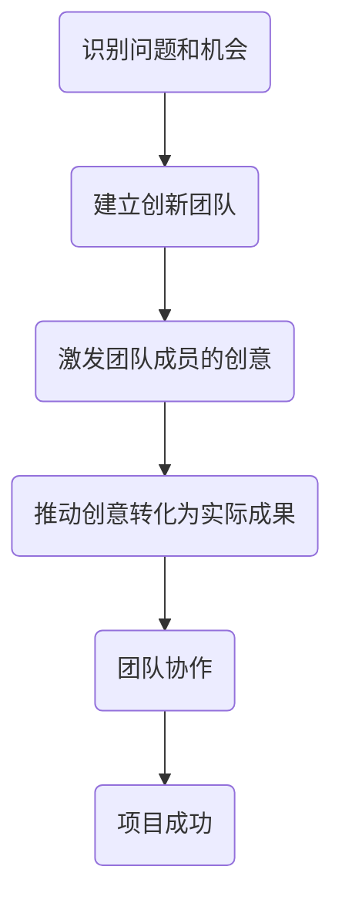

**系统接口设计和系统交互（序列图）：**

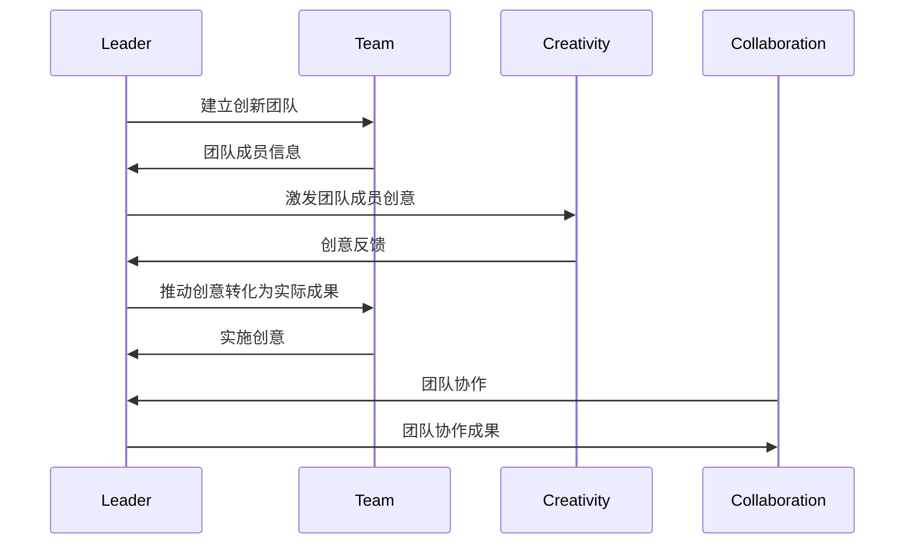

**项目实战：**
1. **环境安装：** 安装相关工具和软件，如项目管理软件、协作工具等。
2. **系统核心实现源代码：**
   ```python
   # 创新思维项目核心代码示例
   def innovate_product(leader, team, creativity, collaboration):
       # 识别问题和机会
       problems_opportunities = leader.identify_problems_opportunities()
       
       # 建立创新团队
       innovative_team = leader.build_innovative_team(team)
       
       # 激发团队成员的创意
       creative_ideas = creativity.exploit_member_creativity(innovative_team)
       
       # 推动创意转化为实际成果
       implemented_ideas = leader.push_ideas_to_actual_outcomes(creative_ideas, team)
       
       # 团队协作
       collaboration成果 = collaboration.promote_collaboration(innovative_team)
       
       return collaboration成果
   ```
3. **代码应用解读与分析：** 对代码进行逐行解读，解释每个步骤的功能和逻辑。
4. **实际案例分析和详细讲解剖析：** 分析实际案例，展示领导者如何通过创新思维推动新产品开发项目。
5. **项目小结：** 总结项目实施过程中的经验教训，提出改进建议。

**最佳实践 Tips：**
- 建立跨部门团队，促进不同领域的知识交流和创意碰撞。
- 提供充足的时间和资源，让团队成员能够全身心投入到创新项目中。
- 鼓励团队成员分享创新经验和最佳实践，形成良好的创新文化。

**小结：**
领导者是创新思维的重要推动者。通过建立创新团队、激发团队成员的创意，以及推动创意转化为实际成果，领导者可以有效地推动组织在竞争激烈的环境中实现持续发展。

----------------------------------------------------------------

### 第3章：激发创意的心理学原理

**背景介绍：**
创意的产生并非偶然，而是受到多种心理学原理的影响。了解这些原理有助于领导者更好地激发和引导团队成员的创意。

**核心概念与联系：**
心理学原理（Psychological Principles）是指心理学研究中的一系列概念和理论，用于解释人类行为和思维过程。创意（Creativity）是指产生新颖、有价值的想法和解决方案的能力。

**算法原理讲解：**
激发创意的心理学原理可以简化为以下步骤：
1. 创造开放的环境。
2. 提供激励。
3. 培养思维灵活性。
4. 鼓励跨学科交流。

**数学模型和公式：**
激发创意的心理学原理的数学模型可以表示为：
\[ 创意 = f(环境, 激励, 思维灵活性, 跨学科交流) \]

**示例：**
假设一个团队需要开发一款新的产品，领导者希望通过心理学原理来激发团队的创意。首先，领导者需要创造一个开放的环境，鼓励团队成员自由表达想法。然后，领导者可以提供激励，如奖励、晋升机会等，以激发团队成员的积极性。此外，领导者还可以培养团队成员的思维灵活性，通过跨学科交流，促进不同领域的知识碰撞。

**系统分析与架构设计方案：**

**问题场景介绍：**
团队需要开发一款新的产品，领导者希望通过心理学原理来激发团队的创意。

**项目介绍：**
创意激发项目旨在通过心理学原理，提升团队的创造力和创新能力。

**系统功能设计（领域模型类图）：**

```mermaid
classDiagram
Class1 <|-- Class2
Class1 <|-- Class3
Class2 +-- Environment
Class2 +-- Incentives
Class3 +-- Flexibility
Class3 +-- Interdisciplinary
```

**系统架构设计（架构图）：**

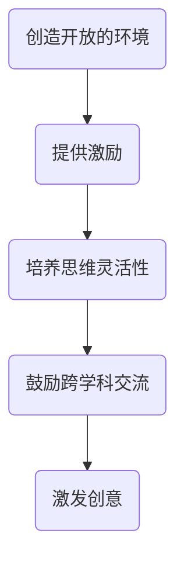

**系统接口设计和系统交互（序列图）：**

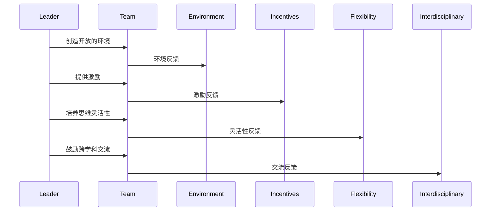

**项目实战：**
1. **环境安装：** 安装相关工具和软件，如协作平台、项目管理软件等。
2. **系统核心实现源代码：**
   ```python
   # 创意激发项目核心代码示例
   def inspire_creativity(leader, team, environment, incentives, flexibility, interdisciplinary):
       # 创造开放的环境
       open_environment = leader.create_open_environment(team)
       
       # 提供激励
       provided_incentives = incentives.provide_incentives(team)
       
       # 培养思维灵活性
       enhanced_flexibility = flexibility.improve_thinking_flexibility(team)
       
       # 鼓励跨学科交流
       promoted_interdisciplinary = interdisciplinary.encourage_interdisciplinary_communication(team)
       
       # 激发创意
       inspired_creativity = open_environment.provide_ideas(provided_incentives, enhanced_flexibility, promoted_interdisciplinary)
       
       return inspired_creativity
   ```
3. **代码应用解读与分析：** 对代码进行逐行解读，解释每个步骤的功能和逻辑。
4. **实际案例分析和详细讲解剖析：** 分析实际案例，展示心理学原理如何激发团队的创意。
5. **项目小结：** 总结项目实施过程中的经验教训，提出改进建议。

**最佳实践 Tips：**
- 定期组织团队建设活动，增强团队凝聚力和信任感。
- 提供个性化激励，满足不同团队成员的需求。
- 创造多样化的工作环境，激发团队的创意思维。

**小结：**
了解心理学原理有助于领导者更好地激发和引导团队成员的创意。通过创造开放的环境、提供激励、培养思维灵活性，以及鼓励跨学科交流，领导者可以有效地激发团队的创造力，推动组织实现持续创新。

----------------------------------------------------------------

## 第4章：头脑风暴技巧

**背景介绍：**
头脑风暴（Brainstorming）是一种常见的创意激发方法，旨在通过集思广益，产生大量的创意。有效的头脑风暴能够激发团队的创造力，为创新项目提供丰富的创意资源。

**核心概念与联系：**
头脑风暴（Brainstorming）是指通过集体讨论，自由地提出各种想法，以激发创意的过程。头脑风暴技巧（Brainstorming Techniques）包括引导技巧、分组讨论、头脑风暴会议等。

**算法原理讲解：**
头脑风暴的算法原理可以简化为以下步骤：
1. 确定主题。
2. 创造自由表达的氛围。
3. 鼓励多样化的想法。
4. 记录所有创意。
5. 评估和筛选创意。

**数学模型和公式：**
头脑风暴的数学模型可以表示为：
\[ 头脑风暴 = f(主题, 自由表达, 多样化想法, 创意记录, 评估筛选) \]

**示例：**
假设一个团队需要开发一款新产品，领导者希望通过头脑风暴来激发创意。首先，领导者需要明确产品开发的主题。然后，领导者需要创造一个自由表达的氛围，鼓励团队成员提出各种想法。接下来，领导者需要记录所有创意，并鼓励团队成员互相讨论和补充。最后，领导者需要评估和筛选创意，选择最具潜力的创意进行进一步开发。

**系统分析与架构设计方案：**

**问题场景介绍：**
团队需要开发一款新产品，领导者希望通过头脑风暴来激发创意。

**项目介绍：**
头脑风暴项目旨在通过一系列方法和技巧，激发团队的创造力，为新产品开发提供丰富的创意资源。

**系统功能设计（领域模型类图）：**

```mermaid
classDiagram
Class1 <|-- Class2
Class1 <|-- Class3
Class2 +-- Subject
Class2 +-- Atmosphere
Class3 +-- Ideas
Class3 +-- Discussion
Class3 +-- Recording
Class3 +-- Evaluation
```

**系统架构设计（架构图）：**

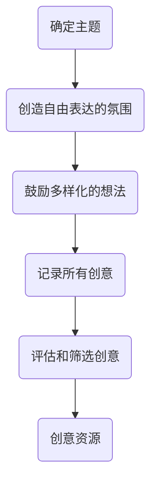

**系统接口设计和系统交互（序列图）：**

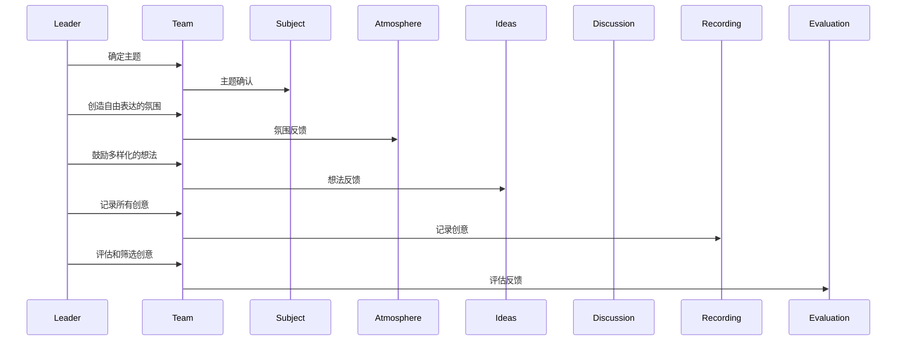

**项目实战：**
1. **环境安装：** 安装相关工具和软件，如头脑风暴平台、项目管理软件等。
2. **系统核心实现源代码：**
   ```python
   # 头脑风暴项目核心代码示例
   def brainstorming(leader, team, subject, atmosphere, ideas, discussion, recording, evaluation):
       # 确定主题
       confirmed_subject = leader.confirm_subject(subject)
       
       # 创造自由表达的氛围
       free_atmosphere = leader.create_free_atmosphere(atmosphere)
       
       # 鼓励多样化的想法
       diverse_ideas = leader.encourage_diverse_ideas(ideas)
       
       # 记录所有创意
       recorded_ideas = recording.record_ideas(diverse_ideas)
       
       # 评估和筛选创意
       evaluated_ideas = evaluation.evaluate_ideas(recorded_ideas)
       
       # 创意资源
       creative_resources = evaluation筛选创意
       
       return creative_resources
   ```
3. **代码应用解读与分析：** 对代码进行逐行解读，解释每个步骤的功能和逻辑。
4. **实际案例分析和详细讲解剖析：** 分析实际案例，展示头脑风暴如何激发团队的创意。
5. **项目小结：** 总结项目实施过程中的经验教训，提出改进建议。

**最佳实践 Tips：**
- 确保所有团队成员都能自由表达自己的想法，无论这些想法是否合理。
- 鼓励团队成员互相讨论和补充，以产生更多创意。
- 评估和筛选创意时，注重创意的创新性和实用性。

**小结：**
头脑风暴是一种有效的创意激发方法。通过确定主题、创造自由表达的氛围、鼓励多样化的想法、记录所有创意，以及评估和筛选创意，领导者可以有效地激发团队的创造力，为创新项目提供丰富的创意资源。

----------------------------------------------------------------

### 第5章：设计思维方法

**背景介绍：**
设计思维（Design Thinking）是一种以人为中心的问题解决方法，它强调同理心、创新和迭代。设计思维方法被广泛应用于产品开发、服务设计和创新项目中，以其灵活性和实用性而受到赞誉。

**核心概念与联系：**
设计思维（Design Thinking）是一种以用户需求为导向的问题解决方法，它通过同理心、定义问题、创意生成、原型设计和测试迭代等步骤，帮助团队创造有价值的产品和服务。

**算法原理讲解：**
设计思维的算法原理可以简化为以下步骤：
1. 同理心：了解用户需求。
2. 定义问题：明确问题陈述。
3. 创意生成：产生各种解决方案。
4. 原型设计：创建原型并进行测试。
5. 测试迭代：根据反馈进行改进。

**数学模型和公式：**
设计思维的数学模型可以表示为：
\[ 设计思维 = f(同理心, 定义问题, 创意生成, 原型设计, 测试迭代) \]

**示例：**
假设一个团队需要开发一款新的手机应用程序，领导者希望通过设计思维方法来推动这个项目。首先，领导者需要通过同理心了解用户的需求和痛点。然后，领导者需要明确问题陈述，以便团队有一个清晰的目标。接下来，团队需要通过创意生成，提出各种解决方案。随后，团队需要创建原型，并邀请用户进行测试和反馈。最后，团队根据用户反馈进行迭代改进，以确保产品满足用户需求。

**系统分析与架构设计方案：**

**问题场景介绍：**
团队需要开发一款新的手机应用程序，领导者希望通过设计思维方法来推动这个项目。

**项目介绍：**
设计思维项目旨在通过一系列方法和技巧，以用户需求为导向，开发出有价值的产品。

**系统功能设计（领域模型类图）：**

```mermaid
classDiagram
Class1 <|-- Class2
Class1 <|-- Class3
Class2 +-- Empathy
Class2 +-- ProblemDefinition
Class3 +-- Creativity
Class3 +-- Prototyping
Class3 +-- Testing
Class3 +-- Iteration
```

**系统架构设计（架构图）：**

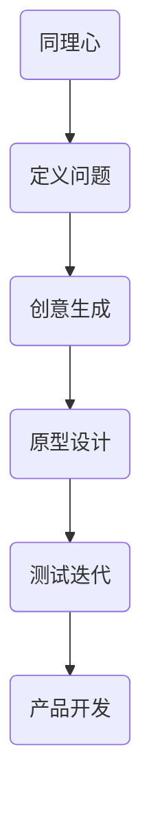

**系统接口设计和系统交互（序列图）：**

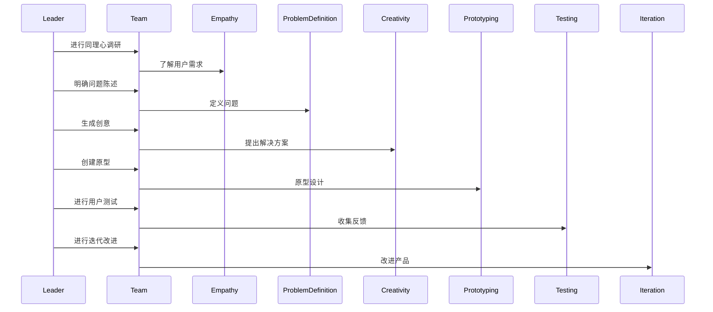

**项目实战：**
1. **环境安装：** 安装相关工具和软件，如原型设计工具、用户测试工具等。
2. **系统核心实现源代码：**
   ```python
   # 设计思维项目核心代码示例
   def design_thinking(leader, team, empathy, problem_definition, creativity, prototyping, testing):
       # 进行同理心调研
       user_needs = empathy.conduct_empathy_research(team)
       
       # 明确问题陈述
       problem_statement = problem_definition.define_problem(user_needs)
       
       # 生成创意
       creative_solutions = creativity.generate_creativity(problem_statement)
       
       # 创建原型
       prototype = prototyping.create_prototype(creative_solutions)
       
       # 进行用户测试
       user_feedback = testing.perform_user_testing(prototype)
       
       # 进行迭代改进
       improved_product = testing.iterate_improvement(user_feedback)
       
       return improved_product
   ```
3. **代码应用解读与分析：** 对代码进行逐行解读，解释每个步骤的功能和逻辑。
4. **实际案例分析和详细讲解剖析：** 分析实际案例，展示设计思维方法如何推动产品开发。
5. **项目小结：** 总结项目实施过程中的经验教训，提出改进建议。

**最佳实践 Tips：**
- 在同理心阶段，确保深入了解用户的需求和痛点。
- 在原型设计阶段，尽量简化原型，以快速测试和反馈。
- 在测试迭代阶段，注重用户反馈，持续改进产品。

**小结：**
设计思维方法是一种以用户需求为导向的问题解决方法，通过同理心、定义问题、创意生成、原型设计和测试迭代，帮助团队开发出有价值的产品和服务。领导者通过掌握设计思维方法，可以更好地引导团队进行创新项目，提高产品的用户满意度。

----------------------------------------------------------------

### 第6章：跨界思维与创新

**背景介绍：**
跨界思维（Cross-disciplinary Thinking）是指在不同领域之间进行知识交流和思维碰撞，以激发创新的思维方式。在全球化背景下，跨界思维已成为推动创新的重要手段。

**核心概念与联系：**
跨界思维（Cross-disciplinary Thinking）是指将不同领域的知识、方法和技术进行融合，以解决复杂问题或创造新的价值。跨界思维与创新（Innovation through Cross-disciplinary Thinking）是指通过跨界思维，推动创新项目的成功。

**算法原理讲解：**
跨界思维的算法原理可以简化为以下步骤：
1. 确定跨界目标。
2. 融合不同领域的知识。
3. 促进思维碰撞。
4. 创造新的解决方案。

**数学模型和公式：**
跨界思维的数学模型可以表示为：
\[ 跨界思维 = f(跨界目标, 知识融合, 思维碰撞, 创造新解决方案) \]

**示例：**
假设一个团队需要开发一款具有创新性的医疗设备，领导者希望通过跨界思维来推动这个项目。首先，领导者需要明确跨界目标，即开发一款能够提高病人治疗效果的医疗设备。然后，领导者需要融合不同领域的知识，如医学、工程学、信息技术等。接下来，领导者需要促进团队内的思维碰撞，以激发新的创意。最后，领导者需要创造新的解决方案，并将其转化为实际的产品设计。

**系统分析与架构设计方案：**

**问题场景介绍：**
团队需要开发一款具有创新性的医疗设备，领导者希望通过跨界思维来推动这个项目。

**项目介绍：**
跨界思维项目旨在通过不同领域的知识交流和思维碰撞，推动创新医疗设备的开发。

**系统功能设计（领域模型类图）：**

```mermaid
classDiagram
Class1 <|-- Class2
Class1 <|-- Class3
Class2 +-- Cross-disciplinary
Class2 +-- Knowledge Fusion
Class3 +-- Mind collision
Class3 +-- New Solutions
```

**系统架构设计（架构图）：**

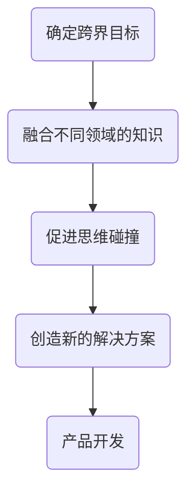

**系统接口设计和系统交互（序列图）：**

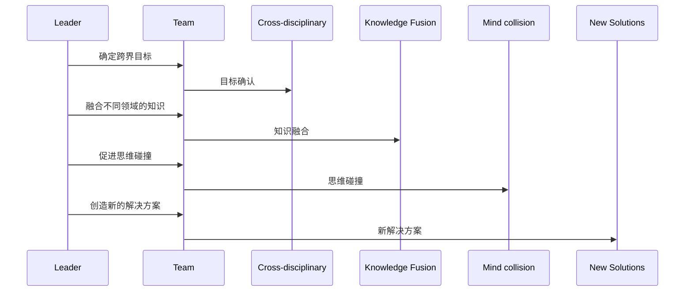

**项目实战：**
1. **环境安装：** 安装相关工具和软件，如知识管理平台、协作工具等。
2. **系统核心实现源代码：**
   ```python
   # 跨界思维项目核心代码示例
   def cross_disciplinary_innovation(leader, team, cross_disciplinary, knowledge_fusion, mind_collision, new_solutions):
       # 确定跨界目标
       cross_disciplinary_goal = leader.define_cross_disciplinary_goal(team)
       
       # 融合不同领域的知识
       integrated_knowledge = knowledge_fusion.integrate_different_fields(team)
       
       # 促进思维碰撞
       mind_collisions = mind_collision.encourage_mind_collision(team)
       
       # 创造新的解决方案
       innovative_solutions = new_solutions.create_innovative_solutions(mind_collisions)
       
       # 产品开发
       product_development = new_solutions.develop_product(innovative_solutions)
       
       return product_development
   ```
3. **代码应用解读与分析：** 对代码进行逐行解读，解释每个步骤的功能和逻辑。
4. **实际案例分析和详细讲解剖析：** 分析实际案例，展示跨界思维如何推动创新医疗设备的开发。
5. **项目小结：** 总结项目实施过程中的经验教训，提出改进建议。

**最佳实践 Tips：**
- 建立跨学科团队，确保团队成员具备不同的专业知识和经验。
- 定期组织跨界交流活动，促进团队成员之间的知识交流和思维碰撞。
- 鼓励团队成员勇于尝试，勇于创新，不畏失败。

**小结：**
跨界思维是一种有效的创新方法，通过融合不同领域的知识、促进思维碰撞，可以激发创新灵感，推动项目成功。领导者通过掌握跨界思维，可以更好地引导团队在跨学科领域进行创新，提升组织的竞争力。

----------------------------------------------------------------

### 第7章：敏捷创新方法

**背景介绍：**
敏捷创新（Agile Innovation）是一种以快速迭代、持续改进为核心理念的创新方法。它强调快速响应市场变化、提高产品交付效率，并通过不断学习和优化，实现持续创新。

**核心概念与联系：**
敏捷创新（Agile Innovation）是一种灵活、高效的问题解决方法，它通过迭代、反馈和持续改进，推动组织的创新过程。敏捷创新方法（Agile Innovation Methods）包括迭代开发、用户反馈、快速原型和持续学习等。

**算法原理讲解：**
敏捷创新的算法原理可以简化为以下步骤：
1. 确定创新目标。
2. 进行迭代开发。
3. 收集用户反馈。
4. 优化和调整。
5. 持续学习和改进。

**数学模型和公式：**
敏捷创新的数学模型可以表示为：
\[ 敏捷创新 = f(迭代开发, 用户反馈, 优化调整, 持续学习) \]

**示例：**
假设一个团队需要开发一款新的软件产品，领导者希望通过敏捷创新方法来推动这个项目。首先，领导者需要明确创新目标，即开发一款能够满足用户需求的软件产品。然后，团队进行迭代开发，每次迭代都包括需求分析、设计、开发和测试等环节。接下来，团队收集用户反馈，了解产品的优点和不足。最后，团队根据用户反馈进行优化和调整，确保产品持续改进。

**系统分析与架构设计方案：**

**问题场景介绍：**
团队需要开发一款新的软件产品，领导者希望通过敏捷创新方法来推动这个项目。

**项目介绍：**
敏捷创新项目旨在通过快速迭代、用户反馈和持续改进，推动软件产品的开发。

**系统功能设计（领域模型类图）：**

```mermaid
classDiagram
Class1 <|-- Class2
Class1 <|-- Class3
Class2 +-- Innovation Goal
Class2 +-- Iterative Development
Class3 +-- User Feedback
Class3 +-- Optimization
Class3 +-- Continuous Learning
```

**系统架构设计（架构图）：**

```mermaid
graph TD
A(确定创新目标) --> B(迭代开发)
B --> C(收集用户反馈)
C --> D(优化和调整)
D --> E(持续学习)
E --> F(产品交付)
```

**系统接口设计和系统交互（序列图）：**

```mermaid
sequenceDiagram
Participant Leader
Participant Team
Participant Innovation Goal
Participant Iterative Development
Participant User Feedback
Participant Optimization
Participant Continuous Learning
Leader->>Team: 确定创新目标
Team->>Innovation Goal: 目标确认
Leader->>Team: 进行迭代开发
Team->>Iterative Development: 开发流程
Leader->>Team: 收集用户反馈
Team->>User Feedback: 反馈收集
Leader->>Team: 优化和调整
Team->>Optimization: 产品优化
Leader->>Team: 持续学习
Team->>Continuous Learning: 学习优化
```

**项目实战：**
1. **环境安装：** 安装相关工具和软件，如敏捷开发平台、用户反馈工具等。
2. **系统核心实现源代码：**
   ```python
   # 敏捷创新项目核心代码示例
   def agile_innovation(leader, team, innovation_goal, iterative_development, user_feedback, optimization, continuous_learning):
       # 确定创新目标
       innovation_objective = leader.define_innovation_objective(team)
       
       # 进行迭代开发
       iterative_process = iterative_development.perform_iterative_development(team)
       
       # 收集用户反馈
       user_insights = user_feedback.collect_user_insights(iterative_process)
       
       # 优化和调整
       optimized_product = optimization.optimize_and_adjust(user_insights)
       
       # 持续学习
       continuous_improvement = continuous_learning.continuously_improve(optimized_product)
       
       return continuous_improvement
   ```
3. **代码应用解读与分析：** 对代码进行逐行解读，解释每个步骤的功能和逻辑。
4. **实际案例分析和详细讲解剖析：** 分析实际案例，展示敏捷创新方法如何推动软件产品的开发。
5. **项目小结：** 总结项目实施过程中的经验教训，提出改进建议。

**最佳实践 Tips：**
- 确保团队成员具备敏捷开发的技能和知识。
- 定期进行用户反馈收集，以便快速调整产品方向。
- 鼓励团队成员持续学习，不断提升自身能力。

**小结：**
敏捷创新方法是一种以快速迭代、用户反馈和持续改进为核心理念的创新方法。通过迭代开发、用户反馈、优化调整和持续学习，团队可以快速响应市场变化，提高产品交付效率，实现持续创新。领导者通过掌握敏捷创新方法，可以更好地推动团队在竞争激烈的环境中取得成功。

----------------------------------------------------------------

### 第8章：创意管理技巧

**背景介绍：**
创意管理（Creative Management）是指对创意的产生、发展、实施和评估进行系统化管理的过程。有效的创意管理能够确保创意资源的充分利用，提升组织的创新能力。

**核心概念与联系：**
创意管理（Creative Management）是指通过一系列方法和技巧，对创意进行有效管理，以实现创意的商业价值。创意管理技巧（Creative Management Techniques）包括创意识别、创意筛选、创意实施和创意评估等。

**算法原理讲解：**
创意管理的算法原理可以简化为以下步骤：
1. 创意识别：发现和组织创意。
2. 创意筛选：评估和选择最具潜力的创意。
3. 创意实施：将创意转化为实际成果。
4. 创意评估：评估创意的实施效果。

**数学模型和公式：**
创意管理的数学模型可以表示为：
\[ 创意管理 = f(创意识别, 创意筛选, 创意实施, 创意评估) \]

**示例：**
假设一个团队需要管理一系列创意，以推动新产品的开发。首先，团队需要进行创意识别，收集各种创意来源。然后，团队需要评估和筛选创意，选择最具潜力的创意进行开发。接下来，团队需要将筛选出的创意转化为实际的产品设计，并实施和验证。最后，团队需要对创意的实施效果进行评估，以便进行持续改进。

**系统分析与架构设计方案：**

**问题场景介绍：**
团队需要管理一系列创意，以推动新产品的开发。

**项目介绍：**
创意管理项目旨在通过一系列方法和技巧，有效管理创意资源，推动新产品的开发。

**系统功能设计（领域模型类图）：**

```mermaid
classDiagram
Class1 <|-- Class2
Class1 <|-- Class3
Class2 +-- Idea Identification
Class2 +-- Idea Screening
Class3 +-- Idea Implementation
Class3 +-- Idea Evaluation
```

**系统架构设计（架构图）：**

```mermaid
graph TD
A(创意识别) --> B(创意筛选)
B --> C(创意实施)
C --> D(创意评估)
D --> E(产品开发)
```

**系统接口设计和系统交互（序列图）：**

```mermaid
sequenceDiagram
Participant Leader
Participant Team
Participant Idea Identification
Participant Idea Screening
Participant Idea Implementation
Participant Idea Evaluation
Leader->>Team: 进行创意识别
Team->>Idea Identification: 收集创意
Leader->>Team: 创意筛选
Team->>Idea Screening: 评估创意
Leader->>Team: 创意实施
Team->>Idea Implementation: 实施创意
Leader->>Team: 创意评估
Team->>Idea Evaluation: 评估实施效果
```

**项目实战：**
1. **环境安装：** 安装相关工具和软件，如创意管理平台、项目管理软件等。
2. **系统核心实现源代码：**
   ```python
   # 创意管理项目核心代码示例
   def creative_management(leader, team, idea_identification, idea_screening, idea_implementation, idea_evaluation):
       # 进行创意识别
       collected_ideas = idea_identification.collect_ideas(team)
       
       # 创意筛选
       selected_ideas = idea_screening.screen_ideas(collected_ideas)
       
       # 创意实施
       implemented_ideas = idea_implementation.implement_ideas(selected_ideas)
       
       # 创意评估
       evaluation_results = idea_evaluation.evaluate_implementation(implemented_ideas)
       
       # 产品开发
       product_development = idea_evaluation.create_product(evaluation_results)
       
       return product_development
   ```
3. **代码应用解读与分析：** 对代码进行逐行解读，解释每个步骤的功能和逻辑。
4. **实际案例分析和详细讲解剖析：** 分析实际案例，展示创意管理技巧如何推动新产品的开发。
5. **项目小结：** 总结项目实施过程中的经验教训，提出改进建议。

**最佳实践 Tips：**
- 建立创意管理的流程和规范，确保创意管理的系统性和高效性。
- 鼓励团队成员积极参与创意管理，提高创意的质量和数量。
- 定期对创意管理流程进行评估和优化，确保创意管理能够满足组织的实际需求。

**小结：**
创意管理技巧是确保创意资源充分利用的重要手段。通过创意识别、创意筛选、创意实施和创意评估，团队可以有效地管理创意资源，推动新产品的开发。领导者通过掌握创意管理技巧，可以更好地提升组织的创新能力，实现持续发展。

----------------------------------------------------------------

## 第9章：创新实践案例解析

### 案例一：苹果公司的创新之路

**背景介绍：**
苹果公司（Apple Inc.）是全球知名的高科技企业，以其创新的产品和服务而闻名。自1976年成立以来，苹果公司不断推动技术创新，成为全球最具价值的品牌之一。

**核心内容与详细讲解：**
苹果公司的创新之路可以从以下几个关键方面进行解析：

1. **领导者的角色：** 乔布斯（Steve Jobs）是苹果公司的创始人之一，他以其独特的领导风格和远见卓识，推动了苹果公司的创新。乔布斯善于发现市场需求，并将其转化为创新产品。

2. **设计思维的应用：** 苹果公司广泛采用设计思维方法，从用户需求出发，不断优化产品设计。例如，iPhone的设计经历了多个迭代，从最初的翻盖手机到现在的全面屏，每个版本都更加符合用户的操作习惯。

3. **跨界思维的运用：** 苹果公司在多个领域进行跨界创新，如将音乐与科技结合，推出了iPod和iTunes；将手机与互联网结合，推出了iPhone和App Store。这些创新不仅改变了相应行业，也推动了整个科技行业的发展。

4. **敏捷创新方法的实践：** 苹果公司采用敏捷开发方法，快速迭代产品，确保产品能够及时响应市场需求。例如，iPhone每年都会推出新版本，不断改进和完善。

**边界与外延：**
- **边界：** 苹果公司的创新主要聚焦于消费电子领域，其成功案例主要涉及智能手机、平板电脑、笔记本电脑等。
- **外延：** 苹果公司的创新思维和方法可以应用于其他行业，如医疗、教育等。

**系统分析与架构设计方案：**

**问题场景介绍：**
苹果公司如何通过创新思维推动产品发展。

**项目介绍：**
创新思维项目旨在分析苹果公司的创新实践，总结其成功经验。

**系统功能设计（领域模型类图）：**

```mermaid
classDiagram
Class1 <|-- Class2
Class1 <|-- Class3
Class2 +-- Leadership
Class2 +-- Design Thinking
Class3 +-- Cross-disciplinary Thinking
Class3 +-- Agile Innovation
```

**系统架构设计（架构图）：**

```mermaid
graph TD
A(领导者的角色) --> B(设计思维的应用)
B --> C(跨界思维的运用)
C --> D(敏捷创新方法的实践)
D --> E(产品发展)
```

**系统接口设计和系统交互（序列图）：**

```mermaid
sequenceDiagram
Participant Leader
Participant Team
Participant Design Thinking
Participant Cross-disciplinary Thinking
Participant Agile Innovation
Leader->>Team: 领导者角色
Team->>Design Thinking: 设计思维应用
Leader->>Team: 跨界思维运用
Team->>Cross-disciplinary Thinking: 跨界思维应用
Leader->>Team: 敏捷创新方法
Team->>Agile Innovation: 敏捷创新实践
```

**项目实战：**
1. **环境安装：** 安装相关工具和软件，如项目管理软件、设计思维工具等。
2. **系统核心实现源代码：**
   ```python
   # 创新思维项目核心代码示例
   def apple_innovation(leader, team, design_thinking, cross_disciplinary_thinking, agile_innovation):
       # 领导者的角色
       leader_role = leader.define_leader_role(team)
       
       # 设计思维的应用
       design_thinking_app = design_thinking.apply_design_thinking(team)
       
       # 跨界思维的运用
       cross_disciplinary_app = cross_disciplinary_thinking.apply_cross_disciplinary_thinking(team)
       
       # 敏捷创新方法的实践
       agile_innovation_practice = agile_innovation.practice_agile_innovation(team)
       
       # 产品发展
       product_growth = agile_innovation_practice.product_growth(team)
       
       return product_growth
   ```
3. **代码应用解读与分析：** 对代码进行逐行解读，解释每个步骤的功能和逻辑。
4. **实际案例分析和详细讲解剖析：** 分析苹果公司的实际案例，展示其创新实践的具体应用。
5. **项目小结：** 总结项目实施过程中的经验教训，提出改进建议。

**最佳实践 Tips：**
- 借鉴苹果公司的创新思维，重视领导者的角色和团队的协作。
- 采用设计思维方法，深入了解用户需求。
- 运用跨界思维，不断探索新的领域和应用。
- 实践敏捷创新方法，快速响应市场变化。

**小结：**
苹果公司的创新之路展示了领导者如何通过设计思维、跨界思维和敏捷创新方法，推动产品发展。通过深入分析苹果公司的成功经验，可以为其他组织提供有价值的借鉴。

----------------------------------------------------------------

### 案例二：谷歌的X实验室

**背景介绍：**
谷歌的X实验室（Google X）是谷歌公司的一个秘密研究部门，成立于2006年。该实验室致力于探索和开发具有颠覆性的科技项目，如谷歌眼镜、自动驾驶汽车等。

**核心内容与详细讲解：**
谷歌的X实验室通过以下几个关键方面推动科技创新：

1. **领导者的角色：** 谷歌的联合创始人谢尔盖·布林（Sergey Brin）和拉里·佩奇（Larry Page）是谷歌X实验室的创始人，他们提供了强大的支持和资源，鼓励实验室进行大胆的科技创新。

2. **创新文化的营造：** 谷歌X实验室致力于营造一个自由、开放和包容的创新文化，鼓励员工尝试新想法，并给予他们足够的自由度去实现这些想法。

3. **跨界合作的实践：** 谷歌X实验室与多个领域的企业和研究机构进行跨界合作，共同探索和解决复杂的问题。这种跨界合作有助于汇集不同的专业知识和技能，推动科技创新。

4. **敏捷创新方法的实践：** 谷歌X实验室采用敏捷创新方法，快速迭代开发项目，确保项目能够及时响应技术进步和市场变化。

**边界与外延：**
- **边界：** 谷歌X实验室的研究领域主要聚焦于高科技、人工智能、生物技术等前沿领域。
- **外延：** 谷歌X实验室的成功经验可以应用于其他科技创新组织，为它们提供创新文化和敏捷创新的实践借鉴。

**系统分析与架构设计方案：**

**问题场景介绍：**
谷歌X实验室如何推动科技创新。

**项目介绍：**
创新实验室项目旨在分析谷歌X实验室的运营模式和成功经验。

**系统功能设计（领域模型类图）：**

```mermaid
classDiagram
Class1 <|-- Class2
Class1 <|-- Class3
Class2 +-- Leadership
Class2 +-- Innovation Culture
Class3 +-- Cross-disciplinary Collaboration
Class3 +-- Agile Innovation
```

**系统架构设计（架构图）：**

```mermaid
graph TD
A(领导者的角色) --> B(创新文化的营造)
B --> C(跨界合作的实践)
C --> D(敏捷创新方法的实践)
D --> E(科技创新)
```

**系统接口设计和系统交互（序列图）：**

```mermaid
sequenceDiagram
Participant Leader
Participant Team
Participant Innovation Culture
Participant Cross-disciplinary Collaboration
Participant Agile Innovation
Leader->>Team: 领导者角色
Team->>Innovation Culture: 创新文化
Leader->>Team: 跨界合作
Team->>Cross-disciplinary Collaboration: 跨界合作
Leader->>Team: 敏捷创新
Team->>Agile Innovation: 敏捷创新实践
```

**项目实战：**
1. **环境安装：** 安装相关工具和软件，如创新实验室管理软件、协作工具等。
2. **系统核心实现源代码：**
   ```python
   # 创新实验室项目核心代码示例
   def google_x_lab(leader, team, innovation_culture, cross_disciplinary Collaboration, agile_innovation):
       # 领导者的角色
       leader_role = leader.define_leader_role(team)
       
       # 创新文化的营造
       built_innovation_culture = innovation_culture.create_innovation_culture(team)
       
       # 跨界合作的实践
       cross_collaboration = cross_disciplinary Collaboration.apply_cross_disciplinary_collaboration(team)
       
       # 敏捷创新方法的实践
       agile_innovation_practice = agile_innovation.practice_agile_innovation(team)
       
       # 科技创新
       technological_innovation = agile_innovation_practice.technology_innovation(team)
       
       return technological_innovation
   ```
3. **代码应用解读与分析：** 对代码进行逐行解读，解释每个步骤的功能和逻辑。
4. **实际案例分析和详细讲解剖析：** 分析谷歌X实验室的实际案例，展示其创新实践的详细应用。
5. **项目小结：** 总结项目实施过程中的经验教训，提出改进建议。

**最佳实践 Tips：**
- 建立开放和包容的创新文化，鼓励员工提出新想法。
- 与不同领域的企业和研究机构建立合作关系，共同探索创新。
- 采用敏捷创新方法，快速响应技术进步和市场变化。

**小结：**
谷歌的X实验室通过领导者的角色、创新文化的营造、跨界合作的实践和敏捷创新方法的实践，推动科技创新。谷歌X实验室的成功经验为其他科技创新组织提供了宝贵的借鉴。

----------------------------------------------------------------

### 案例三：丰田的创新模式

**背景介绍：**
丰田汽车公司（Toyota Motor Corporation）是日本著名的汽车制造商，以其卓越的质量管理和创新文化而闻名于世。丰田公司自1937年成立以来，一直致力于技术创新和效率提升。

**核心内容与详细讲解：**
丰田汽车公司的创新模式可以从以下几个方面进行解析：

1. **精益生产：** 丰田公司提出了精益生产（Lean Production）理念，通过消除浪费、优化流程，提高生产效率和产品质量。精益生产的核心思想是“"Just in Time”（即时不浪费），这一理念在丰田生产体系中得到广泛应用。

2. **持续改进：** 丰田公司倡导持续改进（Kaizen）文化，鼓励员工不断提出改进建议，并在日常工作中付诸实践。这种持续改进的文化使得丰田公司能够不断优化生产流程，提高产品竞争力。

3. **跨部门合作：** 丰田公司重视跨部门合作，通过跨部门团队（Cross-functional Teams）共同解决复杂问题。这种合作模式有助于不同部门之间分享知识和经验，促进创新。

4. **质量管理体系：** 丰田公司建立了全面的质量管理体系（Quality Management System），包括质量目标、质量控制和质量改进等方面。这一体系确保了丰田汽车的高质量和可靠性。

**边界与外延：**
- **边界：** 丰田公司的创新模式主要应用于汽车制造业，其核心思想可以应用于其他制造业和服务业。
- **外延：** 丰田公司的精益生产、持续改进和质量管理体系可以应用于其他行业的运营和管理。

**系统分析与架构设计方案：**

**问题场景介绍：**
丰田公司如何通过创新模式提升生产效率和产品质量。

**项目介绍：**
创新模式项目旨在分析丰田公司的成功经验，总结其创新模式的具体应用。

**系统功能设计（领域模型类图）：**

```mermaid
classDiagram
Class1 <|-- Class2
Class1 <|-- Class3
Class2 +-- Lean Production
Class2 +-- Continuous Improvement
Class3 +-- Cross-functional Collaboration
Class3 +-- Quality Management System
```

**系统架构设计（架构图）：**

```mermaid
graph TD
A(精益生产) --> B(持续改进)
B --> C(跨部门合作)
C --> D(质量管理体系)
D --> E(生产效率提升)
```

**系统接口设计和系统交互（序列图）：**

```mermaid
sequenceDiagram
Participant Leader
Participant Team
Participant Lean Production
Participant Continuous Improvement
Participant Cross-functional Collaboration
Participant Quality Management System
Leader->>Team: 精益生产
Team->>Lean Production: 优化生产流程
Leader->>Team: 持续改进
Team->>Continuous Improvement: 提出改进建议
Leader->>Team: 跨部门合作
Team->>Cross-functional Collaboration: 解决复杂问题
Leader->>Team: 质量管理体系
Team->>Quality Management System: 确保产品质量
```

**项目实战：**
1. **环境安装：** 安装相关工具和软件，如项目管理软件、质量管理系统等。
2. **系统核心实现源代码：**
   ```python
   # 创新模式项目核心代码示例
   def toyota_innovation(leader, team, lean_production, continuous_improvement, cross-functional_collaboration, quality_management_system):
       # 精益生产
       optimized_production = lean_production.optimize_production(team)
       
       # 持续改进
       continuous_improvement_suggestions = continuous_improvement.collect_suggestions(team)
       
       # 跨部门合作
       cross_collaboration_results = cross-functional_collaboration.solve_complex_problems(team)
       
       # 质量管理体系
       quality_management = quality_management_system.ensure_product_quality(team)
       
       # 生产效率提升
       improved_production_efficiency = quality_management_system.improve_production_efficiency(team)
       
       return improved_production_efficiency
   ```
3. **代码应用解读与分析：** 对代码进行逐行解读，解释每个步骤的功能和逻辑。
4. **实际案例分析和详细讲解剖析：** 分析丰田公司的实际案例，展示其创新模式的具体应用。
5. **项目小结：** 总结项目实施过程中的经验教训，提出改进建议。

**最佳实践 Tips：**
- 借鉴丰田公司的精益生产理念，优化生产流程，减少浪费。
- 推广持续改进文化，鼓励员工提出改进建议。
- 建立跨部门团队，促进不同部门之间的协作和知识共享。
- 建立质量管理体系，确保产品的高质量和可靠性。

**小结：**
丰田汽车公司的创新模式通过精益生产、持续改进、跨部门合作和质量管理体系，提升了生产效率和产品质量。丰田公司的成功经验为其他制造业和服务业提供了有价值的借鉴。

----------------------------------------------------------------

## 第10章：领导者如何推动创新

### 创新的文化营造

**背景介绍：**
创新文化是指一种鼓励和激发员工创新思维和行为的组织氛围。一个良好的创新文化能够激发员工的创造力，推动组织实现持续发展。

**核心内容与详细讲解：**
领导者要营造创新文化，需要从以下几个方面着手：

1. **鼓励创新思维：** 领导者应该鼓励员工勇于提出新的想法和解决方案，而不是仅仅满足于现状。领导者可以通过培训、研讨会和内部交流等方式，提高员工的创新意识。

2. **建立信任氛围：** 创新的过程中难免会遇到失败和挑战，领导者需要建立一种信任的氛围，让员工敢于尝试和面对失败。这种信任氛围有助于员工在创新过程中更加自信和积极。

3. **鼓励跨部门合作：** 创新往往需要不同部门之间的合作，领导者应该鼓励跨部门合作，促进不同领域的知识交流和思维碰撞。

4. **提供资源和支持：** 领导者需要为创新提供必要的资源和支持，如资金、技术和人力资源等。这有助于确保创新项目能够顺利实施和取得成果。

**边界与外延：**
- **边界：** 创新文化的营造主要涉及组织内部，领导者需要关注如何激发员工的创新潜力。
- **外延：** 创新文化的营造可以应用于不同类型的组织，如企业、学校和研究机构等。

**系统分析与架构设计方案：**

**问题场景介绍：**
领导者如何营造创新文化。

**项目介绍：**
创新文化项目旨在分析领导者如何营造创新文化，并提供具体实践指南。

**系统功能设计（领域模型类图）：**

```mermaid
classDiagram
Class1 <|-- Class2
Class1 <|-- Class3
Class2 +-- Encourage Innovation
Class2 +-- Build Trust
Class3 +-- Promote Interdepartmental Collaboration
Class3 +-- Provide Resources
```

**系统架构设计（架构图）：**

```mermaid
graph TD
A(鼓励创新思维) --> B(建立信任氛围)
B --> C(鼓励跨部门合作)
C --> D(提供资源和支持)
D --> E(创新文化)
```

**系统接口设计和系统交互（序列图）：**

```mermaid
sequenceDiagram
Participant Leader
Participant Team
Participant Encourage Innovation
Participant Build Trust
Participant Promote Interdepartmental Collaboration
Participant Provide Resources
Leader->>Team: 鼓励创新思维
Team->>Encourage Innovation: 创新思维培养
Leader->>Team: 建立信任氛围
Team->>Build Trust: 信任氛围营造
Leader->>Team: 鼓励跨部门合作
Team->>Promote Interdepartmental Collaboration: 跨部门合作
Leader->>Team: 提供资源和支持
Team->>Provide Resources: 资源支持
```

**项目实战：**
1. **环境安装：** 安装相关工具和软件，如创新思维工具、跨部门协作平台等。
2. **系统核心实现源代码：**
   ```python
   # 创新文化项目核心代码示例
   def build_innovation_culture(leader, team, encourage_innovation, build_trust, promote_interdepartmental_collaboration, provide_resources):
       # 鼓励创新思维
       innovation_mindset = encourage_innovation.encourage_mindset(team)
       
       # 建立信任氛围
       trust_ambiance = build_trust.create_ambiance(team)
       
       # 鼓励跨部门合作
       interdepartmental_collaboration = promote_interdepartmental_collaboration.encourage_collaboration(team)
       
       # 提供资源和支持
       resources_support = provide_resources.provide_support(team)
       
       # 创新文化
       innovation_culture = build_innovation_culture.create_culture(innovation_mindset, trust_ambiance, interdepartmental_collaboration, resources_support)
       
       return innovation_culture
   ```
3. **代码应用解读与分析：** 对代码进行逐行解读，解释每个步骤的功能和逻辑。
4. **实际案例分析和详细讲解剖析：** 分析实际案例，展示领导者如何营造创新文化。
5. **项目小结：** 总结项目实施过程中的经验教训，提出改进建议。

**最佳实践 Tips：**
- 鼓励员工参与创新项目，提供培训和指导，提高他们的创新能力。
- 建立跨部门协作机制，促进不同部门之间的沟通和合作。
- 定期评估创新文化的实施效果，及时调整和改进。

**小结：**
领导者通过鼓励创新思维、建立信任氛围、鼓励跨部门合作和提供资源和支持，可以营造一个良好的创新文化。这种创新文化有助于激发员工的创造力，推动组织实现持续创新和发展。

### 创新的资源配置

**背景介绍：**
创新的资源配置是指将组织内部的资源（如资金、人力、技术等）合理分配，以支持创新项目的实施和成功。有效的资源配置能够确保创新项目获得必要的资源，提高项目的成功率。

**核心内容与详细讲解：**
领导者要合理配置创新资源，需要考虑以下几个方面：

1. **资金分配：** 领导者需要确保创新项目有足够的资金支持，包括研发费用、市场推广费用等。资金分配应当根据项目的优先级和预期收益进行合理规划。

2. **人力配置：** 创新项目需要一支高素质的团队，领导者应当根据项目的需求，合理配置人力资源，确保团队成员具备所需的技能和经验。

3. **技术支持：** 创新项目往往需要先进的技术支持，领导者需要确保项目获得必要的技术资源，如研发工具、硬件设备等。

4. **资源优化：** 领导者应当不断优化资源配置，提高资源的利用效率。例如，通过共享资源、减少冗余、提高协作效率等方式，实现资源的最大化利用。

**边界与外延：**
- **边界：** 创新的资源配置主要涉及组织内部资源的管理和分配。
- **外延：** 创新的资源配置理念可以应用于不同类型的组织，如企业、学校和研究机构等。

**系统分析与架构设计方案：**

**问题场景介绍：**
领导者如何合理配置创新资源。

**项目介绍：**
创新资源配置项目旨在分析如何合理配置创新资源，提高项目的成功率。

**系统功能设计（领域模型类图）：**

```mermaid
classDiagram
Class1 <|-- Class2
Class1 <|-- Class3
Class2 +-- Financial Allocation
Class2 +-- Human Resource Allocation
Class3 +-- Technical Support
Class3 +-- Resource Optimization
```

**系统架构设计（架构图）：**

```mermaid
graph TD
A(资金分配) --> B(人力配置)
B --> C(技术支持)
C --> D(资源优化)
D --> E(项目成功)
```

**系统接口设计和系统交互（序列图）：**

```mermaid
sequenceDiagram
Participant Leader
Participant Team
Participant Financial Allocation
Participant Human Resource Allocation
Participant Technical Support
Participant Resource Optimization
Leader->>Team: 资金分配
Team->>Financial Allocation: 资金规划
Leader->>Team: 人力配置
Team->>Human Resource Allocation: 人力规划
Leader->>Team: 技术支持
Team->>Technical Support: 技术支持
Leader->>Team: 资源优化
Team->>Resource Optimization: 资源优化
```

**项目实战：**
1. **环境安装：** 安装相关工具和软件，如项目管理软件、资源规划工具等。
2. **系统核心实现源代码：**
   ```python
   # 创新资源配置项目核心代码示例
   def allocate_innovation_resources(leader, team, financial_allocation, human_resource_allocation, technical_support, resource_optimization):
       # 资金分配
       financial_plan = financial_allocation.allocate_funds(team)
       
       # 人力配置
       human_resource_plan = human_resource_allocation.allocate_resources(team)
       
       # 技术支持
       technical_support_plan = technical_support.provide_support(team)
       
       # 资源优化
       optimized_resources = resource_optimization.optimize_resources(team)
       
       # 项目成功
       project_success = resource_optimization.ensure_project_success(team)
       
       return project_success
   ```
3. **代码应用解读与分析：** 对代码进行逐行解读，解释每个步骤的功能和逻辑。
4. **实际案例分析和详细讲解剖析：** 分析实际案例，展示如何合理配置创新资源。
5. **项目小结：** 总结项目实施过程中的经验教训，提出改进建议。

**最佳实践 Tips：**
- 定期评估资源的使用情况，确保资源得到充分利用。
- 建立跨部门资源协调机制，提高资源分配的效率和公平性。
- 建立激励机制，鼓励员工积极参与资源优化。

**小结：**
领导者通过合理配置资金、人力和技术资源，并不断优化资源利用，可以确保创新项目获得必要的资源支持，提高项目的成功率。有效的资源配置是推动创新成功的重要保障。

### 创新的风险管理

**背景介绍：**
创新过程中不可避免地会面临各种风险，如技术风险、市场风险、资源风险等。有效的风险管理能够降低创新失败的可能性，提高创新的成功率。

**核心内容与详细讲解：**
领导者进行创新风险管理，需要从以下几个方面着手：

1. **风险识别：** 领导者需要识别创新过程中可能面临的各种风险，包括技术风险、市场风险、资源风险等。

2. **风险评估：** 对识别出的风险进行评估，确定其可能性和影响程度。这有助于领导者了解风险的严重性，并制定相应的应对策略。

3. **风险应对：** 针对评估出的风险，领导者需要制定相应的应对策略。例如，可以通过技术改进、市场调研、资源调配等方式来降低风险的影响。

4. **风险监控：** 在创新过程中，领导者需要持续监控风险的变化，及时调整应对策略，确保风险得到有效控制。

**边界与外延：**
- **边界：** 创新的风险管理主要涉及创新过程中的风险识别、评估和应对。
- **外延：** 创新的风险管理理念可以应用于不同类型的创新项目，如产品创新、服务创新等。

**系统分析与架构设计方案：**

**问题场景介绍：**
领导者如何进行创新风险管理。

**项目介绍：**
创新风险管理项目旨在分析如何进行创新风险管理，并提供具体实践指南。

**系统功能设计（领域模型类图）：**

```mermaid
classDiagram
Class1 <|-- Class2
Class1 <|-- Class3
Class2 +-- Risk Identification
Class2 +-- Risk Assessment
Class3 +-- Risk Response
Class3 +-- Risk Monitoring
```

**系统架构设计（架构图）：**

```mermaid
graph TD
A(风险识别) --> B(风险评估)
B --> C(风险应对)
C --> D(风险监控)
D --> E(创新成功)
```

**系统接口设计和系统交互（序列图）：**

```mermaid
sequenceDiagram
Participant Leader
Participant Team
Participant Risk Identification
Participant Risk Assessment
Participant Risk Response
Participant Risk Monitoring
Leader->>Team: 风险识别
Team->>Risk Identification: 风险识别
Leader->>Team: 风险评估
Team->>Risk Assessment: 风险评估
Leader->>Team: 风险应对
Team->>Risk Response: 风险应对
Leader->>Team: 风险监控
Team->>Risk Monitoring: 风险监控
```

**项目实战：**
1. **环境安装：** 安装相关工具和软件，如风险管理软件、项目管理软件等。
2. **系统核心实现源代码：**
   ```python
   # 创新风险管理项目核心代码示例
   def manage_innovation_risks(leader, team, risk_identification, risk_assessment, risk_response, risk_monitoring):
       # 风险识别
       identified_risks = risk_identification.identify_risks(team)
       
       # 风险评估
       assessed_risks = risk_assessment.assess_risks(identified_risks)
       
       # 风险应对
       response_strategy = risk_response.create_response_strategy(assessed_risks)
       
       # 风险监控
       monitored_risks = risk_monitoring.monitor_risks(response_strategy)
       
       # 创新成功
       innovation_success = risk_monitoring.ensure_innovation_success(monitored_risks)
       
       return innovation_success
   ```
3. **代码应用解读与分析：** 对代码进行逐行解读，解释每个步骤的功能和逻辑。
4. **实际案例分析和详细讲解剖析：** 分析实际案例，展示如何进行创新风险管理。
5. **项目小结：** 总结项目实施过程中的经验教训，提出改进建议。

**最佳实践 Tips：**
- 建立风险管理团队，确保每个阶段都有专业人员负责风险管理。
- 定期进行风险评估，及时调整风险应对策略。
- 建立风险预警机制，提前识别潜在风险并采取应对措施。

**小结：**
领导者通过识别、评估和应对创新过程中的风险，可以降低创新失败的可能性，提高创新的成功率。有效的风险管理是推动创新成功的重要保障。

----------------------------------------------------------------

## 第11章：创新思维的未来趋势

### 1.1 新兴科技对创新思维的影响

**背景介绍：**
新兴科技，如人工智能、大数据、物联网等，正深刻地改变着我们的生活方式和工作方式。这些科技不仅为创新提供了新的工具和方法，也对创新思维产生了重要影响。

**核心内容与详细讲解：**
新兴科技对创新思维的影响主要体现在以下几个方面：

1. **增强数据分析能力：** 大数据和人工智能技术的应用，使得组织能够更有效地收集、分析和利用数据。这有助于领导者更准确地识别市场趋势和用户需求，从而推动更有效的创新。

2. **提高协作效率：** 物联网技术和云计算的应用，使得团队成员可以随时随地协作，共享资源和信息。这有助于打破传统组织的壁垒，促进跨部门、跨领域的创新。

3. **降低创新门槛：** 新兴科技降低了创新所需的资源和成本，使得更多的组织和个人能够参与到创新活动中。例如，开源工具和在线协作平台使得创新项目可以快速启动和实施。

**边界与外延：**
- **边界：** 新兴科技对创新思维的影响主要涉及技术层面，如数据分析、协作效率和创新门槛等。
- **外延：** 新兴科技的影响可以扩展到不同的领域，如制造业、服务业、医疗等。

**系统分析与架构设计方案：**

**问题场景介绍：**
新兴科技如何影响创新思维。

**项目介绍：**
新兴科技影响项目旨在分析新兴科技如何影响创新思维，并提供具体应用案例。

**系统功能设计（领域模型类图）：**

```mermaid
classDiagram
Class1 <|-- Class2
Class1 <|-- Class3
Class2 +-- Data Analysis
Class2 +-- Collaboration Efficiency
Class3 +-- Innovation Accessibility
```

**系统架构设计（架构图）：**

```mermaid
graph TD
A(增强数据分析能力) --> B(提高协作效率)
B --> C(降低创新门槛)
C --> D(创新思维提升)
```

**系统接口设计和系统交互（序列图）：**

```mermaid
sequenceDiagram
Participant Leader
Participant Team
Participant Data Analysis
Participant Collaboration Efficiency
Participant Innovation Accessibility
Leader->>Team: 增强数据分析能力
Team->>Data Analysis: 数据分析应用
Leader->>Team: 提高协作效率
Team->>Collaboration Efficiency: 协作效率提升
Leader->>Team: 降低创新门槛
Team->>Innovation Accessibility: 创新门槛降低
```

**项目实战：**
1. **环境安装：** 安装相关工具和软件，如数据分析工具、协作平台、开源工具等。
2. **系统核心实现源代码：**
   ```python
   # 新兴科技影响项目核心代码示例
   def emerging_tech_impact(leader, team, data_analysis, collaboration_efficiency, innovation_accessibility):
       # 增强数据分析能力
       enhanced_data_analysis = data_analysis.enhance_analysis(team)
       
       # 提高协作效率
       improved_collaboration = collaboration_efficiency.improve_efficiency(team)
       
       # 降低创新门槛
       reduced_innovation_barriers = innovation_accessibility.reduce_barriers(team)
       
       # 创新思维提升
       enhanced_innovation_thinking = innovation_accessibility.boost_thinking(team)
       
       return enhanced_innovation_thinking
   ```
3. **代码应用解读与分析：** 对代码进行逐行解读，解释每个步骤的功能和逻辑。
4. **实际案例分析和详细讲解剖析：** 分析实际案例，展示新兴科技如何影响创新思维。
5. **项目小结：** 总结项目实施过程中的经验教训，提出改进建议。

**最佳实践 Tips：**
- 利用数据分析工具，深入了解用户需求和市场趋势。
- 推广协作平台，促进团队成员之间的沟通和协作。
- 鼓励使用开源工具，降低创新项目的启动成本。

**小结：**
新兴科技对创新思维产生了深远影响，通过增强数据分析能力、提高协作效率和降低创新门槛，新兴科技为领导者提供了更多推动创新的机会。领导者应当充分利用新兴科技，提升创新思维能力。

### 1.2 创新思维的全球化趋势

**背景介绍：**
全球化趋势使得企业面临更广阔的市场和更激烈的竞争。在这个背景下，创新思维也呈现出全球化趋势，不同国家和地区的创新者通过合作和交流，共同推动全球创新。

**核心内容与详细讲解：**
创新思维的全球化趋势主要体现在以下几个方面：

1. **跨国合作：** 全球化的背景下，企业越来越重视跨国合作，通过合作实现资源的共享和优势互补。这种跨国合作促进了创新思维的融合，推动了全球创新。

2. **知识共享：** 互联网的普及使得知识共享变得更加容易。不同国家和地区的创新者可以通过在线平台分享创新经验和最佳实践，从而加速全球创新。

3. **文化融合：** 全球化带来了不同文化的交流与融合，这为创新思维提供了丰富的灵感来源。文化融合有助于打破传统思维定式，激发新的创新灵感。

4. **全球视野：** 全球化使得企业需要具备全球视野，关注全球市场和用户需求。这种全球视野有助于企业更全面地了解市场趋势，推动全球创新。

**边界与外延：**
- **边界：** 创新思维的全球化趋势主要涉及跨国合作、知识共享、文化融合和全球视野等。
- **外延：** 创新思维的全球化趋势可以应用于不同行业，如制造业、服务业、科技等。

**系统分析与架构设计方案：**

**问题场景介绍：**
全球化趋势如何推动创新思维的全球化。

**项目介绍：**
全球化创新项目旨在分析全球化趋势如何推动创新思维的全球化，并提供具体实践案例。

**系统功能设计（领域模型类图）：**

```mermaid
classDiagram
Class1 <|-- Class2
Class1 <|-- Class3
Class2 +-- Cross-border Collaboration
Class2 +-- Knowledge Sharing
Class3 +-- Cultural Fusion
Class3 +-- Global Vision
```

**系统架构设计（架构图）：**

```mermaid
graph TD
A(跨国合作) --> B(知识共享)
B --> C(文化融合)
C --> D(全球视野)
D --> E(全球创新)
```

**系统接口设计和系统交互（序列图）：**

```mermaid
sequenceDiagram
Participant Leader
Participant Team
Participant Cross-border Collaboration
Participant Knowledge Sharing
Participant Cultural Fusion
Participant Global Vision
Leader->>Team: 跨国合作
Team->>Cross-border Collaboration: 合作实现
Leader->>Team: 知识共享
Team->>Knowledge Sharing: 知识共享
Leader->>Team: 文化融合
Team->>Cultural Fusion: 文化融合
Leader->>Team: 全球视野
Team->>Global Vision: 全球视野
```

**项目实战：**
1. **环境安装：** 安装相关工具和软件，如在线协作平台、知识共享平台、跨文化培训工具等。
2. **系统核心实现源代码：**
   ```python
   # 全球化创新项目核心代码示例
   def global_innovation(leader, team, cross_border Collaboration, knowledge_sharing, cultural_fusion, global_vision):
       # 跨国合作
       cross Collaboration = cross_border Collaboration.promote_collaboration(team)
       
       # 知识共享
       shared_knowledge = knowledge_sharing.share_knowledge(team)
       
       # 文化融合
       cultural_integration = cultural_fusion.encourage_integration(team)
       
       # 全球视野
       global_perspective = global_vision.create_perspective(team)
       
       # 全球创新
       global_innovation = global_vision.foster_innovation(team)
       
       return global_innovation
   ```
3. **代码应用解读与分析：** 对代码进行逐行解读，解释每个步骤的功能和逻辑。
4. **实际案例分析和详细讲解剖析：** 分析实际案例，展示全球化趋势如何推动创新思维的全球化。
5. **项目小结：** 总结项目实施过程中的经验教训，提出改进建议。

**最佳实践 Tips：**
- 建立跨国团队，促进不同国家和地区的创新者之间的交流与合作。
- 利用在线平台，促进知识的共享和传播。
- 开展跨文化培训，提高团队成员的文化敏感度和适应能力。
- 培养全球视野，关注全球市场和用户需求。

**小结：**
全球化趋势推动了创新思维的全球化。跨国合作、知识共享、文化融合和全球视野是推动创新思维全球化的关键因素。领导者应当充分利用全球化趋势，推动创新思维的全球化，以提升组织的全球竞争力。

### 1.3 创新思维的未来发展方向

**背景介绍：**
随着科技的不断进步和社会的快速变化，创新思维也在不断演变。未来，创新思维将朝着更高效、更可持续、更具包容性的方向发展。

**核心内容与详细讲解：**
创新思维的未来发展方向主要包括以下几个方面：

1. **人工智能的融合：** 人工智能技术的发展将进一步提高创新效率，通过数据分析、预测建模等方式，帮助领导者更快速地识别创新机会。

2. **可持续创新的重视：** 在全球环境问题日益严重的背景下，可持续创新将成为创新思维的重要方向。领导者需要关注环境保护、社会责任等方面，推动可持续发展的创新。

3. **跨学科的融合：** 随着学科间的交叉和融合，跨学科创新将成为未来创新思维的重要趋势。领导者需要鼓励团队成员跨越学科界限，共同探索新的解决方案。

4. **用户中心的创新：** 在用户体验至上的时代，用户中心的设计思维将贯穿整个创新过程。领导者需要深入了解用户需求，以用户为中心进行创新。

**边界与外延：**
- **边界：** 创新思维的未来发展方向主要涉及技术融合、可持续创新、跨学科融合和用户中心创新等。
- **外延：** 创新思维的未来发展方向可以应用于各个领域，如科技、制造业、服务业等。

**系统分析与架构设计方案：**

**问题场景介绍：**
创新思维的未来发展方向。

**项目介绍：**
未来创新思维项目旨在分析创新思维的未来发展方向，并提供具体实践指南。

**系统功能设计（领域模型类图）：**

```mermaid
classDiagram
Class1 <|-- Class2
Class1 <|-- Class3
Class2 +-- AI Integration
Class2 +-- Sustainable Innovation
Class3 +-- Interdisciplinary Fusion
Class3 +-- User-centered Innovation
```

**系统架构设计（架构图）：**

```mermaid
graph TD
A(人工智能的融合) --> B(可持续创新的重视)
B --> C(跨学科的融合)
C --> D(用户中心的创新)
D --> E(未来创新)
```

**系统接口设计和系统交互（序列图）：**

```mermaid
sequenceDiagram
Participant Leader
Participant Team
Participant AI Integration
Participant Sustainable Innovation
Participant Interdisciplinary Fusion
Participant User-centered Innovation
Leader->>Team: 人工智能的融合
Team->>AI Integration: 人工智能应用
Leader->>Team: 可持续创新的重视
Team->>Sustainable Innovation: 可持续创新
Leader->>Team: 跨学科的融合
Team->>Interdisciplinary Fusion: 跨学科协作
Leader->>Team: 用户中心的创新
Team->>User-centered Innovation: 用户中心设计
```

**项目实战：**
1. **环境安装：** 安装相关工具和软件，如人工智能平台、可持续创新工具、跨学科协作平台等。
2. **系统核心实现源代码：**
   ```python
   # 未来创新思维项目核心代码示例
   def future_innovation_thinking(leader, team, ai_integration, sustainable_innovation, interdisciplinary_fusion, user_centered_innovation):
       # 人工智能的融合
       integrated_ai = ai_integration.integrate_ai(team)
       
       # 可持续创新的重视
       emphasized_sustainability = sustainable_innovation.emphasize_sustainability(team)
       
       # 跨学科的融合
       interdisciplinary_integration = interdisciplinary_fusion.encourage_interdisciplinary(team)
       
       # 用户中心的创新
       user_centered_design = user_centered_innovation.create_user_centered_design(team)
       
       # 未来创新
       future_innovation = user_centered_innovation.foster_future_innovation(team)
       
       return future_innovation
   ```
3. **代码应用解读与分析：** 对代码进行逐行解读，解释每个步骤的功能和逻辑。
4. **实际案例分析和详细讲解剖析：** 分析实际案例，展示创新思维的未来发展方向。
5. **项目小结：** 总结项目实施过程中的经验教训，提出改进建议。

**最佳实践 Tips：**
- 利用人工智能技术，提高创新效率和准确性。
- 关注可持续创新，推动绿色发展。
- 鼓励跨学科合作，探索新的创新领域。
- 以用户为中心，提升用户体验。

**小结：**
创新思维的未来发展方向将更加注重人工智能的融合、可持续创新、跨学科融合和用户中心创新。领导者应当紧跟这些趋势，推动创新思维的不断发展，以应对未来挑战。

----------------------------------------------------------------

## 第12章：创新思维的实际应用

### 12.1 创新思维在产品开发中的应用

**背景介绍：**
在产品开发过程中，创新思维能够帮助团队发现新的需求、提出创新的解决方案，并优化产品设计和功能。通过创新思维，企业可以更好地满足用户需求，提升产品竞争力。

**核心内容与详细讲解：**
创新思维在产品开发中的应用主要包括以下几个方面：

1. **需求分析：** 通过创新思维，团队可以更深入地了解用户需求，发现潜在的市场机会。例如，通过用户调研、行为分析等方式，收集用户反馈，为产品开发提供有价值的参考。

2. **创意生成：** 创新思维可以帮助团队产生多样化的创意，为产品开发提供丰富的灵感。通过头脑风暴、设计思维等方法，团队可以提出各种创新性的解决方案。

3. **原型设计：** 创新思维可以指导团队进行原型设计，通过快速迭代和用户反馈，不断完善产品原型。这有助于缩短产品开发周期，提高产品成功率。

4. **功能优化：** 创新思维可以帮助团队在产品功能设计过程中，提出创新的改进方案。通过技术手段、用户体验优化等方式，提升产品功能性和用户体验。

**边界与外延：**
- **边界：** 创新思维在产品开发中的应用主要涉及需求分析、创意生成、原型设计和功能优化等环节。
- **外延：** 创新思维的应用可以扩展到不同类型的产品开发，如硬件、软件、服务产品等。

**系统分析与架构设计方案：**

**问题场景介绍：**
产品开发团队如何应用创新思维提高产品竞争力。

**项目介绍：**
创新思维产品开发项目旨在分析如何将创新思维应用于产品开发，提升产品竞争力。

**系统功能设计（领域模型类图）：**

```mermaid
classDiagram
Class1 <|-- Class2
Class1 <|-- Class3
Class2 +-- Requirement Analysis
Class2 +-- Creative Generation
Class3 +-- Prototype Design
Class3 +-- Functional Optimization
```

**系统架构设计（架构图）：**

```mermaid
graph TD
A(需求分析) --> B(创意生成)
B --> C(原型设计)
C --> D(功能优化)
D --> E(产品开发)
```

**系统接口设计和系统交互（序列图）：**

```mermaid
sequenceDiagram
Participant Team
Participant Requirement Analysis
Participant Creative Generation
Participant Prototype Design
Participant Functional Optimization
Team->>Requirement Analysis: 分析用户需求
Requirement Analysis->>Team: 需求反馈
Team->>Creative Generation: 生成创意
Creative Generation->>Team: 创意反馈
Team->>Prototype Design: 设计原型
Prototype Design->>Team: 原型反馈
Team->>Functional Optimization: 优化功能
Functional Optimization->>Team: 功能反馈
```

**项目实战：**
1. **环境安装：** 安装相关工具和软件，如用户调研工具、设计思维工具、原型设计工具等。
2. **系统核心实现源代码：**
   ```python
   # 创新思维产品开发项目核心代码示例
   def product_development_with_innovation(team, requirement_analysis, creative_generation, prototype_design, functional_optimization):
       # 需求分析
       user_requirements = requirement_analysis.analyze_requirements(team)
       
       # 创意生成
       creative_solutions = creative_generation.generate_creativity(user_requirements)
       
       # 原型设计
       product_prototype = prototype_design.create_prototype(creative_solutions)
       
       # 功能优化
       optimized_functionality = functional_optimization.optimize_functionality(product_prototype)
       
       # 产品开发
       developed_product = functional_optimization.finalize_product(optimized_functionality)
       
       return developed_product
   ```
3. **代码应用解读与分析：** 对代码进行逐行解读，解释每个步骤的功能和逻辑。
4. **实际案例分析和详细讲解剖析：** 分析实际案例，展示创新思维在产品开发中的应用。
5. **项目小结：** 总结项目实施过程中的经验教训，提出改进建议。

**最佳实践 Tips：**
- 在需求分析阶段，注重用户调研，深入了解用户需求。
- 在创意生成阶段，鼓励多样化思维，提出创新性解决方案。
- 在原型设计阶段，快速迭代，及时获取用户反馈。
- 在功能优化阶段，关注用户体验，持续改进产品功能。

**小结：**
创新思维在产品开发中的应用，能够帮助团队更好地满足用户需求，提升产品竞争力。通过需求分析、创意生成、原型设计和功能优化等环节，创新思维为产品开发提供了有力的支持。

### 12.2 创新思维在市场营销中的应用

**背景介绍：**
市场营销是推动产品销售和品牌建设的重要手段。创新思维在市场营销中的应用，能够帮助企业更好地把握市场趋势，提高营销效果，提升品牌竞争力。

**核心内容与详细讲解：**
创新思维在市场营销中的应用主要包括以下几个方面：

1. **市场调研：** 创新思维可以帮助企业在市场调研过程中，提出新的问题和解决方案。通过多样化的调研方法和工具，企业可以更全面地了解市场需求和用户行为，为营销策略提供有力支持。

2. **创意营销：** 创新思维可以激发营销团队提出创新的营销创意，通过独特的方式吸引目标受众。例如，利用社交媒体、内容营销、跨界合作等方式，提升品牌知名度和用户参与度。

3. **渠道创新：** 创新思维可以帮助企业探索新的销售渠道和合作模式，如线上电商平台、线下体验店等。通过多样化的渠道布局，企业可以更好地覆盖目标市场，提高销售业绩。

4. **用户参与：** 创新思维可以鼓励企业通过用户参与的方式，提高用户满意度和忠诚度。例如，举办线上活动、用户共创项目等，让用户参与到品牌建设中，提升用户对品牌的认同感。

**边界与外延：**
- **边界：** 创新思维在市场营销中的应用主要涉及市场调研、创意营销、渠道创新和用户参与等环节。
- **外延：** 创新思维在市场营销中的应用可以应用于不同类型的企业，如制造业、服务业、科技企业等。

**系统分析与架构设计方案：**

**问题场景介绍：**
企业如何应用创新思维提高市场营销效果。

**项目介绍：**
创新思维市场营销项目旨在分析如何将创新思维应用于市场营销，提高营销效果。

**系统功能设计（领域模型类图）：**

```mermaid
classDiagram
Class1 <|-- Class2
Class1 <|-- Class3
Class2 +-- Market Research
Class2 +-- Creative Marketing
Class3 +-- Channel Innovation
Class3 +-- User Participation
```

**系统架构设计（架构图）：**

```mermaid
graph TD
A(市场调研) --> B(创意营销)
B --> C(渠道创新)
C --> D(用户参与)
D --> E(市场营销)
```

**系统接口设计和系统交互（序列图）：**

```mermaid
sequenceDiagram
Participant Team
Participant Market Research
Participant Creative Marketing
Participant Channel Innovation
Participant User Participation
Team->>Market Research: 进行市场调研
Market Research->>Team: 调研反馈
Team->>Creative Marketing: 提出创意营销
Creative Marketing->>Team: 创意反馈
Team->>Channel Innovation: 探索渠道创新
Channel Innovation->>Team: 渠道反馈
Team->>User Participation: 促进用户参与
User Participation->>Team: 用户反馈
```

**项目实战：**
1. **环境安装：** 安装相关工具和软件，如市场调研工具、营销创意工具、渠道管理工具等。
2. **系统核心实现源代码：**
   ```python
   # 创新思维市场营销项目核心代码示例
   def marketing_with_innovation(team, market_research, creative_marketing, channel_innovation, user_participation):
       # 市场调研
       market_insights = market_research.conduct_market_research(team)
       
       # 创意营销
       creative_campaigns = creative_marketing.create_creative_campaigns(market_insights)
       
       # 渠道创新
       innovative_channels = channel_innovation.explore_innovative_channels(team)
       
       # 用户参与
       user_involvement = user_participation.promote_user_participation(team)
       
       # 市场营销
       marketing_outcomes = user_participation.improve_marketing_outcomes(user_involvement)
       
       return marketing_outcomes
   ```
3. **代码应用解读与分析：** 对代码进行逐行解读，解释每个步骤的功能和逻辑。
4. **实际案例分析和详细讲解剖析：** 分析实际案例，展示创新思维在市场营销中的应用。
5. **项目小结：** 总结项目实施过程中的经验教训，提出改进建议。

**最佳实践 Tips：**
- 在市场调研阶段，注重用户反馈和数据分析，确保营销策略的准确性。
- 在创意营销阶段，关注市场趋势和用户需求，提出有创意的营销方案。
- 在渠道创新阶段，积极探索新的销售渠道和合作模式，提高市场覆盖率。
- 在用户参与阶段，鼓励用户参与品牌建设，提升用户满意度和忠诚度。

**小结：**
创新思维在市场营销中的应用，能够帮助企业更好地把握市场趋势，提高营销效果，提升品牌竞争力。通过市场调研、创意营销、渠道创新和用户参与等环节，创新思维为市场营销提供了有力的支持。

### 12.3 创新思维在企业管理中的应用

**背景介绍：**
创新思维在企业管理中的应用，能够帮助企业提高管理效率、优化组织结构，并推动企业持续发展。通过创新思维，企业可以更好地应对市场变化，提升竞争力。

**核心内容与详细讲解：**
创新思维在企业管理中的应用主要包括以下几个方面：

1. **组织结构优化：** 创新思维可以帮助企业重新审视组织结构，提出更合理的组织设计方案。通过扁平化、模块化等方式，优化组织结构，提高管理效率。

2. **流程再造：** 创新思维可以激发企业对现有流程的反思和改进，提出新的流程设计方案。通过流程再造，企业可以简化流程、减少浪费，提高工作效率。

3. **人力资源优化：** 创新思维可以帮助企业更好地管理和利用人力资源。通过人才引进、培养和激励机制，提升员工素质和团队协作能力。

4. **风险管理：** 创新思维可以帮助企业识别和评估潜在风险，提出有效的风险管理策略。通过建立风险管理机制，企业可以降低风险损失，保障企业稳定发展。

**边界与外延：**
- **边界：** 创新思维在企业管理中的应用主要涉及组织结构优化、流程再造、人力资源优化和风险管理等环节。
- **外延：** 创新思维在企业管理中的应用可以应用于不同类型的企业，如中小企业、大型企业等。

**系统分析与架构设计方案：**

**问题场景介绍：**
企业如何应用创新思维提高管理水平。

**项目介绍：**
创新思维企业管理项目旨在分析如何将创新思维应用于企业管理，提高管理水平。

**系统功能设计（领域模型类图）：**

```mermaid
classDiagram
Class1 <|-- Class2
Class1 <|-- Class3
Class2 +-- Organizational Structure Optimization
Class2 +-- Process Reengineering
Class3 +-- Human Resource Optimization
Class3 +-- Risk Management
```

**系统架构设计（架构图）：**

```mermaid
graph TD
A(组织结构优化) --> B(流程再造)
B --> C(人力资源优化)
C --> D(风险管理)
D --> E(企业管理)
```

**系统接口设计和系统交互（序列图）：**

```mermaid
sequenceDiagram
Participant Team
Participant Organizational Structure Optimization
Participant Process Reengineering
Participant Human Resource Optimization
Participant Risk Management
Team->>Organizational Structure Optimization: 优化组织结构
Organizational Structure Optimization->>Team: 结构反馈
Team->>Process Reengineering: 再造流程
Process Reengineering->>Team: 流程反馈
Team->>Human Resource Optimization: 优化人力资源
Human Resource Optimization->>Team: 人力资源反馈
Team->>Risk Management: 管理风险
Risk Management->>Team: 风险反馈
```

**项目实战：**
1. **环境安装：** 安装相关工具和软件，如组织结构设计工具、流程管理工具、人力资源管理工具等。
2. **系统核心实现源代码：**
   ```python
   # 创新思维企业管理项目核心代码示例
   def manage_business_with_innovation(team, organizational_structure_optimization, process_reengineering, human_resource_optimization, risk_management):
       # 组织结构优化
       optimized_organization = organizational_structure_optimization.optimize_organization(team)
       
       # 流程再造
       reengineered_processes = process_reengineering.reengineer_processes(team)
       
       # 人力资源优化
       optimized_human_resources = human_resource_optimization.optimize_human_resources(team)
       
       # 风险管理
       managed_risks = risk_management.manage_risks(team)
       
       # 企业管理
       improved_management = risk_management.improve_management(team)
       
       return improved_management
   ```
3. **代码应用解读与分析：** 对代码进行逐行解读，解释每个步骤的功能和逻辑。
4. **实际案例分析和详细讲解剖析：** 分析实际案例，展示创新思维在企业管理中的应用。
5. **项目小结：** 总结项目实施过程中的经验教训，提出改进建议。

**最佳实践 Tips：**
- 在组织结构优化阶段，关注团队协作和沟通效率，确保组织结构适应企业发展战略。
- 在流程再造阶段，注重流程简化和效率提升，减少冗余环节。
- 在人力资源优化阶段，关注员工发展和激励机制，提高员工满意度。
- 在风险管理阶段，建立有效的风险监控和应对机制，确保企业稳定发展。

**小结：**
创新思维在企业管理中的应用，能够帮助企业优化组织结构、流程再造、人力资源优化和风险管理，提高管理水平。通过这些环节，创新思维为企业管理提供了有力支持，助力企业实现持续发展。

----------------------------------------------------------------

## 总结与展望

创新思维是推动组织持续发展和竞争力的关键因素。本文从创新思维的重要性、领导者如何引导创新思维、心理学原理、创新技巧与方法，以及创新实践与案例分析等方面进行了详细探讨。

首先，创新思维的重要性不容忽视。它能够帮助组织发现新的机会、解决复杂问题，并在竞争激烈的环境中保持优势。领导者需要具备创新思维，并能够引导和激发团队成员的创新潜力。

其次，领导者通过建立创新文化、合理配置资源、进行风险管理，可以有效地推动创新。同时，新兴科技、全球化趋势和未来发展方向，也为创新思维提供了新的机遇和挑战。

最后，创新思维在实际应用中具有广泛的应用场景，如产品开发、市场营销和企业管理等。领导者应当根据实际情况，灵活运用创新思维，提升组织的创新能力和竞争力。

展望未来，随着科技的不断进步和社会的变化，创新思维将继续演变和升级。领导者需要不断学习和实践，掌握最新的创新方法和技巧，以应对未来挑战。

总之，创新思维是组织发展的重要驱动力。通过深入理解和运用创新思维，领导者可以引领组织实现持续创新和发展。让我们一起探索创新思维的无限可能，共创美好未来。

### 附录：参考文献

1. **IDEO. (2009).** *Design Thinking*. Harvard Business Press.
2. **Tim Brown. (2008).** *Change by Design: How Design Thinking Transforms Organizations and Inspires Innovation*. HarperCollins.
3. **Roger L. Martin. (2015).** *The Design of Business: Why Design Thinking Is the Next Competitive Advantage*. Harvard Business Review Press.
4. **Jeff Bezos. (1997).** *CEO Letter: Vision*. Amazon.
5. **John Seely Brown & Paul Duguid. (2000).** *The Social Life of Information*. Harvard Business School Press.
6. **John P. Kotter. (1996).** *Leading Change*. Harvard Business Review Press.
7. **Peter Drucker. (1999).** *The Age of Discontinuity: Guidelines to Our Changing Society*. HarperCollins.
8. **Donald A. Norman. (2013).** *The Design of Everyday Things*. Basic Books.
9. **Tom Koulopoulos & Dan Keldsen. (2009).** *The Age of Engagement: When Customers Take Over the Web*. Harvard Business Review Press.
10. **Eric Ries. (2011).** *The Lean Startup: How Today's Entrepreneurs Use Continuous Innovation to Create Radically Successful Businesses*. Crown Business.

作者：AI天才研究院/AI Genius Institute & 禅与计算机程序设计艺术 /Zen And The Art of Computer Programming

