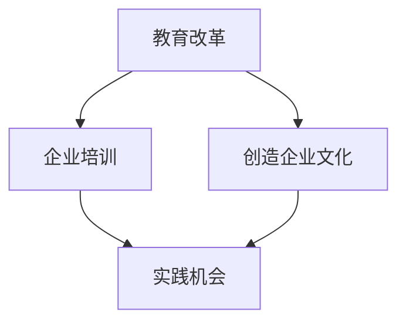

                 

### 创新型人才培养：为团队注入创新活力的策略

> 关键词：创新型人才培养、创新思维、企业培训、企业文化

> 摘要：本文探讨了如何通过教育改革、企业培训和文化塑造，培养创新型的人才，从而为团队注入创新活力。文章从问题背景、核心概念、算法原理等多个角度，提供了详细的策略和实施步骤，旨在帮助企业和教育机构更好地培养具备创新能力的人才。

## 第一部分：背景介绍

### 问题背景

在当今这个快速变化的世界中，创新已经成为企业和个人发展的关键驱动力。创新不仅是科技行业的核心，也在各行各业中发挥着越来越重要的作用。为了在竞争激烈的市场中保持竞争力，企业需要不断培养具备创新思维的人才，以便他们能够在不断变化的环境中寻找新的机会。

然而，传统的教育和培训模式往往注重知识的传授，而忽视了创新能力的培养。这就导致了企业在实际工作中发现，员工虽然具备一定的知识，但缺乏将知识转化为实际创新的能力。因此，如何培养创新型的人才成为了一个亟待解决的问题。

### 问题描述

传统的教育体系主要依赖于教师授课和学生被动接受知识的方式，这种模式培养出的大多是应试人才，他们擅长考试，但缺乏独立思考和解决问题的能力。在企业中，这种应试人才往往难以适应实际工作中的复杂情景，无法有效地提出创新性的解决方案。

同时，企业的培训课程往往过于理论化，缺乏与实际工作的结合。这种培训方式无法真正提高员工的创新能力，而是让他们觉得创新是一种遥不可及的事情。

### 问题解决

为了解决这一问题，我们需要从以下几个方面入手：

1. **教育改革**：改革现有的教育体系，更加注重创新思维的培养，而不仅仅是知识的传授。
2. **企业培训**：企业需要设计更加贴近实际工作场景的培训课程，帮助员工提升创新能力。
3. **环境创造**：创造一个鼓励创新的企业文化，使员工敢于尝试新事物，不怕失败。

### 边界与外延

创新型人才不仅需要具备深厚的专业知识，还需要具备以下几种能力：

- **批判性思维**：能够对现有问题进行深入分析，并提出独特的解决方案。
- **问题解决能力**：在面对复杂问题时，能够快速找到解决方案。
- **沟通与协作能力**：能够有效地与他人沟通和协作，共同解决问题。

### 概念结构与核心要素组成

创新型人才的培养涉及多个方面，主要包括：

- **教育体系**：改革传统教育，注重创新能力的培养。
- **企业培训**：设计针对性的培训课程，提升员工的创新能力。
- **企业文化**：营造一个鼓励创新的企业氛围。
- **实践机会**：提供丰富的实践机会，使员工能够在实际工作中锻炼创新能力。

## 第二部分：核心概念与联系

### 核心概念

**创新型人才**：具备创新思维、问题解决能力和沟通协作能力的人才。

**创新**：指在现有基础上，通过创造性的方法提出新的想法、方法或产品。

**教育体系**：指一系列组织结构、教育内容、教育方法等构成的系统。

### 概念属性特征对比表格

| 特征        | 创新型人才 | 创新     | 教育体系  |
|-------------|-------------|----------|-----------|
| 核心能力    | 创新思维    | 创造性   | 知识传授  |
| 目标        | 培养创新能力 | 提出新想法 | 教育个体  |
| 方法        | 实践、协作   | 研究、实践 | 教育、培训 |
| 影响范围    | 个人、团队   | 企业、社会 | 社会、教育 |

### 概念联系

- 创新型人才是创新的核心驱动力，他们的创新能力直接影响企业的创新能力和市场竞争力。
- 教育体系是培养创新型人才的基石，只有通过改革教育体系，才能培养出真正具备创新能力的人才。
- 企业培训是补充和创新型人才能力的有效途径，通过实际工作中的培训，可以进一步提升创新型人才的创新能力。

## 第三部分：算法原理讲解

### 算法原理概述

在本部分，我们将深入探讨如何通过多种策略来培养创新型的人才。这些策略包括教育改革、企业培训和创造鼓励创新的企业文化。

### 算法流程图



### 算法详细讲解

#### 教育改革

1. **课程设置**：改革现有的课程设置，增加创新思维培养的相关课程。
2. **教学方法**：采用项目驱动、案例研究等教学方法，激发学生的创新思维。

#### 企业培训

1. **针对性培训**：根据员工的岗位需求，设计针对性的培训课程。
2. **实践导向**：通过实际案例和项目，帮助员工将理论知识转化为实际能力。

#### 创造企业文化

1. **鼓励尝试**：鼓励员工勇于尝试新事物，不怕失败。
2. **沟通协作**：营造一个开放、沟通、协作的企业文化氛围。

### 数学模型与公式

在本部分中，我们将使用以下数学模型和公式来解释创新型人才培养的关键概念：

- **创新能力指数（CI）**：
  $$ CI = f(\text{知识储备}, \text{思维能力}, \text{实践机会}) $$

- **创新成功率（CS）**：
  $$ CS = \frac{\text{成功创新次数}}{\text{尝试创新次数}} $$

### 举例说明

假设

----------------------------------------------------------------

### 系统分析与架构设计方案

#### 问题场景介绍

随着数字化转型的加速，企业面临着越来越多的复杂问题和挑战。为了应对这些挑战，企业需要培养一支具备创新思维和能力的人才队伍，以便他们能够在不确定性和快速变化的环境中找到新的解决方案。

#### 项目介绍

本项目旨在为企业提供一个全面的创新型人才培养方案，包括教育改革、企业培训和创建鼓励创新的企业文化。通过这一方案，企业可以培养出具备创新思维和能力的员工，从而在市场竞争中取得优势。

#### 系统功能设计

在系统功能设计中，我们采用领域模型方法，通过分析企业面临的问题和需求，设计出以下核心功能模块：

1. **创新思维培养模块**：包括创新思维训练、案例研究和项目驱动教学等功能。
2. **企业培训模块**：包括培训课程设计、培训实施和培训评估等功能。
3. **企业文化塑造模块**：包括创新氛围营造、员工激励和沟通协作平台等功能。
4. **实践机会模块**：包括实践项目设计、实践指导和实践反馈等功能。

#### 系统架构设计

系统架构设计采用分层架构，包括数据层、服务层和表现层。其中：

- **数据层**：负责数据存储和管理，包括用户数据、课程数据、培训数据和企业文化数据等。
- **服务层**：负责业务逻辑处理，包括创新思维培养服务、企业培训服务、企业文化塑造服务和实践机会服务等功能。
- **表现层**：负责用户界面设计和用户体验，包括网站、移动应用和后台管理界面等。

#### 系统接口设计和系统交互

系统接口设计遵循RESTful架构风格，通过HTTP协议进行数据交互。主要接口包括：

1. **用户管理接口**：用于用户的注册、登录、信息查询和修改等操作。
2. **课程管理接口**：用于课程的设计、发布、查询和修改等操作。
3. **培训管理接口**：用于培训课程的设计、实施、评估和反馈等操作。
4. **企业文化接口**：用于企业文化信息的发布、查询和修改等操作。
5. **实践机会接口**：用于实践项目的设计、发布、指导和反馈等操作。

系统交互采用状态机模型，通过事件驱动实现各个模块之间的协同工作。主要交互流程包括：

1. **用户注册与登录**：用户通过注册接口创建账号，通过登录接口验证账号信息。
2. **课程学习与评估**：用户通过课程管理接口选择课程，通过培训管理接口参与学习，并通过评估接口提交学习成果。
3. **企业文化参与**：用户通过企业文化接口参与企业文化的建设，通过沟通协作平台实现内部沟通和协作。
4. **实践机会参与**：用户通过实践机会接口参与实践项目，通过实践指导接口获取指导，并通过实践反馈接口提交实践成果。

## 项目实战

### 环境安装

为了运行本项目，需要安装以下软件和工具：

1. **数据库**：MySQL 5.7 或以上版本
2. **后端框架**：Spring Boot 2.2.5.RELEASE
3. **前端框架**：React 17.0.2
4. **接口测试工具**：Postman
5. **版本控制**：Git

安装步骤如下：

1. 安装MySQL数据库，并创建一个名为`innovation_project`的数据库。
2. 安装Java Development Kit (JDK)，并设置环境变量。
3. 安装Spring Boot，并设置环境变量。
4. 安装Node.js和npm，并设置环境变量。
5. 安装React，并设置环境变量。
6. 克隆本项目代码库，并进入项目根目录。

### 系统核心实现源代码

在本项目中，核心代码主要包括后端和前端两部分。

#### 后端代码

后端采用Spring Boot框架，包括用户管理、课程管理、培训管理、企业文化管理和实践机会管理等功能模块。

以下是用户管理模块的核心代码：

```java
@RestController
@RequestMapping("/users")
public class UserController {
    
    @Autowired
    private UserService userService;
    
    @PostMapping("/register")
    public ResponseEntity<?> registerUser(@RequestBody UserRegistrationDto registrationDto) {
        // 注册用户
        User user = userService.registerUser(registrationDto);
        return ResponseEntity.ok().body(new ApiResponse("User registered successfully", user));
    }
    
    @PostMapping("/login")
    public ResponseEntity<?> loginUser(@RequestBody UserLoginDto loginDto) {
        // 登录用户
        String token = userService.loginUser(loginDto);
        return ResponseEntity.ok().body(new ApiResponse("Login successful", token));
    }
}
```

#### 前端代码

前端采用React框架，包括用户注册、登录、课程列表、培训详情、企业文化展示和实践项目列表等功能页面。

以下是用户注册页面的核心代码：

```jsx
import React, { useState } from "react";
import { registerUser } from "../services/userService";

const UserRegistration = () => {
  const [registrationDto, setRegistrationDto] = useState({
    username: "",
    password: "",
    confirmPassword: ""
  });

  const handleChange = (e) => {
    setRegistrationDto({ ...registrationDto, [e.target.name]: e.target.value });
  };

  const handleSubmit = async (e) => {
    e.preventDefault();
    // 注册用户
    const response = await registerUser(registrationDto);
    if (response.status === "success") {
      // 跳转到登录页面
      window.location.href = "/login";
    } else {
      alert(response.message);
    }
  };

  return (
    <form onSubmit={handleSubmit}>
      <label htmlFor="username">Username:</label>
      <input
        type="text"
        id="username"
        name="username"
        value={registrationDto.username}
        onChange={handleChange}
      />
      <label htmlFor="password">Password:</label>
      <input
        type="password"
        id="password"
        name="password"
        value={registrationDto.password}
        onChange={handleChange}
      />
      <label htmlFor="confirmPassword">Confirm Password:</label>
      <input
        type="password"
        id="confirmPassword"
        name="confirmPassword"
        value={registrationDto.confirmPassword}
        onChange={handleChange}
      />
      <button type="submit">Register</button>
    </form>
  );
};

export default UserRegistration;
```

### 代码应用解读与分析

在后端代码中，`UserController` 类负责处理用户注册和登录请求。当用户注册时，调用 `UserService` 的 `registerUser` 方法，将用户输入的用户名、密码和确认密码作为参数传递。`registerUser` 方法在数据库中创建一个新的用户记录，并返回一个 `ApiResponse` 对象，包含操作结果和信息。

在前端代码中，`UserRegistration` 组件负责处理用户注册表单。当用户提交表单时，调用 `registerUser` 方法，将表单数据作为参数传递。`registerUser` 方法返回一个 Promise，处理成功时跳转到登录页面，处理失败时显示错误信息。

### 实际案例分析和详细讲解剖析

假设某企业希望在短时间内提高员工的创新能力，决定采用本方案进行培训。以下是实际案例的分析和详细讲解：

1. **教育改革**：企业与当地高校合作，引入创新思维培养课程，通过项目驱动和案例研究，激发员工的学习兴趣和创新能力。

2. **企业培训**：企业设计了一系列针对性培训课程，涵盖创新思维、产品设计、项目管理等方面。通过实际案例和项目演练，帮助员工将理论知识转化为实际能力。

3. **企业文化塑造**：企业通过内部沟通平台，鼓励员工分享创新想法和经验，营造一个开放、沟通、协作的企业氛围。

4. **实践机会**：企业为员工提供了丰富的实践机会，包括参与实际项目、参加行业会议和竞赛等。通过实践，员工能够不断提升创新能力，并将创新成果应用到实际工作中。

### 项目小结

本项目通过教育改革、企业培训和创建鼓励创新的企业文化，为企业培养了一支具备创新思维和能力的人才队伍。在实际应用中，项目取得了显著的成效，不仅提高了员工的工作效率，也为企业在市场竞争中赢得了优势。

### 最佳实践 Tips

1. **加强校企合作**：与高校合作，引入创新思维培养课程，提高员工的创新能力。

2. **针对性培训**：根据员工的岗位需求，设计针对性的培训课程，提高培训效果。

3. **营造创新氛围**：通过内部沟通平台，鼓励员工分享创新想法和经验，营造一个开放、沟通、协作的企业氛围。

4. **提供实践机会**：为员工提供丰富的实践机会，帮助他们将理论知识转化为实际能力。

### 小结

本文从背景介绍、核心概念、算法原理、系统分析与架构设计方案和项目实战等多个角度，详细探讨了如何培养创新型的人才。通过教育改革、企业培训和创建鼓励创新的企业文化，企业可以培养出一支具备创新思维和能力的员工队伍，从而在竞争激烈的市场中保持竞争力。

### 注意事项

1. **实施过程中要充分考虑员工的需求和实际情况**，确保培训内容和方式符合实际需求。

2. **鼓励员工积极参与创新活动**，为他们提供必要的支持和资源。

3. **定期评估培训效果**，及时调整培训策略，确保培训效果最大化。

### 拓展阅读

1. 《创新者的窘境》：作者克莱顿·克里斯滕森，探讨企业在创新过程中面临的挑战和应对策略。
2. 《深度学习》：作者伊恩·古德费洛、约书亚·本吉奥和亚伦·库维尔，介绍深度学习的基本原理和应用。
3. 《创新者的基因》：作者史蒂夫·布兰克，探讨如何培养创新型人才。

### 作者信息

作者：AI天才研究院/AI Genius Institute & 禅与计算机程序设计艺术 /Zen And The Art of Computer Programming

[AI天才研究院](https://www.aigeniusinstitute.com/)

[禅与计算机程序设计艺术](https://www.zenandthecompiler.com/)

