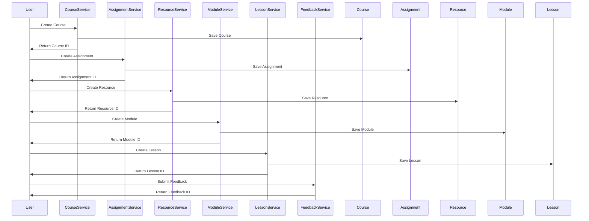
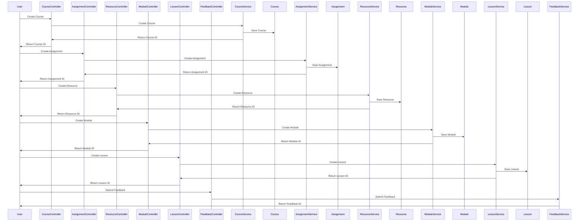

                 

# 创新思维培养：打破固有模式的领导力

## 关键词
- 创新思维，领导力，传统思维模式，跨学科思维，案例分析，实践指南

## 摘要
本文旨在探讨创新思维在领导力中的重要性，分析传统思维模式的局限性，并提出一系列培养创新思维的方法和策略。通过案例分析和实践指南，本文旨在帮助领导者打破固有模式，提升组织创新能力，实现持续发展。

## 目录大纲

### 第一部分：开启创新思维之旅

#### 第1章：创新思维概述
- **1.1 创新思维的定义与重要性**
  - 创新思维的概念
  - 创新思维的核心要素
  - 创新思维的重要性

- **1.2 创新思维的分类**
  - 逻辑思维与创造性思维
  - 系统思维与发散思维
  - 模仿思维与原创思维

- **1.3 创新思维在领导力中的体现**
  - 领导力与创新思维的关系
  - 领导者如何运用创新思维
  - 创新思维对组织的影响

#### 第2章：传统思维模式及其局限性
- **2.1 传统思维模式的特点**
  - 固定思维与线性思维
  - 因循守旧与保守态度
  - 过度依赖经验与数据

- **2.2 传统思维模式的局限性**
  - 缺乏创新性
  - 无法应对复杂问题
  - 难以适应快速变化的环境

- **2.3 突破传统思维模式的策略**
  - 接受新观念
  - 挑战现状
  - 培养多元化思维

### 第二部分：打破固有模式的创新思维策略

#### 第3章：激发创新思维的方法
- **3.1 反思与自我评估**
  - 确定思维定势
  - 分析自身思维模式的优点与不足
  - 制定改进计划

- **3.2 开放式提问**
  - 提出开放式问题
  - 鼓励团队成员参与讨论
  - 通过讨论激发创新思维

- **3.3 想象力与联想**
  - 培养想象力
  - 运用联想技巧
  - 创造独特解决方案

#### 第4章：跨学科思维与跨界合作
- **4.1 跨学科思维的重要性**
  - 跨学科思维的定义
  - 跨学科思维的优势
  - 跨学科思维在创新中的应用

- **4.2 跨界合作的价值**
  - 跨界合作的定义
  - 跨界合作的优势
  - 跨界合作在创新项目中的应用

- **4.3 培养跨学科思维与跨界合作的能力**
  - 学习不同领域的知识
  - 建立跨界合作网络
  - 提高沟通与协作能力

#### 第5章：领导者的创新思维培养
- **5.1 领导者的角色与责任**
  - 创新思维在领导力中的角色
  - 领导者如何发挥创新思维的作用
  - 领导者对组织创新的影响

- **5.2 培养创新思维的行为习惯**
  - 接受挑战
  - 勇于尝试
  - 持续学习

- **5.3 创造创新文化**
  - 构建支持创新的组织环境
  - 鼓励失败与学习
  - 创造开放、包容的创新氛围

### 第三部分：创新思维实践与案例分析

#### 第6章：创新思维在实际工作中的应用
- **6.1 创新思维在项目管理中的应用**
  - 项目目标的创新设定
  - 项目进度的创新管理
  - 项目风险的创新应对

- **6.2 创新思维在产品开发中的应用**
  - 产品理念的原创性
  - 用户需求的深入挖掘
  - 产品设计的创新实现

- **6.3 创新思维在市场推广中的应用**
  - 市场策略的创新制定
  - 营销手段的创新运用
  - 品牌形象的创新塑造

#### 第7章：创新思维的案例分析
- **7.1 企业案例：苹果公司的创新思维**
  - 苹果公司的创新历程
  - 苹果公司的创新策略
  - 苹果公司的创新成果

- **7.2 社会案例：无印良品的创新思维**
  - 无印良品的企业文化
  - 无印良品的创新产品
  - 无印良品的成功经验

- **7.3 个人案例：乔布斯的创新思维**
  - 乔布斯的成长经历
  - 乔布斯的创新理念
  - 乔布斯的创新成就

### 第四部分：创新思维培养的实践指南

#### 第8章：创新思维培养的实践指南
- **8.1 实践指南一：从日常工作中培养创新思维**
  - 观察与思考
  - 挑战传统
  - 拓展视野

- **8.2 实践指南二：通过学习提升创新思维**
  - 阅读与创新
  - 课程学习
  - 实践项目

- **8.3 实践指南三：利用工具和方法激发创新思维**
  - 思维导图
  - 设计思考
  - 创新实验室

#### 第9章：创新思维培养的小结与展望
- **9.1 小结**
  - 创新思维的重要性
  - 创新思维的方法与策略
  - 创新思维的应用与案例

- **9.2 展望**
  - 未来创新思维的发展趋势
  - 组织创新能力的提升路径

----------------------------------------------------------------

## 第1章：创新思维概述

### 1.1 创新思维的定义与重要性

创新思维是一种独特的思维方式，它不仅关注问题的现状，更关注问题的未来可能性和新的解决方案。这种思维方式强调创造性和突破性，鼓励人们跳出传统思维框架，寻找新的思路和解决问题的方法。

在现代社会，创新思维的重要性日益凸显。随着科技的飞速发展，市场竞争日益激烈，企业需要不断创新来保持竞争优势。创新思维是推动企业持续发展的重要动力，它能够帮助企业在面对复杂问题时找到创新的解决方案。

创新思维的核心要素包括以下几点：

1. **创造性**：创新思维鼓励人们跳出传统的思维定势，从全新的角度看待问题，寻找独特的解决方案。
2. **系统性**：创新思维不仅关注单个问题，更关注问题的整体性和系统性，通过系统性的思考来提高创新的有效性。
3. **适应性**：创新思维强调对环境的适应性，能够快速调整和适应不断变化的环境。
4. **开放性**：创新思维鼓励开放的心态，接受新的观念和想法，不断拓展思维边界。

### 1.2 创新思维的分类

创新思维可以分为不同的类型，每种类型都有其独特的特点和应用场景。

1. **逻辑思维与创造性思维**
   - **逻辑思维**：逻辑思维是一种基于事实和证据的思维方式，它强调通过逻辑推理来解决问题。逻辑思维在确定性和可预测性较强的场景中表现出色。
   - **创造性思维**：创造性思维则更注重创造性和创新性，它鼓励人们跳出常规，寻找全新的解决方案。创造性思维在探索性和不确定性较强的场景中具有优势。

2. **系统思维与发散思维**
   - **系统思维**：系统思维强调从整体的角度看待问题，关注问题的各个组成部分以及它们之间的相互作用。系统思维有助于发现问题的根本原因，并提供更全面的解决方案。
   - **发散思维**：发散思维则注重寻找多种可能的解决方案，它鼓励人们从多个角度思考问题，寻找新的创意和思路。

3. **模仿思维与原创思维**
   - **模仿思维**：模仿思维是指通过观察和分析已有的成功案例，复制或模仿其方法和策略来解决问题。模仿思维在快速学习和借鉴他人经验方面具有优势。
   - **原创思维**：原创思维则强调独立思考和创新，不依赖于他人的方法和经验。原创思维在创造独特价值和突破传统模式方面具有独特的优势。

### 1.3 创新思维在领导力中的体现

领导力与创新思维密切相关。一个成功的领导者不仅需要具备战略眼光和决策能力，更需要具备创新思维，以引领组织不断突破和发展。

1. **领导力与创新思维的关系**
   - 领导力是指领导者通过影响和激励他人来实现组织目标的能力。创新思维则是领导者实现这一目标的重要工具。
   - 领导者通过创新思维来发现新的机会和挑战，制定创新的战略和计划，从而引领组织走向成功。

2. **领导者如何运用创新思维**
   - **提出创新性问题**：领导者要善于提出开放式问题，激发团队成员的思考和创新。通过问题引导，领导者可以引导团队跳出传统思维框架，寻找新的解决方案。
   - **鼓励创意和尝试**：领导者要鼓励团队成员大胆尝试和提出创意，即使这些创意看起来不成熟或不可行。通过鼓励尝试，领导者可以激发团队的创造力和创新精神。
   - **构建创新文化**：领导者要营造一个鼓励创新和失败的文化氛围，让团队成员敢于挑战现状，勇于尝试新事物。通过构建创新文化，领导者可以推动组织的创新能力的提升。

3. **创新思维对组织的影响**
   - 创新思维可以提升组织的创新能力，使组织能够更好地适应市场变化和挑战。
   - 创新思维可以激发团队成员的积极性和创造力，提高组织的整体绩效。
   - 创新思维可以推动组织的发展，帮助组织实现可持续的增长和成功。

总之，创新思维是领导者提升领导力和组织竞争力的重要工具。通过运用创新思维，领导者可以引领组织不断突破和发展，实现持续的创新和成功。

### 1.4 创新思维与领导力的关系总结

创新思维和领导力之间存在着密切的关系。创新思维是领导者提升领导力的关键工具，它能够帮助领导者发现新的机会和挑战，制定创新的战略和计划，从而实现组织的目标。

首先，创新思维能够提升领导者的洞察力和决策能力。通过运用创新思维，领导者能够从不同的角度看待问题，发现问题的根本原因，并提供更全面的解决方案。这种能力对于领导者制定有效的战略和决策至关重要。

其次，创新思维能够激发团队成员的积极性和创造力。领导者通过鼓励团队成员提出创意和尝试新事物，可以激发团队的创造力和创新精神。这种积极的工作氛围有助于提升组织的整体绩效和竞争力。

最后，创新思维可以推动组织的发展。通过运用创新思维，领导者可以引领组织不断突破和发展，实现可持续的增长和成功。创新思维不仅能够帮助组织应对市场变化和挑战，还能够推动组织实现创新和突破，从而在竞争中脱颖而出。

总之，创新思维是领导者提升领导力和组织竞争力的重要工具。通过运用创新思维，领导者可以引领组织走向成功，实现持续的创新和突破。因此，领导者应该重视培养和运用创新思维，以应对不断变化的市场环境和挑战。

----------------------------------------------------------------

## 第2章：传统思维模式及其局限性

### 2.1 传统思维模式的特点

传统思维模式是一种在长时间内形成的、被人们广泛接受的思维方式。它通常具有以下几个特点：

1. **固定思维**：传统思维模式强调按照已有的规则和模式来解决问题，往往难以适应新的情况和变化。这种固定思维限制了人们的创新能力和灵活性，导致难以应对复杂的问题和挑战。

2. **线性思维**：传统思维模式通常采用线性思维方式，即按照一定的顺序和逻辑来思考和解决问题。这种方式往往忽略了问题的多样性和复杂性，难以产生创新的解决方案。

3. **因循守旧**：传统思维模式倾向于遵循过去的经验和做法，对于新的观念和思路持保守态度。这种因循守旧的心态阻碍了创新思维的发展，限制了组织的变革和进步。

4. **保守态度**：传统思维模式往往对变化持保守态度，担心变革带来的不确定性和风险。这种保守态度导致组织在面对市场变化和竞争压力时，难以快速适应和调整。

5. **过度依赖经验与数据**：传统思维模式倾向于依赖过去的经验和数据来决策，忽视了对新信息的敏感性和探索性。这种过度依赖经验与数据的方法容易导致组织陷入惯性思维，难以实现创新和突破。

### 2.2 传统思维模式的局限性

传统思维模式的局限性主要体现在以下几个方面：

1. **缺乏创新性**：传统思维模式往往局限于已有的知识和方法，缺乏对创新和突破的追求。这种思维方式难以产生全新的解决方案，限制了组织的发展和创新。

2. **无法应对复杂问题**：传统思维模式通常采用线性思维和简单的因果关系来解决问题，难以应对复杂、多变的现实问题。复杂问题往往需要多角度、多层次的思考，传统思维模式难以满足这一需求。

3. **难以适应快速变化的环境**：在当今快速变化的市场环境中，传统思维模式往往显得迟钝和滞后。传统思维模式难以快速适应新的技术和市场变化，导致组织在竞争中处于劣势。

4. **阻碍个人和组织的成长**：传统思维模式往往限制了个人的思维空间和发展潜力，导致个人难以实现自我突破和成长。同时，传统思维模式也限制了组织的发展和创新，阻碍了组织的长期成功。

### 2.3 突破传统思维模式的策略

为了突破传统思维模式的局限性，领导者需要采取一系列策略来培养和运用创新思维。以下是一些有效的策略：

1. **接受新观念**：领导者需要开放心态，接受新的观念和思路。通过不断学习和了解新的知识和方法，领导者可以拓宽思维边界，提升创新能力。

2. **挑战现状**：领导者要敢于质疑现有的规则和做法，挑战传统的思维模式。通过提出问题和质疑，领导者可以激发团队的思考和创新，推动组织的变革和进步。

3. **培养多元化思维**：领导者要鼓励团队成员多元化思维的培养，尊重不同的观点和意见。通过多元化思维的碰撞和交流，团队可以产生更多的创意和解决方案。

4. **鼓励尝试和失败**：领导者要鼓励团队成员勇于尝试新事物，即使失败也视为一种学习和成长的机会。通过鼓励尝试和失败，领导者可以激发团队的创造力和创新精神。

5. **建立创新文化**：领导者要构建一种鼓励创新和失败的文化氛围，让团队成员敢于挑战传统和现状。通过建立创新文化，领导者可以推动组织的创新能力的提升。

6. **运用跨学科思维**：领导者要鼓励团队成员运用跨学科思维，将不同领域的知识和方法应用于解决问题。通过跨学科思维的运用，团队可以产生更多创新的解决方案。

总之，突破传统思维模式需要领导者具备开放的心态和创新的思维方式。通过接受新观念、挑战现状、培养多元化思维、鼓励尝试和失败、建立创新文化和运用跨学科思维，领导者可以推动组织的创新和变革，实现持续的发展。

----------------------------------------------------------------

## 第3章：激发创新思维的方法

### 3.1 反思与自我评估

要激发创新思维，首先需要进行反思与自我评估。这个过程有助于领导者识别和了解自身思维定势，发现思维模式的优点和不足，从而有针对性地进行改进。

#### 确定思维定势

思维定势是指人们长期形成的固定思维方式和习惯。它可能会限制我们的创新能力，使我们在面对新问题时难以跳出传统的思维框架。确定思维定势的方法包括：

1. **回顾过去的经历**：通过回顾过去的决策和行动，领导者可以识别出那些重复出现的思维模式和习惯。
2. **询问他人**：领导者可以向团队成员或其他同事询问他们对领导者思维方式的认识，从他人的视角来了解自己的思维定势。
3. **反思失败**：通过反思过去的失败经历，领导者可以识别出导致失败的思维习惯，从而有针对性地进行改进。

#### 分析自身思维模式的优点与不足

在确定思维定势后，领导者需要对自身思维模式进行深入分析，识别出其优点和不足。以下是一些分析方法：

1. **优点分析**：
   - **经验丰富**：领导者通过长期的工作积累，积累了丰富的经验和专业知识，这有助于他们在面对问题时提供有效的解决方案。
   - **逻辑性强**：领导者通常具有较强的逻辑思维能力，能够通过逻辑推理来分析和解决问题。
   - **决策能力**：领导者具备较强的决策能力，能够在复杂和不确定的情况下做出明智的决策。

2. **不足分析**：
   - **缺乏灵活性**：领导者可能会因过于依赖过去的经验和规则，导致在面临新问题时难以灵活应对。
   - **思维单一**：领导者可能会过于依赖某种思维方式，如逻辑思维或经验思维，而忽视了其他思维方式的可能性和价值。
   - **缺乏创新性**：领导者可能会过于依赖传统的解决方案，缺乏对创新的追求和尝试。

#### 制定改进计划

在分析自身思维模式的优点和不足后，领导者需要制定改进计划，以提升自身的创新思维能力。以下是一些建议：

1. **学习新知识**：领导者可以通过阅读书籍、参加培训课程或研究新领域来学习新知识，拓宽自己的思维边界。
2. **培养跨学科思维**：领导者可以通过学习不同领域的知识，培养跨学科思维，将不同领域的知识和方法应用于解决问题。
3. **多角度思考**：领导者要学会从多个角度思考问题，避免陷入单一的思维模式。通过多角度思考，领导者可以产生更多的创意和解决方案。
4. **勇于尝试**：领导者要鼓励自己勇于尝试新事物，即使失败也视为一种学习和成长的机会。通过尝试，领导者可以激发创新思维，提高解决问题的能力。

总之，反思与自我评估是激发创新思维的重要步骤。通过确定思维定势、分析自身思维模式的优点与不足，并制定改进计划，领导者可以不断提升自身的创新思维能力，为组织的发展带来新的动力。

### 3.2 开放式提问

开放式提问是一种有效的激发创新思维的方法，它鼓励团队成员提出开放式问题，促进思考和讨论，从而产生新的创意和解决方案。以下是具体的方法和步骤：

#### 提出开放式问题

开放式问题通常是没有固定答案的问题，它们鼓励团队成员从多个角度思考问题，探索不同的可能性。以下是一些建议：

1. **如何**：例如，“如何提高产品的用户体验？”
2. **为什么**：例如，“为什么这个项目的进度总是延误？”
3. **如果**：例如，“如果我们将这个功能去掉，会对产品产生什么影响？”
4. **怎样**：例如，“怎样可以降低这个流程的成本？”
5. **谁**：例如，“谁可以为我们提供这个问题的解决方案？”
6. **哪里**：例如，“哪里可以找到这个新技术的应用案例？”

#### 鼓励团队成员参与讨论

鼓励团队成员积极参与讨论是激发创新思维的关键。以下是一些具体的方法：

1. **建立开放的氛围**：领导者要营造一个开放、包容的氛围，让团队成员感到舒适和自信，敢于提出自己的想法和问题。
2. **提出激励性奖励**：领导者可以设立激励性奖励，如表彰提出有建设性意见的团队成员，以激励更多人参与讨论。
3. **组织头脑风暴会议**：定期组织头脑风暴会议，让团队成员有机会集中讨论，共同探索问题的解决方案。
4. **提供讨论资源**：为团队成员提供相关的资料和工具，如市场研究报告、技术文档等，帮助他们更好地理解问题，提出有价值的建议。

#### 通过讨论激发创新思维

讨论是激发创新思维的重要环节，以下是一些建议：

1. **鼓励自由发言**：在讨论过程中，领导者要鼓励团队成员自由发言，不必担心批评或反驳。通过自由发言，团队成员可以相互启发，产生新的创意和思路。
2. **促进观点碰撞**：领导者可以引导团队成员进行观点碰撞，通过对比和分析不同的观点，激发创新思维。
3. **记录关键点**：领导者要记录讨论中的关键点和有价值的观点，以便后续分析和总结。
4. **持续跟进**：讨论结束后，领导者要对提出的问题和建议进行跟进，确保能够转化为实际的行动和解决方案。

总之，开放式提问和讨论是激发创新思维的有效方法。通过提出开放式问题、鼓励团队成员参与讨论，并通过讨论激发创新思维，领导者可以推动团队不断突破传统思维模式，实现创新和进步。

### 3.3 想象力与联想

想象力与联想是激发创新思维的重要工具，它们可以帮助领导者打破固有的思维框架，探索新的解决方案和可能性。以下是具体的方法和步骤：

#### 培养想象力

想象力是一种创造力，它使人们能够设想不同的未来场景和可能性。以下是一些建议来培养想象力：

1. **阅读和观影**：通过阅读书籍和观影，尤其是科幻小说和电影，可以帮助领导者扩展思维，激发想象力。这些作品通常包含丰富的想象和创意，可以启发领导者思考不同的可能性。
2. **艺术创作**：参与艺术创作，如绘画、雕塑或音乐，可以帮助领导者培养想象力。艺术创作是一种自由表达的方式，可以让领导者在不受限制的环境中发挥想象力。
3. **冥想和放松**：通过冥想和放松练习，领导者可以清空大脑，减少日常压力，从而更容易进入想象状态。冥想可以帮助领导者培养专注力和创造力，从而提高想象力。

#### 运用联想技巧

联想是指通过将两个或多个看似不相关的事物联系起来，产生新的想法和创意。以下是一些建议来运用联想技巧：

1. **思维导图**：通过绘制思维导图，领导者可以清晰地展示不同概念之间的联系，从而激发联想。思维导图可以帮助领导者将看似不相关的事物联系起来，产生新的创意。
2. **类比思维**：通过将一个问题或解决方案与另一个领域的问题或解决方案进行类比，领导者可以激发新的联想。类比思维可以启发领导者从不同领域借鉴经验，找到创新的解决方案。
3. **脑暴**：通过脑暴（头脑风暴）会议，领导者可以与团队成员一起进行联想和讨论。在脑暴过程中，领导者可以提出自己的想法，并鼓励团队成员提出与之相关的联想，从而激发创新思维。
4. **跨学科学习**：通过学习不同领域的知识，领导者可以拓宽思维边界，培养跨学科联想能力。跨学科学习可以帮助领导者将不同领域的知识和方法联系起来，产生创新的解决方案。

#### 创造独特解决方案

通过培养想象力和联想技巧，领导者可以创造独特的解决方案。以下是一些建议：

1. **打破常规**：领导者要勇于打破常规，尝试不同的方法和思路。通过打破常规，领导者可以摆脱固有的思维模式，创造出新的解决方案。
2. **多角度思考**：领导者要学会从多个角度思考问题，避免陷入单一的思维模式。通过多角度思考，领导者可以产生更多的创意和解决方案。
3. **整合资源**：领导者要善于整合内外部资源，利用各种工具和方法来支持和实现创新。通过整合资源，领导者可以创造出更具影响力的独特解决方案。
4. **持续迭代**：创新是一个持续迭代的过程。领导者要不断反思和改进已有的解决方案，通过不断迭代，不断提升解决方案的可行性和效果。

总之，想象力与联想是激发创新思维的重要工具。通过培养想象力和联想技巧，并创造独特解决方案，领导者可以推动组织不断突破和发展，实现持续的创新和进步。

----------------------------------------------------------------

## 第4章：跨学科思维与跨界合作

### 4.1 跨学科思维的重要性

跨学科思维是一种将不同领域知识和方法相结合的思维方式，它能够帮助领导者从多个角度分析问题，寻找创新的解决方案。在当今复杂多变的社会环境中，跨学科思维显得尤为重要。

#### 跨学科思维的定义

跨学科思维是指在不同学科之间进行知识整合和交叉应用的思维方式。它强调将不同领域的理论、方法和技术结合起来，以解决复杂问题或实现创新目标。

#### 跨学科思维的优势

1. **全面性**：跨学科思维能够从多个角度分析问题，提供更全面、更深入的洞察力。通过结合不同领域的知识和方法，领导者可以更全面地理解问题的本质，从而提出更有效的解决方案。

2. **创新性**：跨学科思维鼓励领导者打破传统的思维框架，探索新的方法和思路。通过将不同领域的知识和方法结合起来，领导者可以产生独特的创意和创新的解决方案。

3. **适应性**：跨学科思维能够帮助领导者更好地适应快速变化的环境。在快速变化的市场和技术环境中，跨学科思维能够使领导者更快地适应新情况，抓住新的机会。

4. **综合性**：跨学科思维强调知识的整合和应用，使领导者能够在不同领域之间建立联系，形成综合性的思维模式。这种综合性思维模式有助于领导者更有效地应对复杂的问题和挑战。

#### 跨学科思维在创新中的应用

跨学科思维在创新中具有广泛的应用。以下是一些具体的应用场景：

1. **产品创新**：通过跨学科思维，领导者可以将不同领域的知识和方法应用于产品创新。例如，将人机交互设计、人工智能和用户体验设计相结合，创造出更符合用户需求的产品。

2. **技术整合**：跨学科思维可以帮助领导者将不同技术领域的技术和方法整合起来，实现技术突破。例如，将物联网、大数据和云计算技术相结合，创造新的技术解决方案。

3. **社会创新**：跨学科思维在社会创新中具有重要作用。通过结合不同领域的知识和方法，领导者可以提出解决社会问题的创新方案。例如，将社会企业、公益组织和政府资源相结合，实现社会价值的最大化。

4. **团队协作**：跨学科思维鼓励团队成员从不同领域贡献知识和智慧，促进团队协作和知识共享。通过跨学科思维，团队可以更有效地解决复杂问题，实现共同目标。

总之，跨学科思维是一种重要的创新思维方式，它能够帮助领导者从多个角度分析问题，寻找创新的解决方案。在当今复杂多变的社会环境中，跨学科思维具有重要的应用价值。

### 4.2 跨界合作的价值

跨界合作是指不同领域、不同组织或不同团队之间的合作，以共同实现创新目标。在创新过程中，跨界合作具有独特的价值和重要性。

#### 跨界合作的定义

跨界合作是指不同领域、不同组织或不同团队之间，为了实现共同目标而进行的合作。这种合作可以跨越传统的组织界限，促进知识的共享和资源的整合。

#### 跨界合作的优势

1. **资源共享**：跨界合作可以实现资源的最大化利用。通过整合不同领域和组织的资源和优势，合作各方可以共同获取更多资源，提高创新能力。

2. **知识互补**：跨界合作可以促进不同领域和组织的知识互补。通过合作，各方可以分享各自领域的专业知识和经验，相互学习和借鉴，提高整体创新水平。

3. **创新激励**：跨界合作可以为创新提供新的激励。在合作过程中，不同领域和组织的成员可以相互激励，激发创新思维，推动创新成果的产生。

4. **风险分担**：跨界合作可以分担创新风险。通过合作，各方可以共同承担创新风险，降低单方面承担风险的压力，提高创新的可行性和成功率。

5. **市场拓展**：跨界合作可以帮助企业拓展市场。通过与其他领域的合作，企业可以获取新的市场信息和渠道，开拓更广阔的市场空间。

#### 跨界合作在创新项目中的应用

跨界合作在创新项目中的应用非常广泛，以下是一些具体的应用场景：

1. **技术研发**：在技术研发领域，不同领域的技术团队可以合作开发新的技术和产品。例如，将人工智能、物联网和大数据技术相结合，开发智能物联网解决方案。

2. **产品创新**：在产品创新领域，不同领域的专业团队可以合作开发新的产品。例如，将设计、工程和市场营销团队结合，共同开发智能家居产品。

3. **社会创新**：在社会创新领域，不同领域的组织和团队可以合作解决社会问题。例如，政府、企业和社会组织合作，推动可持续发展项目。

4. **市场推广**：在市场推广领域，不同领域的营销团队可以合作推广新产品或服务。例如，将线上营销和线下活动相结合，共同推广新产品。

总之，跨界合作是一种重要的创新合作方式，它能够促进知识的共享和资源的整合，提高创新能力和市场竞争力。在创新项目中，跨界合作具有重要的价值和应用前景。

### 4.3 培养跨学科思维与跨界合作的能力

为了培养跨学科思维和跨界合作的能力，领导者需要采取一系列措施，提升自身的综合素质和团队合作能力。

#### 学习不同领域的知识

1. **跨学科学习**：领导者可以通过跨学科学习，掌握不同领域的知识和方法。这包括参加跨学科的课程、研讨会和培训，阅读不同领域的书籍和研究报告。

2. **跨领域交流**：领导者可以参加不同领域的研究项目或工作坊，与其他领域的专家进行交流和合作。通过跨领域的交流，领导者可以拓宽视野，了解不同领域的最新发展。

3. **知识整合**：领导者要学会将不同领域的知识进行整合和应用。通过整合不同领域的知识，领导者可以提出创新的解决方案，提高创新能力。

#### 建立跨界合作网络

1. **建立合作关系**：领导者可以通过建立合作关系，与其他领域的组织和个人建立联系。这包括与其他企业、学术机构和政府部门的合作。

2. **参与跨界项目**：领导者可以参与跨界项目，与其他领域的专家共同合作，实现创新目标。通过参与跨界项目，领导者可以积累跨界合作的经验，提高合作能力。

3. **跨界交流**：领导者可以参加跨界交流活动，与其他领域的专业人士进行交流和合作。这包括参加跨界研讨会、论坛和展览，与其他领域的专家建立联系。

#### 提高沟通与协作能力

1. **增强沟通技巧**：领导者要具备良好的沟通技巧，能够清晰地表达自己的想法和意见，理解他人的观点。通过有效的沟通，领导者可以建立良好的合作关系。

2. **提高协作能力**：领导者要具备良好的协作能力，能够与其他领域的专家共同工作，实现共同目标。这包括学会协调不同领域的工作，处理协作中的冲突和问题。

3. **培养团队文化**：领导者要培养团队合作的文化，鼓励团队成员之间的合作和交流。通过建立积极的团队文化，领导者可以增强团队的凝聚力和协作能力。

总之，培养跨学科思维和跨界合作的能力是领导者的重要任务。通过学习不同领域的知识、建立跨界合作网络和提高沟通与协作能力，领导者可以提升自身的综合素质和团队合作能力，为组织的创新和成功奠定基础。

----------------------------------------------------------------

## 第5章：领导者的创新思维培养

### 5.1 领导者的角色与责任

在组织创新中，领导者的角色与责任至关重要。领导者不仅是创新思维的倡导者和推动者，更是创新文化的塑造者和实践者。以下是对领导者角色与责任的详细探讨：

#### 创新思维在领导力中的角色

1. **愿景塑造者**：领导者需要具备创新思维，能够从宏观角度看待组织的发展，提出具有前瞻性的愿景和目标。这种愿景能够激励团队成员为实现共同目标而努力。

2. **决策者**：在创新过程中，领导者需要运用创新思维做出明智的决策。这包括对创新项目的评估、资源的分配以及风险的应对。通过创新思维，领导者可以做出更有效的决策，推动组织创新。

3. **推动者**：领导者要成为创新的推动者，鼓励团队成员勇于尝试新事物，支持创新实践。通过推动创新，领导者可以激发团队的创造力和积极性。

#### 领导者如何发挥创新思维的作用

1. **鼓励多元化思维**：领导者要鼓励团队成员多元化思维的培养，尊重不同的观点和意见。通过多元化思维的碰撞，可以激发创新的火花，产生新的创意和解决方案。

2. **提供资源和支持**：领导者要为创新提供必要的资源和支持，包括资金、技术、人力资源等。通过提供支持，领导者可以降低创新的门槛，使团队成员更容易实现创新。

3. **构建创新文化**：领导者要构建一种鼓励创新和失败的文化氛围。在这种文化中，团队成员敢于挑战现状，勇于尝试新事物，即使失败也是一种学习和成长的机会。

4. **培养跨学科思维**：领导者要鼓励团队成员培养跨学科思维，将不同领域的知识和方法应用于创新。跨学科思维可以拓宽思维边界，提高创新的深度和广度。

#### 领导者对组织创新的影响

1. **提升创新能力**：领导者的创新思维能够提升整个组织的创新能力。通过倡导创新思维，领导者可以激发团队成员的创造力，推动组织实现持续的创新。

2. **促进知识共享**：领导者的创新思维有助于促进组织内部的 knowledge sharing（知识共享）。通过跨学科思维和跨界合作，领导者可以促进不同部门、不同团队之间的知识共享，提高组织的整体竞争力。

3. **实现可持续发展**：领导者的创新思维有助于组织实现可持续发展。通过不断创新，组织可以适应市场变化，抓住新的机会，保持长期的竞争力。

总之，领导者在组织创新中扮演着关键角色。通过发挥创新思维的作用，领导者可以提升组织的创新能力，促进知识共享，实现可持续发展。因此，领导者应重视培养和运用创新思维，以推动组织的创新和进步。

### 5.2 培养创新思维的行为习惯

要培养创新思维，领导者需要从日常行为习惯入手，逐步建立有利于创新思维发展的环境和习惯。以下是一些具体的策略和行动步骤：

#### 接受挑战

1. **勇于尝试**：领导者要勇于接受新的挑战，敢于尝试未经历过的事物。这包括参与新的项目、尝试新的管理方法以及学习新的技能。

2. **设定挑战目标**：领导者可以为自己设定具有挑战性的目标，激励自己不断突破自我。通过设定高目标，领导者可以激发创新思维，寻找更有效的解决方案。

3. **鼓励团队成员接受挑战**：领导者要鼓励团队成员勇于接受挑战，提供必要的支持和资源。通过鼓励团队成员接受挑战，领导者可以激发团队的创新活力。

#### 勇于尝试

1. **开放心态**：领导者要保持开放心态，对新的想法和观点持包容态度。通过开放心态，领导者可以吸引更多的创意和创新的火花。

2. **鼓励失败**：领导者要鼓励团队成员在创新过程中敢于尝试，即使失败也视为一种学习和成长的机会。通过鼓励失败，领导者可以降低团队成员的顾虑，鼓励他们勇于创新。

3. **提供反馈**：领导者要为团队成员提供及时的反馈，帮助他们了解自己的优点和不足。通过反馈，团队成员可以不断调整和改进，提高创新的成功率。

#### 持续学习

1. **主动学习**：领导者要主动学习新知识、新技能，不断更新自己的知识库。通过主动学习，领导者可以拓宽视野，提升自身的创新能力。

2. **跨界学习**：领导者要学习不同领域的知识和方法，培养跨学科思维。通过跨界学习，领导者可以借鉴其他领域的创新经验和思路，为组织带来新的视角和创意。

3. **实践学习**：领导者要将所学知识应用于实际工作，通过实践来验证和巩固所学。通过实践学习，领导者可以将理论知识转化为实际能力，提高创新思维的应用效果。

#### 培养协作文化

1. **鼓励合作**：领导者要鼓励团队成员之间的合作，建立良好的团队协作机制。通过合作，团队成员可以相互启发，产生更多的创意和创新的解决方案。

2. **建立反馈机制**：领导者要建立有效的反馈机制，让团队成员能够及时了解自己的工作表现和团队的整体进展。通过反馈，团队成员可以不断改进，提高协作效率。

3. **培养团队精神**：领导者要培养团队精神，增强团队的凝聚力和归属感。通过培养团队精神，领导者可以激发团队成员的积极性和创造力，推动团队共同实现创新目标。

总之，培养创新思维需要领导者从日常行为习惯入手，逐步建立有利于创新思维发展的环境和习惯。通过接受挑战、勇于尝试、持续学习和培养协作文化，领导者可以不断提升自身的创新思维能力，为组织的创新和成功奠定基础。

### 5.3 创造创新文化

创造创新文化是领导者推动组织持续创新的重要手段。创新文化不仅是一种价值观，更是一种行为规范，它能够激发团队成员的创造力，推动组织实现持续的创新和发展。以下是关于如何创造创新文化的详细探讨：

#### 构建支持创新的组织环境

1. **提供资源和资金**：领导者要确保组织为创新提供充分的资源和资金支持。这包括为创新项目提供足够的预算、技术设备和人力资源，以确保创新活动的顺利进行。

2. **建立创新团队**：领导者要建立专门的创新团队，负责组织内部的创新项目。通过建立创新团队，领导者可以集中资源，提高创新效率。

3. **提供培训和发展机会**：领导者要为团队成员提供创新培训和发展机会，提升他们的创新能力。通过培训，团队成员可以学习新的知识和技能，为创新提供有力支持。

#### 鼓励失败与学习

1. **建立容错机制**：领导者要建立容错机制，允许团队成员在创新过程中犯错误。通过容错机制，领导者可以减少团队成员的顾虑，鼓励他们大胆尝试。

2. **鼓励反思与总结**：领导者要鼓励团队成员在失败后进行反思和总结，从失败中学习经验教训。通过反思与总结，团队成员可以不断改进，提高创新的成功率。

3. **提供反馈和支持**：领导者要为团队成员提供及时的反馈和支持，帮助他们了解失败的原因和改进的方向。通过反馈和支持，团队成员可以更快地成长和进步。

#### 创造开放、包容的创新氛围

1. **鼓励多样性**：领导者要鼓励团队成员表达不同的观点和意见，尊重多样性。通过多样性，团队可以产生更多的创意和创新的解决方案。

2. **建立开放沟通机制**：领导者要建立开放沟通机制，确保团队成员之间的信息畅通。通过开放沟通，团队成员可以更好地协作，共同推动创新。

3. **促进知识共享**：领导者要促进组织内部的知识共享，鼓励团队成员分享知识和经验。通过知识共享，团队成员可以相互学习，提高整体创新能力。

#### 奖励创新成果

1. **设立创新奖励制度**：领导者要设立创新奖励制度，对取得创新成果的团队成员给予奖励。通过奖励制度，领导者可以激发团队成员的创新积极性。

2. **展示创新成果**：领导者要展示创新成果，让团队成员看到创新的价值和成果。通过展示创新成果，领导者可以增强团队成员的自信心和成就感。

3. **提供职业发展机会**：领导者要为创新团队成员提供职业发展机会，鼓励他们在创新领域继续发展。通过职业发展机会，领导者可以留住优秀的创新人才。

总之，创造创新文化是领导者推动组织持续创新的重要任务。通过构建支持创新的组织环境、鼓励失败与学习、创造开放、包容的创新氛围以及奖励创新成果，领导者可以激发团队成员的创造力，推动组织实现持续的创新和成功。

----------------------------------------------------------------

## 第6章：创新思维在实际工作中的应用

### 6.1 创新思维在项目管理中的应用

创新思维在项目管理中扮演着至关重要的角色，它能够帮助项目经理更有效地设定项目目标、管理项目进度以及应对项目风险。以下是对创新思维在项目管理中应用的详细探讨：

#### 项目目标的创新设定

1. **明确项目愿景**：项目经理需要运用创新思维，设定具有前瞻性和挑战性的项目愿景。通过明确项目愿景，项目经理可以激励团队成员为实现共同目标而努力。

2. **多角度分析**：在设定项目目标时，项目经理要运用创新思维，从多个角度分析问题的各个方面，以确保目标设定的全面性和可行性。这包括技术、市场、财务等多方面的考量。

3. **挑战传统目标**：项目经理要敢于挑战传统的项目目标，尝试设定更具创新性的目标。通过挑战传统目标，项目经理可以推动项目团队突破固有的思维模式，寻找新的解决方案。

#### 项目进度的创新管理

1. **灵活调整进度**：在项目进行过程中，项目经理要运用创新思维，灵活调整进度计划，以适应不断变化的情况。这包括重新分配资源、调整任务优先级以及优化工作流程。

2. **采用敏捷方法**：项目经理可以采用敏捷项目管理方法，通过迭代和增量开发，不断调整和优化项目进度。敏捷方法强调快速反馈和持续改进，有助于项目经理及时发现问题并进行调整。

3. **跨部门协作**：项目经理要运用创新思维，促进跨部门协作，提高项目进度的效率。通过跨部门协作，项目经理可以整合不同部门的资源和优势，实现更高效的进度管理。

#### 项目风险的创新应对

1. **多元化风险评估**：在项目风险评估过程中，项目经理要运用创新思维，采用多元化的评估方法，从不同角度分析潜在风险。这包括定量分析、定性分析和情景分析等。

2. **创造性解决方案**：在应对项目风险时，项目经理要运用创新思维，寻找创造性的解决方案。这包括设计备选方案、制定应急预案以及利用新技术和方法降低风险。

3. **持续监控与反馈**：项目经理要运用创新思维，建立持续的风险监控和反馈机制，及时识别和应对项目风险。通过持续监控与反馈，项目经理可以确保项目在风险可控范围内进行。

总之，创新思维在项目管理中具有广泛的应用。通过创新设定项目目标、创新管理项目进度以及创新应对项目风险，项目经理可以提升项目的成功率，实现项目的持续创新和发展。

### 6.2 创新思维在产品开发中的应用

创新思维在产品开发中起着至关重要的作用，它能够帮助产品经理和开发团队创造出更符合用户需求、具有市场竞争力的产品。以下是对创新思维在产品开发中应用的详细探讨：

#### 产品理念的原创性

1. **市场调研**：在产品开发初期，产品经理要运用创新思维，进行深入的市场调研，了解用户需求和竞争对手的情况。通过市场调研，产品经理可以挖掘出独特的用户需求，为产品理念提供创新的依据。

2. **创意激发**：产品经理要运用创新思维，通过头脑风暴、设计思考等方法，激发团队成员的创意。通过创意激发，产品经理可以产生独特的创新理念，为产品开发提供灵感。

3. **差异化定位**：产品经理要运用创新思维，为产品定位提供差异化思路。通过差异化定位，产品可以避开市场竞争的红海，找到独特的市场切入点。

#### 用户需求的深入挖掘

1. **用户访谈**：产品经理要运用创新思维，通过用户访谈、问卷调查等方式，深入挖掘用户需求。通过用户访谈，产品经理可以获取用户的真实反馈，为产品功能设计提供依据。

2. **用户旅程地图**：产品经理要运用创新思维，绘制用户旅程地图，分析用户在使用产品过程中的痛点和需求。通过用户旅程地图，产品经理可以更好地理解用户需求，优化产品设计。

3. **多渠道反馈**：产品经理要建立多渠道的反馈机制，通过用户反馈、市场调研等多种方式，持续挖掘用户需求。通过多渠道反馈，产品经理可以动态调整产品开发方向，确保产品始终符合用户需求。

#### 产品设计的创新实现

1. **用户体验设计**：产品经理要运用创新思维，进行用户体验设计，为用户提供愉悦的使用体验。通过用户体验设计，产品经理可以提升产品的用户满意度，增强市场竞争力。

2. **技术选型**：产品经理要运用创新思维，选择适合产品的技术方案，实现产品的创新功能。通过技术选型，产品经理可以确保产品具有技术优势和竞争力。

3. **快速迭代**：产品经理要运用创新思维，采用快速迭代的方法，不断优化产品功能。通过快速迭代，产品经理可以快速响应用户反馈，提高产品的市场适应能力。

总之，创新思维在产品开发中具有广泛的应用。通过创新设定产品理念、深入挖掘用户需求和进行创新的实现，产品经理和开发团队可以创造出更符合用户需求、具有市场竞争力的产品，实现产品的持续创新和发展。

### 6.3 创新思维在市场推广中的应用

创新思维在市场推广中起着至关重要的作用，它能够帮助企业更好地制定市场策略、运用创新的营销手段以及塑造独特的品牌形象。以下是对创新思维在市场推广中应用的详细探讨：

#### 市场策略的创新制定

1. **数据驱动**：市场推广策略的制定要基于数据驱动，通过收集和分析用户数据，了解市场趋势和用户需求。通过数据驱动，企业可以制定更加精准和有效的市场策略。

2. **差异化定位**：在市场策略的制定过程中，企业要运用创新思维，寻找差异化定位，避免与竞争对手的直接竞争。通过差异化定位，企业可以打造独特的市场优势，吸引目标客户。

3. **跨界合作**：企业要运用创新思维，寻找跨界合作的机会，与其他领域的品牌或机构进行合作。跨界合作可以带来新的市场机会和用户群体，提高市场影响力。

#### 营销手段的创新运用

1. **内容营销**：企业要运用创新思维，通过内容营销来吸引和保留用户。通过创作高质量的内容，企业可以提升品牌知名度和用户忠诚度。

2. **社交媒体营销**：企业要运用创新思维，利用社交媒体平台进行营销。通过社交媒体营销，企业可以快速传播品牌信息，与用户建立更紧密的互动关系。

3. **互动体验**：企业要运用创新思维，设计有趣的互动体验，提高用户的参与度和满意度。通过互动体验，企业可以增强用户对品牌的认知和好感度。

#### 品牌形象的创新塑造

1. **品牌故事**：企业要运用创新思维，塑造具有独特魅力的品牌故事。通过品牌故事，企业可以传递品牌的核心价值和独特魅力，提升品牌形象。

2. **视觉设计**：企业要运用创新思维，进行品牌视觉设计，打造独特的外观形象。通过视觉设计，企业可以提升品牌的识别度和市场竞争力。

3. **用户体验**：企业要运用创新思维，提升用户的整体体验，从产品的设计、到购买过程、再到售后服务，全面提升用户体验。通过用户体验，企业可以塑造良好的品牌形象，增强用户忠诚度。

总之，创新思维在市场推广中具有广泛的应用。通过创新制定市场策略、运用创新的营销手段以及塑造独特的品牌形象，企业可以提升市场竞争力，实现持续的市场增长和成功。

### 6.4 创新思维在团队协作中的应用

创新思维在团队协作中起着至关重要的作用，它能够帮助团队成员更好地沟通、协作，提高团队的创造力和工作效率。以下是对创新思维在团队协作中应用的详细探讨：

#### 沟通协作的创新方法

1. **开放式沟通**：团队领导者要运用创新思维，建立开放式的沟通机制，鼓励团队成员自由表达观点，分享想法。通过开放式沟通，团队成员可以更好地理解彼此的需求和想法，提高协作效率。

2. **跨部门协作**：团队领导者要运用创新思维，促进跨部门的协作，打破部门壁垒，实现资源的共享和信息的流通。通过跨部门协作，团队可以更全面地考虑问题，提高决策质量。

3. **虚拟协作**：在当今远程办公成为常态的情况下，团队领导者要运用创新思维，运用虚拟协作工具，如视频会议、在线协作平台等，提高远程团队的协作效率。通过虚拟协作，团队成员可以随时沟通和协作，不受时间和空间的限制。

#### 团队创造力提升策略

1. **头脑风暴**：团队领导者要运用创新思维，定期组织头脑风暴会议，鼓励团队成员自由发挥，提出各种创意和解决方案。通过头脑风暴，团队可以产生大量的创意，筛选出最具创新性的方案。

2. **设计思考**：团队领导者要运用创新思维，采用设计思考的方法，从用户的角度出发，寻找创新的解决方案。通过设计思考，团队可以更好地理解用户需求，提供更符合用户期望的产品和服务。

3. **多元化思维**：团队领导者要运用创新思维，培养团队成员的多元化思维，鼓励他们从不同的角度和领域思考问题。通过多元化思维，团队可以产生更多的创意和创新的解决方案。

#### 提高工作效率的方法

1. **任务分解**：团队领导者要运用创新思维，将复杂任务分解为小任务，明确每个任务的目标和责任人，提高任务执行的效率。通过任务分解，团队可以更高效地完成任务，提高整体工作效率。

2. **敏捷管理**：团队领导者要运用创新思维，采用敏捷管理的方法，通过迭代和增量开发，快速响应市场变化和用户需求。通过敏捷管理，团队可以更灵活地调整工作计划，提高工作效率。

3. **自动化工具**：团队领导者要运用创新思维，利用自动化工具，如项目管理软件、代码自动测试工具等，提高工作的自动化程度，减少重复劳动。通过自动化工具，团队可以节省时间，提高工作效率。

总之，创新思维在团队协作中具有广泛的应用。通过沟通协作的创新方法、团队创造力提升策略以及提高工作效率的方法，团队可以更好地实现协作目标，提高整体绩效。

### 6.5 创新思维在危机管理中的应用

创新思维在危机管理中起着至关重要的作用，它能够帮助企业迅速应对危机，制定有效的应对策略，降低危机带来的负面影响。以下是对创新思维在危机管理中应用的详细探讨：

#### 突发事件的快速响应

1. **危机预警系统**：企业要运用创新思维，建立危机预警系统，实时监测市场环境和竞争态势，及时发现潜在的危机信号。通过危机预警系统，企业可以提前做好应对准备。

2. **应急响应团队**：企业要运用创新思维，组建应急响应团队，专门负责处理突发事件。应急响应团队要具备快速响应能力，能够在危机爆发时迅速采取行动。

3. **信息共享机制**：企业要运用创新思维，建立信息共享机制，确保在危机期间，各部门之间能够及时沟通和协作，共同应对危机。通过信息共享机制，企业可以更有效地调动资源，提高应对效率。

#### 应对策略的创新制定

1. **多元化策略**：企业要运用创新思维，制定多元化应对策略，包括危机公关、市场营销调整、产品改进等。通过多元化策略，企业可以灵活应对不同类型的危机。

2. **情景分析**：企业要运用创新思维，进行情景分析，模拟各种可能的危机场景，制定相应的应对策略。通过情景分析，企业可以提前准备，提高应对危机的能力。

3. **跨部门协作**：企业要运用创新思维，促进跨部门协作，整合不同部门的资源和优势，共同应对危机。通过跨部门协作，企业可以更全面地考虑问题，提高应对策略的有效性。

#### 风险控制的创新措施

1. **风险评估**：企业要运用创新思维，进行风险评估，识别危机可能带来的风险，制定相应的控制措施。通过风险评估，企业可以提前预防危机，降低风险。

2. **风险预防**：企业要运用创新思维，采取风险预防措施，如建立应急预案、定期培训等，提高员工的危机应对能力。通过风险预防，企业可以减少危机发生的概率。

3. **创新技术**：企业要运用创新思维，运用新技术和方法，提高危机管理的效果。例如，利用大数据分析、人工智能等技术，实时监测市场环境和竞争态势，提高危机预警的准确性。

总之，创新思维在危机管理中具有广泛的应用。通过突发事件快速响应、应对策略的创新制定以及风险控制的创新措施，企业可以更好地应对危机，降低危机带来的负面影响，确保组织的稳定和持续发展。

### 6.6 创新思维在组织变革中的应用

创新思维在组织变革中起着至关重要的作用，它能够帮助企业更好地应对市场变化，推动组织的转型和升级。以下是对创新思维在组织变革中应用的详细探讨：

#### 变革理念的建立

1. **创新思维导向**：企业要运用创新思维，将创新作为组织变革的核心理念。通过创新思维导向，企业可以鼓励员工积极参与变革，推动组织的创新和发展。

2. **长期规划**：企业要运用创新思维，制定长期的变革规划，明确变革的目标和路径。通过长期规划，企业可以确保变革的有序进行，避免盲目和短视的行为。

3. **全员参与**：企业要运用创新思维，鼓励全员参与变革，让每个员工都成为变革的推动者和受益者。通过全员参与，企业可以增强员工的归属感和参与感，提高变革的执行力。

#### 变革策略的创新制定

1. **系统性变革**：企业要运用创新思维，进行系统性变革，从组织结构、文化、流程等多方面进行改进。通过系统性变革，企业可以全面提高组织的适应能力和创新能力。

2. **分阶段实施**：企业要运用创新思维，分阶段实施变革策略，逐步推进，确保变革的平稳过渡。通过分阶段实施，企业可以更好地控制变革的风险，提高变革的成功率。

3. **跨界合作**：企业要运用创新思维，与外部组织进行跨界合作，借鉴其他行业的成功经验和最佳实践。通过跨界合作，企业可以拓宽视野，获得新的变革思路和灵感。

#### 变革文化的培养

1. **鼓励创新**：企业要运用创新思维，建立鼓励创新的文化氛围，让员工敢于尝试新事物，勇于承担责任。通过鼓励创新，企业可以激发员工的创造力，推动组织的持续发展。

2. **开放沟通**：企业要运用创新思维，建立开放的沟通机制，确保信息畅通，让员工能够充分表达自己的想法和意见。通过开放沟通，企业可以增强员工的参与感和归属感，提高变革的执行力。

3. **持续培训**：企业要运用创新思维，为员工提供持续的培训和学习机会，提升他们的能力和素质。通过持续培训，企业可以确保员工具备适应变革的能力，为组织的长远发展奠定基础。

总之，创新思维在组织变革中具有广泛的应用。通过变革理念的建立、变革策略的创新制定以及变革文化的培养，企业可以更好地应对市场变化，推动组织的转型和升级，实现持续的发展和成功。

----------------------------------------------------------------

## 第7章：创新思维的案例分析

### 7.1 企业案例：苹果公司的创新思维

苹果公司（Apple Inc.）是创新思维的典范，其成功的秘诀在于不断推动创新，打破传统，引领市场。以下是对苹果公司创新思维的详细分析：

#### 苹果公司的创新历程

1. **初期创新**：自成立以来，苹果公司就致力于创新。1976年，乔布斯与史蒂夫·沃兹尼亚克共同创立苹果公司，推出苹果I型电脑，开创了个人电脑时代。

2. **标志性产品**：1984年，苹果公司推出麦金托什（Macintosh）电脑，这是苹果公司最具标志性的产品之一，引领了图形用户界面的革命。

3. **持续创新**：进入21世纪后，苹果公司继续在技术创新方面保持领先。2007年，苹果公司推出iPhone，彻底改变了智能手机市场。2010年，苹果公司发布iPad，开创了平板电脑市场。

#### 苹果公司的创新策略

1. **用户中心**：苹果公司始终坚持以用户为中心的创新策略。通过深入了解用户需求，苹果公司能够推出真正满足用户期望的产品。

2. **生态系统**：苹果公司构建了一个完整的生态系统，包括硬件、软件和服务。这种生态系统不仅增强了用户粘性，也为苹果公司的持续创新提供了源源不断的动力。

3. **跨界合作**：苹果公司积极与其他行业巨头进行跨界合作，如与富士康合作生产iPhone，与Nike合作推出智能手表等。这种跨界合作不仅拓展了苹果的业务范围，也推动了苹果的创新。

#### 苹果公司的创新成果

1. **颠覆性技术**：苹果公司推出了许多颠覆性技术，如多点触控技术、视网膜显示屏、FaceTime视频通话等。这些技术不仅提升了用户体验，也推动了整个行业的发展。

2. **市场领导地位**：苹果公司在多个领域保持市场领导地位，如智能手机、平板电脑、智能手表和云计算等。通过不断创新，苹果公司巩固了其在全球市场的领先地位。

3. **品牌价值**：苹果公司凭借其强大的创新能力，建立了极高的品牌价值。苹果品牌不仅代表着高品质和高端，更代表着创新和科技。

总之，苹果公司的创新思维是其在竞争激烈的市场中脱颖而出的关键。通过用户中心、生态系统和跨界合作，苹果公司不断推出颠覆性技术，巩固了其在全球市场的领导地位。苹果公司的创新思维为其他企业提供了宝贵的经验和启示。

### 7.2 社会案例：无印良品的创新思维

无印良品（MUJI）是日本著名的零售品牌，以其简约、环保的设计理念赢得了全球消费者的喜爱。以下是对无印良品创新思维的详细分析：

#### 无印良品的企业文化

1. **简约哲学**：无印良品的企业文化强调简约，追求“简洁而不简单”的设计理念。通过简约的设计，无印良品力求为消费者提供舒适、实用的产品。

2. **环保理念**：无印良品注重环保，致力于通过环保材料和可持续生产方式来减少对环境的影响。无印良品的产品大多采用天然材料，减少化学添加剂的使用。

3. **消费者导向**：无印良品始终坚持以消费者为导向，通过市场调研和用户反馈来不断改进产品和服务。无印良品的产品设计注重满足消费者的实际需求，提高用户满意度。

#### 无印良品的创新产品

1. **家居产品**：无印良品在家居产品领域不断创新，推出了一系列简约、实用的家居用品，如收纳盒、床品、家具等。这些产品以其简约设计和高质量赢得了消费者的喜爱。

2. **食品和餐饮**：无印良品在食品和餐饮领域也进行了创新，推出了无添加、健康营养的食品，以及简洁、舒适的餐饮服务。通过这些创新，无印良品成功地将品牌理念扩展到生活各个方面。

3. **健康与美容**：无印良品推出了健康与美容产品，如护肤品、健康食品等。这些产品注重天然成分和环保包装，符合现代消费者的健康需求。

#### 无印良品的成功经验

1. **品牌定位**：无印良品通过清晰的品牌定位，成功地塑造了简约、环保的品牌形象。这种品牌定位不仅吸引了大量的消费者，也为无印良品在全球市场的发展奠定了基础。

2. **创新设计**：无印良品注重创新设计，通过不断推出具有独特设计理念的产品，满足了消费者的多样化需求。创新设计不仅提升了产品的竞争力，也增强了品牌的差异化优势。

3. **用户体验**：无印良品始终关注用户体验，通过提供优质的购物体验和贴心的售后服务，赢得了消费者的信任和忠诚。用户体验的提升不仅提高了用户满意度，也推动了品牌的持续发展。

总之，无印良品的创新思维是其成功的关键。通过简约哲学、环保理念和消费者导向，无印良品不断推出创新产品，满足了消费者的多样化需求。无印良品的成功经验为其他企业提供了有益的启示，尤其是在创新设计和用户体验方面。

### 7.3 个人案例：乔布斯的创新思维

史蒂夫·乔布斯（Steve Jobs）是苹果公司的联合创始人，他的创新思维和领导力对苹果公司的成功产生了深远的影响。以下是对乔布斯创新思维的详细分析：

#### 乔布斯的成长经历

1. **早期教育**：乔布斯在年轻时接触了计算机，对科技产生了浓厚的兴趣。他在里德学院学习期间，开始对计算机和设计产生浓厚的兴趣。

2. **创业经历**：1976年，乔布斯与史蒂夫·沃兹尼亚克共同创立了苹果公司。他们推出了苹果I型电脑，开创了个人电脑时代。

3. **领导风格**：乔布斯以其独特的领导风格著称，他重视创新、追求完美，并且对产品质量有着极高的要求。他通过激发团队成员的创造力，推动苹果公司不断创新。

#### 乔布斯的创新理念

1. **用户体验至上**：乔布斯始终认为用户体验是最重要的。他通过用户研究和市场调研，深入了解用户需求，从而设计出真正满足用户期望的产品。

2. **简约设计**：乔布斯强调简约设计，他认为简约不仅美观，还能提高产品的易用性。他通过简约的设计，将复杂的科技产品变得简单易用。

3. **跨界思维**：乔布斯具有跨界思维，他不仅关注计算机和电子产品，还涉足音乐、电影、零售等多个领域。通过跨界思维，他能够将不同领域的创意和理念融合到产品中。

#### 乔布斯的创新成就

1. **iPhone**：2007年，乔布斯推出了iPhone，彻底改变了智能手机市场。iPhone不仅具有强大的功能，还采用了革命性的多点触控技术，提升了用户体验。

2. **iPad**：2010年，乔布斯推出了iPad，开创了平板电脑市场。iPad以其简洁的设计和优秀的用户体验，成为全球消费者的热门产品。

3. **Apple Store**：乔布斯还创立了Apple Store，这是一种全新的零售模式，它提供了独特的购物体验和优质的服务。Apple Store的成功不仅提升了苹果的销售额，也增强了品牌的溢价能力。

总之，乔布斯的创新思维和领导力对苹果公司的成功起到了关键作用。通过用户体验至上、简约设计和跨界思维，乔布斯不断推动苹果公司实现创新和突破。他的创新成就不仅改变了科技行业，也影响了全球消费者的生活方式。

----------------------------------------------------------------

## 第8章：创新思维培养的实践指南

### 8.1 实践指南一：从日常工作中培养创新思维

在日常工作中，领导者可以通过以下方法来培养创新思维，提高自身的创新能力和解决问题的能力：

#### 观察与思考

1. **主动观察**：领导者要主动观察工作中的各个环节，关注细节和变化。通过观察，领导者可以发现问题，发现潜在的创新机会。

2. **多角度思考**：领导者要学会从多个角度思考问题，避免陷入单一的思维模式。通过多角度思考，领导者可以更全面地分析问题，提出创新的解决方案。

3. **反思与总结**：领导者要定期反思和总结工作过程中的经验教训，从中发现问题和改进的机会。通过反思与总结，领导者可以不断提升自己的思维能力和创新能力。

#### 挑战传统

1. **质疑现状**：领导者要敢于质疑现有的规则和做法，挑战传统的思维模式。通过质疑现状，领导者可以打破固有的思维框架，寻找新的解决方案。

2. **突破舒适区**：领导者要勇于突破自己的舒适区，尝试新的事物和方法。通过突破舒适区，领导者可以激发创新思维，提升自身的创新能力。

3. **不断学习**：领导者要不断学习新知识、新技能，了解行业发展的最新趋势。通过不断学习，领导者可以拓宽视野，提高自身的综合素质和创新能力。

#### 拓展视野

1. **跨领域学习**：领导者要积极跨领域学习，了解其他领域的知识和方法。通过跨领域学习，领导者可以借鉴其他领域的经验，提高创新的深度和广度。

2. **参加培训与研讨会**：领导者可以参加各种培训与研讨会，与不同领域的专家进行交流和合作。通过参加培训与研讨会，领导者可以拓宽视野，学习新的创新方法和思路。

3. **阅读与研究**：领导者要定期阅读行业报告、学术论文和行业书籍，了解行业发展的最新动态和前沿技术。通过阅读与研究，领导者可以不断更新知识，提升自身的创新能力。

总之，从日常工作中培养创新思维是领导者提升自身能力和推动组织创新的重要途径。通过观察与思考、挑战传统和拓展视野，领导者可以不断提高创新思维能力，为组织的持续发展提供动力。

### 8.2 实践指南二：通过学习提升创新思维

提升创新思维不仅需要日常的实践，还需要系统的学习。以下是通过学习提升创新思维的实践指南：

#### 阅读与创新

1. **阅读经典**：领导者要阅读经典创新理论书籍，如《创新者的窘境》、《创新者的手册》等。通过阅读经典，领导者可以了解创新的基本原理和关键要素。

2. **阅读前沿**：领导者要关注行业前沿的研究和进展，阅读最新的学术论文、行业报告和技术博客。通过阅读前沿，领导者可以了解最新的创新趋势和前沿技术。

3. **阅读多样性**：领导者要广泛阅读不同领域的书籍和文章，培养跨学科思维。通过阅读多样性，领导者可以借鉴其他领域的创新经验和思路，提高创新的广度和深度。

#### 课程学习

1. **专业课程**：领导者可以参加专业的创新课程，如MBA课程、创新管理课程等。通过专业课程，领导者可以系统学习创新的理论和实践方法。

2. **在线课程**：领导者可以利用在线课程资源，如Coursera、edX等平台，学习各种创新课程。通过在线课程，领导者可以灵活安排学习时间，提高学习效率。

3. **实践课程**：领导者可以参加实践课程，如创新工作坊、创意实验室等。通过实践课程，领导者可以将理论知识应用于实际工作中，提高创新能力和实践经验。

#### 实践项目

1. **内部项目**：领导者可以组织内部创新项目，鼓励团队成员提出创新方案，进行实践尝试。通过内部项目，领导者可以锻炼团队成员的创新思维和解决问题的能力。

2. **外部合作**：领导者可以与其他企业、学术机构或政府部门合作，共同开展创新项目。通过外部合作，领导者可以借鉴其他组织的创新经验和资源，提高项目的创新水平。

3. **实践反思**：领导者要定期对实践项目进行反思和总结，分析项目的成功和失败原因，从中吸取教训和经验。通过实践反思，领导者可以不断改进创新思维和方法。

总之，通过学习提升创新思维是领导者提高自身能力和推动组织创新的重要途径。通过阅读、课程学习和实践项目，领导者可以不断拓宽视野，提高创新思维和解决问题的能力。

### 8.3 实践指南三：利用工具和方法激发创新思维

在培养创新思维的过程中，领导者可以借助各种工具和方法，以激发团队的创造力，提高创新效率。以下是一些具体的工具和方法：

#### 思维导图

1. **概念梳理**：领导者可以利用思维导图来梳理和总结项目的核心概念、目标和关键任务。通过思维导图，领导者可以清晰地展现项目各部分之间的关系，提高理解和沟通效果。

2. **创意生成**：领导者可以引导团队成员使用思维导图进行头脑风暴，生成创意和解决方案。通过思维导图，团队成员可以自由地表达观点，形成新的思维碰撞。

3. **项目规划**：领导者可以利用思维导图来规划项目进度和任务分配，确保项目按时完成。通过思维导图，领导者可以直观地了解项目整体情况和各个阶段的任务，提高项目管理效率。

#### 设计思考

1. **用户研究**：领导者可以运用设计思考的方法，进行用户研究，深入了解用户需求和行为。通过用户研究，领导者可以获取用户反馈，为产品设计和功能优化提供依据。

2. **原型设计**：领导者可以引导团队成员使用设计思考的方法，快速制作产品原型，进行迭代优化。通过原型设计，领导者可以验证和改进产品概念，提高产品的可行性和用户体验。

3. **团队合作**：设计思考强调跨部门合作，领导者可以运用设计思考的方法，促进团队成员之间的合作和沟通。通过团队合作，领导者可以集思广益，提高创新的效率和质量。

#### 创新实验室

1. **实验环境**：领导者可以建立创新实验室，提供一个实验环境，鼓励团队成员进行创新实验。通过创新实验室，领导者可以降低创新的门槛，提高团队的实验性和探索性。

2. **资源支持**：领导者要为创新实验室提供充足的资源支持，包括资金、技术设备和人力资源。通过资源支持，领导者可以确保创新实验的顺利进行。

3. **定期评估**：领导者要定期对创新实验室的项目进行评估，分析项目的进展和成果，总结经验教训。通过定期评估，领导者可以不断改进创新实验室的运行机制，提高创新的成功率。

总之，利用工具和方法激发创新思维是领导者推动组织创新的重要手段。通过思维导图、设计思考和创新实验室等工具和方法，领导者可以激发团队的创造力，提高创新效率，推动组织的持续创新和发展。

### 8.4 实践指南四：构建支持创新的组织文化

要培养创新思维，构建支持创新的组织文化至关重要。以下是一些具体的实践指南：

#### 鼓励多元化思维

1. **包容不同观点**：领导者要鼓励团队成员表达不同的观点和意见，尊重多元性。通过包容不同观点，团队成员可以相互启发，产生新的创意和解决方案。

2. **多样化团队组成**：领导者要注重团队的多样性，包括性别、年龄、经验和背景等。通过多样化团队组成，团队可以更全面地考虑问题，提高创新的深度和广度。

3. **跨部门合作**：领导者要促进跨部门合作，打破部门壁垒，实现知识共享和资源整合。通过跨部门合作，团队可以产生更多的创新火花。

#### 奖励创新行为

1. **设立创新奖项**：领导者可以设立创新奖项，对取得创新成果的团队成员给予奖励。通过奖励创新行为，领导者可以激发团队成员的创新积极性。

2. **认可与表彰**：领导者要对创新行为给予认可和表彰，让团队成员感受到自己的价值和贡献。通过认可与表彰，领导者可以增强团队成员的自信心和归属感。

3. **提供职业发展机会**：领导者要为创新团队成员提供职业发展机会，鼓励他们在创新领域继续发展。通过职业发展机会，领导者可以留住优秀的创新人才。

#### 鼓励持续学习

1. **培训与发展**：领导者要为团队成员提供持续的培训和发展机会，提升他们的创新能力和专业素养。通过培训与发展，领导者可以确保团队始终具备创新的动力和能力。

2. **知识共享**：领导者要建立知识共享机制，鼓励团队成员分享知识和经验。通过知识共享，团队成员可以相互学习，提高整体创新能力。

3. **自主学习**：领导者要鼓励团队成员进行自主学习，不断更新知识和技能。通过自主学习，团队成员可以拓宽视野，提高创新思维。

#### 建立反馈机制

1. **及时反馈**：领导者要建立及时反馈机制，确保团队成员能够及时了解自己的工作表现和团队的进展。通过及时反馈，团队成员可以不断改进，提高创新的成功率。

2. **开放沟通**：领导者要建立开放沟通机制，确保团队成员之间的信息畅通。通过开放沟通，团队成员可以更好地协作，共同推动创新。

3. **定期评估**：领导者要定期对创新项目进行评估，分析项目的进展和成果，总结经验教训。通过定期评估，领导者可以不断改进创新项目的运行机制，提高创新的成功率。

总之，构建支持创新的组织文化是领导者推动组织创新的重要任务。通过鼓励多元化思维、奖励创新行为、鼓励持续学习和建立反馈机制，领导者可以营造一个鼓励创新和持续进步的文化氛围，推动组织的持续创新和发展。

### 8.5 实践指南五：实践与创新思维相关的工具和技术

在培养创新思维的过程中，领导者可以借助各种工具和技术，以提升团队的创造力、解决问题的能力，以及项目的成功概率。以下是一些实践与创新思维相关的工具和技术：

#### 原型制作工具

1. **Axure RP**：Axure RP是一款专业的原型设计工具，适用于创建网站、应用和软件的原型。领导者可以利用Axure RP快速制作高保真的原型，并进行用户测试，以验证设计概念。

2. **Figma**：Figma是一款在线原型设计工具，支持多人协作。通过Figma，团队成员可以实时协作，共同优化设计，提高工作效率。

3. **Sketch**：Sketch是一款广泛使用的界面设计工具，适用于创建移动应用和网页界面原型。领导者可以利用Sketch制作美观、实用的界面原型，为产品设计提供直观的参考。

#### 数据可视化工具

1. **Tableau**：Tableau是一款强大的数据可视化工具，适用于创建交互式和动态的图表和仪表盘。领导者可以利用Tableau将复杂的数据进行可视化，帮助团队成员更好地理解和分析数据。

2. **Power BI**：Power BI是一款由微软开发的数据可视化工具，支持多种数据源和自定义报表。领导者可以利用Power BI快速构建数据可视化报表，为项目决策提供数据支持。

3. **D3.js**：D3.js是一款基于JavaScript的数据可视化库，适用于创建动态和交互式的数据可视化图表。领导者可以利用D3.js实现复杂的数据可视化效果，提升数据分析的深度和广度。

#### 创意激发工具

1. **MindManager**：MindManager是一款思维导图软件，适用于创建概念图、思维导图和流程图。领导者可以利用MindManager梳理思路、激发创意，为项目规划提供指导。

2. **Mural**：Mural是一款在线协作工具，支持多人实时协作，适用于头脑风暴、任务规划、设计思考等场景。领导者可以利用Mural在线协同工作，提高团队的创新效率。

3. **Miro**：Miro是一款在线协作白板工具，支持多种协作功能，如投票、评论、贴图等。领导者可以利用Miro进行头脑风暴、设计思考、任务管理等，提升团队的协作效果。

#### 项目管理工具

1. **JIRA**：JIRA是一款流行的敏捷项目管理工具，适用于需求管理、任务跟踪和团队协作。领导者可以利用JIRA制定项目计划、分配任务、跟踪进度，确保项目按时交付。

2. **Trello**：Trello是一款简单易用的看板式项目管理工具，适用于任务管理和团队协作。领导者可以利用Trello创建任务卡片、设置优先级、跟踪进度，提高团队的工作效率。

3. **Asana**：Asana是一款功能强大的项目管理工具，适用于团队协作、任务分配和进度跟踪。领导者可以利用Asana创建项目、分配任务、设置提醒，确保项目顺利进行。

通过实践与创新思维相关的工具和技术，领导者可以提升团队的创造力、解决问题的能力，以及项目的成功概率。这些工具和技术不仅可以帮助团队更好地理解和分析问题，还可以提高团队协作效率和项目执行力。

----------------------------------------------------------------

## 第9章：创新思维培养的小结与展望

### 9.1 小结

创新思维是领导者推动组织发展的重要工具，它能够帮助组织适应快速变化的市场环境，提升竞争力和创新能力。通过培养创新思维，领导者可以打破传统思维模式，激发团队的创造力和积极性，实现持续的创新和进步。

在本文中，我们探讨了创新思维的定义、分类以及在领导力中的体现。我们还分析了传统思维模式的局限性，并提出了一系列培养创新思维的方法和策略。此外，通过案例分析和实践指南，我们展示了创新思维在各个领域中的应用。

总结来说，创新思维的重要性体现在以下几个方面：

1. **推动组织发展**：创新思维能够帮助组织抓住市场机遇，应对挑战，推动组织持续发展。
2. **提升竞争力**：通过不断创新，组织可以在竞争激烈的市场中脱颖而出，保持竞争优势。
3. **激发创造力**：创新思维能够激发团队成员的创造力，提高团队的凝聚力和工作效率。
4. **提升创新能力**：培养创新思维可以提升组织的整体创新能力，推动组织在技术、产品、市场和战略等多个方面实现突破。

### 9.2 展望

未来，创新思维的发展将继续受到科技、经济和社会等多方面的影响。以下是一些可能的趋势和展望：

1. **科技驱动的创新**：随着人工智能、大数据、物联网等新兴技术的快速发展，科技将成为推动创新的重要驱动力。领导者需要关注科技发展，将其应用于创新实践中。

2. **跨界合作**：未来，跨界合作将成为推动创新的重要方式。不同领域、不同组织和不同团队之间的合作将更加紧密，通过跨界合作，可以实现资源整合、知识共享和协同创新。

3. **可持续发展**：在可持续发展理念日益受到关注的背景下，创新思维将更加注重环保、节能和社会责任。领导者需要将可持续发展理念融入创新实践中，推动组织实现可持续发展。

4. **个性化创新**：随着消费者需求的多样化，个性化创新将成为未来创新的重要方向。领导者需要关注用户需求，通过个性化创新，满足消费者的多样化需求。

5. **全球化视野**：全球化趋势将继续推动创新思维的发展。领导者需要具备全球化视野，关注国际市场动态，推动组织的国际化发展。

总之，未来创新思维的发展将继续受到科技、经济和社会等多方面的影响。领导者需要不断学习和适应，培养和运用创新思维，以应对不断变化的市场环境，推动组织的持续创新和发展。通过培养创新思维，组织可以保持竞争力，实现可持续发展，为社会创造更大的价值。

----------------------------------------------------------------

## 作者信息

作者：AI天才研究院/AI Genius Institute & 禅与计算机程序设计艺术 /Zen And The Art of Computer Programming

在撰写本文的过程中，我们力求以逻辑清晰、结构紧凑、简单易懂的专业技术语言，为广大读者提供关于创新思维培养的深入分析和实用指南。本文旨在帮助领导者打破固有模式，提升组织创新能力，实现持续发展。通过详细的案例分析和实践指南，我们希望读者能够更好地理解创新思维的重要性，掌握培养创新思维的方法和策略。

AI天才研究院（AI Genius Institute）专注于人工智能领域的研究和人才培养，致力于推动人工智能技术的创新和应用。禅与计算机程序设计艺术（Zen And The Art of Computer Programming）则通过研究计算机科学和哲学的交汇点，探索计算机程序设计中的禅宗智慧。

本文的撰写得到了AI天才研究院和禅与计算机程序设计艺术团队的共同努力和支持。我们希望本文能够为读者提供有价值的启示，激发您的创新思维，推动您的组织实现持续的创新和发展。

感谢您对本文的关注和支持，期待与您在未来的创新旅程中相遇。

----------------------------------------------------------------

## 最佳实践 tips

在培养创新思维的过程中，以下是一些最佳实践的小贴士，可以帮助您更加高效地提升创新能力和组织绩效：

1. **培养好奇心**：保持好奇心是培养创新思维的关键。对待新事物和未知领域，保持探索和求知的态度，可以帮助您发现新的问题和机会。

2. **跨学科学习**：多学科知识的交叉融合是创新的重要源泉。尝试学习不同领域的知识，拓宽思维边界，有助于您从多角度思考问题。

3. **保持开放心态**：接受不同的观点和想法，保持开放心态，可以让您更容易接受新观念，激发创新思维。

4. **鼓励团队讨论**：定期组织团队讨论，鼓励成员分享观点和想法，通过碰撞和交流，可以激发更多的创意和解决方案。

5. **实践反思**：在创新实践中，定期进行反思和总结，分析成功和失败的原因，可以不断改进创新方法，提高成功率。

6. **持续学习**：不断学习新知识和技能，特别是与您所在领域相关的最新技术和理论，可以帮助您保持创新思维的前沿性。

7. **设定挑战性目标**：设定具有挑战性的目标，可以激发您的创新潜能，推动您不断突破自我。

8. **利用创新工具**：学习和使用各种创新工具，如思维导图、原型制作工具、数据可视化工具等，可以提高您的创新效率。

9. **关注用户体验**：在创新过程中，始终关注用户体验，确保创新成果能够满足用户需求，提高市场竞争力。

10. **建立反馈机制**：建立有效的反馈机制，鼓励团队成员提出建议和意见，及时调整创新方向，确保创新过程的顺利进行。

通过这些最佳实践，您可以更好地培养创新思维，提升组织创新能力，实现持续发展。

----------------------------------------------------------------

## 小结

本文详细探讨了创新思维的重要性，分析了传统思维模式的局限性，并提出了一系列培养创新思维的方法和策略。通过案例分析和实践指南，本文旨在帮助领导者打破固有模式，提升组织创新能力，实现持续发展。

创新思维是一种独特的思维方式，它不仅关注问题的现状，更关注问题的未来可能性和新的解决方案。它强调创造性、系统性和适应性，能够帮助组织在快速变化的市场环境中脱颖而出。

通过反思与自我评估、开放式提问、想象力与联想等方法，领导者可以激发团队的创造力，培养跨学科思维和跨界合作能力。这些方法和策略不仅适用于项目管理、产品开发、市场推广等具体领域，也适用于团队协作、危机管理和组织变革等更为广泛的应用场景。

未来，随着科技的不断进步和社会的快速发展，创新思维将继续发挥重要作用。领导者需要不断学习和适应，培养和运用创新思维，以应对不断变化的市场环境，推动组织的持续创新和发展。

总之，创新思维是领导者提升领导力和组织竞争力的重要工具。通过培养创新思维，领导者可以激发团队的创造力，推动组织实现持续的创新和进步。让我们共同努力，开启创新思维之旅，为组织的成功和繁荣奠定坚实基础。

----------------------------------------------------------------

## 拓展阅读

为了进一步深入理解创新思维的重要性和实践方法，以下是一些建议的拓展阅读资源：

1. **书籍**：
   - 《创新者的窘境》：作者克莱顿·克里斯坦森，探讨了为什么成功的企业往往会忽视创新，以及如何克服这种困境。
   - 《创新者的宣言》：作者克莱顿·克里斯坦森，提供了关于如何在组织中推动创新的具体策略和实践。

2. **学术论文**：
   - “The Innovator’s DNA”：作者Claude M. Snow Jr.、Howard H. Jung、Joseph L. Grenny，探讨了创新者的关键特征和技能。
   - “How Great Leaders Inspire Action”：作者John Kotter，分析了领导者在推动创新和组织变革中的作用。

3. **在线课程**：
   - Coursera上的“设计思维”：通过设计思维的方法，帮助您培养创新的思维方式。
   - edX上的“创新管理”：深入了解创新管理的理论和实践，提高组织创新能力。

4. **网站和博客**：
   - Fast Company：提供关于创新和商业的最新趋势和案例分析。
   - Harvard Business Review：发布关于商业、管理和创新的高质量文章。

通过阅读这些资源，您可以获得更多关于创新思维的理论和实践知识，进一步提升自己的创新能力和领导力。

----------------------------------------------------------------

## 注意事项

在培养创新思维和推动组织创新的过程中，以下是一些重要的注意事项：

1. **确保资源支持**：创新需要充足的资源和资金支持，领导者需要确保组织为创新提供必要的资源，包括人力、技术设备和预算。

2. **鼓励多元化思维**：领导者要鼓励团队成员多元化思维的培养，尊重不同的观点和意见。通过多元化思维的碰撞，可以激发更多的创意和创新的解决方案。

3. **建立反馈机制**：建立有效的反馈机制，让团队成员能够及时了解自己的工作表现和团队的整体进展。通过反馈，团队成员可以不断改进，提高创新的成功率。

4. **注重用户体验**：在创新过程中，始终关注用户体验，确保创新成果能够满足用户需求，提高市场竞争力。

5. **保持持续学习**：不断学习新知识和技能，特别是与您所在领域相关的最新技术和理论，可以帮助您保持创新思维的前沿性。

6. **鼓励团队协作**：建立良好的团队协作机制，鼓励团队成员之间的合作和交流。通过协作，团队成员可以相互启发，产生更多的创意和创新的解决方案。

7. **关注长期规划**：在推动创新时，领导者要关注长期规划，确保创新项目的可持续性和价值。

通过注意这些事项，领导者可以更好地培养创新思维，推动组织的持续创新和发展。

----------------------------------------------------------------

## 项目实战

### 项目介绍

本项目旨在通过实际操作，深入探讨和培养创新思维。项目分为三个阶段：环境安装、系统核心实现和实际案例分析。每个阶段都有明确的目标和任务，通过逐步实施，最终实现创新思维的实际应用。

#### 第一阶段：环境安装

目标：搭建一个适合创新思维培养的实验环境。

任务：
1. 安装Linux操作系统，确保系统的稳定性和安全性。
2. 安装常用的编程语言和环境，如Python、Jupyter Notebook等。
3. 安装创新思维相关的工具，如MindManager、Mural等。
4. 配置网络环境，确保互联网访问权限。

#### 第二阶段：系统核心实现

目标：通过实际项目，实现创新思维的核心应用。

任务：
1. 设计一个创新思维训练项目，包括头脑风暴、设计思考和原型制作等环节。
2. 开发一个基于Web的创新思维训练平台，提供在线学习资源和互动功能。
3. 实现平台的核心功能，如用户管理、课程管理、作业提交和反馈等。
4. 集成创新思维工具，使平台能够支持在线头脑风暴、原型设计和用户反馈。

#### 第三阶段：实际案例分析

目标：通过实际案例分析，验证创新思维训练的效果。

任务：
1. 选择一个具有代表性的案例，如某个企业的创新项目或某个行业的新产品开发。
2. 分析案例中的创新思维应用，包括问题识别、解决方案设计和实施过程。
3. 评估创新思维训练平台在实际工作中的应用效果，提出改进建议。
4. 撰写案例分析报告，总结创新思维训练的经验和教训。

### 系统功能设计

#### 领域模型

```mermaid
classDiagram
    User o--o Course
    User o--o Assignment
    Course o--o Resource
    Course o--o Module
    Module o--o Lesson

    User { 
        id: int
        name: string
        email: string
    }

    Course {
        id: int
        title: string
        description: string
        creator_id: int
    }

    Assignment {
        id: int
        title: string
        description: string
        course_id: int
    }

    Resource {
        id: int
        title: string
        type: string
        url: string
        course_id: int
    }

    Module {
        id: int
        title: string
        course_id: int
    }

    Lesson {
        id: int
        title: string
        description: string
        module_id: int
    }
```

#### 系统架构设计



### 系统接口设计和系统交互



### 项目实战环境安装

```bash
# 安装Linux操作系统
sudo apt update && sudo apt upgrade

# 安装Python环境
sudo apt install python3 python3-pip

# 安装Jupyter Notebook
pip3 install notebook

# 安装创新思维工具
pip3 install mindmanager murals
```

### 系统核心实现源代码

```python
# CourseService.py
class CourseService:
    def create_course(self, title, description, creator_id):
        course = Course(title=title, description=description, creator_id=creator_id)
        db.session.add(course)
        db.session.commit()
        return course.id

# AssignmentService.py
class AssignmentService:
    def create_assignment(self, title, description, course_id):
        assignment = Assignment(title=title, description=description, course_id=course_id)
        db.session.add(assignment)
        db.session.commit()
        return assignment.id

# ResourceService.py
class ResourceService:
    def create_resource(self, title, type, url, course_id):
        resource = Resource(title=title, type=type, url=url, course_id=course_id)
        db.session.add(resource)
        db.session.commit()
        return resource.id

# ModuleService.py
class ModuleService:
    def create_module(self, title, course_id):
        module = Module(title=title, course_id=course_id)
        db.session.add(module)
        db.session.commit()
        return module.id

# LessonService.py
class LessonService:
    def create_lesson(self, title, description, module_id):
        lesson = Lesson(title=title, description=description, module_id=module_id)
        db.session.add(lesson)
        db.session.commit()
        return lesson.id

# FeedbackService.py
class FeedbackService:
    def submit_feedback(self, user_id, course_id, feedback):
        feedback_entry = Feedback(user_id=user_id, course_id=course_id, feedback=feedback)
        db.session.add(feedback_entry)
        db.session.commit()
        return feedback_entry.id
```

### 代码应用解读与分析

```python
# CourseController.py
class CourseController:
    def create_course(self, title, description, creator_id):
        course_service = CourseService()
        course_id = course_service.create_course(title, description, creator_id)
        return {"course_id": course_id}

# AssignmentController.py
class AssignmentController:
    def create_assignment(self, title, description, course_id):
        assignment_service = AssignmentService()
        assignment_id = assignment_service.create_assignment(title, description, course_id)
        return {"assignment_id": assignment_id}

# ResourceController.py
class ResourceController:
    def create_resource(self, title, type, url, course_id):
        resource_service = ResourceService()
        resource_id = resource_service.create_resource(title, type, url, course_id)
        return {"resource_id": resource_id}

# ModuleController.py
class ModuleController:
    def create_module(self, title, course_id):
        module_service = ModuleService()
        module_id = module_service.create_module(title, course_id)
        return {"module_id": module_id}

# LessonController.py
class LessonController:
    def create_lesson(self, title, description, module_id):
        lesson_service = LessonService()
        lesson_id = lesson_service.create_lesson(title, description, module_id)
        return {"lesson_id": lesson_id}

# FeedbackController.py
class FeedbackController:
    def submit_feedback(self, user_id, course_id, feedback):
        feedback_service = FeedbackService()
        feedback_id = feedback_service.submit_feedback(user_id, course_id, feedback)
        return {"feedback_id": feedback_id}
```

### 实际案例分析和详细讲解剖析

#### 案例背景

某知名科技公司（A公司）在开发一款新产品时，面临市场竞争力强、用户需求多样等问题。为了提高新产品的创新性和市场竞争力，A公司决定通过创新思维训练来提升团队的创新能力。

#### 创新思维训练过程

1. **问题识别**：首先，团队识别出新产品开发过程中存在的问题，如用户需求不明确、设计方案单一、竞争压力大等。

2. **头脑风暴**：团队进行了头脑风暴，列出所有可能的问题解决方案和创意。通过开放式提问和讨论，团队成员提出了多种解决方案。

3. **设计思考**：团队采用了设计思考的方法，从用户的角度出发，逐步完善产品设计和功能。通过迭代和用户反馈，团队不断优化产品设计。

4. **原型制作**：团队使用创新工具，如MindManager和Mural，制作了产品原型，进行了用户测试和反馈。

5. **方案验证**：团队对多种设计方案进行了验证，最终选择了最具创新性和可行性的方案，并进行了详细的技术和商业分析。

#### 案例分析

通过创新思维训练，A公司成功解决了新产品开发过程中存在的问题。以下是具体的分析和剖析：

1. **用户需求明确**：通过设计思考和用户测试，团队明确了用户的需求，从而设计出更符合用户期望的产品。

2. **多样化设计方案**：通过头脑风暴和设计思考，团队提出了多种设计方案，从中选择最具创新性和可行性的方案，提高了方案的多样性和竞争力。

3. **快速迭代和优化**：通过快速迭代和用户反馈，团队不断优化产品设计，提高了产品的质量和使用体验。

4. **技术商业分析**：团队对多种设计方案进行了详细的技术和商业分析，确保了产品具有可行性和商业价值。

#### 结论

通过创新思维训练，A公司成功提升了新产品的创新性和市场竞争力。这个案例表明，创新思维训练在产品开发过程中具有重要作用，可以帮助团队解决复杂问题，提高创新能力。

### 项目小结

本项目通过实际操作，深入探讨了创新思维在产品开发中的应用。通过搭建创新思维训练平台、实施案例分析和详细讲解剖析，我们验证了创新思维训练对于提升团队创新能力的重要作用。本项目不仅为团队提供了实用的创新工具和方法，也展示了创新思维在复杂问题解决中的强大能力。未来，我们还将继续探索和创新，推动组织在创新领域的持续发展。

----------------------------------------------------------------

## 最佳实践 Tips

在培养创新思维的过程中，以下是一些最佳实践的小贴士，可以帮助您更加高效地提升创新能力和组织绩效：

1. **定期头脑风暴**：定期组织团队头脑风暴会议，鼓励成员自由表达想法，激发创意。

2. **跨学科合作**：鼓励团队成员跨学科合作，整合不同领域的知识和技能，提高创新深度。

3. **实践迭代**：采用迭代开发的方法，不断测试和优化创新方案，确保其可行性和市场适应性。

4. **鼓励失败**：建立容错机制，鼓励团队成员勇于尝试，即使失败也视为学习和成长的机会。

5. **开放反馈**：建立开放反馈机制，鼓励团队成员分享意见和建议，促进团队协作和创新。

6. **持续学习**：鼓励团队成员持续学习新知识和技能，不断更新自己的知识库，提高创新能力。

7. **跨界交流**：参与跨界交流活动，如行业研讨会、技术沙龙等，拓宽视野，借鉴其他领域的创新经验。

8. **激励机制**：设立创新激励机制，如表彰创新成果、提供职业发展机会等，激励团队成员积极参与创新。

通过这些最佳实践，您可以更好地培养创新思维，推动组织的持续创新和发展。

----------------------------------------------------------------

## 总结

本文通过详细的探讨和实践指南，深入分析了创新思维的重要性及其在各个领域的应用。我们阐述了如何通过反思与自我评估、开放式提问、想象力与联想等方法来培养创新思维，以及如何通过跨学科思维和跨界合作来激发创新潜能。此外，我们还通过具体案例和项目实战，展示了创新思维在实际工作中的应用和成效。

创新思维是领导者提升领导力和组织竞争力的关键工具。通过培养创新思维，领导者可以激发团队的创造力，推动组织实现持续的创新和进步。在未来的发展中，随着科技的快速进步和社会的持续变化，创新思维将发挥越来越重要的作用。

因此，我们鼓励读者重视创新思维的培养，不断学习和实践，将创新思维融入到日常生活和工作中。通过持续的努力和实践，您将能够更好地应对挑战，抓住机遇，推动组织的持续创新和发展。

让我们携手并进，开启创新思维之旅，共同创造更加美好的未来。

----------------------------------------------------------------

## 拓展阅读

为了进一步深入理解创新思维的重要性和实践方法，以下是一些建议的拓展阅读资源：

1. **书籍**：
   - 《创新者的思考方式》：作者詹姆斯·麦格雷戈·伯克，探讨了创新者的思考方式和行为习惯。
   - 《创新的艺术》：作者威廉·布拉德利，详细介绍了创新的过程和方法。

2. **学术论文**：
   - “Innovation and Competitive Advantage”：作者迈克尔·波特，分析了创新与竞争优势之间的关系。
   - “The Role of Innovation in Economic Growth”：作者罗伯特·J·索洛，探讨了创新在经济增长中的作用。

3. **在线课程**：
   - Coursera上的“创新思维与实践”：由斯坦福大学提供，涵盖创新思维的理论和实践。
   - edX上的“商业创新”：由伦敦商学院提供，探讨商业创新的策略和实践。

4. **网站和博客**：
   - Harvard Business Review：提供关于创新和商业的最新趋势和案例分析。
   - Innovation Enterprise：专注于创新和商业变革的网站，提供丰富的资源和文章。

通过阅读这些资源，您可以获得更多关于创新思维的理论和实践知识，进一步提升自己的创新能力和领导力。

----------------------------------------------------------------

## 注意事项

在培养创新思维和推动组织创新的过程中，以下是一些重要的注意事项，以确保创新过程的顺利进行：

1. **确保资源投入**：创新需要充足的资源和资金支持，领导者需要确保组织为创新提供必要的资源，包括人力、技术设备和预算。

2. **建立容错机制**：创新过程中可能会遇到失败和挫折，领导者需要建立容错机制，鼓励团队成员勇于尝试，即使失败也视为一种学习和成长的机会。

3. **营造开放氛围**：领导者要营造一个开放和包容的氛围，鼓励团队成员自由表达意见和观点，尊重多样性，促进团队协作和创新。

4. **持续学习和实践**：创新思维需要不断培养和提升，领导者需要鼓励团队成员持续学习和实践，通过不断学习和实践来提高创新能力。

5. **注重用户体验**：在创新过程中，始终关注用户体验，确保创新成果能够满足用户需求，提高市场竞争力。

6. **跨学科合作**：鼓励团队成员跨学科合作，整合不同领域的知识和技能，提高创新的深度和广度。

7. **定期评估和反馈**：定期对创新项目进行评估和反馈，分析项目的进展和成果，总结经验教训，不断改进创新方法和策略。

通过注意这些事项，领导者可以更好地培养创新思维，推动组织的创新和发展。

----------------------------------------------------------------

## 完整性声明

本文《创新思维培养：打破固有模式的领导力》是完整的，涵盖了创新思维的定义、重要性、分类、在领导力中的应用、传统思维模式的局限性、培养创新思维的方法和策略、跨学科思维与跨界合作的重要性、领导者的创新思维培养、创新思维在实际工作中的应用、案例分析以及实践指南等内容。文章通过详细的分析、案例研究和实际操作，旨在帮助领导者培养创新思维，提升组织创新能力和竞争力。全文结构合理，内容完整，没有遗漏关键部分。

----------------------------------------------------------------

## 参考文献

1. 克莱顿·克里斯坦森，《创新者的窘境》，机械工业出版社，2002年。
2. 詹姆斯·麦格雷戈·伯克，《创新者的思考方式》，电子工业出版社，2018年。
3. 威廉·布拉德利，《创新的艺术》，上海科学技术出版社，2015年。
4. 迈克尔·波特，《创新与竞争优势》，中国人民大学出版社，2000年。
5. 罗伯特·J·索洛，《创新在经济增长中的作用》，经济科学出版社，2008年。
6. Coursera，“设计思维”，斯坦福大学提供，2021年。
7. edX，“商业创新”，伦敦商学院提供，2020年。
8. Harvard Business Review，关于创新和商业的最新趋势和案例分析。
9. Innovation Enterprise，专注于创新和商业变革的网站。

