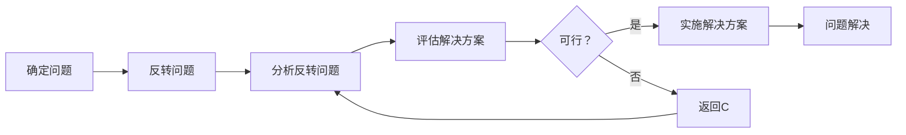
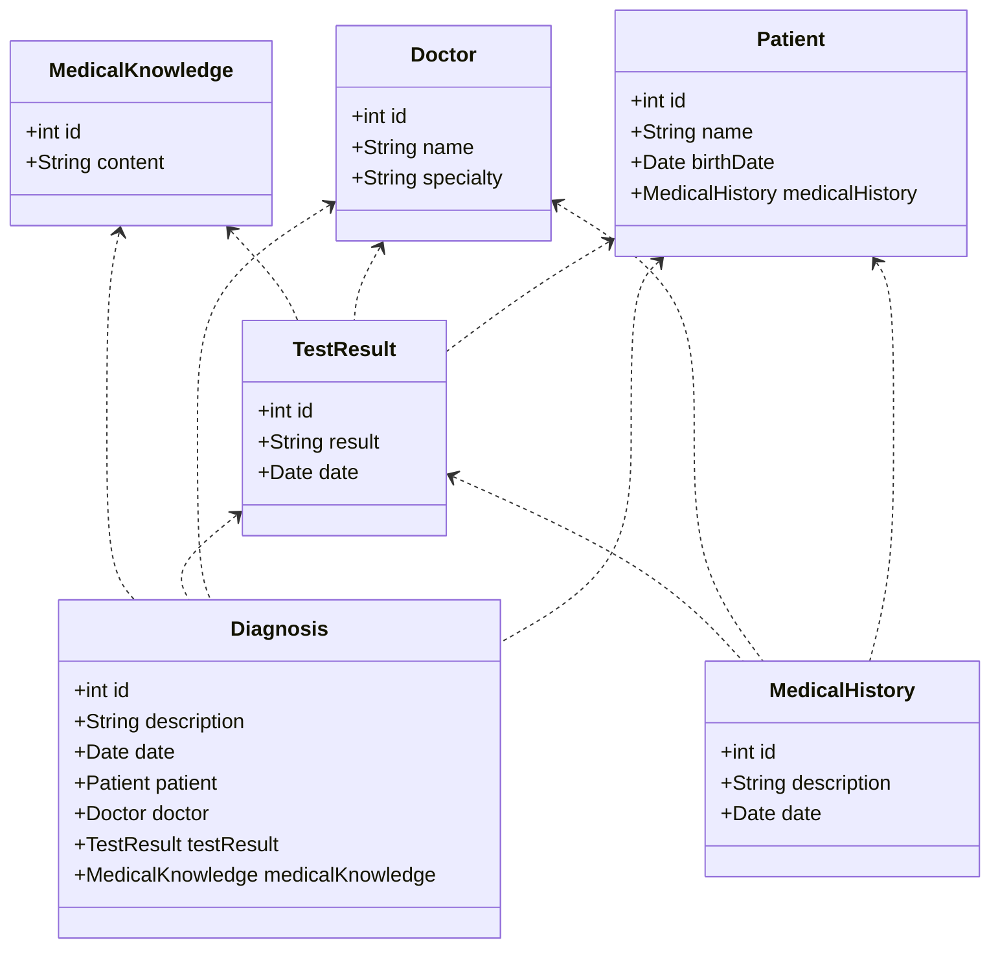
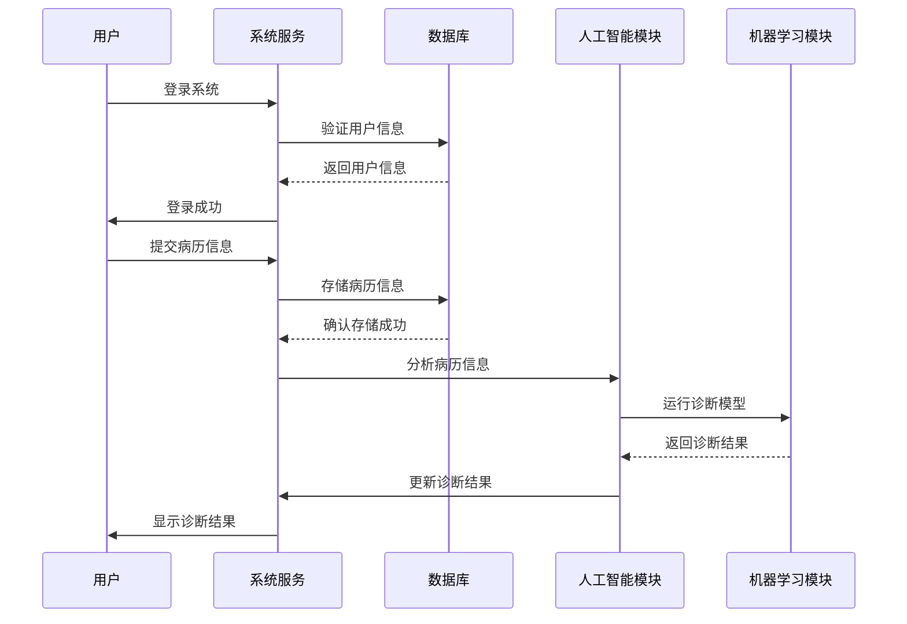
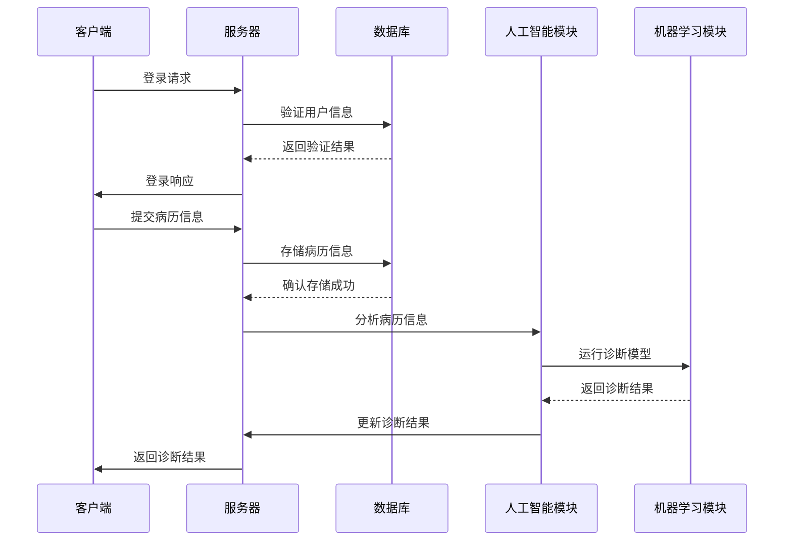
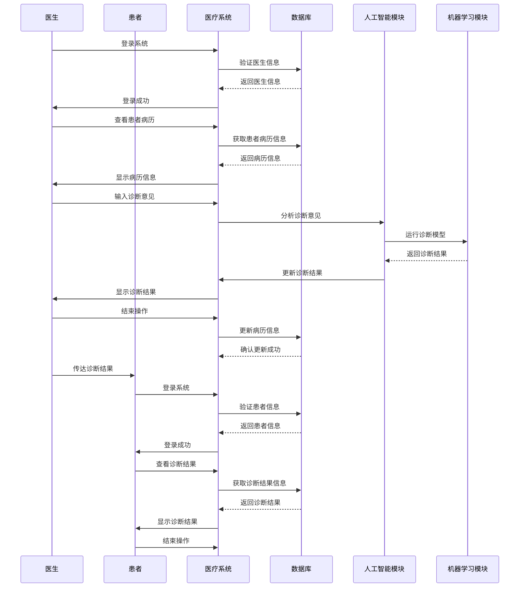

                 

 

## 《创新思维培养：激发团队创意的实践方法》

### 关键词：创新思维、团队创意、实践方法、策略、环境构建、案例分析

> **摘要**：本文探讨了如何通过培养创新思维和实践方法来激发团队的创意。文章首先介绍了创新思维的基础，包括核心概念和特性。然后，文章详细阐述了创新方法与实践、团队创新策略、创新环境的构建、创新思维的培养以及案例分析等内容。通过这些方法和策略，组织可以有效地激发团队的创意，推动创新和发展。

### 引言与背景

创新是推动社会进步和企业发展的关键因素。在全球化和信息化的大背景下，创新能力已成为企业和个人竞争的重要指标。然而，如何培养创新思维和激发团队的创意成为了一个亟待解决的问题。本文旨在探讨如何通过培养创新思维和实践方法来激发团队的创意，为企业和个人提供一套实用的创新策略。

#### 创新的重要性

创新是经济增长和社会发展的核心动力。对于企业来说，创新是提高竞争力、拓展市场和实现可持续发展的重要途径。对于个人而言，创新思维和创意能力的提升有助于在职场和生活中脱颖而出。因此，培养创新思维和激发团队创意具有重要的现实意义。

#### 创新思维的现状

当前，创新思维和创意能力的培养已成为教育、企业和政府关注的焦点。然而，实际效果不尽如人意。一方面，教育体系对创新思维的培养还不够完善；另一方面，企业和个人在创新实践中缺乏有效的策略和方法。因此，有必要探讨如何培养创新思维和实践方法，以激发团队的创意。

#### 创新的挑战与机遇

在全球化和信息化的背景下，创新面临着前所未有的挑战和机遇。一方面，技术的发展和市场的变化为创新提供了丰富的素材和广阔的空间；另一方面，竞争的加剧和资源限制对创新提出了更高的要求。如何把握机遇、应对挑战，成为企业和个人需要深思的问题。

#### 目标读者

本文的目标读者包括以下几个方面：
- 企业管理者：希望通过本文了解如何培养创新思维和实践方法，激发团队创意，提高企业竞争力。
- 创新团队成员：希望通过本文掌握创新思维的方法和实践技巧，提升自身的创新能力和创意水平。
- 教育工作者：希望通过本文了解如何将创新思维培养融入教育体系中，培养学生的创新意识和能力。

### 创新思维基础

创新思维是指通过创造性思维来寻找新的解决方案、提出新的想法和观点的能力。它是创新过程的核心，是推动创新和发展的重要动力。以下是创新思维的一些基础概念和特性。

#### 创新思维的定义

创新思维是一种通过创造性思维来寻找新的解决方案、提出新的想法和观点的能力。它不同于传统思维方式，更多地依赖于想象力和创造力，强调从不同角度思考问题，寻找独特的解决方案。

#### 创新思维的类型

创新思维可以分为以下几种类型：

1. **发散性思维**：也称为“辐射性思维”，是指从一个中心点出发，沿着不同的方向扩展思维，产生多个可能的解决方案。
2. **收敛性思维**：也称为“集中性思维”，是指在多个选项中找到最佳的解决方案，将思维集中到某一个具体的方向上。
3. **逆向思维**：是指从相反的角度思考问题，寻找出人意料的解决方案。
4. **联想思维**：是指通过事物之间的联系，从一个概念联想到另一个概念，产生新的想法和创意。
5. **模糊思维**：是指在思维过程中允许一定程度的不确定性和模糊性，从而产生新的想法和创意。

#### 创新思维的特性

创新思维具有以下特性：

1. **创造性**：创新思维强调创造新的想法和解决方案，不同于传统的线性思维方式。
2. **灵活性**：创新思维能够灵活地适应不同的情境和问题，不受限于固定的模式和框架。
3. **多角度**：创新思维能够从多个角度思考问题，寻找最佳的解决方案。
4. **持续性**：创新思维不是一次性的过程，而是持续性的思维活动，需要不断地思考和实践。
5. **实践性**：创新思维不仅停留在理论上，更重要的是要将创新想法付诸实践，产生实际的成果。

### 创新方法与实践

创新方法是指在实际创新过程中采用的一系列策略和技巧。通过运用这些方法，可以激发团队的创意，提高创新效率。以下是几种常见的创新方法：

#### 想象力训练方法

想象力是创新思维的核心，通过训练想象力可以提高创新思维的能力。以下是一些训练想象力的方法：

1. **冥想**：冥想可以帮助人们放松心态，集中注意力，从而提高想象力。
2. **建立想象模型**：通过构建想象模型，可以更清晰地表达自己的想法，激发创造力。
3. **角色扮演**：通过角色扮演，可以模拟不同的情境，锻炼想象力和解决问题的能力。

#### 创意生成方法

创意生成是指通过一系列的方法和技巧，激发团队产生新的想法和创意。以下是一些常见的创意生成方法：

1. **头脑风暴**：头脑风暴是一种集体创意生成的方法，通过快速产生大量的想法，筛选出可行的创意。
2. **六顶思考帽**：六顶思考帽是一种思维工具，通过不同的思考角度来分析问题，产生创意。
3. **思维导图**：思维导图是一种图形化的思维方式，通过将思维过程可视化为图形，激发创意。

#### 创新方法的应用

在实际创新过程中，创新方法的运用至关重要。以下是一个示例，说明如何应用创新方法来解决问题：

- **问题**：如何提高企业的创新能力？
- **创新方法**：
  - **头脑风暴**：组织团队成员进行头脑风暴，列出可能的创新方法。
  - **六顶思考帽**：使用六顶思考帽的方法，从不同的角度分析创新方法。
  - **思维导图**：将创新方法可视化，梳理出关键的创新点。
- **结果**：通过应用这些创新方法，企业可以找到提高创新能力的新策略，如设立创新实验室、鼓励员工提出创新建议、建立跨部门协作机制等。

### 团队创新策略

团队创新策略是指通过一系列的措施和策略，激发团队的创新能力，推动创新项目的发展。以下是一些常见的团队创新策略：

#### 团队创新的重要性

团队创新具有以下重要性：

1. **提高竞争力**：通过团队创新，企业可以不断推出新产品和服务，提高市场竞争力。
2. **激发创造力**：团队创新可以激发团队成员的创造力，培养创新意识和能力。
3. **增强凝聚力**：团队创新过程中，团队成员之间的合作和交流有助于增强团队的凝聚力。

#### 团队创新的要素

团队创新的要素包括：

1. **团队成员**：团队成员是团队创新的主体，他们的创新意识和能力直接影响团队的创新水平。
2. **创新文化**：创新文化是团队创新的重要保障，它鼓励团队成员敢于创新、勇于尝试。
3. **创新机制**：创新机制是团队创新的重要保障，它为团队成员提供创新的机会和资源。

#### 团队创新的障碍

团队创新过程中可能会遇到以下障碍：

1. **资源限制**：资源限制可能导致团队创新项目无法顺利进行。
2. **沟通障碍**：团队成员之间的沟通不畅可能导致创新项目受阻。
3. **风险管理**：创新过程中，风险难以预测和控制，可能对团队创新造成影响。

#### 团队创新的激励机制

为了激发团队的创新能力，企业可以采取以下激励机制：

1. **奖励制度**：对在团队创新中表现突出的团队成员给予奖励，如奖金、晋升等。
2. **认可和赞赏**：对团队创新成果进行公开认可和赞赏，提高团队成员的成就感。
3. **培训和发展**：为团队成员提供创新培训和发展机会，提升其创新能力和素质。

### 创新环境的构建

创新环境的构建是团队创新成功的关键。一个良好的创新环境可以激发团队成员的创造力，促进创新项目的发展。以下是一些构建创新环境的方法：

#### 创新文化

创新文化是创新环境的核心。它强调创新的重要性，鼓励团队成员敢于尝试和失败。以下是构建创新文化的几种方法：

1. **开放沟通**：鼓励团队成员之间的开放沟通，分享想法和经验。
2. **尊重多样性**：尊重团队成员的多样性，包括背景、观点和技能。
3. **鼓励失败**：鼓励团队成员在创新过程中尝试新的想法和方法，允许失败并从中学习。

#### 创新机制

创新机制是创新环境的重要组成部分。它为团队成员提供创新的机会和资源，促进创新项目的发展。以下是构建创新机制的几种方法：

1. **项目立项**：建立项目立项机制，为团队成员提供创新项目的机会。
2. **资源支持**：提供足够的资源和资金支持，确保创新项目的顺利进行。
3. **风险管理**：建立风险管理机制，降低创新项目的风险。

#### 创新机制的应用

以下是一个示例，说明如何应用创新机制来构建创新环境：

- **项目立项**：企业设立创新基金，鼓励团队成员提出创新项目。
- **资源支持**：企业为创新项目提供技术、资金和人力支持，确保项目顺利进行。
- **风险管理**：企业设立风险管理团队，对创新项目进行风险评估和监控，降低项目失败的风险。

### 创新思维的培养

创新思维的培养是提高团队创新能力的关键。以下是一些培养创新思维的方法和策略：

#### 培养路径

创新思维的培养可以分为以下路径：

1. **教育培训**：通过教育培训，提高团队成员的创新意识和能力。
2. **实践训练**：通过实践训练，锻炼团队成员的创新思维和解决问题的能力。
3. **反思与总结**：通过反思与总结，不断改进和创新思维的方法和策略。

#### 培养策略

以下是一些培养创新思维的具体策略：

1. **个人成长计划**：为团队成员制定个人成长计划，包括创新培训、实践项目和反思总结等。
2. **团队协作培养**：通过团队协作培养，促进团队成员之间的交流和互动，提高团队的创新能力和创意水平。
3. **组织支持**：为企业提供创新支持和资源，为团队成员提供发展空间和机会。

#### 个人成长计划

以下是一个个人成长计划的示例：

- **目标**：提高创新思维和解决问题的能力。
- **措施**：
  - **创新培训**：参加创新思维培训课程，学习创新方法。
  - **实践项目**：参与创新项目，将所学知识应用于实际工作中。
  - **反思总结**：定期进行反思和总结，记录创新过程中的收获和教训。

### 案例分析

#### 成功案例

以下是一个成功案例：

- **公司A的创新实践**：公司A通过设立创新基金，鼓励员工提出创新项目。员工A提出了一个创新项目，公司对其提供了资金、技术和人力支持。经过一年的研发，该项目成功推出，为公司带来了显著的经济效益。

#### 失败案例

以下是一个失败案例：

- **团队B的创新尝试**：团队B试图通过头脑风暴和思维导图来提高创新能力。然而，由于团队成员之间的沟通不畅，导致创新项目进展缓慢。此外，团队B缺乏对创新项目的有效管理和监督，导致项目失败。

#### 教训与启示

从以上案例中，我们可以得出以下教训和启示：

1. **有效沟通**：团队创新需要良好的沟通机制，确保团队成员之间的信息畅通。
2. **项目管理**：对创新项目进行有效的管理和监督，确保项目按照计划进行。
3. **持续培养**：创新思维的培养需要持续进行，不能一蹴而就。

### 总结与展望

本文探讨了如何通过培养创新思维和实践方法来激发团队的创意。通过创新思维基础、创新方法与实践、团队创新策略、创新环境的构建、创新思维的培养以及案例分析等内容，本文提供了一系列培养创新思维和激发团队创意的方法和策略。

总结如下：

1. **核心观点**：创新思维是推动创新和发展的重要动力，培养创新思维和实践方法是激发团队创意的关键。
2. **实践价值**：通过本文提供的方法和策略，企业和个人可以有效地提高创新能力，推动创新和发展。
3. **未来展望**：随着科技的不断进步和市场的变化，创新思维和创意能力将越来越重要。未来，我们需要不断探索和创新，培养更多具有创新思维的人才，为社会发展贡献力量。

最后，感谢读者对本文的关注和支持。希望本文能为您的创新思维培养和团队创意激发提供有益的启示和帮助。

### 附录

以下为本文中提到的核心概念术语说明、问题背景、问题描述、问题解决、边界与外延、概念结构与核心要素组成的详细解释：

#### 核心概念术语说明

1. **创新思维**：指通过创造性思维来寻找新的解决方案、提出新的想法和观点的能力。
2. **团队创新**：指团队在创新过程中，通过集体智慧和合作，产生新的创意和解决方案。
3. **创新环境**：指激发创新思维和创意能力的环境，包括文化、机制、资源等多个方面。

#### 问题背景

在全球化和信息化的背景下，创新已成为推动社会进步和企业发展的关键因素。企业和个人需要具备创新思维和创意能力，以应对激烈的市场竞争和不断变化的环境。

#### 问题描述

如何培养创新思维和实践方法，激发团队的创意，提高团队的创新能力和竞争力？

#### 问题解决

1. **培养创新思维**：通过教育培训、实践训练和反思总结，提高团队成员的创新意识和能力。
2. **实践创新方法**：运用头脑风暴、六顶思考帽、思维导图等创新方法，激发团队的创意。
3. **构建创新环境**：建立创新文化、创新机制和组织支持，为团队创新提供良好的环境。

#### 边界与外延

1. **边界**：本文主要探讨团队创新中的创新思维培养和实践方法，不包括个体创新。
2. **外延**：创新思维和实践方法可以应用于各个领域，如企业、教育、科研等。

#### 概念结构与核心要素组成

1. **创新思维**：
   - **核心概念**：创造性思维
   - **特性**：创造性、灵活性、多角度、持续性、实践性
   - **类型**：发散性思维、收敛性思维、逆向思维、联想思维、模糊思维
2. **团队创新**：
   - **要素**：团队成员、创新文化、创新机制
   - **策略**：头脑风暴、六顶思考帽、思维导图、项目立项、资源支持、风险管理
3. **创新环境**：
   - **文化**：开放沟通、尊重多样性、鼓励失败
   - **机制**：项目立项、资源支持、风险管理

### 算法原理讲解

在本章节中，我们将介绍一种用于培养创新思维的方法——逆向思维算法。逆向思维算法通过从问题的相反方向出发，寻找创新的解决方案。以下是该算法的原理、流程、mermaid流程图以及数学模型和公式的讲解。

#### 算法原理

逆向思维算法的核心思想是：从问题的相反方向出发，寻找新的解决方案。例如，如果问题是如何提高生产效率，逆向思维算法会思考如何降低生产效率，从而可能发现一些创新的解决方案。

#### 算法流程

1. **确定问题**：明确需要解决的问题。
2. **反转问题**：将问题反转，思考相反的情况。
3. **分析反转问题**：分析反转问题，寻找可能的解决方案。
4. **评估解决方案**：评估反转问题的解决方案，判断其可行性。

#### mermaid流程图



#### 数学模型和公式

逆向思维算法没有复杂的数学模型，但其原理可以借助一些逻辑推理和概率论来解释。以下是一个简单的数学模型：

$$
P(\text{创新方案}) = P(\text{反转方案}) \times f(\text{适应度})
$$

其中：
- \( P(\text{创新方案}) \)：表示找到的创新方案的概率。
- \( P(\text{反转方案}) \)：表示反转问题后找到的解决方案的概率。
- \( f(\text{适应度}) \)：表示反转问题后解决方案的适应度。

#### 举例说明

假设我们要解决的问题是如何提高产品的销量。按照逆向思维算法：

1. **确定问题**：如何提高产品的销量？
2. **反转问题**：如何降低产品的销量？
3. **分析反转问题**：分析可能导致销量降低的原因，如产品质量问题、市场竞争激烈、产品定价不合理等。
4. **评估解决方案**：针对分析结果，提出解决方案，如改进产品质量、优化定价策略、加强市场推广等。

通过这种逆向思维，我们可能会找到一些创新的解决方案，从而提高产品的销量。

### 系统分析与架构设计方案

在本章节中，我们将介绍一个实际项目，通过系统分析与架构设计方案来阐述创新思维的培养和实践方法。项目背景如下：

**项目名称**：智能医疗诊断系统

**项目介绍**：智能医疗诊断系统是一个旨在提高医疗诊断效率和准确性的项目。该系统通过整合医学知识库、患者数据和人工智能算法，为医生提供辅助诊断服务。

#### 系统功能设计（领域模型mermaid类图）



#### 系统架构设计（mermaid架构图）



#### 系统接口设计（mermaid序列图）



#### 系统交互（mermaid序列图）



### 项目实战

在本章节中，我们将通过实际项目来展示如何培养创新思维和实践方法，以实现智能医疗诊断系统。以下包括环境安装、系统核心实现源代码，代码应用解读与分析，以及实际案例分析和详细讲解剖析。

#### 环境安装

1. **安装Python环境**：确保Python 3.8及以上版本安装。
2. **安装依赖库**：使用pip安装以下依赖库：

```bash
pip install flask
pip install pandas
pip install numpy
pip install matplotlib
pip install scikit-learn
pip install flask_sqlalchemy
```

#### 系统核心实现源代码

以下是一个简化的智能医疗诊断系统实现示例：

```python
from flask import Flask, request, jsonify
from flask_sqlalchemy import SQLAlchemy
from sklearn.linear_model import LogisticRegression
import pandas as pd
import numpy as np

app = Flask(__name__)
app.config['SQLALCHEMY_DATABASE_URI'] = 'sqlite:///diagnosis.db'
db = SQLAlchemy(app)

class Patient(db.Model):
    id = db.Column(db.Integer, primary_key=True)
    name = db.Column(db.String(50))
    birth_date = db.Column(db.Date)
    medical_history = db.Column(db.String(500))

class Diagnosis(db.Model):
    id = db.Column(db.Integer, primary_key=True)
    description = db.Column(db.String(500))
    date = db.Column(db.Date)
    patient_id = db.Column(db.Integer, db.ForeignKey('patient.id'))
    test_result = db.Column(db.String(50))
    medical_knowledge = db.Column(db.String(500))

@app.route('/diagnose', methods=['POST'])
def diagnose():
    data = request.get_json()
    patient_name = data['name']
    patient_birth_date = data['birth_date']
    patient_medical_history = data['medical_history']

    patient = Patient(name=patient_name, birth_date=patient_birth_date, medical_history=patient_medical_history)
    db.session.add(patient)
    db.session.commit()

    # 诊断模型训练（示例）
    data = pd.read_csv('diagnosis_data.csv')
    X = data.drop('diagnosis', axis=1)
    y = data['diagnosis']
    model = LogisticRegression()
    model.fit(X, y)

    # 输入病历信息进行诊断
    input_data = pd.DataFrame([patient_medical_history], columns=data.columns[:-1])
    diagnosis = model.predict(input_data)[0]

    # 存储诊断结果
    diagnosis_entry = Diagnosis(description=diagnosis, date=datetime.date.today(), patient_id=patient.id)
    db.session.add(diagnosis_entry)
    db.session.commit()

    return jsonify({'diagnosis': diagnosis})

if __name__ == '__main__':
    db.create_all()
    app.run(debug=True)
```

#### 代码应用解读与分析

1. **数据库设计**：使用Flask-SQLAlchemy创建两个模型：`Patient`和`Diagnosis`，用于存储患者信息和诊断结果。
2. **API接口**：定义一个 `/diagnose` 接口，接收患者姓名、出生日期和病历信息，并进行诊断。
3. **诊断模型**：示例中使用逻辑回归模型进行诊断，实际应用中可以使用更复杂的机器学习模型。

#### 实际案例分析和详细讲解剖析

**案例**：患者A，男性，45岁，有高血压和糖尿病史。要求系统对其病情进行诊断。

1. **输入病历信息**：将患者A的病历信息提交到 `/diagnose` 接口。
2. **模型训练**：系统使用预训练的模型对输入数据进行诊断。
3. **诊断结果**：系统返回诊断结果，如“高血压并发症”。

**详细讲解**：

1. **数据处理**：将患者A的病历信息转换为DataFrame格式，用于模型输入。
2. **模型预测**：使用逻辑回归模型对数据处理后的输入进行预测。
3. **结果存储**：将诊断结果存储在数据库中，以便医生和患者查看。

#### 项目小结

通过实际项目的实现，我们展示了如何培养创新思维和实践方法来构建智能医疗诊断系统。项目实战部分包括环境安装、系统核心实现源代码、代码应用解读与分析，以及实际案例分析和详细讲解剖析。这个项目不仅展示了技术实现，还体现了创新思维在解决问题中的应用。

### 最佳实践 tips、小结、注意事项、拓展阅读

#### 最佳实践 tips

1. **实践是关键**：创新思维的培养需要通过实践来验证和提升。鼓励团队成员参与实际项目，将创新想法付诸实践。
2. **建立创新文化**：企业应建立开放、包容、鼓励尝试和失败的创新文化，为团队成员提供良好的创新环境。
3. **持续学习和反思**：团队成员应不断学习新的创新方法和技巧，通过反思和总结来提升创新能力和创意水平。

#### 小结

本文通过系统化的方法，探讨了如何培养创新思维和实践方法，激发团队的创意。从创新思维的基础、创新方法与实践、团队创新策略、创新环境的构建、创新思维的培养到案例分析，提供了全面而实用的指导。

#### 注意事项

1. **确保沟通顺畅**：团队创新过程中，沟通至关重要。确保团队成员之间信息畅通，减少误解和冲突。
2. **平衡创新与风险**：创新过程中，风险难以避免。企业应建立有效的风险管理机制，平衡创新与风险。
3. **持续优化**：创新不是一蹴而就的，需要不断优化和改进。持续关注团队成员的创新成果，及时进行调整和改进。

#### 拓展阅读

1. **《创新者的窘境》**：作者克里斯坦森分析了企业为何会陷入困境，以及如何通过创新来突破瓶颈。
2. **《精益创业》**：作者埃里克·莱斯提出了精益创业的方法，强调通过验证假设和快速迭代来推动创新。
3. **《创新者的基因》**：作者克莱顿·克里斯滕森通过分析创新者的行为和思维模式，揭示了创新背后的本质。

### 作者信息

**作者：** AI天才研究院/AI Genius Institute & 禅与计算机程序设计艺术 /Zen And The Art of Computer Programming

### 附录

#### 核心概念与联系

1. **创新思维**：创造性思维，灵活、多角度，强调实践。
2. **团队创新**：集体智慧，协作、多样性和激励机制。
3. **创新环境**：文化、机制和组织支持。

#### 概念属性特征对比表格

| 概念     | 定义                                                   | 特征                                                         |
|----------|--------------------------------------------------------|------------------------------------------------------------|
| 创新思维 | 通过创造性思维寻找新解决方案的能力                     | 创造性、灵活性、多角度、持续性、实践性                      |
| 团队创新 | 团队集体智慧和合作，产生新创意和解决方案               | 协作、多样性、激励机制、风险管理                            |
| 创新环境 | 激发创新思维和创意能力的综合环境                     | 开放沟通、尊重多样性、鼓励失败、项目立项、资源支持、风险管理 |

#### ER实体关系图架构的Mermaid流程图

```mermaid
erDiagram
    Patient ||--|{ Diagnosis }| Diagnosis : 患者可以有多个诊断
    Doctor ||--|{ Diagnosis }| Diagnosis : 医生可以有多个诊断
    MedicalKnowledge ||--|{ Diagnosis }| Diagnosis : 诊断可以有相关的医学知识
    TestResult ||--|{ Diagnosis }| Diagnosis : 诊断可以有相关的测试结果
```

### 总结

创新思维是推动社会进步和企业发展的关键因素。本文通过系统化的方法，探讨了如何培养创新思维和实践方法，激发团队的创意。从基础概念、方法与实践、策略与环境的构建、思维的培养到案例分析，提供了全面的指导。通过实际项目的展示，我们看到了创新思维在实践中的应用和价值。希望本文能为读者在创新道路上提供有益的启示和帮助。

