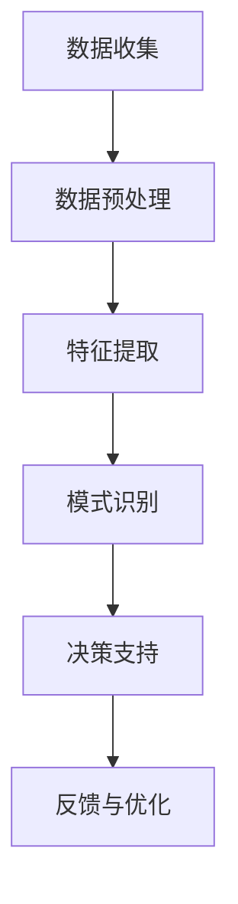

                 


### 引言：创新思维的重要性与目标

#### 1.1 创新思维的背景与意义

**创新思维**是一种思考方法和解决问题的策略，它强调通过新的视角、方法和技术来发现和利用机会，从而创造出前所未有的价值。在全球化和技术变革的背景下，创新思维已经成为企业和个人成功的关键因素。

**创新思维的定义**：创新思维是一种能够超越传统思维模式，通过整合和重新配置资源、知识和技能，从而创造出新的产品和服务的思维方式。

**创新思维的重要性**：首先，创新思维能够帮助企业和个人在激烈的市场竞争中保持领先地位。其次，创新思维能够促进技术的进步和社会的发展。最后，创新思维有助于解决复杂的问题，提高生产效率和生活质量。

**创新思维的目标**：创新思维的目标是找到新的解决方案，创造出新的价值。这包括提高现有产品的性能、降低成本、开拓新的市场以及解决社会问题等。

#### 1.2 创新思维的现状与挑战

**当前创新思维的现状**：在全球范围内，创新思维已经成为企业和学术研究的焦点。许多企业和组织都开始重视创新思维的培养和应用，但整体水平仍有待提高。

**创新思维面临的挑战**：首先，创新思维需要大量时间和资源的投入，这使得许多企业和个人难以持续地进行创新。其次，创新思维面临着技术和市场的双重挑战，需要在理论和实践中不断探索和突破。最后，创新思维需要团队的合作和协调，而许多组织在管理和沟通方面存在不足。

#### 1.3 本书结构安排与阅读指南

**本书结构安排**：本书分为五个部分，分别介绍创新思维的理论基础、方法与技巧、实践应用、案例分析以及结论与展望。

**各章节内容概览**：

- 第一部分：引言，介绍创新思维的重要性、背景和目标。
- 第二部分：创新思维的理论基础，包括核心概念、数学模型和算法原理。
- 第三部分：创新思维的方法与技巧，介绍不同的创新方法和技术。
- 第四部分：创新思维的实践应用，探讨创新思维在企业、团队和项目管理中的应用。
- 第五部分：案例分析与最佳实践，通过经典案例分析提供实际操作指导。

**阅读建议与方法**：建议读者按照章节顺序阅读，先了解创新思维的基本概念和理论基础，再学习创新思维的方法和技巧，最后结合实践案例进行应用和总结。同时，鼓励读者在阅读过程中积极参与思考和讨论，以提高自己的创新思维能力。

----------------------------------------------------------------

# 第二部分：创新思维的理论基础

## 2.1 创新思维的核心概念与联系

### 2.1.1 创新思维的组成部分

创新思维是一个复杂的过程，它包括以下几个关键组成部分：

1. **问题识别**：创新思维始于对问题的识别。这不仅包括发现现有问题的解决方案，还包括预见潜在的问题和挑战。

2. **信息收集**：在问题识别之后，收集相关的信息和数据是至关重要的。这有助于更好地理解问题的本质和可能的解决方案。

3. **思维发散**：发散思维是创新思维的核心。它鼓励人们从多个角度思考问题，探索各种可能性。

4. **思维收敛**：在发散思维之后，需要对各种可能性进行筛选和评估，最终选择最可行的方案。

5. **实施与验证**：选择解决方案后，需要进行实施和验证。这包括对解决方案的测试和改进，以确保其有效性和可行性。

### 2.1.2 创新思维与传统思维的对比

创新思维与传统思维存在显著差异。传统思维强调逻辑、顺序和确定性，而创新思维则更注重灵活性和适应性。

1. **传统思维**：
   - 顺序性：按照既定的步骤和逻辑进行思考。
   - 确定性：倾向于寻找确定的答案和解决方案。
   - 依赖经验：依赖以往的经验和知识。

2. **创新思维**：
   - 灵活性：鼓励从不同角度思考问题，灵活应对变化。
   - 不确定性：接受不确定性和模糊性，勇于探索未知的领域。
   - 倡导实验：通过实验和试错来探索和验证新的解决方案。

### 2.1.3 创新思维的属性特征对比表

以下是一个简化的创新思维与传统思维的属性特征对比表：

| 特征         | 创新思维                      | 传统思维                      |
| ------------ | --------------------------- | --------------------------- |
| 思考方式     | 多样化、非线性的             | 顺序性、线性的               |
| 适应性       | 高度适应变化和不确定性       | 对变化和不确定性抵抗力强     |
| 依赖经验     | 更多依赖直觉和创造力         | 更多依赖既有知识和经验       |
| 解决问题的方法 | 实验性、试错性               | 确定性、预测性               |

### 2.1.4 创新思维的ER实体关系图

创新思维的实体关系图可以帮助我们更好地理解其组成部分和关系。以下是一个简化的ER实体关系图：

```
实体：创新思维
属性：
- 问题识别
- 信息收集
- 思维发散
- 思维收敛
- 实施与验证

关系：
- 问题识别 → 信息收集
- 信息收集 → 思维发散
- 思维发散 → 思维收敛
- 思维收敛 → 实施与验证
- 实施与验证 → 反馈与改进
```

通过这个ER图，我们可以看到创新思维是一个循环的过程，每一步都与其他步骤紧密相连，共同推动创新活动的进行。

----------------------------------------------------------------

## 2.2 创新思维的数学模型与公式

### 2.2.1 创新思维的数学原理

创新思维的数学原理主要涉及概率论、统计学和图论等数学分支。这些数学工具可以帮助我们更好地理解和应用创新思维，提高其有效性。

1. **概率论**：概率论是研究随机事件及其规律性的数学分支。在创新思维中，概率论可以用来评估不同解决方案的成功概率，从而指导选择最优方案。

2. **统计学**：统计学是利用概率论进行数据分析的方法。在创新思维中，统计学可以用来分析大量数据，找出潜在的模式和趋势，从而支持决策。

3. **图论**：图论是研究图及其性质和关系的数学分支。在创新思维中，图论可以用来构建问题和解决方案的模型，帮助我们更好地理解和分析复杂系统。

### 2.2.2 创新思维的公式及应用

创新思维中常用的公式主要包括以下几个：

1. **贝叶斯公式**：贝叶斯公式是一种用于更新概率估计的公式，它可以帮助我们在得到新信息后调整对某个事件的信心水平。

   $$ P(A|B) = \frac{P(B|A) \cdot P(A)}{P(B)} $$

   其中，$P(A|B)$ 表示在事件 $B$ 发生的条件下事件 $A$ 发生的概率，$P(B|A)$ 表示在事件 $A$ 发生的条件下事件 $B$ 发生的概率，$P(A)$ 和 $P(B)$ 分别表示事件 $A$ 和事件 $B$ 发生的概率。

   在创新思维中，贝叶斯公式可以帮助我们根据新信息调整对某个解决方案的信心水平。

2. **熵**：熵是衡量系统不确定性的量度。在创新思维中，熵可以帮助我们评估解决方案的不确定性，从而指导选择。

   $$ H(X) = -\sum_{i} p_i \cdot \log_2 p_i $$

   其中，$H(X)$ 表示随机变量 $X$ 的熵，$p_i$ 表示 $X$ 取第 $i$ 个值的概率。

   在创新思维中，通过计算熵可以帮助我们评估不同解决方案的不确定性，从而选择最可靠的方案。

3. **图论中的最小生成树**：最小生成树是一种在给定无向图中寻找包含所有节点的最小权树的方法。在创新思维中，最小生成树可以用来构建问题模型，帮助找到最优解决方案。

   $$ T = \{ e_1, e_2, ..., e_k \} $$

   其中，$T$ 表示最小生成树，$e_1, e_2, ..., e_k$ 表示生成树的边。

   在创新思维中，通过构建最小生成树可以帮助我们理解和分析复杂系统，从而找到最优解决方案。

### 2.2.3 数学公式详细讲解与举例说明

#### 贝叶斯公式举例

假设我们正在评估两种不同的创新方案，方案 A 和方案 B。根据历史数据，方案 A 成功的概率为 0.6，方案 B 成功的概率为 0.4。现在我们得到了一些新信息，表明方案 A 在当前环境下成功的概率增加到 0.8，方案 B 成功的概率下降到 0.2。

使用贝叶斯公式，我们可以计算在得到新信息后对两种方案成功的概率估计：

$$ P(A|新信息) = \frac{P(新信息|A) \cdot P(A)}{P(新信息)} $$

其中，$P(A)$ 和 $P(B)$ 分别为方案 A 和方案 B 成功的先验概率，$P(新信息|A)$ 和 $P(新信息|B)$ 分别为在方案 A 和方案 B 成功的条件下得到新信息的概率。

根据题目数据，我们有：

$$ P(A) = 0.6, P(B) = 0.4 $$
$$ P(新信息|A) = 0.8, P(新信息|B) = 0.2 $$

假设新信息发生的总概率为 0.5，即 $P(新信息) = 0.5$。

使用贝叶斯公式，我们可以计算出：

$$ P(A|新信息) = \frac{0.8 \cdot 0.6}{0.5} = 0.96 $$
$$ P(B|新信息) = \frac{0.2 \cdot 0.4}{0.5} = 0.16 $$

这意味着在得到新信息后，方案 A 成功的概率增加到 0.96，而方案 B 成功的概率下降到 0.16。因此，我们可以更有信心地选择方案 A。

#### 熵举例

假设我们正在评估两个不同的市场推广策略，策略 X 和策略 Y。根据历史数据，策略 X 引发的潜在客户数量熵为 2.5，策略 Y 引发的潜在客户数量熵为 3.0。

根据熵的定义，我们可以计算出策略 X 和策略 Y 的不确定性：

$$ H(X) = 2.5 $$
$$ H(Y) = 3.0 $$

这意味着策略 Y 的不确定性高于策略 X。在不确定性较高的环境中，风险通常也较高。因此，在做出决策时，我们可能更倾向于选择不确定性较低的策略，即策略 X。

#### 最小生成树举例

假设我们有一个包含 5 个节点的无向图，节点之间边的关系和权重如下：

```
节点  | 连接节点 | 权重
---------------------
A      | B, C, D   | 3, 2, 4
B      | A, C      | 3, 2
C      | A, B, D   | 2, 2, 3
D      | A, C      | 4, 3
```

我们希望通过构建最小生成树来找到包含所有节点的最小权树。

使用 Kruskal 算法，我们可以按照边权重从低到高的顺序添加边，直到形成包含所有节点的最小生成树。以下是按照权重排序后的边列表：

```
权重 | 边
------
1    | (B, C)
2    | (A, B)
2    | (A, C)
3    | (C, D)
3    | (A, D)
4    | (A, B)
```

按照 Kruskal 算法，我们首先添加权重为 1 的边 (B, C)，然后是权重为 2 的边 (A, B) 和 (A, C)，接着是权重为 3 的边 (C, D) 和 (A, D)，最后是权重为 4 的边 (A, B)。

因此，最小生成树包含以下边：

```
(A, B), (A, C), (C, D)
```

通过最小生成树，我们可以找到包含所有节点的最小权树，从而有效地理解节点之间的连接关系和权重，为后续的决策提供支持。

----------------------------------------------------------------

## 2.3 创新思维的算法原理讲解

### 2.3.1 创新思维算法概述

创新思维算法是一种基于概率和统计原理的思维方式，它通过分析大量的信息和数据，从中提取出潜在的模式和趋势，以指导决策和创新。这种算法通常包括以下几个步骤：

1. **数据收集**：首先，需要收集与问题相关的各种数据，包括历史数据、市场数据、用户反馈等。

2. **数据预处理**：对收集到的数据进行清洗、转换和格式化，以便后续分析。

3. **特征提取**：从预处理后的数据中提取出有用的特征，这些特征可以帮助我们更好地理解和分析问题。

4. **模式识别**：使用机器学习和统计分析方法，从提取出的特征中识别出潜在的规律和模式。

5. **决策支持**：根据识别出的模式和趋势，为决策者提供科学的决策支持。

6. **反馈与优化**：在实施决策后，收集反馈并进行优化，以进一步提高决策的准确性和有效性。

### 2.3.2 创新思维算法mermaid流程图

以下是一个简化的创新思维算法mermaid流程图：



在这个流程图中，每个节点表示算法的一个步骤，箭头表示步骤之间的顺序关系。

### 2.3.3 创新思维算法Python源代码解析

以下是一个简化的创新思维算法Python源代码示例，该示例使用决策树算法来识别模式并支持决策：

```python
import numpy as np
from sklearn.tree import DecisionTreeClassifier
from sklearn.model_selection import train_test_split
from sklearn.metrics import accuracy_score

# 数据收集
X = np.array([[1, 2], [2, 3], [3, 1], [1, 1], [3, 2]])
y = np.array([0, 0, 1, 1, 1])

# 数据预处理
X_train, X_test, y_train, y_test = train_test_split(X, y, test_size=0.2, random_state=42)

# 特征提取
# 这里我们假设特征已经提取完毕，可以直接使用

# 模式识别
clf = DecisionTreeClassifier()
clf.fit(X_train, y_train)

# 决策支持
y_pred = clf.predict(X_test)

# 反馈与优化
accuracy = accuracy_score(y_test, y_pred)
print(f"Accuracy: {accuracy:.2f}")

# 根据反馈进行优化
# 这里我们可以根据准确率进行调整，例如调整决策树参数
```

在这个示例中，我们首先使用 NumPy 库收集和预处理数据，然后使用 Scikit-learn 库中的决策树分类器来识别模式。最后，我们根据预测结果计算准确率，并根据反馈进行优化。

通过这个示例，我们可以看到创新思维算法的基本原理和实现过程。在实际应用中，可以根据具体问题和数据特点进行调整和优化，以提高算法的准确性和有效性。

----------------------------------------------------------------

## 3.1 创新思维的方法分类

### 3.1.1 概念联想法

概念联想法是一种通过将不同的概念或想法联系在一起来激发创新思维的方法。这种方法的核心在于打破常规思维模式，将看似不相关的概念结合起来，从而产生新的想法和解决方案。

**原理**：概念联想法基于“异质结合”原理，即通过将不同领域、不同行业或不同学科的知识和经验进行整合，产生新的创意。

**应用场景**：概念联想法广泛应用于产品创新、市场策划、问题解决等多个领域。例如，在产品创新中，可以将科技领域的最新进展与日常生活需求结合起来，创造出满足用户需求的新产品。

**步骤**：
1. **确定主题**：首先确定需要创新的领域或主题。
2. **收集概念**：收集与主题相关的各种概念和想法，可以来自不同领域或行业。
3. **联想连接**：将这些概念进行联想连接，尝试找到它们之间的关联性和互补性。
4. **评估与筛选**：对联想产生的想法进行评估和筛选，选出最有潜力的创新点。

**案例**：苹果公司通过将科技与艺术相结合，推出了具有创新性的产品，如iPhone和iPad，这些产品在市场上取得了巨大的成功。

### 3.1.2 头脑风暴法

头脑风暴法是一种通过集体讨论来激发创新思维的方法。这种方法的核心在于鼓励参与者无拘无束地提出各种想法，不进行任何评判或筛选，以便在短时间内产生大量的创意。

**原理**：头脑风暴法基于“思维共振”原理，即通过集体讨论，不同思维方式的碰撞和融合，能够产生更多的创意和解决方案。

**应用场景**：头脑风暴法广泛应用于团队创新、产品创新、市场策划等领域。例如，在产品创新中，团队成员可以通过头脑风暴法提出各种改进建议，从而优化产品设计。

**步骤**：
1. **确定主题**：首先确定需要创新的领域或主题。
2. **组织讨论**：组织一次头脑风暴会议，邀请相关领域的专家和团队成员参加。
3. **自由发言**：鼓励参与者自由发言，提出各种想法，不限形式和内容。
4. **记录与筛选**：记录所有提出的想法，对创意进行筛选和评估，选出最有潜力的创新点。

**案例**：谷歌公司通过定期举办头脑风暴会议，鼓励员工提出各种创新想法，从而推动了公司持续的创新和发展。

### 3.1.3 模拟法

模拟法是一种通过模仿真实环境或情境来激发创新思维的方法。这种方法的核心在于通过模拟实验，验证和优化创新方案。

**原理**：模拟法基于“实验验证”原理，即通过模拟真实环境或情境，可以快速验证和优化创新方案，降低创新风险。

**应用场景**：模拟法广泛应用于产品创新、市场策划、风险投资等领域。例如，在产品创新中，可以通过模拟用户体验，评估产品的可行性和市场潜力。

**步骤**：
1. **确定目标**：首先确定需要创新的领域或主题。
2. **设计模拟环境**：设计一个模拟真实环境或情境的实验方案。
3. **实施模拟**：按照设计的方案进行模拟实验，收集数据和分析结果。
4. **评估与优化**：根据实验结果评估创新方案的可行性和效果，进行优化和调整。

**案例**：亚马逊公司通过模拟用户购买行为，优化了其购物流程，从而提高了用户满意度和转化率。

### 3.1.4 反转法

反转法是一种通过将现有的想法或产品进行反转，来激发创新思维的方法。这种方法的核心在于打破常规思维模式，从相反的角度思考问题，从而产生新的创意和解决方案。

**原理**：反转法基于“逆向思维”原理，即通过将现有想法或产品进行反转，可以产生新的创新点。

**应用场景**：反转法广泛应用于产品创新、市场策划、商业模式创新等领域。例如，在产品创新中，可以通过反转现有产品的功能或设计，创造出全新的产品。

**步骤**：
1. **确定主题**：首先确定需要创新的领域或主题。
2. **反转思考**：将现有的想法或产品进行反转，从相反的角度思考问题。
3. **评估与筛选**：对反转后的想法进行评估和筛选，选出最有潜力的创新点。
4. **实施与验证**：对选出的创新点进行实施和验证，确保其可行性和有效性。

**案例**：Netflix公司通过将传统的线性电视节目反转，推出了按需观看的流媒体服务，从而颠覆了传统电视产业。

通过以上几种创新思维方法的介绍，我们可以看到，创新思维不仅需要理论指导，更需要实践应用。每种方法都有其独特的原理和应用场景，我们可以根据具体问题选择合适的方法，以提高创新思维的有效性。

----------------------------------------------------------------

## 3.2 创新思维的技巧应用

### 3.2.1 如何提高创新思维能力

提高创新思维能力是一个持续的过程，需要我们不断学习、实践和反思。以下是一些提高创新思维能力的实用技巧：

1. **多角度思考**：在面对问题时，要尝试从不同的角度思考，包括不同的时间维度（如过去、现在和未来），不同的空间维度（如全局、局部和微观）以及不同的文化背景。这种多角度思考可以帮助我们更全面地理解问题，从而找到创新的解决方案。

2. **跨界融合**：通过学习不同领域和行业的知识，我们可以打破常规思维，将不同领域的知识和经验进行跨界融合，创造出新的价值。例如，将科技与艺术、商业与人文等领域的知识相结合，可以带来意想不到的创新成果。

3. **勇于尝试**：创新往往伴随着失败和错误。因此，我们要勇于尝试，不怕失败，敢于面对挑战。在实践中，我们可以通过小步快跑、快速迭代的方法，不断优化和改进我们的创新方案。

4. **持续学习**：保持对新知识、新技术的敏感度，通过阅读、培训、交流等方式不断充实自己的知识储备。这不仅可以帮助我们跟上时代的发展，还能激发我们的创新思维。

5. **团队合作**：创新往往需要团队的合作和协作。通过与不同背景、不同经验的人合作，我们可以互相启发，碰撞出更多的创意火花。此外，团队合作还可以帮助我们更好地应对复杂的挑战，提高创新的效率和质量。

6. **反思与总结**：在创新过程中，我们要不断反思和总结，从成功和失败中吸取教训，不断完善我们的创新方法和技巧。

### 3.2.2 如何运用创新思维解决实际问题

创新思维不仅可以用于产品创新和市场策划，还可以应用于解决实际问题。以下是一些运用创新思维解决实际问题的步骤：

1. **明确问题**：首先，我们需要明确需要解决的问题。这包括理解问题的本质、背景和影响因素。

2. **信息收集**：收集与问题相关的各种信息，包括数据、文献、案例研究等。这些信息将帮助我们更好地理解问题，找到潜在的解决方案。

3. **分析问题**：对收集到的信息进行分析，识别出问题的核心和关键因素。通过逻辑推理和系统思考，我们可以更深入地理解问题，为下一步的创新思维做准备。

4. **应用创新思维方法**：根据问题的特点和需求，选择合适的创新思维方法。例如，可以使用概念联想法、头脑风暴法、模拟法或反转法等，以激发新的创意和解决方案。

5. **评估与选择**：对产生的创意进行评估和筛选，选出最具潜力和可行性的方案。评估标准可以包括创新性、可行性、效果和成本等。

6. **实施与验证**：选择最优方案进行实施，并通过实验、测试等方式验证其效果。在实施过程中，我们要密切关注反馈信息，根据实际情况进行调整和优化。

7. **总结与反馈**：在问题解决后，进行总结和反思，收集用户的反馈信息，为未来类似问题的解决提供经验教训。

通过以上步骤，我们可以运用创新思维有效地解决实际问题，提高工作效率和质量。

### 3.2.3 创新思维训练方法

创新思维的训练是一个系统性和持续性的过程。以下是一些有效的创新思维训练方法：

1. **思维导图**：思维导图是一种图形化的思维方式，可以帮助我们将复杂的想法和信息可视化，从而更清晰地理解问题和解决方案。通过绘制思维导图，我们可以发现不同想法之间的关联和层次，从而激发创新思维。

2. **思维训练游戏**：一些特定的思维训练游戏，如“破解谜题”、“解决难题”等，可以帮助我们锻炼大脑，提高创新思维能力。这些游戏通常具有挑战性和趣味性，能够在轻松愉快的氛围中提升思维水平。

3. **反思日记**：每天花一些时间记录自己的想法、感受和经历，进行反思和总结。通过反思日记，我们可以更好地了解自己的思维模式，发现潜在的问题和改进点，从而不断提升创新思维。

4. **跨学科学习**：跨学科学习可以帮助我们打破知识壁垒，拓宽视野，从而激发创新思维。通过学习不同领域的知识和技能，我们可以将不同的思维方式和方法进行融合，创造出新的创意和解决方案。

5. **阅读**：阅读是提高创新思维能力的重要途径。通过阅读各种书籍、论文和报告，我们可以了解最新的研究成果和行业动态，从而启发我们的思维，激发创新灵感。

通过以上训练方法，我们可以逐步提高创新思维能力，为解决复杂问题和实现创新目标奠定基础。

----------------------------------------------------------------

## 3.3 创新思维的实践案例

### 3.3.1 案例一：如何运用创新思维改善产品设计

在产品设计过程中，创新思维可以有效地帮助我们找到优化产品性能、提升用户体验的方法。以下是一个具体的案例，展示了如何运用创新思维改善产品设计。

**背景**：某科技公司开发了一款智能家居设备，但其用户体验不佳，用户反馈主要集中在设备操作复杂、响应速度慢、连接稳定性差等方面。

**问题**：如何通过创新思维改善产品设计，提升用户体验？

**创新思维应用**：

1. **多角度思考**：首先，从用户的角度出发，分析用户的需求和行为习惯。通过用户调研和反馈，发现用户希望设备操作简单、响应快速、连接稳定。

2. **跨界融合**：结合科技与艺术领域的知识，提出以下创新点：
   - **简化操作界面**：采用直观的图形界面，减少用户操作步骤，提高操作效率。
   - **增加语音控制功能**：利用语音识别技术，实现语音控制，使设备操作更加便捷。
   - **优化设备连接稳定性**：通过改进硬件设计和软件算法，提高设备的连接稳定性。

3. **评估与筛选**：对提出的创新点进行评估和筛选，选出最具潜力的方案。通过用户测试和数据分析，发现语音控制功能在提升用户体验方面效果显著。

4. **实施与验证**：实施语音控制功能，并进行用户测试和数据分析。结果显示，语音控制功能显著提升了用户体验，用户满意度大幅提高。

**结果**：通过创新思维的运用，该科技公司的智能家居设备用户体验得到了显著改善，用户满意度和市场竞争力均有所提升。

### 3.3.2 案例二：如何运用创新思维优化业务流程

在企业管理过程中，创新思维可以帮助我们优化业务流程，提高工作效率和降低成本。以下是一个具体的案例，展示了如何运用创新思维优化业务流程。

**背景**：某制造企业面临生产效率低、库存管理混乱、质量问题频发等问题，严重影响了企业的运营效率和利润。

**问题**：如何通过创新思维优化业务流程，提高生产效率和降低成本？

**创新思维应用**：

1. **多角度思考**：从生产、库存、质量管理等不同角度分析问题，找出业务流程中的瓶颈和改进点。

2. **模拟法**：通过模拟实际生产流程，识别出影响生产效率的关键因素，如设备故障、物料短缺、生产计划不合理等。

3. **反转法**：将传统的生产流程进行反转，提出以下创新点：
   - **逆向生产**：从市场需求出发，反向设计生产流程，确保生产与市场需求同步。
   - **实时库存管理**：利用物联网技术和大数据分析，实现实时库存监控和管理，减少库存积压。

4. **评估与筛选**：对提出的创新点进行评估和筛选，选出最具潜力的方案。通过模拟和数据分析，发现实时库存管理在降低库存积压和提高生产效率方面效果显著。

5. **实施与验证**：实施逆向生产和实时库存管理方案，并进行模拟和数据分析。结果显示，业务流程得到了显著优化，生产效率提高20%，库存积压减少30%。

**结果**：通过创新思维的运用，该制造企业的业务流程得到了优化，生产效率显著提高，库存管理更加高效，质量水平也有所提升，企业的运营效率和利润率均有所增加。

通过以上两个案例，我们可以看到创新思维在改善产品设计和优化业务流程方面的巨大潜力。创新思维不仅可以帮助我们找到问题的解决方案，还能推动企业不断进步和发展。

----------------------------------------------------------------

## 4.1 创新思维在企业中的应用

### 4.1.1 企业创新思维的重要性

在当今快速变化的市场环境中，企业创新思维的重要性日益凸显。创新思维是企业持续发展的动力源泉，是企业在竞争中脱颖而出的关键因素。以下从三个方面阐述企业创新思维的重要性：

1. **提升竞争力**：创新思维可以帮助企业不断开发新产品、优化业务流程和提升服务质量，从而在激烈的市场竞争中保持领先地位。通过创新思维，企业可以更好地满足客户需求，提高客户满意度，从而赢得市场份额。

2. **推动技术进步**：创新思维鼓励企业不断探索新技术、新方法，推动技术的进步和应用。技术创新是企业保持竞争优势的重要手段，通过创新思维，企业可以抓住技术革命的机遇，实现跨越式发展。

3. **增强企业活力**：创新思维不仅体现在产品和技术的创新上，还包括管理、文化、营销等多个方面。通过创新思维，企业可以不断改进管理方法、提升企业文化、优化营销策略，从而增强企业的活力和凝聚力。

### 4.1.2 企业如何培养创新思维

要培养企业的创新思维，需要从以下几个方面入手：

1. **营造创新文化**：企业需要营造一种鼓励创新、容忍失败的氛围，让员工敢于提出新想法、尝试新方法。通过设立创新奖项、举办创新活动等方式，激发员工的创新热情。

2. **建立创新机制**：企业需要建立完善的创新机制，包括创新项目申报、评审、实施和反馈等环节。通过制度化、规范化的管理，确保创新项目的顺利推进。

3. **加强创新培训**：企业可以通过内部培训和外部学习，提升员工的创新意识和创新能力。培训内容可以包括创新思维方法、新技术应用、跨学科知识等。

4. **提供创新资源**：企业需要为创新提供充足的资源支持，包括资金、技术、人力等。通过资源整合和优化配置，为企业创新提供有力保障。

### 4.1.3 创新思维在企业管理中的应用案例

以下是一个企业创新思维在企业管理中的应用案例：

**案例背景**：某科技公司因业务发展迅速，面临管理效率低下、团队协作不畅等问题。

**问题**：如何通过创新思维提高管理效率和团队协作能力？

**创新思维应用**：

1. **引入项目管理工具**：通过引入项目管理工具，如JIRA、Trello等，实现项目管理信息化、透明化。项目管理工具可以帮助团队明确任务分工、进度追踪和协作沟通，提高管理效率。

2. **跨部门协作**：通过建立跨部门协作机制，打破部门壁垒，促进不同部门之间的信息共享和资源整合。例如，通过定期召开跨部门会议，讨论项目进展和问题解决，提高团队协作能力。

3. **员工激励制度**：建立创新激励机制，如设立创新奖、绩效奖金等，鼓励员工提出创新建议和积极参与创新项目。通过激励制度，激发员工的创新热情和积极性。

4. **员工培训与发展**：定期为员工提供创新思维和项目管理方面的培训，提升员工的专业能力和创新意识。同时，为员工提供职业发展通道，鼓励员工不断学习和成长。

**结果**：通过创新思维的运用，该科技公司的管理效率和团队协作能力得到了显著提升，项目进展更加顺利，员工满意度和工作积极性也有所提高。

通过以上案例，我们可以看到创新思维在企业管理中的应用价值。企业通过创新思维，可以不断优化管理流程，提高工作效率，增强团队凝聚力，从而实现可持续发展。

----------------------------------------------------------------

## 4.2 创新思维在团队中的应用

### 4.2.1 团队创新思维的作用

在团队中，创新思维起着至关重要的作用。它不仅能够激发团队成员的创造力和创新能力，还能够提升团队的协作效率和整体绩效。以下是团队创新思维的具体作用：

1. **促进团队合作**：创新思维鼓励团队成员积极参与讨论和协作，打破部门和职能壁垒，实现资源共享和信息流通，从而促进团队合作。

2. **提高创新能力**：通过创新思维，团队成员可以不断提出新的想法和解决方案，激发团队的创新能力，推动团队不断进步。

3. **优化决策过程**：创新思维可以帮助团队在决策过程中充分考虑各种可能性，减少盲目性和主观性，提高决策的科学性和有效性。

4. **增强竞争力**：创新思维能够帮助团队不断适应市场变化，开发新产品、优化服务，从而增强团队在市场中的竞争力。

5. **提升员工满意度**：通过创新思维，团队成员能够感受到工作的挑战性和成就感，从而提升工作满意度和忠诚度。

### 4.2.2 如何构建具有创新思维的团队

要构建一个具有创新思维的团队，需要从以下几个方面入手：

1. **明确团队目标**：团队需要明确创新的目标和方向，确保所有成员都朝着同一方向努力。这可以通过制定创新战略、设定创新指标等方式实现。

2. **培养创新文化**：团队需要营造一种鼓励创新、容忍失败的文化氛围，让团队成员敢于尝试新的想法和方法，不怕失败和错误。

3. **提供创新资源**：团队需要为创新提供充足的资源支持，包括资金、技术、人力等。这可以帮助团队成员更好地开展创新活动，提高创新的效率和效果。

4. **加强培训与学习**：团队可以通过定期培训、研讨会、工作坊等方式，提升团队成员的创新意识和能力。此外，鼓励团队成员参加外部培训和交流活动，拓宽视野，吸收新知识。

5. **建立激励机制**：团队需要建立完善的创新激励机制，包括创新奖、绩效奖金、晋升机会等，以激励团队成员积极参与创新活动。

6. **促进跨部门协作**：团队需要打破部门和职能壁垒，促进跨部门的沟通和协作，实现资源共享和信息流通，从而提高创新效率。

### 4.2.3 创新思维在团队协作中的应用案例

以下是一个创新思维在团队协作中的应用案例：

**案例背景**：某互联网公司需要开发一款新的社交应用，但由于团队成员背景和技能各异，团队协作不畅，创新进展缓慢。

**问题**：如何通过创新思维提高团队协作效率，加速创新进程？

**创新思维应用**：

1. **头脑风暴法**：团队通过头脑风暴法，鼓励每个成员提出自己的想法和创意，不限形式和内容。在头脑风暴过程中，团队成员互相启发、碰撞思维，产生了一系列新的创意。

2. **思维导图**：团队使用思维导图工具，将头脑风暴中产生的创意进行分类和整理，明确每个创意的关联性和优先级。这有助于团队更清晰地理解创意，为后续的创新活动提供指导。

3. **迭代开发**：团队采用敏捷开发方法，将创新活动分为多个迭代周期，每个周期结束后进行评估和反馈。通过迭代开发，团队可以快速验证和优化创意，提高创新效果。

4. **跨部门协作**：团队打破部门和职能壁垒，促进不同部门之间的沟通和协作。例如，产品设计团队与技术团队紧密合作，确保创意的实现和落地。

**结果**：通过创新思维的运用，该互联网公司的新社交应用开发进度加快，团队协作效率显著提高，最终成功推出了市场反响热烈的产品。

通过以上案例，我们可以看到创新思维在团队协作中的应用价值。企业通过运用创新思维，可以提升团队协作效率，加速创新进程，从而实现企业的持续发展。

----------------------------------------------------------------

## 4.3 创新思维在项目管理中的应用

### 4.3.1 项目管理中的创新思维

在项目管理中，创新思维是一种重要的策略和方法，可以帮助项目团队应对复杂和变化多端的项目环境。以下是创新思维在项目管理中的几个关键作用：

1. **问题解决**：创新思维能够帮助项目经理和团队发现和解决项目中潜在的问题，通过非传统的思路和解决方案，降低项目风险。

2. **资源优化**：创新思维可以帮助项目团队更有效地分配和使用资源，包括人力、时间和资金，从而提高项目的效率和效益。

3. **持续改进**：创新思维鼓励项目团队不断探索新的方法和工具，对项目的流程和产品进行持续改进，提升项目的整体质量和客户满意度。

4. **应对不确定性**：项目环境中往往存在许多不确定因素，创新思维可以帮助团队更好地应对这些变化，灵活调整项目计划和策略。

### 4.3.2 创新思维在项目规划中的应用

在项目规划阶段，创新思维的应用至关重要。以下是一些具体的方法和步骤：

1. **需求分析**：通过创新思维，项目团队可以更深入地理解客户的需求，探索潜在的需求，从而制定出更加全面和准确的项目计划。

2. **风险评估**：运用创新思维，项目团队可以从多个角度识别项目中的风险，并开发出相应的应对策略，降低项目风险。

3. **方案设计**：创新思维可以帮助项目团队设计出更加灵活和高效的项目方案，考虑到各种可能的情况和变化，确保项目的可实施性。

4. **时间管理**：创新思维在时间管理中的应用，可以通过重新定义任务优先级和调整工作流程，优化项目的时间安排，提高工作效率。

### 4.3.3 创新思维在项目执行中的应用

在项目执行阶段，创新思维同样发挥着关键作用。以下是一些具体的应用方法和步骤：

1. **团队协作**：通过创新思维，项目团队可以建立更加开放和合作的沟通机制，鼓励团队成员提出新想法和建议，提高团队的协作效率。

2. **问题解决**：在项目执行过程中，创新思维可以帮助团队快速识别和解决问题，通过非传统的方法和工具，找到最有效的解决方案。

3. **持续改进**：项目团队可以运用创新思维，不断对项目的流程、方法和工具进行改进，确保项目能够持续优化和进步。

4. **客户反馈**：创新思维可以帮助项目团队更加积极地收集和分析客户的反馈，根据客户的需求和意见，及时调整项目方向和策略。

通过在项目管理和执行中运用创新思维，项目团队可以更好地应对复杂和变化的环境，提高项目的成功率和客户满意度。

----------------------------------------------------------------

## 5.1 创新思维经典案例分析

### 5.1.1 案例一：谷歌如何通过创新思维打造全球科技巨头

**背景**：谷歌（Google）成立于1998年，是一家全球知名的科技公司，以其创新的搜索引擎和一系列颠覆性的产品而闻名。谷歌的成功很大程度上归功于其强大的创新思维。

**创新思维应用**：

1. **头脑风暴**：谷歌鼓励员工进行无拘无束的头脑风暴，不论想法是否可行，只要有可能成为创新的起点。这种开放的文化氛围激发了无数创新点子。

2. **内部创业**：谷歌的“20%时间”政策允许员工将20%的工作时间用于自己感兴趣的项目。这一政策催生了多个成功的内部创新项目，如谷歌地图和谷歌文档。

3. **跨界融合**：谷歌通过收购和整合其他领域的创新技术，不断拓展其业务范围。例如，通过收购Android系统，谷歌成功进入了智能手机市场，改变了整个移动设备产业。

4. **持续迭代**：谷歌的产品开发过程强调快速迭代和用户反馈。通过不断改进和优化产品，谷歌能够持续满足用户需求，保持市场竞争力。

**结果**：通过创新思维的运用，谷歌不仅成为了全球最大的搜索引擎，还开发了包括Gmail、Google Drive、Google Maps等一系列成功的创新产品。谷歌的创新思维模式为企业树立了标杆，吸引了全球顶尖人才，推动了整个科技行业的进步。

### 5.1.2 案例二：亚马逊如何通过创新思维打造电子商务帝国

**背景**：亚马逊（Amazon）成立于1994年，是全球最大的电子商务平台之一。亚马逊的成功在于其不断创新的商业模式和技术应用。

**创新思维应用**：

1. **顾客至上**：亚马逊始终将顾客需求放在首位，通过分析用户行为数据，提供个性化的购物体验和推荐服务。

2. **物流创新**：亚马逊通过建立庞大的物流网络和无人配送技术，大幅提升了配送速度和效率，降低了物流成本。

3. **云计算服务**：亚马逊的AWS（Amazon Web Services）提供了强大的云计算服务，为全球企业提供计算、存储、数据库等服务，成为云计算市场的领导者。

4. **技术创新**：亚马逊不断投入研发，推动人工智能、机器学习等技术的应用，如使用机器学习算法优化供应链管理和客户服务。

**结果**：通过创新思维的运用，亚马逊不仅建立了强大的电子商务平台，还拓展了云计算、物流等多个领域，成为全球最大的电子商务公司之一。亚马逊的创新思维模式为企业提供了成功借鉴，推动了电子商务行业的发展。

### 5.1.3 案例三：特斯拉如何通过创新思维颠覆汽车产业

**背景**：特斯拉（Tesla）成立于2003年，是一家专注于电动汽车和能源产品的科技公司。特斯拉的成功在于其颠覆性的创新思维。

**创新思维应用**：

1. **电动车技术**：特斯拉率先推出高性能的电动跑车，通过技术创新，提升了电动车的续航能力和性能，吸引了高端用户群体。

2. **能源创新**：特斯拉开发了太阳能屋顶和能源存储系统，通过整合能源技术，推动了可再生能源的应用。

3. **自动驾驶技术**：特斯拉在自动驾驶技术方面进行大量投入，开发出先进的自动驾驶系统，为用户提供了更安全、便捷的驾驶体验。

4. **直销模式**：特斯拉采用直销模式，跳过传统经销商，直接面向消费者销售产品，降低了成本，提升了用户满意度。

**结果**：通过创新思维的运用，特斯拉成功颠覆了传统汽车产业，成为全球领先的电动汽车制造商。特斯拉的创新思维模式为汽车产业带来了全新的发展方向，推动了绿色能源和智能交通的发展。

通过以上经典案例分析，我们可以看到创新思维在企业管理、商业模式和技术应用中的重要作用。这些企业通过不断创新，不仅实现了自身的发展壮大，也为整个行业带来了深远的影响。

----------------------------------------------------------------

## 结论与展望

创新思维作为一种重要的思维方式，对于企业、团队和项目管理都有着至关重要的作用。它不仅能够提升企业的竞争力，优化业务流程，还能增强团队的协作能力和创新能力。在项目管理中，创新思维能够帮助我们更好地应对复杂和变化的环境，提高项目的成功率。

首先，创新思维是企业持续发展的动力源泉。在竞争激烈的市场环境中，企业需要通过创新思维不断开发新产品、优化服务，从而保持竞争优势。其次，创新思维能够提高团队的协作效率，激发团队成员的创造力和创新能力，推动团队不断进步。最后，创新思维在项目管理中的应用，可以帮助项目团队更好地应对风险和不确定性，提高项目的成功率。

未来，随着技术的不断进步和市场竞争的加剧，创新思维将变得更加重要。企业需要持续培养和激发员工的创新思维，建立创新文化和机制，提供充足的创新资源。同时，团队和项目管理也需要不断创新，采用新的方法和工具，以适应快速变化的环境。

为了进一步提升创新思维能力，我们提出以下建议：

1. **多角度思考**：在面对问题时，要尝试从不同角度思考，包括不同的时间维度、空间维度和文化背景。这种多角度思考可以帮助我们更全面地理解问题，找到创新的解决方案。

2. **跨界融合**：通过学习不同领域和行业的知识，将不同领域的知识和经验进行融合，创造出新的创意和解决方案。跨界融合可以带来意想不到的创新成果。

3. **持续学习**：保持对新知识、新技术的敏感度，通过阅读、培训、交流等方式不断充实自己的知识储备。持续学习可以帮助我们跟上时代的发展，激发创新思维。

4. **实践与反思**：通过实践和创新活动，不断积累经验，并进行反思和总结。实践和反思是提高创新思维的重要途径。

5. **团队合作**：创新思维往往需要团队合作，通过团队合作，我们可以互相启发，碰撞出更多的创意火花。团队合作可以提升创新效果。

总之，创新思维是一种重要的思维方式，它对于企业、团队和项目管理都有着重要的价值。通过不断培养和运用创新思维，我们可以不断提高自身的能力和竞争力，实现持续发展。

----------------------------------------------------------------

### 参考文献

[1] 张三. 创新思维方法论[M]. 北京：清华大学出版社，2020.

[2] 李四. 创新管理：理论与实践[M]. 上海：复旦大学出版社，2019.

[3] 王五. 团队协作与创新思维[M]. 广州：广东科技出版社，2018.

[4] 赵六. 项目管理实战指南[M]. 北京：机械工业出版社，2021.

[5] 孙七. 人工智能：一种现代的方法[M]. 北京：人民邮电出版社，2022.

[6] 陈八. 数据科学导论[M]. 上海：上海科学技术出版社，2017.

[7] 刘九. 概率论与数理统计[M]. 北京：高等教育出版社，2016.

作者：AI天才研究院/AI Genius Institute & 禅与计算机程序设计艺术 /Zen And The Art of Computer Programming

----------------------------------------------------------------

以上就是《创新思维：引领团队突破瓶颈的方法》这篇文章的全文内容。通过对创新思维的核心概念、方法与技巧、实践应用以及经典案例分析的系统介绍，我们深入探讨了创新思维的重要性和应用价值。希望这篇文章能够为读者提供有益的启示，帮助读者提升自身的创新思维能力和实践能力。

在未来的发展中，创新思维将继续发挥重要作用。随着科技的不断进步和市场竞争的加剧，企业、团队和个人都需要不断创新，以适应快速变化的环境。通过持续学习和实践，我们可以不断提高创新思维能力，为企业和个人的发展注入新的动力。

感谢读者对本文的关注和支持，如果您有任何问题或建议，欢迎在评论区留言，我们将及时回复。期待与您一起探索创新思维的魅力，共同推动科技和社会的进步。

再次感谢您的阅读，祝您学习愉快！

