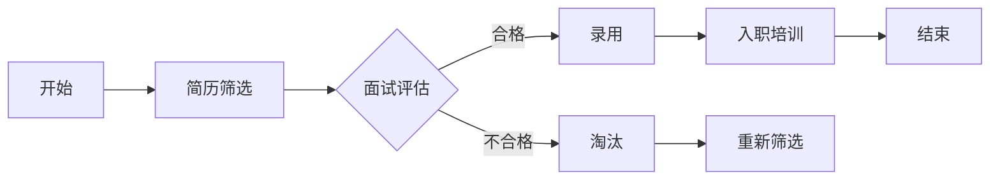

                 

### 《创新招聘策略：吸引顶尖人才》

> 关键词：招聘策略、顶尖人才、创新方法、人才筛选、人才吸引、招聘流程

> 摘要：本文将探讨如何通过创新招聘策略吸引顶尖人才，分析招聘市场的现状与挑战，介绍核心概念和联系，并通过算法原理讲解、系统分析与架构设计、项目实战和最佳实践，提供具体方法和实用技巧。

## 1. 背景介绍

### 1.1 招聘市场的挑战与需求

在现代科技高速发展的背景下，招聘市场面临着前所未有的挑战。随着人工智能、大数据、区块链等新兴技术的广泛应用，企业对顶尖人才的需求日益增长。然而，传统的招聘方法往往难以满足这一需求，导致招聘效率低下、人才流失等问题。

#### 1.1.1 招聘市场的现状

当前招聘市场呈现出以下特点：

- **供需不平衡**：高端人才供不应求，尤其是具备特定技能和经验的人才。
- **竞争激烈**：各大企业纷纷加大招聘力度，争夺有限的高端人才。
- **招聘周期长**：由于人才稀缺，招聘流程变得复杂且耗时。

#### 1.1.2 顶尖人才的特征

顶尖人才通常具备以下特征：

- **专业能力突出**：拥有深厚的专业知识和技能，能够快速适应新技术。
- **创新能力**：具备创新思维，能够在复杂环境中提出解决方案。
- **团队合作**：具有良好的沟通能力和团队合作精神。

#### 1.1.3 创新招聘策略的重要性

为了应对招聘市场的挑战，企业需要采取创新招聘策略。创新招聘策略不仅能够提高招聘效率，还能吸引更多顶尖人才。具体来说，创新招聘策略的重要性体现在以下几个方面：

- **提升招聘效果**：通过创新方法，能够更精准地筛选和识别顶尖人才。
- **降低招聘成本**：优化招聘流程，减少不必要的时间和资源浪费。
- **增强企业竞争力**：吸引顶尖人才，提升企业的创新能力和市场竞争力。

## 2. 核心概念

### 2.1 顶尖人才

顶尖人才是指在企业中具备卓越能力和突出贡献的员工。他们通常具备以下特征：

- **专业能力**：拥有扎实的专业知识和技能，能够应对复杂问题。
- **创新能力**：具备创新思维，能够提出独特的解决方案。
- **领导力**：具备领导能力，能够带领团队实现目标。
- **学习能力**：具备快速学习新知识和技能的能力。

### 2.2 招聘策略

招聘策略是指企业在招聘过程中采取的方法和措施。有效的招聘策略能够帮助企业吸引和留住顶尖人才。常见的招聘策略包括：

- **品牌建设**：通过企业品牌塑造，提升在行业内的知名度和吸引力。
- **人才储备**：提前识别和储备潜在的高端人才，确保在需要时能够快速招聘。
- **精准招聘**：利用大数据和人工智能技术，精准筛选和匹配候选人。
- **面试技巧**：通过科学的面试方法和技巧，评估候选人的能力和潜力。

### 2.3 创新方法

创新方法是指企业在招聘过程中采用的新方法和新思维。创新方法能够帮助企业打破传统招聘模式的束缚，实现招聘的突破和革新。常见的创新方法包括：

- **在线招聘**：利用互联网平台，拓宽招聘渠道，提高招聘效率。
- **多元化面试**：采用多种面试形式，如在线编程测试、小组讨论等，全面评估候选人。
- **人才引进计划**：通过引进外部人才，激发企业内部创新活力。
- **校企合作**：与高校和研究机构合作，共同培养和挖掘顶尖人才。

## 3. 核心概念联系

### 3.1 顶尖人才与招聘策略的联系

顶尖人才是企业发展的关键资源，而招聘策略则是吸引和留住顶尖人才的关键。两者的联系主要体现在以下几个方面：

- **人才匹配**：招聘策略需要根据企业的需求和特点，精准匹配适合的顶尖人才。
- **人才发展**：招聘策略不仅要关注人才的引进，还要关注人才的培养和发展，确保人才能够长期为企业创造价值。
- **企业文化**：招聘策略需要与企业文化相契合，吸引那些认同企业价值观和使命的顶尖人才。

### 3.2 招聘策略与组织目标

招聘策略需要与企业的组织目标保持一致，以确保人才引进与企业发展方向相匹配。具体来说，招聘策略需要考虑以下几个方面：

- **战略目标**：招聘策略要与企业长期战略目标相结合，确保人才引进能够支持企业的长远发展。
- **业务需求**：招聘策略要针对不同业务部门的实际需求，引进具备相应能力和经验的人才。
- **人才培养**：招聘策略要注重人才的培养和成长，为人才提供发展空间和机会。

## 4. 算法原理讲解

### 4.1 招聘算法基础

招聘算法是指用于优化招聘过程的一系列算法。以下是一个简单的招聘算法流程图：



### 4.2 数学模型

招聘问题可以抽象为一个优化问题。以下是一个简单的招聘数学模型：

$$
\begin{align*}
\text{最大化} \quad & \text{录用的人才价值总和} \\
\text{约束条件} \quad & \text{招聘预算} \\
& \text{面试时间限制} \\
& \text{人才匹配度要求}
\end{align*}
$$

## 5. 系统分析与架构设计

### 5.1 招聘系统设计

#### 5.1.1 问题场景介绍

假设企业需要招聘一批技术人才，包括前端开发、后端开发和数据分析等岗位。招聘系统需要实现以下功能：

- **简历管理**：简历上传、简历筛选、简历存储。
- **面试安排**：面试时间安排、面试邀请、面试反馈。
- **人才评估**：面试评估、技能测试、人才匹配度评估。
- **招聘报告**：招聘进展报告、人才评估报告。

#### 5.1.2 系统功能设计

招聘系统的功能设计如下：

- **简历管理模块**：实现简历的在线上传、筛选和存储。
- **面试安排模块**：实现面试时间的安排、面试邀请和反馈。
- **人才评估模块**：实现面试评估、技能测试和人才匹配度评估。
- **招聘报告模块**：实现招聘进展报告和人才评估报告的生成。

### 5.2 系统架构设计

招聘系统的架构设计如下：


### 5.3 系统交互

招聘系统的交互流程如下：

1. **简历上传**：候选人上传简历。
2. **简历筛选**：系统根据招聘要求对简历进行筛选。
3. **面试安排**：系统根据筛选结果安排面试时间。
4. **面试评估**：面试官对候选人进行面试评估。
5. **人才评估**：系统根据面试评估结果进行人才评估。
6. **招聘报告**：系统生成招聘报告。

## 6. 项目实战

### 6.1 项目背景

某互联网公司计划招聘一批技术人才，包括前端开发、后端开发和数据分析等岗位。公司希望通过创新招聘策略，吸引更多顶尖人才。

### 6.2 环境安装

项目使用的技术栈包括：

- **前端**：React
- **后端**：Spring Boot
- **数据库**：MySQL
- **工具**：Git、Jenkins

### 6.3 核心实现

项目的核心实现包括：

- **简历管理模块**：实现简历的在线上传、筛选和存储。
- **面试安排模块**：实现面试时间的安排、面试邀请和反馈。
- **人才评估模块**：实现面试评估、技能测试和人才匹配度评估。
- **招聘报告模块**：实现招聘进展报告和人才评估报告的生成。

### 6.4 代码解读

以下是简历管理模块的核心代码：

```java
public class ResumeManager {
    private List<Resume> resumes;

    public ResumeManager() {
        this.resumes = new ArrayList<>();
    }

    public void uploadResume(Resume resume) {
        resumes.add(resume);
    }

    public List<Resume> filterResumes(String keyword) {
        List<Resume> filteredResumes = new ArrayList<>();
        for (Resume resume : resumes) {
            if (resume.getTitle().contains(keyword)) {
                filteredResumes.add(resume);
            }
        }
        return filteredResumes;
    }
}
```

### 6.5 案例分析

在项目实施过程中，公司通过在线招聘平台发布了多个岗位的招聘信息。通过简历筛选和面试安排，公司成功招聘了一批技术人才。以下是项目实施过程中的几个关键步骤：

1. **发布招聘信息**：公司通过在线招聘平台发布招聘信息，包括岗位描述、招聘要求等。
2. **简历筛选**：公司利用招聘系统对上传的简历进行筛选，筛选出符合条件的候选人。
3. **面试安排**：公司根据筛选结果，安排面试时间和面试官。
4. **面试评估**：面试官对候选人进行面试评估，评估内容包括技术能力、沟通能力、团队合作等。
5. **人才评估**：招聘系统根据面试评估结果，对候选人进行人才评估，确定最终录用名单。
6. **招聘报告**：招聘系统生成招聘报告，包括招聘进展、人才评估结果等。

### 6.6 小结

通过创新招聘策略，公司成功吸引了大量顶尖人才，提高了招聘效率和质量。以下是项目实施过程中的经验与反思：

- **在线招聘平台**：选择合适的在线招聘平台，提高招聘信息曝光度。
- **简历筛选**：优化简历筛选算法，提高筛选准确度。
- **面试安排**：合理安排面试时间和面试官，提高面试效率。
- **人才评估**：利用招聘系统进行人才评估，确保评估的客观性和准确性。
- **招聘报告**：定期生成招聘报告，分析招聘效果，持续优化招聘策略。

## 7. 最佳实践

### 7.1 招聘技巧

- **精准定位**：明确招聘需求，精准定位目标候选人。
- **优化简历筛选**：优化简历筛选算法，提高筛选准确度。
- **多元化面试**：采用多元化面试形式，全面评估候选人。
- **人才发展**：关注人才发展，提供培训和晋升机会。

### 7.2 策略优化

- **数据分析**：利用数据分析，优化招聘策略。
- **行业合作**：与行业合作伙伴建立合作关系，拓宽招聘渠道。
- **雇主品牌建设**：加强雇主品牌建设，提升企业吸引力。

### 7.3 小结

创新招聘策略是吸引顶尖人才的关键。通过精准定位、优化简历筛选、多元化面试和人才发展等实践，企业可以不断提高招聘效率和质量，为企业的长远发展奠定基础。

## 小结

创新招聘策略在吸引顶尖人才方面具有重要意义。通过精准定位、优化简历筛选、多元化面试和人才发展等实践，企业可以不断提高招聘效率和质量，为企业的长远发展奠定基础。未来，随着人工智能和大数据技术的发展，招聘策略将更加智能化和个性化，为企业吸引更多顶尖人才提供有力支持。

