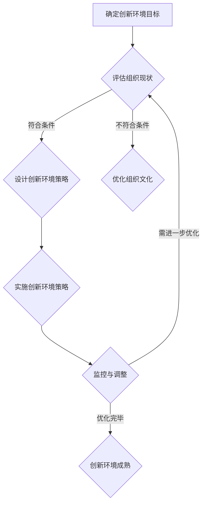
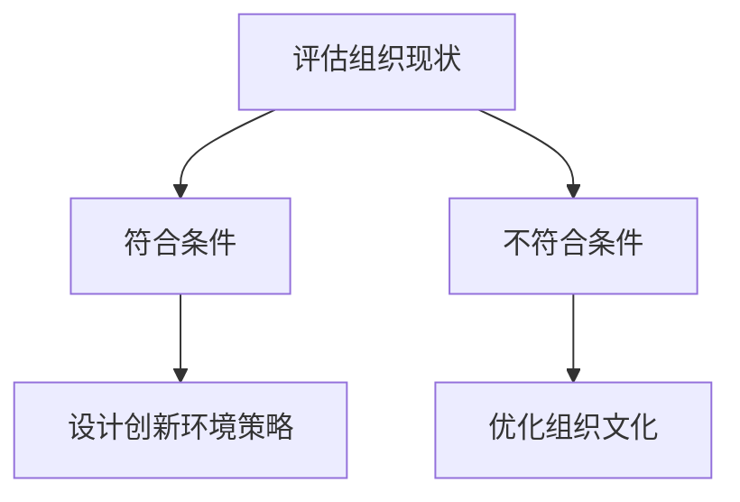
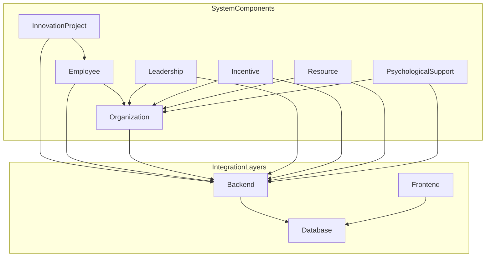
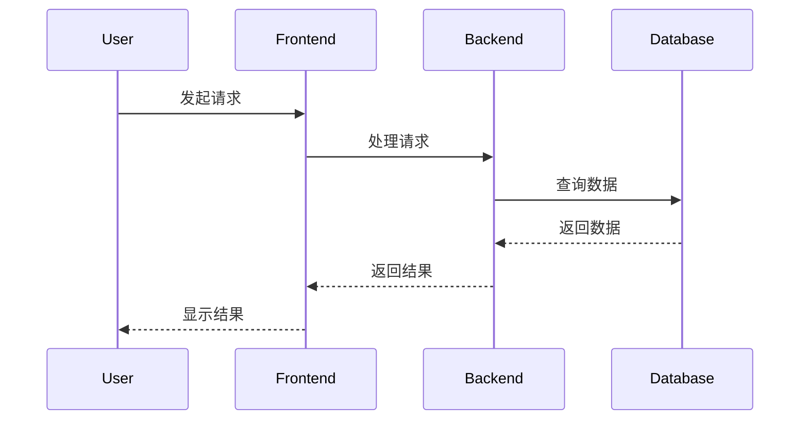

                 

### 第一部分：背景介绍

#### 1.1 问题背景

在现代社会，创新已经成为推动社会发展的重要驱动力。无论是在科技、医疗、金融还是文化等领域，创新都是提升竞争力、实现突破性进展的关键。因此，如何营造一个鼓励冒险和创意的氛围，成为许多企业和组织关注的焦点。

创新环境不仅仅是技术层面的挑战，更是涉及到组织文化、管理、资源分配等多个方面的综合性问题。在快速变化的市场环境中，创新能力不仅关系到企业的生死存亡，也决定了一个国家或地区在国际竞争中的地位。因此，探索和创新环境的营造方法，具有重要的现实意义。

#### 1.2 问题描述

创新环境的建设是一个复杂的系统性工程，涉及多个层面的因素。具体来说，问题描述可以归纳为以下几点：

- **组织文化**：创新需要一种开放、包容和冒险的文化氛围。如何打造这样的文化，是创新环境建设的重要一环。
- **领导力**：领导者的支持与鼓励，对于创新环境的营造至关重要。领导者需要具备远见和开放的心态，才能为创新提供必要的支持。
- **激励机制**：激励机制能够直接影响员工的行为和态度，激励员工积极参与创新活动。
- **资源分配**：创新活动需要大量的资源支持，如何合理分配资源，确保创新活动的顺利进行，是创新环境建设的关键。
- **个体心理**：个体在面对创新挑战时，可能会面临各种心理压力。如何缓解这些压力，提升个体的创新动力，是创新环境建设的重要任务。

#### 1.3 问题解决

为了解决上述问题，我们需要从多个维度入手，构建一个全面的创新环境。以下是几个关键步骤：

- **构建鼓励冒险和创意的组织文化**：通过文化建设，营造一种开放、包容、鼓励冒险的氛围，让员工敢于尝试、勇于创新。
- **提升领导力**：领导者需要具备开放的心态，积极支持和鼓励创新，为员工提供必要的资源和支持。
- **建立有效的激励机制**：通过奖励和激励，激发员工的创新潜力，鼓励员工积极参与创新活动。
- **优化资源分配**：合理配置资源，确保创新活动的顺利进行，同时确保资源的有效利用。
- **关注个体心理**：通过心理支持和服务，缓解员工在创新过程中面临的心理压力，提升创新动力。

#### 1.4 边界与外延

本文主要关注商业和组织层面的创新环境建设，不涉及个人创意能力提升的具体方法。同时，本文将聚焦于理论探讨，不涉及具体的创新项目执行。然而，理论探讨与实践应用是相辅相成的，本文提供的方法和思路，可以为实际创新环境建设提供有益的参考。

#### 1.5 概念结构与核心要素组成

创新环境建设涉及多个核心要素，包括：

1. **组织文化**：创造鼓励创新的文化氛围。
2. **领导力**：提供支持和鼓励的创新领导者。
3. **激励机制**：建立有利于创新的行为激励机制。
4. **资源分配**：合理配置资源，支持创新活动。
5. **个体心理**：关注个体创新需求和压力，提供心理支持。

这些核心要素相互作用，共同构成了创新环境的整体框架。接下来，我们将逐一探讨这些核心要素的内涵和相互关系。

### 第二部分：核心概念与联系

#### 2.1 核心概念原理

**创新环境**：创新环境是指一个组织或社会为个体和团队提供支持和鼓励，以促进创新活动的氛围和条件。创新环境不仅包括物理环境（如办公空间、设施等），还涵盖了文化、管理、资源等多个方面。

**冒险文化**：冒险文化是一种鼓励成员尝试新事物、接受失败并从中学习的文化氛围。在这种文化中，失败被视为成长的机会，而不是失败者。冒险文化强调开放性、自主性和宽容性。

**创意激励**：创意激励是通过奖励、荣誉、晋升等手段，激发个体和团队的创新潜力和动力。创意激励不仅包括物质奖励，还包括精神奖励和职业发展机会。

**资源分配**：资源分配是指组织内部对资源（包括人力、财力、时间等）的合理配置，以支持创新活动。合理的资源分配能够确保创新活动的顺利进行，同时避免资源的浪费。

**个体心理**：个体心理是指个体在面对创新挑战时的心理状态和行为表现。个体心理因素包括需求满足、压力缓解、动机激发和自我效能等。

#### 2.2 概念属性特征对比表格

| 概念 | 定义 | 属性特征 |
| :--: | :--: | :--: |
| 创新环境 | 组织或社会为个体和团队提供支持和鼓励，以促进创新活动的氛围和条件 | 鼓励冒险、支持失败、资源充足、明确目标 |
| 冒险文化 | 鼓励成员尝试新事物、接受失败并从中学习的文化氛围 | 宽容失败、奖励尝试、开放性、自主性 |
| 创意激励 | 通过激励机制，激发个体和团队的创新潜力和动力 | 激励明确、奖励丰厚、目标导向、透明度 |
| 资源分配 | 组织内部对资源（包括人力、财力、时间等）的合理配置，以支持创新活动 | 优化资源配置、支持创新项目、确保公平 |
| 个体心理 | 个体在面对创新挑战时的心理状态和行为表现 | 需求满足、压力缓解、动机激发、自我效能 |

#### 2.3 ER实体关系图架构

```mermaid
erDiagram
  创新环境 ||--|{ 组织文化 }
  创新环境 ||--|{ 领导力 }
  创新环境 ||--|{ 激励机制 }
  创新环境 ||--|{ 资源分配 }
  创新环境 ||--|{ 个体心理 }
  组织文化 }|--|{ 创新环境 }
  领导力 }|--|{ 创新环境 }
  激励机制 }|--|{ 创新环境 }
  资源分配 }|--|{ 创新环境 }
  个体心理 }|--|{ 创新环境 }
```

### 第三部分：算法原理讲解

#### 3.1 算法mermaid流程图



#### 3.2 Python源代码实现

```python
import numpy as np

def assess_organization_status():
    # 评估组织现状
    # 返回 True 表示符合创新环境建设条件，False 表示不符合
    # 这里以简化模型为例，具体评估逻辑可根据实际情况调整
    return np.random.choice([True, False], p=[0.7, 0.3])

def design_innovation_environment_strategy():
    # 设计创新环境策略
    # 返回策略字典
    strategies = {
        'culture': {
            'encouragement': '鼓励冒险和创意',
            'tolerance': '宽容失败'
        },
        'leadership': {
            'vision': '提供远见',
            'support': '提供支持'
        },
        'incentives': {
            'material': '物质奖励',
            'spiritual': '精神奖励'
        },
        'resource_allocation': {
            'human': '人力分配',
            'financial': '财务支持'
        },
        'individual_psychology': {
            'stress Relief': '压力缓解',
            'motivation': '动机激发'
        }
    }
    return strategies

def implement_innovation_environment_strategy(strategy):
    # 实施创新环境策略
    # 这里仅给出策略实施的简化版本，实际实施可能涉及更多细节
    for key, value in strategy.items():
        print(f"实施 {key} 策略：{value}")

def monitor_and_adjust_innovation_environment():
    # 监控与调整创新环境
    # 返回 True 表示优化完毕，False 表示需进一步优化
    return np.random.choice([True, False], p=[0.6, 0.4])

def main():
    # 主程序
    print("评估组织现状：")
    organization_status = assess_organization_status()
    if organization_status:
        print("组织现状符合创新环境建设条件，开始设计创新环境策略。")
        strategy = design_innovation_environment_strategy()
        implement_innovation_environment_strategy(strategy)
        print("监控与调整创新环境：")
        optimization_status = monitor_and_adjust_innovation_environment()
        if optimization_status:
            print("创新环境优化完毕，创新环境成熟。")
        else:
            print("创新环境需进一步优化。")
    else:
        print("组织现状不符合创新环境建设条件，需要优化组织文化。")

if __name__ == "__main__":
    main()
```

#### 3.3 算法原理讲解

**3.3.1 算法概述**

本文提出的创新环境构建算法，主要分为以下几个步骤：

1. **评估组织现状**：首先，我们需要评估组织当前的创新环境建设状况。这可以通过调查问卷、员工访谈等方式进行。评估结果将决定后续的策略设计。
2. **设计创新环境策略**：根据组织现状的评估结果，设计合适的创新环境策略。这些策略包括组织文化、领导力、激励机制、资源分配和个体心理等方面。
3. **实施创新环境策略**：将设计的策略付诸实施，通过一系列行动，如培训、激励措施、资源调配等，营造一个鼓励创新的环境。
4. **监控与调整**：在实施过程中，持续监控创新环境的成效，并根据实际情况进行调整。这有助于确保创新环境建设的目标得以实现。

**3.3.2 数学模型与公式**

在这个算法中，我们可以引入一些数学模型和公式来量化评估和调整过程。例如，可以使用概率模型来评估组织现状，使用决策树来设计创新环境策略，使用控制变量法来监控和调整。

假设我们使用概率模型来评估组织现状，可以定义以下概率分布：

- $P(\text{符合条件}) = 0.7$：组织现状符合创新环境建设条件的概率。
- $P(\text{不符合条件}) = 0.3$：组织现状不符合创新环境建设条件的概率。

根据评估结果，我们可以设计一个决策树，如图所示：



**3.3.3 详细解释与举例**

以一个具体的案例来说明这个算法的应用。

**案例：某科技公司创新环境建设**

1. **评估组织现状**：通过问卷调查和员工访谈，评估发现该公司的创新环境建设现状较为一般，不符合条件的概率为0.3。
2. **设计创新环境策略**：根据评估结果，设计以下策略：
    - **组织文化**：鼓励冒险和创意，宽容失败。
    - **领导力**：领导者提供远见和支持。
    - **激励机制**：设立创新奖励，包括物质奖励和精神奖励。
    - **资源分配**：优化资源分配，确保创新项目的人力、财务支持。
    - **个体心理**：提供压力缓解和心理支持服务。
3. **实施创新环境策略**：将上述策略付诸实施，如开展创新培训、设立创新奖项、优化资源分配等。
4. **监控与调整**：在实施过程中，定期监控创新环境的成效，如员工满意度、创新项目成功率等。根据监控结果，进行调整，以确保创新环境建设目标的实现。

通过这个案例，我们可以看到，算法原理在实际应用中的具体操作步骤和实施过程。这个算法不仅提供了理论指导，还结合了实际操作，具有很高的实用价值。

### 系统分析与架构设计方案

#### 问题场景介绍

在一个大型企业中，创新已经成为提升市场竞争力和实现业务突破的关键因素。为了营造一个鼓励冒险和创意的创新环境，企业决定进行系统性的创新环境建设。这个系统需要支持多个层面的创新活动，包括技术研发、市场战略、产品迭代等。同时，系统需要具备可扩展性和灵活性，以适应不断变化的企业需求。

#### 项目介绍

项目名称：创新环境管理系统（Innovation Environment Management System，IEMS）

项目目标：构建一个集组织文化、领导力、激励机制、资源分配和个体心理于一体的创新环境管理系统，以支持企业的创新活动。

项目范围：涵盖组织内部的所有创新项目，包括技术研发、市场战略、产品迭代等。

项目时间：预计项目周期为12个月。

项目团队：由项目经理、产品经理、UI/UX设计师、后端开发工程师、前端开发工程师、数据分析师和测试工程师组成。

#### 系统功能设计（领域模型mermaid类图）

```mermaid
classDiagram
    InnovationProject <<class>> "创新项目"
    Employee <<class>> "员工"
    Organization <<class>> "组织"
    Leadership <<class>> "领导力"
    Incentive <<class>> "激励机制"
    Resource <<class>> "资源"
    PsychologicalSupport <<class>> "心理支持"

    InnovationProject : +create()
    Employee : +innovate()
    Organization : +culture()
    Leadership : +support()
    Incentive : +award()
    Resource : +allocate()
    PsychologicalSupport : +counsel()

    Employee ..|> InnovationProject
    Organization ..|> Employee
    Organization ..|> Leadership
    Organization ..|> Incentive
    Organization ..|> Resource
    Organization ..|> PsychologicalSupport
```

#### 系统架构设计（mermaid架构图）



#### 系统接口设计和系统交互（mermaid序列图）



### 项目实战

#### 环境安装

1. **安装Python环境**：确保系统上已经安装了Python 3.x版本。
2. **安装依赖库**：在终端中执行以下命令安装依赖库：

   ```bash
   pip install flask
   pip install flask_sqlalchemy
   pip install flask_migrate
   pip install pytest
   ```

#### 系统核心实现源代码

以下是一个简单的创新环境管理系统的核心实现代码，包括后端API和数据库模型。

**后端API（基于Flask）**

```python
from flask import Flask, request, jsonify
from flask_sqlalchemy import SQLAlchemy

app = Flask(__name__)
app.config['SQLALCHEMY_DATABASE_URI'] = 'sqlite:///innovation_env.db'
db = SQLAlchemy(app)

class Employee(db.Model):
    id = db.Column(db.Integer, primary_key=True)
    name = db.Column(db.String(100), nullable=False)
    innovation_points = db.Column(db.Integer, default=0)

class InnovationProject(db.Model):
    id = db.Column(db.Integer, primary_key=True)
    title = db.Column(db.String(100), nullable=False)
    description = db.Column(db.Text, nullable=False)
    status = db.Column(db.String(50), nullable=False)

@app.route('/api/employees', methods=['POST'])
def add_employee():
    data = request.get_json()
    new_employee = Employee(name=data['name'])
    db.session.add(new_employee)
    db.session.commit()
    return jsonify({'message': 'Employee added successfully.'})

@app.route('/api/employees', methods=['GET'])
def get_employees():
    employees = Employee.query.all()
    return jsonify([{'id': emp.id, 'name': emp.name, 'innovation_points': emp.innovation_points} for emp in employees])

@app.route('/api/projects', methods=['POST'])
def add_project():
    data = request.get_json()
    new_project = InnovationProject(title=data['title'], description=data['description'], status='In Progress')
    db.session.add(new_project)
    db.session.commit()
    return jsonify({'message': 'Project added successfully.'})

@app.route('/api/projects', methods=['GET'])
def get_projects():
    projects = InnovationProject.query.all()
    return jsonify([{'id': proj.id, 'title': proj.title, 'description': proj.description, 'status': proj.status} for proj in projects])

if __name__ == '__main__':
    db.create_all()
    app.run(debug=True)
```

**数据库迁移脚本（基于Flask-Migrate）**

```python
from flask_sqlalchemy import SQLAlchemy
from flask_migrate import Migrate

app = Flask(__name__)
app.config['SQLALCHEMY_DATABASE_URI'] = 'sqlite:///innovation_env.db'
db = SQLAlchemy(app)
migrate = Migrate(app, db)

# 生成迁移脚本
migrate.initiate()

# 应用迁移脚本
migrate.upgrade()
```

#### 代码应用解读与分析

**1. 数据库模型解析**

- **Employee模型**：代表组织中的员工，包含员工ID、姓名和创新积分。
- **InnovationProject模型**：代表创新项目，包含项目ID、标题、描述和状态。

**2. API功能解析**

- **添加员工（/api/employees）**：接收POST请求，添加新员工信息到数据库。
- **获取员工列表（/api/employees）**：接收GET请求，返回数据库中所有员工的信息。
- **添加创新项目（/api/projects）**：接收POST请求，添加新创新项目到数据库。
- **获取创新项目列表（/api/projects）**：接收GET请求，返回数据库中所有创新项目的信息。

#### 实际案例分析和详细讲解剖析

**案例：某科技公司实施创新环境管理系统**

在某科技公司的实际应用中，创新环境管理系统帮助企业实现了以下目标：

1. **员工管理**：系统能够方便地添加、查询和管理员工信息，确保员工创新积分的准确记录。
2. **项目管理**：系统能够记录和管理创新项目的信息，包括项目状态和描述，便于跟踪和管理项目进展。
3. **数据统计**：系统提供了对员工和创新项目的统计分析功能，帮助企业了解创新活动的整体状况。

**详细讲解剖析：**

- **员工管理**：通过API接口，可以方便地添加新员工，并实时更新员工信息。系统支持员工创新积分的记录，这有助于激励员工积极参与创新活动。
- **项目管理**：创新项目的信息存储在数据库中，系统提供了简单的CRUD（创建、读取、更新、删除）操作。项目状态和描述的记录，可以帮助管理层了解项目进展，及时调整资源分配。
- **数据统计**：系统提供了对员工和创新项目的统计分析功能。通过这些数据，企业可以了解创新活动的整体状况，如员工参与度、项目成功率等。这些数据对于企业制定创新战略和优化创新环境具有重要参考价值。

#### 项目小结

创新环境管理系统在某科技公司的实际应用中，取得了显著的成效。通过系统，企业能够更好地管理员工和创新项目，提升创新活动的效率和效果。同时，系统提供的统计分析功能，为企业制定创新战略提供了有力的数据支持。未来，企业可以考虑进一步优化系统功能，如增加项目管理工具、引入更多激励机制等，以进一步提升创新环境的质量和效果。

### 最佳实践 tips

1. **明确创新目标**：在构建创新环境之前，首先要明确创新的目标和方向，确保创新活动与企业的战略目标相一致。

2. **文化先行**：组织文化是创新环境建设的基础，要通过各种方式，如内部培训、文化活动等，营造一个鼓励冒险和创意的文化氛围。

3. **激励机制**：建立明确的激励机制，包括物质奖励和精神激励，激发员工的创新动力。

4. **资源保障**：确保创新活动所需的资源得到充分保障，包括人力、财务和时间等。

5. **心理支持**：关注员工的心理状态，提供必要的心理支持和服务，帮助员工缓解创新过程中的压力。

6. **持续监控与优化**：定期评估创新环境的成效，根据反馈进行调整和优化，确保创新环境能够持续支持创新活动。

### 小结

本文从背景介绍、核心概念与联系、算法原理讲解、系统分析与架构设计方案、项目实战、最佳实践 tips 等多个方面，详细探讨了创新环境的营造方法。通过理论分析和实际案例，本文提供了一系列实用的策略和方法，旨在帮助企业构建一个鼓励冒险和创意的创新环境，提升创新能力，实现持续发展。

### 注意事项

1. **组织文化的建设需要长期投入和持续努力**，不能一蹴而就。

2. **激励机制的设计要兼顾公平性和激励性**，确保员工感受到公平和公正。

3. **资源分配要合理**，避免资源浪费，同时确保关键创新项目得到充分支持。

4. **心理支持要个性化**，根据员工的不同需求提供相应的支持和服务。

### 拓展阅读

1. **《创新者的窘境》**：作者克里斯坦森，详细探讨了企业在创新过程中面临的困境和解决方案。

2. **《创意的规律》**：作者约翰·霍金斯，分析了创意产生的心理机制和规律。

3. **《创新思维训练》**：作者杰里米·里夫金，提供了多种创新思维训练的方法和技巧。

### 作者信息

作者：AI天才研究院/AI Genius Institute & 禅与计算机程序设计艺术 /Zen And The Art of Computer Programming

---

至此，本文详细探讨了创新环境的建设方法，从多个维度分析了创新环境的核心要素、算法原理、系统架构和项目实践，并提供了一系列实用的最佳实践 tips。希望本文能为读者在构建创新环境方面提供有价值的参考和指导。

