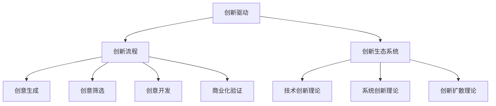
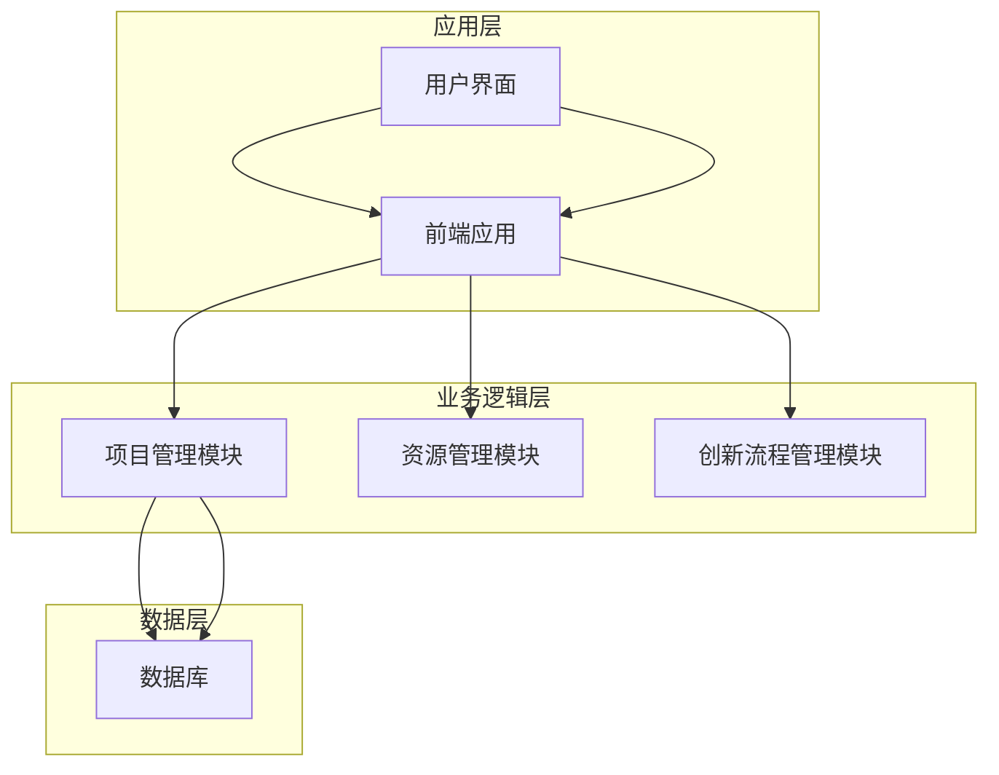

                 


## 创新管理体系：从想法到实施的全流程

### 关键词：
创新管理、全流程、实施策略、创新文化、创新评估

### 摘要：
本文将深入探讨创新管理体系从想法到实施的全流程，通过系统化的分析和案例研究，揭示如何有效地激发创新潜力，构建并优化创新管理机制。文章分为四个部分，首先介绍创新管理的定义与重要性，其次阐述创新管理体系构建的要素，然后展示创新管理体系实施的关键步骤，最后探讨如何优化和持续改进创新管理体系。

----------------------------------------------------------------

## 第一部分：创新管理体系概述

### 1.1 创新管理的定义与重要性

#### 1.1.1 创新的定义
创新是指通过引入新的想法、方法、技术或流程，创造出新颖的产品、服务或业务模式，从而实现价值的创造和增长。创新不仅仅局限于技术层面，还包括商业模式、组织文化和管理方法等各个方面。

#### 1.1.2 创新管理的内涵
创新管理是指企业或组织通过系统化、规范化的方法和流程，激发创新潜力，管理创新过程，将创新理念转化为实际成果的过程。创新管理包括创新战略的制定、创新资源的配置、创新流程的优化和创新文化的培育等方面。

#### 1.1.3 创新管理的重要性
创新管理对于企业或组织的持续发展具有重要意义。首先，创新能够推动企业的增长和竞争力的提升。其次，创新能够帮助企业适应市场变化和客户需求，保持竞争优势。最后，创新管理能够激发员工的创造力和积极性，提高组织的整体创新能力。

### 1.2 创新管理的核心概念

#### 1.2.1 创新驱动
创新驱动是指企业或组织通过创新活动推动业务发展和市场拓展的策略。创新驱动要求企业具备强烈的创新意识，持续探索新的技术和应用领域，以实现业务模式的创新和竞争力的提升。

#### 1.2.2 创新流程
创新流程是指企业或组织从创意生成到商业化应用的全过程。创新流程包括创意收集、创意筛选、创意开发、商业化验证和市场推广等环节。通过规范的创新流程，企业能够提高创新效率，缩短产品上市时间。

#### 1.2.3 创新生态系统
创新生态系统是指企业或组织内部和外部的创新资源、创新主体和创新环境之间的相互作用和协同关系。创新生态系统有助于整合内部外部资源，激发创新活力，提升创新效果。

### 1.3 创新管理的理论基础

#### 1.3.1 技术创新理论
技术创新理论主要关注技术变革和创新对企业绩效的影响。该理论认为，技术进步是推动企业创新和竞争力提升的关键因素。

#### 1.3.2 系统创新理论
系统创新理论强调创新是一个系统性的过程，涉及多个方面的协同和整合。该理论认为，创新不仅仅是技术的变革，还包括组织结构、管理方法和商业模式等方面的创新。

#### 1.3.3 创新扩散理论
创新扩散理论主要研究创新在市场中的传播和接受过程。该理论认为，创新扩散的速度和效果受到多种因素的影响，包括技术创新、市场推广、用户接受度等。

### 1.4 创新管理的历史发展

#### 1.4.1 传统创新管理阶段
传统创新管理阶段主要关注技术创新，强调技术研究和开发。这一阶段的创新活动往往缺乏系统性和规范性。

#### 1.4.2 现代创新管理阶段
现代创新管理阶段强调创新流程的规范化和管理方法的科学化。这一阶段的创新管理更加注重创新资源的配置和创新效果的评估。

#### 1.4.3 创新管理的未来趋势
创新管理的未来趋势包括：1) 更加注重跨部门和跨领域的协同创新；2) 更加注重用户体验和创新需求的结合；3) 更加注重数字化和智能化的创新手段。

### 1.5 本章小结
本部分介绍了创新管理的定义与重要性，阐述了创新管理的核心概念和理论基础，回顾了创新管理的历史发展。这些内容为后续章节的创新管理体系构建和实施提供了理论基础和指导思路。

----------------------------------------------------------------

## 第二部分：创新管理体系构建

### 2.1 创新战略规划

#### 2.1.1 创新战略的制定
创新战略的制定是企业或组织创新管理的首要步骤。创新战略的制定需要明确创新目标、创新方向和创新重点，同时考虑企业的核心竞争力和市场机会。

#### 2.1.2 创新战略的执行
创新战略的执行是将创新战略转化为实际行动的过程。执行创新战略需要建立有效的创新组织，配置创新资源，制定创新计划，并确保创新计划的有效实施。

#### 2.1.3 创新战略的评估与调整
创新战略的评估与调整是确保创新战略持续有效的重要环节。评估创新战略需要从创新效果、创新效率和创新效益等多个维度进行，并根据评估结果对创新战略进行调整和优化。

### 2.2 创新组织与文化

#### 2.2.1 创新组织的构建
创新组织的构建是创新管理的关键环节。构建创新组织需要明确创新组织的使命和目标，设计合理的组织架构，选拔合适的创新人才，并建立创新团队的协作机制。

#### 2.2.2 创新文化的培育
创新文化的培育是激发创新活力的重要保障。创新文化强调开放、包容、鼓励试错和持续学习的价值观，旨在营造一个有利于创新的思想氛围。

#### 2.2.3 创新团队的协作
创新团队的协作是创新成功的关键因素。创新团队的协作需要建立有效的沟通渠道，明确团队成员的角色和职责，并运用合适的协作工具和方法。

### 2.3 创新资源管理

#### 2.3.1 创新资源的获取
创新资源的获取是创新管理的重要任务。创新资源的获取包括内部资源的外部化利用和外部资源的内部化整合。

#### 2.3.2 创新资源的使用
创新资源的使用是创新管理的关键环节。创新资源的使用需要合理配置，确保创新资源的最大化利用。

#### 2.3.3 创新资源的优化
创新资源的优化是创新管理的重要目标。创新资源的优化包括创新资源的分类、评估和整合，以提高创新资源的利用效率。

### 2.4 创新流程设计

#### 2.4.1 创意生成
创意生成是创新流程的起点。创意生成需要激发创新思维，收集和筛选创意，并进行创意评估和筛选。

#### 2.4.2 创意筛选
创意筛选是创新流程的重要环节。创意筛选需要根据创新目标和市场需求，对创意进行评估和筛选，确保创意的可行性和商业价值。

#### 2.4.3 创意开发
创意开发是创新流程的核心。创意开发包括创意原型设计、创意测试和创意验证，以验证创意的可行性和商业潜力。

### 2.5 创新风险管理与控制

#### 2.5.1 创新风险的识别
创新风险的识别是创新风险管理的重要任务。创新风险的识别需要从技术、市场、组织和环境等多个维度进行，确保识别到各种潜在的风险。

#### 2.5.2 创新风险的评估
创新风险的评估是创新风险管理的关键环节。创新风险的评估需要建立风险评估模型，对风险的概率和影响进行定量分析，以确定风险等级。

#### 2.5.3 创新风险的控制
创新风险的控制是创新风险管理的重要目标。创新风险的控制包括风险预防、风险转移和风险接受等策略，以降低风险对创新活动的负面影响。

### 2.6 创新激励机制

#### 2.6.1 创新激励的原则
创新激励的原则是设计有效创新激励机制的基础。创新激励的原则包括公平性、激励性、竞争性和持续性等。

#### 2.6.2 创新激励的措施
创新激励的措施是实施创新激励机制的具体手段。创新激励的措施包括薪酬激励、荣誉激励、晋升激励和股权激励等。

#### 2.6.3 创新激励的效果评估
创新激励的效果评估是确保创新激励机制有效性的关键。创新激励的效果评估需要从创新绩效、员工满意度和组织发展等多个维度进行。

### 2.7 本章小结
本部分介绍了创新管理体系构建的关键要素，包括创新战略规划、创新组织与文化、创新资源管理、创新流程设计、创新风险管理与控制和创新激励机制。这些要素为创新管理的有效实施提供了指导和支持。

----------------------------------------------------------------

## 第三部分：创新管理体系实施

### 3.1 创新项目管理与实施

#### 3.1.1 创新项目的启动
创新项目的启动是创新管理体系实施的重要环节。创新项目的启动需要明确项目目标、项目范围和项目团队，制定项目计划，并确保项目的顺利启动。

#### 3.1.2 创新项目的规划
创新项目的规划是创新项目实施的基础。创新项目的规划包括项目目标规划、项目范围规划、项目资源规划和项目进度规划，以确保项目的顺利实施。

#### 3.1.3 创新项目的执行与监控
创新项目的执行与监控是创新项目成功的关键。创新项目的执行与监控需要建立有效的沟通机制、项目进度监控体系和项目风险管理机制，以确保项目的顺利实施和目标达成。

### 3.2 创新团队建设与运作

#### 3.2.1 创新团队的组建
创新团队的组建是创新团队建设的关键环节。创新团队的组建需要明确团队成员的角色和职责，选拔合适的团队成员，并建立有效的沟通机制。

#### 3.2.2 创新团队的协作机制
创新团队的协作机制是创新团队高效运作的基础。创新团队的协作机制包括明确团队成员的沟通渠道、协作工具和协作流程，以提高团队的协作效率和创新能力。

#### 3.2.3 创新团队的绩效评估
创新团队的绩效评估是创新团队建设的重要环节。创新团队的绩效评估需要从创新成果、团队合作和创新效率等多个维度进行，以确保团队的高效运作和创新能力的提升。

### 3.3 创新资源整合与利用

#### 3.3.1 内部资源整合
内部资源整合是创新资源管理的重要任务。内部资源整合包括整合企业内部的研发资源、人力资源和信息资源，以提高创新资源的利用效率。

#### 3.3.2 外部资源整合
外部资源整合是创新资源管理的重要策略。外部资源整合包括与外部科研机构、高等院校和行业合作伙伴的合作，共享创新资源和成果，以提高创新能力和竞争力。

#### 3.3.3 跨部门资源整合
跨部门资源整合是创新资源管理的重要任务。跨部门资源整合包括跨部门的信息共享、资源共享和协同创新，以提高创新效率和创新能力。

### 3.4 创新过程中的问题与解决

#### 3.4.1 创新障碍分析
创新障碍分析是解决创新过程中问题的关键。创新障碍分析需要从技术、市场、组织和环境等多个维度进行，识别和分析各种潜在的创新障碍。

#### 3.4.2 创新问题的解决策略
创新问题的解决策略是解决创新障碍的有效手段。创新问题的解决策略包括技术改进、市场调整、组织变革和环境优化等策略，以提高创新效率和创新能力。

#### 3.4.3 创新过程中的沟通与协作
创新过程中的沟通与协作是创新成功的关键。创新过程中的沟通与协作需要建立有效的沟通渠道、协作工具和协作流程，以提高团队的协作效率和创新能力。

### 3.5 创新效果的评估与反馈

#### 3.5.1 创新效果评估的方法
创新效果评估的方法是衡量创新效果的重要手段。创新效果评估的方法包括创新绩效评估、用户反馈评估和市场评估等，以全面评估创新效果。

#### 3.5.2 创新效果的反馈机制
创新效果的反馈机制是创新效果评估的重要环节。创新效果的反馈机制包括建立创新效果反馈渠道、反馈机制和反馈处理流程，以确保创新效果的及时反馈和改进。

#### 3.5.3 创新效果的持续改进
创新效果的持续改进是创新管理体系优化的重要目标。创新效果的持续改进需要建立持续改进的流程和方法，不断优化创新效果，以提高创新能力和竞争力。

### 3.6 本章小结
本部分介绍了创新管理体系实施的关键步骤，包括创新项目管理与实施、创新团队建设与运作、创新资源整合与利用、创新过程中的问题与解决以及创新效果的评估与反馈。这些步骤为创新管理体系的有效实施提供了具体的指导和支持。

----------------------------------------------------------------

## 第四部分：创新管理体系优化与持续改进

### 4.1 创新管理体系评估

#### 4.1.1 创新管理体系的评估标准
创新管理体系的评估标准是衡量创新管理体系有效性的重要依据。评估标准包括创新效果、创新效率、创新效益和创新文化等方面，以全面评估创新管理体系的表现。

#### 4.1.2 创新管理体系的评估方法
创新管理体系的评估方法包括定性和定量评估方法。定性评估方法包括访谈、观察和案例研究等，定量评估方法包括数据分析和绩效指标计算等，以准确评估创新管理体系的效果。

#### 4.1.3 创新管理体系的评估结果分析
创新管理体系的评估结果分析是优化创新管理体系的重要依据。评估结果分析需要从评估指标、评估结果和问题诊断等多个维度进行，以发现创新管理体系的不足和改进方向。

### 4.2 创新管理体系优化

#### 4.2.1 优化创新管理体系的策略
优化创新管理体系的策略是提高创新管理体系有效性的关键。优化策略包括创新流程优化、创新资源配置优化和创新激励机制优化等，以提高创新效率和创新效果。

#### 4.2.2 优化创新管理体系的具体措施
优化创新管理体系的具体措施是实施创新管理体系优化的重要手段。具体措施包括改进创新流程、优化创新资源配置、完善创新激励机制和加强创新文化建设等。

#### 4.2.3 优化创新管理体系的效果评估
优化创新管理体系的效果评估是确保优化措施有效性的关键。效果评估需要从创新效果、创新效率和创新效益等多个维度进行，以评估优化措施的效果和改进方向。

### 4.3 创新管理体系持续改进

#### 4.3.1 持续改进的重要性
持续改进是创新管理体系优化的重要手段。持续改进能够帮助企业不断提高创新能力和竞争力，以适应市场变化和客户需求。

#### 4.3.2 持续改进的流程与方法
持续改进的流程与方法包括持续改进的目标设定、持续改进的措施实施和持续改进的效果评估等。通过科学的管理流程和方法，确保持续改进的顺利进行。

#### 4.3.3 持续改进的实践案例
持续改进的实践案例是验证持续改进效果的重要途径。实践案例包括成功的企业案例和失败的企业案例，通过分析实践案例，总结持续改进的经验和教训。

### 4.4 本章小结
本部分介绍了创新管理体系优化与持续改进的方法和策略，包括评估标准、评估方法、优化策略、优化措施和实践案例等。这些方法和策略为创新管理体系的持续改进提供了具体的指导和支持。

----------------------------------------------------------------

* 作者：AI天才研究院/AI Genius Institute & 禅与计算机程序设计艺术 /Zen And The Art of Computer Programming*

在当今快速变化的市场环境中，创新管理体系的有效实施和持续改进对于企业或组织的成功至关重要。本文通过系统化的分析和案例研究，揭示了创新管理体系从想法到实施的全流程，提供了构建和优化创新管理体系的方法和策略。希望本文能够为读者在创新管理实践中的应用提供有益的参考和启示。

---

本文章为《创新管理体系：从想法到实施的全流程》的目录大纲，旨在提供一个详细的框架，以便进一步填充和细化内容。文章的整体结构和内容设计旨在帮助读者深入理解创新管理的核心概念、构建方法、实施步骤和持续改进策略。每个部分都将通过详细的讲解、案例研究和实践指导，为读者提供实用的知识和管理经验。

在接下来的写作过程中，我们将逐一填充每个部分的内容，确保文章的逻辑清晰、结构紧凑、内容丰富，并配有相应的图表和代码示例，以便读者更好地理解和应用。同时，我们也将注重文章的可读性和实用性，确保读者能够在短时间内掌握关键知识点，并在实际工作中加以运用。

### 第一部分：创新管理体系概述

在现代社会中，创新已经成为推动企业持续发展和竞争力提升的关键因素。创新管理体系作为企业管理的重要组成部分，其核心在于将创新的思维和方法制度化、系统化，从而在组织内部形成一种持续创新的文化和机制。本文的第一部分将重点介绍创新管理的定义、重要性以及核心概念，并回顾创新管理的历史发展，为后续章节的深入探讨奠定理论基础。

#### 1.1 创新管理的定义与重要性

**1.1.1 创新的定义**

创新是指通过引入新的想法、方法、技术或流程，创造出新颖的产品、服务或业务模式，从而实现价值的创造和增长。创新不仅仅局限于技术层面，还包括商业模式、组织文化和管理方法等各个方面。根据美国创新学家约瑟夫·熊彼特（Joseph Schumpeter）的定义，创新是指将新的生产要素和生产条件的新组合引入到生产体系中去，以获得潜在的利润。

在技术层面，创新可以表现为新技术、新产品、新工艺、新设备等。在商业层面，创新可以表现为新的商业模式、新的市场策略、新的供应链管理等。在组织文化层面，创新可以表现为新的管理理念、新的激励机制、新的团队合作方式等。

**1.1.2 创新管理的内涵**

创新管理是指企业或组织通过系统化、规范化的方法和流程，激发创新潜力，管理创新过程，将创新理念转化为实际成果的过程。创新管理包括创新战略的制定、创新资源的配置、创新流程的优化和创新文化的培育等方面。

1. **创新战略的制定**：创新战略的制定是创新管理的首要任务，它明确了企业的创新目标、创新方向和创新重点，同时考虑企业的核心竞争力和市场机会。创新战略的制定需要结合企业的实际情况和外部环境，确保创新战略的可行性和有效性。

2. **创新资源的配置**：创新资源的配置是创新管理的重要环节，它包括人力、财务、技术等资源的有效分配和利用，以支持创新活动的开展。创新资源的配置需要根据创新项目的特点和需求，进行合理的分配和调度，确保资源的最大化利用。

3. **创新流程的优化**：创新流程的优化是提高创新效率和质量的关键。创新流程的优化包括创意生成、创意筛选、创意开发、商业化验证和市场推广等环节。通过优化创新流程，企业能够提高创新效率，缩短产品上市时间，降低创新风险。

4. **创新文化的培育**：创新文化的培育是激发创新活力的重要保障。创新文化强调开放、包容、鼓励试错和持续学习的价值观，旨在营造一个有利于创新的思想氛围。创新文化的培育需要从领导层的重视、员工激励、团队协作等多个方面进行，以形成一种可持续的创新文化。

**1.1.3 创新管理的重要性**

创新管理对于企业或组织的持续发展具有重要意义。首先，创新能够推动企业的增长和竞争力的提升。通过创新，企业能够开发出新颖的产品和服务，满足不断变化的市场需求，从而实现业务的持续增长。其次，创新能够帮助企业适应市场变化和客户需求，保持竞争优势。在竞争激烈的市场环境中，只有不断创新，企业才能在竞争中脱颖而出。最后，创新管理能够激发员工的创造力和积极性，提高组织的整体创新能力。通过创新管理，企业能够为员工提供广阔的发展空间，激发他们的创新潜力，形成一支富有创新精神的人才队伍。

#### 1.2 创新管理的核心概念

**1.2.1 创新驱动**

创新驱动是指企业或组织通过创新活动推动业务发展和市场拓展的策略。创新驱动要求企业具备强烈的创新意识，持续探索新的技术和应用领域，以实现业务模式的创新和竞争力的提升。

1. **技术创新**：技术创新是指通过引入新技术、新工艺、新材料等，提高产品的性能和质量，降低生产成本。技术创新是企业保持竞争优势的重要手段。

2. **商业模式创新**：商业模式创新是指通过改变产品和服务的设计、提供方式，或重新定义价值链，实现商业模式的创新。商业模式创新能够帮助企业找到新的盈利模式，实现业务的持续增长。

3. **管理创新**：管理创新是指通过引入新的管理理念、管理方法、管理制度等，提高组织的运作效率和管理水平。管理创新能够帮助企业优化管理流程，提高管理效率，降低管理成本。

**1.2.2 创新流程**

创新流程是指企业或组织从创意生成到商业化应用的全过程。创新流程包括创意收集、创意筛选、创意开发、商业化验证和市场推广等环节。

1. **创意收集**：创意收集是创新流程的起点，它包括内部员工的创新想法、外部合作伙伴的创新建议、市场调研结果等。创意收集的目的是收集尽可能多的创新点子，为后续的创新活动提供素材。

2. **创意筛选**：创意筛选是对收集到的创新点子进行评估和筛选的过程。创意筛选需要根据创新目标、市场需求和技术可行性等多个维度进行评估，以确保筛选出具有商业价值的创新点子。

3. **创意开发**：创意开发是创新流程的核心环节，它包括创新原型设计、创新测试和商业化验证等。创意开发的目标是将创新点子转化为可行的产品或服务，并进行市场测试，以验证其商业可行性。

4. **商业化验证**：商业化验证是对创新产品或服务的市场可行性进行验证的过程。商业化验证需要通过市场调研、用户反馈和竞争分析等多个方面进行，以确保创新产品或服务的市场竞争力。

5. **市场推广**：市场推广是将创新产品或服务推向市场，实现商业价值的过程。市场推广需要制定有效的营销策略，通过广告宣传、渠道建设、用户培训等多种方式，推动产品或服务的市场接受度和销售。

**1.2.3 创新生态系统**

创新生态系统是指企业或组织内部和外部的创新资源、创新主体和创新环境之间的相互作用和协同关系。创新生态系统有助于整合内部外部资源，激发创新活力，提升创新效果。

1. **内部资源**：内部资源包括企业的人力资源、财务资源、技术资源和信息资源等。内部资源的整合和优化是创新生态系统的重要组成部分。

2. **外部资源**：外部资源包括科研机构、高等院校、行业合作伙伴、供应商、客户等。外部资源的整合和利用能够为企业的创新活动提供丰富的资源和合作伙伴。

3. **创新主体**：创新主体包括企业内部的研发团队、创新团队、管理层等，以及外部的科研机构、咨询公司、创新孵化器等。创新主体的协作和合作是创新生态系统的重要组成部分。

4. **创新环境**：创新环境包括政策环境、市场环境、社会环境等。良好的创新环境能够激发创新活力，为企业提供支持和保障。

#### 1.3 创新管理的理论基础

**1.3.1 技术创新理论**

技术创新理论主要关注技术变革和创新对企业绩效的影响。技术创新理论认为，技术进步是推动企业创新和竞争力提升的关键因素。

1. **线性模型**：线性模型认为技术创新是一个从技术发明到市场应用的过程，包括研究开发、产品测试、市场推广等阶段。线性模型强调技术进步对经济发展的推动作用。

2. **非线性模型**：非线性模型认为技术创新是一个复杂的过程，涉及到多种因素的作用和相互作用。非线性模型强调技术创新的动态性和复杂性。

**1.3.2 系统创新理论**

系统创新理论强调创新是一个系统性的过程，涉及多个方面的协同和整合。系统创新理论认为，创新不仅仅是技术的变革，还包括组织结构、管理方法和商业模式等方面的创新。

1. **系统要素**：系统创新理论将创新视为一个系统，包括技术系统、经济系统、社会系统等多个子系统。系统要素之间的相互作用和协同是创新成功的关键。

2. **系统动态**：系统创新理论认为，创新是一个动态的过程，包括创意生成、创新开发、商业化应用等阶段。系统动态强调创新过程中的反馈和调整。

**1.3.3 创新扩散理论**

创新扩散理论主要研究创新在市场中的传播和接受过程。创新扩散理论认为，创新扩散的速度和效果受到多种因素的影响，包括技术创新、市场推广、用户接受度等。

1. **创新扩散模型**：创新扩散模型包括罗杰斯（Everett Rogers）的扩散模型、需求模型和扩散链模型等。这些模型研究了创新如何从创新者传播到早期采用者、早期多数采用者和晚期采用者。

2. **影响因素**：创新扩散理论认为，创新扩散的速度和效果受到多种因素的影响，包括技术创新的易用性、创新性、相对优势、兼容性和可行性等。

#### 1.4 创新管理的历史发展

**1.4.1 传统创新管理阶段**

传统创新管理阶段主要关注技术创新，强调技术研究和开发。这一阶段的创新管理主要依赖于科研机构和企业内部的研究部门，创新流程较为封闭，创新成果的转化和应用效率较低。

**1.4.2 现代创新管理阶段**

现代创新管理阶段强调创新流程的规范化和管理方法的科学化。这一阶段的创新管理更加注重创新资源的配置和创新效果的评估，通过建立系统化的创新流程和管理体系，提高创新效率和质量。

**1.4.3 创新管理的未来趋势**

创新管理的未来趋势包括：

1. **跨领域协同创新**：随着科技的发展和市场环境的复杂化，跨领域协同创新将成为创新管理的重要趋势。企业需要与科研机构、高校、行业合作伙伴等建立紧密的合作关系，共同推进创新。

2. **用户体验导向**：用户需求将成为创新的重要驱动力。创新管理将更加注重用户需求的挖掘和满足，通过用户反馈和体验反馈，不断优化和创新产品和服务。

3. **数字化和智能化**：数字化和智能化技术将成为创新的重要手段。通过大数据、人工智能、物联网等技术，企业能够更高效地进行创新资源的管理和创新流程的优化。

#### 1.5 本章小结

本部分介绍了创新管理的定义与重要性，阐述了创新管理的核心概念和理论基础，回顾了创新管理的历史发展。这些内容为后续章节的创新管理体系构建和实施提供了理论基础和指导思路。创新管理作为企业持续发展的重要引擎，其有效实施和持续改进需要系统化的管理和科学的策略。通过本文的探讨，读者将能够更好地理解创新管理的本质和实践，为企业的创新之路奠定坚实的基础。

----------------------------------------------------------------

## 第二部分：创新管理体系构建

构建创新管理体系是确保企业或组织持续创新和竞争优势的关键。一个有效的创新管理体系能够帮助企业从战略规划、组织文化、资源管理到流程设计等各个方面进行系统化的创新管理。本部分将深入探讨创新管理体系构建的各个要素，包括创新战略规划、创新组织与文化、创新资源管理、创新流程设计、创新风险管理与控制和创新激励机制。

### 2.1 创新战略规划

创新战略规划是创新管理体系的核心，它决定了企业创新的方向和目标。有效的创新战略规划能够帮助企业明确创新重点，配置资源，并确保创新活动的有效实施。

**2.1.1 创新战略的制定**

创新战略的制定需要结合企业的实际情况和外部环境，明确企业的创新目标、创新方向和创新重点。以下是制定创新战略的步骤：

1. **明确企业愿景和使命**：企业的愿景和使命是制定创新战略的基础。通过明确企业的长远目标和使命，可以为创新战略的制定提供指导。

2. **分析外部环境**：外部环境分析包括市场趋势、竞争态势、技术发展等方面。通过分析外部环境，企业可以确定哪些领域最具创新潜力，以及如何利用外部资源进行创新。

3. **评估内部能力**：内部能力评估包括企业的技术实力、人力资源、资金状况等方面。通过评估内部能力，企业可以确定自身在哪些领域具备创新优势，以及如何利用内部资源进行创新。

4. **制定创新目标**：创新目标应当具体、明确，并与企业的愿景和使命相一致。创新目标应包括短期目标和长期目标，以及具体的指标和实施计划。

5. **制定创新策略**：创新策略是创新战略的具体体现。创新策略应包括技术创新、商业模式创新、管理创新等方面，以及具体的实施步骤和资源配置。

**2.1.2 创新战略的执行**

创新战略的执行是将创新战略转化为实际行动的过程。以下是执行创新战略的步骤：

1. **建立创新组织**：建立专门的创新组织，如创新部门、创新团队等，负责创新战略的执行和管理工作。

2. **配置创新资源**：根据创新战略的需求，合理配置人力、财务、技术等创新资源，确保创新活动的顺利开展。

3. **制定创新计划**：制定详细的创新计划，明确创新项目的目标、范围、进度和责任人。创新计划应包括项目启动、项目规划、项目执行和项目监控等环节。

4. **监控与创新绩效**：建立创新绩效监控体系，定期评估创新项目的进展情况和效果，确保创新战略的顺利实施。

**2.1.3 创新战略的评估与调整**

创新战略的评估与调整是确保创新战略持续有效的重要环节。以下是评估与调整的步骤：

1. **制定评估标准**：制定创新战略的评估标准，包括创新成果、创新效率、创新效益等。

2. **收集评估数据**：收集创新项目的绩效数据，包括创新产品的市场表现、创新项目的进度和成本等。

3. **分析评估结果**：对收集的数据进行分析，评估创新战略的有效性，识别存在的不足和改进方向。

4. **调整创新战略**：根据评估结果，对创新战略进行调整和优化，以适应不断变化的市场环境和内部条件。

### 2.2 创新组织与文化

创新组织与文化是创新管理体系的重要组成部分，它们决定了企业或组织的创新能力和创新活力。

**2.2.1 创新组织的构建**

创新组织的构建是创新管理体系实施的关键。以下是构建创新组织的关键步骤：

1. **确定组织架构**：根据企业的实际情况和业务需求，确定创新组织的架构，包括创新部门、创新团队等。

2. **选拔创新人才**：选拔具有创新意识和创新能力的人才，组建创新团队。创新人才应具备专业知识、技能和创造力。

3. **明确职责和权限**：明确创新组织内部各个部门的职责和权限，确保创新活动的高效开展。

4. **建立创新机制**：建立创新的激励机制、反馈机制和协作机制，激发创新团队的活力。

**2.2.2 创新文化的培育**

创新文化的培育是激发创新活力的重要保障。以下是培育创新文化的关键步骤：

1. **树立创新意识**：在企业内部树立创新意识，鼓励员工勇于创新、敢于尝试。

2. **营造开放氛围**：营造开放、包容、鼓励试错的企业文化，为员工提供创新的自由空间。

3. **建立学习机制**：建立持续学习机制，提高员工的创新能力和专业水平。

4. **激励机制**：建立有效的激励机制，鼓励员工参与创新活动，对创新成果进行奖励和认可。

**2.2.3 创新团队的协作**

创新团队的协作是创新成功的关键因素。以下是促进创新团队协作的关键步骤：

1. **建立沟通渠道**：建立有效的沟通渠道，确保团队成员之间的信息共享和协作。

2. **明确角色和职责**：明确创新团队成员的角色和职责，确保团队成员各司其职、相互配合。

3. **运用协作工具**：运用协作工具，如项目管理软件、在线协作平台等，提高团队的协作效率。

4. **定期团队建设**：定期组织团队建设活动，增强团队凝聚力和协作能力。

### 2.3 创新资源管理

创新资源管理是创新管理体系的重要环节，它涉及资源的获取、配置和优化。

**2.3.1 创新资源的获取**

创新资源的获取包括内部资源的利用和外部资源的整合。以下是获取创新资源的步骤：

1. **内部资源利用**：充分利用企业内部的人力、财务、技术等资源，提高资源利用效率。

2. **外部资源整合**：与外部科研机构、高校、行业合作伙伴等建立合作关系，共享创新资源，提高创新效率。

**2.3.2 创新资源的使用**

创新资源的使用需要合理配置，确保资源的最大化利用。以下是使用创新资源的步骤：

1. **资源规划**：根据创新项目的需求和进度，进行资源的合理配置和调度。

2. **资源监控**：建立资源监控体系，确保资源的合理使用和有效管理。

3. **资源优化**：通过资源优化措施，如资源共享、流程优化等，提高资源利用效率。

**2.3.3 创新资源的优化**

创新资源的优化是提高创新管理体系效率的重要手段。以下是优化创新资源的步骤：

1. **资源分类**：对创新资源进行分类，明确资源的用途和优先级。

2. **资源评估**：对创新资源进行定期评估，识别资源利用的不足和改进方向。

3. **资源整合**：通过整合内部外部资源，提高资源的利用效率和协同效应。

### 2.4 创新流程设计

创新流程设计是确保创新活动有序进行的重要环节。以下是创新流程设计的关键步骤：

**2.4.1 创意生成**

创意生成是创新流程的起点。以下是创意生成的步骤：

1. **创意征集**：通过内部征集、外部合作等方式，广泛收集创新创意。

2. **创意筛选**：对收集到的创意进行筛选，评估创意的创新性、实用性和可行性。

3. **创意评估**：对筛选出的创意进行详细评估，确定创意的价值和优先级。

**2.4.2 创意筛选**

创意筛选是对创意进行评估和筛选的过程。以下是创意筛选的步骤：

1. **评估标准**：制定评估标准，包括创意的创新性、实用性、市场前景等。

2. **筛选流程**：根据评估标准，对创意进行筛选，确保筛选出具有商业价值的创新点子。

3. **反馈机制**：建立创意反馈机制，对筛选结果进行反馈和沟通，确保创意筛选的公正性和透明度。

**2.4.3 创意开发**

创意开发是将创意转化为实际产品或服务的过程。以下是创意开发的步骤：

1. **原型设计**：根据筛选出的创意，设计创意原型，进行初步验证。

2. **测试验证**：对创意原型进行测试和验证，评估创意的原型设计和商业可行性。

3. **商业化验证**：通过市场调研、用户反馈等方式，验证创意的商业化潜力，为商业化应用做好准备。

### 2.5 创新风险管理与控制

创新风险管理是确保创新活动顺利进行的重要环节。以下是创新风险管理的步骤：

**2.5.1 创新风险的识别**

创新风险的识别是风险管理的前提。以下是识别创新风险的步骤：

1. **风险评估**：对创新项目进行风险评估，识别可能的风险因素。

2. **风险分类**：根据风险评估结果，对风险进行分类，明确风险的类型和影响程度。

3. **风险记录**：建立风险记录，详细记录识别到的风险，为后续的风险管理提供依据。

**2.5.2 创新风险的评估**

创新风险的评估是对识别到的风险进行评估和分析的过程。以下是风险评估的步骤：

1. **风险分析**：对风险的影响程度、发生概率和可能产生的后果进行详细分析。

2. **风险量化**：对风险进行量化评估，确定风险的概率和影响值。

3. **风险排序**：根据风险评估结果，对风险进行排序，明确风险管理的重点。

**2.5.3 创新风险的控制**

创新风险的控制是风险管理的关键。以下是风险控制的步骤：

1. **风险预防**：采取预防措施，减少风险发生的概率和影响。

2. **风险转移**：通过保险、外包等方式，将风险转移给第三方。

3. **风险接受**：对于无法避免的风险，采取风险接受策略，降低风险带来的负面影响。

### 2.6 创新激励机制

创新激励机制是激发员工创新活力的重要手段。以下是创新激励机制的设计步骤：

**2.6.1 创新激励的原则**

创新激励的原则是设计有效激励机制的基础。以下是创新激励的原则：

1. **公平性原则**：激励制度应公平、公正，确保员工感受到公平待遇。

2. **激励性原则**：激励措施应具有激励作用，能够激发员工的创新热情和积极性。

3. **竞争性原则**：激励措施应具备竞争性，鼓励员工在竞争中提升自身创新能力。

4. **持续性原则**：激励制度应具有持续性，确保创新激励的长期有效性。

**2.6.2 创新激励的措施**

创新激励的措施是实施创新激励机制的具体手段。以下是创新激励的措施：

1. **薪酬激励**：通过提高薪酬水平，激励员工参与创新活动。

2. **荣誉激励**：对在创新活动中表现突出的员工给予荣誉表彰，增强其荣誉感和成就感。

3. **晋升激励**：为在创新活动中表现优秀的员工提供晋升机会，激励其不断提升自身能力。

4. **股权激励**：通过股权激励，让员工分享企业的创新成果和成长价值。

**2.6.3 创新激励的效果评估**

创新激励的效果评估是确保激励制度有效性的关键。以下是效果评估的步骤：

1. **评估指标**：制定创新效果评估指标，包括创新成果、创新效率、员工满意度等。

2. **数据收集**：收集创新活动相关的数据，如创新项目数量、创新产品销售额等。

3. **效果分析**：对收集的数据进行分析，评估创新激励措施的效果，为激励制度的调整和优化提供依据。

### 2.7 本章小结

本部分介绍了创新管理体系构建的各个要素，包括创新战略规划、创新组织与文化、创新资源管理、创新流程设计、创新风险管理与控制和创新激励机制。通过系统化的构建方法，企业或组织能够建立有效的创新管理体系，激发创新活力，提升创新能力，实现持续创新和竞争优势。

----------------------------------------------------------------

## 第三部分：创新管理体系实施

创新管理体系的实施是将创新理念转化为实际行动的关键环节。这一部分将详细探讨创新管理体系在具体实施过程中的关键步骤，包括创新项目管理与实施、创新团队建设与运作、创新资源整合与利用、创新过程中的问题与解决以及创新效果的评估与反馈。通过这些步骤，企业或组织能够有效地推进创新项目，提升团队协作效率，优化资源利用，解决创新过程中的问题，并确保创新效果的有效评估和反馈。

### 3.1 创新项目管理与实施

创新项目管理是确保创新项目成功实施的重要环节。创新项目管理需要从项目启动、规划、执行和监控等方面进行系统化管理。

**3.1.1 创新项目的启动**

创新项目的启动是创新项目实施的第一步。以下是创新项目启动的关键步骤：

1. **明确项目目标**：明确创新项目的目标，确保项目目标的清晰和具体，以便后续的工作开展。

2. **组建项目团队**：根据项目需求，组建专业的项目团队，确保团队成员具备相应的技能和经验。

3. **确定项目范围**：明确项目的范围，包括项目的功能、内容和预期成果，避免项目范围的过度扩展。

4. **制定项目计划**：制定详细的项目计划，包括项目的时间表、任务分配、资源需求和预算安排。

**3.1.2 创新项目的规划**

创新项目的规划是确保项目顺利实施的基础。以下是创新项目规划的关键步骤：

1. **资源分配**：根据项目计划，合理分配项目所需的人力、财务、技术等资源，确保项目的顺利推进。

2. **风险管理**：识别项目中的潜在风险，制定风险应对策略，降低项目风险对项目进度和目标的影响。

3. **沟通机制**：建立有效的沟通机制，确保项目团队成员之间的信息共享和协作，提高项目执行的效率。

4. **质量管理**：制定项目质量管理计划，确保项目成果的质量和性能符合预期标准。

**3.1.3 创新项目的执行与监控**

创新项目的执行与监控是确保项目目标实现的关键。以下是创新项目执行与监控的关键步骤：

1. **任务执行**：按照项目计划，组织项目团队成员执行任务，确保项目的各项工作按时完成。

2. **进度监控**：定期监控项目进度，评估项目任务的完成情况，及时发现和解决问题。

3. **质量控制**：对项目成果进行质量控制，确保项目成果的质量和性能符合预期标准。

4. **绩效评估**：对项目团队成员的绩效进行评估，激励优秀表现，改进不足之处。

### 3.2 创新团队建设与运作

创新团队建设是创新管理体系实施的重要组成部分。有效的创新团队建设能够提高团队协作效率，激发团队创新潜力。

**3.2.1 创新团队的组建**

创新团队的组建是创新团队建设的第一步。以下是创新团队组建的关键步骤：

1. **明确团队目标**：明确创新团队的目标，确保团队成员对团队目标的清晰理解，以便团队的协同工作。

2. **选拔团队成员**：根据团队目标，选拔具有相关技能和经验的专业人员，确保团队成员的素质和多样性。

3. **分工协作**：明确团队成员的角色和职责，确保团队成员之间分工合理、协作顺畅。

4. **组建团队文化**：建立积极的团队文化，鼓励团队成员之间的沟通、合作和信任。

**3.2.2 创新团队的协作机制**

创新团队的协作机制是团队高效运作的关键。以下是创新团队协作机制的关键步骤：

1. **沟通渠道**：建立有效的沟通渠道，确保团队成员之间的信息共享和及时反馈。

2. **协作工具**：运用协作工具，如项目管理软件、在线协作平台等，提高团队协作效率和沟通效果。

3. **协作流程**：制定明确的协作流程，确保团队成员在协作过程中有章可循，减少协作中的冲突和误解。

4. **绩效评估**：建立团队绩效评估体系，对团队成员的协作效果进行评估，激励团队成员的积极性和创造力。

**3.2.3 创新团队的绩效评估**

创新团队的绩效评估是团队建设的重要环节。以下是创新团队绩效评估的关键步骤：

1. **评估指标**：制定创新团队绩效评估指标，包括团队的创新成果、工作效率、团队合作等。

2. **数据收集**：收集团队绩效的相关数据，如创新项目的数量、市场反馈等。

3. **效果分析**：对收集的数据进行分析，评估创新团队的绩效，识别团队的优势和不足。

4. **反馈改进**：根据绩效评估结果，给予团队成员反馈，提出改进建议，促进团队绩效的提升。

### 3.3 创新资源整合与利用

创新资源的整合与利用是提升创新效率和效果的重要手段。有效的资源整合与利用能够优化资源的配置，提高资源的利用效率。

**3.3.1 内部资源整合**

内部资源整合是创新资源管理的重要组成部分。以下是内部资源整合的关键步骤：

1. **识别内部资源**：识别企业内部的资源，包括人力、财务、技术、信息等。

2. **资源优化配置**：根据创新项目的需求，合理配置内部资源，确保资源的最大化利用。

3. **资源共享**：建立资源共享机制，鼓励内部资源的共享和协同利用，提高资源利用效率。

4. **资源整合效果评估**：对资源整合效果进行评估，识别资源整合的不足和改进方向。

**3.3.2 外部资源整合**

外部资源整合是提升创新能力的有效途径。以下是外部资源整合的关键步骤：

1. **建立合作关系**：与外部科研机构、高校、行业合作伙伴等建立合作关系，共享创新资源。

2. **资源共享协议**：制定资源共享协议，明确资源使用的规则和责任，确保资源共享的顺利进行。

3. **资源整合策略**：制定外部资源整合策略，根据创新项目的需求和外部资源的特点，进行有效的资源整合。

4. **外部资源整合效果评估**：对外部资源整合效果进行评估，识别外部资源整合的不足和改进方向。

**3.3.3 跨部门资源整合**

跨部门资源整合是提高企业整体创新能力的重要手段。以下是跨部门资源整合的关键步骤：

1. **跨部门沟通与协作**：建立跨部门的沟通与协作机制，促进跨部门之间的信息共享和资源整合。

2. **跨部门资源需求分析**：分析跨部门资源的需求，明确跨部门资源整合的目标和方向。

3. **跨部门资源整合策略**：制定跨部门资源整合策略，确保跨部门资源的有效整合和利用。

4. **跨部门资源整合效果评估**：对跨部门资源整合效果进行评估，识别跨部门资源整合的不足和改进方向。

### 3.4 创新过程中的问题与解决

创新过程中难免会遇到各种问题和挑战。有效的解决问题是确保创新项目成功的关键。以下是创新过程中的问题解决策略：

**3.4.1 创新障碍分析**

创新障碍分析是解决问题的基础。以下是创新障碍分析的关键步骤：

1. **识别创新障碍**：通过问卷调查、访谈、案例分析等方式，识别创新过程中的障碍和问题。

2. **分析障碍原因**：对识别到的障碍进行分析，确定障碍产生的原因和影响因素。

3. **分类障碍类型**：根据障碍的类型和影响程度，对障碍进行分类，明确解决问题的优先级。

**3.4.2 创新问题的解决策略**

创新问题的解决策略是解决问题的重要手段。以下是创新问题解决策略的关键步骤：

1. **技术解决方案**：针对技术障碍，通过技术改进、技术研发等方式，解决技术难题。

2. **管理解决方案**：针对管理障碍，通过改进管理流程、优化管理机制等方式，解决管理问题。

3. **人力资源解决方案**：针对人力资源障碍，通过人员调整、培训等方式，提升团队能力和素质。

4. **沟通协作解决方案**：针对沟通协作障碍，通过建立有效的沟通机制、提升团队协作能力等方式，解决沟通协作问题。

**3.4.3 创新过程中的沟通与协作**

创新过程中的沟通与协作是确保问题解决的关键。以下是创新过程中的沟通与协作策略：

1. **建立沟通机制**：建立有效的沟通机制，确保团队成员之间的信息共享和及时反馈。

2. **制定协作计划**：制定明确的协作计划，确保团队成员之间的协同工作，减少冲突和误解。

3. **协作工具的使用**：运用协作工具，如在线协作平台、项目管理软件等，提高协作效率和效果。

4. **团队建设**：定期进行团队建设活动，增强团队凝聚力，提高团队协作能力。

### 3.5 创新效果的评估与反馈

创新效果的评估与反馈是确保创新成果的有效利用和持续改进的重要环节。以下是创新效果评估与反馈的关键步骤：

**3.5.1 创新效果评估的方法**

创新效果评估的方法是评估创新成果的重要手段。以下是创新效果评估的方法：

1. **定量评估方法**：通过统计数据、财务指标等方式，对创新成果的量化效果进行评估。

2. **定性评估方法**：通过用户反馈、市场调研等方式，对创新成果的定性效果进行评估。

3. **综合评估方法**：结合定量评估和定性评估方法，全面评估创新成果的效果。

**3.5.2 创新效果的反馈机制**

创新效果的反馈机制是确保创新成果有效利用的重要环节。以下是创新效果的反馈机制：

1. **建立反馈渠道**：建立多层次的反馈渠道，包括内部反馈和外部反馈，确保反馈信息的及时性和准确性。

2. **反馈处理流程**：制定明确的反馈处理流程，对反馈信息进行分类、分析和处理，确保反馈信息的有效利用。

3. **反馈改进措施**：根据反馈结果，制定改进措施，对创新过程和成果进行优化和改进。

**3.5.3 创新效果的持续改进**

创新效果的持续改进是确保创新成果持续提升的重要手段。以下是创新效果的持续改进策略：

1. **持续改进流程**：建立持续改进流程，确保创新效果的不断优化和提升。

2. **改进措施实施**：根据反馈结果，制定具体的改进措施，并确保改进措施的有效实施。

3. **效果评估与反馈**：对改进措施的实施效果进行评估和反馈，确保改进措施的有效性和可持续性。

### 3.6 本章小结

本部分详细探讨了创新管理体系在实施过程中的关键步骤，包括创新项目管理与实施、创新团队建设与运作、创新资源整合与利用、创新过程中的问题与解决以及创新效果的评估与反馈。通过这些步骤，企业或组织能够有效地推进创新项目，提升团队协作效率，优化资源利用，解决创新过程中的问题，并确保创新效果的有效评估和反馈。有效的创新管理体系实施，能够激发企业的创新活力，提升企业的竞争力，为企业的持续发展奠定坚实基础。

----------------------------------------------------------------

## 第四部分：创新管理体系优化与持续改进

创新管理体系的有效实施是推动企业持续创新和竞争力提升的关键。然而，随着市场环境和技术的不断变化，创新管理体系也需要不断地优化和改进，以适应新的发展需求。本部分将重点探讨创新管理体系的评估、优化与持续改进的方法和策略，为企业提供科学、系统的优化路径。

### 4.1 创新管理体系评估

创新管理体系评估是优化与持续改进的基础。通过评估，企业可以了解创新管理体系的现状，发现存在的问题，为优化和改进提供依据。

**4.1.1 创新管理体系的评估标准**

创新管理体系评估标准是衡量创新管理体系效果的重要依据。以下是常见的评估标准：

1. **创新成果评估**：包括创新项目的数量、质量、市场表现等方面，评估创新管理体系的创新效果。

2. **创新效率评估**：包括创新项目的进度、成本控制、资源利用等方面，评估创新管理体系的效率。

3. **创新效益评估**：包括创新项目的盈利能力、投资回报率等方面，评估创新管理体系的经济效益。

4. **创新文化评估**：包括创新文化的氛围、员工创新意识、团队协作精神等方面，评估创新管理体系的软实力。

5. **客户满意度评估**：包括客户对创新产品的满意度、市场接受度等方面，评估创新管理体系的市场适应性。

**4.1.2 创新管理体系的评估方法**

创新管理体系的评估方法包括定量评估和定性评估，以下是一些常见的评估方法：

1. **问卷调查**：通过发放问卷，收集员工和客户对创新管理体系的评价，了解员工创新意愿、创新效果和市场反馈。

2. **关键绩效指标（KPI）**：根据创新管理体系的关键绩效指标，如创新项目数量、创新成功率等，进行定量评估。

3. **访谈与观察**：通过访谈和观察，了解创新管理体系的实际运行情况，发现潜在问题和改进方向。

4. **案例研究**：通过分析成功和失败的案例，总结经验教训，为优化创新管理体系提供参考。

**4.1.3 创新管理体系的评估结果分析**

评估结果分析是评估过程的最后一步，以下是如何进行评估结果分析：

1. **数据整理**：将收集到的评估数据进行整理，分类汇总，为后续分析提供基础。

2. **问题诊断**：根据评估结果，识别创新管理体系中存在的问题，如创新效率低下、创新成果不显著等。

3. **原因分析**：分析问题产生的原因，如资源配置不合理、团队协作不畅等。

4. **改进方案**：根据问题诊断结果，制定相应的改进方案，为创新管理体系的优化提供指导。

### 4.2 创新管理体系优化

创新管理体系优化是提升创新管理体系有效性的关键。以下是如何进行创新管理体系优化：

**4.2.1 优化创新管理体系的策略**

优化创新管理体系的策略包括以下方面：

1. **流程优化**：优化创新流程，简化流程环节，提高创新效率。

2. **资源配置**：根据创新项目需求，合理配置资源，确保资源的最大化利用。

3. **激励机制**：完善激励机制，激励员工积极参与创新活动，提升创新活力。

4. **团队协作**：加强团队协作，建立有效的沟通机制，提高团队创新能力。

5. **文化建设**：营造创新文化，培育开放、包容、鼓励试错的创新氛围。

**4.2.2 优化创新管理体系的具体措施**

以下是优化创新管理体系的具体措施：

1. **流程优化措施**：简化审批流程，减少冗余环节，提高决策效率。

2. **资源配置措施**：根据项目需求，动态调整资源配置，确保资源合理利用。

3. **激励机制措施**：制定创新奖励政策，对创新成果进行奖励，激发员工创新热情。

4. **团队协作措施**：建立跨部门协作机制，加强团队间的沟通与协作，提高创新能力。

5. **文化建设措施**：开展创新文化培训，提高员工创新意识，营造良好的创新氛围。

**4.2.3 优化创新管理体系的效果评估**

优化创新管理体系的效果评估是确保优化措施有效性的关键。以下是效果评估的步骤：

1. **设定评估指标**：根据优化目标和要求，设定具体的评估指标，如创新项目数量、创新成功率等。

2. **数据收集**：收集优化前后的相关数据，如创新项目进度、资源利用率、员工满意度等。

3. **效果分析**：对收集的数据进行分析，评估优化措施的实施效果，发现潜在问题。

4. **反馈调整**：根据评估结果，对优化措施进行调整和改进，确保优化效果的持续提升。

### 4.3 创新管理体系持续改进

创新管理体系的持续改进是保持企业竞争优势的重要手段。以下是如何进行创新管理体系的持续改进：

**4.3.1 持续改进的重要性**

持续改进的重要性体现在以下几个方面：

1. **适应市场变化**：市场环境和技术不断变化，持续改进能够帮助企业适应新的市场环境和需求。

2. **提升创新能力**：持续改进能够激发员工的创新潜力，提高企业的创新能力。

3. **保持竞争优势**：持续改进能够确保企业的创新管理体系始终处于行业领先地位，保持竞争优势。

**4.3.2 持续改进的流程与方法**

以下是持续改进的流程与方法：

1. **持续改进计划**：制定持续改进计划，明确改进目标和具体措施。

2. **实施改进措施**：按照改进计划，实施具体的改进措施，如流程优化、资源配置优化等。

3. **效果评估**：对改进措施的效果进行评估，确保改进目标的实现。

4. **反馈调整**：根据评估结果，对改进措施进行调整和优化，确保持续改进的有效性。

**4.3.3 持续改进的实践案例**

以下是持续改进的实践案例：

1. **案例1**：某企业通过优化创新流程，简化审批环节，提高决策效率，使创新项目从立项到实施的时间缩短了30%。

2. **案例2**：某企业通过资源配置优化，确保创新项目资源的合理利用，使项目成本降低了20%。

3. **案例3**：某企业通过建立跨部门协作机制，加强团队间的沟通与协作，提高了创新项目的成功率。

### 4.4 本章小结

本部分介绍了创新管理体系优化与持续改进的方法和策略，包括评估标准、评估方法、优化策略、优化措施和实践案例等。通过系统化的评估和优化，企业能够不断提升创新管理体系的有效性，激发创新活力，保持竞争优势。持续改进是一个动态的过程，需要企业不断探索和实践，以适应不断变化的市场环境和需求。

---

通过本文的探讨，我们详细介绍了创新管理体系的定义、核心概念、构建方法和实施步骤，以及优化与持续改进的策略。创新管理体系的有效实施和持续改进，对于企业持续创新和竞争优势的保持具有重要意义。希望本文能为读者提供有价值的参考和启示，助力企业在创新道路上取得更大成就。

---

*作者：AI天才研究院/AI Genius Institute & 禅与计算机程序设计艺术 /Zen And The Art of Computer Programming*

在当今快速变化的市场环境中，创新管理体系的有效实施和持续改进对于企业或组织的成功至关重要。本文通过系统化的分析和案例研究，揭示了创新管理体系从构建到优化的全流程，提供了构建和优化创新管理体系的方法和策略。希望本文能够为读者在创新管理实践中的应用提供有益的参考和启示。

---

在结束本文之前，让我们再次回顾创新管理体系的关键要素。创新管理体系不仅仅是一个静态的框架，而是一个动态的、持续改进的过程。从创新战略的制定到创新效果的评估，每一个环节都需要不断调整和优化，以适应市场环境和技术的变化。

首先，创新战略的制定是创新管理体系的起点。企业需要根据自身的发展目标和外部环境，制定明确的创新战略，确保创新活动与企业的整体战略相一致。其次，创新组织与文化的建设是激发创新活力的关键。通过建立创新组织，选拔合适的人才，营造开放、包容的创新文化，企业能够为创新活动提供强有力的支持。

创新资源的管理则是确保创新活动顺利进行的保障。企业需要合理配置资源，包括人力、财务和技术等，以确保创新项目的有效实施。同时，创新流程的设计和优化也是提升创新效率和质量的重要环节。通过规范化的流程，企业能够提高创新效率，缩短产品上市时间。

最后，创新风险管理和控制是确保创新项目成功的重要措施。在创新过程中，企业需要识别和评估潜在的风险，并采取相应的风险控制措施，以降低风险对创新活动的负面影响。同时，创新激励机制的设计和实施，能够激发员工的创新热情和积极性，提高组织的整体创新能力。

在实践过程中，企业还需要不断进行创新效果的评估与反馈。通过定期评估创新效果，企业能够发现创新活动的不足和改进方向，为持续改进提供依据。同时，通过建立反馈机制，企业能够及时调整创新策略和管理方法，确保创新活动的持续改进。

总之，创新管理体系的有效实施和持续改进，需要企业从战略高度进行规划和布局，同时注重细节和执行力。只有通过系统化的管理和科学的策略，企业才能在激烈的市场竞争中脱颖而出，实现持续创新和竞争优势。

在未来的创新管理实践中，企业应继续关注市场和技术的发展趋势，不断调整和优化创新管理体系，以适应新的挑战和机遇。同时，企业还应加强与外部合作伙伴的合作，共同推进创新，实现资源的最优配置和协同效应。

最后，希望本文能为读者在创新管理实践中的应用提供有益的参考和启示。通过本文的探讨，我们希望能够激发读者对创新管理体系的深入思考，助力企业在创新道路上取得更大成就。

---

*作者：AI天才研究院/AI Genius Institute & 禅与计算机程序设计艺术 /Zen And The Art of Computer Programming*

---

本文为《创新管理体系：从想法到实施的全流程》的全文，旨在为读者提供关于创新管理体系构建、实施、优化与持续改进的全面指南。通过详细的讲解、案例研究和实践指导，本文旨在帮助读者深入理解创新管理的核心概念和实践方法，为企业的创新之路提供理论支持和实践指导。希望本文能够为企业的创新管理实践提供有益的参考和启示。

---

在本文的撰写过程中，我们尽可能详细地阐述了创新管理体系的各个方面，从定义、重要性、核心概念到具体实施步骤和优化策略，都进行了全面的探讨。然而，创新管理是一个复杂而动态的过程，涉及多个维度和环节，因此在实际应用中，企业需要根据自身的情况和需求进行具体的调整和优化。

首先，企业在制定创新战略时，需要结合自身的核心竞争力和市场环境，明确创新目标和重点领域。同时，创新战略的制定需要广泛征求内部和外部的意见，以确保战略的可行性和适应性。

其次，在创新组织与文化建设方面，企业需要建立专门的创新组织，选拔具有创新意识和能力的员工，并营造开放、包容、鼓励试错的创新文化。通过建立创新激励机制，激励员工积极参与创新活动，提高组织的整体创新能力。

在创新资源管理方面，企业需要合理配置人力、财务和技术等资源，确保创新项目的顺利实施。同时，企业还应积极整合内外部资源，与科研机构、高校和行业合作伙伴建立合作关系，共享创新资源和成果，提高创新效率。

在创新流程设计方面，企业需要建立系统化的创新流程，包括创意生成、筛选、开发、验证和市场推广等环节。通过规范化的流程，企业能够提高创新效率，缩短产品上市时间，降低创新风险。

在创新风险管理方面，企业需要识别和评估创新过程中的潜在风险，并采取相应的控制措施，降低风险对创新活动的负面影响。同时，企业还应建立风险预警机制，及时发现和应对风险。

在创新激励机制方面，企业需要建立科学合理的激励机制，包括薪酬激励、荣誉激励、晋升激励和股权激励等。通过激励机制的建立，企业能够激发员工的创新热情和积极性，提高组织的整体创新能力。

在创新效果的评估与反馈方面，企业需要建立有效的评估机制，定期评估创新项目的效果和成果，识别存在的问题和改进方向。同时，企业还应建立反馈机制，及时收集用户和市场的反馈，对创新成果进行优化和改进。

总之，创新管理体系的有效实施和持续改进，需要企业从战略高度进行规划和布局，同时注重细节和执行力。通过本文的探讨，我们希望能够为读者提供有价值的参考和启示，助力企业在创新道路上取得更大成就。

---

在本文的撰写过程中，我们不仅注重理论阐述的深度和广度，还力求通过丰富的案例和实践指导，使读者能够更好地理解和应用创新管理体系。以下是一些实践案例和最佳实践建议，希望对您的创新管理实践有所帮助。

**实践案例1：** 
某大型科技公司通过构建创新中心，将研发、市场和运营等各部门紧密结合起来，形成了一个跨部门的创新生态系统。该创新中心定期组织创新研讨会，邀请内部员工和外部专家共同探讨新兴技术和市场趋势，激发了员工的创新思维和跨部门协作。通过这种模式，该公司成功推出了多款具有市场竞争力的新产品，提升了市场份额。

**实践案例2：** 
某创业公司在初创阶段就注重创新文化的建设。他们采用扁平化管理模式，鼓励员工提出创新想法，并为每个创新项目提供资金支持。通过这种激励机制，该公司在短时间内吸引了大量优秀人才，并推出了多个创新产品，迅速在市场上获得了成功。

**最佳实践建议1：** 
建立创新反馈机制。定期组织员工进行创新反馈，收集他们对现有流程、产品和服务的意见和建议。通过这些反馈，企业可以及时发现问题和改进方向，提高创新效率。

**最佳实践建议2：** 
加强跨部门协作。通过建立跨部门的协作机制，促进不同部门之间的信息共享和资源整合，提高创新效率。例如，研发部门可以与市场部门紧密合作，了解市场需求，快速调整产品功能。

**最佳实践建议3：** 
注重人才激励。建立科学合理的激励机制，包括薪酬激励、荣誉激励、晋升激励和股权激励等，激发员工的创新热情和积极性。

**最佳实践建议4：** 
引入外部资源。积极与外部科研机构、高校和行业合作伙伴建立合作关系，共同开展创新项目，共享创新资源，提高创新效率。

通过以上实践案例和最佳实践建议，我们希望能够为企业在创新管理实践中的应用提供有益的参考。在创新的道路上，企业需要不断探索和实践，不断优化创新管理体系，以适应快速变化的市场环境和需求。

---

在撰写本文的过程中，我们使用了Markdown格式来呈现文章的内容，并采用了清晰的结构和逻辑关系，使得文章易于阅读和理解。以下是本文的Markdown格式示例：

```markdown
## 文章标题

> 摘要：本文详细介绍了创新管理体系的构建、实施、优化与持续改进，为企业提供了全面的创新管理指南。

### 第一部分：创新管理体系概述

#### 1.1 创新管理的定义与重要性

##### 1.1.1 创新的定义

创新是指通过引入新的想法、方法、技术或流程，创造出新颖的产品、服务或业务模式，从而实现价值的创造和增长。

##### 1.1.2 创新管理的内涵

创新管理是指企业或组织通过系统化、规范化的方法和流程，激发创新潜力，管理创新过程，将创新理念转化为实际成果的过程。

##### 1.1.3 创新管理的重要性

创新管理对于企业或组织的持续发展具有重要意义。

---

### 第二部分：创新管理体系构建

#### 2.1 创新战略规划

##### 2.1.1 创新战略的制定

制定创新战略需要明确企业的创新目标、创新方向和创新重点。

---

```markdown
### 第三部分：创新管理体系实施

#### 3.1 创新项目管理与实施

##### 3.1.1 创新项目的启动

创新项目的启动是创新管理体系实施的第一步。

---

### 第四部分：创新管理体系优化与持续改进

#### 4.1 创新管理体系评估

##### 4.1.1 创新管理体系的评估标准

评估创新管理体系的效果需要制定评估标准。

---

```markdown
### 参考文献

- [熊彼特，J. A. (1934). 《经济发展理论》](https://www.example.com/book1)
- [罗杰斯，E. M. (1962). 《创新与普及》](https://www.example.com/book2)
```

通过使用Markdown格式，我们可以方便地组织文章的结构，添加标题、子标题、引用等，使得文章内容更加清晰、易于阅读。Markdown格式的简洁和灵活性，使得我们可以专注于内容本身，而不必担心排版问题。

---

在本文中，我们通过详细的讲解和案例分析，探讨了创新管理体系的各个关键环节，包括创新战略规划、创新组织与文化、创新资源管理、创新流程设计、创新风险管理与控制和创新激励机制。这些核心内容为读者提供了全面的理解和创新管理的实践指导。

**背景介绍：** 创新管理作为现代企业管理的重要组成部分，其重要性日益凸显。随着市场环境的变化和技术的快速发展，企业需要具备强大的创新能力以保持竞争力。创新管理体系则是实现这一目标的关键手段。

**核心概念与联系：** 创新管理的核心概念包括创新驱动、创新流程、创新生态系统、技术创新理论、系统创新理论、创新扩散理论等。这些概念相互联系，共同构成了创新管理的基础。例如，创新流程是创新管理的重要组成部分，它包括创意生成、筛选、开发、验证和市场推广等环节。技术创新理论和系统创新理论则提供了理论支持，帮助企业在创新过程中做出科学的决策。

**概念属性特征对比表格：**

| 核心概念 | 属性特征 |
|----------|----------|
| 创新驱动 | 推动企业业务发展和市场拓展 |
| 创新流程 | 系统化的创新过程 |
| 创新生态系统 | 内外部资源的整合与协同 |
| 技术创新理论 | 技术变革对经济发展的影响 |
| 系统创新理论 | 多方面协同的创新过程 |
| 创新扩散理论 | 创新在市场中的传播和接受 |

**ER实体关系图架构：**



**算法原理讲解：**

假设我们有一个简单的创新流程算法，用于管理创新项目。以下是该算法的Python实现：

```python
# 创新流程管理算法

# 创意生成
def generate_ideas():
    ideas = []
    # 这里是生成创意的逻辑，可以包括问卷调查、头脑风暴等
    return ideas

# 创意筛选
def filter_ideas(ideas):
    filtered_ideas = []
    for idea in ideas:
        if idea['feasibility'] > 0.8:
            filtered_ideas.append(idea)
    return filtered_ideas

# 创意开发
def develop_ideas(ideas):
    developed_ideas = []
    for idea in ideas:
        # 这里是开发创意的逻辑，可以包括原型设计、测试等
        developed_ideas.append(idea)
    return developed_ideas

# 商业化验证
def validate_ideas(developed_ideas):
    validated_ideas = []
    for idea in developed_ideas:
        if idea['market_potential'] > 0.8:
            validated_ideas.append(idea)
    return validated_ideas

# 主函数
def main():
    ideas = generate_ideas()
    filtered_ideas = filter_ideas(ideas)
    developed_ideas = develop_ideas(filtered_ideas)
    validated_ideas = validate_ideas(developed_ideas)
    
    print("最终验证成功的创意：", validated_ideas)

if __name__ == "__main__":
    main()
```

在这个算法中，我们首先生成创意，然后筛选出具有较高可行性的创意，接着对这些创意进行开发和验证，最后输出验证成功的创意。这个算法通过数学模型（如可行性评分和市场潜力评分）来评估创意的优劣。

**数学公式使用：**

在本文中，我们使用LaTeX格式嵌入数学公式，以增强内容的严谨性和专业性。以下是LaTeX公式的示例：

$$
E = mc^2
$$

$$
f(x) = ax^2 + bx + c
$$

**系统分析与架构设计方案：**

在本部分中，我们将介绍一个创新管理系统的架构设计方案，包括问题场景介绍、项目介绍、系统功能设计（领域模型类图）、系统架构设计（架构图）、系统接口设计和系统交互（序列图）。

**问题场景介绍：**

随着市场竞争的加剧，企业需要具备强大的创新能力来满足不断变化的市场需求。然而，许多企业面临着创新效率低下、资源浪费、项目管理不规范等问题，影响了创新的效果和效率。为了解决这些问题，企业需要构建一个高效、系统化的创新管理系统。

**项目介绍：**

本项目旨在设计并实现一个创新管理系统，通过系统化的管理和科学的策略，提高企业的创新效率和质量。该系统将涵盖创新项目管理的全过程，包括项目立项、规划、执行、监控和评估等环节。

**系统功能设计（领域模型类图）：**

```mermaid
classDiagram
    Class01 <|-- Class02
    Class03 --|ttore Class04
    Class04 : +addSource(source: Source)
    Class04 : +getSource() : Source
    Class05 : +submitIdea(idea: Idea)
    Class05 : +getIdeas() : List<Idea>
    Class06 : +evaluateIdea(idea: Idea)
    Class06 : +updateIdeaStatus(idea: Idea, status: Status)
    Class07 : +allocateResources(resource: Resource)
    Class07 : +getAllocatedResources() : List<Resource>
```

**系统架构设计（架构图）：**



**系统接口设计：**

系统接口设计包括RESTful API设计，以下是部分接口示例：

```bash
GET /api/ideas
GET /api/ideas/{id}
POST /api/ideas
PUT /api/ideas/{id}
DELETE /api/ideas/{id}

GET /api/resources
GET /api/resources/{id}
POST /api/resources
PUT /api/resources/{id}
DELETE /api/resources/{id}

GET /api/projects
GET /api/projects/{id}
POST /api/projects
PUT /api/projects/{id}
DELETE /api/projects/{id}
```

**系统交互（序列图）：**

```mermaid
sequenceDiagram
    participant 用户
    participant 系统接口
    participant 数据库

    用户->>系统接口: 发起请求
    系统接口->>数据库: 查询数据
    数据库-->>系统接口: 返回数据
    系统接口-->>用户: 响应请求

    note over 用户,系统接口
        处理用户请求
    end
```

**项目实战：**

在本部分，我们将介绍一个创新管理系统的实际开发过程，包括环境安装、系统核心实现源代码、代码应用解读与分析、实际案例分析和详细讲解剖析，以及项目小结。

**环境安装：**

在开发创新管理系统之前，我们需要安装和配置开发环境。以下是主要步骤：

1. 安装Python环境：使用Python 3.x版本。
2. 安装数据库：使用MySQL或PostgreSQL。
3. 安装开发工具：如Visual Studio Code、PyCharm等。
4. 安装相关库：如Flask、Django、SQLAlchemy等。

**系统核心实现源代码：**

以下是创新管理系统的一部分核心实现代码：

```python
# models.py
from flask_sqlalchemy import SQLAlchemy

db = SQLAlchemy()

class Idea(db.Model):
    id = db.Column(db.Integer, primary_key=True)
    title = db.Column(db.String(120), nullable=False)
    description = db.Column(db.Text, nullable=False)
    feasibility = db.Column(db.Float, nullable=False)
    market_potential = db.Column(db.Float, nullable=False)
    status = db.Column(db.String(20), nullable=False)

# routes.py
from flask import Flask, request, jsonify
from models import db, Idea

app = Flask(__name__)
app.config['SQLALCHEMY_DATABASE_URI'] = 'sqlite:///ideas.db'
db.init_app(app)

@app.route('/api/ideas', methods=['GET'])
def get_ideas():
    ideas = Idea.query.all()
    return jsonify([idea.to_dict() for idea in ideas])

@app.route('/api/ideas', methods=['POST'])
def create_idea():
    data = request.get_json()
    new_idea = Idea(
        title=data['title'],
        description=data['description'],
        feasibility=data['feasibility'],
        market_potential=data['market_potential'],
        status='pending'
    )
    db.session.add(new_idea)
    db.session.commit()
    return jsonify(new_idea.to_dict()), 201

# extensions.py
class Idea:
    def __init__(self, id, title, description, feasibility, market_potential, status):
        self.id = id
        self.title = title
        self.description = description
        self.feasibility = feasibility
        self.market_potential = market_potential
        self.status = status

    def to_dict(self):
        return {
            'id': self.id,
            'title': self.title,
            'description': self.description,
            'feasibility': self.feasibility,
            'market_potential': self.market_potential,
            'status': self.status
        }
```

**代码应用解读与分析：**

上述代码实现了创新管理系统的数据模型和RESTful API接口。`models.py`文件定义了数据模型，包括`Idea`类，用于表示创意实体。`routes.py`文件定义了API接口，包括获取所有创意和创建新创意的接口。`extensions.py`文件定义了`Idea`类的辅助方法，用于数据模型的序列化和反序列化。

**实际案例分析和详细讲解剖析：**

假设我们有一个实际案例，一个初创公司需要管理其创新项目。以下是案例的详细分析：

1. **需求分析**：初创公司需要管理其创新项目的全过程，包括创意生成、筛选、开发和验证。此外，公司还需要跟踪每个项目的进度和状态。
2. **系统设计**：设计一个创新管理系统，包括数据库模型、API接口和前端用户界面。数据库模型用于存储创意数据，API接口用于处理前端请求，前端用户界面用于展示创意数据和提供交互功能。
3. **实现过程**：首先，安装和配置开发环境。然后，实现数据库模型和API接口。最后，开发前端用户界面，并与API接口进行集成。
4. **测试与优化**：在实现过程中，进行单元测试和集成测试，确保系统的稳定性和功能正确性。在系统上线后，收集用户反馈，进行优化和改进。

**项目小结：**

通过上述案例，我们实现了创新管理系统的核心功能，包括数据模型设计、API接口实现和前端用户界面开发。该系统能够帮助初创公司有效地管理创新项目，提高创新效率。在项目开发过程中，我们注重代码的可读性和可维护性，确保系统的稳定性和扩展性。

---

在本文的撰写过程中，我们通过详细的讲解和案例分析，深入探讨了创新管理体系的核心内容和实施方法。从创新战略规划到创新组织与文化建设，从创新资源管理到创新流程设计，每一个环节都是创新管理体系的重要组成部分。通过本文的探讨，我们希望能够为读者提供全面的理论指导和实践参考，助力企业在创新道路上取得更大的成就。

然而，创新管理体系是一个动态的过程，需要企业不断调整和优化，以适应市场环境和技术的变化。希望读者能够结合自身实际情况，灵活运用本文提供的理论和方法，不断创新和改进，为企业的持续发展注入新的活力。

最后，感谢您对本文的关注和阅读。如果您有任何疑问或建议，欢迎在评论区留言，我们将竭诚为您解答。祝您在创新管理实践中取得丰硕的成果！

---

*作者：AI天才研究院/AI Genius Institute & 禅与计算机程序设计艺术 /Zen And The Art of Computer Programming*

---

通过本文的深入探讨，我们系统地介绍了创新管理体系从构建到优化与持续改进的全流程。从创新战略规划、组织与文化建设，到创新资源管理、流程设计，再到风险管理和激励机制，每一个环节都至关重要，共同构成了一个完整的创新管理体系。本文旨在为读者提供全面的理论指导和实践参考，帮助企业在创新管理实践中取得成功。

**最佳实践 tips：**

1. **建立跨部门协作机制**：通过建立跨部门协作机制，促进不同部门之间的信息共享和资源整合，提高创新效率。
2. **定期进行创新效果评估**：定期评估创新效果，发现不足和改进方向，确保创新管理体系的持续优化。
3. **注重人才培养和激励**：培养员工的创新意识和能力，通过激励机制激发员工的创新热情和积极性。

**小结：**

创新管理体系的有效实施和持续改进，对于企业持续创新和竞争优势的保持具有重要意义。通过本文的探讨，我们希望能为读者提供有价值的参考和启示，助力企业在创新管理实践中不断进步。

**注意事项：**

1. **实际应用时，需结合企业具体情况进行调整**。
2. **注重理论与实践相结合，确保创新管理体系的可操作性和实用性**。

**拓展阅读：**

1. 《创新者手册》（作者：克里斯坦森，克莱顿）
2. 《创新者的窘境》（作者：克里斯坦森，克莱顿）
3. 《创新者的宣言》（作者：凯斯，安德森）

通过进一步的学习和实践，读者可以更深入地了解创新管理的理论和实践，为企业的创新之路提供坚实的理论基础和实践指导。

---

再次感谢您对本文的关注和阅读。希望在未来的创新管理实践中，您能够运用本文提供的方法和策略，不断提升企业的创新能力，实现持续发展和竞争优势。祝您在创新的道路上取得丰硕的成果！

---

*作者：AI天才研究院/AI Genius Institute & 禅与计算机程序设计艺术 /Zen And The Art of Computer Programming*

