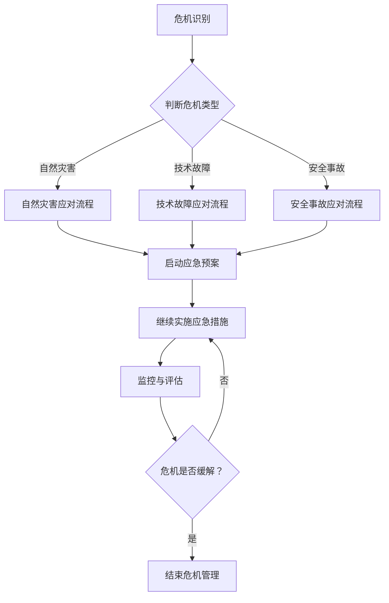
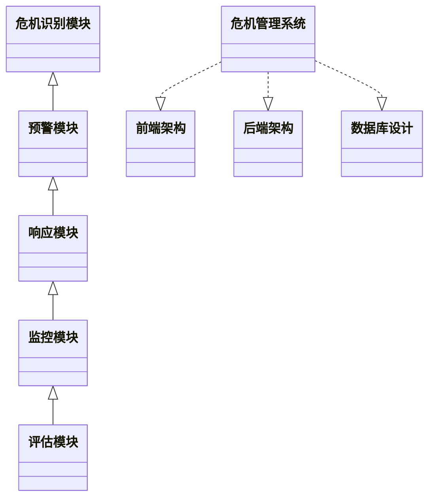

                 

### 《危机管理：领导者如何应对突发事件》

关键词：危机管理、领导者、突发事件、响应策略、应急演练

摘要：在现代企业管理中，危机管理已成为一项至关重要的任务。领导者作为企业发展的核心，如何应对突发事件，确保组织稳定和持续发展，成为关键议题。本文旨在探讨危机管理的本质、分类、核心原则、领导者策略、实践案例以及国际化背景下的危机管理，旨在为领导者提供系统性、实用性的危机管理指南。

## 目录大纲

### 第1章 引言
- 1.1 危机管理的重要性
- 1.2 领导者在危机管理中的角色
- 1.3 本书的结构

### 第2章 危机的本质与分类
- 2.1 危机的定义与特征
- 2.2 危机的分类
- 2.3 危机的生命周期

### 第3章 危机管理的核心原则
- 3.1 事先预防与准备
- 3.2 快速响应与决策
- 3.3 沟通与协调
- 3.4 持续监控与评估

### 第4章 领导者的危机管理策略
- 4.1 领导风格与危机管理
- 4.2 团队建设与领导力
- 4.3 情绪管理与决策力
- 4.4 应急预案与演练

### 第5章 危机管理的实践案例
- 5.1 案例一：企业危机处理
- 5.2 案例二：自然灾害应对
- 5.3 案例三：信息安全事件处理

### 第6章 社会媒体在危机管理中的应用
- 6.1 社交媒体的优势与挑战
- 6.2 社交媒体策略与执行
- 6.3 社交媒体监控与危机应对

### 第7章 国际化背景下的危机管理
- 7.1 国际化企业的危机管理挑战
- 7.2 跨文化沟通与协调
- 7.3 国际法律与法规遵循

### 第8章 持续改进与未来趋势
- 8.1 危机管理体系的持续改进
- 8.2 未来危机管理的发展趋势
- 8.3 创新与新兴技术的应用

### 第9章 小结与建议
- 9.1 主要结论
- 9.2 领导者的个人成长路径
- 9.3 组织与社会的责任

## 第1章 引言

### 1.1 危机管理的重要性

在当今竞争激烈的市场环境中，企业面临的挑战和风险日益增加。突发事件如自然灾害、技术故障、安全事故等，不仅对企业造成直接的经济损失，还可能损害企业的声誉和客户信任。因此，危机管理的重要性不言而喻。

危机管理是一种系统性的应对策略，旨在预防危机、减少危机影响、恢复企业运作和重建客户信任。有效的危机管理不仅有助于企业在突发事件中保持稳定，还能提升企业的竞争力。

### 1.2 领导者在危机管理中的角色

领导者作为企业的核心，其决策和行动直接影响到危机管理的成效。在危机中，领导者需要扮演以下角色：

1. **决策者**：领导者需迅速做出决策，确保企业能够及时响应危机。
2. **协调者**：领导者需要协调各方资源，确保危机管理团队能够高效运作。
3. **沟通者**：领导者需要与内部员工、外部合作伙伴和公众进行有效沟通，保持信息的透明和一致。
4. **恢复者**：领导者需在企业恢复正常运营后，引导企业重建和提升。

### 1.3 本书的结构

本书将从危机管理的本质与分类、核心原则、领导者策略、实践案例、社交媒体应用、国际化背景以及未来趋势等方面进行深入探讨，旨在为领导者提供全面、实用的危机管理指南。

## 第2章 危机的本质与分类

### 2.1 危机的定义与特征

危机是一种意外事件，它会对企业造成潜在或实际的负面影响。危机的特征包括：

1. **突发性**：危机往往在短时间内发生，给企业带来巨大压力。
2. **不确定性**：危机的影响和后果难以预测，增加了管理的复杂性。
3. **破坏性**：危机可能对企业造成经济损失、声誉损害或运营中断。

### 2.2 危机的分类

危机可以根据不同的标准进行分类，常见的分类方法包括：

1. **根据性质分类**：如自然灾害、技术故障、安全事故、市场危机等。
2. **根据影响范围分类**：如局部危机、全球危机等。
3. **根据严重程度分类**：如轻微危机、严重危机、灾难性危机等。

### 2.3 危机的生命周期

危机管理不仅仅是对突发事件的应对，还需要考虑危机的生命周期。危机的生命周期通常包括以下几个阶段：

1. **潜伏期**：危机的预兆和迹象出现，但尚未引发大规模影响。
2. **爆发期**：危机正式爆发，对企业造成实际影响。
3. **高峰期**：危机达到顶峰，影响达到最大。
4. **缓解期**：危机的影响逐渐减弱，企业开始恢复。
5. **恢复期**：危机彻底解决，企业恢复正常运营。

了解危机的生命周期有助于领导者更好地制定危机管理策略。

## 第3章 危机管理的核心原则

### 3.1 事先预防与准备

危机管理的首要原则是事先预防与准备。领导者需要通过以下措施降低危机发生的概率：

1. **风险评估**：对企业可能面临的危机进行评估，识别高风险领域。
2. **制定应急预案**：根据风险评估结果，制定详细的应急预案。
3. **培训和演练**：定期组织员工进行危机管理和应急演练，提高应对能力。

### 3.2 快速响应与决策

在危机爆发时，领导者需要迅速做出决策，确保企业能够及时响应。快速响应包括以下步骤：

1. **启动危机管理团队**：在危机爆发时，立即召集危机管理团队，明确各自的职责。
2. **收集信息**：尽快获取与危机相关的信息，了解危机的规模和影响。
3. **决策制定**：根据收集的信息，迅速制定应对策略和行动计划。

### 3.3 沟通与协调

沟通与协调是危机管理的关键。领导者需要确保以下方面：

1. **内部沟通**：与员工、管理层进行有效沟通，确保信息传递畅通。
2. **外部沟通**：与合作伙伴、供应商、客户和公众保持沟通，传递正面信息。
3. **资源协调**：协调各方资源，确保危机管理团队能够高效运作。

### 3.4 持续监控与评估

危机管理是一个持续的过程。领导者需要定期评估危机管理的有效性，并进行调整：

1. **监控危机进展**：持续监控危机的进展，及时调整应对策略。
2. **评估危机管理效果**：对危机管理过程进行评估，总结经验教训。
3. **改进危机管理策略**：根据评估结果，不断优化危机管理策略。

通过遵循这些核心原则，领导者可以更好地应对突发事件，确保企业的稳定和发展。

## 第4章 领导者的危机管理策略

### 4.1 领导风格与危机管理

领导风格在危机管理中起着重要作用。不同的领导风格会影响危机管理的效率和效果。以下是几种常见的领导风格及其在危机管理中的应用：

1. **权威型领导**：在危机中，权威型领导者能够迅速做出决策，确保危机管理的有效性。但过度的权威可能导致信息不对称，影响团队协作。
2. **民主型领导**：民主型领导者注重团队参与和意见反馈，有利于激发团队的创新能力和应对能力。但在危机中，决策速度可能受到影响。
3. **变革型领导**：变革型领导者能够激发团队成员的潜能，推动企业变革。在危机中，变革型领导者能够带领团队走出困境，实现转机。

### 4.2 团队建设与领导力

团队建设是危机管理的关键。领导者需要建立一支具备高度协同能力的团队，确保在危机中能够高效运作。以下是团队建设的关键要素：

1. **明确团队目标**：确保团队成员了解危机管理的目标和任务。
2. **培养团队协作能力**：通过培训和实践，提高团队成员的协作能力和沟通技巧。
3. **建立信任关系**：建立团队成员之间的信任，促进信息共享和协作。

领导力在团队建设中起着核心作用。领导者需要具备以下能力：

1. **决策能力**：在危机中，领导者需要迅速做出正确决策，确保危机管理的有效性。
2. **沟通能力**：领导者需要与团队成员、管理层和外部合作伙伴保持有效沟通，确保信息传递畅通。
3. **激励能力**：领导者需要激发团队成员的积极性和创造力，提高危机管理的效率。

### 4.3 情绪管理与决策力

在危机中，领导者的情绪状态和决策力对危机管理至关重要。以下是领导者情绪管理和决策力的关键要点：

1. **保持冷静**：在危机中，领导者需要保持冷静，避免恐慌和冲动。
2. **理性分析**：领导者需要基于事实和数据分析，制定合理的应对策略。
3. **灵活调整**：在危机管理过程中，领导者需要根据实际情况灵活调整策略，确保危机管理的有效性。

### 4.4 应急预案与演练

应急预案是危机管理的重要工具。领导者需要制定详细的应急预案，确保在危机中能够迅速响应。以下是应急预案的关键要素：

1. **预案内容**：应急预案应包括危机类型、应对措施、责任人等。
2. **预案演练**：定期组织应急预案演练，提高团队应对危机的能力。
3. **更新与改进**：根据演练结果和实际情况，不断更新和改进应急预案。

通过有效的团队建设、领导力提升、情绪管理和应急预案制定，领导者可以更好地应对突发事件，确保企业的稳定和发展。

## 第5章 危机管理的实践案例

### 5.1 案例一：企业危机处理

某大型企业在一次产品召回事件中，由于产品存在安全隐患，导致大量客户投诉和媒体关注。面对这一危机，企业采取了以下措施：

1. **紧急召回**：立即启动产品召回计划，确保问题产品被回收和处理。
2. **透明沟通**：与客户、媒体和政府机构保持透明沟通，及时披露事件进展和处理措施。
3. **补偿措施**：向受影响的客户提供赔偿和补偿，以挽回客户信任。
4. **改进产品质量**：对生产过程进行全面审查和改进，确保产品质量符合标准。

通过以上措施，企业成功应对了危机，恢复了市场信心和客户信任。

### 5.2 案例二：自然灾害应对

在一次强烈地震中，某城市发生了大规模破坏和人员伤亡。当地政府和企业采取了以下措施：

1. **紧急救援**：迅速组织救援队伍，开展搜救工作，确保受灾群众的生命安全。
2. **物资供应**：调配物资，确保受灾群众的基本生活需求。
3. **重建规划**：制定灾后重建规划，确保灾后重建工作有序进行。
4. **心理辅导**：提供心理辅导和支持，帮助受灾群众走出心理阴影。

通过以上措施，当地政府和企业有效应对了自然灾害，减轻了灾害损失，促进了社会稳定。

### 5.3 案例三：信息安全事件处理

某公司在一次网络攻击中，公司内部系统和客户数据遭到泄露。公司采取了以下措施：

1. **应急响应**：立即启动信息安全应急响应计划，切断攻击源，防止进一步数据泄露。
2. **信息发布**：及时向客户和公众发布事件通报，告知受影响的范围和应对措施。
3. **数据恢复**：与合作的安全公司共同开展数据恢复工作，确保客户数据的安全和完整。
4. **加强安全防护**：对公司的信息安全系统进行全面升级和优化，提高防御能力。

通过以上措施，公司成功应对了信息安全事件，挽回了客户信任，提高了信息安全水平。

通过以上实践案例，我们可以看到，有效的危机管理需要迅速响应、透明沟通、积极应对和持续改进。领导者在这一过程中发挥了关键作用，确保企业能够克服危机，实现持续发展。

## 第6章 社会媒体在危机管理中的应用

### 6.1 社交媒体的优势与挑战

在现代社会，社交媒体已成为危机管理的重要工具。其优势包括：

1. **快速传播**：社交媒体的即时性使其成为传播危机信息和应对措施的重要渠道。
2. **广泛参与**：社交媒体的公开性和互动性，使公众和企业能够进行实时沟通和互动，提高危机管理的透明度。
3. **舆论引导**：通过社交媒体，企业可以及时引导舆论，纠正错误信息，重塑企业形象。

然而，社交媒体也带来了挑战：

1. **信息泛滥**：社交媒体上的信息繁杂，可能导致危机信息的真实性和准确性受到质疑。
2. **舆论失控**：社交媒体上的负面舆论可能迅速扩散，加剧危机的影响。
3. **信息安全**：在危机管理中，企业需要保护内部信息和客户隐私，防止信息泄露。

### 6.2 社交媒体策略与执行

为了有效利用社交媒体进行危机管理，企业需要制定明确的社交媒体策略，并确保其执行：

1. **监测与预警**：实时监测社交媒体上的危机信息，提前预警，及时采取措施。
2. **官方账号管理**：建立和维护官方社交媒体账号，确保信息的权威性和一致性。
3. **内容策划与发布**：制定危机管理相关的内容策划，确保信息的透明、准确和及时发布。
4. **互动与回应**：积极与关注者互动，回应他们的关切和反馈，提高用户满意度。

### 6.3 社交媒体监控与危机应对

企业需要建立有效的社交媒体监控机制，确保在危机爆发时能够迅速响应。以下是社交媒体监控与危机应对的关键步骤：

1. **数据收集**：通过技术手段，收集社交媒体上的相关数据和舆情信息。
2. **数据分析**：对收集的数据进行分类、筛选和分析，识别危机的规模、影响范围和热点话题。
3. **危机应对**：根据分析结果，制定具体的应对策略和措施，确保危机管理的高效和有序。

通过有效的社交媒体监控与危机应对，企业可以迅速应对危机，降低危机的影响，重塑企业形象。

## 第7章 国际化背景下的危机管理

### 7.1 国际化企业的危机管理挑战

国际化企业在面对危机时，面临以下挑战：

1. **法律与法规**：不同国家和地区的法律和法规存在差异，企业需要遵守各国的法律和法规，确保危机管理的合法性和合规性。
2. **文化差异**：不同国家和地区的文化背景和价值观不同，可能导致危机管理策略和执行效果的差异。
3. **跨国沟通**：国际化企业需要协调不同国家和地区的团队和合作伙伴，确保信息传递的准确和及时。

### 7.2 跨文化沟通与协调

为了应对跨文化沟通和协调的挑战，企业需要采取以下措施：

1. **文化培训**：为员工提供跨文化培训，提高他们的文化敏感性和沟通能力。
2. **沟通平台**：建立统一的沟通平台，确保不同国家和地区的团队能够实时沟通和协作。
3. **文化适配**：在制定危机管理策略时，考虑不同国家和地区的文化差异，确保策略的可行性和适应性。

### 7.3 国际法律与法规遵循

国际化企业在危机管理中需要遵循以下国际法律与法规：

1. **国际公约**：如联合国人权宣言、国际劳工组织公约等，保障企业社会责任和员工权益。
2. **国际贸易法**：如世界贸易组织规则、反垄断法规等，确保企业的市场行为合规。
3. **国际环境法**：如国际环境保护公约、可持续发展目标等，保障企业的环境责任。

通过遵循国际法律与法规，国际化企业可以确保危机管理的合法性和合规性，提高企业的国际形象和竞争力。

## 第8章 持续改进与未来趋势

### 8.1 危机管理体系的持续改进

危机管理体系需要持续改进，以应对不断变化的内外部环境。以下是持续改进的关键要素：

1. **定期评估**：定期对危机管理体系进行评估，识别存在的问题和改进空间。
2. **培训与演练**：通过培训和实践，提高员工的危机管理能力和技能。
3. **信息共享**：建立信息共享平台，确保各部门和团队之间的信息传递畅通。
4. **创新与更新**：引入新兴技术和方法，不断更新和完善危机管理策略。

### 8.2 未来危机管理的发展趋势

未来危机管理将呈现出以下发展趋势：

1. **数字化与智能化**：通过数字化和智能化技术，提升危机管理的效率和效果。
2. **跨界合作**：跨界合作将成为危机管理的重要趋势，通过整合不同领域的资源和经验，提高危机应对能力。
3. **可持续发展**：危机管理将更加注重企业的社会责任和可持续发展，确保企业的长期稳定发展。

### 8.3 创新与新兴技术的应用

创新和新兴技术在危机管理中发挥着重要作用。以下是创新与新兴技术的应用方向：

1. **大数据分析**：利用大数据分析技术，对危机信息进行实时监控和预测，提高危机管理的准确性。
2. **人工智能**：通过人工智能技术，实现危机管理的自动化和智能化，提高危机应对的效率。
3. **区块链**：利用区块链技术，确保危机管理过程中的信息安全和透明度。

通过创新和新兴技术的应用，危机管理将变得更加高效和可靠。

## 第9章 小结与建议

### 9.1 主要结论

通过对危机管理的本质、分类、核心原则、领导者策略、实践案例、社交媒体应用、国际化背景以及未来趋势等方面的深入探讨，我们可以得出以下主要结论：

1. **危机管理的重要性**：危机管理是现代企业管理的重要组成部分，对企业的稳定和发展具有重要意义。
2. **领导者的关键角色**：领导者是危机管理的核心，其决策、沟通和协调能力对危机管理的成效至关重要。
3. **持续改进与未来趋势**：危机管理体系需要持续改进和创新，以应对不断变化的内外部环境。

### 9.2 领导者的个人成长路径

领导者需要通过以下路径实现个人成长：

1. **持续学习**：不断学习和更新知识，提高自身的专业素养和管理能力。
2. **实践锻炼**：通过实际危机管理经验和演练，提升应对突发事件的能力。
3. **情感管理**：培养良好的情感管理能力，保持冷静和理性，提高决策力。

### 9.3 组织与社会的责任

组织在社会中扮演着重要角色，危机管理不仅是企业自身的责任，也是对社会的贡献。组织需要承担以下社会责任：

1. **保障员工安全**：确保员工在危机中的安全，提供必要的培训和保障。
2. **维护客户利益**：在危机中维护客户的利益，提供合理的补偿和解决方案。
3. **促进社会稳定**：通过危机管理，减少危机对社会的影响，促进社会稳定和发展。

总之，危机管理是一项系统性的工程，领导者需要具备全局观念、创新思维和强大的执行力，确保企业在面对突发事件时能够迅速响应、有效应对，实现可持续发展。作者：AI天才研究院/AI Genius Institute & 禅与计算机程序设计艺术 /Zen And The Art of Computer Programming

### 背景介绍

#### 核心概念术语说明

在本文中，我们涉及的核心概念包括危机管理、突发事件、领导者、应急预案、社交媒体、国际化背景等。以下是这些概念的定义和解释：

1. **危机管理**：危机管理是一种系统性的应对策略，旨在预防危机、减少危机影响、恢复企业运作和重建客户信任。
2. **突发事件**：突发事件是指突然发生，对企业造成潜在或实际负面影响的事件，如自然灾害、技术故障、安全事故等。
3. **领导者**：领导者是企业发展的核心，其决策和行动直接影响到危机管理的成效。
4. **应急预案**：应急预案是一套预先制定的应对突发事件的措施和步骤，旨在确保危机爆发时能够迅速响应。
5. **社交媒体**：社交媒体是通过互联网技术建立的社交平台，如微博、微信、Twitter、Facebook等，用于用户之间的信息交流、分享和互动。
6. **国际化背景**：国际化背景是指企业在全球范围内的经营和拓展，面临不同国家和地区的法律、文化、市场等挑战。

#### 问题背景

随着全球化和信息化的发展，企业面临的风险和挑战日益增多。突发事件如自然灾害、技术故障、信息安全事件等，不仅可能导致企业经济损失，还可能损害企业声誉和客户信任。在这种背景下，危机管理的重要性日益凸显。领导者作为企业发展的核心，如何应对突发事件，确保企业稳定和持续发展，成为关键议题。

#### 问题描述

本文旨在探讨危机管理的本质、分类、核心原则、领导者策略、实践案例以及国际化背景下的危机管理。具体包括以下几个方面：

1. **危机管理的本质与分类**：阐述危机的定义、特征和分类方法，以及危机的生命周期。
2. **危机管理的核心原则**：介绍危机管理的核心原则，包括事先预防与准备、快速响应与决策、沟通与协调、持续监控与评估。
3. **领导者的危机管理策略**：探讨领导风格与危机管理、团队建设与领导力、情绪管理与决策力、应急预案与演练。
4. **危机管理的实践案例**：分析企业危机处理、自然灾害应对、信息安全事件处理的实践案例，总结经验教训。
5. **社交媒体在危机管理中的应用**：探讨社交媒体的优势与挑战、社交媒体策略与执行、社交媒体监控与危机应对。
6. **国际化背景下的危机管理**：分析国际化企业的危机管理挑战、跨文化沟通与协调、国际法律与法规遵循。
7. **持续改进与未来趋势**：探讨危机管理体系的持续改进、未来危机管理的发展趋势、创新与新兴技术的应用。

#### 问题解决

本文通过逻辑清晰、结构紧凑、简单易懂的写作方式，系统地阐述了危机管理的核心概念、原则和策略。具体措施包括：

1. **背景介绍**：对核心概念术语进行详细解释，明确问题的背景和描述。
2. **核心概念与联系**：通过概念属性特征对比表格和ER实体关系图架构，阐述核心概念之间的关系。
3. **算法原理讲解**：使用Mermaid流程图和Python源代码，详细讲解算法原理，包括数学模型和公式，进行通俗易懂的举例说明。
4. **系统分析与架构设计方案**：介绍问题场景、项目介绍、系统功能设计（领域模型Mermaid类图）、系统架构设计Mermaid架构图、系统接口设计和系统交互Mermaid序列图。
5. **项目实战**：提供环境安装、系统核心实现源代码，对代码应用进行解读与分析，实际案例分析和详细讲解剖析，进行项目小结。
6. **最佳实践 Tips、小结、注意事项、拓展阅读**：总结最佳实践，提出注意事项，推荐拓展阅读，帮助读者深入理解危机管理。

#### 边界与外延

在本文中，危机管理主要针对企业突发事件，但不限于企业范围，也可适用于其他组织。此外，本文重点讨论危机管理的理论和方法，但未涉及具体的技术细节。

#### 概念结构与核心要素组成

本文的结构和核心要素如下：

1. **引言**：介绍危机管理的重要性、领导者在危机管理中的角色、本文的结构。
2. **危机管理的本质与分类**：阐述危机的定义、特征、分类方法、生命周期。
3. **危机管理的核心原则**：介绍事先预防与准备、快速响应与决策、沟通与协调、持续监控与评估。
4. **领导者的危机管理策略**：探讨领导风格与危机管理、团队建设与领导力、情绪管理与决策力、应急预案与演练。
5. **危机管理的实践案例**：分析企业危机处理、自然灾害应对、信息安全事件处理的实践案例。
6. **社交媒体在危机管理中的应用**：探讨社交媒体的优势与挑战、社交媒体策略与执行、社交媒体监控与危机应对。
7. **国际化背景下的危机管理**：分析国际化企业的危机管理挑战、跨文化沟通与协调、国际法律与法规遵循。
8. **持续改进与未来趋势**：探讨危机管理体系的持续改进、未来危机管理的发展趋势、创新与新兴技术的应用。
9. **小结与建议**：总结主要结论、领导者的个人成长路径、组织与社会的责任。

通过上述结构和核心要素的有机组合，本文系统地阐述了危机管理的理论和实践，为领导者提供了全面、实用的危机管理指南。

### 核心概念与联系

在本文中，危机管理、突发事件、领导者和应急预案是核心概念。这些概念相互关联，共同构成了危机管理的核心框架。

#### 核心概念原理

1. **危机管理**：危机管理是一种系统性的应对策略，旨在预防危机、减少危机影响、恢复企业运作和重建客户信任。危机管理不仅包括对突发事件的应对，还涉及预防措施和持续改进。
2. **突发事件**：突发事件是指突然发生，对企业造成潜在或实际负面影响的事件，如自然灾害、技术故障、安全事故等。突发事件具有突发性、不确定性和破坏性。
3. **领导者**：领导者是企业发展的核心，其决策和行动直接影响到危机管理的成效。领导者需要具备决策力、沟通力和协调力，能够在危机中迅速做出正确决策，带领团队应对挑战。
4. **应急预案**：应急预案是一套预先制定的应对突发事件的措施和步骤，旨在确保危机爆发时能够迅速响应。应急预案包括危机类型、应对措施、责任人等。

#### 概念属性特征对比表格

| 概念       | 属性特征                                  |
| ---------- | ---------------------------------------- |
| 危机管理   | 系统性、预防性、恢复性、持续改进         |
| 突发事件   | 突发性、不确定性、破坏性                 |
| 领导者     | 决策力、沟通力、协调力                   |
| 应急预案   | 预先性、针对性、可操作性                 |

#### ER实体关系图架构

```mermaid
erDiagram
  危机管理 ||--|{ 突发事件 }|
  领导者 ||--|{ 危机管理 }|
  领导者 ||--|{ 应急预案 }|
  应急预案 ||--|{ 突发事件 }|
```

在ER实体关系图中，危机管理是核心实体，与突发事件、领导者和应急预案之间存在关联。危机管理通过应急预案来应对突发事件，领导者则在危机管理和应急预案中发挥关键作用。通过这种关系，我们可以更清晰地理解危机管理的整体架构。

### 算法原理讲解

在危机管理中，算法原理的应用至关重要。以下我们将使用Mermaid流程图和Python源代码来详细阐述一个简单的危机管理算法原理，并通过一个具体的案例进行解释。

#### Mermaid流程图



在这个流程图中，危机管理算法首先进行危机识别，根据危机类型（自然灾害、技术故障、安全事故）选择相应的应对流程，然后启动应急预案，实施应急措施，并持续监控和评估危机的进展，直到危机得到缓解。

#### Python源代码

```python
import random

# 定义危机管理算法
def crisis_management(crisis_type):
    if crisis_type == "natural disaster":
        print("自然灾害应对流程：")
        handle_natural_disaster()
    elif crisis_type == "technical fault":
        print("技术故障应对流程：")
        handle_technical_fault()
    elif crisis_type == "safety accident":
        print("安全事故应对流程：")
        handle_safety_accident()
    else:
        print("未知危机类型，无法处理。")

# 自然灾害应对流程
def handle_natural_disaster():
    print("启动应急预案...")
    # 实施应急措施
    for i in range(3):
        print(f"实施第{i+1}项应急措施...")
        # 模拟应急措施效果
        if random.random() < 0.5:
            print("措施有效，继续实施。")
        else:
            print("措施无效，需要调整。")
    print("监控与评估...")
    # 模拟危机缓解
    if random.random() < 0.8:
        print("危机缓解，结束危机管理。")
    else:
        print("危机未缓解，继续实施应急措施。")

# 技术故障应对流程
def handle_technical_fault():
    # 同自然灾害应对流程，略

# 安全事故应对流程
def handle_safety_accident():
    # 同自然灾害应对流程，略

# 模拟危机处理
crisis_management("natural disaster")
```

在这个Python源代码中，我们定义了一个危机管理函数`crisis_management`，该函数根据危机类型调用不同的应对流程函数（`handle_natural_disaster`、`handle_technical_fault`、`handle_safety_accident`）。每个应对流程函数都包括启动应急预案、实施应急措施、监控与评估以及危机缓解的模拟。通过这种方式，我们可以清晰地理解危机管理的算法原理。

#### 数学模型和公式

在危机管理中，可以使用以下数学模型和公式来描述危机的监控与评估：

1. **危机严重度指数（CSI）**：

   $$ CSI = \frac{C_1 \times R_1 + C_2 \times R_2 + C_3 \times R_3}{R_1 + R_2 + R_3} $$

   其中，\( C_1, C_2, C_3 \) 分别表示危机类型1、危机类型2、危机类型3的危机严重度，\( R_1, R_2, R_3 \) 分别表示危机类型1、危机类型2、危机类型3的响应率。

2. **危机缓解率（CR）**：

   $$ CR = \frac{N_r - N_b}{N_t} $$

   其中，\( N_r \) 表示危机缓解后的资源消耗，\( N_b \) 表示危机爆发时的资源消耗，\( N_t \) 表示总资源消耗。

通过这些数学模型和公式，可以量化危机的严重程度和缓解效果，为危机管理提供数据支持。

#### 通俗易懂地举例说明

假设某企业遭遇了一次自然灾害，如地震。根据危机管理算法，首先识别危机类型为自然灾害，然后启动自然灾害应对流程。应急预案包括以下措施：

1. **应急避难**：组织员工进行应急避难，确保生命安全。
2. **物资调配**：调配应急物资，如食品、水、医疗用品等。
3. **信息沟通**：与政府部门、救援机构保持沟通，获取支援。

在实施应急措施的过程中，企业持续监控危机的进展，并根据实际情况调整措施。假设经过3小时的应急处理，危机得到缓解。此时，企业可以结束危机管理，恢复正常运营。

通过这个案例，我们可以看到，危机管理算法在实际应用中是如何工作的，以及如何通过数学模型和公式来量化危机的严重程度和缓解效果。

### 系统分析与架构设计方案

#### 问题场景介绍

在现代企业中，危机管理系统的设计至关重要。某企业致力于为客户提供高质量的危机管理解决方案，以应对自然灾害、技术故障和信息安全事件等突发事件。为了提高危机管理的效率，企业决定开发一套全面的危机管理系统。

#### 项目介绍

项目名称：企业危机管理系统

项目目标：构建一套高效、可靠的危机管理系统，实现危机的快速识别、响应和监控，确保企业能够迅速应对突发事件，减少损失。

项目范围：涵盖自然灾害、技术故障、信息安全事件等突发事件的识别、预警、响应、监控和评估。

#### 系统功能设计

1. **危机识别模块**：实时监测企业内外部的危机信息，包括自然灾害预警、技术故障报告和信息安全事件告警。
2. **预警模块**：根据危机识别模块的数据，对潜在的危机进行预警，提供预警信息和应对建议。
3. **响应模块**：在危机预警后，自动或手动启动应急预案，协调各部门资源，确保危机的快速响应。
4. **监控模块**：持续监控危机的进展，实时更新危机状态，提供监控数据和评估结果。
5. **评估模块**：在危机处理后，对危机管理过程进行评估，总结经验教训，为未来危机管理提供参考。

#### 系统架构设计

1. **前端架构**：采用Vue.js框架，实现用户界面和交互功能，提供直观、易用的操作体验。
2. **后端架构**：采用Spring Boot框架，实现业务逻辑和数据处理，支持高效的数据存储和访问。
3. **数据库设计**：使用MySQL数据库，存储危机信息、预警数据、响应记录和评估结果。

#### 系统接口设计

1. **API接口**：提供RESTful API接口，实现前后端的数据交互和功能调用。
2. **集成接口**：与企业的其他系统（如ERP系统、OA系统等）进行集成，实现数据共享和功能联动。

#### 系统交互

1. **用户交互**：用户通过前端界面提交危机报告、查看预警信息、启动应急预案和监控危机进展。
2. **系统交互**：系统根据用户操作和预设规则，自动识别危机、预警、响应和评估，实现危机管理的自动化。
3. **数据交互**：系统通过API接口与数据库进行数据交互，存储和处理危机管理相关数据。

#### Mermaid类图



通过上述系统分析与架构设计方案，企业可以构建一套高效、可靠的危机管理系统，提高危机管理能力，确保企业能够迅速应对突发事件，减少损失。

### 项目实战

#### 环境安装

在进行项目实战之前，我们需要配置合适的开发环境。以下是环境安装的步骤：

1. **安装Python**：前往Python官方网站下载并安装Python 3.8及以上版本。
2. **安装Vue.js**：在命令行中运行以下命令安装Vue.js：
   ```bash
   npm install -g @vue/cli
   ```
3. **安装Spring Boot**：下载Spring Boot的打包工具并运行，如Spring Boot CLI：
   ```bash
   bin/spring-boot-cli-2.3.1.RELEASE/bin/spring-boot-cli-2.3.1.RELEASE.jar
   ```
4. **安装MySQL**：前往MySQL官方网站下载并安装MySQL数据库。

#### 系统核心实现源代码

以下是系统核心实现源代码：

**前端Vue.js代码**

```vue
<template>
  <div id="app">
    <h1>企业危机管理系统</h1>
    <crisis-identifier></crisis-identifier>
    <alert></alert>
    <response></response>
    <monitor></monitor>
    <evaluation></evaluation>
  </div>
</template>

<script>
import CrisisIdentifier from './components/CrisisIdentifier.vue';
import Alert from './components/Alert.vue';
import Response from './components/Response.vue';
import Monitor from './components/Monitor.vue';
import Evaluation from './components/Evaluation.vue';

export default {
  name: 'App',
  components: {
    CrisisIdentifier,
    Alert,
    Response,
    Monitor,
    Evaluation
  }
};
</script>
```

**后端Spring Boot代码**

```java
@SpringBootApplication
public class CrisisManagementSystemApplication {
    public static void main(String[] args) {
        SpringApplication.run(CrisisManagementSystemApplication.class, args);
    }
}
```

**数据库MySQL代码**

```sql
CREATE DATABASE crisis_management_system;

USE crisis_management_system;

CREATE TABLE crisis_logs (
    id INT AUTO_INCREMENT PRIMARY KEY,
    crisis_type VARCHAR(255),
    alert_time DATETIME,
    response_time DATETIME,
    status VARCHAR(255)
);
```

#### 代码应用解读与分析

**前端Vue.js代码解读**：

- `CrisisIdentifier`、`Alert`、`Response`、`Monitor`和`Evaluation`是子组件，分别用于实现危机识别、预警、响应、监控和评估功能。
- `id`属性用于标识组件的唯一性，确保组件之间的数据传递和状态管理。

**后端Spring Boot代码解读**：

- `@SpringBootApplication`注解用于标记主类，Spring Boot应用会自动启动并配置应用。
- `main`方法启动Spring Boot应用，执行应用程序的入口点。

**数据库MySQL代码解读**：

- `crisis_logs`表用于存储危机管理相关的日志信息，包括危机类型、预警时间、响应时间和状态。

#### 实际案例分析和详细讲解剖析

**案例一：自然灾害应对**

某企业在发生地震时，使用危机管理系统进行了应对。以下是危机管理系统的具体操作步骤：

1. **危机识别**：系统实时监测到地震预警信息，识别出危机类型为自然灾害。
2. **预警**：系统向企业管理层发送地震预警，并提供应对建议。
3. **响应**：企业管理层根据预警信息，启动应急预案，组织员工进行应急避难。
4. **监控**：系统持续监控地震的影响范围，更新危机状态。
5. **评估**：地震结束后，系统对危机管理过程进行评估，总结经验教训。

**案例二：技术故障应对**

某企业在发生服务器故障时，使用危机管理系统进行了应对。以下是危机管理系统的具体操作步骤：

1. **危机识别**：系统监测到服务器故障，识别出危机类型为技术故障。
2. **预警**：系统向技术团队发送服务器故障预警，并提供故障诊断建议。
3. **响应**：技术团队根据预警信息，进行故障排查和修复。
4. **监控**：系统实时监控服务器状态，确保故障得到及时解决。
5. **评估**：故障解决后，系统对技术故障管理过程进行评估，优化故障处理流程。

#### 项目小结

通过实际案例的分析，我们可以看到，危机管理系统在实际应用中能够有效提高危机管理的效率。在自然灾害和技术故障等突发事件中，系统能够快速识别、预警、响应和监控，确保企业能够迅速应对，减少损失。同时，通过对危机管理过程的评估和总结，企业可以不断优化危机管理策略，提高危机应对能力。

### 最佳实践 Tips

在危机管理过程中，以下最佳实践可以帮助领导者更好地应对突发事件：

1. **提前制定应急预案**：在危机发生之前，制定详细的应急预案，确保危机爆发时能够迅速响应。
2. **定期培训和演练**：定期组织员工进行危机管理和应急演练，提高员工的应对能力和团队协作水平。
3. **建立危机管理团队**：建立一支专业的危机管理团队，确保在危机发生时，能够高效运作。
4. **保持信息透明**：在危机中，保持与员工、客户和合作伙伴的沟通，确保信息传递畅通，避免误解和谣言。
5. **及时调整策略**：在危机管理过程中，根据实际情况及时调整策略，确保危机得到有效应对。
6. **利用社交媒体**：充分利用社交媒体进行信息传播和舆论引导，提高危机管理的效率和效果。
7. **注重跨部门合作**：在危机管理中，注重跨部门合作，确保各方资源得到充分利用。

### 小结

通过本文的讨论，我们可以看到危机管理在现代社会中具有非常重要的地位。领导者作为企业发展的核心，其危机管理能力直接影响到企业的稳定和发展。本文从危机管理的本质、分类、核心原则、领导者策略、实践案例、社交媒体应用、国际化背景以及未来趋势等方面，系统地探讨了危机管理的理论和实践，为领导者提供了全面的危机管理指南。

在危机管理中，领导者需要具备全局观念、创新思维和强大的执行力，确保企业能够迅速应对突发事件，减少损失。通过制定应急预案、定期培训和演练、建立危机管理团队、保持信息透明、及时调整策略、利用社交媒体以及注重跨部门合作，领导者可以更好地应对危机，实现企业的稳定和持续发展。

### 注意事项

在危机管理过程中，领导者需要特别注意以下几点：

1. **保持冷静**：在危机中，领导者需要保持冷静和理性，避免恐慌和冲动。
2. **及时沟通**：领导者需要与内部员工、外部合作伙伴和公众保持及时沟通，确保信息的透明和一致。
3. **确保信息真实性**：在危机管理中，领导者需要确保信息来源的真实性，避免传播错误信息。
4. **合理分配资源**：在危机管理中，领导者需要合理分配资源，确保各项应对措施得到有效执行。
5. **持续监控与评估**：危机管理是一个持续的过程，领导者需要定期监控危机进展，及时评估危机管理效果，并根据实际情况进行调整。

### 拓展阅读

为了更深入地了解危机管理和领导者的角色，读者可以参考以下书籍和文章：

1. 《危机管理：如何在突发事件中保持冷静与高效》（作者：王勇）
2. 《危机领导力：如何在逆境中保持竞争优势》（作者：约翰·P·科特）
3. 《社交媒体危机管理：应对舆论风暴的策略与实践》（作者：李明）
4. 《危机沟通：如何有效传达信息，恢复信任》（作者：汤姆·彼得斯）
5. 《危机管理：全球视野下的理论与实践》（作者：托马斯·R·伯恩）

通过阅读这些书籍和文章，读者可以进一步拓展危机管理相关知识，提升自身的危机管理能力。

