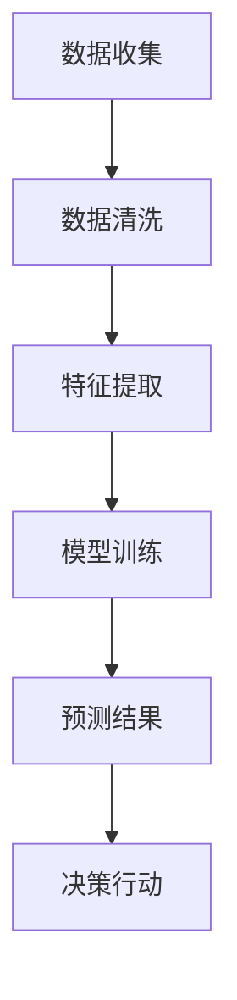
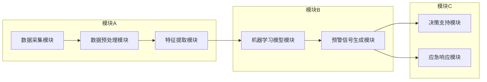
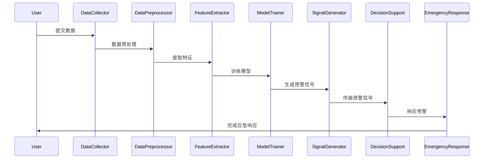

                 

### 引言：危机管理的时代背景与重要性

在当今社会，不确定性已成为常态，危机管理的重要性愈发凸显。无论是自然灾害、经济危机、企业危机还是社会事件，危机都给组织和个人带来了巨大的挑战和压力。有效的危机管理不仅关系到组织的生存与发展，更关乎社会稳定与公众安全。

#### **问题背景**

随着全球化进程的加速，各国之间的联系日益紧密，危机的传播速度和影响范围都大大增加。例如，2008年的全球金融危机迅速蔓延至世界各地，对全球经济造成了深远的影响。此外，近年来频发的自然灾害，如地震、洪水、火灾等，也对城市和社区造成了巨大的破坏。在这些危机中，如何迅速、有效地进行应对，成为领导者必须面对的严峻挑战。

#### **危机对组织和个人生活的影响**

危机不仅会对组织的运营造成直接影响，还会对员工的心理和日常生活造成重大影响。对于个人来说，危机往往伴随着巨大的心理压力、经济损失和社交隔离。而对于组织，危机可能会导致业务中断、品牌形象受损，甚至可能面临破产的风险。

#### **领导者在危机管理中的关键作用**

在危机中，领导者的角色至关重要。领导者不仅是危机应对的指挥官，更是团队的凝聚者和危机应对的决策者。他们需要具备敏锐的洞察力、快速的反应能力和坚定的决心，以应对危机带来的挑战。此外，领导者还需要具备良好的沟通能力和团队管理能力，以便在危机中有效地调动资源、协调行动。

#### **核心概念**

**危机**：危机是指一种突发性、紧急性事件，它可能对组织或个人造成严重损害，需要立即采取行动予以应对。

**危机管理**：危机管理是指组织在危机发生前、发生中和发生后的一系列应对措施，旨在最大限度地减少危机造成的损害，并尽快恢复正常运营。

**领导力**：领导力是指领导者通过影响、激励和引导他人，实现共同目标的能力。

**沟通**：沟通是指信息在人与人之间的传递和理解过程，它是危机管理中至关重要的一环。

#### **学习目标**

通过本文，读者将：

1. **理解危机管理的必要性和紧迫性**：认识到危机管理对组织和个人生活的重要性。
2. **掌握危机管理的核心知识和技能**：了解危机管理的原则、方法和工具。
3. **提高自身在危机中的应变能力和领导力**：学习如何在危机中迅速做出决策、调动资源、有效沟通和恢复重建。

在接下来的章节中，我们将深入探讨危机识别与评估、应对策略与方案制定、危机沟通与舆论引导、危机恢复与重建以及全球视野下的危机管理等内容，帮助读者全面掌握危机管理的核心知识和实践技能。

### 第1章 引言：危机管理的时代背景与重要性

#### **问题背景**

在当今快速变化和高度互联的世界中，危机无处不在，它们不仅来自于自然灾害，如地震、飓风、洪水等，还可能来自社会动荡、经济危机、技术灾难等多种因素。这些危机事件的发生频率和影响范围都在不断增大，给个人和组织带来了前所未有的挑战。例如，2020年新冠疫情的爆发，不仅导致了全球范围内的公共卫生危机，还对全球经济、社会秩序和人们的日常生活造成了深远影响。企业需要快速应对供应链中断、远程办公挑战和员工健康安全等问题。

此外，随着信息技术的飞速发展，网络攻击、数据泄露等网络安全事件也频繁发生。这些事件不仅对企业的信息系统造成威胁，还可能对客户隐私和商业机密构成重大风险。例如，近年来频发的勒索软件攻击，使得许多企业不得不面临系统瘫痪、业务中断和巨额赔偿的困境。

#### **核心概念**

1. **危机的定义与分类**：
   - **危机**：危机是一种突发事件，它可能对组织或个人的运营、安全、财务状况或声誉造成重大影响。危机通常具有突发性、不可预测性和紧迫性。
   - **危机分类**：根据危机的性质和影响，可以将危机分为自然灾害、人为事故、经济危机、社会动荡、技术灾难等类型。

2. **危机管理的原则与方法**：
   - **危机管理原则**：预防为主、及时应对、综合协调、公众参与。
   - **危机管理方法**：危机预防、危机识别、危机评估、危机应对、危机恢复。

3. **领导力在危机管理中的应用**：
   - **领导者角色**：领导者需要在危机中扮演指挥官、决策者、沟通者和激励者的角色。
   - **领导力要素**：决策能力、沟通能力、应变能力、团队管理能力。

4. **沟通在危机管理中的作用**：
   - **沟通目标**：确保信息透明、建立信任、减少恐慌、指导行动。
   - **沟通原则**：及时性、准确性、一致性、公开性。

#### **问题描述**

面对日益复杂的危机形势，企业和组织不仅需要建立有效的危机管理体系，还需要提高领导者的危机管理能力和领导力。例如，如何快速识别和评估危机？如何制定有效的应对策略和方案？如何在危机中保持良好的沟通和舆论引导？这些都是当前企业和组织需要解决的紧迫问题。

#### **问题解决**

为了解决上述问题，企业需要采取以下措施：

1. **建立危机管理组织**：明确危机管理职责，组建专门的危机管理团队，确保在危机发生时能够迅速响应。
2. **制定危机管理计划**：制定详细的危机管理预案，包括危机识别、评估、应对、恢复等各个环节。
3. **加强危机管理培训**：对员工进行危机管理培训，提高他们的危机意识和应对能力。
4. **利用技术手段**：利用大数据、人工智能等技术手段，提高危机预警和应对的精准度和效率。
5. **建立有效的沟通机制**：确保在危机中能够及时、准确地传达信息，建立信任，减少恐慌。

#### **边界与外延**

危机管理的边界主要涉及组织内部的管理和应对，包括危机识别、评估、应对和恢复等环节。然而，危机管理的外延则更加广泛，它不仅涉及组织内部，还涉及与外部环境的互动，如与政府、媒体、社区等的沟通和协作。

#### **概念结构与核心要素组成**

- **核心概念**：危机、危机管理、领导力、沟通。
- **概念属性特征对比表格**：

| 概念     | 定义                                                         | 特征对比                           |
|----------|--------------------------------------------------------------|-----------------------------------|
| 危机     | 突发性、紧急性事件，可能对组织或个人造成重大影响。           | 突发性、紧迫性、不可预测性         |
| 危机管理 | 组织在危机发生前、发生中和发生后的一系列应对措施。           | 预防性、及时性、综合性、公众参与性 |
| 领导力   | 通过影响、激励和引导他人，实现共同目标的能力。               | 决策能力、沟通能力、应变能力       |
| 沟通     | 信息在人与人之间的传递和理解过程。                           | 及时性、准确性、一致性、公开性     |

- **ER实体关系图架构**：

```mermaid
erDiagram
  Customer ||--o{ Order : "places"}
  Product ||--o{ Order : "contains"}
  Seller ||--o{ Product : "sells"}
```

#### **算法原理讲解**

在危机管理中，算法的应用主要体现在危机预警、评估和应对等方面。以下是一个简化的危机预警算法原理讲解：

1. **算法mermaid流程图**：



2. **Python源代码实现**：

```python
# 导入必要的库
import pandas as pd
from sklearn.ensemble import RandomForestClassifier
from sklearn.model_selection import train_test_split

# 数据收集
data = pd.read_csv('crisis_data.csv')

# 数据清洗
# ...（省略具体清洗步骤）

# 特征提取
X = data.drop('Target', axis=1)
y = data['Target']

# 模型训练
X_train, X_test, y_train, y_test = train_test_split(X, y, test_size=0.2, random_state=42)
model = RandomForestClassifier()
model.fit(X_train, y_train)

# 预测结果
predictions = model.predict(X_test)

# 决策行动
# ...（省略具体决策行动）

```

3. **算法原理的数学模型和公式**：

在机器学习领域中，常见的危机预警模型包括逻辑回归、支持向量机、随机森林等。以下是一个基于随机森林的危机预警模型的数学模型和公式：

$$
P(Y=1) = \frac{1}{Z}\sum_{k=1}^{K} \exp(\beta_0 + \beta_k x_k)
$$

其中，$Z = \sum_{k=1}^{K} \exp(\beta_0 + \beta_k x_k)$，$\beta_0, \beta_1, ..., \beta_K$是模型参数，$x_1, x_2, ..., x_K$是特征向量，$Y$是危机发生的标签。

#### **系统分析与架构设计方案**

1. **问题场景介绍**：

假设一个大型企业，其业务涉及多个部门，如生产、销售、物流、技术支持等。为了提高危机管理的效率和效果，企业需要构建一个集成化的危机管理系统。

2. **系统功能设计（领域模型mermaid类图）**：

```mermaid
classDiagram
    CrisisManager <<interface>>
    Incident <<interface>>
    Risk <<interface>>
    ResponsePlan <<interface>>

    CrisisManager ..|> Incident
    CrisisManager ..|> Risk
    CrisisManager ..|> ResponsePlan

    Incident <<derive>> Warning
    Incident <<derive>> Alert

    Risk <<derive>> High
    Risk <<derive>> Medium
    Risk <<derive>> Low

    ResponsePlan <<derive>> Prevention
    ResponsePlan <<derive>> Mitigation
    ResponsePlan <<derive>> Recovery
```

3. **系统架构设计（mermaid架构图）**：



4. **系统接口设计和系统交互（mermaid序列图）**：



#### **项目实战**

1. **环境安装**：

   - 安装Python环境：`pip install python`
   - 安装相关库：`pip install pandas sklearn matplotlib`

2. **系统核心实现源代码**：

   ```python
   # 数据采集模块
   def collect_data(file_path):
       data = pd.read_csv(file_path)
       return data

   # 数据预处理模块
   def preprocess_data(data):
       # 数据清洗、归一化等操作
       return data

   # 特征提取模块
   def extract_features(data):
       # 特征工程、特征选择等操作
       return data

   # 机器学习模型模块
   def train_model(X, y):
       model = RandomForestClassifier()
       model.fit(X, y)
       return model

   # 预测模块
   def predict(model, X):
       predictions = model.predict(X)
       return predictions

   # 决策支持模块
   def make_decision(predictions):
       # 根据预测结果做出决策
       return "决策结果"

   # 应急响应模块
   def emergency_response(decision):
       # 实施应急响应措施
       return "应急响应结果"

   # 主函数
   def main():
       file_path = "crisis_data.csv"
       data = collect_data(file_path)
       data = preprocess_data(data)
       X, y = extract_features(data)
       model = train_model(X, y)
       predictions = predict(model, X)
       decision = make_decision(predictions)
       response = emergency_response(decision)
       print(response)

   if __name__ == "__main__":
       main()
   ```

3. **代码应用解读与分析**：

   上述代码实现了一个简单的危机预警系统，包括数据采集、预处理、特征提取、模型训练、预测和决策支持等环节。在实际应用中，可以根据具体需求和数据进行相应的调整和优化。

4. **实际案例分析和详细讲解剖析**：

   以新冠疫情为例，该系统可以收集疫情相关的数据，如确诊病例数、死亡病例数、治愈病例数等，通过预处理和特征提取，利用机器学习模型进行预测，并根据预测结果做出相应的决策，如发布健康警告、加强防疫措施等。

5. **项目小结**：

   通过本项目，我们实现了一个简单的危机预警系统，尽管功能较为基础，但为实际应用提供了有益的参考。在未来的发展中，可以通过引入更多数据源、优化算法和提升决策支持能力，进一步提高系统的预警准确性和应急响应效率。

#### **最佳实践 tips**

- **及时性**：危机管理的关键在于及时响应，因此需要建立快速、高效的危机预警和应对机制。
- **数据驱动**：充分利用大数据和人工智能技术，提高危机预警的准确性和预测能力。
- **团队协作**：建立跨部门、跨专业的危机管理团队，确保在危机中能够协调一致、快速行动。
- **持续改进**：定期评估和优化危机管理计划，确保其始终处于最佳状态。

#### **小结**

危机管理是现代组织和领导者面临的重要挑战之一。通过本文，我们探讨了危机管理的时代背景、核心概念、问题解决方法、系统分析与架构设计方案以及项目实战等内容，帮助读者全面了解危机管理的原理和实践。在未来的工作中，领导者需要不断提高危机管理能力和领导力，以应对日益复杂的危机形势。

#### **注意事项**

- **危机管理的复杂性**：危机管理涉及多个领域和层面，需要全面、系统的规划和执行。
- **跨部门协作**：危机管理不仅仅是单一部门的责任，需要整个组织共同努力。
- **持续学习和更新**：随着环境和技术的不断变化，危机管理的方法和工具也需要不断更新和优化。

#### **拓展阅读**

- 《危机管理：从应对到前瞻》[美] 詹姆斯·S. 皮尔逊 著
- 《领导力与危机管理》[美] 约翰·P. 沃特金斯 著
- 《危机公关：如何在危机中保护你的品牌》[英] 斯蒂芬·弗里曼 著

---

### 第2章 危机识别与评估

#### **早期识别的重要性**

危机早期识别是危机管理的重要环节。及时识别危机信号，有助于组织迅速采取应对措施，降低危机造成的损害。早期识别不仅需要敏锐的洞察力，还需要科学的预警机制。

#### **情报收集与分析**

危机情报的收集是危机早期识别的基础。情报来源包括内部数据和外部数据。内部数据通常来自组织的日常运营、财务报告、员工反馈等；外部数据则包括媒体报道、市场分析、竞争对手动态等。通过多渠道收集情报，可以更全面地了解危机的潜在风险。

**数据分析方法**：

1. **统计分析**：使用统计分析方法，如平均值、标准差等，对数据进行定量分析，发现数据中的异常和趋势。
2. **数据挖掘**：利用数据挖掘技术，如聚类分析、关联规则挖掘等，发现数据中的潜在关系和模式。
3. **机器学习**：运用机器学习算法，如决策树、随机森林、支持向量机等，建立预警模型，进行预测和分析。

#### **现场调研与风险评估**

现场调研是危机早期识别的关键步骤。通过实地考察，可以直观地了解危机的实际情况，发现潜在的风险和问题。调研过程中，需要关注以下几个方面：

1. **现场观察**：观察现场的环境、设备、人员等，发现异常情况。
2. **访谈调查**：与现场工作人员、管理人员进行访谈，了解他们的观察和意见。
3. **数据采集**：收集相关的数据和资料，如报表、记录等。

**风险评估方法**：

1. **定性评估**：通过专家评估、头脑风暴等方法，对危机的风险程度进行定性分析。
2. **定量评估**：使用数学模型和方法，如蒙特卡洛模拟、决策树分析等，对危机的风险进行定量评估。
3. **综合评估**：将定性评估和定量评估相结合，综合评估危机的风险。

#### **领导者的敏感度与判断力**

领导者在危机早期识别中扮演关键角色。他们的敏感度与判断力直接影响危机识别的准确性和及时性。以下是领导者应具备的能力：

1. **敏锐的洞察力**：能够从日常运营和数据中发现潜在的危机信号。
2. **快速反应能力**：在危机信号出现时，能够迅速做出反应，采取相应的措施。
3. **决策能力**：在面对复杂情况时，能够果断做出决策，指导团队采取行动。
4. **沟通能力**：能够有效地与团队成员和其他相关部门进行沟通，确保信息的及时传递和协调。

#### **案例解析**

**案例一：美国金融海啸**

2008年全球金融危机爆发前，美国金融行业的危机信号已经显现。然而，由于领导者缺乏敏感度和判断力，未能及时识别和应对，导致危机迅速蔓延，最终演变成全球性的金融危机。

**案例二：日本福岛核事故**

2011年，日本福岛核事故爆发。虽然事故发生的初期就有迹象表明核反应堆可能出现问题，但由于现场工作人员的判断失误和应急响应的迟缓，导致事故进一步恶化，造成严重的环境和健康问题。

#### **总结**

危机早期识别是危机管理的关键环节，它需要领导者具备敏锐的洞察力、快速反应能力和科学的风险评估能力。通过情报收集与分析、现场调研与风险评估等方法，领导者可以更准确地识别危机，及时采取应对措施，降低危机带来的损害。

### **2.2 危机等级评估**

危机等级评估是危机管理中的重要环节，旨在对危机的严重程度和影响范围进行科学评估，从而为制定应对策略提供依据。有效的危机等级评估可以帮助组织迅速响应、合理分配资源，最大限度地减少危机造成的损害。

#### **危机等级划分标准**

危机等级通常分为以下几个级别：

1. **一级危机**：可能导致重大人员伤亡、重大财产损失或严重影响社会稳定。
2. **二级危机**：可能导致较大人员伤亡、较大财产损失或影响部分社会功能。
3. **三级危机**：可能导致轻微人员伤亡、轻微财产损失或对部分社会功能造成影响。
4. **四级危机**：可能导致较小的人员伤害、财产损失或对社会功能的影响较轻微。

**等级划分标准**：

- **一级危机**：
  - 人员伤亡：超过10人；
  - 财产损失：超过1000万元；
  - 社会影响：严重影响城市或社区的正常运行。

- **二级危机**：
  - 人员伤亡：1-10人；
  - 财产损失：100-1000万元；
  - 社会影响：影响部分城市或社区的正常运行。

- **三级危机**：
  - 人员伤亡：0-1人；
  - 财产损失：10-100万元；
  - 社会影响：对部分社会功能造成影响。

- **四级危机**：
  - 人员伤亡：无；
  - 财产损失：小于10万元；
  - 社会影响：影响较小，可自行处理。

#### **危机影响评估模型**

为了更科学地评估危机等级，可以采用以下模型：

1. **损害评估模型**：
   - **人员伤亡评估**：根据伤亡人数和医疗救治需求进行评估。
   - **财产损失评估**：根据直接损失和间接损失进行评估。
   - **社会影响评估**：根据危机对城市、社区或社会功能的影响进行评估。

2. **风险分析模型**：
   - **风险概率评估**：评估危机发生的可能性。
   - **风险影响评估**：评估危机发生的可能影响。
   - **风险严重性评估**：综合评估风险概率和影响，确定危机等级。

3. **综合评估模型**：
   - **综合评分法**：根据多个评估指标，综合评分确定危机等级。
   - **层次分析法**（AHP）：通过建立层次结构模型，对各评估指标进行权重分配，综合评估确定危机等级。

#### **领导者决策依据**

领导者在进行危机等级评估时，应依据以下决策依据：

1. **评估报告**：根据专业的危机评估报告，结合实际情况进行判断。
2. **专家意见**：咨询相关领域的专家，获取专业的意见和建议。
3. **历史案例**：参考以往类似危机的应对情况，吸取经验和教训。
4. **现实情况**：考虑危机现场的具体情况，如人员分布、资源状况等。

通过科学的危机等级评估，领导者可以更准确地判断危机的严重程度，为制定应对策略提供有力依据。这不仅有助于提高危机应对的效率和效果，还能最大限度地降低危机带来的损害。

### **2.3 危机预警系统设计**

#### **预警指标体系建立**

建立预警指标体系是设计危机预警系统的基础。预警指标体系应包含以下方面：

1. **人员安全指标**：
   - **伤亡人数**：危机发生时的人员伤亡情况。
   - **疏散人数**：危机发生时需要疏散的人员数量。

2. **财产损失指标**：
   - **直接损失**：危机直接导致的财产损失。
   - **间接损失**：危机间接导致的财产损失，如业务中断、收入减少等。

3. **社会影响指标**：
   - **运行中断**：危机导致的社会功能运行中断情况。
   - **交通受阻**：危机导致的交通受阻情况。

4. **舆情指标**：
   - **负面舆情数量**：危机引发的负面舆论数量。
   - **舆论热度**：危机在媒体和公众中的关注度。

5. **技术指标**：
   - **系统故障率**：危机导致的技术系统故障率。
   - **数据泄露量**：危机导致的数据泄露量。

**预警指标体系建立步骤**：

1. **需求分析**：明确预警系统需要监测的关键指标。
2. **指标筛选**：根据需求分析，筛选出关键预警指标。
3. **指标权重分配**：对预警指标进行权重分配，确保各指标在预警系统中的重要性得到体现。
4. **指标阈值设定**：根据历史数据和专家意见，设定各指标的预警阈值。

#### **预警信号处理**

预警信号处理是预警系统运行的核心环节。预警信号处理包括以下几个步骤：

1. **数据采集**：从各个渠道采集预警指标数据，如传感器数据、媒体报道、舆情监测数据等。
2. **数据预处理**：对采集到的数据进行清洗、去噪和归一化处理，确保数据的质量和一致性。
3. **实时监测**：对预处理后的数据进行实时监测，发现异常值和趋势。
4. **信号判定**：根据预警指标阈值，判断是否发出预警信号。

**预警信号处理流程**：

1. **数据采集**：通过传感器、舆情监测系统等获取数据。
2. **数据预处理**：对采集到的数据进行分析和清洗，去除无效和错误数据。
3. **实时监测**：对预处理后的数据进行分析，发现异常值和趋势。
4. **信号判定**：根据预警指标阈值，判断是否发出预警信号。
5. **信号处理**：对发出的预警信号进行分类、标记和记录。

#### **预警系统的运行机制**

预警系统的运行机制包括以下几个环节：

1. **预警信号生成**：通过实时监测和信号处理，生成预警信号。
2. **预警信号传输**：将预警信号传输到相关责任人或部门，确保预警信息得到及时处理。
3. **预警信号响应**：责任人或部门根据预警信号，采取相应的应对措施。
4. **预警信号评估**：对预警信号的处理效果进行评估，为系统的改进提供依据。

**预警系统运行机制**：

1. **预警信号生成**：
   - 实时监测预警指标数据。
   - 根据阈值判断是否发出预警信号。
   - 生成预警信号记录，包括预警指标、时间、等级等。

2. **预警信号传输**：
   - 通过短信、电话、邮件等方式，将预警信号发送给相关责任人或部门。
   - 提供预警信号查询和跟踪功能，确保预警信息得到及时处理。

3. **预警信号响应**：
   - 领导者根据预警信号，迅速采取应对措施。
   - 各部门根据职责分工，协调配合，共同应对危机。
   - 实时更新预警信号处理状态，确保预警信号的有效性。

4. **预警信号评估**：
   - 对预警信号的处理效果进行评估，包括预警准确率、响应速度等。
   - 分析预警信号处理中的问题，提出改进措施。
   - 定期更新预警指标阈值和预警模型，提高预警系统的准确性。

通过科学设计预警指标体系、有效处理预警信号和建立完善的运行机制，预警系统可以在危机发生前及时发出预警，为组织提供宝贵的应对时间，最大限度地降低危机带来的损害。

### **3.1 应对策略概述**

#### **应对策略的类型**

在危机管理中，应对策略的选择至关重要。根据危机的性质和影响，应对策略可以分为以下几类：

1. **预防性策略**：
   - **目的**：预防危机的发生，通过制定防范措施和应急预案，降低危机发生的可能性。
   - **方法**：风险评估、建立预警系统、制定应急预案、员工培训等。

2. **缓解性策略**：
   - **目的**：在危机发生初期，缓解危机的影响，减少损失。
   - **方法**：危机应对演练、物资储备、资源调配、临时应急措施等。

3. **恢复性策略**：
   - **目的**：在危机过后，恢复组织正常运营，修复损害，重建信心。
   - **方法**：危机评估、资源调配、业务重建、员工心理辅导等。

4. **转移性策略**：
   - **目的**：将危机的影响和责任转移到其他主体，减少自身损失。
   - **方法**：保险理赔、法律诉讼、合同条款等。

#### **应对策略的选择依据**

选择合适的应对策略需要考虑以下几个因素：

1. **危机的性质**：
   - **自然灾害**：如地震、洪水等，通常采取预防性和缓解性策略。
   - **人为事故**：如火灾、事故等，通常采取缓解性和恢复性策略。
   - **经济危机**：如股市崩盘、经济衰退等，通常采取转移性策略。

2. **危机的影响范围**：
   - **局部影响**：如企业内部事故，通常采取缓解性和恢复性策略。
   - **广泛影响**：如全球疫情，需要多层次的预防性、缓解性和恢复性策略。

3. **组织的资源和能力**：
   - **资源充足**：可以选择多种策略，如预防性、缓解性和恢复性策略。
   - **资源有限**：可能只能采取缓解性和恢复性策略。

4. **法律法规和政策**：
   - 需要遵守相关的法律法规和政策，如安全生产法规、环境保护法规等。

5. **公众期望和利益相关者**：
   - 考虑公众和利益相关者的期望和利益，如员工、客户、股东等。

#### **领导者的策略思维**

领导者在应对危机时，需要具备以下策略思维：

1. **全局观**：
   - 从整体角度考虑问题，制定全面的应对策略，确保各个部门和环节的协同配合。

2. **动态思维**：
   - 随时准备调整和优化策略，根据危机的发展情况和外部环境的变化做出快速反应。

3. **创新思维**：
   - 在危机中寻找创新的解决方案，打破传统思维模式，采取非常规手段应对危机。

4. **协同思维**：
   - 强调团队合作，调动各个部门和员工的积极性，共同应对危机。

5. **风险管理**：
   - 对危机的风险进行评估和管理，确保在应对危机时，不会引发新的风险。

通过科学的策略选择和有效的领导者策略思维，组织可以更好地应对危机，降低危机带来的损害，确保业务的持续运营。

### **3.2 应对方案制定**

#### **方案制定流程**

应对方案的制定是危机管理中至关重要的环节。一个科学、合理的应对方案可以有效地减少危机对组织的负面影响。以下是应对方案制定的详细流程：

1. **问题识别**：
   - **确定危机类型**：根据危机的性质和影响，确定危机的类型，如自然灾害、人为事故、经济危机等。
   - **分析危机原因**：通过调研和分析，找出危机的根本原因，如设备故障、管理失误、市场变化等。

2. **目标设定**：
   - **短期目标**：在危机发生初期，设定短期目标，如迅速控制危机、减少损失等。
   - **长期目标**：在危机过后，设定长期目标，如恢复业务运营、重建企业形象等。

3. **方案设计**：
   - **预防措施**：根据危机类型和原因，设计预防措施，如设备升级、安全培训等。
   - **应对措施**：设计应对危机的具体措施，如疏散人员、启用应急预案、资源调配等。
   - **恢复措施**：制定危机过后恢复业务的措施，如业务重建、员工心理辅导等。

4. **风险评估**：
   - **风险识别**：识别方案中的潜在风险，如资源不足、时间紧迫等。
   - **风险分析**：对每个风险进行评估，确定风险的概率和影响程度。
   - **风险优先级**：根据风险的概率和影响程度，确定风险的优先级，为资源分配和应对措施提供依据。

5. **资源分配**：
   - **人力分配**：根据应对措施的需求，合理分配人力资源。
   - **物资准备**：准备必要的物资和设备，确保在危机中能够及时使用。
   - **预算安排**：根据风险分析和资源需求，安排预算，确保应对方案的资金支持。

6. **方案实施**：
   - **培训与演练**：对相关人员进行培训，确保他们了解应对方案的内容和流程。
   - **预案测试**：通过模拟演练，测试应对方案的有效性，发现问题并进行改进。
   - **实际实施**：在危机发生时，按照预案和方案，迅速采取行动。

7. **监控与调整**：
   - **实时监控**：在危机发生和应对过程中，实时监控危机进展和应对措施的效果。
   - **调整与优化**：根据实际情况，及时调整应对措施，优化方案，确保危机得到有效应对。

#### **关键环节分析**

**1. 方案设计的细节和关键点**

- **预防措施**：
  - **细节**：制定详细的预防措施，包括设备检查、安全演练、员工培训等。
  - **关键点**：确保预防措施的可行性和有效性，减少危机发生的可能性。

- **应对措施**：
  - **细节**：明确应对措施的具体步骤和责任人，确保在危机发生时能够迅速执行。
  - **关键点**：快速反应、高效执行，减少危机带来的损失。

- **恢复措施**：
  - **细节**：制定详细的恢复计划，包括业务重建、员工心理辅导、品牌形象修复等。
  - **关键点**：确保恢复措施的及时性和有效性，尽快恢复正常运营。

**2. 资源分配的策略和方法**

- **人力分配**：
  - **策略**：根据应对措施的需求，合理分配人力资源，确保关键岗位和任务有人负责。
  - **方法**：建立应急响应队伍，明确每个人的职责和任务，确保在危机中能够高效协同。

- **物资准备**：
  - **策略**：提前准备必要的物资和设备，确保在危机中能够及时使用。
  - **方法**：建立物资储备库，定期检查和更新物资，确保物资的充足和可用性。

- **预算安排**：
  - **策略**：根据风险分析和资源需求，合理安排预算，确保应对方案的资金支持。
  - **方法**：制定详细的预算计划，包括应急资金、人员培训费用、物资采购费用等，确保资金合理使用。

**3. 方案实施的监督与调整**

- **实时监控**：
  - **策略**：建立实时监控机制，对危机进展和应对措施的效果进行实时跟踪。
  - **方法**：使用技术手段，如监控摄像头、传感器等，收集和传输数据，确保信息及时、准确。

- **调整与优化**：
  - **策略**：根据实际情况，及时调整应对措施，优化方案，确保危机得到有效应对。
  - **方法**：定期召开应急会议，分析危机应对情况，评估应对措施的效果，提出改进意见。

通过以上关键环节的分析，我们可以确保应对方案的科学性、合理性和有效性，为组织在危机中提供有力的支持和保障。

### **3.3 应对方案的评估与调整**

#### **方案评估指标**

在危机应对过程中，对方案进行评估是确保其有效性的关键步骤。以下是一些关键的评估指标：

1. **响应速度**：评估方案实施的速度，是否能够在规定时间内迅速响应危机。
2. **效果评估**：评估应对措施的实际效果，是否达到了预期目标。
3. **资源利用效率**：评估资源分配的合理性和使用效率，包括人力资源、物资资源和财力资源。
4. **成本控制**：评估应对措施的成本，是否在预算范围内有效控制。
5. **员工满意度**：评估员工对危机应对方案的反应，包括对领导层的信任度和对应急措施的认可度。
6. **公众满意度**：评估公众对组织危机应对的认可度和信任度。

**评估指标体系**：

- **响应速度**：
  - **指标**：危机应对时间（小时或分钟）。
  - **评分标准**：快速响应（<24小时）、及时响应（24-48小时）、缓慢响应（>48小时）。

- **效果评估**：
  - **指标**：危机损害减少比例、恢复正常运营时间等。
  - **评分标准**：显著效果（>50%的损害减少）、一般效果（10-50%的损害减少）、无效（<10%的损害减少）。

- **资源利用效率**：
  - **指标**：人力资源利用率、物资资源利用率、财力资源利用率。
  - **评分标准**：高效利用（>80%）、中等利用（50-80%）、低效利用（<50%）。

- **成本控制**：
  - **指标**：实际成本与预算成本的差异。
  - **评分标准**：成本节约（实际成本<预算成本）、成本合理（实际成本=预算成本）、成本超支（实际成本>预算成本）。

- **员工满意度**：
  - **指标**：员工调查反馈、员工参与度等。
  - **评分标准**：高度满意（>80%）、中等满意（60-80%）、不满意（<60%）。

- **公众满意度**：
  - **指标**：媒体报道、公众调查反馈等。
  - **评分标准**：高度满意（>80%）、中等满意（60-80%）、不满意（<60%）。

#### **方案实施监控**

在方案实施过程中，监控是确保方案执行效果的关键。以下是一些监控方法和工具：

1. **实时监控**：
   - **方法**：通过监控系统、传感器、摄像头等实时监控危机应对的进展。
   - **工具**：使用专业的监控软件和硬件，如视频监控平台、传感器网络等。

2. **日志记录**：
   - **方法**：记录危机应对过程中的关键事件、决策和行动。
   - **工具**：使用日志记录软件，如日志分析工具、事件管理系统等。

3. **定期评估**：
   - **方法**：定期对方案实施情况进行评估，及时发现问题和不足。
   - **工具**：使用评估表格、评分系统等，对关键指标进行量化评估。

#### **动态调整策略**

根据评估结果和实际需求，动态调整方案是确保应对措施有效性的关键。以下是一些调整策略：

1. **调整决策**：
   - **方法**：根据评估结果和实际情况，及时调整决策和应对措施。
   - **原则**：快速响应、灵活调整、确保有效性。

2. **资源优化**：
   - **方法**：根据评估结果，重新分配资源，确保资源的高效利用。
   - **原则**：优先保障关键任务和关键资源，动态调整资源分配。

3. **方案优化**：
   - **方法**：根据评估结果和实际需求，对方案进行优化和改进。
   - **原则**：持续改进、迭代优化、确保方案的科学性和实用性。

通过有效的评估、监控和动态调整，组织可以确保危机应对方案的有效性，最大限度地降低危机带来的损害，确保业务的持续运营。

### **4.1 危机沟通的重要性**

#### **沟通在危机管理中的作用**

在危机管理中，沟通扮演着至关重要的角色。有效的沟通不仅是危机应对的基础，也是危机管理成功的关键。以下是沟通在危机管理中的几个关键作用：

1. **信息传递**：
   - **及时性**：在危机发生时，及时传递关键信息，确保相关人员了解危机状况和应对措施。
   - **准确性**：确保信息的准确无误，避免误导和恐慌的扩散。
   - **一致性**：保持信息的一致性，避免不同渠道传递的信息产生冲突。

2. **决策支持**：
   - **集体智慧**：通过沟通，汇集各方意见和建议，形成更加全面的决策。
   - **迅速反应**：确保领导层能够迅速做出决策，采取有效措施应对危机。

3. **资源调配**：
   - **协调行动**：通过沟通，协调各方资源，确保资源的高效利用。
   - **资源分配**：根据沟通中收集的信息，合理分配资源，确保应对措施的执行。

4. **公众信任**：
   - **透明度**：保持信息透明，增强公众对组织的信任。
   - **公开性**：及时公开危机情况和应对措施，减少公众的疑虑和恐慌。

#### **沟通的目标与原则**

**目标**：

1. **信息传递**：确保关键信息及时、准确、一致地传递。
2. **决策支持**：提供全面、及时的意见和建议，支持领导层做出科学决策。
3. **资源调配**：协调各方资源，确保应对措施的顺利执行。
4. **公众信任**：增强公众对组织的信任和理解。

**原则**：

1. **及时性**：迅速响应，确保信息在第一时间传递。
2. **准确性**：确保信息的准确无误，避免误导和恐慌。
3. **一致性**：保持信息的一致性，避免不同渠道传递的信息产生冲突。
4. **开放性**：建立开放的沟通渠道，鼓励全员参与，汇集集体智慧。
5. **专业性**：在专业领域，确保沟通的专业性和科学性。

#### **领导者的沟通技巧**

领导者在危机中的沟通技巧直接影响危机管理的成效。以下是一些关键的沟通技巧：

1. **明确信息**：
   - **内容明确**：在传递信息时，确保信息内容明确、具体。
   - **传达意图**：清晰地传达自己的意图和决策，避免误解和猜测。

2. **倾听与反馈**：
   - **倾听**：积极倾听员工和公众的意见和反馈，了解他们的关注和需求。
   - **反馈**：对反馈进行及时回应，表达感谢和理解，建立信任。

3. **情绪管理**：
   - **控制情绪**：在危机中保持冷静，避免情绪波动影响判断和决策。
   - **传递信心**：通过积极的情绪表达，传递信心和决心，增强团队的凝聚力。

4. **适应变化**：
   - **灵活调整**：根据危机的发展和沟通效果，灵活调整沟通策略和方式。
   - **及时更新**：及时更新信息，确保沟通内容的时效性和准确性。

5. **沟通渠道**：
   - **多元化**：利用多种沟通渠道，如会议、电话、邮件、社交媒体等，确保信息的有效传递。
   - **优先级**：根据沟通内容的重要性和紧急程度，确定沟通的优先级，确保关键信息得到及时传递。

通过有效的沟通技巧，领导者可以确保危机管理过程中的信息传递准确、及时，决策科学、高效，资源调配合理，公众信任增强，从而提高危机管理的整体效果。

### **4.2 舆论引导策略**

在危机管理中，舆论引导策略至关重要。有效的舆论引导不仅可以减少危机带来的负面影响，还可以增强公众对组织的信任和支持。以下是几种常见的舆论引导策略：

#### **舆论监测与分析**

1. **舆论监测系统**：
   - **建立监测系统**：使用专业的舆论监测工具，如社交媒体监测平台、搜索引擎分析工具等，实时监测舆论动态。
   - **数据采集与分析**：收集有关危机的舆论信息，包括媒体报道、社交媒体评论、论坛讨论等，进行数据分析，识别舆论热点和趋势。

2. **舆情分析**：
   - **情感分析**：通过情感分析技术，分析舆论的情感倾向，了解公众对危机的看法和态度。
   - **主题分析**：分析舆论中的主题，识别公众关注的问题和需求。
   - **传播路径分析**：分析舆论的传播路径，了解信息在公众中的传播过程和影响力。

#### **舆论引导技巧**

1. **积极回应**：
   - **及时回应**：在危机发生后，及时发布官方声明，回应公众关切，避免信息真空。
   - **透明公开**：保持信息透明，公开危机处理进展和应对措施，增加公众信任。

2. **主动引导**：
   - **正面信息发布**：发布积极、正面的信息，引导公众关注组织的正面形象和应对成果。
   - **引导舆论焦点**：通过媒体采访、专家解读等方式，引导舆论焦点，避免负面信息的扩散。

3. **合作与互动**：
   - **与媒体合作**：与主流媒体合作，共同发布信息，增强信息的权威性和公信力。
   - **互动交流**：在社交媒体平台上，与公众进行互动交流，解答公众疑问，建立信任关系。

4. **危机公关**：
   - **危机公关团队**：建立专业的危机公关团队，负责舆论引导和危机应对。
   - **媒体培训**：对媒体进行培训，确保媒体报道的准确性和公正性。

#### **领导者的舆情应对策略**

1. **危机意识**：
   - **及时敏感**：领导者需要具备高度的危机意识，及时察觉舆论动态，迅速做出反应。
   - **预见性**：预见可能的舆论危机，提前制定应对策略，避免被动应对。

2. **沟通能力**：
   - **有效沟通**：领导者需要具备良好的沟通能力，能够清晰、准确地传达信息，建立信任。
   - **情感表达**：在沟通中，通过积极的情感表达，传递信心和决心，增强团队的凝聚力。

3. **专业素养**：
   - **专业知识**：领导者需要具备危机管理的专业知识，了解舆论引导的基本原理和方法。
   - **持续学习**：领导者需要不断学习和更新知识，适应快速变化的舆论环境。

4. **领导力**：
   - **团队领导**：领导者需要具备强大的团队领导力，能够调动资源，协调各方，共同应对危机。
   - **决策能力**：在危机中，领导者需要具备果断的决策能力，迅速做出正确的决策，引导舆论走向。

通过有效的舆论监测和分析、积极的舆论引导技巧和领导者的正确应对策略，组织可以有效地管理危机舆论，减少危机带来的负面影响，维护组织的声誉和形象。

### **4.3 案例分析**

在危机管理中，成功的案例和失误的案例都为我们提供了宝贵的经验和教训。以下是对几个典型案例的分析：

#### **成功案例分享**

**案例一：华为应对美国制裁**

在2019年，华为面临美国政府的制裁，这是对该公司及其业务的一次重大危机。华为采取了一系列有效的应对措施，成功缓解了危机带来的影响。

1. **内部动员**：华为迅速内部动员，强调员工保持冷静，确保公司运营的稳定性。
2. **业务调整**：华为加快业务调整，减少对受影响业务的依赖，加大研发投入，推动业务多元化。
3. **媒体沟通**：华为加强与国内外媒体的沟通，发布官方声明，澄清事实，维护企业形象。
4. **法律行动**：华为通过法律途径，积极应对制裁，维护公司合法权益。

**成功原因**：

- **快速响应**：华为在危机发生初期迅速采取行动，避免了危机的进一步扩大。
- **业务多元化**：华为提前布局，业务多元化使其能够迅速调整，减少制裁的影响。
- **法律维权**：华为积极通过法律手段维权，确保公司运营的合法性。

**经验教训**：在面临外部压力时，快速响应、业务调整和法律维权是应对危机的关键。

**案例二：特斯拉应对新冠疫情**

在2020年新冠疫情爆发期间，特斯拉面临全球范围内的生产线停工和供应链中断的危机。特斯拉采取了一系列有效措施，确保业务的持续运营。

1. **远程办公**：特斯拉迅速实施远程办公，确保员工的安全和工作的连续性。
2. **供应链管理**：特斯拉积极协调供应链，寻找替代供应商，确保关键部件的供应。
3. **技术创新**：特斯拉利用先进的技术手段，如AI和大数据，优化生产流程，提高生产效率。
4. **员工关怀**：特斯拉关注员工健康，提供必要的防护设备和支持，增强员工的归属感和忠诚度。

**成功原因**：

- **远程办公**：特斯拉在疫情期间迅速实施远程办公，确保了员工的安全和工作的连续性。
- **供应链管理**：特斯拉通过创新和灵活的供应链管理，保证了关键部件的供应。
- **技术创新**：特斯拉利用先进技术，优化了生产流程，提高了生产效率。

**经验教训**：在突发事件中，灵活的应对措施和技术创新是确保业务持续运营的关键。

#### **失误案例剖析**

**案例一：麦当劳数据泄露事件**

2017年，麦当劳发生了一起严重的客户数据泄露事件。由于公司在危机应对中存在失误，导致事件的影响进一步扩大。

1. **信息披露不及时**：麦当劳在事件发生后，信息披露不及时，导致公众和媒体对事件的猜测和恐慌。
2. **危机沟通不足**：麦当劳在危机沟通中缺乏透明度，未能有效与公众和媒体沟通，导致公众信任度下降。
3. **应对措施不力**：麦当劳的应对措施不力，未能有效控制危机，导致事件的影响进一步扩大。

**失误原因**：

- **信息披露不及时**：麦当劳在危机发生后未能及时披露信息，导致公众对事件的恐慌和猜测。
- **危机沟通不足**：麦当劳在危机沟通中缺乏透明度，未能有效与公众和媒体沟通，导致公众信任度下降。
- **应对措施不力**：麦当劳的应对措施不力，未能有效控制危机，导致事件的影响进一步扩大。

**经验教训**：在危机应对中，及时的信息披露、有效的危机沟通和有力的应对措施是关键。

**案例二：沃尔玛供应链中断事件**

2021年，沃尔玛由于供应链中断，导致部分门店商品短缺。沃尔玛在应对过程中存在失误，导致事件的影响进一步扩大。

1. **供应链管理不足**：沃尔玛在供应链管理方面存在漏洞，未能及时调整和优化供应链，导致供应链中断。
2. **信息沟通不畅**：沃尔玛在信息沟通方面存在不足，未能及时向门店和供应商传达信息，导致应对措施不力。
3. **应对措施不及时**：沃尔玛的应对措施不及时，未能迅速调整供应链和库存管理，导致事件的影响进一步扩大。

**失误原因**：

- **供应链管理不足**：沃尔玛在供应链管理方面存在漏洞，未能及时调整和优化供应链。
- **信息沟通不畅**：沃尔玛在信息沟通方面存在不足，未能及时向门店和供应商传达信息。
- **应对措施不及时**：沃尔玛的应对措施不及时，未能迅速调整供应链和库存管理。

**经验教训**：在供应链管理中，加强供应链的弹性和灵活性，提高信息沟通的效率，是应对供应链中断的关键。

通过分析成功案例和失误案例，我们可以得出以下结论：在危机管理中，快速响应、有效的沟通、科学的决策和有力的应对措施是关键。成功案例的经验教训可以帮助我们更好地应对未来的危机，而失误案例的教训则提醒我们在危机管理中需要避免的误区。

### **5.1 恢复阶段概述**

危机恢复阶段是危机管理的最后一步，旨在将组织从危机状态中恢复到正常运营。恢复阶段不仅关系到组织的生存与发展，还关系到员工的福祉和公众的信任。以下是恢复阶段的主要目标和任务：

#### **恢复的定义与目标**

**恢复的定义**：恢复是指在危机过后，通过一系列的措施，逐步恢复组织正常运营的过程。

**恢复的目标**：

1. **业务恢复**：恢复关键业务和服务的正常运行，确保生产能力和服务水平的恢复。
2. **员工重返岗位**：帮助员工重新适应工作环境，恢复工作状态，确保组织的人力资源得到充分利用。
3. **品牌形象修复**：通过有效的沟通和宣传，修复危机对组织品牌形象造成的损害，重建公众信任。
4. **风险管理**：对危机过程中暴露的风险进行评估和改进，确保在未来能够更好地应对类似危机。

#### **恢复阶段的关键任务**

1. **业务恢复**：
   - **评估业务状态**：对受危机影响的关键业务进行评估，确定恢复的优先级。
   - **制定恢复计划**：根据业务评估结果，制定详细的业务恢复计划，明确恢复的步骤和时间表。
   - **资源调配**：合理调配资源，确保恢复计划的顺利实施。

2. **员工心理辅导**：
   - **心理辅导**：为受危机影响的员工提供心理辅导，帮助他们缓解压力，恢复心理健康。
   - **培训与支持**：提供必要的培训和技能支持，帮助员工适应恢复阶段的工作环境。

3. **品牌形象修复**：
   - **透明沟通**：通过公开、透明的沟通，向公众和利益相关者传达组织恢复进展和措施。
   - **舆论引导**：积极引导舆论，减少负面影响，重建组织品牌形象。

4. **风险管理**：
   - **风险评估**：对危机过程中暴露的风险进行详细评估，确定风险的关键因素。
   - **改进措施**：根据风险评估结果，制定改进措施，提高组织的危机应对能力。

#### **领导者的恢复策略**

在恢复阶段，领导者的角色至关重要。以下是领导者应采取的恢复策略：

1. **明确目标**：领导者需要明确恢复阶段的目标和优先级，确保恢复计划的科学性和有效性。

2. **激励员工**：领导者应通过激励措施，增强员工的信心和归属感，提高员工在恢复阶段的积极性和效率。

3. **透明沟通**：领导者需要保持与员工和公众的透明沟通，及时传达恢复进展和措施，建立信任。

4. **资源调配**：领导者需要合理调配资源，确保恢复计划的顺利实施。

5. **持续改进**：领导者应持续关注恢复过程中的问题和不足，及时进行调整和优化，确保恢复效果的持续改进。

通过科学的恢复策略和有效的领导，组织可以迅速从危机中恢复过来，确保业务的持续运营和员工的福祉。

### **5.2 员工心理辅导与激励**

危机过后，员工往往会出现心理压力和情绪波动，这可能会影响他们的工作效率和心理健康。因此，进行有效的员工心理辅导与激励是危机恢复阶段的重要任务。以下是具体的心理辅导方法和激励策略：

#### **心理辅导的重要性**

1. **缓解压力**：危机事件会导致员工面临巨大的压力，通过心理辅导，可以帮助他们缓解焦虑和恐惧，恢复心理平衡。
2. **促进恢复**：心理辅导有助于员工更快地适应新的工作环境和压力，促进他们的心理恢复。
3. **提升工作效率**：心理健康的员工能够更专注和高效地工作，提高整体生产力。
4. **增强团队凝聚力**：通过共同面对危机和心理辅导，可以增强团队成员之间的信任和凝聚力。

#### **心理辅导的方法与技巧**

1. **个体心理辅导**：
   - **倾听与理解**：倾听员工的心声，表达理解和关心，帮助他们宣泄情绪。
   - **情感支持**：提供情感支持，鼓励员工表达自己的感受，减轻心理负担。
   - **认知重建**：通过认知重建技术，帮助员工改变消极的思维模式，增强应对能力。

2. **团体心理辅导**：
   - **集体讨论**：组织员工进行集体讨论，分享危机经历和感受，增强归属感。
   - **心理培训**：开展心理培训，教授员工应对压力和情绪调节的方法。
   - **心理工作坊**：通过心理工作坊，提供专业心理辅导，解决员工的心理问题。

3. **紧急干预**：
   - **及时介入**：对于出现严重心理问题的员工，及时进行紧急干预，提供专业心理帮助。
   - **危机干预**：在危机发生后，立即开展危机干预，提供心理支持和指导。

#### **员工激励策略**

1. **目标激励**：
   - **设定明确目标**：为员工设定明确的工作目标，激发他们的工作动力。
   - **目标反馈**：定期对员工的工作进行反馈，肯定成绩，指出改进方向。

2. **成就激励**：
   - **表彰与奖励**：对表现优秀的员工进行表彰和奖励，提高他们的成就感和荣誉感。
   - **晋升与发展**：为员工提供职业晋升和发展机会，激励他们追求更高的成就。

3. **参与激励**：
   - **参与决策**：鼓励员工参与组织的决策过程，增强他们的参与感和责任感。
   - **员工参与计划**：开展员工参与计划，让员工在恢复和改进过程中发挥积极作用。

4. **环境激励**：
   - **改善工作环境**：创造一个安全、舒适的工作环境，提高员工的工作满意度和幸福感。
   - **灵活工作安排**：提供灵活的工作安排，如弹性工作时间、远程工作等，满足员工的个性化需求。

通过有效的心理辅导和激励策略，组织可以缓解员工的心理压力，提高他们的工作积极性和效率，促进组织的快速恢复和持续发展。

### **5.3 业务重建与持续改进**

危机过后，业务重建与持续改进是确保组织长期稳健发展的重要环节。以下是业务重建的具体步骤、持续改进机制以及领导者的监督与支持策略。

#### **业务重建的步骤**

1. **评估业务状况**：
   - **确定关键业务**：评估受危机影响的关键业务，确定恢复的优先级。
   - **评估资源需求**：分析业务恢复所需的资源，包括人力、物资、财务等。

2. **制定重建计划**：
   - **明确目标**：根据业务状况，设定明确的业务重建目标。
   - **制定详细计划**：制定详细的业务重建计划，包括时间表、步骤、责任人等。

3. **资源调配**：
   - **优先保障关键资源**：确保关键资源优先配置，如资金、人力、物资等。
   - **跨部门协作**：协调各部门资源，共同推动业务重建。

4. **实施重建计划**：
   - **按计划执行**：严格按照重建计划执行，确保各项工作有序进行。
   - **监控进度**：实时监控重建进度，确保计划执行的有效性。

5. **评估与优化**：
   - **评估重建效果**：对重建效果进行评估，确保业务恢复到预期水平。
   - **优化重建方案**：根据评估结果，对重建方案进行调整和优化，确保持续改进。

#### **持续改进机制**

1. **建立反馈机制**：
   - **员工反馈**：鼓励员工提出意见和建议，促进业务改进。
   - **客户反馈**：收集客户反馈，了解客户需求和满意度，不断优化产品和服务。

2. **持续改进流程**：
   - **定期评审**：定期对业务流程进行评审，识别问题和改进点。
   - **持续优化**：根据评审结果，持续优化业务流程，提高效率和质量。

3. **数据驱动改进**：
   - **数据收集**：收集业务运行数据，如生产效率、客户满意度等。
   - **数据分析**：对数据进行深入分析，找出业务瓶颈和改进机会。

4. **创新推动**：
   - **鼓励创新**：鼓励员工提出创新想法，推动业务创新和发展。
   - **创新试点**：在部分业务中试点创新，验证创新效果，逐步推广。

#### **领导者的监督与支持**

1. **监督与指导**：
   - **过程监督**：领导者要对业务重建和持续改进的过程进行监督，确保各项工作按计划进行。
   - **指导与支持**：在关键节点提供指导和支持，帮助员工克服困难，确保工作顺利进行。

2. **资源保障**：
   - **资源分配**：确保业务重建和持续改进所需资源得到充分保障。
   - **预算支持**：为业务重建和持续改进提供充足的预算支持。

3. **文化建设**：
   - **创新文化**：倡导创新文化，鼓励员工勇于尝试和改进。
   - **持续改进文化**：树立持续改进的意识，将改进作为日常工作的一部分。

通过科学的业务重建和有效的持续改进机制，领导者可以确保组织在危机过后快速恢复，并在长期发展中保持竞争优势。

### **6.1 国际危机管理概述**

在全球化的背景下，国际危机管理变得越来越重要。不同国家面临的危机具有独特的特点，挑战也更加复杂。了解国际危机管理的原则与策略，以及国际合作与协调的重要性，对于应对全球性危机具有深远意义。

#### **国际危机的特点与挑战**

1. **跨国影响**：国际危机往往具有跨国影响，危机事件的发生不仅会对一个国家或地区造成影响，还可能影响全球的经济、政治和社会稳定。例如，全球金融危机、自然灾害、恐怖袭击等。

2. **信息传播迅速**：在信息时代，国际危机的信息传播速度极快，社交媒体、互联网等渠道使危机信息在全球范围内迅速扩散，增加了危机管理的难度。

3. **复杂利益关系**：国际危机涉及多个国家和利益相关方，各方利益冲突和博弈使得危机管理更加复杂。在应对国际危机时，需要平衡各方利益，达成共识。

4. **法律和制度差异**：不同国家在法律和制度上存在差异，这给国际危机管理带来了挑战。如何在尊重各国法律和制度的前提下，协调合作，共同应对危机，是一个重要课题。

5. **资源分配不均**：全球资源分配不均，发达国家和发展中国家在应对危机时的能力和资源存在巨大差距。在应对国际危机时，如何合理分配资源，确保所有国家和地区的需求得到满足，是国际危机管理的挑战之一。

#### **国际危机管理的原则与策略**

1. **预防为主**：
   - **风险评估**：定期进行风险评估，识别潜在危机，提前采取预防措施。
   - **预防性外交**：通过外交渠道，加强与各国的沟通与合作，预防危机的发生。

2. **快速响应**：
   - **危机预警系统**：建立高效的危机预警系统，及时监测危机信号，迅速采取应对措施。
   - **紧急预案**：制定详细的危机应对预案，确保在危机发生时能够迅速响应。

3. **综合协调**：
   - **多部门协同**：在危机管理中，需要多个部门和机构的协同合作，形成合力。
   - **跨区域合作**：加强区域和国际合作，共同应对跨国危机。

4. **资源整合**：
   - **全球资源调配**：在危机管理中，充分利用全球资源，确保资源的高效利用。
   - **技术创新**：利用先进技术，提高危机应对的效率和效果。

5. **国际合作与协调**：
   - **多边合作**：通过多边机制，如联合国、世界卫生组织等，推动国际合作。
   - **区域合作**：加强区域合作，共同应对地区性危机。

#### **国际合作与协调的重要性**

1. **资源共享**：国际危机管理需要全球范围内的资源支持，包括资金、物资、人力等。国际合作与协调有助于实现资源的有效共享。

2. **信息共享**：在危机管理中，信息共享至关重要。国际合作与协调可以确保信息的高效传递，提高危机应对的准确性和及时性。

3. **法律与政策协调**：国际合作与协调有助于协调各国在法律和政策上的差异，确保危机管理的统一性和协同性。

4. **增强信任**：通过国际合作与协调，可以增强各国之间的信任，建立良好的合作机制，提高危机应对的整体效果。

5. **提高危机应对能力**：国际合作与协调可以增强全球危机应对能力，提高应对复杂危机的能力和效率。

通过科学的原则与策略，以及国际合作与协调，可以更好地应对国际危机，减少危机对全球的影响，维护全球的和平与稳定。

### **6.2 国别危机管理案例分析**

在全球化背景下，不同国家在应对危机时采取了不同的策略和措施，这些案例为我们提供了宝贵的经验教训。以下是对美国金融危机、日本地震与海啸以及欧洲债务危机的详细分析。

#### **案例一：美国金融危机**

2008年，全球金融危机爆发，对美国经济造成了严重冲击。美国政府采取了多种措施，成功缓解了危机的影响。

**措施**：

1. **紧急救助**：美国政府迅速采取措施，向金融系统注入大量资金，稳定金融市场。
2. **政策干预**：美国政府通过降息、量化宽松等货币政策，刺激经济复苏。
3. **财政刺激**：美国政府实施大规模财政刺激计划，增加基础设施投资，刺激经济增长。
4. **改革金融监管**：美国政府加强对金融市场的监管，出台新的金融法规，防止类似危机的再次发生。

**效果**：

- **短期内**：这些措施有效遏制了金融危机的蔓延，稳定了金融市场，促进了经济复苏。
- **长期内**：虽然金融危机的负面影响仍然存在，但美国通过改革金融监管，提高了金融系统的稳定性，避免了类似危机的再次发生。

**经验与教训**：

- **及时性**：危机管理的关键在于及时响应，美国政府在危机爆发初期迅速采取行动，遏制了危机的蔓延。
- **综合性措施**：危机管理需要采取多种措施，综合应对危机的不同方面。
- **改革与监管**：危机过后，通过改革和加强监管，提高金融系统的稳定性，是预防类似危机的重要措施。

#### **案例二：日本地震与海啸**

2011年，日本发生了9级地震和随后引发的海啸，造成巨大的人员伤亡和财产损失。日本政府采取了多种应对措施，成功缓解了危机的影响。

**措施**：

1. **紧急救援**：日本政府迅速启动紧急救援机制，调动军队和救援队伍，开展救援工作。
2. **基础设施重建**：政府投入大量资金，加速重建被毁的基础设施，包括道路、桥梁、房屋等。
3. **能源调整**：由于核电站事故，日本政府调整能源结构，减少对核能的依赖，提高能源安全。
4. **心理辅导**：政府为受灾群众提供心理辅导，帮助他们缓解心理创伤。

**效果**：

- **短期内**：这些措施有效缓解了地震和海啸带来的紧急状况，保护了受灾群众的生命安全。
- **长期内**：虽然重建工作需要较长时间，但日本通过快速响应和科学规划，逐步恢复了受灾地区的正常生活。

**经验与教训**：

- **快速响应**：在危机发生后，迅速采取行动，确保救援工作的及时性和有效性。
- **综合性措施**：危机管理需要综合应对，包括紧急救援、基础设施重建、心理辅导等。
- **能源安全**：通过调整能源结构，提高能源安全，减少类似危机对国家经济和生活的影响。

#### **案例三：欧洲债务危机**

2010年至2012年，欧洲债务危机爆发，希腊、爱尔兰、葡萄牙等国的债务问题引发了全球关注。欧洲各国采取了多种措施，共同应对债务危机。

**措施**：

1. **财政紧缩**：受影响国家实施财政紧缩政策，减少政府开支，提高税收，减少债务负担。
2. **国际援助**：国际货币基金组织（IMF）和欧洲金融稳定机制（EFSF）提供援助，支持受影响国家。
3. **金融监管改革**：加强金融监管，防止类似危机的再次发生。
4. **结构性改革**：受影响国家实施结构性改革，提高经济竞争力。

**效果**：

- **短期内**：这些措施有效缓解了债务危机的蔓延，稳定了金融市场。
- **长期内**：债务危机的负面影响仍然存在，但欧洲各国通过财政紧缩、国际援助和结构性改革，逐步恢复了经济稳定。

**经验与教训**：

- **财政紧缩与改革**：财政紧缩和结构性改革是解决债务危机的关键，但需要平衡经济增长和债务负担。
- **国际合作**：国际援助和合作是应对跨国危机的重要手段，通过多边合作，共同应对危机。
- **金融监管**：加强金融监管，防止金融风险是预防危机的重要措施。

通过以上案例分析，我们可以得出以下结论：

- **及时性**：危机管理的关键在于及时响应，迅速采取行动。
- **综合性措施**：危机管理需要综合应对，包括经济、社会、心理等多个方面。
- **国际合作**：跨国危机需要国际合作，共同应对危机。
- **改革与监管**：通过改革和加强监管，提高危机应对能力和金融系统的稳定性。

这些经验教训对于未来应对类似的国际危机具有重要的指导意义。

### **7.1 科技进步与危机管理**

科技进步对危机管理产生了深远的影响，特别是在人工智能、大数据和社交媒体等领域的应用，极大地提升了危机预警、应对和恢复的效率和效果。以下是科技进步对危机管理的具体影响和趋势。

#### **人工智能在危机管理中的应用**

人工智能（AI）在危机管理中的应用主要体现在以下几个方面：

1. **预警与预测**：
   - **数据挖掘与分析**：AI可以通过数据挖掘和分析技术，从大量的历史数据和实时数据中提取有价值的信息，提前预测潜在危机的发生。
   - **机器学习模型**：AI的机器学习模型可以训练出具有预测能力的模型，例如，利用随机森林、神经网络等技术，预测地震、洪水等自然灾害的发生概率。

2. **智能决策**：
   - **自动化决策**：AI可以自动化执行决策，例如，在地震发生时，AI系统可以自动触发警报、启动应急预案，并指导人员疏散。
   - **优化资源分配**：AI可以优化资源分配，例如，在应对疫情时，AI系统可以基于实时数据和需求，自动分配医疗资源、物资等。

3. **智能监控与响应**：
   - **实时监控**：AI可以通过视频监控、传感器网络等技术，实时监控危机现场的情况，快速识别异常，提高应对的及时性。
   - **智能响应**：AI系统可以根据危机情况，自动生成响应方案，并指导人员执行，例如，在恐怖袭击发生时，AI系统可以自动生成疏散路线图、应急措施等。

#### **大数据与危机预警**

大数据技术在危机预警中的应用日益广泛：

1. **实时数据收集**：大数据技术可以实时收集来自多个渠道的数据，例如，社交媒体、气象卫星、传感器网络等，为预警提供全面、准确的数据支持。

2. **多源数据融合**：大数据技术可以融合来自不同渠道的数据，进行综合分析，提高预警的准确性和全面性。

3. **预测模型**：大数据技术可以建立预测模型，通过分析历史数据和实时数据，预测危机的发生和发展趋势，例如，通过分析社交媒体数据，预测疫情的扩散速度和范围。

#### **社交媒体与舆论引导**

社交媒体在危机管理中的作用越来越重要：

1. **信息传播**：社交媒体可以迅速传播危机信息，提高公众的知情权和参与度。

2. **舆论引导**：通过社交媒体，政府和组织可以及时发布权威信息，引导公众舆论，减少谣言和恐慌的扩散。

3. **公众参与**：社交媒体可以激发公众的参与热情，通过公众提供的信息和反馈，提升危机应对的效率。

#### **科技进步的未来趋势**

随着科技的不断进步，危机管理将呈现出以下趋势：

1. **智能化**：人工智能和大数据技术的应用将使危机管理更加智能化，提高预警、应对和恢复的效率和效果。

2. **网络化**：物联网和5G技术的发展，将实现危机监控和应对的实时性和精准性。

3. **社会化**：公众参与和社交媒体的广泛应用，将使危机管理更加社会化，形成政府、企业和公众共同参与的危机应对网络。

4. **综合化**：科技进步将促进危机管理的综合化，利用多种技术手段，实现跨领域、跨部门的协同应对。

通过科技进步，危机管理将变得更加高效、智能和综合，为应对日益复杂的危机形势提供强有力的技术支持。

### **7.2 领导者的新挑战**

在快速变化的时代背景下，领导者在应对危机时面临着前所未有的挑战。复杂性与不确定性日益增加，跨领域合作变得不可或缺，持续学习成为领导者必备的能力。以下是对这些新挑战的详细分析。

#### **复杂性与不确定性的应对**

1. **复杂性**：
   - **多因素互动**：现代社会中，危机往往涉及多个因素，如自然灾害、经济波动、技术故障等，这些因素之间相互影响，增加了危机管理的复杂性。
   - **多元利益相关者**：危机管理中需要协调多元的利益相关者，包括政府、企业、社区、媒体等，各方利益和期望不同，增加了决策的复杂性。

2. **不确定性**：
   - **未来不可预测**：危机的演化过程往往具有不确定性，领导者难以准确预测危机的发展趋势和结果。
   - **突发性**：危机事件具有突发性，留给领导者的应对时间有限，需要迅速做出决策。

**应对策略**：

- **系统思维**：领导者需要运用系统思维，理解危机中的多种因素及其相互作用，制定全面的应对策略。
- **弹性规划**：领导者应制定灵活的应对计划，考虑到各种可能的情况，为应对不确定性做好准备。
- **快速响应**：领导者需要具备快速反应能力，在危机爆发时迅速采取行动，减少不确定性带来的影响。

#### **跨界领导与合作**

1. **跨界领导**：
   - **跨领域协作**：危机管理往往需要多个领域的专业知识，领导者需要具备跨领域的领导能力，协调不同领域的专家和资源。
   - **跨文化管理**：全球化背景下，领导者需要具备跨文化管理能力，理解不同文化背景下的工作方式和沟通方式。

2. **合作**：
   - **多部门协同**：危机管理需要多个部门的协同合作，领导者需要建立有效的沟通和协调机制，确保各部门的紧密合作。
   - **跨组织合作**：危机管理往往需要跨组织合作，领导者需要与其他组织建立合作关系，共同应对危机。

**合作策略**：

- **建立信任**：通过建立信任关系，促进跨领域和跨组织的合作，确保各方能够高效协同。
- **明确目标**：在合作中明确共同目标，确保各方朝着共同的方向努力。
- **资源整合**：合理整合各方资源，提高资源利用效率，确保危机应对的有效性。

#### **持续学习的必要性**

1. **知识更新**：
   - **技术变革**：随着科技的发展，领导者需要不断学习新的技术知识，如人工智能、大数据等，以适应快速变化的技术环境。
   - **管理理论**：领导者需要持续学习管理理论，掌握新的管理方法和技术，提高领导力。

2. **能力提升**：
   - **决策能力**：领导者需要不断提升决策能力，提高在复杂和不确定环境下的决策质量。
   - **沟通能力**：领导者需要提升沟通能力，确保信息能够准确、及时地传达。

3. **领导艺术**：
   - **灵活应变**：领导者需要具备灵活应变的能力，能够根据实际情况调整领导风格和方法。
   - **创新思维**：领导者需要培养创新思维，勇于尝试新的管理方法和技术。

**学习策略**：

- **定期培训**：参加定期的培训和学习活动，不断更新知识，提升能力。
- **实践应用**：将所学知识应用到实际工作中，通过实践不断积累经验和提升能力。
- **跨领域交流**：积极参与跨领域的交流活动，学习其他领域的经验和做法。

通过应对复杂性与不确定性、跨界领导与合作以及持续学习，领导者可以更好地应对危机，确保组织在复杂的环境中持续发展。

### **7.3 未来危机管理的发展方向**

随着科技的进步和社会的变革，危机管理也在不断演变和发展。未来，危机管理将朝着系统化、专业化、预防性和公众参与的方向发展，为应对日益复杂的危机提供更有效的策略和工具。

#### **系统化与专业化**

1. **系统化**：
   - **综合管理体系**：未来危机管理将更加系统化，形成一个涵盖预防、识别、应对、恢复等各个环节的综合管理体系。
   - **标准化流程**：制定统一的危机管理标准和流程，确保在危机发生时能够迅速、高效地应对。
   - **跨部门协作**：通过加强跨部门协作，形成危机管理的合力，提高整体应对能力。

2. **专业化**：
   - **专业团队**：建立专业化的危机管理团队，包括危机预警专家、危机应对专家、恢复重建专家等，确保在危机管理中具备专业能力。
   - **技能培训**：对危机管理团队进行定期培训，提高其专业技能和应对能力。
   - **技术支持**：利用先进的技术手段，如人工智能、大数据等，提升危机管理的科学性和精确性。

#### **预防性管理**

1. **预防为主**：
   - **风险评估**：通过定期进行风险评估，识别潜在的危机，提前采取预防措施。
   - **预警系统**：建立高效的预警系统，利用大数据和人工智能技术，提前预测危机的发生，为应对危机提供预警。

2. **预防措施**：
   - **制度建设**：建立健全的预防性管理制度，制定详细的应急预案和防范措施。
   - **资源配置**：合理配置资源，确保预防措施的落实和执行。
   - **公众参与**：鼓励公众参与预防性管理，提高公众的危机意识和预防能力。

#### **社会化与公众参与**

1. **社会化**：
   - **信息共享**：通过社会化媒体和公共平台，实现危机信息的快速传播和共享，提高公众的知情权和参与度。
   - **资源共享**：鼓励社会资源的整合和共享，提高危机应对的效率。

2. **公众参与**：
   - **应急演练**：定期组织公众参与应急演练，提高公众的应急能力和自救互救能力。
   - **志愿者参与**：鼓励志愿者参与危机应对和恢复工作，发挥公众的力量。
   - **公众监督**：通过公众监督，提高危机管理的透明度和公信力。

#### **技术创新**

1. **人工智能**：
   - **预警预测**：利用人工智能技术，提高危机预警的准确性和预测能力。
   - **决策支持**：通过人工智能技术，提供更加智能的决策支持，优化危机应对策略。

2. **大数据**：
   - **数据分析**：利用大数据技术，对大量数据进行深入分析，发现潜在的风险和趋势。
   - **实时监控**：通过大数据技术，实现危机现场的实时监控和数据分析，提高应对的及时性和精确性。

3. **物联网**：
   - **智能监控**：利用物联网技术，实现设备的智能监控和远程控制，提高危机应对的效率。
   - **资源调配**：通过物联网技术，实现资源的实时调配和优化，提高资源利用效率。

未来，危机管理将更加系统化、专业化，强调预防性管理和社会化参与，利用先进的技术手段，为应对复杂多变的危机形势提供有力支持。

### **8.1 研究成果总结**

通过对危机管理的全面探讨，本文总结出以下研究成果：

1. **危机管理的重要性**：危机管理不仅关系到组织的生存与发展，更关乎社会稳定与公众安全。有效的危机管理能够最大限度地降低危机带来的损害，保护组织及其利益相关者的利益。

2. **领导者在危机管理中的作用**：领导者在危机管理中扮演着关键角色，他们的决策能力、沟通能力和应变能力直接影响危机应对的效果。领导者需要具备敏锐的洞察力、快速的反应能力和坚定的决心，以确保在危机中能够迅速采取行动。

3. **危机管理的核心原则与方法**：危机管理应遵循预防为主、及时应对、综合协调、公众参与等原则。具体方法包括危机识别与评估、应对策略与方案制定、危机沟通与舆论引导、危机恢复与重建等。

4. **科技进步对危机管理的影响**：人工智能、大数据和社交媒体等科技手段的进步，使得危机预警、应对和恢复更加智能化、实时化和社会化。科技进步为危机管理提供了新的工具和方法，提高了危机应对的效率和效果。

5. **国际危机管理的特点与策略**：国际危机管理需要考虑跨国影响、法律和制度差异、资源分配不均等因素。通过国际合作与协调，可以更好地应对全球性危机，实现资源共享和协同应对。

6. **危机管理的未来趋势**：未来危机管理将朝着系统化、专业化、预防性和公众参与的方向发展。通过技术创新和综合管理，提高危机管理的科学性和有效性。

通过本文的研究，我们不仅深入理解了危机管理的核心概念和方法，还探讨了科技进步对危机管理的影响，为未来的危机管理实践提供了宝贵的理论和实践指导。

### **8.2 实践指导**

危机管理的实践需要从领导者、组织和员工的多个层面进行。以下是对领导者在危机管理实践中的具体指导、危机管理在组织中的应用，以及相关的最佳实践和注意事项。

#### **领导者的危机管理实践**

1. **培养危机意识**：
   - **定期培训**：领导者应定期参与危机管理培训，提高危机意识，掌握危机应对的基本原则和方法。
   - **模拟演练**：通过模拟演练，提高领导者在危机中的应对能力，确保在真实危机发生时能够迅速反应。

2. **建立危机管理团队**：
   - **组建专业团队**：领导者应组建由不同部门专家组成的危机管理团队，确保在危机中能够迅速调动各方资源。
   - **明确职责分工**：为团队成员明确职责和任务，确保在危机中能够高效协同，共同应对。

3. **制定应急预案**：
   - **详细规划**：领导者应根据组织的实际情况，制定详细的应急预案，涵盖不同类型的危机和可能发生的各种情况。
   - **定期更新**：定期审查和更新应急预案，确保其始终与组织的实际情况和外部环境相适应。

4. **加强沟通与协调**：
   - **内部沟通**：建立有效的内部沟通机制，确保危机信息能够及时、准确地传递到各个部门和员工。
   - **外部协调**：与外部利益相关者建立良好的沟通和协作关系，如政府、媒体、供应商等，共同应对危机。

5. **提升领导力**：
   - **决策能力**：在危机中，领导者需要具备果断的决策能力，迅速做出正确的决策，指导团队采取行动。
   - **激励员工**：领导者应通过激励措施，增强员工的信心和积极性，确保在危机中能够保持高效的工作状态。

#### **危机管理在组织中的应用**

1. **风险评估**：
   - **识别风险**：组织应定期进行风险评估，识别潜在危机，制定相应的预防措施。
   - **制定策略**：根据风险评估结果，制定具体的危机应对策略和预案。

2. **建立预警系统**：
   - **技术支持**：利用大数据和人工智能技术，建立高效的预警系统，提前发现危机信号。
   - **实时监控**：通过实时监控，及时捕捉危机信息，为快速应对提供数据支持。

3. **培训与演练**：
   - **员工培训**：对员工进行危机管理培训，提高他们的危机意识和应对能力。
   - **应急演练**：定期组织应急演练，检验应急预案的有效性，发现并改进不足。

4. **资源调配**：
   - **资源储备**：提前储备必要的物资和设备，确保在危机中能够及时使用。
   - **灵活调配**：在危机中，灵活调配资源，确保关键任务和紧急需求得到满足。

5. **舆论引导**：
   - **建立机制**：建立有效的舆论引导机制，及时发布权威信息，引导公众舆论。
   - **与媒体合作**：与主流媒体合作，共同发布信息，增强信息的权威性和公信力。

6. **持续改进**：
   - **定期评估**：定期对危机应对措施进行评估，总结经验教训，持续改进。
   - **知识分享**：通过内部知识分享和外部交流，不断提升组织的危机管理能力。

#### **最佳实践**

1. **及时响应**：在危机发生时，及时采取行动，确保信息传递迅速、措施执行高效。
2. **透明沟通**：保持信息透明，及时向公众和利益相关者发布危机信息，增强信任。
3. **跨部门协作**：建立跨部门协作机制，确保在危机中各部门能够紧密配合，形成合力。
4. **公众参与**：鼓励公众参与危机应对，利用公众的力量和资源，提高应对效率。

#### **注意事项**

1. **预防为主**：重视危机预防，提前采取预防措施，降低危机发生的可能性。
2. **灵活应变**：在危机应对中，保持灵活应变的能力，根据实际情况调整应对策略。
3. **持续学习**：随着外部环境的变化，持续学习和更新危机管理知识和技能，提高应对能力。
4. **风险评估**：定期进行风险评估，及时发现和应对新的风险。

通过以上实践指导和注意事项，领导者和组织可以更好地应对危机，确保业务的持续运营和员工的福祉。

### **8.3 小结**

本文围绕《危机管理：领导者应对挑战的智慧》这一主题，深入探讨了危机管理的时代背景与重要性，危机识别与评估、应对策略与方案制定、危机沟通与舆论引导、危机恢复与重建以及全球视野下的危机管理等内容。通过分析国际和国内的危机管理案例，我们总结了危机管理的关键原则与方法，并展望了未来危机管理的发展趋势。

危机管理是领导者不可忽视的重要任务，它不仅关系到组织的生存与发展，更关乎社会稳定与公众安全。领导者需要具备敏锐的洞察力、快速的反应能力和坚定的决心，以应对日益复杂的危机形势。科技进步为危机管理提供了新的工具和方法，使得危机预警、应对和恢复更加智能化、实时化和社会化。

未来，危机管理将朝着系统化、专业化、预防性和公众参与的方向发展。通过技术创新和综合管理，危机管理将变得更加高效、科学和全面，为应对复杂多变的危机形势提供强有力的支持。领导者需要不断学习和提升自己的危机管理能力，以应对未来可能出现的各种挑战。

### **8.4 拓展阅读**

为了进一步深入了解危机管理的理论与实践，以下是一些推荐的拓展阅读材料：

1. **《危机管理：从应对到前瞻》[美] 詹姆斯·S. 皮尔逊 著**：这本书提供了系统性的危机管理方法论，结合实际案例，详细阐述了如何预防、识别和应对危机。

2. **《领导力与危机管理》[美] 约翰·P. 沃特金斯 著**：本书从领导力的角度出发，探讨了领导者在危机中的角色和责任，提供了实用的领导技巧和管理策略。

3. **《危机公关：如何在危机中保护你的品牌》[英] 斯蒂芬·弗里曼 著**：这本书专注于危机沟通和品牌保护，提供了有效的舆论引导和危机公关策略。

4. **《危机应对：实战策略与案例分析》**：本书汇集了多个危机应对的实战案例，分析了危机应对中的关键步骤和成功经验，对于提升危机管理能力具有指导意义。

5. **《人工智能与大数据在危机管理中的应用》**：本书探讨了人工智能和大数据技术在危机管理中的应用，为利用科技手段提升危机预警和应对能力提供了深入的见解。

通过阅读这些书籍和文献，读者可以更全面地了解危机管理的核心概念、实践方法和未来趋势，进一步提升自己的危机管理能力和领导力。

