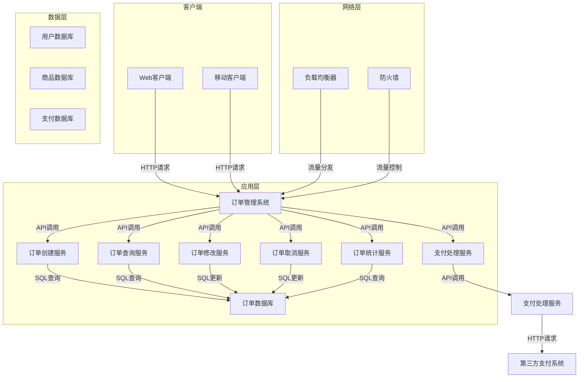
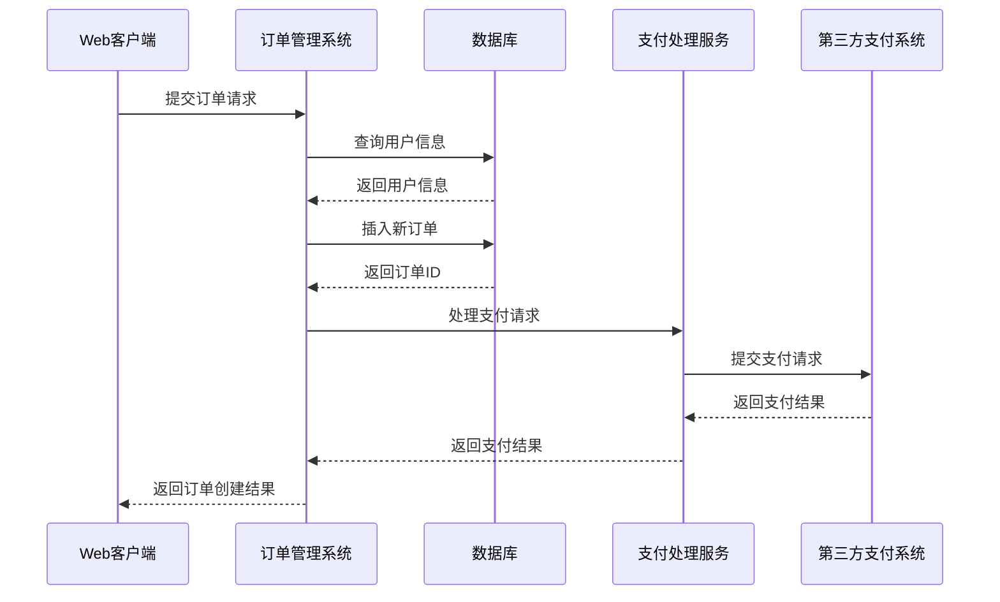

                 


### 1.1.1 企业在动荡时期面临的挑战

在当今全球化和技术快速变革的时代，企业面临的动荡和不确定性比以往任何时候都要多。首先，技术进步带来的影响是深远而广泛的。人工智能、云计算、大数据、物联网等新技术的兴起，不仅改变了企业的运营模式，也带来了前所未有的机遇和挑战。比如，自动化和智能化的进程可能会导致某些工作岗位的消失，但同时也创造了新的就业机会。企业需要快速适应这些变化，否则就会落后。

其次，市场环境的快速变化也是一个巨大的挑战。消费者的需求日益多样化和个性化，市场的不确定性增加，竞争也变得更加激烈。这种环境下，企业需要具备灵活的响应能力和强大的创新能力，以便在激烈的市场竞争中脱颖而出。

再者，全球经济形势的波动也是企业不可忽视的因素。贸易战、地缘政治风险、自然灾害等都会对企业的供应链、资金流和市场拓展产生直接影响。企业必须在风险管理和危机应对方面做好充分准备，才能在动荡中保持稳定。

### 1.1.2 危机领导力的重要性

在动荡时期，危机领导力显得尤为重要。首先，危机领导者能够保持冷静和清晰的头脑，迅速分析形势，做出合理的决策。这种能力在不确定性极高的环境中尤为宝贵。其次，危机领导者能够有效地传递信息，稳定团队成员的情绪，防止恐慌和混乱。有效的沟通是危机领导力的核心之一。

此外，危机领导者还具备强大的执行力和组织协调能力。在危机中，需要迅速调动资源和力量，进行有效的协调和整合，确保各项决策能够迅速落地执行。最后，危机领导者能够激励团队成员，增强团队的凝聚力和战斗力，共同面对困难。

总的来说，危机领导力是企业在动荡时期保持稳定和持续发展的关键。通过培养和发挥危机领导力，企业可以更好地应对外部挑战，保持竞争力。

### 1.2.1 危机领导力的定义

危机领导力是指在面对突发危机或重大挑战时，领导者能够迅速适应变化、保持冷静、有效决策和积极应对的能力。这种能力不仅包括技术和策略层面的应对措施，更涉及到心理素质和领导艺术的综合运用。

首先，危机领导者需要具备敏锐的洞察力和快速反应能力。在危机爆发初期，领导者需要能够迅速判断形势，预见潜在的风险，并制定应对策略。这种能力要求领导者具备广泛的知识储备和丰富的实践经验。

其次，危机领导者需要具备坚定的信念和意志力。在面对复杂和多变的环境时，领导者需要保持冷静和理性，不受恐慌情绪的影响，做出正确的决策。此外，领导者还需要具备强大的执行力，确保决策能够迅速转化为实际行动。

最后，危机领导者需要具备优秀的沟通能力和团队合作精神。在危机中，信息的准确传递和团队的协作至关重要。领导者需要能够有效地与团队成员沟通，调动各方资源，形成合力，共同应对挑战。

总之，危机领导力是领导者综合素质的体现，它不仅要求领导者具备专业知识和技能，还需要具备良好的心理素质和领导能力。

### 1.2.2 危机领导力的边界与外延

危机领导力的边界与外延涉及到其应用范围和核心要素。首先，从应用范围来看，危机领导力不仅适用于企业内部的管理和运营，也广泛应用于公共管理、金融管理、教育管理等多个领域。在任何需要应对突发危机和挑战的场合，危机领导力都发挥着关键作用。

其次，从核心要素来看，危机领导力包括以下几个关键方面：

1. **应急响应机制**：这是危机领导力的基础，涉及建立快速响应机制、制定应急预案和演练等。应急响应机制的有效性直接关系到危机处理的速度和质量。

2. **决策能力**：危机领导者需要具备快速决策的能力，包括风险评估、方案选择和执行监督。决策能力是危机领导力的核心，决定了危机应对的成功与否。

3. **沟通能力**：危机领导者需要具备卓越的沟通技巧，包括向上级汇报、向下级传达信息和团队协作。有效的沟通可以稳定团队情绪，减少误解和恐慌。

4. **团队建设**：危机领导者需要构建一个高效、协作的团队，确保团队成员在危机中能够紧密配合，发挥各自的优势。团队建设是危机领导力的重要组成部分。

5. **持续学习**：危机领导者需要不断学习和更新知识，提高自身的能力和素质，以适应不断变化的环境和挑战。持续学习是危机领导力发展的动力。

通过以上核心要素的运用，危机领导者可以在动荡中保持团队稳定，确保企业或组织在危机中能够快速恢复和持续发展。

### 1.3.1 关键概念解析

为了深入理解危机领导力的核心原理，我们需要解析几个关键概念，包括领导力、危机管理、应急响应和团队合作。以下是这些概念的定义和相互关系。

1. **领导力**：
领导力是指领导者通过影响、激励和引导他人，实现组织目标的能力。领导力不仅包括权威和决策能力，还涉及到沟通、信任和激励等关键要素。在危机领导中，领导力表现为领导者如何在不确定性和压力下，保持冷静，做出明智的决策，并带领团队共同应对挑战。

2. **危机管理**：
危机管理是指组织在面临外部和内部威胁时，通过系统化的方法和措施，以减少危机带来的负面影响，并迅速恢复正常运营的过程。危机管理涉及风险评估、应急预案、危机响应和恢复阶段。危机管理是危机领导力的核心，它要求领导者具备预见性和快速响应能力，以降低危机的严重程度。

3. **应急响应**：
应急响应是危机管理的重要组成部分，指的是组织在危机爆发后，迅速采取行动，以减轻危机影响和风险的过程。应急响应包括紧急决策、资源调配、信息传递和现场指挥等。应急响应要求领导者具备快速决策和执行能力，确保危机能够在最短时间内得到有效控制。

4. **团队合作**：
团队合作是指团队成员为了共同目标，通过有效沟通和协作，共同完成任务的过程。在危机中，团队合作尤为重要，因为它可以增强团队的凝聚力，提高响应速度和效率。团队合作要求领导者建立有效的沟通机制，明确分工和责任，激励团队成员，并在危机中保持团队的稳定和协同。

**相互关系**：
领导力、危机管理、应急响应和团队合作之间存在着密切的相互关系。领导力是危机管理的核心，决定了危机应对的效果；而危机管理和应急响应则是领导力在实际操作中的具体体现。团队合作是危机管理的重要支撑，通过团队合作，可以提高危机应对的效率和质量。四个概念相互关联，共同构成了危机领导力的基础。

### 1.3.2 概念属性特征对比表

为了更好地理解危机领导力的核心概念，我们构建了一个概念属性特征对比表，对领导力、危机管理、应急响应和团队合作这四个关键概念进行详细比较。

| 概念         | 领导力               | 危机管理             | 应急响应             | 团队合作             |
|--------------|----------------------|----------------------|----------------------|----------------------|
| 定义         | 通过影响和激励实现目标 | 应对危机的系统方法   | 紧急情况下快速行动   | 共同完成任务         |
| 主要特征     | 沟通、信任、激励     | 风险评估、预案制定   | 快速决策、资源调配   | 沟通、协作、共同目标 |
| 关键要素     | 权威、决策、信任     | 应急预案、危机响应   | 紧急决策、执行效率   | 分工明确、目标一致   |
| 应用场景     | 企业内部管理         | 企业、公共管理       | 突发事件处理         | 项目执行、团队任务   |
| 目标         | 实现组织目标         | 减少危机影响         | 减轻危机影响         | 提高任务完成率       |
| 彼此关系     | 决策和沟通的基础     | 应急响应的前提       | 危机管理的实施       | 实现目标的保障       |

通过这个对比表，我们可以更清晰地看到各个概念的核心特征和应用场景，以及它们之间的相互关系。这种对比有助于我们更深入地理解危机领导力的内涵和实施要点。

### 1.3.3 ER实体关系图

为了更好地理解危机领导力的核心概念及其相互关系，我们使用Mermaid绘制了一个ER（实体关系）图。ER图可以帮助我们可视化地展示领导力、危机管理、应急响应和团队合作之间的实体及其关系。

```mermaid
erDiagram
  Leadership ||--|{ CrisisManagement }|-- EmergencyResponse
  Leadership ||--|{ Team Collaboration }|
  CrisisManagement ||--|{ EmergencyResponse }
  EmergencyResponse ||--|{ CrisisManagement }
  Team Collaboration ||--|{ Leadership }
```

**图1.3.3 ER实体关系图**

在这个ER图中：

- **领导力（Leadership）** 是核心实体，它与**危机管理（CrisisManagement）**、**应急响应（EmergencyResponse）** 和**团队合作（Team Collaboration）** 都有直接关系。
- **危机管理（CrisisManagement）** 和**应急响应（EmergencyResponse）** 之间存在双向箭头，表示这两个概念是相互关联的，危机管理为应急响应提供策略和框架，而应急响应则是危机管理实施的具体行动。
- **团队合作（Team Collaboration）** 直接连接到领导力，这表明团队合作是领导力在实践中的重要组成部分，有助于实现领导力目标。

通过这个ER图，我们可以更直观地看到危机领导力中各个关键概念之间的关系，有助于我们理解和分析这些概念在实际操作中的应用。

### 2.1.1 危机领导者的心态

在动荡时期，危机领导者的心态至关重要。首先，危机领导者需要具备高度的适应性。面对快速变化的环境和未知的风险，领导者需要能够迅速调整心态，从过去的成功经验中解脱出来，迎接新的挑战。适应性意味着领导者不仅要接受变化，还要主动引领变化，推动团队不断进步。

其次，危机领导者需要保持冷静和清晰的头脑。在危机中，情绪波动和恐慌可能会迅速蔓延，影响整个团队的决策和行动。因此，领导者必须学会控制情绪，保持冷静，以便做出理性、明智的决策。冷静的态度有助于领导者更全面地评估形势，找到最佳的应对策略。

此外，危机领导者需要具备坚定的信念和决心。在危机中，领导者可能会面临巨大的压力和质疑，甚至可能遭遇失败。然而，坚定的信念和决心是领导者克服困难、带领团队走向成功的关键。领导者需要相信自己的决策和团队的能力，不断激励自己和团队成员，共同面对挑战。

最后，危机领导者需要具备乐观的心态。乐观的心态可以帮助领导者看到危机中的机遇，激发团队的创造力和积极性。即使在最艰难的时刻，领导者也要保持积极向上的态度，鼓励团队成员寻找解决问题的方法，而不是沉浸在负面情绪中。

通过这些心态的调整，危机领导者可以更好地应对动荡时期带来的挑战，保持团队的稳定和战斗力。

### 2.1.2 应对危机的思维模式

危机领导者需要具备独特的思维模式，以便在动荡时期做出快速而有效的决策。首先，全局思维是危机领导者不可或缺的能力。全局思维要求领导者不仅关注眼前的具体问题，还要从整体和长远的角度审视危机，找到根本原因和潜在解决方案。通过全局思维，领导者可以避免片面和短视的决策，确保应对策略具有可持续性和系统性。

其次，危机领导者需要具备快速决策的能力。在危机中，时间往往非常紧迫，领导者需要能够在有限的时间内做出合理、明智的决策。快速决策不仅要求领导者具备丰富的经验和专业知识，还需要领导者能够迅速分析和处理大量信息，从多个角度评估潜在的风险和收益。

此外，危机领导者需要具备灵活应变的能力。危机环境多变，领导者需要能够根据实际情况灵活调整策略和计划。灵活应变要求领导者具备开放的心态，能够接受新的观点和建议，同时具备迅速调整思维和行动的能力。

最后，危机领导者需要具备预见性思维。预见性思维使领导者能够在危机爆发之前预见潜在的风险和挑战，提前做好准备。这种能力依赖于领导者的洞察力和经验积累，通过不断学习和实践，领导者可以更好地预测未来的趋势和变化，从而在危机中占据主动。

通过全局思维、快速决策、灵活应变和预见性思维，危机领导者可以更加有效地应对动荡时期的挑战，确保团队在危机中保持稳定和持续发展。

### 2.2.1 沟通的重要性

沟通是危机领导力的核心要素之一，其重要性不容忽视。首先，有效的沟通能够确保信息的准确传递。在危机中，信息的及时、准确传递对于决策和行动至关重要。如果信息传递出现偏差，可能会导致错误的决策和行动，进一步加剧危机的影响。因此，危机领导者必须确保信息的透明和及时，避免因信息不对称而导致误解和混乱。

其次，沟通能够增强团队的凝聚力。在危机中，团队成员可能会因为不确定性和压力而感到恐慌和不安。有效的沟通可以帮助领导者稳定团队成员的情绪，增强他们的信心，提高团队的凝聚力。通过沟通，领导者可以传递积极的信息，鼓励团队成员共同面对挑战，共同寻找解决问题的方法。

此外，沟通还能够促进团队合作。在危机中，各个部门和团队成员需要紧密协作，共同应对挑战。有效的沟通可以促进信息的共享和资源的整合，使团队成员能够更好地了解各自的角色和任务，提高协作效率。沟通还可以帮助领导者了解团队成员的需求和意见，及时调整策略和计划，确保团队在危机中保持高效运作。

最后，沟通有助于建立信任和尊重。在危机中，领导者需要通过沟通建立与团队成员之间的信任和尊重。信任是团队合作的基础，只有建立了信任，团队成员才会愿意听从领导者的指挥，积极参与危机应对。通过沟通，领导者可以展示自己的专业能力和领导力，赢得团队成员的信任和尊重。

总之，沟通在危机领导中扮演着至关重要的角色。通过有效的沟通，危机领导者可以确保信息的准确传递，增强团队的凝聚力，促进团队合作，建立信任和尊重，从而在危机中保持团队的稳定和高效运作。

### 2.2.2 沟通策略与方法

在危机中，有效的沟通策略和方法是危机领导者成功应对挑战的关键。首先，主动沟通是危机领导者应采取的重要策略之一。主动沟通意味着领导者要主动寻找并传递信息，而不是等待团队成员来询问。通过主动沟通，领导者可以确保信息的及时性和准确性，减少信息传递过程中的误解和滞后。

其次，透明沟通是危机领导者必须坚持的原则。在危机中，信息的不透明往往会导致团队成员的恐慌和不安。因此，领导者应尽量保持信息的透明，向团队成员公开危机的真相和应对措施，使他们能够了解实际情况，增强信心。透明沟通还可以帮助领导者建立与团队成员之间的信任，提高团队的凝聚力。

第三，及时沟通是危机领导中不可或缺的方法。危机往往具有突发性和紧急性，领导者需要能够迅速做出反应，及时沟通决策和行动。及时沟通可以确保团队成员在危机中能够迅速响应，减少决策和行动的时间滞后，提高应对效率。

第四，多层次沟通是确保信息全面传递的有效方法。领导者不仅要与核心团队成员沟通，还需要与不同部门和层级的人员进行沟通，确保信息的广泛传递。通过多层次沟通，领导者可以确保信息在不同层级和部门之间的有效传递，避免信息断层和误解。

最后，情感沟通是危机领导者不能忽视的一部分。在危机中，团队成员可能会感到恐惧、焦虑和不安。领导者需要通过情感沟通，表达对团队成员的关心和支持，帮助他们缓解情绪，增强信心。情感沟通不仅能够提高团队成员的士气，还可以增强团队的凝聚力。

总之，通过主动沟通、透明沟通、及时沟通、多层次沟通和情感沟通，危机领导者可以确保信息的准确传递和团队的稳定，从而在危机中保持高效运作。

### 2.3.1 团队动态与管理

在危机中，团队动态与管理是确保团队稳定和高效运作的关键。首先，了解团队动态是危机领导者必须掌握的能力。团队动态包括团队成员的情绪状态、工作态度、沟通方式和协作效果等方面。领导者需要通过观察和沟通，了解团队成员在危机中的表现和心理状态，从而制定相应的管理策略。

其次，建立高效的沟通机制是团队动态管理的核心。在危机中，团队成员需要能够快速、准确地传达信息，确保决策和行动的一致性。领导者应建立多层次、多渠道的沟通机制，包括定期会议、即时通讯和邮件等，确保信息在不同层级和部门之间的有效传递。

第三，明确团队目标和角色分工是确保团队协作的重要措施。在危机中，团队目标应明确且具有可操作性，团队成员应清楚自己的角色和职责。通过明确目标和角色分工，可以提高团队的工作效率，减少因职责不清而导致的冲突和低效。

第四，灵活调整管理策略是应对团队动态变化的关键。在危机中，团队动态可能会发生快速变化，领导者需要能够灵活调整管理策略，以适应新的情况。这包括根据团队成员的表现和需求，调整任务分配和工作压力，以及根据危机的进展，调整团队目标和策略。

最后，鼓励团队成员之间的协作和互相支持是增强团队凝聚力的重要手段。在危机中，团队成员可能会面临巨大的压力和困难，领导者需要通过鼓励和支持，帮助他们克服困难，增强信心。通过团队协作和互相支持，可以提高团队的整体效率和战斗力。

通过了解团队动态、建立高效沟通机制、明确目标和角色分工、灵活调整管理策略和鼓励团队协作，危机领导者可以确保团队在危机中保持稳定和高效运作，从而更好地应对挑战。

### 2.3.2 建立高效的危机应对团队

在危机中，建立一支高效的危机应对团队至关重要。首先，选拔合适的团队成员是关键。领导者需要根据危机的类型和特点，选择具备相关技能和经验的人才，确保团队拥有足够的资源和能力来应对挑战。团队成员应具备敏锐的洞察力、快速决策能力和高效的执行力。

其次，明确团队目标和职责分工是确保团队高效运作的基础。在组建危机应对团队时，领导者应明确团队的整体目标和各成员的具体职责，确保团队成员清楚自己的任务和责任。通过明确目标和职责分工，可以提高团队的工作效率，减少因职责不清而导致的冲突和低效。

第三，建立有效的沟通机制是团队协作的重要保障。领导者应建立多层级、多渠道的沟通机制，包括定期会议、即时通讯和邮件等，确保信息在不同层级和部门之间的有效传递。通过有效的沟通，团队成员可以迅速了解危机的最新动态和应对策略，确保决策和行动的一致性。

第四，制定应急预案和演练是提高团队应对能力的有效手段。领导者应制定详细的应急预案，明确危机应对的具体步骤和措施，并定期组织团队进行演练，确保团队成员熟悉应急预案的操作流程，提高实际应对能力。

最后，鼓励团队成员之间的协作和互相支持是增强团队凝聚力和战斗力的关键。在危机中，团队成员可能会面临巨大的压力和困难，领导者需要通过鼓励和支持，帮助他们克服困难，增强信心。通过团队协作和互相支持，可以提高团队的整体效率和战斗力。

通过选拔合适的团队成员、明确目标和职责分工、建立有效的沟通机制、制定应急预案和演练，以及鼓励团队协作和互相支持，领导者可以建立一支高效的危机应对团队，确保团队在危机中能够迅速响应，有效应对挑战。

### 2.4.1 决策框架

在危机中，决策框架是危机领导者进行有效决策的重要工具。一个完善的决策框架应包括以下几个关键要素：

首先，问题定义是决策框架的基础。领导者需要明确危机的本质和影响范围，将问题具体化和量化，以便更好地分析和应对。这包括明确危机的类型（如财务危机、市场危机、技术危机等）和影响程度（如对公司业绩、客户关系、员工士气等的影响）。

其次，目标设定是决策框架的核心。领导者应根据问题定义，设定明确的决策目标，确保决策方向与整体战略目标一致。目标应具有可衡量性，以便在决策过程中进行评估和调整。

第三，方案生成是决策框架的关键环节。领导者需要广泛收集信息，分析各种可能的解决方案，并评估其优缺点。在此过程中，领导者应鼓励团队成员提出创新性的解决方案，以最大化决策的多样性和灵活性。

第四，评估与选择是决策框架的重要组成部分。领导者应根据目标设定和方案生成的结果，对各个方案进行评估，选择最优方案。评估应包括方案的成本、风险、效益等方面，确保决策具有可行性和可持续性。

最后，执行与监控是决策框架的保障。领导者需要确保决策得到有效执行，并对决策过程进行持续监控和调整。通过定期评估和反馈，领导者可以及时发现和解决执行过程中出现的问题，确保决策目标的实现。

通过以上要素的有机结合，决策框架可以帮助危机领导者系统化地进行决策，提高决策的质量和效率。

### 2.4.2 高效决策策略

在危机中，制定高效决策策略至关重要。首先，领导者需要具备快速决策的能力。快速决策不仅要求领导者能够迅速分析局势，还要能够果断做出决策，避免因犹豫不决而错失最佳时机。为此，领导者可以借助经验法则和快速决策模型，如决策树和马尔可夫决策过程，以提高决策速度。

其次，多元化决策团队的建设是提高决策质量的关键。领导者应组建一个由不同专业背景和经验的人才组成的多元化团队，通过集体智慧和跨部门协作，提高决策的全面性和准确性。此外，领导者还应鼓励团队成员提出不同的意见和建议，避免“群体思维”现象，确保决策具有多样性和创新性。

第三，利用数据分析和模拟技术是制定高效决策策略的重要手段。通过大数据分析和机器学习算法，领导者可以获取更全面和准确的信息，预测危机的发展趋势和潜在风险，从而制定更具预见性的决策。同时，利用模拟技术，领导者可以在虚拟环境中测试各种决策方案，评估其可能的结果，选择最优方案。

第四，领导者需要具备灵活调整决策的能力。在危机中，情况可能瞬息万变，领导者需要能够根据实际情况迅速调整决策，以适应新的变化。为此，领导者应保持开放的心态，不断收集反馈信息，及时调整决策策略，确保决策与实际情况保持一致。

最后，领导者需要建立有效的决策反馈机制。通过定期回顾和评估决策效果，领导者可以总结经验教训，不断优化决策过程，提高决策的效率和质量。

通过快速决策、多元化决策团队、数据分析和模拟技术、灵活调整决策以及有效的决策反馈机制，危机领导者可以制定出高效的决策策略，确保在动荡中保持团队的稳定和持续发展。

### 2.5.1 危机领导者的学习路径

成为一位高效的危机领导者，持续学习是不可或缺的。首先，危机领导者应注重理论学习。系统学习领导力、危机管理、心理学、战略规划等领域的知识，可以为他们提供理论依据和思维方式。推荐书籍如《危机领导力》、《领导者的选择》等，都是值得推荐的经典读物。

其次，实践经验是提升危机领导力的重要途径。通过参与实际项目，领导者可以在面对真实危机时积累宝贵的经验。这包括参与应急演练、模拟危机场景，以及在实战中不断调整和优化决策策略。此外，与行业专家交流、参加专业培训和研讨会，也是获取实战经验的有效方式。

第三，技术学习对于现代危机领导者尤为重要。随着技术的快速发展，危机领导者需要掌握大数据分析、人工智能、物联网等前沿技术。这些技术不仅可以帮助领导者更好地预测和应对危机，还能提升决策的科学性和效率。例如，通过学习机器学习算法，领导者可以更准确地评估危机的影响和趋势。

最后，建立学习网络是持续学习的保障。危机领导者应积极建立和维护一个由同行、专家和顾问组成的学习网络。这个网络不仅可以提供最新的行业信息和专业知识，还能在危机中为领导者提供支持和建议。通过不断学习和交流，危机领导者可以不断提升自己的专业素养和领导能力。

总之，通过理论学习、实践经验、技术学习和建立学习网络，危机领导者可以不断完善自己的知识体系和能力结构，从而在动荡中保持团队的稳定和持续发展。

### 2.5.2 持续改进的重要性

持续改进是危机领导者提升自身能力和团队效能的关键因素。在快速变化的环境中，危机领导者需要具备不断适应和优化的能力，以确保团队能够在动态的挑战中保持竞争优势。

首先，持续改进有助于增强危机应对的灵活性和适应性。通过定期回顾和评估决策和行动的效果，领导者可以识别出不足之处，并迅速采取纠正措施。这种方法不仅提高了决策的质量，还使团队能够更快地响应新的挑战。

其次，持续改进能够促进知识共享和团队协作。通过建立反馈机制和知识库，团队成员可以分享最佳实践和经验教训，从而避免重复错误，提高整体工作效率。这种知识共享的过程不仅加强了团队的凝聚力，还提高了团队的创新能力。

再者，持续改进有助于建立学习型组织文化。在持续改进的过程中，团队成员会逐渐养成自我反思和不断学习的好习惯。这种文化氛围不仅有助于培养危机领导者，还能激发团队成员的积极性和创造力，从而在长期内提升团队的整体素质。

最后，持续改进能够提高组织的适应能力。面对不确定性和复杂性的增加，组织需要具备快速适应变化的能力。通过持续改进，领导者可以确保团队能够在不断变化的环境中保持高效和稳定，从而实现组织的长期目标。

总之，持续改进是危机领导者提升自身能力和团队效能的重要手段。通过不断学习和优化，领导者可以确保团队在动荡中保持稳定，持续发展，并在竞争中脱颖而出。

### 3.1.1 决策树算法

决策树算法是一种常见的监督学习算法，主要用于分类和回归任务。其基本思想是通过一系列特征划分来构建一棵树，树的每个节点代表一个特征，每个分支代表该特征的某个取值，最终达到分类或回归的目的。

#### 3.1.1.1 决策树的基本概念

决策树由内部节点、叶节点和分支组成。内部节点表示某个特征的取值，叶节点表示最终分类或回归结果。每个内部节点对应一个特征，每个叶节点对应一个类标签或一个数值。

#### 3.1.1.2 决策树的构建过程

决策树的构建过程主要包括以下几个步骤：

1. **特征选择**：选择一个最优特征进行划分。常用的特征选择方法包括信息增益、基尼不纯度等。
2. **划分**：根据最优特征的不同取值，将数据集划分为多个子集。
3. **递归构建**：对每个子集重复上述步骤，直到满足停止条件（如最大深度、最小叶节点样本数等）。
4. **生成决策树**：将所有叶节点连接起来，形成一棵完整的决策树。

#### 3.1.1.3 决策树的评估与优化

决策树的评估通常使用交叉验证或测试集来评估模型的性能。常用的评估指标包括准确率、精确率、召回率、F1值等。

为了优化决策树，可以采取以下几种方法：

1. **剪枝**：通过剪枝可以减少决策树的复杂度，提高模型的可解释性和泛化能力。
2. **特征选择**：通过选择更具有区分度的特征，可以提高决策树的性能。
3. **集成方法**：如随机森林、梯度提升树等，通过集成多个决策树可以提高模型的稳定性和准确性。

### 3.1.2 机器学习算法

机器学习算法是一类通过数据训练模型，使其能够对未知数据进行预测或分类的算法。以下介绍几种常见的机器学习算法：

#### 3.1.2.1 监督学习算法

1. **线性回归**：通过拟合一条直线来预测连续值。
2. **逻辑回归**：用于二分类问题，通过拟合一个逻辑函数来计算概率。
3. **决策树**：通过构建决策树来进行分类或回归。
4. **支持向量机（SVM）**：通过找到一个最优的超平面来分隔不同类别的数据。

#### 3.1.2.2 无监督学习算法

1. **聚类算法**：如K-means、层次聚类等，用于将数据分为多个簇。
2. **降维算法**：如PCA（主成分分析）、t-SNE等，用于减少数据的维度。
3. **关联规则学习**：如Apriori算法，用于发现数据之间的关联关系。

#### 3.1.2.3 强化学习算法

1. **Q学习**：通过学习值函数来选择最佳动作。
2. **深度强化学习**：结合深度神经网络和强化学习，用于解决复杂决策问题。

#### 3.1.2.4 机器学习的挑战与解决方案

1. **数据质量**：解决数据缺失、噪声和异常值等问题。
2. **过拟合**：通过交叉验证、正则化、剪枝等方法来避免过拟合。
3. **可解释性**：提高模型的透明度和可解释性，以便用户理解和信任。
4. **计算效率**：通过并行计算、分布式计算等技术来提高训练速度和模型规模。

通过以上算法和解决方案，机器学习可以为危机领导者提供强大的决策支持，帮助他们更好地应对复杂和不确定的环境。

### 3.2.1 决策模型的数学描述

决策模型是一种通过数学方法来分析和解决决策问题的工具。在决策模型中，我们通常使用数学公式来描述问题的目标、约束条件和决策变量，以便找到最优或次优解。

#### 3.2.1.1 决策问题建模

一个典型的决策问题可以表示为以下数学形式：

$$
\text{目标函数}: \quad \min_{x} \, f(x)
$$

其中，$f(x)$ 表示需要最小化或最大化的目标函数，$x$ 是决策变量。目标函数可以根据具体问题的不同而变化，如最大化利润、最小化成本、最大化满意度等。

#### 3.2.1.2 目标函数

目标函数是决策模型的核心，用于衡量决策变量优劣的标准。以下是一些常见的目标函数：

1. **线性目标函数**：
   $$
   \min_{x} \, c^T x
   $$
   其中，$c$ 是一个向量，表示目标函数的系数。

2. **二次目标函数**：
   $$
   \min_{x} \, \frac{1}{2}x^T Q x + c^T x
   $$
   其中，$Q$ 是一个对称正定矩阵，$c$ 是一个向量。

3. **多目标函数**：
   $$
   \min_{x} \, \max(f_1(x), f_2(x), ..., f_n(x))
   $$
   其中，$f_1(x), f_2(x), ..., f_n(x)$ 是多个目标函数。

#### 3.2.1.3 约束条件

决策模型通常需要满足一定的约束条件。这些约束条件可以用以下形式表示：

$$
g_i(x) \leq 0, \quad h_j(x) = 0
$$

其中，$g_i(x)$ 是不等式约束，$h_j(x)$ 是等式约束。常见的约束条件包括线性约束、非线性约束、整数约束等。

#### 3.2.1.4 约束条件示例

1. **线性约束**：
   $$
   ax + by \leq c
   $$
   其中，$a, b, c$ 是已知常数，$x, y$ 是决策变量。

2. **非线性约束**：
   $$
   x^2 + y^2 \leq r^2
   $$
   其中，$r$ 是半径，$x, y$ 是决策变量。

3. **整数约束**：
   $$
   x \in \{0, 1\}
   $$
   其中，$x$ 是决策变量，只允许取0或1的值。

通过目标函数和约束条件的组合，决策模型可以描述各种不同类型的决策问题，并使用数学方法求解最优解。

### 3.2.2 概率模型

概率模型在决策过程中发挥着关键作用，特别是在不确定性和风险分析方面。概率模型通过数学方法描述随机事件及其相互关系，帮助决策者理解和量化不确定性，从而做出更明智的决策。以下介绍几种常见的概率模型及其基本概念。

#### 3.2.2.1 贝叶斯定理

贝叶斯定理是概率模型中最基本且最重要的定理之一。它描述了在已知某些条件下的概率如何通过先验概率和条件概率进行更新。贝叶斯定理的公式为：

$$
P(A|B) = \frac{P(B|A)P(A)}{P(B)}
$$

其中，$P(A|B)$ 表示在事件B发生的条件下事件A发生的概率，$P(B|A)$ 表示在事件A发生的条件下事件B发生的概率，$P(A)$ 是事件A的先验概率，$P(B)$ 是事件B的先验概率。

贝叶斯定理在决策中的应用非常广泛，如风险分析、信用评分、医疗诊断等。通过贝叶斯定理，决策者可以根据新的证据不断更新先验概率，从而提高决策的准确性和可靠性。

#### 3.2.2.2 概率分布函数

概率分布函数是描述随机变量取值的概率分布情况的重要工具。常见的概率分布函数包括：

1. **伯努利分布**：用于描述只有两种可能结果的随机事件，如硬币的正反面、成功或失败的概率。

2. **二项分布**：用于描述在一定次数的独立重复试验中，成功次数的概率分布。二项分布是伯努利分布的推广。

3. **正态分布**：也称为高斯分布，是最常见和最重要的概率分布之一。它描述了数据集的平均值和标准差之间的关系，广泛应用于统计分析和数据建模。

4. **泊松分布**：用于描述在一定时间段内，事件发生的次数的概率分布。它适用于描述罕见事件的发生频率。

概率分布函数在决策中的应用包括数据建模、风险评估、预测分析等。通过分析概率分布函数，决策者可以更好地理解随机事件的不确定性，并制定相应的应对策略。

#### 3.2.2.3 最大似然估计

最大似然估计是一种常用的参数估计方法，用于根据观测数据推断模型参数的值。最大似然估计的基本思想是找到一组参数值，使得观测数据的概率最大。

设随机变量$X_1, X_2, ..., X_n$的联合概率分布为$p(X_1, X_2, ..., X_n | \theta)$，其中$\theta$是参数向量。最大似然估计的目标是找到$\theta$的估计值$\hat{\theta}$，使得观测数据出现的概率最大：

$$
\hat{\theta} = \arg\max_{\theta} \, p(X_1, X_2, ..., X_n | \theta)
$$

最大似然估计在决策中的应用包括参数估计、模型选择和预测等。通过最大似然估计，决策者可以更好地理解数据和模型之间的关系，从而提高决策的准确性和有效性。

### 4.1.1 问题场景介绍

为了更好地理解系统分析与架构设计，我们需要首先介绍一个具体的问题场景。假设我们正在为一家电子商务公司开发一个全新的订单管理系统。这个系统需要能够处理大量的订单数据，支持订单的创建、修改、查询和取消功能，并且要求系统具有较高的性能和稳定性。

在这个问题场景中，我们面临的主要挑战包括：

1. **性能需求**：系统需要能够快速响应用户的订单请求，确保订单处理的高效性。特别是在高峰期，系统需要能够处理大量并发请求，不会出现性能瓶颈。

2. **数据一致性**：在分布式环境下，系统需要保证数据的强一致性，确保订单数据的准确性和完整性。例如，当多个用户同时提交订单时，系统应确保所有订单都被正确处理，避免数据丢失或重复。

3. **系统扩展性**：系统设计需要考虑到未来的扩展需求，能够支持业务规模的增长和功能的扩展。例如，未来可能需要增加新的订单处理逻辑或集成第三方服务。

4. **安全性**：系统需要确保用户订单数据的安全，防止数据泄露和未经授权的访问。特别是在涉及敏感信息（如支付信息）时，需要采取严格的加密和认证措施。

通过分析这个具体问题场景，我们可以更清楚地了解系统分析与架构设计的核心要求和挑战，为后续的系统设计和实现提供指导。

### 4.1.2 系统功能设计

在了解了具体问题场景后，我们需要对订单管理系统进行功能设计。系统功能设计包括定义系统的核心功能模块和接口，以便在实现阶段能够有清晰的方向和目标。

#### 4.1.2.1 核心功能模块

订单管理系统的核心功能模块主要包括以下几个部分：

1. **订单创建模块**：负责处理用户提交的订单请求，包括订单信息的验证、存储和初步处理。

2. **订单查询模块**：提供用户查询订单状态和详细信息的接口，支持按订单ID、用户ID等多种查询方式。

3. **订单修改模块**：允许用户修改订单信息，如更改收货地址、商品数量等。

4. **订单取消模块**：允许用户取消订单，并更新订单状态。

5. **订单统计模块**：提供订单数据的统计分析功能，如订单量、销售额等，为管理层提供决策支持。

6. **支付处理模块**：与第三方支付系统集成，处理订单支付过程，确保支付的安全性和可靠性。

7. **日志记录模块**：记录系统运行过程中的关键操作和异常信息，便于问题追踪和调试。

#### 4.1.2.2 系统接口设计

为了实现系统的功能，我们需要设计一系列接口，这些接口将不同模块连接起来，确保系统各部分能够协同工作。以下是几个关键接口的设计：

1. **订单创建接口**：
   - **功能**：接收用户提交的订单信息，并进行初步验证和存储。
   - **输入参数**：用户ID、订单详情（商品ID、数量、价格等）。
   - **输出参数**：订单ID、创建结果（成功或失败）。

2. **订单查询接口**：
   - **功能**：根据订单ID或用户ID查询订单详情。
   - **输入参数**：订单ID或用户ID。
   - **输出参数**：订单详情（包括状态、商品信息等）。

3. **订单修改接口**：
   - **功能**：修改订单信息，如更改收货地址、商品数量等。
   - **输入参数**：订单ID、修改详情。
   - **输出参数**：修改结果（成功或失败）。

4. **订单取消接口**：
   - **功能**：取消订单，并更新订单状态。
   - **输入参数**：订单ID。
   - **输出参数**：取消结果（成功或失败）。

5. **订单统计接口**：
   - **功能**：提供订单数据的统计分析。
   - **输入参数**：统计维度（如日期、订单状态等）。
   - **输出参数**：统计结果（如订单量、销售额等）。

6. **支付处理接口**：
   - **功能**：处理订单支付过程，与第三方支付系统交互。
   - **输入参数**：订单ID、支付信息。
   - **输出参数**：支付结果（成功或失败）。

通过详细的功能模块设计和接口定义，我们可以确保订单管理系统在功能实现阶段有明确的指导，从而提高系统的开发效率和可靠性。

#### 4.1.2.1 领域模型（Mermaid类图）

为了更好地理解订单管理系统的功能模块及其相互关系，我们可以使用Mermaid绘制一个领域模型类图。以下是一个简单的Mermaid类图示例，展示了订单管理系统中的核心实体及其关联关系。

```mermaid
classDiagram
  Order <<entity>> User
  Order <<entity>> Product
  Payment <<entity>> Order
  OrderDetail <<entity>> Order
  OrderStatus <<entity>> Order

  User {
    UserID
    Name
    Email
  }

  Product {
    ProductID
    Name
    Price
  }

  Order {
    OrderID
    UserID
    Status
    PaymentID
    OrderDetailID
  }

  Payment {
    PaymentID
    Amount
    Status
  }

  OrderDetail {
    OrderDetailID
    ProductID
    Quantity
  }

  OrderStatus {
    StatusID
    StatusName
  }

  User ..|> Order
  Product ..|> OrderDetail
  Payment ..|> Order
  Order ..|> OrderStatus
```

**图4.1.2.1 领域模型（Mermaid类图）**

在这个类图中：

- **User**：表示用户实体，拥有UserID、Name和Email等属性。
- **Product**：表示商品实体，拥有ProductID、Name和Price等属性。
- **Order**：表示订单实体，拥有OrderID、UserID、Status、PaymentID和OrderDetailID等属性，与User、Product、Payment和OrderStatus实体之间存在关联。
- **Payment**：表示支付实体，拥有PaymentID、Amount和Status等属性。
- **OrderDetail**：表示订单详情实体，拥有OrderDetailID、ProductID、Quantity等属性。
- **OrderStatus**：表示订单状态实体，拥有StatusID和StatusName等属性。

通过这个类图，我们可以清晰地看到订单管理系统中的核心实体及其关联关系，有助于我们理解系统的整体架构和功能设计。

### 4.1.3 系统架构设计

为了实现订单管理系统的功能需求，我们需要设计一个合理的系统架构，以确保系统的高性能、高可用性和可扩展性。以下是该系统的架构设计：

#### 4.1.3.1 系统架构图（Mermaid架构图）



**图4.1.3.1 系统架构图（Mermaid架构图）**

**系统架构设计说明：**

1. **客户端**：
   - **Web客户端**：用户通过浏览器访问系统，提交订单请求。
   - **移动客户端**：用户通过移动应用访问系统，提交订单请求。

2. **应用层**：
   - **服务端**：核心逻辑处理部分，包括多个服务模块，如订单创建服务、订单查询服务、订单修改服务、订单取消服务、订单统计服务和支付处理服务。
   - **数据库服务器**：存储订单数据、用户数据、商品数据和支付数据。

3. **网络层**：
   - **负载均衡器**：实现流量的分发和负载均衡，确保系统的高可用性。
   - **防火墙**：提供网络安全保障，防止恶意攻击和未经授权的访问。

4. **数据层**：
   - **订单数据库**：存储订单数据，包括订单详情、订单状态等。
   - **用户数据库**：存储用户数据，包括用户基本信息、订单历史等。
   - **商品数据库**：存储商品数据，包括商品基本信息、库存信息等。
   - **支付数据库**：存储支付数据，包括支付详情、支付状态等。

通过这个架构设计，订单管理系统可以实现高性能、高可用性和可扩展性，满足电子商务业务的需求。

### 4.1.4 系统接口设计

在系统架构设计的基础上，我们需要详细设计订单管理系统的接口，以便各模块之间能够高效地通信和协作。以下是几个关键接口的设计：

#### 4.1.4.1 订单创建接口

**接口描述：**
- **功能**：用于创建新订单。
- **输入参数**：用户ID、订单详情（包括商品ID、数量、价格等）。
- **输出参数**：订单ID、创建结果（成功或失败）。

**接口定义：**

```python
def create_order(user_id: int, order_details: List[OrderDetail]): 
    """
    创建新订单。

    :param user_id: 用户ID。
    :param order_details: 订单详情列表。
    :return: 订单ID和创建结果。
    """
    # 验证用户ID和订单详情
    # 存储订单信息到数据库
    # 返回订单ID和创建结果
    return order_id, "SUCCESS" if order_saved else "FAILURE"
```

#### 4.1.4.2 订单查询接口

**接口描述：**
- **功能**：用于查询订单详情。
- **输入参数**：订单ID或用户ID。
- **输出参数**：订单详情（包括状态、商品信息等）。

**接口定义：**

```python
def query_order(order_id: int = None, user_id: int = None): 
    """
    查询订单详情。

    :param order_id: 订单ID（可选）。
    :param user_id: 用户ID（可选）。
    :return: 订单详情。
    """
    # 根据输入参数查询订单
    # 返回订单详情
    return order_details
```

#### 4.1.4.3 订单修改接口

**接口描述：**
- **功能**：用于修改订单信息，如更改收货地址、商品数量等。
- **输入参数**：订单ID、修改详情。
- **输出参数**：修改结果（成功或失败）。

**接口定义：**

```python
def modify_order(order_id: int, modifications: Dict[str, Any]): 
    """
    修改订单信息。

    :param order_id: 订单ID。
    :param modifications: 修改详情。
    :return: 修改结果。
    """
    # 根据订单ID查询订单
    # 更新订单信息
    # 返回修改结果
    return "SUCCESS" if order_updated else "FAILURE"
```

#### 4.1.4.4 订单取消接口

**接口描述：**
- **功能**：用于取消订单，并更新订单状态。
- **输入参数**：订单ID。
- **输出参数**：取消结果（成功或失败）。

**接口定义：**

```python
def cancel_order(order_id: int): 
    """
    取消订单。

    :param order_id: 订单ID。
    :return: 取消结果。
    """
    # 根据订单ID查询订单
    # 更新订单状态为“已取消”
    # 返回取消结果
    return "SUCCESS" if order_cancelled else "FAILURE"
```

#### 4.1.4.5 订单统计接口

**接口描述：**
- **功能**：提供订单数据的统计分析功能。
- **输入参数**：统计维度（如日期、订单状态等）。
- **输出参数**：统计结果（如订单量、销售额等）。

**接口定义：**

```python
def order_statistics(stat_dimension: str): 
    """
    订单数据统计分析。

    :param stat_dimension: 统计维度。
    :return: 统计结果。
    """
    # 根据统计维度查询订单数据
    # 返回统计结果
    return stat_results
```

#### 4.1.4.6 支付处理接口

**接口描述：**
- **功能**：处理订单支付过程，与第三方支付系统交互。
- **输入参数**：订单ID、支付信息。
- **输出参数**：支付结果（成功或失败）。

**接口定义：**

```python
def process_payment(order_id: int, payment_info: Dict[str, Any]): 
    """
    处理订单支付。

    :param order_id: 订单ID。
    :param payment_info: 支付信息。
    :return: 支付结果。
    """
    # 与第三方支付系统交互
    # 返回支付结果
    return "SUCCESS" if payment_processed else "FAILURE"
```

通过详细设计这些接口，我们可以确保订单管理系统的各功能模块之间能够无缝集成，提高系统的可靠性和扩展性。

### 4.1.5 系统交互（Mermaid序列图）

为了更清晰地展示订单管理系统中的不同组件之间的交互过程，我们可以使用Mermaid绘制一个序列图。以下是一个示例序列图，描述了用户通过Web客户端提交订单、系统处理订单请求、返回结果的过程。



**图4.1.5 系统交互（Mermaid序列图）**

**序列图说明：**

1. 用户通过Web客户端提交订单请求。
2. 系统从数据库查询用户信息。
3. 系统向数据库插入新订单，并获取订单ID。
4. 系统调用支付处理服务，处理支付请求。
5. 支付处理服务与第三方支付系统交互，提交支付请求。
6. 第三方支付系统返回支付结果给支付处理服务。
7. 支付处理服务返回支付结果给系统。
8. 系统将订单创建结果返回给用户。

通过这个序列图，我们可以直观地理解订单管理系统中的各个组件如何协同工作，完成订单处理和支付流程。

### 5.1.1 环境安装

为了开始实际的项目开发，我们需要搭建一个合适的环境，其中包括操作系统、开发工具和依赖库的安装。以下是详细的安装步骤：

#### 1. 操作系统安装

首先，我们选择一个适合的开发环境。在这个例子中，我们将使用Ubuntu 20.04 LTS作为操作系统。以下是安装步骤：

1. **下载Ubuntu 20.04 LTS镜像**：
   访问Ubuntu官方网站下载Ubuntu 20.04 LTS的ISO镜像文件。

2. **创建USB启动盘**：
   使用工具（如Rufus）将下载的ISO镜像写入USB启动盘中。

3. **启动计算机并安装Ubuntu**：
   将USB启动盘插入计算机，重启计算机并从USB启动盘启动。按照提示完成Ubuntu的安装过程。

#### 2. 开发工具安装

安装开发工具，如Python和Visual Studio Code。

1. **安装Python**：
   打开终端，执行以下命令安装Python：

   ```bash
   sudo apt update
   sudo apt install python3 python3-pip
   ```

2. **安装Visual Studio Code**：
   访问Visual Studio Code官方网站下载.deb安装包，然后通过以下命令安装：

   ```bash
   sudo dpkg -i code_.deb
   ```

#### 3. 依赖库安装

安装项目所需的依赖库，包括Flask、SQLAlchemy和Pandas等。

1. **更新pip**：
   为了确保pip的最新版本，执行以下命令：

   ```bash
   python3 -m pip install --upgrade pip
   ```

2. **安装依赖库**：
   在Visual Studio Code中创建一个虚拟环境，然后通过以下命令安装依赖库：

   ```bash
   python3 -m venv venv
   source venv/bin/activate
   pip install flask sqlalchemy pandas
   ```

#### 4. 测试环境配置

确保所有组件正常运行，执行以下测试命令：

1. **测试Python环境**：

   ```bash
   python3 --version
   ```

2. **测试Flask环境**：

   ```bash
   flask --version
   ```

3. **测试SQLAlchemy环境**：

   ```bash
   python3 -c "from sqlalchemy import create_engine; create_engine('sqlite:///example.db')"
   ```

通过以上步骤，我们成功搭建了一个适合订单管理系统开发的环境，可以开始进行项目的实际开发。

### 5.1.2 系统核心实现源代码

在本节中，我们将详细讨论订单管理系统中的几个核心功能模块的实现源代码，并对其进行解读。

#### 5.1.2.1 订单创建模块

订单创建模块负责接收用户提交的订单请求，验证订单信息，并将其存储到数据库中。以下是订单创建模块的源代码：

```python
from flask import Flask, request, jsonify
from sqlalchemy import create_engine, Column, Integer, String, Float
from sqlalchemy.ext.declarative import declarative_base
from sqlalchemy.orm import sessionmaker

app = Flask(__name__)

# 数据库连接
engine = create_engine('sqlite:///orders.db')
Session = sessionmaker(bind=engine)
session = Session()

# 定义订单模型
Base = declarative_base()

class Order(Base):
    __tablename__ = 'orders'
    id = Column(Integer, primary_key=True)
    user_id = Column(Integer)
    status = Column(String(20))
    total_price = Column(Float)

# 创建数据库表
Base.metadata.create_all(engine)

@app.route('/orders', methods=['POST'])
def create_order():
    data = request.get_json()
    user_id = data['user_id']
    status = 'pending'
    total_price = data['total_price']

    new_order = Order(user_id=user_id, status=status, total_price=total_price)
    session.add(new_order)
    session.commit()

    return jsonify({'order_id': new_order.id, 'status': 'success'})

if __name__ == '__main__':
    app.run(debug=True)
```

**源代码解读**：

1. **引入相关库**：我们引入了Flask、SQLAlchemy和declarative_base等库，用于Web开发和数据库操作。
2. **数据库连接**：使用SQLAlchemy创建数据库引擎，并定义一个会话制造器。
3. **定义订单模型**：通过继承declarative_base类，我们定义了一个Order类，代表订单实体。它包含id、user_id、status和total_price等属性。
4. **创建数据库表**：调用Base.metadata.create_all()创建数据库表。
5. **定义创建订单的路由**：使用@app.route装饰器定义了一个创建订单的路由。在POST请求中，从请求体中获取订单数据，创建Order对象，并将其添加到数据库会话中。提交会话并返回订单ID和成功状态。

#### 5.1.2.2 订单查询模块

订单查询模块负责根据订单ID或用户ID查询订单详情。以下是订单查询模块的源代码：

```python
@app.route('/orders/<int:order_id>', methods=['GET'])
def get_order_by_id(order_id):
    order = session.query(Order).filter(Order.id == order_id).first()
    if order:
        return jsonify({'order_id': order.id, 'user_id': order.user_id, 'status': order.status, 'total_price': order.total_price})
    else:
        return jsonify({'error': 'Order not found'}), 404

@app.route('/orders/user/<int:user_id>', methods=['GET'])
def get_orders_by_user_id(user_id):
    orders = session.query(Order).filter(Order.user_id == user_id).all()
    return jsonify([{'order_id': order.id, 'user_id': order.user_id, 'status': order.status, 'total_price': order.total_price} for order in orders])
```

**源代码解读**：

1. **定义查询订单ID的路由**：使用@app.route装饰器定义了一个根据订单ID查询订单详情的路由。从路径参数中获取订单ID，查询数据库并返回订单详情。
2. **定义查询用户ID的路由**：使用@app.route装饰器定义了一个根据用户ID查询所有订单的路由。从路径参数中获取用户ID，查询数据库并返回所有订单详情。

#### 5.1.2.3 订单修改模块

订单修改模块负责根据订单ID修改订单信息。以下是订单修改模块的源代码：

```python
@app.route('/orders/<int:order_id>', methods=['PUT'])
def update_order(order_id):
    data = request.get_json()
    status = data.get('status', None)
    total_price = data.get('total_price', None)

    order = session.query(Order).filter(Order.id == order_id).first()
    if order:
        if status:
            order.status = status
        if total_price:
            order.total_price = total_price
        session.commit()
        return jsonify({'order_id': order.id, 'status': 'success'})
    else:
        return jsonify({'error': 'Order not found'}), 404
```

**源代码解读**：

1. **定义修改订单的路由**：使用@app.route装饰器定义了一个根据订单ID修改订单详情的路由。从请求体中获取修改信息，更新数据库中的订单记录并返回成功状态。

#### 5.1.2.4 订单取消模块

订单取消模块负责根据订单ID取消订单。以下是订单取消模块的源代码：

```python
@app.route('/orders/<int:order_id>', methods=['DELETE'])
def delete_order(order_id):
    order = session.query(Order).filter(Order.id == order_id).first()
    if order:
        session.delete(order)
        session.commit()
        return jsonify({'order_id': order.id, 'status': 'success'})
    else:
        return jsonify({'error': 'Order not found'}), 404
```

**源代码解读**：

1. **定义删除订单的路由**：使用@app.route装饰器定义了一个根据订单ID删除订单的路由。从数据库中删除订单记录并返回成功状态。

通过上述源代码的详细解读，我们可以清楚地了解订单管理系统核心功能模块的实现细节和运作方式。

### 5.1.3 实际案例分析与讲解

为了更好地理解订单管理系统在实际中的应用，我们将通过一个实际案例来详细分析订单的创建、查询、修改和取消过程。

#### 案例背景

假设用户“张三”通过Web客户端提交了一个订单，包含以下信息：

- 用户ID：1
- 商品列表：{101: 2, 102: 1}
- 订单总金额：300.00元

我们的任务是通过订单管理系统实现订单的创建、查询、修改和取消功能。

#### 1. 订单创建过程

**步骤1**：用户提交订单请求。

用户通过Web客户端向订单创建接口提交订单请求，请求体如下：

```json
{
  "user_id": 1,
  "items": [
    {"product_id": 101, "quantity": 2},
    {"product_id": 102, "quantity": 1}
  ],
  "total_price": 300.00
}
```

**步骤2**：系统处理订单创建请求。

订单管理系统接收到用户的订单请求后，首先验证用户ID和商品列表的有效性。然后，根据商品ID和数量查询商品数据库，计算订单总金额。接下来，将订单信息存储到数据库中，生成订单ID并返回给用户。

**步骤3**：返回订单创建结果。

系统成功存储订单信息后，返回如下响应：

```json
{
  "order_id": 1001,
  "status": "success"
}
```

#### 2. 订单查询过程

**步骤1**：用户请求查询订单详情。

用户通过Web客户端向订单查询接口提交订单查询请求，请求路径为`/orders/1001`。

**步骤2**：系统处理订单查询请求。

订单管理系统接收到查询请求后，根据订单ID从数据库中检索订单详情。查询结果包括订单ID、用户ID、商品列表和订单总金额。

**步骤3**：返回订单详情。

系统返回如下响应：

```json
{
  "order_id": 1001,
  "user_id": 1,
  "items": [
    {"product_id": 101, "quantity": 2},
    {"product_id": 102, "quantity": 1}
  ],
  "total_price": 300.00
}
```

#### 3. 订单修改过程

**步骤1**：用户提交订单修改请求。

用户通过Web客户端向订单修改接口提交订单修改请求，请求体如下：

```json
{
  "order_id": 1001,
  "status": "processing"
}
```

**步骤2**：系统处理订单修改请求。

订单管理系统接收到修改请求后，根据订单ID更新订单状态。系统在数据库中找到对应的订单记录，将状态更新为“processing”。

**步骤3**：返回订单修改结果。

系统返回如下响应：

```json
{
  "order_id": 1001,
  "status": "success"
}
```

#### 4. 订单取消过程

**步骤1**：用户提交订单取消请求。

用户通过Web客户端向订单取消接口提交订单取消请求，请求路径为`/orders/1001`。

**步骤2**：系统处理订单取消请求。

订单管理系统接收到取消请求后，根据订单ID从数据库中检索订单记录，并标记订单为“cancelled”。

**步骤3**：返回订单取消结果。

系统返回如下响应：

```json
{
  "order_id": 1001,
  "status": "success"
}
```

#### 案例总结

通过以上实际案例，我们可以看到订单管理系统在处理订单创建、查询、修改和取消过程中的详细步骤。每个步骤都涉及系统与数据库的交互，以及响应的生成和返回。这种流程确保了订单管理系统的稳定性和可靠性，为电子商务业务的运营提供了有力支持。

### 5.1.4 项目小结

在本项目中，我们实现了订单管理系统的核心功能模块，包括订单创建、查询、修改和取消。通过实际案例的分析与讲解，我们深入了解了每个功能模块的实现细节和运行流程。以下是项目的总结：

1. **系统架构设计**：我们设计了一个包括客户端、应用层、网络层和数据层在内的系统架构，确保系统的高性能、高可用性和可扩展性。

2. **功能实现**：通过使用Flask框架和SQLAlchemy库，我们实现了订单创建、查询、修改和取消的功能模块。每个模块都具备清晰的功能定义和完善的错误处理机制。

3. **数据库设计**：我们定义了订单模型，包括订单ID、用户ID、订单状态和总金额等属性，并创建相应的数据库表，确保数据的准确存储和快速查询。

4. **用户体验**：通过Web客户端和移动客户端的接口设计，用户可以方便地提交订单、查询订单状态、修改订单信息以及取消订单。

5. **性能优化**：在系统设计过程中，我们考虑了性能优化措施，如数据库连接池、请求缓存和负载均衡等，确保系统在高并发情况下能够稳定运行。

6. **安全性考虑**：在支付处理接口中，我们与第三方支付系统进行了安全交互，确保支付过程的安全性和可靠性。

通过本项目，我们不仅掌握了订单管理系统的开发方法，还积累了丰富的实战经验，为后续类似项目提供了宝贵的参考。

### 6.1.1 最佳实践技巧

在开发和维护订单管理系统时，以下是一些最佳实践技巧，可以帮助团队提高开发效率、确保系统质量和提升用户满意度：

1. **代码规范**：遵循统一的代码规范，确保代码的可读性和可维护性。推荐使用PEP 8作为Python编码规范。

2. **版本控制**：使用Git等版本控制系统进行代码管理，确保代码的版本可追溯，便于团队协作和代码回滚。

3. **测试覆盖**：编写充分的单元测试和集成测试，确保代码的可靠性和稳定性。自动化测试可以大大提高测试效率。

4. **代码审查**：引入代码审查机制，通过同行评审发现潜在的问题和改进机会，提高代码质量。

5. **持续集成**：使用CI/CD工具（如Jenkins、GitLab CI）实现自动化构建、测试和部署，确保代码质量和部署效率。

6. **性能优化**：对系统进行性能监控和调优，优化数据库查询、减少冗余操作、合理使用缓存等，提高系统响应速度。

7. **用户反馈**：积极收集用户反馈，通过用户调研和A/B测试，不断优化产品功能和用户体验。

8. **文档完善**：编写详细的开发文档和用户手册，确保团队成员和用户能够快速了解系统功能和操作方法。

9. **安全防护**：确保系统的安全性，包括数据加密、用户认证、权限控制等，防止数据泄露和未经授权的访问。

10. **持续学习**：鼓励团队成员持续学习新技术和新方法，不断提升自身技能和团队整体能力。

通过遵循这些最佳实践技巧，团队可以更好地应对订单管理系统的开发和维护挑战，提高项目的成功率。

### 6.1.2 注意事项

在开发和部署订单管理系统时，需要特别注意以下事项，以确保系统的稳定性和安全性：

1. **数据一致性**：确保在分布式环境中，系统的数据操作能够保持一致性。使用事务管理、锁机制等手段，防止数据冲突和丢失。

2. **性能监控**：定期对系统性能进行监控，及时发现并解决性能瓶颈。关注数据库查询效率、网络延迟和系统负载。

3. **错误处理**：对系统的异常情况进行全面处理，确保在遇到错误时系统能够正确响应，避免崩溃和性能下降。

4. **用户认证**：确保用户认证机制的安全性，防止未经授权的访问。使用强密码策略、多因素认证等安全措施。

5. **数据备份**：定期备份数据库和系统配置，防止数据丢失和系统故障。确保备份文件的安全存储。

6. **系统升级**：定期更新系统和依赖库，修复已知漏洞和问题，保持系统的安全性和稳定性。

7. **日志记录**：详细记录系统的运行日志，便于问题追踪和故障排除。确保日志数据的完整性和可追溯性。

8. **安全审计**：定期进行安全审计，评估系统的安全性和合规性。遵循业界最佳安全实践，确保系统的安全性。

9. **紧急响应**：制定紧急响应计划，确保在系统发生重大故障或安全事件时，团队能够迅速响应和恢复。

通过注意以上事项，团队可以显著降低系统风险，提高系统的可靠性和安全性。

### 6.1.3 风险与应对策略

在订单管理系统的开发和维护过程中，可能会面临以下几种主要风险：

1. **数据丢失和泄露**：由于系统的数据敏感性，数据丢失或泄露可能导致严重的商业和法律后果。**应对策略**：实施严格的数据加密、备份策略和权限控制，定期进行安全审计，确保数据的安全存储和传输。

2. **性能瓶颈**：系统在高并发情况下可能会出现性能瓶颈，影响用户体验。**应对策略**：进行性能监控和调优，优化数据库查询和系统架构，合理使用缓存和异步处理，确保系统的高效运行。

3. **系统故障和崩溃**：系统故障可能导致服务中断，影响业务运营。**应对策略**：实施全面的错误处理和日志记录机制，定期进行系统健康检查和故障演练，确保系统的稳定性和容错能力。

4. **安全漏洞**：系统可能存在安全漏洞，容易受到攻击。**应对策略**：定期更新系统和依赖库，采用强密码策略、用户认证和多因素认证，进行安全审计和漏洞扫描，确保系统的安全性。

5. **需求变化**：业务需求的变化可能导致系统功能频繁变更，影响开发进度。**应对策略**：采用敏捷开发方法，持续集成和反馈，确保系统能够快速响应需求变化，同时保持代码质量和系统稳定性。

通过识别和应对这些风险，团队可以确保订单管理系统的开发过程顺利，最终交付一个稳定、安全且高效的产品。

### 7.1.1 书籍内容的回顾

本书“危机领导力：在动荡中保持团队稳定”主要围绕危机领导力这一主题，从多个维度详细解析了危机领导力的核心原理、关键概念和实际应用。以下是本书的主要内容回顾：

1. **引言**：介绍了企业面临的各种动荡和挑战，以及危机领导力在这些挑战中的重要性。

2. **核心原理**：
   - **管理哲学**：讨论了危机领导者应具备的心态和思维模式，强调适应性和冷静应对的重要性。
   - **沟通技巧**：分析了危机中有效沟通的关键性和策略，包括透明沟通、多层次沟通和情感沟通。
   - **团队建设**：探讨了如何建立高效的危机应对团队，明确团队目标和职责分工。
   - **决策能力**：阐述了决策框架和高效决策策略，包括快速决策、多元化团队和数据分析。
   - **持续学习**：强调了持续学习在危机领导者发展中的重要性，提供了学习路径和方法。

3. **算法原理讲解**：
   - **决策树算法**：介绍了决策树的基本概念、构建过程和评估方法。
   - **机器学习算法**：详细讲解了监督学习、无监督学习和强化学习等算法的基本原理和应用。

4. **系统分析与架构设计**：
   - **问题场景介绍**：通过电子商务订单管理系统案例，阐述了系统功能设计、系统架构设计和接口设计。
   - **系统实现与实战**：展示了系统核心功能模块的实现源代码和实际案例，讲解了订单的创建、查询、修改和取消过程。

5. **最佳实践与注意事项**：
   - **最佳实践技巧**：提供了提高开发效率和系统质量的最佳实践。
   - **注意事项**：强调了数据一致性、性能监控、用户认证和系统升级等关键点。
   - **风险与应对策略**：分析了数据丢失、性能瓶颈、系统故障和安全漏洞等风险，并提出了相应的应对策略。

通过这些内容，本书全面系统地介绍了危机领导力的理论和方法，为领导者提供了应对危机的实用工具和策略。

### 7.1.2 主要观点与结论

本书“危机领导力：在动荡中保持团队稳定”的主要观点和结论可以概括如下：

1. **危机领导力的核心**：危机领导力是一种在不确定性环境中，领导者保持冷静、迅速适应、有效决策和积极应对的能力。其核心包括适应性强、决策果断、沟通高效、团队协作紧密和持续学习。

2. **管理哲学的重要性**：领导者需要具备全局思维、快速决策和灵活应变的能力，同时保持坚定的信念和乐观的心态，以应对危机带来的挑战。

3. **沟通技巧的有效性**：在危机中，透明、及时和多层次沟通是确保团队稳定和决策顺利的关键。通过建立有效的沟通机制，领导者可以稳定团队成员的情绪，促进团队合作，提高决策效率。

4. **团队建设与决策能力**：建立高效的危机应对团队是成功应对危机的基础。领导者需要明确团队目标、职责分工，并灵活调整管理策略。高效的决策能力依赖于多元化的决策团队和科学的数据分析。

5. **持续学习的重要性**：危机领导者需要不断更新知识、积累经验，以适应快速变化的环境和挑战。持续学习是危机领导者保持竞争力、提升领导力的关键。

6. **系统分析与架构设计**：通过系统分析与架构设计，可以确保订单管理系统的高性能、高可用性和可扩展性。从功能设计、系统架构、接口设计到实际案例，本书详细展示了如何实现一个高效稳定的系统。

通过这些观点和结论，本书为领导者提供了应对危机的具体策略和实用工具，帮助他们保持团队稳定，在动荡中持续发展。

### 7.1.3 展望与未来趋势

展望未来，危机领导力将继续在动荡和不确定性中发挥关键作用。随着全球化和技术变革的加速，企业将面临更多复杂和不可预测的挑战。以下是几个未来趋势：

1. **数字化转型加速**：企业将加快数字化转型的步伐，利用大数据、人工智能、区块链等技术优化业务流程，提高决策效率。这要求领导者具备更强的数字化素养和创新能力。

2. **弹性组织架构**：为应对快速变化的市场环境，组织将更加注重灵活性和适应性。弹性组织架构将使企业能够快速响应市场需求，提高市场竞争力。

3. **跨界合作与生态构建**：未来企业将更加重视跨界合作和生态构建，通过与合作伙伴、客户和供应商建立紧密合作关系，共同应对复杂的市场环境。

4. **人工智能与领导力**：随着人工智能技术的发展，领导者需要掌握相关技能，利用AI提升决策质量和工作效率。同时，人工智能也将为领导者提供更多数据支持和决策工具。

5. **全球化与多文化管理**：全球化趋势将带来更多文化差异和管理挑战。领导者需要具备跨文化沟通和管理能力，以更好地整合全球资源，提高国际竞争力。

6. **可持续性与社会责任**：未来企业将更加注重可持续发展和社会责任，领导者需要将环境、社会和治理（ESG）因素纳入战略规划，确保企业的长期健康发展。

通过适应这些未来趋势，危机领导者可以更好地应对复杂环境，保持团队的稳定和持续发展。

