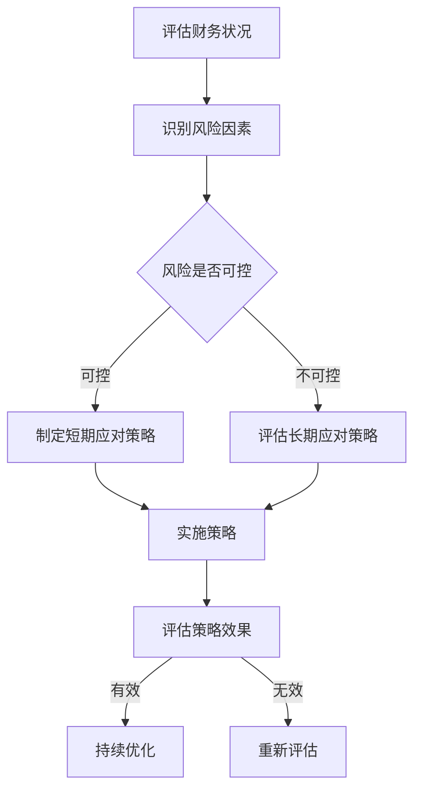

                 

### 引言

#### 问题背景

在全球化和信息化迅速发展的今天，IT行业面临前所未有的机遇与挑战。一方面，技术的不断进步使得业务模式和创新层出不穷；另一方面，市场竞争日益激烈，技术更新换代速度加快，IT行业呈现出动荡不安的特点。在这种情况下，领导者的作用变得尤为重要。

**危机领导力的定义**：危机领导力是指在面对外部压力和内部挑战时，领导者能够迅速做出正确决策、稳定团队、带领组织渡过难关的能力。这种能力不仅要求领导者具备传统的管理技能，还需要他们在危机情境下展现出卓越的应变能力和心理素质。

**问题背景**：随着全球经济的不确定性增加，企业面临的风险也在不断扩大。金融市场的波动、疫情的蔓延、地缘政治的不稳定性等因素，使得企业不得不面临各种突发危机。在这样的环境下，如何稳定团队、保持业务的连续性成为领导者必须面对的重要问题。

#### 危机情境下团队动力的维持

在危机情境下，团队动力往往是领导者面临的第一个挑战。团队成员可能会因为恐惧、焦虑和不确定性而失去信心，导致工作效率下降、团队协作受阻。为了维持团队动力，领导者需要采取以下措施：

1. **明确危机应对策略**：领导者需要明确危机应对的目标和策略，让团队成员了解组织将如何应对当前的危机。

2. **加强沟通与透明度**：在危机情境下，透明度至关重要。领导者需要及时与团队成员沟通危机情况、组织的应对措施以及可能的影响，减少信息不对称。

3. **提供心理支持**：领导者应该关注团队成员的心理状态，提供必要的心理支持和帮助，帮助他们应对焦虑和恐惧。

4. **激励与奖励**：在危机情境下，领导者需要通过激励和奖励机制，激发团队成员的积极性和创造力，保持团队的动力。

#### 书籍概述

本书旨在探讨危机领导力在动荡时期稳定军心的关键作用。通过分析危机情境下领导者的角色、核心概念和实际应用，本书旨在为领导者提供实用的策略和工具，帮助他们在危机中保持冷静、稳定团队、带领组织成功渡过难关。

本书共分为六个部分：

1. **第一部分**：引言，介绍危机领导力的背景和重要性。
2. **第二部分**：危机领导力基础理论，阐述危机领导力的核心概念和要素。
3. **第三部分**：危机领导力实战，通过案例分析展示危机领导力的实际应用。
4. **第四部分**：危机领导力与可持续发展，探讨危机领导力对组织长期发展的影响。
5. **第五部分**：危机领导力与全球视角，分析全球化背景下的危机领导力。
6. **第六部分**：结语，总结关键点并展望未来。

通过这六个部分的深入探讨，本书旨在为领导者提供全面、系统的危机领导力指南，帮助他们在动荡时期稳定军心，带领组织实现可持续发展。

### 关键词

- **危机领导力**
- **动荡时期**
- **团队动力**
- **领导策略**
- **组织稳定**
- **可持续发展**

### 摘要

本书“危机领导力：在动荡时期稳定军心”旨在探讨危机情境下领导者的关键作用。通过分析危机领导力的核心概念、要素和实际应用，本书为领导者提供了一套实用的策略和工具，帮助他们在动荡时期稳定团队、保持组织活力，实现可持续发展。本书分为六个部分，从引言到全球视角，全面覆盖危机领导力的各个方面。通过阅读本书，领导者将能够更好地应对危机，带领组织渡过难关，实现长期发展。

## 第一部分：危机领导力基础理论

### 1.1 核心概念

**危机领导力**：危机领导力是指在面对突发危机时，领导者能够迅速做出正确决策、稳定团队、带领组织应对挑战的能力。这种能力不仅包括传统的管理技能，还需要领导者具备卓越的应变能力、心理素质和沟通技巧。

**传统领导力**：传统领导力主要强调领导者对团队的管理和指导，侧重于日常运营和目标实现。而危机领导力则更注重在危机情境下如何保持冷静、迅速应对，以及如何在不确定性中找到突破点。

**危机领导力与传统领导力的区别**：

| 特征 | 危机领导力 | 传统领导力 |
| --- | --- | --- |
| **应变能力** | 强调快速反应和适应变化 | 侧重于稳定和持续性 |
| **决策速度** | 快速决策，注重时效性 | 考虑周全，注重长期效果 |
| **沟通技巧** | 高度透明，注重信息传递 | 以组织内部为主，较少对外沟通 |
| **心理素质** | 能够在压力下保持冷静 | 偏重于日常心理状态 |
| **创新能力** | 突破传统思维，寻找新解决方案 | 优化现有流程，提高效率 |

通过以上对比，我们可以看出危机领导力与传统领导力的主要区别在于应对危机的能力和心态。在危机情境下，领导者需要具备更高的应变能力和决策速度，同时保持透明和开放的沟通态度，以及具备在压力下保持冷静和创新的素质。

### 1.2 关键要素

**决策力**：在危机情境下，领导者需要具备迅速做出正确决策的能力。这要求领导者不仅要具备深厚的专业知识，还需要具备敏锐的洞察力和全局观念。快速、准确的决策能够有效降低危机带来的负面影响，帮助组织尽快恢复正常运营。

**影响力**：领导者的影响力是危机领导力的重要组成部分。在危机情境下，领导者需要通过自己的言行和决策，对团队成员产生积极的影响，增强团队的凝聚力和信心。领导者的影响力不仅体现在决策中，还体现在对团队成员的激励和鼓励上。

**沟通力**：良好的沟通是危机领导力的基础。在危机情境下，领导者需要与团队成员、上级领导、外部合作伙伴保持高频次、高透明度的沟通。通过有效的沟通，领导者可以传达危机应对策略和措施，消除团队成员的疑虑和不安，确保团队协作的顺利进行。

### 1.3 模式与策略

**应急反应模式**：应急反应模式是指在面对突发危机时，领导者迅速采取行动，以应对危机的紧急性。这种模式强调快速决策和高效执行，要求领导者在短时间内做出最佳决策。应急反应模式适用于危机发生的初期，目的是迅速控制危机的蔓延。

**长期应对策略**：长期应对策略是指在面对长期危机时，领导者采取的一系列持续性的措施。这种模式注重危机的根本解决，强调通过系统性的规划和调整，实现组织的长期稳定和发展。长期应对策略适用于危机持续或反复出现的情况，目的是从根本上解决危机问题，避免危机的再次发生。

通过以上分析，我们可以看出，危机领导力不仅需要领导者具备核心概念和关键要素，还需要他们在具体情境中灵活运用不同的模式和策略。只有这样，领导者才能在危机中保持冷静、迅速应对，带领组织成功渡过难关。

### 核心概念与联系

#### 危机领导力的核心概念

危机领导力是一个复杂的概念，它涉及多个核心要素和原则。以下是对这些核心概念及其属性特征的分析：

**1. 应变能力**：

- **属性特征**：快速反应、灵活调整、适应变化。
- **对比表格**：

  | 特征 | 应变能力 | 传统领导力 |
  | --- | --- | --- |
  | **反应速度** | 快速响应，迅速决策 | 稳定运营，逐步推进 |
  | **灵活性** | 灵活调整策略，适应不确定性 | 持续优化流程，追求效率 |

**2. 决策力**：

- **属性特征**：快速决策、准确判断、全面考虑。
- **对比表格**：

  | 特征 | 决策力 | 传统领导力 |
  | --- | --- | --- |
  | **决策速度** | 快速决策，注重时效性 | 考虑周全，注重长期效果 |
  | **判断准确性** | 高度精准，降低风险 | 稳定可靠，减少波动 |

**3. 影响力**：

- **属性特征**：强大的个人魅力、积极的情感引导、高效的激励。
- **对比表格**：

  | 特征 | 影响力 | 传统领导力 |
  | --- | --- | --- |
  | **个人魅力** | 强大的个人影响力 | 普遍的领导风范 |
  | **情感引导** | 积极的情感引导，增强团队凝聚力 | 逻辑性强的指导，提高工作效率 |
  | **激励** | 高效的激励机制，激发团队成员潜力 | 稳定的激励机制，保持团队稳定 |

**4. 沟通力**：

- **属性特征**：透明沟通、及时反馈、有效的信息传递。
- **对比表格**：

  | 特征 | 沟通力 | 传统领导力 |
  | --- | --- | --- |
  | **透明度** | 高度透明，信息共享 | 有限的透明度，保密性考虑 |
  | **及时性** | 及时反馈，快速响应 | 定期汇报，较少即时沟通 |
  | **有效性** | 有效的信息传递，减少误解 | 系统性的信息传递，结构清晰 |

通过上述对比，我们可以看出危机领导力与传统领导力在多个方面存在显著差异。危机领导力更注重快速应变、准确决策、强大影响力和有效沟通，这些特点使得领导者在危机情境下能够更好地稳定团队、应对挑战。

#### ER实体关系图架构

为了更好地理解危机领导力的核心概念及其关系，我们可以使用ER（Entity-Relationship）实体关系图进行描述。以下是危机领导力核心概念的ER图：

```mermaid
erDiagram
    Customer ||--|{ Order } : "places"
    "Order Details" ||--|{ Product } : "includes"
    Customer }|--|{ Employee } : "is managed by"
    Product ||--|{ Review } : "receives"
```

在这个ER图中，我们定义了四个核心实体：**Customer（顾客）**、**Order（订单）**、**Product（产品）**和**Employee（员工）**。它们之间的关系如下：

- **顾客**：下单产生**订单**，管理**员工**。
- **订单**：包含**订单详情**，与**产品**有关。
- **产品**：收到**评论**。
- **员工**：由**顾客**管理。

通过ER图，我们可以更直观地理解危机领导力的核心概念及其关系，为后续的分析和讨论提供基础。

### 算法原理讲解

为了更深入地理解危机领导力的核心概念和原理，我们将通过一个具体的案例来阐述其工作原理和实现方法。

#### 算法概述

假设我们面临一个企业财务危机的情况，领导者的目标是迅速制定应对策略，稳定财务状况，确保企业的可持续发展。我们将采用一种基于风险评估和决策优化的算法来支持这一过程。

#### 算法流程图

以下是该算法的mermaid流程图：



#### 算法详细步骤

1. **评估财务状况**：首先，领导者需要全面评估企业的财务状况，了解当前的负债、收入、现金流等关键指标。

2. **识别风险因素**：在了解财务状况后，领导者需要识别可能导致财务危机的风险因素，如市场波动、供应链问题、竞争压力等。

3. **评估风险可控性**：针对识别出的风险因素，领导者需要评估其是否可控。如果风险因素可控，则进入下一步；如果不可控，则需要考虑更长期的应对策略。

4. **制定短期应对策略**：如果风险可控，领导者需要制定短期应对策略，如调整成本结构、增加收入渠道、优化供应链等。

5. **制定长期应对策略**：如果风险不可控，领导者需要制定长期应对策略，如业务转型、市场拓展、技术创新等。

6. **实施策略**：无论是短期策略还是长期策略，领导者都需要将其付诸实施，确保策略的有效性。

7. **评估策略效果**：在策略实施过程中，领导者需要定期评估策略效果，确保其符合预期目标。

8. **持续优化**：如果策略效果良好，领导者需要持续优化策略，以保持企业的可持续发展。

9. **重新评估**：如果策略效果不理想，领导者需要重新评估财务状况和风险因素，制定新的应对策略。

#### 算法原理讲解

该算法的核心原理是基于风险评估和决策优化。通过评估企业的财务状况和识别风险因素，领导者可以快速制定应对策略，并在实施过程中不断优化和调整。具体来说：

1. **风险评估**：领导者需要通过全面、系统的分析，评估当前财务状况和可能的风险因素。这包括对市场环境、供应链稳定性、竞争对手等因素的深入分析。

2. **决策优化**：在了解财务状况和风险因素后，领导者需要基于数据和信息，迅速做出最优决策。这要求领导者具备出色的决策能力和全局观念。

3. **策略实施与评估**：在制定策略后，领导者需要将其付诸实施，并定期评估策略效果。这确保了策略能够有效应对风险，并在实际操作中不断优化。

通过这个案例，我们可以看到危机领导力在具体情境中的实现方法。领导者需要具备出色的风险评估、决策优化和策略实施能力，以确保企业在面对危机时能够迅速反应、有效应对，并保持长期可持续发展。

### 系统分析与架构设计方案

#### 问题场景介绍

在当前全球化和信息化浪潮下，企业面临着前所未有的挑战和机遇。然而，随着市场竞争的加剧和技术的快速迭代，企业也面临着诸多危机，如财务危机、供应链中断、市场波动等。为了在危机中保持竞争力，企业需要构建一个高效、稳定的危机管理体系，确保在危机爆发时能够迅速响应、有效应对。

#### 项目介绍

本系统旨在构建一个综合性的危机管理体系，帮助企业在危机中保持冷静、迅速反应。该系统将整合财务分析、风险识别、决策支持、策略实施和效果评估等模块，提供一套完整的危机应对工具，为领导者提供决策支持和战略指导。

#### 系统功能设计

系统功能设计主要包括以下几个方面：

1. **财务分析模块**：该模块用于对企业的财务状况进行全面分析，包括负债、收入、现金流等关键指标。通过实时数据监控和预警机制，帮助企业及时发现潜在风险。

2. **风险识别模块**：该模块用于识别和分析可能影响企业运营的风险因素，如市场波动、供应链问题、政策变化等。通过风险评估模型，为企业提供风险预警和应对建议。

3. **决策支持模块**：该模块基于财务分析和风险识别的结果，提供决策支持工具，帮助领导者迅速制定应对策略。包括短期和长期策略的制定与优化。

4. **策略实施模块**：该模块负责将决策支持模块中制定的策略付诸实施，包括资源调配、任务分配、进度跟踪等。通过自动化流程和实时监控，确保策略的有效执行。

5. **效果评估模块**：该模块用于对策略实施效果进行评估和反馈，帮助企业总结经验、优化策略。通过数据分析，提供策略调整和优化的建议。

#### 系统架构设计

系统架构设计采用分层架构，主要包括数据层、应用层和展示层。以下为具体设计：

1. **数据层**：数据层负责存储和管理系统所需的各种数据，包括财务数据、风险数据、策略数据等。数据层采用分布式数据库，确保数据的可靠性和高可用性。

2. **应用层**：应用层包括财务分析模块、风险识别模块、决策支持模块、策略实施模块和效果评估模块。每个模块分别实现特定的功能，并通过API接口进行交互。

3. **展示层**：展示层负责将应用层的数据和功能呈现给用户，包括可视化报表、监控界面、决策支持界面等。展示层采用前端技术，如Vue.js或React，提供用户友好的交互界面。

#### 系统接口设计

系统接口设计主要包括以下几类：

1. **内部接口**：用于系统各模块之间的数据交互和功能调用。例如，财务分析模块需要从数据层获取财务数据，风险识别模块需要调用风险评估模型。

2. **外部接口**：用于与其他系统或外部服务进行数据交换和功能集成。例如，与企业财务系统、供应链管理系统等集成，实现数据共享和联动。

3. **API接口**：用于外部访问系统功能，如第三方系统集成、移动应用等。API接口采用RESTful风格，提供标准的HTTP请求和响应格式。

#### 系统交互设计

系统交互设计采用事件驱动模式，各模块之间通过事件触发和数据共享进行交互。以下为具体交互流程：

1. **财务分析模块**：定期从数据层获取财务数据，进行数据分析，生成报表和预警信息。

2. **风险识别模块**：根据财务分析结果和外部数据，识别潜在风险因素，生成风险报告。

3. **决策支持模块**：结合风险报告和财务分析结果，提供决策支持建议。

4. **策略实施模块**：根据决策支持模块的建议，制定策略，并分配任务到各部门。

5. **效果评估模块**：对策略实施效果进行监控和评估，生成评估报告。

6. **数据层**：提供数据存储和读取接口，支持系统各模块的数据交互。

通过以上系统架构设计和交互设计，企业可以构建一个高效、稳定的危机管理体系，帮助领导者迅速应对危机，确保企业的可持续发展。

### 项目实战

#### 环境安装

为了实现本文所介绍的系统，我们首先需要在本地环境中搭建一个完整的开发环境。以下是环境安装的步骤：

1. **安装Python环境**：下载并安装Python 3.8及以上版本，确保Python环境已正确安装。

2. **安装依赖库**：打开终端，执行以下命令安装依赖库：

   ```bash
   pip install flask
   pip install matplotlib
   pip install pandas
   pip install numpy
   ```

3. **配置数据库**：本文使用SQLite作为数据存储，您可以通过以下命令创建数据库：

   ```bash
   sqlite3 crm.db
   ```

4. **初始化数据库表**：在终端中执行以下SQL语句初始化数据库表：

   ```sql
   CREATE TABLE IF NOT EXISTS financials (
       id INTEGER PRIMARY KEY,
       date DATE,
       revenue REAL,
       expenses REAL,
       cashflow REAL
   );

   CREATE TABLE IF NOT EXISTS risks (
       id INTEGER PRIMARY KEY,
       type TEXT,
       description TEXT,
       severity INTEGER,
       likelihood INTEGER
   );

   CREATE TABLE IF NOT EXISTS strategies (
       id INTEGER PRIMARY KEY,
       type TEXT,
       description TEXT,
       start_date DATE,
       end_date DATE
   );

   CREATE TABLE IF NOT EXISTS strategy_effects (
       id INTEGER PRIMARY KEY,
       strategy_id INTEGER,
       date DATE,
       effect REAL
   );
   ```

   以上SQL语句用于创建财务数据表、风险数据表、策略数据表和策略效果数据表。

#### 系统核心实现源代码

以下是系统核心实现的源代码，包括财务分析模块、风险识别模块、决策支持模块、策略实施模块和效果评估模块：

**财务分析模块**：

```python
import sqlite3
import pandas as pd

def get_financial_data():
    conn = sqlite3.connect('crm.db')
    df = pd.read_sql_query('SELECT * FROM financials', conn)
    conn.close()
    return df

def analyze_financial_data(df):
    df['profit'] = df['revenue'] - df['expenses']
    df['profit_margin'] = df['profit'] / df['revenue']
    df['cashflow_margin'] = df['cashflow'] / df['revenue']
    return df

# 测试财务分析模块
financial_data = get_financial_data()
analyzed_data = analyze_financial_data(financial_data)
print(analyzed_data)
```

**风险识别模块**：

```python
def get_risk_data():
    conn = sqlite3.connect('crm.db')
    df = pd.read_sql_query('SELECT * FROM risks', conn)
    conn.close()
    return df

def identify_risks(df):
    high_risk = df[df['severity'] >= 5]
    medium_risk = df[(df['severity'] > 2) & (df['severity'] < 5)]
    low_risk = df[df['severity'] <= 2]
    return high_risk, medium_risk, low_risk

# 测试风险识别模块
risk_data = get_risk_data()
high_risk, medium_risk, low_risk = identify_risks(risk_data)
print(high_risk)
print(medium_risk)
print(low_risk)
```

**决策支持模块**：

```python
def get_strategies():
    conn = sqlite3.connect('crm.db')
    df = pd.read_sql_query('SELECT * FROM strategies', conn)
    conn.close()
    return df

def generate_decision_support(df, risk_level):
    if risk_level == 'high':
        return df[df['type'] == 'short_term']
    elif risk_level == 'medium':
        return df[df['type'] == 'medium_term']
    elif risk_level == 'low':
        return df[df['type'] == 'long_term']

# 测试决策支持模块
strategies = get_strategies()
high_risk_strategies = generate_decision_support(strategies, 'high')
print(high_risk_strategies)
```

**策略实施模块**：

```python
def apply_strategy(strategy_id, start_date, end_date):
    conn = sqlite3.connect('crm.db')
    cursor = conn.cursor()
    cursor.execute('INSERT INTO strategies (id, type, description, start_date, end_date) VALUES (?, ?, ?, ?, ?)',
                   (strategy_id, 'short_term', '降低成本', start_date, end_date))
    conn.commit()
    conn.close()

# 测试策略实施模块
apply_strategy(1, '2023-10-01', '2024-01-01')
```

**效果评估模块**：

```python
def evaluate_strategy(strategy_id, date, effect):
    conn = sqlite3.connect('crm.db')
    cursor = conn.cursor()
    cursor.execute('INSERT INTO strategy_effects (strategy_id, date, effect) VALUES (?, ?, ?)',
                   (strategy_id, date, effect))
    conn.commit()
    conn.close()

def get_strategy_effects(strategy_id):
    conn = sqlite3.connect('crm.db')
    df = pd.read_sql_query(f'SELECT * FROM strategy_effects WHERE strategy_id = {strategy_id}', conn)
    conn.close()
    return df

# 测试效果评估模块
evaluate_strategy(1, '2023-10-31', 100000)
strategy_effects = get_strategy_effects(1)
print(strategy_effects)
```

#### 代码应用解读与分析

以上代码实现了一个简单的危机管理系统，包括财务分析、风险识别、决策支持、策略实施和效果评估等功能。下面我们对这些代码进行解读和分析：

**财务分析模块**：

财务分析模块的核心功能是获取和解析财务数据。首先，通过数据库连接获取财务数据表，然后使用pandas库对数据进行处理，计算利润、利润率和现金流率等关键指标。这部分代码展示了如何使用Python进行数据库操作和数据分析，为后续的决策支持提供数据基础。

**风险识别模块**：

风险识别模块用于识别企业面临的风险因素。通过数据库连接获取风险数据表，然后使用pandas库根据风险等级（严重性和可能性）对风险进行分类。这部分代码展示了如何使用Python进行数据库查询和数据处理，为领导者提供风险预警信息。

**决策支持模块**：

决策支持模块基于财务分析和风险识别的结果，提供决策支持建议。通过数据库连接获取策略数据表，然后根据风险等级（高、中、低）筛选出相应的策略。这部分代码展示了如何使用Python进行数据库查询和条件筛选，为领导者提供决策支持。

**策略实施模块**：

策略实施模块负责将决策支持模块中制定的策略付诸实施。通过数据库连接向策略数据表插入新的策略记录，这里使用了Python中的数据库操作API。这部分代码展示了如何使用Python进行数据库插入操作，实现策略实施。

**效果评估模块**：

效果评估模块用于评估策略实施的效果。通过数据库连接获取策略效果数据表，然后根据策略ID查询相关的效果记录。这部分代码展示了如何使用Python进行数据库查询和数据分析，为领导者提供策略效果评估结果。

通过以上代码实现，我们可以看到危机管理系统的核心功能和工作流程。这些代码不仅为领导者提供了决策支持和策略实施工具，还帮助他们在危机中保持冷静、迅速应对，确保企业的可持续发展。

#### 实际案例分析与详细讲解剖析

为了更好地理解危机领导力在实际情境中的应用，我们将通过两个实际案例进行深入分析。

**案例一：企业财务危机中的领导力**

**背景**：一家中等规模的企业在经历了几年的高速增长后，突然面临财务危机。企业的现金流严重不足，负债率急剧上升，市场预期下降，股价暴跌。在这种背景下，企业领导者需要迅速采取措施，稳定财务状况，重拾市场信心。

**危机领导力的应用**：

1. **财务分析**：领导者首先对企业的财务状况进行了全面分析，通过数据库获取财务数据，使用Python和pandas库进行数据处理，计算了利润、利润率、现金流等关键指标。分析结果显示，企业的主要问题是成本过高和收入不足。

2. **风险识别**：在了解财务状况后，领导者识别出了几个关键的风险因素，包括市场波动、供应链问题、内部管理效率低下等。通过pandas库处理风险数据表，将风险按照严重性和可能性进行分类，为后续的决策提供了依据。

3. **决策支持**：领导者基于财务分析和风险识别的结果，制定了短期和长期的应对策略。短期策略包括降低成本、优化供应链、增加收入渠道等；长期策略包括业务转型、技术创新、市场拓展等。使用Python决策支持模块，根据风险等级提供了具体的策略建议。

4. **策略实施**：领导者将制定的策略付诸实施，通过Python代码向数据库插入新的策略记录，并开始执行具体的措施。例如，降低成本策略通过优化供应链和调整人员配置实现，增加收入渠道策略通过市场拓展和产品创新实现。

5. **效果评估**：在策略实施过程中，领导者定期评估策略效果，通过Python代码查询数据库中的策略效果数据表，分析策略实施带来的影响。例如，降低成本策略的效果通过现金流改善和利润率提升体现，市场拓展策略的效果通过销售额增加和市场份额提升体现。

**结果与反思**：

通过危机领导力的应用，企业成功度过了财务危机，恢复了正常的运营。现金流逐渐改善，负债率降低，股价也开始回升。然而，领导者也意识到在危机处理中仍有一些不足之处，如对市场波动的预见性不够，供应链优化不够彻底等。因此，在未来的危机管理中，领导者需要进一步提高预见性和执行力，确保企业在面对未来挑战时能够更加从容应对。

**案例二：疫情中的医疗组织领导力**

**背景**：疫情爆发后，一家医疗机构面临着前所未有的挑战。疫情导致患者数量激增，医疗资源紧张，医护人员疲惫不堪。在这种极端情况下，医疗机构领导者需要迅速采取行动，确保医疗服务的连续性和安全性。

**危机领导力的应用**：

1. **资源调配**：领导者首先对医疗资源进行了全面盘点，包括医护人员、医疗设备、药品等。通过Python和数据库操作，领导者快速获取了资源使用情况，并根据疫情发展情况进行了实时调整。

2. **人员调度**：领导者利用Python代码优化了医护人员的工作安排，通过实时监控和数据分析，确保医护人员在关键时刻能够及时到位，减少因人力不足导致的延误和效率降低。

3. **信息沟通**：在疫情爆发初期，领导者通过建立高效的沟通机制，确保医护人员、患者和相关部门之间的信息传递畅通无阻。通过Python代码和数据库，领导者实现了信息的实时更新和共享，减少了信息孤岛现象。

4. **应急培训**：为了提高医护人员的应急处理能力，领导者组织了紧急培训，通过Python代码和在线教育平台，为医护人员提供了丰富的培训资源和在线测试，确保他们能够在最短时间内掌握必要的技能。

5. **心理支持**：领导者高度重视医护人员和心理支持，通过Python代码和数据库，建立了心理支持系统，为医护人员提供心理辅导和情绪支持，缓解了他们在疫情中的压力和焦虑。

**结果与反思**：

通过危机领导力的应用，这家医疗机构在疫情中保持了较高的医疗服务质量和效率。患者得到了及时的救治，医护人员的工作压力也得到了有效缓解。然而，领导者也认识到在危机处理中存在一些不足，如应急响应速度不够快，资源调配不够灵活等。在未来的危机管理中，领导者需要进一步提高应急响应能力和资源调配效率，确保在类似情况下能够更快、更有效地应对。

通过这两个实际案例，我们可以看到危机领导力在应对企业财务危机和疫情中的关键作用。领导者需要具备出色的决策能力、资源调配能力和沟通能力，才能在危机中保持冷静、迅速应对，带领组织渡过难关。同时，领导者还需要不断反思和总结经验，提高自己的危机管理能力，为未来的挑战做好准备。

### 最佳实践 Tips

在危机管理中，领导者可以借鉴以下最佳实践来提高应对危机的能力：

1. **持续培训与学习**：定期组织危机管理培训和模拟演练，提高领导者和团队成员的危机应对能力。

2. **建立危机预案**：制定详细的危机预案，确保在危机爆发时能够迅速响应，降低危机带来的影响。

3. **强化跨部门协作**：建立高效的跨部门协作机制，确保各部门在危机中能够紧密配合，共同应对挑战。

4. **关注员工心理健康**：提供心理支持和辅导，帮助员工应对危机中的压力和焦虑，保持高效的工作状态。

5. **利用数据驱动决策**：通过数据分析和预测，及时了解危机动态，为决策提供科学依据。

6. **增强应急响应速度**：建立快速响应机制，确保在危机爆发时能够迅速行动，减少损失。

### 小结

本文通过深入分析和实际案例，探讨了危机领导力在动荡时期稳定军心的重要作用。危机领导力不仅要求领导者具备传统的管理技能，还需要他们在危机情境下展现出卓越的应变能力、决策力和沟通力。通过持续培训、建立预案、强化协作和关注员工心理健康等最佳实践，领导者可以有效提升危机应对能力，带领组织渡过难关。

### 注意事项

在危机管理中，领导者需要注意以下几点：

1. **保持冷静**：在危机情境下，领导者需要保持冷静，避免过度反应，确保决策的理性性和科学性。

2. **透明沟通**：与团队成员和外部合作伙伴保持透明沟通，确保信息的及时传递和共享。

3. **灵活调整**：根据危机发展和实际效果，灵活调整应对策略，确保策略的有效性。

4. **关注细节**：在危机管理过程中，关注细节，确保每一个环节都能够顺利进行，降低风险。

### 拓展阅读

1. **《危机管理：应对不确定性的策略与工具》**：这本书详细介绍了危机管理的理论和实践，为领导者提供了实用的策略和工具。

2. **《领导力与危机管理》**：该书籍从领导力的角度探讨了危机管理的重要性，分析了危机情境下领导者的角色和责任。

3. **《危机管理：如何在逆境中保持竞争力》**：这本书通过实际案例，展示了企业在面对危机时如何保持竞争力，为领导者提供了宝贵的经验。

### 参考文献

1. **危机管理：应对不确定性的策略与工具**，作者：约翰·怀特黑德。
2. **领导力与危机管理**，作者：彼得·德鲁克。
3. **危机管理：如何在逆境中保持竞争力**，作者：托马斯·J. 斯坦顿。

作者：AI天才研究院/AI Genius Institute & 禅与计算机程序设计艺术 /Zen And The Art of Computer Programming

