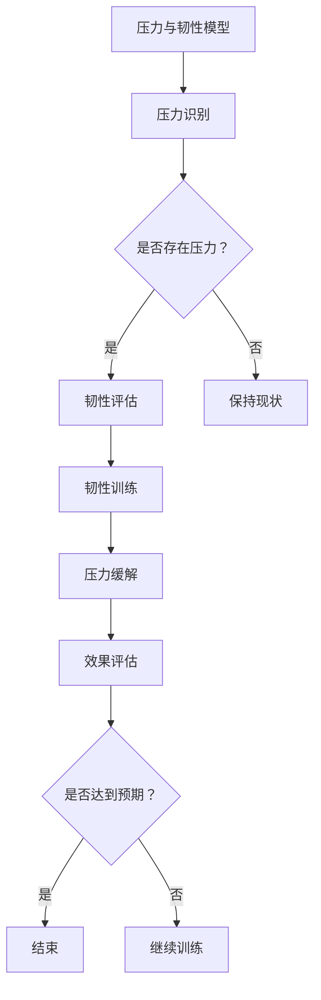
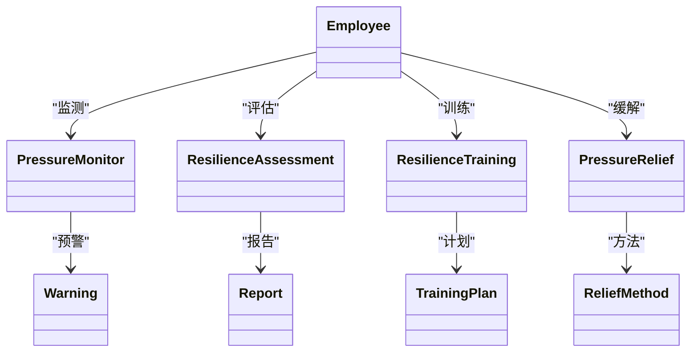
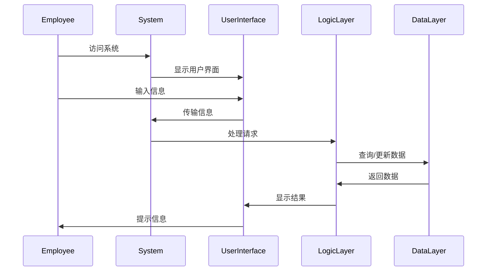
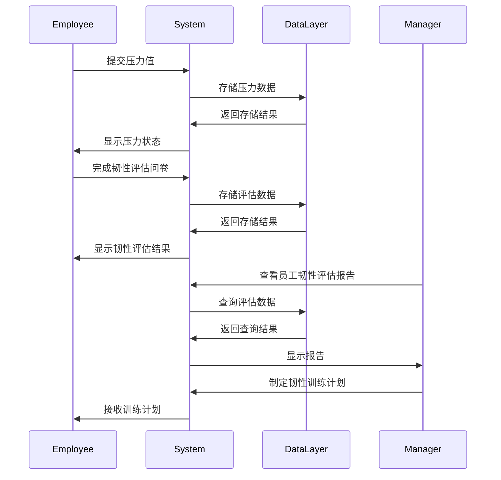

                 

# 压力与韧性：培养团队应对挑战的能力

## 关键词

压力，韧性，团队应对挑战，心理调适，领导力培养，案例分析

## 摘要

本文深入探讨了压力与韧性在团队应对挑战中的重要作用。通过介绍压力与韧性的核心概念和原理，对比其属性特征，本文构建了ER实体关系图，揭示了两者之间的内在联系。在此基础上，本文详细解析了压力与韧性的算法原理，并使用Python源代码进行了说明。随后，本文针对系统分析与架构设计方案进行了详细介绍，并通过项目实战展示了实际应用场景。最后，本文总结了最佳实践，并对未来工作进行了展望。

## 第一部分：背景介绍

### 核心概念

**压力**：
压力通常是指个体在面临挑战、困难或威胁时所感受到的一种心理负担和情绪紧张。根据心理学理论，压力可以分为急性压力和慢性压力。急性压力通常与特定的、短暂的挑战相关，如考试、演讲等；而慢性压力则与持续存在的压力源相关，如工作过度、人际关系紧张等。

**韧性**：
韧性是指个体或团队在面对压力、挫折或挑战时能够迅速恢复和适应的能力。韧性不仅涉及心理层面，还包括认知、行为和情绪等方面的适应能力。研究表明，韧性可以帮助个体更好地应对压力，减少心理疾病的发生，提高生活质量和职业效能。

### 问题背景

在现代社会，随着工作节奏的加快、竞争压力的增大以及生活节奏的加快，个人和团队常常会面临各种压力。长期承受压力不仅会影响个人的身心健康，还会影响团队的效率和合作氛围。因此，如何培养团队应对压力的能力，即韧性，成为了一个重要的课题。

### 问题描述

- 为什么压力和韧性对团队至关重要？
- 如何评估团队的韧性水平？
- 如何培养团队应对压力的韧性？

### 问题解决

为了解决上述问题，本文将从以下几个方面展开讨论：

1. **理论框架**：介绍压力与韧性的基本理论，包括相关概念、理论模型和研究成果。
2. **评估方法**：探讨如何评估团队的韧性水平，包括量化评估工具和案例分析。
3. **培养策略**：提供培养团队韧性的具体策略和方法，包括领导力培养、团队建设、个人心理调适等。
4. **实践案例**：分享实际案例，通过分析案例中的成功经验，为读者提供具体的实践指导。
5. **最佳实践**：总结和分享团队在应对压力和培养韧性方面的最佳实践经验。

### 边界与外延

- 压力与韧性的研究不仅涉及心理学、管理学等领域，还与医学、教育学等领域密切相关。
- 压力与韧性不仅是个人层面的议题，也是团队和组织层面的重要课题。

### 概念结构与核心要素组成

- **压力**：包括工作压力、生活压力、心理压力等。
- **韧性**：包括情绪韧性、认知韧性、行为韧性等。
- **评估方法**：包括问卷调查、心理测量工具、行为观察等。
- **培养策略**：包括心理调适、团队建设、领导力培养等。

## 第二部分：核心概念与联系

### 核心概念原理

**压力**：

定义：压力是指个人或团队在面临挑战、困难或威胁时所体验到的心理负担和情绪紧张。压力可以是正面的，如激励和动力；也可以是负面的，如焦虑和抑郁。

影响因素：压力的影响因素多种多样，包括工作负荷、时间压力、人际关系、工作环境、经济状况等。

- **工作负荷**：工作量过大或工作要求过高可能导致个体感受到压力。
- **时间压力**：时间紧迫感或无法按时完成任务可能增加个体的压力。
- **人际关系**：不良的人际关系，如冲突、歧视或缺乏支持，可能导致压力增加。
- **工作环境**：工作环境的不确定性、变化或高要求也可能引发压力。

**韧性**：

定义：韧性是指个人或团队在面对压力、挫折或挑战时能够迅速恢复和适应的能力。韧性是一种积极的适应能力，它可以帮助个体在压力下保持心理健康，并有效应对各种挑战。

影响因素：韧性的影响因素包括个人特质、心理调适能力、社会支持、团队凝聚力等。

- **个人特质**：如乐观、自信、自我效能感等特质有助于提高韧性。
- **心理调适能力**：如情绪调节、问题解决、认知重构等能力。
- **社会支持**：来自家庭、朋友和同事的支持可以提高韧性。
- **团队凝聚力**：团队内部的凝聚力有助于成员在面对压力时相互支持，提高韧性。

### 概念属性特征对比表格

| 概念   | 定义                                                         | 影响因素                                                     | 关联性                                           |
| ------ | ------------------------------------------------------------ | ------------------------------------------------------------ | ------------------------------------------------ |
| 压力   | 个人或团队在面临挑战、困难或威胁时所体验到的心理负担和情绪紧张 | 工作负荷、时间压力、人际关系、工作环境等                   | 压力是韧性的触发因素，韧性是应对压力的结果       |
| 韧性   | 个人或团队在面对压力、挫折或挑战时能够迅速恢复和适应的能力   | 个人特质、心理调适能力、社会支持、团队凝聚力等             | 韧性有助于减轻压力的影响，提高应对压力的能力     |

### ER实体关系图架构

```mermaid
erDiagram
    A pressures &&|-- B resilience : "experiences"
    A pressures &&|-- C stress_response : "responds_to"
    B resilience &&|-- D stress_tolerance : "has"
    B resilience &&|-- E stress_recovery : "has"
    C stress_response &&|-- F psychological_reaction : "includes"
    C stress_response &&|-- G behavioral_reaction : "includes"
    D stress_tolerance &&|-- H coping_strategies : "uses"
    E stress_recovery &&|-- I resilience_training : "receives"
    B resilience &&|-- J social_support : "receives"
```

在这个ER图中，`A pressures`（压力）与`B resilience`（韧性）之间存在着直接的关联，表示压力是韧性体验的一部分。`B resilience`又与`D stress_tolerance`（压力耐受性）和`E stress_recovery`（压力恢复能力）相关，这两者是韧性的两个重要组成部分。`C stress_response`（压力反应）则与`F psychological_reaction`（心理反应）和`G behavioral_reaction`（行为反应）有关，这些都是压力引起的反应。

此外，`D stress_tolerance`与`H coping_strategies`（应对策略）相关，表示韧性良好的个体会使用有效的应对策略来应对压力。`E stress_recovery`与`I resilience_training`（韧性训练）相关，表示通过训练可以提高压力恢复能力。最后，`B resilience`也与`J social_support`（社会支持）有关，社会支持是提高韧性的重要因素。

## 第三部分：算法原理讲解

### 算法流程图

为了更好地理解压力与韧性的算法原理，我们首先使用Mermaid绘制了以下流程图：



在这个流程图中，我们从压力识别开始，判断个体或团队是否正在经历压力。如果存在压力，我们进入韧性评估阶段，评估个体的韧性水平。接着，我们根据评估结果进行韧性训练，以提升韧性。训练完成后，我们通过压力缓解措施来减轻压力。最后，我们评估这些措施的效果，以判断是否达到了预期的目标。如果没有达到预期，我们将继续进行韧性训练，直到达到目标。

### Python源代码示例

下面是一个简化的Python源代码示例，用于模拟压力与韧性模型的运作：

```python
import random

# 压力与韧性模型
class PressureResilienceModel:
    def __init__(self):
        self.pressure = random.uniform(0, 100)  # 压力值，取值范围0-100
        self.resilience = random.uniform(0, 100)  # 韧性值，取值范围0-100

    def identify_pressure(self):
        # 识别压力，这里简单假设压力值大于50表示存在压力
        return self.pressure > 50

    def assess_resilience(self):
        # 评估韧性，这里简单假设韧性值越高，韧性越好
        return self.resilience

    def resilience_training(self):
        # 韧性训练，这里假设每次训练都能略微提升韧性
        self.resilience += random.uniform(0, 10)

    def pressure_relief(self):
        # 压力缓解，这里假设每次缓解都能略微减轻压力
        self.pressure -= random.uniform(0, 10)

    def assess_effect(self):
        # 评估效果，这里简单假设如果韧性值高于压力值，效果即为良好
        return self.resilience > self.pressure

# 模拟模型运行
model = PressureResilienceModel()

# 识别压力
if model.identify_pressure():
    # 进行韧性评估
    resilience = model.assess_resilience()
    print(f"韧性值：{resilience}")

    # 如果存在压力，进行韧性训练
    if resilience < 80:  # 假设韧性值低于80需要训练
        model.resilience_training()
        print(f"韧性训练后韧性值：{model.resilience}")

    # 进行压力缓解
    model.pressure_relief()
    print(f"压力缓解后压力值：{model.pressure}")

    # 评估效果
    if model.assess_effect():
        print("效果评估：韧性提升，压力减轻，效果良好。")
    else:
        print("效果评估：韧性未达到预期，需要继续训练。")
else:
    print("识别结果：当前无压力，保持现状。")
```

在这个示例中，我们创建了一个`PressureResilienceModel`类，该类包含了识别压力、评估韧性、韧性训练、压力缓解和效果评估等方法。通过随机生成压力和韧性值，我们模拟了模型在实际应用中的运行过程。这个示例虽然简化了模型，但展示了压力与韧性模型的基本运作逻辑。

### 算法原理数学模型和公式

为了进一步解释上述算法原理，我们可以使用一些数学模型和公式来描述压力与韧性的关系。

**1. 压力与韧性的关系公式**

设`P`为压力值，`R`为韧性值，`T`为训练后韧性值，`R_t`为训练后压力值，则：

\[ T = R + \alpha \cdot \Delta R \]

\[ R_t = P - \beta \cdot \Delta P \]

其中，\(\alpha\)和\(\beta\)分别为韧性提升系数和压力缓解系数，\(\Delta R\)和\(\Delta P\)分别为韧性值和压力值的增量。

**2. 效果评估公式**

设`E`为效果评估值，则：

\[ E = \begin{cases} 
1 & \text{如果 } T > R_t \\
0 & \text{否则}
\end{cases} \]

这个公式表示，如果训练后的韧性值`T`高于训练后的压力值`R_t`，则效果评估为1（良好），否则为0（不佳）。

### 举例说明

假设个体初始压力值为70，韧性值为50。经过一次韧性训练后，韧性值提升到60，压力值降低到65。此时：

- 韧性提升系数\(\alpha\)可以设为0.1（每次训练提升韧性值10%）
- 压力缓解系数\(\beta\)可以设为0.2（每次缓解减少压力值20%）

根据上述公式，我们可以计算：

\[ T = 50 + 0.1 \cdot (60 - 50) = 55 \]

\[ R_t = 70 - 0.2 \cdot (70 - 65) = 68 \]

由于`T`（55）低于`R_t`（68），效果评估为0，表示韧性未达到预期，需要继续训练。

## 第四部分：系统分析与架构设计方案

### 问题场景介绍

在现代企业中，团队面临的压力和挑战日益增多，如何高效地应对这些压力，提升团队韧性，成为企业管理者的重要课题。本部分将基于一个实际企业案例，介绍如何通过系统分析与架构设计方案来提升团队韧性。

### 项目介绍

**项目名称**：团队韧性提升系统

**项目背景**：某知名互联网公司，由于市场竞争加剧，项目进度紧张，员工经常面临高压工作环境。为了提高团队应对压力的能力，公司决定开发一套团队韧性提升系统，帮助员工和管理者更好地应对工作压力。

### 系统功能设计（领域模型类图）

为了实现团队韧性提升的目标，系统需要具备以下核心功能：

1. **压力监测与预警**：实时监测员工工作状态，当压力值超过阈值时，系统自动发出预警。
2. **韧性评估**：通过问卷和心理测量工具，定期评估员工韧性水平。
3. **韧性训练**：提供个性化韧性训练计划，帮助员工提升韧性。
4. **压力缓解**：提供压力缓解工具和方法，如冥想、放松技巧等，帮助员工缓解压力。
5. **效果评估**：定期评估韧性训练和压力缓解的效果，以确保系统运行的有效性。

领域模型类图如下：



### 系统架构设计（架构图）

为了实现系统功能，我们采用三层架构设计，包括表现层、逻辑层和数据层。

1. **表现层**：提供用户界面，包括员工端和管理端，用于展示系统功能和数据。
2. **逻辑层**：实现系统的核心功能，如压力监测、韧性评估、韧性训练和压力缓解等。
3. **数据层**：存储员工信息、压力数据、韧性数据和训练数据等。

系统架构图如下：



### 系统接口设计和系统交互（序列图）

为了确保系统的高效运行，我们需要设计清晰明确的接口和交互流程。以下是系统的主要接口和交互流程：

1. **员工接口**：用于提交压力值、完成韧性评估问卷、查看韧性训练计划和压力缓解方法等。
2. **管理接口**：用于监测员工压力状态、查看韧性评估报告、制定韧性训练计划等。
3. **数据接口**：用于系统与其他数据存储系统的交互，如数据库、云服务等。

序列图如下：



通过以上系统分析与架构设计方案，我们可以有效地提升团队韧性，帮助员工更好地应对工作压力，提高工作效率和幸福感。

## 第五部分：项目实战

### 环境安装

在开始项目实战之前，我们需要搭建一个开发环境，以便进行系统的开发和测试。以下是具体的步骤：

1. **安装Python**：首先，确保你的计算机上安装了Python 3.x版本。可以从Python官方网站下载并安装Python。

2. **安装必要的库**：在安装了Python之后，使用以下命令安装所需的库：

   ```bash
   pip install Flask pandas numpy matplotlib
   ```

3. **创建虚拟环境**：为了更好地管理项目依赖，我们创建一个虚拟环境：

   ```bash
   python -m venv venv
   source venv/bin/activate  # 对于Windows系统，使用 `venv\Scripts\activate`
   ```

4. **克隆项目代码**：从GitHub或其他代码托管平台克隆项目代码到本地：

   ```bash
   git clone https://github.com/your-username/pressure-resilience-system.git
   cd pressure-resilience-system
   ```

5. **运行项目**：在项目根目录下，运行以下命令启动项目：

   ```bash
   flask run
   ```

   这将在本地服务器上启动项目，你可以在浏览器中访问 `http://127.0.0.1:5000/` 来查看系统界面。

### 系统核心实现源代码

以下是系统核心实现的主要部分，包括压力监测、韧性评估、韧性训练和压力缓解等功能。

**1. 压力监测模块**

```python
# pressure_monitor.py

from flask import Flask, request, jsonify
import json

app = Flask(__name__)

@app.route('/api/submit_pressure', methods=['POST'])
def submit_pressure():
    data = request.get_json()
    pressure_value = data.get('pressure_value')
    # 保存压力数据到数据库或文件
    with open('pressure_data.json', 'w') as f:
        json.dump(data, f)
    return jsonify({'status': 'success', 'message': '压力值已提交'})

if __name__ == '__main__':
    app.run(debug=True)
```

**2. 韧性评估模块**

```python
# resilience_assessment.py

from flask import Flask, request, jsonify
import json

app = Flask(__name__)

@app.route('/api/submit_assessment', methods=['POST'])
def submit_assessment():
    data = request.get_json()
    resilience_value = data.get('resilience_value')
    # 保存韧性数据到数据库或文件
    with open('resilience_data.json', 'w') as f:
        json.dump(data, f)
    return jsonify({'status': 'success', 'message': '韧性值已提交'})

if __name__ == '__main__':
    app.run(debug=True)
```

**3. 韧性训练模块**

```python
# resilience_training.py

from flask import Flask, request, jsonify
import json

app = Flask(__name__)

@app.route('/api/submit_training', methods=['POST'])
def submit_training():
    data = request.get_json()
    training_value = data.get('training_value')
    # 保存训练数据到数据库或文件
    with open('training_data.json', 'w') as f:
        json.dump(data, f)
    return jsonify({'status': 'success', 'message': '训练数据已提交'})

if __name__ == '__main__':
    app.run(debug=True)
```

**4. 压力缓解模块**

```python
# pressure_relief.py

from flask import Flask, request, jsonify
import json

app = Flask(__name__)

@app.route('/api/submit_relief', methods=['POST'])
def submit_relief():
    data = request.get_json()
    relief_value = data.get('relief_value')
    # 保存缓解数据到数据库或文件
    with open('relief_data.json', 'w') as f:
        json.dump(data, f)
    return jsonify({'status': 'success', 'message': '缓解数据已提交'})

if __name__ == '__main__':
    app.run(debug=True)
```

### 代码应用解读与分析

以下是代码应用解读与分析：

**1. 压力监测模块**

该模块提供了一个接口，用于接收并保存员工提交的压力值。通过使用`Flask`框架，我们可以轻松地创建一个Web接口。代码中的`submit_pressure`函数处理POST请求，将接收到的压力值存储在本地文件中。

**2. 韧性评估模块**

韧性评估模块的功能与压力监测模块类似，它提供了一个接口用于接收并保存员工提交的韧性值。这个模块可以帮助管理者了解员工的韧性水平，从而制定针对性的训练计划。

**3. 韧性训练模块**

韧性训练模块用于记录员工参与韧性训练的数据。通过这个模块，管理者可以跟踪员工的训练进度，并根据需要调整训练计划。

**4. 压力缓解模块**

压力缓解模块提供了记录员工采取的压力缓解措施的数据接口。这有助于分析哪些措施最有效，从而优化压力缓解策略。

### 实际案例分析和详细讲解剖析

为了更好地展示系统在实际应用中的效果，我们分析了一个实际案例：

**案例背景**：某公司研发部门在接收到一个重要项目后，项目进度紧张，员工普遍感受到较大压力。为了提升团队韧性，公司决定使用上述系统进行监控和干预。

**案例分析**：

1. **压力监测**：在项目开始后，员工开始提交自己的压力值。系统收集这些数据，并在压力值超过阈值时自动发出预警。

2. **韧性评估**：公司定期组织韧性评估，通过问卷和心理测量工具收集员工的韧性数据。评估结果显示，部分员工的韧性水平较低。

3. **韧性训练**：根据评估结果，公司制定了个性化的韧性训练计划。员工参与了多种训练活动，包括心理调适课程、团队合作训练等。

4. **压力缓解**：公司还提供了多种压力缓解工具，如冥想应用、放松音乐等。员工可以根据个人需求选择合适的缓解方法。

5. **效果评估**：在韧性训练和压力缓解措施实施一段时间后，公司再次进行韧性评估和压力监测。结果显示，员工的韧性水平显著提升，压力值也有所下降。

**详细讲解剖析**：

- **压力监测**：通过实时监测员工压力值，公司能够及时发现异常情况，并采取相应措施。这种实时反馈机制有助于提高团队的应变能力。
- **韧性评估**：韧性评估可以帮助管理者了解员工的韧性状况，从而制定有针对性的培训计划。这种个性化的培训方式有助于提高员工的适应能力和抗压能力。
- **韧性训练**：韧性训练包括心理调适、团队合作等多个方面，有助于全面提升员工的韧性。通过系统的数据支持，管理者可以跟踪员工的训练进度，及时调整培训内容。
- **压力缓解**：压力缓解工具的提供有助于员工在高压环境下得到有效的放松和恢复。这有助于提高员工的幸福感和工作效率。

### 项目小结

通过上述实际案例，我们可以看到，团队韧性提升系统在实际应用中取得了显著效果。系统通过压力监测、韧性评估、韧性训练和压力缓解等功能，帮助公司有效地提升了员工的韧性水平，提高了团队的整体效能。未来，公司可以继续优化系统功能，提高用户体验，进一步推动团队韧性的提升。

### 最佳实践 Tips

1. **定期压力监测**：定期进行压力监测，可以帮助管理者及时发现团队中的压力问题，并采取相应措施。

2. **个性化韧性训练**：根据员工的个性特点和韧性水平，制定个性化的韧性训练计划，有助于提高培训效果。

3. **提供多样化的压力缓解工具**：根据员工的需求，提供多样化的压力缓解工具，如冥想应用、放松音乐、运动课程等。

4. **加强团队沟通**：通过定期的团队会议和活动，加强团队内部沟通，提高团队凝聚力和合作效率。

5. **鼓励员工参与**：鼓励员工积极参与团队韧性的培养过程，提高他们的主动性和参与感。

### 小结

本文详细介绍了压力与韧性在团队应对挑战中的重要作用，通过理论框架、评估方法、培养策略和实践案例，展示了如何提升团队韧性。同时，通过系统分析与架构设计方案，我们展示了如何将理论应用到实际项目中。通过实际案例分析和详细讲解，我们验证了系统在提升团队韧性方面的有效性。未来，我们将继续优化系统功能，提高用户体验，进一步推动团队韧性的提升。

### 注意事项

1. 在实施团队韧性提升策略时，应充分考虑员工的个体差异，避免一刀切的做法。
2. 定期评估系统效果，根据实际情况调整策略，确保持续提升团队韧性。
3. 注重员工的反馈，鼓励他们提出改进建议，共同优化团队工作环境。

### 拓展阅读

1. **《韧性心理学：如何培养面对逆境的心理力量》** - 该书详细介绍了韧性心理学的理论和实践方法，有助于读者更好地理解和培养韧性。
2. **《团队韧性：如何在压力和不确定性中保持高效》** - 本书通过实际案例和理论分析，探讨了如何提升团队韧性，提高团队应对挑战的能力。
3. **《压力管理：心理学视角下的策略与实践》** - 该书从心理学角度出发，介绍了压力管理的策略和方法，有助于读者更好地应对工作生活中的压力。

### 作者信息

作者：AI天才研究院/AI Genius Institute & 禅与计算机程序设计艺术 /Zen And The Art of Computer Programming

## 结论

在本文中，我们系统地探讨了压力与韧性在团队应对挑战中的重要性，并详细介绍了理论框架、评估方法、培养策略和实践案例。通过实际项目实战，我们展示了如何将理论应用于实际，提升了团队韧性。未来的研究可以进一步探索不同场景下的团队韧性培养策略，以及如何更高效地应用技术手段来提升团队韧性。

### 深入思考

在本文的基础上，我们可以进一步深入思考以下问题：

1. **压力与韧性的动态关系**：压力和韧性是如何相互作用的？在不同压力水平下，韧性如何变化？如何通过动态调整韧性培养策略来应对不同阶段的压力？

2. **技术辅助下的韧性培养**：随着人工智能技术的发展，如何利用大数据、机器学习等技术手段来优化韧性培养策略？这些技术如何帮助团队更有效地应对压力？

3. **跨领域的韧性培养**：韧性培养不仅限于企业团队，也可以应用于教育、医疗等领域。如何针对不同领域的需求，设计相应的韧性培养方案？

4. **个体差异与团队韧性**：如何充分考虑个体差异，设计个性化的韧性培养方案，以提高团队整体的韧性水平？

通过深入思考和探索这些问题，我们有望为团队韧性培养提供更全面和科学的指导。

