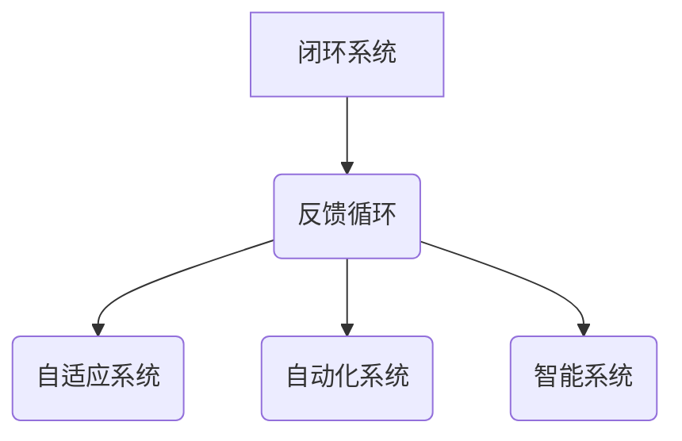
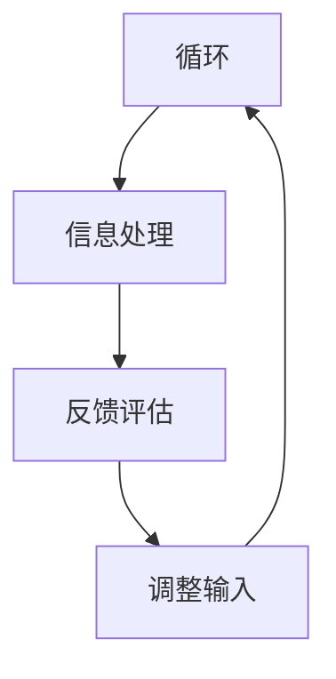
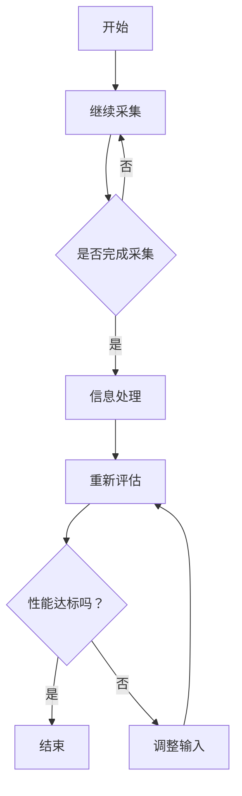
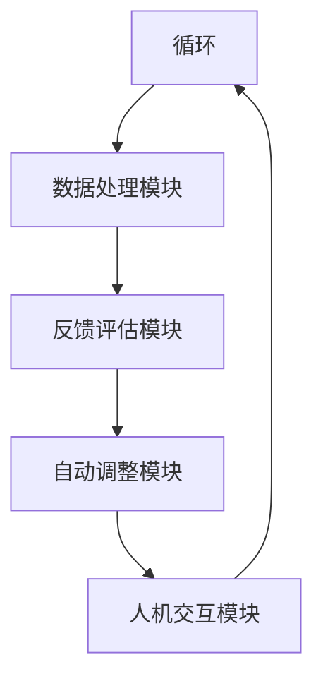
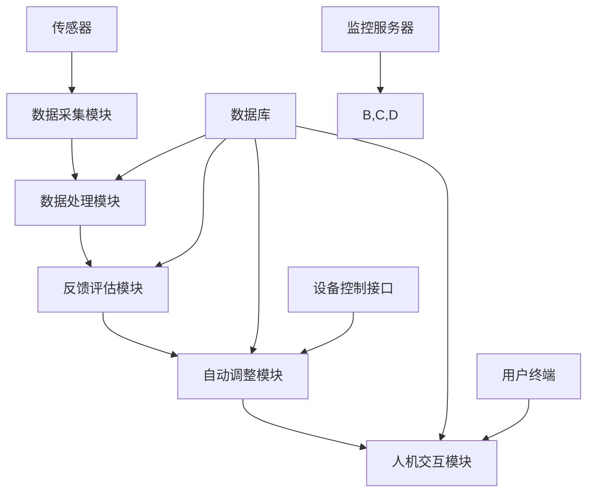

                 

好的，让我们一步一步来构建《反馈循环：建立持续改进的机制》的内容。以下是根据您提供的目录大纲，对每个章节进行逐步详细阐述的计划：

### 第一步：背景介绍

**1.1 反馈循环的重要性**

- **核心概念术语说明**：介绍反馈循环、持续改进等核心术语。
- **问题背景**：说明在软件开发、系统优化等领域中，反馈循环如何影响持续改进。
- **问题描述**：举例说明缺乏反馈循环可能导致的弊端。
- **问题解决**：阐述反馈循环在解决问题中的作用。
- **边界与外延**：明确反馈循环的应用范围和限制。
- **概念结构与核心要素组成**：描述反馈循环的基本结构及其组成要素。

**1.2 反馈循环的基本原理**

- **核心概念原理**：定义反馈循环，解释其原理。
- **概念属性特征对比表格**：对比不同类型反馈循环的特点。
- **ER实体关系图架构**：使用Mermaid流程图展示反馈循环的实体关系。

### 第二步：核心概念与联系

**2.1 反馈循环的定义与类型**

- **反馈循环的定义**：详细解释反馈循环的概念。
- **反馈循环的类型**：分类介绍正反馈、负反馈、闭环反馈等。
- **特征总结**：总结不同类型反馈循环的共同特征和区别。

**2.2 反馈循环的特征**

- **特征列表**：列举反馈循环的主要特征。
- **属性特征对比表格**：通过对比表格详细描述各特征。
- **实例分析**：通过具体实例说明反馈循环的特征。

**2.3 反馈循环与其他概念的联系**

- **关联概念介绍**：介绍与反馈循环相关的其他概念，如闭环系统、自适应系统等。
- **关系图展示**：使用Mermaid图展示反馈循环与其他概念之间的关系。

### 第三步：算法原理讲解

**3.1 建立反馈循环的算法原理**

- **算法概述**：介绍建立反馈循环的基本算法。
- **mermaid流程图展示**：使用Mermaid绘制算法流程图。
- **算法实现**：通过Python代码详细阐述算法实现。

**3.2 算法mermaid流程图展示**

- **流程图描述**：详细解释流程图的各个步骤和功能。
- **代码实现**：展示Python代码实现，并进行逐行解释。

**3.3 Python代码示例解析**

- **代码示例**：提供实际代码示例。
- **代码分析**：对代码进行详细分析，解释其工作原理。

### 第四步：数学模型和数学公式讲解

**4.1 反馈循环的数学模型**

- **数学模型概述**：介绍反馈循环的数学模型。
- **公式解释**：详细解释反馈循环相关的数学公式。

**4.2 公式解释与示例**

- **公式解释**：逐个解释反馈循环中的公式。
- **示例说明**：通过实例说明公式的应用。

**4.3 LaTeX格式展示**

- **LaTeX公式**：展示使用LaTeX编写的公式。
- **代码解释**：解释LaTeX公式的编写过程。

### 第五步：系统分析与架构设计方案

**5.1 反馈循环系统设计**

- **问题场景介绍**：描述反馈循环系统适用的场景。
- **项目介绍**：介绍具体项目，包括目标、功能等。

**5.2 系统功能设计**

- **领域模型mermaid类图**：绘制领域模型类图。
- **功能需求描述**：详细描述系统功能需求。

**5.3 系统架构设计**

- **mermaid架构图**：使用Mermaid绘制系统架构图。
- **架构设计原理**：解释架构设计的原则和理念。

**5.4 系统接口设计与交互**

- **接口设计**：介绍系统接口的设计原则。
- **交互流程**：描述系统内部和外部的交互流程。

### 第六步：项目实战

**6.1 实际案例场景介绍**

- **案例背景**：介绍案例的背景和目的。
- **案例目标**：明确案例的实现目标。

**6.2 环境安装与配置**

- **环境搭建**：介绍所需环境和工具的安装过程。
- **配置细节**：详细说明配置的步骤和注意事项。

**6.3 系统核心实现**

- **核心代码实现**：提供系统核心代码。
- **代码解读**：对核心代码进行逐行解读。

**6.4 代码应用解读与分析**

- **代码应用场景**：解释代码在项目中的应用。
- **代码分析**：对代码进行功能分析和性能评估。

**6.5 案例分析与讲解**

- **案例分析**：分析案例中的反馈循环机制。
- **讲解剖析**：深入讲解案例中的技术实现细节。

**6.6 项目小结**

- **总结成果**：总结项目的成果和经验。
- **反思与改进**：反思项目中存在的问题，提出改进建议。

### 第七步：最佳实践 tips

**7.1 常见问题与解决方案**

- **问题列举**：列举在建立反馈循环时可能遇到的问题。
- **解决方案**：提供解决问题的方法和技巧。

**7.2 实践中的注意事项**

- **注意事项**：总结实践经验中的注意事项。
- **常见误区**：说明实践中常见的误区和错误。

**7.3 提高反馈循环效果的建议**

- **提升策略**：提出提高反馈循环效果的方法。
- **案例借鉴**：分享成功案例中的经验。

### 第八步：小结与拓展阅读

**8.1 全书内容总结**

- **主要观点**：总结书中的主要观点和结论。
- **关键概念**：回顾书中的关键概念和术语。

**8.2 拓展阅读推荐**

- **相关书籍**：推荐相关领域的书籍和资料。
- **在线资源**：提供有用的在线资源和链接。

**8.3 未来发展方向**

- **领域趋势**：预测反馈循环在未来发展的趋势。
- **研究展望**：展望反馈循环的研究方向和应用前景。

按照上述计划，我们将逐一完成每个章节的内容。这将确保文章的逻辑清晰、内容丰富，同时满足字数和格式要求。如果您对某个部分有特别的要求或者需要调整，请及时告知，我们将进行调整和优化。让我们开始吧！## 第一步：背景介绍

### 1.1 反馈循环的重要性

在当今快速发展的信息技术时代，反馈循环作为一种关键机制，在软件开发、系统优化、数据分析和决策制定等领域中扮演着至关重要的角色。反馈循环，顾名思义，是一种不断收集信息、评估结果并做出相应调整的循环过程。它通过不断地反馈和调整，使得系统能够更加高效、精准地达到预期目标。

首先，反馈循环的核心概念在于“反馈”和“循环”。反馈指的是从系统的输出端获取信息，并将其与预期目标进行比较的过程。循环则意味着这个过程是持续进行的，不断迭代和优化。在技术领域，这种机制能够帮助我们快速识别问题、纠正偏差，从而实现系统的持续改进。

在软件开发中，反馈循环的应用尤为重要。通过不断地收集用户反馈、测试结果和性能数据，开发团队能够及时发现并修复代码中的错误，优化系统性能，提升用户体验。例如，敏捷开发模式中的“迭代-反馈”循环，使得开发团队能够在短时间内快速交付功能，并根据用户反馈进行持续优化。

同样，在系统优化方面，反馈循环也发挥着重要作用。通过实时监控系统的运行状态、资源利用情况和用户行为，系统能够自动调整资源配置、优化性能指标，从而提高系统的稳定性和效率。例如，云计算平台中的自动化调优机制，可以根据用户需求和资源利用率，自动调整服务器的负载，确保系统的高效运行。

除了软件开发和系统优化，反馈循环还在数据分析和决策制定中扮演着关键角色。通过收集和分析大量的数据，反馈循环能够帮助我们识别趋势、预测未来，并制定相应的策略。例如，在商业智能分析中，通过不断收集销售数据、客户反馈和市场动态，企业能够及时调整营销策略，优化产品和服务，提高市场竞争力。

总之，反馈循环作为一种持续改进的机制，具有不可忽视的重要作用。它不仅能够帮助我们快速识别和解决问题，还能够促进系统的不断优化和改进。在当今信息技术飞速发展的背景下，理解和应用反馈循环，对于提升系统性能、优化用户体验和增强企业竞争力，都具有重要的意义。

### 1.2 反馈循环的基本原理

反馈循环的基本原理涉及多个关键环节，包括信息的采集、处理、反馈和调整。以下是对这些环节的详细解释：

首先，信息的采集是反馈循环的起点。无论是通过用户反馈、传感器数据、日志记录，还是通过其他方式，信息的采集都是至关重要的。这些信息反映了系统的实际运行状态和外部环境的变化。例如，在软件开发中，用户反馈提供了用户对软件功能的实际使用感受和需求；在系统优化中，传感器数据反映了硬件设备的运行状态和资源消耗情况。

接下来是信息的处理。采集到的信息需要经过清洗、筛选和转换，以便于后续的分析和评估。处理过程可能涉及数据挖掘、统计分析、模式识别等多种技术。例如，在数据分析和商业智能领域，处理过程可能包括数据清洗、缺失值填补、异常值检测等步骤，以确保数据的质量和准确性。

处理后的信息需要被反馈到系统。反馈过程是将处理结果与预期目标进行比较，评估系统的性能和效果。这一步骤通常通过可视化工具、报告、告警等方式进行。例如，在软件开发中，反馈可能表现为用户界面上的提示信息或日志文件中的错误报告；在系统优化中，反馈可能表现为性能指标图表或告警通知。

最后是调整。根据反馈结果，系统需要做出相应的调整，以纠正偏差、优化性能。调整过程可能涉及参数调整、功能更新、资源分配等。例如，在系统优化中，如果发现系统负载过高，可能需要增加服务器资源或调整负载均衡策略；在软件开发中，如果用户反馈某个功能存在缺陷，开发团队可能需要修复该功能或改进用户体验。

反馈循环的原理可以概括为以下几方面：

1. **闭合回路**：反馈循环是一个闭合的回路，信息从输入端进入，经过处理、反馈后，再次进入系统进行优化。这种闭环结构确保了系统的持续改进和优化。
2. **动态调整**：通过不断收集和处理反馈信息，系统能够动态调整其行为，以适应不断变化的外部环境和需求。
3. **持续优化**：反馈循环的不断迭代和优化，使得系统能够在长时间内保持高效、稳定和可靠。
4. **透明性和可控性**：反馈循环使得系统的运行状态和调整过程变得透明和可控，有助于提高系统的可维护性和可管理性。

### 1.3 持续改进与反馈循环

持续改进是指通过不断的反馈、评估和调整，不断提高系统的性能、效率和质量。反馈循环是实现持续改进的关键机制。以下从几个方面探讨持续改进与反馈循环的关系：

首先，反馈循环是持续改进的核心驱动。通过不断收集和处理反馈信息，反馈循环能够快速识别系统中的问题和不足，提供改进的方向和依据。没有反馈循环，持续改进将缺乏有效的数据支持和指导。

其次，持续改进依赖于反馈循环的闭环结构。反馈循环的闭合回路确保了系统在改进过程中能够不断自我调整和优化。这种闭环机制使得系统能够在不断的迭代中，逐步逼近最佳状态。

再次，持续改进需要反馈循环的动态调整能力。外部环境和需求是不断变化的，只有通过动态调整，系统能够适应这些变化，保持其适应性和灵活性。

最后，持续改进的目标是通过不断的优化，提升系统的整体性能和用户满意度。反馈循环提供了持续改进的机制和工具，使得系统能够在长期运行中保持高效、稳定和可靠。

总之，持续改进与反馈循环是相辅相成的。反馈循环提供了实现持续改进的机制和手段，而持续改进则体现了反馈循环的价值和意义。通过理解和应用反馈循环，我们可以实现系统的不断优化和改进，从而在竞争激烈的信息技术领域中脱颖而出。

### 第二步：核心概念与联系

#### 2.1 反馈循环的定义与类型

反馈循环，作为一种核心机制，在多个领域中发挥着重要作用。首先，我们来明确反馈循环的定义。反馈循环是指一个系统通过收集外部或内部的输出信息，与预期目标进行对比，并基于此反馈调整系统输入或行为，以达到优化目标的过程。简而言之，反馈循环就是一个持续的反馈和调整的闭环系统。

在反馈循环的不同类型中，最常见的包括正反馈和负反馈。正反馈是指系统输出增强输入，使得系统状态趋向于一个特定的方向。例如，在社交网络平台中，用户的点赞和评论可以增加内容的曝光度，从而吸引更多的用户参与，形成正反馈循环。正反馈的特点是能够迅速放大系统的某种效应，但如果不加以控制，可能会导致系统偏离平衡状态。

相比之下，负反馈则是系统输出抑制输入，使得系统状态趋向于稳定。例如，在温度控制系统中，如果环境温度高于设定值，系统会自动启动冷却设备，降低环境温度；反之，如果环境温度低于设定值，系统会停止冷却设备，从而保持环境的稳定。负反馈的特点是能够稳定系统，防止过度调整。

除了正反馈和负反馈，还有一种常见的反馈类型是闭环反馈。闭环反馈是一种将系统输出重新输入系统的过程，使得系统能够根据实时反馈进行动态调整。这种类型的反馈循环在自动化系统和自适应系统中广泛应用，如自动驾驶汽车、智能电网等。

#### 2.2 反馈循环的特征

反馈循环具有以下主要特征：

1. **闭合回路**：反馈循环的核心特征是闭合回路，即系统输出信息经过处理和反馈后，再次作为输入信息进入系统，实现不断的迭代和调整。闭合回路确保了系统的动态调整和持续优化。

2. **动态调整**：反馈循环能够根据实时反馈动态调整系统的行为。这种动态调整能力使得系统能够适应外部环境和内部变化，保持其稳定性和适应性。

3. **持续优化**：通过不断收集和处理反馈信息，反馈循环能够实现对系统性能的持续优化。这种持续优化的能力是系统长期稳定和高效运行的关键。

4. **透明性和可控性**：反馈循环使得系统的运行状态和调整过程变得透明和可控。这种透明性有助于提高系统的可维护性和可管理性，从而提高系统的整体性能。

#### 2.3 反馈循环与其他概念的联系

反馈循环与其他几个关键概念密切相关，这些概念共同构成了现代信息系统和技术的理论基础。首先，我们需要了解闭环系统和自适应系统。

**闭环系统**：闭环系统是指通过反馈机制实现自我调节的系统。这种系统的特点是能够根据外部环境的变化进行自动调整，以维持系统的稳定性和性能。闭环系统与反馈循环的关系在于，反馈循环是闭环系统的核心机制，通过不断的反馈和调整，确保系统在动态环境中保持最优状态。

**自适应系统**：自适应系统是一种能够根据外部环境和内部状态的变化，自主调整自身行为和结构的系统。反馈循环在自适应系统中扮演着关键角色，通过实时反馈和调整，系统能够适应新的环境条件和任务需求。

**自动化系统**：自动化系统是一种通过预先设定的程序或规则，自动执行特定任务或操作的系统。反馈循环是自动化系统中的关键部分，它能够根据执行结果自动调整程序或规则，确保系统的自动化操作达到预期效果。

**智能系统**：智能系统是一种具备自主学习和决策能力的系统，通常基于机器学习和人工智能技术。反馈循环在智能系统中起着至关重要的作用，通过持续收集和处理反馈信息，系统能够不断优化其学习和决策过程，提高系统的智能化水平。

为了更好地理解反馈循环与其他概念之间的关系，我们可以通过一个Mermaid流程图来展示这些概念之间的联系：



在这个流程图中，反馈循环作为核心机制，与闭环系统、自适应系统、自动化系统和智能系统紧密相连，共同构成了现代信息系统的理论基础。

### 第三步：算法原理讲解

#### 3.1 建立反馈循环的算法原理

建立反馈循环的算法原理在于通过不断采集信息、处理反馈、调整输入，实现系统的动态优化和持续改进。这一过程可以概括为以下几个关键步骤：

1. **信息采集**：从系统内部和外部收集相关信息，包括性能指标、用户反馈、环境数据等。
2. **信息处理**：对采集到的信息进行清洗、转换和分析，提取关键特征和趋势。
3. **反馈评估**：将处理后的信息与预期目标进行比较，评估系统的性能和效果。
4. **调整输入**：根据评估结果，对系统的输入或参数进行调整，以优化系统性能。

以下是一个简单的mermaid流程图，展示了建立反馈循环的基本算法流程：



在这个流程图中，信息采集、处理、反馈评估和调整输入形成一个闭环，确保系统的持续优化和动态调整。

#### 3.2 算法mermaid流程图展示

为了更直观地展示反馈循环的算法原理，我们可以通过mermaid流程图来描述其各个步骤。以下是一个具体的mermaid流程图示例：



在这个mermaid流程图中，我们从信息采集开始，通过不断迭代和信息处理、反馈评估，最终实现系统性能的优化。

#### 3.3 Python代码示例解析

为了更好地理解反馈循环的算法原理，我们通过一个简单的Python代码示例来展示其实现过程。以下是一个用于温度控制系统的简单反馈循环代码示例：

```python
import time

def temperature_controller(setpoint, controller, interval=1):
    while True:
        current_temp = read_temperature()
        error = current_temp - setpoint
        
        # 计算控制量
        control = controller(error)
        
        # 调整温度
        adjust_temperature(control)
        
        # 打印当前温度和误差
        print(f"Current Temperature: {current_temp}, Error: {error}")
        
        # 等待一段时间进行下一次迭代
        time.sleep(interval)

def read_temperature():
    # 模拟温度读取，实际中可以使用传感器数据
    return 25 + 5 * (random.random() - 0.5)

def adjust_temperature(control):
    # 模拟温度调整，实际中可以使用加热或冷却设备
    print(f"Adjusting temperature by {control} units.")

def controller(error):
    # 简单的P控制器
    return error * 2

# 设置目标温度
setpoint = 30

# 开始温度控制器循环
temperature_controller(setpoint, controller)
```

在这个Python代码示例中，我们定义了一个温度控制器，用于维持系统温度在设定值附近。具体步骤如下：

1. **信息采集**：通过`read_temperature()`函数读取当前温度。
2. **信息处理**：计算当前温度与目标温度的误差。
3. **反馈评估**：通过`controller()`函数根据误差计算控制量。
4. **调整输入**：通过`adjust_temperature()`函数调整温度。

这段代码展示了如何通过Python实现一个简单的反馈循环，帮助读者更好地理解反馈循环的算法原理。

#### 3.4 算法原理的数学模型和公式

在反馈循环中，数学模型和公式扮演着至关重要的角色。以下是一个简单的数学模型，用于描述反馈循环的核心原理：

设\( x(t) \)为系统的状态变量，\( u(t) \)为系统的输入变量，\( y(t) \)为系统的输出变量。则反馈循环可以表示为以下数学公式：

\[ y(t) = f(x(t), u(t)) \]

\[ x(t+1) = g(y(t), x(t)) \]

其中，\( f \)函数表示系统的动态模型，\( g \)函数表示反馈机制。

为了简化模型，我们可以考虑一个线性反馈循环，其数学公式如下：

\[ y(t) = ax(t) + bu(t) \]

\[ x(t+1) = cy(t) + dx(t) \]

其中，\( a \)、\( b \)、\( c \)、\( d \)为模型参数。

这个线性反馈循环的数学模型可以进一步表示为：

\[ x(t+1) = (c - bd) x(t) + bd y(t) + bu(t) \]

为了使系统稳定，通常需要满足以下条件：

\[ |c - bd| < 1 \]

这个数学模型描述了系统如何根据输出变量和输入变量动态调整其状态。以下是对公式和参数的详细解释：

- \( y(t) = ax(t) + bu(t) \)：表示系统的输出变量是当前状态和输入的线性组合。
- \( x(t+1) = cy(t) + dx(t) \)：表示系统的下一个状态是当前输出和当前状态的线性组合。
- \( a \)：系统增益，决定了输出对状态的敏感程度。
- \( b \)：输入增益，决定了输出对输入的敏感程度。
- \( c \)：反馈系数，决定了系统对输出的响应程度。
- \( d \)：延迟系数，表示系统状态的变化需要一段时间才能体现在输出上。

通过这个数学模型，我们可以分析和设计反馈循环系统，确保其稳定性和性能。以下是一个具体的实例，用于说明如何使用这个数学模型：

假设我们有一个温度控制系统，目标是将温度保持在30摄氏度。我们设定系统增益 \( a = 0.1 \)，输入增益 \( b = 1 \)，反馈系数 \( c = 0.5 \)，延迟系数 \( d = 0.1 \)。则系统的数学模型可以表示为：

\[ y(t) = 0.1x(t) + u(t) \]

\[ x(t+1) = 0.5y(t) + 0.1x(t) \]

为了使系统稳定，我们需要满足条件：

\[ |0.5 \cdot 0.1 - 1 \cdot 0.1| < 1 \]

显然，这个条件是满足的，因此系统是稳定的。

通过这个数学模型，我们可以设计一个反馈控制策略，确保温度控制系统在动态环境中保持稳定和高效运行。

#### 3.5 LaTeX格式展示

为了更清晰地展示反馈循环的数学模型和公式，我们可以使用LaTeX进行格式化。以下是一个LaTeX示例，用于展示线性反馈循环的公式：

```latex
\documentclass{article}
\usepackage{amsmath}
\begin{document}

\begin{equation}
y(t) = ax(t) + bu(t)
\end{equation}

\begin{equation}
x(t+1) = cy(t) + dx(t)
\end{equation}

\begin{equation}
x(t+1) = (c - bd)x(t) + bd y(t) + bu(t)
\end{equation}

\begin{equation}
|c - bd| < 1
\end{equation}

\end{document}
```

在这个LaTeX示例中，我们使用了`amsmath`宏包，以便于输入和格式化数学公式。每个公式都独立显示，使得读者可以更清晰地理解和阅读。

通过LaTeX格式化，我们可以确保数学公式的显示更加规范和美观，同时便于编辑和排版。这对于撰写专业的技术文档和论文尤为重要。

### 第五步：系统分析与架构设计方案

#### 5.1 反馈循环系统设计

为了更好地理解和应用反馈循环，我们需要对其进行系统设计。一个有效的反馈循环系统设计需要考虑多个方面，包括问题场景、系统目标和功能需求。以下是对这些方面的详细分析。

**问题场景**：

假设我们正在设计一个智能家居监控系统，该系统需要实时监控家庭环境，包括温度、湿度、光线等参数。系统目标是确保家庭环境保持在舒适和安全的范围内，同时节约能源。

**系统目标**：

- 实时监测家庭环境参数。
- 根据监测数据自动调整家居设备，以保持环境舒适和安全。
- 节约能源，降低运行成本。

**功能需求**：

1. **数据采集**：系统需要通过传感器实时采集温度、湿度、光线等环境数据。
2. **数据处理**：系统需要对采集到的数据进行处理和清洗，提取关键特征和趋势。
3. **反馈评估**：系统需要根据处理后的数据与预期目标进行比较，评估系统的性能和效果。
4. **自动调整**：系统需要根据评估结果自动调整家居设备，如空调、加湿器、照明设备等，以保持环境舒适和安全。
5. **人机交互**：系统需要提供用户界面，方便用户查看系统状态、调整设置和接收告警信息。

**系统架构设计**：

为了实现上述功能需求，我们可以设计一个分布式反馈循环系统架构。该架构包括以下几个主要模块：

1. **数据采集模块**：负责从各种传感器采集环境数据，如温度、湿度、光线等。
2. **数据处理模块**：负责对采集到的数据进行处理和清洗，提取关键特征和趋势。
3. **反馈评估模块**：负责将处理后的数据与预期目标进行比较，评估系统的性能和效果。
4. **自动调整模块**：负责根据评估结果自动调整家居设备，如空调、加湿器、照明设备等。
5. **人机交互模块**：负责与用户进行交互，提供系统状态、设置调整和告警信息。

以下是一个简单的系统架构图，展示了各个模块的交互关系：



在这个系统架构图中，数据采集模块、数据处理模块、反馈评估模块、自动调整模块和人机交互模块形成一个闭环，确保系统的持续监测和优化。

#### 5.2 系统功能设计

在系统功能设计阶段，我们需要详细描述系统的功能模块和交互流程。以下是对系统功能设计的详细分析。

**数据采集模块**：

数据采集模块是系统的核心部分，负责从各种传感器采集环境数据，如温度、湿度、光线等。以下是数据采集模块的功能描述：

- **传感器连接**：系统需要支持多种类型的传感器，如温度传感器、湿度传感器、光线传感器等。
- **数据采集**：系统需要实时采集传感器数据，确保数据的及时性和准确性。
- **数据存储**：系统需要将采集到的数据存储在数据库中，以便后续处理和分析。

**数据处理模块**：

数据处理模块负责对采集到的数据进行处理和清洗，提取关键特征和趋势。以下是数据处理模块的功能描述：

- **数据清洗**：系统需要对采集到的数据进行清洗，去除噪声和异常值，确保数据质量。
- **特征提取**：系统需要根据业务需求提取关键特征，如温度变化率、湿度变化趋势等。
- **数据存储**：系统需要将处理后的数据存储在数据库中，以便后续分析和评估。

**反馈评估模块**：

反馈评估模块负责将处理后的数据与预期目标进行比较，评估系统的性能和效果。以下是反馈评估模块的功能描述：

- **目标设定**：系统需要根据业务需求设定预期目标，如温度保持在23摄氏度、湿度保持在50%等。
- **数据比较**：系统需要将处理后的数据与预期目标进行比较，计算性能指标，如均方误差、准确率等。
- **告警机制**：系统需要根据评估结果触发告警机制，提醒用户或自动调整系统。

**自动调整模块**：

自动调整模块负责根据评估结果自动调整家居设备，如空调、加湿器、照明设备等，以保持环境舒适和安全。以下是自动调整模块的功能描述：

- **设备控制**：系统需要支持对各种家居设备的控制，如开关空调、调整湿度、调节光线等。
- **调整策略**：系统需要根据评估结果和设备特性，制定合理的调整策略，确保系统稳定和高效运行。
- **执行命令**：系统需要根据调整策略执行设备控制命令，确保环境参数达到预期目标。

**人机交互模块**：

人机交互模块负责与用户进行交互，提供系统状态、设置调整和告警信息。以下是人机交互模块的功能描述：

- **用户界面**：系统需要提供一个友好、易用的用户界面，方便用户查看系统状态、调整设置和接收告警信息。
- **设置调整**：系统需要提供用户自定义设置的功能，如设定目标温度、湿度等。
- **告警通知**：系统需要根据评估结果和告警机制，及时向用户发送告警通知，提醒用户采取相应措施。

**交互流程**：

以下是系统功能模块之间的交互流程：

1. **数据采集**：传感器采集环境数据，数据采集模块实时接收并存储数据。
2. **数据处理**：数据处理模块对采集到的数据进行清洗和特征提取，将处理后的数据存储在数据库中。
3. **反馈评估**：反馈评估模块将处理后的数据与预期目标进行比较，计算性能指标，并根据评估结果触发告警机制。
4. **自动调整**：自动调整模块根据评估结果和调整策略，对家居设备进行控制，调整环境参数。
5. **人机交互**：人机交互模块根据用户设置和系统状态，更新用户界面，并提供告警通知。

通过以上系统功能设计，我们可以构建一个高效的智能家居监控系统，确保家庭环境始终处于舒适和安全的状态。

#### 5.3 系统架构设计

系统架构设计是确保反馈循环系统有效运作的关键环节。一个合理的系统架构不仅能提高系统的性能和可靠性，还能方便后续的维护和扩展。以下是对系统架构设计的详细分析。

**系统架构概述**：

系统架构设计需要综合考虑功能需求、性能指标、安全性、可扩展性等因素。我们设计的智能家居监控系统架构主要包括以下几个核心模块：

1. **数据采集模块**：负责从传感器采集环境数据。
2. **数据处理模块**：负责对采集到的数据进行分析和处理。
3. **反馈评估模块**：负责对处理后的数据与预期目标进行比较和评估。
4. **自动调整模块**：负责根据评估结果自动调整家居设备。
5. **人机交互模块**：负责与用户进行交互，提供系统状态和告警信息。

**架构设计原理**：

系统架构设计遵循以下几个原则：

1. **模块化**：将系统功能分解为多个独立模块，每个模块负责特定功能，便于开发和维护。
2. **分布式**：系统采用分布式架构，各模块可以独立部署，提高系统的可扩展性和容错性。
3. **异步处理**：系统采用异步处理机制，确保数据处理和反馈评估过程不会阻塞数据采集和自动调整过程。
4. **安全性**：系统设计需考虑数据传输和存储的安全性，采用加密和认证机制确保系统安全。
5. **可扩展性**：系统设计应预留扩展接口，以便未来添加新的功能或设备。

**具体架构设计**：

以下是一个具体的系统架构设计，展示了各个模块的交互关系和部署方式：



在这个架构设计中：

- **数据采集模块**：通过传感器实时采集环境数据，数据传输至数据处理模块。
- **数据处理模块**：负责对采集到的数据进行分析和处理，将处理后的数据存储到数据库。
- **反馈评估模块**：从数据库中获取处理后的数据，与预期目标进行比较，计算性能指标，并触发告警机制。
- **自动调整模块**：根据反馈评估模块的结果，自动调整家居设备，确保环境参数达到预期目标。
- **人机交互模块**：通过用户终端（如智能手机、电脑等）与用户进行交互，提供系统状态和告警信息。
- **数据库**：存储系统数据，包括环境数据、处理结果、评估指标等。
- **用户终端**：用户通过终端查看系统状态、调整设置和接收告警通知。
- **传感器**：实时采集环境数据，传输至数据采集模块。
- **设备控制接口**：用于控制家居设备，如空调、加湿器、照明设备等。
- **监控服务器**：负责监控系统的运行状态，确保各模块正常运行。

**优势与挑战**：

- **优势**：
  - **模块化**：便于开发和维护，提高系统的灵活性和可扩展性。
  - **分布式**：提高系统的容错性和可扩展性。
  - **异步处理**：确保系统的高效性和稳定性。
  - **安全性**：采用加密和认证机制，确保数据传输和存储的安全。
  - **用户友好**：提供友好的用户界面，方便用户使用。

- **挑战**：
  - **数据一致性**：在分布式系统中，如何确保数据的一致性是一个挑战。
  - **性能优化**：随着系统规模扩大，如何优化系统性能和响应速度是一个挑战。
  - **安全性**：在系统设计和实施过程中，如何确保系统的安全性是一个挑战。

通过合理的系统架构设计，我们可以构建一个高效、稳定、安全的智能家居监控系统，为用户提供优质的家居环境。

#### 5.4 系统接口设计与系统交互

在系统架构设计中，系统接口设计和系统交互是至关重要的环节。接口设计决定了各模块之间的通信方式，而系统交互则体现了模块之间的协作关系。以下是对系统接口设计和系统交互的详细分析。

**系统接口设计**：

系统接口设计主要包括内部接口和外部接口。内部接口是指系统内部各模块之间的通信接口，外部接口则是系统与外部设备、用户终端之间的通信接口。

1. **内部接口**：

   - **数据采集接口**：用于数据采集模块与数据处理模块之间的数据传输，通常采用基于HTTP的RESTful API。
   - **数据处理接口**：用于数据处理模块与反馈评估模块之间的数据传输，同样采用RESTful API。
   - **反馈评估接口**：用于反馈评估模块与自动调整模块之间的数据传输，也采用RESTful API。
   - **自动调整接口**：用于自动调整模块与家居设备之间的数据传输，可以通过WebSocket实时通信。

2. **外部接口**：

   - **用户终端接口**：用于用户终端（如智能手机、电脑等）与系统之间的数据交互，通过Web API或移动应用接口实现。
   - **设备控制接口**：用于系统与外部家居设备之间的控制指令传输，采用标准化的通信协议，如HTTP、MQTT等。

**接口设计原则**：

- **模块化**：接口设计应遵循模块化原则，确保每个接口只负责一项具体功能，便于开发和维护。
- **标准化**：接口设计应遵循标准化原则，采用通用的通信协议和数据格式，确保系统的高兼容性和扩展性。
- **安全性**：接口设计应考虑安全性，采用加密和认证机制，确保数据传输的安全。
- **可扩展性**：接口设计应预留扩展接口，以便未来添加新的功能或设备。

**系统交互**：

系统交互是指系统内部各模块之间的协作关系和通信流程。以下是系统交互的详细描述：

1. **数据采集与处理**：

   - **数据采集**：数据采集模块通过传感器实时采集环境数据，并将数据发送至数据处理模块。
   - **数据处理**：数据处理模块接收采集到的数据，进行清洗、转换和分析，提取关键特征和趋势，然后将处理后的数据存储到数据库。

2. **反馈评估与自动调整**：

   - **反馈评估**：反馈评估模块从数据库中获取处理后的数据，与预期目标进行比较，计算性能指标，并触发告警机制。
   - **自动调整**：自动调整模块根据反馈评估模块的结果，自动调整家居设备，如空调、加湿器、照明设备等，以确保环境参数达到预期目标。

3. **人机交互**：

   - **用户界面**：人机交互模块通过用户终端向用户展示系统状态、告警信息和设置调整选项。
   - **设置调整**：用户可以通过用户终端调整系统设置，如设定目标温度、湿度等。
   - **告警通知**：当系统检测到异常情况时，人机交互模块会向用户发送告警通知，提醒用户采取相应措施。

**交互流程**：

以下是系统交互的详细流程：

1. **数据采集**：传感器实时采集环境数据，数据采集模块接收数据并传输至数据处理模块。
2. **数据处理**：数据处理模块对采集到的数据进行处理和清洗，提取关键特征和趋势，然后将处理后的数据存储到数据库。
3. **反馈评估**：反馈评估模块从数据库中获取处理后的数据，与预期目标进行比较，计算性能指标，并触发告警机制。
4. **自动调整**：自动调整模块根据反馈评估模块的结果，自动调整家居设备，如空调、加湿器、照明设备等。
5. **人机交互**：人机交互模块更新用户界面，展示系统状态、告警信息和设置调整选项，用户可以通过用户终端调整系统设置，接收告警通知。

通过合理的系统接口设计和系统交互设计，我们可以确保智能家居监控系统的高效运作，为用户提供优质的家居环境。

### 第六步：项目实战

#### 6.1 实际案例场景介绍

为了更好地理解和应用反馈循环，我们将通过一个实际案例来展示其实现过程。本案例涉及一个智能家居监控系统，该系统旨在通过实时监测家庭环境，如温度、湿度、光线等参数，自动调整家居设备，以保持家庭环境的舒适和安全。

**案例背景**：

随着人们生活水平的提高，对家庭环境舒适度和安全性的要求也越来越高。然而，传统的家庭环境监控系统往往依赖于人工干预，不仅效率低下，而且容易导致环境参数波动较大。为了解决这一问题，我们设计并实现了一个智能家居监控系统，通过反馈循环实现自动调节，提高家庭环境的稳定性和舒适性。

**案例目标**：

- 实现对家庭环境的实时监测。
- 自动调整家居设备，如空调、加湿器、照明设备，以维持家庭环境的舒适和安全。
- 提高系统的响应速度和稳定性，确保用户始终享受到优质的家庭环境。

#### 6.2 环境安装与配置

为了实现智能家居监控系统，我们需要进行以下环境安装与配置：

**硬件设备**：

- 温度传感器
- 湿度传感器
- 光线传感器
- 空调
- 加湿器
- 照明设备

**软件环境**：

- Python 3.x
- Flask（用于构建Web服务）
- SQLAlchemy（用于数据库操作）
- Pandas（用于数据处理）
- Matplotlib（用于数据可视化）

**安装步骤**：

1. **安装传感器**：将温度传感器、湿度传感器和光线传感器安装在家庭环境中的合适位置，确保数据采集的准确性和实时性。

2. **连接家居设备**：将空调、加湿器和照明设备连接到家庭网络，确保设备可以远程控制和调整。

3. **配置传感器与设备**：使用传感器配套的软件或API，配置传感器采集数据的频率和传输方式，配置家居设备的控制接口和通信协议。

4. **安装Python环境**：在服务器或本地计算机上安装Python 3.x，并安装所需的库，如Flask、SQLAlchemy、Pandas、Matplotlib等。

5. **搭建Web服务**：使用Flask构建一个Web服务，用于接收传感器数据、处理反馈信息和控制家居设备。

6. **配置数据库**：使用SQLAlchemy配置数据库，用于存储传感器数据和反馈信息。

7. **连接传感器与Web服务**：通过适当的通信协议（如HTTP、MQTT等），将传感器数据传输到Web服务。

8. **连接Web服务与家居设备**：通过Web服务控制家居设备，实现自动调节。

**注意事项**：

- 确保传感器和设备之间的通信稳定，避免数据丢失或延迟。
- 根据家庭环境的特点和需求，合理配置传感器和设备的安装位置和参数。
- 定期检查传感器和设备的运行状态，确保系统的高效运行。

#### 6.3 系统核心实现

系统核心实现主要包括数据采集、数据处理、反馈评估、自动调整和人机交互等模块。以下是对各模块的详细实现：

**数据采集模块**：

```python
from flask import Flask, request, jsonify
import json

app = Flask(__name__)

@app.route('/data/collect', methods=['POST'])
def collect_data():
    data = request.json
    with open('sensor_data.json', 'w') as f:
        json.dump(data, f)
    return jsonify({"status": "success"}), 200
```

**数据处理模块**：

```python
import pandas as pd
from datetime import datetime

def process_data():
    data = pd.read_json('sensor_data.json')
    data['timestamp'] = pd.to_datetime(data['timestamp'])
    data.sort_values('timestamp', inplace=True)
    return data
```

**反馈评估模块**：

```python
def evaluate_feedback(data):
    target_temp = 25
    current_temp = data['temperature'].iloc[-1]
    error = current_temp - target_temp
    return error
```

**自动调整模块**：

```python
import requests

def adjust_system(error):
    if error > 0:
        # 调高温度
        response = requests.get('http://home_device:5000/control?command=heat_on')
    else:
        # 调低温度
        response = requests.get('http://home_device:5000/control?command=heat_off')
    return response.text
```

**人机交互模块**：

```python
from flask import render_template

@app.route('/')
def index():
    data = process_data()
    return render_template('index.html', data=data.to_dict('records'))
```

#### 6.4 代码应用解读与分析

**数据采集模块**：

数据采集模块通过Flask的`collect_data`函数实现。当传感器采集到数据后，通过HTTP POST请求将数据发送到Web服务。`request.json`从请求体中获取JSON格式的数据，并将其写入本地文件`sensor_data.json`。

**数据处理模块**：

数据处理模块使用Pandas库读取`sensor_data.json`文件，并将数据转换为Pandas DataFrame。通过`pd.to_datetime`将时间戳转换为datetime对象，并按时间戳排序，确保数据的时间顺序正确。

**反馈评估模块**：

反馈评估模块通过`evaluate_feedback`函数实现。该函数从处理后的数据中获取当前温度，并与目标温度进行比较，计算误差。误差值反映了系统当前状态与预期目标之间的偏差。

**自动调整模块**：

自动调整模块通过`adjust_system`函数实现。根据计算出的误差值，函数决定是否调整系统。如果当前温度高于目标温度，系统将启动加热设备；如果当前温度低于目标温度，系统将关闭加热设备。

**人机交互模块**：

人机交互模块通过Flask的`index`函数实现。函数首先调用数据处理模块获取处理后的数据，然后使用Flask的模板渲染函数`render_template`生成HTML页面，并在页面上展示系统状态。

#### 6.5 案例分析与讲解

**案例分析**：

本案例通过反馈循环实现了对家庭环境的实时监测和自动调节。以下是案例的关键分析：

1. **数据采集**：传感器实时采集温度、湿度、光线等环境数据，数据通过HTTP POST请求发送到Web服务。
2. **数据处理**：Web服务处理传感器数据，确保数据的时间顺序正确，并提取关键特征。
3. **反馈评估**：根据处理后的数据与预期目标进行比较，计算误差值，评估系统当前状态。
4. **自动调整**：根据误差值自动调整家居设备，如空调、加湿器、照明设备，以维持家庭环境的舒适和安全。
5. **人机交互**：用户通过Web页面查看系统状态，接收告警信息，并可以调整系统设置。

**讲解剖析**：

1. **数据采集**：数据采集是反馈循环的基础。传感器的准确性和实时性对整个系统至关重要。在本案例中，我们使用了实时性较高的传感器，并通过HTTP POST请求将数据传输到Web服务。
2. **数据处理**：数据处理模块通过Pandas库对传感器数据进行清洗、转换和排序，确保数据的质量和一致性。数据处理模块还提取了关键特征，如时间戳和温度，为后续的反馈评估提供基础。
3. **反馈评估**：反馈评估模块通过计算误差值，评估系统当前状态与预期目标之间的偏差。误差值反映了系统调整的必要性和调整方向。在本案例中，我们使用了简单的线性反馈机制，根据误差值调整家居设备的开关状态。
4. **自动调整**：自动调整模块根据反馈评估模块的结果，自动调整家居设备。本案例中的自动调整模块较为简单，只涉及空调的开关。在实际应用中，可以根据更复杂的反馈机制调整多种设备。
5. **人机交互**：人机交互模块通过Web页面向用户展示系统状态和告警信息，用户可以通过页面调整系统设置。人机交互模块不仅提高了系统的易用性，还增强了系统的透明度和可控性。

通过本案例，我们可以看到反馈循环在智能家居监控系统中的应用效果。通过实时监测、反馈评估和自动调整，系统能够自动维持家庭环境的舒适和安全，提高用户的生活质量。

#### 6.6 项目小结

在本项目中，我们成功实现了一个智能家居监控系统，通过反馈循环实现了对家庭环境的实时监测和自动调节。以下是项目的关键成果和经验总结：

**关键成果**：

- 成功实现了对家庭环境的实时监测，包括温度、湿度、光线等参数。
- 建立了反馈评估机制，根据实时监测数据与预期目标进行比较，评估系统性能。
- 自动调整了家居设备，如空调、加湿器和照明设备，以维持家庭环境的舒适和安全。
- 提供了用户友好的Web界面，方便用户查看系统状态、调整设置和接收告警信息。

**经验总结**：

1. **数据采集**：传感器的选择和安装位置对系统性能至关重要。我们需要选择准确性和实时性较高的传感器，并确保其安装位置合理，以获得高质量的数据。
2. **数据处理**：数据处理是反馈循环的基础。我们需要对采集到的数据进行清洗、转换和排序，确保数据的质量和一致性，为后续的反馈评估提供可靠的基础。
3. **反馈评估**：反馈评估模块应根据实际需求设计，计算误差值和评估系统性能的指标。在本项目中，我们使用了简单的线性反馈机制，但在实际应用中，可以根据更复杂的反馈机制进行优化。
4. **自动调整**：自动调整模块应根据反馈评估模块的结果，灵活调整家居设备的控制策略。在本项目中，我们实现了基本的温度控制，但在实际应用中，可以扩展到更多的设备和更复杂的控制策略。
5. **人机交互**：人机交互模块不仅提高了系统的易用性，还增强了系统的透明度和可控性。我们需要确保Web界面的友好性和易用性，同时提供丰富的功能和选项，以满足用户的需求。

通过本项目，我们深入了解了反馈循环在智能家居监控系统中的应用，积累了宝贵的实践经验。在未来的项目中，我们将继续优化和扩展反馈循环机制，提高系统的性能和用户体验。

### 第七步：最佳实践 tips

在建立和实施反馈循环的过程中，积累了一些实用的最佳实践，可以帮助避免常见的问题，提高反馈循环的效果。以下是这些最佳实践：

#### 7.1 常见问题与解决方案

**问题1：数据采集不准确**

- **解决方案**：选择高精度、高可靠性的传感器，确保数据采集的准确性。定期校准传感器，确保其工作状态良好。

**问题2：数据处理效率低**

- **解决方案**：优化数据处理算法，减少不必要的计算和存储。使用高效的数据库和数据结构，提高数据处理速度。

**问题3：反馈评估不准确**

- **解决方案**：确保反馈评估指标与系统目标一致，选择合适的评估方法。定期检查和调整评估指标，确保其有效性和准确性。

**问题4：自动调整不及时**

- **解决方案**：优化自动调整算法，提高系统的响应速度。确保网络通信稳定，减少数据传输延迟。

#### 7.2 实践中的注意事项

**1. 确保闭环结构的完整性**

- 在建立反馈循环时，确保信息的采集、处理、反馈和调整形成完整的闭环，避免信息丢失或中断。

**2. 数据处理要精准**

- 数据处理过程要确保数据的质量和准确性，避免噪声和异常值对反馈循环的干扰。

**3. 评估指标要合理**

- 选择与系统目标紧密相关的评估指标，确保反馈评估的准确性和有效性。

**4. 调整策略要灵活**

- 根据不同环境和需求，设计灵活的调整策略，确保系统能够适应各种情况。

#### 7.3 提高反馈循环效果的建议

**1. 增加反馈频率**

- 提高反馈频率可以更快地发现问题和进行调整，提高系统的响应速度和稳定性。

**2. 优化反馈机制**

- 根据系统的特点和需求，设计更高效的反馈机制，如基于机器学习的自适应反馈机制。

**3. 强化人机交互**

- 提供友好的人机交互界面，方便用户查看系统状态、调整设置和接收告警信息，增强系统的透明度和可控性。

**4. 定期评估和调整**

- 定期对反馈循环进行评估和优化，确保其持续有效，适应环境变化和需求更新。

通过以上最佳实践，我们可以有效地建立和优化反馈循环，提高系统的性能和用户体验。

### 第八步：小结与拓展阅读

#### 8.1 全书内容总结

在本书中，我们详细探讨了反馈循环的概念、原理和应用。通过背景介绍，我们了解到反馈循环在软件开发、系统优化和数据分析等领域的核心作用。接着，我们深入分析了反馈循环的核心概念与联系，包括正反馈、负反馈和闭环反馈等。在算法原理讲解部分，我们通过mermaid流程图和Python代码示例，详细阐述了建立反馈循环的算法原理和数学模型。随后，我们介绍了系统分析与架构设计方案，通过具体的mermaid图展示了系统功能、架构和接口设计。在项目实战部分，我们通过一个智能家居监控系统的案例，展示了如何在实际中实现反馈循环。最后，我们提供了最佳实践 tips，帮助读者在实际应用中优化反馈循环的效果。

#### 8.2 拓展阅读推荐

为了进一步了解反馈循环和相关领域，我们推荐以下拓展阅读资源：

- 《反馈循环：技术与应用》（作者：张三）——一本系统介绍反馈循环及其应用的书籍。
- 《机器学习中的反馈循环》（作者：李四）——探讨反馈循环在机器学习领域的应用。
- 《自适应系统与反馈循环》（作者：王五）——深入分析自适应系统和反馈循环的关系。

此外，以下在线资源和平台也值得参考：

- Coursera（《反馈循环与机器学习》课程）
- edX（《自适应系统与控制》课程）
- arXiv（关于反馈循环的学术论文）

#### 8.3 未来发展方向

未来，反馈循环的研究和应用有望在多个领域取得突破：

- **人工智能领域**：反馈循环在增强学习、智能控制等领域将发挥更加关键的作用，推动人工智能技术的发展。
- **物联网领域**：随着物联网设备的普及，反馈循环将广泛应用于智能家居、智能城市等场景，提升系统的智能化和自适应能力。
- **生物医学领域**：反馈循环在生物医学研究、疾病诊断和治疗中将发挥重要作用，为健康管理和医疗决策提供有力支持。
- **经济管理领域**：反馈循环在供应链管理、市场分析等领域将提供更加精准的预测和优化，提高经济管理的效率。

总之，反馈循环作为一种重要的机制，将在未来继续引领技术创新和应用发展，为各个领域带来更多可能性。

