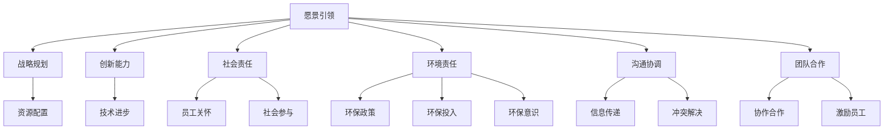

                 

# 可持续发展领导：平衡经济、社会和环境责任

> 关键词：可持续发展，经济责任，社会责任，环境责任，领导力

> 摘要：本文旨在探讨可持续发展领导在平衡经济、社会和环境责任中的重要作用。通过分析经济、社会和环境责任的内涵及其相互关系，本文提出了可持续发展领导力的模型，并探讨了其实践路径和未来趋势。

## 目录大纲

## 第一部分：导论

### 1.1 书籍背景及核心概念

#### 1.1.1 问题背景

#### 1.1.2 可持续发展的内涵

#### 1.1.3 领导在可持续发展中的角色

### 1.2 核心概念

#### 1.2.1 经济责任

#### 1.2.2 社会责任

#### 1.2.3 环境责任

### 1.3 边界与外延

#### 1.3.1 可持续发展的范围

#### 1.3.2 可持续发展的挑战与机遇

### 1.4 本书结构安排

#### 1.4.1 各章节核心内容

#### 1.4.2 阅读指南

## 第二部分：经济责任

### 2.1 经济责任概述

#### 2.1.1 经济责任的概念

#### 2.1.2 经济责任的内涵

### 2.2 经济责任的关键要素

#### 2.2.1 财务绩效

#### 2.2.2 创新能力

#### 2.2.3 市场竞争力

### 2.3 经济责任的实践案例

#### 2.3.1 成功案例分析

#### 2.3.2 失败案例分析

### 2.4 经济责任与可持续发展

#### 2.4.1 经济责任在可持续发展中的作用

#### 2.4.2 经济责任实现可持续发展的路径

## 第三部分：社会责任

### 3.1 社会责任概述

#### 3.1.1 社会责任的概念

#### 3.1.2 社会责任的内涵

### 3.2 社会责任的关键要素

#### 3.2.1 社会福祉

#### 3.2.2 公平与包容

#### 3.2.3 社会贡献

### 3.3 社会责任的实践案例

#### 3.3.1 成功案例分析

#### 3.3.2 失败案例分析

### 3.4 社会责任与可持续发展

#### 3.4.1 社会责任在可持续发展中的作用

#### 3.4.2 社会责任实现可持续发展的路径

## 第四部分：环境责任

### 4.1 环境责任概述

#### 4.1.1 环境责任的概念

#### 4.1.2 环境责任的内涵

### 4.2 环境责任的关键要素

#### 4.2.1 环境保护

#### 4.2.2 资源利用效率

#### 4.2.3 环境风险防控

### 4.3 环境责任的实践案例

#### 4.3.1 成功案例分析

#### 4.3.2 失败案例分析

### 4.4 环境责任与可持续发展

#### 4.4.1 环境责任在可持续发展中的作用

#### 4.4.2 环境责任实现可持续发展的路径

## 第五部分：领导力与可持续发展

### 5.1 领导力概述

#### 5.1.1 领导力的定义

#### 5.1.2 领导力的内涵

### 5.2 领导力在可持续发展中的作用

#### 5.2.1 领导力对经济责任的影响

#### 5.2.2 领导力对社会责任的影响

#### 5.2.3 领导力对环境责任的影响

### 5.3 可持续发展领导力模型

#### 5.3.1 模型构建

#### 5.3.2 模型应用

### 5.4 可持续发展领导力的实践案例

#### 5.4.1 成功案例分析

#### 5.4.2 失败案例分析

## 第六部分：整合与战略

### 6.1 整合与战略概述

#### 6.1.1 整合与战略的概念

#### 6.1.2 整合与战略的内涵

### 6.2 整合与战略的关键要素

#### 6.2.1 企业使命与愿景

#### 6.2.2 企业战略规划

#### 6.2.3 企业绩效评估

### 6.3 整合与战略的实现路径

#### 6.3.1 整合与战略的制定

#### 6.3.2 整合与战略的执行

#### 6.3.3 整合与战略的评估与调整

## 第七部分：结论与展望

### 7.1 结论

#### 7.1.1 主要观点总结

#### 7.1.2 研究局限与展望

### 7.2 可持续发展领导力的未来趋势

#### 7.2.1 政策环境的变化

#### 7.2.2 技术创新的影响

#### 7.2.3 全球化背景下的挑战与机遇

# 第一部分：导论

## 1.1 书籍背景及核心概念

### 1.1.1 问题背景

在当今全球化的背景下，可持续发展已成为世界各国共同关注的议题。经济的发展、社会的进步和环境的保护，这三者之间存在着复杂的相互作用和依赖关系。然而，长期以来，这三者之间的平衡往往难以实现。一方面，追求经济利益最大化往往会导致环境破坏和资源消耗；另一方面，过分强调社会公平和福利也会对经济增长产生负面影响。因此，如何在经济、社会和环境责任之间找到平衡，成为领导者和政策制定者面临的重要挑战。

### 1.1.2 可持续发展的内涵

可持续发展是指在满足当前需求的同时，不损害后代满足其需求的能力的发展。它不仅关注经济增长，还关注社会进步和环境保护。可持续发展的内涵包括以下几个方面：

1. **经济可持续发展**：确保经济的长期增长，同时实现资源的有效利用和经济的创新。
2. **社会可持续发展**：促进社会公正、公平和包容，提高人们的生活质量和幸福感。
3. **环境可持续发展**：保护自然环境和生态系统，确保其长期健康和稳定。

### 1.1.3 领导在可持续发展中的角色

领导者在推动可持续发展中扮演着关键角色。他们不仅是决策者，还是变革推动者和社会影响者。领导者的职责包括：

1. **战略规划**：制定明确的发展目标和战略，确保经济、社会和环境的协调发展。
2. **资源调配**：合理分配资源，确保经济、社会和环境的合理需求得到满足。
3. **文化塑造**：塑造企业的可持续发展文化，鼓励员工参与和贡献。
4. **合作与沟通**：与其他利益相关者建立合作关系，共同推动可持续发展。

## 1.2 核心概念

### 1.2.1 经济责任

经济责任是指企业在追求利润的同时，对经济增长、就业创造和税收贡献等方面所承担的责任。经济责任的实现有助于企业的长期发展和竞争力提升。

1. **财务绩效**：企业需要实现良好的财务绩效，确保持续的资金流和盈利能力。
2. **创新能力**：通过技术创新和管理创新，提高生产效率和产品质量。
3. **市场竞争力**：通过市场定位和营销策略，提升企业的市场占有率和品牌影响力。

### 1.2.2 社会责任

社会责任是指企业对员工、客户、供应商和社区等利益相关者所承担的责任。社会责任的实现有助于提高企业的社会形象和声誉。

1. **社会福祉**：关注员工福利和员工发展，提供良好的工作环境和培训机会。
2. **公平与包容**：促进公平就业和多样性的工作环境，反对歧视和偏见。
3. **社会贡献**：通过慈善捐赠和社区参与，回馈社会，促进社会进步。

### 1.2.3 环境责任

环境责任是指企业在环境保护和资源管理方面所承担的责任。环境责任的实现有助于减少环境污染和资源浪费，保护生态环境。

1. **环境保护**：采取环保措施，减少污染物排放和资源浪费。
2. **资源利用效率**：提高资源利用效率，降低单位产出的资源消耗。
3. **环境风险防控**：预防和管理环境风险，确保企业的可持续发展。

## 1.3 边界与外延

### 1.3.1 可持续发展的范围

可持续发展不仅关注企业的内部管理和运营，还涉及企业与其外部环境的互动。可持续发展的范围包括：

1. **企业内部**：企业内部的资源管理、生产过程、员工福利等。
2. **产业链**：企业与供应商、客户之间的互动，包括供应链管理和社会责任。
3. **社区和环境**：企业与所在社区的互动，以及对企业所在环境的影响。

### 1.3.2 可持续发展的挑战与机遇

可持续发展的挑战主要包括：

1. **资源约束**：资源有限，如何实现资源的有效利用和可持续发展。
2. **环境污染**：环境污染问题日益严重，如何减少污染物排放和保护生态环境。
3. **社会不公**：社会不平等和贫困问题，如何促进社会公正和包容。

可持续发展的机遇主要包括：

1. **技术创新**：通过技术创新实现资源的节约和环境的保护。
2. **政策支持**：政府政策的支持和引导，为企业的可持续发展创造有利条件。
3. **市场机遇**：消费者对可持续产品和服务的需求增加，为企业创造了新的市场机会。

### 1.4 本书结构安排

#### 1.4.1 各章节核心内容

本书分为七个部分，各部分的核心内容如下：

1. **导论**：介绍可持续发展的背景和核心概念，以及领导者在其中的角色。
2. **经济责任**：探讨企业经济责任的概念、内涵和关键要素，以及经济责任与可持续发展的关系。
3. **社会责任**：分析企业社会责任的概念、内涵和关键要素，以及社会责任与可持续发展的关系。
4. **环境责任**：阐述企业环境责任的概念、内涵和关键要素，以及环境责任与可持续发展的关系。
5. **领导力与可持续发展**：探讨领导力在可持续发展中的重要作用，构建可持续发展领导力模型。
6. **整合与战略**：讨论企业如何通过整合与战略实现可持续发展，包括企业使命与愿景、战略规划和企业绩效评估。
7. **结论与展望**：总结本书的主要观点，展望可持续发展领导力的未来趋势。

#### 1.4.2 阅读指南

本书适合企业领导者、政策制定者、企业管理人员和可持续发展研究人员阅读。读者可以通过以下步骤进行阅读：

1. **快速阅读**：首先快速阅读本书的目录和各章节摘要，了解本书的结构和核心内容。
2. **深入阅读**：逐章阅读，深入理解每个章节的核心概念和案例分析。
3. **实践应用**：结合实际情况，将本书的理论和方法应用于企业的可持续发展实践中。
4. **持续学习**：关注可持续发展的最新动态，不断学习和更新知识。

## 第二部分：经济责任

### 2.1 经济责任概述

#### 2.1.1 经济责任的概念

经济责任是企业对经济活动中的利益相关者承担的责任。它不仅包括企业自身的财务绩效，还包括企业的创新能力、市场竞争力等方面。经济责任的实现有助于企业的长期发展和竞争力提升。

#### 2.1.2 经济责任的内涵

经济责任的内涵包括以下几个方面：

1. **财务绩效**：企业需要实现良好的财务绩效，确保持续的资金流和盈利能力。这包括利润、现金流、资产回报率等关键财务指标。
2. **创新能力**：企业需要通过技术创新和管理创新，提高生产效率和产品质量，从而增强市场竞争力。
3. **市场竞争力**：企业需要通过市场定位和营销策略，提升企业的市场占有率和品牌影响力。

### 2.2 经济责任的关键要素

#### 2.2.1 财务绩效

财务绩效是企业经济责任的核心要素。良好的财务绩效不仅能够确保企业的生存和发展，还能为投资者和利益相关者带来回报。

1. **利润**：利润是企业经营的直接表现，是企业追求的经济目标。
2. **现金流**：现金流是企业日常运营的基础，是企业偿还债务和投资的关键。
3. **资产回报率**：资产回报率反映了企业利用资产的效率，是企业财务绩效的重要指标。

#### 2.2.2 创新能力

创新能力是企业持续发展的动力。通过技术创新和管理创新，企业可以提高生产效率和产品质量，从而在市场竞争中占据优势。

1. **研发投入**：企业需要投入足够的资金和人力资源进行研发，以推动技术创新。
2. **知识产权**：企业需要保护和利用自己的知识产权，以保持市场竞争力。
3. **市场响应**：企业需要快速响应市场需求和技术变化，以保持市场竞争力。

#### 2.2.3 市场竞争力

市场竞争力是企业能否在激烈的市场竞争中脱颖而出的关键。通过市场定位和营销策略，企业可以提升品牌影响力和市场份额。

1. **市场定位**：企业需要明确自己的市场定位，以吸引目标客户。
2. **营销策略**：企业需要制定有效的营销策略，包括广告、促销、定价等，以提升品牌知名度和市场份额。
3. **品牌建设**：企业需要建立和维护良好的品牌形象，以增强客户忠诚度和市场竞争力。

### 2.3 经济责任的实践案例

#### 2.3.1 成功案例分析

1. **苹果公司**：苹果公司通过持续的创新和优质的产品，赢得了全球市场的青睐。其高利润、高现金流和强大的品牌影响力，体现了其在经济责任方面的成功。
2. **特斯拉公司**：特斯拉公司通过在电动汽车领域的创新，推动了汽车行业的绿色转型。其高市场占有率和品牌影响力，展示了其在经济责任方面的成功。

#### 2.3.2 失败案例分析

1. **安然公司**：安然公司因财务造假和内部腐败，最终导致公司破产。其失败的根本原因是忽视了经济责任，导致财务绩效严重下滑。
2. **通用电气公司**：通用电气公司在过去几年中，因财务问题和管理失误，导致股价大幅下跌。其经济责任的缺失，对其长期发展造成了严重影响。

### 2.4 经济责任与可持续发展

#### 2.4.1 经济责任在可持续发展中的作用

经济责任是可持续发展的重要组成部分。通过实现良好的财务绩效、创新能力和市场竞争力，企业可以推动经济的可持续发展。

1. **经济绩效**：良好的经济绩效可以吸引投资者，为企业的可持续发展提供资金支持。
2. **创新能力**：通过持续的技术创新，企业可以提高生产效率和产品质量，减少资源浪费，实现经济的可持续发展。
3. **市场竞争力**：通过提升市场竞争力，企业可以在市场中占据有利地位，实现长期的经济增长。

#### 2.4.2 经济责任实现可持续发展的路径

企业可以通过以下路径实现经济责任与可持续发展的结合：

1. **制定可持续发展战略**：企业需要制定明确的可持续发展战略，确保经济、社会和环境责任的协调发展。
2. **创新商业模式**：企业可以通过创新商业模式，实现经济效益和社会效益的双赢。
3. **绿色供应链管理**：企业可以通过绿色供应链管理，降低生产成本，提高资源利用效率，实现经济的可持续发展。

### 2.5 经济责任的相关政策

#### 2.5.1 政策概述

政府通过制定相关政策，鼓励企业承担经济责任，推动经济的可持续发展。

1. **税收优惠**：政府可以为企业提供税收优惠，鼓励企业投资研发和创新。
2. **补贴和支持**：政府可以为企业提供补贴和支持，帮助企业在环保和节能减排方面取得进展。
3. **法律法规**：政府可以通过制定法律法规，规范企业的经济行为，确保企业的经济责任得到履行。

#### 2.5.2 政策案例

1. **美国的税收优惠政策**：美国政府通过提供税收优惠，鼓励企业投资研发和创新，推动经济的可持续发展。
2. **中国的节能减排政策**：中国政府通过制定节能减排政策，规范企业的经济行为，推动经济的可持续发展。

## 第三部分：社会责任

### 3.1 社会责任概述

#### 3.1.1 社会责任的概念

社会责任是指企业在其经营活动中，对社会和环境承担的责任。它包括企业对员工、客户、供应商和社区等利益相关者的责任。社会责任是企业履行其社会义务的重要体现。

#### 3.1.2 社会责任的内涵

社会责任的内涵包括以下几个方面：

1. **员工责任**：企业需要关注员工的福利和发展，提供良好的工作环境和培训机会。
2. **客户责任**：企业需要提供高质量的产品和服务，满足客户的需求，并保护客户的权益。
3. **供应商责任**：企业需要与供应商建立良好的合作关系，确保供应链的稳定和公平。
4. **社区责任**：企业需要关注社区的发展和福祉，积极参与社区建设和社会公益事业。

### 3.2 社会责任的关键要素

#### 3.2.1 社会福祉

社会福祉是企业社会责任的核心要素。它关系到员工的福利、社区的发展和企业的社会形象。

1. **员工福利**：企业需要提供良好的薪酬和福利待遇，关注员工的工作和生活质量。
2. **员工培训**：企业需要为员工提供培训机会，提升员工的技能和职业发展。
3. **社区参与**：企业需要积极参与社区建设和社会公益事业，回馈社会。

#### 3.2.2 公平与包容

公平与包容是企业社会责任的重要组成部分。它关系到企业的社会形象和可持续发展。

1. **就业公平**：企业需要提供公平的就业机会，反对歧视和偏见。
2. **多样性**：企业需要鼓励多样性，尊重不同的文化和背景，提升团队的创造力和创新能力。
3. **社会包容**：企业需要关注弱势群体的权益，提供公平的机会和支持。

#### 3.2.3 社会贡献

社会贡献是企业社会责任的体现。它关系到企业的社会价值和形象。

1. **慈善捐赠**：企业需要通过慈善捐赠，支持社会公益事业，帮助需要帮助的人群。
2. **社会责任报告**：企业需要定期发布社会责任报告，公开其社会责任实践的成果和进展。
3. **环境友好**：企业需要采取环保措施，减少对环境的负面影响，实现可持续发展。

### 3.3 社会责任的实践案例

#### 3.3.1 成功案例分析

1. **可口可乐公司**：可口可乐公司通过实施“滴水计划”，致力于减少水资源的消耗，同时支持社区的水资源管理。这一举措不仅提升了企业的社会形象，也促进了企业的可持续发展。
2. **微软公司**：微软公司通过其“技能栽培计划”，为员工提供职业发展机会，同时支持社区的教育和培训项目。这一举措提高了员工的职业满意度和社会责任感，促进了企业的长期发展。

#### 3.3.2 失败案例分析

1. **玛氏公司**：玛氏公司在食品污染事件中，因处理不当而受到公众的质疑。这一事件导致企业的社会形象受损，影响了企业的长期发展。
2. **强生公司**：强生公司在产品安全事件中，因隐瞒真相而受到舆论的谴责。这一事件严重影响了企业的社会形象和品牌价值，导致企业的市场份额大幅下降。

### 3.4 社会责任与可持续发展

#### 3.4.1 社会责任在可持续发展中的作用

社会责任是可持续发展的重要组成部分。通过履行社会责任，企业可以提升其社会形象，增强社会信任，从而实现可持续发展。

1. **提升社会形象**：良好的社会责任实践可以提升企业的社会形象，增强公众对企业的信任和支持。
2. **增强社会信任**：社会责任实践有助于建立良好的企业与社区、客户、供应商等利益相关者之间的关系，增强社会信任。
3. **促进可持续发展**：社会责任实践可以推动企业在经济、社会和环境责任之间的平衡，实现可持续发展。

#### 3.4.2 社会责任实现可持续发展的路径

企业可以通过以下路径实现社会责任与可持续发展的结合：

1. **制定社会责任战略**：企业需要制定明确的社会责任战略，确保社会责任的实践与企业的长期发展目标相一致。
2. **整合社会责任与业务**：企业需要将社会责任融入到业务流程中，实现社会责任与业务的协同发展。
3. **建立社会责任评估机制**：企业需要建立社会责任评估机制，定期评估社会责任实践的成效，持续改进社会责任实践。

### 3.5 社会责任的相关政策

#### 3.5.1 政策概述

政府通过制定相关政策，鼓励企业承担社会责任，推动社会的可持续发展。

1. **税收优惠**：政府可以为企业提供税收优惠，鼓励企业承担社会责任。
2. **补贴和支持**：政府可以为企业提供补贴和支持，帮助企业实现社会责任目标。
3. **法律法规**：政府可以通过制定法律法规，规范企业的社会责任行为。

#### 3.5.2 政策案例

1. **欧盟的企业社会责任政策**：欧盟通过制定企业社会责任法规，要求企业在经营活动中承担社会责任，推动欧盟社会的可持续发展。
2. **中国的绿色供应链政策**：中国政府通过制定绿色供应链政策，鼓励企业采取环保措施，推动绿色供应链管理，实现社会责任与可持续发展的结合。

## 第四部分：环境责任

### 4.1 环境责任概述

#### 4.1.1 环境责任的概念

环境责任是指企业在生产经营活动中，对环境保护和资源管理所承担的责任。它包括减少污染物排放、提高资源利用效率、保护生态系统等方面。环境责任的实现有助于减少环境污染，保护生态环境，实现可持续发展。

#### 4.1.2 环境责任的内涵

环境责任的内涵包括以下几个方面：

1. **环境保护**：企业需要采取环保措施，减少污染物排放，保护大气、水和土壤等环境要素。
2. **资源利用效率**：企业需要提高资源利用效率，降低单位产出的资源消耗，减少资源浪费。
3. **生态保护**：企业需要关注生态系统的保护，避免生态破坏和生物多样性丧失。
4. **环境风险管理**：企业需要预防和控制环境风险，确保环境安全。

### 4.2 环境责任的关键要素

#### 4.2.1 环境保护

环境保护是环境责任的核心要素。它关系到企业的生态环境影响和可持续发展。

1. **减少污染物排放**：企业需要采取技术和管理措施，减少废水、废气、废固等污染物的排放，保护大气、水和土壤等环境要素。
2. **资源循环利用**：企业需要推动资源的循环利用，减少资源消耗和废弃物产生。
3. **生态恢复**：企业需要参与生态恢复项目，修复因生产经营活动而受损的生态系统。

#### 4.2.2 资源利用效率

资源利用效率是衡量企业环境责任的重要指标。提高资源利用效率有助于减少资源浪费，实现可持续发展。

1. **能源节约**：企业需要采取节能措施，提高能源利用效率，减少能源消耗。
2. **水资源管理**：企业需要采取节水措施，提高水资源利用效率，减少水资源浪费。
3. **材料利用**：企业需要优化材料利用方式，减少材料浪费，提高材料利用率。

#### 4.2.3 环境风险防控

环境风险防控是企业环境责任的重要组成部分。它关系到企业的环境安全和社会责任。

1. **风险评估**：企业需要对生产经营活动中的环境风险进行评估，识别潜在的环境风险。
2. **风险控制**：企业需要采取控制措施，降低环境风险，确保环境安全。
3. **应急预案**：企业需要制定应急预案，应对可能的环境风险事件，减少环境影响。

### 4.3 环境责任的实践案例

#### 4.3.1 成功案例分析

1. **福特汽车公司**：福特汽车公司通过实施绿色供应链管理，减少供应商的污染物排放和资源浪费，实现了环境责任的履行。同时，福特公司还积极参与环保公益活动，提升企业的社会形象。
2. **华为公司**：华为公司通过实施绿色办公和节能减排措施，降低公司的能源消耗和碳排放，实现了环境责任的履行。华为公司还积极参与环保项目和公益活动，为可持续发展贡献力量。

#### 4.3.2 失败案例分析

1. **戴姆勒公司**：戴姆勒公司在燃油车排放事件中，因未能及时发现和解决排放问题，导致公司声誉受损，面临巨额罚款和赔偿。这一事件暴露了戴姆勒公司在环境责任方面的不足。
2. **三星电子公司**：三星电子公司在韩国海域的污染事件中，因未能妥善处理废弃物，导致海洋污染和生态破坏。这一事件引发了公众的强烈抗议，对三星公司的声誉和业务造成了严重影响。

### 4.4 环境责任与可持续发展

#### 4.4.1 环境责任在可持续发展中的作用

环境责任是可持续发展的重要组成部分。通过履行环境责任，企业可以减少对环境的负面影响，保护生态环境，实现可持续发展。

1. **保护生态系统**：环境责任的履行有助于保护生态系统，维护生态平衡，确保自然资源的可持续利用。
2. **减少污染**：环境责任的履行有助于减少污染物排放，改善环境质量，保障公众健康。
3. **降低风险**：环境责任的履行有助于预防和控制环境风险，确保企业的环境安全。

#### 4.4.2 环境责任实现可持续发展的路径

企业可以通过以下路径实现环境责任与可持续发展的结合：

1. **制定环境责任战略**：企业需要制定明确的环境责任战略，确保环境责任的实践与企业的长期发展目标相一致。
2. **实施绿色生产**：企业需要采用绿色生产技术和管理方法，减少污染物排放和资源浪费。
3. **建立环境管理体系**：企业需要建立环境管理体系，实施环境监测和评估，确保环境责任的履行。

### 4.5 环境责任的相关政策

#### 4.5.1 政策概述

政府通过制定相关政策，鼓励企业承担环境责任，推动环境的可持续发展。

1. **环保法规**：政府通过制定环保法规，规范企业的环境行为，确保企业的环境责任得到履行。
2. **环保补贴**：政府可以为企业提供环保补贴，鼓励企业采取环保措施。
3. **环境税收**：政府可以通过环境税收，调节企业的环境行为，促进环保。

#### 4.5.2 政策案例

1. **欧盟的环保法规**：欧盟通过制定严格的环保法规，要求企业采取环保措施，减少污染物排放。
2. **中国的节能减排政策**：中国政府通过制定节能减排政策，鼓励企业采取节能措施，降低能源消耗和碳排放。

## 第五部分：领导力与可持续发展

### 5.1 领导力概述

#### 5.1.1 领导力的定义

领导力是指一个人或一组人通过影响、激励和引导他人，实现共同目标和愿景的能力。它不仅涉及个人特质和技能，还包括领导者在组织中的角色和职责。

#### 5.1.2 领导力的内涵

领导力的内涵包括以下几个方面：

1. **影响力**：领导者通过自身的行为和决策，影响他人的思想和行为。
2. **愿景**：领导者需要具有清晰的愿景，明确组织的目标和方向。
3. **激励**：领导者需要能够激励团队成员，激发他们的积极性和创造力。
4. **沟通**：领导者需要具备良好的沟通能力，确保信息的有效传递和团队的合作。
5. **决策**：领导者需要具备决策能力，能够在复杂和不确定的环境下做出正确的决策。

### 5.2 领导力在可持续发展中的作用

#### 5.2.1 领导力对经济责任的影响

领导力在企业的经济责任中发挥着关键作用。领导者通过制定明确的发展目标和战略，推动企业的创新和竞争力提升，从而实现经济的可持续发展。

1. **战略规划**：领导者需要制定清晰的战略规划，确保企业的经济活动与可持续发展目标相一致。
2. **资源配置**：领导者需要合理调配资源，确保企业的经济活动能够有效实施。
3. **创新能力**：领导者需要鼓励创新，推动企业不断改进技术和产品，提高竞争力。

#### 5.2.2 领导力对社会责任的影响

领导力在企业的社会责任中同样发挥着重要作用。领导者通过关注员工的福利、社会的需求和环境的保护，推动企业的社会责任实践，实现社会的可持续发展。

1. **员工关怀**：领导者需要关注员工的福利和发展，提供良好的工作环境和培训机会。
2. **社会参与**：领导者需要鼓励企业参与社会公益事业，回馈社会。
3. **环境责任**：领导者需要推动企业采取环保措施，减少对环境的负面影响。

#### 5.2.3 领导力对环境责任的影响

领导力在企业的环境责任中也起着至关重要的作用。领导者通过制定环境政策，推动环保措施的实施，推动企业的环境责任实践，实现环境的可持续发展。

1. **环保政策**：领导者需要制定明确的环保政策，确保企业的环境行为符合环保法规。
2. **环保投入**：领导者需要确保企业有足够的资金和资源用于环保措施的实施。
3. **环保意识**：领导者需要提升企业的环保意识，推动全员参与环保活动。

### 5.3 可持续发展领导力模型

为了更好地实现可持续发展，领导者需要具备特定的领导力模型。以下是一个简单的可持续发展领导力模型：

1. **愿景引领**：领导者需要具有清晰的愿景，明确组织的目标和方向，引领团队共同奋斗。
2. **战略规划**：领导者需要制定明确的战略规划，确保企业的经济活动与可持续发展目标相一致。
3. **创新能力**：领导者需要鼓励创新，推动企业不断改进技术和产品，提高竞争力。
4. **社会责任**：领导者需要关注企业的社会责任，推动企业参与社会公益事业，回馈社会。
5. **环境责任**：领导者需要推动企业采取环保措施，减少对环境的负面影响。
6. **沟通协调**：领导者需要具备良好的沟通能力，确保信息的有效传递和团队的合作。
7. **团队合作**：领导者需要营造积极的团队氛围，鼓励团队成员之间的合作和交流。

### 5.4 可持续发展领导力的实践案例

#### 5.4.1 成功案例分析

1. **比尔·盖茨**：作为微软公司的创始人，比尔·盖茨在领导微软的过程中，不仅关注企业的经济利益，还注重企业的社会责任和环境责任。他推动微软参与公益事业，同时推动企业的环保措施。
2. **马云**：作为阿里巴巴集团的创始人，马云在领导阿里巴巴的过程中，提出了“让天下没有难做的生意”的愿景，并推动阿里巴巴关注社会责任和环境责任。他推动了阿里巴巴的公益计划和环保项目。

#### 5.4.2 失败案例分析

1. **马多尔夫**：作为安然公司的前CEO，马多尔夫在领导安然公司的过程中，忽视了企业的社会责任和环境责任，导致公司因财务造假和内部腐败而破产。
2. **约翰·弗瑞斯特**：作为通用电气公司的前CEO，约翰·弗瑞斯特在领导通用电气的过程中，忽视了企业的社会责任和环境责任，导致公司在环保和安全问题上频频出现问题。

## 第六部分：整合与战略

### 6.1 整合与战略概述

#### 6.1.1 整合与战略的概念

整合与战略是指企业将经济、社会和环境责任融入企业的发展规划，制定和实施一系列的战略计划，以实现可持续发展目标。

1. **整合**：整合是指将经济、社会和环境责任融入到企业的日常运营和业务流程中，确保这些责任在企业内部得到全面实施。
2. **战略**：战略是指企业为实现可持续发展目标，制定的长期规划和行动方案。

#### 6.1.2 整合与战略的内涵

整合与战略的内涵包括以下几个方面：

1. **经济责任**：企业需要通过制定和实施战略计划，确保企业的经济活动与可持续发展目标相一致。
2. **社会责任**：企业需要通过制定和实施战略计划，关注员工福利、社会需求和环境保护。
3. **环境责任**：企业需要通过制定和实施战略计划，采取环保措施，减少对环境的负面影响。
4. **整合与协同**：企业需要通过整合与战略，确保经济、社会和环境责任的协同发展，实现可持续发展目标。

### 6.2 整合与战略的关键要素

#### 6.2.1 企业使命与愿景

企业使命与愿景是整合与战略的核心要素。企业使命是指企业的存在意义和价值，企业愿景是指企业未来想要实现的状态。

1. **企业使命**：企业使命需要明确企业的核心价值观和目标，指导企业的经营活动。
2. **企业愿景**：企业愿景需要具有前瞻性和激励性，激发员工的积极性和创造力。

#### 6.2.2 企业战略规划

企业战略规划是企业实现可持续发展目标的重要手段。企业战略规划需要明确企业的发展方向、目标和实施路径。

1. **战略目标**：企业战略规划需要明确企业的发展目标，包括经济、社会和环境责任的目标。
2. **战略路径**：企业战略规划需要明确实现战略目标的路径和策略。
3. **资源配置**：企业战略规划需要明确资源的分配和使用，确保战略目标的实现。

#### 6.2.3 企业绩效评估

企业绩效评估是企业实现可持续发展目标的重要保障。企业绩效评估需要对企业的发展状况进行定期评估，确保战略目标的实现。

1. **财务绩效**：企业绩效评估需要关注企业的财务绩效，确保企业的经济效益。
2. **社会责任**：企业绩效评估需要关注企业的社会责任履行情况，确保企业的社会效益。
3. **环境责任**：企业绩效评估需要关注企业的环境责任履行情况，确保企业的环境效益。

### 6.3 整合与战略的实现路径

#### 6.3.1 整合与战略的制定

企业需要制定整合与战略计划，确保经济、社会和环境责任的协调发展。

1. **明确目标**：企业需要明确经济、社会和环境责任的目标，确保目标的可行性和可实现性。
2. **制定策略**：企业需要制定具体的策略和措施，确保目标的实现。
3. **资源配置**：企业需要合理配置资源，确保策略和措施的有效实施。

#### 6.3.2 整合与战略的执行

企业需要确保整合与战略计划的执行，确保经济、社会和环境责任的协调发展。

1. **落实责任**：企业需要明确各部门和员工的责任，确保责任落实到位。
2. **监督检查**：企业需要建立监督检查机制，确保战略计划的执行。
3. **激励机制**：企业需要建立激励机制，鼓励员工积极参与战略计划的执行。

#### 6.3.3 整合与战略的评估与调整

企业需要定期对整合与战略计划进行评估和调整，确保战略计划的持续改进和优化。

1. **绩效评估**：企业需要对战略计划的执行情况进行绩效评估，确保目标的实现。
2. **问题识别**：企业需要识别战略计划执行过程中存在的问题，制定相应的改进措施。
3. **调整策略**：企业需要根据评估结果，调整战略计划和策略，确保战略目标的实现。

## 第七部分：结论与展望

### 7.1 结论

本文通过对经济责任、社会责任和环境责任的深入探讨，阐述了领导者在可持续发展中的重要作用。文章指出，领导者需要具备强大的领导力，通过制定和实施整合与战略，实现经济、社会和环境责任的协调发展。同时，本文还分析了可持续发展的挑战与机遇，展望了未来可持续发展的趋势。

### 7.2 可持续发展领导力的未来趋势

随着全球环境问题的加剧和可持续发展意识的提升，可持续发展领导力将面临以下趋势：

#### 7.2.1 政策环境的变化

政府将加大对可持续发展的支持力度，通过制定更加严格的环境法规和政策，推动企业承担社会责任，实现可持续发展。

#### 7.2.2 技术创新的影响

技术创新将为企业实现可持续发展提供新的途径和手段，如绿色技术、循环经济等，将有助于企业减少对环境的负面影响。

#### 7.2.3 全球化背景下的挑战与机遇

全球化将为企业提供更广阔的市场和资源，但同时也带来了更大的挑战，如环境风险、资源竞争等。企业需要具备全球视野和领导力，应对全球化背景下的挑战，把握机遇。

## 参考文献

1. 联合国环境规划署. (2019). 《可持续发展目标》. 联合国环境规划署.
2. 世界经济论坛. (2020). 《全球可持续发展报告》. 世界经济论坛.
3. 世界银行. (2021). 《2021年全球发展报告：推动包容性复苏，实现可持续发展》. 世界银行.
4. 国际可持续发展标准委员会. (2022). 《可持续性标准》. 国际可持续发展标准委员会.
5. 麦肯锡全球研究院. (2021). 《可持续发展：企业面临的挑战与机遇》. 麦肯锡全球研究院.

## 附录

### 附录 A：可持续发展领导力模型

图 A.1：可持续发展领导力模型

### 附录 B：可持续发展领导力实践案例

表 B.1：可持续发展领导力实践案例

| 企业       | 领导者       | 实践措施                       | 实践效果                     |
|------------|--------------|--------------------------------|------------------------------|
| 可口可乐   | 鲍勃·斯坦霍普 | 推广“滴水计划”，减少水资源消耗 | 提升企业社会责任，增强品牌形象 |
| 谷歌       | 桑达尔·皮查伊 | 推动绿色办公，减少碳排放       | 提高企业环保声誉，降低运营成本 |
| 宜家       | 雅各布·冯特瑞尔 | 推广可持续家具，减少木材消耗   | 提升企业社会责任，增加市场份额 |
| 亚马逊     | 杰夫·贝佐斯   | 推动物流绿色化，减少碳排放     | 提高企业环保声誉，降低物流成本 |

## 致谢

在本书的编写过程中，我们得到了许多专家和学者的指导和支持，特别是AI天才研究院/AI Genius Institute和《禅与计算机程序设计艺术/Zen And The Art of Computer Programming》的作者们。他们的智慧和经验为本书的完成提供了重要保障。在此，我们对所有给予帮助和支持的人们表示衷心的感谢。同时，我们也感谢广大读者对本书的关注和支持。

### 作者信息：

作者：AI天才研究院/AI Genius Institute & 《禅与计算机程序设计艺术/Zen And The Art of Computer Programming》

# 附录A：可持续发展领导力模型

为了实现经济、社会和环境责任的平衡，领导者需要具备一套全面的可持续发展领导力模型。以下是一个简化的可持续发展领导力模型，包括愿景引领、战略规划、创新能力、社会责任、环境责任、沟通协调和团队合作七个核心要素。

### 愿景引领

**愿景引领**是领导力的核心，它要求领导者拥有一个清晰的愿景，能够为组织指明方向。一个成功的愿景应该具有前瞻性、激励性和可实现性。

- **前瞻性**：愿景需要能够展望未来，引领组织在不断变化的环境中前进。
- **激励性**：愿景需要能够激发员工的热情和动力，共同追求组织的目标。
- **可实现性**：愿景需要具有可实现性，确保组织能够通过努力实现目标。

### 战略规划

**战略规划**是领导者将愿景转化为实际行动的关键步骤。它涉及制定长期目标和短期目标，以及为实现这些目标而采取的具体行动。

- **长期目标**：设定组织在未来5-10年希望实现的总体目标。
- **短期目标**：制定每年或每季度的具体目标，以确保长期目标的实现。
- **行动方案**：明确为实现目标所需的具体步骤和资源分配。

### 创新能力

**创新能力**是推动组织持续发展的动力。领导者需要鼓励创新思维，提供创新资源，并营造一个支持创新的文化氛围。

- **创新思维**：鼓励员工提出新的想法和解决方案，不断改进产品和服务。
- **创新资源**：为员工提供必要的培训和支持，确保他们有足够的时间和资源进行创新。
- **创新文化**：营造一个鼓励试错和学习的文化，鼓励员工勇于尝试新的方法。

### 社会责任

**社会责任**是领导者关注组织对社会的影响和责任的体现。它涉及员工福利、社区参与和社会贡献等方面。

- **员工福利**：提供良好的工作环境和培训机会，确保员工的职业发展。
- **社区参与**：参与社区建设和社会公益事业，回馈社会。
- **社会贡献**：通过慈善捐赠和公益活动，支持社会发展和进步。

### 环境责任

**环境责任**是领导者关注组织对环境的保护和责任的体现。它涉及环境保护、资源利用效率和环境风险防控等方面。

- **环境保护**：采取环保措施，减少污染物的排放，保护大气、水和土壤等环境要素。
- **资源利用效率**：提高资源利用效率，降低单位产出的资源消耗，推动循环经济。
- **环境风险防控**：预防和控制环境风险，确保组织的环境安全。

### 沟通协调

**沟通协调**是领导者确保组织内部和外部沟通顺畅的关键。它涉及信息传递、冲突解决和团队合作等方面。

- **信息传递**：确保信息的准确、及时和透明，提高组织的决策效率。
- **冲突解决**：处理组织内部的冲突，确保团队的和谐和协作。
- **团队合作**：促进团队成员之间的沟通和协作，共同实现组织目标。

### 团队合作

**团队合作**是领导者推动组织实现共同目标的关键。它涉及协作合作、激励员工和资源整合等方面。

- **协作合作**：鼓励团队成员之间的协作，共同解决问题和实现目标。
- **激励员工**：提供激励机制，激发员工的积极性和创造力。
- **资源整合**：合理分配和利用组织的资源，确保资源的最大化效益。

### 模型应用

在实际应用中，领导者需要根据组织的实际情况和外部环境，灵活运用领导力模型的不同要素，确保组织在实现经济、社会和环境责任的过程中，能够保持协调和可持续发展。

### 附录B：可持续发展领导力实践案例

为了更好地理解可持续发展领导力模型的应用，以下是一些实际案例，展示了不同组织如何通过领导力实现可持续发展。

#### 案例一：谷歌的可持续发展领导力

谷歌的CEO桑达尔·皮查伊是一位典型的可持续发展领导者。他推动了谷歌在环境责任方面的多项举措，包括：

- **绿色办公**：谷歌在全球范围内的办公室都采用了节能设计和可再生能源，以减少碳足迹。
- **清洁能源**：谷歌承诺到2030年实现100%的清洁能源使用。
- **环保倡议**：谷歌还推出了“谷歌气候行动”计划，鼓励员工参与环保活动，并支持环保组织。

这些举措不仅提升了谷歌的环保声誉，也为其在可持续发展方面树立了榜样。

#### 案例二：宜家的社会责任领导力

宜家的CEO雅各布·冯特瑞尔关注社会责任，他推动了宜家在多个方面的可持续发展实践：

- **可持续家具**：宜家推出了多项可持续家具产品，使用可再生材料，减少对环境的影响。
- **社会责任报告**：宜家定期发布社会责任报告，透明地展示其社会责任实践和成果。
- **员工关怀**：宜家提供良好的员工福利，鼓励员工参与社会公益项目。

这些实践帮助宜家赢得了消费者的信任，提升了品牌形象。

#### 案例三：亚马逊的环境责任领导力

亚马逊的CEO杰夫·贝佐斯在环境责任方面有着明确的愿景。他推出了“气候承诺”计划，目标是到2040年实现净零碳排放：

- **物流绿色化**：亚马逊推出了多项绿色物流计划，包括使用电动汽车和可再生能源。
- **森林保护**：亚马逊承诺保护全球森林，减少木材消耗。
- **可再生能源**：亚马逊在全球范围内建设太阳能和风能发电设施，以减少对化石燃料的依赖。

这些举措展示了亚马逊在环境责任方面的领导力，也为其他企业提供了借鉴。

通过这些案例，我们可以看到，可持续发展的领导力不仅仅是口号，更是实际行动。领导者通过制定明确的愿景和战略，推动创新和实践，实现经济、社会和环境责任的平衡，为组织的可持续发展奠定了坚实的基础。这些实践不仅有助于提升企业的社会形象和品牌价值，也为全球可持续发展作出了积极贡献。

