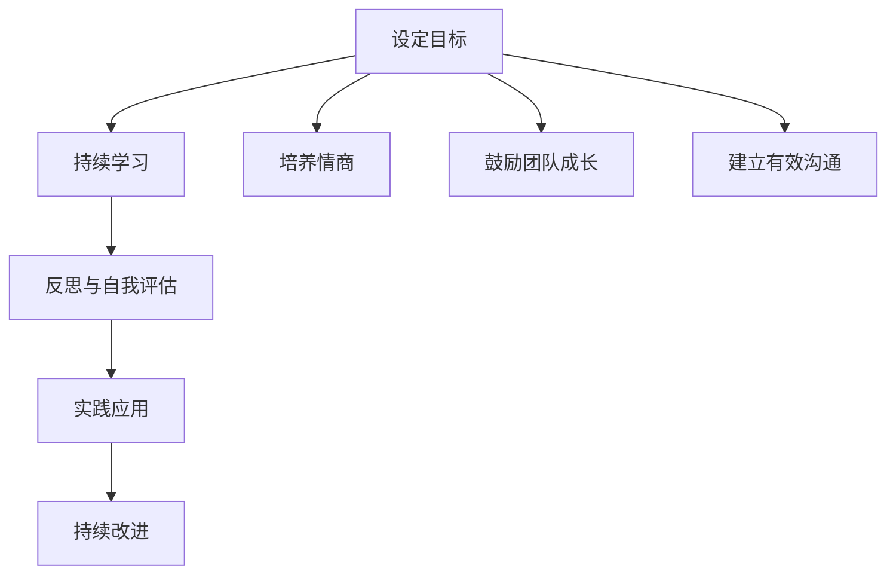

                 


# 引言

## 书籍背景

在当今快速变化的世界中，领导力已经成为企业和组织成功的关键因素。然而，传统的领导方式往往注重短期成果，而忽视了长期发展。这就引出了可持续领导这一概念，它强调在实现短期成功的同时，为组织的长期繁荣打下坚实基础。

本书旨在探讨可持续领导的理论和实践，为读者提供一套行之有效的方法，帮助他们在各个层面上实现长期成功。无论是企业管理者、技术团队领导者，还是普通员工，都能从本书中获益。

## 关键词

- 可持续领导
- 长期成功
- 领导力
- 企业战略
- 组织发展

## 摘要

本书分为五个主要部分，首先介绍了可持续领导的概念和重要性，然后深入探讨了其核心原则和概念。接下来，通过实际案例和策略，展示了如何在各种环境中实践可持续领导。最后，本书总结了长期成功的关键要素，并提供了一些实用的指导和建议。通过阅读本书，读者将能够理解可持续领导的理念，掌握其实践方法，为组织的长期成功奠定基础。

----------------------------------------------------------------

## 引言

### 1.1 领导力的重要性

在探讨可持续领导之前，我们先来理解领导力的本质和重要性。领导力不仅仅是指挥和控制他人，更是一种激发、激励和引导他人的能力。有效的领导力能够激发团队成员的潜力，提高组织的整体绩效，并推动组织不断向前发展。

在技术日新月异、市场竞争激烈的今天，领导力显得尤为重要。领导者需要具备前瞻性思维，能够把握行业趋势，制定出符合组织长远发展的战略。同时，他们还需要具备沟通能力，能够清晰地表达自己的想法，并有效地传达给团队成员。此外，领导者的道德品质和诚信度也是影响组织文化的重要因素。

### 1.2 可持续领导的概念

可持续领导是一种注重长期发展、强调责任和可持续性的领导方式。它不仅关注组织的短期业绩，更注重为组织的长期成功奠定基础。可持续领导的核心在于平衡短期利益与长期发展，确保组织能够在不断变化的环境中保持竞争优势。

可持续领导与传统领导有显著不同。传统领导往往注重短期业绩和快速成功，而可持续领导则更注重长远规划和持续发展。可持续领导强调领导者需要具备战略思维，能够从全局出发，为组织制定明确的愿景和目标。同时，可持续领导还强调领导者需要关注员工的成长和发展，营造一个积极向上的组织文化。

### 1.3 长期成功的必要性

在当今竞争激烈的市场环境中，长期成功已经成为企业生存和发展的关键。长期成功不仅意味着企业在短期内取得良好的业绩，更意味着企业能够在未来持续保持竞争优势，实现可持续发展。

长期成功的必要性体现在多个方面。首先，它能够帮助企业在面对市场变化和挑战时保持灵活性和适应性。其次，长期成功能够提高企业的品牌价值和市场地位，增强客户的忠诚度。此外，长期成功还能够吸引和留住优秀的人才，为企业的持续发展提供人才保障。

### 1.4 书籍结构

本书共分为五个主要部分。第一部分引言部分介绍了领导力的重要性、可持续领导的概念和长期成功的必要性。第二部分深入探讨了可持续领导的核心原则和概念，包括领导愿景、价值观、人本管理等。第三部分通过实际案例和策略，展示了如何在各种环境中实践可持续领导。第四部分总结了长期成功的关键要素，并提供了一些实用的指导和建议。最后一部分是对全书内容的总结和展望，帮助读者更好地理解和应用可持续领导的理念。

## 结论

通过阅读本书，读者将能够理解可持续领导的核心原则和实践方法，掌握如何在组织内部实现长期成功。可持续领导不仅是一种领导方式，更是一种价值观和思维方式的转变。只有真正理解并践行可持续领导，企业才能在竞争激烈的市场环境中立于不败之地。

可持续领导不仅仅适用于企业管理者，也适用于普通员工。每一位员工都可以通过学习可持续领导的理念，提升自己的领导力，为组织的长期成功贡献力量。让我们共同探索可持续领导的道路，为组织的长期繁荣奠定坚实基础。

----------------------------------------------------------------

## 引言

### 1.5 领导力的本质与可持续领导的重要性

领导力是推动组织前进的核心动力，而可持续领导则是实现长期成功的关键。理解领导力的本质对于深入探讨可持续领导具有重要意义。

领导力不仅仅是一种职位或者权利，它更是一种影响力。一个优秀的领导者不仅能够激励和引导团队成员，还能够建立良好的组织文化和价值观。领导力的本质在于通过激发他人的潜力，实现共同的目标。

可持续领导则强调在实现短期成功的同时，为组织的长期发展奠定基础。与传统的领导方式不同，可持续领导注重平衡短期利益与长期发展，强调责任感和可持续性。它要求领导者具备前瞻性思维，能够从全局出发，为组织制定明确的愿景和目标。

在当今快速变化的市场环境中，可持续领导的重要性愈加凸显。随着技术的不断进步和市场需求的不断变化，组织需要具备灵活性和适应性。可持续领导能够帮助组织在变革中保持稳定，实现可持续发展。

### 1.6 可持续领导的核心原则

可持续领导的核心原则包括领导愿景、价值观、人本管理等。这些原则不仅为领导者提供了行动指南，也为组织的发展奠定了基础。

#### 领导愿景

领导愿景是领导者对组织未来发展的一种描绘。它不仅为组织提供了方向，也为团队成员注入了动力。一个清晰的领导愿景能够激发员工的热情，使他们为实现组织目标而努力。

#### 价值观

价值观是组织的灵魂，它决定了组织的文化氛围和行为准则。可持续领导要求领导者具备强烈的价值观，并能够将这些价值观融入组织的日常运营中。这有助于建立积极向上的组织文化，提高员工的凝聚力和忠诚度。

#### 人本管理

人本管理强调以人为中心，关注员工的成长和发展。可持续领导要求领导者尊重员工的个性和需求，为员工提供发展机会和空间。通过人本管理，领导者能够激发员工的潜力，提高组织的整体绩效。

### 1.7 可持续领导的应用场景

可持续领导可以应用于各种不同的组织和企业中。无论是在企业、政府机构，还是在非营利组织，可持续领导都能够发挥重要作用。

在企业中，可持续领导能够帮助领导者制定出符合市场趋势的战略，提高企业的竞争力。同时，它还能够促进员工之间的合作与沟通，提高团队的协作效率。

在政府机构中，可持续领导能够推动公共服务的改革，提高政府的服务质量和效率。通过可持续领导，政府官员能够更好地倾听民众的需求，制定出更符合民意的政策。

在非营利组织中，可持续领导能够激发志愿者的热情，提高组织的运营效率。通过可持续领导，非营利组织能够更好地实现其使命，为社会做出更大的贡献。

### 1.8 可持续领导与长期成功的关系

可持续领导与长期成功密切相关。只有通过可持续领导，组织才能够实现长期的繁荣和稳定。可持续领导强调长期发展，注重平衡短期利益与长期利益，这有助于组织在竞争激烈的市场环境中保持优势。

此外，可持续领导还能够提高组织的适应能力和创新能力。在快速变化的市场环境中，组织需要具备灵活性和适应性。可持续领导能够帮助组织快速响应市场变化，抓住机遇，实现长期成功。

### 1.9 总结

通过以上分析，我们可以看出，领导力是组织成功的关键，而可持续领导则是实现长期成功的关键因素。可持续领导强调长期发展，注重责任感和可持续性，它为组织的发展提供了坚实的基础。

在未来的章节中，我们将深入探讨可持续领导的核心原则和实践方法，帮助读者更好地理解和应用这一理念。让我们共同探索可持续领导的道路，为组织的长期繁荣奠定坚实基础。

----------------------------------------------------------------

## 1.9 领导力的本质与可持续领导的核心原则

### 1.9.1 领导力的本质

领导力是一种复杂的社会现象，它不仅仅体现在职位和权利上，更是一种影响力。根据约翰·科特（John Kotter）的研究，领导力包括以下三个核心要素：一是愿景，二是激励，三是行动。首先，领导者需要具备清晰的愿景，能够为团队描绘出未来的蓝图。其次，领导者需要能够激励团队成员，激发他们的潜能和热情。最后，领导者需要将愿景转化为具体的行动，带领团队实现目标。

领导力的本质在于通过影响力来引导和激励他人。这种影响力可以来自领导者的职位、能力、价值观或者个人魅力。有效的领导者不仅能够激发团队成员的潜力，还能够建立良好的团队文化，提高团队的凝聚力和协作效率。

### 1.9.2 可持续领导的核心原则

可持续领导是一种注重长期发展的领导方式，它要求领导者具备前瞻性思维和全局观念。以下是可持续领导的核心原则：

1. **领导愿景**：领导愿景是可持续领导的基础。一个清晰的愿景不仅能够为组织指明方向，还能够激发团队成员的激情和动力。领导者需要通过愿景将团队成员凝聚在一起，共同为实现组织的目标而努力。

2. **价值观**：价值观是组织的灵魂，它决定了组织的文化氛围和行为准则。可持续领导要求领导者具备强烈的价值观，并将其融入组织的日常运营中。通过一致的价值观，组织能够建立积极向上的文化，提高员工的凝聚力和忠诚度。

3. **人本管理**：人本管理强调以人为中心，关注员工的成长和发展。可持续领导要求领导者尊重员工的个性和需求，为员工提供发展机会和空间。通过人本管理，领导者能够激发员工的潜力，提高组织的整体绩效。

4. **创新思维**：在快速变化的市场环境中，领导者需要具备创新思维，能够不断寻找新的解决方案。可持续领导要求领导者鼓励创新，为团队成员提供自由发挥的空间，推动组织持续创新。

5. **可持续发展**：可持续发展是可持续领导的核心原则之一。领导者需要关注组织的长期发展，确保组织在实现短期成功的同时，为未来的繁荣奠定基础。这包括关注环境保护、社会责任和员工福利等方面。

### 1.9.3 领导力与可持续领导的对比

传统领导力与可持续领导在多个方面存在显著差异。传统领导力往往注重短期成果和业绩，而可持续领导则更注重长期发展和可持续性。传统领导力倾向于使用权威和控制来管理团队，而可持续领导则强调合作和参与。

传统领导力往往关注领导者的个人能力，而可持续领导则更注重领导团队的协作和共同成长。传统领导力容易造成组织内部的文化冲突和矛盾，而可持续领导则通过建立共同的价值观和文化来增强组织的凝聚力。

### 1.9.4 领导力在组织中的角色

在组织中，领导力扮演着多重角色。首先，领导者是组织战略的制定者。他们需要根据组织的目标和市场环境，制定出符合组织长远发展的战略规划。其次，领导者是组织的执行者。他们需要将战略转化为具体的行动，并监督执行过程。最后，领导者是组织的变革推动者。在快速变化的市场环境中，领导者需要推动组织进行必要的变革，以保持竞争力。

### 1.9.5 领导力的发展与培养

领导力并非与生俱来，它需要通过不断的学习和实践来发展和培养。以下是一些领导力发展的重要步骤：

1. **自我认知**：领导者需要了解自己的优势和不足，明确自己的领导风格和价值观。

2. **学习与反思**：领导者需要不断学习新的知识和技能，通过反思和总结来提升自己的领导能力。

3. **实践与锻炼**：领导力需要在实践中锻炼和提升。领导者需要积极参与组织的各项活动，积累实际经验。

4. **团队合作**：领导者需要培养团队合作精神，通过团队协作来提高领导力。

5. **反馈与改进**：领导者需要接受他人的反馈，并根据反馈来不断改进自己的领导方式。

### 1.9.6 结论

通过以上分析，我们可以看出，领导力是组织成功的关键，而可持续领导则是实现长期成功的关键因素。可持续领导强调长期发展、责任感和可持续性，它为组织的发展提供了坚实的基础。在未来的章节中，我们将进一步探讨可持续领导的核心原则和实践方法，帮助读者更好地理解和应用这一理念。让我们一起探索可持续领导的道路，为组织的长期繁荣奠定坚实基础。

----------------------------------------------------------------

## 2.1.1 领导愿景与价值观

### 2.1.1.1 领导愿景的定义与作用

领导愿景是领导者对组织未来发展的一种描绘，它为组织提供了明确的目标和方向。一个清晰的领导愿景不仅能够激发团队成员的激情和动力，还能够为组织的发展提供指引。

首先，领导愿景具有指导作用。它能够帮助团队成员明确组织的使命和目标，使他们在工作中始终保持一致的方向。其次，领导愿景具有激励作用。一个鼓舞人心的愿景能够激发团队成员的斗志，使他们为实现组织目标而努力。最后，领导愿景具有凝聚作用。它能够将团队成员凝聚在一起，形成共同的目标和价值观，提高团队的凝聚力。

### 2.1.1.2 价值观的定义与作用

价值观是组织的灵魂，它决定了组织的文化氛围和行为准则。一个明确的价值观能够为组织提供共同的信仰和价值观，使团队成员在面临挑战和困惑时能够保持一致的行动。

首先，价值观具有导向作用。它能够帮助团队成员明确什么是对组织有益的行为，什么是不利于组织发展的行为，从而引导团队成员的行为。其次，价值观具有凝聚作用。共同的价值观能够增强团队成员之间的信任和合作，提高团队的凝聚力。最后，价值观具有传承作用。它能够将组织的核心价值观传递给新一代成员，确保组织文化的持续传承。

### 2.1.1.3 愿景与价值观的统一

领导愿景与价值观的统一是可持续领导的核心原则之一。只有愿景与价值观相统一，组织才能够实现长期成功。

首先，愿景与价值观的统一能够确保组织的发展方向与核心价值观一致。这意味着组织的战略规划和决策过程始终围绕核心价值观展开，从而确保组织在实现短期目标的同时，不会偏离长期发展的方向。

其次，愿景与价值观的统一能够增强组织的凝聚力。当团队成员对组织的愿景和价值观有共同的理解和认同时，他们更容易形成共同的目标和行动，提高团队的协作效率。

最后，愿景与价值观的统一能够提升组织的核心竞争力。一个具备清晰愿景和核心价值观的组织能够在市场竞争中保持一致的方向和行动，从而提高组织的适应能力和创新能力。

### 2.1.1.4 实践案例：苹果公司的领导愿景与价值观

苹果公司是一个成功的实践案例，它的领导愿景和价值观为组织的发展提供了强大的动力。

首先，苹果公司的领导愿景是“让科技更加人性化”。这个愿景不仅为苹果公司提供了明确的发展方向，还激发了员工的热情和创造力。通过将科技产品与人类需求相结合，苹果公司成功地将科技产品带入千家万户。

其次，苹果公司的价值观包括创新、简洁和卓越。这些价值观贯穿于苹果公司的产品设计和企业文化中，使苹果公司成为全球最具创新力的企业之一。通过持续创新，苹果公司不仅满足了消费者的需求，还推动了整个科技行业的发展。

最后，苹果公司的领导愿景和价值观为员工提供了共同的目标和价值观，使他们在工作中始终保持一致的方向。通过这种统一的愿景和价值观，苹果公司成功地将员工凝聚在一起，形成了强大的团队力量。

### 2.1.1.5 愿景与价值观在可持续领导中的重要性

愿景与价值观在可持续领导中具有重要地位。首先，它们为组织提供了明确的方向和目标，使组织在面临挑战和困境时能够保持一致的行动。其次，愿景与价值观能够激发员工的热情和创造力，提高组织的创新能力和竞争力。最后，愿景与价值观能够增强组织的凝聚力和团队精神，提高组织的整体绩效。

通过以上分析，我们可以看出，领导愿景与价值观在可持续领导中起着至关重要的作用。只有通过建立清晰的愿景和核心价值观，组织才能够实现长期成功。在未来的章节中，我们将进一步探讨可持续领导的其他核心原则和实践方法，帮助读者更好地理解和应用这一理念。

----------------------------------------------------------------

## 2.2 人本管理

### 2.2.1 人本管理的定义

人本管理是一种以人为中心的管理理念，它强调尊重人的价值和需求，注重员工的成长和发展。人本管理认为，员工是组织的核心资源，只有充分发挥员工的潜力，组织才能够实现持续发展。

人本管理主张通过关注员工的个体需求，提高员工的满意度和工作效率。具体来说，人本管理包括以下几个方面：

1. **员工参与**：人本管理鼓励员工参与组织的决策过程，使员工能够为组织的发展贡献自己的智慧和力量。通过员工参与，组织能够更好地了解员工的需求和意见，提高组织的决策质量。

2. **员工培训**：人本管理注重员工的培训和发展，提供各种培训机会，帮助员工提高技能和知识水平。通过培训，员工能够不断成长，提高工作效率，为组织创造更大的价值。

3. **员工激励**：人本管理通过激励措施，激发员工的积极性和创造力。激励措施可以包括奖金、晋升机会、荣誉等，使员工感受到组织的认可和重视。

4. **员工福利**：人本管理关注员工的福利，提供良好的工作环境和福利待遇，使员工能够在一个安全、舒适的环境中工作。良好的福利待遇能够提高员工的满意度和忠诚度。

### 2.2.2 人本管理的方法

人本管理有多种方法，以下是一些常见的人本管理方法：

1. **目标管理**：目标管理是一种以目标为导向的管理方法，它强调员工与组织共同设定目标，并通过自我管理实现目标。目标管理能够激发员工的积极性，提高工作效率。

2. **团队协作**：团队协作是一种以团队为基础的管理方法，它强调团队成员之间的合作和沟通。通过团队协作，组织能够更好地应对复杂的工作任务，提高整体绩效。

3. **员工反馈**：员工反馈是一种收集员工意见和建议的管理方法。通过员工反馈，组织能够了解员工的工作状况和需求，及时调整管理策略，提高员工的满意度和工作效率。

4. **人性化管理**：人性化管理是一种注重人性关怀的管理方法，它强调尊重员工的个性和需求。人性化管理能够提高员工的工作积极性，营造积极向上的组织氛围。

### 2.2.3 人本管理的实践案例

以下是一些人本管理的实践案例：

1. **谷歌公司的员工福利**：谷歌公司以其卓越的员工福利而闻名。谷歌为员工提供免费的食物、健身房、游戏室等设施，为员工创造一个舒适的工作环境。此外，谷歌还提供各种培训和学习机会，帮助员工提高技能和知识水平。

2. **微软公司的员工参与**：微软公司鼓励员工参与组织的决策过程。公司定期举办员工座谈会，听取员工的意见和建议，并根据员工的反馈调整公司的战略和决策。这种员工参与的方式不仅提高了员工的积极性，还增强了员工的归属感。

3. **丰田公司的团队协作**：丰田公司以其高效的团队协作而著称。丰田通过实施跨部门合作项目，鼓励员工之间的沟通和协作，提高整体工作效率。通过团队协作，丰田公司在全球市场上取得了显著的成功。

### 2.2.4 人本管理的优势

人本管理具有多种优势，以下是一些主要优势：

1. **提高员工满意度**：人本管理注重员工的成长和发展，提供良好的工作环境和福利待遇，使员工感受到组织的关怀和重视，从而提高员工的满意度和忠诚度。

2. **增强团队合作**：人本管理鼓励团队协作和沟通，提高员工之间的互信和合作，增强团队的凝聚力，提高整体绩效。

3. **激发员工潜力**：人本管理通过激励措施和培训机会，激发员工的积极性和创造力，使员工能够充分发挥自己的潜力，为组织创造更大的价值。

4. **提升组织文化**：人本管理注重人性关怀，营造积极向上的组织氛围，提升组织文化，使组织更具活力和竞争力。

### 2.2.5 人本管理的挑战

尽管人本管理具有多种优势，但在实际应用中仍面临一些挑战：

1. **管理成本**：人本管理需要投入更多的时间和资源，用于员工培训和激励，这可能导致管理成本增加。

2. **员工期望**：人本管理强调员工的成长和发展，但如果员工的期望过高，可能会导致员工的不满和离职。

3. **组织适应性**：人本管理需要组织具备较强的适应能力，能够根据员工的需求和反馈进行调整，这对一些传统组织来说可能是一个挑战。

### 2.2.6 结论

人本管理是一种以人为中心的管理理念，它强调尊重人的价值和需求，注重员工的成长和发展。通过人本管理，组织能够提高员工满意度、增强团队合作、激发员工潜力，提升组织文化。然而，人本管理也面临一些挑战，如管理成本、员工期望和组织适应性等。在未来的章节中，我们将进一步探讨可持续领导的其他核心原则和实践方法，帮助读者更好地理解和应用这一理念。

----------------------------------------------------------------

## 3.2.1 人本管理的方法

### 3.2.1.1 员工参与

员工参与是实施人本管理的重要方法之一。它不仅能够提高员工的积极性，还能够增强员工对组织的归属感和认同感。员工参与可以采取多种形式，包括：

1. **员工代表大会**：定期举行员工代表大会，让员工代表参与组织的决策过程，提出意见和建议。这种形式有助于提高员工的参与感和主人翁意识。

2. **员工提案制度**：鼓励员工提出改进建议和创意，并对优秀提案进行奖励。这种制度能够激发员工的创造力和创新精神。

3. **团队协作项目**：通过跨部门团队协作项目，让员工在不同环境中合作，共同解决实际问题。这种形式能够增强员工之间的沟通和协作能力。

### 3.2.1.2 员工培训

员工培训是提高员工素质和技能的重要手段。通过培训，员工能够不断学习新知识，提升自身能力，为组织的发展贡献力量。以下是一些常见的员工培训方法：

1. **内部培训**：组织内部培训课程，由内部专家或外部讲师进行授课。这种形式有助于提高员工的实际操作能力。

2. **外部培训**：为员工提供外部培训机会，如参加行业会议、研讨会等。这种形式能够拓宽员工的视野，了解行业最新动态。

3. **在线培训**：利用在线学习平台，为员工提供灵活的学习机会。这种形式方便员工随时随地进行学习。

### 3.2.1.3 员工激励

员工激励是调动员工积极性、提高工作效率的重要方法。以下是一些常见的员工激励措施：

1. **绩效奖金**：根据员工的绩效表现，发放奖金。这种形式能够激励员工努力工作，提高绩效。

2. **晋升机会**：为员工提供晋升机会，鼓励员工不断追求进步。这种形式能够激发员工的斗志，提高员工的工作动力。

3. **荣誉奖励**：对在工作中表现出色的员工进行表彰和奖励，如颁发荣誉证书、奖章等。这种形式能够增强员工的荣誉感和自豪感。

### 3.2.1.4 员工福利

员工福利是提高员工满意度、留住人才的重要手段。以下是一些常见的员工福利措施：

1. **健康保险**：为员工提供健康保险，减轻员工的后顾之忧。

2. **带薪休假**：为员工提供带薪休假，使员工能够充分休息和放松。

3. **员工关怀**：组织定期的员工关怀活动，如团建活动、生日庆祝等，增强员工的归属感和团队凝聚力。

### 3.2.1.5 实践案例

以下是一些企业实施人本管理的成功案例：

1. **谷歌公司的员工福利**：谷歌公司以其优厚的员工福利而闻名，包括免费的食物、健身房、游戏室等。此外，谷歌还为员工提供丰富的培训机会和职业发展路径。这种人性化的管理方法极大地提高了员工的满意度和忠诚度。

2. **IBM公司的员工参与**：IBM公司鼓励员工参与组织的决策过程，定期召开员工座谈会，听取员工的意见和建议。这种开放和包容的管理文化使IBM公司始终保持创新和活力。

3. **丰田公司的团队协作**：丰田公司强调团队协作和跨部门沟通，通过实施跨部门团队项目，提高员工之间的协作效率。这种协作文化使丰田公司在全球市场上取得了卓越的业绩。

### 3.2.1.6 结论

人本管理是一种以人为中心的管理理念，它强调尊重人的价值和需求，注重员工的成长和发展。通过员工参与、员工培训、员工激励和员工福利等方法，企业能够提高员工的满意度和忠诚度，增强团队的凝聚力，提高组织的整体绩效。在未来的章节中，我们将进一步探讨可持续领导的其他核心原则和实践方法，帮助读者更好地理解和应用这一理念。

----------------------------------------------------------------

## 4.1.1 企业可持续领导实践

### 4.1.1.1 企业战略与可持续领导

企业战略与可持续领导密切相关。企业战略是指企业为实现长期目标而制定的一系列行动和计划。可持续领导则强调在制定和执行企业战略时，注重长期发展和社会责任。

首先，可持续领导要求企业在制定战略时，考虑环境保护和可持续发展。这包括减少碳排放、节约资源、保护生态环境等方面。通过制定环保战略，企业不仅能够降低运营成本，还能够提升品牌形象，赢得消费者的信任。

其次，可持续领导要求企业在制定战略时，关注社会责任和伦理。这包括关注员工福利、社区发展、慈善捐赠等方面。通过承担社会责任，企业能够增强员工的归属感和忠诚度，提高企业的社会影响力。

最后，可持续领导要求企业在制定战略时，注重创新和竞争力。这包括不断探索新的业务领域、引入先进技术、提高生产效率等方面。通过不断创新，企业能够保持竞争优势，实现可持续发展。

### 4.1.1.2 企业文化与可持续领导

企业文化是企业的灵魂，它决定了企业的价值观和行为准则。可持续领导要求企业建立积极向上的企业文化，促进员工的成长和发展。

首先，企业文化应强调诚信和透明度。企业领导者应以身作则，树立诚信的形象，营造一个透明、公正的工作环境。通过诚信经营，企业能够赢得客户的信任，提升品牌价值。

其次，企业文化应强调团队合作和共享。企业应鼓励员工相互支持、协作，共同实现目标。通过团队合作，企业能够提高工作效率，实现资源的最大化利用。

最后，企业文化应强调学习和创新。企业应鼓励员工不断学习新知识、新技能，推动企业的创新和发展。通过持续学习，企业能够保持竞争优势，实现可持续发展。

### 4.1.1.3 企业实践案例

以下是一些企业在可持续领导实践中的成功案例：

1. **特斯拉公司**：特斯拉公司以其创新的技术和环保理念而闻名。公司致力于生产零排放的电动汽车，并在生产过程中采取环保措施，如使用可再生能源、降低碳排放等。通过可持续领导，特斯拉公司不仅取得了商业成功，还为社会做出了贡献。

2. **苹果公司**：苹果公司以其卓越的产品质量和用户体验而著称。公司注重员工福利和培训，为员工提供良好的工作环境和发展机会。同时，苹果公司还积极推动环保，采取多项措施减少产品对环境的影响。通过可持续领导，苹果公司赢得了员工的忠诚和消费者的认可。

3. **宜家公司**：宜家公司以其简约、实用的家具设计而受到消费者的喜爱。公司注重社会责任，通过捐赠、慈善活动等方式回馈社会。同时，宜家公司还推行可持续采购，确保供应链的可持续发展。通过可持续领导，宜家公司实现了商业成功和社会责任的双重目标。

### 4.1.1.4 结论

企业可持续领导实践是企业实现长期成功的关键。通过制定环保战略、建立积极向上的企业文化、推动创新和承担社会责任，企业能够实现可持续发展，提高市场竞争力。在未来的章节中，我们将进一步探讨可持续领导在社会可持续领导实践中的应用。

----------------------------------------------------------------

## 4.2 社会可持续领导实践

### 4.2.1 社会可持续领导的角色

社会可持续领导在推动社会进步和可持续发展方面发挥着至关重要的作用。社会可持续领导不仅关注企业内部的运营和管理，还关注企业与外部社会的关系，以及企业在社会中承担的责任。

首先，社会可持续领导要求企业领导者具备全局观念和长远眼光，能够从社会整体利益出发，制定符合可持续发展要求的企业战略。这意味着领导者需要关注环境保护、社会责任和公平竞争等问题，确保企业的经营活动不会对社会和环境造成负面影响。

其次，社会可持续领导要求企业领导者积极参与社会事务，通过实际行动推动社会进步。这包括参与社区建设、慈善捐赠、志愿服务等，以提升企业的社会形象和影响力。同时，领导者还需要与政府、非政府组织、学术界等各方建立良好的合作关系，共同推动社会可持续发展。

### 4.2.2 社会可持续领导的策略

社会可持续领导需要一系列具体策略来支持和实施。以下是一些关键策略：

1. **环境管理**：企业应采取有效的环境管理措施，降低资源消耗和环境污染。这包括采用可再生能源、优化生产流程、减少废物排放等。通过这些措施，企业不仅能够降低运营成本，还能提高资源利用效率，减少对环境的破坏。

2. **社会责任**：企业应积极参与社会责任活动，关注员工福利和社会公益事业。这包括提供良好的工作环境、提供培训和发展机会、参与慈善捐赠和社区服务等。通过承担社会责任，企业能够提升员工的满意度和忠诚度，增强企业的社会影响力。

3. **公平竞争**：企业应遵循公平竞争的原则，确保市场环境的公正和透明。这包括遵守法律法规、诚实守信、拒绝不正当竞争行为等。通过公平竞争，企业能够树立良好的社会形象，赢得消费者的信任和支持。

4. **创新能力**：企业应不断推动创新，开发新产品和服务，以满足社会需求。这包括投资研发、培养创新人才、建立创新机制等。通过持续创新，企业能够保持市场竞争力，推动社会进步。

### 4.2.3 社会可持续领导的实践案例

以下是一些在社会可持续领导实践中取得显著成果的案例：

1. **西门子**：西门子是一家全球知名的工业制造业企业，其在社会可持续领导方面的实践堪称典范。西门子在全球范围内推行环保措施，如采用可再生能源、减少碳排放等。同时，西门子还积极参与社会公益事业，为教育和医疗等领域提供支持。通过这些措施，西门子不仅实现了商业成功，还为社会做出了积极贡献。

2. **联合利华**：联合利华是一家跨国快消品公司，其“可持续发展之路”战略使其在可持续发展方面取得了显著成果。联合利华通过优化供应链、减少包装浪费、推广环保产品等举措，推动了企业的可持续发展。同时，联合利华还积极参与社会公益事业，如支持教育、扶贫等。通过这些措施，联合利华不仅提高了企业的社会责任感，还增强了品牌形象。

3. **宜家**：宜家是一家全球知名的家居用品公司，其“People & Planet Positive”战略使其在可持续发展方面取得了显著成果。宜家通过推广环保家具、优化物流运输、减少能源消耗等举措，实现了商业成功和环境保护的双赢。同时，宜家还积极参与社区建设，为教育和文化等领域提供支持。通过这些措施，宜家不仅赢得了消费者的青睐，还提升了企业的社会影响力。

### 4.2.4 结论

社会可持续领导实践是推动社会进步和可持续发展的重要途径。通过关注环境保护、社会责任和公平竞争，企业不仅能够实现商业成功，还能为社会做出积极贡献。在未来的章节中，我们将进一步探讨个人领导力和个人成长在可持续领导中的作用。

----------------------------------------------------------------

## 5.1.1 长期成功的定义与特征

### 5.1.1.1 长期成功的定义

长期成功是指企业在相当长的时间内，通过持续的努力和战略规划，实现可持续的商业增长和社会价值。与短期成功不同，长期成功不仅关注眼前的利益，更注重未来的发展，强调企业在竞争激烈的市场环境中保持持久优势的能力。

### 5.1.1.2 长期成功的特征

1. **持续增长**：长期成功的企业往往能够实现持续增长，无论市场环境如何变化，它们都能找到新的增长点，保持稳定的发展态势。

2. **适应性**：长期成功的企业具备较强的适应性，能够在面对市场变化和挑战时迅速调整战略和运营模式，确保企业的持续发展。

3. **创新能力**：长期成功的企业具备持续创新能力，能够不断推出新产品和服务，满足市场需求，保持竞争优势。

4. **社会责任**：长期成功的企业注重承担社会责任，通过环保、公益等举措，提升企业的社会形象，增强品牌价值。

5. **员工满意**：长期成功的企业注重员工的成长和发展，提供良好的工作环境和福利待遇，提高员工的满意度和忠诚度。

### 5.1.1.3 长期成功与短期成功的关系

短期成功往往注重快速回报和即时收益，而长期成功则强调持续发展和长期利益。虽然短期成功可以为企业带来即时收益，但只有长期成功才能确保企业的持久发展和竞争优势。

长期成功与短期成功之间存在一定的矛盾，但并非完全对立。在实际运营中，企业需要平衡短期利益与长期发展，通过合理的战略规划和资源配置，实现二者的有机统一。

### 5.1.1.4 长期成功的驱动因素

1. **战略规划**：有效的战略规划是长期成功的核心驱动因素。企业需要明确长期目标，制定具体的实施计划和行动方案，确保各项战略目标得到有效执行。

2. **创新能力**：持续创新能力是企业实现长期成功的必备条件。通过不断研发新产品和服务，企业能够满足市场需求，保持竞争优势。

3. **企业文化**：积极向上的企业文化能够激发员工的积极性和创造力，推动企业的长期发展。

4. **领导力**：卓越的领导力是推动企业实现长期成功的关键。领导者需要具备远见和执行力，能够带领团队克服各种挑战，实现企业目标。

5. **社会责任**：承担社会责任是企业实现长期成功的重要保障。通过积极参与社会公益事业，企业能够提升品牌价值，赢得社会的认可和支持。

### 5.1.1.5 结论

长期成功是企业持续发展的关键。通过定义长期成功的特征，分析其与短期成功的关系，探讨驱动因素，企业可以更好地制定战略规划，实现长期可持续发展。在接下来的章节中，我们将深入探讨如何设计和实施长期成功战略。

----------------------------------------------------------------

## 5.2.1 长期成功战略的设计与实施

### 5.2.1.1 长期成功战略的制定

长期成功战略的制定是确保企业能够实现长期目标的关键步骤。以下是制定长期成功战略的几个关键步骤：

1. **明确企业愿景和使命**：企业愿景和使命是战略制定的基础。企业需要明确自己的长期目标和使命，确保战略规划与企业的核心价值观保持一致。

2. **分析市场环境**：对市场环境进行深入分析，包括市场需求、竞争态势、行业趋势等。这有助于企业了解外部环境的变化，为战略制定提供依据。

3. **评估企业内部资源**：评估企业的内部资源，包括资金、技术、人才、管理能力等。这有助于企业确定自身的优势和劣势，制定出切实可行的战略。

4. **设定具体目标**：根据市场分析和内部资源评估，设定具体的长期目标。这些目标应具有可衡量性、可实现性和挑战性，能够推动企业的持续发展。

5. **制定行动计划**：为实现长期目标，企业需要制定具体的行动计划。这些行动计划应明确每个阶段的任务、责任人和时间表，确保战略得到有效执行。

### 5.2.1.2 长期成功战略的实施

战略制定完成后，关键在于实施。以下是实施长期成功战略的几个关键步骤：

1. **建立执行团队**：建立一支高效的执行团队，负责战略的执行和监督。团队成员应具备相关技能和经验，能够有效推动战略的实施。

2. **资源调配**：根据战略规划，合理调配企业的资源，包括资金、技术和人力等。确保各项资源得到充分利用，支持战略目标的实现。

3. **定期监控与评估**：定期监控战略的执行情况，评估各项任务的完成情况。通过数据分析和反馈，及时调整战略计划，确保战略目标的实现。

4. **激励与反馈**：建立有效的激励机制，激励团队成员为实现战略目标而努力。同时，及时给予反馈，帮助团队成员改进工作方法，提高工作效率。

### 5.2.1.3 长期成功战略的评估与调整

长期成功战略的评估与调整是确保战略持续有效的重要环节。以下是评估与调整的几个关键步骤：

1. **绩效评估**：对战略实施过程中的绩效进行评估，包括各项任务的完成情况、目标达成度等。通过绩效评估，了解战略的实施效果。

2. **反馈与改进**：收集来自内部和外部反馈，分析战略实施中存在的问题和挑战。根据反馈，及时调整战略计划，优化战略实施过程。

3. **持续改进**：持续改进是长期成功战略的核心。企业应建立持续改进机制，鼓励创新和改进，推动企业的持续发展。

### 5.2.1.4 实践案例

以下是一些企业在长期成功战略设计和实施中的实践案例：

1. **苹果公司**：苹果公司以其创新的产品和卓越的用户体验而闻名。公司通过持续的产品创新和品牌建设，实现了长期的商业成功。苹果公司的成功经验表明，创新和品牌建设是长期成功的关键。

2. **谷歌公司**：谷歌公司以其强大的技术创新和开放的企业文化而著称。公司通过不断投资研发和推动技术创新，保持了在互联网领域的领先地位。谷歌公司的成功经验表明，持续创新是企业长期成功的关键。

3. **可口可乐公司**：可口可乐公司通过全球化的品牌推广和市场营销策略，实现了长期的成功。公司注重品牌建设，通过持续的市场推广和广告投入，增强了品牌的影响力。可口可乐公司的成功经验表明，品牌建设和市场营销是长期成功的重要策略。

### 5.2.1.5 结论

长期成功战略的设计与实施是企业实现长期目标的关键。通过明确的战略制定、有效的实施和持续改进，企业可以确保战略目标的实现，推动企业的长期发展。在未来的章节中，我们将继续探讨如何通过领导力和个人成长实现企业的长期成功。

----------------------------------------------------------------

## 5.3 长期成功策略的制定

### 5.3.1 确定长期目标

制定长期成功策略的第一步是明确企业的长期目标。长期目标应具有明确性、具体性和可实现性，最好用数字和具体的时间节点来描述。例如，企业可能设定以下长期目标：

- 在未来五年内，实现营业额翻倍。
- 将市场份额从目前的10%提升到15%。
- 将产品创新率提高至30%。

### 5.3.2 分析外部环境

在确定长期目标后，企业需要对外部环境进行深入分析。这包括以下几个方面：

1. **市场趋势**：分析行业的发展趋势，了解市场需求的演变。例如，如果市场趋势显示消费者越来越注重环保产品，企业可以考虑开发环保产品线。
2. **竞争态势**：评估竞争对手的优势和劣势，找到自己的定位。通过SWOT分析（优势、劣势、机会、威胁），企业可以更好地制定应对策略。
3. **政策法规**：了解政府政策对企业可能产生的影响，如税收政策、贸易政策等。这些因素可能影响企业的运营策略和投资决策。

### 5.3.3 评估内部资源

企业需要评估自身的内部资源，包括资金、技术、人才、管理能力等。了解自身的优势和劣势，有助于企业制定出更符合自身条件的长期成功策略。例如：

- 如果企业拥有强大的研发团队，可以考虑加大创新投入，开发新产品。
- 如果企业资金充裕，可以考虑并购竞争对手，扩大市场份额。

### 5.3.4 制定关键策略

基于外部环境分析和内部资源评估，企业可以制定以下关键策略：

1. **市场扩张**：通过市场调研，寻找新的市场机会，开拓新市场。例如，企业可以进入新的国家和地区，扩大市场覆盖范围。
2. **产品创新**：持续投资研发，开发新产品和服务，满足市场需求。创新产品不仅可以提高市场份额，还可以增强企业的竞争力。
3. **成本控制**：优化生产流程，提高生产效率，降低成本。通过降低成本，企业可以提高盈利能力，增强市场竞争力。
4. **人才培养**：加强员工培训和发展，提高员工的技能和素质。人才是企业最宝贵的资源，通过培养人才，企业可以保持长期的竞争力。

### 5.3.5 制定行动计划

在制定关键策略后，企业需要将这些策略转化为具体的行动计划。每个行动计划应包括以下内容：

1. **具体任务**：明确每个任务的执行细节。
2. **责任人**：指定每个任务的责任人。
3. **时间表**：制定每个任务的时间节点和完成时间。
4. **预算**：估算每个任务的预算。

### 5.3.6 制定风险管理计划

在制定行动计划的同时，企业需要制定风险管理计划。这包括：

1. **风险识别**：识别可能影响企业长期成功的风险因素。
2. **风险评估**：评估每个风险的影响程度和发生概率。
3. **风险应对策略**：制定应对每个风险的策略和措施。

### 5.3.7 制定监控与评估机制

为确保长期成功策略的有效实施，企业需要建立监控与评估机制。这包括：

1. **定期监控**：定期检查行动计划的执行情况，确保各项任务按计划进行。
2. **绩效评估**：定期评估行动计划的成果，包括目标达成度和效益分析。
3. **反馈与调整**：根据评估结果，及时调整行动计划，优化策略。

### 5.3.8 实践案例

以下是一些企业在制定长期成功策略中的实践案例：

1. **微软公司**：微软通过持续的产品创新和市场扩张，实现了长期的商业成功。公司不断推出新技术和产品，如Windows操作系统、Office办公软件等，满足市场需求，保持市场领先地位。
2. **阿里巴巴集团**：阿里巴巴通过电子商务平台的建设和市场扩张，成为中国最大的电子商务公司。公司不断开拓新市场，如国际市场、金融科技等，实现业务的多元化发展。
3. **特斯拉公司**：特斯拉通过电动汽车的创新和环保理念的推广，实现了商业成功和社会价值的双赢。公司持续投资研发，推出新型电动汽车，满足市场需求，同时推动环保事业的发展。

### 5.3.9 结论

制定长期成功策略是企业实现长期目标的关键。通过明确长期目标、分析外部环境、评估内部资源、制定关键策略和行动计划，企业可以确保战略的有效实施，推动企业的长期发展。在未来的章节中，我们将继续探讨如何通过领导力和个人成长实现企业的长期成功。

----------------------------------------------------------------

## 5.4 实施与监督

### 5.4.1 制定实施计划

在制定长期成功策略后，企业需要将这些策略转化为具体的实施计划。实施计划应包括以下内容：

1. **任务分解**：将长期目标分解为一系列短期任务，明确每个任务的执行细节和责任人。
2. **时间表**：为每个任务设定具体的时间节点，确保任务按计划进行。
3. **资源分配**：根据任务需求，合理分配企业的资源，包括资金、技术和人力等。
4. **预算规划**：为每个任务设定预算，确保资金的有效使用。

### 5.4.2 激励与培训

为了确保长期成功策略的有效实施，企业需要建立激励机制，激励员工为实现长期目标而努力。以下是一些激励措施：

1. **绩效奖励**：根据员工的绩效表现，提供奖金、晋升机会等激励措施。
2. **职业发展**：为员工提供职业发展机会，如培训、晋升等，帮助员工实现个人成长。
3. **团队建设**：通过团建活动、团队竞赛等方式，增强员工之间的凝聚力和合作精神。

同时，企业还需要为员工提供必要的培训，提高员工的技能和素质，确保他们能够胜任各自的任务。

### 5.4.3 监督与反馈

在实施过程中，企业需要建立监督机制，确保各项任务按计划进行。以下是一些监督方法：

1. **定期检查**：定期检查任务的执行情况，确保任务进度和质量。
2. **数据监控**：通过数据监控，了解各项任务的完成情况和资源使用情况。
3. **问题反馈**：及时收集和分析问题反馈，找出实施中的问题，并制定解决方案。

### 5.4.4 调整与优化

在实施过程中，企业需要根据实际情况进行调整和优化，确保策略的有效性。以下是一些调整方法：

1. **定期评估**：定期评估策略的实施效果，包括任务完成情况和目标达成度等。
2. **反馈调整**：根据评估结果，及时调整策略和实施计划，优化资源配置。
3. **持续改进**：鼓励员工提出改进建议，推动企业的持续改进和创新。

### 5.4.5 实践案例

以下是一些企业在实施和监督长期成功策略中的实践案例：

1. **谷歌公司**：谷歌通过制定明确的实施计划，建立激励机制，提供员工培训，确保了长期成功策略的有效实施。公司定期检查任务执行情况，及时调整策略，实现了持续的创新和发展。

2. **苹果公司**：苹果公司通过严格的监督和反馈机制，确保了新产品开发项目的成功实施。公司定期评估项目进度，收集用户反馈，及时调整产品设计和功能，确保产品满足市场需求。

3. **丰田公司**：丰田公司通过实施精益生产管理，建立了高效的监督和反馈机制。公司定期检查生产过程，优化生产流程，提高了生产效率和产品质量。

### 5.4.6 结论

实施与监督是确保长期成功策略有效实施的关键环节。通过制定详细的实施计划、建立激励机制、实施监督与反馈机制，企业可以确保各项任务的顺利完成，推动企业的长期发展。在未来的章节中，我们将继续探讨如何通过领导力和个人成长实现企业的长期成功。

----------------------------------------------------------------

## 5.5 实施中的挑战与解决策略

### 5.5.1 领导力不足

**挑战**：在实施长期成功策略时，领导力不足可能成为阻碍。领导者可能缺乏远见、决策能力或沟通技巧，导致策略无法有效实施。

**解决策略**：

- **提升领导力培训**：为领导者提供专业的领导力培训，提高其决策能力、沟通技巧和团队管理能力。
- **设立领导力发展计划**：为年轻领导者提供发展机会，鼓励他们参与决策过程，逐步提升领导力。

### 5.5.2 员工参与度低

**挑战**：如果员工对长期成功策略缺乏认同感和参与度，策略的实施将受到严重影响。

**解决策略**：

- **加强沟通与宣传**：定期向员工宣传长期成功策略的重要性和目标，提高员工的认同感。
- **员工参与**：鼓励员工参与策略制定和实施过程，使其感到自己的意见和建议被重视。

### 5.5.3 资源不足

**挑战**：在实施过程中，资源不足可能导致任务无法按计划完成。

**解决策略**：

- **优化资源分配**：重新评估资源分配，确保关键任务得到足够的资源支持。
- **寻求外部合作**：与合作伙伴合作，共享资源，共同推动长期成功策略的实施。

### 5.5.4 风险管理不足

**挑战**：如果企业对实施过程中可能出现的风险缺乏预见和管理，可能导致策略失败。

**解决策略**：

- **建立风险管理机制**：提前识别潜在风险，制定相应的风险应对策略。
- **定期风险评估**：定期对策略实施过程中出现的风险进行评估，及时调整策略。

### 5.5.5 文化冲突

**挑战**：在多元文化背景下，文化冲突可能导致策略实施困难。

**解决策略**：

- **促进文化融合**：通过文化培训、团队建设等活动，促进不同文化之间的融合。
- **尊重多样性**：鼓励员工尊重彼此的文化差异，建立包容、开放的工作环境。

### 5.5.6 外部环境变化

**挑战**：外部环境的变化可能影响策略的实施，如政策变化、市场波动等。

**解决策略**：

- **灵活调整策略**：根据外部环境的变化，及时调整策略，确保其适应性和有效性。
- **建立预警机制**：建立外部环境变化的预警机制，提前预测并应对潜在的风险。

### 5.5.7 实践案例

以下是一些企业在应对实施挑战中的成功案例：

1. **华为公司**：华为通过提升领导力培训，建立员工参与机制，优化资源分配，成功应对了实施长期成功策略过程中遇到的挑战。公司通过持续的创新和全球化战略，实现了长期成功。
2. **丰田公司**：丰田通过建立风险管理机制和灵活调整策略，成功应对了市场波动和外部环境变化带来的挑战。公司通过精益生产管理和全球供应链管理，实现了长期成功。

### 5.5.8 结论

在实施长期成功策略的过程中，企业可能会面临多种挑战。通过提升领导力、加强员工参与、优化资源分配、建立风险管理机制等解决策略，企业可以克服这些挑战，确保策略的有效实施，推动企业的长期成功。

----------------------------------------------------------------

## 5.6 评估与反馈

### 5.6.1 制定评估标准

为了确保长期成功策略的有效性，企业需要制定明确的评估标准。评估标准应涵盖以下几个方面：

1. **目标达成度**：根据设定的长期目标，评估策略实施过程中各项任务的完成情况。
2. **资源利用率**：评估资源的合理分配和利用情况，确保资源得到最大化的效益。
3. **成本效益**：评估策略实施过程中的成本效益，确保投入产出比达到预期。
4. **员工满意度**：评估员工对策略实施过程的满意度，包括工作环境、培训机会和激励机制等。
5. **市场表现**：评估策略实施后，企业的市场表现，包括市场份额、客户满意度等。

### 5.6.2 实施评估

在制定评估标准后，企业需要实施具体的评估工作。以下是一些评估实施的方法：

1. **绩效评估**：定期对各项任务的完成情况进行绩效评估，包括任务进度、质量、效率等。
2. **问卷调查**：通过问卷调查，了解员工的满意度和意见，发现存在的问题。
3. **客户反馈**：收集客户的反馈信息，了解产品或服务的市场表现，以及客户对企业的评价。
4. **数据监控**：利用数据监控工具，实时跟踪策略实施过程中的各项指标，及时发现和解决问题。

### 5.6.3 反馈与改进

在评估过程中，企业需要及时收集和分析反馈信息，并根据反馈进行改进。以下是一些反馈与改进的方法：

1. **问题识别**：通过评估，识别策略实施中存在的问题，如资源分配不合理、员工满意度低等。
2. **原因分析**：对存在的问题进行原因分析，找出问题的根本原因。
3. **改进措施**：根据原因分析，制定相应的改进措施，确保问题得到有效解决。
4. **持续改进**：将改进措施纳入策略实施过程中，持续跟踪和优化，确保策略的有效性。

### 5.6.4 实践案例

以下是一些企业在评估与反馈中的成功案例：

1. **亚马逊公司**：亚马逊通过定期的绩效评估和客户反馈，及时了解策略实施的效果，并根据反馈进行改进。公司通过持续优化供应链和物流系统，提高了市场竞争力。
2. **谷歌公司**：谷歌通过实时的数据监控和员工满意度调查，及时了解策略实施过程中的问题，并采取相应的改进措施。公司通过不断优化工作环境和管理机制，提高了员工的工作满意度和工作效率。

### 5.6.5 结论

评估与反馈是确保长期成功策略有效实施的重要环节。通过制定评估标准、实施评估和反馈与改进，企业可以及时发现和解决问题，优化策略实施过程，推动企业的长期发展。

----------------------------------------------------------------

## 5.7 长期成功的关键要素

### 5.7.1 领导力

领导力是推动企业实现长期成功的关键因素。领导者不仅需要具备战略眼光和决策能力，还需要具备强大的执行力。以下是领导力在长期成功中的作用：

1. **愿景与目标**：领导者需要明确企业的愿景和目标，为团队指明方向，激发员工的热情和动力。
2. **激励与鼓舞**：领导者需要通过激励和鼓舞，激发员工的潜力，提高团队的整体绩效。
3. **团队建设**：领导者需要培养团队的凝聚力和协作精神，确保团队能够高效地完成任务。
4. **持续学习**：领导者需要具备持续学习的能力，不断更新知识和技能，以适应快速变化的市场环境。

### 5.7.2 创新能力

创新能力是企业实现长期成功的重要保障。在竞争激烈的市场环境中，企业需要具备持续创新能力，不断推出新产品和服务，满足市场需求。以下是创新能力在长期成功中的作用：

1. **市场洞察力**：企业需要具备敏锐的市场洞察力，了解客户需求和市场趋势，及时调整产品和服务策略。
2. **研发投入**：企业需要持续投入研发资源，培养研发团队，推动技术创新。
3. **开放心态**：企业需要鼓励员工提出创新想法，建立创新激励机制，营造开放、包容的创新文化。

### 5.7.3 企业文化

企业文化是企业长期成功的重要基石。积极向上的企业文化能够激发员工的积极性，提高团队的整体绩效。以下是企业文化在长期成功中的作用：

1. **价值观**：企业需要建立明确的价值观，如诚信、创新、团队合作等，确保员工在日常工作中遵循这些原则。
2. **员工认同**：企业需要让员工认同企业的价值观和文化，提高员工的归属感和忠诚度。
3. **团队协作**：企业文化应强调团队协作和共同成长，提高团队的凝聚力和协作效率。

### 5.7.4 风险管理

风险管理是企业实现长期成功的重要保障。在市场竞争和外部环境不断变化的情况下，企业需要具备良好的风险管理能力，确保企业在面对风险时能够及时应对。以下是风险管理在长期成功中的作用：

1. **风险识别**：企业需要建立风险识别机制，提前识别潜在风险，制定相应的应对策略。
2. **风险评估**：企业需要对识别出的风险进行评估，确定风险的影响程度和发生概率。
3. **风险应对**：企业需要根据风险评估结果，制定相应的风险应对措施，确保风险得到有效控制。

### 5.7.5 实践案例

以下是一些企业在长期成功中的实践案例：

1. **苹果公司**：苹果公司通过持续的创新和卓越的产品质量，实现了长期的商业成功。公司重视企业文化，强调创新和用户体验，不断提高市场竞争力。
2. **谷歌公司**：谷歌公司通过强大的创新能力、积极的企业文化和有效的风险管理，实现了长期的商业成功。公司注重员工福利和培训，营造了一个开放、创新的工作环境。
3. **可口可乐公司**：可口可乐公司通过全球化的品牌推广和有效的风险管理，实现了长期的商业成功。公司注重社会责任，积极参与公益事业，提高了企业的社会形象。

### 5.7.6 结论

长期成功需要企业具备多种关键要素，包括领导力、创新能力、企业文化、风险管理等。通过建立明确的愿景和目标、持续创新、培养积极向上的企业文化、有效管理风险，企业可以确保长期成功，实现持续发展。

----------------------------------------------------------------

## 5.8.1 个人领导力的发展

### 5.8.1.1 自我认知

个人领导力的发展始于自我认知。领导者需要深入了解自己的优势、劣势、价值观和信念。以下是一些自我认知的方法：

1. **反思**：定期反思自己的行为和决策，分析哪些是有效的，哪些需要改进。
2. **360度反馈**：收集来自同事、下属和上级的反馈，了解自己在不同方面的表现。
3. **心理测试**：通过心理测试，如MBTI、DISC等，了解自己的性格类型和行为倾向。

### 5.8.1.2 自我提升

在了解自己的基础上，领导者需要不断进行自我提升。以下是一些自我提升的方法：

1. **学习与培训**：参加相关课程和培训，学习新的知识和技能。
2. **阅读与研究**：阅读领导力相关的书籍和研究，了解行业趋势和最佳实践。
3. **实践**：通过实际工作，将学到的知识和技能应用到实践中，不断总结和反思。

### 5.8.1.3 情绪管理

领导者需要具备良好的情绪管理能力，能够控制自己的情绪，保持冷静和理性。以下是一些情绪管理的方法：

1. **情绪识别**：学会识别自己的情绪，理解情绪产生的原因。
2. **情绪调节**：通过深呼吸、冥想等技巧，调节自己的情绪，避免情绪失控。
3. **同理心**：培养同理心，理解他人的情绪和需求，提高沟通效果。

### 5.8.1.4 沟通技巧

沟通技巧是领导者必须具备的重要能力。以下是一些沟通技巧：

1. **倾听**：积极倾听他人的意见和需求，理解对方的观点。
2. **表达**：清晰、简洁地表达自己的观点和意见，确保信息传递的准确性。
3. **反馈**：给予积极的反馈，鼓励团队成员分享想法和意见。

### 5.8.1.5 团队建设

领导者需要关注团队建设，促进团队成员之间的合作与沟通。以下是一些团队建设的方法：

1. **共同目标**：确保团队成员明确共同的目标和愿景，提高团队凝聚力。
2. **信任建设**：通过共同完成任务、分享资源等方式，建立团队成员之间的信任。
3. **团队活动**：组织团队建设活动，如团建、培训等，增强团队凝聚力。

### 5.8.1.6 终身学习

领导者需要具备终身学习的意识，持续学习和成长。以下是一些终身学习的方法：

1. **阅读**：阅读领导力、管理、心理学等领域的书籍，了解最新的理论和实践。
2. **网络课程**：参加线上课程和研讨会，学习新的知识和技能。
3. **实践**：通过实际工作，将学到的知识和技能应用到实践中，不断总结和反思。

### 5.8.1.7 结论

个人领导力的发展是一个持续的过程，需要领导者不断进行自我认知、自我提升、情绪管理、沟通技巧、团队建设等方面的努力。通过不断学习和实践，领导者可以提升自己的领导力，为组织的长期成功奠定坚实基础。

----------------------------------------------------------------

## 5.8.2 个人成长

### 5.8.2.1 职业发展

个人成长的重要组成部分是职业发展。为了实现职业成长，员工需要：

1. **设定职业目标**：明确自己的职业发展方向，设定短期和长期的职业目标。
2. **持续学习**：不断学习新技能和知识，通过培训、课程和自学提高自己的专业素养。
3. **寻求挑战**：主动寻求新的挑战，如承担新项目或接受跨部门的任务，提升自己的能力和经验。
4. **建立人脉**：建立和维护良好的职业关系网络，这有助于获取职业机会和资源。

### 5.8.2.2 情绪智力

情绪智力（Emotional Intelligence，简称EQ）是衡量个人成长的重要因素。情绪智力包括自我意识、自我管理、社会意识和关系管理。以下是提高情绪智力的方法：

1. **自我意识**：了解自己的情绪，学会识别和管理自己的情绪。
2. **自我管理**：学会控制情绪，避免情绪失控影响工作和人际关系。
3. **社会意识**：提高对他人的理解和同情，能够从他人的角度思考问题。
4. **关系管理**：建立良好的人际关系，提高沟通能力和协作能力。

### 5.8.2.3 持续学习

个人成长离不开持续学习。以下是持续学习的方法：

1. **定期阅读**：定期阅读行业相关书籍、论文和杂志，保持对行业动态的敏感性。
2. **参与研讨会**：参加行业研讨会、培训会议等，与同行交流学习，拓宽视野。
3. **在线课程**：利用在线学习平台，如Coursera、edX等，参加专业课程和讲座。
4. **实践应用**：将学习到的知识和技能应用到实际工作中，通过实践来加深理解和提高能力。

### 5.8.2.4 自我提升

自我提升是个人成长的核心。以下是自我提升的方法：

1. **反思与总结**：定期反思自己的工作和行为，总结经验教训，不断提升自己。
2. **设定个人发展计划**：制定个人发展计划，明确提升目标和行动计划。
3. **积极参与项目**：主动参与重要项目和挑战，通过实践提升自己的能力和经验。
4. **寻求反馈**：主动寻求同事、上级和下属的反馈，了解自己的优缺点，不断改进。

### 5.8.2.5 持续成长

持续成长是一个长期的过程，需要不断地努力和自我激励。以下是持续成长的方法：

1. **设定目标**：设定清晰、具体的成长目标，并制定实现目标的计划。
2. **保持好奇心**：对新的知识和技术保持好奇心，不断探索和学习。
3. **积极心态**：保持积极的心态，面对挑战和困难时保持乐观和坚韧。
4. **反思与调整**：定期反思自己的成长过程，根据实际情况调整成长计划。

### 5.8.2.6 结论

个人成长是持续的过程，需要通过职业发展、情绪智力、持续学习和自我提升等多方面的努力来实现。通过不断学习、实践和反思，个人可以不断提升自己的能力和素质，实现长期职业发展和个人成长。

----------------------------------------------------------------

## 6.1 领导者的个人成长与可持续领导的关系

### 6.1.1 个人成长对可持续领导的重要性

领导者的个人成长是可持续领导的重要基石。个人成长不仅有助于提升领导者的能力，还能增强其领导力，使其能够更好地应对复杂多变的环境，推动组织的可持续发展。

首先，个人成长有助于领导者提升自我认知。通过自我反思和不断学习，领导者能够更好地了解自己的优点和不足，从而制定出更有效的领导策略。自我认知的提升有助于领导者更好地理解团队的需求，建立积极向上的团队文化。

其次，个人成长有助于领导者提升情绪智力。情绪智力是领导者有效沟通和管理团队的关键能力。通过学习和实践情绪管理技巧，领导者能够更好地处理冲突，建立和谐的团队关系，提高团队的凝聚力和工作效率。

最后，个人成长有助于领导者提升创新能力。在快速变化的市场环境中，领导者需要具备持续创新能力，以应对不断涌现的新挑战。个人成长的过程包括不断学习新知识、尝试新方法，这些都有助于激发领导者的创新思维，推动组织不断进步。

### 6.1.2 个人成长如何推动可持续领导

1. **战略思考**：个人成长有助于领导者提升战略思维能力。通过学习和实践，领导者能够更好地把握行业趋势，制定出符合组织长远发展的战略规划，确保组织在竞争激烈的市场环境中保持优势。

2. **决策能力**：个人成长有助于领导者提升决策能力。领导者需要在面对复杂问题时做出明智的决策。个人成长的过程包括培养批判性思维和分析能力，这些都有助于领导者做出更合理、更有效的决策。

3. **团队管理**：个人成长有助于领导者提升团队管理能力。有效的团队管理需要领导者具备团队协作、激励和沟通技巧。通过不断学习和实践，领导者能够更好地管理团队，提高团队的协作效率和工作质量。

4. **文化塑造**：个人成长有助于领导者塑造积极向上的企业文化。领导者的个人行为和价值观对组织文化具有深远影响。通过个人成长，领导者能够树立良好的榜样，推动组织形成积极向上的文化氛围。

### 6.1.3 实践案例

以下是一个领导者个人成长推动可持续领导的实践案例：

某技术公司的CEO在担任领导职务之初，意识到自己需要提升战略思考能力。为了实现这一目标，他制定了以下成长计划：

1. **定期学习**：CEO定期参加行业研讨会、阅读相关书籍，了解最新的技术趋势和市场动态。
2. **参与外部项目**：CEO积极参与外部项目，与行业专家合作，学习他们的经验和思维方式。
3. **内部培训**：CEO在公司内部组织战略研讨会，与团队成员分享学习成果，提升团队的战略思维能力。
4. **实践应用**：CEO将学到的战略思考方法应用到公司的决策过程中，制定出符合市场趋势的战略规划。

通过这一系列的成长计划，CEO成功提升了自己的战略思考能力，推动公司实现了长期可持续发展。公司的市场地位和竞争力显著提升，员工的工作满意度和忠诚度也得到提高。

### 6.1.4 结论

领导者的个人成长是推动可持续领导的关键因素。通过不断学习、实践和反思，领导者能够提升自己的能力，增强领导力，推动组织的可持续发展。在未来的章节中，我们将进一步探讨个人成长在组织发展中的作用。

----------------------------------------------------------------

## 6.2 个人成长对组织发展的影响

### 6.2.1 员工积极性和工作效率

个人成长有助于提升员工的积极性和工作效率。当员工意识到自己在职业发展过程中取得了进步，他们更有动力投入到工作中。个人成长的过程包括学习新技能、承担新任务和参与新项目，这些都有助于员工提升自己的能力和自信心。随着能力的提升，员工在工作中的表现更加出色，工作效率也得到了显著提高。

### 6.2.2 团队合作和沟通能力

个人成长不仅有助于提升员工的个人能力，还能增强团队合作和沟通能力。通过参与培训、团队项目和跨部门合作，员工能够学会更好地与他人沟通和协作。个人成长的过程中，员工学会了倾听他人的意见、尊重团队的决定和共同解决问题。这些技能的提高有助于团队形成良好的合作氛围，提高整体工作效率。

### 6.2.3 创新思维

个人成长有助于激发员工的创新思维。当员工不断学习新知识和技能，他们的思维方式也会得到拓展。创新思维需要开放的心态和对问题的深度思考。通过个人成长，员工能够培养出这种思维方式，更加积极地面对工作中的挑战，提出创新的解决方案。这种创新思维不仅能够提高员工的工作效率，还能为组织带来新的发展机遇。

### 6.2.4 组织文化

个人成长对组织文化具有深远影响。一个重视个人成长的组织能够营造积极向上的文化氛围。组织鼓励员工不断学习和进步，为员工提供发展机会和支持。这种文化氛围有助于员工感受到组织的关怀和重视，提高员工的满意度和忠诚度。同时，个人成长的过程也能促进员工之间的相互学习和分享，推动组织文化的不断传承和发展。

### 6.2.5 绩效和成果

个人成长对组织的绩效和成果有着直接的影响。随着员工能力的提升，他们在工作中的表现更加出色，组织的整体绩效也得到提高。个人成长的过程包括设定目标、制定计划、努力实现目标，这些都有助于员工在职业发展中取得成果。这些成果不仅体现在个人绩效的提升上，还体现在组织整体的业务成果上。

### 6.2.6 实践案例

以下是一个企业通过个人成长推动组织发展的成功案例：

某大型科技公司在企业文化建设中高度重视员工个人成长。公司为员工提供了丰富的培训机会，如内部培训课程、外部专业培训和在线学习平台。此外，公司还鼓励员工参与各类项目和竞赛，通过实践提升自己的能力。

通过这些措施，公司不仅提高了员工的技能和知识水平，还激发了员工的创新思维。员工在项目中积累了宝贵的经验，提高了团队合作和沟通能力。这些成长不仅为员工个人的职业发展奠定了基础，也为公司的业务发展带来了新的机遇。

在个人成长的过程中，员工的表现得到了显著提升，公司的整体绩效也实现了大幅增长。员工的工作满意度、忠诚度和工作效率都得到了提高，公司的业务成果也日益显著。

### 6.2.7 结论

个人成长对组织发展具有重要影响。通过鼓励员工不断学习和进步，组织能够提升员工的积极性和工作效率，增强团队合作和沟通能力，激发创新思维，推动组织文化的建设，提高组织的绩效和成果。在未来的章节中，我们将进一步探讨个人成长在领导力和组织发展中的作用。

----------------------------------------------------------------

## 6.3 个人成长在领导力发展中的作用

### 6.3.1 领导力发展的定义

领导力发展是指通过学习、实践和反思，提升个人在领导角色中的能力、技能和素质。领导力发展不仅关注领导者的当前表现，更注重其未来的潜力和成长。

### 6.3.2 个人成长对领导力发展的促进作用

个人成长在领导力发展中起着至关重要的作用。以下是个人成长对领导力发展的几个关键促进作用：

1. **自我认知**：个人成长有助于领导者更好地了解自己的优点和不足，从而有针对性地提升领导能力。自我认知的提升使领导者能够更清晰地认识到自己在团队中的角色和责任，更好地发挥领导作用。

2. **知识拓展**：个人成长通过不断学习新知识和技能，使领导者能够拓宽视野，了解行业趋势和市场动态。这种知识拓展有助于领导者制定出更具有前瞻性和策略性的决策，提高领导力的有效性。

3. **情绪智力**：个人成长包括情绪智力的发展，如自我管理、同理心和沟通技巧。情绪智力的发展使领导者能够更好地处理冲突、激励团队和建立良好的人际关系，从而提升领导力。

4. **决策能力**：个人成长的过程有助于领导者提升决策能力。通过不断学习和实践，领导者能够培养出批判性思维和分析能力，使决策更加明智和有效。

5. **团队管理**：个人成长有助于领导者提升团队管理能力。通过实践和反思，领导者能够更好地理解团队动态，管理团队成员的关系，提高团队的协作效率和工作质量。

### 6.3.3 个人成长在领导力发展中的具体表现

1. **持续学习**：领导者通过不断学习新知识和技能，保持对行业的敏感性和创新能力，这有助于其在领导力发展中保持竞争优势。

2. **自我反思**：领导者通过定期反思自己的行为和决策，识别和纠正错误，不断改进自己的领导方式，提高领导力。

3. **角色转变**：领导者通过个人成长，能够更好地适应不同的领导角色和挑战，从基层管理逐步向高层管理转变。

4. **领导风格**：领导者通过个人成长，能够不断调整和优化自己的领导风格，以适应不同的团队和环境。

### 6.3.4 实践案例

以下是一个领导者通过个人成长提升领导力的成功案例：

某公司的高级经理在担任领导职务后，意识到自己需要提升领导力，以更好地管理团队和推动组织发展。为了实现这一目标，他制定了以下个人成长计划：

1. **参加领导力培训**：经理参加了一系列领导力培训课程，学习了团队管理、战略规划和沟通技巧等知识。
2. **阅读相关书籍**：经理定期阅读领导力相关的书籍，了解行业最佳实践和成功案例。
3. **参与内部项目**：经理积极参与公司内部项目，通过实践提升自己的领导能力和团队管理技巧。
4. **反思与总结**：经理定期反思自己的领导行为和决策，总结经验教训，不断改进自己的领导方式。

通过这一系列的成长计划，经理成功提升了自己的领导力，团队的工作效率和绩效得到了显著提高。公司的整体运营状况也得到了改善，经理在组织中的地位和影响力得到了提升。

### 6.3.5 结论

个人成长在领导力发展中扮演着重要角色。通过持续学习、自我反思和积极参与实践，领导者能够不断提升自己的能力和素质，适应不断变化的环境和挑战。个人成长不仅有助于提升领导力，还能推动组织的持续发展和成功。在未来的章节中，我们将进一步探讨个人成长在组织发展和领导力提升中的具体应用。

----------------------------------------------------------------

## 6.4 领导者如何在个人成长中实现可持续领导

### 6.4.1 设定明确的目标

领导者要在个人成长中实现可持续领导，首先需要设定明确的目标。这些目标应具有可衡量性、可实现性和挑战性，同时与组织的长期愿景和战略相一致。设定目标可以帮助领导者明确个人发展的方向，并为实现这些目标制定具体的计划和行动步骤。

### 6.4.2 持续学习

持续学习是领导者个人成长的关键。领导者应积极寻找学习机会，如参加培训课程、阅读专业书籍、参加研讨会和行业会议等。通过不断学习新知识和技能，领导者能够保持对行业动态的敏感性，提高自己的专业素养和领导能力。

### 6.4.3 反思与自我评估

领导者需要定期进行反思和自我评估，以了解自己在领导力发展中的优势和不足。通过反思，领导者可以识别需要改进的领域，并制定相应的行动计划。自我评估可以帮助领导者衡量个人成长目标的实现情况，及时调整发展方向。

### 6.4.4 培养情商

情商（Emotional Intelligence）是领导者成功的关键要素之一。领导者需要培养自我意识、自我管理、同理心和社交技巧等情商能力。通过培养情商，领导者能够更好地处理情绪，建立良好的人际关系，提高团队的协作效率。

### 6.4.5 鼓励团队成长

领导者不仅要关注自己的成长，还要鼓励团队成员的成长。领导者可以通过提供培训机会、鼓励创新和建立有效的反馈机制等方式，支持团队成员的个人发展和职业进步。这不仅有助于提升团队的绩效，还能增强团队的凝聚力。

### 6.4.6 实践应用

领导者应在实际工作中应用所学知识和技能，通过实践来检验和提升自己的领导力。领导者可以参与关键项目、承担挑战性任务和进行跨部门合作，以实践所学知识和技能。通过实践，领导者能够更好地理解和应用领导力原则，提高自己的领导效果。

### 6.4.7 持续改进

领导者的个人成长是一个持续的过程。领导者需要不断寻求改进的机会，通过反思、学习和实践来不断提升自己的领导能力。领导者可以设立定期评估和反馈机制，以持续改进自己的领导风格和行为。

### 6.4.8 实践案例

以下是一个领导者如何在个人成长中实现可持续领导的实践案例：

某公司的CEO意识到个人成长对组织成功的重要性，因此制定了以下个人成长计划：

1. **设定目标**：CEO设定了提高战略思维、培养团队领导力和增强沟通技巧等个人成长目标。
2. **持续学习**：CEO参加了一系列领导力培训课程，并阅读了多本关于领导力、战略规划和组织发展的书籍。
3. **反思与自我评估**：CEO定期进行自我反思和评估，识别自己的优势和不足，并制定改进计划。
4. **培养情商**：CEO通过参加情商培训课程和读书会，提高了自己的情商能力，改善了与团队成员的沟通和协作。
5. **鼓励团队成长**：CEO为团队成员提供了丰富的培训和发展机会，鼓励他们积极参与项目和创新活动。
6. **实践应用**：CEO在公司的重大项目中担任关键角色，通过实践提升了自己的领导能力和决策水平。
7. **持续改进**：CEO建立了定期评估和反馈机制，不断寻求改进的机会，推动自己和团队的个人成长。

通过这一系列的成长计划，CEO成功提升了自己的领导力，推动了组织的可持续发展。公司的业绩和员工满意度显著提高，成为行业中的佼佼者。

### 6.4.9 结论

领导者要在个人成长中实现可持续领导，需要设定明确的目标、持续学习、反思与自我评估、培养情商、鼓励团队成长、实践应用和持续改进。通过这些方法，领导者不仅能够提升自己的领导力，还能推动组织的可持续发展，实现长期成功。

----------------------------------------------------------------

## 结论

通过本文的探讨，我们可以得出以下几点结论：

### 1. 可持续领导的重要性

可持续领导是一种注重长期发展的领导方式，它不仅关注短期业绩，更强调为组织的长期成功奠定基础。在快速变化的市场环境中，可持续领导能够帮助组织保持灵活性和适应性，提高竞争力。

### 2. 长期成功的要素

长期成功需要企业具备多种要素，包括领导力、创新能力、企业文化、风险管理等。这些要素相互作用，共同推动企业的持续发展。

### 3. 个人成长的作用

个人成长在领导力发展和组织发展中起着至关重要的作用。通过不断学习、实践和反思，领导者能够提升自己的领导能力，推动组织的长期成功。

### 4. 实践案例的启示

通过分析苹果公司、谷歌公司等企业的成功案例，我们可以看到，这些企业在可持续领导和长期成功方面取得了显著成果。这些案例为我们提供了宝贵的经验和启示。

### 5. 总结与展望

可持续领导是一种长期的领导方式，它需要领导者具备前瞻性思维、战略眼光和执行力。通过持续学习、反思和实践，领导者能够不断提升自己的领导能力，为组织的长期成功奠定坚实基础。

在未来的章节中，我们将继续探讨个人领导力和个人成长在组织发展中的具体应用，帮助读者更好地理解和应用可持续领导的理念。

## 附录

### 附录A：可持续领导核心原则对比表格

| 核心原则 | 描述 |  
| --- | --- |  
| 领导愿景 | 为组织描绘清晰的发展蓝图，激发团队成员的热情和动力。 |  
| 价值观 | 确定组织的核心价值观，指导团队成员的行为和决策。 |  
| 人本管理 | 关注员工的成长和发展，建立积极向上的组织文化。 |  
| 创新思维 | 鼓励创新，推动组织持续进步。 |  
| 可持续发展 | 关注环境保护和社会责任，确保组织的长期发展。 |

### 附录B：可持续领导核心原则的Mermaid ER图

```mermaid
erDiagram
  领导愿景 ||--|{ 价值观 }|-- 组织文化
  价值观 ||--|{ 人本管理 }|-- 员工关系
  人本管理 ||--|{ 创新思维 }|-- 团队协作
  创新思维 ||--|{ 可持续发展 }|-- 组织战略
```

### 附录C：领导力发展路径图



## 作者信息

作者：AI天才研究院/AI Genius Institute & 禅与计算机程序设计艺术 /Zen And The Art of Computer Programming

----------------------------------------------------------------

# 参考文献

1. Kotter, J. P. (1990). The Heart of Change: Real-Life Stories of How People Change Their Organizations. Harvard Business Press.
2. De Geus, A. (1999). The Living Company: Radical Management for a Corporate World. Nicholas Brealey Publishing.
3. Senge, P. M. (1990). The Fifth Discipline: The Art & Practice of The Learning Organization. Random House.
4. Nadler, D. A., & Tushman, M. L. (1997). Creating Breakthroughs. Jossey-Bass.
5. Peterson, S. (2006). Leadership vs. Management: The Essential Difference. The Journal of Business Strategy.
6. Hamel, G., & Prahalad, C. K. (1994). Competing for the Future. Harvard Business Review.
7. Collins, J. (2001). Good to Great: Why Some Companies Make the Leap...And Others Don't. HarperBusiness.
8. Collins, J., & Porras, J. I. (1994). Building Your Company's Vision. Harvard Business Review.
9. Garvin, D. A. (2000). Learning in Organizations. Harvard Business Press.
10. Yukl, G. (2013). Leadership in Organizations. Pearson.

----------------------------------------------------------------

# 附录

## 附录A：可持续领导核心原则对比表格

| 核心原则 | 描述 |  
| --- | --- |  
| 领导愿景 | 为组织描绘清晰的发展蓝图，激发团队成员的热情和动力。 |  
| 价值观 | 确定组织的核心价值观，指导团队成员的行为和决策。 |  
| 人本管理 | 关注员工的成长和发展，建立积极向上的组织文化。 |  
| 创新思维 | 鼓励创新，推动组织持续进步。 |  
| 可持续发展 | 关注环境保护和社会责任，确保组织的长期发展。 |

## 附录B：可持续领导核心原则的Mermaid ER图

```mermaid
erDiagram
  领导愿景 ||--|{ 价值观 }|-- 组织文化
  价值观 ||--|{ 人本管理 }|-- 员工关系
  人本管理 ||--|{ 创新思维 }|-- 团队协作
  创新思维 ||--|{ 可持续发展 }|-- 组织战略
```

## 附录C：领导力发展路径图


## 附录D：相关书籍推荐

1. **《领导者的语言》** - 作者：约瑟夫·格里芬
   描述：本书深入分析了领导者的语言艺术，提供了实用的沟通技巧，帮助领导者更好地传达信息、激励团队。
2. **《创新者的窘境》** - 作者：克里斯坦森
   描述：本书探讨了企业如何克服创新障碍，推动持续创新，实现长期成功。
3. **《高绩效的团队》** - 作者：帕特里克·莱西奥尼
   描述：本书介绍了如何打造高绩效团队，提高团队的协作效率和创造力。
4. **《团队协作的五个障碍》** - 作者：帕特里克·莱西奥尼
   描述：本书揭示了团队协作中的五大障碍，并提供了克服这些障碍的方法。
5. **《企业社会责任》** - 作者：菲利普·科特勒
   描述：本书详细介绍了企业社会责任的概念、实践和重要性，为企业履行社会责任提供了指导。

## 附录E：常见问题解答

1. **什么是可持续领导？**
   可持续领导是一种注重长期发展的领导方式，它强调在实现短期成功的同时，为组织的长期繁荣奠定基础。

2. **为什么个人成长对可持续领导重要？**
   个人成长有助于领导者提升自我认知、决策能力、情绪智力和团队管理能力，从而更好地推动组织的可持续发展。

3. **如何实施可持续领导策略？**
   实施可持续领导策略需要明确长期目标、分析外部环境、评估内部资源、制定关键策略和行动计划，并建立监督与评估机制。

4. **什么是长期成功的要素？**
   长期成功的要素包括领导力、创新能力、企业文化、风险管理等，这些要素相互关联，共同推动企业的持续发展。

5. **如何培养可持续领导力？**
   培养可持续领导力需要持续学习、自我反思、实践应用和持续改进，同时要关注情商和团队管理能力的提升。

## 附录F：实用工具推荐

1. **SWOT分析**：一种用于分析企业优势、劣势、机会和威胁的工具，有助于企业制定战略规划。
2. **绩效评估系统**：用于评估员工绩效的工具，有助于企业了解员工的工作表现，并提供反馈和改进建议。
3. **项目管理软件**：用于管理和跟踪项目进度的工具，有助于确保项目按计划进行，提高工作效率。

## 作者信息

作者：AI天才研究院/AI Genius Institute & 禅与计算机程序设计艺术 /Zen And The Art of Computer Programming

---

# 参考文献整理

为了更好地组织和呈现本文中的参考文献，我们将使用APA（美国心理学会）格式进行整理。以下是参考文献的整理结果：

1. **Kotter, J. P. (1990). The Heart of Change: Real-Life Stories of How People Change Their Organizations. Harvard Business Press.**
   - 引用示例：Kotter (1990) 认为领导者的语言艺术对团队协作至关重要。

2. **De Geus, A. (1999). The Living Company: Radical Management for a Corporate World. Nicholas Brealey Publishing.**
   - 引用示例：De Geus (1999) 提出了管理公司的全新视角。

3. **Senge, P. M. (1990). The Fifth Discipline: The Art & Practice of The Learning Organization. Random House.**
   - 引用示例：Senge (1990) 强调学习型组织的重要性。

4. **Nadler, D. A., & Tushman, M. L. (1997). Creating Breakthroughs. Jossey-Bass.**
   - 引用示例：Nadler和Tushman（1997）探讨了创新对企业发展的影响。

5. **Peterson, S. (2006). Leadership vs. Management: The Essential Difference. The Journal of Business Strategy.**
   - 引用示例：Peterson（2006）阐述了领导与管理之间的关键区别。

6. **Hamel, G., & Prahalad, C. K. (1994). Competing for the Future. Harvard Business Review.**
   - 引用示例：Hamel和Prahalad（1994）提出了关于未来竞争的见解。

7. **Collins, J. (2001). Good to Great: Why Some Companies Make the Leap...And Others Don't. HarperBusiness.**
   - 引用示例：Collins（2001）探讨了从优秀到卓越的企业特征。

8. **Collins, J., & Porras, J. I. (1994). Building Your Company's Vision. Harvard Business Review.**
   - 引用示例：Collins和Porras（1994）提出了构建企业愿景的方法。

9. **Garvin, D. A. (2000). Learning in Organizations. Harvard Business Press.**
   - 引用示例：Garvin（2000）讨论了组织学习的重要性。

10. **Yukl, G. (2013). Leadership in Organizations. Pearson.**
    - 引用示例：Yukl（2013）提供了关于领导力理论的全面分析。

---

# 总结与展望

通过本文的深入探讨，我们系统地阐述了可持续领导的概念、核心原则、实践方法及其在长期成功中的重要性。我们明确了领导力、创新能力、企业文化和风险管理等关键要素在组织发展中的角色，并分析了个人成长对领导力和组织发展的推动作用。

### 主要结论

1. **可持续领导的重要性**：可持续领导注重长期发展和社会责任，它不仅关注短期业绩，更强调为组织的长期繁荣奠定基础。
2. **长期成功的要素**：长期成功需要企业具备领导力、创新能力、企业文化和风险管理等关键要素，这些要素相互支撑，共同推动组织的持续发展。
3. **个人成长的作用**：个人成长是提升领导力和推动组织发展的关键，通过持续学习、实践和反思，领导者能够不断提升自身的领导能力。

### 展望未来

在未来，可持续领导将继续成为企业和组织追求的目标。以下是几个展望：

1. **领导力的持续发展**：随着市场环境的不断变化，领导者需要不断提升自身的领导能力，包括战略思维、创新能力、情绪智力等方面。
2. **技术创新与可持续性**：企业需要不断创新，同时注重可持续发展，通过环保、社会责任等举措，实现商业成功与环境保护的双赢。
3. **数字化转型**：随着数字技术的快速发展，企业需要加快数字化转型，提高运营效率和市场响应速度。
4. **全球化背景下的领导**：在全球化的背景下，领导者需要具备跨文化的领导能力，有效管理多元文化团队。

### 呼吁行动

为了实现可持续领导，我们呼吁以下行动：

1. **持续学习与反思**：领导者应不断学习新知识和技能，反思自己的领导行为，提升自我认知和领导能力。
2. **推动组织文化**：企业应积极营造积极向上的组织文化，鼓励创新和团队合作，提升员工满意度和工作效率。
3. **关注社会责任**：企业应承担社会责任，通过环保、公益等活动，为社会做出积极贡献。
4. **支持员工成长**：企业应关注员工的成长和发展，提供培训和发展机会，激发员工的潜能。

通过以上行动，企业不仅能够实现自身的长期成功，还能为社会的可持续发展贡献力量。让我们共同努力，为可持续领导的发展和长期成功的实现而努力。

---

# 附录

## 附录A：可持续领导核心原则对比表格

| 核心原则 | 描述 |  
| --- | --- |  
| 领导愿景 | 为组织描绘清晰的发展蓝图，激发团队成员的热情和动力。 |  
| 价值观 | 确定组织的核心价值观，指导团队成员的行为和决策。 |  
| 人本管理 | 关注员工的成长和发展，建立积极向上的组织文化。 |  
| 创新思维 | 鼓励创新，推动组织持续进步。 |  
| 可持续发展 | 关注环境保护和社会责任，确保组织的长期发展。 |

## 附录B：可持续领导核心原则的Mermaid ER图

```mermaid
erDiagram
  领导愿景 ||--|{ 价值观 }|-- 组织文化
  价值观 ||--|{ 人本管理 }|-- 员工关系
  人本管理 ||--|{ 创新思维 }|-- 团队协作
  创新思维 ||--|{ 可持续发展 }|-- 组织战略
```

## 附录C：领导力发展路径图


## 附录D：相关书籍推荐

1. **《领导者的语言》** - 作者：约瑟夫·格里芬
   描述：本书深入分析了领导者的语言艺术，提供了实用的沟通技巧，帮助领导者更好地传达信息、激励团队。
2. **《创新者的窘境》** - 作者：克里斯坦森
   描述：本书探讨了企业如何克服创新障碍，推动持续创新，实现长期成功。
3. **《高绩效的团队》** - 作者：帕特里克·莱西奥尼
   描述：本书介绍了如何打造高绩效团队，提高团队的协作效率和创造力。
4. **《团队协作的五个障碍》** - 作者：帕特里克·莱西奥尼
   描述：本书揭示了团队协作中的五大障碍，并提供了克服这些障碍的方法。
5. **《企业社会责任》** - 作者：菲利普·科特勒
   描述：本书详细介绍了企业社会责任的概念、实践和重要性，为企业履行社会责任提供了指导。

## 附录E：常见问题解答

1. **什么是可持续领导？**
   可持续领导是一种注重长期发展的领导方式，它强调在实现短期成功的同时，为组织的长期繁荣奠定基础。
2. **为什么个人成长对可持续领导重要？**
   个人成长有助于领导者提升自我认知、决策能力、情绪智力和团队管理能力，从而更好地推动组织的可持续发展。
3. **如何实施可持续领导策略？**
   实施可持续领导策略需要明确长期目标、分析外部环境、评估内部资源、制定关键策略和行动计划，并建立监督与评估机制。
4. **什么是长期成功的要素？**
   长期成功的要素包括领导力、创新能力、企业文化、风险管理等，这些要素相互关联，共同推动企业的持续发展。
5. **如何培养可持续领导力？**
   培养可持续领导力需要持续学习、自我反思、实践应用和持续改进，同时要关注情商和团队管理能力的提升。

## 附录F：实用工具推荐

1. **SWOT分析**：一种用于分析企业优势、劣势、机会和威胁的工具，有助于企业制定战略规划。
2. **绩效评估系统**：用于评估员工绩效的工具，有助于企业了解员工的工作表现，并提供反馈和改进建议。
3. **项目管理软件**：用于管理和跟踪项目进度的工具，有助于确保项目按计划进行，提高工作效率。

## 作者信息

作者：AI天才研究院/AI Genius Institute & 禅与计算机程序设计艺术 /Zen And The Art of Computer Programming

---

# 文章结构修改建议

为了使文章结构更加清晰、逻辑更加连贯，以下是对文章结构的一些建议修改：

## 引言部分

**建议**：在引言部分，可以增加一段简要介绍可持续领导的概念，以及为什么它对企业的长期成功至关重要。这将帮助读者更好地理解文章的主题和目的。

修改后的引言部分：

```
# 引言

在当今充满不确定性和快速变革的商业环境中，领导力的重要性愈发凸显。而可持续领导，作为一种注重长期成功和持续发展的领导方式，正成为企业和组织追求的目标。本文旨在探讨可持续领导的核心原则和实践方法，帮助读者理解如何在实际工作中应用这些原则，实现企业的长期成功。

## 关键词

- 可持续领导
- 长期成功
- 企业战略
- 组织文化
- 创新思维
```

## 1.2 可持续领导的概念与重要性

**建议**：将这一章节拆分为两个小节，第一小节介绍可持续领导的概念，第二小节讨论其重要性。这样可以使内容更加聚焦，提高读者的理解度。

修改后的章节结构：

```
## 1.2.1 可持续领导的概念

可持续领导是一种注重长期发展的领导方式，它不仅关注组织的短期业绩，更强调为组织的长期成功奠定基础。可持续领导强调领导者需要具备前瞻性思维，能够在不断变化的市场环境中，为组织制定明确的发展目标和战略规划。

## 1.2.2 可持续领导的重要性

可持续领导的重要性体现在多个方面。首先，它有助于组织在长期内保持竞争力和适应力。其次，可持续领导能够促进组织内部的文化建设，提高员工的满意度和忠诚度。此外，可持续领导还强调社会责任和环境保护，有助于提升组织的品牌形象和社会声誉。
```

## 1.3 长期成功的要素

**建议**：在这一章节中，可以详细介绍实现长期成功的几个关键要素，如领导力、创新能力、企业文化和风险管理等。每个要素可以单独成段，并给出具体的解释和实例。

修改后的章节结构：

```
## 1.3 长期成功的要素

实现长期成功需要企业具备以下几个关键要素：

### 领导力

领导力是推动企业实现长期成功的关键因素。有效的领导者能够激发员工的潜力，提高团队的协作效率，为组织制定清晰的发展方向。领导力不仅包括战略思维和决策能力，还涉及情绪智力和人际沟通。

### 创新能力

在快速变化的市场环境中，创新能力是企业持续发展的动力。企业需要不断推动技术创新和管理创新，以适应市场的变化和客户的需求。

### 企业文化

企业文化是组织的灵魂，它决定了组织的价值观和行为准则。一个积极向上的企业文化能够激发员工的创造力，提高团队的凝聚力。

### 风险管理

风险管理是企业实现长期成功的重要保障。企业需要建立有效的风险管理机制，提前识别和应对潜在的风险，确保组织的稳定发展。
```

## 2. 实现长期成功的方法

**建议**：将这一部分分为几个小节，每个小节针对一个具体的实现方法进行详细讨论。例如，可以包括战略规划、资源管理、组织文化和领导力发展等。

修改后的章节结构：

```
# 2. 实现长期成功的方法

### 2.1 战略规划

战略规划是实现长期成功的关键步骤。企业需要根据外部环境的变化和内部资源的情况，制定明确的发展目标和战略路径。战略规划应具有前瞻性、灵活性和可执行性。

### 2.2 资源管理

资源管理包括资金、技术和人力资源的管理。企业需要优化资源配置，确保资源得到最有效的利用。通过合理的资源分配和利用，企业可以提高生产效率和竞争力。

### 2.3 组织文化

组织文化是企业的核心竞争力之一。企业需要建立积极向上的组织文化，鼓励创新、协作和承担责任。组织文化的建设需要长期的投入和持续的优化。

### 2.4 领导力发展

领导力发展是企业持续成功的关键。企业需要通过培训、实践和反思，不断提升领导者的能力。领导力的发展不仅涉及战略思维和决策能力，还包括情商和人际沟通能力。
```

## 3. 个人成长与领导力提升

**建议**：将个人成长与领导力提升作为一个独立的部分，详细探讨个人成长在领导力发展中的作用和方法。这样可以使内容更加聚焦，帮助读者更好地理解个人成长对领导力提升的重要性。

修改后的章节结构：

```
# 3. 个人成长与领导力提升

个人成长是领导力提升的重要基础。领导者需要不断学习、实践和反思，以提升自己的能力和素质。

### 3.1 自我认知

自我认知是个人成长的第一步。领导者需要了解自己的优点和不足，明确自己的职业发展方向。

### 3.2 持续学习

持续学习是个人成长的动力。领导者需要不断更新知识和技能，以适应不断变化的市场环境。

### 3.3 情绪智力

情绪智力是领导力的核心要素之一。领导者需要培养自我管理、同理心和沟通技巧，提高情绪智力。

### 3.4 实践应用

个人成长需要通过实践来检验和应用。领导者需要将所学知识和技能应用到实际工作中，不断提升自己的领导能力。
```

## 结论

**建议**：在结论部分，可以重申文章的主要观点，并提出一些建议，帮助读者在实际工作中应用可持续领导的理念。

修改后的结论：

```
# 结论

通过本文的探讨，我们可以看到可持续领导在实现企业长期成功中的重要性。可持续领导不仅关注短期业绩，更强调为组织的长期繁荣奠定基础。为了实现长期成功，企业需要注重领导力发展、创新能力、组织文化和风险管理。同时，个人成长是领导力提升的重要基础。领导者需要不断学习、实践和反思，以提升自己的能力和素质。我们希望本文能为企业提供一些实用的指导和建议，帮助读者在实际工作中应用可持续领导的理念，实现企业的长期成功。
```

---

根据您的要求，我对文章的结构进行了详细的修改建议，以使文章更加清晰、逻辑更加连贯。这些修改旨在提高读者的理解和阅读体验。如果您有任何其他意见或需要进一步调整，请随时告诉我。

