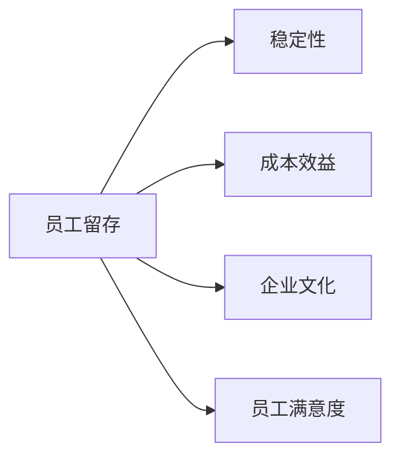

                 

# 员工留存：降低人才流失率的策略

## 关键词
- 员工留存
- 人才流失率
- 薪资与福利
- 职业发展
- 工作环境
- 领导与管理

## 摘要
本文将深入探讨员工留存的重要性，分析人才流失的根源，并提出一系列降低人才流失率的策略。通过结合实际案例和数据分析，本文旨在为企业管理者提供实用的指导，帮助他们在竞争激烈的市场环境中保持核心竞争力。

## 引言
### 员工留存的重要性

在当今全球化和技术驱动的商业环境中，人才已经成为企业最宝贵的资产。员工留存率的提高不仅能够降低招聘和培训成本，还能够提升团队的效率和创新能力。以下是员工留存带来的几大益处：

1. **提高工作效率**：留存员工有助于团队建立默契和流程优化，从而提高工作效率。
2. **降低培训成本**：新员工的培训通常需要大量时间和资源，而现有员工的熟悉度可以减少这一成本。
3. **增强企业凝聚力**：高留存率通常意味着员工对企业的认同感和归属感较强，有利于团队凝聚力的提升。
4. **提升品牌形象**：员工的高留存率往往被外界视为企业文化和工作环境的正面体现，有助于提升品牌形象。

### 人才流失的现状

尽管员工留存的重要性被广泛认可，但实际情况并不乐观。许多企业面临着人才流失的问题，尤其是在技术领域和快节奏的行业中。以下是人才流失的一些常见原因：

1. **薪资与福利差距**：在市场竞争激烈的环境中，薪资和福利水平往往成为员工跳槽的主要原因。
2. **职业发展受限**：缺乏职业规划和晋升机会是导致员工流失的另一个重要因素。
3. **工作环境问题**：不健康的工作环境、过大的工作压力和缺乏工作与生活的平衡都会影响员工的留存。
4. **管理问题**：不当的管理和沟通技巧会导致员工感到不被重视，从而选择离职。

## 理解员工留存
### 核心概念

**员工留存**：指企业在一定时间内保持员工数量的稳定，避免大量员工离职。

**人才流失率**：指单位时间内离开企业的员工数量与总员工数的比率。

### 属性和特征

1. **稳定性**：员工留存率越高，企业的稳定性越强。
2. **成本效益**：高留存率意味着企业能够在人力资源上实现更高的成本效益。
3. **企业文化**：良好的企业文化有助于提高员工的留存率。

### 对比表格

| 特征         | 留存率低的企业 | 留存率高的企业 |
| ------------ | ------------- | ------------- |
| 员工流动性   | 高            | 低            |
| 成本效益     | 低            | 高            |
| 企业文化     | 弱            | 强            |
| 员工满意度   | 低            | 高            |

### ER图



## 根源分析：人才流失的原因
### 薪资与福利

薪资和福利是影响员工留存的重要因素之一。以下是一些导致人才流失的薪资与福利问题：

1. **薪资水平低**：薪酬低于市场平均水平，导致员工感到不公平和不满。
2. **福利不足**：缺乏全面的福利保障，如医疗保险、退休金等。
3. **奖励制度不透明**：奖励制度不明确或执行不公，导致员工对薪酬体系失去信心。

### 职业发展

职业发展受限是员工流失的另一个重要原因。以下是一些相关问题：

1. **晋升机会有限**：缺乏晋升通道，员工看不到未来的发展空间。
2. **培训不足**：企业不重视员工培训，导致员工技能无法提升。
3. **职业规划缺乏指导**：员工缺乏明确的职业规划，感到迷茫和不安。

### 工作环境

不健康的工作环境也会影响员工的留存。以下是一些相关因素：

1. **工作压力过大**：长期高强度的压力导致员工身心疲惫，影响工作质量和留存意愿。
2. **工作与生活平衡**：缺乏灵活的工作时间和远程工作选项，导致工作与生活难以平衡。
3. **企业文化问题**：企业文化不良，如存在欺凌、排挤等行为，导致员工工作体验不佳。

### 管理问题

不当的管理和沟通也是导致员工流失的重要原因。以下是一些相关问题：

1. **沟通不畅**：管理层与员工之间的沟通不畅，导致员工感到被忽视和不重视。
2. **领导力不足**：领导缺乏有效的领导力，无法激励和引导员工。
3. **管理不当**：管理层决策不当或管理风格过于严苛，导致员工不满和流失。

## 应对策略：留住关键人才
### 薪资与福利

1. **市场竞争力**：确保薪资水平与市场接轨，提供有竞争力的薪酬待遇。
2. **全面福利**：提供全面的福利保障，包括医疗保险、退休金等。
3. **奖励制度**：建立透明的奖励制度，确保奖励与员工绩效和贡献挂钩。

### 职业发展

1. **晋升通道**：建立明确的晋升通道，让员工看到职业发展的前景。
2. **培训与发展**：定期提供培训和学习机会，帮助员工提升技能和知识。
3. **职业规划**：与员工一起制定职业规划，提供个性化的职业发展指导。

### 工作环境

1. **工作与生活平衡**：提供灵活的工作时间和远程工作选项，帮助员工实现工作与生活的平衡。
2. **健康的工作环境**：创造一个健康、积极的工作环境，减少员工的工作压力。
3. **企业文化**：建立积极向上的企业文化，鼓励员工之间的合作和沟通。

### 管理问题

1. **沟通与反馈**：建立有效的沟通机制，鼓励员工与管理层进行开放和坦诚的沟通。
2. **领导力提升**：提升管理层的领导力，培养激励和引导员工的能力。
3. **管理优化**：优化管理流程和决策机制，减少不必要的官僚主义。

## 技术与数据在员工留存中的应用
### 数据分析

数据分析是提高员工留存率的重要工具。通过分析员工流失数据，企业可以识别出流失的根源，并采取相应的措施。以下是一些数据分析的关键步骤：

1. **数据收集**：收集员工流失数据，包括离职原因、离职时间等。
2. **数据清洗**：清洗数据，去除错误和不完整的信息。
3. **数据分析**：使用统计分析和机器学习技术，分析员工流失数据，识别出流失模式和趋势。
4. **数据可视化**：使用数据可视化工具，将分析结果以图表和报告的形式呈现，便于管理层理解和决策。

### 技术工具

1. **大数据分析平台**：如Hadoop、Spark等，用于大规模数据的存储和处理。
2. **机器学习框架**：如TensorFlow、Scikit-learn等，用于构建和训练流失预测模型。
3. **数据可视化工具**：如Tableau、Power BI等，用于将数据分析结果以直观的方式展示。

## 实战案例：企业员工留存策略的实施

### 案例背景

某知名科技公司A，在近年来面临着较高的员工流失率问题。公司管理层意识到，需要采取有效措施提高员工留存率，以保持企业的核心竞争力。以下是A公司的员工留存策略实施过程。

### 系统功能设计

A公司通过以下系统功能模块来提升员工留存率：

1. **薪资与福利管理系统**：自动计算和发放薪资，提供多样化的福利选项。
2. **员工培训与发展平台**：提供在线培训课程、职业规划工具和晋升通道。
3. **员工反馈与沟通系统**：建立员工与管理层之间的沟通渠道，收集员工反馈和建议。
4. **健康与工作环境管理系统**：提供健康检查、心理咨询和远程工作支持。

### 系统架构设计

A公司的员工留存系统采用以下架构设计：

1. **前端界面**：使用React框架构建用户友好的界面。
2. **后端服务**：使用Spring Boot框架构建微服务架构，提供数据存储、处理和API接口。
3. **数据仓库**：使用Hadoop生态圈中的HDFS和Hive进行大规模数据存储和管理。
4. **机器学习平台**：使用TensorFlow和Scikit-learn进行流失预测模型的训练和部署。

### 系统接口设计与交互

A公司的员工留存系统通过以下接口和交互流程来确保高效运作：

1. **用户身份验证**：用户通过单点登录（SSO）进行身份验证。
2. **数据交互**：使用RESTful API进行前端与后端的数据交互。
3. **权限控制**：根据用户的角色和权限，控制对系统不同功能模块的访问。
4. **事件追踪**：使用日志收集和分析工具（如ELK栈）追踪用户行为和系统事件。

### 项目实施与源代码

A公司实施员工留存项目的具体步骤如下：

1. **需求分析**：与各部门沟通，了解员工留存的具体需求和痛点。
2. **系统设计**：根据需求分析结果，设计系统架构和功能模块。
3. **编码实现**：开发前端和后端代码，实现系统功能。
4. **测试与部署**：进行功能测试和性能测试，确保系统稳定运行，然后部署到生产环境。

以下是部分关键模块的Python源代码示例：

```python
# 员工薪资计算示例
def calculate_salary(employee_data):
    base_salary = employee_data['base_salary']
    bonus = 0
    if employee_data['performance_rating'] > 3:
        bonus = base_salary * 0.1
    total_salary = base_salary + bonus
    return total_salary

# 员工流失预测示例
from sklearn.ensemble import RandomForestClassifier
from sklearn.model_selection import train_test_split
from sklearn.metrics import accuracy_score

def predict_员工流失(data, target_variable):
    X = data.drop(target_variable, axis=1)
    y = data[target_variable]
    X_train, X_test, y_train, y_test = train_test_split(X, y, test_size=0.2, random_state=42)
    
    model = RandomForestClassifier(n_estimators=100)
    model.fit(X_train, y_train)
    y_pred = model.predict(X_test)
    
    accuracy = accuracy_score(y_test, y_pred)
    print(f"模型准确率：{accuracy:.2f}")

# 读取员工数据
employee_data = pd.read_csv('employee_data.csv')
# 计算薪资
employee_data['salary'] = employee_data.apply(lambda row: calculate_salary(row), axis=1)
# 预测员工流失
predict_员工流失(employee_data, '离职标志')
```

### 代码应用解读与分析

1. **薪资计算**：`calculate_salary`函数用于根据员工的基本薪资和绩效评分计算总薪资。这个函数体现了企业对绩效优异员工的奖励机制。
2. **流失预测**：`predict_员工流失`函数使用随机森林模型对员工流失进行预测。这通过分析员工数据中的特征变量来构建预测模型，体现了数据驱动的人才管理理念。

### 实际案例分析

A公司在实施员工留存策略后，进行了详细的员工流失数据分析和系统监测。以下是部分实际案例：

1. **薪资调整**：通过分析薪资与员工留存率的关系，A公司发现薪资水平是影响员工留存的重要因素。因此，公司对部分员工的薪资进行了调整，提高了市场竞争力。
2. **培训计划**：A公司通过员工培训与发展平台，提供了丰富的在线培训资源，并鼓励员工参与。这提升了员工的技能水平，增强了员工的职业发展信心。
3. **反馈与沟通**：通过员工反馈与沟通系统，A公司及时收集了员工的意见和建议，并迅速响应。这改善了员工与管理层之间的沟通，增强了员工的归属感和满意度。

### 项目小结

A公司通过实施系统化的员工留存策略，成功降低了员工流失率，提升了企业的整体竞争力。该项目不仅为企业提供了数据驱动的决策支持，还通过优化薪资、培训和沟通等措施，营造了一个更加健康和积极的工作环境。

## 最佳实践 Tips

1. **定期进行员工满意度调查**：通过定期的员工满意度调查，及时了解员工的需求和问题，及时采取改进措施。
2. **建立透明的职业发展通道**：为员工提供明确的晋升路径和职业规划，帮助他们看到未来的发展前景。
3. **关注工作与生活的平衡**：提供灵活的工作时间和远程工作选项，关注员工的身心健康，帮助他们实现工作与生活的平衡。
4. **强化领导力培训**：提升管理层的领导力，培养他们的沟通能力和激励技巧，以更好地管理和激励员工。

## 小结

员工留存是企业管理的重要任务，通过合理的薪资与福利、职业发展、工作环境和领导管理等策略，企业可以降低人才流失率，保持团队的稳定性和创造力。数据分析和技术工具的应用为员工留存提供了数据支持和决策依据，企业应充分利用这些工具，实现人才管理的精细化。

## 注意事项

1. **个性化管理**：每个员工都有不同的需求和期望，企业应采取个性化的管理策略，关注每位员工的个性化需求。
2. **持续改进**：员工留存是一个持续的过程，企业需要不断收集反馈，进行改进和优化。

## 拓展阅读

1. **《员工满意度调查技巧》**：了解如何设计和实施有效的员工满意度调查，获取有价值的员工反馈。
2. **《职业发展规划指南》**：学习如何制定和实施职业发展规划，帮助员工实现个人职业目标。
3. **《领导力培训手册》**：掌握领导力提升的方法和技巧，提升管理层的领导力和沟通能力。

## 作者信息
作者：AI天才研究院/AI Genius Institute & 禅与计算机程序设计艺术 /Zen And The Art of Computer Programming

