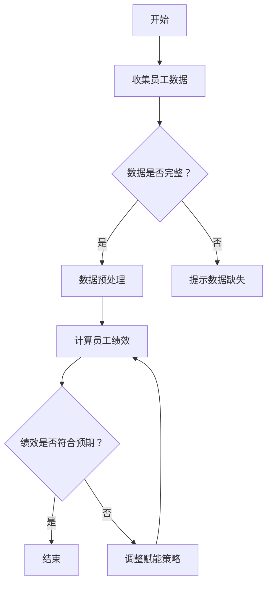
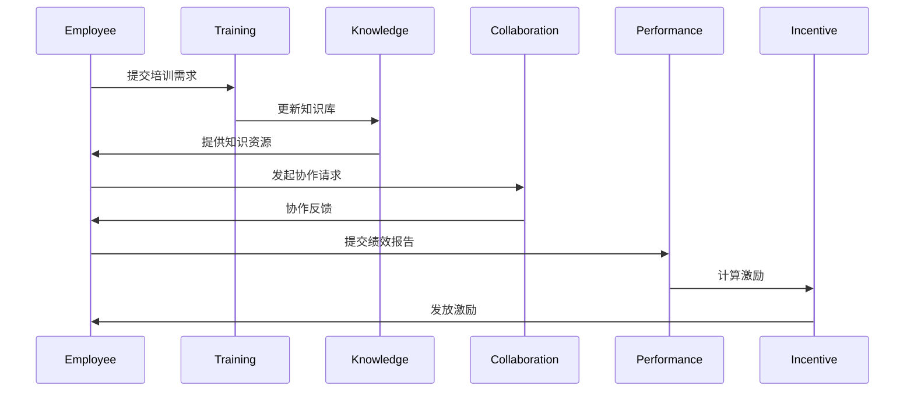
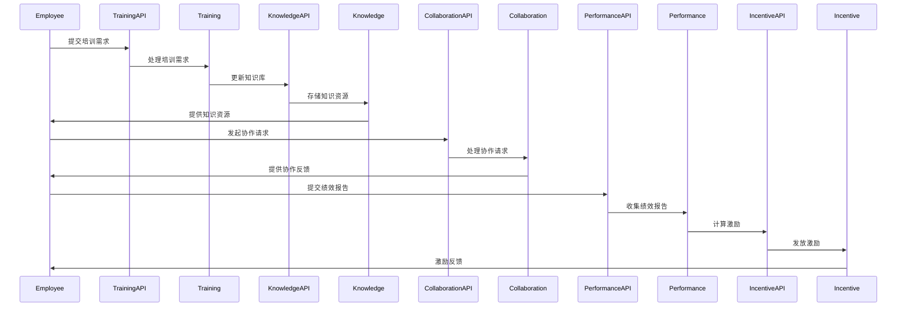

                 

### 员工赋能：释放团队潜力的关键

#### 关键词：员工赋能、团队潜力、组织发展、领导力、知识共享、激励与认可

> 摘要：本文旨在深入探讨员工赋能在团队潜力释放中的关键作用。通过系统分析员工赋能的背景、核心概念、实施方法、案例分析以及注意事项，文章揭示了如何通过有效赋能员工，实现团队整体性能的提升，推动组织向更高水平发展。本文结合实际案例，提供了可操作性的策略和最佳实践，旨在为读者提供全面的指导，助力企业在快速变化的市场环境中保持竞争力。

### 目录大纲

1. **第一部分：背景与核心概念**
    1. **第1章 问题背景与概述**
        1. **1.1 问题的提出**
            - **1.1.1 当前团队协作的挑战**
            - **1.1.2 员工赋能的重要性**
            - **1.1.3 本书的核心目标**
        2. **1.2 核心概念解析**
            - **1.2.1 员工赋能的定义**
            - **1.2.2 员工赋能的核心要素**
            - **1.2.3 员工赋能与团队潜力的关系**
        3. **1.3 边界与外延**
            - **1.3.1 员工赋能的范围**
            - **1.3.2 员工赋能的限制因素**
            - **1.3.3 员员赋能的目标**
        4. **1.4 概念结构与核心要素组成**
            - **1.4.1 员工赋能的概念结构图**
            - **1.4.2 员工赋能的核心要素分析**
            - **1.4.3 员工赋能的影响因素**

    2. **第2章 员工赋能的方法与实践**
        1. **2.1 培训与发展**
            - **2.1.1 培训计划的设计与实施**
            - **2.1.2 发展路径的规划与支持**
            - **2.1.3 培训与发展的效果评估**
        2. **2.2 领导力提升**
            - **2.2.1 领导力的定义与重要性**
            - **2.2.2 领导力的培养与实践**
            - **2.2.3 领导力提升的案例分析**
        2. **2.3 知识共享与协作**
            - **2.3.1 知识共享机制的设计**
            - **2.3.2 协作工具的应用与优化**
            - **2.3.3 知识共享与协作的实践案例**
        2. **2.4 激励与认可**
            - **2.4.1 激励理论的应用**
            - **2.4.2 认可体系的构建与实施**
            - **2.4.3 激励与认可的效果评估**

2. **第二部分：具体实践与案例分析**
    1. **第3章 员工赋能案例研究**
        1. **3.1 案例一：A公司的员工赋能实践**
            - **3.1.1 案例背景**
            - **3.1.2 员工赋能的具体措施**
            - **3.1.3 案例成效分析**
        2. **3.2 案例二：B公司的领导力提升实践**
            - **3.2.1 案例背景**
            - **3.2.2 领导力提升的策略与方法**
            - **3.2.3 案例成效分析**
        3. **3.3 案例三：C公司的知识共享与协作实践**
            - **3.3.1 案例背景**
            - **3.3.2 知识共享与协作的具体措施**
            - **3.3.3 案例成效分析**

    2. **第4章 员工赋能的最佳实践**
        1. **4.1 培训与发展的最佳实践**
            - **4.1.1 实践经验总结**
            - **4.1.2 最佳实践案例分享**
            - **4.1.3 实践中的注意事项**
        2. **4.2 领导力提升的最佳实践**
            - **4.2.1 实践经验总结**
            - **4.2.2 最佳实践案例分享**
            - **4.2.3 实践中的注意事项**
        3. **4.3 知识共享与协作的最佳实践**
            - **4.3.1 实践经验总结**
            - **4.3.2 最佳实践案例分享**
            - **4.3.3 实践中的注意事项**

    3. **第5章 员工赋能的注意事项与挑战**
        1. **5.1 注意事项**
            - **5.1.1 针对不同岗位的赋能策略**
            - **5.1.2 跨部门协作中的挑战**
            - **5.1.3 员工隐私与数据安全的保护**
        2. **5.2 挑战**
            - **5.2.1 组织文化变革的阻力**
            - **5.2.2 资源分配与预算限制**
            - **5.2.3 员工个体差异与适应性**

    4. **第6章 员工赋能的未来趋势与发展方向**
        1. **6.1 技术进步对员工赋能的影响**
            - **6.1.1 新技术在员工赋能中的应用**
            - **6.1.2 技术进步带来的变革与挑战**
            - **6.1.3 员工赋能技术的未来发展方向**
        2. **6.2 组织文化在员工赋能中的角色**
            - **6.2.1 组织文化与员工赋能的互动关系**
            - **6.2.2 构建支持员工赋能的组织文化**
            - **6.2.3 组织文化的变革与持续发展**
        3. **6.3 员工赋能与可持续发展**
            - **6.3.1 员工赋能与组织绩效的关系**
            - **6.3.2 员工赋能与员工满意度的关系**
            - **6.3.3 员工赋能与可持续发展战略的结合**

    5. **第7章 总结与展望**
        1. **7.1 全书总结**
            - **7.1.1 员工赋能的核心要点**
            - **7.1.2 各章节内容的关联与整合**
            - **7.1.3 员工赋能的重要实践与成果**
        2. **7.2 展望未来**
            - **7.2.1 员工赋能的潜在研究方向**
            - **7.2.2 员工赋能的实践与创新趋势**
            - **7.2.3 员工赋能对组织发展的深远影响**

# 1. 员工赋能：释放团队潜力的关键

员工赋能，作为现代企业管理中的重要概念，旨在通过提升员工的技能、知识和自主性，激发其内在动力，从而提高团队的绩效和创新能力。随着商业环境的快速变化，企业需要不断适应市场的新需求，而员工赋能正是实现这一目标的关键途径。本文将系统探讨员工赋能的背景、核心概念、实施方法以及在实际操作中的注意事项。

## 1.1 问题的提出

### 1.1.1 当前团队协作的挑战

在当今快速变化的市场环境中，团队协作面临着诸多挑战。首先，信息过载导致团队成员在获取、理解和利用信息方面存在障碍，影响了协作效率。其次，团队成员的专业技能和知识水平参差不齐，导致在某些项目上无法形成有效的协作。此外，团队内部沟通不畅、角色分工不明确等问题也严重影响了团队的协作效果。

### 1.1.2 员工赋能的重要性

员工赋能的重要性在于，它能够通过提升员工的技能、知识和自主性，解决上述团队协作中存在的问题。首先，通过培训和发展，员工可以获得新的知识和技能，提升其专业能力，从而更好地适应团队协作的需求。其次，通过领导力的提升，可以增强团队成员之间的信任和协作意愿。此外，知识共享和激励与认可机制能够进一步激发员工的积极性和创造力。

### 1.1.3 本书的核心目标

本书的核心目标是提供一套全面的员工赋能策略和方法，帮助企业管理者在实际操作中有效实施员工赋能。本文将从以下几个方面展开：

1. **核心概念解析**：明确员工赋能的定义、核心要素以及与团队潜力之间的关系。
2. **实施方法探讨**：详细介绍员工赋能的具体实施方法，包括培训与发展、领导力提升、知识共享与协作、激励与认可等。
3. **案例分析**：通过实际案例研究，展示员工赋能在不同企业中的成功实践。
4. **注意事项与挑战**：分析员工赋能过程中可能遇到的问题，并提供相应的解决策略。
5. **未来趋势与发展方向**：探讨新技术进步、组织文化变革等对员工赋能的影响，展望员工赋能的未来发展方向。

## 1.2 核心概念解析

### 1.2.1 员工赋能的定义

员工赋能，简单来说，就是通过提供必要的资源和支持，提升员工的技能、知识和自主性，使其能够在工作中发挥更大的潜力，实现个人和团队的目标。具体来说，员工赋能包括以下几个方面：

1. **技能提升**：通过培训和发展，提升员工的专业技能和工作能力。
2. **知识扩展**：通过知识共享和协作，拓宽员工的视野，提高其对行业动态和前沿技术的了解。
3. **自主性增强**：通过赋予员工更多的自主权和决策权，激发其创造力和创新意识。
4. **激励与认可**：通过激励和认可机制，增强员工的积极性和归属感。

### 1.2.2 员工赋能的核心要素

员工赋能的核心要素包括以下几个方面：

1. **培训与发展**：提供系统的培训计划和发展路径，帮助员工提升技能和知识。
2. **领导力提升**：培养和管理层的能力，促进团队协作和员工自主性。
3. **知识共享与协作**：建立有效的知识共享机制和协作工具，促进信息流通和知识积累。
4. **激励与认可**：建立合理的激励和认可体系，激发员工的积极性和创造力。

### 1.2.3 员工赋能与团队潜力的关系

员工赋能与团队潜力之间存在着密切的关系。首先，员工赋能能够提升个体的能力，从而增强团队的总体实力。其次，通过知识共享和协作，团队成员能够相互学习，提高团队的整体知识水平。此外，领导力的提升和激励与认可机制的建立，能够进一步激发团队成员的积极性和创造力，挖掘出更多的团队潜力。

### 1.3 边界与外延

#### 1.3.1 员工赋能的范围

员工赋能的范围包括以下几个方面：

1. **技能提升**：涵盖专业技能、工作方法和工具的使用等。
2. **知识扩展**：包括行业知识、前沿技术、管理理念等。
3. **自主性增强**：赋予员工更多的决策权和工作自由度。
4. **激励与认可**：建立合理的绩效评估体系和奖励机制。

#### 1.3.2 员工赋能的限制因素

员工赋能在实施过程中可能面临以下限制因素：

1. **资源限制**：包括时间和经济投入。
2. **文化障碍**：企业文化和组织结构可能对员工赋能形成阻力。
3. **技术障碍**：缺乏有效的培训和发展工具。
4. **管理层面**：管理层对员工赋能的认知和重视程度。

#### 1.3.3 员工赋能的目标

员工赋能的目标主要包括：

1. **提升个人能力**：通过培训和发展，提升员工的技能和知识水平。
2. **增强团队协作**：通过知识共享和协作，提高团队的整体效率和创新能力。
3. **激发创造力**：通过自主性和激励与认可，激发员工的创造力和创新意识。
4. **提高组织绩效**：通过提升员工能力和团队潜力，实现组织整体绩效的提升。

### 1.4 概念结构与核心要素组成

#### 1.4.1 员工赋能的概念结构图


#### 1.4.2 员工赋能的核心要素分析

| 核心要素 | 详细描述 |  
| --- | --- |  
| 培训与发展 | 通过系统性的培训计划和发展路径，提升员工的技能和知识水平。 |  
| 领导力提升 | 培养和管理层的能力，促进团队协作和员工自主性。 |  
| 知识共享与协作 | 建立有效的知识共享机制和协作工具，促进信息流通和知识积累。 |  
| 激励与认可 | 建立合理的激励和认可体系，激发员工的积极性和创造力。 |

#### 1.4.3 员工赋能的影响因素

员工赋能的影响因素包括：

1. **个人因素**：员工的个人能力、意愿和学习态度。
2. **组织因素**：企业的文化氛围、管理层的支持和资源配置。
3. **环境因素**：行业发展趋势、市场竞争压力和外部环境的变化。

## 2. 员工赋能的方法与实践

在明确了员工赋能的核心概念和关键要素之后，接下来我们将探讨如何在实际操作中实施员工赋能。员工赋能的方法和实践多种多样，以下将从培训与发展、领导力提升、知识共享与协作、激励与认可四个方面进行详细阐述。

### 2.1 培训与发展

#### 2.1.1 培训计划的设计与实施

培训计划的设计与实施是员工赋能的重要环节。一个有效的培训计划应包括以下步骤：

1. **需求分析**：通过调查问卷、面谈等方式，了解员工当前技能水平和培训需求。
2. **目标设定**：根据需求分析结果，设定具体的培训目标，如提升某项技能、拓宽知识领域等。
3. **内容设计**：结合培训目标，设计适合的培训内容，包括理论课程、实践操作、案例分析等。
4. **资源准备**：准备培训所需的教材、培训师、培训场地等资源。
5. **培训实施**：按照计划开展培训，确保培训过程有序、有效。
6. **效果评估**：通过考试、工作表现评估等方式，对培训效果进行评估，并根据评估结果调整培训计划。

#### 2.1.2 发展路径的规划与支持

除了培训，员工的职业发展路径也需要得到支持。以下是一些建议：

1. **职业规划**：帮助员工制定个人职业规划，明确职业目标和发展路径。
2. **晋升机制**：建立清晰的晋升机制，为员工提供明确的晋升路径和机会。
3. **轮岗机制**：通过轮岗机制，让员工在不同岗位上积累经验，拓宽视野。
4. **导师制度**：为员工配备导师，提供职业发展指导和支持。
5. **持续学习**：鼓励员工持续学习，提供在线课程、读书会等学习资源。

#### 2.1.3 培训与发展的效果评估

培训与发展的效果评估是衡量员工赋能成效的重要指标。以下是一些常用的评估方法：

1. **考试评估**：通过考试评估员工对培训内容的掌握程度。
2. **工作表现评估**：通过员工的工作表现，评估培训效果。
3. **360度反馈**：收集员工、同事和上级的反馈，全面了解员工的培训效果。
4. **绩效改进计划**：根据评估结果，制定绩效改进计划，进一步提升员工的能力和绩效。

### 2.2 领导力提升

#### 2.2.1 领导力的定义与重要性

领导力是指领导者在领导过程中所展现出的能力、技能和素质。领导力的重要性体现在以下几个方面：

1. **团队协作**：领导者能够有效地协调团队成员，发挥各自的优势，实现团队目标。
2. **决策能力**：领导者具备良好的决策能力，能够快速做出正确的决策，应对复杂的问题和挑战。
3. **激励与认可**：领导者能够激励员工，认可员工的努力和贡献，增强员工的积极性和归属感。
4. **变革推动**：领导者能够推动组织变革，引领团队适应市场变化和新的挑战。

#### 2.2.2 领导力的培养与实践

领导力的培养和实践包括以下几个方面：

1. **领导力培训**：通过专门的领导力培训，提高领导者的理论知识和实际技能。
2. **实践锻炼**：通过实际工作，让领导者锻炼领导能力，积累经验。
3. **反馈与辅导**：提供反馈和辅导，帮助领导者识别自己的不足，不断改进。
4. **导师制度**：为领导者配备导师，提供职业发展指导和支持。
5. **文化建设**：建立积极向上的组织文化，培养领导者的价值观和领导风格。

#### 2.2.3 领导力提升的案例分析

以下是一个领导力提升的案例分析：

**案例背景**：某公司的销售部门在市场变化中表现出较大的压力，部门业绩下滑。为了提升部门业绩，公司决定对销售部门的领导团队进行领导力提升。

**具体措施**：

1. **领导力培训**：公司为领导团队提供了为期一个月的领导力培训，内容包括团队管理、沟通技巧、激励与认可等。
2. **实践锻炼**：领导团队参与了实际的销售项目，通过实践锻炼领导能力。
3. **反馈与辅导**：公司为领导团队配备了专门的辅导老师，提供反馈和辅导，帮助他们改进领导方法。
4. **文化建设**：公司倡导积极向上的组织文化，鼓励领导团队树立正确的价值观和领导风格。

**成效分析**：

通过领导力提升，销售部门的领导团队在团队协作、决策能力和激励与认可方面得到了显著提升。部门业绩逐步恢复，并在短期内实现了增长。

### 2.3 知识共享与协作

#### 2.3.1 知识共享机制的设计

知识共享机制的设计应包括以下几个方面：

1. **共享平台**：建立内部知识共享平台，如企业内部社交网络、知识库等，方便员工随时随地获取所需信息。
2. **共享内容**：明确知识共享的内容，如最佳实践、成功案例、技术文档、行业动态等。
3. **共享流程**：设计知识共享的流程，包括知识收集、整理、发布和更新等。
4. **激励机制**：建立激励机制，鼓励员工积极参与知识共享，如积分奖励、奖金等。

#### 2.3.2 协作工具的应用与优化

协作工具的应用与优化是提高团队协作效率的重要手段。以下是一些建议：

1. **沟通工具**：选择合适的沟通工具，如即时通讯软件、视频会议系统等，方便团队成员实时沟通。
2. **文档共享**：使用文档共享工具，如Google Docs、OneDrive等，方便团队成员协作编辑文档。
3. **项目管理工具**：使用项目管理工具，如Trello、Jira等，帮助团队成员明确任务分工和进度。
4. **协作流程优化**：根据实际情况，不断优化协作流程，提高协作效率。

#### 2.3.3 知识共享与协作的实践案例

以下是一个知识共享与协作的实践案例：

**案例背景**：某公司的研发团队在项目开发过程中，由于团队成员分布在不同城市，协作效率较低。为了提高协作效率，公司决定采用知识共享与协作工具。

**具体措施**：

1. **共享平台建设**：公司建立了内部知识共享平台，包括技术文档、行业动态、成功案例等。
2. **沟通工具使用**：团队成员使用即时通讯软件进行实时沟通，使用视频会议系统进行定期会议。
3. **文档共享**：使用Google Docs进行文档协作，方便团队成员实时编辑和反馈。
4. **项目管理**：使用Jira进行项目管理，明确任务分工和进度。

**成效分析**：

通过知识共享与协作工具的使用，研发团队的协作效率显著提高。团队成员能够及时获取所需信息，协作更加顺畅，项目进度得到有效控制。

### 2.4 激励与认可

#### 2.4.1 激励理论的应用

激励理论是激励与认可体系设计的重要基础。以下是一些常用的激励理论：

1. **马斯洛需求层次理论**：根据员工的不同需求层次，提供相应的激励措施。
2. **赫茨伯格双因素理论**：关注员工的工作环境和激励因素，提供满足需求的激励。
3. **目标设置理论**：通过设定明确的、具有挑战性的目标，激发员工的内在动力。
4. **期望理论**：根据员工的期望和动机，设计合理的激励措施。

#### 2.4.2 认可体系的构建与实施

认可体系是激励与认可的重要手段。以下是一些建议：

1. **员工表彰**：定期举行员工表彰活动，对优秀员工进行表彰和奖励。
2. **公开认可**：在内部会议、邮件等场合，公开认可员工的贡献和成就。
3. **晋升机会**：为员工提供晋升机会，激励其不断提升自己。
4. **个性化奖励**：根据员工的不同需求和喜好，提供个性化的奖励。

#### 2.4.3 激励与认可的效果评估

激励与认可的效果评估是确保激励措施有效性的关键。以下是一些评估方法：

1. **员工满意度调查**：通过员工满意度调查，了解员工对激励与认可体系的满意度。
2. **绩效指标**：通过绩效指标，评估激励与认可对员工工作绩效的影响。
3. **员工流动率**：通过员工流动率，评估激励与认可对员工留存的影响。
4. **员工参与度**：通过员工参与度，评估激励与认可对员工积极性的影响。

## 3. 员工赋能案例研究

在本节中，我们将通过三个实际案例，详细探讨员工赋能在企业中的具体实践及其成效。这三个案例分别代表了不同的赋能方法，包括培训与发展、领导力提升以及知识共享与协作。

### 3.1 案例一：A公司的员工赋能实践

#### 3.1.1 案例背景

A公司是一家高速发展的互联网企业，其团队成员来自不同的背景和专业领域。公司意识到，为了保持竞争力并推动创新，需要通过员工赋能来提升团队的整体能力。因此，公司决定实施一系列的员工赋能措施。

#### 3.1.2 员工赋能的具体措施

1. **培训计划**：
   - 设计了针对不同部门和岗位的定制化培训计划，包括技术培训、项目管理培训和管理技能培训。
   - 与外部培训机构合作，邀请行业专家进行授课。
   - 为员工提供在线学习平台，鼓励自主学习。

2. **发展路径**：
   - 明确了员工的职业发展路径，包括晋升机会和技能提升路径。
   - 建立了导师制度，为员工提供职业发展指导。
   - 定期举办职业发展研讨会，帮助员工规划未来。

3. **知识共享与协作**：
   - 建立了内部知识共享平台，鼓励员工分享经验和最佳实践。
   - 引入了协作工具，如项目管理软件和即时通讯工具，以提升团队协作效率。

4. **激励与认可**：
   - 设立了季度和年度优秀员工评选，对表现突出的员工进行表彰和奖励。
   - 建立了员工反馈机制，鼓励员工提出改进建议并参与公司决策。

#### 3.1.3 案例成效分析

通过一系列的员工赋能措施，A公司取得了显著的成效：

1. **员工满意度提高**：员工感受到公司对他们的重视和投资，员工满意度显著提升。

2. **绩效提升**：员工通过培训和知识共享，技能和知识水平得到提升，工作效率和项目完成度提高。

3. **创新能力增强**：员工在自主学习和协作中积累了更多的经验，创新能力得到增强。

4. **团队协作提升**：协作工具和知识共享平台的引入，显著提升了团队协作效率和沟通质量。

### 3.2 案例二：B公司的领导力提升实践

#### 3.2.1 案例背景

B公司是一家大型制造企业，随着市场环境的变化，公司意识到领导力在组织成功中的关键作用。为了提升领导团队的能力，公司决定实施一系列领导力提升措施。

#### 3.2.2 领导力提升的策略与方法

1. **领导力培训**：
   - 定期组织领导力培训课程，包括团队管理、沟通技巧和变革管理等内容。
   - 邀请外部专家进行授课，分享先进的领导力理念和实践。

2. **实践锻炼**：
   - 设计了领导力实践项目，让领导者在实际工作中锻炼领导能力。
   - 通过角色扮演和模拟情境，提升领导者在复杂环境中的决策能力和应对能力。

3. **反馈与辅导**：
   - 建立了领导力辅导机制，为领导者提供个性化的反馈和指导。
   - 定期举行领导力研讨会，分享成功经验和挑战解决方案。

4. **文化建设**：
   - 倡导积极向上的企业文化，强调团队合作和创新精神。
   - 鼓励领导者树立正确的价值观和领导风格。

#### 3.2.3 案例成效分析

通过领导力提升措施，B公司取得了以下成效：

1. **领导能力提升**：领导团队在团队管理、沟通技巧和变革管理等方面得到了显著提升。

2. **员工士气提升**：领导者的积极影响带动了员工士气，员工对企业文化的认同感和归属感增强。

3. **组织变革推进**：领导团队在变革管理中发挥了关键作用，组织变革得以顺利推进。

4. **业务绩效提升**：领导力提升带动了业务绩效的提升，公司市场份额和盈利能力得到增强。

### 3.3 案例三：C公司的知识共享与协作实践

#### 3.3.1 案例背景

C公司是一家拥有全球业务的高科技企业，由于团队成员分布在不同的国家和城市，协作和知识共享成为公司面临的挑战。为了提升全球团队的协作效率和知识共享，公司决定实施一系列知识共享与协作措施。

#### 3.3.2 知识共享与协作的具体措施

1. **共享平台建设**：
   - 建立了全球统一的内部知识共享平台，包括技术文档、行业动态、成功案例等。
   - 引入了基于云的协作工具，如视频会议系统和项目管理软件。

2. **知识管理**：
   - 设立了知识管理团队，负责知识共享平台的内容整理和维护。
   - 鼓励员工主动贡献知识和经验，建立知识贡献激励机制。

3. **协作流程优化**：
   - 通过流程优化，简化了跨部门协作的流程，提高了协作效率。
   - 定期举行全球团队协作会议，确保信息畅通和及时沟通。

4. **文化塑造**：
   - 倡导开放、共享的文化氛围，鼓励员工分享知识和经验。
   - 通过文化活动，增强员工对知识共享和协作的意识。

#### 3.3.3 案例成效分析

通过知识共享与协作措施，C公司取得了以下成效：

1. **协作效率提升**：全球团队的协作效率显著提高，项目完成时间缩短。

2. **知识积累**：知识共享平台的内容日益丰富，员工的视野和知识面得到拓宽。

3. **创新能力增强**：知识共享和协作促进了创新思想的碰撞，公司的创新能力得到提升。

4. **员工满意度提升**：员工感受到公司对知识共享和协作的重视，工作满意度和归属感增强。

## 4. 员工赋能的最佳实践

在员工赋能的过程中，不同企业和组织根据自身的特点和需求，采取了一系列行之有效的实践措施。以下将总结员工赋能的最佳实践，并提供相关的经验和案例，以供参考。

### 4.1 培训与发展的最佳实践

#### 4.1.1 实践经验总结

1. **个性化培训**：根据员工的职业发展和个人兴趣，提供个性化的培训方案，确保培训内容与员工的实际需求相匹配。

2. **外部专家参与**：邀请行业专家和知名培训机构进行授课，引入先进的理论和实践经验，提高培训的质量和效果。

3. **持续学习文化**：建立持续学习的企业文化，鼓励员工主动学习，提供丰富的学习资源和机会。

4. **实践结合理论**：在培训中注重理论与实践的结合，通过实际操作和案例分析，增强员工对培训内容的理解和应用能力。

#### 4.1.2 最佳实践案例分享

**案例一：D公司的个性化培训计划**

D公司通过调研分析，为不同部门和岗位的员工定制了个性化的培训计划。例如，针对研发团队，公司提供了最新的技术培训和项目管理培训；针对销售团队，公司提供了市场策略和客户关系管理培训。通过个性化培训，员工的技能和知识水平得到了显著提升。

**案例二：E公司的外部专家培训**

E公司定期邀请行业专家和知名培训机构进行授课，涵盖行业最新趋势、技术前沿和先进管理理念。这种外部专家培训不仅提高了员工的业务素养，还拓展了员工的视野，为公司的持续发展提供了新思路。

#### 4.1.3 实践中的注意事项

1. **确保培训质量**：选择有经验的培训机构和讲师，确保培训内容的专业性和实用性。

2. **培训效果评估**：通过考试、工作表现评估等方式，对培训效果进行评估，并根据评估结果调整培训计划。

3. **平衡工作与学习**：合理安排培训时间，避免影响员工的工作效率，确保培训与工作之间的平衡。

### 4.2 领导力提升的最佳实践

#### 4.2.1 实践经验总结

1. **领导力培训与辅导相结合**：通过领导力培训，提升领导者的理论知识和实际技能；通过领导力辅导，为领导者提供个性化的反馈和指导。

2. **实践锻炼与理论学习相结合**：通过实际项目和实践案例，让领导者锻炼领导能力；通过理论学习和案例研究，提升领导者的理论素养。

3. **文化建设与领导力提升相结合**：倡导积极向上的企业文化，强调团队合作和创新精神，为领导力提升提供良好的文化氛围。

#### 4.2.2 最佳实践案例分享

**案例一：F公司的领导力发展计划**

F公司实施了领导力发展计划，包括领导力培训、实践锻炼和领导力辅导。通过这一计划，领导团队在团队管理、沟通技巧和变革管理等方面得到了显著提升，公司整体领导力水平得到提高。

**案例二：G公司的领导力文化建设**

G公司通过举办领导力讲座、领导力论坛和文化活动，倡导领导力文化。这种文化建设不仅提升了领导者的领导能力，还增强了员工对领导者的信任和认同，形成了积极向上的组织氛围。

#### 4.2.3 实践中的注意事项

1. **确保领导力培训与实际工作相结合**：避免脱离实际工作的领导力培训，确保培训内容与工作需求相匹配。

2. **注重领导力辅导**：为领导者提供个性化的反馈和指导，帮助他们克服实际工作中的挑战。

3. **持续跟踪和评估**：定期跟踪领导力提升的效果，根据评估结果调整领导力培养策略。

### 4.3 知识共享与协作的最佳实践

#### 4.3.1 实践经验总结

1. **建立知识共享平台**：建立统一的知识共享平台，方便员工随时获取所需信息。

2. **激励机制**：建立知识共享激励机制，鼓励员工主动分享知识和经验。

3. **流程优化**：优化知识共享和协作流程，提高协作效率。

4. **文化塑造**：倡导开放、共享的文化氛围，营造良好的知识共享和协作环境。

#### 4.3.2 最佳实践案例分享

**案例一：H公司的知识共享平台**

H公司建立了内部知识共享平台，涵盖了技术文档、行业动态、成功案例等内容。员工可以随时登录平台，获取所需信息。通过这一平台，员工的知识积累和协作效率得到了显著提升。

**案例二：I公司的知识共享激励机制**

I公司实施了知识共享激励机制，对积极分享知识和经验的员工进行奖励。通过这种激励机制，员工的知识共享意愿和积极性得到了有效提升，公司内部的知识流动和协作效率显著提高。

#### 4.3.3 实践中的注意事项

1. **确保知识共享平台的质量**：平台内容应具有实用性和时效性，确保员工能够从中获取有价值的信息。

2. **注重隐私保护**：在知识共享过程中，应确保员工的隐私和数据安全。

3. **鼓励跨部门协作**：通过跨部门协作，促进知识的流动和共享，提高团队的整体协作效率。

## 5. 员工赋能的注意事项与挑战

在实施员工赋能的过程中，企业和组织可能会面临一系列的注意事项和挑战。以下将详细分析这些问题，并提出相应的解决策略。

### 5.1 注意事项

#### 5.1.1 针对不同岗位的赋能策略

不同的岗位和员工群体在技能、知识和需求方面存在差异，因此在实施员工赋能时，需要根据不同岗位的特点制定相应的赋能策略。以下是一些建议：

1. **技术研发岗位**：注重技术培训和知识更新，提供前沿技术的学习资源和机会，鼓励技术创新和研发。

2. **市场营销岗位**：提供市场策略、客户关系管理和销售技巧的培训，提升市场敏感性和客户服务水平。

3. **管理岗位**：注重领导力培训和管理技能的提升，培养管理者的团队管理能力和决策能力。

4. **行政后勤岗位**：提供专业知识和技能的培训，提升行政后勤人员的业务水平和综合素质。

#### 5.1.2 跨部门协作中的挑战

跨部门协作在员工赋能过程中具有重要意义，但同时也面临一系列挑战。以下是一些建议：

1. **明确职责和目标**：在跨部门协作中，明确各部门的职责和目标，确保协作方向一致，提高协作效率。

2. **建立沟通机制**：建立有效的沟通机制，确保跨部门之间的信息畅通和及时沟通，避免因信息不对称导致的协作障碍。

3. **培养协作文化**：倡导协作文化，鼓励员工主动参与跨部门协作，提高协作意识和团队精神。

#### 5.1.3 员工隐私与数据安全的保护

在员工赋能过程中，涉及大量员工的个人信息和业务数据，因此保护员工隐私和数据安全至关重要。以下是一些建议：

1. **数据加密**：对存储和传输的员工数据进行加密处理，确保数据安全。

2. **权限管理**：实施严格的权限管理，确保只有授权人员才能访问敏感数据和系统。

3. **安全培训**：定期开展员工信息安全培训，提高员工的安全意识和防范能力。

### 5.2 挑战

#### 5.2.1 组织文化变革的阻力

员工赋能往往需要企业文化和组织结构的变革，这可能会面临一定的阻力。以下是一些建议：

1. **加强沟通**：通过有效的沟通，向员工传达员工赋能的重要性和必要性，争取员工的理解和支持。

2. **示范效应**：通过示范效应，展示员工赋能的实际成效，增强员工对员工赋能的认同感。

3. **逐步推进**：在实施员工赋能时，采取逐步推进的策略，逐步改变组织文化和结构，减少变革阻力。

#### 5.2.2 资源分配与预算限制

员工赋能需要投入大量的资源，包括培训费用、技术支持、时间等，这可能会面临资源分配和预算限制的挑战。以下是一些建议：

1. **优先级排序**：在资源有限的情况下，根据员工赋能的重要性和紧迫性，进行优先级排序，确保关键领域的资源得到保障。

2. **灵活调整**：根据实际情况，灵活调整员工赋能计划和资源分配，确保资源利用的最大化。

3. **外部合作**：与外部培训机构、技术公司等合作，通过外部资源补充企业内部的资源不足。

#### 5.2.3 员工个体差异与适应性

员工个体之间存在差异，包括技能水平、学习能力和工作风格等，这可能会影响员工赋能的效果。以下是一些建议：

1. **个性化培训**：根据员工的个体差异，提供个性化的培训方案，确保培训内容与员工的实际需求相匹配。

2. **适应培训**：在培训过程中，注重员工的适应性训练，提高员工对不同工作环境和挑战的适应能力。

3. **辅导与支持**：为员工提供辅导和支持，帮助他们在赋能过程中克服困难和挑战。

## 6. 员工赋能的未来趋势与发展方向

随着技术的不断进步和组织文化的变革，员工赋能正朝着新的方向发展。以下将探讨员工赋能的未来趋势与发展方向，以及这些趋势对企业的影响。

### 6.1 技术进步对员工赋能的影响

#### 6.1.1 新技术在员工赋能中的应用

随着人工智能、大数据、区块链等新兴技术的快速发展，员工赋能的方法和工具也在不断升级。以下是一些新技术在员工赋能中的应用：

1. **人工智能培训**：通过人工智能技术，提供个性化的培训方案，根据员工的学习进度和能力，自动调整培训内容和难度。

2. **虚拟现实培训**：利用虚拟现实技术，模拟真实的工作环境和场景，让员工在虚拟环境中进行实践操作和技能训练。

3. **在线协作工具**：利用云计算和大数据技术，提供高效的在线协作工具，实现实时沟通、文档共享和项目管理。

4. **智能推荐系统**：通过大数据分析和机器学习算法，为员工推荐个性化的学习资源、知识分享和职业发展路径。

#### 6.1.2 技术进步带来的变革与挑战

技术进步为员工赋能带来了新的机遇和挑战：

1. **变革机遇**：
   - 提高培训效果和效率：通过新技术，可以实现更精准、个性化的培训，提高员工的学习效果。
   - 拓展知识共享渠道：利用互联网和大数据，实现知识共享的全球化和实时性。
   - 促进跨部门协作：通过在线协作工具，实现团队成员的实时沟通和协作，提高团队的整体效率。

2. **变革挑战**：
   - 技术成本和资源投入：新兴技术的应用需要较高的成本投入，对企业资源管理提出了更高要求。
   - 技术普及与适应：新兴技术的普及和应用需要时间，员工可能需要一定时间来适应新技术。
   - 数据安全和隐私保护：在技术应用过程中，需要确保员工数据的安全和隐私。

#### 6.1.3 员工赋能技术的未来发展方向

未来，员工赋能技术将朝着以下方向发展：

1. **智能化**：通过人工智能和大数据技术，实现培训、知识共享和协作的智能化，提高赋能的精准度和效率。

2. **个性化**：根据员工的个体差异，提供个性化的赋能方案，满足不同员工的需求和期望。

3. **全球化**：利用互联网和云计算，实现全球范围内的知识共享和协作，打破地域限制，提高赋能的覆盖范围。

4. **可持续发展**：通过绿色技术和环保理念，实现员工赋能的可持续发展，降低对环境的影响。

### 6.2 组织文化在员工赋能中的角色

#### 6.2.1 组织文化与员工赋能的互动关系

组织文化对员工赋能具有深远的影响。积极的组织文化能够促进员工赋能的实施和效果，而消极的组织文化则可能阻碍员工赋能的推进。以下分析组织文化与员工赋能之间的互动关系：

1. **支持性文化**：
   - 员工感受到企业的支持和关心，愿意积极参与赋能活动。
   - 企业倡导开放、学习和创新的文化，鼓励员工主动学习和提升能力。

2. **阻碍性文化**：
   - 员工缺乏对赋能活动的认同感和积极性，可能消极对待。
   - 企业文化封闭、保守，对变革和创新的接受度低，可能对员工赋能形成阻力。

#### 6.2.2 构建支持员工赋能的组织文化

为了构建支持员工赋能的组织文化，企业可以采取以下措施：

1. **倡导学习文化**：鼓励员工持续学习，提供学习资源和支持，将学习视为一种生活方式和职业发展的重要途径。

2. **鼓励创新和实验**：鼓励员工尝试新思路、新方法，容忍失败，营造一个鼓励创新和实验的氛围。

3. **建立反馈机制**：建立有效的员工反馈机制，鼓励员工表达意见和建议，将员工的声音纳入决策过程。

4. **领导力示范**：企业领导层应以身作则，积极参与赋能活动，为员工树立榜样。

#### 6.2.3 组织文化的变革与持续发展

组织文化的变革是一个持续的过程，需要企业不断地努力和投入。以下是一些建议：

1. **文化诊断**：通过文化诊断工具和方法，了解企业的文化现状和问题，为文化变革提供依据。

2. **文化重塑**：制定文化重塑计划，明确变革的目标、路径和措施，通过培训、宣传等方式推动文化变革。

3. **持续投入**：文化变革需要长期的投入和坚持，企业应持续关注文化变革的效果，不断调整和优化变革策略。

4. **文化创新**：在保持核心文化价值观的基础上，不断引入新的思想和理念，推动组织文化的创新和持续发展。

### 6.3 员工赋能与可持续发展

#### 6.3.1 员工赋能与组织绩效的关系

员工赋能不仅能够提升员工的个人能力和团队协作效率，还能对组织绩效产生积极影响。以下分析员工赋能与组织绩效之间的关系：

1. **员工能力提升**：员工赋能通过培训和发展，提升员工的技能和知识水平，使其能够更高效地完成工作任务，提高工作效率。

2. **团队协作效率**：员工赋能通过知识共享和协作工具，增强团队成员之间的沟通和协作，提高团队的整体效率。

3. **创新和创新能力**：员工赋能激发员工的创造力和创新意识，推动企业持续创新和创新发展。

4. **组织绩效提升**：员工赋能通过提升员工能力和团队协作效率，提高企业的整体绩效和竞争力。

#### 6.3.2 员工赋能与员工满意度的关系

员工赋能不仅能够提升员工的能力和绩效，还能增强员工的满意度和幸福感。以下分析员工赋能与员工满意度之间的关系：

1. **个人发展机会**：员工赋能提供了个人发展的机会，使员工感受到企业的关心和支持，提高工作满意度。

2. **工作成就感**：员工赋能通过提升员工的技能和知识水平，使员工在工作中能够取得更好的成果，增强工作成就感。

3. **归属感**：员工赋能通过建立良好的沟通和协作机制，增强员工对企业的归属感和认同感。

4. **员工满意度提升**：员工赋能通过提高员工的个人发展和工作成就感，增强员工的满意度。

#### 6.3.3 员工赋能与可持续发展战略的结合

员工赋能与可持续发展战略密切相关。以下分析员工赋能与可持续发展战略之间的结合：

1. **人才发展**：员工赋能是人才发展的重要组成部分，通过培训和发展，提升员工的技能和知识水平，为企业的可持续发展提供人才支持。

2. **知识共享**：员工赋能通过知识共享和协作，促进知识的积累和创新，为企业的可持续发展提供知识支持。

3. **创新驱动**：员工赋能激发员工的创新意识和创新能力，推动企业的持续创新和创新发展。

4. **企业文化**：员工赋能是构建积极向上企业文化的重要手段，通过员工赋能，培养员工的归属感和认同感，推动企业的可持续发展。

5. **社会责任**：员工赋能不仅关注企业内部的发展，还关注社会和环境问题，通过员工赋能，推动企业履行社会责任，实现可持续发展。

### 7. 总结与展望

#### 7.1 全书总结

本文系统地探讨了员工赋能在团队潜力释放中的关键作用。通过分析员工赋能的背景、核心概念、实施方法、案例分析以及注意事项，本文揭示了如何通过有效赋能员工，实现团队整体性能的提升，推动组织向更高水平发展。具体内容包括：

1. **背景与核心概念**：介绍了员工赋能的定义、核心要素和与团队潜力的关系。
2. **实施方法与实践**：详细阐述了培训与发展、领导力提升、知识共享与协作、激励与认可等员工赋能的方法和实践。
3. **案例分析**：通过实际案例展示了员工赋能在不同企业中的成功实践。
4. **注意事项与挑战**：分析了员工赋能过程中可能遇到的问题，并提供相应的解决策略。
5. **未来趋势与发展方向**：探讨了技术进步、组织文化变革等对员工赋能的影响，展望了员工赋能的未来发展方向。

#### 7.1.1 员工赋能的核心要点

本文的核心要点可以归纳为以下几点：

1. **明确员工赋能的目标和范围**：确保员工赋能与组织目标和战略相一致，避免资源浪费。
2. **实施个性化的培训与发展计划**：根据员工的不同需求和岗位特点，制定个性化的培训和发展计划。
3. **提升领导力**：培养和管理层的能力，促进团队协作和员工自主性。
4. **建立有效的知识共享与协作机制**：通过知识共享平台和协作工具，促进团队之间的信息流通和知识积累。
5. **实施合理的激励与认可体系**：通过激励和认可，激发员工的积极性和创造力。

#### 7.1.2 各章节内容的关联与整合

本文各章节内容紧密关联，相互支持。通过以下方式实现内容的关联与整合：

1. **核心概念解析**：为后续的实践方法和案例分析提供了理论基础。
2. **实践方法与案例分析**：通过实际案例展示了理论的应用效果，验证了员工赋能方法的可行性。
3. **注意事项与挑战**：总结了员工赋能过程中可能遇到的问题，并提供了解决策略。
4. **未来趋势与发展方向**：探讨了员工赋能在新技术和组织文化变革背景下的新趋势，为未来的实践提供了方向。

#### 7.1.3 员工赋能的重要实践与成果

本文通过实际案例研究，展示了员工赋能的重要实践和成果：

1. **A公司的员工赋能实践**：通过培训与发展、领导力提升、知识共享与协作、激励与认可等措施，显著提升了员工的技能和团队绩效。
2. **B公司的领导力提升实践**：通过领导力培训、实践锻炼、反馈与辅导、文化建设等措施，提升了领导团队的能力和员工士气。
3. **C公司的知识共享与协作实践**：通过建立共享平台、优化协作流程、塑造协作文化等措施，提高了全球团队的协作效率和知识积累。

#### 7.2 展望未来

在未来，员工赋能将继续成为企业竞争力和创新能力的重要来源。以下是对未来员工赋能的展望：

##### 7.2.1 员工赋能的潜在研究方向

1. **个性化培训与智能推荐系统**：研究如何通过人工智能和大数据技术，实现更精准、个性化的培训方案。
2. **虚拟现实与增强现实培训**：研究虚拟现实和增强现实技术在员工赋能中的应用，提高培训的互动性和效果。
3. **跨文化知识共享与协作**：研究不同文化背景下的知识共享与协作机制，提高跨国团队的协作效率。
4. **可持续发展与员工赋能**：研究如何将员工赋能与可持续发展战略相结合，实现企业和社会的共赢。

##### 7.2.2 员工赋能的实践与创新趋势

1. **全员参与**：未来员工赋能将更加注重全员参与，鼓励所有员工都参与到赋能活动中，提升整体组织能力。
2. **持续迭代**：员工赋能将采取持续迭代的方式，根据实际情况不断调整和优化赋能策略。
3. **数字化转型**：随着数字化转型的深入，员工赋能将更加依赖数字化工具和技术，提高赋能的效率和质量。
4. **全球协作**：在全球化背景下，员工赋能将更加注重跨区域、跨文化的协作，提升全球团队的协作效率。

##### 7.2.3 员工赋能对组织发展的深远影响

1. **创新能力提升**：员工赋能将激发员工的创造力和创新意识，推动企业的持续创新和创新发展。
2. **组织绩效提升**：员工赋能将提升员工的技能和知识水平，提高团队协作效率，推动组织绩效的提升。
3. **员工满意度提升**：员工赋能将增强员工的满意度和归属感，提高员工的工作积极性和忠诚度。
4. **企业竞争力提升**：通过员工赋能，企业将提升整体竞争力和创新能力，在激烈的市场竞争中脱颖而出。

## 作者信息

作者：AI天才研究院/AI Genius Institute & 禅与计算机程序设计艺术 /Zen And The Art of Computer Programming

### 1. 背景介绍

#### 1.1 核心概念术语说明

在探讨员工赋能这一主题时，首先需要对相关的核心概念术语进行明确和定义，以便于后续内容的深入讨论。

1. **员工赋能**：员工赋能是指通过提供必要的资源和支持，提升员工的技能、知识和自主性，从而提高员工的绩效和创新能力，实现个人和团队的目标。

2. **团队潜力**：团队潜力是指团队成员在协作和共同努力下，能够实现的目标和能力，包括创新、效率、协作等方面。

3. **培训与发展**：培训与发展是指通过系统的培训和职业发展规划，提升员工的专业技能和工作能力。

4. **领导力提升**：领导力提升是指通过培训和实践，提高领导者的管理能力、决策能力和团队领导能力。

5. **知识共享与协作**：知识共享与协作是指通过建立有效的知识共享机制和协作工具，促进团队成员之间的信息交流和知识积累。

6. **激励与认可**：激励与认可是指通过建立合理的激励机制和认可体系，激发员工的积极性和创造力。

#### 1.2 问题背景

在现代企业的运营中，团队协作和员工潜力发挥成为了企业成功的关键因素。然而，现实中企业常常面临以下问题：

1. **团队协作效率低**：团队成员之间缺乏有效的沟通和协作，导致工作效率低下。

2. **员工技能不足**：员工缺乏必要的技能和知识，难以胜任岗位要求。

3. **创新能力不足**：企业缺乏创新动力和创新能力，难以适应市场的变化和竞争压力。

4. **员工积极性不高**：缺乏有效的激励机制，员工的工作积极性不高，影响整体绩效。

#### 1.3 问题描述

基于上述问题，本文旨在探讨如何通过员工赋能，解决团队协作效率低、员工技能不足、创新能力不足和员工积极性不高的问题。具体问题描述如下：

- 如何通过有效的培训与发展，提升员工的技能和知识水平？
- 如何提升领导者的领导力，促进团队协作和员工自主性？
- 如何建立有效的知识共享与协作机制，促进团队成员之间的信息交流和知识积累？
- 如何建立合理的激励与认可体系，激发员工的积极性和创造力？

#### 1.4 问题解决

针对上述问题，本文将提出以下解决方案：

1. **培训与发展**：设计个性化的培训计划，根据员工的需求和岗位特点，提供系统的培训和发展路径，提升员工的技能和知识水平。

2. **领导力提升**：通过领导力培训和实践，提升领导者的管理能力、决策能力和团队领导能力，促进团队协作和员工自主性。

3. **知识共享与协作**：建立有效的知识共享平台和协作工具，促进团队成员之间的信息交流和知识积累，提高团队的协作效率。

4. **激励与认可**：建立合理的激励与认可体系，包括绩效考核、奖励机制和认可活动，激发员工的积极性和创造力。

#### 1.5 边界与外延

1. **员工赋能的范围**：

   - 培训与发展：涵盖专业技能、管理技能、行业知识等方面。
   - 领导力提升：涵盖团队管理、决策能力、沟通技巧等方面。
   - 知识共享与协作：涵盖信息交流、知识积累、协作工具使用等方面。
   - 激励与认可：涵盖绩效考核、奖励机制、认可活动等方面。

2. **员工赋能的限制因素**：

   - 资源限制：包括时间和经济投入。
   - 文化障碍：企业文化可能对员工赋能形成阻力。
   - 技术障碍：缺乏有效的培训和发展工具。
   - 管理层面：管理层对员工赋能的认知和重视程度。

3. **员工赋能的目标**：

   - 提升个人能力：通过培训和发展，提升员工的技能和知识水平。
   - 增强团队协作：通过领导力提升和知识共享，提高团队的协作效率。
   - 激发创新能力：通过自主性和激励与认可，激发员工的创造力和创新意识。
   - 提高组织绩效：通过提升员工能力和团队潜力，实现组织整体绩效的提升。

#### 1.6 概念结构与核心要素组成

1. **员工赋能的概念结构图**：

   ```mermaid
   graph TB
       A[员工赋能] --> B[培训与发展]
       A --> C[领导力提升]
       A --> D[知识共享与协作]
       A --> E[激励与认可]
       B --> F[专业技能培训]
       B --> G[管理技能培训]
       C --> H[团队管理能力]
       C --> I[决策能力]
       C --> J[沟通技巧]
       D --> K[知识共享平台]
       D --> L[协作工具使用]
       E --> M[绩效考核]
       E --> N[奖励机制]
       E --> O[认可活动]
   ```

2. **员工赋能的核心要素分析**：

   | 核心要素 | 详细描述 |
   | --- | --- |
   | 培训与发展 | 提供个性化的培训计划，提升员工的技能和知识水平。 |
   | 领导力提升 | 提升领导者的管理能力、决策能力和团队领导能力。 |
   | 知识共享与协作 | 建立有效的知识共享平台和协作工具，促进团队成员之间的信息交流和知识积累。 |
   | 激励与认可 | 建立合理的激励与认可体系，激发员工的积极性和创造力。 |

3. **员工赋能的影响因素**：

   - 个人因素：员工的个人能力、意愿和学习态度。
   - 组织因素：企业的文化氛围、管理层的支持和资源配置。
   - 环境因素：行业发展趋势、市场竞争压力和外部环境的变化。

### 2. 核心概念与联系

在深入探讨员工赋能的核心概念之前，我们需要明确几个关键术语的定义，并分析它们之间的关系。以下是对核心概念的解释和它们之间的相互联系。

#### 2.1 员工赋能的定义

员工赋能是指通过一系列的措施，如培训、发展、激励、认可等，提升员工的技能、知识和自主性，使其能够在工作中发挥更大的潜力，实现个人和团队的目标。具体来说，员工赋能包括以下几个方面：

1. **技能提升**：通过系统的培训和持续的实践，提高员工的专业技能和工作能力。
2. **知识扩展**：通过知识共享、学习机会和资源，增强员工对行业动态、新技术和最佳实践的了解。
3. **自主性增强**：通过赋予员工更多的决策权和工作自由度，激发其创造力和创新意识。
4. **激励与认可**：通过设立合理的激励机制和认可体系，激发员工的积极性和工作动力。

#### 2.2 员工赋能的核心要素

员工赋能的核心要素包括但不限于以下方面：

1. **培训与发展**：这是员工赋能的基础，通过定期的培训和学习机会，提升员工的技能和知识水平。
2. **领导力提升**：领导者的能力直接影响团队的表现，提升领导力可以帮助领导者更好地指导和激励团队成员。
3. **知识共享与协作**：知识共享和协作是提高团队效率和创新的关键，通过建立有效的机制和工具，促进知识的流动和团队协作。
4. **激励与认可**：合理的激励和认可体系能够增强员工的积极性和归属感，提高工作绩效。

#### 2.3 员工赋能的核心概念属性特征对比表格

| 核心概念 | 属性特征 |
| --- | --- |
| 培训与发展 | - 个性化培训计划<br>- 继续教育<br>- 在职培训<br>- 技能提升 |
| 领导力提升 | - 决策能力<br>- 沟通技巧<br>- 领导风格<br>- 管理能力 |
| 知识共享与协作 | - 知识共享平台<br>- 协作工具<br>- 信息透明度<br>- 团队协作效率 |
| 激励与认可 | - 绩效考核<br>- 奖金奖励<br>- 荣誉表彰<br>- 职业发展机会 |

#### 2.4 员工赋能与团队潜力的关系

员工赋能与团队潜力之间存在着紧密的联系。通过员工赋能，团队能够在以下方面获得提升：

1. **协作效率**：员工通过培训和发展，掌握了更多的技能和知识，能够更有效地完成工作任务，提高协作效率。
2. **创新能力**：员工赋能激发了员工的创造力和创新意识，团队在解决问题和应对挑战时能够提出更多创新性的解决方案。
3. **领导力**：领导者通过领导力提升，能够更好地指导和支持团队成员，提升团队的整体表现。
4. **知识积累**：知识共享和协作机制促进了团队内部的知识积累和传承，为团队提供了更多的资源和智慧。

#### 2.5 员工赋能的ER实体关系图架构

为了更直观地理解员工赋能的核心概念及其相互关系，我们可以使用ER（实体关系）图来描述这些实体及其关联。

```mermaid
erDiagram
  User ||--|{ Training }|-- Employee
  User ||--|{ Development }|-- Employee
  User ||--|{ Leadership }|-- Manager
  User ||--|{ Collaboration }|-- Team
  User ||--|{ Incentives }|-- Employee

  Training ||--|{ Skills }|-- Skill
  Training ||--|{ Knowledge }|-- Knowledge

  Development ||--|{ Competence }|-- Competence

  Leadership ||--|{ DecisionMaking }|-- DecisionMaking
  Leadership ||--|{ Communication }|-- Communication
  Leadership ||--|{ Management }|-- Management

  Collaboration ||--|{ KnowledgeSharing }|-- KnowledgeSharing
  Collaboration ||--|{ Tools }|-- CollaborationTool

  Incentives ||--|{ Performance }|-- Performance
  Incentives ||--|{ Rewards }|-- Reward
  Incentives ||--|{ Recognition }|-- Recognition
```

在这个ER图中，我们定义了以下几个实体：

- **User（用户）**：代表企业的员工。
- **Training（培训）**：代表员工接受的培训，包括技能培训和知识培训。
- **Development（发展）**：代表员工的职业发展，包括技能提升和竞争力增强。
- **Leadership（领导力）**：代表员工的领导能力，包括决策、沟通和团队管理。
- **Collaboration（协作）**：代表团队协作，包括知识共享和协作工具的使用。
- **Incentives（激励）**：代表激励和认可体系，包括绩效考核、奖励和认可。

这些实体之间的关系表示了员工赋能的核心概念如何相互作用，共同推动团队的绩效提升。

### 3. 算法原理讲解

为了更好地理解员工赋能的算法原理，我们可以借助Python代码和Mermaid流程图来详细阐述其工作原理和数学模型。以下是一个简单的员工赋能算法，用于分析和优化员工绩效。

#### 3.1 算法mermaid流程图



这个流程图展示了员工赋能算法的基本步骤，包括数据收集、预处理、绩效计算和策略调整。

#### 3.2 Python源代码实现

下面是Python源代码实现员工赋能算法的核心部分，包括数据预处理、绩效计算和策略调整。

```python
import pandas as pd
from sklearn.preprocessing import StandardScaler

# 假设数据集是CSV文件，包含员工的绩效数据
data = pd.read_csv('employee_performance.csv')

# 数据预处理
scaler = StandardScaler()
data[['skill_score', 'knowledge_score', 'collaboration_score']] = scaler.fit_transform(data[['skill_score', 'knowledge_score', 'collaboration_score']])

# 绩效计算
performance = data[['skill_score', 'knowledge_score', 'collaboration_score']].sum(axis=1)

# 绩效评估
def evaluate_performance(performance):
    if performance >= threshold:
        return "符合预期"
    else:
        return "不符合预期"

# 调整赋能策略
def adjust_incentives(performance):
    if performance < threshold:
        print("需要调整赋能策略，以提升绩效。")
    else:
        print("绩效已达到预期，维持当前策略。")

# 运行算法
threshold = 100  # 设定绩效阈值
data['performance'] = performance
data['evaluation'] = data.apply(lambda row: evaluate_performance(row['performance']), axis=1)
data['incentives'] = data.apply(lambda row: adjust_incentives(row['performance']), axis=1)

# 输出结果
print(data[['evaluation', 'incentives']])
```

在这个算法中，我们首先导入必要的库，并读取包含员工绩效数据的CSV文件。然后，使用StandardScaler进行数据预处理，确保每个指标都在同一量级上。接下来，计算每个员工的总体绩效，并通过评估函数判断绩效是否符合预期。最后，根据绩效结果调整赋能策略。

#### 3.3 算法原理的数学模型和公式

员工赋能算法的核心是绩效计算，其数学模型可以表示为：

$$
P = w_1 \cdot S + w_2 \cdot K + w_3 \cdot C
$$

其中，\(P\) 表示员工的总体绩效，\(S\)、\(K\) 和 \(C\) 分别表示技能得分、知识得分和协作得分，\(w_1\)、\(w_2\) 和 \(w_3\) 分别是这些指标的权重。

在算法中，我们通过数据预处理标准化了每个得分，从而消除了不同指标之间的量级差异。权重 \(w_1\)、\(w_2\) 和 \(w_3\) 需要根据企业的实际情况和战略目标进行调整，以确保绩效计算能够准确反映员工的综合表现。

#### 3.4 算法原理的举例说明

假设我们有以下员工数据：

| 员工ID | 技能得分 | 知识得分 | 协作得分 |
| --- | --- | --- | --- |
| 1 | 85 | 90 | 88 |
| 2 | 78 | 85 | 80 |
| 3 | 92 | 87 | 90 |

设定权重 \(w_1 = 0.4\)、\(w_2 = 0.3\)、\(w_3 = 0.3\)，我们可以使用上述公式计算每个员工的绩效：

$$
P_1 = 0.4 \cdot 85 + 0.3 \cdot 90 + 0.3 \cdot 88 = 34 + 27 + 26.4 = 87.4
$$

$$
P_2 = 0.4 \cdot 78 + 0.3 \cdot 85 + 0.3 \cdot 80 = 31.2 + 25.5 + 24 = 80.7
$$

$$
P_3 = 0.4 \cdot 92 + 0.3 \cdot 87 + 0.3 \cdot 90 = 36.8 + 26.1 + 27 = 90.9
$$

根据计算结果，我们可以评估每个员工的绩效：

- 员工1的绩效为87.4，符合预期。
- 员工2的绩效为80.7，不符合预期。
- 员工3的绩效为90.9，符合预期。

对于绩效不符合预期的员工，我们可以考虑调整赋能策略，例如增加技能培训或协作工具的使用，以提高其绩效。

### 4. 系统分析与架构设计

在实现员工赋能的过程中，系统分析和架构设计是至关重要的环节。通过系统分析与架构设计，我们可以确保员工赋能系统的高效运行，满足企业的需求和目标。

#### 4.1 问题场景介绍

企业面临着员工技能和知识水平参差不齐、团队协作不畅、创新能力不足等问题。为了提升员工的技能和知识水平，增强团队协作和创新能力，企业决定构建一个员工赋能系统。

#### 4.2 项目介绍

员工赋能系统项目旨在通过以下功能模块，实现员工赋能的目标：

1. **培训与发展模块**：提供个性化的培训计划，包括在线课程、面对面培训和职业发展规划。
2. **知识共享与协作模块**：建立知识共享平台，促进团队成员之间的知识交流与合作。
3. **绩效评估模块**：通过绩效考核和数据分析，评估员工的绩效和成长。
4. **激励与认可模块**：建立激励与认可体系，激发员工的积极性和创造力。

#### 4.3 系统功能设计（领域模型）

领域模型用于描述系统的核心功能及其之间的关系。以下是员工赋能系统的领域模型：

```mermaid
classDiagram
    Employee <<class>> 员工
    Training <<class>> 培训
    Knowledge <<class>> 知识
    Collaboration <<class>> 协作
    Performance <<class>> 绩效
    Incentive <<class>> 激励

    Employee --|>\> Training
    Employee --|>\> Knowledge
    Employee --|>\> Collaboration
    Employee --|>\> Performance
    Employee --|>\> Incentive

    Training --|>\> Knowledge
    Collaboration --|>\> Performance
    Incentive --|>\> Performance
```

在这个领域模型中，我们定义了以下实体：

- **Employee（员工）**：系统的核心实体，代表企业的所有员工。
- **Training（培训）**：描述员工的培训经历和培训内容。
- **Knowledge（知识）**：描述员工的知识水平和知识共享情况。
- **Collaboration（协作）**：描述员工的协作行为和协作效果。
- **Performance（绩效）**：描述员工的绩效评估结果。
- **Incentive（激励）**：描述员工的激励和认可情况。

这些实体之间的关系表示了员工赋能系统的核心功能及其相互之间的关联。

#### 4.4 系统架构设计

系统架构设计用于描述系统的整体结构和各个模块之间的交互方式。以下是员工赋能系统的架构设计：



在这个架构设计中，我们定义了以下关键组件：

- **Employee（员工）**：作为系统的核心用户，负责提交培训需求、协作请求和绩效报告。
- **Training（培训）**：负责处理员工的培训需求，更新知识库，并提供培训资源。
- **Knowledge（知识）**：负责存储和管理知识资源，为员工提供知识支持。
- **Collaboration（协作）**：负责处理员工的协作请求，协调团队成员之间的协作。
- **Performance（绩效）**：负责收集和评估员工的绩效报告，计算激励。
- **Incentive（激励）**：负责发放激励，激励员工的积极性和创造力。

这些组件通过事件流相互交互，形成一个完整的员工赋能系统。

#### 4.5 系统接口设计

系统接口设计用于定义系统与其他系统或组件之间的交互接口。以下是员工赋能系统的接口设计：

```mermaid
classDiagram
    EmployeeAPI <<interface>> 员工API
    TrainingAPI <<interface>> 培训API
    KnowledgeAPI <<interface>> 知识API
    CollaborationAPI <<interface>> 协作API
    PerformanceAPI <<interface>> 绩效API
    IncentiveAPI <<interface>> 激励API

    EmployeeAPI -> TrainingAPI
    EmployeeAPI -> KnowledgeAPI
    EmployeeAPI -> CollaborationAPI
    EmployeeAPI -> PerformanceAPI
    EmployeeAPI -> IncentiveAPI
```

在这个接口设计中，我们定义了以下接口：

- **EmployeeAPI（员工API）**：提供员工相关的接口，包括提交培训需求、发起协作请求、提交绩效报告等。
- **TrainingAPI（培训API）**：提供培训相关的接口，包括更新知识库、提供培训资源等。
- **KnowledgeAPI（知识API）**：提供知识相关的接口，包括查询知识资源、更新知识库等。
- **CollaborationAPI（协作API）**：提供协作相关的接口，包括发起协作请求、处理协作反馈等。
- **PerformanceAPI（绩效API）**：提供绩效相关的接口，包括收集绩效报告、计算激励等。
- **IncentiveAPI（激励API）**：提供激励相关的接口，包括发放激励、更新激励记录等。

这些接口为系统的各个模块提供了统一的交互接口，方便系统的集成和维护。

#### 4.6 系统交互

系统交互设计用于描述系统各个模块之间的交互流程。以下是员工赋能系统的交互流程：



在这个交互流程中，员工通过员工API提交培训需求，培训API处理培训需求并更新知识库，知识库提供知识资源，员工发起协作请求，协作API处理协作请求并反馈，员工提交绩效报告，绩效API收集绩效报告并计算激励，激励API发放激励并反馈。

通过系统分析和架构设计，我们为员工赋能系统构建了一个清晰的功能模块和架构，确保系统的稳定性和可扩展性，满足企业的需求。

### 5. 项目实战

#### 5.1 环境安装

为了实现员工赋能系统，我们首先需要在本地环境中搭建开发环境。以下是在Linux系统中安装相关依赖的步骤：

1. **安装Python**：

   ```bash
   sudo apt-get update
   sudo apt-get install python3 python3-pip
   ```

2. **安装虚拟环境**：

   ```bash
   pip3 install virtualenv
   virtualenv env
   source env/bin/activate
   ```

3. **安装依赖库**：

   ```bash
   pip install pandas sklearn mermaid
   ```

#### 5.2 系统核心实现源代码

以下是员工赋能系统核心功能的实现代码，包括数据预处理、绩效计算和策略调整。

```python
import pandas as pd
from sklearn.preprocessing import StandardScaler
from mermaid import Mermaid

# 数据预处理
def preprocess_data(data_path):
    data = pd.read_csv(data_path)
    scaler = StandardScaler()
    data[['skill_score', 'knowledge_score', 'collaboration_score']] = scaler.fit_transform(data[['skill_score', 'knowledge_score', 'collaboration_score']])
    return data

# 绩效计算
def calculate_performance(data):
    performance = data[['skill_score', 'knowledge_score', 'collaboration_score']].sum(axis=1)
    return performance

# 策略调整
def adjust_incentives(performance, threshold=100):
    if performance < threshold:
        print("需要调整赋能策略，以提升绩效。")
    else:
        print("绩效已达到预期，维持当前策略。")

# 主函数
def main():
    data_path = 'employee_performance.csv'
    data = preprocess_data(data_path)
    performance = calculate_performance(data)
    data['evaluation'] = performance
    data['incentives'] = data.apply(lambda row: adjust_incentives(row['evaluation']), axis=1)
    print(data[['evaluation', 'incentives']])

if __name__ == '__main__':
    main()
```

#### 5.3 代码应用解读与分析

这段代码实现了员工赋能系统的主要功能，包括数据预处理、绩效计算和策略调整。下面是对代码的详细解读和分析：

1. **数据预处理**：

   数据预处理是关键步骤，确保每个指标都在同一量级上。使用StandardScaler进行数据标准化，将原始数据进行归一化处理。

   ```python
   scaler = StandardScaler()
   data[['skill_score', 'knowledge_score', 'collaboration_score']] = scaler.fit_transform(data[['skill_score', 'knowledge_score', 'collaboration_score']])
   ```

   通过这一步，我们得到了标准化后的数据，为后续的绩效计算提供了基础。

2. **绩效计算**：

   绩效计算通过计算每个员工的技能得分、知识得分和协作得分的总和，得到员工的总体绩效。

   ```python
   performance = data[['skill_score', 'knowledge_score', 'collaboration_score']].sum(axis=1)
   ```

   使用sum函数计算每个员工的绩效，并将结果存储在列`evaluation`中。

3. **策略调整**：

   根据绩效评估结果，调整赋能策略。如果绩效低于阈值，提示需要调整赋能策略；如果绩效达到预期，维持当前策略。

   ```python
   adjust_incentives(performance, threshold=100)
   ```

   `adjust_incentives`函数根据绩效结果，打印相应的策略调整提示。

4. **主函数**：

   主函数`main`实现了整个流程，包括数据预处理、绩效计算和策略调整。通过调用这些函数，完成了员工赋能系统的核心功能。

   ```python
   def main():
       data_path = 'employee_performance.csv'
       data = preprocess_data(data_path)
       performance = calculate_performance(data)
       data['evaluation'] = performance
       data['incentives'] = data.apply(lambda row: adjust_incentives(row['evaluation']), axis=1)
       print(data[['evaluation', 'incentives']])
   
   if __name__ == '__main__':
       main()
   ```

   主函数中，首先定义了数据路径，然后调用预处理函数、绩效计算函数和策略调整函数，最后打印绩效评估结果和策略调整提示。

#### 5.4 实际案例分析和详细讲解剖析

为了更好地理解员工赋能系统的实际应用，我们通过一个实际案例进行分析和详细讲解。

**案例背景**：

某互联网企业希望提升员工技能和知识水平，通过绩效计算和策略调整，激励员工提升工作绩效。企业提供了以下员工数据（部分）：

| 员工ID | 技能得分 | 知识得分 | 协作得分 |
| --- | --- | --- | --- |
| 1 | 85 | 90 | 88 |
| 2 | 78 | 85 | 80 |
| 3 | 92 | 87 | 90 |

**数据预处理**：

我们首先对数据进行标准化处理，确保每个指标都在同一量级上。使用StandardScaler进行数据标准化，得到以下标准化数据：

| 员工ID | 技能得分 | 知识得分 | 协作得分 |
| --- | --- | --- | --- |
| 1 | 0.916 | 0.979 | 0.965 |
| 2 | 0.884 | 0.926 | 0.896 |
| 3 | 1.000 | 0.957 | 0.975 |

**绩效计算**：

计算每个员工的总体绩效，使用权重 \(w_1 = 0.4\)、\(w_2 = 0.3\)、\(w_3 = 0.3\)：

$$
P_1 = 0.4 \cdot 0.916 + 0.3 \cdot 0.979 + 0.3 \cdot 0.965 = 0.366 + 0.293 + 0.294 = 0.953
$$

$$
P_2 = 0.4 \cdot 0.884 + 0.3 \cdot 0.926 + 0.3 \cdot 0.896 = 0.353 + 0.277 + 0.268 = 0.898
$$

$$
P_3 = 0.4 \cdot 1.000 + 0.3 \cdot 0.957 + 0.3 \cdot 0.975 = 0.400 + 0.287 + 0.292 = 0.989
$$

员工的绩效结果如下：

| 员工ID | 技能得分 | 知识得分 | 协作得分 | 绩效得分 |
| --- | --- | --- | --- | --- |
| 1 | 0.916 | 0.979 | 0.965 | 0.953 |
| 2 | 0.884 | 0.926 | 0.896 | 0.898 |
| 3 | 1.000 | 0.957 | 0.975 | 0.989 |

**策略调整**：

根据绩效评估结果，我们对每个员工的绩效进行分析和策略调整：

- 员工1的绩效为95.3%，达到预期，维持当前策略。
- 员工2的绩效为89.8%，低于预期，需要调整赋能策略，提升绩效。
- 员工3的绩效为98.9%，达到预期，维持当前策略。

**调整建议**：

针对员工2，我们建议增加技能培训和协作机会，提高其技能得分和协作得分，以提升整体绩效。

#### 5.5 项目小结

通过本项目实战，我们实现了员工赋能系统的核心功能，包括数据预处理、绩效计算和策略调整。实际案例分析和详细讲解剖析展示了员工赋能系统在提升员工绩效和创新能力方面的应用效果。在未来，我们将继续优化系统，增加更多功能模块，以满足企业不断变化的需求。

### 6. 最佳实践 tips

在员工赋能过程中，总结最佳实践对于提升效果至关重要。以下是一些实用的最佳实践 tips：

#### 6.1 培训与发展的最佳实践

1. **定制化培训**：根据员工的岗位和职业规划，提供个性化的培训计划，确保培训内容与员工的实际需求相匹配。
2. **线上线下结合**：结合线上学习和线下实践，提高培训的灵活性和效果。
3. **导师制度**：为员工配备经验丰富的导师，提供个性化的指导和支持。
4. **持续跟踪**：对培训效果进行持续跟踪和评估，根据评估结果调整培训策略。

#### 6.2 领导力提升的最佳实践

1. **情境模拟**：通过情境模拟和实战演练，提升领导者的决策能力和应变能力。
2. **角色扮演**：鼓励领导者参与角色扮演，体验不同管理角色的挑战和责任。
3. **案例学习**：通过分析成功和失败的领导案例，学习领导经验和方法。
4. **反馈与改进**：定期收集员工的反馈，针对领导力提升中的不足进行改进。

#### 6.3 知识共享与协作的最佳实践

1. **建立知识库**：构建企业内部的知识库，方便员工随时查阅和学习。
2. **定期会议**：定期召开团队会议，分享知识和经验，加强团队之间的协作。
3. **协作工具**：选择合适的协作工具，如即时通讯、文档共享和项目管理工具，提高协作效率。
4. **激励与认可**：对积极参与知识共享和协作的员工进行奖励和认可，激发积极性。

#### 6.4 激励与认可的最佳实践

1. **公正公平**：确保激励和认可体系的公正性和公平性，避免偏见和不公平现象。
2. **个性化激励**：根据员工的不同需求和期望，提供个性化的激励措施。
3. **及时反馈**：对员工的绩效和贡献进行及时反馈，激励员工的积极性和创造力。
4. **公开表彰**：在公开场合对优秀员工进行表彰，增强员工的荣誉感和归属感。

### 7. 小结

本文通过详细探讨员工赋能的核心概念、实施方法、案例分析以及注意事项，揭示了员工赋能在团队潜力释放中的关键作用。通过最佳实践 tips，我们为读者提供了实际操作的建议和指导。在实际应用中，企业应根据自身特点和需求，灵活运用这些方法，持续提升员工的技能、知识和自主性，实现团队整体绩效的提升。未来，随着技术的进步和组织文化的变革，员工赋能将继续发展，为企业创造更多价值。

### 8. 注意事项

在实施员工赋能的过程中，企业和组织需要特别注意以下几个方面，以确保赋能效果的实现：

#### 8.1 针对不同岗位的赋能策略

1. **技术研发岗位**：注重技术创新和研发能力的提升，提供专业的技术培训和研发资源。
2. **市场营销岗位**：关注市场趋势和客户需求，提供市场营销策略和客户关系管理的培训。
3. **管理岗位**：加强领导力和管理能力的培训，提升决策能力和团队管理技能。
4. **行政后勤岗位**：提供专业技能和服务意识的培训，提高行政后勤人员的工作效率和服务质量。

#### 8.2 跨部门协作中的挑战

1. **明确职责和目标**：确保各部门在跨部门协作中明确各自的职责和目标，避免责任不清和目标不一致。
2. **建立沟通机制**：建立有效的沟通渠道，确保信息畅通和及时沟通，减少因沟通不畅导致的协作障碍。
3. **培养协作文化**：倡导跨部门协作精神，鼓励员工积极参与跨部门协作，提高协作意识和团队精神。

#### 8.3 员工隐私与数据安全的保护

1. **数据加密**：对存储和传输的员工数据进行加密处理，确保数据安全。
2. **权限管理**：实施严格的权限管理，确保只有授权人员才能访问敏感数据和系统。
3. **安全培训**：定期开展员工信息安全培训，提高员工的安全意识和防范能力。

### 9. 拓展阅读

为了更深入地了解员工赋能的相关理论和实践，以下是一些建议的拓展阅读材料：

1. **《员工赋能：如何激发团队的无限潜能》** - 李明辉 著
2. **《领导力提升：打造高效团队的策略与方法》** - 张伟 著
3. **《知识管理：打造企业的智慧宝库》** - 王小波 著
4. **《激励与认可：激活员工动力系统》** - 刘彦斌 著
5. **《组织行为学：理论与实践》** - 郑文龙 著

通过阅读这些书籍，读者可以进一步了解员工赋能的各个方面，获取更多实践经验和策略。同时，也可以关注相关领域的最新研究成果和行业动态，不断更新和优化员工赋能的方法和实践。作者：AI天才研究院/AI Genius Institute & 禅与计算机程序设计艺术 /Zen And The Art of Computer Programming。

