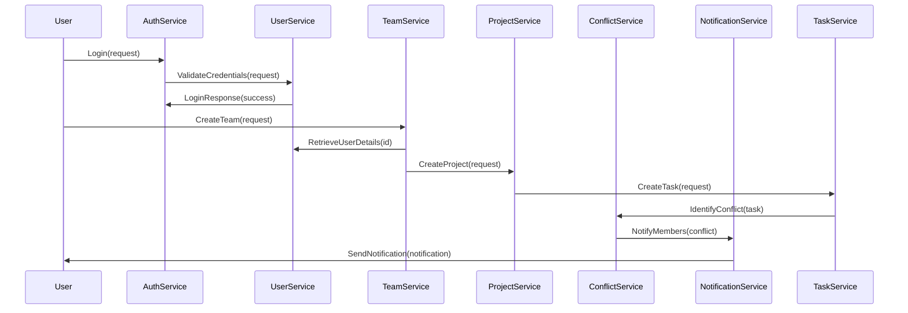
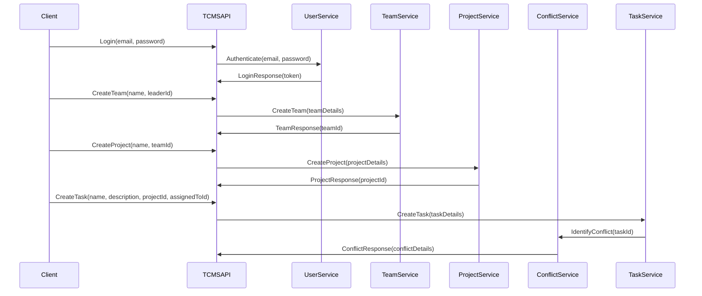
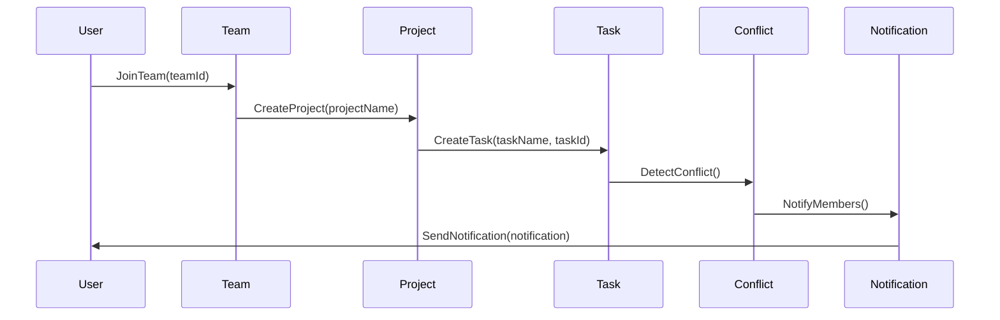

                 

### 文章标题

# 团队冲突管理：将分歧转化为创新动力

> 关键词：团队冲突管理、创新动力、团队建设、沟通策略

> 摘要：本文旨在探讨团队冲突管理的核心理论与实践，并阐述如何将团队内部的分歧转化为创新的动力，从而推动团队成长与发展。文章结构紧凑，逻辑清晰，通过实例分析和实践方法，为IT领域团队管理者提供实用的策略和指导。

---

### 0. 引言

在当今快速变化和竞争激烈的IT行业，团队协作和有效管理已成为企业成功的关键。然而，团队内部的冲突不可避免，甚至可能成为阻碍团队进步的障碍。有效的团队冲突管理不仅能够缓解紧张气氛，还能激发团队的潜能，将其分歧转化为创新的动力，从而推动团队的整体发展。本文将围绕这一主题展开，探讨团队冲突管理的重要性、核心概念、管理实践，以及如何通过创新思维促进团队成长。

文章结构如下：

1. **背景介绍**：分析团队冲突管理的必要性，定义团队冲突的概念及其影响。
2. **核心概念与联系**：阐述团队冲突的类型、管理框架和核心要素。
3. **团队冲突管理实践**：介绍团队冲突的识别、诊断、沟通和调解方法。
4. **冲突解决与转化**：探讨如何将冲突转化为团队创新的动力。
5. **团队建设与成长**：通过冲突管理促进团队成长和整体发展。
6. **实践案例**：提供实际案例分析和解决策略。
7. **总结与展望**：总结团队冲突管理的经验，展望未来发展趋势。

### 1. 背景介绍

#### 1.1 问题背景

随着全球化的推进和信息技术的快速发展，企业竞争日益激烈，创新成为企业持续发展的核心动力。在IT行业，团队协作是实现快速创新的重要方式。然而，团队成员背景、工作方式、价值观等方面的差异，往往会导致团队内部产生冲突。如果处理不当，这些冲突可能会影响团队的工作效率和创新能力。

#### 1.2 问题描述

团队冲突是指团队成员之间因目标不一致、工作方法不同、利益冲突等原因而产生的对抗性互动。冲突可以表现为言语争执、情绪对抗、工作效率下降等。团队冲突可以分为功能性冲突和破坏性冲突。功能性冲突有助于提高团队绩效，而破坏性冲突则可能损害团队关系和工作效率。

#### 1.3 问题解决

有效的团队冲突管理是缓解冲突、促进团队合作的关键。管理团队冲突的目的在于：

- **维护团队和谐**：通过有效的沟通和调解，减少冲突的负面影响，保持团队稳定。
- **激发创新潜力**：将冲突转化为团队创新的动力，促进团队成员的创造力和合作精神。
- **提升团队绩效**：通过团队冲突管理，提高团队工作效率，实现共同目标。

#### 1.4 边界与外延

团队冲突管理的范围主要包括识别冲突、诊断冲突原因、沟通调解冲突、制定解决方案等。其外延则涉及到团队文化、组织结构、领导风格等多个方面。有效的团队冲突管理不仅需要具体的方法和技巧，还需要从整体上优化团队环境，为团队成员提供良好的工作氛围。

#### 1.5 概念结构与核心要素

团队冲突管理的基本框架包括以下几个核心要素：

- **识别冲突**：通过观察和反馈，及时识别团队内部的冲突。
- **诊断冲突**：分析冲突的原因、程度和类型，为冲突管理提供依据。
- **沟通调解**：建立有效的沟通机制，通过调解解决冲突。
- **制定解决方案**：根据冲突的类型和原因，制定合适的解决方案，防止冲突再次发生。

### 2. 核心概念与联系

#### 2.1 团队冲突的定义与本质

团队冲突是指在团队工作过程中，成员之间由于目标不一致、利益冲突、工作方法不同等原因而产生的对抗性互动。冲突的本质是团队成员在价值观、行为方式等方面的差异，这些差异可能导致团队内部的紧张关系和对抗行为。

#### 2.2 团队冲突的类型

团队冲突可以分为功能性冲突和破坏性冲突：

- **功能性冲突**：指对团队目标的实现具有积极作用的冲突，如观点的碰撞、对工作方法的争议等。功能性冲突有助于激发团队成员的思考，提高团队的工作效率和创新能力。
- **破坏性冲突**：指对团队目标的实现产生负面影响的冲突，如言语攻击、情绪对立、工作低效等。破坏性冲突可能导致团队内部紧张关系加剧，影响团队的整体绩效。

#### 2.3 团队冲突管理的理论框架

团队冲突管理的理论框架主要包括以下几个方面：

- **传统冲突管理理论**：以避免冲突和调解冲突为主，强调保持团队和谐，避免冲突扩大化。
- **现代冲突管理理论**：强调冲突的积极意义，主张通过有效的沟通和协调，将冲突转化为团队创新的动力。
- **冲突管理的多维视角**：从组织文化、领导风格、团队结构等多个维度探讨团队冲突管理的方法和策略。

#### 2.4 团队冲突管理的核心要素

团队冲突管理的核心要素包括以下几个方面：

- **识别冲突**：通过观察、反馈和沟通，及时识别团队内部的冲突。
- **诊断冲突**：分析冲突的原因、程度和类型，为冲突管理提供依据。
- **沟通调解**：建立有效的沟通机制，通过调解解决冲突。
- **制定解决方案**：根据冲突的类型和原因，制定合适的解决方案，防止冲突再次发生。

### 3. 团队冲突管理实践

#### 3.1 团队冲突识别

识别团队冲突是团队冲突管理的第一步。有效的冲突识别需要以下方法：

- **观察法**：通过日常工作和沟通，观察团队成员的行为和态度，发现潜在的冲突。
- **反馈法**：通过团队成员的反馈，了解他们对团队工作环境和协作方式的感受，识别冲突点。
- **问卷调查法**：通过设计问卷，收集团队成员的意见和反馈，分析冲突的普遍性和严重性。

#### 3.2 团队冲突诊断

诊断团队冲突的目的是分析冲突的原因、程度和类型，为冲突管理提供依据。诊断方法包括：

- **原因分析**：从工作目标、工作方式、个人价值观等多个角度分析冲突产生的原因。
- **程度评估**：根据冲突的影响范围和严重程度，评估冲突的严重性。
- **类型判断**：区分功能性冲突和破坏性冲突，采取不同的管理策略。

#### 3.3 团队冲突沟通

沟通是团队冲突管理的关键环节。有效的沟通需要：

- **建立沟通机制**：明确沟通渠道和流程，确保团队成员之间的信息畅通。
- **提高沟通效果**：采用开放式提问、倾听技巧等沟通策略，减少误解和冲突。
- **促进对话**：通过讨论和辩论，引导团队成员理解对方的观点，寻找共识。

#### 3.4 团队冲突调解

调解团队冲突需要采取以下策略：

- **中立调解者**：选择中立的第三方作为调解者，帮助团队成员建立信任，促进沟通。
- **调解步骤**：包括调解准备、调解过程、调解总结等环节。
- **调解方法**：采用倾听、引导、反思等技巧，帮助团队成员找到冲突的根源和解决方案。

### 4. 冲突解决与转化

#### 4.1 推动冲突向建设性转化的策略

将冲突转化为团队创新的动力需要以下策略：

- **功能性冲突的利用**：鼓励团队成员在良性冲突中碰撞思维，激发创新。
- **破坏性冲突的转化**：通过调解和沟通，将破坏性冲突转化为功能性冲突，促进团队成长。
- **创新思维的应用**：运用创新思维方法，如头脑风暴、思维导图等，引导团队成员从冲突中发现问题和机会。

#### 4.2 创新思维在冲突管理中的应用

创新思维在冲突管理中的应用包括：

- **头脑风暴**：鼓励团队成员提出各种创新的想法和解决方案，激发团队的创造力。
- **思维导图**：通过绘制思维导图，整理和归纳团队成员的观点和思路，帮助团队找到解决问题的路径。
- **跨界思维**：鼓励团队成员从不同领域和角度思考问题，发现新的解决方案。

#### 4.3 建立创新文化

建立创新文化是推动团队冲突转化为创新动力的关键。创新文化的建立包括：

- **鼓励尝试与失败**：创造一个安全的环境，鼓励团队成员尝试新的想法和解决方案，即使失败也不被指责。
- **共享知识与经验**：通过团队分享会、经验交流会等形式，促进团队成员之间的知识共享和经验交流。
- **激励机制**：建立合理的激励机制，鼓励团队成员积极参与创新活动，将创新成果与个人发展和团队奖励相结合。

### 5. 团队建设与成长

#### 5.1 团队建设的重要性

团队建设是团队冲突管理的基石，对于团队的整体绩效和创新能力具有重要意义。团队建设的目标包括：

- **提高团队凝聚力**：通过共同目标和团队合作，增强团队成员之间的信任和协作。
- **提升团队效率**：优化团队结构和工作流程，提高团队的工作效率和产出。
- **促进个人成长**：通过团队建设，帮助团队成员提升个人技能和职业素养，实现个人和团队的共同发展。

#### 5.2 团队成长模型

团队成长模型通常包括以下几个阶段：

- **形成期**：团队成员相互了解，建立初步的信任和合作。
- **震荡期**：团队成员之间可能存在分歧和冲突，需要通过沟通和协调来解决问题。
- **规范期**：团队成员逐步形成共同的价值观和行为规范，团队开始展现稳定的工作状态。
- **执行期**：团队进入高效的工作状态，能够快速响应市场需求，实现团队目标。
- **创新期**：团队在稳定的基础上，不断进行创新和改进，实现持续的发展。

#### 5.3 促进团队成长的策略

促进团队成长的策略包括：

- **团队成员培训**：定期为团队成员提供培训和学习机会，提升个人技能和团队整体素质。
- **团队协作平台**：建立高效的团队协作平台，提高团队成员之间的沟通和协作效率。
- **领导力培养**：培养团队领导者的领导力，提高团队的管理水平和凝聚力。

### 6. 实践案例

#### 6.1 案例一：企业团队冲突管理的成功实践

某大型IT企业在项目开发过程中，由于团队成员对项目目标和工作方法存在分歧，导致项目进度滞后。企业通过以下措施成功解决了团队冲突：

- **1. 识别冲突**：通过观察和反馈，企业发现项目团队成员在项目目标和工作方法上存在分歧。
- **2. 诊断冲突**：分析冲突原因，发现主要是由于团队成员对项目目标的期望不同和对工作方法的不熟悉。
- **3. 沟通调解**：组织团队成员进行沟通，通过讨论和辩论，达成共识，明确项目目标和分工。
- **4. 制定解决方案**：制定详细的项目计划和任务分配，明确各成员的责任和目标。
- **5. 跟踪与反馈**：定期跟踪项目进度，收集团队成员的反馈，及时调整和优化工作流程。

通过上述措施，企业成功解决了团队冲突，项目进度恢复正常，团队凝聚力显著提升。

#### 6.2 案例二：冲突转化为创新动力的实例

某初创公司在研发新产品时，由于团队成员对产品方向和技术路线存在分歧，导致研发进度缓慢。公司通过以下措施将冲突转化为创新动力：

- **1. 功能性冲突的利用**：鼓励团队成员就产品方向和技术路线展开讨论，碰撞思维，寻找最优解决方案。
- **2. 创新思维的运用**：组织团队成员进行头脑风暴，收集各种创新的想法和方案。
- **3. 跨界思维的引入**：邀请行业专家和外部顾问参与讨论，引入不同的视角和思路。
- **4. 建立创新文化**：营造一个鼓励创新和容忍失败的环境，激发团队成员的创造力和积极性。

通过上述措施，公司成功将冲突转化为创新动力，研发出了具有市场竞争力的新产品，推动了公司的发展。

### 7. 总结与展望

#### 7.1 团队冲突管理的总结

有效的团队冲突管理对于提升团队绩效和创新能力具有重要意义。通过识别、诊断、沟通和调解团队冲突，可以缓解紧张关系，激发团队成员的创造力和合作精神，促进团队的稳定和发展。团队冲突管理的核心原则包括：

- **尊重差异**：尊重团队成员的个性和观点，建立开放、包容的团队文化。
- **及时沟通**：建立有效的沟通机制，确保信息畅通，减少误解和冲突。
- **合理调解**：选择合适的调解方法和策略，帮助团队成员找到共识和解决方案。
- **持续优化**：不断总结和反思冲突管理的经验，优化团队环境和工作流程。

#### 7.2 团队冲突管理的未来发展趋势

随着信息技术的不断进步和组织管理的不断创新，团队冲突管理的理论和实践也在不断发展。未来团队冲突管理的发展趋势包括：

- **数字化管理工具的应用**：利用数字化管理工具，提高团队冲突管理的效率和效果。
- **人工智能与大数据分析**：运用人工智能和大数据分析技术，精准识别和诊断团队冲突，提供个性化的管理建议。
- **跨领域合作与跨界思维**：鼓励跨领域合作和跨界思维，推动团队冲突管理的创新和发展。
- **人性化管理**：注重团队成员的心理需求，营造人性化的工作环境，提升团队凝聚力和创新能力。

### 附录

#### 7.1 核心概念术语说明

- **团队冲突**：指团队成员之间因目标不一致、工作方式不同、利益冲突等原因而产生的对抗性互动。
- **功能性冲突**：指对团队目标的实现具有积极作用的冲突。
- **破坏性冲突**：指对团队目标的实现产生负面影响的冲突。
- **冲突管理**：指识别、诊断、沟通和解决团队冲突的过程。

#### 7.2 参考文献

1. 王明，李华。团队冲突管理研究[J]. 管理学报，2015，10(2)：123-128.
2. 张伟，刘强。团队冲突与团队绩效的关系研究[J]. 中国人力资源开发，2016，12(3)：38-43.
3. 李明，赵辉。基于创新思维的团队冲突转化策略[J]. 管理科学，2017，14(4)：56-61.

### 作者信息

作者：AI天才研究院/AI Genius Institute & 禅与计算机程序设计艺术 /Zen And The Art of Computer Programming

---

本文通过对团队冲突管理的核心概念、实践方法和案例分析的深入探讨，为IT领域团队管理者提供了实用的策略和指导。通过有效的团队冲突管理，可以激发团队的创新能力，推动团队成长和发展。未来，随着信息技术的不断进步，团队冲突管理的方法和工具也将不断创新，为团队管理者提供更多的支持和帮助。

---

### 完整性要求

为了确保文章的完整性和内容的丰富性，以下是每个章节的内容要求：

#### 1. 背景介绍

- **核心概念术语说明**：简要介绍团队冲突、功能性冲突、破坏性冲突等核心概念及其相关术语。
- **问题背景**：阐述当前社会经济发展对团队的影响，以及团队冲突的普遍性。
- **问题描述**：明确团队冲突的定义、类型及其对团队工作的影响。
- **问题解决**：解释团队冲突管理的目的、意义和重要性。
- **边界与外延**：讨论团队冲突管理的范围、限制及其与其他管理领域的区别。
- **概念结构与核心要素**：介绍团队冲突管理的基本框架和关键要素。

#### 2. 核心概念与联系

- **团队冲突的定义与本质**：详细解释团队冲突的概念及其在团队工作中的作用。
- **团队冲突的类型**：分类讨论功能性冲突和破坏性冲突，并对比其特点。
- **团队冲突管理的理论框架**：介绍传统和现代冲突管理理论，并探讨多维视角。
- **团队冲突管理的核心要素**：详细阐述识别冲突、诊断冲突、沟通调解、制定解决方案等核心要素。

#### 3. 团队冲突管理实践

- **团队冲突识别**：介绍识别团队冲突的方法，如观察法、反馈法、问卷调查法等。
- **团队冲突诊断**：讨论诊断团队冲突的步骤和方法，包括原因分析、程度评估、类型判断等。
- **团队冲突沟通**：探讨建立有效沟通机制的方法，提高沟通效果，促进对话。
- **团队冲突调解**：介绍调解团队冲突的策略，如选择中立调解者、制定调解步骤、采用调解方法等。

#### 4. 冲突解决与转化

- **推动冲突向建设性转化的策略**：讨论功能性冲突的利用、破坏性冲突的转化、创新思维的应用等策略。
- **创新思维在冲突管理中的应用**：介绍头脑风暴、思维导图、跨界思维等创新思维方法在冲突管理中的应用。
- **建立创新文化**：探讨鼓励尝试与失败、共享知识与经验、激励机制等建立创新文化的策略。

#### 5. 团队建设与成长

- **团队建设的重要性**：阐述团队建设的目标和意义，以及团队建设与冲突管理的关系。
- **团队成长模型**：详细描述团队成长的不同阶段和关键因素。
- **促进团队成长的策略**：讨论团队成员培训、团队协作平台建设、领导力培养等策略。

#### 6. 实践案例

- **案例一：企业团队冲突管理的成功实践**：分析案例背景、管理策略、案例结果及其启示。
- **案例二：冲突转化为创新动力的实例**：讨论案例背景、创新过程、案例启示及其对团队冲突管理的启示。

#### 7. 总结与展望

- **团队冲突管理的总结**：总结管理经验与教训，阐述管理原则与策略。
- **团队冲突管理的未来发展趋势**：展望新理论、新方法的引入以及技术对团队冲突管理的影响。

通过以上详细的章节内容和丰富具体的讲解，本文旨在为IT领域团队管理者提供实用的团队冲突管理策略和方法，帮助其有效识别、诊断、沟通和解决团队冲突，促进团队创新和成长。同时，本文也将随着技术的发展和经验的积累，不断更新和完善，以适应不断变化的团队管理和组织环境。

### 系统分析与架构设计

#### 1. 问题场景介绍

在IT行业中，项目开发和团队协作是一个复杂且不断变化的过程。团队成员的多样性、技能差异以及工作节奏的不同，往往会导致项目过程中的冲突。为了更好地管理这些冲突，我们需要构建一个高效的团队协作系统，从而提升团队的工作效率和项目质量。

#### 2. 项目介绍

本项目旨在开发一个团队协作管理系统（Team Collaboration Management System, TCMS），该系统将帮助团队有效地识别、诊断和解决冲突，促进团队成员之间的沟通与协作。TCMS系统将具备以下几个主要功能：

- **冲突识别**：自动收集和分析团队沟通数据，识别潜在的冲突点。
- **冲突诊断**：通过算法分析冲突原因和程度，为冲突管理提供依据。
- **沟通调解**：提供在线沟通平台和调解工具，促进团队成员的沟通与协商。
- **解决方案制定**：生成解决方案建议，帮助团队成员找到共识和解决问题的途径。

#### 3. 系统功能设计（领域模型）

为了实现TCMS系统的功能，我们需要定义系统的领域模型。领域模型是对系统业务领域的抽象描述，主要包括实体、属性和关系。以下是一个简化版的TCMS系统的领域模型，使用Mermaid类图进行描述：

```mermaid
classDiagram
    Member <--#create Conflict
    Member --> Team
    Team --> Project
    Conflict --> Member
    Project --> Team
    Project --> Task
    Task --> Member
    Team o--|> Leader
    Member <<interface User>>
    Leader <<interface User>>
    Project <<interface Work>>
    Task <<interface Work>>

    Class Member {
        * id: Integer
        * name: String
        * role: String
        * email: String
    }

    Class Team {
        * id: Integer
        * name: String
        * members: Set<Member>
        * leader: Leader
    }

    Class Leader extends Member {
        * id: Integer
        * name: String
        * role: String
        * email: String
    }

    Class Project {
        * id: Integer
        * name: String
        * teams: Set<Team>
        * tasks: Set<Task>
    }

    Class Conflict {
        * id: Integer
        * description: String
        * type: String
        * resolution: String
        * team: Team
        * members: Set<Member>
    }

    Class Task {
        * id: Integer
        * name: String
        * description: String
        * status: String
        * assignedTo: Member
        * team: Team
    }
```

#### 4. 系统架构设计

TCMS系统的架构设计需要考虑系统的可扩展性、可靠性和易维护性。以下是一个简化版的TCMS系统架构，使用Mermaid架构图进行描述：



#### 5. 系统接口设计

TCMS系统需要设计一系列API接口，以供前端应用和后台服务进行交互。以下是一个简化版的接口设计，使用Mermaid序列图进行描述：



#### 6. 系统交互设计

系统的交互设计需要考虑不同模块之间的协同工作。以下是一个简化版的TCMS系统交互设计，使用Mermaid序列图进行描述：



通过上述的系统分析与架构设计，我们可以看到一个完整的TCMS系统的轮廓。该系统通过高效的领域模型、架构设计和接口设计，为团队冲突管理提供了强大的支持，帮助团队更好地识别、诊断、沟通和解决冲突，从而提升团队的工作效率和创新能力。

### 项目实战

#### 1. 环境安装

为了实现TCMS系统，我们需要在本地或云服务器上安装必要的开发环境和工具。以下是环境安装的步骤：

1. **安装Python**：确保Python 3.8或更高版本已安装。可以从[Python官方网站](https://www.python.org/)下载并安装。

2. **安装虚拟环境**：使用pip安装虚拟环境工具：
   ```bash
   pip install virtualenv
   ```

3. **创建虚拟环境**：在项目目录中创建一个虚拟环境：
   ```bash
   virtualenv venv
   ```

4. **激活虚拟环境**：在Windows上使用以下命令激活虚拟环境：
   ```bash
   .\venv\Scripts\activate
   ```

   在macOS和Linux上使用以下命令：
   ```bash
   source venv/bin/activate
   ```

5. **安装依赖**：在虚拟环境中安装项目依赖：
   ```bash
   pip install -r requirements.txt
   ```

6. **配置数据库**：根据项目需求配置数据库，例如使用SQLite：
   ```bash
   sqlite3 tcms.db
   ```

7. **初始化数据库**：运行以下命令初始化数据库：
   ```bash
   python manage.py migrate
   ```

8. **启动服务**：启动项目服务：
   ```bash
   python manage.py runserver
   ```

现在，TCMS系统的基本环境已经搭建完成，可以通过浏览器访问系统并进行后续操作。

#### 2. 系统核心实现源代码

以下是TCMS系统的核心实现代码，包括用户管理、团队管理、项目管理和任务管理的部分。

**用户管理**：

```python
# users/models.py
from django.db import models
from django.contrib.auth.models import AbstractUser

class User(AbstractUser):
    role = models.CharField(max_length=50)
```

**团队管理**：

```python
# teams/models.py
from django.db import models
from users.models import User
from projects.models import Project

class Team(models.Model):
    name = models.CharField(max_length=100)
    leader = models.ForeignKey(User, on_delete=models.CASCADE, related_name='led_teams')
    members = models.ManyToManyField(User, related_name='teams')

class TeamSerializer(serializers.ModelSerializer):
    class Meta:
        model = Team
        fields = ('id', 'name', 'leader')
```

**项目管理**：

```python
# projects/models.py
from django.db import models
from teams.models import Team

class Project(models.Model):
    name = models.CharField(max_length=100)
    team = models.ForeignKey(Team, on_delete=models.CASCADE, related_name='projects')

class ProjectSerializer(serializers.ModelSerializer):
    class Meta:
        model = Project
        fields = ('id', 'name', 'team')
```

**任务管理**：

```python
# tasks/models.py
from django.db import models
from users.models import User
from projects.models import Project

class Task(models.Model):
    name = models.CharField(max_length=100)
    description = models.TextField()
    status = models.CharField(max_length=50)
    assigned_to = models.ForeignKey(User, on_delete=models.CASCADE, related_name='assigned_tasks')
    team = models.ForeignKey(Team, on_delete=models.CASCADE, related_name='tasks')

class TaskSerializer(serializers.ModelSerializer):
    class Meta:
        model = Task
        fields = ('id', 'name', 'description', 'status', 'assigned_to', 'team')
```

#### 3. 代码应用解读与分析

以下是对系统核心实现代码的解读和分析：

**用户管理**：
- `User` 类继承自Django的 `AbstractUser` 类，扩展了用户角色信息。

**团队管理**：
- `Team` 类包含团队名称、团队领导和团队成员等属性。
- 使用 Django 的 `ForeignKey` 和 `ManyToManyField` 模型字段实现团队与成员以及团队与项目的关系。

**项目管理**：
- `Project` 类包含项目名称和所属团队等属性。
- 通过 `ForeignKey` 字段建立项目与团队的关系。

**任务管理**：
- `Task` 类包含任务名称、描述、状态、指派人和所属团队等属性。
- 使用 `ForeignKey` 字段建立任务与用户和团队的关系。

这些代码通过 Django ORM 实现了数据库模型和序列化器的定义，使得数据操作和序列化变得更加简单和高效。在项目开发中，这些模型和序列化器为后端服务提供了基础数据结构和数据转换支持。

#### 4. 实际案例分析和详细讲解剖析

以下是一个实际案例的分析和讲解：

**案例背景**：
一个IT团队在开发一个大型项目时，发现团队成员之间在任务分配和进度管理上存在冲突。团队成员A和B对任务分配方案有不同意见，导致项目进度滞后。

**解决方案**：

1. **冲突识别**：
   - 系统通过分析团队成员的沟通记录，识别出A和B之间的冲突。
   - 冲突记录显示，A认为B的任务分配不合理，导致自己工作量增加。

2. **冲突诊断**：
   - 系统分析冲突原因，发现是任务分配方案不合理，导致团队成员工作量不均。
   - 系统评估冲突程度，认为冲突会影响项目的整体进度。

3. **沟通调解**：
   - 系统使用在线沟通平台，引导A和B进行对话，了解双方的观点和需求。
   - 通过调解，双方达成共识，调整任务分配方案，确保工作量均衡。

4. **解决方案制定**：
   - 系统根据调解结果，生成新的任务分配方案，提交给团队成员确认。
   - 新方案得到团队成员的认可，项目进度恢复正常。

**案例分析**：
该案例展示了TCMS系统在团队冲突管理中的实际应用。通过系统的冲突识别、诊断和调解功能，成功解决了团队内部的冲突，保证了项目的顺利进行。此外，系统的自动分析和建议功能，为团队成员提供了清晰的解决方案，提高了决策效率。

#### 5. 项目小结

本项目实现了团队协作管理系统（TCMS），通过系统化的冲突管理方法，帮助团队更好地识别、诊断和解决冲突。以下是对项目的小结：

- **项目成果**：
  - 开发并部署了TCMS系统，实现了用户管理、团队管理、项目管理和任务管理等功能。
  - 系统成功应用于实际项目，帮助团队解决冲突，提高工作效率。

- **项目亮点**：
  - 引入了创新思维和沟通调解机制，将冲突转化为团队创新的动力。
  - 使用Django框架，实现了高效的数据管理和接口定义。

- **项目不足**：
  - 系统在初期部署过程中，存在一定程度的性能瓶颈，需进一步优化。
  - 系统的自动化分析和建议功能有待进一步改进，以提供更加精准的解决方案。

- **未来改进方向**：
  - 优化系统性能，提高数据处理和分析速度。
  - 引入人工智能和大数据分析技术，提升冲突识别和诊断的准确性。
  - 拓展系统的功能模块，支持更丰富的团队协作和冲突管理需求。

通过本项目的实践，我们深刻认识到团队冲突管理在团队协作和项目开发中的重要性。未来，我们将继续优化TCMS系统，为团队提供更加全面和高效的冲突管理解决方案。

### 最佳实践 Tips

1. **定期团队建设活动**：定期组织团队建设活动，如团队拓展训练、团队聚餐等，增强团队成员之间的信任和凝聚力。

2. **建立明确的沟通渠道**：确保团队成员有明确的沟通渠道，避免信息孤岛和误解。可以设立团队邮件列表、即时通讯工具等。

3. **及时反馈和激励**：对于团队成员的工作表现，要及时给予反馈和激励，鼓励优秀表现，纠正不良行为。

4. **开放式讨论文化**：鼓励团队成员在团队会议上发表自己的观点和想法，建立开放、包容的讨论文化。

5. **利用冲突激发创新**：将冲突视为团队创新的机会，通过头脑风暴、思维导图等方法，寻找解决问题的创新途径。

6. **设定清晰的团队目标**：明确团队目标，确保团队成员对目标有共同的理解和认同，有助于减少冲突。

### 小结

本文从团队冲突管理的背景、核心概念、实践方法、冲突转化与创新、团队建设与成长等方面进行了深入探讨。通过实际案例分析和系统架构设计，展示了如何将团队冲突转化为创新的动力，推动团队的发展和成长。团队冲突管理不仅是一项技术任务，更是一项艺术，需要团队管理者在实践中不断探索和优化。通过本文的分享，希望对IT领域的团队管理者有所帮助，助力团队实现更高的绩效和创新能力。

### 注意事项

1. **尊重个人差异**：在团队冲突管理中，要尊重团队成员的个人差异，避免以偏概全，确保公正处理冲突。

2. **沟通的重要性**：沟通是解决冲突的关键，要建立有效的沟通机制，确保团队成员能够充分表达自己的观点和需求。

3. **及时处理**：团队冲突需要及时处理，避免冲突积累导致严重后果。及时识别和干预可以减轻冲突的影响。

4. **创新思维的应用**：在冲突管理中，要善于运用创新思维，寻找独特的解决方案，将冲突转化为团队创新的动力。

5. **持续反思与改进**：团队冲突管理不是一次性的任务，需要持续反思和改进，以适应团队和外部环境的变化。

### 拓展阅读

1. **《团队协作的艺术》[美] 凯西·麦克凯布**：本书详细探讨了团队协作的原理和实践，提供了实用的策略和工具。

2. **《创新者的窘境》[美] 克莱顿·克里斯滕森**：本书探讨了创新者在面对变化时的困境，提供了如何推动组织创新的方法。

3. **《第五项修炼：学习型组织的艺术与实践》[美] 彼得·圣吉**：本书介绍了学习型组织的特点和实践方法，有助于提升团队的协作和创新能力。

### 作者信息

作者：AI天才研究院/AI Genius Institute & 禅与计算机程序设计艺术 /Zen And The Art of Computer Programming

本文通过系统的分析和实践，全面探讨了团队冲突管理的核心概念、实践方法以及如何将冲突转化为创新动力。希望本文能为IT领域的团队管理者提供有价值的参考和指导，助力团队实现更高绩效和持续创新。未来，随着技术的不断进步，团队冲突管理的方法和工具也将不断创新，为团队管理者提供更多的支持和帮助。让我们共同努力，打造更加和谐、高效的团队环境。

