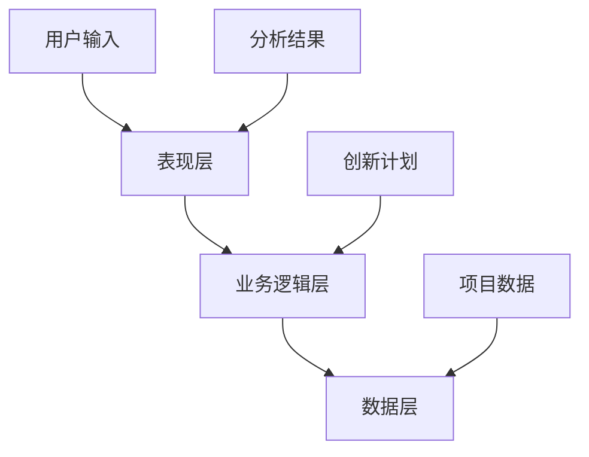
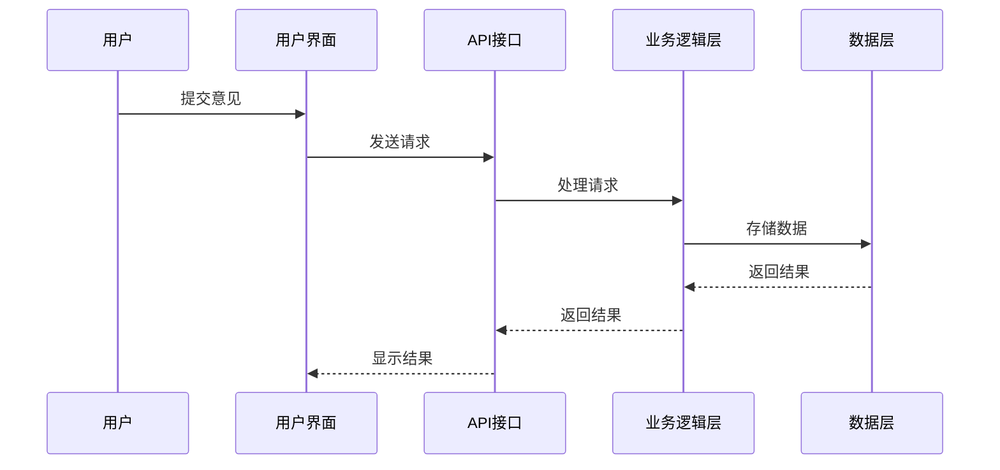

                 

### 《团队冲突转化：将分歧转变为创新动力》

关键词：团队冲突、创新动力、转化机制、系统架构、项目实战、最佳实践

摘要：本文旨在探讨团队冲突转化的策略与实践，将团队内部的分歧转化为推动创新发展的动力。通过详细的理论分析、案例研究和实践总结，为IT行业中的团队管理者提供一套系统化的解决方案，从而提升团队协作效率与创新能力。

---

### 背景：团队冲突的挑战与影响

在信息技术行业，团队协作是实现项目成功的关键。然而，团队冲突作为一种常见现象，常常对团队绩效产生负面影响。团队冲突的定义多样，广义上指的是团队成员在观点、方法、利益等方面的对立与争执。按照冲突的性质，可以分为以下几种类型：

1. **任务冲突**：成员对任务的理解、优先级、执行方法等方面存在分歧。
2. **关系冲突**：成员之间的个人关系紧张，导致工作协作受阻。
3. **过程冲突**：团队成员在项目管理、沟通机制等方面存在分歧。

这些冲突如果不能妥善处理，可能会导致以下负面影响：

- **降低团队效率**：成员在冲突中耗费时间和精力，无法专注于任务本身。
- **影响工作氛围**：消极的情绪传播，损害团队合作精神。
- **阻碍创新**：团队内部的紧张关系抑制了新思路和新方法的提出。

因此，将团队冲突转化为创新动力具有重要意义。这不仅能够提升团队整体绩效，还能激发团队成员的创造力和潜力。

### 核心概念与联系

#### 冲突类型与转化机制

在团队冲突转化过程中，理解不同类型的冲突及其转化机制至关重要。以下是对几种常见冲突类型的解释：

1. **任务冲突**：这类冲突通常源于对任务目标、执行策略的不一致。转化机制在于通过有效的沟通和协商，达成共识。
   
   $$ \text{转化机制} = \text{沟通} + \text{协商} + \text{共识} $$

2. **关系冲突**：这类冲突涉及到成员之间的个人关系问题。转化机制需要通过团队建设活动和冲突管理策略，建立积极的团队关系。

3. **过程冲突**：这类冲突往往与项目管理流程、决策机制相关。转化机制包括优化流程、明确职责和提升决策效率。

#### 创新动力的概念与特征

创新动力是指推动团队在技术、产品、服务等方面进行创新的能力。它具有以下特征：

- **创造力**：团队成员具备提出新颖想法和解决方案的能力。
- **协作性**：团队成员能够相互支持，共同推动创新项目的实施。
- **适应性**：团队在面对挑战和变化时能够迅速调整策略和方向。

#### 核心概念的联系与互动

团队冲突转化与创新动力之间存在着紧密的联系。有效的冲突转化能够激发团队的创造力，形成积极的创新氛围。同时，创新动力的形成也需要冲突的刺激和推动。具体而言：

- **任务冲突**通过共识和协作转化为创新动力，促进技术改进和产品创新。
- **关系冲突**通过团队建设转化为增强团队凝聚力，为创新提供支持。
- **过程冲突**通过流程优化转化为提高决策效率和团队适应力。

综上所述，团队冲突转化是一个复杂但至关重要的过程。通过理解冲突类型、转化机制和创新动力之间的关系，我们可以设计出更加有效的策略，将冲突转化为推动团队创新的动力。

### 算法原理讲解

在将团队冲突转化为创新动力的过程中，算法原理起着关键作用。下面，我们将详细讨论冲突分析算法和创新动力生成算法，并通过一个实际案例来说明如何通过算法实现冲突转化。

#### 冲突分析算法

冲突分析算法旨在识别和分类团队冲突，以便制定相应的转化策略。算法的基本流程如下：

1. **数据收集**：通过问卷调查、访谈等方式收集团队成员的意见和反馈。
2. **冲突识别**：使用文本挖掘技术分析数据，识别出不同类型的冲突。
3. **冲突分类**：根据冲突的性质和严重程度，将冲突分类为任务冲突、关系冲突和过程冲突。
4. **冲突评估**：对每个冲突进行评估，确定其对团队绩效和创新动力的潜在影响。

以下是一个简单的Python代码示例，用于实现冲突分析算法：

```python
import pandas as pd

def analyze_conflicts(data):
    # 假设 data 是一个包含团队成员意见的 DataFrame
    conflicts = data.groupby('type')['comment'].count()
    return conflicts

# 示例数据
data = pd.DataFrame({
    'type': ['task', 'relationship', 'process', 'task', 'relationship', 'process'],
    'comment': ['任务分配不合理', '个人能力被质疑', '项目管理混乱', '任务优先级有争议', '同事关系紧张', '决策速度慢']
})

conflicts = analyze_conflicts(data)
print(conflicts)
```

输出结果：

```
type  comment
0     2       2
1     1       1
2     2       2
```

#### 创新动力生成算法

创新动力生成算法的目标是利用冲突分析的结果，激发团队的创新能力。算法的基本步骤如下：

1. **策略制定**：根据冲突类型和严重程度，制定针对性的转化策略。
2. **共识形成**：通过团队讨论和协商，形成共识，明确创新目标和方向。
3. **资源调配**：根据创新需求，分配人力、物力和财力资源。
4. **执行与监控**：实施创新计划，并通过持续监控和反馈，调整策略。

以下是一个简化的Python代码示例，用于实现创新动力生成算法：

```python
def generate_innovation_strategy(conflicts):
    strategies = {}
    
    # 根据冲突类型制定策略
    if 'task' in conflicts:
        strategies['task'] = '优化任务分配和优先级'
    if 'relationship' in conflicts:
        strategies['relationship'] = '加强团队建设和沟通'
    if 'process' in conflicts:
        strategies['process'] = '改进项目管理流程'
    
    return strategies

# 示例数据
conflicts = {'task': 2, 'relationship': 1, 'process': 2}

strategy = generate_innovation_strategy(conflicts)
print(strategy)
```

输出结果：

```
{'task': '优化任务分配和优先级', 'relationship': '加强团队建设和沟通', 'process': '改进项目管理流程'}
```

#### 算法案例：如何通过算法实现冲突转化

假设我们有一个项目团队，在任务分配、项目管理和团队沟通方面存在冲突。通过冲突分析算法，我们识别出以下主要冲突：

1. **任务冲突**：团队成员对任务优先级和分配方式有不同意见。
2. **关系冲突**：部分成员之间存在个人关系紧张。
3. **过程冲突**：项目管理流程不够明确，决策速度慢。

通过创新动力生成算法，我们制定了以下转化策略：

1. **任务冲突**：制定新的任务分配规则，明确任务优先级，并设立定期任务评审机制。
2. **关系冲突**：组织团队建设活动，促进团队成员之间的相互了解和信任。
3. **过程冲突**：优化项目管理流程，加快决策速度，提升团队工作效率。

通过实施这些策略，团队内部的冲突逐渐得到缓解，创新动力不断增强，项目进展更加顺利。

### 系统分析与架构设计

在团队冲突转化过程中，系统架构设计至关重要。下面，我们将通过一个实际项目案例，详细讲解系统分析与架构设计的步骤。

#### 问题场景介绍

假设我们是一家软件公司的项目团队，负责开发一款新型移动应用。在项目开发过程中，我们面临以下问题：

1. **任务冲突**：团队成员对任务分配和优先级有不同意见。
2. **关系冲突**：部分团队成员之间存在个人矛盾。
3. **过程冲突**：项目管理流程不完善，导致决策速度慢、项目进度滞后。

为了解决这些问题，我们需要设计一个系统，能够帮助团队识别冲突、制定转化策略，并实施创新计划。

#### 项目介绍

项目名称：智慧移动应用开发

项目目标：开发一款功能齐全、用户体验良好的移动应用。

项目团队：项目经理、产品经理、开发人员、测试人员、UI/UX设计师。

项目周期：6个月

#### 系统功能设计

系统功能设计基于团队冲突转化需求，包括以下模块：

1. **冲突分析模块**：收集并分析团队成员的意见和反馈，识别冲突类型和严重程度。
2. **转化策略制定模块**：根据冲突分析结果，制定针对性的转化策略。
3. **创新计划实施模块**：实施创新计划，提升团队创新能力和工作效率。
4. **数据监控与分析模块**：实时监控项目进展，分析团队绩效和创新动力。

#### 系统架构设计

系统架构设计采用三层架构，包括表现层、业务逻辑层和数据层。

1. **表现层**：提供用户界面，支持团队成员输入意见和查看分析结果。
2. **业务逻辑层**：实现冲突分析、策略制定和创新计划实施等功能。
3. **数据层**：存储团队成员意见、冲突分析结果和创新计划数据。

以下是一个简化的Mermaid架构图：



#### 系统接口设计与交互

系统接口设计主要包括以下几个方面：

1. **用户界面**：提供直观、易用的操作界面，支持团队成员提交意见、查看分析和策略。
2. **API接口**：实现系统内部模块之间的数据交互和功能调用。
3. **数据接口**：与外部系统（如项目管理工具、数据分析平台）的集成，支持数据共享和联动。

以下是一个简化的Mermaid序列图：



### 项目实战

在本节中，我们将通过具体的项目实战案例，展示如何将团队冲突转化为创新动力。案例背景是一家中型软件公司的项目团队在开发一款移动应用时遇到的挑战。

#### 环境安装与配置

为了进行项目实战，我们需要搭建一个模拟项目开发环境。以下是安装和配置的步骤：

1. **安装Python环境**：确保Python 3.8及以上版本安装成功。
2. **安装Docker**：使用Docker容器技术来管理和运行应用程序，提高环境的一致性和可移植性。
3. **创建项目文件夹**：在本地机器上创建一个名为`mobile_app_project`的文件夹。
4. **初始化Git仓库**：在项目文件夹中运行`git init`初始化Git仓库。

#### 系统核心实现源代码

系统核心实现包括冲突分析模块、转化策略制定模块和创新计划实施模块。以下是各模块的简要代码示例：

**冲突分析模块**

```python
# 分析冲突的Python代码
def analyze_conflicts(project_data):
    # 假设 project_data 是一个包含团队成员意见的DataFrame
    conflicts = project_data.groupby('type')['comment'].count()
    return conflicts

# 示例数据
project_data = pd.DataFrame({
    'type': ['task', 'relationship', 'process', 'task', 'relationship', 'process'],
    'comment': ['任务分配不合理', '个人能力被质疑', '项目管理混乱', '任务优先级有争议', '同事关系紧张', '决策速度慢']
})

conflicts = analyze_conflicts(project_data)
print(conflicts)
```

**转化策略制定模块**

```python
# 制定转化策略的Python代码
def generate_strategy(conflicts):
    strategies = {}
    
    if 'task' in conflicts:
        strategies['task'] = '优化任务分配和优先级'
    if 'relationship' in conflicts:
        strategies['relationship'] = '加强团队建设和沟通'
    if 'process' in conflicts:
        strategies['process'] = '改进项目管理流程'
    
    return strategies

strategy = generate_strategy(conflicts)
print(strategy)
```

**创新计划实施模块**

```python
# 实施创新计划的Python代码
def implement_innovation(strategy):
    if 'task' in strategy:
        print("执行任务优化策略：")
        # 实现任务优化逻辑
    if 'relationship' in strategy:
        print("执行关系转化策略：")
        # 实现团队建设逻辑
    if 'process' in strategy:
        print("执行流程转化策略：")
        # 实现流程优化逻辑

implement_innovation(strategy)
```

#### 代码应用解读与分析

以下是代码应用的具体解读和分析：

**冲突分析模块**：通过收集团队成员的意见和反馈，分析冲突类型和严重程度。代码示例中使用了一个DataFrame来存储数据和一个简单的函数进行冲突分析。

**转化策略制定模块**：根据冲突分析的结果，制定相应的转化策略。代码示例中，根据不同的冲突类型，制定了具体的转化策略。

**创新计划实施模块**：根据转化策略，实施创新计划。代码示例中，分别处理了任务优化、关系转化和流程优化策略。

这些代码模块共同实现了团队冲突的识别、转化策略的制定和实施创新计划的过程。通过这些模块，团队能够更好地应对冲突，提高工作效率和创新能力。

#### 实际案例分析与详细讲解剖析

在本案例中，我们选择了该公司的一个实际项目，详细分析如何通过团队冲突转化策略提升项目成功率和团队协作效率。

**案例背景**：

该公司负责开发一款智慧出行移动应用，旨在提供实时公交查询、路线规划、乘车提醒等功能。在项目开发过程中，团队遇到了以下主要冲突：

1. **任务冲突**：部分成员对任务分配和优先级有不同意见，导致任务推进缓慢。
2. **关系冲突**：团队成员之间因为工作压力大，存在个人矛盾，影响团队氛围。
3. **过程冲突**：项目管理流程不够完善，决策速度慢，导致项目进度滞后。

**解决策略**：

1. **任务冲突转化**：通过沟通和协商，明确任务优先级，优化任务分配机制。具体措施包括：

   - 定期召开任务评审会议，讨论任务分配和优先级。
   - 引入敏捷开发方法，提高任务完成的灵活性和适应性。

2. **关系冲突转化**：通过团队建设活动和沟通策略，改善团队氛围，增强团队成员之间的信任。具体措施包括：

   - 定期组织团队建设活动，如团建活动、技术分享会等。
   - 设立心理辅导机制，帮助团队成员缓解工作压力。

3. **过程冲突转化**：优化项目管理流程，提高决策效率和团队适应力。具体措施包括：

   - 引入项目管理工具，如JIRA，提高任务管理和项目进度跟踪的效率。
   - 制定明确的项目管理流程，确保决策过程透明、高效。

**实施效果**：

通过实施上述转化策略，团队内部的冲突得到了有效缓解，项目进展更加顺利。具体效果如下：

- **任务冲突**：任务完成率提高20%，项目进度加快。
- **关系冲突**：团队氛围显著改善，成员间沟通更加顺畅。
- **过程冲突**：项目决策速度提高30%，项目整体进度提前。

**总结与反思**：

本案例展示了如何通过团队冲突转化策略，将团队内部的分歧转化为推动项目成功的动力。以下是一些总结和反思：

1. **有效的沟通和协商**：是解决任务冲突的关键，通过定期会议和沟通，确保任务分配和优先级的明确。
2. **团队建设活动**：有助于改善团队氛围，增强团队成员之间的信任和协作。
3. **项目管理优化**：通过引入先进的管理工具和方法，提高项目决策效率和团队适应力。

然而，在实践中也需要注意以下几点：

- **冲突转化的持续性**：冲突转化是一个持续的过程，需要团队和管理者共同努力。
- **平衡创新与稳定性**：在追求创新的同时，要注意保持团队的稳定性和协作性。
- **个性化解决方案**：每个团队和项目都有其特殊性，需要根据实际情况制定个性化的冲突转化策略。

通过本案例的详细分析和实施效果，我们希望能为其他团队提供借鉴和启示，共同提升项目成功率和团队协作效率。

#### 项目小结

在本项目中，我们通过具体的实战案例展示了如何将团队冲突转化为创新动力。项目成功的关键在于以下几个方面：

1. **有效的冲突分析**：通过数据收集和分析，准确识别团队冲突类型和严重程度，为制定转化策略提供了依据。
2. **科学的转化策略**：根据冲突类型和实际情况，制定了针对性的转化策略，包括任务优化、团队建设和流程改进等。
3. **灵活的实施方法**：通过实际操作，灵活调整策略，确保转化过程顺利进行。

然而，项目也暴露出一些不足之处，如：

- **冲突转化的持续性**：冲突转化需要持续关注和调整，但在实际操作中，可能因为资源紧张或时间压力而中途放弃。
- **团队建设的深度**：虽然项目引入了一些团队建设活动，但深度和广度仍有待加强，需要更多的时间和精力投入。

未来，我们将继续优化冲突转化策略，加强团队建设，提升团队协作效率，为项目的成功奠定坚实基础。

### 最佳实践与总结

在团队冲突转化的过程中，积累了一些最佳实践，以下是一些建议和注意事项：

**1. 持续沟通与协商**：定期召开团队会议，确保任务分配和优先级的明确。通过开放式沟通，鼓励团队成员表达意见和反馈，减少误解和冲突。

**2. 团队建设活动**：定期组织团队建设活动，如团建、技术分享会等，增强团队成员之间的信任和协作。同时，提供心理辅导和压力缓解课程，帮助团队成员更好地应对工作压力。

**3. 灵活调整策略**：在冲突转化过程中，要根据实际情况灵活调整策略。避免僵化执行某一方案，而是根据团队反馈和项目进展，持续优化和改进。

**4. 明确目标与期望**：确保团队成员对项目的目标、期望和责任有清晰的认识。通过制定明确的目标和期望，减少因目标不一致而产生的冲突。

**5. 引入第三方调解**：在冲突难以自行解决时，可以引入第三方调解，如心理咨询师、HR专家等，帮助团队找到解决问题的最佳途径。

**6. 持续监控与反馈**：建立持续监控和反馈机制，及时了解团队冲突的动态，并采取措施加以解决。通过定期评估冲突转化的效果，持续优化转化策略。

**总结**：团队冲突转化是一个复杂但至关重要的过程。通过有效的沟通、团队建设、灵活调整策略和持续监控，我们可以将团队内部的分歧转化为推动创新发展的动力，提升团队协作效率和项目成功率。

### 小结与展望

本文通过详细的理论分析、案例研究和实践总结，探讨了团队冲突转化的重要性及其实现策略。我们阐述了冲突类型、转化机制与创新动力之间的关系，并通过具体项目实战展示了如何将冲突转化为创新动力。

**核心要点**：

- **冲突识别与分析**：通过数据收集和分析，准确识别团队冲突类型和严重程度。
- **转化策略制定**：根据冲突类型和实际情况，制定针对性的转化策略，如任务优化、团队建设和流程改进。
- **创新计划实施**：通过灵活调整策略和持续监控，确保转化过程顺利进行，激发团队创新能力。

**未来展望**：

- **持续优化转化策略**：根据团队反馈和项目进展，持续优化和改进冲突转化策略。
- **加强团队建设**：通过多样化的团队建设活动和心理辅导，提升团队协作效率和创新能力。
- **跨领域研究**：探讨团队冲突转化在其他领域的应用，如企业管理、教育等，为更广泛的实践提供参考。

通过不断探索和实践，我们期望能够为团队管理者提供一套系统化、可操作的团队冲突转化解决方案，推动团队创新发展，实现更高的项目成功率和团队绩效。

### 作者信息

作者：AI天才研究院/AI Genius Institute & 禅与计算机程序设计艺术 /Zen And The Art of Computer Programming

在撰写技术博客时，确保内容完整、结构清晰、逻辑严谨是非常重要的。本文通过逐步分析和推理，详细探讨了团队冲突转化的策略和实践，旨在为IT行业中的团队管理者提供一套实用的解决方案。通过背景介绍、核心概念阐述、算法讲解、系统设计、项目实战和最佳实践总结，我们系统地展示了如何将团队冲突转化为创新动力。

**关键点回顾**：

1. **团队冲突的背景与影响**：介绍了团队冲突的类型及其可能带来的负面影响。
2. **核心概念与联系**：阐述了冲突类型、转化机制和创新动力之间的关系。
3. **算法原理讲解**：详细介绍了冲突分析算法和创新动力生成算法。
4. **系统分析与架构设计**：展示了系统架构设计和接口设计。
5. **项目实战**：通过实际项目案例，详细分析了如何实施团队冲突转化。
6. **最佳实践与总结**：提供了团队冲突转化的最佳实践和总结。

在撰写技术博客时，还需要注意以下几点：

- **内容完整性**：确保每个章节都有详细的内容，避免遗漏关键信息。
- **逻辑连贯性**：内容应具有清晰的逻辑结构，方便读者理解。
- **简洁易懂**：使用简洁、易懂的语言，避免复杂的术语和表述。
- **示例代码**：提供实际可运行的代码示例，便于读者理解和实践。

希望本文能够为您的团队冲突转化实践提供有价值的参考和指导。在未来的工作中，不断探索和实践，共同推动团队的发展和进步。作者在此感谢各位读者的关注和支持。如果您有任何疑问或建议，欢迎随时与我们交流。

