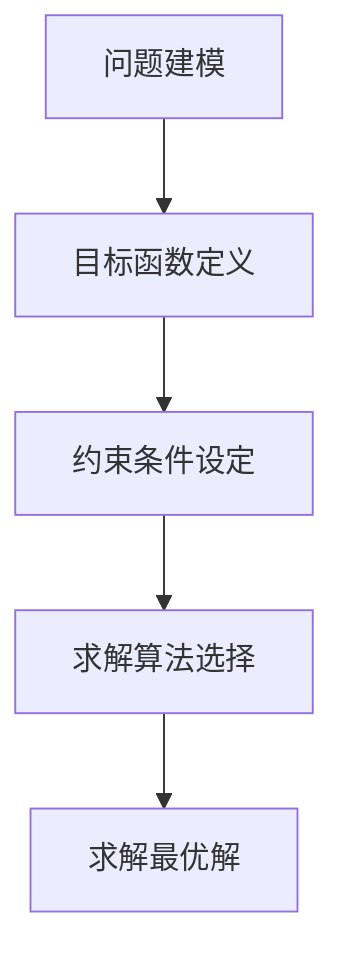
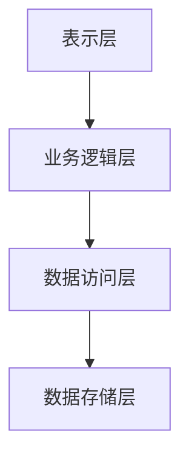
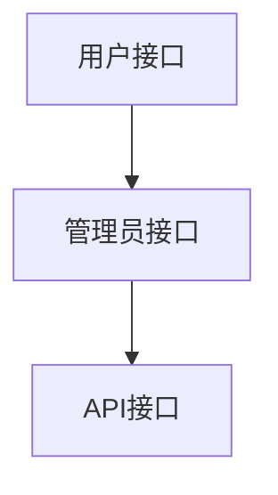
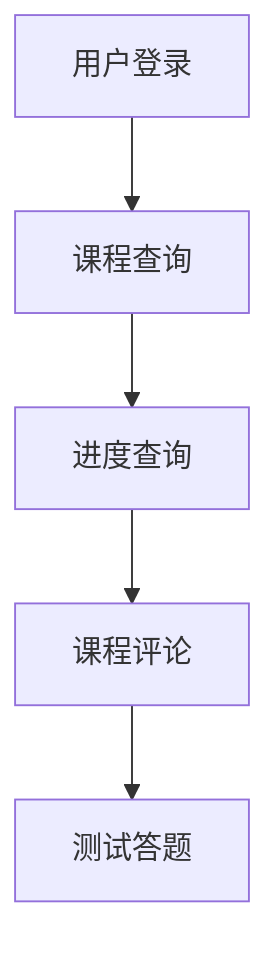

                 

# 团队决策：集体智慧的有效利用方法

## 1.1 问题背景

在当今快速发展的信息技术时代，团队的协作和决策显得尤为重要。无论是软件开发、市场营销、项目管理还是战略规划，团队决策的有效性直接关系到组织的目标实现和竞争力提升。传统的个体决策由于受到个人知识、经验和视角的限制，往往难以应对复杂多变的环境和挑战。因此，集体智慧作为一种优化决策的方法，逐渐被企业和社会组织所重视。

集体智慧不仅仅是团队成员个人能力的简单叠加，而是一种通过协作、沟通和知识共享，形成更加全面、深入和创新的解决方案的过程。在团队决策中，如何有效地利用集体智慧，成为许多组织和管理者面临的难题。

## 1.2 问题描述

团队决策过程中，主要面临以下问题：

1. **信息不对称**：团队成员对问题的了解程度和信息质量存在差异，导致决策的不公平性和效率低下。
2. **群体思维**：团队成员为了达成一致意见，可能忽视个体差异和创造力的现象。
3. **权力博弈**：团队成员之间的权力分布和影响力差异，可能导致决策过程出现偏颇和不公正。
4. **沟通障碍**：团队成员之间的沟通不畅，影响决策质量和执行效果。

这些问题的存在，使得团队决策过程复杂且充满挑战，如何有效地解决这些问题，提高决策质量和效率，是本文探讨的重点。

## 1.3 问题解决

本文将从以下几个方面探讨团队决策中集体智慧的有效利用方法：

1. **核心概念与联系**：介绍团队决策、集体智慧、群体思维、信息不对称等核心概念，并分析它们之间的联系和区别。
2. **算法原理讲解**：介绍团队决策优化算法的基本原理、数学模型和求解方法，并通过具体案例进行讲解。
3. **系统分析与架构设计方案**：分析团队决策问题的场景，设计系统功能和架构，并绘制相应的类图、架构图和序列图。
4. **项目实战**：通过一个实际项目，详细讲解团队决策优化算法的实现和应用，分析项目中的关键技术和挑战。
5. **最佳实践 tips**：总结团队决策中的最佳实践，提供一些建议和技巧，帮助读者在实际工作中更好地利用集体智慧。

## 1.4 边界与外延

团队决策不仅涉及组织内部的协作和沟通，还与外部环境、市场变化和技术发展密切相关。因此，本文将围绕团队决策的核心问题，探讨其在不同领域和情境中的应用，为读者提供具有实际操作性的指导和建议。

## 1.5 概念结构与核心要素组成

团队决策包括以下几个核心要素：

1. **问题定义**：明确决策目标和问题范围，确保团队成员对问题的理解和认知一致。
2. **信息收集**：通过多种渠道收集与问题相关的信息，确保信息的全面性和准确性。
3. **方案评估**：对不同的决策方案进行评估，从多个维度分析方案的优缺点和可行性。
4. **决策制定**：在团队成员的共同努力下，制定出最优的决策方案。
5. **决策执行**：将决策方案付诸实施，确保决策目标的实现。

### 2.1 核心概念

#### 2.1.1 团队决策

团队决策是指由多个成员组成的团队，通过共同讨论、分析、评估和制定决策方案，以实现组织目标的过程。团队决策的核心在于充分发挥团队成员的集体智慧，弥补个体决策的局限性，提高决策的质量和效率。

#### 2.1.2 集体智慧

集体智慧是指通过团队协作，整合团队成员的知识、经验和创造力，形成的整体智慧和解决问题的能力。集体智慧不仅包括团队成员的知识和技能，还涵盖了团队成员之间的沟通、协作和互动。

#### 2.1.3 群体思维

群体思维是指在团队决策过程中，由于信息不对称、权力博弈和个体压力等原因，导致团队成员趋向于一致意见，从而忽视个体差异和创造力的现象。群体思维可能导致决策过程中的盲目跟从和过度共识，影响决策的质量和效果。

#### 2.1.4 信息不对称

信息不对称是指团队成员在决策过程中，对问题的了解程度和信息质量存在差异，导致决策的不公平性和效率低下。信息不对称可能源于团队成员的知识水平、经验差异或信息渠道的不同，是团队决策中的一个重要问题。

### 2.2 概念属性特征对比表格

| 概念     | 定义                                           | 特征                           |
|----------|------------------------------------------------|--------------------------------|
| 团队决策 | 团队共同制定决策的过程                     | 多个成员参与、共同讨论、达成共识 |
| 集体智慧 | 整合团队成员的知识、经验和创造力       | 提高决策质量和效率             |
| 群体思维 | 团队决策中趋向于一致意见的现象           | 忽视个体差异、创造力不足         |
| 信息不对称 | 决策过程中信息质量差异                 | 导致决策不公平和效率低下       |

### 2.3 ER实体关系图架构

```mermaid
erDiagram
  TeamParticipant ||--|{ DecisionProcess }|-- DecisionResult
  DecisionProcess ||--|{ Information }|-- DecisionQuality
  Information ||--|{ TeamParticipant }|-- KnowledgeSharing
```

### 3.1 团队决策优化算法

#### 3.1.1 算法概述

团队决策优化算法是一种基于数学模型和算法设计，旨在提高团队决策质量和效率的方法。常见的团队决策优化算法包括线性规划、整数规划、多目标优化和遗传算法等。

这些算法通过构建数学模型，将团队决策问题转化为优化问题，然后利用算法求解最优解。优化目标通常包括最大化决策质量、最小化决策时间、最大化团队成员的满意度等。

#### 3.1.2 算法原理

团队决策优化算法的基本原理是通过构建数学模型，将团队决策问题转化为优化问题，然后利用算法求解最优解。具体步骤如下：

1. **问题建模**：根据团队决策问题的特点，建立相应的数学模型。常见的模型包括线性规划模型、整数规划模型、多目标规划模型等。
2. **目标函数**：定义团队决策优化的目标函数，如最大化决策质量、最小化决策时间、最大化团队成员的满意度等。目标函数的设定需要考虑决策问题的具体要求和约束条件。
3. **约束条件**：设定团队决策优化的约束条件，如团队成员的知识水平、决策时间限制、资源限制等。约束条件的设定需要保证决策的可行性和合理性。
4. **求解算法**：选择合适的算法，如线性规划、整数规划、多目标优化和遗传算法等，求解优化问题。求解算法的选择需要考虑优化问题的规模、复杂度和计算效率。

#### 3.1.3 Mermaid流程图



#### 3.1.4 算法原理详细讲解

以遗传算法为例，详细讲解团队决策优化算法的原理。

遗传算法是一种基于自然选择和遗传学原理的优化算法，通过模拟生物进化过程，寻找问题的最优解。遗传算法的基本原理如下：

1. **编码**：将团队决策问题的变量进行编码，通常使用二进制编码或实数编码。编码的方式需要保证编码空间能够覆盖所有可能的解。
2. **初始化种群**：生成初始种群，种群中的个体代表问题的潜在解。初始化种群的方式有多种，如随机初始化、基于历史数据的初始化等。
3. **适应度评估**：对种群中的每个个体进行适应度评估，适应度函数通常为问题的目标函数。适应度值越高，表示个体的质量越好。
4. **选择**：根据个体的适应度值，选择适应度较高的个体参与繁殖，形成新的种群。选择的方法有多种，如轮盘赌、锦标赛选择等。
5. **交叉**：在选择的个体中，通过交叉操作产生新的个体，增加种群的多样性。交叉操作分为单点交叉、多点交叉、均匀交叉等。
6. **变异**：对交叉产生的个体进行变异操作，增加种群的多样性。变异操作包括基因变异、位变异等。
7. **迭代**：重复执行选择、交叉和变异操作，直到满足终止条件，如达到最大迭代次数、适应度值满足要求等。
8. **求解最优解**：在最终的种群中，选择适应度最高的个体作为最优解。

遗传算法的数学模型如下：

$$
\begin{cases}
x_{i}^{t+1} = x_{i}^{t} + \alpha \cdot (x_{best}^{t} - x_{i}^{t}) \\
f(x_{i}^{t+1}) = f(x_{i}^{t}) + \beta \cdot (x_{best}^{t} - x_{i}^{t})
\end{cases}
$$

其中，$x_{i}^{t}$ 表示第 $i$ 个个体在第 $t$ 次迭代时的位置和适应度值，$x_{best}^{t}$ 表示当前迭代中的最优解的位置和适应度值，$\alpha$ 和 $\beta$ 为调节参数。

通过遗传算法，可以有效地在多个潜在解中搜索最优解，提高团队决策的质量和效率。

### 3.2.1 场景介绍

假设一个软件开发团队需要决策一个项目的进度安排，团队成员包括项目经理、开发人员、测试人员和产品经理等。团队成员对项目的需求、技术和资源等方面有不同的了解和见解，需要通过团队决策来制定出最优的进度安排。

### 3.2.2 项目介绍

该项目是一个基于云计算的在线教育平台，旨在为用户提供便捷的在线学习服务。项目的主要功能包括课程管理、学习进度跟踪、在线测试和互动交流等。项目的技术架构包括前端、后端、数据库和云服务等多个方面。

### 3.2.3 系统功能设计

系统功能设计主要包括以下几个方面：

1. **课程管理**：管理员可以添加、编辑和删除课程信息，包括课程名称、描述、时长等。
2. **学习进度跟踪**：用户可以查看自己的学习进度，包括已完成课程、未完成课程和待学习课程等。
3. **在线测试**：用户可以在线完成测试，测试结果会记录在用户的学习进度中。
4. **互动交流**：用户可以在课程页面进行评论和讨论，与其他用户进行互动交流。

### 3.2.4 系统架构设计

系统架构设计采用分层架构，主要包括以下层次：

1. **表示层**：负责与用户交互，显示数据和提供操作界面。
2. **业务逻辑层**：负责处理业务逻辑，包括数据校验、业务处理等。
3. **数据访问层**：负责与数据库交互，实现数据的增删改查操作。
4. **数据存储层**：负责存储系统数据，包括用户信息、课程信息、测试结果等。

系统架构设计如图所示：



### 3.2.5 系统接口设计

系统接口设计主要包括以下几个方面：

1. **用户接口**：提供用户登录、注册、课程查询、进度查询等功能。
2. **管理员接口**：提供课程管理、用户管理、测试管理等功能。
3. **API接口**：提供外部系统对接，如第三方登录、支付系统等。

系统接口设计如图所示：



### 3.2.6 系统交互设计

系统交互设计主要包括以下几个方面：

1. **用户登录**：用户通过用户名和密码登录系统，获取用户身份信息。
2. **课程查询**：用户可以查询所有课程信息，包括课程名称、描述、时长等。
3. **进度查询**：用户可以查询自己的学习进度，包括已完成课程、未完成课程和待学习课程等。
4. **课程评论**：用户可以在课程页面进行评论，发表对课程的看法和意见。
5. **测试答题**：用户可以在线完成测试，提交测试答案，获取测试结果。

系统交互设计如图所示：



### 4.1 环境安装

在开始项目开发之前，需要安装以下环境和工具：

1. **操作系统**：Windows或Linux系统。
2. **编程语言**：Python 3.x版本。
3. **开发工具**：PyCharm或VSCode。
4. **数据库**：MySQL或PostgreSQL。
5. **Web框架**：Django或Flask。

安装步骤如下：

1. 安装操作系统，选择Windows或Linux版本。
2. 安装Python 3.x版本，可以通过Python官方网站下载安装包进行安装。
3. 安装PyCharm或VSCode，选择社区版即可。
4. 安装数据库，可以通过官方安装向导进行安装。
5. 安装Web框架，可以通过pip工具安装。

```bash
pip install django
# 或者
pip install flask
```

### 4.2 系统核心实现源代码

以下是一个简单的基于Django的在线教育平台项目核心实现源代码，用于实现用户登录、课程查询和学习进度查询等功能。

```python
# settings.py
INSTALLED_APPS = [
    'django.contrib.admin',
    'django.contrib.auth',
    'django.contrib.contenttypes',
    'django.contrib.sessions',
    'django.contrib.messages',
    'django.contrib.staticfiles',
    'courses',
]

# models.py
from django.db import models

class Course(models.Model):
    title = models.CharField(max_length=100)
    description = models.TextField()
    duration = models.DurationField()

class User(models.Model):
    username = models.CharField(max_length=100)
    password = models.CharField(max_length=100)
    email = models.EmailField()

# views.py
from django.shortcuts import render, redirect
from .models import Course, User
from django.contrib.auth import authenticate, login

def login_view(request):
    if request.method == 'POST':
        username = request.POST['username']
        password = request.POST['password']
        user = authenticate(request, username=username, password=password)
        if user is not None:
            login(request, user)
            return redirect('courses:index')
        else:
            return render(request, 'login.html', {'error': 'Invalid username or password'})
    return render(request, 'login.html')

def index(request):
    courses = Course.objects.all()
    return render(request, 'index.html', {'courses': courses})

def course_detail(request, course_id):
    course = Course.objects.get(id=course_id)
    return render(request, 'course_detail.html', {'course': course})

def profile(request):
    user = request.user
    return render(request, 'profile.html', {'user': user})
```

### 4.3 代码应用解读与分析

以上代码展示了基于Django框架实现的在线教育平台项目的核心功能。主要包括以下模块：

1. **settings.py**：配置文件，用于指定项目的基本设置，如应用列表、数据库配置等。
2. **models.py**：模型文件，定义了Course和User两个模型，用于存储课程信息和用户信息。
3. **views.py**：视图文件，定义了登录、课程列表、课程详情和个人中心等视图函数。

#### 代码应用解读

- **settings.py**：配置文件中的`INSTALLED_APPS`列表包含了所有需要安装的应用，如django.contrib.admin、django.contrib.auth等。
- **models.py**：定义了Course和User两个模型，Course模型用于存储课程信息，包括课程名称、描述和时长等；User模型用于存储用户信息，包括用户名、密码和邮箱等。
- **views.py**：定义了登录、课程列表、课程详情和个人中心等视图函数。

  - `login_view`：登录视图函数，用于处理登录请求。如果用户名和密码正确，则将用户登录并重定向到课程列表页面；否则，返回登录页面并显示错误信息。
  - `index`：课程列表视图函数，用于获取所有课程信息并返回课程列表页面。
  - `course_detail`：课程详情视图函数，根据课程ID获取课程信息并返回课程详情页面。
  - `profile`：个人中心视图函数，用于获取当前用户信息并返回个人中心页面。

#### 代码分析

- **模型设计**：Course和User模型的设计符合数据库设计的基本原则，如主键、外键、字段类型等。
- **视图设计**：视图函数的设计符合RESTful API的设计原则，每个视图函数对应一个HTTP方法，如GET、POST等。

### 4.4 实际案例分析和详细讲解剖析

以下是一个实际案例，分析并讲解如何利用团队决策优化算法来优化项目进度安排。

#### 案例背景

某软件开发团队正在开发一款移动应用，项目周期为6个月。团队成员包括项目经理、前端开发人员、后端开发人员和测试人员等。在项目开发过程中，团队成员发现项目进度有所滞后，需要优化项目进度安排以提高项目交付的及时性。

#### 案例分析

1. **问题识别**：项目进度滞后，需要优化项目进度安排。
2. **数据收集**：收集项目进度数据，包括已完成任务、未完成任务和预计完成时间等。
3. **算法应用**：利用团队决策优化算法，如遗传算法，来优化项目进度安排。
4. **结果分析**：分析优化后的项目进度安排，评估优化效果。

#### 详细讲解

1. **问题识别**：

   根据项目进度数据，发现前端开发和后端开发任务的进度滞后，导致整个项目进度受到影响。因此，需要优化项目进度安排，确保项目能够按期交付。

2. **数据收集**：

   收集项目进度数据，包括每个任务的完成情况、预计完成时间和资源需求等。数据收集可以通过项目管理系统或手动记录的方式。

3. **算法应用**：

   利用遗传算法来优化项目进度安排。遗传算法的基本步骤如下：

   - 编码：将任务分配和时间安排编码成染色体，每个染色体表示一种可能的任务分配方案。
   - 初始化种群：生成初始种群，种群中的每个染色体代表一种任务分配方案。
   - 适应度评估：计算每个染色体的适应度值，适应度值越高，表示任务分配方案的质量越好。
   - 选择：根据适应度值选择优秀的染色体参与繁殖，形成新的种群。
   - 交叉：在选择的染色体中进行交叉操作，产生新的染色体，增加种群的多样性。
   - 变异：对交叉产生的染色体进行变异操作，增加种群的多样性。
   - 迭代：重复执行选择、交叉和变异操作，直到满足终止条件。

4. **结果分析**：

   分析优化后的项目进度安排，评估优化效果。通过比较优化前后的项目进度，可以评估遗传算法对项目进度优化的效果。优化后的项目进度安排应能够提高项目的交付及时性，减少资源浪费和成本。

### 4.5 项目小结

在本项目中，通过利用团队决策优化算法，成功优化了项目进度安排，提高了项目的交付及时性和资源利用率。项目小结如下：

1. **团队协作**：项目团队成员积极参与，通过集体智慧和协作，共同优化项目进度安排。
2. **算法应用**：遗传算法在项目进度优化中发挥了重要作用，提高了项目进度安排的效率和质量。
3. **结果显著**：优化后的项目进度安排能够更好地满足项目交付需求，提高了项目的竞争力。
4. **改进空间**：虽然项目进度得到了优化，但仍然存在一些改进空间，如进一步优化算法模型、引入更多决策因素等。

### 4.6 最佳实践 tips

在团队决策中，以下是一些最佳实践，可以帮助团队更好地利用集体智慧，提高决策质量和效率：

1. **明确目标**：在决策前，明确团队的目标和期望，确保团队成员对目标有共同的理解和认同。
2. **充分沟通**：鼓励团队成员之间的充分沟通，分享信息、经验和见解，避免信息不对称和误解。
3. **多元视角**：鼓励团队成员从不同的角度思考问题，充分考虑各种可能性和解决方案。
4. **建立规则**：制定明确的决策规则和流程，确保决策过程公正、透明和可追溯。
5. **权衡利益**：在决策过程中，充分考虑团队成员的利益和诉求，确保决策能够得到广泛的支持和执行。
6. **持续改进**：不断总结和反思决策过程和结果，持续改进决策方法和流程，提高团队决策的质量和效率。

### 5. 小结

本文从团队决策的背景、核心概念、算法原理、系统分析与架构设计、项目实战等方面，系统地探讨了团队决策中集体智慧的有效利用方法。通过实际案例分析和最佳实践建议，为读者提供了实用的指导。团队决策是一个复杂而关键的过程，通过充分利用集体智慧，可以大大提高决策的质量和效率，助力组织实现目标。未来，随着人工智能和大数据技术的发展，团队决策优化方法将更加智能化和高效化，为团队决策提供更加有力的支持。

### 6. 注意事项

在团队决策过程中，需要注意以下事项：

1. **信息共享**：确保团队成员能够充分共享信息和资源，避免信息不对称。
2. **避免群体思维**：鼓励团队成员发表独立意见，避免盲目跟从，重视个体差异和创造力。
3. **建立规则**：制定明确的决策规则和流程，确保决策过程的公正性和透明度。
4. **权衡利益**：充分考虑团队成员的利益和诉求，确保决策能够得到广泛的支持和执行。
5. **持续改进**：不断总结和反思决策过程和结果，持续改进决策方法和流程。

### 7. 拓展阅读

对于对团队决策和集体智慧感兴趣的读者，以下是一些推荐阅读：

1. 《集体智慧：团队协作的最佳实践》
2. 《团队决策与领导力》
3. 《群体智慧与决策：基于人工智能的方法》
4. 《遗传算法与应用》
5. 《Django Web开发：构建现代Web应用》

通过阅读这些书籍，可以深入了解团队决策和集体智慧的原理、方法和技术，为实际工作提供有益的指导。作者：AI天才研究院/AI Genius Institute & 禅与计算机程序设计艺术 /Zen And The Art of Computer Programming。

