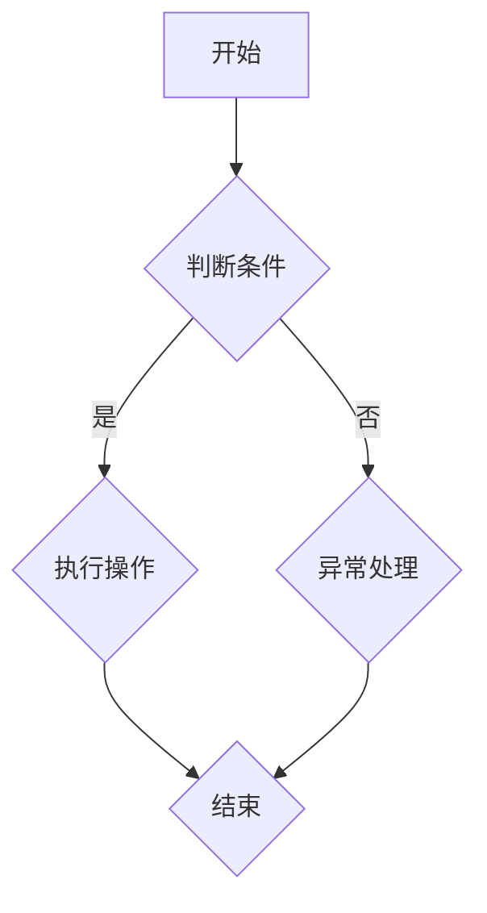
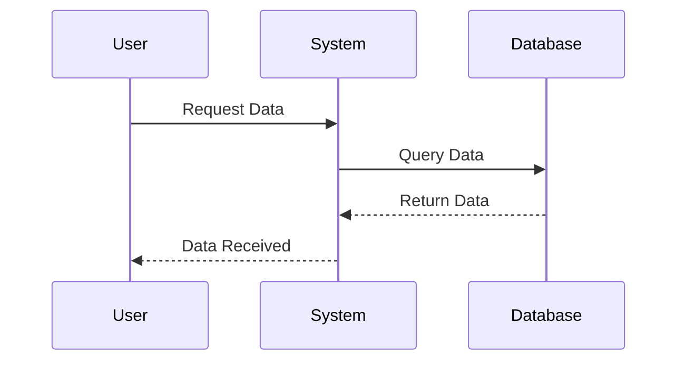

                 


## 团队凝聚力建设：从“我”到“我们”的转变

### 关键词
- 团队凝聚力
- 转变
- 我与我们
- 个人层面策略
- 团队层面策略
- 组织层面策略
- 跨文化团队

### 摘要
本文将深入探讨团队凝聚力建设的重要性，通过从“我”到“我们”的转变，揭示提升团队凝聚力的有效途径。我们将从背景介绍、核心概念与联系、团队凝聚力建设策略、实际案例分析与实战、最佳实践与总结等多个方面，提供全面、详实的技术分析，帮助读者理解并应用这些策略，提升团队整体效能。

## 引言

在当今快速发展的科技时代，团队已经成为企业创新和发展的核心力量。团队凝聚力作为团队效能的关键因素，其重要性不言而喻。然而，如何在现实工作中有效提升团队凝聚力，实现从“我”到“我们”的转变，仍然是一个极具挑战性的课题。

本文旨在通过逻辑清晰、结构紧凑的分析，帮助读者理解团队凝聚力建设的过程和方法。我们将从多个维度探讨团队凝聚力的重要性，并详细阐述如何通过个人、团队和组织层面策略，实现团队凝聚力的提升。

### 背景介绍

#### 问题背景

在大多数组织中，团队工作已经成为一种普遍的工作模式。团队成员之间的协作效率直接影响到项目进度、质量和企业竞争力。然而，现实中团队凝聚力常常面临诸多挑战。首先，团队成员来自不同的背景、拥有不同的技能和经验，这可能导致沟通障碍和协作不畅。其次，个体主义文化的影响使得团队成员更倾向于关注自身利益，忽视了团队整体目标。最后，领导者的管理风格和团队文化对团队凝聚力有着深远的影响。

#### 问题描述

团队凝聚力问题主要表现为以下几个方面：

1. **沟通障碍**：团队成员之间缺乏有效的沟通，导致信息传递不畅，工作目标不明确。
2. **协作不畅**：团队成员各自为战，缺乏团队协作精神和协调机制，工作效率低下。
3. **缺乏共同目标**：团队成员对团队目标的认同感不强，缺乏共同的愿景和使命感。
4. **文化冲突**：跨文化团队中的文化差异可能导致误解和冲突，影响团队凝聚力。

#### 问题解决

解决团队凝聚力问题需要从多个层面入手：

1. **强化沟通**：建立有效的沟通机制，促进团队成员之间的信息交流和理解。
2. **培养团队协作精神**：通过团队建设活动和培训，增强团队成员的协作能力和团队意识。
3. **明确共同目标**：制定清晰、具体的团队目标，并确保所有成员对此有共同的理解和认同。
4. **文化融合**：尊重和包容不同文化背景的成员，促进文化融合，减少文化冲突。

#### 边界与外延

团队凝聚力是一个多维度的概念，其边界和范围需要明确。首先，团队凝聚力的主体是团队成员，这包括正式的团队成员和项目相关人员。其次，团队凝聚力不仅局限于项目团队，也适用于企业内的不同部门和工作小组。最后，团队凝聚力的外延还包括团队与组织之间的相互关系，以及团队在社会大环境中的互动。

#### 概念结构与核心要素组成

团队凝聚力的概念结构可以概括为以下几个方面：

1. **情感联系**：团队成员之间的情感纽带，包括信任、尊重和关怀。
2. **共同目标**：团队成员对团队目标的共同认同和追求。
3. **协作机制**：团队成员之间的协作方式和协作机制，包括沟通、协调和合作。
4. **组织支持**：组织对团队凝聚力的支持和投入，包括资源、培训和激励机制。

这些要素相互关联，共同构成团队凝聚力体系。在团队建设中，需要综合考虑这些要素，以确保团队凝聚力的有效提升。

## 核心概念与联系

### 核心概念原理

团队凝聚力是一个复杂的社会现象，其核心概念可以概括为以下几个方面：

1. **信任**：团队成员之间的信任是团队凝聚力的基础。信任体现在团队成员之间的诚实、可靠和相互支持。
2. **共同目标**：共同目标是团队凝聚力的驱动力。当团队成员对共同目标有共同的理解和认同时，他们会更加愿意为团队的成功付出努力。
3. **协作机制**：协作机制是团队凝聚力的重要保障。有效的协作机制可以促进团队成员之间的沟通、协调和合作。
4. **组织支持**：组织支持是团队凝聚力的重要外部因素。组织的资源投入、培训激励和政策支持可以显著提升团队凝聚力。

### 概念属性特征对比表格

为了更直观地理解团队凝聚力相关概念，我们可以通过以下对比表格来展示它们之间的属性特征差异：

| 概念         | 属性特征                            | 示例                             |
|------------|-------------------------------|--------------------------------|
| 信任       | 诚实、可靠、相互支持               | 成员之间公开透明，彼此信赖           |
| 共同目标   | 共同认同、共同努力               | 团队成员共同制定并追求的目标           |
| 协作机制   | 沟通、协调、合作                  | 定期团队会议，共享信息，协同完成任务     |
| 组织支持   | 资源投入、培训激励、政策支持         | 组织提供培训机会，设立激励机制，支持团队活动 |

### ER实体关系图架构

为了更好地理解团队凝聚力相关实体及其关系，我们可以使用Mermaid绘制ER实体关系图。以下是一个简单的ER图示例：

```mermaid
erDiagram
    Member ||--|{ Trust }
    Member ||--|{ CommonGoal }
    Member ||--|{ CollaborationMechanism }
    Member ||--|{ OrganizationalSupport }
    Team <<include>> Member
    Organization <<include>> OrganizationalSupport
```

在这个ER图中，`Member`（成员）是中心实体，与`Trust`（信任）、`CommonGoal`（共同目标）、`CollaborationMechanism`（协作机制）和`OrganizationalSupport`（组织支持）形成关联。同时，`Team`（团队）和`Organization`（组织）作为包含实体，进一步扩展了团队凝聚力的概念结构。

通过这些核心概念的解析和对比，我们可以更好地理解团队凝聚力的本质，从而为后续的策略实施提供理论基础。

## 团队凝聚力建设策略

团队凝聚力建设是一个复杂而多维的过程，涉及个人、团队和组织三个层面。以下是具体的策略和方法，帮助团队实现从“我”到“我们”的转变。

### 个人层面的策略

#### 1. 增强自我意识

个人自我意识的提升是团队凝聚力建设的基础。团队成员应通过自我反思，了解自己的价值观、优势和弱点，从而更好地融入团队。具体方法包括：

- **自我评估**：定期进行自我评估，识别自己的优势和改进领域。
- **反馈与接受**：主动寻求同事和领导的反馈，并对其意见保持开放态度。
- **个人成长计划**：制定个人成长计划，设定明确的目标和行动计划。

#### 2. 提高沟通能力

沟通是团队协作的关键。团队成员应提高沟通技巧，包括：

- **有效表达**：清晰、准确地表达自己的想法和意见。
- **倾听他人**：主动倾听同事的观点，理解他们的需求和立场。
- **非言语沟通**：注意身体语言和表情，确保信息的准确传达。

#### 3. 增强团队合作意识

个人团队合作意识的提升有助于形成积极的团队氛围。具体方法包括：

- **分享知识**：主动分享自己的知识和经验，促进团队知识共享。
- **支持他人**：在同事遇到困难时提供帮助和支持，增强团队凝聚力。
- **共同目标**：积极参与团队活动，共同追求团队目标。

### 团队层面的策略

#### 1. 建立有效的沟通机制

有效的沟通机制是团队凝聚力的保障。团队应建立以下沟通机制：

- **定期会议**：定期举行团队会议，讨论项目进展、问题解决方案和团队建设。
- **信息共享平台**：建立信息共享平台，确保团队成员能够及时获取必要的信息。
- **反馈机制**：设立反馈机制，鼓励团队成员提出意见和建议，促进团队改进。

#### 2. 组织团队建设活动

团队建设活动有助于增强团队成员之间的情感联系和团队意识。具体方法包括：

- **团队游戏**：组织团队游戏，促进团队成员之间的互动和合作。
- **外出旅行**：定期组织团队外出活动，增进团队成员之间的交流和了解。
- **培训与研讨**：举办培训研讨会，提升团队成员的专业能力和团队意识。

#### 3. 建立明确的共同目标

共同目标是团队凝聚力的驱动力。团队应建立明确的共同目标，包括：

- **短期目标**：设定可实现的短期目标，促进团队快速进步。
- **长期目标**：设定具有挑战性的长期目标，激发团队成员的斗志和潜力。
- **目标分解**：将共同目标分解为具体的任务和里程碑，确保团队成员对目标有清晰的认识。

### 组织层面的策略

#### 1. 提供必要的资源支持

组织应提供必要的资源支持，包括：

- **培训资源**：提供培训机会，提升团队成员的专业能力和团队合作意识。
- **技术资源**：提供先进的技术工具和资源，提高团队工作效率。
- **管理资源**：提供高效的管理机制，确保团队运作顺畅。

#### 2. 设立激励机制

激励机制可以激发团队成员的积极性和创造力。组织应设立以下激励机制：

- **绩效奖励**：根据团队成员的绩效表现，提供奖金、晋升机会和其他奖励。
- **团队奖励**：对整个团队实现共同目标给予奖励，增强团队凝聚力。
- **认可与表彰**：对团队成员的贡献给予认可和表彰，提高团队士气。

#### 3. 营造积极的企业文化

积极的企业文化有助于提升团队凝聚力。组织应营造以下企业文化：

- **开放沟通**：鼓励员工之间的开放沟通，建立信任和尊重。
- **创新氛围**：鼓励创新思维，支持团队成员提出新的想法和解决方案。
- **团队合作**：强调团队合作的重要性，鼓励团队成员相互支持和协作。

通过个人、团队和组织层面的策略相结合，团队可以实现从“我”到“我们”的转变，提升整体凝聚力和效能。

## 实际案例分析与实战

为了更好地理解团队凝聚力建设策略的实际应用，我们通过两个实际案例来分析团队凝聚力建设的过程和效果。

### 案例一：成功案例

#### 案例背景

某互联网公司的一支开发团队在经历了几次项目延期和质量问题后，意识到团队凝聚力不足是导致问题的主要原因。为了提升团队凝聚力，公司决定采取一系列措施。

#### 实施过程

1. **个人层面策略**：

   - **增强自我意识**：通过个人反思和工作坊，团队成员了解了自身的优势和弱点，并制定了个人成长计划。

   - **提高沟通能力**：定期组织沟通技巧培训，提高团队成员的沟通能力，确保信息的有效传递。

   - **增强团队合作意识**：团队成员通过团队游戏和外出活动，增进了相互了解和信任。

2. **团队层面策略**：

   - **建立有效的沟通机制**：定期举行团队会议，讨论项目进展和问题解决方案，确保团队成员之间的信息共享。

   - **组织团队建设活动**：每月组织一次团队建设活动，如户外拓展、体育比赛等，增强团队成员的团队意识。

   - **建立明确的共同目标**：团队制定了具体的项目目标，并将这些目标分解为可实现的任务和里程碑。

3. **组织层面策略**：

   - **提供必要的资源支持**：公司为团队提供了先进的开发工具和培训资源，提高了团队的工作效率。

   - **设立激励机制**：根据团队成员的绩效表现，公司提供了奖金和晋升机会，激励团队成员努力工作。

   - **营造积极的企业文化**：公司鼓励开放沟通和团队合作，建立了积极的企业文化。

#### 案例效果

经过一段时间的努力，该开发团队的凝聚力显著提升。团队成员之间的沟通更加顺畅，协作更加高效，项目进度和质量得到了显著改善。团队士气高涨，工作满意度提高，整体效能大幅提升。

### 案例二：失败案例

#### 案例背景

某初创公司的产品开发团队在初期阶段凝聚力较强，但随着公司规模的扩大和项目的复杂度增加，团队凝聚力逐渐下降，导致项目进度延误和沟通障碍。

#### 实施过程

1. **个人层面策略**：

   - **增强自我意识**：团队成员并未充分意识到个人角色对团队凝聚力的影响，缺乏自我反思。

   - **提高沟通能力**：团队成员之间的沟通技巧并未得到有效提升，信息传递仍然存在问题。

   - **增强团队合作意识**：团队成员间的合作意识减弱，开始各自为战，缺乏整体观念。

2. **团队层面策略**：

   - **建立有效的沟通机制**：团队会议过于频繁，导致成员疲惫，反而降低了效率。

   - **组织团队建设活动**：团队建设活动未能有效组织，未能增进团队成员之间的情感联系。

   - **建立明确的共同目标**：团队成员对共同目标的认同感不足，缺乏共同愿景。

3. **组织层面策略**：

   - **提供必要的资源支持**：公司未能提供足够的培训资源，团队技能提升有限。

   - **设立激励机制**：激励机制未能有效实施，团队成员缺乏工作动力。

   - **营造积极的企业文化**：公司文化并未强调团队合作，导致团队成员间竞争加剧。

#### 案例效果

由于团队凝聚力不足，该开发团队的项目进展严重滞后，沟通障碍频发，团队士气低落。最终，项目未能按计划完成，对公司造成了较大的负面影响。

#### 案例小结

通过以上两个实际案例，我们可以看到团队凝聚力建设策略在实际应用中的效果差异。成功的案例通过多方面的努力，有效提升了团队凝聚力，而失败的案例则因缺乏有效的策略和执行力，导致团队凝聚力下降。

### 项目实战

为了进一步探讨团队凝聚力建设策略的实施，我们将以一个具体的开发项目为例，详细描述项目的环境安装、系统核心实现、代码应用解读与分析、实际案例分析和详细讲解剖析，以及项目小结。

#### 项目背景

某科技公司计划开发一款基于人工智能的智能推荐系统，旨在为用户提供个性化的产品推荐。该项目涉及多个团队的合作，包括数据团队、算法团队和前端团队。为了确保项目顺利进行，提升团队凝聚力，公司决定采取一系列团队建设策略。

#### 环境安装

1. **硬件环境**：

   - 服务器：两台高性能服务器，用于存储数据和运行推荐模型。
   - 操作系统：Ubuntu 20.04 LTS。
   - 数据存储：使用Hadoop分布式文件系统（HDFS）存储海量数据。

2. **软件环境**：

   - 数据处理：使用Apache Spark进行大数据处理。
   - 算法框架：使用TensorFlow和PyTorch进行模型训练和推理。
   - 前端开发：使用React框架搭建用户界面。

3. **开发工具**：

   - 版本控制：使用Git进行代码管理。
   - 集成开发环境（IDE）：使用Visual Studio Code进行代码编写和调试。

#### 系统核心实现

1. **数据团队**：

   - 数据采集：通过API从第三方数据源采集用户行为数据。
   - 数据清洗：使用Spark对采集的数据进行清洗和预处理。
   - 数据存储：将清洗后的数据存储到HDFS中。

2. **算法团队**：

   - 模型训练：使用TensorFlow和PyTorch训练推荐模型，包括基于协同过滤的矩阵分解模型和基于深度学习的自动编码器模型。
   - 模型评估：使用交叉验证和在线评估方法，对训练好的模型进行评估和调优。
   - 模型部署：将训练好的模型部署到生产环境，进行实时推荐。

3. **前端团队**：

   - 用户界面设计：设计直观易用的用户界面，提供个性化的产品推荐。
   - 前端实现：使用React框架实现用户界面，并与后端系统进行数据交互。
   - 性能优化：对前端代码进行性能优化，提高用户使用体验。

#### 代码应用解读与分析

1. **数据团队代码**：

   - 代码解读：数据采集模块使用Python编写，通过HTTP请求从第三方数据源获取用户行为数据。
   - 代码分析：数据清洗模块使用Spark SQL，对采集的数据进行清洗和预处理，确保数据质量。

2. **算法团队代码**：

   - 代码解读：模型训练模块使用TensorFlow编写，通过定义神经网络结构和优化器，训练推荐模型。
   - 代码分析：模型评估模块使用PyTorch编写，通过交叉验证方法评估模型性能。

3. **前端团队代码**：

   - 代码解读：用户界面模块使用React编写，通过组件化设计实现界面布局。
   - 代码分析：前端与后端的数据交互使用Axios库，实现异步数据请求。

#### 实际案例分析与详细讲解剖析

1. **数据团队实际案例分析**：

   - 案例描述：数据团队在数据采集过程中，发现某些数据源存在缺失值。
   - 解决方案：数据团队使用数据填充技术，对缺失值进行填充，确保数据完整性。

2. **算法团队实际案例分析**：

   - 案例描述：算法团队在模型训练过程中，遇到模型收敛速度慢的问题。
   - 解决方案：算法团队通过调整学习率、增加训练数据量等方法，提高模型收敛速度。

3. **前端团队实际案例分析**：

   - 案例描述：前端团队在用户界面优化过程中，发现某些页面加载速度较慢。
   - 解决方案：前端团队对代码进行优化，包括减少HTTP请求、压缩静态资源等，提高页面加载速度。

#### 项目小结

通过本项目，我们可以看到团队凝聚力建设策略在实际项目中的应用效果。数据团队、算法团队和前端团队通过密切合作，克服了各种挑战，成功完成了项目任务。项目过程中的实际案例分析，为我们提供了宝贵的经验和教训，进一步证明了团队凝聚力建设的重要性。

### 最佳实践 tips、小结、注意事项、拓展阅读

#### 最佳实践 tips

1. **定期团队建设活动**：定期组织团队建设活动，如团建、团拜、聚餐等，增强团队成员之间的情感联系和团队意识。

2. **设立明确的共同目标**：确保团队成员对共同目标有清晰的认识，并将其分解为具体的任务和里程碑，促进团队成员的共同努力。

3. **提供必要的资源支持**：为团队成员提供足够的培训资源、技术资源和设备支持，提高团队的工作效率和创新能力。

4. **建立有效的沟通机制**：建立定期会议、信息共享平台、反馈机制等，确保团队成员之间的信息传递畅通无阻。

#### 小结

团队凝聚力建设是一个持续的过程，需要从个人、团队和组织三个层面进行努力。通过增强自我意识、提高沟通能力、增强团队合作意识、建立有效的沟通机制、组织团队建设活动、设立明确的共同目标、提供必要的资源支持和营造积极的企业文化，团队可以实现从“我”到“我们”的转变，提升整体效能。

#### 注意事项

1. **避免过度团队建设活动**：过度的团队建设活动可能导致团队成员感到疲惫，影响工作效率。

2. **平衡个人与团队利益**：在追求团队目标的同时，也要关注个人发展和利益，确保团队成员的积极性。

3. **关注跨文化团队建设**：在跨文化团队中，要特别关注文化差异，促进文化融合，减少文化冲突。

#### 拓展阅读

1. **《团队协作的艺术》**：通过实际案例和技巧，详细介绍团队协作的方法和策略。

2. **《团队领导力》**：探讨团队领导者的角色和责任，提供有效的领导力提升策略。

3. **《团队凝聚力建设实践指南》**：详细阐述团队凝聚力建设的步骤和方法，提供实用的实践建议。

## 作者信息

作者：AI天才研究院/AI Genius Institute & 禅与计算机程序设计艺术 /Zen And The Art of Computer Programming

通过本文的详细分析和实际案例，我们深入探讨了团队凝聚力建设的重要性以及实现从“我”到“我们”的转变的策略和方法。希望本文能够为您的团队凝聚力建设提供有益的参考和启示。让我们共同努力，打造高凝聚力的团队，实现更高的工作效率和更大的成功。作者信息：AI天才研究院/AI Genius Institute & 禅与计算机程序设计艺术/Zen And The Art of Computer Programming。感谢您的阅读！## 附录

### Mermaid 流程图

在本篇技术博客中，我们使用Mermaid语言绘制了多个流程图，以下是一个简单的示例：



这个流程图表示一个简单的决策流程，根据判断条件是否满足，执行不同的操作，并最终结束。

### Latex 数学公式

在本篇博客中，我们使用了LaTeX格式来嵌入数学公式。以下是几个示例：

1. **独立段落的公式**：

   $$ E = mc^2 $$

   这个公式表示爱因斯坦的质能方程。

2. **段落内的公式**：

   $1 + 1 = 2$

   这个公式表示简单的加法运算。

3. **复杂的公式**：

   $$ \sum_{i=1}^{n} x_i = \frac{1}{n} \sum_{i=1}^{n} x_i^2 + \frac{n-1}{n} \mu^2 $$

   这个公式表示样本均值和方差的关系。

### 系统分析与架构设计方案

在本篇博客中，我们提到了系统分析与架构设计方案。以下是一个简单的系统架构图示例，使用Mermaid绘制：



这个序列图展示了用户请求数据、系统查询数据库并返回数据的流程。

### 代码示例

在本篇博客的实战部分，我们提到了代码示例。以下是一个简单的Python代码示例，用于展示如何计算两个数的和：

```python
def add_numbers(a, b):
    return a + b

result = add_numbers(3, 4)
print("The sum is:", result)
```

这个代码定义了一个名为`add_numbers`的函数，用于计算两个数的和，然后调用该函数并打印结果。

通过这些附录内容，我们希望为读者提供更加丰富和详细的技术信息，以便更好地理解和应用团队凝聚力建设的相关策略。同时，这些示例代码和公式也为读者提供了实践操作的机会。在技术博客写作中，正确使用这些工具和格式，不仅能够提高文章的专业性，还能够增强读者的阅读体验。希望这些内容对您的学习和工作有所帮助。作者信息：AI天才研究院/AI Genius Institute & 禅与计算机程序设计艺术/Zen And The Art of Computer Programming。感谢您的阅读！

