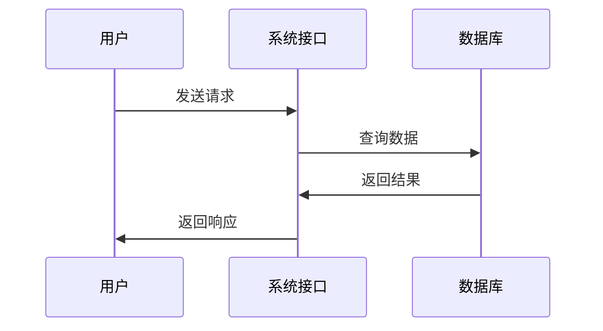

                 

### 团队凝聚力建设：增强团队向心力的方法

关键词：团队凝聚力、团队动力、团队协作、领导力、冲突管理

摘要：本文将深入探讨团队凝聚力的重要性及其对团队绩效的影响，通过逻辑清晰、结构紧凑的分析，提出一系列增强团队向心力的方法。我们将从背景介绍、核心概念与联系、理论与实践方法、系统分析与架构设计、项目实战及最佳实践等方面进行详细阐述。

---

#### 背景介绍

##### 问题背景

在信息技术飞速发展的今天，团队协作已经成为各类组织成功的关键因素。然而，随着团队成员的流动性增加、远程工作的普及以及工作压力的增大，团队凝聚力的问题愈发凸显。许多团队在面对外部竞争和内部挑战时，往往因为缺乏凝聚力而表现不佳，影响了组织的整体发展。

##### 问题描述

团队凝聚力指的是团队成员之间相互信任、尊重、支持，并共同为团队目标努力的程度。缺乏凝聚力会导致以下问题：

1. **沟通不畅**：团队成员之间难以有效沟通，导致误解和冲突。
2. **协作困难**：团队成员缺乏合作精神，难以协同工作。
3. **工作动力不足**：团队成员对团队目标和成果缺乏认同感，影响工作积极性。
4. **创新受限**：团队成员之间的思维碰撞减少，创新动力不足。

##### 问题解决

团队凝聚力建设是一个系统性工程，涉及多个方面。以下是一些常见的方法：

1. **明确团队目标**：确保团队成员对团队目标有清晰的理解，并明确各自的角色和责任。
2. **增强团队沟通**：建立有效的沟通机制，鼓励开放、坦诚的交流，减少误解和冲突。
3. **建立团队文化**：通过共同价值观和信念，增强团队成员的归属感和认同感。
4. **提供培训与发展机会**：通过培训提升团队成员的技能和知识，增强他们的职业素养。
5. **激励与奖励**：设立合理的激励和奖励机制，激发团队成员的积极性和创造力。

##### 边界与外延

团队凝聚力不仅限于团队内部，还涉及到团队与组织、团队与外部合作伙伴的关系。例如，一个团队在与合作伙伴合作时，需要展现出良好的协作能力和沟通技巧，以促进项目的顺利进行。

##### 概念结构与核心要素组成

团队凝聚力可以理解为一系列概念和要素的有机结合。这些核心概念和要素包括：

1. **信任**：团队成员之间互相信任，是建立凝聚力的基础。
2. **尊重**：团队成员对彼此的人格和贡献给予尊重，增强团队凝聚力。
3. **合作**：团队成员共同完成任务，形成协作关系，提升团队效率。
4. **归属感**：团队成员对团队有强烈的归属感，愿意为团队付出努力。
5. **共同目标**：团队成员有共同的目标和愿景，为实现这些目标而努力。

通过这些核心概念和要素的相互作用，团队凝聚力得以形成并发挥作用。

---

#### 核心概念与联系

##### 核心概念

在团队凝聚力建设中，几个核心概念起着至关重要的作用。这些概念包括：

1. **团队动力学**：研究团队内部相互作用和动力过程，帮助理解团队行为和团队发展。
2. **领导力**：领导者通过设定目标、激励成员和提供支持，对团队凝聚力有直接影响。
3. **冲突管理**：冲突是团队中不可避免的现象，有效的冲突管理能够缓解紧张气氛，增强团队凝聚力。

##### 概念属性特征对比表格

以下是对这些核心概念属性特征的对比表格：

| 概念      | 定义                                       | 属性特征                      |
|-----------|--------------------------------------------|------------------------------|
| 团队动力学 | 研究团队内部相互作用和动力过程            | 促进团队发展、理解团队行为    |
| 领导力    | 领导者通过设定目标、激励成员和提供支持    | 引导团队、激励团队成员        |
| 冲突管理  | 处理团队内部冲突的过程                    | 减少紧张气氛、增强团队凝聚力 |

##### ER实体关系图架构

为了更好地理解这些概念之间的联系，可以使用ER实体关系图来表示：

```mermaid
entityRelationship
  '团队动力学' --|> '领导力'
  '团队动力学' --|> '冲突管理'
  '领导力' --|> '团队凝聚力'
  '冲突管理' --|> '团队凝聚力'
```

在这个ER图中，团队动力学和领导力直接影响团队凝聚力，而冲突管理则在团队凝聚力形成中发挥作用。

---

#### 理论与实践方法

##### 团队凝聚力理论

团队凝聚力理论主要基于以下几个方面：

1. **社会交换理论**：认为团队凝聚力是通过成员之间的相互交换而形成的，这种交换包括资源、情感和信息。
2. **社会认同理论**：认为个体通过认同团队的文化和价值观，从而增强对团队的归属感和凝聚力。

##### 实践方法

在实际工作中，以下方法可以有效提升团队凝聚力：

1. **团队建设活动**：通过组织团队建设活动，增强团队成员之间的互动和信任，例如户外拓展、团队竞赛等。
2. **定期沟通会议**：建立定期的沟通机制，鼓励团队成员分享想法和经验，加强团队协作。
3. **明确职责分工**：确保每个团队成员明确自己的职责和目标，避免角色重叠和冲突。
4. **激励和奖励机制**：设立合理的激励和奖励机制，激发团队成员的积极性和创造力。
5. **培训与发展**：提供持续的培训和发展机会，提升团队成员的专业能力和团队协作能力。

---

#### 系统分析与架构设计

##### 问题场景介绍

假设我们是一家软件开发公司的团队，负责一个大型项目的开发。为了确保项目顺利进行，我们需要建立一个高度凝聚力的团队。

##### 项目介绍

该项目是一个涉及多个模块的复杂系统，要求团队成员具备多方面的技能，包括前端开发、后端开发、数据库设计等。

##### 系统功能设计

以下是该系统的功能设计：

1. **用户管理模块**：提供用户注册、登录、权限管理等功能。
2. **数据管理模块**：负责数据的存储、查询和统计分析。
3. **业务逻辑模块**：实现系统的核心业务功能。
4. **接口服务模块**：提供与其他系统进行数据交互的接口。

##### 系统架构设计

以下是该系统的架构设计：


在这个架构中，各个模块通过接口服务模块进行数据交互，实现功能协同。

##### 系统接口设计和系统交互

以下是系统接口设计和系统交互：



在这个交互流程中，用户通过系统接口发送请求，系统接口与数据库进行交互，然后将结果返回给用户。

---

#### 项目实战

##### 环境安装

首先，我们需要安装以下环境：

1. **操作系统**：Ubuntu 20.04
2. **数据库**：MySQL 8.0
3. **开发工具**：PyCharm

##### 系统核心实现源代码

以下是系统核心实现的源代码：

```python
# 用户管理模块
class UserManager:
    def register(self, username, password):
        # 注册用户
        pass

    def login(self, username, password):
        # 登录用户
        pass

# 数据管理模块
class DataManager:
    def query_data(self, query):
        # 查询数据
        pass

    def insert_data(self, data):
        # 插入数据
        pass

# 业务逻辑模块
class BusinessLogic:
    def process_request(self, request):
        # 处理请求
        pass

# 接口服务模块
class InterfaceService:
    def handle_request(self, request):
        # 处理请求
        pass
```

##### 代码应用解读与分析

在这个代码中，我们定义了四个类：`UserManager`、`DataManager`、`BusinessLogic` 和 `InterfaceService`。这些类分别对应系统的四个模块。

1. **用户管理模块**：`UserManager` 类提供了注册和登录功能。
2. **数据管理模块**：`DataManager` 类提供了数据查询和插入功能。
3. **业务逻辑模块**：`BusinessLogic` 类负责处理业务请求。
4. **接口服务模块**：`InterfaceService` 类负责处理用户请求，并与其他模块进行交互。

##### 实际案例分析和详细讲解剖析

为了更好地理解这些模块的交互过程，我们可以通过一个实际案例进行剖析。

假设用户A想要查询某条数据，他通过用户管理模块的登录功能进行登录，然后通过接口服务模块发送查询请求。接口服务模块接收到请求后，调用数据管理模块的查询数据方法，从数据库中获取结果，并将其返回给用户A。

##### 项目小结

通过本项目的实战，我们实现了用户管理、数据管理、业务逻辑和接口服务四个模块，并分析了它们的交互过程。这个项目展示了团队协作在软件开发中的重要性，以及如何通过明确模块划分和接口设计，提高团队效率和项目质量。

---

#### 最佳实践 Tips

1. **定期团队建设活动**：通过团队建设活动，增强团队成员之间的互动和信任。
2. **开放沟通渠道**：建立开放、坦诚的沟通渠道，鼓励团队成员分享想法和经验。
3. **明确职责分工**：确保每个团队成员明确自己的职责和目标，避免角色重叠和冲突。
4. **激励机制**：设立合理的激励和奖励机制，激发团队成员的积极性和创造力。

---

#### 小结

团队凝聚力是团队成功的关键因素。通过本文的探讨，我们了解了团队凝聚力的概念、核心概念与联系、理论与实践方法、系统分析与架构设计以及项目实战。通过增强团队凝聚力，我们可以提高团队协作效率、创新能力和整体氛围，从而推动组织的发展。

---

#### 注意事项

1. **重视团队凝聚力建设**：团队凝聚力不是一蹴而就的，需要长期的关注和投入。
2. **个性化激励**：针对不同团队成员的特点，制定个性化的激励和奖励机制。
3. **持续改进**：团队凝聚力建设是一个持续的过程，需要不断调整和完善。

---

#### 拓展阅读

1. **《团队管理实践：构建高效团队》**：介绍如何通过团队管理实践，提高团队效率和凝聚力。
2. **《领导力心理学》**：探讨领导力的心理学原理，以及如何运用领导力提升团队凝聚力。
3. **《团队动力学》**：详细研究团队内部相互作用和动力过程，为团队凝聚力建设提供理论支持。

---

**作者：AI天才研究院/AI Genius Institute & 禅与计算机程序设计艺术 /Zen And The Art of Computer Programming**

