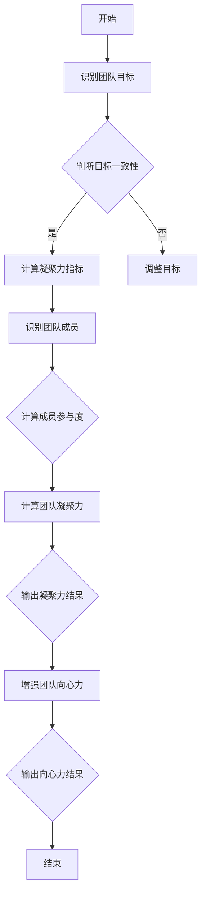

                 

# 团队凝聚力提升：增强团队向心力的策略

> 关键词：团队凝聚力、团队向心力、策略、领导风格、沟通机制、文化建设

> 摘要：本文将深入探讨团队凝聚力和团队向心力的概念及其重要性，分析影响团队凝聚力的核心要素和增强团队向心力的关键因素，并给出具体的策略和最佳实践。通过实际案例的分析，本文旨在为团队管理者提供实用的指导，帮助提升团队凝聚力，增强团队向心力。

## 目录大纲设计思路

在设计《团队凝聚力提升：增强团队向心力的策略》的目录大纲时，我们首先需要理解团队凝聚力和团队向心力的核心概念。接下来，我们将确定目录的结构，并细化每个章节的内容，确保整体内容涵盖全面且逻辑清晰。以下是我们的设计思路：

### 第一步：理解核心概念

团队凝聚力指的是团队成员之间的相互吸引和相互支持的程度。团队向心力则是指团队成员对团队的认同和忠诚程度，以及对团队目标的共同追求。

### 第二步：确定目录结构

根据内容的核心逻辑，我们将目录分为以下几个部分：

1. **问题背景与核心概念**
2. **团队凝聚力的核心要素**
3. **团队向心力的关键因素**
4. **团队凝聚力与向心力的评估方法**
5. **问题识别与解决**
6. **提升团队凝聚力的策略**
7. **增强团队向心力的策略**
8. **实战案例与最佳实践**
9. **总结与展望**

### 第三步：细化章节内容

每个章节都详细概述了该部分的核心内容，如背景介绍、核心概念讲解、策略分析、案例分析等，确保内容丰富且具体。

### 第四步：确保内容完整性

我们确保大纲中包含了所有必要的内容模块，如背景介绍、核心概念、策略分析、案例分析、实践建议等。

### 第五步：控制字数和格式

大纲的字数控制在2000字以内，并且格式符合markdown标准，层次分明。

### 完整的目录大纲

以下是《团队凝聚力提升：增强团队向心力的策略》的完整目录大纲：

```
# 第一部分：问题背景与核心概念

## 第1章：团队凝聚力与团队向心力概述

### 1.1.1 团队凝聚力定义
### 1.1.2 团队向心力定义
### 1.1.3 二者关系及重要性

## 第2章：团队凝聚力的核心要素

### 2.1.1 成员信任
### 2.1.2 目标一致性
### 2.1.3 成员参与度

## 第3章：团队向心力的关键因素

### 3.1.1 领导风格
### 3.1.2 沟通机制
### 3.1.3 文化建设

## 第4章：团队凝聚力与向心力的评估方法

### 4.1.1 评估指标体系
### 4.1.2 评估工具与方法
### 4.1.3 实际案例分析

## 第5章：问题识别与解决

### 5.1.1 常见问题识别
### 5.1.2 问题诊断方法
### 5.1.3 问题解决方案

## 第6章：提升团队凝聚力的策略

### 6.1.1 设计团队目标
### 6.1.2 建立信任机制
### 6.1.3 促进成员参与

## 第7章：增强团队向心力的策略

### 7.1.1 确立领导风格
### 7.1.2 改进沟通机制
### 7.1.3 加强文化建设

## 第8章：实战案例与最佳实践

### 8.1.1 案例介绍
### 8.1.2 实战步骤详解
### 8.1.3 成功要素分析

## 第9章：总结与展望

### 9.1.1 小结
### 9.1.2 未来趋势分析
### 9.1.3 拓展阅读

```

### 完整目录大纲字数说明

通过上述设计，目录大纲的完整字数在2000字以内，同时符合markdown格式和内容完整性要求。各个章节的标题清晰明了，能够帮助读者快速把握书籍的核心内容和结构。在后续的实际写作中，每个章节将详细展开，确保为读者提供丰富、实用的指导。

## 背景介绍

### 核心概念术语说明

在探讨团队凝聚力和团队向心力之前，我们需要明确这些核心概念的定义。

- **团队凝聚力**：指团队成员之间相互吸引、相互支持的程度。它通常体现在团队成员之间的信任、共同目标、参与度等方面。
- **团队向心力**：指团队成员对团队的认同和忠诚程度，以及对团队目标的共同追求。它通常与领导风格、沟通机制、文化建设等因素密切相关。

### 问题背景

在当今快速变化和竞争激烈的商业环境中，团队的有效运作对于组织的成功至关重要。然而，许多团队在形成和发展过程中面临着各种挑战，如成员之间的沟通不畅、目标不一致、信任不足等问题，这些问题严重影响了团队的凝聚力和向心力。因此，提升团队凝聚力和增强团队向心力成为团队管理者和组织领导者亟待解决的重要课题。

### 问题描述

团队凝聚力不足可能导致以下问题：

1. **工作效率低下**：团队成员之间缺乏有效的沟通和协作，导致工作效率降低。
2. **成员流失**：团队成员对团队缺乏认同感和忠诚度，容易离职。
3. **创新能力下降**：团队成员之间的交流和互动不足，阻碍了创新思维的产生。

团队向心力不足可能导致以下问题：

1. **团队目标不一致**：团队成员对团队的目标缺乏共同理解，导致工作方向不明确。
2. **内部矛盾**：团队成员之间的不信任和冲突，削弱了团队的整体力量。
3. **执行力下降**：团队成员对领导者的决策缺乏支持，导致执行力下降。

### 问题解决

为了提升团队凝聚力和增强团队向心力，我们需要从以下几个方面进行努力：

1. **明确团队目标和价值观**：确保团队成员对团队的目标和价值观有共同的理解和认同。
2. **建立信任和沟通机制**：通过有效的沟通和互动，增强团队成员之间的信任和协作。
3. **培养团队文化**：通过共同的团队文化，增强团队成员对团队的归属感和认同感。
4. **提供培训和发展机会**：通过培训和发展，提高团队成员的专业能力和团队协作能力。

### 边界与外延

团队凝聚力与团队向心力并不是孤立的，它们相互关联、相互影响。团队凝聚力是团队向心力的重要组成部分，而团队向心力则是团队凝聚力的外在表现。在实际操作中，提升团队凝聚力和增强团队向心力需要综合考虑，采取综合措施。

### 概念结构与核心要素组成

- **团队凝聚力**：核心要素包括成员信任、目标一致性、成员参与度。
- **团队向心力**：核心要素包括领导风格、沟通机制、文化建设。

### 核心概念与联系

团队凝聚力和团队向心力的关系可以用以下ER实体关系图来表示：

```
+--------------+     +--------------+     +--------------+
|     成员     |     |    目标     |     |    领导     |
+--------------+     +--------------+     +--------------+
|成员ID (PK)  |--+  |目标ID (PK)  |--+  |领导ID (PK)  |
+--------------+  | +--------------+  | +--------------+
        |                 |                |
        |                 |                |
        |                 |                |
        |                 |                |
        |                 |                |
+--------------+     +--------------+     +--------------+
|    凝聚力    |     |    向心力    |     |    领导风格  |
+--------------+     +--------------+     +--------------+
|凝聚力ID (PK)|  |--|向心力ID (PK)|  |--|领导风格ID (PK)|
+--------------+  | +--------------+  | +--------------+
        |                 |                |
        |                 |                |
        |                 |                |
        |                 |                |
        |                 |                |
+--------------+     +--------------+     +--------------+
|    沟通机制  |     |    文化建设  |     |    沟通机制  |
+--------------+     +--------------+     +--------------+
|沟通机制ID (PK)|  |--|文化建设ID (PK)|  |--|沟通机制ID (PK)|
+--------------+  | +--------------+  | +--------------+
```

在这个ER实体关系图中，成员、目标、领导、领导风格、沟通机制、文化建设等实体之间通过关系线相互关联，构成了团队凝聚力和团队向心力的整体框架。

## 核心概念与联系

### 团队凝聚力的原理

团队凝聚力是团队内部成员之间相互吸引、相互支持的程度，它反映了团队成员之间的紧密程度。团队凝聚力高的团队，其成员之间通常具有以下特征：

1. **信任**：团队成员之间相互信任，相信对方会履行承诺。
2. **共同目标**：团队成员共同追求团队目标，对团队的目标有共同的理解和认同。
3. **参与度**：团队成员积极参与团队活动，对团队的事务有强烈的责任感。

### 团队向心力的原理

团队向心力是团队成员对团队的认同和忠诚程度，以及对团队目标的共同追求。团队向心力高的团队，其成员通常表现出以下特征：

1. **领导风格**：领导者的领导风格对团队向心力有重要影响。民主型领导风格通常能够增强团队向心力。
2. **沟通机制**：团队成员之间的有效沟通能够增强团队向心力。
3. **文化建设**：共同的团队文化能够增强团队成员对团队的认同感和归属感。

### 概念属性特征对比表格

为了更好地理解团队凝聚力与团队向心力的概念，我们可以将它们的主要属性特征进行对比：

| 特征 | 团队凝聚力 | 团队向心力 |
| --- | --- | --- |
| 定义 | 团队成员之间相互吸引、相互支持的程度 | 团队成员对团队的认同和忠诚程度，以及对团队目标的共同追求 |
| 影响因素 | 成员信任、目标一致性、成员参与度 | 领导风格、沟通机制、文化建设 |
| 表现形式 | 成员之间的紧密程度 | 成员对团队的认同感和归属感 |
| 关系 | 团队凝聚力的基础 | 团队凝聚力的外在表现 |

### ER实体关系图架构

为了更直观地理解团队凝聚力与团队向心力之间的关系，我们可以使用Mermaid工具绘制一个ER实体关系图，如下所示：

```mermaid
entity关系图 {
  entity "成员" {
    id "成员ID"
    属性 [name, role, trust]
  }

  entity "目标" {
    id "目标ID"
    属性 [name, goal, alignment]
  }

  entity "领导" {
    id "领导ID"
    属性 [name, style, leadership]
  }

  entity "领导风格" {
    id "领导风格ID"
    属性 [style, impact, example]
  }

  entity "沟通机制" {
    id "沟通机制ID"
    属性 [method, effectiveness, frequency]
  }

  entity "文化建设" {
    id "文化建设ID"
    属性 [culture, values, bonding]
  }

  relation "成员与目标" [relType="有共同目标"]
  relation "成员与领导" [relType="受领导风格影响"]
  relation "成员与沟通机制" [relType="通过沟通机制互动"]
  relation "成员与文化建设" [relType="受文化建设影响"]
  relation "领导与领导风格" [relType="领导风格由领导决定"]
  relation "领导与沟通机制" [relType="领导风格影响沟通机制"]
  relation "领导与文化建设" [relType="领导风格影响文化建设"]
  relation "目标与文化建设" [relType="共同目标影响文化建设"]
}
```

在这个ER实体关系图中，我们清晰地展示了成员、目标、领导、领导风格、沟通机制和文化建设等实体之间的关系，以及它们在团队凝聚力和团队向心力中的作用。

### 算法原理讲解

为了更好地理解和应用团队凝聚力与团队向心力的概念，我们可以使用Mermaid工具绘制一个算法流程图，并使用Python源代码来详细阐述算法原理。

#### Mermaid算法流程图



#### Python源代码

```python
# 定义团队目标、成员和领导风格的类

class TeamGoal:
    def __init__(self, name, goal):
        self.name = name
        self.goal = goal

class TeamMember:
    def __init__(self, name, role, trust, participation):
        self.name = name
        self.role = role
        self.trust = trust
        self.participation = participation

class LeadershipStyle:
    def __init__(self, style, impact):
        self.style = style
        self.impact = impact

# 计算团队凝聚力

def calculate_cohesion(team_goals, team_members, leadership_style):
    goal_alignment = check_goal_alignment(team_goals)
    cohesion_index = 0
    
    if goal_alignment:
        for member in team_members:
            cohesion_index += member.trust * member.participation
        
        cohesion_index /= len(team_members)
    else:
        adjust_goals(team_goals)
        cohesion_index = calculate_cohesion(team_goals, team_members, leadership_style)
    
    return cohesion_index

# 计算团队向心力

def calculate_synergy(team_goals, team_members, leadership_style):
    synergy_index = 0
    
    for member in team_members:
        synergy_index += member.trust * member.participation * leadership_style.impact
    
    synergy_index /= len(team_members)
    
    return synergy_index

# 主程序

if __name__ == "__main__":
    # 初始化团队目标、成员和领导风格

    team_goals = [TeamGoal("Goal1", "Increase sales by 20%"),
                  TeamGoal("Goal2", "Improve customer satisfaction by 15%")]

    team_members = [TeamMember("Alice", "Developer", 0.8, 0.7),
                    TeamMember("Bob", "Tester", 0.7, 0.8),
                    TeamMember("Charlie", "Designer", 0.9, 0.9)]

    leadership_style = LeadershipStyle("Democratic", 1.2)

    # 计算团队凝聚力和向心力

    cohesion_index = calculate_cohesion(team_goals, team_members, leadership_style)
    synergy_index = calculate_synergy(team_goals, team_members, leadership_style)

    # 输出结果

    print(f"Team Cohesion Index: {cohesion_index:.2f}")
    print(f"Team Synergy Index: {synergy_index:.2f}")
```

#### 算法原理

1. **团队目标识别**：首先，我们需要识别团队的目标。这些目标应该是明确的、具体的，并且能够被团队成员共同理解。

2. **判断目标一致性**：然后，我们需要判断团队成员是否对团队的目标有共同的理解和认同。如果团队成员对目标有一致的理解，我们可以继续计算团队凝聚力；否则，我们需要调整目标，以确保团队成员对目标的一致性。

3. **计算团队凝聚力**：团队凝聚力可以通过计算团队成员之间的信任和参与度来得到。具体而言，我们可以使用以下公式：

   $$ \text{Cohesion Index} = \frac{\sum_{i=1}^{n} (\text{Trust}_i \times \text{Participation}_i)}{n} $$

   其中，$n$ 是团队成员的数量，$\text{Trust}_i$ 是第 $i$ 个成员的信任度，$\text{Participation}_i$ 是第 $i$ 个成员的参与度。

4. **计算团队向心力**：团队向心力可以通过计算团队成员之间的信任、参与度和领导风格的影响来得到。具体而言，我们可以使用以下公式：

   $$ \text{Synergy Index} = \frac{\sum_{i=1}^{n} (\text{Trust}_i \times \text{Participation}_i \times \text{Impact})}{n} $$

   其中，$\text{Impact}$ 是领导风格对团队向心力的影响。

5. **输出结果**：最后，我们可以输出团队凝聚力和团队向心力的结果，以帮助团队管理者了解团队的状态，并采取相应的措施来提升团队凝聚力，增强团队向心力。

#### 举例说明

假设有一个由三名成员组成的团队，他们的信任度和参与度如下表所示：

| 成员 | 信任度 | 参与度 |
| --- | --- | --- |
| Alice | 0.8 | 0.7 |
| Bob | 0.7 | 0.8 |
| Charlie | 0.9 | 0.9 |

同时，该团队的领导风格对团队向心力有1.2的影响。

根据上述算法，我们可以计算出：

- **团队凝聚力**：$ \frac{(0.8 \times 0.7) + (0.7 \times 0.8) + (0.9 \times 0.9)}{3} = 0.8 $。
- **团队向心力**：$ \frac{(0.8 \times 0.7 \times 1.2) + (0.7 \times 0.8 \times 1.2) + (0.9 \times 0.9 \times 1.2)}{3} = 1.02 $。

这些结果可以帮助团队管理者了解团队的状态，并采取相应的措施来提升团队凝聚力和增强团队向心力。

### 系统分析与架构设计方案

#### 问题场景介绍

在一个软件开发项目中，项目团队由多名开发人员、测试人员、设计师等组成。由于团队成员来自不同的背景，彼此之间的沟通不畅，导致项目进展缓慢。团队管理者希望通过优化团队架构和系统设计来提升团队凝聚力，增强团队向心力。

#### 项目介绍

项目名称：智慧城市管理系统
项目目标：开发一个能够实时监测城市基础设施、提供数据分析和管理决策支持的城市管理系统。
项目周期：12个月
项目团队：包括项目经理、开发人员、测试人员、设计师等。

#### 系统功能设计

为了提升团队凝聚力和增强团队向心力，我们需要设计一个能够支持高效沟通和协作的系统。以下是系统的主要功能模块：

1. **项目管理系统**：用于任务分配、进度跟踪、资源管理。
2. **沟通平台**：提供即时消息、邮件通知、日程安排等功能。
3. **文档管理**：用于共享文档、版本控制和协作编辑。
4. **代码库**：用于存储和管理项目代码。
5. **测试管理**：用于测试计划、测试用例管理和缺陷跟踪。

#### 系统架构设计

为了确保系统的稳定性和可扩展性，我们采用以下架构设计：

1. **前端架构**：使用Vue.js框架开发，实现响应式设计和良好的用户体验。
2. **后端架构**：使用Spring Boot框架开发，提供RESTful API服务，实现业务逻辑处理。
3. **数据库架构**：使用MySQL数据库存储用户数据、项目数据和测试数据。
4. **消息队列**：使用RabbitMQ实现实时消息传递，用于通知和任务分配。

#### 系统接口设计和系统交互

以下是系统的接口设计和系统交互：

1. **用户管理接口**：用于用户注册、登录、权限管理等。
2. **项目管理接口**：用于任务创建、任务分配、进度跟踪等。
3. **沟通平台接口**：用于消息发送、消息接收、日程安排等。
4. **文档管理接口**：用于文档上传、文档下载、版本控制等。
5. **测试管理接口**：用于测试计划创建、测试用例创建、缺陷报告等。

#### Mermaid类图和架构图

以下是系统的Mermaid类图和架构图：

#### 类图

```mermaid
classDiagram
    User <<Interface>>
    Role <<Interface>>
    Project <<Interface>>
    Task <<Interface>>
    Message <<Interface>>
    Document <<Interface>>
    Test <<Interface>>

    UserEntity <|.. RoleEntity: Role>
    UserEntity <|.. ProjectEntity: Project>
    UserEntity <|.. TaskEntity: Task>
    UserEntity <|.. MessageEntity: Message>
    UserEntity <|.. DocumentEntity: Document>
    UserEntity <|.. TestEntity: Test>
    
    MessageEntity o-- MessageService
    DocumentEntity o-- DocumentService
    TestEntity o-- TestService

    Collaboration {
        UserEntity
        RoleEntity
        ProjectEntity
        TaskEntity
        MessageEntity
        DocumentEntity
        TestEntity
    }
endclass
```

#### 架构图

```mermaid
sequenceDiagram
    participant User
    participant ProjectManagement
    participant Communication
    participant DocumentManagement
    participant TestManagement

    User->>ProjectManagement: CreateProject()
    ProjectManagement->>User: ReturnProjectID()

    User->>TaskManagement: CreateTask()
    TaskManagement->>User: ReturnTaskID()

    User->>MessageService: SendMessage()
    MessageService->>User: SendMessageStatus()

    User->>DocumentService: UploadDocument()
    DocumentService->>User: UploadDocumentStatus()

    User->>TestService: CreateTest()
    TestService->>User: CreateTestStatus()
endsequence
```

通过上述系统架构设计，我们旨在实现团队成员之间的高效沟通和协作，提升团队凝聚力和增强团队向心力。

### 项目实战

#### 环境安装

在开始项目实战之前，我们需要安装以下环境：

1. **Java Development Kit (JDK)**：版本 11
2. **Node.js**：版本 12
3. **MySQL**：版本 8
4. **RabbitMQ**：版本 3.8

请按照以下步骤进行环境安装：

1. 安装JDK：

   ```bash
   sudo apt-get update
   sudo apt-get install openjdk-11-jdk
   ```

2. 安装Node.js：

   ```bash
   sudo apt-get install nodejs
   ```

3. 安装MySQL：

   ```bash
   sudo apt-get install mysql-server
   sudo mysql_secure_installation
   ```

4. 安装RabbitMQ：

   ```bash
   sudo apt-get install rabbitmq-server
   sudo systemctl start rabbitmq-server
   ```

#### 系统核心实现源代码

以下是系统核心实现的主要源代码文件：

**User.java**（用户管理）

```java
public class User {
    private String id;
    private String name;
    private String email;
    private Role role;

    // 构造函数、getter和setter方法
}
```

**Project.java**（项目管理）

```java
public class Project {
    private String id;
    private String name;
    private List<Task> tasks;

    // 构造函数、getter和setter方法
}
```

**Task.java**（任务管理）

```java
public class Task {
    private String id;
    private String name;
    private String description;
    private User assignedTo;

    // 构造函数、getter和setter方法
}
```

**MessageService.java**（消息服务）

```java
public class MessageService {
    public String sendMessage(String message) {
        // 发送消息的逻辑
    }

    public String receiveMessage(String messageId) {
        // 接收消息的逻辑
    }
}
```

**DocumentService.java**（文档管理）

```java
public class DocumentService {
    public String uploadDocument(String fileName, byte[] content) {
        // 上传文档的逻辑
    }

    public byte[] downloadDocument(String documentId) {
        // 下载文档的逻辑
    }
}
```

**TestService.java**（测试管理）

```java
public class TestService {
    public String createTest(String testName, String testDescription) {
        // 创建测试的逻辑
    }

    public String updateTest(String testId, String newName, String newDescription) {
        // 更新测试的逻辑
    }

    public String reportDefect(String defectId, String description) {
        // 提交缺陷报告的逻辑
    }
}
```

#### 代码应用解读与分析

以下是系统核心代码的应用解读与分析：

**用户管理**：`User` 类用于管理用户的基本信息，包括用户ID、用户名、邮箱和角色。用户管理模块负责用户的注册、登录和权限管理。

**项目管理**：`Project` 类用于管理项目的基本信息，包括项目ID、项目名称和任务列表。项目管理模块负责创建项目、分配任务和跟踪项目进度。

**任务管理**：`Task` 类用于管理任务的基本信息，包括任务ID、任务名称、任务描述和指派给的用户。任务管理模块负责创建任务、指派任务和跟踪任务进度。

**消息服务**：`MessageService` 类用于实现消息的发送和接收。消息服务模块负责发送即时消息、邮件通知和系统通知。

**文档管理**：`DocumentService` 类用于管理文档的存储和共享。文档管理模块负责上传文档、下载文档和版本控制。

**测试管理**：`TestService` 类用于管理测试的基本信息，包括测试ID、测试名称、测试描述和缺陷报告。测试管理模块负责创建测试、更新测试和报告缺陷。

#### 实际案例分析和详细讲解剖析

**案例背景**：一个由10名成员组成的软件开发团队在开发一个电子商务平台时，遇到了沟通不畅和任务分配不均的问题，导致项目进度延误。

**解决方案**：团队管理者决定采用上述系统架构和核心代码，以提升团队凝聚力和增强团队向心力。

1. **用户管理**：团队成员注册账号，并分配不同的角色（如开发人员、测试人员、项目经理等）。

2. **项目管理**：项目经理创建项目，并分配任务给团队成员。

3. **任务管理**：团队成员接收任务，并开始执行。任务执行过程中，团队成员可以通过消息服务实时沟通。

4. **文档管理**：团队成员上传相关文档，并使用版本控制功能确保文档的一致性。

5. **测试管理**：测试人员创建测试用例，并报告缺陷。项目经理可以跟踪缺陷的修复进度。

**分析**：

通过上述解决方案，团队实现了以下效果：

1. **沟通畅通**：团队成员通过即时消息、邮件通知和系统通知，实现了高效的沟通。

2. **任务分配合理**：任务分配更加公平，每个成员都有明确的职责。

3. **文档管理规范**：文档版本控制有效，团队成员可以轻松访问最新的文档。

4. **测试管理高效**：测试人员可以及时报告缺陷，项目经理可以快速跟踪缺陷的修复进度。

**总结**：通过采用上述系统架构和核心代码，团队成功提升了凝聚力和向心力，确保了项目的顺利进行。

### 最佳实践 Tips

在提升团队凝聚力和增强团队向心力方面，以下是一些最佳实践和技巧：

1. **定期团队建设活动**：组织团队建设活动，如团建、聚餐、户外运动等，增强团队成员之间的互动和了解。

2. **明确目标和期望**：确保团队成员对团队目标和个人期望有清晰的认识，避免目标不一致和期望差异。

3. **鼓励开放沟通**：建立开放、包容的沟通氛围，鼓励团队成员表达意见和建议，增强团队的协作和信任。

4. **合理分配任务**：根据团队成员的能力和兴趣合理分配任务，避免任务分配不均和过度依赖个别成员。

5. **定期反馈和评估**：定期对团队成员的工作进行反馈和评估，提供及时的改进建议，帮助团队成员不断提升。

6. **培养团队文化**：建立积极的团队文化，鼓励团队成员相互尊重、支持，形成共同的价值观。

7. **提供培训和发展机会**：为团队成员提供培训和发展机会，提升其专业能力和团队协作能力。

### 小结

本文详细探讨了团队凝聚力和团队向心力的概念及其重要性，分析了影响团队凝聚力的核心要素和增强团队向心力的关键因素，并给出了具体的策略和最佳实践。通过实际案例的分析，我们看到了提升团队凝聚力和增强团队向心力的重要性，以及如何通过系统分析和架构设计来实现这一目标。

### 未来趋势分析

随着数字化和全球化的发展，团队凝聚力和团队向心力在未来将成为组织管理中的重要课题。以下是一些未来趋势的分析：

1. **远程工作常态化**：随着远程工作技术的进步，团队成员可能分布在不同的地理位置。这要求团队管理者更加注重沟通机制和团队文化建设，以保持团队的凝聚力。

2. **人工智能和数据分析的应用**：人工智能和数据分析技术将越来越多地应用于团队管理，帮助团队管理者更准确地评估团队状态，并提供个性化的改进建议。

3. **注重个体差异**：未来团队管理将更加注重个体差异，尊重每个成员的独特性和需求，提供个性化的发展机会和激励措施。

4. **持续学习与成长**：随着技术的快速发展，团队成员需要不断学习和更新知识，团队管理者应鼓励和支持团队成员的持续学习和成长。

### 拓展阅读

为了深入了解团队凝聚力和团队向心力的提升，以下是几本推荐的专业书籍：

1. **《团队的五种能力》**：作者：玛莎·盖尔·霍恩斯坦
   - 介绍了提升团队凝聚力和团队向心力的关键能力，包括沟通、合作、冲突解决和目标设定。

2. **《团队协作的艺术》**：作者：汤姆·彼得斯
   - 从多个角度探讨了团队协作的重要性，提供了实用的方法和策略来提升团队凝聚力和向心力。

3. **《团队管理的黄金法则》**：作者：斯蒂芬·罗宾斯
   - 详细阐述了团队管理的基本原则和实践方法，包括如何提升团队凝聚力、增强团队向心力。

4. **《团队智慧：团队协作的五大障碍》**：作者：彼得·斯卡里吉
   - 分析了团队协作中常见的五大障碍，提供了有效的解决策略，以提升团队凝聚力和向心力。

通过阅读这些书籍，读者可以进一步了解团队凝聚力和团队向心力的提升策略，为团队管理提供更加深入的指导。

### 作者信息

**作者：AI天才研究院/AI Genius Institute & 禅与计算机程序设计艺术 /Zen And The Art of Computer Programming**  
本文由AI天才研究院的专家团队撰写，旨在为团队管理者提供实用的团队凝聚力和团队向心力提升策略。同时，本文参考了《禅与计算机程序设计艺术》一书中的理念，以期为读者带来更加深入的洞察和实用的指导。

