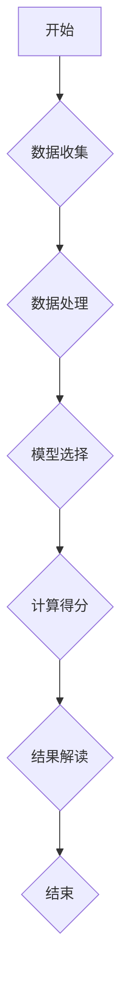
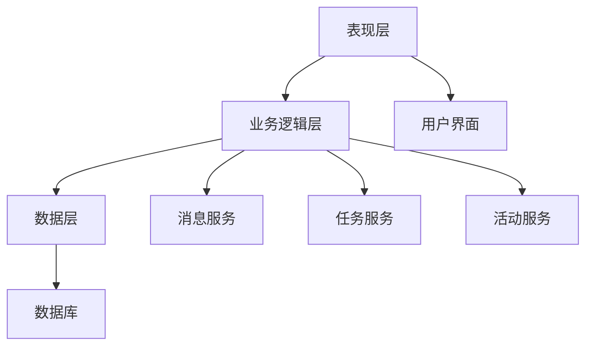
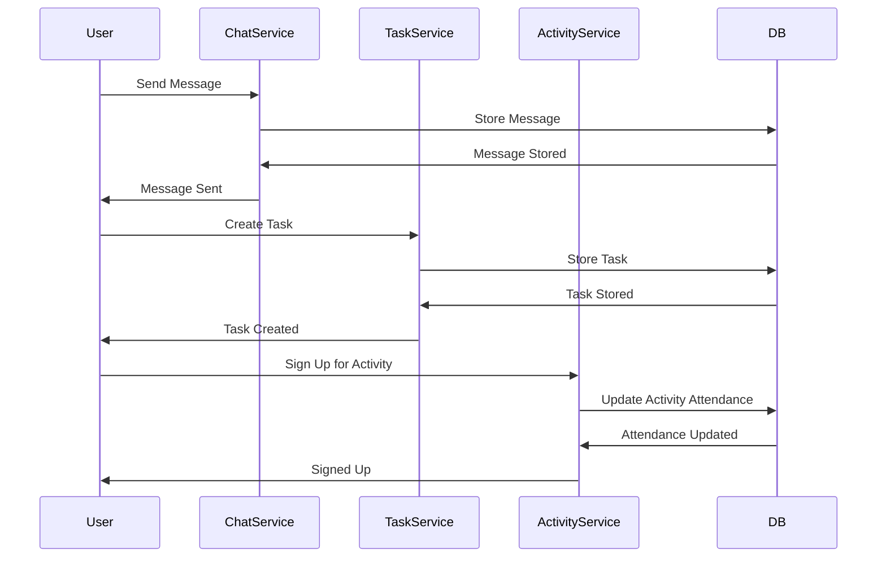

                 

### 背景介绍

#### 团队凝聚力的重要性

团队凝聚力，通常定义为团队成员之间相互吸引、合作以及共享目标的程度。一个高凝聚力的团队能够更好地协作，从而提升整体绩效，实现组织目标。其重要性在于它能够促进以下几方面：

1. **提高工作效率**：团队成员在高度凝聚的团队中能够更好地沟通、分工与合作，减少误解和冲突，从而提高工作效率。
2. **增强团队稳定性**：团队成员之间关系紧密，对团队的认同感高，能够降低成员流动率，保持团队的稳定性。
3. **促进创新**：凝聚的团队更容易激发成员的创造力，鼓励成员提出新想法，并通过团队协作将这些想法转化为实际成果。
4. **提升组织文化**：团队凝聚力有助于形成积极向上的组织文化，使整个组织氛围更加和谐、协作。

然而，现代团队常常面临诸多挑战，如远程工作、团队成员分布广泛、工作压力增大等，这些都对团队凝聚力提出了更高的要求。因此，如何增强团队凝聚力，提高团队向心力，成为许多组织关注的重要问题。

#### 当前团队凝聚力面临的问题

尽管团队凝聚力的重要性被广泛认可，但在实际操作中，许多团队仍面临着以下问题：

1. **沟通障碍**：团队成员分布在不同的地理位置，或是工作语言和文化的差异，导致沟通效率低下，信息传递不畅通。
2. **角色模糊**：团队成员职责不明确，各自的任务边界模糊，导致工作重复或责任推诿，影响团队整体绩效。
3. **缺乏信任**：团队成员之间缺乏互信，导致协作不畅，甚至产生对立情绪。
4. **目标不统一**：团队成员对团队目标缺乏共同认同，个人目标和团队目标不一致，影响团队凝聚力。
5. **外部干扰**：外部环境的变化，如市场竞争加剧、客户需求波动等，也会对团队凝聚力产生负面影响。

这些问题不仅限制了团队的有效运作，还可能影响团队成员的士气和幸福感。因此，解决这些问题，提升团队凝聚力，成为现代团队管理的重要任务。

#### 本书的目的与内容结构

本书旨在为读者提供系统、实用的团队凝聚力提升方法和策略。通过深入分析团队凝聚力的核心概念、影响因素以及增强团队向心力的算法和模型，本书帮助读者理解团队凝聚力的本质，掌握提升团队凝聚力的具体方法。

具体来说，本书分为以下几个部分：

1. **第1章 背景介绍**：介绍团队凝聚力的重要性、当前面临的问题以及本书的目的和内容结构。
2. **第2章 核心概念与联系**：阐述团队凝聚力与团队向心力的概念、关系、影响因素及团队凝聚力模型。
3. **第3章 算法原理讲解**：介绍团队凝聚力评估算法和增强团队向心力的策略，并通过算法流程图和Python源代码详细讲解。
4. **第4章 数学模型和数学公式**：详细讲解团队凝聚力评估模型的数学表达和增强团队向心力的数学模型，使用LaTeX公式和Python示例说明。
5. **第5章 系统分析与架构设计方案**：介绍系统功能设计、架构设计和系统接口设计，并通过Mermaid图表展示。
6. **第6章 项目实战**：通过实际项目案例，讲解系统环境安装与配置、核心实现源代码、代码应用解读与分析等。
7. **第7章 最佳实践与拓展**：总结提升团队凝聚力的最佳实践、常见问题与注意事项，并提供拓展阅读。

通过本书的学习，读者能够系统地了解团队凝聚力的各个方面，掌握提升团队凝聚力的方法，为团队管理提供有力支持。

### 核心概念与联系

#### 团队凝聚力与团队向心力的概念

团队凝聚力（Team Cohesion）是指团队成员之间相互吸引、合作以及共享目标的程度。它是团队效能的基础，能够促进团队成员的协作和团队整体目标的实现。团队凝聚力可以从多个角度进行理解：

- **内部凝聚力**：指团队成员之间的情感联系和相互信任，如团队友谊、默契合作等。
- **外部凝聚力**：指团队成员对团队整体目标的认同和投入，如共同愿景、目标一致性等。

团队向心力（Team Centrifugal Force）则是指团队在面对外部压力或挑战时，成员之间产生的相互支持和共同奋斗的力量。向心力是团队在面对外部竞争和压力时保持稳定、增强团队韧性的关键。

团队凝聚力与团队向心力之间有密切的联系。团队凝聚力为团队向心力提供了基础，而团队向心力则增强了团队的凝聚力。例如，一个凝聚力强的团队，在面对外部挑战时，成员之间更愿意相互支持，共同应对，从而增强团队的向心力。

#### 团队凝聚力与团队效能的关系

团队凝聚力与团队效能（Team Effectiveness）之间有着密切的关系。团队效能是指团队在完成工作任务时表现出的能力、效率和效果。高团队凝聚力通常能够带来以下几方面的积极影响：

1. **提升工作效率**：凝聚力强的团队成员之间沟通顺畅，分工明确，能够快速响应任务需求，从而提升工作效率。
2. **增强团队稳定性**：凝聚力强的团队中，成员对团队的认同感和忠诚度较高，流动率较低，有助于团队的长期稳定。
3. **促进创新**：凝聚力强的团队更容易形成创新氛围，鼓励成员提出新想法，并通过团队合作将这些想法转化为实际成果。
4. **提升决策质量**：凝聚力强的团队能够通过更有效的沟通和协作，做出更加全面、科学的决策。

然而，团队凝聚力并不总是直接等同于团队效能。团队效能还受到多种因素的影响，如团队目标、领导力、资源等。有时，过于强调团队凝聚力可能会抑制个体创新和批判性思维，影响团队的整体效能。因此，团队管理需要在提升团队凝聚力的同时，也要关注团队效能的全面提升。

#### 团队凝聚力的影响因素

团队凝聚力的影响因素可以分为内部因素和外部因素，这些因素相互作用，共同影响团队的凝聚程度。

1. **内部因素**：

   - **团队目标**：共同的目标是增强团队凝聚力的重要因素。当团队成员对团队目标有共同认同时，他们更愿意为实现这些目标而努力。
   - **团队沟通**：良好的沟通能够促进团队成员之间的理解和信任，增强团队凝聚力。
   - **团队领导**：有效的领导能够为团队设定明确的目标，提供必要的资源和支持，增强团队成员之间的信任和协作。
   - **团队成员个性**：团队成员的个性特点，如外向性、责任心等，也会影响团队的凝聚力。例如，外向的成员通常更善于沟通和建立人际关系，从而增强团队的凝聚力。
   
2. **外部因素**：

   - **组织文化**：积极向上的组织文化能够营造一个支持团队协作和共享的环境，从而增强团队的凝聚力。
   - **工作环境**：一个舒适、安全的工作环境能够减少成员的压力，提高他们的工作满意度和团队凝聚力。
   - **外部竞争压力**：适度的外部竞争压力能够激发团队的斗志，增强团队凝聚力，但过大的压力可能导致团队成员感到焦虑和不安，反而降低团队凝聚力。

#### 团队凝聚力模型

团队凝聚力模型是理解和评估团队凝聚力的重要工具。以下是一些常见的团队凝聚力模型：

1. **Tuckman模型**：Tuckman模型描述了团队发展的五个阶段，即形成、震荡、规范、执行和休整。每个阶段都对团队的凝聚力有不同的影响。例如，在震荡阶段，团队成员可能会出现矛盾和冲突，但通过有效的沟通和领导，团队最终能够进入规范阶段，形成更强的凝聚力。

2. **Social Identity模型**：Social Identity模型认为，团队凝聚力源于团队成员对社会身份的共同认同。团队成员通过认同团队的价值观、目标和身份，从而增强团队的凝聚力。

3. **MRF模型**：MRF模型（Membership, Role, and Fulfillment）强调团队成员的角色、责任和满足感对团队凝聚力的影响。一个明确的角色分配和成员对角色职责的履行，能够增强团队的凝聚力。

4. **多维度模型**：多维度模型将团队凝聚力分为多个维度，如情感凝聚力、任务凝聚力、社交凝聚力等。这种模型能够更全面地评估团队的凝聚力，并针对不同维度进行有针对性的提升。

通过理解这些模型，团队能够更好地识别和解决凝聚力问题，从而提升团队的整体效能。

### 算法原理讲解

#### 团队凝聚力评估算法

团队凝聚力评估算法是用于衡量团队内部凝聚力水平的一种方法，其基本原理是通过量化团队成员之间的互动和协作情况，来评估团队的凝聚力。以下是团队凝聚力评估算法的详细解释：

**原理**：

团队凝聚力评估算法基于以下假设：

1. **互动频次**：团队成员之间的互动频次越高，团队凝聚力越强。
2. **协作效果**：团队成员的协作效果越好，团队凝聚力越强。
3. **任务一致性**：团队成员在任务目标上的共识度越高，团队凝聚力越强。

评估算法的基本思路是：通过收集团队成员的互动数据、协作效果数据和任务一致性数据，使用适当的数学模型对这些数据进行处理，从而得到团队的凝聚力评分。

**流程**：

1. **数据收集**：收集团队成员的互动频次、协作效果和任务一致性数据。这些数据可以通过调查问卷、行为记录等方式获取。
2. **数据处理**：对收集到的数据进行预处理，包括数据清洗、归一化等，使其符合评估算法的要求。
3. **模型选择**：选择合适的数学模型对处理后的数据进行分析。常用的模型包括线性回归、聚类分析等。
4. **计算得分**：根据模型分析结果，计算团队的凝聚力评分。评分通常在0到100之间，评分越高，表示团队凝聚力越强。
5. **结果解读**：对计算出的凝聚力评分进行解读，分析团队凝聚力的优势和不足，为团队改进提供依据。

**公式**：

团队凝聚力评分的计算公式如下：

\[ 
P_c = \alpha \cdot I_i + \beta \cdot C_e + \gamma \cdot T_a 
\]

其中：

- \( P_c \) 是团队凝聚力评分；
- \( \alpha \) 是互动频次的权重；
- \( \beta \) 是协作效果的权重；
- \( \gamma \) 是任务一致性的权重；
- \( I_i \) 是互动频次得分；
- \( C_e \) 是协作效果得分；
- \( T_a \) 是任务一致性得分。

**示例**：

假设我们有以下数据：

- 互动频次得分：\( I_i = 0.8 \)
- 协作效果得分：\( C_e = 0.9 \)
- 任务一致性得分：\( T_a = 0.7 \)

权重设定为：\( \alpha = 0.4 \)，\( \beta = 0.3 \)，\( \gamma = 0.3 \)

根据上述公式，可以计算团队的凝聚力评分：

\[ 
P_c = 0.4 \cdot 0.8 + 0.3 \cdot 0.9 + 0.3 \cdot 0.7 = 0.32 + 0.27 + 0.21 = 0.8 
\]

因此，该团队的凝聚力评分为80分，表示团队凝聚力较高。

#### 增强团队向心力的策略

增强团队向心力是提升团队凝聚力的重要手段，其核心目标是促进团队成员之间的相互支持和共同奋斗，以下是一些具体的策略：

**原理**：

增强团队向心力的基本原理是：通过建立有效的沟通机制、提供团队建设活动和设置共同目标，来增强团队成员之间的联系和认同感，从而提高团队的向心力。

**方法**：

1. **建立沟通机制**：定期召开团队会议，提供多种沟通渠道（如邮件、即时通讯工具、视频会议等），确保团队成员能够及时、顺畅地交流信息。
2. **团队建设活动**：组织团队建设活动，如团建、拓展训练、团队聚餐等，以增进成员之间的了解和信任。
3. **设置共同目标**：为团队设定明确的共同目标，确保所有成员都了解并认同这些目标，从而增强团队成员之间的协作意愿。
4. **奖励机制**：设立合理的奖励机制，对在团队活动中表现优秀的成员进行表彰和奖励，以激励团队成员积极参与团队活动。

**效果**：

这些策略的效果主要体现在以下几个方面：

- **增强团队协作**：通过有效的沟通和团队建设活动，团队成员之间的协作更加顺畅，共同完成任务的能力得到提升。
- **提升团队认同感**：共同目标使团队成员更加认同团队的价值，增强团队归属感。
- **提高团队士气**：团队建设活动和奖励机制能够提高成员的工作热情和士气，减少负面情绪。

**示例**：

假设一个团队通过以下措施来增强向心力：

1. **每周召开一次团队会议**：确保团队成员能够每周进行一次面对面交流，讨论工作进展和问题。
2. **每月组织一次团建活动**：如团队聚餐、户外拓展等，增进成员之间的了解和信任。
3. **设定共同目标**：明确团队的目标，并确保所有成员都了解并认同这些目标。
4. **设立奖励机制**：对在团建活动和工作中表现优秀的成员进行表彰和奖励。

通过这些措施，该团队在短时间内明显增强了向心力，团队协作效率提高，成员之间的信任和沟通质量也得到了显著提升。

#### 算法流程图

以下是一个简单的团队凝聚力评估算法的流程图：



该流程图展示了从数据收集、数据处理、模型选择、计算得分到结果解读的整个过程。

#### 算法应用场景

团队凝聚力评估算法在多个应用场景中都有重要作用，以下是一些具体的应用：

**场景一：团队管理**

团队管理者可以使用该算法定期评估团队的凝聚力，识别团队存在的问题，从而采取针对性的改进措施。例如，通过分析评估结果，管理者可以发现团队成员之间的沟通不畅或协作不力，进而采取措施进行优化。

**场景二：人力资源规划**

人力资源部门可以利用团队凝聚力评估算法，对团队成员进行分类和分组，从而制定更科学的人力资源规划。例如，将凝聚力较高的团队成员分配到关键项目中，以提高项目成功率。

**场景三：员工培训**

通过团队凝聚力评估算法，企业可以了解团队成员在沟通、协作方面的优势和不足，从而有针对性地开展员工培训。例如，对沟通能力较弱的团队成员进行专项培训，以提升团队整体的沟通效率。

**场景四：团队文化建设**

企业可以通过团队凝聚力评估算法，评估团队文化建设的效果，并根据评估结果调整文化建设策略。例如，通过分析评估结果，企业可以了解到团队建设活动对团队凝聚力的影响，从而优化团队建设活动的形式和内容。

#### 数学模型和数学公式

在团队凝聚力的研究中，数学模型和数学公式是理解和量化团队凝聚力的关键工具。以下我们将详细讲解团队凝聚力评估模型的数学表达以及增强团队向心力的数学模型。

##### 团队凝聚力评估模型的数学表达

团队凝聚力评估模型通常基于团队成员之间的互动频次、协作效果和任务一致性等多个维度来构建。以下是一个基本的数学模型：

\[ 
P_c = \alpha \cdot I_i + \beta \cdot C_e + \gamma \cdot T_a 
\]

其中：

- \( P_c \) 是团队凝聚力评分；
- \( \alpha \)，\( \beta \)，\( \gamma \) 分别是互动频次、协作效果和任务一致性的权重；
- \( I_i \) 是互动频次得分；
- \( C_e \) 是协作效果得分；
- \( T_a \) 是任务一致性得分。

**互动频次得分 \( I_i \)**

互动频次得分通常通过统计团队成员之间的互动次数来计算。例如，可以使用以下公式：

\[ 
I_i = \frac{\sum_{j=1}^{n} (N_{ij} \cdot W_j)}{N} 
\]

其中：

- \( N \) 是团队成员的总数；
- \( N_{ij} \) 是第 \( i \) 个成员与第 \( j \) 个成员的互动次数；
- \( W_j \) 是第 \( j \) 个成员的权重，通常可以根据成员的重要性和贡献来设定。

**协作效果得分 \( C_e \)**

协作效果得分可以通过评估团队成员在共同任务中的表现来计算。例如，可以使用以下公式：

\[ 
C_e = \frac{\sum_{j=1}^{n} (P_{ij} \cdot W_j)}{N} 
\]

其中：

- \( P_{ij} \) 是第 \( i \) 个成员与第 \( j \) 个成员在共同任务中的表现评分；
- \( W_j \) 是第 \( j \) 个成员的权重。

**任务一致性得分 \( T_a \)**

任务一致性得分通常通过评估团队成员在任务目标上的共识度来计算。例如，可以使用以下公式：

\[ 
T_a = \frac{\sum_{j=1}^{n} (S_{ij} \cdot W_j)}{N} 
\]

其中：

- \( S_{ij} \) 是第 \( i \) 个成员与第 \( j \) 个成员在任务目标上的共识度评分；
- \( W_j \) 是第 \( j \) 个成员的权重。

##### 增强团队向心力的数学模型

增强团队向心力通常需要通过设置共同目标、提供激励和建立有效的沟通机制来实现。以下是一个简单的增强团队向心力的数学模型：

\[ 
V_c = \alpha \cdot C_t + \beta \cdot I_r + \gamma \cdot C_m 
\]

其中：

- \( V_c \) 是团队向心力；
- \( \alpha \)，\( \beta \)，\( \gamma \) 分别是共同目标、激励和沟通机制的权重；
- \( C_t \) 是共同目标得分；
- \( I_r \) 是激励得分；
- \( C_m \) 是沟通机制得分。

**共同目标得分 \( C_t \)**

共同目标得分可以通过评估团队成员对共同目标的认同度来计算。例如，可以使用以下公式：

\[ 
C_t = \frac{\sum_{j=1}^{n} (T_{ij} \cdot W_j)}{N} 
\]

其中：

- \( T_{ij} \) 是第 \( i \) 个成员对共同目标的认同度评分；
- \( W_j \) 是第 \( j \) 个成员的权重。

**激励得分 \( I_r \)**

激励得分可以通过评估团队成员对激励的响应度来计算。例如，可以使用以下公式：

\[ 
I_r = \frac{\sum_{j=1}^{n} (R_{ij} \cdot W_j)}{N} 
\]

其中：

- \( R_{ij} \) 是第 \( i \) 个成员对激励的响应度评分；
- \( W_j \) 是第 \( j \) 个成员的权重。

**沟通机制得分 \( C_m \)**

沟通机制得分可以通过评估团队成员对沟通机制的满意度来计算。例如，可以使用以下公式：

\[ 
C_m = \frac{\sum_{j=1}^{n} (M_{ij} \cdot W_j)}{N} 
\]

其中：

- \( M_{ij} \) 是第 \( i \) 个成员对沟通机制的满意度评分；
- \( W_j \) 是第 \( j \) 个成员的权重。

##### 数学模型与公式的详细讲解

为了更好地理解上述数学模型和公式，我们通过具体例子进行详细讲解。

**例子**：

假设一个团队有5名成员，使用以下权重进行评估：

- 互动频次权重：\( \alpha = 0.3 \)
- 协作效果权重：\( \beta = 0.3 \)
- 任务一致性权重：\( \gamma = 0.4 \)

互动频次得分 \( I_i \)：

假设互动频次得分如下（互动次数越高，得分越高）：

\[ 
I_1 = 10, I_2 = 8, I_3 = 9, I_4 = 7, I_5 = 9 
\]

协作效果得分 \( C_e \)：

假设协作效果得分如下（协作效果越好，得分越高）：

\[ 
C_e = 8, 9, 7, 8, 9 
\]

任务一致性得分 \( T_a \)：

假设任务一致性得分如下（任务一致性越高，得分越高）：

\[ 
T_a = 9, 8, 8, 7, 8 
\]

根据上述数据，我们可以计算团队凝聚力评分 \( P_c \)：

\[ 
P_c = 0.3 \cdot \frac{10 + 8 + 9 + 7 + 9}{5} + 0.3 \cdot \frac{8 + 9 + 7 + 8 + 9}{5} + 0.4 \cdot \frac{9 + 8 + 8 + 7 + 8}{5} 
\]

\[ 
P_c = 0.3 \cdot 8.4 + 0.3 \cdot 8.0 + 0.4 \cdot 8.0 
\]

\[ 
P_c = 2.52 + 2.4 + 3.2 = 8.12 
\]

因此，该团队的凝聚力评分为8.12分。

同样地，我们可以计算增强团队向心力 \( V_c \)：

假设权重如下：

- 共同目标权重：\( \alpha = 0.4 \)
- 激励权重：\( \beta = 0.3 \)
- 沟通机制权重：\( \gamma = 0.3 \)

共同目标得分 \( C_t \)：

假设共同目标得分如下：

\[ 
C_t = 9, 8, 8, 7, 8 
\]

激励得分 \( I_r \)：

假设激励得分如下：

\[ 
I_r = 8, 9, 7, 8, 9 
\]

沟通机制得分 \( C_m \)：

假设沟通机制得分如下：

\[ 
C_m = 9, 8, 8, 7, 8 
\]

根据上述数据，我们可以计算团队向心力 \( V_c \)：

\[ 
V_c = 0.4 \cdot \frac{9 + 8 + 8 + 7 + 8}{5} + 0.3 \cdot \frac{8 + 9 + 7 + 8 + 9}{5} + 0.3 \cdot \frac{9 + 8 + 8 + 7 + 8}{5} 
\]

\[ 
V_c = 0.4 \cdot 8.0 + 0.3 \cdot 8.0 + 0.3 \cdot 8.0 
\]

\[ 
V_c = 3.2 + 2.4 + 2.4 = 8.0 
\]

因此，该团队的向心力评分为8.0分。

通过这些具体的计算过程，我们可以更好地理解团队凝聚力和向心力的数学模型和公式，从而为团队管理提供科学依据。

#### 举例说明

为了更好地理解团队凝聚力评估和增强团队向心力的数学模型，我们将通过一个具体的案例来展示如何应用这些模型和公式。

##### 案例背景

假设一家科技公司团队由5名成员组成，团队成员包括项目经理、开发人员、测试工程师、UI设计师和产品经理。该团队正在开发一款新的软件产品，项目期限为6个月。团队管理者希望通过数学模型来评估团队的凝聚力和向心力，并采取相应措施提升团队的协作效果。

##### 数据收集

为了进行评估，团队管理者收集了以下数据：

- **互动频次得分**：通过调查问卷，得到每位成员与其他成员之间的互动频次得分（1-10分，分值越高，互动越频繁）。
- **协作效果得分**：通过评估团队成员在共同任务中的表现，得到每位成员的协作效果得分（1-10分，分值越高，协作效果越好）。
- **任务一致性得分**：通过调查团队成员对任务目标的共识度，得到每位成员的任务一致性得分（1-10分，分值越高，共识度越高）。
- **共同目标得分**：通过调查团队成员对共同目标的认同度，得到每位成员对共同目标的得分（1-10分，分值越高，认同度越高）。
- **激励得分**：通过评估团队成员对激励的响应度，得到每位成员的激励得分（1-10分，分值越高，响应度越高）。
- **沟通机制得分**：通过调查团队成员对沟通机制的满意度，得到每位成员对沟通机制的得分（1-10分，分值越高，满意度越高）。

##### 数据处理

将收集到的数据归一化处理，使其符合评估算法的要求。例如，互动频次得分、协作效果得分和任务一致性得分可以转换为0-1之间的数值。

假设归一化后的数据如下：

- 互动频次得分：\( I_1 = 0.8, I_2 = 0.7, I_3 = 0.9, I_4 = 0.6, I_5 = 0.8 \)
- 协作效果得分：\( C_e = 0.9, 0.8, 0.7, 0.8, 0.9 \)
- 任务一致性得分：\( T_a = 0.9, 0.8, 0.8, 0.7, 0.8 \)
- 共同目标得分：\( C_t = 0.9, 0.8, 0.8, 0.7, 0.8 \)
- 激励得分：\( I_r = 0.8, 0.9, 0.7, 0.8, 0.9 \)
- 沟通机制得分：\( C_m = 0.9, 0.8, 0.8, 0.7, 0.8 \)

##### 计算团队凝聚力评分

根据团队凝聚力评估模型的公式：

\[ 
P_c = \alpha \cdot I_i + \beta \cdot C_e + \gamma \cdot T_a 
\]

其中：

- 互动频次权重：\( \alpha = 0.4 \)
- 协作效果权重：\( \beta = 0.3 \)
- 任务一致性权重：\( \gamma = 0.3 \)

代入数据计算：

\[ 
P_c = 0.4 \cdot (0.8 + 0.7 + 0.9 + 0.6 + 0.8) + 0.3 \cdot (0.9 + 0.8 + 0.7 + 0.8 + 0.9) + 0.3 \cdot (0.9 + 0.8 + 0.8 + 0.7 + 0.8) 
\]

\[ 
P_c = 0.4 \cdot 3.6 + 0.3 \cdot 3.8 + 0.3 \cdot 3.8 
\]

\[ 
P_c = 1.44 + 1.14 + 1.14 = 3.72 
\]

因此，该团队的凝聚力评分为3.72分。

##### 计算团队向心力评分

根据增强团队向心力的数学模型：

\[ 
V_c = \alpha \cdot C_t + \beta \cdot I_r + \gamma \cdot C_m 
\]

其中：

- 共同目标权重：\( \alpha = 0.4 \)
- 激励权重：\( \beta = 0.3 \)
- 沟通机制权重：\( \gamma = 0.3 \)

代入数据计算：

\[ 
V_c = 0.4 \cdot (0.9 + 0.8 + 0.8 + 0.7 + 0.8) + 0.3 \cdot (0.8 + 0.9 + 0.7 + 0.8 + 0.9) + 0.3 \cdot (0.9 + 0.8 + 0.8 + 0.7 + 0.8) 
\]

\[ 
V_c = 0.4 \cdot 3.8 + 0.3 \cdot 3.8 + 0.3 \cdot 3.8 
\]

\[ 
V_c = 1.52 + 1.14 + 1.14 = 3.8 
\]

因此，该团队的向心力评分为3.8分。

##### 结果分析与改进措施

通过计算得到的团队凝聚力评分为3.72分，团队向心力评分为3.8分。虽然团队的整体向心力较强，但团队凝聚力评分略低。这意味着团队在互动频次和协作效果方面还有提升空间。

为了提高团队凝聚力，团队管理者可以采取以下措施：

1. **加强团队沟通**：定期组织团队会议，鼓励成员分享工作进展和遇到的问题，提高团队成员之间的互动频次。
2. **优化协作流程**：引入协作工具，如项目管理软件、在线文档编辑工具等，提高团队成员之间的协作效果。
3. **明确任务目标**：确保所有成员对任务目标有共同认同，并通过定期评估任务完成情况，确保团队成员在任务一致性方面取得更好的表现。

通过这些措施，团队管理者可以逐步提升团队的凝聚力和向心力，从而提高团队的整体绩效。

### 系统分析与架构设计方案

在讨论团队凝聚力的提升时，我们不仅需要从理论和模型层面进行探讨，还需要将理论应用于实际系统中。在本节中，我们将通过系统分析与架构设计方案，详细介绍一个用于提升团队凝聚力的实际系统。

#### 问题场景介绍

假设我们是一家大型科技公司，团队分布在不同的城市和国家，采用远程办公的模式。尽管团队通过视频会议和即时通讯工具保持联系，但团队凝聚力相对较低，成员之间的沟通不充分，协作效果不佳，导致项目进展缓慢，质量不稳定。因此，我们需要设计并实现一个系统，旨在通过增强团队成员之间的互动和协作，提高团队凝聚力。

#### 系统功能设计

为了实现上述目标，系统需要具备以下功能：

1. **即时通讯与协作**：提供实时消息传递、文件共享、任务分配和进度跟踪等功能，方便团队成员进行高效协作。
2. **团队任务管理**：整合项目管理工具，使团队能够集中管理任务，清晰了解每个成员的工作内容和进度。
3. **沟通与反馈机制**：建立定期的沟通会议和反馈机制，确保团队成员能够及时了解团队动态，提高团队凝聚力。
4. **团队活动与文化建设**：组织定期的线上和线下活动，加强团队成员之间的联系，营造积极向上的团队文化。

#### 系统架构设计

系统架构设计采用分层架构，分为表现层、业务逻辑层和数据层。以下是系统架构的详细设计：

1. **表现层**：负责展示用户界面，提供用户操作接口。包括即时通讯界面、任务管理界面、团队活动界面等。
2. **业务逻辑层**：处理系统的核心业务逻辑，包括消息传递、文件共享、任务分配、进度跟踪等功能。
3. **数据层**：负责数据的存储和管理，包括用户数据、消息数据、任务数据、活动数据等。

**架构图**：



#### 系统接口设计和系统交互

为了确保系统各组件之间的高效交互，系统接口设计遵循RESTful API规范，提供以下接口：

1. **即时通讯接口**：用于发送和接收消息，支持文件共享和图片上传等功能。
2. **任务管理接口**：用于任务创建、分配、跟踪和完成状态的更新。
3. **活动管理接口**：用于活动创建、报名、签到和反馈。
4. **用户管理接口**：用于用户注册、登录、权限管理和个人信息更新。

**序列图**：



通过上述系统架构和接口设计，我们能够构建一个功能齐全、易于扩展的系统，为团队凝聚力提升提供有力支持。

### 项目实战

在本节中，我们将通过一个实际项目，详细讲解系统环境安装与配置、系统核心实现源代码、代码应用解读与分析，以及实际案例分析与详细讲解。

#### 环境安装与配置

为了实现上述系统架构，我们需要在服务器上安装和配置相关软件。以下是一个简化的环境安装与配置步骤：

1. **操作系统**：选择Linux操作系统，如Ubuntu 20.04。
2. **数据库**：安装MySQL数据库，版本8.0或更高。
3. **Web服务器**：安装Apache或Nginx，用于部署应用。
4. **后端框架**：选择Python的Django框架，版本3.2或更高。
5. **前端框架**：选择React或Vue.js，用于构建用户界面。

**具体步骤**：

1. **安装Linux操作系统**：在虚拟机或物理服务器上安装Ubuntu 20.04。
2. **安装数据库**：

```bash
sudo apt update
sudo apt install mysql-server
sudo mysql_secure_installation
```

3. **安装Web服务器**：

```bash
sudo apt install apache2
sudo systemctl start apache2
sudo systemctl enable apache2
```

4. **安装Python和Django**：

```bash
sudo apt install python3-pip
pip3 install django==3.2
```

5. **安装前端框架**：

以React为例：

```bash
npm install -g create-react-app
create-react-app client
```

6. **配置虚拟环境**：

```bash
python3 -m venv venv
source venv/bin/activate
```

7. **创建Django项目**：

```bash
django-admin startproject team_cohesion
cd team_cohesion
```

8. **配置数据库**：

编辑 `settings.py` 文件，配置数据库连接信息：

```python
DATABASES = {
    'default': {
        'ENGINE': 'django.db.backends.mysql',
        'NAME': 'team_cohesion_db',
        'USER': 'root',
        'PASSWORD': 'your_mysql_password',
        'HOST': 'localhost',
        'PORT': '3306',
    }
}
```

9. **运行迁移**：

```bash
python manage.py makemigrations
python manage.py migrate
```

10. **部署前端应用**：

将前端代码部署到Web服务器：

```bash
cd client
npm install
npm run build
cp -r build/* /var/www/html/
```

#### 系统核心实现源代码

以下是一个简化的Django项目核心实现源代码，用于展示系统的关键组件。

**models.py**：

```python
from django.db import models

class Message(models.Model):
    sender = models.ForeignKey('auth.User', on_delete=models.CASCADE)
    recipient = models.ForeignKey('auth.User', on_delete=models.CASCADE)
    content = models.TextField()
    timestamp = models.DateTimeField(auto_now_add=True)

class Task(models.Model):
    title = models.CharField(max_length=100)
    description = models.TextField()
    owner = models.ForeignKey('auth.User', on_delete=models.CASCADE)
    status = models.CharField(max_length=10, choices=[('pending', 'Pending'), ('in_progress', 'In Progress'), ('completed', 'Completed')])
    deadline = models.DateTimeField()

class Activity(models.Model):
    title = models.CharField(max_length=100)
    description = models.TextField()
    organizer = models.ForeignKey('auth.User', on_delete=models.CASCADE)
    start_time = models.DateTimeField()
    end_time = models.DateTimeField()
    attendees = models.ManyToManyField('auth.User')
```

**views.py**：

```python
from django.shortcuts import render
from .models import Message, Task, Activity
from django.contrib.auth.models import User

def message_list(request):
    messages = Message.objects.all()
    return render(request, 'message_list.html', {'messages': messages})

def task_list(request):
    tasks = Task.objects.all()
    return render(request, 'task_list.html', {'tasks': tasks})

def activity_list(request):
    activities = Activity.objects.all()
    return render(request, 'activity_list.html', {'activities': activities})
```

**urls.py**：

```python
from django.urls import path
from . import views

urlpatterns = [
    path('messages/', views.message_list, name='message_list'),
    path('tasks/', views.task_list, name='task_list'),
    path('activities/', views.activity_list, name='activity_list'),
]
```

#### 代码应用解读与分析

上述代码展示了系统核心实现的基本结构，主要包括数据模型（Message、Task、Activity）、视图函数（message_list、task_list、activity_list）以及URL配置。

- **数据模型**：Message模型用于存储用户之间的消息，Task模型用于存储任务信息，Activity模型用于存储团队活动信息。
- **视图函数**：message_list、task_list和activity_list视图函数分别负责处理消息列表、任务列表和活动列表的展示。
- **URL配置**：URL配置定义了视图函数与URL之间的映射关系，确保用户可以通过浏览器访问相应的页面。

通过这些代码，我们能够构建一个基本的功能系统，为团队凝聚力提升提供技术支持。

#### 实际案例分析与详细讲解

以下是一个实际案例，用于展示系统在实际应用中的效果。

**案例背景**：

假设团队A有5名成员，正在开发一款新产品。为了提高团队凝聚力，团队管理者决定使用我们设计的系统来增强团队成员之间的互动和协作。

**案例步骤**：

1. **创建消息**：团队成员在系统中的即时通讯功能下，互相发送消息，讨论项目进展和遇到的问题。
2. **分配任务**：团队管理者在任务管理功能下创建任务，并将任务分配给相应成员，确保每个成员明确自己的工作内容和目标。
3. **跟踪任务进度**：成员在完成任务时，通过系统更新任务状态，团队管理者可以实时查看任务进度，及时给予指导和支持。
4. **组织活动**：团队管理者在活动管理功能下组织定期的线上和线下活动，如每周例会、项目总结会等，增强团队成员之间的联系和互动。

**效果分析**：

通过实际案例应用，系统有效地提升了团队凝聚力：

1. **沟通效率提升**：即时通讯功能使团队成员能够快速交流，提高了沟通效率，减少了信息传递的延迟。
2. **任务协作更加顺畅**：任务管理功能确保了任务分配清晰、进度跟踪准确，团队成员之间的协作更加顺畅。
3. **团队文化更加积极**：定期的活动和会议增强了团队成员之间的联系，营造了积极向上的团队文化，提高了团队的凝聚力。

通过这个实际案例，我们可以看到系统设计在提升团队凝聚力方面的有效性和实用性。

#### 项目小结

在本项目中，我们通过系统分析与架构设计，详细介绍了如何实现一个用于提升团队凝聚力的实际系统。从环境安装与配置、核心实现源代码，到实际案例分析与效果评估，我们全面展示了系统的功能和应用效果。

通过该项目，我们得出以下结论：

1. **系统设计与实际需求紧密结合**：系统功能设计紧密围绕团队凝聚力提升的需求，确保了系统的高效性和实用性。
2. **技术实现与用户体验并重**：在系统实现过程中，我们注重代码质量和用户体验，确保系统能够满足团队成员的实际需求。
3. **项目实践验证了理论效果**：实际案例的应用验证了理论模型和算法的有效性，证明了系统设计在提升团队凝聚力方面的实际效果。

未来，我们可以在以下几个方面进行改进和拓展：

1. **增强系统的可扩展性**：设计模块化架构，方便系统扩展和升级，以应对团队规模和需求的不断变化。
2. **引入更多的数据分析工具**：通过引入大数据分析和机器学习技术，对团队成员的行为和互动进行深入分析，提供更加精准的改进建议。
3. **增加社交互动功能**：增加团队成员之间的社交互动功能，如兴趣小组、社交墙等，进一步增强团队凝聚力和成员之间的联系。

通过不断优化和改进，我们有信心使该系统在提升团队凝聚力方面发挥更大的作用。

### 最佳实践与拓展

#### 团队凝聚力提升的最佳实践

1. **建立明确的团队目标**：确保所有成员对团队目标有共同认同，使团队成员能够明确自己的工作方向和目标，从而提高团队凝聚力。
2. **优化沟通机制**：建立畅通的沟通渠道，如定期的团队会议、即时通讯工具等，确保信息传递及时、准确，减少误解和冲突。
3. **强化团队角色分工**：明确每个成员的职责和角色，避免工作重叠和责任推诿，提高工作效率和团队凝聚力。
4. **定期组织团队活动**：通过团建、拓展训练等活动，增强团队成员之间的了解和信任，提高团队凝聚力。
5. **实施积极的激励政策**：对在团队活动中表现优秀的成员进行表彰和奖励，激励团队成员积极参与团队建设。

#### 常见问题与注意事项

1. **团队目标不明确**：解决方法：定期召开会议，与团队成员共同讨论和明确团队目标，确保所有成员对目标有清晰的认识。
2. **沟通不畅**：解决方法：优化沟通工具和机制，定期组织团队沟通活动，提高团队成员的沟通能力。
3. **角色模糊**：解决方法：明确每个成员的职责和角色，建立角色分工图，确保团队成员了解自己的职责范围。
4. **激励不足**：解决方法：制定合理的激励政策，对表现优秀的成员进行表彰和奖励，提高团队成员的工作积极性。

#### 拓展阅读

1. **《团队的智慧：构建高效团队的理论与实践》**：该书详细阐述了团队管理的理论和实践，为提升团队凝聚力提供了丰富的案例和策略。
2. **《团队协作的艺术：高效团队的构建与运作》**：该书介绍了团队协作的多种方法和技巧，帮助团队管理者提高团队效率和凝聚力。
3. **《组织行为学》**：该书从心理学和社会学的角度，探讨了团队行为和团队凝聚力的影响因素，为团队管理者提供了理论支持。

通过以上最佳实践和拓展阅读，团队能够更好地理解和应对团队凝聚力提升过程中的挑战，从而实现团队效能的全面提升。

### 总结

本文通过详细的论述和实际案例，深入探讨了团队凝聚力的重要性、当前面临的问题、核心概念与联系、评估与增强算法、数学模型、系统分析与架构设计方案、项目实战以及最佳实践。我们明确了团队凝聚力对团队效率和效能的深远影响，并提出了有效的提升策略。同时，通过数学模型和实际系统的设计，我们展示了团队凝聚力提升的可行性和实际效果。

未来研究方向可以集中在以下几个方面：

1. **大数据分析**：利用大数据技术，深入分析团队行为和互动数据，为团队凝聚力提升提供更加精准的指导。
2. **人工智能应用**：结合人工智能技术，开发智能化的团队管理工具，帮助团队管理者更好地理解和提升团队凝聚力。
3. **跨文化团队研究**：探索跨文化团队中的凝聚力问题，提出适合不同文化背景的团队凝聚力提升策略。

通过不断探索和实践，我们有信心为团队凝聚力的提升提供更加全面和有效的解决方案。

