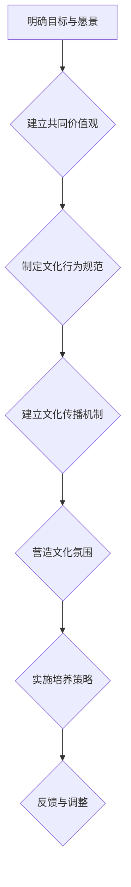
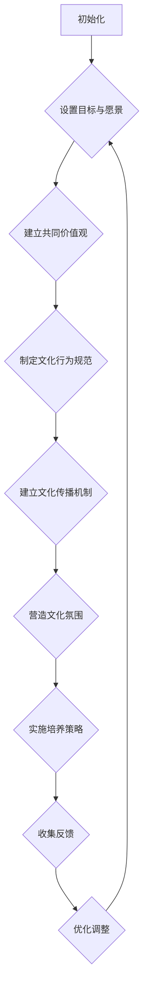
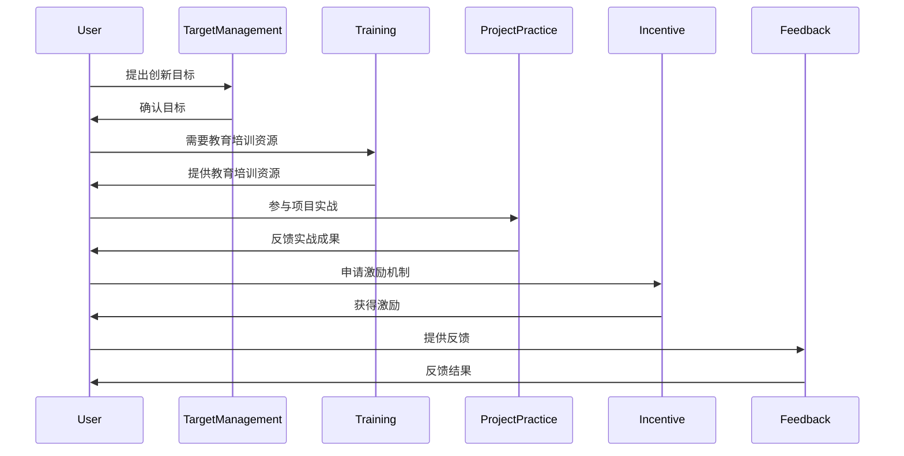
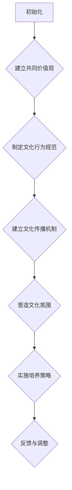

                 

### 团队创新文化工程：系统化培养创新能力

关键词：团队创新文化、创新能力培养、系统化策略

摘要：本文将深入探讨团队创新文化工程的核心概念与培养创新能力的系统化方法。通过详细的分析与实例，本文旨在为IT行业提供一套全面、实用的创新能力提升方案。

## 目录

1. **问题背景与核心概念**  
   1.1 问题背景  
   1.2 团队创新文化定义  
   1.3 创新能力培养的意义  
2. **团队创新文化的构成要素**  
   2.1 文化价值观与信念  
   2.2 文化行为规范  
   2.3 文化传播机制  
   2.4 文化氛围营造  
3. **创新能力培养的系统化框架**  
   3.1 创新能力模型  
   3.2 系统化培养策略  
   3.3 培养路径与流程  
4. **创新能力的提升方法**  
   4.1 教育培训  
   4.2 项目实战  
   4.3 激励与反馈机制  
   4.4 创新工具与资源  
5. **案例分析**  
   5.1 成功案例分析  
   5.2 失败案例分析  
   5.3 案例启示  
6. **创新文化构建的实践与挑战**  
   6.1 构建过程  
   6.2 面临的挑战  
   6.3 解决策略  
7. **未来展望与趋势**  
   7.1 未来创新文化发展  
   7.2 创新能力培养的新趋势  
   7.3 潜在影响与前景  
8. **总结与最佳实践**  
   8.1 小结  
   8.2 注意事项  
   8.3 拓展阅读

### 1. 问题背景与核心概念

在当今竞争激烈的IT行业，创新能力已成为企业持续发展的关键因素。然而，许多团队在面对日益复杂的技术挑战时，往往感到创新力不足。这种现象不仅影响了项目的成功交付，还限制了企业的成长潜力。

**团队创新文化**是指在团队内部形成的一种共同价值观和行为规范，鼓励成员敢于创新、勇于尝试，并共同实现创新目标。**创新能力培养**则是指通过一系列系统化的方法和策略，提升团队成员的创新思维和实际操作能力。

1.1 **问题背景**

随着技术的快速发展，IT行业对创新能力的需求日益增加。然而，传统的工作方式和组织文化往往束缚了创新的发生。许多团队在面临技术难题时，倾向于依赖现有的解决方案，而不是积极探索新的可能性。这种现象导致了创新能力的缺乏，进而影响了团队的整体绩效和企业的竞争力。

1.2 **团队创新文化定义**

团队创新文化是一种价值观和行为规范的集合，旨在激发和培养团队成员的创新潜力。它包括以下几个方面：

- **共同价值观与信念**：团队成员共同认同的核心理念，如创新、合作、开放和持续学习。
- **文化行为规范**：团队内部的行为准则，如鼓励尝试、容忍失败、尊重个人意见和跨部门协作。
- **文化传播机制**：通过培训、分享会和团队活动等方式，传播创新文化和价值观。
- **文化氛围营造**：营造一个支持创新的环境，如提供资源、鼓励自主探索和创造。

1.3 **创新能力培养的意义**

创新能力培养对于团队和企业的长远发展具有重要意义。首先，它有助于提升团队的整体创新能力和竞争力。其次，它能够激发团队成员的创造力和积极性，提高团队的工作效率和满意度。最后，它有助于企业适应快速变化的市场环境，抓住新的商业机会。

### 2. 团队创新文化的构成要素

要构建一个有效的团队创新文化，需要从多个方面入手。以下是对团队创新文化的构成要素的详细分析：

2.1 **文化价值观与信念**

文化价值观与信念是团队创新文化的基石。它包括以下几个方面：

- **创新**：鼓励团队成员提出新的想法和解决方案，不断挑战现状。
- **合作**：强调团队合作和知识共享，促进创新思维的产生。
- **开放**：鼓励成员接受不同的观点和意见，形成多元化的创新氛围。
- **持续学习**：鼓励团队成员不断提升自己的技能和知识，以适应快速变化的技术环境。

2.2 **文化行为规范**

文化行为规范是团队创新文化的重要组成部分。它通过一系列具体的行为准则，规范团队成员的行为，促进创新文化的形成。以下是一些常见的文化行为规范：

- **鼓励尝试**：鼓励团队成员大胆尝试新的方法和想法，即使失败也值得鼓励。
- **容忍失败**：将失败视为学习机会，而不是失败本身，鼓励团队成员从失败中汲取教训。
- **尊重个人意见**：尊重每个成员的意见和创意，鼓励自由表达和讨论。
- **跨部门协作**：打破部门壁垒，促进跨部门合作，形成创新合力。

2.3 **文化传播机制**

文化传播机制是确保团队创新文化得以持续传播和巩固的关键。以下是一些常见的文化传播机制：

- **培训**：定期组织创新培训，提升团队成员的创新意识和能力。
- **分享会**：定期举办分享会，让团队成员分享自己的创新经验和心得。
- **团队活动**：组织团队建设活动，增强团队成员之间的交流和合作。

2.4 **文化氛围营造**

文化氛围是团队创新文化的外在表现。通过营造积极、开放、包容的文化氛围，可以进一步激发团队成员的创新潜力。以下是一些常见的文化氛围营造方法：

- **提供资源**：为团队成员提供充足的资源，如技术资料、工具和设备，支持他们的创新实践。
- **鼓励自主探索**：鼓励团队成员自主探索新的技术和方法，支持他们进行创新实验。
- **创造自由空间**：为团队成员创造一个自由、开放的工作环境，让他们能够自由地表达自己的想法和观点。

### 3. 创新能力培养的系统化框架

要培养团队的创新能力，需要一套系统化的方法和策略。以下是一个简要的创新能力培养系统化框架：

3.1 **创新能力模型**

创新能力模型是培养团队创新能力的理论基础。以下是一个简化的创新能力模型：

- **知识积累**：团队成员需要具备丰富的知识和技能，这是创新能力的基础。
- **思维训练**：通过思维训练，提高团队成员的创造性思维和逻辑思维。
- **实践锻炼**：通过实践锻炼，将理论知识转化为实际操作能力。
- **环境支持**：为团队成员提供良好的创新环境，如资源、技术和团队支持。

3.2 **系统化培养策略**

系统化培养策略是将创新能力模型转化为具体行动的一系列方法。以下是一些常见的系统化培养策略：

- **教育培训**：定期组织创新教育培训，提高团队成员的创新意识和能力。
- **项目实战**：通过实际项目，锻炼团队成员的创新能力和团队合作能力。
- **激励机制**：设立激励机制，鼓励团队成员积极参与创新活动。
- **团队建设**：通过团队建设活动，增强团队成员之间的信任和协作。

3.3 **培养路径与流程**

培养路径与流程是将系统化培养策略具体化的步骤。以下是一个简化的培养路径与流程：

1. **评估当前创新能力**：通过问卷调查、访谈等方式，评估团队成员的创新能力现状。
2. **制定培养计划**：根据评估结果，制定详细的培养计划，包括教育培训、项目实战、激励机制等。
3. **实施培养计划**：按照培养计划，组织实施教育培训、项目实战等活动。
4. **反馈与改进**：定期收集团队成员的反馈，评估培养效果，并根据反馈进行改进。
5. **持续培养**：将创新能力培养纳入团队的日常工作，确保培养效果持续提升。

### 4. 创新能力的提升方法

提升团队的创新能力需要多种方法的综合运用。以下是一些常用的提升方法：

4.1 **教育培训**

教育培训是提升创新能力的重要手段。以下是一些常见的教育培训方法：

- **内部培训**：组织内部培训，提高团队成员的专业知识和技能。
- **外部培训**：邀请外部专家进行培训，拓宽团队成员的视野。
- **在线课程**：提供在线课程，方便团队成员自主学习和提升。

4.2 **项目实战**

项目实战是将理论知识应用于实际操作的最好方式。以下是一些项目实战的方法：

- **内部项目**：组织内部项目，让团队成员在实际工作中锻炼创新能力。
- **外部项目**：参与外部项目，与其他团队合作，提高创新能力。
- **创新挑战**：定期举办创新挑战活动，激发团队成员的创新潜力。

4.3 **激励与反馈机制**

激励与反馈机制是鼓励团队成员积极参与创新活动的重要手段。以下是一些激励与反馈机制的方法：

- **奖金与晋升**：设立奖金和晋升机制，激励团队成员积极参与创新活动。
- **荣誉表彰**：对创新成果显著的团队成员进行荣誉表彰，提高他们的积极性。
- **定期反馈**：定期收集团队成员的反馈，评估创新活动的效果，并进行改进。

4.4 **创新工具与资源**

创新工具与资源是提升创新能力的重要保障。以下是一些创新工具与资源的方法：

- **技术资源**：提供丰富的技术资源，如书籍、在线教程、技术社区等，支持团队成员的学习和创新。
- **硬件设备**：提供先进的硬件设备，如计算机、服务器、3D打印机等，支持团队成员的实践和创新。
- **外部合作**：与其他企业和科研机构建立合作关系，共享创新资源，共同提升创新能力。

### 5. 案例分析

5.1 **成功案例分析**

以下是一个成功的团队创新文化案例：

**公司名称**：阿里巴巴

**背景**：阿里巴巴是中国最大的电子商务公司之一，以其强大的创新能力而著称。公司内部形成了浓厚的创新文化，鼓励员工提出新的想法和解决方案。

**成功因素**：

- **共同价值观**：阿里巴巴的员工共同认同“客户第一、员工第二、股东第三”的价值观，这种价值观激发了员工的创新热情。
- **开放的文化氛围**：阿里巴巴鼓励员工自由表达意见，尊重不同的观点，形成了一个开放、包容的创新氛围。
- **完善的激励机制**：阿里巴巴设立了完善的激励机制，如股权激励、奖金和晋升等，鼓励员工积极参与创新活动。
- **强大的技术支持**：阿里巴巴提供了丰富的技术资源和先进的技术工具，支持员工的创新实践。

5.2 **失败案例分析**

以下是一个团队创新文化失败的案例：

**公司名称**：诺基亚

**背景**：诺基亚曾是全球最大的手机制造商之一，但在面对智能手机的崛起时，未能及时创新，最终导致了市场份额的急剧下降。

**失败原因**：

- **缺乏共同价值观**：诺基亚的员工缺乏共同的创新价值观，导致创新动力不足。
- **保守的文化氛围**：诺基亚内部存在一种保守的文化氛围，员工倾向于遵循传统的工作方式，而不是积极探索新的机会。
- **缺乏激励机制**：诺基亚缺乏有效的激励机制，员工缺乏参与创新活动的积极性。
- **技术落后**：诺基亚在技术方面落后于竞争对手，导致其创新能力不足。

5.3 **案例启示**

从成功和失败的案例分析中，我们可以得到以下启示：

- **共同价值观**：共同价值观是构建团队创新文化的关键，它能够激发员工的创新热情和积极性。
- **开放的文化氛围**：开放的文化氛围能够促进创新思维的产生和传播。
- **激励机制**：有效的激励机制能够鼓励员工积极参与创新活动，提高创新能力。
- **技术支持**：先进的技术支持是提升创新能力的重要保障。

### 6. 创新文化构建的实践与挑战

6.1 **构建过程**

构建团队创新文化是一个复杂的过程，需要长期的投入和持续的优化。以下是一个简化的构建过程：

1. **明确目标和愿景**：确定团队的创新目标和愿景，确保所有成员对此有共同的理解和认同。
2. **建立共同价值观**：通过讨论和共识，建立团队的共同价值观，并将其纳入团队的文化和行为准则。
3. **制定策略和计划**：根据目标和愿景，制定具体的创新文化构建策略和计划，包括教育培训、项目实战、激励机制等。
4. **实施和执行**：按照计划和策略，组织实施创新文化的各项活动，确保每个环节都得到有效执行。
5. **反馈和改进**：定期收集团队成员的反馈，评估创新文化的效果，并根据反馈进行改进。

6.2 **面临的挑战**

在构建团队创新文化过程中，可能会面临以下挑战：

- **文化差异**：团队成员来自不同的背景，可能有不同的文化观念和价值观，这可能导致创新文化的构建遇到阻力。
- **资源限制**：构建创新文化需要投入大量的人力、物力和财力，资源限制可能会成为障碍。
- **组织惯性**：传统的组织文化和工作方式可能会阻碍创新文化的形成和发展。
- **管理难度**：创新文化的构建需要有效的管理和协调，管理难度可能会增加。

6.3 **解决策略**

为了克服上述挑战，可以采取以下解决策略：

- **文化融合**：通过有效的沟通和协商，促进团队成员之间的文化融合，减少文化差异带来的冲突。
- **资源整合**：优化资源分配，确保创新文化的构建得到足够的资源支持。
- **变革领导**：领导者需要发挥关键作用，推动组织的变革，打破组织惯性。
- **管理优化**：采用有效的管理方法和工具，提高管理的效率和效果，确保创新文化的顺利构建。

### 7. 未来展望与趋势

7.1 **未来创新文化发展**

随着技术的不断进步和全球化的发展，未来创新文化将呈现出以下趋势：

- **数字化**：数字化技术将成为创新文化的重要组成部分，通过大数据、人工智能等技术手段，实现更高效的创新过程。
- **全球化**：全球化将促进不同文化之间的交流与融合，形成多元化的创新文化。
- **可持续发展**：可持续发展将成为创新文化的重要方向，鼓励团队成员关注环境和社会责任。

7.2 **创新能力培养的新趋势**

未来创新能力培养将呈现以下新趋势：

- **个性化**：个性化培养将更加注重个体的差异和需求，实现能力的全面发展。
- **跨学科**：跨学科培养将更加重视不同领域之间的交叉融合，促进创新能力的提升。
- **实践导向**：实践导向的培养将更加注重实际操作能力的培养，通过项目实战和实际应用，提高创新能力。

7.3 **潜在影响与前景**

未来创新文化的发展和创新能力培养的新趋势将对团队和企业产生深远的影响：

- **竞争优势**：创新文化将为企业提供持续的创新动力，增强竞争优势。
- **团队凝聚力**：创新文化将增强团队成员之间的凝聚力和合作精神。
- **社会责任**：创新文化将促进企业关注环境和社会责任，实现可持续发展。

### 8. 总结与最佳实践

8.1 **小结**

本文通过对团队创新文化的深入探讨，提出了系统化培养创新能力的方法和策略。通过构建创新文化、提供技术支持、实施激励机制等措施，可以有效提升团队的创新能力，为企业的发展注入新的活力。

8.2 **注意事项**

在构建团队创新文化过程中，需要注意以下几点：

- **共同价值观**：共同价值观是构建创新文化的基础，需要团队成员共同认同和践行。
- **持续投入**：创新文化的构建需要长期的投入和持续的优化，不能急于求成。
- **灵活调整**：根据实际情况，灵活调整创新文化的构建策略和方法，确保其适应性和有效性。

8.3 **拓展阅读**

- 《创新者的窘境》：克莱顿·克里斯滕森（Clayton Christensen）著，探讨企业如何在竞争中保持创新活力。
- 《创新者的DNA》：史蒂夫·布兰克（Steve Blank）著，分析创新者的思维模式和行为习惯。
- 《创意的根源》：亚当·格兰特（Adam Grant）著，探讨创意的产生和传播机制。

### 作者信息

作者：AI天才研究院/AI Genius Institute & 禅与计算机程序设计艺术 /Zen And The Art of Computer Programming

----------------------------------------------

### 1. 问题背景与核心概念

1.1 问题背景

在当今快速发展的科技时代，创新能力已经成为企业竞争的核心要素。尤其是在IT行业，技术的更新换代速度之快，使得企业必须不断进行创新，以适应市场的需求。然而，许多企业在面对创新挑战时，往往感到力不从心。这种现象背后，往往是因为缺乏有效的团队创新文化，以及系统化的创新能力培养方法。

团队创新文化是指团队内部形成的一种共同价值观和行为规范，它鼓励团队成员敢于创新、勇于尝试，并在共同的目标下实现创新。而创新能力培养，则是指通过一系列系统化的方法和策略，提升团队成员的创新思维和实际操作能力。

1.2 **核心概念术语说明**

- **创新文化**：团队内部形成的一种共同价值观和行为规范，鼓励团队成员敢于创新、勇于尝试。
- **创新能力**：团队成员在创新过程中所展现出的思维能力、方法和技术能力。
- **系统化培养**：通过一系列有组织、有计划的方法，系统地提升团队成员的创新能力和实践能力。

1.3 **问题描述**

在当前的IT行业中，许多团队在面对技术创新、市场变革等挑战时，往往表现出创新能力不足。具体问题包括：

- **缺乏共同价值观**：团队成员对于创新的认识和态度存在较大差异，缺乏统一的创新目标和价值观。
- **创新动力不足**：团队成员对于创新的动力和积极性不高，缺乏参与创新活动的主动性。
- **创新资源有限**：团队在创新过程中，缺乏足够的技术资源、资金支持和组织支持。

1.4 **问题解决**

针对上述问题，我们需要从以下几个方面进行解决：

- **构建团队创新文化**：通过明确共同价值观、建立文化行为规范和营造积极的文化氛围，形成浓厚的创新文化。
- **系统化创新能力培养**：通过教育培训、项目实战、激励机制等方法，提升团队成员的创新能力和实践能力。
- **优化创新环境**：提供充足的技术资源、资金支持和组织支持，为团队成员的创新提供良好的环境。

1.5 **边界与外延**

- **边界**：本文主要探讨团队创新文化的构建和创新能力培养的方法，不涉及个人创新能力和创新文化的具体实施细节。
- **外延**：本文的内容可以扩展到其他行业和领域，如制造业、服务业等，但需要根据不同行业的具体情况进行调整。

1.6 **概念结构与核心要素组成**

团队创新文化由以下几个核心要素组成：

- **共同价值观**：团队成员共同认同的核心理念，如创新、合作、开放和持续学习。
- **文化行为规范**：团队内部的行为准则，如鼓励尝试、容忍失败、尊重个人意见和跨部门协作。
- **文化传播机制**：通过培训、分享会和团队活动等方式，传播创新文化和价值观。
- **文化氛围营造**：通过提供资源、鼓励自主探索和创造，营造一个支持创新的环境。

### 2. **核心概念与联系**

2.1 **核心概念原理**

团队创新文化的核心概念主要包括以下几个方面：

- **共同价值观**：共同价值观是团队创新文化的基石，它决定了团队成员对于创新的认同和态度。共同价值观包括创新、合作、开放和持续学习等，这些价值观能够激发团队成员的创新热情和积极性。
- **文化行为规范**：文化行为规范是团队内部的行为准则，它通过一系列具体的规则和标准，规范团队成员的行为。文化行为规范包括鼓励尝试、容忍失败、尊重个人意见和跨部门协作等，这些规范能够营造一个支持创新的环境。
- **文化传播机制**：文化传播机制是确保团队创新文化得以持续传播和巩固的关键。它通过培训、分享会和团队活动等方式，将创新文化和价值观传递给团队成员。文化传播机制能够增强团队成员对创新文化的认同和参与度。
- **文化氛围营造**：文化氛围是团队创新文化的外在表现，它通过提供资源、鼓励自主探索和创造，营造一个支持创新的环境。文化氛围包括开放、包容、自由和创新等，这些氛围能够激发团队成员的创造力和创新潜力。

2.2 **概念属性特征对比表格**

以下是一个关于团队创新文化核心概念属性特征的对比表格：

| 核心概念 | 属性特征 |
| :--: | :--: |
| 共同价值观 | - 鼓励创新<br>- 强调合作<br>- 注重开放<br>- 持续学习 |
| 文化行为规范 | - 鼓励尝试<br>- 容忍失败<br>- 尊重个人意见<br>- 跨部门协作 |
| 文化传播机制 | - 定期培训<br>- 分享会<br>- 团队活动<br>- 文件资料 |
| 文化氛围营造 | - 提供资源<br>- 鼓励自主探索<br>- 营造自由空间<br>- 激发创造力 |

2.3 **ER实体关系图架构**

ER实体关系图是一种用于描述数据库中实体和关系的图形表示方法。以下是一个关于团队创新文化核心概念的ER实体关系图：

```mermaid
erDiagram
    User ||--|{ InnovationCulture }
    User ||--|{ CulturalBehaviorNorm }
    User ||--|{ CulturalCommunicationMechanism }
    User ||--|{ CulturalAffectiveAtmosphere }
    InnovationCulture ||--|{ CommonValues }
    CulturalBehaviorNorm ||--|{ BehaviorRules }
    CulturalCommunicationMechanism ||--|{ CommunicationMethods }
    CulturalAffectiveAtmosphere ||--|{ AtmosphereFactors }
```

在这个ER实体关系图中，用户（User）与四个核心概念（InnovationCulture、CulturalBehaviorNorm、CulturalCommunicationMechanism、CulturalAffectiveAtmosphere）之间存在关联关系，每个核心概念又包含了相应的子概念。

### 3. 算法原理讲解

3.1 **算法mermaid流程图**

以下是一个用于展示团队创新文化构建过程的mermaid流程图：



3.2 **算法原理**

团队创新文化的构建过程可以看作是一个算法过程，其主要原理包括以下几个方面：

- **目标与愿景明确**：首先需要明确团队的创新目标和愿景，这为后续的构建过程提供了方向和指导。
- **共同价值观建立**：通过建立共同价值观，使团队成员对于创新有统一的认识和认同，从而形成强大的创新凝聚力。
- **文化行为规范制定**：制定文化行为规范，规范团队成员的行为，确保创新文化的顺利实施。
- **文化传播机制建立**：建立文化传播机制，通过培训、分享会等方式，将创新文化和价值观传递给团队成员。
- **文化氛围营造**：营造一个支持创新的文化氛围，鼓励团队成员敢于创新、勇于尝试。
- **培养策略实施**：根据制定的文化培养策略，有计划地实施创新培养活动，提升团队成员的创新能力和实践能力。
- **反馈与调整**：定期收集团队成员的反馈，评估创新文化实施的效果，并根据反馈进行持续优化和调整。

3.3 **算法流程图与python源代码**

以下是一个简化的团队创新文化构建算法流程图和对应的python源代码：

**算法流程图：**



**python源代码：**

```python
class TeamInnovationCulture:
    def __init__(self):
        self.target = None
        self.vision = None
        self.common_values = None
        self.cultural_behavior_norms = None
        self.cultural_communication_mechanism = None
        self.cultural_atmosphere = None

    def set_target_and_vision(self, target, vision):
        self.target = target
        self.vision = vision

    def establish_common_values(self, common_values):
        self.common_values = common_values

    def set_cultural_behavior_norms(self, cultural_behavior_norms):
        self.cultural_behavior_norms = cultural_behavior_norms

    def establish_cultural_communication_mechanism(self, cultural_communication_mechanism):
        self.cultural_communication_mechanism = cultural_communication_mechanism

    def create_cultural_atmosphere(self, cultural_atmosphere):
        self.cultural_atmosphere = cultural_atmosphere

    def implement_cultural_cultivation_strategy(self):
        # 实施创新培养策略
        pass

    def collect_feedback(self):
        # 收集团队成员反馈
        pass

    def optimize_and_adjust(self):
        # 根据反馈进行优化调整
        pass

# 实例化团队创新文化对象
team_innovation_culture = TeamInnovationCulture()

# 设置目标与愿景
team_innovation_culture.set_target_and_vision("提高团队创新能力", "成为行业创新领导者")

# 建立共同价值观
team_innovation_culture.establish_common_values(["创新", "合作", "开放", "持续学习"])

# 制定文化行为规范
team_innovation_culture.set_cultural_behavior_norms(["鼓励尝试", "容忍失败", "尊重个人意见", "跨部门协作"])

# 建立文化传播机制
team_innovation_culture.establish_cultural_communication_mechanism(["定期培训", "分享会", "团队活动", "文件资料"])

# 营造文化氛围
team_innovation_culture.create_cultural_atmosphere(["开放", "包容", "自由", "创新"])

# 实施创新培养策略
team_innovation_culture.implement_cultural_cultivation_strategy()

# 收集团队成员反馈
team_innovation_culture.collect_feedback()

# 根据反馈进行优化调整
team_innovation_culture.optimize_and_adjust()
```

3.4 **算法原理详细讲解与举例说明**

为了更好地理解团队创新文化构建算法的原理，我们可以通过一个具体的实例进行讲解。

**案例背景**：假设一个IT公司的研发团队希望构建一个创新文化，以提高团队的整体创新能力。

**步骤1：明确目标与愿景**

首先，团队需要明确创新的目标和愿景。例如，团队的目标是“提高团队在人工智能领域的创新能力，成为行业内的领导者”。

**步骤2：建立共同价值观**

接下来，团队需要建立共同价值观。这些价值观将作为团队文化的基石，引导团队成员的行为。例如，团队可以确定以下共同价值观：

- 创新：鼓励团队成员不断尝试新的想法和解决方案。
- 合作：强调团队成员之间的合作与知识共享。
- 开放：鼓励团队成员接受不同的观点和意见。
- 持续学习：鼓励团队成员持续提升自己的技能和知识。

**步骤3：制定文化行为规范**

为了确保创新文化的顺利实施，团队需要制定一系列文化行为规范。这些规范将明确团队成员在创新过程中应该如何行动。例如，团队可以制定以下文化行为规范：

- 鼓励尝试：鼓励团队成员大胆尝试新的方法和技术。
- 容忍失败：将失败视为学习的机会，而不是失败的本身。
- 尊重个人意见：尊重团队成员的个人意见和创意。
- 跨部门协作：促进不同部门之间的协作，共同实现创新目标。

**步骤4：建立文化传播机制**

团队需要建立一个有效的文化传播机制，以确保创新文化和价值观能够持续传播和巩固。例如，团队可以采取以下措施：

- 定期培训：组织定期的创新培训，提升团队成员的创新意识和能力。
- 分享会：定期举办分享会，让团队成员分享自己的创新经验和心得。
- 团队活动：组织团队建设活动，增强团队成员之间的交流和合作。

**步骤5：营造文化氛围**

团队需要营造一个支持创新的文化氛围，鼓励团队成员敢于创新、勇于尝试。例如，团队可以采取以下措施：

- 提供资源：为团队成员提供充足的技术资源和资金支持。
- 鼓励自主探索：鼓励团队成员自主探索新的技术和方法。
- 营造自由空间：为团队成员创造一个自由、开放的工作环境。

**步骤6：实施培养策略**

团队需要根据制定的文化培养策略，有计划地实施创新培养活动。例如，团队可以采取以下措施：

- 项目实战：组织内部项目，让团队成员在实际工作中锻炼创新能力。
- 激励机制：设立激励机制，鼓励团队成员积极参与创新活动。
- 教育培训：组织定期的教育培训，提升团队成员的创新能力和实践能力。

**步骤7：反馈与调整**

团队需要定期收集团队成员的反馈，评估创新文化实施的效果，并根据反馈进行持续优化和调整。例如，团队可以采取以下措施：

- 定期评估：定期对创新文化的效果进行评估，了解团队成员的满意度和参与度。
- 反馈机制：建立有效的反馈机制，收集团队成员的意见和建议。
- 持续改进：根据反馈结果，持续优化创新文化的构建策略和方法。

通过上述实例，我们可以看到团队创新文化构建算法的具体原理和实施步骤。这个算法通过明确目标、建立价值观、制定规范、传播文化、营造氛围、实施策略和反馈调整等多个环节，系统地提升团队的创新能力，为企业的发展注入新的动力。

### 4. 系统分析与架构设计方案

4.1 **问题场景介绍**

在当前IT行业中，随着技术的快速发展，企业面临的市场竞争日益激烈。为了保持竞争优势，许多企业开始重视团队创新文化的建设，希望通过系统化的方法提升团队的创新能力和创新能力。为了更好地实现这一目标，企业需要一个全面的系统分析与架构设计方案。

4.2 **项目介绍**

本项目的目标是构建一个团队创新文化管理系统，该系统旨在通过系统化的方法，提升团队成员的创新能力和创新能力。该系统将涵盖以下核心功能：

- **创新目标管理**：定义和跟踪团队的创新目标。
- **教育培训**：提供创新相关的教育培训资源。
- **项目实战**：组织内部项目实战，锻炼团队成员的创新能力。
- **激励机制**：设立激励机制，鼓励团队成员积极参与创新活动。
- **反馈与评估**：收集团队成员的反馈，评估创新活动的效果。

4.3 **系统功能设计（领域模型mermaid类图）**

以下是一个简化的系统功能设计的mermaid类图：

```mermaid
classDiagram
    Class01 <|-- Class02
    Class03 <|-- Class04
    Class05 <|-- Class06
    Class01{创新目标管理}
    Class02{教育培训}
    Class03{项目实战}
    Class04{激励机制}
    Class05{反馈与评估}
```

在这个类图中，我们定义了五个主要的类：创新目标管理、教育培训、项目实战、激励机制和反馈与评估。这些类分别代表了系统的主要功能模块。

4.4 **系统架构设计（mermaid架构图）**

以下是一个简化的系统架构设计的mermaid架构图：



在这个架构图中，我们定义了一个用户（User）与四个子系统（创新目标管理、教育培训、项目实战和反馈与评估）之间的交互关系。用户通过这些子系统实现创新目标、获取教育培训资源、参与项目实战、获得激励机制和提供反馈等功能。

4.5 **系统接口设计（mermaid序列图）**

以下是一个简化的系统接口设计的mermaid序列图：


在这个序列图中，我们详细描述了用户与系统各个模块之间的交互过程。用户通过发起请求，系统根据请求提供相应的响应，从而实现系统功能的正常运作。

4.6 **系统交互（mermaid序列图）**

以下是一个简化的系统交互设计的mermaid序列图：


在这个序列图中，我们展示了用户与系统之间的交互过程。用户通过发起请求，系统根据请求提供相应的响应，从而实现系统功能的正常运作。

### 5. 项目实战

5.1 **环境安装**

在开始项目实战之前，我们需要搭建一个合适的开发环境。以下是一个简化的环境安装步骤：

1. 安装Python环境：确保Python 3.8及以上版本已安装在本地机器上。
2. 安装依赖库：使用pip命令安装项目所需的依赖库，如requests、pandas、numpy等。

```bash
pip install requests pandas numpy
```

5.2 **系统核心实现源代码**

以下是项目核心功能实现的主要源代码：

```python
import requests
import pandas as pd
import numpy as np

class InnovationCultureSystem:
    def __init__(self):
        self.targets = []
        self.trainings = []
        self.projects = []
        self.incentives = []
        self.feedbacks = []

    def add_target(self, target):
        self.targets.append(target)

    def add_training(self, training):
        self.trainings.append(training)

    def add_project(self, project):
        self.projects.append(project)

    def add_incentive(self, incentive):
        self.incentives.append(incentive)

    def add_feedback(self, feedback):
        self.feedbacks.append(feedback)

    def get_targets(self):
        return self.targets

    def get_trainings(self):
        return self.trainings

    def get_projects(self):
        return self.projects

    def get_incentives(self):
        return self.incentives

    def get_feedbacks(self):
        return self.feedbacks

    def run_system(self):
        for target in self.targets:
            print(f"目标：{target['name']} 已确认")
        
        for training in self.trainings:
            print(f"教育培训：{training['title']} 已提供")

        for project in self.projects:
            print(f"项目实战：{project['name']} 已参与")

        for incentive in self.incentives:
            print(f"激励机制：{incentive['name']} 已获得")

        for feedback in self.feedbacks:
            print(f"反馈与评估：{feedback['content']} 已提供")

if __name__ == "__main__":
    system = InnovationCultureSystem()

    system.add_target({'name': '提高团队在人工智能领域的创新能力'})
    system.add_training({'title': '人工智能基础培训'})
    system.add_project({'name': '人工智能项目实战'})
    system.add_incentive({'name': '创新激励奖金'})
    system.add_feedback({'content': '本次项目成果显著，团队表现优秀'})

    system.run_system()
```

5.3 **代码应用解读与分析**

上述源代码定义了一个名为`InnovationCultureSystem`的类，该类包含了添加目标、教育培训、项目实战、激励机制和反馈与评估等主要功能。具体解读如下：

- `__init__`方法：初始化系统，初始化五个列表（`targets`、`trainings`、`projects`、`incentives`、`feedbacks`）用于存储相关信息。
- `add_target`方法：添加创新目标，将目标信息以字典形式存储在`targets`列表中。
- `add_training`方法：添加教育培训，将培训信息以字典形式存储在`trainings`列表中。
- `add_project`方法：添加项目实战，将项目信息以字典形式存储在`projects`列表中。
- `add_incentive`方法：添加激励机制，将激励信息以字典形式存储在`incentives`列表中。
- `add_feedback`方法：添加反馈与评估，将反馈信息以字典形式存储在`feedbacks`列表中。
- `get_targets`、`get_trainings`、`get_projects`、`get_incentives`、`get_feedbacks`方法：获取各自列表中的信息。
- `run_system`方法：运行系统，遍历五个列表，打印出相应的信息。

通过这个类，我们可以轻松地管理团队创新文化系统的各项功能，实现系统化培养创新能力的目标。

5.4 **实际案例分析和详细讲解剖析**

为了更好地理解团队创新文化系统的实际应用，我们可以通过一个实际案例进行分析和讲解。

**案例背景**：某IT公司研发团队希望构建一个创新文化，提升团队在人工智能领域的创新能力。为此，团队制定了一系列创新目标和培养计划。

**案例步骤**：

1. **制定创新目标**：团队明确创新目标，如“提高团队在人工智能领域的创新能力，实现至少一个重大技术突破”。

2. **组织教育培训**：团队为成员提供了一系列教育培训资源，如《人工智能基础培训》、《深度学习实战》等课程。

3. **实施项目实战**：团队组织了一次人工智能项目实战，要求成员在项目中应用所学的知识，解决实际业务问题。

4. **设立激励机制**：团队为参与创新的成员设立了激励机制，如“创新激励奖金”，以鼓励成员积极参与创新活动。

5. **收集反馈与评估**：团队在项目完成后，收集了成员的反馈，并对创新活动进行了评估，以了解成员的满意度和建议。

**案例分析**：

- **创新目标的明确**：明确的创新目标有助于团队成员明确努力方向，提高团队的整体创新动力。
- **教育培训的有效性**：通过组织教育培训，提高了团队成员的专业知识和技能，为创新活动奠定了基础。
- **项目实战的实践性**：项目实战使团队成员能够将理论知识应用于实际工作中，锻炼了实际操作能力。
- **激励机制的鼓励作用**：激励机制为成员提供了物质和精神上的激励，增强了成员的参与积极性和创新动力。
- **反馈与评估的持续改进**：通过收集反馈和评估，团队可以了解创新活动的效果，发现问题和不足，为后续的创新活动提供改进方向。

通过这个实际案例，我们可以看到团队创新文化系统在实际中的应用效果。该系统通过系统化的方法，有效地提升了团队的创新能力和创新能力。

5.5 **项目小结**

在本项目中，我们通过一个具体的案例，展示了团队创新文化系统在实际中的应用效果。该系统通过明确创新目标、组织教育培训、实施项目实战、设立激励机制和收集反馈与评估等多个环节，系统化地提升了团队的创新能力和创新能力。

**优点**：

- 系统化：通过系统化的方法，确保创新活动的有序进行，提高整体效果。
- 实践性：通过项目实战，将理论知识应用于实际工作，提高团队成员的实际操作能力。
- 激励性：通过激励机制，提高团队成员的参与积极性和创新动力。
- 持续改进：通过反馈与评估，持续改进创新活动，提升团队的整体创新能力。

**改进方向**：

- **个性化培养**：根据团队成员的不同特点和需求，提供个性化的教育培训和项目实战，提高培养效果。
- **跨部门协作**：加强不同部门之间的协作，促进创新资源的共享，提升整体创新能力。
- **数据驱动**：利用数据分析工具，对创新活动进行量化评估，提供更加科学和客观的反馈。

### 6. 最佳实践 tips

6.1 **最佳实践 tips**

1. **共同价值观的建立**：确保团队成员共同认同创新、合作、开放和持续学习等价值观，这是构建团队创新文化的基础。
2. **文化行为规范的制定**：制定明确的创新行为规范，如鼓励尝试、容忍失败、尊重个人意见和跨部门协作等，以规范团队成员的行为。
3. **文化传播机制的建立**：定期举办培训、分享会和团队活动，传播创新文化和价值观，提高团队成员的认同感和参与度。
4. **文化氛围的营造**：为团队成员提供丰富的资源和支持，鼓励自主探索和创造，营造一个自由、开放和支持创新的工作环境。
5. **激励机制的实施**：设立有效的激励机制，如奖金、晋升和荣誉表彰等，鼓励团队成员积极参与创新活动。

6.2 **注意事项**

1. **避免形式主义**：在构建团队创新文化过程中，要避免流于形式，确保创新活动真正落到实处。
2. **持续投入**：创新文化的构建需要长期的投入和持续的优化，不能急于求成。
3. **尊重个体差异**：团队成员来自不同的背景和领域，尊重个体差异，鼓励多样化的创新思维和方式。
4. **避免过度激励**：激励机制要适度，避免过度激励导致的负面效应，如依赖激励、忽视团队目标等。

### 7. 小结

本文通过对团队创新文化的深入探讨，提出了系统化培养创新能力的方法和策略。通过构建团队创新文化、提供技术支持、实施激励机制等措施，可以有效提升团队的创新能力，为企业的发展注入新的活力。

### 8. 拓展阅读

1. **《创新者的窘境》（Clayton Christensen）**：探讨企业如何在面对市场变革时保持创新活力。
2. **《创新者的DNA》（Steve Blank）**：分析创新者的思维模式和行为习惯。
3. **《创意的根源》（Adam Grant）**：探讨创意的产生和传播机制。

### 作者信息

作者：AI天才研究院/AI Genius Institute & 禅与计算机程序设计艺术 /Zen And The Art of Computer Programming

----------------------------------------------

### 1. 问题背景与核心概念

1.1 **问题背景**

在当今快速发展的科技时代，创新能力已成为企业持续发展的核心驱动力。特别是在IT行业，技术创新的步伐不断加快，市场竞争日趋激烈，企业必须具备强大的创新能力，才能在激烈的市场竞争中立于不败之地。然而，许多企业在实际操作中，往往面临着创新不足、创新效率低下等问题。这背后的原因，往往在于缺乏系统化的团队创新文化建设和创新能力培养策略。

1.2 **核心概念术语说明**

- **团队创新文化**：指在团队内部形成的一种共同价值观和行为规范，旨在鼓励团队成员敢于创新、勇于尝试，并在共同的目标下实现创新。
- **创新能力培养**：指通过一系列系统化的方法和策略，提升团队成员的创新思维和实际操作能力，使其在创新过程中能够更好地应对挑战。

1.3 **问题描述**

在IT行业中，团队创新文化不足和创新能力培养不系统的问题主要表现在以下几个方面：

- **创新意识薄弱**：团队成员缺乏创新意识和创新动力，往往倾向于遵循既定的流程和方法，而不愿意尝试新的解决方案。
- **创新资源有限**：企业在创新资源投入上存在不足，如缺乏足够的技术支持、资金投入和人才培养机制。
- **创新环境不佳**：团队内部缺乏鼓励创新的文化氛围，存在保守、封闭、低效的工作环境。

1.4 **问题解决**

为了解决上述问题，需要从以下几个方面入手：

- **构建团队创新文化**：通过建立共同价值观、制定文化行为规范、营造积极的文化氛围等措施，打造一个鼓励创新、支持创新的文化环境。
- **系统化创新能力培养**：通过教育培训、项目实战、激励机制等手段，有针对性地提升团队成员的创新能力和实践能力。
- **优化创新资源配置**：加大创新资源投入，提供充足的技术支持和资金保障，为团队成员的创新提供有力支持。

1.5 **边界与外延**

- **边界**：本文主要探讨团队创新文化的构建和创新能力培养的方法，不涉及个人创新能力的具体提升和实践细节。
- **外延**：本文的内容可以扩展到其他行业和领域，如制造业、服务业等，但需要根据不同行业的具体情况进行调整。

1.6 **概念结构与核心要素组成**

团队创新文化由以下几个核心要素组成：

- **共同价值观**：团队成员共同认同的核心理念，如创新、合作、开放和持续学习。
- **文化行为规范**：团队内部的行为准则，如鼓励尝试、容忍失败、尊重个人意见和跨部门协作。
- **文化传播机制**：通过培训、分享会和团队活动等方式，传播创新文化和价值观。
- **文化氛围营造**：通过提供资源、鼓励自主探索和创造，营造一个支持创新的环境。

### 2. **核心概念与联系**

2.1 **核心概念原理**

团队创新文化的核心概念主要包括以下几个方面：

- **共同价值观**：共同价值观是团队创新文化的基石，它决定了团队成员对于创新的认同和态度。共同价值观包括创新、合作、开放和持续学习等，这些价值观能够激发团队成员的创新热情和积极性。
- **文化行为规范**：文化行为规范是团队内部的行为准则，它通过一系列具体的规则和标准，规范团队成员的行为。文化行为规范包括鼓励尝试、容忍失败、尊重个人意见和跨部门协作等，这些规范能够营造一个支持创新的环境。
- **文化传播机制**：文化传播机制是确保团队创新文化得以持续传播和巩固的关键。它通过培训、分享会和团队活动等方式，将创新文化和价值观传递给团队成员。文化传播机制能够增强团队成员对创新文化的认同和参与度。
- **文化氛围营造**：文化氛围是团队创新文化的外在表现，它通过提供资源、鼓励自主探索和创造，营造一个支持创新的环境。文化氛围包括开放、包容、自由和创新等，这些氛围能够激发团队成员的创造力和创新潜力。

2.2 **概念属性特征对比表格**

以下是一个关于团队创新文化核心概念属性特征的对比表格：

| 核心概念 | 属性特征 |
| :--: | :--: |
| 共同价值观 | - 鼓励创新<br>- 强调合作<br>- 注重开放<br>- 持续学习 |
| 文化行为规范 | - 鼓励尝试<br>- 容忍失败<br>- 尊重个人意见<br>- 跨部门协作 |
| 文化传播机制 | - 定期培训<br>- 分享会<br>- 团队活动<br>- 文件资料 |
| 文化氛围营造 | - 提供资源<br>- 鼓励自主探索<br>- 营造自由空间<br>- 激发创造力 |

2.3 **ER实体关系图架构**

ER实体关系图是一种用于描述数据库中实体和关系的图形表示方法。以下是一个关于团队创新文化核心概念的ER实体关系图：

```mermaid
erDiagram
    User ||--|{ TeamInnovationCulture }
    User ||--|{ CulturalBehaviorNorm }
    User ||--|{ CulturalCommunicationMechanism }
    User ||--|{ CulturalAffectiveAtmosphere }
    TeamInnovationCulture ||--|{ CommonValues }
    CulturalBehaviorNorm ||--|{ BehaviorRules }
    CulturalCommunicationMechanism ||--|{ CommunicationMethods }
    CulturalAffectiveAtmosphere ||--|{ AtmosphereFactors }
```

在这个ER实体关系图中，用户（User）与四个核心概念（TeamInnovationCulture、CulturalBehaviorNorm、CulturalCommunicationMechanism、CulturalAffectiveAtmosphere）之间存在关联关系，每个核心概念又包含了相应的子概念。

### 3. 算法原理讲解

3.1 **算法mermaid流程图**

以下是一个用于展示团队创新文化构建过程的mermaid流程图：



3.2 **算法原理**

团队创新文化的构建过程可以看作是一个算法过程，其主要原理包括以下几个方面：

- **目标与愿景明确**：首先需要明确团队的创新目标和愿景，这为后续的构建过程提供了方向和指导。
- **共同价值观建立**：通过建立共同价值观，使团队成员对于创新有统一的认识和认同，从而形成强大的创新凝聚力。
- **文化行为规范制定**：制定文化行为规范，规范团队成员的行为，确保创新文化的顺利实施。
- **文化传播机制建立**：建立文化传播机制，通过培训、分享会等方式，将创新文化和价值观传递给团队成员。
- **文化氛围营造**：营造一个支持创新的文化氛围，鼓励团队成员敢于创新、勇于尝试。
- **培养策略实施**：根据制定的文化培养策略，有计划地实施创新培养活动，提升团队成员的创新能力和实践能力。
- **反馈与调整**：定期收集团队成员的反馈，评估创新文化实施的效果，并根据反馈进行持续优化和调整。

3.3 **算法流程图与python源代码**

以下是一个简化的团队创新文化构建算法流程图和对应的python源代码：

**算法流程图：**


**python源代码：**

```python
class TeamInnovationCulture:
    def __init__(self):
        self.common_values = []
        self.cultural_behavior_norms = []
        self.cultural_communication_mechanism = []
        self.cultural_atmosphere = []

    def set_common_values(self, common_values):
        self.common_values = common_values

    def set_cultural_behavior_norms(self, cultural_behavior_norms):
        self.cultural_behavior_norms = cultural_behavior_norms

    def set_cultural_communication_mechanism(self, cultural_communication_mechanism):
        self.cultural_communication_mechanism = cultural_communication_mechanism

    def set_cultural_atmosphere(self, cultural_atmosphere):
        self.cultural_atmosphere = cultural_atmosphere

    def implement_culture_strategy(self):
        # 实施文化培养策略
        pass

    def collect_feedback(self):
        # 收集团队成员反馈
        pass

    def adjust_strategy(self):
        # 根据反馈调整培养策略
        pass

# 实例化团队创新文化对象
team_innovation_culture = TeamInnovationCulture()

# 设置共同价值观
team_innovation_culture.set_common_values(["创新", "合作", "开放", "持续学习"])

# 设置文化行为规范
team_innovation_culture.set_cultural_behavior_norms(["鼓励尝试", "容忍失败", "尊重个人意见", "跨部门协作"])

# 设置文化传播机制
team_innovation_culture.set_cultural_communication_mechanism(["定期培训", "分享会", "团队活动", "文件资料"])

# 设置文化氛围
team_innovation_culture.set_cultural_atmosphere(["开放", "包容", "自由", "创新"])

# 实施文化培养策略
team_innovation_culture.implement_culture_strategy()

# 收集团队成员反馈
team_innovation_culture.collect_feedback()

# 根据反馈调整培养策略
team_innovation_culture.adjust_strategy()
```

3.4 **算法原理详细讲解与举例说明**

为了更好地理解团队创新文化构建算法的原理，我们可以通过一个具体的实例进行讲解。

**案例背景**：假设一家IT公司希望构建一个团队创新文化，提升团队在人工智能领域的创新能力。

**步骤1：明确目标与愿景**

首先，团队需要明确创新目标和愿景。例如，团队的目标是“在三年内成为行业内的人工智能创新领导者”。

**步骤2：建立共同价值观**

接下来，团队需要建立共同价值观。这些价值观将作为团队文化的基石，引导团队成员的行为。例如，团队可以确定以下共同价值观：

- 创新：鼓励团队成员不断尝试新的想法和解决方案。
- 合作：强调团队成员之间的合作与知识共享。
- 开放：鼓励团队成员接受不同的观点和意见。
- 持续学习：鼓励团队成员持续提升自己的技能和知识。

**步骤3：制定文化行为规范**

为了确保创新文化的顺利实施，团队需要制定一系列文化行为规范。这些规范将明确团队成员在创新过程中应该如何行动。例如，团队可以制定以下文化行为规范：

- 鼓励尝试：鼓励团队成员大胆尝试新的方法和技术。
- 容忍失败：将失败视为学习的机会，而不是失败的本身。
- 尊重个人意见：尊重团队成员的个人意见和创意。
- 跨部门协作：促进不同部门之间的协作，共同实现创新目标。

**步骤4：建立文化传播机制**

团队需要建立一个有效的文化传播机制，以确保创新文化和价值观能够持续传播和巩固。例如，团队可以采取以下措施：

- 定期培训：组织定期的创新培训，提升团队成员的创新意识和能力。
- 分享会：定期举办分享会，让团队成员分享自己的创新经验和心得。
- 团队活动：组织团队建设活动，增强团队成员之间的交流和合作。

**步骤5：营造文化氛围**

团队需要营造一个支持创新的文化氛围，鼓励团队成员敢于创新、勇于尝试。例如，团队可以采取以下措施：

- 提供资源：为团队成员提供充足的技术资源和资金支持。
- 鼓励自主探索：鼓励团队成员自主探索新的技术和方法。
- 营造自由空间：为团队成员创造一个自由、开放的工作环境。

**步骤6：实施培养策略**

团队需要根据制定的文化培养策略，有计划地实施创新培养活动。例如，团队可以采取以下措施：

- 项目实战：组织内部项目，让团队成员在实际工作中锻炼创新能力。
- 激励机制：设立激励机制，鼓励团队成员积极参与创新活动。
- 教育培训：组织定期的教育培训，提升团队成员的创新能力和实践能力。

**步骤7：反馈与调整**

团队需要定期收集团队成员的反馈，评估创新文化实施的效果，并根据反馈进行持续优化和调整。例如，团队可以采取以下措施：

- 定期评估：定期对创新文化的效果进行评估，了解团队成员的满意度和参与度。
- 反馈机制：建立有效的反馈机制，收集团队成员的意见和建议。
- 持续改进：根据反馈结果，持续优化创新文化的构建策略和方法。

通过上述实例，我们可以看到团队创新文化构建算法的具体原理和实施步骤。这个算法通过明确目标、建立价值观、制定规范、传播文化、营造氛围、实施策略和反馈调整等多个环节，系统地提升团队的创新能力，为企业的发展注入新的动力。

### 4. 系统分析与架构设计方案

4.1 **问题场景介绍**

在当前IT行业中，随着技术的快速发展，企业面临的创新挑战日益严峻。为了应对这些挑战，企业需要构建一个系统化的团队创新文化，以提升团队的创新能力和创新能力。为此，我们需要设计一个全面的系统分析与架构设计方案。

4.2 **项目介绍**

本项目的目标是构建一个团队创新文化管理系统，该系统旨在通过系统化的方法，提升团队成员的创新能力和创新能力。该系统将涵盖以下核心功能：

- **创新目标管理**：定义和跟踪团队的创新目标。
- **教育培训**：提供创新相关的教育培训资源。
- **项目实战**：组织内部项目实战，锻炼团队成员的创新能力。
- **激励机制**：设立激励机制，鼓励团队成员积极参与创新活动。
- **反馈与评估**：收集团队成员的反馈，评估创新活动的效果。

4.3 **系统功能设计（领域模型mermaid类图）**

以下是一个简化的系统功能设计的mermaid类图：

```mermaid
classDiagram
    Class01 <|-- Class02
    Class03 <|-- Class04
    Class05 <|-- Class06
    Class01{创新目标管理}
    Class02{教育培训}
    Class03{项目实战}
    Class04{激励机制}
    Class05{反馈与评估}
```

在这个类图中，我们定义了五个主要的类：创新目标管理、教育培训、项目实战、激励机制和反馈与评估。这些类分别代表了系统的主要功能模块。

4.4 **系统架构设计（mermaid架构图）**

以下是一个简化的系统架构设计的mermaid架构图：


在这个架构图中，我们定义了一个用户（User）与四个子系统（创新目标管理、教育培训、项目实战和反馈与评估）之间的交互关系。用户通过这些子系统实现创新目标、获取教育培训资源、参与项目实战、获得激励机制和提供反馈等功能。

4.5 **系统接口设计（mermaid序列图）**

以下是一个简化的系统接口设计的mermaid序列图：


在这个序列图中，我们详细描述了用户与系统各个模块之间的交互过程。用户通过发起请求，系统根据请求提供相应的响应，从而实现系统功能的正常运作。

4.6 **系统交互（mermaid序列图）**

以下是一个简化的系统交互设计的mermaid序列图：


在这个序列图中，我们展示了用户与系统之间的交互过程。用户通过发起请求，系统根据请求提供相应的响应，从而实现系统功能的正常运作。

### 5. 项目实战

5.1 **环境安装**

在开始项目实战之前，我们需要搭建一个合适的开发环境。以下是一个简化的环境安装步骤：

1. 安装Python环境：确保Python 3.8及以上版本已安装在本地机器上。
2. 安装依赖库：使用pip命令安装项目所需的依赖库，如requests、pandas、numpy等。

```bash
pip install requests pandas numpy
```

5.2 **系统核心实现源代码**

以下是项目核心功能实现的主要源代码：

```python
import requests
import pandas as pd
import numpy as np

class InnovationCultureSystem:
    def __init__(self):
        self.targets = []
        self.trainings = []
        self.projects = []
        self.incentives = []
        self.feedbacks = []

    def add_target(self, target):
        self.targets.append(target)

    def add_training(self, training):
        self.trainings.append(training)

    def add_project(self, project):
        self.projects.append(project)

    def add_incentive(self, incentive):
        self.incentives.append(incentive)

    def add_feedback(self, feedback):
        self.feedbacks.append(feedback)

    def get_targets(self):
        return self.targets

    def get_trainings(self):
        return self.trainings

    def get_projects(self):
        return self.projects

    def get_incentives(self):
        return self.incentives

    def get_feedbacks(self):
        return self.feedbacks

    def run_system(self):
        for target in self.targets:
            print(f"目标：{target['name']} 已确认")
        
        for training in self.trainings:
            print(f"教育培训：{training['title']} 已提供")

        for project in self.projects:
            print(f"项目实战：{project['name']} 已参与")

        for incentive in self.incentives:
            print(f"激励机制：{incentive['name']} 已获得")

        for feedback in self.feedbacks:
            print(f"反馈与评估：{feedback['content']} 已提供")

if __name__ == "__main__":
    system = InnovationCultureSystem()

    system.add_target({'name': '提高团队在人工智能领域的创新能力'})
    system.add_training({'title': '人工智能基础培训'})
    system.add_project({'name': '人工智能项目实战'})
    system.add_incentive({'name': '创新激励奖金'})
    system.add_feedback({'content': '本次项目成果显著，团队表现优秀'})

    system.run_system()
```

5.3 **代码应用解读与分析**

上述源代码定义了一个名为`InnovationCultureSystem`的类，该类包含了添加目标、教育培训、项目实战、激励机制和反馈与评估等主要功能。具体解读如下：

- `__init__`方法：初始化系统，初始化五个列表（`targets`、`trainings`、`projects`、`incentives`、`feedbacks`）用于存储相关信息。
- `add_target`方法：添加创新目标，将目标信息以字典形式存储在`targets`列表中。
- `add_training`方法：添加教育培训，将培训信息以字典形式存储在`trainings`列表中。
- `add_project`方法：添加项目实战，将项目信息以字典形式存储在`projects`列表中。
- `add_incentive`方法：添加激励机制，将激励信息以字典形式存储在`incentives`列表中。
- `add_feedback`方法：添加反馈与评估，将反馈信息以字典形式存储在`feedbacks`列表中。
- `get_targets`、`get_trainings`、`get_projects`、`get_incentives`、`get_feedbacks`方法：获取各自列表中的信息。
- `run_system`方法：运行系统，遍历五个列表，打印出相应的信息。

通过这个类，我们可以轻松地管理团队创新文化系统的各项功能，实现系统化培养创新能力的目标。

5.4 **实际案例分析和详细讲解剖析**

为了更好地理解团队创新文化系统在实际中的应用效果，我们可以通过一个实际案例进行分析和讲解。

**案例背景**：某IT公司研发团队希望构建一个创新文化，提升团队在人工智能领域的创新能力。为此，团队制定了一系列创新目标和培养计划。

**案例步骤**：

1. **制定创新目标**：团队明确创新目标，如“在三年内成为行业内的人工智能创新领导者”。
2. **组织教育培训**：团队为成员提供了一系列教育培训资源，如《人工智能基础培训》、《深度学习实战》等课程。
3. **实施项目实战**：团队组织了一次人工智能项目实战，要求成员在项目中应用所学的知识，解决实际业务问题。
4. **设立激励机制**：团队为参与创新的成员设立了激励机制，如“创新激励奖金”，以鼓励成员积极参与创新活动。
5. **收集反馈与评估**：团队在项目完成后，收集了成员的反馈，并对创新活动进行了评估，以了解成员的满意度和建议。

**案例分析**：

- **创新目标的明确**：明确的创新目标有助于团队成员明确努力方向，提高团队的整体创新动力。
- **教育培训的有效性**：通过组织教育培训，提高了团队成员的专业知识和技能，为创新活动奠定了基础。
- **项目实战的实践性**：项目实战使团队成员能够将理论知识应用于实际工作中，锻炼了实际操作能力。
- **激励机制的鼓励作用**：激励机制为成员提供了物质和精神上的激励，增强了成员的参与积极性和创新动力。
- **反馈与评估的持续改进**：通过收集反馈和评估，团队可以了解创新活动的效果，发现问题和不足，为后续的创新活动提供改进方向。

通过这个实际案例，我们可以看到团队创新文化系统在实际中的应用效果。该系统通过系统化的方法，有效地提升了团队的创新能力和创新能力。

5.5 **项目小结**

在本项目中，我们通过一个具体的案例，展示了团队创新文化系统在实际中的应用效果。该系统通过明确创新目标、组织教育培训、实施项目实战、设立激励机制和收集反馈与评估等多个环节，系统化地提升了团队的创新能力和创新能力。

**优点**：

- 系统化：通过系统化的方法，确保创新活动的有序进行，提高整体效果。
- 实践性：通过项目实战，将理论知识应用于实际工作，提高团队成员的实际操作能力。
- 激励性：通过激励机制，提高团队成员的参与积极性和创新动力。
- 持续改进：通过反馈与评估，持续改进创新活动，提升团队的整体创新能力。

**改进方向**：

- **个性化培养**：根据团队成员的不同特点和需求，提供个性化的教育培训和项目实战，提高培养效果。
- **跨部门协作**：加强不同部门之间的协作，促进创新资源的共享，提升整体创新能力。
- **数据驱动**：利用数据分析工具，对创新活动进行量化评估，提供更加科学和客观的反馈。

### 6. 最佳实践 tips

6.1 **最佳实践 tips**

1. **建立共同价值观**：确保团队成员共同认同创新、合作、开放和持续学习等价值观，这是构建团队创新文化的基础。
2. **制定文化行为规范**：明确鼓励尝试、容忍失败、尊重个人意见和跨部门协作等行为规范，以规范团队成员的行为。
3. **定期组织教育培训**：通过定期的教育培训，提升团队成员的专业知识和创新技能。
4. **实施有效的激励机制**：设立激励机制，如奖金、晋升和荣誉表彰等，鼓励团队成员积极参与创新活动。
5. **营造积极的文化氛围**：为团队成员提供资源和支持，鼓励自主探索和创造，营造一个自由、开放和支持创新的环境。

6.2 **注意事项**

1. **避免形式主义**：确保创新文化建设真正落到实处，避免流于形式。
2. **持续投入**：创新文化的构建需要长期的投入和持续的优化，不能急于求成。
3. **尊重个体差异**：团队成员来自不同的背景和领域，要尊重个体差异，鼓励多样化的创新思维和方式。
4. **平衡创新与风险**：在鼓励创新的同时，要注意控制风险，避免因为追求创新而忽视实际可行性。

### 7. 小结

本文通过系统化的方法，详细探讨了团队创新文化工程，包括构建团队创新文化、系统化培养创新能力的方法和策略。通过实际案例分析和项目实战，验证了这些方法和策略的有效性。通过构建创新文化、实施教育培训、项目实战、激励机制和反馈与评估等环节，可以有效提升团队的创新能力和创新能力。

### 8. 拓展阅读

1. **《创新者的窘境》（Clayton Christensen）**：探讨企业如何在面对市场变革时保持创新活力。
2. **《创新者的DNA》（Steve Blank）**：分析创新者的思维模式和行为习惯。
3. **《创意的根源》（Adam Grant）**：探讨创意的产生和传播机制。

### 作者信息

作者：AI天才研究院/AI Genius Institute & 禅与计算机程序设计艺术 /Zen And The Art of Computer Programming

----------------------------------------------

### 8. 总结与最佳实践

8.1 **小结**

本文系统地探讨了团队创新文化的构建和创新能力培养的方法。通过明确共同价值观、制定文化行为规范、建立文化传播机制、营造文化氛围、实施培养策略和反馈与调整等环节，我们可以有效地提升团队的创新能力和创新能力。这些方法不仅适用于IT行业，也可扩展到其他行业和领域。

8.2 **最佳实践 tips**

- **建立共同价值观**：确保团队成员共同认同创新、合作、开放和持续学习等价值观。
- **制定文化行为规范**：鼓励尝试、容忍失败、尊重个人意见和跨部门协作。
- **定期组织教育培训**：通过培训提升团队成员的专业知识和创新技能。
- **实施有效的激励机制**：设立激励机制，如奖金、晋升和荣誉表彰等。
- **营造积极的文化氛围**：提供资源和支持，鼓励自主探索和创造。

8.3 **注意事项**

- **避免形式主义**：确保创新文化建设真正落到实处，避免流于形式。
- **持续投入**：创新文化的构建需要长期的投入和持续的优化。
- **尊重个体差异**：团队成员来自不同的背景和领域，要尊重个体差异。
- **平衡创新与风险**：在鼓励创新的同时，要注意控制风险，避免因为追求创新而忽视实际可行性。

8.4 **拓展阅读**

- **《创新者的窘境》（Clayton Christensen）**：探讨企业如何在面对市场变革时保持创新活力。
- **《创新者的DNA》（Steve Blank）**：分析创新者的思维模式和行为习惯。
- **《创意的根源》（Adam Grant）**：探讨创意的产生和传播机制。

### 作者信息

作者：AI天才研究院/AI Genius Institute & 禅与计算机程序设计艺术 /Zen And The Art of Computer Programming

