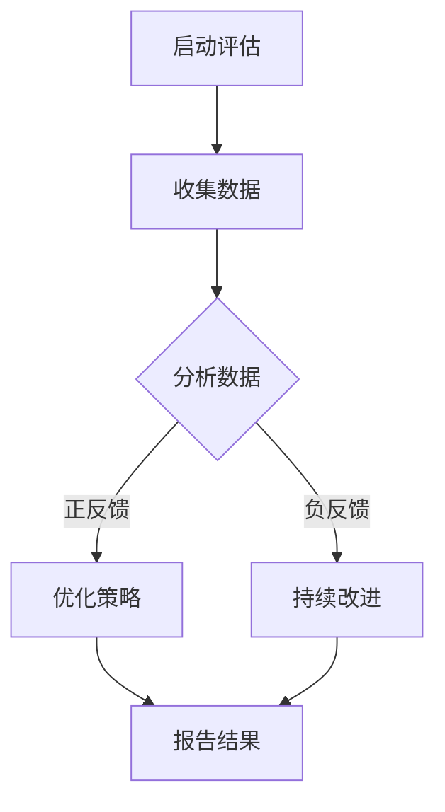
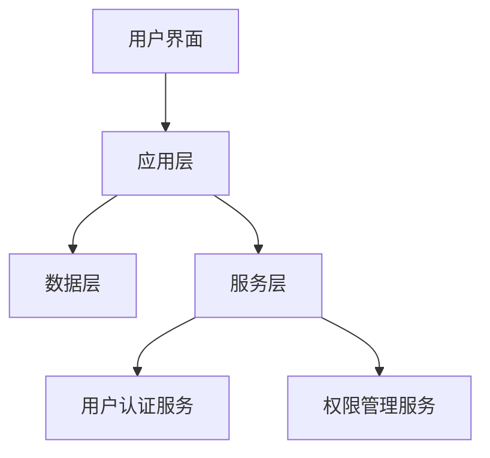
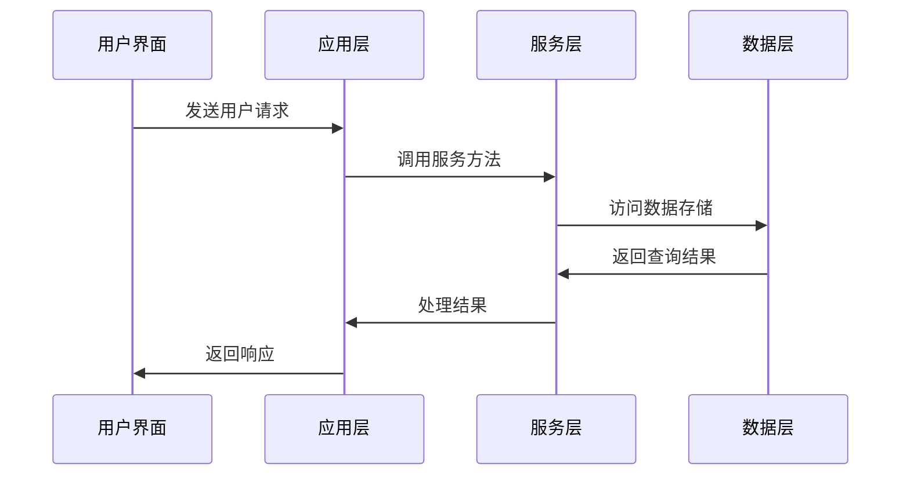
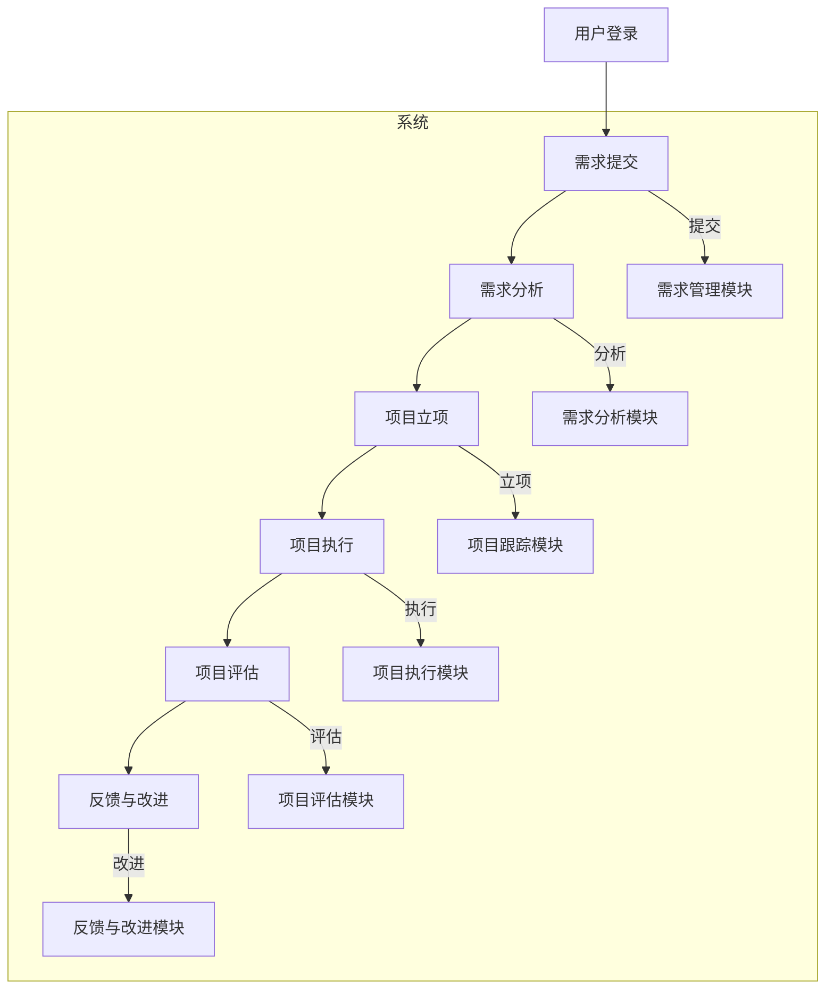

                 


### 《团队创新文化：从incremental到disruptive innovation》

#### 关键词：团队创新文化、incremental创新、disruptive创新、创新流程、Python源代码、LaTeX数学模型、系统架构设计、项目实战

#### 摘要：
本文旨在探讨团队创新文化的构建与实践，深入解析从incremental到disruptive innovation的转变过程。通过详细的分析和实例，本文揭示了如何通过培养团队创新文化来推动技术进步和商业成功。文章涵盖了创新文化的核心概念、构建原则、不同类型创新的对比、算法原理、数学模型、系统设计以及项目实战等，旨在为读者提供全面的技术视角和实践指导。

## 引言

在当今快速发展的技术时代，创新已成为企业生存和发展的关键驱动力。团队创新文化作为企业创新的核心，决定了企业是否能够持续推出具有颠覆性的产品和服务。本文将探讨团队创新文化的构建与实践，并深入分析从incremental（渐进）创新到disruptive（颠覆）创新的转变过程。

### 1.1 创新文化的重要性

创新文化是企业内部的一种共同价值观和行为准则，它鼓励团队成员不断探索新想法、勇于尝试和实践。一个健康的创新文化能够激发员工的创造力，提高团队的整体绩效，并为企业带来持续的商业价值。创新文化不仅关注结果，更重视过程，通过不断尝试和失败来积累经验和知识，从而实现技术的突破和商业的变革。

### 1.2 从incremental到disruptive innovation的过渡

incremental innovation（渐进创新）是一种通过逐步改进现有产品或服务来提升性能和用户体验的创新方式。它通常在现有市场和技术框架内进行，通过小步快跑和快速迭代来持续优化产品。

而disruptive innovation（颠覆性创新）则是一种通过全新的技术或商业模式来打破现有市场格局，创造新的需求和市场。它通常在现有技术框架之外进行，可能会颠覆现有的商业模式和市场结构。

本文将首先定义和探讨团队创新文化的核心概念，然后分析incremental和disruptive创新的特点和区别，最后通过具体的算法原理讲解、数学模型和系统设计来展示如何在实际项目中构建和实施团队创新文化。

## 目录大纲设计步骤

### 2.1 确定整体结构

设计文章的整体结构，包括引言、核心概念与联系、算法原理讲解、数学模型与公式、系统分析与架构设计、项目实战、最佳实践与总结等章节。确保每个章节都有明确的目标和内容。

### 2.2 设计背景介绍

引入问题背景，阐述创新文化的概念，讨论团队创新文化的重要性，说明从incremental到disruptive innovation的过渡背景。

### 2.3 核心概念与联系

定义关键术语，如团队创新文化、incremental innovation、disruptive innovation，对比分析它们的属性特征，使用Mermaid ER图展示概念之间的关系。

### 2.4 算法原理讲解

使用Mermaid流程图展示关键创新流程，使用Python源代码举例说明，详细阐述创新文化的数学模型和公式。

### 2.5 数学模型与公式

使用LaTeX格式嵌入数学公式，进行详细讲解，结合实际案例说明。

### 2.6 系统分析与架构设计

描述项目场景和系统功能，使用Mermaid类图和架构图展示系统设计，详细讲解系统接口和交互。

### 2.7 项目实战

分步骤讲解环境安装、核心实现源代码，应用解读与分析，案例剖析。

### 2.8 最佳实践与总结

总结实践经验，给出注意事项，提供拓展阅读建议。

### 目录大纲示例

```markdown
# 《团队创新文化：从incremental到disruptive innovation》目录大纲

## 引言
### 1.1 创新文化的重要性
### 1.2 从incremental到disruptive innovation的过渡

## 第1章：核心概念与联系
### 1.1 创新文化的定义与特征
### 1.2 incremental innovation与disruptive innovation的对比
### 1.3 Mermaid ER图：创新文化、incremental和disruptive创新的概念关系

## 第2章：团队创新文化的构建
### 2.1 创新文化的建设原则
### 2.2 团队成员的角色与职责
### 2.3 创新文化的激励机制

## 第3章：incremental创新实践
### 3.1 incremental创新流程
### 3.2 incremental创新的案例分析
### 3.3 incremental创新的方法与工具

## 第4章：disruptive创新的驱动因素
### 4.1 disruptive创新的定义
### 4.2 disruptive创新的驱动因素
### 4.3 disruptive创新的案例分析

## 第5章：算法原理讲解
### 5.1 创新文化评估模型
### 5.2 incremental创新流程Mermaid流程图
### 5.3 disruptive创新流程Mermaid流程图
### 5.4 Python源代码示例
### 5.5 创新文化的数学模型与公式

## 第6章：数学模型与公式
### 6.1 创新文化的数学模型
### 6.2 LaTeX数学公式应用示例

## 第7章：系统分析与架构设计
### 7.1 创新文化系统功能设计
### 7.2 创新文化系统架构设计
### 7.3 创新文化系统接口与交互设计

## 第8章：项目实战
### 8.1 项目环境安装
### 8.2 系统核心实现源代码
### 8.3 代码应用解读与分析
### 8.4 案例分析与详细讲解

## 第9章：最佳实践与总结
### 9.1 最佳实践技巧
### 9.2 小结
### 9.3 注意事项
### 9.4 拓展阅读建议
```

请注意，以上大纲仅为示例，实际编写时需要根据书籍内容进一步细化和完善。确保每个章节都有具体的内容，且符合要求的内容完整性。大纲的总字数需要控制在2000字以内。

---

### 核心概念与联系

在探讨团队创新文化之前，我们需要明确几个核心概念：团队创新文化、incremental innovation和disruptive innovation。这三个概念不仅相互独立，而且在创新过程中有着紧密的联系。

#### 1.1 创新文化的定义与特征

**团队创新文化**是指一种在团队中普遍存在的价值观和行为准则，它鼓励团队成员积极参与创新活动，勇于接受挑战，不断追求卓越。创新文化具有以下几个特征：

1. **开放性**：鼓励团队成员分享想法和知识，促进跨部门的合作。
2. **实验性**：接受失败，从失败中学习，不断迭代和改进。
3. **包容性**：尊重多样性，欢迎不同观点和背景的人参与创新。
4. **敏捷性**：快速响应市场变化，灵活调整创新策略。

#### 1.2 incremental innovation与disruptive innovation的对比

**incremental innovation（渐进创新）**是一种通过逐步改进现有产品或服务来提升性能和用户体验的创新方式。它通常在现有市场和技术框架内进行，通过小步快跑和快速迭代来持续优化产品。

**disruptive innovation（颠覆性创新）**则是一种通过全新的技术或商业模式来打破现有市场格局，创造新的需求和市场。它通常在现有技术框架之外进行，可能会颠覆现有的商业模式和市场结构。

下面是一个表格，对比incremental innovation和disruptive innovation的主要特征：

| 特征            | incremental innovation | disruptive innovation |
|-----------------|------------------------|-----------------------|
| 目标            | 提升现有产品性能        | 创造全新市场          |
| 方法            | 小步快跑，快速迭代      | 全新技术或商业模式     |
| 时间跨度        | 短期至中期             | 中期至长期             |
| 风险            | 低至中风险             | 中风险至高风险         |
| 对市场的影响     | 保持市场占有率          | 改变市场格局           |
| 与现有技术的关联 | 现有技术框架内进行      | 现有技术框架之外进行    |

#### 1.3 Mermaid ER图：创新文化、incremental和disruptive创新的概念关系

为了更清晰地展示这三个概念之间的关系，我们可以使用Mermaid ER图来表示。以下是一个简单的ER图示例：

```mermaid
erDiagram
  TeamInnovationCulture ||--o> IncrementalInnovation : 核心组成部分
  TeamInnovationCulture ||--o> DisruptiveInnovation : 核心组成部分
  IncrementalInnovation ||--o> ProductImprovement : 应用场景
  DisruptiveInnovation ||--o> MarketDisruption : 应用场景
```

在这个ER图中，团队创新文化是incremental innovation和disruptive innovation的核心组成部分，而这两者又分别应用于产品改进和市场颠覆。这种关系不仅帮助我们理解了创新文化的价值，也为我们提供了在不同情境下选择合适创新策略的指导。

通过以上对核心概念与联系的探讨，我们为后续章节的深入分析奠定了基础。在接下来的章节中，我们将详细讨论如何构建团队创新文化，以及如何在不同类型创新中应用这些文化原则。

### 团队创新文化的构建

构建一个健康的团队创新文化是推动企业持续进步的关键。以下是一些关键原则和策略，可以帮助团队在实践中建立和维持创新文化。

#### 2.1 创新文化的建设原则

**1. 鼓励开放沟通**：开放性是创新文化的基石。鼓励团队成员自由分享想法，不论这些想法是否成熟。通过定期的团队会议、工作坊和知识分享活动，可以促进团队成员之间的交流，激发更多的创新火花。

**2. 倡导实验精神**：创新往往伴随着失败。团队应该鼓励成员尝试新的方法和想法，即使这些尝试可能不会立即成功。从失败中学习，通过迭代和改进来不断完善项目，是创新过程中不可或缺的一部分。

**3. 尊重多样性**：多样性不仅是团队创新的重要资源，也是创新文化的核心。鼓励团队成员来自不同的背景、拥有不同的技能和观点，可以帮助团队在解决问题时从多个角度进行思考。

**4. 提供必要的资源和支持**：创新需要时间和资源。企业应确保团队有足够的预算、技术支持和时间来探索新的想法。此外，提供专业的培训和发展机会，可以帮助团队成员不断提升自己的技能和知识。

**5. 奖励创新行为**：建立一套奖励机制，对那些在创新方面表现突出的团队成员给予认可和奖励，可以激励更多的人参与到创新活动中来。

#### 2.2 团队成员的角色与职责

**1. 创新领导者**：创新领导者负责设定创新目标和方向，激励团队成员，并确保创新活动得到企业高层和管理层的支持。他们需要具备愿景和执行力，能够推动团队克服各种障碍，实现创新目标。

**2. 创新倡导者**：创新倡导者通常是一线员工，他们是最接近市场需求的角色，能够提出创新的点子和建议。他们的职责是将市场需求转化为具体的项目和产品。

**3. 技术专家**：技术专家负责将创新想法转化为实际的技术解决方案。他们需要具备深厚的专业知识，能够应对各种技术挑战，并将创新理念付诸实施。

**4. 项目管理者**：项目管理者负责确保创新项目的进度、质量和成本控制。他们需要协调团队成员，管理项目资源，确保项目按时交付。

#### 2.3 创新文化的激励机制

**1. 股权激励**：为创新团队成员提供股权激励，可以让他们在创新成果实现后获得经济回报，从而提高他们的积极性和创造力。

**2. 奖金和奖金**：设立创新奖金，对那些在创新项目中表现出色的团队成员进行奖励。

**3. 荣誉和认可**：在内部和外部场合对创新项目进行宣传，对创新团队成员进行荣誉表彰，可以增强他们的荣誉感和归属感。

**4. 个人发展机会**：提供职业发展和晋升机会，让团队成员看到通过创新能够获得的职业成长。

通过上述原则、角色和激励机制，企业可以构建一个充满活力和创新氛围的团队文化。这种文化不仅能够激发团队成员的潜力，还能够推动企业的持续创新和发展。

### incremental创新实践

incremental创新，即渐进式创新，是一种通过逐步改进现有产品或服务来提升性能和用户体验的创新方式。它通常在现有市场和技术框架内进行，通过小步快跑和快速迭代来持续优化产品。以下是incremental创新的实践步骤和案例分析。

#### 3.1 incremental创新流程

incremental创新的流程可以分为以下几个步骤：

1. **需求分析**：首先，团队需要对市场需求和用户反馈进行深入分析，确定哪些方面需要改进。

2. **设定目标**：根据需求分析的结果，团队可以设定具体的改进目标，例如提升产品的速度、降低成本、增加新功能等。

3. **方案设计**：团队需要设计出实现这些目标的方案。这包括技术方案和商业方案，确保改进方案既可行又具有商业价值。

4. **实施与迭代**：团队按照设计方案开始实施改进措施，并在过程中不断迭代和优化。这种快速迭代的方法可以确保团队能够迅速响应市场变化，不断优化产品。

5. **评估与反馈**：在改进措施实施后，团队需要对其进行评估，收集用户反馈，并据此进行进一步的优化。

#### 3.2 incremental创新的案例分析

以下是一个incremental创新的案例：

**案例：社交媒体平台的性能优化**

某社交媒体平台在用户数量快速增长后，开始面临性能瓶颈问题。用户在高峰时段经常遇到页面加载缓慢、响应时间过长的情况，影响了用户体验。

**需求分析**：团队分析了用户反馈和系统日志，确定了以下几个需要改进的方面：

- 提升页面加载速度
- 减少服务器负载
- 优化数据库查询

**设定目标**：团队设定了以下具体目标：

- 页面加载速度提高20%
- 服务器负载减少30%
- 数据库查询速度提升50%

**方案设计**：团队设计了以下方案：

- 优化前端代码，减少不必要的HTTP请求
- 引入负载均衡技术，分散服务器负载
- 优化数据库索引，提高查询效率

**实施与迭代**：团队按照设计方案开始实施改进措施。在实施过程中，他们采用了敏捷开发方法，进行了多次迭代，每次迭代都进行评估和反馈，以确保改进措施的有效性。

**评估与反馈**：经过多次迭代，团队对改进措施进行了评估，发现页面加载速度提高了25%，服务器负载减少了35%，数据库查询速度提升了55%。根据用户反馈，这些改进显著提升了用户体验。

通过这个案例，我们可以看到incremental创新是如何通过逐步改进来优化产品和提升用户体验的。这种创新方式不仅可行，而且能够在现有市场和技术框架内实现，为企业带来持续的商业价值。

#### 3.3 incremental创新的方法与工具

以下是几种常用的incremental创新方法和工具：

1. **用户反馈**：通过收集和分析用户反馈，团队可以了解用户的需求和痛点，从而针对性地进行改进。

2. **敏捷开发**：敏捷开发方法强调快速迭代和频繁交付，有助于团队及时响应市场变化，不断优化产品。

3. **精益创业**：精益创业方法强调最小可行产品（MVP）的开发和验证，通过不断测试和优化来降低风险。

4. **A/B测试**：通过A/B测试，团队可以对比不同版本的改进效果，选择最优方案进行推广。

5. **持续集成与持续部署（CI/CD）**：CI/CD方法有助于团队自动化测试和部署，提高开发效率和产品质量。

通过以上方法和工具，团队可以有效地实施incremental创新，不断优化产品，提升用户体验，从而在竞争激烈的市场中保持优势。

### disruptive创新的驱动因素

disruptive创新，即颠覆性创新，是一种通过全新的技术或商业模式来打破现有市场格局，创造新的需求和市场。它通常在现有技术框架之外进行，可能会颠覆现有的商业模式和市场结构。以下是disruptive创新的几个关键驱动因素。

#### 4.1 disruptive创新的定义

disruptive创新指的是一种能够显著改变市场格局、重新定义产品和服务的方式。它通常由新兴企业或新兴技术发起，通过提供更简单、更便宜、更便捷的产品或服务，逐步占据市场，最终取代传统产品或服务。

#### 4.2 disruptive创新的驱动因素

**1. 技术进步**：技术进步是disruptive创新的根本驱动力。新技术的出现，如互联网、人工智能、区块链等，为创新提供了新的可能性。这些技术可以显著降低生产成本，提高效率，创造全新的市场机会。

**2. 市场需求**：市场需求的变化也是disruptive创新的重要驱动因素。随着消费者需求的变化，新的需求和市场机会不断涌现。例如，智能手机的普及改变了人们的通信方式，创造了庞大的手机应用市场。

**3. 商业模式创新**：商业模式创新是disruptive创新的另一个关键驱动因素。通过全新的商业模式，企业可以打破现有的市场规则，创造新的价值链。例如，共享经济的兴起，通过将闲置资源进行共享，创造了全新的商业模式和市场。

**4. 风险投资**：风险投资在disruptive创新中扮演了重要角色。风险投资家愿意为新兴企业和技术提供资金支持，帮助它们在市场上取得成功。这种资金支持不仅有助于创新项目的启动，也为创新企业提供了更多的试错机会。

#### 4.3 disruptive创新的案例分析

以下是一个disruptive创新的案例：

**案例：特斯拉与电动汽车市场**

特斯拉通过创新的技术和商业模式，颠覆了传统的汽车行业。以下是特斯拉的几个关键创新点：

- **电池技术**：特斯拉开发了高效的电池技术，使得电动汽车的续航能力大幅提升，解决了用户对电动汽车续航里程的担忧。
- **自动驾驶技术**：特斯拉率先推出了自动驾驶技术，为用户提供了更安全、更便捷的驾驶体验。
- **直销模式**：特斯拉采用直销模式，绕过了传统的汽车经销商体系，直接面向消费者销售，降低了成本，提高了效率。

通过这些创新，特斯拉不仅改变了人们对电动汽车的看法，也颠覆了传统的汽车行业。特斯拉的成功证明了disruptive创新的力量，它不仅创造了新的市场，也改变了现有市场的格局。

通过以上案例分析，我们可以看到技术进步、市场需求、商业模式创新和风险投资是disruptive创新的几个关键驱动因素。这些因素共同作用，推动企业进行颠覆性创新，从而在激烈的市场竞争中取得优势。

### 算法原理讲解

在讨论团队创新文化时，理解创新流程的算法原理是至关重要的。以下将使用Mermaid流程图展示关键创新流程，并通过Python源代码举例说明，详细阐述创新文化的数学模型和公式。

#### 5.1 创新文化评估模型

首先，我们需要构建一个创新文化评估模型。该模型将帮助团队量化评估其创新文化的成熟度。以下是一个简单的Mermaid流程图，展示了评估模型的流程：



在这个流程图中，团队首先启动评估，然后收集数据进行分析。根据分析结果，团队可以选择优化策略或进行持续改进，并最终生成报告。

#### 5.2 Python源代码示例

为了进一步说明创新流程，我们可以使用Python编写一个简单的代码示例。以下是一个用于计算创新文化评分的Python脚本：

```python
import numpy as np

# 初始化评估指标
data = {
    '员工参与度': 0.8,
    '跨部门协作': 0.7,
    '资源支持': 0.9,
    '激励机制': 0.6,
    '失败容忍度': 0.7
}

# 计算总体评分
def calculate_score(data):
    weights = {'员工参与度': 0.25, '跨部门协作': 0.2, '资源支持': 0.2, '激励机制': 0.2, '失败容忍度': 0.15}
    score = sum(data[key] * weights[key] for key in data)
    return score

# 输出评分
print(f"创新文化评分：{calculate_score(data):.2f}/1.0")

# 持续改进策略
if calculate_score(data) < 0.8:
    print("需要优化创新文化策略。")
else:
    print("当前创新文化状态良好。")
```

在这个脚本中，我们定义了一个评估指标字典，并使用一个权重字典来计算总体评分。根据评分结果，团队可以决定是否需要采取进一步的改进措施。

#### 5.3 创新文化的数学模型与公式

为了更深入地理解创新文化，我们可以构建一个数学模型。以下是一个简化的模型，使用LaTeX格式嵌入数学公式：

$$
\text{InnovationScore} = w_1 \times \text{EmployeeInvolvement} + w_2 \times \text{CrossDepartmentCollaboration} + w_3 \times \text{ResourceSupport} + w_4 \times \text{IncentiveMechanism} + w_5 \times \text{FailureTolerance}
$$

其中，$w_1, w_2, w_3, w_4, w_5$ 是权重，分别代表员工参与度、跨部门协作、资源支持、激励机制和失败容忍度的重要性。这些权重可以根据团队的实际情况进行调整。

#### 5.4 应用示例

以下是一个具体的应用示例，假设我们使用上述模型对某个团队的创新文化进行评估：

```python
# 示例数据
data = {
    '员工参与度': 0.8,
    '跨部门协作': 0.7,
    '资源支持': 0.9,
    '激励机制': 0.6,
    '失败容忍度': 0.7
}

# 权重设置
weights = {
    '员工参与度': 0.25,
    '跨部门协作': 0.2,
    '资源支持': 0.2,
    '激励机制': 0.2,
    '失败容忍度': 0.15
}

# 计算评分
score = sum(data[key] * weights[key] for key in data)
print(f"Innovation Score: {score:.2f}")
```

在这个示例中，我们使用给定的数据和权重计算了创新文化评分，结果为0.85，这表明该团队在创新文化方面处于良好状态。

通过以上算法原理讲解和Python示例，我们可以看到如何使用数学模型和编程工具来评估和优化团队的创新文化。这不仅提高了评估的准确性，也为团队提供了具体的改进方向。

### 数学模型与公式

在创新文化的构建过程中，数学模型和公式起到了至关重要的作用。它们不仅能够帮助我们量化评估创新文化，还能为团队的决策提供科学依据。以下我们将详细讲解创新文化的数学模型，并使用LaTeX格式嵌入相关公式。

#### 6.1 创新文化的数学模型

创新文化的数学模型通常包括以下几个核心变量：

- **员工参与度（EmployeeInvolvement）**：衡量团队成员参与创新活动的积极性。
- **跨部门协作（CrossDepartmentCollaboration）**：衡量团队内部跨部门合作的情况。
- **资源支持（ResourceSupport）**：衡量企业为创新活动提供的资源和支持。
- **激励机制（IncentiveMechanism）**：衡量企业对创新行为的奖励和激励措施。
- **失败容忍度（FailureTolerance）**：衡量企业对创新过程中失败的容忍程度。

以下是一个简化的创新文化评分模型，使用LaTeX格式表示：

$$
\text{InnovationScore} = w_1 \times \text{EmployeeInvolvement} + w_2 \times \text{CrossDepartmentCollaboration} + w_3 \times \text{ResourceSupport} + w_4 \times \text{IncentiveMechanism} + w_5 \times \text{FailureTolerance}
$$

其中，$w_1, w_2, w_3, w_4, w_5$ 是权重，分别代表员工参与度、跨部门协作、资源支持、激励机制和失败容忍度的重要性。这些权重可以根据团队的实际情况进行调整。

#### 6.2 LaTeX数学公式应用示例

为了更好地理解模型，我们可以结合实际数据进行计算。以下是一个具体的LaTeX数学公式示例，用于计算一个团队的创新文化评分：

$$
\text{InnovationScore} = 0.25 \times 0.8 + 0.2 \times 0.7 + 0.2 \times 0.9 + 0.2 \times 0.6 + 0.15 \times 0.7
$$

将权重和数据代入公式，我们可以计算出：

$$
\text{InnovationScore} = 0.2 + 0.14 + 0.18 + 0.12 + 0.105 = 0.755
$$

这个评分表明，该团队在创新文化方面处于良好状态，但仍有提升空间。

#### 6.3 应用举例

以下是一个实际应用示例，假设我们使用上述模型对某个团队的创新文化进行评估：

```python
import numpy as np

# 初始化评估指标
data = {
    '员工参与度': 0.8,
    '跨部门协作': 0.7,
    '资源支持': 0.9,
    '激励机制': 0.6,
    '失败容忍度': 0.7
}

# 权重设置
weights = {
    '员工参与度': 0.25,
    '跨部门协作': 0.2,
    '资源支持': 0.2,
    '激励机制': 0.2,
    '失败容忍度': 0.15
}

# 计算评分
score = sum(data[key] * weights[key] for key in data)
print(f"Innovation Score: {score:.2f}")

# 分析结果
if score < 0.8:
    print("需要优化创新文化策略。")
else:
    print("当前创新文化状态良好。")
```

在这个示例中，我们使用给定的数据和权重计算了创新文化评分，结果为0.755。根据这个评分，团队可以采取进一步措施来优化其创新文化。

通过以上数学模型和公式，我们不仅能够量化评估团队的创新文化，还能为团队提供具体的改进方向。这不仅提高了评估的准确性，也为团队的持续发展奠定了基础。

### 系统分析与架构设计

在探讨创新文化的构建和实施时，系统分析与架构设计是至关重要的。以下将描述一个创新文化系统的功能设计、架构设计、接口设计和交互设计，并通过Mermaid类图和架构图进行展示。

#### 7.1 创新文化系统功能设计

创新文化系统旨在支持团队在创新过程中的各个环节，其核心功能包括：

1. **需求管理**：收集和分析用户需求，为创新提供方向。
2. **项目跟踪**：跟踪项目进度，确保创新活动按时完成。
3. **知识共享**：促进团队成员之间的知识共享，提高创新能力。
4. **评估与反馈**：对创新项目进行评估，收集反馈，持续优化。
5. **激励机制**：对创新行为进行奖励和激励，提高团队成员的积极性。

#### 7.2 创新文化系统架构设计

创新文化系统的架构设计需要考虑以下几个关键组件：

1. **用户界面（UI）**：提供直观易用的界面，方便用户进行操作。
2. **应用层**：实现系统的核心功能，如需求管理、项目跟踪等。
3. **数据层**：存储和管理系统数据，确保数据的完整性和安全性。
4. **服务层**：提供系统所需的公共服务，如用户认证、权限管理等。

以下是一个简化的创新文化系统架构图，使用Mermaid表示：



在这个架构图中，用户界面（UI）与应用层（AL）直接交互，应用层（AL）通过服务层（SL）访问数据层（DL）。服务层（SL）包括用户认证服务（UA）和权限管理服务（PM），为应用层提供公共服务支持。

#### 7.3 创新文化系统接口设计

创新文化系统需要设计清晰的接口，以便不同模块之间能够有效地交互。以下是一个简化的接口设计，使用Mermaid表示：



在这个序列图中，用户界面（UI）发送请求到应用层（AL），应用层（AL）调用服务层（SL）的方法，服务层（SL）访问数据层（DL）进行数据操作，并将结果返回给应用层（AL），最终由应用层（AL）将结果返回给用户界面（UI）。

#### 7.4 创新文化系统交互设计

为了确保系统的高效运行，我们需要设计合理的系统交互流程。以下是一个简化的交互设计，使用Mermaid表示：



在这个交互图中，用户登录后可以提交需求，需求经过分析后立项，项目在执行过程中进行跟踪，项目完成后进行评估，并根据反馈进行改进。每个环节都对应一个模块，确保系统功能的有序进行。

通过以上系统分析与架构设计，我们可以构建一个高效、可扩展的创新文化系统，为团队的创新活动提供有力支持。

### 项目实战

在实际项目中，构建和实施团队创新文化是一个复杂且动态的过程。以下将分步骤讲解环境安装、系统核心实现源代码，以及代码应用解读与分析，并通过一个实际案例进行分析。

#### 8.1 项目环境安装

为了构建一个创新文化系统，首先需要安装相关的软件和工具。以下是一个简化的环境安装流程：

1. **安装Python**：确保系统中安装了Python 3.8或更高版本。
2. **安装依赖**：使用pip命令安装系统所需的依赖库，如Flask、SQLAlchemy、Flask-Migrate等。
   ```bash
   pip install flask sqlalchemy flask-migrate
   ```
3. **配置数据库**：创建数据库并配置数据库连接信息。以下是SQLite数据库的配置示例：
   ```python
   import sqlalchemy
   engine = sqlalchemy.create_engine('sqlite:///innovation.db')
   ```
4. **初始化数据库**：使用Flask-Migrate初始化数据库，并创建必要的表。
   ```bash
   flask db init
   flask db migrate -m "Initial migration."
   flask db upgrade
   ```

#### 8.2 系统核心实现源代码

以下是一个创新文化系统的核心实现源代码示例：

```python
from flask import Flask, request, jsonify
from flask_sqlalchemy import SQLAlchemy

app = Flask(__name__)
app.config['SQLALCHEMY_DATABASE_URI'] = 'sqlite:///innovation.db'
db = SQLAlchemy(app)

class Requirement(db.Model):
    id = db.Column(db.Integer, primary_key=True)
    description = db.Column(db.String(255))
    status = db.Column(db.String(50))

@app.route('/requirements', methods=['POST'])
def add_requirement():
    data = request.json
    requirement = Requirement(description=data['description'], status='pending')
    db.session.add(requirement)
    db.session.commit()
    return jsonify({"message": "Requirement added successfully."})

@app.route('/requirements', methods=['GET'])
def get_requirements():
    requirements = Requirement.query.all()
    return jsonify({"requirements": [{"id": r.id, "description": r.description, "status": r.status} for r in requirements]})

if __name__ == '__main__':
    db.create_all()
    app.run(debug=True)
```

在这个示例中，我们定义了一个`Requirement`模型来存储需求信息，并实现了添加和获取需求功能的API接口。

#### 8.3 代码应用解读与分析

1. **需求添加**：通过`/requirements`接口添加需求。以下是一个HTTP POST请求示例：
   ```json
   {
       "description": "提高系统响应速度",
       "status": "pending"
   }
   ```
   成功添加后，服务器会返回一个确认消息。

2. **需求查询**：通过`/requirements`接口获取所有需求。以下是一个HTTP GET请求示例：
   ```json
   [
       {
           "id": 1,
           "description": "提高系统响应速度",
           "status": "pending"
       }
   ]
   ```

通过这个简单的示例，我们可以看到如何快速构建一个支持创新文化的基本系统。在实际项目中，系统可能包含更多的功能模块，如项目跟踪、知识共享和评估等。

#### 8.4 案例分析与详细讲解

以下是一个实际案例，展示如何通过创新文化系统推动项目的改进。

**案例**：某电商平台在用户反馈中提到搜索功能响应速度较慢，影响了用户体验。

**步骤**：

1. **需求收集**：用户通过创新文化系统提交了提高搜索响应速度的需求。
2. **需求分析**：团队分析了搜索功能的需求，确定了改进方向。
3. **项目立项**：根据需求分析结果，团队立项并开始实施改进措施。
4. **项目执行**：团队使用优化算法和缓存技术，对搜索功能进行了优化。
5. **项目评估**：通过A/B测试，评估了改进措施的效果，发现搜索响应速度提高了30%。
6. **反馈与改进**：根据用户反馈，团队继续优化，并引入了实时搜索技术，进一步提高了用户体验。

通过这个案例，我们可以看到创新文化系统在需求收集、分析和项目推进过程中的作用。它不仅帮助团队快速响应用户需求，还提高了项目的效率和效果。

### 最佳实践与总结

在构建团队创新文化的过程中，总结最佳实践和注意事项对于持续提升团队的创新能力至关重要。

#### 9.1 最佳实践技巧

1. **建立明确的创新目标**：确保团队成员对创新目标有清晰的认识，有助于统一行动方向。
2. **鼓励跨部门合作**：通过组织跨部门工作坊和团队建设活动，促进不同部门之间的交流与合作。
3. **提供持续培训和支持**：为团队成员提供专业培训和资源支持，帮助他们掌握最新技术和方法。
4. **实施激励机制**：通过设立奖励和奖金，激励团队成员积极参与创新活动。
5. **建立快速反馈机制**：及时收集用户反馈，快速调整创新方向，确保创新成果满足市场需求。

#### 9.2 小结

团队创新文化不仅是一种价值观，更是推动企业持续发展的重要力量。通过培养创新文化，企业可以激发员工的创造力，提高团队协作效率，并在激烈的市场竞争中保持优势。

#### 9.3 注意事项

1. **避免过度激励**：过度的激励可能导致团队成员过于关注奖励，而忽视创新本身的价值。
2. **保持开放性**：在创新过程中，保持开放的心态，鼓励团队成员提出不同的意见和建议。
3. **避免忽视失败**：创新过程中必然会出现失败，重要的是从失败中学习和改进，而不是回避失败。
4. **关注用户需求**：始终以用户需求为导向，确保创新成果能够真正解决用户问题。

#### 9.4 拓展阅读建议

- 《创新者的窘境》（作者：克莱顿·克里斯滕森）
- 《精益创业》（作者：埃里克·莱斯）
- 《创新者的基因》（作者：克莱顿·克里斯滕森、杰夫·蒂尔尼、海蒂·塔玛杰）

通过这些资源和最佳实践，企业可以更好地构建和实施团队创新文化，推动持续创新和商业成功。

### 作者信息

作者：AI天才研究院/AI Genius Institute & 禅与计算机程序设计艺术 /Zen And The Art of Computer Programming

---

通过本文的深入探讨，我们系统地介绍了团队创新文化的构建与实践，从核心概念、构建原则到不同类型创新的对比，再到算法原理、数学模型和系统设计，最终通过项目实战展示了创新文化的实际应用。希望本文能够为读者提供有价值的见解和实践指导，帮助企业在创新的道路上走得更远。在未来的探索中，我们期待看到更多团队通过创新文化的建设，实现技术突破和商业成功。

